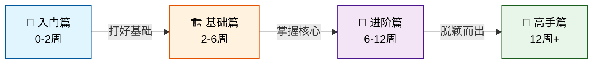

# 🚀 欢迎来到 ASP.NET Web 开发知识库！

> **面向跨行业零基础新人** | **从入门到高手的完整学习路径** | **实战驱动，循序渐进**

---

## 📖 关于这个知识库

这是一个专门为零基础转行者打造的 **ASP.NET Web 开发学习系统**。无论你来自什么行业（销售、会计、设计、运营...），只要你愿意学习，这里都能帮你：

✅ **2周内** 搭建好开发环境，运行第一个 Web 应用  
✅ **6周内** 掌握核心技能，独立开发 CRUD 应用  
✅ **12周内** 构建企业级项目，具备就业能力  
✅ **24周+** 成为技术高手，理解架构设计  

### 🎯 适用人群

- ✨ **完全零基础的编程新手**
- 🔄 **想转行做开发的职场人**
- 🎓 **计算机专业的在校生**
- 💼 **想提升技术深度的初级开发者
- 🌏 **任何对 Web 开发感兴趣的人**

### 💡 学习理念

```
📚 理论讲解 → 💻 动手实践 → 🐛 踩坑排错 → 🔄 巩固复习 → 🚀 进阶挑战
```

我们不只教语法，更教你**如何思考**、**如何解决问题**、**如何像工程师一样工作**。

---

## 🗺️ 学习路径总览



### 📍 你在哪里？

<details>
<summary>🔍 点击查看各阶段详情</summary>

#### 🚪 阶段一：入门篇（新手村）
**时间**：第 1-2 周  
**目标**：环境搭建 + Hello World  
**产出**：能运行的第一个 Web 应用  
**难度**：⭐️ 极简  
👉 [[01-入门篇/README|进入学习 →]]

---

#### 🏗️ 阶段二：基础篇（打地基）
**时间**：第 3-6 周  
**目标**：MVC + EF Core + DI  
**产出**：完整的 Todo 应用  
**难度**：⭐️⭐️ 基础  
👉 [[02-基础篇/README|进入学习 →]]

---

#### 🚀 阶段三：进阶篇（脱颖而出）
**时间**：第 7-12 周  
**目标**：API + 认证 + 测试  
**产出**：博客系统（带用户认证）  
**难度**：⭐️⭐️⭐️ 中等  
👉 [[03-进阶篇/README|进入学习 →]]

---

#### 🎯 阶段四：高手篇（登峰造极）
**时间**：第 13 周以后  
**目标**：微服务 + 性能优化 + 架构  
**产出**：电商商城（微服务架构）  
**难度**：⭐️⭐️⭐️⭐️ 高级  
👉 [[04-高手篇/README|进入学习 →]]

</details>

---

## 🎮 今日推荐学习

### 🆕 新手从这里开始

如果你是第一次打开这个知识库，建议按以下顺序学习：

#### Step 1: 准备武器 🔧
[[01-入门篇/01-环境搭建/Windows环境准备|Windows 环境准备]] → 
[[01-入门篇/01-环境搭建/安装.NET-SDK|安装 .NET SDK]] → 
[[01-入门篇/01-环境搭建/VSCode安装与配置|VSCode 安装配置]]

#### Step 2: 学点 C# 基础 📝
[[01-入门篇/02-C#极速入门/变量与数据类型|变量与数据类型]] → 
[[01-入门篇/02-C#极速入门/控制流语句|控制流语句]] → 
[[01-入门篇/02-C#极速入门/面向对象基础|面向对象基础]]

#### Step 3: 创建第一个应用 🎉
[[01-入门篇/03-第一个应用/创建项目|创建项目]] → 
[[01-入门篇/03-第一个应用/Hello-World实战|Hello World 实战]]

> 💡 **提示**：每篇文章都配有练习题，一定要动手敲代码！光看不练假把式~

---

## ⚡ 快速导航

### 📂 按阶段浏览

| 阶段 | 内容概览 | 笔记数 | 预计时长 |
|------|---------|--------|---------|
| [[01-入门篇/README\|🚪 入门篇]] | 环境搭建、C#基础、Hello World、学习资源 | **16篇** | 2周 |
| [[02-基础篇/README\|🏗️ 基础篇]] | MVC、EF Core、DI、中间件、配置、日志、Todo实战 | **25篇** | 4周 |
| [[03-进阶篇/README\|🚀 进阶篇]] | REST API、JWT认证、EF Core高级、前端集成、测试、博客系统 | **38篇** | 6周 |
| [[04-高手篇/README\|🎯 高手篇]] | 设计模式(9)、微服务(10)、性能优化(8)、安全加固(6)、云原生(8)、Clean Arch(5)、电商商城(10) | **56篇** | 12周+ |

### 📦 补充资源

| 类别 | 内容 | 数量 |
|------|------|------|
| [[05-工具与资源/01-VSCode技巧/01-VSCode快捷键大全\|🛠️ 开发工具]] | VSCode技巧(4) + .NET CLI命令(4) + Git工作流(4) + 学习资源(8) | **20篇** |
| [[07-代码示例/hello-world/README\|💻 代码示例]] | Hello World / Todo App / 博客系统 / CloudMall电商 | **4个项目** |
| [[06-术语表/01-A-G术语表\|📖 术语表]] | A-G / H-N / O-T / U-Z 全部术语（共312个） | **4文件** |
| [[08-常见问题/01-环境搭建问题\|❓ 常见问题]] | 环境/编译/运行时/数据库/部署/前端/性能/安全/Docker/测试/架构/学习答疑 | **12篇** |

> 📊 **知识库总计：~170+ 篇文章 + 312个术语 + 4个实战项目 + 5个模板**

### 🛠️ 按工具查找

| 工具 | 相关内容 |
|------|---------|
| [[05-工具与资源/01-VSCode技巧/01-VSCode快捷键大全\|VSCode 技巧]] | 200+快捷键、调试技巧、50+扩展推荐、工作区配置 |
| [[05-工具与资源/02-.NET-CLI命令/01-.NET-CLI常用命令\|.NET CLI 命令]] | 常用命令、50+模板、EF工具、性能工具 |
| [[05-工具与资源/03-Git工作流/01-Git基础命令速查\|Git 工作流]] | 基础命令、3种分支策略、GitHub操作、高级技巧 |
| [[05-工具与资源/04-学习资源汇总/01-官方文档导航\|学习资源]] | 官方文档、20+书籍、50+课程、30+博主、职业建议 |

### 📚 按主题搜索

| 主题领域 | 核心内容 |
|---------|---------|
| #MVC | Model-View-Controller 架构模式 |
| #EFCore | Entity Framework Core ORM |
| #API | RESTful API 开发 |
| #安全 | 认证、授权、安全防护 |
| #部署 | Docker、Azure、CI/CD |
| #测试 | 单元测试、集成测试、TDD |

---

## 🎯 实战项目展示

本知识库包含 **4 个完整的实战项目**，由浅入深，每个都能直接运行：

### 项目 1: Hello World 🌱
**位置**：[[07-代码示例/hello-world/README\|查看详情]]
**难度**：⭐️
**学习点**：项目结构、运行流程、Razor视图、Layout系统
**适合阶段**：入门篇完成后

---

### 项目 2: Todo 待办事项应用 ✅
**位置**：[[07-代码示例/todo-app/README\|查看详情]]
**难度**：⭐️⭐️
**功能**：增删改查、分页、搜索、表单验证、单元测试
**学习点**：MVC、EF Core、DI、CRUD完整流程
**适合阶段**：基础篇完成后

---

### 项目 3: 博客系统 📝
**位置**：[[07-代码示例/blog-system/README\|查看详情]]
**难度**：⭐️⭐️⭐️
**功能**：JWT认证、富文本文章、嵌套评论、标签分类、图片上传、全文搜索
**学习点**：RESTful API、EF Core高级、前端集成、部署
**适合阶段**：进阶篇完成后

---

### 项目 4: CloudMall 电商商城 🛒
**位置**：[[07-代码示例/ecommerce-mall/README\|查看详情]]
**难度**：⭐️⭐️⭐️⭐️
**功能**：8个微服务、Saga分布式事务、RabbitMQ消息队列、Docker Compose一键部署
**学习点**：微服务架构、DDD、CQRS、云原生部署
**适合阶段**：高手篇完成后

> 🎁 **所有项目都是开箱即用的！** 包含完整的 README 说明、数据库脚本、测试用例。

---

## 📊 学习进度追踪

### 📈 整体进度

```
✅ 入门篇:  ██████████████████████ 100% (16/16篇)
✅ 基础篇:  ██████████████████████ 100% (25/25篇)
✅ 进阶篇:  ██████████████████████ 100% (38/38篇)
✅ 高手篇:  ██████████████████████ 100% (56/56篇)
✅ 补充内容:██████████████████████ 100% (~48篇+4README)
────────────────────────────────────
🎉 知识库构建完成！共 ~170+ 篇文章
```

### ✅ 最近完成的笔记

<!-- 这里可以使用 Dataview 插件自动统计 -->
1. ~~[[某篇笔记]]~~ - 完成于 2026-XX-XX
2. ~~[[某篇笔记]]~~ - 完成于 2026-XX-XX
3. ~~[[某篇笔记]]~~ - 完成于 2026-XX-XX

### 📝 待复习知识点

- [ ] [[概念A]] - 上次复习：3天前
- [ ] [[概念B]] - 上次复习：1周前
- [ ] [[概念C]] - 上次复习：2周前

---

## 💡 学习建议

### 🕐 每日学习计划（推荐）

**新手起步期（前2周）**：
- ⏰ **每天 1-2 小时**
- 📖 看教程：30分钟
- 💻 写代码：45分钟
- 📝 做笔记/总结：15分钟
- ❓ 解决问题：30分钟（遇到问题时）

**进阶加速期（2周后）**：
- ⏰ **每天 2-3 小时**
- 🎯 以实战项目为主
- 📚 遇到不懂的概念再回头看教程

### 🎯 学习方法

1. **费曼学习法**：学完一个概念后，尝试用通俗语言讲给别人听
2. **刻意练习**：不要只是照抄代码，要理解每一行的作用
3. **建立联系**：新学的知识和之前的知识建立关联
4. **定期回顾**：使用间隔重复法复习旧知识
5. **做中学**：通过做项目来巩固理论

### ⚠️ 新手常见误区

❌ **只看不动手** → 必须亲自敲每一行代码！  
❌ **遇到错误就放弃** → 错误是最好的学习机会！  
❌ **追求完美** → 先跑通，再优化！  
❌ **孤立学习** → 加入社区，多交流！  
❌ **跳跃式学习** → 循序渐进，打好基础！

---

## 📞 获取帮助

### 🆘 遇到问题怎么办？

1. **先看 FAQ**：[[08-常见问题/01-环境搭建问题|环境搭建]] | [[08-常见问题/02-编译与构建错误|编译错误]] | [[08-常见问题/03-运行时错误|运行时错误]] | [[08-常见问题/12-学习路线答疑|学习答疑]]
2. **搜索知识库**：使用 Obsidian 的搜索功能（`Ctrl+O`）
3. **查看术语表**：[[06-术语表/01-A-G术语表|A-G]] | [[06-术语表/02-H-N术语表|H-N]] | [[06-术语表/03-O-T术语表|O-T]] | [[06-术语表/04-U-Z术语表|U-Z]]
4. **外部求助**：
   - 微软官方文档：[docs.microsoft.com](https://docs.microsoft.com/aspnet/core)
   - Stack Overflow：[stackoverflow.com](https://stackoverflow.com/questions/tagged/asp.net-core)
   - GitHub Discussions：社区讨论区

### 🤝 加入学习社区

- 💬 Discord 群组：（待补充链接）
- 📱 微信群：（待补充二维码）
- 🌐 论坛：（待补充链接）

---

## 📦 知识库特色功能

### 🔗 双向链接系统

本知识库大量使用了 Obsidian 的双向链接功能 `[[链接]]`，你可以：
- 点击任意链接跳转到相关内容
- 查看「反向链接」了解哪些地方引用了当前笔记
- 使用「本地图谱」可视化知识网络

### 🏷️ 标签体系

通过标签快速定位内容：
- **阶段标签**：`#入门` `#基础` `#进阶` `#高手`
- **主题标签**：`#MVC` `#EFCore` `#API` `#安全` `#部署`
- **难度标签**：`⭐️初级` `⭐️⭐️中级` `⭐️⭐️⭐️高级`

### 📊 Dataview 统计（需安装插件）

如果安装了 Dataview 插件，可以自动显示：
- 各阶段学习进度
- 最近编辑的笔记
- 标签使用统计

### 🃏 闪卡复习（需安装 SR 插件）

安装 Spaced Repetition 插件后，可以将重要知识点制作成闪卡进行间隔复习。

---

## 📋 更新日志

| 日期 | 版本 | 更新内容 |
|------|------|---------|
| 2026-04-16 | v1.0.0 | 初始版本发布，包含完整的学习路径框架 |

### 🔄 近期更新

- ✅ 新增：[[某篇新笔记]]
- 🔄 更新：[[某篇更新的笔记]]
- 🐛 修复：[[修复了某个问题]]

---

## 🙏 致谢与版权

### 📄 版权声明

本知识库采用 **知识共享 CC BY-NC-SA 4.0 协议**

- ✅ 允许：分享、转载、学习使用
- ❌ 禁止：商业用途（未经授权）
- ⚠️ 要求：保留原作者署名、相同方式共享

### 👥 特别感谢

- **微软官方文档团队** - 提供权威的技术资料
- **.NET 社区** - 无数开发者的经验分享
- **所有贡献者** - （名单持续更新中...）

### 🤝 如何贡献？

欢迎提交 PR 或 Issue 来改进这个知识库！

1. Fork 本仓库
2. 创建你的分支 (`git checkout -b feature/AmazingFeature`)
3. 提交更改 (`git commit -m 'Add some AmazingFeature'`)
4. 推送到分支 (`git push origin feature/AmazingFeature`)
5. 开启 Pull Request

---

## 🎓 结束语

> **编程不是天赋，而是一种可以习得的技能。**  
> 每一个资深开发者都是从打印 "Hello World" 开始的。  
> 关键不在于你现在的水平，而在于你是否愿意迈出第一步。

**现在就开始吧！点击下面的按钮进入第一个教程 👇**

### 🚀 [→ 从环境搭建开始学习](01-入门篇/01-环境搭建/Windows环境准备)

---

*最后更新：2026-04-16 | 当前版本：v1.0.0 | 维护者：ASP.NET 学习社区*

**需要帮助？** [[08-常见问题/常见问题汇总\|查看常见问题]] | **反馈建议？** [GitHub Issues](url)

<p align="center">
  <b>Made with ❤️ using Obsidian & .NET</b>
</p>
