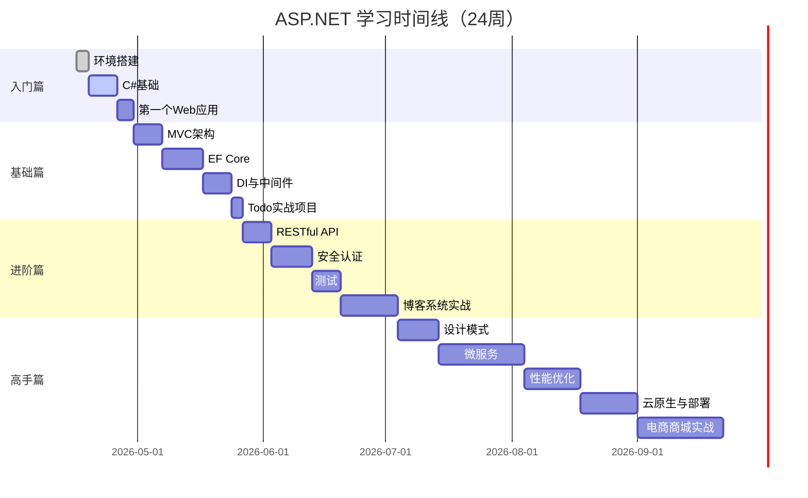
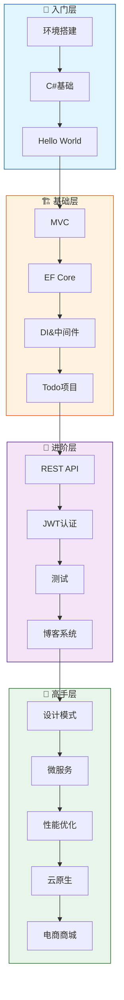

# 🗺️ ASP.NET Web 开发完整学习路线图

> **从零基础到高级工程师的系统化成长路径**

---

## 📊 总览时间线

---

## 🚪 第一阶段：入门篇（第 1-2 周）

### 🎯 阶段目标
- ✅ 成功搭建开发环境
- ✅ 理解 C# 语言基础
- ✅ 运行第一个 ASP.NET Core 应用
- ✅ 建立 Web 开发的直觉认知

### 📅 周计划

#### 第 1 周：环境准备 + C# 基础

**Day 1-2: 开发环境搭建**
- [ ] [[01-入门篇/01-环境搭建/Windows环境准备\|Windows 环境准备]]
  - 了解系统要求、推荐配置
- [ ] [[01-入门篇/01-环境搭建/安装.NET-SDK\|安装 .NET SDK]]
  - 下载最新 LTS 版本、验证安装
- [ ] [[01-入门篇/01-环境搭建/VSCode安装与配置\|VSCode 安装与配置]]
  - 安装编辑器、配置中文界面
- [ ] [[01-入门篇/01-环境搭建/必装扩展清单\|必装 VSCode 扩展]]
  - C# Dev Kit、IntelliCode 等

**Day 3-5: C# 语言极速入门**
- [ ] [[01-入门篇/02-C#极速入门/变量与数据类型\|变量与数据类型]]
  - int, string, bool, var
- [ ] [[01-入门篇/02-C#极速入门/控制流语句\|控制流语句]]
  - if/else, for, while, switch
- [ ] [[01-入门篇/02-C#极速入门/面向对象基础\|面向对象基础]]
  - 类、对象、属性、方法
- [ ] [[01-入门篇/02-C#极速入门/LINQ基础\|LINQ 基础]]
  - Where, Select, OrderBy
- [ ] [[01-入门篇/02-C#极速入门/异步编程初探\|异步编程初步]]
  - async/await 简单理解

**Day 6-7: 第一个 Web 应用**
- [ ] [[01-入门篇/03-第一个应用/创建项目\|创建第一个项目]]
  - dotnet new web 命令
- [ ] [[01-入门篇/03-第一个应用/项目结构解析\|理解项目结构]]
  - Program.cs, appsettings.json
- [ ] [[01-入门篇/03-第一个应用/运行与调试\|运行和调试]]
  - F5 启动、断点调试
- [ ] [[01-入门篇/03-第一个应用/Hello-World实战\|Hello World 实战]]
  - 修改页面、添加路由

#### 第 2 周：巩固练习
- 复习第一周内容
- 完成 [[01-入门篇/04-学习资源/练习题集\|入门篇练习题]]
- 尝试修改 Hello World 应用，添加新功能
- 阅读 [[01-入门篇/04-学习资源/视频教程推荐\|推荐视频教程]]

### ✅ 阶段验收标准

完成以下任务即表示入门篇达标：

- [ ] 能在命令行执行 `dotnet --version` 并看到版本号
- [ ] 能用 VSCode 打开并运行一个 ASP.NET Core 项目
- [ ] 能解释 Program.cs 的基本作用
- [ ] 能写出简单的 C# 类和方法
- [ ] 理解什么是 MVC（至少知道三个字母代表什么）

---

## 🏗️ 第二阶段：基础篇（第 3-6 周）

### 🎯 阶段目标
- ✅ 深入理解 MVC 架构模式
- ✅ 掌握 Entity Framework Core 数据访问
- ✅ 理解依赖注入和中间件
- ✅ **独立完成一个 Todo 应用的全栈开发**

### 📅 周计划

#### 第 3 周：MVC 架构深入

- [ ] [[02-基础篇/01-MVC架构/MVC模式详解\|MVC 模式详解]]
  - Model-View-Controller 职责划分
- [ ] [[02-基础篇/01-MVC架构/路由系统\|路由系统]]
  - Convention-based vs Attribute-based
- [ ] [[02-基础篇/01-MVC架构/Controller与Action\|Controller 与 Action]]
  - 控制器基类、Action 方法
- [ ] [[02-基础篇/01-MVC架构/Razor视图语法\|Razor 视图语法]]
  - @model, @foreach, Html Helpers

#### 第 4 周：Entity Framework Core

- [ ] [[02-基础篇/02-Entity-Framework-Core/ORM概念\|ORM 概念]]
  - 为什么需要 ORM？
- [ ] [[02-基础篇/02-Entity-Framework-Core/Code-First开发\|Code First 开发]]
  - 用 C# 类定义数据库表
- [ ] [[02-基础篇/02-Entity-Framework-Core/DbContext配置\|DbContext 配置]]
  - 连接字符串、数据库提供程序
- [ ] [[02-基础篇/02-Entity-Framework-Core/数据迁移\|数据库迁移]]
  - dotnet ef migrations 命令
- [ ] [[02-基础篇/02-Entity-Framework-Core/CRUD操作\|CRUD 操作]]
  - Create, Read, Update, Delete

#### 第 5 周：核心机制

- [ ] [[02-基础篇/03-核心机制/依赖注入\|依赖注入（DI）]]
  - IoC 容器、服务生命周期
- [ ] [[02-基础篇/03-核心机制/中间件管道\|中间件管道]]
  - 请求处理管道、自定义中间件
- [ ] [[02-基础篇/03-核心机制/配置系统\|配置系统]]
  - appsettings.json、Options Pattern
- [ ] [[02-基础篇/03-核心机制/日志系统\|日志系统]]
  - ILogger、Serilog 集成

#### 第 6 周：Todo 实战项目

- [ ] [[02-基础篇/04-实战项目-Todo应用/需求分析\|需求分析与数据库设计]]
  - ER 图、表结构设计
- [ ] [[02-基础篇/04-实战项目-Todo应用/步骤1-项目初始化\|步骤 1: 项目初始化]]
  - 创建解决方案、配置依赖
- [ ] [[02-基础篇/04-实战项目-Todo应用/步骤2-CRUD实现\|步骤 2: CRUD 实现]]
  - Controller + Service + Repository
- [ ] [[02-基础篇/04-实战项目-Todo应用/步骤3-表单验证\|步骤 3: 表单验证]]
  - Data Annotations、自定义验证
- [ ] [[02-基础篇/04-实战项目-Todo应用/步骤4-完善功能\|步骤 4: 完善功能]]
  - 分页、搜索、错误处理

### ✅ 阶段验收标准

- [ ] 能从头搭建一个 MVC 项目
- [ ] 能使用 EF Core 进行数据库操作
- [ ] 能正确使用 DI 注册和注入服务
- [ ] 能解释中间件的执行顺序
- [ ] **Todo 应用能正常运行，包含完整的增删改查功能**

---

## 🚀 第三阶段：进阶篇（第 7-12 周）

### 🎯 阶段目标
- ✅ 掌握 RESTful API 设计与实现
- ✅ 实现安全的身份验证与授权
- ✅ 编写可维护的单元测试和集成测试
- ✅ **构建带用户系统的博客系统**

### 📅 周计划

#### 第 7-8 周：RESTful API 开发

- [ ] [[03-进阶篇/01-RESTful-API/REST原则\|REST 原则与最佳实践]]
  - 资源导向、无状态、统一接口
- [ ] [[03-进阶篇/01-RESTful-API/API控制器\|API 控制器]]
  - [ApiController]、ActionResult<T>
- [ ] [[03-进阶篇/01-RESTful-API/Swagger集成\|Swagger/OpenAPI 集成]]
  - 自动生成 API 文档
- [ ] [[03-进阶篇/01-RESTful-API/API版本控制\|API 版本控制]]
  - URL Versioning vs Header Versioning

#### 第 9-10 周：安全认证

- [ ] [[03-进阶篇/02-安全认证/认证与授权概念\|Authentication vs Authorization]]
  - 概念区分、应用场景
- [ ] [[03-进阶篇/02-安全认证/JWT实现\|JWT Bearer Token]]
  - 生成、验证、刷新 Token
- [ ] [[03-进阶篇/02-安全认证/Identity框架\|Identity Framework]]
  - 用户管理、角色管理
- [ ] [[03-进阶篇/02-安全认证/OAuth2集成\|OAuth2 / OpenID Connect]]
  - 第三方登录（Google、GitHub）

#### 第 11 周：测试

- [ ] [[03-进阶篇/05-测试/单元测试\|单元测试基础]]
  - xUnit、Arrange-Act-Assert
- [ ] [[03-进阶篇/05-测试/集成测试\|集成测试]]
  - WebApplicationFactory、测试数据库
- [ ] [[03-进阶篇/05-测试/TDD流程\|TDD 开发流程]]
  - 红-绿-重构循环

#### 第 12 周：博客系统实战

- [ ] [[03-进阶篇/06-实战项目-博客系统/系统设计\|系统设计]]
  - 技术选型、架构设计
- [ ] [[03-进阶篇/06-实战项目-博客系统/用户模块\|用户模块]]
  - 注册、登录、JWT 认证
- [ ] [[03-进阶篇/06-实战项目-博客系统/文章模块\|文章模块]]
  - CRUD、富文本、图片上传
- [ ] [[03-进阶篇/06-实战项目-博客系统/评论模块\|评论模块]]
  - 嵌套评论、审核机制
- [ ] [[03-进阶篇/06-实战项目-博客系统/部署上线\|部署上线]]
  - Azure/Docker 部署

### ✅ 阶段验收标准

- [ ] 能设计符合 REST 规范的 API
- [ ] 能实现 JWT 认证和基于角色的授权
- [ ] 能编写覆盖率 > 80% 的单元测试
- [ ] **博客系统能在线访问，支持用户注册登录和文章发布**

---

## 🎯 第四阶段：高手篇（第 13-24 周+）

### 🎯 阶段目标
- ✅ 掌握企业级设计模式和架构
- ✅ 理解微服务架构并能实践
- ✅ 具备性能优化和安全加固能力
- ✅ **构建微服务电商商城系统**

### 📅 月度计划

#### 第 13-16 周：设计与架构

- [ ] [[04-高手篇/01-设计模式/仓储模式\|Repository Pattern]]
  - 数据访问抽象层
- [ ] [[04-高手篇/01-设计模式/CQRS模式\|CQRS 模式]]
  - 命查询职责分离
- [ ] [[04-高手篇/01-设计模式/MediatR实践\|MediatR 库]]
  - 进程内消息传递
- [ ] [[04-高手篇/06-Clean-Architecture/01-分层架构原则\|Clean Architecture]]
  - Domain/Application/Infrastructure/Presentation

#### 第 17-20 周：微服务与容器化

- [ ] [[04-高手篇/02-微服务架构/架构对比\|单体 vs 微服务]]
  - 优劣对比、选择策略
- [ ] [[04-高手篇/02-微服务架构/Docker容器化\|Docker 容器化]]
  - Dockerfile、docker-compose
- [ ] [[04-高手篇/02-微服务架构/Kubernetes基础\|Kubernetes 基础]]
  - Pod、Service、Deployment
- [ ] [[04-高手篇/02-微服务架构/服务拆分\|服务拆分实践]]
  - 边界上下文、通信机制

#### 第 21-24 周：性能与安全

- [ ] [[04-高手篇/03-性能优化/诊断工具\|性能诊断工具]]
  - dotnet-trace、dotnet-counters
- [ ] [[04-高手篇/03-性能优化/内存优化\|内存优化]]
  - 对象池、减少分配、Span<T>
- [ ] [[04-高手篇/04-安全加固/OWASP-Top10\|OWASP Top 10 防护]]
  - SQL 注入、XSS、CSRF 防护
- [ ] [[04-高手篇/05-云原生/Azure部署\|云原生部署]]
  - CI/CD 流水线、K8s 编排

#### 第 24 周+：电商商城实战

- [ ] [[04-高手篇/07-电商商城实战/01-系统架构与技术选型\|架构设计]]
  - 微服务划分、技术选型
- [ ] [[04-高手篇/07-电商商城实战/08-RabbitMQ消息队列集成\|微服务实现]]
  - 商品服务、订单服务、用户服务
- [ ] [[04-高手篇/07-电商商城实战/09-Saga分布式事务实战\|分布式事务]]
  - Saga 模式、最终一致性
- [ ] [[04-高手篇/07-电商商城实战/10-Docker Compose一键部署\|容器化部署]]
  - Docker Compose、K8s 部署

### ✅ 阶段验收标准

- [ ] 能设计和实现 Clean Architecture 项目
- [ ] 能将单体应用拆分为微服务
- [ ] 能使用 Docker 容器化和编排应用
- [ ] 能诊断和解决性能瓶颈
- [ ] **电商商城能在 Docker 环境中完整运行**

---

## 🎓 技能树总览

---

## 📊 知识点清单（Checklist）

### 入门篇必会知识点

- [ ] 了解 .NET 和 .NET Core 的区别
- [ ] 会使用 dotnet CLI 常用命令
- [ ] 理解 C# 基本数据类型和变量
- [ ] 会写 if/else、for、while 控制流
- [ ] 理解类、对象、方法的基本概念
- [ ] 会使用 LINQ 进行简单查询
- [ ] 知道 async/await 是做什么的
- [ ] 能创建并运行 ASP.NET Core 项目
- [ ] 理解 Program.cs 的基本作用
- [ ] 能修改默认端口和启动配置

### 基础篇必会知识点

- [ ] 能解释 MVC 中 M、V、C 的职责
- [ ] 会配置路由规则
- [ ] 能写 Controller 和 Action
- [ ] 会使用 Razor 语法编写视图
- [ ] 理解模型绑定和数据注解
- [ ] 知道 TempData、ViewData、ViewBag 的区别
- [ ] 理解 ORM 的概念和优势
- [ ] 会使用 Code First 开发模式
- [ ] 能配置 DbContext 和连接字符串
- [ ] 会执行数据库迁移
- [ ] 能实现完整的 CRUD 操作
- [ ] 理解一对多、多对多关系映射
- [ ] 理解 IoC 和 DI 的概念
- [ ] 知道三种服务生命周期的区别
- [ ] 理解中间件管道的工作原理
- [ ] 会编写自定义中间件
- [ ] 能读取多环境配置
- [ ] 会使用 ILogger 记录日志

### 进阶篇必会知识点

- [ ] 理解 REST 的六大原则
- [ ] 能设计符合 REST 规范的 API
- [ ] 会使用 [ApiController] 特性
- [ ] 能正确使用 HTTP 状态码
- [ ] 会集成 Swagger 生成 API 文档
- [ ] 能实现 API 版本控制
- [ ] 区分 Authentication 和 Authorization
- [ ] 能实现 JWT Token 认证
- [ ] 会使用 Identity Framework
- [ ] 能实现基于角色的授权
- [ ] 理解 OAuth2 和 OpenID Connect
- [ ] 会使用 AsNoTracking() 优化查询
- [ ] 理解延迟加载和预加载的区别
- [ ] 会使用事务保证数据一致性
- [ ] 能编写 xUnit 单元测试
- [ ] 会使用 Moq 模拟依赖
- [ ] 能编写集成测试
- [ ] 理解 TDD 的红-绿-重构循环

### 高手篇必会知识点（选学）

- [ ] 能实现 Repository Pattern
- [ ] 理解 Unit of Work 模式
- [ ] 会使用 MediatR 实现 CQRS
- [ ] 理解 SOLID 原则
- [ ] 能设计 Clean Architecture 项目
- [ ] 理解 DDD 的基本概念
- [ ] 知道何时该用微服务
- [ ] 会使用 Docker 容器化应用
- [ ] 能编写 docker-compose.yml
- [ ] 理解 Kubernetes 基本概念
- [ ] 会使用 dotnet-trace 诊断性能
- [ ] 理解内存优化的常见技巧
- [ ] 会使用 ConfigureAwait(false)
- [ ] 了解 OWASP Top 10
- [ ] 能实现常见的安全防护
- [ ] 会配置 CI/CD 流水线
- [ ] 能部署到 Azure/App Service

---

## 🎯 学习建议

### 📈 如何高效学习

1. **设定明确的目标**：每周开始前列出本周要学会的具体技能
2. **理论与实践结合**：看 30 分钟视频 → 动手 1 小时
3. **做项目驱动学习**：不要孤立地学概念，在项目中应用
4. **定期复盘总结**：每周花 30 分钟回顾本周所学
5. **加入社区互动**：提问、回答、分享心得

### ⚡ 加速学习技巧

- **类比思维**：用生活中的例子理解抽象概念（比如把 DI 比作外卖配送）
- **费曼输出**：学完一个概念后，尝试讲给完全不懂的人听
- **造轮子**：在学会使用框架后，尝试自己实现简化版
- **阅读源码**：看优秀开源项目的代码，学习设计思路
- **写技术博客**：输出倒逼输入，加深理解

### 🚨 避坑指南

- ❌ 不要一开始就追求完美代码
- ❌ 不要跳过基础直接学高级特性
- ❌ 不要只看不练，必须动手敲代码
- ❌ 不要遇到 bug 就立刻问人，先自己排查 30 分钟
- ❌ 不要同时学太多新技术，专注一个方向深耕

### 📚 推荐学习资源

**官方文档（首选）**：
- [Microsoft Learn - ASP.NET Core](https://learn.microsoft.com/aspnet/core)
- [.NET 官方文档](https://docs.microsoft.com/dotnet)

**书籍推荐**：
- 《C# in Depth》- Jon Skeet
- 《Pro ASP.NET Core》- Adam Freeman
- 《Clean Architecture》- Robert C. Martin

**在线课程**：
- Microsoft Learn 免费课程
- Pluralsight ASP.NET Core 路径
- Udemy 热门课程（筛选高评分）

**视频频道**：
- Microsoft .NET YouTube 频道
- NDC Conference 演讲
- 国内 UP 主（B站搜索 ASP.NET）

---

## 🔄 持续学习路径

完成本知识库后，你可以继续探索：

### 🌟 专业深化方向

- **全栈开发**：深入学习 Blazor、Vue.js、React
- **云架构师**：Azure、AWS 云服务认证
- **DevOps 工程师**：Kubernetes、Terraform、CI/CD
- **移动端开发**：.NET MAUI 跨平台应用
- **AI 集成**：ML.NET、OpenAI API 集成

### 📜 认证考试推荐

- **AZ-204**: Azure Developer Associate
- **AZ-400**: DevOps Engineer Expert
- **AZ-104**: Azure Administrator

### 🤝 社区参与

- 参与 GitHub 开源项目贡献
- 在 Stack Overflow 回答问题
- 撰写技术博客和教程
- 参加线下 Meetup 和会议
- 成为 Microsoft MVP

---

## 📞 需要帮助？

如果在学习过程中遇到困难：

1. 📖 先查阅 [[08-常见问题/常见问题汇总\|FAQ]]
2. 🔍 使用 Obsidian 搜索功能查找相关笔记
3. 📚 查看 [[06-术语表/01-A-G术语表\|术语表]]理解专业词汇
4. 💬 加入学习社区提问
5. 🌐 查阅微软官方文档

---

*祝你在 ASP.NET 的学习之旅中收获满满！记住：每一个专家都曾是新手。💪*

**上一页**: [[HOME\|🏠 返回首页]] | **下一页**: [[01-入门篇/README\|🚪 进入入门篇]]
