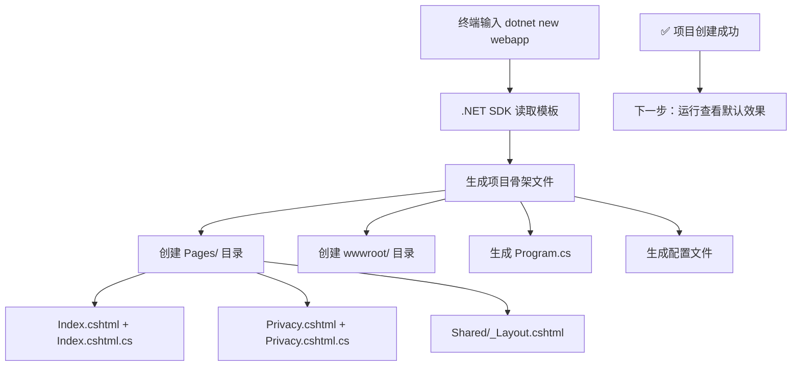
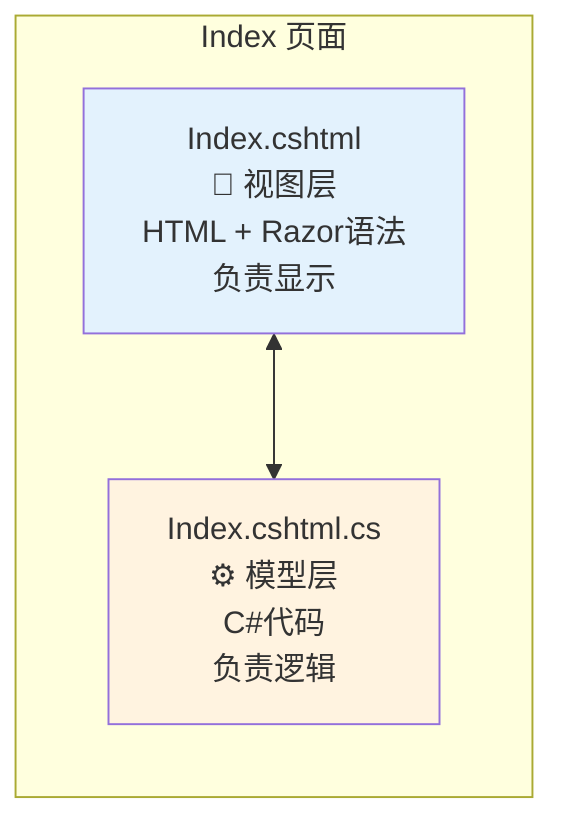
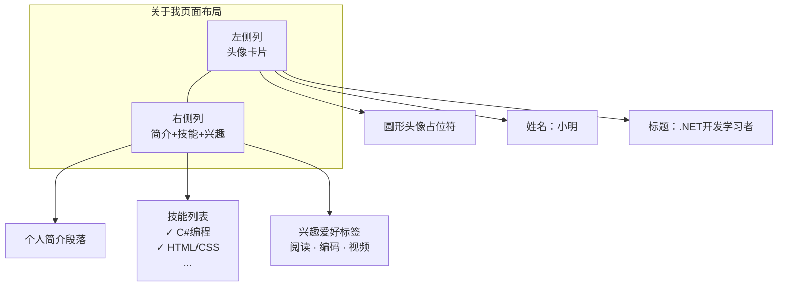
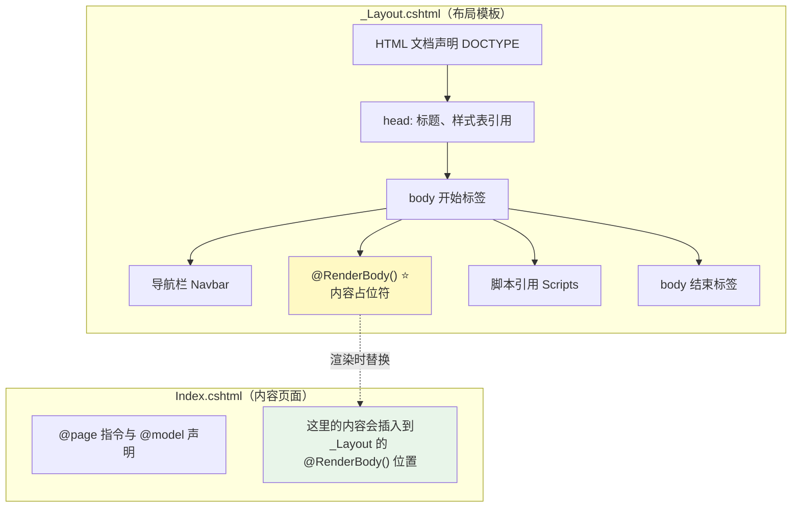
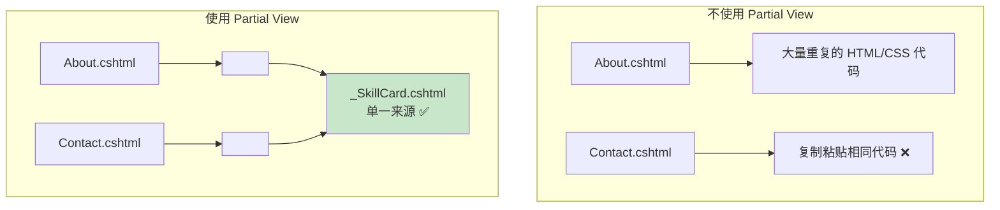

# Hello World 实战 - 构建你的第一个 ASP.NET Core 应用

> **学习目标**：从零开始，亲手构建一个完整的 Razor Pages 个人介绍网站，掌握页面创建、布局使用和组件复用

## 一、项目准备阶段

### 1.1 创建新项目

打开终端（PowerShell 或 CMD），执行以下命令：

```bash
# 创建工作目录
mkdir MyFirstAspNetApp
cd MyFirstAspNetApp

# 使用 Razor Pages 模板创建项目
dotnet new webapp -n PersonalWebsite -o .
```

**执行过程说明：**



### 1.2 首次运行验证

```bash
# 运行项目
dotnet run
```

看到以下输出表示启动成功：

```
info: Now listening on: http://localhost:5000
info: Application started. Press Ctrl+C to shut down.
```

在浏览器中访问 http://localhost:5000，你会看到 ASP.NET Core 的默认欢迎页面。

---

## 二、任务一：修改首页显示"你好，ASP.NET！"

### 2.1 理解 Razor Pages 的双文件结构

每个 Razor Page 由两个文件组成：



### 2.2 修改 PageModel（代码后置文件）

打开 `Pages/Index.cshtml.cs`，修改为：

```csharp
using Microsoft.AspNetCore.Mvc.RazorPages;

namespace PersonalWebsite.Pages;

public class IndexModel : PageModel
{
    // 属性：用于向视图传递数据
    public string WelcomeMessage { get; set; } = "";
    public string CurrentTime { get; set; } = "";
    public string AuthorName { get; set; } = "ASP.NET 初学者";

    // 当用户通过 GET 请求访问页面时执行此方法
    public void OnGet()
    {
        WelcomeMessage = "你好，ASP.NET！";
        CurrentTime = DateTime.Now.ToString("yyyy年MM月dd日 HH:mm:ss");
        
        // 在控制台输出日志（可在终端看到）
        Console.WriteLine($"[{DateTime.Now}] 首页被访问了！");
    }
}
```

**代码详解：**

| 关键字 | 说明 |
|--------|------|
| `public class IndexModel` | 页面模型类，继承自 `PageModel` 基类 |
| `public string WelcomeMessage` | 公共属性，可以在 .cshtml 视图中访问 |
| `public void OnGet()` | 处理 HTTP GET 请求的方法 |
| `On` + `Get` | 命名约定：On + HTTP方法名（Get/Post/Put/Delete） |

### 2.3 修改视图文件

打开 `Pages/Index.cshtml`，替换为：

```cshtml
@page
@model IndexModel
@{
    ViewData["Title"] = "首页";
}

<div class="text-center">
    <!-- 使用 @Model 访问 PageModel 中的属性 -->
    <h1 class="display-4">@Model.WelcomeMessage</h1>
    
    <p class="lead">
        欢迎来到我的第一个 ASP.NET Core 网站！
    </p>
    
    <div class="alert alert-info mt-4">
        <strong>当前时间：</strong>@Model.CurrentTime
    </div>
    
    <div class="mt-4">
        <p>我是 @Model.AuthorName，正在学习 ASP.NET Core 开发。</p>
    </div>
</div>
```

**Razor 语法要点：**

| 语法 | 说明 | 示例 |
|------|------|------|
| `@page` | 指令：声明这是一个 Razor Page | 必须在第一行 |
| `@model` | 指定 PageModel 类型 | `@model IndexModel` |
| `@{ ... }` | 代码块：执行 C# 代码 | 定义变量、设置 ViewData |
| `@Model.xxx` | 输出模型属性值 | `@Model.WelcomeMessage` |
| `@if` / `@foreach` | 控制流语句 | 条件判断、循环 |

### 2.4 运行测试

保存所有文件后，如果应用正在运行，它会自动热重载。刷新浏览器即可看到效果。

**预期结果：**
- 标题显示："你好，ASP.NET！"
- 显示当前时间
- 显示作者名称

---

## 三、任务二：添加第二个页面 - 关于我

### 3.1 创建新的 Razor Page

在 `Pages/` 目录下创建两个文件：

**文件 1：`Pages/About.cshtml.cs`**

```csharp
using Microsoft.AspNetCore.Mvc.RazorPages;

namespace PersonalWebsite.Pages;

public class AboutModel : PageModel
{
    public string Name { get; set; } = "小明";
    public string Title { get; set; } = ".NET 开发学习者";
    public string Bio { get; set; } = "";
    public List<string> Skills { get; set; } = new();
    public List<string> Hobbies { get; set; } = new();

    public void OnGet()
    {
        Bio = "我是一名对技术充满热情的学习者，目前正在系统学习 ASP.NET Core Web 开发。" +
              "我相信通过持续学习和实践，可以构建出优秀的 Web 应用程序。";
              
        Skills = new List<string>
        {
            "C# 编程语言",
            "HTML & CSS",
            "JavaScript 基础",
            "SQL 数据库",
            "Git 版本控制"
        };
        
        Hobbies = new List<string>
        {
            "阅读技术书籍",
            "编写代码",
            "观看技术视频",
            "参与开源项目"
        };
    }
}
```

**文件 2：`Pages/About.cshtml`**

```cshtml
@page
@model AboutModel
@{
    ViewData["Title"] = "关于我";
}

<div class="container mt-4">
    <div class="row">
        <!-- 左侧个人信息卡片 -->
        <div class="col-md-4">
            <div class="card shadow-sm">
                <div class="card-body text-center">
                    <!-- 使用占位符头像 -->
                    <div class="bg-primary text-white rounded-circle d-inline-flex 
                                align-items-center justify-content-center mb-3"
                         style="width: 150px; height: 150px; font-size: 48px;">
                        @Model.Name[0]
                    </div>
                    <h4>@Model.Name</h4>
                    <p class="text-muted">@Model.Title</p>
                </div>
            </div>
        </div>

        <!-- 右侧详细信息 -->
        <div class="col-md-8">
            <div class="card shadow-sm mb-4">
                <div class="card-header bg-white">
                    <h5 class="mb-0">个人简介</h5>
                </div>
                <div class="card-body">
                    <p>@Model.Bio</p>
                </div>
            </div>

            <!-- 技能列表 -->
            <div class="card shadow-sm mb-4">
                <div class="card-header bg-white">
                    <h5 class="mb-0">技能列表</h5>
                </div>
                <div class="card-body">
                    <ul class="list-group list-group-flush">
                        @foreach (var skill in Model.Skills)
                        {
                            <li class="list-group-item">
                                <i class="bi bi-check-circle-fill text-success me-2"></i>
                                @skill
                            </li>
                        }
                    </ul>
                </div>
            </div>

            <!-- 兴趣爱好 -->
            <div class="card shadow-sm">
                <div class="card-header bg-white">
                    <h5 class="mb-0">兴趣爱好</h5>
                </div>
                <div class="card-body">
                    <div class="d-flex flex-wrap gap-2">
                        @foreach (var hobby in Model.Hobbies)
                        {
                            <span class="badge bg-primary rounded-pill">@hobby</span>
                        }
                    </div>
                </div>
            </div>
        </div>
    </div>
</div>
```

### 3.2 添加导航链接

修改 `Pages/Shared/_Layout.cshtml`，在导航栏中添加"关于我"链接：

找到 `<ul class="navbar-nav flex-grow-1">` 部分，添加：

```html
<li class="nav-item">
    <a class="nav-link text-dark" asp-area="" asp-page="/About">关于我</a>
</li>
```

**完整的导航部分应该类似这样：**

```html
<ul class="navbar-nav flex-grow-1">
    <li class="nav-item">
        <a class="nav-link text-dark" asp-area="" asp-page="/Index">首页</a>
    </li>
    <li class="nav-item">
        <a class="nav-link text-dark" asp-area="" asp-page="/About">关于我</a>
    </li>
    <li class="nav-item">
        <a class="nav-link text-dark" asp-area="" asp-page="/Privacy">隐私</a>
    </li>
</ul>
```

**Tag Helper 解释：**
- `asp-page="/About"`：Razor Pages 的路由 Tag Helper
- 自动生成正确的 URL（无需硬编码路径）
- 支持区域（Area）功能

### 3.3 测试新页面

访问 http://localhost:5000/About ，你应该能看到：



---

## 四、任务三：使用 Layout 统一页面布局

### 4.1 什么是 Layout？

Layout（布局）类似于网页的"模板"，定义了页面的公共结构（头部导航、底部版权等），具体页面只需要填充内容区域。



### 4.2 查看 _Layout.cshtml 结构

打开 `Pages/Shared/_Layout.cshtml`，理解其结构：

```html
<!DOCTYPE html>
<html lang="zh-CN">
<head>
    <meta charset="utf-8" />
    <meta name="viewport" content="width=device-width, initial-scale=1.0" />
    <title>@ViewData["Title"] - PersonalWebsite</title>
    <link rel="stylesheet" href="~/lib/bootstrap/dist/css/bootstrap.min.css" />
    <link rel="stylesheet" href="~/css/site.css" />
</head>
<body>
    <!-- 顶部导航栏 -->
    <header>
        <nav class="navbar navbar-expand-sm navbar-toggleable-sm navbar-light bg-white border-bottom box-shadow mb-3">
            <div class="container">
                <a class="navbar-brand" asp-area="" asp-page="/Index">PersonalWebsite</a>
                <button class="navbar-toggler" type="button" data-bs-toggle="collapse" 
                        data-bs-target=".navbar-collapse" aria-controls="navbarSupportedContent"
                        aria-expanded="false" aria-label="Toggle navigation">
                    <span class="navbar-toggler-icon"></span>
                </button>
                <div class="collapse navbar-collapse d-sm-inline-flex justify-content-between">
                    <ul class="navbar-nav flex-grow-1">
                        <!-- 导航链接在这里 -->
                    </ul>
                </div>
            </div>
        </nav>
    </header>

    <!-- 主要内容区域 -->
    <div class="container">
        <main role="main" class="pb-3">
            @RenderBody()  <!-- ⭐ 这里是关键！子页面的内容会渲染在这里 -->
        </main>
    </div>

    <!-- 页脚 -->
    <footer class="border-top footer text-muted">
        <div class="container">
            &copy; 2024 - PersonalWebsite - <a asp-area="" asp-page="/Privacy">隐私</a>
        </div>
    </footer>

    <!-- JavaScript 脚本 -->
    <script src="~/lib/jquery/dist/jquery.min.js"></script>
    <script src="~/lib/bootstrap/dist/js/bootstrap.bundle.min.js"></script>
    <script src="~/js/site.js"></script>
    
    @await RenderSectionAsync("Scripts", required: false)  <!-- 可选的Scripts节 -->
</body>
</html>
```

### 4.3 自定义布局：添加页脚信息

让我们给布局添加更丰富的页脚：

**修改 `_Layout.cshtml` 的 footer 部分：**

```html
<footer class="border-top footer text-muted mt-5 py-4">
    <div class="container">
        <div class="row">
            <div class="col-md-6">
                <h5>PersonalWebsite</h5>
                <p>这是我的第一个 ASP.NET Core 网站，用于学习 Web 开发技术。</p>
            </div>
            <div class="col-md-3">
                <h5>快速链接</h5>
                <ul class="list-unstyled">
                    <li><a asp-page="/Index">首页</a></li>
                    <li><a asp-page="/About">关于我</a></li>
                </ul>
            </div>
            <div class="col-md-3">
                <h5>联系方式</h5>
                <ul class="list-unstyled">
                    <li>📧 email@example.com</li>
                    <li>🌐 GitHub: myusername</li>
                </ul>
            </div>
        </div>
        <hr />
        <div class="text-center">
            <p>&copy; 2024 PersonalWebsite - 用 ❤️ 和 ASP.NET Core 构建</p>
        </div>
    </div>
</footer>
```

### 4.4 创建自定义 Section

有时候不同页面需要加载不同的脚本或样式，可以使用 **Section（节）** 机制。

**步骤 1：** 在 `_Layout.cshtml` 中声明 Section（已有）：

```html
@await RenderSectionAsync("Scripts", required: false)
```

**步骤 2：** 在需要特殊脚本的页面中定义 Section 内容：

例如在 `About.cshtml` 底部添加：

```cshtml
@section Scripts {
    <script>
        console.log("关于我页面已加载完成！");
        // 可以在这里添加页面特定的JavaScript代码
    </script>
}
```

---

## 五、任务四：创建 Partial View（局部视图）

Partial View 是可复用的 UI 片段，就像乐高积木一样，可以在多个页面中重复使用。

### 5.1 实战场景：创建可复用的"技能卡片"组件

**步骤 1：** 创建 `Pages/Shared/_SkillCard.cshtml`：

```cshtml
@model SkillCardModel

<div class="card mb-3 shadow-sm">
    <div class="card-header bg-primary text-white">
        <h6 class="mb-0">@Model.CategoryName</h6>
    </div>
    <div class="card-body">
        @if (Model.Skills != null && Model.Skills.Any())
        {
            <div class="d-flex flex-wrap gap-2">
                @foreach (var skill in Model.Skills)
                {
                    <span class="badge @(Model.IsHighlighted ? "bg-success" : "bg-secondary") 
                                   rounded-pill fs-6">
                        @skill
                    </span>
                }
            </div>
        }
        else
        {
            <p class="text-muted mb-0">暂无技能数据</p>
        }
    </div>
</div>
```

**步骤 2：** 创建模型类 `Models/SkillCardModel.cs`：

```csharp
namespace PersonalWebsite.Models;

public class SkillCardModel
{
    /// <summary>
    /// 技能分类名称（如"前端技术"、"后端技术"）
    /// </summary>
    public string CategoryName { get; set; } = "未分类";

    /// <summary>
    /// 该分类下的技能列表
    /// </summary>
    public List<string>? Skills { get; set; }

    /// <summary>
    /// 是否高亮显示（用于突出重要技能）
    /// </summary>
    public bool IsHighlighted { get; set; }
}
```

**步骤 3：** 在 About 页面中使用 Partial View

修改 `Pages/About.cshtml.cs`，添加技能分组数据：

```csharp
// 新增属性
public List<SkillCardModel> SkillCategories { get; set; } = new();

public void OnGet()
{
    // ... 原有代码保持不变 ...
    
    // 添加技能分类数据
    SkillCategories = new List<SkillCardModel>
    {
        new()
        {
            CategoryName = "前端技术",
            IsHighlighted = true,
            Skills = new() { "HTML5", "CSS3", "JavaScript", "Bootstrap 5", "Razor Views" }
        },
        new()
        {
            CategoryName = "后端技术",
            IsHighlighted = true,
            Skills = new() { "C# / .NET", "ASP.NET Core", "Entity Framework", "RESTful API" }
        },
        new()
        {
            CategoryName = "工具与其他",
            IsHighlighted = false,
            Skills = new() { "Git", "Visual Studio", "SQL Server", "Azure Cloud" }
        }
    };
}
```

修改 `Pages/About.cshtml`，使用 Partial View 替换原来的手动列表：

```cshtml
<!-- 技能列表 - 使用 Partial View -->
<div class="row">
    @foreach (var category in Model.SkillCategories)
    {
        <div class="col-md-4 mb-3">
            <partial name="_SkillCard" model="@category" />
        </div>
    }
</div>
```

**Partial View 的优势：**



### 5.2 再创建一个 Partial View：联系信息卡片

**创建 `Pages/Shared/_ContactInfo.cshtml`：**

```cshtml
@model ContactInfoModel

<div class="card bg-light mb-3">
    <div class="card-body text-center">
        <h5 class="card-title">@Model.Title</h5>
        
        @if (!string.IsNullOrEmpty(Model.Email))
        {
            <p class="card-text">
                <i class="bi bi-envelope me-2"></i>
                <a href="mailto:@Model.Email">@Model.Email</a>
            </p>
        }
        
        @if (!string.IsNullOrEmpty(Model.Phone))
        {
            <p class="card-text">
                <i class="bi bi-phone me-2"></i>
                @Model.Phone
            </p>
        }
        
        @if (!string.IsNullOrEmpty(Model.Address))
        {
            <p class="card-text">
                <i class="bi bi-geo-alt me-2"></i>
                @Model.Address
            </p>
        }
        
        @if (Model.SocialLinks != null)
        {
            <div class="mt-3">
                @foreach (var social in Model.SocialLinks)
                {
                    <a href="@social.Url" target="_blank" 
                       class="btn btn-outline-primary btn-sm me-2 mb-2">
                        @social.Name
                    </a>
                }
            </div>
        }
    </div>
</div>
```

**创建模型 `Models/ContactInfoModel.cs`：**

```csharp
namespace PersonalWebsite.Models;

public class ContactInfoModel
{
    public string Title { get; set; } = "联系方式";
    public string? Email { get; set; }
    public string? Phone { get; set; }
    public string? Address { get; set; }
    public List<SocialLink>? SocialLinks { get; set; }
}

public record SocialLink(string Name, string Url);
```

---

## 六、任务五：整合完成个人介绍网站

### 6.1 最终项目结构

经过以上步骤，你的项目应该有如下结构：

```
PersonalWebsite/
├── Pages/
│   ├── Index.cshtml              # 首页视图
│   ├── Index.cshtml.cs           # 首页模型
│   ├── About.cshtml              # 关于我视图
│   ├── About.cshtml.cs           # 关于我模型
│   ├── Privacy.cshtml            # 隐私政策（默认）
│   ├── Privacy.cshtml.cs         # （默认）
│   ├── Shared/
│   │   ├── _Layout.cshtml        # 主布局文件 ✏️ 已修改
│   │   ├── _SkillCard.cshtml     # 技能卡片 Partial View 🆕
│   │   └── _ContactInfo.cshtml   # 联系方式 Partial View 🆕
│   ├── _ViewImports.cshtml
│   └── _ViewStart.cshtml
├── Models/                        # 🆕 自定义模型
│   ├── SkillCardModel.cs
│   └── ContactInfoModel.cs
├── wwwroot/
│   ├── css/site.css
│   ├── js/site.js
│   └── lib/
├── appsettings.json
├── Program.cs
├── PersonalWebsite.csproj
└── launchSettings.json
```

### 6.2 功能清单验收

```mermaid
checklist
    completed 首页显示"你好，ASP.NET！"
    completed 首页显示当前时间和作者信息
    completed 导航栏包含"首页"、"关于我"、"隐私"链接
    completed 关于我页面显示个人信息卡片
    completed 关于我页面显示技能列表（使用 Partial View）
    completed 关于我页面显示兴趣爱好标签
    completed 布局包含自定义页脚（多栏式）
    completed 所有页面共享统一的导航栏和页脚
    completed 响应式设计（手机/平板/桌面适配）
```

### 6.3 最终测试流程

1. **运行应用**：`dotnet run`
2. **测试首页**：
   - [ ] 访问 http://localhost:5000/
   - [ ] 确认标题显示"你好，ASP.NET！"
   - [ ] 确认显示当前时间
3. **测试关于页面**：
   - [ ] 点击导航栏的"关于我"
   - [ ] 确认显示个人信息卡片
   - [ ] 确认技能卡片正常显示（3个分类）
   - [ ] 确认兴趣爱好以标签形式展示
4. **测试响应式**：
   - [ ] 缩小浏览器窗口至手机尺寸
   - [ ] 确认布局自动调整（导航折叠、单列显示）
5. **测试导航**：
   - [ ] 在各页面间切换，确认导航高亮正确
   - [ ] 点击页脚链接，确认跳转正常

---

## 七、代码质量检查清单

### 7.1 命名规范检查

- [ ] 文件名使用 PascalCase：`Index.cshtml`, `About.cshtml.cs`
- [ ] 类名使用 PascalCase：`IndexModel`, `AboutModel`
- [ ] 属性名使用 PascalCase：`WelcomeMessage`, `CurrentTime`
- [ ] 方法名使用 PascalCase：`OnGet()`, `CalculateSomething()`
- [ ] 私有字段使用 _camelCase：`_logger`, `_service`

### 7.2 安全性检查

- [ ] 用户输入是否经过处理？（当前示例无用户输入）
- [ ] 是否避免在视图中暴露敏感信息？
- [ ] 错误信息是否对用户友好且不泄露内部细节？

### 7.3 性能优化提示（进阶）

虽然这是初学者项目，但了解这些概念很有价值：

```csharp
// ❌ 不推荐：每次请求都重新创建列表
public void OnGet()
{
    var items = new List<string>();
    items.Add("Item 1");  // 如果是静态数据，不应该每次都重建
}

// ✅ 推荐：静态或缓存的数据
private static readonly List<string> _staticItems = new() 
{ 
    "Item 1", "Item 2", "Item 3" 
};

public List<string> Items => _staticItems;
```

---

## 八、动手练习

### 练习 1：扩展个人信息（基础）

**任务：** 在 About 页面添加更多信息字段。

**要求：**
1. 在 `AboutModel` 中添加新属性：
   - `Education`（教育背景）：字符串列表
   - `WorkExperience`（工作经验）：字符串列表
   - `FavoriteQuote`（座右铭）：字符串

2. 在 `OnGet()` 中初始化这些数据

3. 在 `About.cshtml` 中用美观的方式展示这些信息（建议使用卡片布局）

**参考输出格式：**
```
🎓 教育背景
• XXX大学 - 计算机科学与技术 (2020-2024)

💼 工作经验
• XXX公司 - 实习生 (2023夏)

💭 座右铭
"学而不思则罔，思而不学则殆。" —— 孔子
```

---

### 练习 2：创建联系方式页面（进阶）

**任务：** 创建一个新的 `Contact` 页面，使用之前创建的 `_ContactInfo` Partial View。

**步骤：**
1. 创建 `Pages/Contact.cshtml` 和 `Pages/Contact.cshtml.cs`
2. 在 PageModel 中准备联系方式数据（邮箱、电话、地址、社交链接）
3. 在视图中使用 `<partial name="_ContactInfo" />` 渲染
4. 在导航栏添加"联系我"链接
5. 添加一个简单的留言表单（可选挑战）

**表单字段建议：**
- 姓名（文本框）
- 邮箱（邮箱类型输入框）
- 留言内容（多行文本域）
- 提交按钮

**提示：** 表单暂时不需要真正提交（后续章节会学习表单处理），只需实现界面即可。

---

### 练习 3：自定义样式美化（创意）

**任务：** 通过修改 CSS 来自定义网站外观。

**步骤 1：** 修改 `wwwroot/css/site.css`，添加自定义样式：

```css
/* 自定义主题色 */
:root {
    --primary-color: #3498db;
    --secondary-color: #2ecc71;
    --accent-color: #e74c3c;
}

/* 自定义首页大标题动画 */
.display-4 {
    background: linear-gradient(45deg, var(--primary-color), var(--secondary-color));
    -webkit-background-clip: text;
    -webkit-text-fill-color: transparent;
    background-clip: text;
    animation: gradientShift 3s ease infinite;
}

@keyframes gradientShift {
    0%, 100% { filter: hue-rotate(0deg); }
    50% { filter: hue-rotate(180deg); }
}

/* 卡片悬停效果 */
.card:hover {
    transform: translateY(-5px);
    transition: transform 0.3s ease;
}
```

**步骤 2：** 刷新浏览器查看效果

**扩展挑战：**
- 尝试不同的颜色方案（暗黑模式？）
- 添加平滑滚动效果
- 为按钮添加过渡动画

---

### 练习 4：创建可复用的 Feature 组件（高级）

**任务：** 创建一个通用的"特性展示"Partial View，用于展示产品特点或服务亮点。

**创建 `Pages/Shared/_FeatureBox.cshtml`：**

```cshtml
@model FeatureBoxModel

<div class="col-md-4 mb-4">
    <div class="card h-100 text-center shadow-sm">
        <div class="card-body">
            <div class="mb-3">
                <span style="font-size: 3rem;">@Model.Icon</span>
            </div>
            <h5 class="card-title">@Model.Title</h5>
            <p class="card-text text-muted">@Model.Description</p>
        </div>
    </div>
</div>
```

**创建模型 `Models/FeatureBoxModel.cs`：**

```csharp
namespace PersonalWebsite.Models;

public class FeatureBoxModel
{
    public string Icon { get; set; } = "🚀";  // Emoji 图标
    public string Title { get; set; } = "特性标题";
    public string Description { get; set; } = "特性描述文字";
}
```

**在首页使用这个组件：**

```csharp
// 在 IndexModel 中添加
public List<FeatureBoxModel> Features { get; set; } = new();

public void OnGet()
{
    Features = new List<FeatureBoxModel>
    {
        new() { Icon = "⚡", Title = "高性能", Description = "基于 .NET 8，提供卓越的运行性能" },
        new() { Icon = "🛡️", Title = "安全可靠", Description = "内置安全机制，保护您的数据安全" },
        new() { Icon = "🌐", Title = "跨平台", Description = "支持 Windows、Linux、macOS 多平台部署" }
    };
}
```

**在 Index.cshtml 中渲染：**

```html
<div class="row mt-5">
    @foreach (var feature in Model.Features)
    {
        <partial name="_FeatureBox" model="@feature" />
    }
</div>
```

---

### 练习 5：完整项目复盘与总结（综合性）

**任务：** 完成以下总结文档，巩固学习成果。

**请回答以下问题：**

1. **架构理解**：
   - Razor Pages 的双文件结构有什么优势？
   - Layout 和 Partial View 的区别是什么？
   - 什么时候应该创建新的 Page，什么时候应该创建 Partial View？

2. **代码审查**：
   - 回顾你写的所有代码，有没有可以优化的地方？
   - 有没有重复的代码可以提取为组件？
   - 命名是否符合规范？

3. **功能扩展设想**：
   - 你还想给这个网站添加什么功能？
   - 列出至少3个改进想法（如：主题切换、多语言支持、搜索功能等）

4. **学习笔记整理**：
   - 记录你在过程中遇到的错误及解决方案
   - 总结最常用的 10 个 Razor 语法
   - 写下你认为最重要的 5 个概念

**产出物：** 将以上答案整理成一份 Markdown 文档（不要提交到 Git，仅作为个人学习记录）。

---

## 九、本章小结

恭喜你！通过本章的实战演练，你已经：

✅ **从零创建了完整的 Razor Pages 应用**  
✅ **掌握了页面模型的编写**（PageModel、属性、OnGet方法）  
✅ **学会了 Razor 语法的基本用法**（@model、@foreach、条件渲染）  
✅ **理解并使用了 Layout 布局系统**  
✅ **创建了可复用的 Partial View 组件**  
✅ **实现了响应式的个人介绍网站**  

**知识体系总览图：**

```mermaid
mindmap
    root((Hello World<br/>实战完成))
        项目创建
            dotnet new webapp
            目录结构理解
        核心概念
            双文件结构
                .cshtml 视图
                .cshtml.cs 模型
            数据传递
                Model 属性
                ViewData 字典
        布局系统
            _Layout.cshtml
                @RenderBody()
                @RenderSection
            _ViewStart.cshtml
        组件复用
            Partial View
                _SkillCard
                _ContactInfo
                _FeatureBox
            模型类设计
        实战技能
            调试技巧
            问题排查
            性能考虑
```

**下一步建议：**
- 学习表单处理和数据验证（第X章）
- 学习 Entity Framework Core 数据库操作（第Y章）
- 学习身份认证和授权（第Z章）
- 尝试将此网站部署到 Azure 或其他云平台

---

## 十、附录：常见问题快速排查

### Q1：页面显示空白或报 404？
**A：** 检查以下几点：
- `.cshtml` 文件是否有 `@page` 指令？
- 文件是否放在 `Pages/` 目录下？
- URL 路径是否正确？（`/About` 对应 `Pages/About.cshtml`）

### Q2：修改代码后浏览器没有更新？
**A：** 
- 按 `Ctrl + F5` 强制刷新（清除缓存）
- 检查终端是否有编译错误
- 重启应用（`Ctrl+C` 然后 `dotnet run`）

### Q3：@Model 显示红色波浪线？
**A：**
- 确保 `@model` 指令的类型拼写正确（包括命名空间）
- 确保对应的 `.cs` 文件已保存且无编译错误
- 尝试重启 Visual Studio 的 IntelliSense（Ctrl+Shift+R）

### Q4：Partial View 找不到？
**A：**
- Partial View 必须放在 `Pages/Shared/` 目录下
- 引用时只写文件名（不含扩展名）：`<partial name="_SkillCard" />`
- 确保模型类型匹配

---

## 参考资源

- [官方文档：Razor Pages 入门](https://docs.microsoft.com/aspnet/core/tutorials/razor-pages/)
- [官方文档：Partial Views](https://docs.microsoft.com/asp.net/core/mvc/views/partial)
- [官方文档：Layout](https://docs.microsoft.com/asp.net/core/mvc/views/layout)
- [Bootstrap 5 中文文档](https://v5.bootcss.com/)
- [Razor 语法快速参考](https://docs.microsoft.com/aspnet/core/mvc/views/razor)

> **作者注：** 完成本章实战后，你已经具备了独立开发简单 ASP.NET Core 应用的能力！记住：最好的学习方式就是动手实践。尝试修改代码、打破它、再修复它——这就是成长的必经之路。祝你在 .NET 开发之路上一帆风顺！🚀
