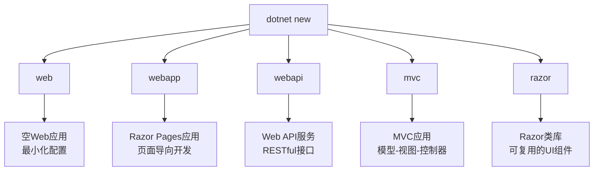
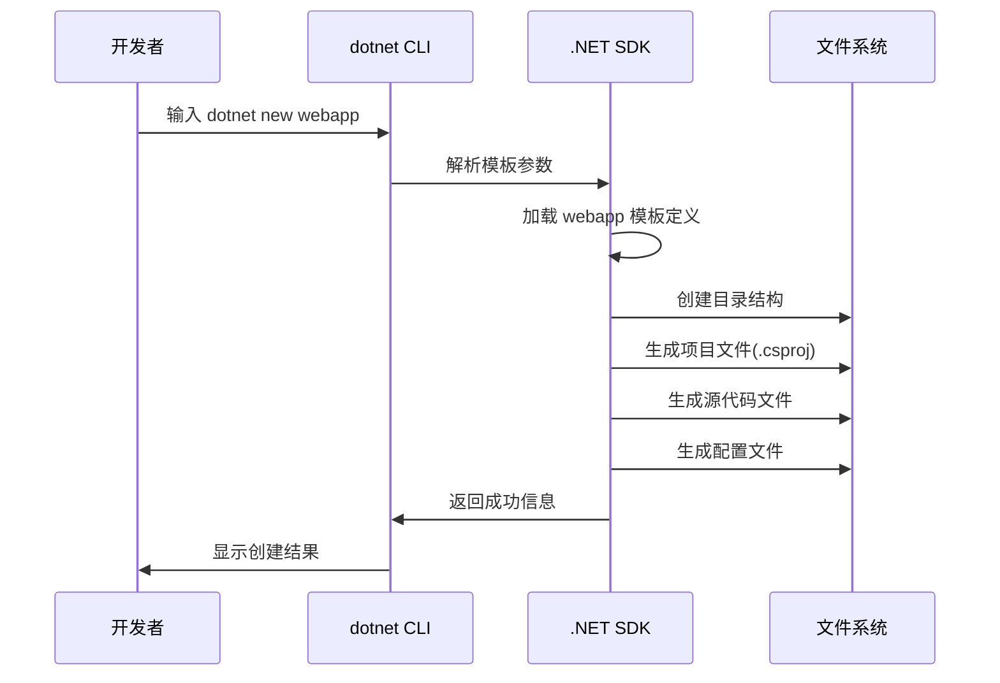
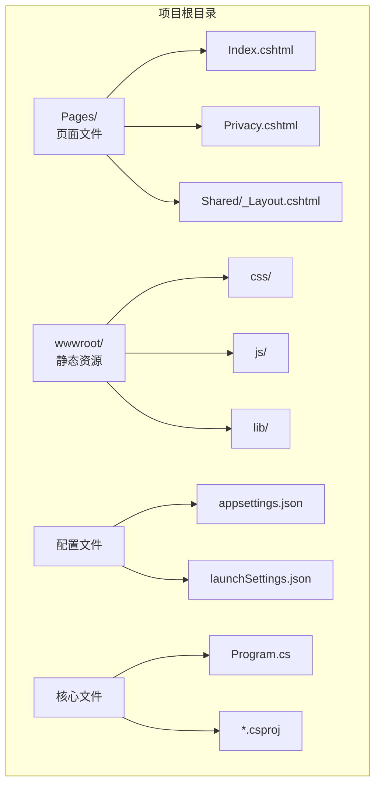

# 创建项目 - dotnet new 命令完全指南

> **学习目标**：掌握使用 .NET CLI 创建 ASP.NET Core Web 应用程序，理解不同项目模板的区别和适用场景

## 一、什么是 dotnet new 命令？

`dotnet new` 是 .NET SDK 提供的命令行工具，用于根据模板快速创建新的项目。就像用模具制作饼干一样，模板就是"模具"，`dotnet new` 就是把面糊（代码）倒入模具的过程。

### 1.1 基本语法

```bash
dotnet new <模板名称> [选项] [参数]
```

### 1.2 常用选项说明

| 选项 | 缩写 | 说明 | 示例 |
|------|------|------|------|
| `--name` | `-n` | 指定项目名称 | `-n MyWebApp` |
| `--output` | `-o` | 指定输出目录 | `-o ./MyProject` |
| `--framework` | `-f` | 指定目标框架 | `-f net8.0` |
| `--force` | 覆盖已存在的文件 | 使用时需谨慎 |

---

## 二、ASP.NET Core 主要项目模板

ASP.NET Core 提供了多种项目模板，每种模板适用于不同的开发场景：



### 2.1 web - 空Web应用（最小化模板）

这是最基础的模板，只包含最少的代码和依赖。

**创建命令：**
```bash
dotnet new web -n MinimalApiDemo -o ./MinimalApiDemo
```

**适用场景：**
- 学习 ASP.NET Core 基础概念
- 创建微服务和 API 网关
- 需要完全控制的项目结构

**生成的 Program.cs 示例：**
```csharp
var builder = WebApplication.CreateBuilder(args);
var app = builder.Build();

app.MapGet("/", () => "Hello World!");

app.Run();
```

### 2.2 webapp - Razor Pages 应用（推荐新手）

这是最适合初学者的模板，采用页面导向的编程模型。

**创建命令：**
```bash
dotnet new webapp -n RazorPagesApp -o ./RazorPagesApp
```

**特点：**
- 内置身份验证系统
- 包含完整的布局和样式
- 页面与处理逻辑绑定在一起
- 类似于传统的 ASP.NET Web Forms

**适用场景：**
- 企业内部管理系统
- 内容展示型网站
- 表单密集型应用
- 初学者入门首选

### 2.3 webapi - RESTful API 服务

专门为构建 HTTP API 设计的模板。

**创建命令：**
```bash
dotnet new webapi -n MyApiService -o ./MyApiService --no-openapi
```

**参数说明：**
- `--no-openapi`: 不包含 Swagger/OpenAPI 支持（可选）

**生成的控制器示例：**
```csharp
[ApiController]
[Route("[controller]")]
public class WeatherForecastController : ControllerBase
{
    [HttpGet(Name = "GetWeatherForecast")]
    public IEnumerable<WeatherForecast> Get()
    {
        // 返回天气预报数据
        return Enumerable.Range(1, 5).Select(index => 
            new WeatherForecast
            {
                Date = DateOnly.FromDateTime(DateTime.Now.AddDays(index)),
                TemperatureC = Random.Shared.Next(-20, 55),
                Summary = Summaries[Random.Shared.Next(Summaries.Length)]
            })
            .ToArray();
    }
}
```

**适用场景：**
- 为移动端提供后端服务
- 前后端分离架构的后端
- 微服务架构中的单个服务
- 需要构建 RESTful 接口的项目

### 2.4 mvc - MVC 应用（传统模式）

经典的 Model-View-Controller 架构模板。

**创建命令：**
```bash
dotnet new mvc -n MvcApplication -o ./MvcApplication
```

**目录结构特点：**
```
├── Controllers/      # 控制器（处理请求）
├── Views/           # 视图（显示数据）
│   ├── Home/
│   ├── Shared/
│   └── _ViewStart.cshtml
├── Models/          # 模型（数据和业务逻辑）
└── wwwroot/         # 静态资源
```

**适用场景：**
- 大型企业级应用
- 需要复杂路由和视图引擎的项目
- 团队熟悉 MVC 模式的项目

### 2.5 razor - Razor 类库

用于创建可复用的 UI 组件库。

**创建命令：**
```bash
dotnet new razor -n MyComponentLib -o ./MyComponentLib
```

**适用场景：**
- 开发共享的 UI 组件
- 创建可跨项目复用的 Razor 视图和页面
- 封装通用的 Partial View 和 Tag Helper

---

## 三、查看所有可用模板

如果想知道当前环境支持哪些模板，可以使用以下命令：

```bash
# 列出所有模板
dotnet new list

# 或者简写
dotnet new -l

# 搜索特定类型的模板
dotnet new list | findstr web
```

**输出示例（部分）：**
```
Templates                 Short Name               Language      Tags
----------------------------------------------      ----------    --------
ASP.NET Core Empty         web                      [C#], F#     Web/Empty
ASP.NET Core Web App       webapp                   [C#]         Web/MVC/Razor Pages
ASP.NET Core Web API       webapi                   [C#], F#     Web/WebAPI/Web Service
ASP.NET Core MVC App       mvc                      [C#]         Web/MVC
Razor Class Library        razor                    [C#]         Web/Library/Razor
...
```

---

## 四、项目创建完整示例

让我们从零开始创建一个完整的 Razor Pages 项目：

### 步骤 1：打开终端（命令提示符或 PowerShell）

在 Windows 中，按 `Win + R`，输入 `cmd` 或 `powershell`，回车打开。

### 步骤 2：导航到工作目录

```bash
# 切换到 D 盘（根据实际情况调整）
cd D:\Projects

# 如果目录不存在，先创建
mkdir MyAspNetProjects
cd MyAspNetProjects
```

### 步骤 3：创建项目

```bash
# 创建一个名为 FirstWebApp 的 Razor Pages 应用
dotnet new webapp -n FirstWebApp -o FirstWebApp
```

**执行过程解析：**



**成功输出示例：**
```
已成功生成模板"ASP.NET Core Web App"。

正在处理创建后操作...
正在 D:\Projects\FirstWebApp\FirstWebApp.csproj 上运行 'dotnet restore'...
  正在确定要还原的项目…
  已成功还原 D:\Projects\FirstWebApp\FirstWebApp.csproj(用时 258 ms)。

已在以下位置成功创建新项目: D:\Projects\FirstWebApp
```

### 步骤 4：进入项目目录并运行

```bash
cd FirstWebApp
dotnet run
```

---

## 五、项目目录结构详解

以 `webapp` 模板为例，创建后的典型目录结构如下：

```
FirstWebApp/
├── Pages/                        # Razor Pages 页面文件夹
│   ├── Index.cshtml             # 首页（HTML标记）
│   ├── Index.cshtml.cs          # 首页（PageModel代码）
│   ├── Privacy.cshtml           # 隐私政策页
│   ├── Privacy.cshtml.cs        
│   ├── Shared/                  # 共享布局
│   │   ├── _Layout.cshtml       # 主布局文件
│   │   └── _ValidationScriptsPartial.cshtml
│   ├── _ViewImports.cshtml      # 全局 using 导入
│   └── _ViewStart.cshtml        # 默认布局设置
├── wwwroot/                     # 静态文件目录
│   ├── css/                     # 样式表
│   │   └── site.css
│   ├── lib/                     # 第三方库（Bootstrap等）
│   ├── js/                      # JavaScript 文件
│   │   └── site.js
│   └── favicon.ico              # 网站图标
├── appsettings.json             # 应用配置文件（开发环境）
├── appsettings.Development.json # 配置覆盖（仅开发环境）
├── Program.cs                   # 应用程序入口点 ⭐核心文件⭐
├── FirstWebApp.csproj           # 项目定义文件
└── launchSettings.json          # 启动配置（VS专用）
```

### 关键目录说明图示：



---

## 六、解决方案文件（.sln）概念

在实际开发中，我们通常使用 **解决方案（Solution）** 来管理一个或多个相关联的项目。解决方案文件的扩展名是 `.sln`。

### 6.1 为什么需要解决方案？

想象你在建造一座城市：
- **项目（.csproj）** = 单栋建筑物（如图书馆、学校）
- **解决方案（.sln）** = 整个城市规划图

一个解决方案可以包含多个项目，例如：
- Web 应用程序项目
- 类库项目（业务逻辑层）
- 测试项目
- 数据访问层项目

### 6.2 创建解决方案的步骤

```bash
# 方法一：先创建解决方案，再添加项目
dotnet new sln -n MySolution                    # 1. 创建空解决方案
dotnet new webapp -n MyWebApp -o MyWebApp        # 2. 创建Web项目
dotnet sln add MyWebApp/MyWebApp.csproj          # 3. 将项目添加到解决方案

# 方法二：直接在Visual Studio中创建（推荐初学者）
# File -> New Project -> 选择模板 -> 自动创建.sln文件
```

### 6.3 解决方案文件内容示例

当你用文本编辑器打开 `.sln` 文件，会看到类似这样的内容：

```
Microsoft Visual Studio Solution File, Format Version 12.00
# Visual Studio Version 17
VisualStudioVersion = 17.8.34309.116
MinimumVisualStudioVersion = 10.0.40219.1
Project("{FAE04EC0-301F-11D3-BF4B-00C04F79EFBC}") = "MyWebApp", "MyWebApp\MyWebApp.csproj", "{A1B2C3D4-E5F6-7890-ABCD-EF1234567890}"
EndProject
Global
	GlobalSection(SolutionConfigurationPlatforms) = preSolution
		Debug|Any CPU = Debug|Any CPU
		Release|Any CPU = Release|Any CPU
	EndGlobalSection
	GlobalSection(ProjectConfigurationPlatforms) = postSolution
		{A1B2C3D4-E5F6-7890-ABCD-EF1234567890}.Debug|Any CPU.ActiveCfg = Debug|Any CPU
		{A1B2C3D4-E5F6-7890-ABCD-EF1234567890}.Debug|Any CPU.Build.0 = Debug|Any CPU
	EndGlobalSection
EndGlobal
```

**不要手动编辑这个文件！** 应该通过 Visual Studio 或 `dotnet sln` 命令来管理。

---

## 七、常见问题解答（FAQ）

### Q1：我应该选择哪个模板？
**A：** 对于完全零基础的新手，强烈推荐 **webapp（Razor Pages）** 模板。它提供了最完整的起点，并且学习曲线平缓。

### Q2：创建项目后可以更改模板类型吗？
**A：** 不可以直接转换。但可以在现有项目中添加 MVC 控制器或 Web API 端点，实现混合使用。

### Q3：`-n` 和 `-o` 参数有什么区别？
**A：** 
- `-n`（name）：决定项目内部的命名空间和程序集名称
- `-o`（output）：决定文件实际保存到哪个文件夹

通常建议两者使用相同的值以避免混淆。

### Q4：如何指定 .NET 版本？
**A：** 使用 `-f` 参数：
```bash
dotnet new webapp -n MyApp -f net8.0   # 使用 .NET 8
dotnet new webapp -n MyApp -f net9.0   # 使用 .NET 9（需要安装对应SDK）
```

---

## 八、动手练习

### 练习 1：创建不同类型的项目（基础）

**任务：** 在同一父目录下分别创建4种不同的项目模板

```bash
# 在 D:\Lab 目录下执行
mkdir DotNetTemplatesLab
cd DotNetTemplatesLab

dotnet new web -n EmptyWeb -o EmptyWeb
dotnet new webapp -n RazorApp -o RazorApp  
dotnet new webapi -n ApiService -o ApiService
dotnet new mvc -n MvcDemo -o MvcDemo
```

**要求：** 对比每个项目的文件数量和目录结构差异，记录在笔记本上。

---

### 练习 2：自定义项目名称和路径（进阶）

**任务：** 创建一个项目，要求：
- 项目名称为 `Company.ProductName.Web`
- 输出目录为 `D:\Workspace\WebPortal`

```bash
# 你的答案：
dotnet new webapp -n Company.ProductName.Web -o D:\Workspace\WebPortal
```

**思考：** 打开生成的 `.csproj` 文件，查看 `<RootNamespace>` 和 `<AssemblyName>` 的值。

---

### 练习 3：探索模板列表（探索性）

**任务：** 执行以下命令并回答问题

```bash
dotnet new list | findstr /i "angular react blazor"
```

**问题：**
1. 找到了哪些前端框架相关的模板？
2. 这些模板适合什么场景？

---

### 练习 4：创建带解决方案的多项目结构（挑战）

**任务：** 创建一个包含3个项目的解决方案

```bash
# 步骤提示：
mkdir MultiProjectDemo
cd MultiProjectDemo

# 1. 创建解决方案
dotnet new sln -n EnterpriseApp

# 2. 创建主Web项目
dotnet new webapp -n EnterpriseApp.Web -o src/Web

# 3. 创建类库项目（业务逻辑）
dotnet new classlib -n EnterpriseApp.Core -o src/Core

# 4. 创建测试项目
dotnet new xunit -n EnterpriseApp.Tests -o tests/Tests

# 5. 将所有项目添加到解决方案
dotnet sln add src/Web/EnterpriseApp.Web.csproj
dotnet sln add src/Core/EnterpriseApp.Core.csproj
dotnet sln add tests/Tests/EnterpriseApp.Tests.csproj

# 6. 让Web项目引用Core项目
dotnet add src/Web/EnterpriseApp.Web.csproj reference src/Core/EnterpriseApp.Core.csproj
```

**验证：** 用 Visual Studio 打开 `EnterpriseApp.sln`，确认解决方案资源管理器中显示了3个项目。

---

### 练习 5：研究 .csproj 文件（研究性）

**任务：** 创建任意一个项目后，打开 `.csproj` 文件，查找并解释以下元素的含义：

1. `<TargetFramework>` - 目标框架版本
2. `<Nullable>` - 可空引用类型开关
3. `<ImplicitUsings>` - 隐式 using 导入
4. `<PackageReference>` - NuGet 包引用

**示例分析：**
```xml
<Project Sdk="Microsoft.NET.Sdk.Web">
  <PropertyGroup>
    <TargetFramework>net8.0</TargetFramework>
    <Nullable>enable</Nullable>
    <ImplicitUsings>enable</ImplicitUsings>
  </PropertyGroup>
</Project>
```

请用自己的话解释每个标签的作用。

---

## 九、本章小结

在本章中，我们学习了：

✅ **掌握 `dotnet new` 命令**的基本用法和常用参数  
✅ **认识5种主要项目模板**及其适用场景（web/webapp/webapi/mvc/razor）  
✅ **理解项目目录结构**，知道每个文件夹的作用  
✅ **了解解决方案文件**的概念和管理方式  

**下一步：** 在下一章《项目结构解析》中，我们将深入剖析 `Program.cs`、中间件管道、配置系统等核心机制，真正理解 ASP.NET Core 是如何工作的！

---

## 参考资源

- [官方文档：dotnet new 命令](https://docs.microsoft.com/dotnet/core/tools/dotnet-new)
- [官方文档：ASP.NET Core 项目模板](https://docs.microsoft.com/aspnet/core/tutorials/choose-web-ui)
- [.NET API 浏览器](https://apisof.net/)

> **作者注：** 本教程基于 .NET 8.0 LTS 版本编写。如果你使用的是其他版本，部分命令输出可能略有差异，但核心概念保持一致。
