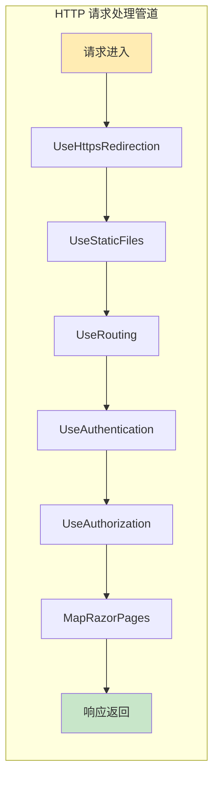
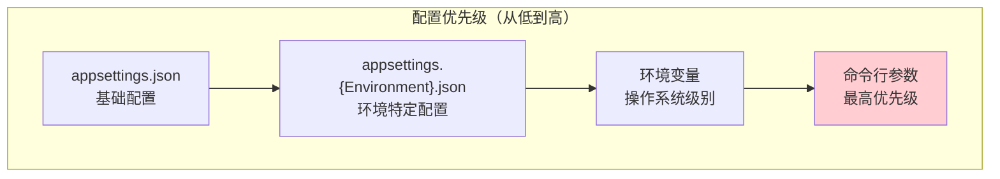
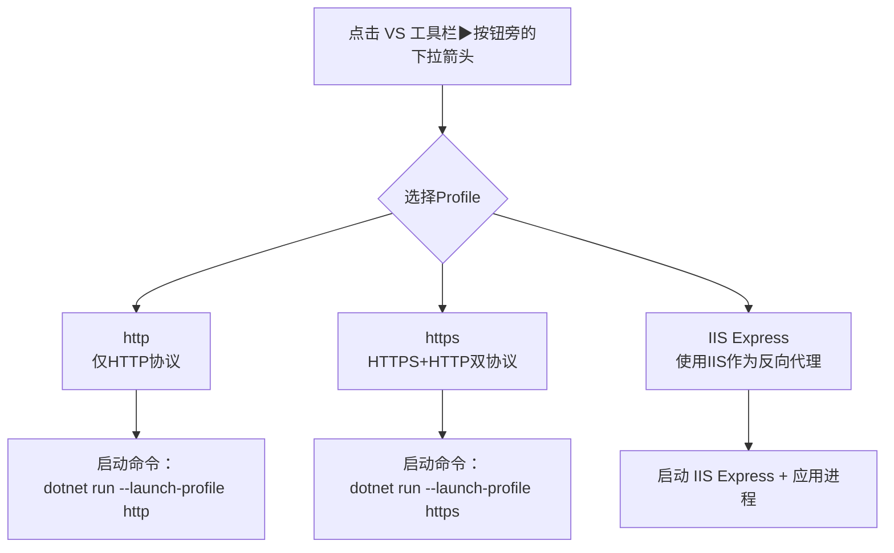
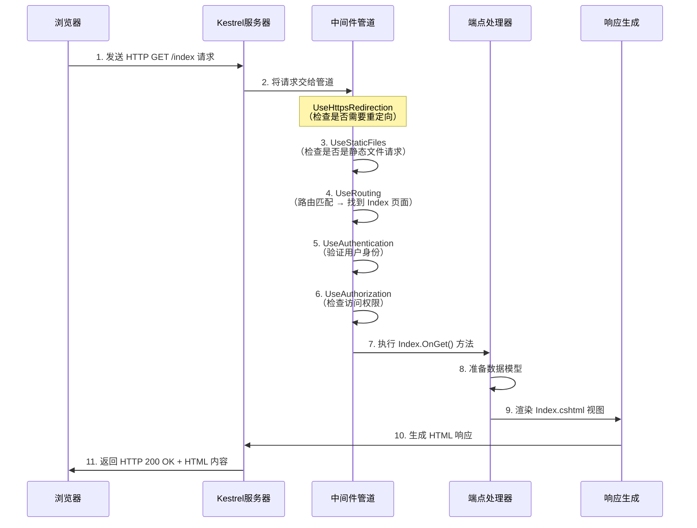

# 项目结构解析 - 深入理解 ASP.NET Core 内核

> **学习目标**：彻底理解 ASP.NET Core 项目的核心文件，掌握请求处理管道的工作原理

## 一、程序入口：Program.cs 的秘密

`Program.cs` 是整个应用程序的起点，就像一栋大楼的主入口。在 .NET 6 及以后的版本中，ASP.NET Core 使用了 **顶级语句（Top-level statements）** 特性，让代码更加简洁。

### 1.1 典型的 Program.cs 文件

让我们看看一个标准的 Razor Pages 应用的 `Program.cs`：

```csharp
using Microsoft.AspNetCore.Identity.UI.Services;

var builder = WebApplication.CreateBuilder(args);

// Add services to the container.
builder.Services.AddRazorPages();
builder.Services.AddDbContext<ApplicationDbContext>(options =>
    options.UseSqlServer(builder.Configuration.GetConnectionString("DefaultConnection") 
        ?? throw new InvalidOperationException("Connection string 'DefaultConnection' not found.")));

builder.Services.AddDefaultIdentity<IdentityUser>(options => options.SignIn.RequireConfirmedAccount = true)
    .AddEntityFrameworkStores<ApplicationDbContext>();

// 配置邮件发送服务（可选）
builder.Services.AddTransient<IEmailSender, NoOpEmailSender>();

var app = builder.Build();

// Configure the HTTP request pipeline.
if (!app.Environment.IsDevelopment())
{
    app.UseExceptionHandler("/Error");
    app.UseHsts();
}

app.UseHttpsRedirection();
app.UseStaticFiles();

app.UseRouting();

app.UseAuthentication();      // 认证中间件
app.UseAuthorization();       // 授权中间件

app.MapRazorPages();

app.Run();
```

### 1.2 逐行解析：构建阶段（Building）

```mermaid
flowchart TD
    A["WebApplication.CreateBuilder(args)"] --> B[创建 WebApplicationBuilder]
    B --> C[配置 Host/Logging/Configuration]
    C --> D[builder.Services.AddXxx()<br/>注册服务到依赖注入容器]
    D --> E["var app = builder.Build()"]
    E --> F[构建完成 WebApplication]
    
    style A fill:#e1f5fe
    style F fill:#c8e6c9
```

#### 第一行：`var builder = WebApplication.CreateBuilder(args);`

**作用：** 创建应用构建器，这是整个应用的基础设施搭建阶段。

**内部做了什么：**
- 加载配置文件（`appsettings.json` 等）
- 设置日志系统
- 配置依赖注入（DI）容器
- 准备 Web 主机环境

**参数 `args`：** 命令行参数数组，通常来自 `Main` 方法（但在顶级语句中自动传入）。

#### 注册服务：`builder.Services.AddXxx()`

这一步是将各种功能"注册"到依赖注入容器中：

```csharp
// 1. 注册 Razor Pages 服务（必须）
builder.Services.AddRazorPages();

// 2. 注册数据库上下文（如果使用 Entity Framework）
builder.Services.AddDbContext<MyDbContext>(options =>
    options.UseSqlite("Data Source=myapp.db"));

// 3. 注册自定义服务
builder.Services.AddScoped<IUserService, UserService>();
```

**为什么需要注册？** 这就像餐厅的服务员名单——只有登记过的服务员才能被叫去服务顾客。

#### 构建应用：`var app = builder.Build();`

**作用：** 将所有配置好的服务和设置"组装"成最终可运行的应用程序实例。

---

### 1.3 逐行解析：管道配置阶段（Pipeline Configuration）



每个 `app.Use...()` 方法都是在向 HTTP 管道中添加一个 **中间件（Middleware）**。

#### 中间件执行顺序的重要性

中间件的注册顺序就是请求的处理顺序！这非常重要：

```csharp
// ✅ 正确顺序：先认证，再授权
app.UseAuthentication();   // 1. 验证用户身份（你是谁？）
app.UseAuthorization();    // 2. 检查权限（你能做什么？）

// ❌ 错误顺序：授权时还不知道用户是谁！
// app.UseAuthorization();
// app.UseAuthentication();
```

**类比说明：** 就像进入公司大楼：
1. 先过安检门（认证 - 验证身份）
2. 再刷工卡进办公区（授权 - 检查权限）

#### 常用中间件一览表

| 中间件 | 作用 | 是否必需 |
|--------|------|----------|
| `UseDeveloperExceptionPage()` | 开发环境显示详细错误信息 | 开发时推荐 |
| `UseExceptionHandler()` | 生产环境错误处理 | 生产环境必需 |
| `UseHsts()` | 强制 HTTPS 安全头 | 生产环境推荐 |
| `UseHttpsRedirection()` | HTTP 自动跳转 HTTPS | 推荐 |
| `UseStaticFiles()` | 提供静态文件访问（CSS/JS/图片） | 有前端资源时必需 |
| `UseRouting()` | 路由匹配（决定哪个处理器处理请求） | 必需 |
| `UseAuthentication()` | 身份认证 | 需要登录功能时 |
| `UseAuthorization()` | 权限授权 | 需要权限控制时 |
| `MapRazorPages()` / `MapControllers()` | 映射端点 | 必需 |

#### 终端中间件：`app.MapXxx()`

这些方法定义了实际的请求"终点站"：

```csharp
// Razor Pages 应用
app.MapRazorPages();

// MVC 应用
app.MapControllerRoute(
    name: "default",
    pattern: "{controller=Home}/{action=Index}/{id?}");

// 最小 API（Minimal API）
app.MapGet("/api/hello", () => new { Message = "Hello World!" });
```

#### 启动应用：`app.Run();`

**作用：** 启动 Web 服务器，开始监听 HTTP 请求。这个方法会阻塞当前线程，直到应用停止。

---

## 二、配置文件：appsettings.json 详解

`appsettings.json` 是 ASP.NET Core 的主配置文件，采用 JSON 格式存储键值对。

### 2.1 默认配置内容

```json
{
  "Logging": {
    "LogLevel": {
      "Default": "Information",
      "Microsoft.AspNetCore": "Warning"
    }
  },
  "AllowedHosts": "*",
  "ConnectionStrings": {
    "DefaultConnection": "Server=(localdb)\\mssqllocaldb;Database=_CHANGE_ME;Trusted_Connection=True;"
  }
}
```

### 2.2 配置层次结构

ASP.NET Core 支持多环境配置覆盖机制：



**示例：开发环境的配置文件**

`appsettings.Development.json`:
```json
{
  "Logging": {
    "LogLevel": {
      "Default": "Debug",           // 覆盖为 Debug 级别
      "Microsoft.AspNetCore": "Information"
    }
  },
  "ConnectionStrings": {
    "DefaultConnection": "Server=(localdb)\\mssqllocaldb;Database=MyApp_Dev;Trusted_Connection=True;"
  }
}
```

### 2.3 在代码中使用配置

#### 方法一：通过 `IConfiguration` 接口（简单场景）

```csharp
// 在 Program.cs 或任何注入了 IConfiguration 的类中
var connectionString = builder.Configuration.GetConnectionString("DefaultConnection");
var allowedHosts = builder.Configuration["AllowedHosts"];
var maxFileSize = builder.Configuration.GetValue<int>("UploadSettings:MaxFileSize");
```

#### 方法二：强类型配置类（推荐）

**步骤 1：创建配置模型类**

```csharp
namespace MyApp.Models;

public class UploadSettings
{
    public int MaxFileSize { get; set; } = 10485760; // 默认10MB
    public string[] AllowedExtensions { get; set; } = [".jpg", ".png", ".pdf"];
    public string StoragePath { get; set; } = "./uploads";
}
```

**步骤 2：在 appsettings.json 中添加配置**

```json
{
  "UploadSettings": {
    "MaxFileSize": 20971520,
    "AllowedExtensions": [".jpg", ".png", ".gif", ".pdf", ".docx"],
    "StoragePath": "D:\\UploadedFiles"
  }
}
```

**步骤 3：在 Program.cs 中绑定**

```csharp
builder.Services.Configure<UploadSettings>(
    builder.Configuration.GetSection("UploadSettings"));
```

**步骤 4：在页面或控制器中使用**

```csharp
public class IndexModel : PageModel
{
    private readonly IOptions<UploadSettings> _uploadSettings;
    
    // 通过构造函数注入
    public IndexModel(IOptions<UploadSettings> uploadSettings)
    {
        _uploadSettings = uploadSettings;
    }

    public void OnGet()
    {
        var maxSize = _uploadSettings.Value.MaxFileSize;
        var extensions = _uploadSettings.Value.AllowedExtensions;
        
        // 使用配置...
    }
}
```

### 2.4 常见配置项说明

| 配置项 | 说明 | 示例值 |
|--------|------|--------|
| `Logging:LogLevel` | 日志级别控制 | `"Information"`、`"Warning"`、`"Error"` |
| `ConnectionStrings:*` | 数据库连接字符串 | 见上文示例 |
| `AllowedHosts` | 允许的主机名（防主机头攻击） | `"*"` 表示允许所有 |
| `Kestrel:Endpoints:*` | Kestrel 服务器端口配置 | 见下文 |

**自定义 Kestrel 端口示例：**
```json
{
  "Kestrel": {
    "Endpoints": {
      "Http": {
        "Url": "http://localhost:5000"
      },
      "Https": {
        "Url": "https://localhost:5001"
      }
    }
  }
}
```

---

## 三、静态文件目录：wwwroot 详解

`wwwroot` 是 Web 应用的根目录，存放所有客户端可以直接访问的静态资源文件。

### 3.1 目录结构规范

```
wwwroot/
├── css/                    # 样式表文件
│   ├── site.css           # 全局样式
│   └── bootstrap.min.css  # 第三方框架样式
├── js/                     # JavaScript 文件
│   └── site.js            # 自定义脚本
├── lib/                    # 第三方库（通过 LibMan 或 npm 安装）
│   ├── bootstrap/
│   └── jquery/
├── images/                 # 图片资源
│   ├── logo.png
│   └── banner.jpg
├── favicon.ico             # 网站图标（浏览器标签页显示）
└── uploads/                # 用户上传的文件（动态生成）
    └── documents/
```

### 3.2 如何引用静态文件

在 Razor 视图中，使用 `~` 符号表示 wwwroot 根目录：

```html
<!-- 在 .cshtml 文件中 -->
<link rel="stylesheet" href="~/css/site.css" />
<script src="~/js/site.js"></script>


<!-- 使用 Tag Helper（推荐方式） -->
<script src="~/lib/bootstrap/js/bootstrap.bundle.min.js"></script>
```

**注意：** `~` 符号会被自动解析为应用的根路径，确保在不同部署环境下都能正确工作。

### 3.3 静态文件中间件配置

默认情况下，`UseStaticFiles()` 只服务于 `wwwroot` 目录。你可以自定义行为：

```csharp
// 启用默认静态文件服务（wwwroot）
app.UseStaticFiles();

// 自定义静态文件目录（可选）
app.UseStaticFiles(new StaticFileOptions
{
    FileProvider = new PhysicalFileProvider(Path.Combine(Directory.GetCurrentDirectory(), "MyStaticFiles")),
    RequestPath = "/static"
});

// 现在可以通过 /static/path/to/file.txt 访问 MyStaticFiles 目录下的文件
```

### 3.4 静态文件的 MIME 类型

浏览器根据文件扩展名判断文件类型。如果遇到不常见的扩展名，可能无法正确识别：

```csharp
// 自定义 MIME 类型映射
var provider = new FileExtensionContentTypeProvider();
provider.Mappings[".mycustom"] = "application/x-custom";

app.UseStaticFiles(new StaticFileOptions
{
    ContentTypeProvider = provider
});
```

---

## 四、启动配置：launchSettings.json 解析

`launchSettings.json` 文件专门用于 Visual Studio 和 `dotnet run` 命令，控制应用如何启动。

### 4.1 典型配置内容

```json
{
  "$schema": "https://json.schemastore.org/launchsettings.json",
  "profiles": {
    "http": {
      "commandName": "Project",
      "dotnetRunMessages": true,
      "launchBrowser": true,
      "applicationUrl": "http://localhost:5000",
      "environmentVariables": {
        "ASPNETCORE_ENVIRONMENT": "Development"
      }
    },
    "https": {
      "commandName": "Project",
      "dotnetRunMessages": true,
      "launchBrowser": true,
      "applicationUrl": "https://localhost:5001;http://localhost:5000",
      "environmentVariables": {
        "ASPNETCORE_ENVIRONMENT": "Development"
      }
    },
    "IIS Express": {
      "commandName": "IISExpress",
      "launchBrowser": true,
      "environmentVariables": {
        "ASPNETCORE_ENVIRONMENT": "Development"
      }
    }
  }
}
```

### 4.2 关键配置项详解

| 属性 | 说明 | 示例值 |
|------|------|--------|
| `profiles` | 包含多个启动配置方案 | `"http"`、`"https"`、`"IIS Express"` |
| `commandName` | 启动方式 | `"Project"` (Kestrel)、`"IISExpress"` |
| `launchBrowser` | 启动后是否自动打开浏览器 | `true` / `false` |
| `applicationUrl` | 应用监听的 URL 地址 | `"http://localhost:5000"` |
| `environmentVariables` | 环境变量设置 | `ASPNETCORE_ENVIRONMENT` |
| `dotnetRunMessages` | 是否显示运行时消息 | `true` / `false` |

### 4.3 Profiles 的作用

你可以定义多个 Profile，在 Visual Studio 的工具栏下拉菜单中选择不同的启动方式：



### 4.4 自定义启动配置

假设你需要连接远程数据库进行测试，可以创建新的 Profile：

```json
{
  "profiles": {
    "RemoteDbTest": {
      "commandName": "Project",
      "dotnetRunMessages": true,
      "launchBrowser": false,              // 不打开浏览器
      "applicationUrl": "http://localhost:7000",  // 使用不同端口避免冲突
      "environmentVariables": {
        "ASPNETCORE_ENVIRONMENT": "Staging",     // 使用 Staging 环境
        "DB_CONNECTION_STRING": "Server=remote.server.com;Database=test_db;"  // 远程数据库
      }
    }
  }
}
```

---

## 五、完整的请求处理流程图解

现在我们将前面学到的所有知识串联起来，看一个 HTTP 请求是如何被处理的：



### 流程文字说明

1. **请求到达**：用户在浏览器输入地址并回车
2. **服务器接收**：Kestrel Web 服务器接收到原始 HTTP 请求
3. **中间件链处理**：
   - **HttpsRedirection**：如果是 HTTP 请求，301 重定向到 HTTPS
   - **StaticFiles**：检查 URL 是否对应 wwwroot 下的文件（如 `/css/style.css`），如果是则直接返回文件内容
   - **Routing**：解析 URL，匹配到对应的处理端点（如 Razor Page、Controller Action）
   - **Authentication**：验证用户是否已登录（读取 Cookie 或 Token）
   - **Authorization**：检查当前用户是否有权访问该资源
4. **端点执行**：调用具体的处理方法（如 `OnGet()`），执行业务逻辑
5. **视图渲染**：将数据填充到 Razor 模板，生成 HTML
6. **响应返回**：将 HTML 内容封装在 HTTP 响应中返回给浏览器

---

## 六、其他重要文件说明

### 6.1 .csproj 项目文件

`.csproj` 文件定义了项目的元数据和依赖关系：

```xml
<Project Sdk="Microsoft.NET.Sdk.Web">
  
  <PropertyGroup>
    <TargetFramework>net8.0</TargetFramework>
    <Nullable>enable</Nullable>
    <ImplicitUsings>enable</ImplicitUsings>
    <RootNamespace>MyApp</RootNamespace>
  </PropertyGroup>

  <ItemGroup>
    <!-- NuGet 包引用 -->
    <PackageReference Include="Microsoft.EntityFrameworkCore.SqlServer" Version="8.0.0" />
    <PackageReference Include="Microsoft.EntityFrameworkCore.Tools" Version="8.0.0">
      <PrivateAssets>all</PrivateAssets>
      <IncludeAssets>runtime; build; native; contentfiles; analyzers; buildtransitive</IncludeAssets>
    </PackageReference>
  </ItemGroup>

</Project>
```

**关键元素解释：**
- `<Project Sdk="...">`: 指定项目 SDK 类型（Web/ClassLibrary/Worker）
- `<TargetFramework>`: 目标 .NET 版本
- `<Nullable>`: 启用可空引用类型（C# 8.0+特性）
- `<ImplicitUsings>`: 自动导入常用命名空间
- `<PackageReference>`: 引用外部 NuGet 包

### 6.2 Pages/_ViewImports.cshtml

全局 using 导入文件，作用类似于 C# 的 `using` 语句：

```cshtml
@using Microsoft.AspNetCore.Identity
@using MyApp.Data
@using MyApp.Models
@addTagHelper *, Microsoft.AspNetCore.Mvc.TagHelpers
```

这样在每个页面中就不需要重复写 `@using` 了。

### 6.3 Pages/_ViewStart.cshtml

指定默认使用的布局文件：

```cshtml
@{
    Layout = "_Layout";
}
```

如果某个页面不想使用布局，可以在该页面顶部设置：
```cshtml
@{
    Layout = null;
}
```

---

## 七、常见问题与陷阱

### Q1：修改了代码但刷新页面没有变化？
**A：** 可能的原因：
1. 浏览器缓存：按 `Ctrl + F5` 强制刷新
2. 编译错误：查看终端输出是否有红色错误信息
3. 热重载未生效：尝试重启应用（`Ctrl+C` 后重新 `dotnet run`）

### Q2：为什么我的 CSS/JS 文件访问不到？
**A：** 检查以下几点：
1. 文件确实放在 `wwwroot` 目录下了吗？
2. 引用路径是否以 `~` 开头？（如 `href="~/css/style.css"`）
3. 是否调用了 `app.UseStaticFiles()`？

### Q3：appsettings.json 中的中文乱码怎么办？
**A：** 确保：
1. 文件保存编码为 UTF-8 with BOM（Visual Studio 默认）
2. 如果使用记事本编辑，另存为时选择"UTF-8"编码

### Q4：如何区分 Development 和 Production 环境？
**A：** 通过环境变量 `ASPNETCORE_ENVIRONMENT` 控制：
- 本地开发：默认为 `Development`
- 部署到服务器：设置为 `Production`
- 在 Azure/App Service 中可在门户设置

---

## 八、动手练习

### 练习 1：观察中间件执行顺序（基础）

**任务：** 创建一个新的 web 项目，修改 Program.cs，添加自定义中间件观察执行顺序。

```bash
dotnet new web -n MiddlewareDemo -o MiddlewareDemo
cd MiddlewareDemo
```

**修改 Program.cs：**

```csharp
var builder = WebApplication.CreateBuilder(args);
var app = builder.Build();

// 自定义中间件 1
app.Use(async (context, next) =>
{
    Console.WriteLine($"[中间件1] 请求: {context.Request.Path}");
    await next.Invoke(); // 调用下一个中间件
    Console.WriteLine($"[中间件1] 响应: {context.Response.StatusCode}");
});

// 自定义中间件 2
app.Use(async (context, next) =>
{
    Console.WriteLine("[中间件2] 处理中...");
    await next.Invoke();
});

app.MapGet("/", () => "Hello from middleware demo!");

app.Run();
```

**要求：** 运行应用并访问 http://localhost:5000/，观察控制台输出的顺序。

---

### 练习 2：配置文件实验（进阶）

**任务：** 在 appsettings.json 中添加自定义配置，并在页面中显示。

**步骤 1：** 修改 `appsettings.json`，添加：

```json
{
  "SiteSettings": {
    "Title": "我的第一个 ASP.NET 网站",
    "Author": "你的名字",
    "Version": "1.0.0"
  }
}
```

**步骤 2：** 创建配置模型类 `Models/SiteSettings.cs`:

```csharp
namespace MiddlewareDemo.Models;

public class SiteSettings
{
    public string Title { get; set; } = "默认标题";
    public string Author { get; set; } = "匿名";
    public string Version { get; set; } = "0.0.0";
}
```

**步骤 3：** 在 Program.cs 中绑定配置并测试。

**思考：** 尝试在 `appsettings.Development.json` 中覆盖 `Title` 为"开发环境版本"，观察效果。

---

### 练习 3：静态文件组织（实践）

**任务：** 在 wwwroot 下创建合理的目录结构，并在页面中引用。

**要求：**
1. 在 `wwwroot/images/` 放置一张图片（可以是任意 .jpg 或 .png 文件）
2. 创建 `wwwroot/css/custom.css`，写入以下内容：

```css
body {
    font-family: 'Segoe UI', Tahoma, Geneva, Verdana, sans-serif;
    background-color: #f5f5f5;
}

.custom-header {
    color: #0066cc;
    text-align: center;
    padding: 20px;
}
```

3. 修改首页引用这些资源，使页面显示图片和自定义样式。

---

### 练习 4：研究 launchSettings.json（探索性）

**任务：** 修改 launchSettings.json，实现以下目标：

1. 新增一个名为 "TestProfile" 的 profile
2. 设置端口为 9000
3. 设置环境变量 `CustomEnvVar` 为 `TestValue`
4. 在 Program.cs 中读取并打印这个环境变量

**提示：** 使用 `Environment.GetEnvironmentVariable("CustomEnvVar")` 读取。

---

### 练习 5：绘制架构图（挑战性）

**任务：** 基于你对本章的理解，画出你所在项目的完整架构图，包括：

1. 用户浏览器
2. 反向代理（如 Nginx/IIS，可选）
3. Kestrel 服务器
4. 中间件管道（至少列出5个中间件）
5. 端点处理器
6. 数据库（如果有）

可以使用 Mermaid 语法或手绘拍照。

---

## 九、本章小结

在本章中，我们深入学习了：

✅ **Program.cs 的两阶段构建模式**：构建器配置 + 管道配置  
✅ **中间件管道的工作原理**：洋葱模型、执行顺序的重要性  
✅ **配置系统的层次结构**：JSON文件 > 环境变量 > 命令行参数  
✅ **静态文件的组织方式**：wwwroot 目录规范和引用方法  
✅ **启动配置的管理**：launchSettings.json 的 Profiles 机制  

**核心要点记忆：**
- `WebApplication.CreateBuilder()` = 准备食材和厨具
- `builder.Services.AddXxx()` = 登记服务员
- `builder.Build()` = 开业准备完毕
- `app.UseXxx()` = 设置服务流程
- `app.MapXxx()` = 定义具体服务项目
- `app.Run()` = 正式开门营业！

**下一步：** 在下一章《运行与调试》中，我们将学习如何在 Visual Studio 中高效地运行和调试应用，掌握断点、监视窗口等开发者必备技能！

---

## 参考资源

- [官方文档：ASP.NET Core 应用程序基本结构](https://docs.microsoft.com/aspnet/core/fundamentals/)
- [官方文档：中间件管道](https://docs.microsoft.com/asp.net/core/fundamentals/middleware/index)
- [官方文档：配置系统](https://docs.microsoft.com/asp.net/core/fundamentals/configuration/)
- [Microsoft Learn：ASP.NET Core 中的依赖注入](https://docs.microsoft.com/asp.net/core/fundamentals/dependency-injection)

> **作者注：** 务必亲手敲一遍 Program.cs 中的每一行代码，而不是复制粘贴。肌肉记忆是最好的老师！
