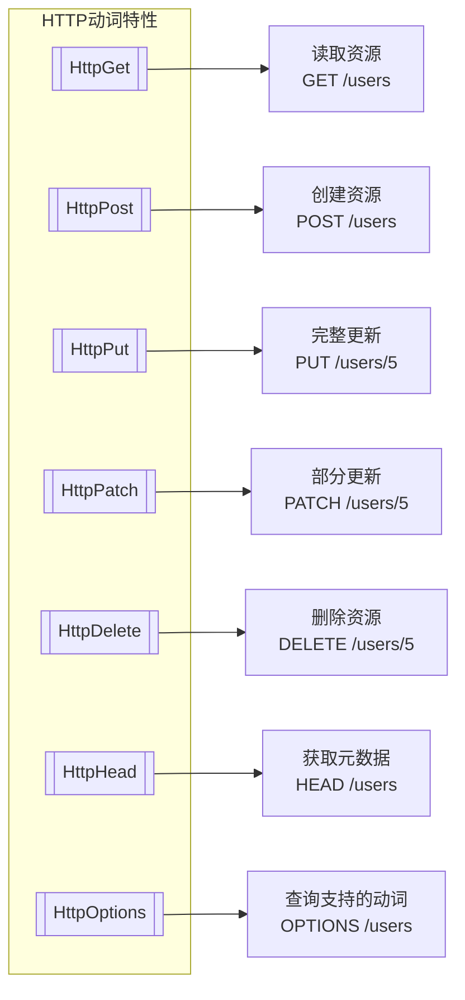
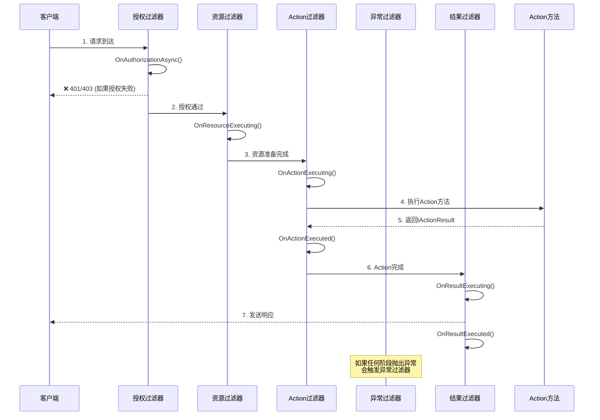
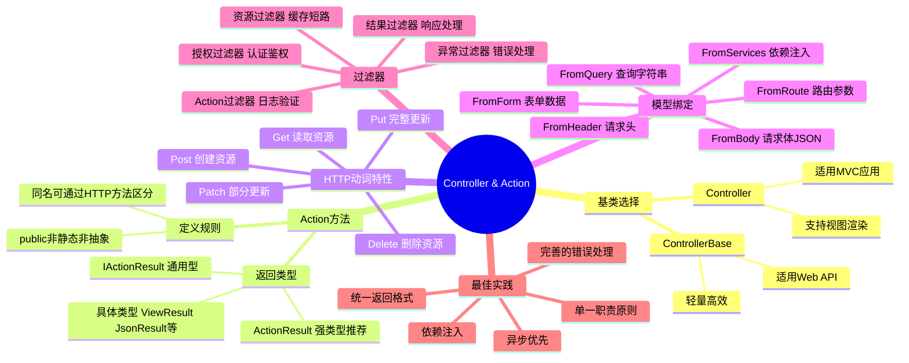

# Controller与Action

> **学习目标**：掌握ASP.NET Core MVC中Controller和Action的核心概念、使用方法和最佳实践
>
> **前置知识**：了解MVC模式基础、路由系统原理
>
> **预计时间**：55-70分钟
>
> **难度等级**：⭐⭐⭐ 中级

---

## 一、ControllerBase vs Controller 基类

### 1.1 两个基类的区别

在ASP.NET Core MVC中，创建Controller时可以选择继承两个不同的基类：

| 特性 | `ControllerBase` | `Controller` |
|------|------------------|--------------|
| **适用场景** | Web API（返回JSON/XML） | 传统MVC（返回视图）+ API混合 |
| **视图支持** | ❌ 不支持View()方法 | ✅ 支持View()、PartialView()等 |
| **HtmlHelper** | ❌ 不可用 | ✅ 可用（Html.ActionLink等） |
| **TempData/ViewBag** | ❌ 不可用 | ✅ 可用 |
| **Razor Pages支持** | 部分 | 完整 |
| **性能** | 略高（功能少） | 略低（功能多） |
| **推荐场景** | 纯API项目 | 需要返回HTML页面的项目 |

### 1.2 使用示例对比

#### ControllerBase - 用于Web API

```csharp
using Microsoft.AspNetCore.Mvc;

namespace ApiDemo.Controllers
{
    [ApiController]
    [Route("api/[controller]")]
    public class ProductsApiController : ControllerBase
    {
        private readonly IProductService _productService;
        private readonly ILogger<ProductsApiController> _logger;

        public ProductsApiController(
            IProductService productService,
            ILogger<ProductsApiController> logger)
        {
            _productService = productService;
            _logger = logger;
        }

        // GET: api/products
        [HttpGet]
        public async Task<ActionResult<IEnumerable<ProductDto>>> GetAll()
        {
            try
            {
                var products = await _productService.GetAllAsync();
                return Ok(products);  // 返回200 + JSON
            }
            catch (Exception ex)
            {
                _logger.LogError(ex, "获取产品列表失败");
                return StatusCode(500, new { error = "服务器内部错误" });
            }
        }

        // GET: api/products/5
        [HttpGet("{id:int}")]
        public async Task<ActionResult<ProductDto>> GetById(int id)
        {
            var product = await _productService.GetByIdAsync(id);
            if (product == null)
            {
                return NotFound(new { message = $"产品ID {id} 不存在" });  // 返回404
            }
            return Ok(product);
        }

        // POST: api/products
        [HttpPost]
        public async Task<ActionResult<ProductDto>> Create([FromBody] CreateProductDto dto)
        {
            if (!ModelState.IsValid)
            {
                return BadRequest(ModelState);  // 返回400 + 错误详情
            }

            var createdProduct = await _productService.CreateAsync(dto);
            return CreatedAtAction(
                nameof(GetById),
                new { id = createdProduct.Id },
                createdProduct);  // 返回201 + Location头
        }
    }
}
```

#### Controller - 用于MVC应用（返回视图）

```csharp
using Microsoft.AspNetCore.Mvc;

namespace MvcDemo.Controllers
{
    public class ProductsController : Controller
    {
        private readonly IProductService _productService;
        private readonly ILogger<ProductsController> _logger;

        public ProductsController(
            IProductService productService,
            ILogger<ProductsController> logger)
        {
            _productService = productService;
            _logger = logger;
        }

        // GET: /products → 返回Razor视图
        public async Task<IActionResult> Index()
        {
            var products = await _productService.GetAllAsync();
            return View(products);  // Views/Products/Index.cshtml
        }

        // GET: /products/details/5
        public async Task<IActionResult> Details(int? id)
        {
            if (id == null) return BadRequest();

            var product = await _productService.GetByIdAsync(id.Value);
            if (product == null) return NotFound();

            ViewBag.RelatedProducts = await _productService.GetRelatedAsync(id.Value);
            return View(product);  // Views/Products/Details.cshtml
        }

        // GET: /products/create → 显示创建表单
        public IActionResult Create()
        {
            ViewBag.Categories = _productService.GetAllCategories();
            return View();  // Views/Products/Create.cshtml
        }

        // POST: /products/create → 处理表单提交
        [HttpPost]
        [ValidateAntiForgeryToken]
        public async Task<IActionResult> Create(CreateProductViewModel model)
        {
            if (!ModelState.IsValid)
            {
                ViewBag.Categories = _productService.GetAllCategories();
                return View(model);  // 验证失败，重新显示表单并显示错误
            }

            try
            {
                var productId = await _productService.CreateAsync(model);
                TempData["SuccessMessage"] = "产品创建成功！";
                return RedirectToAction(nameof(Details), new { id = productId });
            }
            catch (Exception ex)
            {
                _logger.LogError(ex, "创建产品失败");
                ModelState.AddModelError("", "创建产品时发生错误，请重试。");
                ViewBag.Categories = _productService.GetAllCategories();
                return View(model);
            }
        }
    }
}
```

### 1.3 如何选择？

```mermaid
flowchart TD
    A[项目类型？] --> B[纯Web API？]
    B -->|是| C[✅ 使用 ControllerBase<br>+ [ApiController] 特性]
    B -->|否| D[需要返回HTML页面？]
    D -->|是| E[✅ 使用 Controller<br>支持View/PartialView]
    D -->|部分需要| F[✅ 使用 Controller<br>同一个Controller中<br>混用View和Json返回]

    style C fill:#90EE90
    style E fill:#87CEEB
    style F fill:#DDA0DD
```

---

## 二、Action方法的定义和返回类型

### 2.1 Action方法的定义规则

#### 基本要求

```csharp
// ✅ 正确的Action方法定义
public class HomeController : Controller
{
    // 1. 必须是public方法
    public IActionResult Index()
    {
        return View();
    }

    // 2. 不能是静态方法
    // ❌ public static IActionResult About() { ... }

    // 3. 不能是抽象方法
    // ❌ public abstract IActionResult Contact();

    // 4. 不能被重载（除非使用[ActionName]）
    public IActionResult Edit(int id) { /* 编辑页面 */ }
    [HttpPost]
    public IActionResult Edit(int id, Product model) { /* 提交编辑 */ }  // 允许通过HTTP方法区分

    // 5. 可以有重载版本（不推荐，容易混淆）
}
```

#### 方法命名约定

```csharp
public class UserController : Controller
{
    // 标准CRUD操作命名（推荐）
    public IActionResult Index() { }           // 列表页
    public IActionResult Details(int id) { }   // 详情页
    public IActionResult Create() { }          // 显示创建表单
    [HttpPost] public IActionResult Create(UserModel model) { }  // 处理创建
    public IActionResult Edit(int id) { }      // 显示编辑表单
    [HttpPost] public IActionResult Edit(int id, UserModel model) { }  // 处理编辑
    public IActionResult Delete(int id) { }   // 显示删除确认
    [HttpPost] public IActionResult DeleteConfirmed(int id) { }  // 执行删除

    // 自定义操作命名（清晰表达意图）
    public IActionResult Search(string keyword) { }
    public IActionResult ExportToExcel() { }
    public IActionResult PrintReport(int id) { }

    // 异步Action（推荐用于IO操作）
    public async Task<IActionResult> AsyncOperation()
    {
        await Task.Delay(100);  // 模拟异步操作
        return View();
    }
}
```

### 2.2 返回类型详解

#### IActionResult - 最通用的返回类型

`IActionResult`是一个接口，可以返回多种类型的响应：

```csharp
public class ActionResultExamplesController : Controller
{
    #region 成功响应 (2xx)

    // 200 OK - 成功返回数据或视图
    public IActionResult ReturnOk()
    {
        // 方式1：返回视图（MVC常用）
        return View();  // 返回默认视图

        // 方式2：返回JSON数据（API常用）
        return Ok(new { message = "成功", data = "some data" });

        // 方式3：返回文本内容
        return Content("纯文本内容", "text/plain");

        // 方式4：返回文件
        return File(System.IO.File.ReadAllBytes("file.pdf"), "application/pdf", "report.pdf");

        // 方式5：返回空内容（常用于PUT/PATCH/DELETE）
        return NoContent();  // 204 No Content
    }

    // 201 Created - 资源创建成功
    [HttpPost]
    public IActionResult ReturnCreated(Resource createdResource)
    {
        return CreatedAtAction(
            nameof(GetById),
            new { id = createdResource.Id },
            createdResource);
    }

    #endregion

    #region 重定向响应 (3xx)

    // 302 Found / 303 See Other - 重定向到其他URL
    public IActionResult RedirectExample()
    {
        // 重定向到另一个Action
        return RedirectToAction(nameof(Index));

        // 重定向到指定Controller的Action
        return RedirectToAction("Details", "User", new { id = 5 });

        // 重定向到绝对URL
        return Redirect("https://www.example.com");

        // 永久重定向（301）- SEO友好
        return RedirectPermanent("https://new-domain.com/page");

        // 重定向到本地路由
        return RedirectToRoute(new { controller = "Home", action = "About" });
    }

    #endregion

    #region 客户端错误 (4xx)

    // 400 Bad Request - 请求参数无效
    public IActionResult BadRequestExample()
    {
        return BadRequest("请求参数错误");
        return BadRequest(new { errors = new[] { "字段A不能为空", "字段B格式错误" } });
        return BadRequest(ModelState);  // 返回模型验证错误
    }

    // 401 Unauthorized - 未认证
    [Authorize]
    public IActionResult UnauthorizedExample()
    {
        if (!User.Identity.IsAuthenticated)
        {
            return Challenge();  // 触发登录挑战（401）
        }
        return Ok();
    }

    // 403 Forbidden - 无权限
    public IActionResult ForbiddenExample()
    {
        if (!User.IsInRole("Admin"))
        {
            return Forbid();  // 403 Forbidden
        }
        return Ok();
    }

    // 404 Not Found - 资源不存在
    public IActionResult NotFoundExample(int id)
    {
        var item = _service.FindById(id);
        if (item == null)
        {
            return NotFound();  // 或 NotFound(new { message = "资源不存在" });
        }
        return Ok(item);
    }

    // 409 Conflict - 资源冲突
    [HttpPost]
    public IActionResult ConflictExample(CreateModel model)
    {
        if (_service.Exists(model.Name))
        {
            return Conflict(new { message = $"名称 '{model.Name}' 已存在" });
        }
        return Created(model);
    }

    // 422 Unprocessable Entity - 语义错误（验证失败但格式正确）
    public IActionResult UnprocessableEntityExample()
    {
        ModelState.AddModelError("", "业务逻辑验证失败");
        return UnprocessableEntity(ModelState);
    }

    #endregion

    #region 服务端错误 (5xx)

    // 500 Internal Server Error - 服务器内部错误
    public IActionResult ServerErrorExample()
    {
        try
        {
            // 业务逻辑...
        }
        catch (Exception ex)
        {
            _logger.LogError(ex, "处理请求时发生错误");
            return StatusCode(500, new { error = "服务器内部错误" });
        }
        return Ok();
    }

    #endregion
}
```

#### ActionResult<T> - 强类型的返回类型（推荐）

从ASP.NET Core 2.1开始引入，结合了`IActionResult`的灵活性和强类型的优势：

```csharp
using Microsoft.AspNetCore.Mvc;

namespace TypedResultDemo.Controllers
{
    [ApiController]
    [Route("api/[controller]")]
    public class UsersController : ControllerBase
    {
        private readonly IUserService _userService;

        public UsersController(IUserService userService)
        {
            _userService = userService;
        }

        /// <summary>
        /// GET: api/users
        /// 返回用户列表（可以是Ok也可以是其他状态码）
        /// </summary>
        [HttpGet]
        public async Task<ActionResult<IEnumerable<UserDto>>> GetUsers()
        {
            try
            {
                var users = await _userService.GetAllAsync();
                return Ok(users);  // 自动推断为 ActionResult<IEnumerable<UserDto>>
            }
            catch (Exception ex)
            {
                _logger.LogError(ex, "获取用户列表失败");
                return StatusCode(StatusCodes.Status500InternalServerError,
                    new ApiError { Message = "获取用户列表失败", Details = ex.Message });
            }
        }

        /// <summary>
        /// GET: api/users/5
        /// 返回单个用户（可能是200、404或其他）
        /// </summary>
        [HttpGet("{id:int}")]
        public async Task<ActionResult<UserDto>> GetUser(int id)
        {
            var user = await _userService.GetByIdAsync(id);

            switch (user)
            {
                case null:
                    return NotFound(new ApiResponse<UserDto>
                    {
                        Success = false,
                        Message = $"ID为 {id} 的用户不存在",
                        Data = null,
                        Timestamp = DateTime.UtcNow
                    });

                case var u when !u.IsActive:
                    return Conflict(new ApiResponse<UserDto>
                    {
                        Success = false,
                        Message = "该用户已被禁用",
                        Data = null
                    });

                default:
                    return Ok(new ApiResponse<UserDto>
                    {
                        Success = true,
                        Message = "获取成功",
                        Data = MapToDto(u),
                        Timestamp = DateTime.UtcNow
                    });
            }
        }

        /// <summary>
        /// POST: api/users
        /// 创建用户（返回201或400）
        /// </summary>
        [HttpPost]
        public async Task<ActionResult<UserDto>> CreateUser([FromBody] CreateUserDto dto)
        {
            // 验证模型
            if (!ModelState.IsValid)
            {
                return BadRequest(new ApiResponse<object>
                {
                    Success = false,
                    Message = "输入数据验证失败",
                    Errors = ModelState.ToDictionary(
                        kvp => kvp.Key,
                        kvp => kvp.Value.Errors.Select(e => e.ErrorMessage).ToArray())
                });
            }

            // 检查唯一性
            if (await _userService.EmailExistsAsync(dto.Email))
            {
                return Conflict(new ApiResponse<object>
                {
                    Success = false,
                    Message = "该邮箱已被注册"
                });
            }

            try
            {
                var createdUser = await _userService.CreateAsync(dto);

                return CreatedAtAction(
                    nameof(GetUser),
                    new { id = createdUser.Id },
                    new ApiResponse<UserDto>
                    {
                        Success = true,
                        Message = "用户创建成功",
                        Data = MapToDto(createdUser),
                        Timestamp = DateTime.UtcNow
                    });
            }
            catch (Exception ex)
            {
                _logger.LogError(ex, "创建用户失败");
                return StatusCode(StatusCodes.Status500InternalServerError,
                    new ApiResponse<object>
                    {
                        Success = false,
                        Message = "创建用户时发生内部错误"
                    });
            }
        }

        /// <summary>
        /// DELETE: api/users/5
        /// 删除用户（返回204、404或403）
        /// </summary>
        [HttpDelete("{id:int}")]
        public async Task<IActionResult> DeleteUser(int id)
        {
            var user = await _userService.GetByIdAsync(id);

            if (user == null)
                return NotFound(new { message = "用户不存在" });

            if (user.IsAdmin && !CurrentUser.IsSuperAdmin)
                return Forbid(new { message = "无权限删除管理员账户" });

            await _userService.DeleteAsync(id);
            return NoContent();
        }

        #region 辅助方法和DTO定义

        private UserDto MapToDto(User user)
        {
            return new UserDto
            {
                Id = user.Id,
                UserName = user.UserName,
                Email = user.Email,
                DisplayName = user.DisplayName,
                AvatarUrl = user.AvatarUrl,
                Role = user.Role.Name,
                CreatedAt = user.CreatedAt,
                LastLoginAt = user.LastLoginAt
            };
        }

        public record UserDto(
            int Id,
            string UserName,
            string Email,
            string DisplayName,
            string? AvatarUrl,
            string Role,
            DateTime CreatedAt,
            DateTime? LastLoginAt
        );

        public record CreateUserDto(
            [Required][MinLength(3)] string UserName,
            [Required][EmailAddress] string Email,
            string? DisplayName,
            [Required][MinLength(8)] string Password
        );

        public record ApiResponse<T>(
            bool Success,
            string Message,
            T? Data = default,
            Dictionary<string, string[]>? Errors = null,
            DateTime? Timestamp = null
        );

        public record ApiError(string Message, string? Details = null);

        #endregion
    }
}
```

**为什么推荐使用ActionResult<T>？**

1. **Swagger/OpenAPI文档自动生成**：可以准确知道返回的数据结构
2. **编译时类型检查**：避免返回错误的类型
3. **IDE智能提示更好**：自动补全和方法导航
4. **代码更清晰**：明确表达了预期的返回类型

---

## 三、HTTP动词特性

### 3.1 HTTP动词特性一览

ASP.NET Core MVC通过特性（Attribute）来限制Action接受的HTTP方法：



### 3.2 详细用法示例

```csharp
using Microsoft.AspNetCore.Mvc;
using Microsoft.AspNetCore.Authorization;

namespace HttpMethodDemo.Controllers
{
    [Route("api/[controller]")]
    [ApiController]
    public class ArticlesController : ControllerBase
    {
        private readonly IArticleService _articleService;
        private readonly ILogger<ArticlesController> _logger;

        public ArticlesController(IArticleService articleService, ILogger<ArticlesController> logger)
        {
            _articleService = articleService;
            _logger = logger;
        }

        #region GET - 获取资源

        /// <summary>
        /// GET: api/articles
        /// 获取文章列表（支持分页、筛选、排序）
        /// </summary>
        [HttpGet]
        public async Task<ActionResult<PagedResult<ArticleSummaryDto>>> GetArticles(
            [FromQuery] int pageNumber = 1,
            [FromQuery] int pageSize = 20,
            [FromQuery] string? category = null,
            [FromQuery] string? tag = null,
            [FromQuery] string? search = null,
            [FromQuery] string sortBy = "published_at",
            [FromQuery] string sortOrder = "desc")
        {
            _logger.LogInformation("获取文章列表: Page={Page}, Size={Size}, Category={Category}",
                pageNumber, pageSize, category ?? "all");

            var filter = new ArticleFilter
            {
                PageNumber = Math.Max(1, pageNumber),
                PageSize = Math.Clamp(pageSize, 1, 100),
                Category = category,
                Tag = tag,
                SearchKeyword = search,
                SortBy = sortBy.ToLower(),
                SortOrder = sortOrder.ToLower()
            };

            var result = await _articleService.GetFilteredArticlesAsync(filter);

            // 添加分页元信息到响应头
            Response.Headers["X-Pagination"] = JsonSerializer.Serialize(new
            {
                result.TotalCount,
                result.TotalPages,
                result.PageNumber,
                result.PageSize,
                HasNext = result.PageNumber < result.TotalPages,
                HasPrevious = result.PageNumber > 1
            });

            return Ok(result);
        }

        /// <summary>
        /// GET: api/articles/{id}
        /// 获取单篇文章详情
        /// </summary>
        [HttpGet("{id:int}")]
        public async Task<ActionResult<ArticleDetailDto>> GetArticle(int id)
        {
            var article = await _articleService.GetByIdAsync(id);

            if (article == null)
            {
                _logger.LogWarning("文章未找到: ID={Id}", id);
                return NotFound(new ApiError
                {
                    Code = "ARTICLE_NOT_FOUND",
                    Message = $"ID为 {id} 的文章不存在",
                    Details = "请检查文章ID是否正确，或尝试搜索相关文章"
                });
            }

            // 异步增加阅读计数（不阻塞响应）
            _ = _articleService.IncrementViewCountAsync(id);

            var dto = MapToDetailDto(article);
            return Ok(dto);
        }

        /// <summary>
        /// HEAD: api/articles/{id}
        /// 仅获取文章元信息（不返回body）
        /// 用于检查资源是否存在或获取Last-Modified时间
        /// </summary>
        [HttpHead("{id:int}")]
        public async Task<IActionResult> HeadArticle(int id)
        {
            var exists = await _articleService.ExistsAsync(id);
            if (!exists) return NotFound();

            // 设置响应头但不返回body
            Response.Headers["Cache-Control"] = "public, max-age=3600";
            Response.Headers["X-Author"] = "Article Service v1.0";

            return Ok();
        }

        #endregion

        #region POST - 创建资源

        /// <summary>
        /// POST: api/articles
        /// 创建新文章（需要认证）
        /// </summary>
        [HttpPost]
        [Authorize]
        [ProducesResponseType(typeof(ArticleDto), StatusCodes.Status201Created)]
        [ProducesResponseType(typeof(ApiError), StatusCodes.Status400BadRequest)]
        [ProducesResponseType(typeof(ApiError), StatusCodes.Status401Unauthorized)]
        public async Task<ActionResult<ArticleDto>> CreateArticle([FromBody] CreateArticleDto dto)
        {
            #region 输入验证增强

            // 自定义业务验证（超出Data Annotations的范围）
            if (dto.PublishNow && string.IsNullOrWhiteSpace(dto.Content))
            {
                ModelState.AddModelError(nameof(dto.Content),
                    "发布文章时不能提交空内容");
            }

            if (dto.Tags?.Count > 10)
            {
                ModelState.AddModelError(nameof(dto.Tags),
                    "标签数量不能超过10个");
            }

            if (!ModelState.IsValid)
            {
                return BadRequest(new ValidationErrorResponse
                {
                    Type = "validation_error",
                    Errors = ModelState.ToDictionary(
                        kvp => ToCamelCase(kvp.Key),
                        kvp => kvp.Value.Errors.Select(e =>
                            new ValidationError(e.ErrorMessage)).ToArray()),
                    TraceId = HttpContext.TraceIdentifier
                });
            }

            #endregion

            try
            {
                var currentUserId = GetCurrentUserId();
                var article = await _articleService.CreateAsync(currentUserId, dto);

                _logger.LogInformation("文章创建成功: ID={Id}, Title={Title}",
                    article.Id, article.Title);

                return CreatedAtAction(
                    nameof(GetArticle),
                    new { id = article.Id },
                    MapToDto(article));
            }
            catch (BusinessRuleViolationException ex)
            {
                _logger.LogWarning(ex, "业务规则违反: {Message}", ex.Message);
                return UnprocessableEntity(new ApiError
                {
                    Code = "BUSINESS_RULE_VIOLATION",
                    Message = ex.Message
                });
            }
            catch (Exception ex)
            {
                _logger.LogError(ex, "创建文章时发生意外错误");
                return StatusCode(StatusCodes.Status500InternalServerError,
                    new ApiError { Message = "服务器内部错误，请稍后重试" });
            }
        }

        #endregion

        #region PUT - 完整更新资源

        /// <summary>
        /// PUT: api/articles/{id}
        /// 完整更新文章（替换所有字段）
        /// </summary>
        [HttpPut("{id:int}")]
        [Authorize]
        public async Task<IActionResult> UpdateArticle(int id, [FromBody] UpdateArticleDto dto)
        {
            if (id != dto.Id)
            {
                return BadRequest(new ApiError
                {
                    Code = "ID_MISMATCH",
                    Message = "URL中的ID与请求体中的ID不一致"
                });
            }

            var existingArticle = await _articleService.GetByIdAsync(id);
            if (existingArticle == null)
                return NotFound();

            // 权限检查：只有作者或管理员可以编辑
            if (!CanEditArticle(existingAuthorId: existingArticle.AuthorId))
            {
                return Forbid(new ApiError
                {
                    Code = "FORBIDDEN",
                    Message = "您没有权限编辑此文章"
                });
            }

            try
            {
                await _articleService.UpdateFullAsync(id, dto);
                return NoContent();
            }
            catch (DbUpdateConcurrencyException)
            {
                // 并发冲突检测
                if (!await _articleService.ExistsAsync(id))
                    return NotFound();

                return Conflict(new ApiError
                {
                    Code = "CONCURRENT_MODIFICATION",
                    Message = "文章已被其他人修改，请刷新后重试"
                });
            }
        }

        #endregion

        #region PATCH - 部分更新资源

        /// <summary>
        /// PATCH: api/articles/{id}
        /// 部分更新文章（只更新提供的字段）
        /// 示例: [{"op": "replace", "path": "/title", "value": "新标题"}]
        /// </summary>
        [HttpPatch("{id:int}")]
        [Authorize]
        public async Task<IActionResult> PartialUpdateArticle(
            int id,
            [FromBody] JsonPatchDocument<Article> patchDoc)
        {
            var article = await _articleService.GetByIdAsync(id);
            if (article == null)
                return NotFound();

            // 应用补丁文档
            patchDoc.ApplyTo(article, ModelState);

            if (!ModelState.IsValid)
                return BadRequest(ModelState);

            // 手动验证修改后的对象
            if (!TryValidateModel(article))
                return BadRequest(ModelState);

            article.UpdatedAt = DateTime.UtcNow;
            await _articleService.UpdateAsync(article);

            return NoContent();
        }

        #endregion

        #region DELETE - 删除资源

        /// <summary>
        /// DELETE: api/articles/{id}
        /// 删除文章（软删除）
        /// </summary>
        [HttpDelete("{id:int}")]
        [Authorize(Roles = "Admin,Moderator")]
        public async Task<IActionResult> DeleteArticle(int id)
        {
            var article = await _articleService.GetByIdAsync(id);
            if (article == null)
                return NotFound();

            // 记录审计日志
            _logger.LogWarning("用户 {UserId} 删除了文章 {ArticleId}: {Title}",
                GetCurrentUserId(), id, article.Title);

            // 执行软删除
            await _articleService.SoftDeleteAsync(id);

            return NoContent();
        }

        #endregion

        #region OPTIONS - CORS预检请求

        /// <summary>
        /// OPTIONS: api/articles
        /// 处理跨域资源共享（CORS）预检请求
        /// </summary>
        [HttpOptions]
        public IActionResult Options()
        {
            Response.Headers.Append("Allow", "GET,HEAD,POST,PUT,PATCH,DELETE,OPTIONS");
            return Ok();
        }

        #endregion

        #region 辅助方法

        private bool CanEditArticle(int existingAuthorId)
        {
            var currentUserId = GetCurrentUserId();
            return currentUserId == existingAuthorId ||
                   User.IsInRole("Admin") ||
                   User.IsInRole("Editor");
        }

        private int GetCurrentUserId()
        {
            var claim = User.FindFirst(ClaimTypes.NameIdentifier);
            return int.Parse(claim?.Value ?? "0");
        }

        private static string ToCamelCase(string str)
        {
            if (string.IsNullOrEmpty(str)) return str;
            return char.ToLower(str[0]) + str.Substring(1);
        }

        private ArticleDto MapToDto(Article article) { /* 映射逻辑 */ }
        private ArticleDetailDto MapToDetailDto(Article article) { /* 映射逻辑 */ }

        #endregion
    }

    #region DTOs和辅助类

    public record CreateArticleDto(
        [Required][MaxLength(200)] string Title,
        [Required] string Content,
        string? Excerpt,
        string? FeaturedImage,
        int? CategoryId,
        List<string>? Tags,
        bool PublishNow = false,
        DateTime? ScheduledPublishAt = null
    );

    public record UpdateArticleDto(
        int Id,
        [Required][MaxLength(200)] string Title,
        [Required] string Content,
        string? Excerpt,
        string? FeaturedImage,
        int? CategoryId,
        List<string>? Tags
    );

    public record ArticleSummaryDto(
        int Id,
        string Title,
        string Excerpt,
        string AuthorName,
        string? CategoryName,
        DateTime PublishedAt,
        int ViewCount,
        int CommentCount
    );

    public record ArticleDetailDto(
        int Id,
        string Title,
        string Content,
        string Excerpt,
        string? FeaturedImage,
        AuthorInfo Author,
        CategoryInfo? Category,
        List<TagInfo> Tags,
        DateTime PublishedAt,
        DateTime? UpdatedAt,
        int ViewCount,
        bool AllowComments
    );

    public record ApiError(string Code, string Message, string? Details = null);
    public record ValidationError(string Message);
    public record ValidationErrorResponse(string Type, Dictionary<string, ValidationError[]> Errors, string TraceId);

    #endregion
}
```

### 3.3 组合使用多个HTTP特性

```csharp
// 一个Action同时接受GET和HEAD请求
[HttpGet]
[HttpHead]
public IActionResult GetOrHead()
{
    // ...
}

// 接受所有方法的通用Action（谨慎使用）
[AcceptVerbs("GET", "POST", "PUT", "PATCH", "DELETE")]
public IActionResult UniversalEndpoint()
{
    // 通常用于调试或特殊用途
}
```

---

## 四、模型绑定

### 4.1 绑定源（Binding Source）

模型绑定的数据来源优先级：

```mermaid
graph TB
    A[Form表单数据] --> B[最高优先级]
    C[Route路由参数] --> D[次高优先级]
    E[Query查询字符串] --> F[中等优先级]
    G[Header请求头] --> H[较低优先级]
    I[Body请求体] --> J[最低优先级<br>(仅POST/PUT/PATCH)]

    style B fill:#FF6B6B,color:white
    style D fill:#FFE66D
    style F fill:#4ECDC4,color:white
    style H fill:#95E1D3
    style J fill:#C7CEEA
```

### 4.2 各绑定源详解与示例

#### FromQuery - 从URL查询字符串绑定

```csharp
// URL: /api/search?q=aspnet&page=2&size=10&sort=name&order=asc
[HttpGet("search")]
public IActionResult Search(
    [FromQuery] string q,              // q=aspnet
    [FromQuery(Name = "page")] int pageNumber,  // page=2
    [FromQuery] int size = 10,         // size=10
    [FromQuery] string sort = "name",  // sort=name
    [FromQuery] string order = "asc")  // order=asc
{
    // 使用参数进行搜索...
    return Ok(new { query = q, page = pageNumber, pageSize = size, sortBy = sort, sortOrder = order });
}
```

#### FromRoute - 从路由参数绑定

```csharp
// 路由模板: api/users/{userId}/orders/{orderId}
[HttpGet("users/{userId}/orders/{orderId}")]
public IActionResult GetUserOrder(
    [FromRoute] int userId,     // 来自路由参数
    [FromRoute] int orderId)    // 来自路由参数
{
    // ...
}
```

#### FromBody - 从请求体绑定（JSON/XML）

```csharp
// POST: api/users
// Content-Type: application/json
// Body: {"userName":"john","email":"john@example.com","password":"12345678"}
[HttpPost]
public IActionResult CreateUser([FromBody] CreateUserDto userDto)
{
    // userDto 会自动从JSON反序列化
    // ...
}

// 对于复杂嵌套对象也有效
[HttpPost("complex")]
public IActionResult ProcessComplexData([FromBody] ComplexRequest request)
{
    // request 可能包含嵌套的对象、数组等
    // 例如: {"name":"test","items":[{"id":1,"qty":2},{"id":3,"qty":5}],"metadata":{"key":"value"}}
}
```

#### FromForm - 从表单数据绑定

```csharp
// POST: /upload
// Content-Type: multipart/form-data
// Form: title=MyFile&description=Test upload&file=<binary data>
[HttpPost("upload")]
public IActionResult UploadFile(
    [FromForm] string title,
    [FromForm] string description,
    [FromForm] IFormFile file)
{
    if (file != null && file.Length > 0)
    {
        // 保存文件...
        var filePath = Path.Combine(Directory.GetCurrentDirectory(), "uploads", file.FileName);
        using (var stream = new FileStream(filePath, FileMode.Create))
        {
            await file.CopyToAsync(stream);
        }
    }

    return Ok(new { message = "上传成功", fileName = file.FileName, fileSize = file.Length });
}
```

#### FromHeader - 从请求头绑定

```csharp
[HttpGet("info")]
public IActionResult GetRequestInfo(
    [FromHeader] string userAgent,       // User-Agent头
    [FromHeader(Name = "X-Custom-ID")] string customId,  // 自定义头X-Custom-ID
    [FromHeader] string acceptLanguage)  // Accept-Language头
{
    return Ok(new
    {
        UserAgent = userAgent,
        CustomId = customId,
        Language = acceptLanguage
    });
}
```

#### FromServices - 从依赖注入容器绑定

```csharp
[HttpGet("di-example")]
public IActionResult DependencyInjectionExample(
    [FromServices] ILogger<TestController> logger,
    [FromServices] IConfiguration config,
    [FromServices] IUserContext userContext)
{
    logger.LogInformation("使用注入的服务");
    var appName = config["AppName"];
    var currentUser = userContext.GetCurrentUser();

    return Ok(new { app = appName, user = currentUser.UserName });
}
```

### 4.3 综合示例：复杂的模型绑定场景

```csharp
using Microsoft.AspNetCore.Mvc;
using System.ComponentModel.DataAnnotations;

namespace ModelBindingDemo.Controllers
{
    [Route("api/[controller]")]
    [ApiController]
    public class OrderController : ControllerBase
    {
        private readonly IOrderService _orderService;
        private readonly ILogger<OrderController> _logger;

        public OrderController(IOrderService orderService, ILogger<OrderController> logger)
        {
            _orderService = orderService;
            _logger = logger;
        }

        /// <summary>
        /// POST: api/order
        /// 创建订单（综合演示各种绑定源）
        ///
        /// 请求示例：
        /// POST /api/order?couponCode=SAVE20
        /// Headers:
        ///   X-Request-ID: uuid-12345
        ///   X-Client-Version: 2.0.0
        /// Body:
        /// {
        ///   "shippingAddress": {
        ///     "street": "123 Main St",
        ///     "city": "New York",
        ///     "zipCode": "10001",
        ///     "country": "US"
        ///   },
        ///   "items": [
        ///     { "productId": 1, "quantity": 2 },
        ///     { "productId": 5, "quantity": 1 }
        ///   ],
        ///   "paymentMethod": "credit_card",
        ///   "notes": "Please leave at door"
        /// }
        /// </summary>
        [HttpPost]
        public async Task<ActionResult<OrderDto>> CreateOrder(
            [FromQuery] string? couponCode,                              // 查询字符串
            [FromHeader(Name = "X-Request-ID")] string requestId,        // 请求头
            [FromHeader(Name = "X-Client-Version")] string clientVersion,// 请求头
            [FromBody] CreateOrderRequest orderBody)                     // 请求体
        {
            #region 参数验证

            if (string.IsNullOrEmpty(requestId))
            {
                return BadRequest(new { error = "缺少X-Request-ID请求头" });
            }

            if (orderBody == null)
            {
                return BadRequest(new { error = "请求体不能为空" });
            }

            if (!orderBody.Items.Any())
            {
                ModelState.AddModelError(nameof(orderBody.Items), "订单必须包含至少一个商品");
                return BadRequest(ModelState);
            }

            #endregion

            try
            {
                // 构建订单领域模型
                var order = new Order
                {
                    RequestId = requestId,
                    ClientVersion = clientVersion,
                    UserId = GetCurrentUserId(),
                    CouponCode = couponCode,
                    ShippingAddress = orderBody.ShippingAddress,
                    Items = orderBody.Items.Select(i => new OrderItem
                    {
                        ProductId = i.ProductId,
                        Quantity = i.Quantity,
                        UnitPrice = await _productService.GetPriceAsync(i.ProductId)
                    }).ToList(),
                    PaymentMethod = orderBody.PaymentMethod,
                    Notes = orderBody.Notes,
                    Status = OrderStatus.Pending,
                    CreatedAt = DateTime.UtcNow
                };

                // 应用优惠券折扣（如果有）
                if (!string.IsNullOrEmpty(couponCode))
                {
                    var discount = await _couponService.ValidateAndApplyAsync(couponCode, order.Subtotal);
                    if (discount == null)
                    {
                        return UnprocessableEntity(new { error = "优惠券无效或已过期" });
                    }
                    order.Discount = discount.Amount;
                    order.CouponCode = couponCode;
                }

                // 创建订单
                var createdOrder = await _orderService.CreateAsync(order);

                _logger.LogInformation(
                    "订单创建成功: OrderId={OrderId}, UserId={UserId}, Items={ItemCount}, Total={Total}",
                    createdOrder.Id, order.UserId, order.Items.Count, order.TotalAmount);

                // 返回201和Location头
                return CreatedAtAction(
                    nameof(GetOrder),
                    new { id = createdOrder.Id },
                    MapToDto(createdOrder));
            }
            catch (InsufficientStockException ex)
            {
                _logger.LogWarning(ex, "库存不足: {Message}", ex.Message);
                return UnprocessableEntity(new
                {
                    error = "库存不足",
                    details = ex.Message,
                    unavailableItems = ex.UnavailableItems
                });
            }
            catch (Exception ex)
            {
                _logger.LogError(ex, "创建订单失败");
                return StatusCode(500, new { error = "服务器内部错误" });
            }
        }

        /// <summary>
        /// GET: api/order/{id}
        /// 获取订单详情
        /// </summary>
        [HttpGet("{id:guid}")]
        public async Task<ActionResult<OrderDetailDto>> GetOrder(Guid id)
        {
            var order = await _orderService.GetByIdWithItemsAsync(id);

            if (order == null || order.UserId != GetCurrentUserId())
            {
                return NotFound(new { error = "订单不存在或无权访问" });
            }

            return Ok(MapToDetailDto(order));
        }

        /// <summary>
        /// PUT: api/order/{id}/shipping-address
        /// 更新配送地址（部分更新）
        /// </summary>
        [HttpPut("{id:guid}/shipping-address")]
        public async Task<IActionResult> UpdateShippingAddress(
            Guid id,
            [FromBody] AddressUpdateDto addressUpdate)
        {
            var order = await _orderService.GetByIdAsync(id);
            if (order == null)
                return NotFound();

            if (order.UserId != GetCurrentUserId())
                return Forbid();

            if (order.Status != OrderStatus.Pending)
            {
                return Conflict(new { error = $"无法修改{order.Status}状态的订单地址" });
            }

            await _orderService.UpdateShippingAddressAsync(id, addressUpdate);
            return NoContent();
        }

        /// <summary>
        /// POST: api/order/{id}/cancel
        /// 取消订单
        /// </summary>
        [HttpPost("{id:guid}/cancel")]
        public async Task<IActionResult> CancelOrder(Guid id, [FromBody] CancelOrderRequest? reason = null)
        {
            var order = await _orderService.GetByIdAsync(id);
            if (order == null)
                return NotFound();

            if (order.UserId != GetCurrentUserId())
                return Forbid();

            if (!order.CanCancel)
            {
                return Conflict(new { error = $"当前订单状态({order.Status})不允许取消" });
            }

            await _orderService.CancelAsync(id, reason?.Reason ?? "用户取消");

            _logger.LogInformation("订单取消: OrderId={Id}, Reason={Reason}",
                id, reason?.Reason ?? "用户取消");

            return Ok(new { message = "订单已取消", orderId = id });
        }

        #region 私有辅助方法

        private int GetCurrentUserId()
        {
            var claim = User.FindFirst(System.Security.Claims.ClaimTypes.NameIdentifier);
            return int.Parse(claim?.Value ?? "0");
        }

        private OrderDto MapToDto(Order order) { /* ... */ }
        private OrderDetailDto MapToDetailDto(Order order) { /* ... */ }

        #endregion
    }

    #region DTOs（数据传输对象）

    public class CreateOrderRequest
    {
        [Required(ErrorMessage = "收货地址不能为空")]
        public AddressDto ShippingAddress { get; set; } = new();

        [Required(ErrorMessage = "商品列表不能为空")]
        [MinLength(1, ErrorMessage = "至少需要一个商品")]
        public List<OrderItemRequest> Items { get; set; } = new();

        [Required(ErrorMessage = "支付方式不能为空")]
        [RegularExpression("credit_card|paypal|bank_transfer", ErrorMessage = "无效的支付方式")]
        public string PaymentMethod { get; set; } = string.Empty;

        [MaxLength(500, ErrorMessage = "备注不能超过500个字符")]
        public string? Notes { get; set; }
    }

    public class AddressDto
    {
        [Required] public string Street { get; set; } = string.Empty;
        [Required] public string City { get; set; } = string.Empty;
        [Required] public string ZipCode { get; set; } = string.Empty;
        [Required] public string Country { get; set; } = string.Empty;
        public string? State { get; set; }
        public string? PhoneNumber { get; set; }
    }

    public class OrderItemRequest
    {
        [Range(1, int.MaxValue, ErrorMessage = "无效的商品ID")]
        public int ProductId { get; set; }

        [Range(1, 100, ErrorMessage = "数量必须在1-100之间")]
        public int Quantity { get; set; }
    }

    public class AddressUpdateDto
    {
        public string? Street { get; set; }
        public string? City { get; set; }
        public string? ZipCode { get; set; }
        public string? Country { get; set; }
        public string? State { get; set; }
        public string? PhoneNumber { get; set; }
    }

    public class CancelOrderRequest
    {
        [MaxLength(200)]
        public string? Reason { get; set; }
    }

    #endregion
}
```

---

## 五、Action过滤器概念介绍

### 5.1 什么是过滤器？

过滤器（Filter）是一种**AOP（面向切面编程）**机制，允许你在Action执行的**不同阶段**插入自定义逻辑。

### 5.2 过滤器执行管道



### 5.3 五种过滤器类型

| 过滤器类型 | 接口 | 执行时机 | 典型用途 |
|-----------|------|---------|---------|
| **授权过滤器** | `IAuthorizationFilter` | 最先执行 | 身份认证、权限检查 |
| **资源过滤器** | `IResourceFilter` | 授权后、模型绑定前 | 缓存、短路请求 |
| **Action过滤器** | `IActionFilter` | Action执行前后 | 日志记录、参数验证增强 |
| **异常过滤器** | `IExceptionFilter` | 发生异常时 | 全局异常处理、错误日志 |
| **结果过滤器** | `IResultFilter` | Action结果执行前后 | 响应格式化、压缩 |

### 5.4 实用的过滤器示例

#### 示例1：日志记录过滤器

```csharp
// Filters/ActionLoggingFilter.cs
using Microsoft.AspNetCore.Mvc.Filters;
using System.Diagnostics;

public class ActionLoggingFilter : IActionFilter
{
    private readonly ILogger<ActionLoggingFilter> _logger;

    public ActionLoggingFilter(ILogger<ActionLoggingFilter> logger)
    {
        _logger = logger;
    }

    public void OnActionExecuting(ActionExecutingContext context)
    {
        // 记录Action开始执行
        var controllerName = context.RouteData.Values["controller"];
        var actionName = context.RouteData.Values["action"];
        var method = context.HttpContext.Request.Method;

        _logger.LogInformation(
            "🚀 开始执行: {Method} {Controller}/{Action} | 参数: {@Arguments}",
            method, controllerName, actionName,
            context.ActionArguments);

        // 将计时器存储在HttpContext中
        context.HttpContext.Items["Stopwatch"] = Stopwatch.StartNew();
    }

    public void OnActionExecuted(ActionExecutedContext context)
    {
        // 记录Action执行结束
        var controllerName = context.RouteData.Values["controller"];
        var actionName = context.RouteData.Values["action"];

        if (context.HttpContext.Items["Stopwatch"] is Stopwatch sw)
        {
            sw.Stop();
            _logger.LogInformation(
                "✅ 执行完成: {Controller}/{Action} | 耗时: {ElapsedMs}ms | 状态码: {StatusCode}",
                controllerName, actionName,
                sw.ElapsedMilliseconds,
                context.HttpContext.Response.StatusCode);
        }

        if (context.Exception != null)
        {
            _logger.LogError(context.Exception,
                "❌ 执行异常: {Controller}/{Action}",
                controllerName, actionName);
        }
    }
}
```

#### 示例2：API密钥验证过滤器

```csharp
// Filters/ApiKeyAuthFilter.cs
using Microsoft.AspNetCore.Mvc.Filters;
using System.Security.Cryptography;

[AttributeUsage(AttributeTargets.Class | AttributeTargets.Method)]
public class ApiKeyAuthFilter : Attribute, IAsyncAuthorizationFilter
{
    private const string API_KEY_HEADER_NAME = "X-API-Key";

    public async Task OnAuthorizationAsync(AuthorizationFilterContext context)
    {
        // 如果Action标记了[AllowAnonymous]，跳过验证
        if (context.ActionDescriptor.EndpointMetadata.Any(m => m is AllowAnonymousAttribute))
        {
            return;
        }

        if (!context.HttpContext.Request.Headers.TryGetValue(API_KEY_HEADER_NAME, out var extractedApiKey))
        {
            context.Result = new UnauthorizedObjectResult(new
            {
                error = "缺少API密钥",
                message = $"请在请求头中提供 {API_KEY_HEADER_NAME}"
            });
            return;
        }

        var apiKey = extractedApiKey.FirstOrDefault();

        if (!IsValidApiKey(apiKey))
        {
            context.Result = new ObjectResult(new
            {
                error = "API密钥无效",
                message = "请提供有效的API密钥"
            })
            {
                StatusCode = 403
            };
            return;
        }

        // 设置API客户端标识（供后续使用）
        context.HttpContext.Items["ApiClient"] = GetClientIdentity(apiKey);

        await Task.CompletedTask;
    }

    private bool IsValidApiKey(string? apiKey)
    {
        // 实际项目中应该从数据库或配置中验证
        var validKeys = new[] { "your-valid-api-key-1", "your-valid-api-key-2" };
        return validKeys.Contains(apiKey);
    }

    private string GetClientIdentity(string apiKey)
    {
        // 根据API Key识别客户端
        return apiKey switch
        {
            "your-valid-api-key-1" => "MobileApp",
            "your-valid-api-key-2" => "WebPortal",
            _ => "Unknown"
        };
    }
}
```

#### 示例3：缓存过滤器

```csharp
// Filters/ResponseCacheFilter.cs
using Microsoft.AspNetCore.Mvc.Filters;
using Microsoft.Extensions.Caching.Distributed;

public class ResponseCacheFilter : IAsyncResourceFilter
{
    private readonly IDistributedCache _cache;
    private readonly ILogger<ResponseCacheFilter> _logger;
    private readonly TimeSpan _duration;

    public ResponseCacheFilter(
        IDistributedCache cache,
        ILogger<ResponseCacheFilter> logger,
        int durationSeconds = 300)  // 默认5分钟
    {
        _cache = cache;
        _logger = logger;
        _duration = TimeSpan.FromSeconds(durationSeconds);
    }

    public async Task OnResourceExecutionAsync(ResourceExecutingContext context, ResourceExecutionDelegate next)
    {
        var cacheKey = GenerateCacheKey(context.HttpContext);

        // 尝试从缓存获取
        var cachedResponse = await _cache.GetStringAsync(cacheKey);
        if (cachedResponse != null)
        {
            _logger.LogInformation("缓存命中: {CacheKey}", cacheKey);
            context.Result = new ContentResult
            {
                Content = cachedResponse,
                ContentType = "application/json",
                StatusCode = 200
            };
            return;
        }

        // 缓存未命中，继续执行
        var executedContext = await next();

        // 只缓存成功的GET请求响应
        if (executedContext.Result is ObjectResult objectResult &&
            objectResult.StatusCode == 200 &&
            context.HttpContext.Request.Method == HttpMethods.Get)
        {
            var responseContent = JsonSerializer.Serialize(objectResult.Value);
            await _cache.SetStringAsync(cacheKey, responseContent, new DistributedCacheEntryOptions
            {
                AbsoluteExpirationRelativeToNow = _duration
            });

            _logger.LogInformation("已缓存响应: {CacheKey}, 时长: {Duration}s",
                cacheKey, _duration.TotalSeconds);
        }
    }

    private string GenerateCacheKey(HttpContext httpContext)
    {
        var request = httpContext.Request;
        return $"{request.Path}{request.QueryString}";
    }
}
```

### 5.5 注册和使用过滤器

#### 全局注册（对所有Controller生效）

```csharp
// Program.cs
builder.Services.AddControllers(options =>
{
    // 全局添加日志过滤器
    options.Filters.Add<ActionLoggingFilter>();

    // 全局添加API密钥过滤器（对API控制器生效）
    options.Filters.Add<ApiKeyAuthFilter>();
});
```

#### 在Controller或Action上使用

```csharp
// 应用于整个Controller
[ApiKeyAuthFilter]
[ActionLoggingFilter]
public class SecureApiController : ControllerBase
{
    // 所有Action都会应用上述过滤器
}

// 应用于单个Action
public class MixedController : ControllerBase
{
    [ApiKeyAuthFilter]
    [HttpGet("secure-data")]
    public IActionResult SecureData() { /* 这个Action需要API密钥 */ }

    [HttpGet("public-data")]
    public IActionResult PublicData() { /* 这个Action不需要 */ }
}
```

---

## 六、组织相关Action的最佳实践

### 6.1 单一职责原则（SRP）

每个Controller应该只负责一个**业务实体**或**功能模块**的所有操作：

```mermaid
graph LR
    subgraph 用户模块
        UC[UserController]<br>- 用户CRUD<br>- 个人资料<br>- 密码修改<br>- 头像上传
    end

    subgraph 商品模块
        PC[ProductController]<br>- 商品CRUD<br>- 分类浏览<br>- 搜索筛选<br>- 库存管理
    end

    subgraph 订单模块
        OC[OrderController]<br>- 下单<br>- 支付<br>- 取消<br>- 物流跟踪
    end
```

### 6.2 Controller组织示例

```csharp
using Microsoft.AspNetCore.Mvc;
using Microsoft.AspNetCore.Authorization;

namespace BestPractices.Controllers
{
    /// <summary>
    /// 用户管理控制器
    /// 负责用户账号相关的所有操作
    /// </summary>
    [Route("api/[controller]")]
    [ApiController]
    public class UsersController : ControllerBase
    {
        #region 依赖注入

        private readonly IUserService _userService;
        private readonly IEmailService _emailService;
        private readonly IFileStorageService _fileStorageService;
        private readonly ILogger<UsersController> _logger;

        public UsersController(
            IUserService userService,
            IEmailService emailService,
            IFileStorageService fileStorageService,
            ILogger<UsersController> logger)
        {
            _userService = userService;
            _emailService = emailService;
            _fileStorageService = fileStorageService;
            _logger = logger;
        }

        #endregion

        #region 用户基本操作

        /// <summary>
        /// 获取当前登录用户的个人信息
        /// GET: /api/users/me
        /// </summary>
        [HttpGet("me")]
        [Authorize]
        public async Task<ActionResult<UserProfileDto>> GetCurrentUserProfile()
        {
            var userId = GetCurrentUserId();
            var profile = await _userService.GetProfileAsync(userId);
            return Ok(profile);
        }

        /// <summary>
        /// 更新个人资料
        /// PUT: /api/users/me/profile
        /// </summary>
        [HttpPut("me/profile")]
        [Authorize]
        public async Task<IActionResult> UpdateProfile([FromBody] UpdateProfileDto dto)
        {
            var userId = GetCurrentUserId();
            await _userService.UpdateProfileAsync(userId, dto);
            return NoContent();
        }

        /// <summary>
        /// 修改密码
        /// PUT: /api/users/me/password
        /// </summary>
        [HttpPut("me/password")]
        [Authorize]
        public async Task<IActionResult> ChangePassword([FromBody] ChangePasswordDto dto)
        {
            var userId = GetCurrentUserId();

            // 验证旧密码
            if (!await _userService.VerifyPasswordAsync(userId, dto.CurrentPassword))
            {
                return BadRequest(new { error = "当前密码不正确" });
            }

            // 更新为新密码
            await _userService.ChangePasswordAsync(userId, dto.NewPassword);

            // 发送安全通知邮件
            await _emailService.SendPasswordChangeNotificationAsync(
                await _userService.GetEmailAsync(userId));

            _logger.LogInformation("用户 {UserId} 修改了密码", userId);

            return Ok(new { message = "密码修改成功" });
        }

        #endregion

        #region 头像管理

        /// <summary>
        /// 上传头像
        /// POST: /api/users/me/avatar
        /// </summary>
        [HttpPost("me/avatar")]
        [Authorize]
        public async Task<ActionResult<AvatarUploadResultDto>> UploadAvatar(IFormFile file)
        {
            #region 文件验证

            if (file == null || file.Length == 0)
                return BadRequest(new { error = "请选择要上传的图片" });

            // 文件大小限制（2MB）
            if (file.Length > 2 * 1024 * 1024)
                return BadRequest(new { error = "图片大小不能超过2MB" });

            // 文件类型限制
            var allowedTypes = new[] { "image/jpeg", "image/png", "image/gif", "image/webp" };
            if (!allowedTypes.Contains(file.ContentType.ToLower()))
                return BadRequest(new { error = "只支持JPG、PNG、GIF、WebP格式的图片" });

            #endregion

            try
            {
                var userId = GetCurrentUserId();

                // 上传到云存储或本地文件系统
                var avatarUrl = await _fileStorageService.UploadAvatarAsync(userId, file);

                // 更新用户头像URL
                await _userService.UpdateAvatarUrlAsync(userId, avatarUrl);

                _logger.LogInformation("用户 {UserId} 上传了新头像: {AvatarUrl}",
                    userId, avatarUrl);

                return Ok(new AvatarUploadResultDto
                {
                    AvatarUrl = avatarUrl,
                    Message = "头像上传成功"
                });
            }
            catch (Exception ex)
            {
                _logger.LogError(ex, "上传头像失败");
                return StatusCode(500, new { error = "头像上传失败，请重试" });
            }
        }

        /// <summary>
        /// 删除头像（恢复默认）
        /// DELETE: /api/users/me/avatar
        /// </summary>
        [HttpDelete("me/avatar")]
        [Authorize]
        public async Task<IActionResult> RemoveAvatar()
        {
            var userId = GetCurrentUserId();
            await _userService.RemoveAvatarAsync(userId);
            return Ok(new { message = "头像已删除" });
        }

        #endregion

        #region 账号安全设置

        /// <summary>
        /// 启用/禁用两步验证
        /// PUT: /api/users/me/security/2fa
        /// </summary>
        [HttpPut("me/security/2fa")]
        [Authorize]
        public async Task<IActionResult> ToggleTwoFactorAuth([FromBody] TwoFactorAuthDto dto)
        {
            var userId = GetCurrentUserId();

            if (dto.Enable)
            {
                // 生成两步验证密钥
                var setupInfo = await _userService.SetupTwoFactorAuthAsync(userId);
                return Ok(setupInfo);
            }
            else
            {
                await _userService.DisableTwoFactorAuthAsync(userId);
                return Ok(new { message = "两步验证已禁用" });
            }
        }

        /// <summary>
        /// 获取活跃会话列表
        /// GET: /api/users/me/sessions
        /// </summary>
        [HttpGet("me/sessions")]
        [Authorize]
        public async Task<ActionResult<IEnumerable<SessionDto>>> GetActiveSessions()
        {
            var userId = GetCurrentUserId();
            var sessions = await _userService.GetActiveSessionsAsync(userId);
            return Ok(sessions);
        }

        /// <summary>
        /// 注销其他设备上的会话
        /// POST: /api/users/me/sessions/invalidate-others
        /// </summary>
        [HttpPost("me/sessions/invalidate-others")]
        [Authorize]
        public async Task<IActionResult> InvalidateOtherSessions()
        {
            var userId = GetCurrentUserId();
            var count = await _userService.InvalidateOtherSessionsAsync(userId, GetCurrentSessionId());

            _logger.LogInformation("用户 {UserId} 注销了 {Count} 个其他会话", userId, count);
            return Ok(new { message = $"已注销 {count} 个其他设备的会话" });
        }

        #endregion

        #region 辅助方法

        private int GetCurrentUserId()
        {
            var claim = User.FindFirst(System.Security.Claims.ClaimTypes.NameIdentifier);
            return int.Parse(claim?.Value ?? "0");
        }

        private string GetCurrentSessionId()
        {
            return HttpContext.Session.Id;
        }

        #endregion
    }

    #region DTOs

    public record UserProfileDto(
        int Id,
        string UserName,
        string Email,
        string DisplayName,
        string? Bio,
        string? AvatarUrl,
        DateTime MemberSince,
        DateTime LastLoginAt
    );

    public record UpdateProfileDto(
        [MaxLength(50)] string? DisplayName,
        [MaxLength(500)] string? Bio,
        string? Website,
        string? Location
    );

    public record ChangePasswordDto(
        [Required][MinLength(8)] string CurrentPassword,
        [Required][MinLength(8)] string NewPassword,
        [Compare(nameof(NewPassword), ErrorMessage = "两次输入的密码不一致")]
        string ConfirmPassword
    );

    public record TwoFactorAuthDto(bool Enable, string? VerificationCode = null);

    public record AvatarUploadResultDto(string AvatarUrl, string Message);

    public record SessionDto(
        string SessionId,
        string DeviceType,
        string Browser,
        string IpAddress,
        DateTime LoginAt,
        DateTime LastActiveAt,
        bool IsCurrentSession
    );

    #endregion
}
```

### 6.3 最佳实践清单

```markdown
✅ DO（推荐做法）:
1. 每个Controller只关注一个业务域
2. 使用清晰的Action命名（动词或动词+名词）
3. 通过构造函数注入依赖（不要使用静态服务定位器）
4. 保持Action方法简短（建议<50行），复杂逻辑委托给Service层
5. 统一返回格式（使用包装类或ActionResult<T>）
6. 添加XML注释以便生成API文档
7. 合理使用HTTP状态码表达语义
8. 记录关键操作的审计日志

❌ DON'T（避免做法）:
1. 不要在Controller中编写业务逻辑（胖控制器反模式）
2. 不要直接访问数据库（应该通过Repository或Service）
3. 不要硬编码配置值（使用IConfiguration或选项模式）
4. 不要忽略异常（至少记录日志）
5. 不要在Action中使用async void
6. 不要返回过多的数据（注意敏感信息泄露）
7. 不要忘记添加[ValidateAntiForgeryToken]保护表单
8. 不要在一个Controller中混合过多不相关的功能
```

---

## 七、练习题

### 练习1：选择合适的返回类型

**题目**：以下场景应该使用哪种返回类型？

1. 返回一个用户列表，可能为空
2. 创建资源成功后返回新资源的URI
3. 删除操作完成后不需要返回数据
4. 需要重定向到登录页面
5. 文件下载场景

<details>
<summary>点击查看答案</summary>

**答案**：

1. **`ActionResult<IEnumerable<UserDto>>`** 或 **`Ok(users)`**
   - 使用强类型返回，可以返回200 + JSON数组

2. **`CreatedAtAction()`** 或 **`Created()`**
   - 返回201 Created状态码 + Location头指向新资源

3. **`NoContent()`**
   - 返回204 No Content，表示成功但无需返回body

4. **`RedirectToAction("Login", "Account")`** 或 **`Challenge()`**
   - 302重定向到登录页，或401触发身份验证挑战

5. **`PhysicalFile(path, contentType)`** 或 **`File(bytes, contentType, fileName)`**
   - 返回二进制文件流，浏览器会触发下载
</details>

---

### 练习2：修复Action中的问题

**题目**：下面的Create Action有哪些问题？请指出并修复。

```csharp
[HttpPost]
public IActionResult Create(Product product)
{
    _db.Products.Add(product);
    _db.SaveChanges();
    return View("Index");  // 直接返回Index视图而不是重定向
}
```

<details>
<summary>点击查看答案</summary>

**问题清单**：

1. **违反PRG模式**：POST成功后应该重定向（PRG: Post-Redirect-Get），而不是直接返回View
   - 问题：用户刷新页面会导致重复提交表单
   - 修复：`return RedirectToAction(nameof(Index));`

2. **缺少输入验证**：没有检查ModelState.IsValid
   - 修复：添加验证逻辑

3. **没有异常处理**：数据库操作可能失败
   - 修复：使用try-catch

4. **直接使用Entity作为参数**：安全隐患（过度发布攻击Over-Posting）
   - 修复：使用ViewModel/DTO

5. **同步数据库调用**：性能问题
   - 修复：改为异步

**修复后的代码**：

```csharp
[HttpPost]
[ValidateAntiForgeryToken]
public async Task<IActionResult> Create(CreateProductViewModel model)
{
    #region 验证

    if (!ModelState.IsValid)
    {
        // 重新填充下拉框等数据
        ViewBag.Categories = await _categoryService.GetAllAsync();
        return View(model);  // 返回表单并显示验证错误
    }

    #endregion

    try
    {
        // 映射ViewModel到Domain Entity
        var product = new Product
        {
            Name = model.Name,
            Description = model.Description,
            Price = model.Price,
            CategoryId = model.CategoryId,
            CreatedAt = DateTime.UtcNow,
            CreatedBy = User.Identity.Name
        };

        _dbContext.Products.Add(product);
        await _dbContext.SaveChangesAsync();

        TempData["SuccessMessage"] = $"产品 '{product.Name}' 创建成功！";

        // PRG模式：重定向而非直接返回View
        return RedirectToAction(nameof(Index));
    }
    catch (DbUpdateException ex)
    {
        _logger.LogError(ex, "创建产品时数据库错误");
        ModelState.AddModelError("", "保存数据时发生错误，请重试。");
        ViewBag.Categories = await _categoryService.GetAllAsync();
        return View(model);
    }
}
```
</details>

---

### 练习3：设计完整的CRUD Controller

**题目**：为一个"任务管理（Todo）"系统设计完整的RESTful API Controller，包括：
- 任务CRUD操作
- 状态变更（待办→进行中→已完成）
- 批量操作（批量删除、批量标记完成）
- 分页和筛选
- 至少8个Action方法

<details>
<summary>点击查看参考实现</summary>

```csharp
using Microsoft.AspNetCore.Mvc;
using Microsoft.AspNetCore.Authorization;
using System.ComponentModel.DataAnnotations;

namespace TodoApi.Controllers
{
    [Route("api/[controller]")]
    [ApiController]
    [Authorize]
    public class TodosController : ControllerBase
    {
        private readonly ITodoService _todoService;
        private readonly ILogger<TodosController> _logger;

        public TodosController(ITodoService todoService, ILogger<TodosController> logger)
        {
            _todoService = todoService;
            _logger = logger;
        }

        #region CRUD操作

        /// <summary>
        /// GET: api/todos
        /// 获取任务列表（支持分页、筛选、排序）
        /// </summary>
        [HttpGet]
        public async Task<ActionResult<PagedResult<TodoItemDto>>> GetTodos(
            [FromQuery] int page = 1,
            [FromQuery] int pageSize = 20,
            [FromQuery] TodoStatus? status = null,
            [FromQuery] string? priority = null,
            [FromQuery] string? search = null,
            [FromQuery] string sortBy = "createdAt",
            [FromQuery] string sortOrder = "desc")
        {
            var userId = GetCurrentUserId();
            var filter = new TodoFilter
            {
                UserId = userId,
                PageNumber = Math.Max(1, page),
                PageSize = Math.Clamp(pageSize, 1, 100),
                Status = status,
                Priority = priority,
                SearchKeyword = search,
                SortBy = sortBy,
                SortOrder = sortOrder
            };

            var result = await _todoService.GetFilteredAsync(filter);
            return Ok(result);
        }

        /// <summary>
        /// GET: api/todos/{id}
        /// 获取单个任务详情
        /// </summary>
        [HttpGet("{id:int}")]
        public async Task<ActionResult<TodoItemDetailDto>> GetTodo(int id)
        {
            var userId = GetCurrentUserId();
            var todo = await _todoService.GetByIdAsync(id);

            if (todo == null || todo.UserId != userId)
                return NotFound(new { error = "任务不存在" });

            return Ok(MapToDetailDto(todo));
        }

        /// <summary>
        /// POST: api/todos
        /// 创建新任务
        /// </summary>
        [HttpPost]
        public async Task<ActionResult<TodoItemDto>> CreateTodo([FromBody] CreateTodoDto dto)
        {
            if (!ModelState.IsValid)
                return BadRequest(ModelState);

            try
            {
                var userId = GetCurrentUserId();
                var todo = await _todoService.CreateAsync(userId, dto);

                _logger.LogInformation("任务创建: Id={Id}, Title={Title}", todo.Id, todo.Title);

                return CreatedAtAction(nameof(GetTodo), new { id = todo.Id }, MapToDto(todo));
            }
            catch (Exception ex)
            {
                _logger.LogError(ex, "创建任务失败");
                return StatusCode(500, new { error = "创建任务失败" });
            }
        }

        /// <summary>
        /// PUT: api/todos/{id}
        /// 完整更新任务
        /// </summary>
        [HttpPut("{id:int}")]
        public async Task<IActionResult> UpdateTodo(int id, [FromBody] UpdateTodoDto dto)
        {
            if (id != dto.Id)
                return BadRequest(new { error = "ID不匹配" });

            var userId = GetCurrentUserId();
            var existing = await _todoService.GetByIdAsync(id);

            if (existing == null || existing.UserId != userId)
                return NotFound();

            if (!ModelState.IsValid)
                return BadRequest(ModelState);

            await _todoService.UpdateAsync(id, dto);
            return NoContent();
        }

        /// <summary>
        /// DELETE: api/todos/{id}
        /// 删除任务
        /// </summary>
        [HttpDelete("{id:int}")]
        public async Task<IActionResult> DeleteTodo(int id)
        {
            var userId = GetCurrentUserId();
            var todo = await _todoService.GetByIdAsync(id);

            if (todo == null || todo.UserId != userId)
                return NotFound();

            await _todoService.DeleteAsync(id);
            _logger.LogInformation("任务删除: Id={Id}", id);

            return NoContent();
        }

        #endregion

        #region 状态变更

        /// <summary>
        /// PATCH: api/todos/{id}/status
        /// 变更任务状态
        /// </summary>
        [HttpPatch("{id:int}/status")]
        public async Task<IActionResult> ChangeStatus(int id, [FromBody] ChangeStatusDto dto)
        {
            var userId = GetCurrentUserId();
            var todo = await _todoService.GetByIdAsync(id);

            if (todo == null || todo.UserId != userId)
                return NotFound();

            if (!Enum.IsDefined(typeof(TodoStatus), dto.Status))
                return BadRequest(new { error = "无效的状态值" });

            // 验证状态转换是否合法
            if (!IsValidStatusTransition(todo.Status, dto.Status))
            {
                return BadRequest(new
                {
                    error = $"不允许从 {todo.Status} 变更为 {dto.Status}"
                });
            }

            await _todoService.ChangeStatusAsync(id, dto.Status);

            _logger.LogInformation("状态变更: Id={Id}, {OldStatus} -> {NewStatus}",
                id, todo.Status, dto.Status);

            return Ok(new { message = "状态更新成功", newStatus = dto.Status.ToString() });
        }

        #endregion

        #region 批量操作

        /// <summary>
        /// POST: api/todos/batch-delete
        /// 批量删除任务
        /// </summary>
        [HttpPost("batch-delete")]
        public async Task<IActionResult> BatchDelete([FromBody] BatchOperationDto dto)
        {
            if (dto.Ids == null || !dto.Ids.Any())
                return BadRequest(new { error = "请提供要删除的任务ID列表" });

            if (dto.Ids.Count > 50)
                return BadRequest(new { error = "单次批量操作不能超过50条" });

            var userId = GetCurrentUserId();
            var deletedCount = await _todoService.BatchDeleteAsync(userId, dto.Ids);

            _logger.LogInformation("批量删除: UserId={UserId}, Count={Count}", userId, deletedCount);

            return Ok(new { message = $"成功删除 {deletedCount} 个任务", deletedCount });
        }

        /// <summary>
        /// POST: api/todos/batch-complete
        /// 批量标记为已完成
        /// </summary>
        [HttpPost("batch-complete")]
        public async Task<IActionResult> BatchComplete([FromBody] BatchOperationDto dto)
        {
            if (dto.Ids == null || !dto.Ids.Any())
                return BadRequest(new { error = "请提供任务ID列表" });

            var userId = GetCurrentUserId();
            var updatedCount = await _todoService.BatchChangeStatusAsync(
                userId, dto.Ids, TodoStatus.Completed);

            return Ok(new { message = $"成功标记 {updatedCount} 个任务为已完成", updatedCount });
        }

        #endregion

        #region 统计信息

        /// <summary>
        /// GET: api/todos/statistics
        /// 获取任务统计信息
        /// </summary>
        [HttpGet("statistics")]
        public async Task<ActionResult<TodoStatisticsDto>> GetStatistics()
        {
            var userId = GetCurrentUserId();
            var stats = await _todoService.GetStatisticsAsync(userId);
            return Ok(stats);
        }

        #endregion

        #region 辅助方法

        private bool IsValidStatusTransition(TodoStatus from, TodoStatus to)
        {
            // 定义合法的状态转换规则
            return (from, to) switch
            {
                (TodoStatus.Todo, TodoStatus.InProgress) => true,
                (TodoStatus.InProgress, TodoStatus.Completed) => true,
                (TodoStatus.InProgress, TodoStatus.Todo) => true,
                (TodoStatus.Completed, TodoStatus.Todo) => true,  // 允许重新打开
                _ => false
            };
        }

        private int GetCurrentUserId()
        {
            return int.Parse(User.FindFirst(ClaimTypes.NameIdentifier)?.Value ?? "0");
        }

        private TodoItemDto MapToDto(TodoItem item) { /* 映射逻辑 */ }
        private TodoItemDetailDto MapToDetailDto(TodoItem item) { /* 映射逻辑 */ }

        #endregion
    }

    #region 数据模型

    public enum TodoStatus
    {
        Todo = 0,
        InProgress = 1,
        Completed = 2
    }

    public record CreateTodoDto(
        [Required][MaxLength(200)] string Title,
        [MaxLength(2000)] string? Description,
        [Range(1, 5)] int Priority = 2,
        DateTime? DueDate = null,
        List<string>? Tags = null
    );

    public record UpdateTodoDto(
        int Id,
        [Required][MaxLength(200)] string Title,
        [MaxLength(2000)] string? Description,
        [Range(1, 5)] int Priority,
        DateTime? DueDate,
        List<string>? Tags
    );

    public record ChangeStatusDto(TodoStatus Status);
    public record BatchOperationDto(List<int> Ids);

    public record TodoStatisticsDto(
        int TotalCount,
        int TodoCount,
        int InProgressCount,
        int CompletedCount,
        int OverdueCount,
        double CompletionRate
    );

    #endregion
}
```
</details>

---

### 练习4：模型绑定实战

**题目**：设计一个接收复杂表单数据的Action，包含：
- 基本文本字段
- 文件上传
- 嵌套对象数组
- 多选列表
- 日期范围选择

写出完整的DTO定义和Action方法。

<details>
<summary>点击查看答案</summary>

**完整实现**：

```csharp
/// <summary>
/// POST: api/event-registration
/// 活动报名表单（综合模型绑定示例）
/// </summary>
[HttpPost("event-registration")]
public async Task<IActionResult> RegisterEvent([FromForm] EventRegistrationForm form)
{
    #region 验证

    if (!ModelState.IsValid)
    {
        var errors = ModelState
            .Where(kvp => kvp.Value.Errors.Count > 0)
            .ToDictionary(
                kvp => kvp.Key,
                kvp => kvp.Value.Errors.Select(e => e.ErrorMessage).ToArray());

        return BadRequest(new { success = false, errors });
    }

    #endregion

    try
    {
        // 处理文件上传
        string? idDocumentUrl = null;
        if (form.IdDocument != null && form.IdDocument.Length > 0)
        {
            // 验证文件
            var allowedExtensions = new[] { ".pdf", ".jpg", ".png" };
            var extension = Path.GetExtension(form.IdDocument.FileName).ToLowerInvariant();

            if (!allowedExtensions.Contains(extension))
            {
                return BadRequest(new { error = "证件照只支持PDF、JPG、PNG格式" });
            }

            if (form.IdDocument.Length > 5 * 1024 * 1024)  // 5MB
            {
                return BadRequest(new { error = "证件照大小不能超过5MB" });
            }

            // 保存文件
            var fileName = $"{Guid.NewGuid()}{extension}";
            var filePath = Path.Combine(_config["UploadPath"], "documents", fileName);

            using (var stream = new FileStream(filePath, FileMode.Create))
            {
                await form.IdDocument.CopyToAsync(stream);
            }

            idDocumentUrl = $"/uploads/documents/{fileName}";
        }

        // 处理紧急联系人
        var emergencyContacts = form.EmergencyContacts?
            .Where(c => !string.IsNullOrWhiteSpace(c.Name) && !string.IsNullOrWhiteSpace(c.Phone))
            .Select(c => new EmergencyContact
            {
                Name = c.Name.Trim(),
                Relationship = c.Relationship?.Trim(),
                Phone = c.Phone.Trim(),
                IsPrimary = c.IsPrimary
            })
            .ToList() ?? new List<EmergencyContact>();

        if (emergencyContacts.Count == 0)
        {
            ModelState.AddModelError(nameof(form.EmergencyContacts), "至少需要一个紧急联系人");
            return BadRequest(ModelState);
        }

        // 构建报名记录
        var registration = new EventRegistration
        {
            ParticipantInfo = new ParticipantInfo
            {
                FirstName = form.Participant.FirstName.Trim(),
                LastName = form.Participant.LastName.Trim(),
                Email = form.Participant.Email.Trim().ToLowerInvariant(),
                Phone = form.Participant.Phone.Trim(),
                DateOfBirth = form.Participant.DateOfBirth,
                Gender = form.Participant.Gender,
                Organization = form.Participant.Organization?.Trim(),
                JobTitle = form.Participant.JobTitle?.Trim(),
                DietaryRequirements = form.Participant.DietaryRequirements?
                    .Where(d => !string.IsNullOrWhiteSpace(d))
                    .ToList() ?? new List<string>()
            },
            SessionSelections = form.SessionIds?
                .Select(sessionId => new SessionSelection
                {
                    SessionId = sessionId,
                    RegisteredAt = DateTime.UtcNow
                })
                .ToList() ?? new List<SessionSelection>(),
            EmergencyContacts = emergencyContacts,
            IdDocumentUrl = idDocumentUrl,
            SpecialRequests = form.SpecialRequests?.Trim(),
            AgreeToTerms = form.AgreeToTerms,
            MarketingOptIn = form.MarketingOptIn,
            RegistrationDate = DateTime.UtcNow,
            IpAddress = HttpContext.Connection.RemoteIpAddress?.ToString(),
            UserAgent = HttpContext.Request.Headers.UserAgent.FirstOrDefault()
        };

        // 保存到数据库
        var savedRegistration = await _registrationService.CreateAsync(registration);

        // 发送确认邮件
        await _emailService.SendRegistrationConfirmationAsync(savedRegistration);

        _logger.LogInformation(
            "活动报名成功: RegistrationId={Id}, Email={Email}, Sessions={Sessions}",
            savedRegistration.Id, savedRegistration.ParticipantInfo.Email,
            string.Join(",", form.SessionIds ?? Array.Empty<int>()));

        return CreatedAtAction(
            nameof(GetRegistration),
            new { id = savedRegistration.Id },
            new { registrationId = savedRegistration.Id, message = "报名成功！" });
    }
    catch (Exception ex)
    {
        _logger.LogError(ex, "活动报名处理失败");
        return StatusCode(500, new { error = "报名处理失败，请稍后重试" });
    }
}

#region DTOs

public class EventRegistrationForm
{
    #region 参与者基本信息

    [Required(ErrorMessage = "姓名不能为空")]
    public ParticipantInfoDto Participant { get; set; } = new();

    #endregion

    #region 场次选择

    [Required(ErrorMessage = "请至少选择一个场次")]
    [MinLength(1, ErrorMessage = "请至少选择一个场次")]
    public List<int>? SessionIds { get; set; }

    #endregion

    #region 日期范围

    [Required(ErrorMessage = "请选择住宿日期")]
    public DateRangeDto AccommodationDates { get; set; } = new();

    #endregion

    #region 证件上传

    [DisplayName("身份证件照")]
    public IFormFile? IdDocument { get; set; }

    #endregion

    #region 紧急联系人（可动态增减）

    [Required(ErrorMessage = "请填写紧急联系人信息")]
    [MinLength(1, ErrorMessage = "至少需要一个紧急联系人")]
    public List<EmergencyContactDto> EmergencyContacts { get; set; } = new();

    #endregion

    #region 其他信息

    [MaxLength(1000, ErrorMessage = "特殊需求描述不能超过1000字")]
    public string? SpecialRequests { get; set; }

    [Range(typeof(bool), "true", "true", ErrorMessage = "必须同意条款")]
    [Display(Name = "同意活动条款和条件")]
    public bool AgreeToTerms { get; set; }

    [Display(Name = "接收后续活动通知")]
    public bool MarketingOptIn { get; set; } = false;

    #endregion
}

public class ParticipantInfoDto
{
    [Required][MaxLength(50)] public string FirstName { get; set; } = string.Empty;
    [Required][MaxLength(50)] public string LastName { get; set; } = string.Empty;
    [Required][EmailAddress] public string Email { get; set; } = string.Empty;
    [Required][Phone] public string Phone { get; set; } = string.Empty;
    public DateTime? DateOfBirth { get; set; }
    public string? Gender { get; set; }
    public string? Organization { get; set; }
    public string? JobTitle { get; set; }
    public List<string>? DietaryRequirements { get; set; }  // 饮食要求（多选）
}

public class DateRangeDto
{
    [Required] public DateTime CheckIn { get; set; }
    [Required] public DateTime CheckOut { get; set; }
}

public class EmergencyContactDto
{
    [Required][MaxLength(50)] public string Name { get; set; } = string.Empty;
    [MaxLength(20)] public string? Relationship { get; set; }
    [Required][Phone] public string Phone { get; set; } = string.Empty;
    public bool IsPrimary { get; set; } = false;
}

#endregion
```
</details>

---

### 练习5：过滤器应用场景分析

**题目**：以下场景最适合使用哪种类型的过滤器？为什么？

1. 记录每个API请求的执行时间和参数
2. 验证请求是否携带有效的JWT Token
3. 对GET请求的响应进行Gzip压缩
4. 全局捕获未处理的异常并返回统一错误格式
5. 检查用户是否有权访问某个资源

<details>
<summary>点击查看答案</summary>

**答案及理由**：

1. **Action过滤器（IActionFilter）**
   - **原因**：需要在Action执行前后分别计时（OnActionExecuting开始计时，OnActionExecuted停止计时）。Action过滤器正好提供了这两个生命周期钩子。
   - **额外说明**：也可以考虑使用中间件（Middleware），但如果只想应用于特定Controller/Action，过滤器更灵活。

2. **授权过滤器（IAuthorizationFilter）**
   - **原因**：身份认证和授权应该在最早期执行，如果认证失败就没必要继续执行后面的逻辑。授权过滤器在过滤器管道中执行最早，适合做这种"守门员"的工作。
   - **替代方案**：也可以使用ASP.NET Core内置的`[Authorize]`特性和认证中间件。

3. **结果过滤器（IResultFilter）**
   - **原因**：压缩是在响应内容生成之后、发送给客户端之前进行的。结果过滤器的OnResultExecuting可以在结果执行前修改响应（如添加压缩），OnResultExecuted可以在响应发送后做清理工作。
   - **实际建议**：生产环境中通常使用专门的响应压缩中间件（`UseResponseCompression()`），这里只是作为学习理解过滤器用途的例子。

4. **异常过滤器（IExceptionFilter）**
   - **原因**：异常过滤器专门用于捕获和处理未处理的异常。当Action或其他过滤器抛出未捕获的异常时，异常过滤器会被调用，可以统一返回友好的错误格式。
   - **优势**：避免在每个try-catch块中重复写错误处理代码，实现全局一致的错误响应格式。

5. **授权过滤器（IAuthorizationFilter）或Action过滤器（IActionFilter）**
   - **方案一（推荐）**：使用基于策略的授权（Authorization过滤器），配合IAuthorizationHandler实现细粒度的资源级权限控制。
   - **方案二**：如果权限检查逻辑比较简单且只针对特定Action，可以使用Action过滤器在OnActionExecuting中进行检查。
   - **选择依据**：如果涉及复杂的权限策略（如基于角色、声明、资源的组合条件），授权过滤器更合适；如果是简单的布尔判断（如"只有作者能编辑自己的文章"），Action过滤器可能更直观。

**补充说明**：在实际项目中，这些功能往往可以通过**中间件（Middleware）**来实现，中间件的执行顺序在过滤器之前。选择过滤器还是中间件取决于是否需要访问MVC上下文（如Action参数、Controller实例等）。如果需要，就选过滤器；否则中间件通常更轻量。
</details>

---

## 八、总结

### 核心知识点回顾



### 学习路径建议

```
初级：掌握基本的CRUD操作和常用返回类型
  ↓
中级：熟练运用模型绑定、过滤器和异步编程
  ↓
高级：设计优雅的RESTful API、自定义过滤器、性能优化
  ↓
专家：架构级别的Controller设计、微服务API网关集成
```

### 下一步学习方向

完成本教程后，建议深入探索：
- **Razor视图语法**：学习如何创建美观的前端界面
- **模型绑定进阶**：自定义绑定器、集合绑定、文件上传优化
- **数据验证**：确保数据的完整性和安全性
- **Entity Framework Core**：数据持久化和ORM映射
- **身份认证与授权**：JWT、Cookie、OAuth2.0等

---

**参考资源**：
- [Microsoft官方文档 - Controllers](https://docs.microsoft.com/aspnet/core/mvc/controllers/actions)
- [Microsoft官方文档 - Action Results](https://docs.microsoft.com/aspnet/core/mvc/controllers/actions#action-return-types)
- [Filters in ASP.NET Core](https://docs.microsoft.com/aspnet/core/mvc/controllers/filters)
- [Model Binding in ASP.NET Core](https://docs.microsoft.com/aspnet/core/mvc/models/model-binding)

**版本信息**：本文基于ASP.NET Core 8.0编写，适用于.NET 6/7/8+版本
