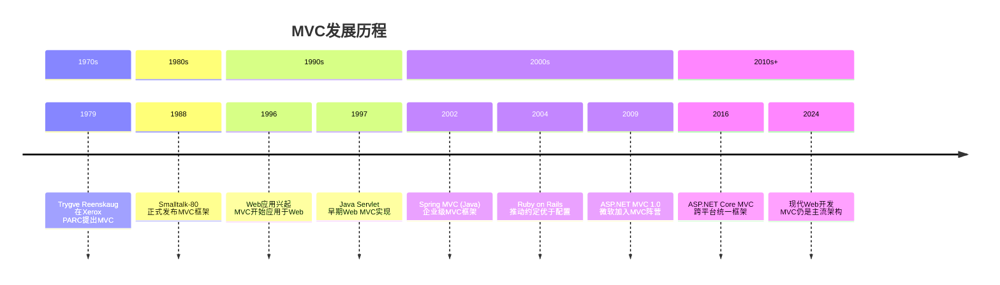
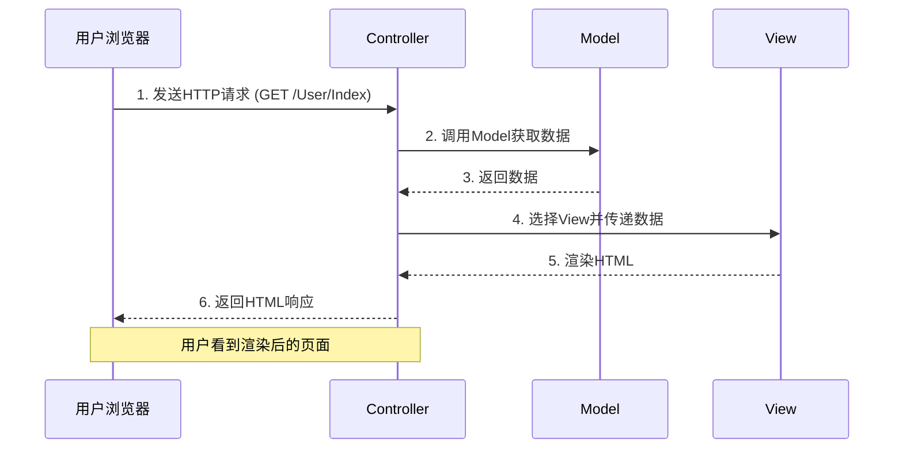
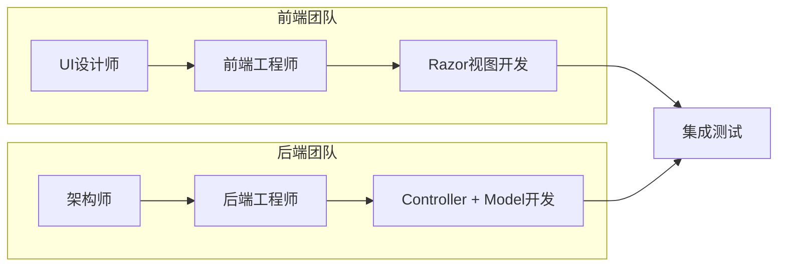
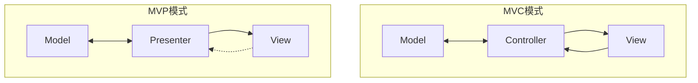
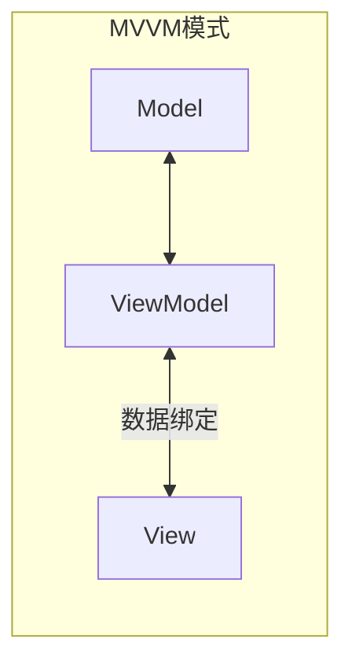
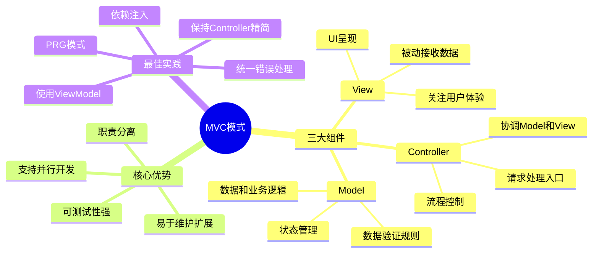

# MVC模式详解

> **学习目标**：深入理解Model-View-Controller设计模式的原理、历史和实际应用
>
> **前置知识**：完成入门篇，了解基本的ASP.NET Core项目结构
>
> **预计时间**：45-60分钟
>
> **难度等级**：⭐⭐⭐ 中级

---

## 一、MVC的历史和起源

### 1.1 Smalltalk-80的伟大发明

MVC（Model-View-Controller）模式诞生于1979年，由**Trygve Reenskaug**在施乐帕洛阿尔托研究中心（Xerox PARC）为Smalltalk-80语言设计。这个看似简单的架构思想，却成为了现代Web开发中最具影响力的设计模式之一。

**为什么需要MVC？**

在MVC出现之前，GUI应用程序通常将所有代码混合在一起：
- 用户界面逻辑
- 业务处理逻辑
- 数据访问逻辑

这导致代码难以维护、测试和扩展。MVC的核心理念是：**将关注点分离（Separation of Concerns）**。

### 1.2 MVC的发展历程



---

## 二、三个组件的职责详解

### 2.1 餐厅类比：直观理解MVC

为了更好地理解MVC，我们用一个**餐厅运营**来类比：

| MVC组件 | 餐厅角色 | 职责描述 |
|---------|---------|---------|
| **Model（模型）** | 🍳 厨房与食材 | 管理数据、业务规则和数据状态 |
| **View（视图）** | 🍽️ 菜品展示 | 展示数据给用户，负责呈现 |
| **Controller（控制器）** | 👨‍💼 服务员 | 接收用户请求，协调Model和View |

### 2.2 Model - 数据和业务逻辑的中心

**Model是应用程序的核心**，它包含：
- **数据**：应用程序需要处理的信息
- **业务逻辑**：数据的处理规则
- **状态管理**：维护数据的一致性

```csharp
// Models/User.cs - 用户模型示例
public class User
{
    public int Id { get; set; }
    public string Name { get; set; }
    public string Email { get; set; }
    public DateTime CreatedAt { get; set; }

    // 业务逻辑方法
    public bool IsValidEmail()
    {
        return Email.Contains("@") && Email.Contains(".");
    }

    // 计算属性
    public string DisplayName => $"{Name} ({Email})";
}

// Models/IUserRepository.cs - 数据访问接口
public interface IUserRepository
{
    IEnumerable<User> GetAll();
    User GetById(int id);
    void Add(User user);
    void Update(User user);
    void Delete(int id);
}
```

**为什么这样设计？**
- Model不关心数据如何显示（那是View的事）
- Model不关心用户如何交互（那是Controller的事）
- Model专注于**数据完整性**和**业务规则**

### 2.3 View - 用户界面的呈现者

**View负责将Model的数据以用户友好的方式展示**：

```html
<!-- Views/User/Index.cshtml - 用户列表视图 -->
@model IEnumerable<User>

<div class="user-list">
    <h2>用户列表</h2>

    <table class="table">
        <thead>
            <tr>
                <th>ID</th>
                <th>姓名</th>
                <th>邮箱</th>
                <th>注册时间</th>
                <th>操作</th>
            </tr>
        </thead>
        <tbody>
            @foreach (var user in Model)
            {
                <tr>
                    <td>@user.Id</td>
                    <td>@user.Name</td>
                    <td>@user.Email</td>
                    <td>@user.CreatedAt.ToString("yyyy-MM-dd")</td>
                    <td>
                        <a asp-action="Details" asp-route-id="@user.Id">查看</a>
                        <a asp-action="Edit" asp-route-id="@user.Id">编辑</a>
                    </td>
                </tr>
            }
        </tbody>
    </table>
</div>
```

**View的设计原则**：
- **被动接收数据**：View不应该主动获取数据
- **薄视图**：尽量减少View中的逻辑代码
- **关注呈现**：只关心"如何显示"，不关心"数据从哪来"

### 2.4 Controller - 请求的指挥官

**Controller是用户请求的第一接触点**，负责：
- 接收并解析用户输入
- 调用Model执行业务逻辑
- 选择合适的View进行响应

```csharp
// Controllers/UserController.cs - 用户控制器
public class UserController : Controller
{
    private readonly IUserRepository _userRepository;

    // 依赖注入
    public UserController(IUserRepository userRepository)
    {
        _userRepository = userRepository;
    }

    // GET: /User
    public IActionResult Index()
    {
        // 1. 从Model获取数据
        var users = _userRepository.GetAll();

        // 2. 将数据传递给View
        return View(users);  // 返回 Views/User/Index.cshtml
    }

    // GET: /User/Details/5
    public IActionResult Details(int id)
    {
        var user = _userRepository.GetById(id);
        if (user == null)
        {
            return NotFound();  // 返回404
        }

        return View(user);
    }

    // GET: /User/Create
    [HttpGet]
    public IActionResult Create()
    {
        return View();  // 返回空表单
    }

    // POST: /User/Create
    [HttpPost]
    [ValidateAntiForgeryToken]
    public IActionResult Create(User user)
    {
        if (!ModelState.IsValid)
        {
            return View(user);  // 验证失败，返回表单并显示错误
        }

        user.CreatedAt = DateTime.Now;
        _userRepository.Add(user);

        return RedirectToAction(nameof(Index));  // 成功后重定向到列表页
    }
}
```

### 2.5 MVC组件交互流程



---

## 三、MVC的优势

### 3.1 职责分离（Separation of Concerns）

**核心优势**：每个组件只做一件事

```
❌ 传统做法（意大利面条式代码）:
public void ProcessRequest() {
    // 1. 解析请求参数
    string name = Request.QueryString["name"];

    // 2. 验证数据
    if (string.IsNullOrEmpty(name)) {
        Response.Write("<script>alert('请输入姓名')</script>");
        return;
    }

    // 3. 数据库操作
    SqlConnection conn = new SqlConnection(connString);
    conn.Open();
    SqlCommand cmd = new SqlCommand("INSERT INTO Users...", conn);
    cmd.ExecuteNonQuery();

    // 4. 生成HTML响应
    Response.Write("<html><body>成功！</body></html>");
}

✅ MVC做法（清晰分离）:
[HttpPost]
public IActionResult Create(UserViewModel model)  // Controller: 接收请求
{
    if (!ModelState.IsValid)  // 验证由框架自动处理
        return View(model);

    _userService.Create(model);  // Model: 处理业务逻辑

    return RedirectToAction("Index");  // View: 由框架自动选择
}
```

### 3.2 可测试性（Testability）

**MVC使得单元测试变得简单**：

```csharp
// Tests/UserControllerTests.cs - Controller测试示例
public class UserControllerTests
{
    private UserController GetController(IEnumerable<User> testData)
    {
        // Mock依赖
        var mockRepo = new Mock<IUserRepository>();
        mockRepo.Setup(r => r.GetAll())
                .Returns(testData);

        return new UserController(mockRepo.Object);
    }

    [Fact]
    public void Index_ReturnsViewResult_WithListOfUsers()
    {
        // Arrange
        var testData = new List<User>
        {
            new User { Id = 1, Name = "张三", Email = "zhangsan@test.com" },
            new User { Id = 2, Name = "李四", Email = "lisi@test.com" }
        };
        var controller = GetController(testData);

        // Act
        var result = controller.Index();

        // Assert
        var viewResult = Assert.IsType<ViewResult>(result);
        var model = Assert.IsAssignableFrom<IEnumerable<User>>(viewResult.Model);
        Assert.Equal(2, model.Count());
    }

    [Fact]
    public void Details_ReturnsNotFound_WhenIdNotFound()
    {
        // Arrange
        var controller = GetController(Enumerable.Empty<User>());

        // Act
        var result = controller.Details(999);

        // Assert
        Assert.IsType<NotFoundResult>(result);
    }
}
```

**为什么容易测试？**
- Controller可以脱离UI测试
- Model可以独立于数据库测试（使用Mock）
- 每个组件都可以单独验证其行为

### 3.3 并行开发（Parallel Development）

**团队协作的理想模式**：



**并行开发的实践**：
1. **定义接口先行**：先确定Model和API契约
2. **Mock数据开发**：前端可以使用假数据进行界面开发
3. **独立迭代**：前后端可以独立开发和部署

---

## 四、ASP.NET Core中的MVC实现

### 4.1 项目目录结构最佳实践

```
MyAspNetCoreApp/
├── Controllers/              # 控制器层
│   ├── HomeController.cs
│   ├── UserController.cs
│   └── ApiController.cs
│
├── Models/                   # 数据模型层
│   ├── ViewModels/          # 视图模型（DTO）
│   │   ├── UserViewModel.cs
│   │   └── CreateUserViewModel.cs
│   ├── Entities/            # 数据库实体
│   │   └── User.cs
│   └── Bindings/            # 模型绑定类
│       └── SearchCriteria.cs
│
├── Views/                    # 视图层
│   ├── Shared/              # 共享布局和部分视图
│   │   ├── _Layout.cshtml
│   │   ├── _ValidationScriptsPartial.cshtml
│   │   └── Error.cshtml
│   ├── Home/
│   │   ├── Index.cshtml
│   │   └── About.cshtml
│   ├── User/
│   │   ├── Index.cshtml
│   │   ├── Details.cshtml
│   │   ├── Create.cshtml
│   │   └── Edit.cshtml
│   └── Components/         # View Components
│       └── NavigationMenu/
│           └── Default.cshtml
│
├── Services/                 # 业务服务层
│   ├── Interfaces/
│   │   └── IUserService.cs
│   └── Implementations/
│       └── UserService.cs
│
├── Data/                     # 数据访问层
│   ├── ApplicationDbContext.cs
│   └── Repositories/
│       └── UserRepository.cs
│
├── wwwroot/                  # 静态资源
│   ├── css/
│   ├── js/
│   └── images/
│
├── Program.cs               # 应用程序入口
├── appsettings.json         # 配置文件
└── MyAspNetCoreApp.csproj   # 项目文件
```

### 4.2 完整的用户管理系统示例

#### Step 1: 创建Model

```csharp
// Models/Entities/User.cs
namespace MyAspNetCoreApp.Models.Entities
{
    public class User
    {
        public int Id { get; set; }
        public string Name { get; set; } = string.Empty;
        public string Email { get; set; } = string.Empty;
        public string? Phone { get; set; }
        public bool IsActive { get; set; } = true;
        public DateTime CreatedAt { get; set; } = DateTime.Now;
        public DateTime? LastLoginAt { get; set; }
    }
}

// Models/ViewModels/UserListViewModel.cs
namespace MyAspNetCoreApp.Models.ViewModels
{
    public class UserListViewModel
    {
        public IEnumerable<User> Users { get; set; } = Enumerable.Empty<User>();
        public int CurrentPage { get; set; } = 1;
        public int TotalPages { get; set; } = 1;
        public string SearchKeyword { get; set; } = string.Empty;
    }

    public class CreateUserViewModel
    {
        [Required(ErrorMessage = "姓名不能为空")]
        [StringLength(50, ErrorMessage = "姓名不能超过50个字符")]
        public string Name { get; set; } = string.Empty;

        [Required(ErrorMessage = "邮箱不能为空")]
        [EmailAddress(ErrorMessage = "请输入有效的邮箱地址")]
        public string Email { get; set; } = string.Empty;

        [Phone(ErrorMessage = "请输入有效的电话号码")]
        public string? Phone { get; set; }
    }
}
```

#### Step 2: 创建Service层

```csharp
// Services/Interfaces/IUserService.cs
namespace MyAspNetCoreApp.Services.Interfaces
{
    public interface IUserService
    {
        Task<IEnumerable<User>> GetAllAsync();
        Task<User?> GetByIdAsync(int id);
        Task<User> CreateAsync(CreateUserViewModel model);
        Task UpdateAsync(int id, CreateUserViewModel model);
        Task DeleteAsync(int id);
        Task<IEnumerable<User>> SearchAsync(string keyword);
    }
}

// Services/Implementations/UserService.cs
namespace MyAspNetCoreApp.Services.Implementations
{
    public class UserService : IUserService
    {
        private static List<User> _users = new()
        {
            new User { Id = 1, Name = "张三", Email = "zhangsan@example.com", Phone = "13800138001" },
            new User { Id = 2, Name = "李四", Email = "lisi@example.com", Phone = "13800138002" },
            new User { Id = 3, Name = "王五", Email = "wangwu@example.com", Phone = "13800138003" }
        };
        private int _nextId = 4;

        public async Task<IEnumerable<User>> GetAllAsync()
        {
            await Task.Delay(100); // 模拟异步操作
            return _users.OrderBy(u => u.Name).ToList();
        }

        public async Task<User?> GetByIdAsync(int id)
        {
            await Task.Delay(50);
            return _users.FirstOrDefault(u => u.Id == id);
        }

        public async Task<User> CreateAsync(CreateUserViewModel model)
        {
            await Task.Delay(100);

            var user = new User
            {
                Id = _nextId++,
                Name = model.Name,
                Email = model.Email,
                Phone = model.Phone,
                CreatedAt = DateTime.Now,
                IsActive = true
            };

            _users.Add(user);
            return user;
        }

        public async Task UpdateAsync(int id, CreateUserViewModel model)
        {
            await Task.Delay(100);
            var user = _users.FirstOrDefault(u => u.Id == id)
                ?? throw new Exception("用户不存在");

            user.Name = model.Name;
            user.Email = model.Email;
            user.Phone = model.Phone;
        }

        public async Task DeleteAsync(int id)
        {
            await Task.Delay(50);
            var user = _users.FirstOrDefault(u => u.Id == id)
                ?? throw new Exception("用户不存在");

            _users.Remove(user);
        }

        public async Task<IEnumerable<User>> SearchAsync(string keyword)
        {
            await Task.Delay(100);
            return _users
                .Where(u =>
                    u.Name.Contains(keyword, StringComparison.OrdinalIgnoreCase) ||
                    u.Email.Contains(keyword, StringComparison.OrdinalIgnoreCase))
                .ToList();
        }
    }
}
```

#### Step 3: 创建Controller

```csharp
// Controllers/UserController.cs
using Microsoft.AspNetCore.Mvc;
using MyAspNetCoreApp.Models.Entities;
using MyAspNetCoreApp.Models.ViewModels;
using MyAspNetCoreApp.Services.Interfaces;

namespace MyAspNetCoreApp.Controllers
{
    public class UserController : Controller
    {
        private readonly IUserService _userService;
        private readonly ILogger<UserController> _logger;

        public UserController(
            IUserService userService,
            ILogger<UserController> logger)
        {
            _userService = userService;
            _logger = logger;
        }

        // GET: /User
        public async Task<IActionResult> Index(string? searchKeyword)
        {
            try
            {
                IEnumerable<User> users;

                if (!string.IsNullOrWhiteSpace(searchKeyword))
                {
                    users = await _userService.SearchAsync(searchKeyword);
                    ViewBag.SearchKeyword = searchKeyword;
                }
                else
                {
                    users = await _userService.GetAllAsync();
                }

                var viewModel = new UserListViewModel
                {
                    Users = users,
                    SearchKeyword = searchKeyword ?? string.Empty
                };

                return View(viewModel);
            }
            catch (Exception ex)
            {
                _logger.LogError(ex, "获取用户列表时发生错误");
                return View("Error");
            }
        }

        // GET: /User/Details/5
        public async Task<IActionResult> Details(int? id)
        {
            if (id == null)
            {
                return BadRequest();
            }

            var user = await _userService.GetByIdAsync(id.Value);
            if (user == null)
            {
                return NotFound();
            }

            return View(user);
        }

        // GET: /User/Create
        public IActionResult Create()
        {
            return View();
        }

        // POST: /User/Create
        [HttpPost]
        [ValidateAntiForgeryToken]
        public async Task<IActionResult> Create(CreateUserViewModel model)
        {
            if (!ModelState.IsValid)
            {
                return View(model);
            }

            try
            {
                await _userService.CreateAsync(model);
                TempData["SuccessMessage"] = "用户创建成功！";
                return RedirectToAction(nameof(Index));
            }
            catch (Exception ex)
            {
                _logger.LogError(ex, "创建用户时发生错误");
                ModelState.AddModelError("", "创建用户时发生错误，请重试。");
                return View(model);
            }
        }

        // GET: /User/Edit/5
        public async Task<IActionResult> Edit(int? id)
        {
            if (id == null)
            {
                return BadRequest();
            }

            var user = await _userService.GetByIdAsync(id.Value);
            if (user == null)
            {
                return NotFound();
            }

            var viewModel = new CreateUserViewModel
            {
                Name = user.Name,
                Email = user.Email,
                Phone = user.Phone
            };

            return View(viewModel);
        }

        // POST: /User/Edit/5
        [HttpPost]
        [ValidateAntiForgeryToken]
        public async Task<IActionResult> Edit(int id, CreateUserViewModel model)
        {
            if (!ModelState.IsValid)
            {
                return View(model);
            }

            try
            {
                await _userService.UpdateAsync(id, model);
                TempData["SuccessMessage"] = "用户更新成功！";
                return RedirectToAction(nameof(Index));
            }
            catch (Exception ex)
            {
                _logger.LogError(ex, "更新用户时发生错误");
                ModelState.AddModelError("", "更新用户时发生错误，请重试。");
                return View(model);
            }
        }

        // GET: /User/Delete/5
        public async Task<IActionResult> Delete(int? id)
        {
            if (id == null)
            {
                return BadRequest();
            }

            var user = await _userService.GetByIdAsync(id.Value);
            if (user == null)
            {
                return NotFound();
            }

            return View(user);
        }

        // POST: /User/Delete/5
        [HttpPost, ActionName("Delete")]
        [ValidateAntiForgeryToken]
        public async Task<IActionResult> DeleteConfirmed(int id)
        {
            try
            {
                await _userService.DeleteAsync(id);
                TempData["SuccessMessage"] = "用户删除成功！";
                return RedirectToAction(nameof(Index));
            }
            catch (Exception ex)
            {
                _logger.LogError(ex, "删除用户时发生错误");
                return View("Error");
            }
        }
    }
}
```

#### Step 4: 注册服务

```csharp
// Program.cs
var builder = WebApplication.CreateBuilder(args);

// 添加MVC服务
builder.Services.AddControllersWithViews();

// 注册自定义服务
builder.Services.AddScoped<IUserService, UserService>();

var app = builder.Build();

// 配置HTTP请求管道
if (!app.Environment.IsDevelopment())
{
    app.UseExceptionHandler("/Home/Error");
    app.UseHsts();
}

app.UseHttpsRedirection();
app.UseStaticFiles();

app.UseRouting();

app.MapControllerRoute(
    name: "default",
    pattern: "{controller=Home}/{action=Index}/{id?}");

app.Run();
```

#### Step 5: 创建Views

```html
<!-- Views/User/Index.cshtml -->
@model UserListViewModel
@{
    ViewData["Title"] = "用户列表";
}

<div class="container mt-4">
    <div class="d-flex justify-content-between align-items-center mb-3">
        <h2>用户管理</h2>
        <a asp-action="Create" class="btn btn-primary">+ 新增用户</a>
    </div>

    <!-- 搜索框 -->
    <div class="card mb-3">
        <div class="card-body">
            <form asp-action="Index" method="get" class="row g-3">
                <div class="col-md-8">
                    <input type="text"
                           name="searchKeyword"
                           value="@Model.SearchKeyword"
                           class="form-control"
                           placeholder="搜索姓名或邮箱..." />
                </div>
                <div class="col-md-4">
                    <button type="submit" class="btn btn-outline-primary w-100">
                        🔍 搜索
                    </button>
                </div>
            </form>
        </div>
    </div>

    <!-- 成功消息 -->
    @if (TempData["SuccessMessage"] != null)
    {
        <div class="alert alert-success alert-dismissible fade show" role="alert">
            @TempData["SuccessMessage"]
            <button type="button" class="btn-close" data-bs-dismiss="alert"></button>
        </div>
    }

    <!-- 用户表格 -->
    <div class="card">
        <div class="card-body">
            <table class="table table-hover table-striped">
                <thead class="table-dark">
                    <tr>
                        <th>ID</th>
                        <th>姓名</th>
                        <th>邮箱</th>
                        <th>电话</th>
                        <th>状态</th>
                        <th>注册时间</th>
                        <th>操作</th>
                    </tr>
                </thead>
                <tbody>
                    @foreach (var user in Model.Users)
                    {
                        <tr>
                            <td>@user.Id</td>
                            <td><strong>@user.Name</strong></td>
                            <td>@user.Email</td>
                            <td>@user.Phone ?? "-"</td>
                            <td>
                                @if (user.IsActive)
                                {
                                    <span class="badge bg-success">活跃</span>
                                }
                                else
                                {
                                    <span class="badge bg-secondary">禁用</span>
                                }
                            </td>
                            <td>@user.CreatedAt.ToString("yyyy-MM-dd HH:mm")</td>
                            <td>
                                <div class="btn-group btn-group-sm">
                                    <a asp-action="Details" asp-route-id="@user.Id"
                                       class="btn btn-info text-white">查看</a>
                                    <a asp-action="Edit" asp-route-id="@user.Id"
                                       class="btn btn-warning">编辑</a>
                                    <a asp-action="Delete" asp-route-id="@user.Id"
                                       class="btn btn-danger">删除</a>
                                </div>
                            </td>
                        </tr>
                    }
                </tbody>
            </table>

            @if (!Model.Users.Any())
            {
                <div class="text-center text-muted py-4">
                    <p>暂无用户数据</p>
                    <a asp-action="Create" class="btn btn-outline-primary">创建第一个用户</a>
                </div>
            }
        </div>
    </div>
</div>
```

```html
<!-- Views/User/Create.cshtml -->
@model CreateUserViewModel
@{
    ViewData["Title"] = "创建用户";
}

<div class="container mt-4">
    <div class="row justify-content-center">
        <div class="col-md-6">
            <div class="card">
                <div class="card-header bg-primary text-white">
                    <h4 class="mb-0">创建新用户</h4>
                </div>
                <div class="card-body">
                    <form asp-action="Create" method="post">
                        <!-- 防CSRF攻击 -->
                        <div asp-validation-summary="ModelOnly" class="text-danger mb-3"></div>

                        <!-- 姓名 -->
                        <div class="mb-3">
                            <label asp-for="Name" class="form-label"></label>
                            <input asp-for="Name" class="form-control" placeholder="请输入姓名" />
                            <span asp-validation-for="Name" class="text-danger"></span>
                        </div>

                        <!-- 邮箱 -->
                        <div class="mb-3">
                            <label asp-for="Email" class="form-label"></label>
                            <input asp-for="Email" type="email" class="form-control"
                                   placeholder="example@email.com" />
                            <span asp-validation-for="Email" class="text-danger"></span>
                        </div>

                        <!-- 电话 -->
                        <div class="mb-3">
                            <label asp-for="Phone" class="form-label"></label>
                            <input asp-for="Phone" type="tel" class="form-control"
                                   placeholder="可选，如：13800138000" />
                            <span asp-validation-for="Phone" class="text-danger"></span>
                        </div>

                        <!-- 提交按钮 -->
                        <div class="d-grid gap-2">
                            <button type="submit" class="btn btn-primary">
                                ✅ 创建用户
                            </button>
                            <a asp-action="Index" class="btn btn-outline-secondary">
                                取消返回
                            </a>
                        </div>
                    </form>
                </div>
            </div>
        </div>
    </div>
</div>

@section Scripts {
    @{
        await Html.RenderPartialAsync("_ValidationScriptsPartial");
    }
}
```

---

## 五、与其他模式对比

### 5.1 MVP模式（Model-View-Presenter）



**关键区别**：
- **MVC**：View可以直接与Model交互（虽然不建议）
- **MVP**：View完全被动，所有交互都通过Presenter
- **适用场景**：MVP更适合桌面应用（WinForms、WPF）

### 5.2 MVVM模式（Model-View-ViewModel）



**MVVM的特点**：
- ViewModel暴露可观察的属性和命令
- View通过**数据绑定**自动同步
- 广泛用于WPF、Xamarin、Blazor等框架

### 5.3 三种模式对比表

| 特性 | MVC | MVP | MVVM |
|------|-----|-----|------|
| **主要用途** | Web应用 | 桌面应用 | 富客户端应用 |
| **View复杂度** | 中等 | 低 | 低 |
| **测试难度** | 容易 | 很容易 | 容易 |
| **双向绑定** | 无 | 无 | 有 |
| **学习曲线** | 中等 | 较高 | 高 |
| **ASP.NET支持** | ✅ 原生支持 | ❌ 不常用 | ✅ Blazor |

**为什么ASP.NET Core选择MVC？**
1. **HTTP无状态特性**：每次请求都是独立的，适合请求-响应模式
2. **SEO友好**：服务端渲染有利于搜索引擎优化
3. **成熟稳定**：经过多年验证的企业级方案
4. **灵活性高**：可以结合Razor Pages、Web API等多种技术

---

## 六、常见陷阱和最佳实践

### ⚠️ 常见陷阱

#### 陷阱1：在View中编写业务逻辑

```csharp
<!-- ❌ 错误做法：在View中包含复杂逻辑 -->
@foreach (var order in Model.Orders)
{
    <tr class="@((order.Total > 10000 && order.Customer.Level == "VIP")
        ? "highlight-vip"
        : (order.Total > 5000 ? "highlight-normal" : "normal"))">
        <!-- 太多条件判断 -->
    </tr>
}

<!-- ✅ 正确做法：将逻辑移到Model或ViewModel -->
@foreach (var order in Model.Orders)
{
    <tr class="@order.RowStyleClass">
        <!-- 简洁明了 -->
    </tr>
}
```

#### 陷阱2：Controller过于臃肿（胖控制器）

```csharp
// ❌ 错误做法：Controller包含大量业务逻辑
public class OrderController : Controller
{
    public IActionResult Create(OrderViewModel model)
    {
        // 50行的验证逻辑
        // 30行的折扣计算
        // 20行的库存检查
        // 40行的邮件发送
        // ...
    }
}

// ✅ 正确做法：Controller保持简洁
public class OrderController : Controller
{
    private readonly IOrderService _orderService;

    [HttpPost]
    public async Task<IActionResult> Create(OrderViewModel model)
    {
        if (!ModelState.IsValid)
            return View(model);

        await _orderService.CreateOrderAsync(model);  // 委托给Service层
        return RedirectToAction(nameof(Index));
    }
}
```

#### 陷阱3：直接在Controller中访问数据库

```csharp
// ❌ 错误做法：紧耦合数据库访问
public class ProductController : Controller
{
    private readonly ApplicationDbContext _db;

    public IActionResult Index()
    {
        var products = _db.Products
            .Include(p => p.Category)
            .Where(p => p.IsActive && p.Stock > 0)
            .OrderByDescending(p => p.CreatedAt)
            .Take(20)
            .ToList();  // 直接写SQL查询逻辑

        return View(products);
    }
}

// ✅ 正确做法：通过Repository或Service抽象
public class ProductController : Controller
{
    private readonly IProductService _productService;

    public async Task<IActionResult> Index()
    {
        var products = await _productService.GetActiveProductsAsync();
        return View(products);
    }
}
```

### ✅ 最佳实践清单

1. **使用ViewModel而不是直接传递Entity**
   ```csharp
   // ✅ 使用专门的ViewModel
   public class UserDetailViewModel
   {
       public int Id { get; set; }
       public string DisplayName { get; set; }
       public string MemberLevel { get; set; }
       public int OrderCount { get; set; }
   }
   ```

2. **遵循RESTful命名规范**
   ```
   GET    /User          → Index()      列表
   GET    /User/Create   → Create()     显示创建表单
   POST   /User/Create   → Create()     提交创建
   GET    /User/Edit/5   → Edit()       显示编辑表单
   POST   /User/Edit/5   → Edit()       提交编辑
   GET    /User/Details/5→ Details()    详情
   GET    /User/Delete/5 → Delete()      显示确认删除
   POST   /User/Delete/5 → DeleteConfirmed() 执行删除
   ```

3. **使用依赖注入而非new对象**
   ```csharp
   // ✅ 通过构造函数注入
   public class UserController : Controller
   {
       private readonly IUserService _userService;

       public UserController(IUserService userService)
       {
           _userService = userService;
       }
   }
   ```

4. **统一错误处理**
   ```csharp
   try
   {
       // 业务操作
   }
   catch (Exception ex)
   {
       _logger.LogError(ex, "操作失败");
       ModelState.AddModelError("", "系统繁忙，请稍后重试");
       return View(model);
   }
   ```

5. **使用PRG模式（Post-Redirect-Get）防止重复提交**
   ```csharp
   [HttpPost]
   [ValidateAntiForgeryToken]
   public IActionResult Create(UserViewModel model)
   {
       if (ModelState.IsValid)
       {
           // 处理数据...
           return RedirectToAction(nameof(Index));  // 重定向，不是返回View
       }
       return View(model);
   }
   ```

---

## 七、练习题

### 练习1：理解MVC职责分离

**题目**：以下代码应该放在MVC的哪个组件中？

```csharp
public decimal CalculateDiscount(decimal totalAmount, string customerLevel)
{
    return customerLevel switch
    {
        "VIP" => totalAmount * 0.85m,
        "Gold" => totalAmount * 0.90m,
        _ => totalAmount * 0.95m
    };
}
```

A) Controller  
B) View  
C) Model  
D) 都可以

<details>
<summary>点击查看答案</summary>

**答案：C) Model**

**解析**：这是一个纯业务逻辑计算，属于数据处理规则，应该放在Model层的Service中。Controller只负责调用这个方法并传递结果给View，View只负责显示计算后的结果。
</details>

---

### 练习2：识别反模式

**题目**：下面的代码有什么问题？

```csharp
public IActionResult ShowProduct(int id)
{
    using (var conn = new SqlConnection("connection-string"))
    {
        conn.Open();
        var cmd = new SqlCommand($"SELECT * FROM Products WHERE Id={id}", conn);
        var reader = cmd.ExecuteReader();
        // ... 构建HTML字符串
        StringBuilder html = new StringBuilder();
        html.Append("<div class='product'>");
        while (reader.Read())
        {
            html.Append($"<h1>{reader["Name"]}</h1>");
            html.Append($"<p>{reader["Price"]}</p>");
        }
        return Content(html.ToString(), "text/html");
    }
}
```

请列出至少3个问题并提出改进建议。

<details>
<summary>点击查看答案</summary>

**问题清单**：

1. **SQL注入漏洞**：直接拼接ID到SQL语句，非常危险
   - 改进：使用参数化查询或ORM

2. **违反MVC原则**：Controller同时做了数据访问、业务逻辑和视图渲染
   - 改进：数据访问移到Repository，HTML生成移到View

3. **硬编码连接字符串**：配置信息不应写在代码中
   - 改进：使用appsettings.json和IConfiguration

4. **缺少异常处理**：没有try-catch块
   - 改进：添加适当的错误处理

5. **手动构建HTML**：容易出错且难以维护
   - 改进：使用Razor视图引擎

**改进后的代码结构**：

```csharp
// Controller
public async Task<IActionResult> ShowProduct(int id)
{
    var product = await _productService.GetByIdAsync(id);
    if (product == null) return NotFound();
    return View(product);  // 让View负责渲染
}
```
</details>

---

### 练习3：设计MVC架构

**题目**：为一个博客系统设计MVC架构，包括：
- 文章列表页
- 文章详情页
- 发布文章功能
- 评论功能

请画出组件关系图并说明各层职责。

<details>
<summary>点击查看参考答案</summary>

**推荐的MVC架构设计**：

```
BlogSystem/
├── Controllers/
│   ├── ArticleController.cs      # 文章相关操作
│   └── CommentController.cs      # 评论相关操作
│
├── Models/
│   ├── Entities/
│   │   ├── Article.cs           # 文章实体
│   │   └── Comment.cs           # 评论实体
│   ├── ViewModels/
│   │   ├── ArticleListViewModel.cs
│   │   ├── ArticleDetailViewModel.cs
│   │   └── CreateArticleViewModel.cs
│   └── Services/
│       ├── IArticleService.cs
│       └── ICommentService.cs
│
├── Views/
│   ├── Article/
│   │   ├── Index.cshtml        # 文章列表
│   │   ├── Details.cshtml      # 文章详情
│   │   └── Create.cshtml       # 写文章
│   └── Comment/
│       └── _CommentForm.cshtml # 评论表单（Partial View）
│
└── Services/
    ├── ArticleService.cs        # 文章业务逻辑
    └── CommentService.cs        # 评论业务逻辑
```

**各层职责**：

**Model层**：
- `Article`实体：标题、内容、作者、发布时间、分类、标签
- `Comment`实体：内容、文章ID、评论者、时间
- Service层：文章CRUD、评论审核、热门文章统计

**Controller层**：
- `ArticleController`：处理文章的增删改查请求
- `CommentController`：处理评论的提交和管理

**View层**：
- 列表页：分页显示文章摘要
- 详情页：完整文章内容 + 评论区
- 编辑器：富文本编辑器集成Markdown
</details>

---

### 练习4：ViewModel vs Entity的选择

**题目**：什么时候应该使用ViewModel而不是直接传递Entity到View？请举例说明。

<details>
<summary>点击查看答案</summary>

**应该使用ViewModel的场景**：

1. **View需要的数据与Entity不完全匹配**

```csharp
// Entity有20个字段，但Detail页只需要5个
public class ArticleDetailViewModel
{
    public int Id { get; set; }
    public string Title { get; set; }
    public string Content { get; set; }  // 已格式化的HTML
    public string AuthorName { get; set; }  // 从关联实体获取
    public string CategoryName { get; set; }  // 从关联实体获取
    public int ViewCount { get; set; }
    public bool IsCurrentUserAuthor { get; set; }  // 用于控制编辑按钮显示
}
```

2. **需要组合多个Entity的数据**

```csharp
public class DashboardViewModel
{
    public int TotalArticles { get; set; }        // 来自Article统计
    public int TotalComments { get; set; }        // 来自Comment统计
    public int NewUsersThisWeek { get; set; }     // 来自User统计
    public List<RecentActivity> RecentActivities { get; set; }  // 组合数据
}
```

3. **安全考虑**：不应将密码哈希、内部标记等字段暴露给View

4. **需要额外的显示逻辑字段**

```csharp
public class UserListViewModel
{
    public int Id { get; set; }
    public string FullName { get; set; }
    public string RoleDisplayName { get; set; }  // "Admin" → "管理员"
    public string StatusCssClass { get; set; }   // "badge-success"
    public bool CanEdit { get; set; }            // 权限控制
}
```

**何时可以直接用Entity**：
- 简单的CRUD原型开发
- 内部管理工具
- Entity字段完全满足View需求且无安全隐患
</details>

---

### 练习5：异步编程在MVC中的应用

**题目**：为什么在ASP.NET Core MVC中推荐使用async/await？改写下面的同步方法为异步版本。

```csharp
// 同步版本
public IActionResult Index()
{
    var users = _userRepository.GetAll();
    var products = _productRepository.GetFeatured();
    var viewModel = new HomeViewModel
    {
        Users = users,
        FeaturedProducts = products
    };
    return View(viewModel);
}
```

<details>
<summary>点击查看答案</summary>

**为什么要使用async/await**：

1. **提高吞吐量**：线程在等待IO操作时可以被释放去处理其他请求
2. **更好的 scalability**：相同硬件可以处理更多并发请求
3. **现代ASP.NET Core生态**：大多数库（EF Core、HttpClient等）原生支持异步

**异步版本**：

```csharp
// ✅ 异步版本
public async Task<IActionResult> Index()
{
    // 并行发起多个异步请求
    var usersTask = _userRepository.GetAllAsync();
    var productsTask = _productRepository.GetFeaturedAsync();

    // 等待所有任务完成
    await Task.WhenAll(usersTask, productsTask);

    var viewModel = new HomeViewModel
    {
        Users = await usersTask,
        FeaturedProducts = await productsTask
    };

    return View(viewModel);
}
```

**额外优化**：使用`Task.WhenAll`并行等待多个独立任务，比顺序await更快。

**注意事项**：
- 在Controller中使用`async Task<IActionResult>`作为返回类型
- 不要在异步方法中使用`.Result`或`.Wait()`（会导致死锁风险）
- Repository和Service层也要相应改为异步方法
</details>

---

## 八、总结

### 核心要点回顾



### 学习建议

1. **动手实践**：按照本文示例搭建完整的用户管理系统
2. **阅读源码**：了解ASP.NET Core MVC框架的内部实现
3. **对比学习**：尝试用MVP或MVVM实现同样的功能
4. **项目实战**：在实际项目中运用MVC架构
5. **持续深入**：学习高级主题如过滤器、中间件、区域等

### 下一步学习

完成本教程后，建议继续学习：
- **路由系统**：理解URL如何映射到Controller和Action
- **Razor视图语法**：掌握服务端HTML生成的技巧
- **模型绑定**：自动化请求数据到对象的映射
- **数据验证**：确保输入数据的合法性

---

**参考资源**：
- [Microsoft官方文档 - ASP.NET Core MVC概述](https://docs.microsoft.com/aspnet/core/mvc/overview)
- [原始MVC论文 - Trygve Reenskaug](https://www.researchgate.net/publication/234808669_MODEL-VIEW-CONTROLLER)
- [Martin Fowler - GUI Architectures](https://martinfowler.com/eaaDev/uiArchs.html)

**版本信息**：本文基于ASP.NET Core 8.0编写，适用于.NET 6/7/8+版本
