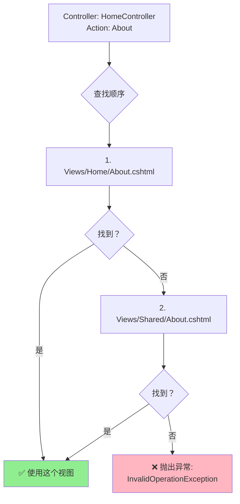

# Razor视图语法

> **学习目标**：掌握ASP.NET Core MVC中Razor视图引擎的语法、指令和最佳实践
>
> **前置知识**：了解MVC模式基础、C#编程基础、HTML/CSS基础
>
> **预计时间**：60-75分钟
>
> **难度等级**：⭐⭐⭐ 中级

---

## 一、Razor语法基础

### 1.1 什么是Razor？

**Razor是一种服务器端标记语法**，允许你在HTML中嵌入C#代码。它由ASP.NET Core在服务器上执行，生成最终的HTML发送给客户端浏览器。

```mermaid
flowchart LR
    A[.cshtml文件] --> B[Razor引擎解析]
    B --> C{识别@符号}
    C --> D[C#代码块]
    C --> E[HTML标记]
    D --> F[执行C#代码]
    F --> G[将结果嵌入HTML]
    E --> G
    G --> H[生成最终HTML]
    H --> I[发送到浏览器]
```

### 1.2 @符号的魔力

`@`是Razor的核心符号，用于从HTML切换到C#代码：

#### 隐式表达式（Implicit Expressions）

```html
<!-- 基本变量输出 -->
<p>Hello, @Model.Name!</p>

<!-- 属性访问 -->
<span>Email: @User.Identity.Name</span>

<!-- 方法调用 -->
<p>当前时间: @DateTime.Now.ToString("yyyy-MM-dd HH:mm:ss")</p>

<!-- 算术运算 -->
<p>总价: @(Model.Price * Model.Quantity) 元</p>

<!-- 条件表达式（三元运算符） -->
<span class="badge @(Model.IsActive ? "bg-success" : "bg-secondary")">
    @(Model.IsActive ? "活跃" : "禁用")
</span>

<!-- 字符串插值 -->
<p>欢迎, @($"{Model.FirstName} {Model.LastName}")!</p>
```

#### 显式表达式（Explicit Expressions）

当表达式复杂或可能产生歧义时，使用`@()`包裹：

```html
<!-- ✅ 正确：使用括号明确表达式边界 -->
<p>用户ID: @(user.Id + 1000)</p>

<!-- ❌ 错误：没有括号会导致歧义 -->
<p>用户ID: @user.Id+1000</p>  <!-- 会被解释为输出 user.Id，然后显示 "+1000" 文本 -->

<!-- 复杂的表达式 -->
<div class="progress">
    <div class="progress-bar"
         role="progressbar"
         style="width: @(Model.CompletionPercentage)%;"
         aria-valuenow="@Model.CompletionPercentage"
         aria-valuemin="0"
         aria-valuemax="100">
        @(Model.CompletionPercentage)%
    </div>
</div>

<!-- 调用带参数的方法 -->
<a href="@Url.Action("Details", new { id = Model.Id })">
    查看详情 →
</a>
```

#### 代码块（Code Blocks）

使用`@{ }`定义多行C#代码块：

```html
@{
    // 变量声明和初始化
    var greeting = DateTime.Now.Hour < 12 ? "上午好" : "下午好";
    var isAdmin = User.IsInRole("Administrator");
    var itemsPerPage = 10;

    // 计算分页信息
    var totalPages = (int)Math.Ceiling((double)Model.TotalCount / itemsPerPage);
    var currentPage = Model.PageNumber;
    var hasNextPage = currentPage < totalPages;
    var hasPreviousPage = currentPage > 1;

    // 准备数据列表
    var statusColors = new Dictionary<string, string>
    {
        { "Pending", "warning" },
        { "Processing", "info" },
        { "Completed", "success" },
        { "Failed", "danger" }
    };
}

<div class="container">
    <h1>@greeting，@Model.UserName！</h1>

    @if (isAdmin)
    {
        <div class="alert alert-info">
            您拥有管理员权限
        </div>
    }

    <table class="table">
        <!-- 表格内容... -->
    </table>

    <!-- 分页控件 -->
    <nav aria-label="分页导航">
        <ul class="pagination justify-content-center">
            <li class="page-item @(hasPreviousPage ? "" : "disabled")">
                <a class="page-link" asp-action="Index"
                   asp-route-page="@(currentPage - 1)">上一页</a>
            </li>
            <li class="page-item active">
                <span class="page-link">@currentPage / @totalPages</span>
            </li>
            <li class="page-item @(hasNextPage ? "" : "disabled")">
                <a class="page-link" asp-action="Index"
                   asp-route-page="@(currentPage + 1)">下一页</a>
            </li>
        </ul>
    </nav>
</div>
```

#### 控制流语句

```html
<!-- if-else 条件判断 -->
@if (Model.Items.Count > 0)
{
    <div class="item-list">
        @foreach (var item in Model.Items)
        {
            <div class="card mb-3">
                <div class="card-body">
                    <h5 class="card-title">@item.Title</h5>
                    <p class="card-text">@item.Description</p>

                    @switch (item.Priority)
                    {
                        case "High":
                            <span class="badge bg-danger">高优先级</span>
                            break;
                        case "Medium":
                            <span class="badge bg-warning text-dark">中优先级</span>
                            break;
                        case "Low":
                            <span class="badge bg-success">低优先级</span>
                            break;
                        default:
                            <span class="badge bg-secondary">未设置</span>
                            break;
                    }
                </div>
            </div>
        }
    </div>
}
else
{
    <div class="text-center py-5">
        <i class="bi bi-inbox display-1 text-muted"></i>
        <p class="mt-3 text-muted">暂无数据</p>
        <a asp-action="Create" class="btn btn-primary">创建第一条记录</a>
    </div>
}

<!-- for 循环 -->
<ol class="list-group list-group-numbered">
    @for (int i = 0; i < Model.TopItems.Count; i++)
    {
        <li class="list-group-item d-flex justify-content-between align-items-center">
            @Model.TopItems[i].Name
            <span class="badge bg-primary rounded-pill">
                排名第 @(i + 1) 名
            </span>
        </li>
    }
</ol>

<!-- while 循环（较少使用） -->
@{
    int countdown = 5;
}
<div class="countdown-timer">
    @while (countdown > 0)
    {
        <span class="countdown-number">@countdown</span>
        countdown--;
        if (countdown > 0)
        {
            <text> - </text>
        }
    }
    <strong>完成！</strong>
</div>

<!-- try-catch 异常处理（视图层应尽量避免） -->
@try
{
    <div class="dynamic-content">
        @Html.Partial("_ComplexWidget", Model.WidgetData)
    </div>
}
catch (Exception ex)
{
    <div class="alert alert-danger">
        <strong>加载组件时发生错误：</strong> @ex.Message
    </div>
}
```

### 1.3 注释

```html
<!-- 这是HTML注释，会发送到客户端 -->

@* 这是Razor注释，不会出现在最终的HTML中 *@
@*
    多行Razor注释
    可以包含任何Razor代码
    这些都不会被渲染
*@

@{
    // C#单行注释（在代码块内）
    /*
     * C#多行注释
     * 同样不会出现在HTML中
     */
}
```

---

## 二、Razor指令

### 2.1 @model - 指定模型类型

```html
@model IEnumerable<MyApp.Models.Product>

@{
    ViewData["Title"] = "产品列表";
}

<h2>产品列表 (@Model.Count() 个产品)</h2>

<table class="table table-striped">
    <thead>
        <tr>
            <th>ID</th>
            <th>产品名称</th>
            <th>价格</th>
            <th>库存</th>
            <th>操作</th>
        </tr>
    </thead>
    <tbody>
        @foreach (var product in Model)
        {
            <tr>
                <td>@product.Id</td>
                <td>@product.Name</td>
                <td>@product.Price.ToString("C2")</td>
                <td>
                    @if (product.Stock > 0)
                    {
                        <span class="text-success">@product.Stock 件</span>
                    }
                    else
                    {
                        <span class="text-danger">缺货</span>
                    }
                </td>
                <td>
                    <a asp-action="Edit" asp-route-id="@product.Id" class="btn btn-sm btn-primary">编辑</a>
                </td>
            </tr>
        }
    </tbody>
</table>
```

**为什么需要@model？**
- 提供强类型支持（IntelliSense智能提示）
- 编译时类型检查
- 避免`object`类型的装箱拆箱

### 2.2 @using - 引入命名空间

```html
@using System.Text.Json
@using MyApp.Models
@using MyApp.Helpers

@model List<Product>

@{
    var options = new JsonSerializerOptions { WriteIndented = true };
    var jsonProducts = JsonSerializer.Serialize(Model, options);
}

<pre><code>@jsonProducts</code></pre>
```

**更好的做法**：在`_ViewImports.cshtml`中全局引入：

```html
<!-- Views/_ViewImports.cshtml -->
@using MyApp
@using MyApp.Models
@using MyApp.ViewModels
@using MyApp.Helpers
@addTagHelper *, Microsoft.AspNetCore.Mvc.TagHelpers
```

这样所有视图都可以直接使用这些命名空间中的类型。

### 2.3 @inject - 依赖注入服务

```html
@inject Microsoft.AspNetCore.Mvc.Localization.IStringLocalizer<SharedResources> Localizer
@inject MyApp.Services.ICartService CartService
@inject Microsoft.Extensions.Configuration.IConfiguration Configuration

@{
    var cartItemCount = await CartService.GetItemCountAsync();
    var siteName = Configuration["SiteSettings:Name"];
    var welcomeMessage = Localizer["WelcomeMessage"];
}

<nav class="navbar navbar-expand-lg navbar-dark bg-dark">
    <div class="container-fluid">
        <a class="navbar-brand" href="/">@siteName</a>

        <div class="collapse navbar-collapse">
            <ul class="navbar-nav me-auto">
                <li class="nav-item">
                    <a class="nav-link" asp-controller="Home" asp-action="Index">@Localizer["Home"]</a>
                </li>
                <li class="nav-item">
                    <a class="nav-link" asp-controller="Product" asp-action="Index">产品</a>
                </li>
            </ul>

            <ul class="navbar-nav">
                <li class="nav-item position-relative">
                    <a class="nav-link" asp-controller="Cart" asp-action="Index">
                        🛒 购物车
                        @if (cartItemCount > 0)
                        {
                            <span class="position-absolute top-0 start-100 translate-middle badge rounded-pill bg-danger">
                                @cartItemCount
                            </span>
                        }
                    </a>
                </li>
            </ul>
        </div>
    </div>
</nav>
```

**常用注入的服务示例**：

| 服务 | 用途 | 示例 |
|------|------|------|
| `IStringLocalizer<T>` | 国际化/本地化 | `Localizer["Key"]` |
| `IConfiguration` | 读取配置 | `Configuration["Section:Key"]` |
| `ILogger<T>` | 日志记录 | `_logger.LogInformation(...)` |
| `HttpContextAccessor` | 访问HTTP上下文 | `Context.User`, `Context.Request` |
| 自定义Service | 业务逻辑 | `CartService.GetItemCount()` |

### 2.4 @functions - 定义辅助方法

```html
@model List<OrderViewModel>

@functions {
    // 格式化货币金额
    public string FormatCurrency(decimal amount)
    {
        return amount.ToString("C2", new CultureInfo("zh-CN"));
    }

    // 根据状态返回CSS类名
    public string GetStatusBadgeClass(string status)
    {
        return status?.ToLower() switch
        {
            "pending" => "badge bg-secondary",
            "processing" => "badge bg-info",
            "shipped" => "badge bg-primary",
            "delivered" => "badge bg-success",
            "cancelled" => "badge bg-danger",
            _ => "badge bg-light text-dark"
        };
    }

    // 格式化相对时间
    public string FormatRelativeTime(DateTime dateTime)
    {
        var span = DateTime.Now - dateTime;

        if (span.TotalMinutes < 1) return "刚刚";
        if (span.TotalHours < 1) return $"{(int)span.TotalMinutes} 分钟前";
        if (span.TotalDays < 1) return $"{(int)span.TotalHours} 小时前";
        if (span.TotalDays < 7) return $"{(int)span.TotalDays} 天前";

        return dateTime.ToString("yyyy-MM-dd");
    }

    // 检查是否可以取消订单
    public bool CanCancelOrder(OrderStatus status)
    {
        return status is OrderStatus.Pending or OrderStatus.Processing;
    }

    // 生成订单状态流程图
    public string GetOrderProgress(OrderStatus currentStatus)
    {
        var steps = new[] { "Pending", "Processing", "Shipped", "Delivered" };
        var currentIndex = Array.IndexOf(steps, currentStatus.ToString());

        var sb = new System.Text.StringBuilder();
        sb.Append("<div class='progress' style='height: 20px;'>");

        var percentage = ((currentIndex + 1) / (float)steps.Length) * 100;
        sb.Append($"<div class='progress-bar' role='progressbar' style='width: {percentage}%' ");
        sb.Append($"aria-valuenow='{percentage}' aria-valuemin='0' aria-valuemax='100'>");
        sb.Append($"{currentStatus}");
        sb.Append("</div>");

        sb.Append("</div>");
        return sb.ToString();
    }
}

@{
    ViewData["Title"] = "我的订单";
}

<div class="container mt-4">
    <h2>订单历史</h2>

    @if (!Model.Any())
    {
        <div class="text-center py-5">
            <i class="bi bi-box-seam display-1 text-muted"></i>
            <p class="mt-3">您还没有任何订单</p>
            <a asp-controller="Product" asp-action="Index" class="btn btn-primary">
                去购物
            </a>
        </div>
    }
    else
    {
        <div class="row">
            @foreach (var order in Model)
            {
                <div class="col-md-6 col-lg-4 mb-4">
                    <div class="card h-100">
                        <div class="card-header d-flex justify-content-between align-items-center">
                            <strong>订单 #@order.OrderNumber</strong>
                            <span class="@GetStatusBadgeClass(order.Status.ToString())">
                                @GetStatusDisplayName(order.Status)
                            </span>
                        </div>

                        <div class="card-body">
                            <h6 class="card-subtitle mb-2 text-muted">
                                @order.Items.Count 件商品
                            </h6>

                            <ul class="list-unstyled">
                                @foreach (var item in order.Items.Take(3))
                                {
                                    <li class="mb-1">
                                        <span class="text-truncate d-inline-block"
                                              style="max-width: 200px;"
                                              title="@item.ProductName">
                                            @item.ProductName
                                        </span>
                                        <span class="text-muted">
                                            x @item.Quantity
                                        </span>
                                    </li>
                                }
                                @if (order.Items.Count > 3)
                                {
                                    <li class="text-muted">
                                        还有 @(order.Items.Count - 3) 件商品...
                                    </li>
                                }
                            </ul>

                            <hr />

                            <div class="d-flex justify-content-between align-items-center">
                                <div>
                                    <small class="text-muted">
                                        下单时间：@FormatRelativeTime(order.CreatedAt)
                                    </small>
                                </div>
                                <div>
                                    <strong class="text-primary fs-5">
                                        @FormatCurrency(order.TotalAmount)
                                    </strong>
                                </div>
                            </div>

                            @if (!string.IsNullOrEmpty(order.TrackingNumber))
                            {
                                <div class="mt-2">
                                    <small class="text-info">
                                        物流单号：@order.TrackingNumber
                                    </small>
                                </div>
                            }
                        </div>

                        <div class="card-footer bg-transparent">
                            @if (CanCancelOrder(order.Status))
                            {
                                <form asp-action="Cancel" asp-controller="Order"
                                      asp-route-id="@order.Id"
                                      method="post"
                                      onsubmit="return confirm('确定要取消这个订单吗？');">
                                    @Html.AntiForgeryToken()
                                    <button type="submit" class="btn btn-outline-danger btn-sm w-100">
                                        取消订单
                                    </button>
                                </form>
                            }
                            else
                            {
                                <a asp-action="Details" asp-controller="Order"
                                   asp-route-id="@order.Id"
                                   class="btn btn-outline-primary btn-sm w-100">
                                    查看详情
                                </a>
                            }
                        </div>
                    </div>
                </div>
            }
        </div>
    }
</div>
```

### 2.5 @section - 定义内容区块

用于Layout布局系统中，定义可替换的内容区域：

```html
<!-- Views/Shared/_Layout.cshtml -->
<!DOCTYPE html>
<html lang="zh-CN">
<head>
    <meta charset="utf-8" />
    <meta name="viewport" content="width=device-width, initial-scale=1.0" />
    <title>@ViewData["Title"] - 我的应用</title>

    <!-- 必需的样式文件 -->
    <link rel="stylesheet" href="~/lib/bootstrap/dist/css/bootstrap.min.css" />
    <link rel="stylesheet" href="~/css/site.css" />

    <!-- 可选的自定义样式区块 -->
    @RenderSection("Styles", required: false)
</head>
<body>
    <!-- 导航栏 -->
    <nav class="navbar navbar-expand-lg navbar-dark bg-primary">
        <div class="container">
            <a class="navbar-brand" asp-controller="Home" asp-action="Index">
                MyAspNetCoreApp
            </a>
            <button class="navbar-toggler" type="button" data-bs-toggle="collapse"
                    data-bs-target=".navbar-collapse">
                <span class="navbar-toggler-icon"></span>
            </button>
            <div class="collapse navbar-collapse">
                <ul class="navbar-nav me-auto">
                    <li class="nav-item">
                        <a class="nav-link" asp-controller="Home" asp-action="Index">首页</a>
                    </li>
                    <li class="nav-item">
                        <a class="nav-link" asp-controller="Product" asp-action="Index">产品</a>
                    </li>
                </ul>
                <partial name="_LoginPartial" />
            </div>
        </div>
    </nav>

    <!-- 主要内容区域 -->
    <div class="container">
        @RenderBody()
    </div>

    <!-- 页脚 -->
    <footer class="border-top footer text-muted mt-5">
        <div class="container">
            &copy; 2024 - MyAspNetCoreApp -
            <a asp-controller="Home" asp-action="Privacy">隐私政策</a>
        </div>
    </footer>

    <!-- 必需的脚本文件 -->
    <script src="~/lib/jquery/dist/jquery.min.js"></script>
    <script src="~/lib/bootstrap/dist/js/bootstrap.bundle.min.js"></script>
    <script src="~/js/site.js" asp-append-version="true"></script>

    <!-- 可选的自定义脚本区块 -->
    @RenderSection("Scripts", required: false)

    <!-- 页面特定的脚本（如果有） -->
    await RenderSectionAsync("PageScripts", required: false);
</body>
</html>
```

**使用section的具体页面示例**：

```html
<!-- Views/Product/Create.cshtml -->
@model CreateProductViewModel
@{
    ViewData["Title"] = "创建新产品";
}

@section Styles {
    <style>
        .form-section {
            background: #f8f9fa;
            padding: 20px;
            border-radius: 8px;
            margin-bottom: 20px;
        }

        .image-preview {
            max-width: 200px;
            max-height: 200px;
            object-fit: cover;
            border-radius: 4px;
        }

        .price-input-group .input-group-text {
            background-color: #e9ecef;
        }
    </style>
}

<div class="row justify-content-center">
    <div class="col-md-8">
        <div class="card shadow">
            <div class="card-header bg-primary text-white">
                <h4 class="mb-0">
                    <i class="bi bi-plus-circle me-2"></i>创建新产品
                </h4>
            </div>
            <div class="card-body p-4">
                <form asp-action="Create" method="post" enctype="multipart/form-data"
                      id="createForm" novalidate>

                    @Html.AntiForgeryToken()

                    <!-- 基本信息 -->
                    <div class="form-section">
                        <h5 class="border-bottom pb-2 mb-3">
                            <i class="bi bi-info-circle me-2"></i>基本信息
                        </h5>

                        <div class="row">
                            <div class="col-md-8 mb-3">
                                <label asp-for="Name" class="form-label fw-bold"></label>
                                <input asp-for="Name" class="form-control"
                                       placeholder="请输入产品名称" autofocus />
                                <span asp-validation-for="Name" class="text-danger small"></span>
                            </div>

                            <div class="col-md-4 mb-3">
                                <label asp-for="Sku" class="form-label fw-bold"></label>
                                <input asp-for="Sku" class="form-control"
                                       placeholder="如: PROD-001" />
                                <span asp-validation-for="Sku" class="text-danger small"></span>
                                <div class="form-text">唯一的产品库存单位编码</div>
                            </div>
                        </div>

                        <div class="mb-3">
                            <label asp-for="Description" class="form-label fw-bold"></label>
                            <textarea asp-for="Description" class="form-control"
                                      rows="4" placeholder="详细描述产品的特点、用途等..."></textarea>
                            <span asp-validation-for="Description" class="text-danger small"></span>
                        </div>
                    </div>

                    <!-- 价格与库存 -->
                    <div class="form-section">
                        <h5 class="border-bottom pb-2 mb-3">
                            <i class="bi bi-currency-yen me-2"></i>价格与库存
                        </h5>

                        <div class="row">
                            <div class="col-md-4 mb-3">
                                <label asp-for="Price" class="form-label fw-bold"></label>
                                <div class="input-group price-input-group">
                                    <span class="input-group-text">&yen;</span>
                                    <input type="number" asp-for="Price" class="form-control"
                                           step="0.01" min="0" placeholder="0.00" />
                                </div>
                                <span asp-validation-for="Price" class="text-danger small"></span>
                            </div>

                            <div class="col-md-4 mb-3">
                                <label asp-for="OriginalPrice" class="form-label fw-bold"></label>
                                <div class="input-group price-input-group">
                                    <span class="input-group-text">&yen;</span>
                                    <input type="number" asp-for="OriginalPrice" class="form-control"
                                           step="0.01" min="0" placeholder="原价（可选）" />
                                </div>
                                <span asp-validation-for="OriginalPrice" class="text-danger small"></span>
                            </div>

                            <div class="col-md-4 mb-3">
                                <label asp-for="Stock" class="form-label fw-bold"></label>
                                <input asp-for="Stock" type="number" class="form-control"
                                       min="0" value="0" />
                                <span asp-validation-for="Stock" class="text-danger small"></span>
                            </div>
                        </div>

                        <div class="form-check form-switch mb-3">
                            <input class="form-check-input" asp-for="IsActive"
                                   role="switch" id="isActiveSwitch">
                            <label class="form-check-label" for="isActiveSwitch">
                                上架销售
                            </label>
                            <div class="form-text">关闭后产品将在前台隐藏</div>
                        </div>
                    </div>

                    <!-- 分类与标签 -->
                    <div class="form-section">
                        <h5 class="border-bottom pb-2 mb-3">
                            <i class="bi bi-tags me-2"></i>分类与标签
                        </h5>

                        <div class="row">
                            <div class="col-md-6 mb-3">
                                <label asp-for="CategoryId" class="form-label fw-bold"></label>
                                <select asp-for="CategoryId" class="form-select"
                                        asp-items="@(new SelectList(ViewBag.Categories, "Id", "Name"))">
                                    <option value="">-- 请选择分类 --</option>
                                </select>
                                <span asp-validation-for="CategoryId" class="text-danger small"></span>
                            </div>

                            <div class="col-md-6 mb-3">
                                <label asp-for="Tags" class="form-label fw-bold"></label>
                                <input asp-for="Tags" class="form-control"
                                       placeholder="用逗号分隔多个标签，如: 电子, 数码, 新品" />
                                <div class="form-text">便于搜索和筛选</div>
                            </div>
                        </div>
                    </div>

                    <!-- 产品图片 -->
                    <div class="form-section">
                        <h5 class="border-bottom pb-2 mb-3">
                            <i class="bi bi-image me-2"></i>产品图片
                        </h5>

                        <div class="mb-3">
                            <label for="imageUpload" class="form-label fw-bold">主图</label>
                            <input type="file" class="form-control" id="imageUpload"
                                   name="ImageFile" accept="image/*"
                                   onchange="previewImage(this)" />
                            <div class="form-text">
                                支持 JPG、PNG、GIF、WebP格式，建议尺寸800x800像素
                            </div>
                        </div>

                        <div id="imagePreviewContainer" class="mt-3" style="display: none;">
                            
                            <button type="button" class="btn btn-outline-danger btn-sm mt-2"
                                    onclick="removeImage()">
                                移除图片
                            </button>
                        </div>
                    </div>

                    <!-- 提交按钮 -->
                    <div class="d-grid gap-2 d-md-flex justify-content-md-end mt-4">
                        <a asp-action="Index" class="btn btn-outline-secondary me-md-2">
                            取消
                        </a>
                        <button type="submit" class="btn btn-primary px-5">
                            <i class="bi bi-check-lg me-2"></i>创建产品
                        </button>
                    </div>
                </form>
            </div>
        </div>
    </div>
</div>

@section Scripts {
    @{
        await Html.RenderPartialAsync("_ValidationScriptsPartial");
    }

    <script>
        // 图片预览功能
        function previewImage(input) {
            if (input.files && input.files[0]) {
                const reader = new FileReader();

                reader.onload = function(e) {
                    $('#imagePreview').attr('src', e.target.result);
                    $('#imagePreviewContainer').show();
                };

                reader.readAsDataURL(input.files[0]);
            }
        }

        // 移除图片
        function removeImage() {
            $('#imagePreview').attr('src', '');
            $('#imagePreviewContainer').hide();
            $('#imageUpload').val('');
        }

        // 表单提交前的额外验证
        $('#createForm').on('submit', function() {
            const price = parseFloat($('#Price').val());
            const originalPrice = parseFloat($('#OriginalPrice').val());

            if (originalPrice > 0 && originalPrice <= price) {
                alert('原价必须大于现价');
                return false;
            }

            return true;
        });
    </script>
}

@section PageScripts {
    <script src="~/lib/tinymce/tinymce.min.js"></script>
    <script>
        // 初始化富文本编辑器（如果需要）
        tinymce.init({
            selector: '#Description',
            height: 300,
            plugins: 'lists link image',
            toolbar: 'undo redo | bold italic | bullist numlist | link image'
        });
    </script>
}
```

---

## 三、内置HtmlHelpers

### 3.1 什么是HtmlHelper？

**HtmlHelper是Razor视图中用于生成HTML的帮助方法**，它们可以智能地处理模型绑定、验证等信息。

### 3.2 常用HtmlHelper方法

#### 表单相关

```html
@model EditProfileViewModel

<form asp-action="UpdateProfile" method="post">
    @Html.AntiForgeryToken()

    <!-- 文本输入框 -->
    <div class="mb-3">
        @Html.LabelFor(m => m.DisplayName, new { @class = "form-label" })
        @Html.TextBoxFor(m => m.DisplayName,
            new {
                @class = "form-control",
                placeholder = "您的显示名称"
            })
        @Html.ValidationMessageFor(m => m.DisplayName,
            new { @class = "text-danger" })
    </div>

    <!-- 密码输入框 -->
    <div class="mb-3">
        @Html.LabelFor(m => m.CurrentPassword, new { @class = "form-label" })
        @Html.PasswordFor(m => m.CurrentPassword,
            new {
                @class = "form-control",
                placeholder = "当前密码"
            })
        @Html.ValidationMessageFor(m => m.CurrentPassword,
            new { @class = "text-danger" })
    </div>

    <!-- 下拉选择框 -->
    <div class="mb-3">
        @Html.LabelFor(m => m.Country, new { @class = "form-label" })
        @Html.DropDownListFor(m => m.Country,
            new SelectList(ViewBag.Countries, "Value", "Text"),
            "-- 请选择国家 --",
            new { @class = "form-select" })
        @Html.ValidationMessageFor(m => m.Country,
            new { @class = "text-danger" })
    </div>

    <!-- 复选框 -->
    <div class="mb-3 form-check">
        @Html.CheckBoxFor(m => m.AcceptTerms,
            new { @class = "form-check-input" })
        @Html.LabelFor(m => m.AcceptTerms,
            "我同意服务条款和隐私政策",
            new { @class = "form-check-label" })
        @Html.ValidationMessageFor(m => m.AcceptTerms,
            new { @class = "text-danger" })
    </div>

    <!-- 隐藏字段 -->
    @Html.HiddenFor(m => m.UserId)

    <!-- 文本域（多行） -->
    <div class="mb-3">
        @Html.LabelFor(m => m.Bio, new { @class = "form-label" })
        @Html.TextAreaFor(m => m.Bio,
            new {
                @class = "form-control",
                rows = 5,
                placeholder = "介绍一下自己..."
            })
        @Html.ValidationMessageFor(m => m.Bio,
            new { @class = "text-danger" })
    </div>

    <button type="submit" class="btn btn-primary">保存修改</button>
</form>
```

#### 显示相关

```html
@model ProductDetailViewModel

<div class="product-detail">
    <!-- DisplayNameFor - 获取属性的显示名称 -->
    <dl class="row">
        <dt class="col-sm-3">@Html.DisplayNameFor(m => m.Name)</dt>
        <dd class="col-sm-9">@Model.Name</dd>

        <dt class="col-sm-3">@Html.DisplayNameFor(m => m.Price)</dt>
        <dd class="col-sm-9">
            @Html.DisplayFor(m => m.Price, "Currency")  <!-- 使用显示模板 -->
        </dd>

        <dt class="col-sm-3">@Html.DisplayNameFor(m => m.Category)</dt>
        <dd class="col-sm-9">@Html.DisplayFor(m => m.Category.Name)</dd>

        <dt class="col-sm-3">@Html.DisplayNameFor(m => m.CreatedAt)</dt>
        <dd class="col-sm-9">
            @Html.DisplayFor(m => m.CreatedAt, "ShortDateTime")
        </dd>

        <dt class="col-sm-3">@Html.DisplayNameFor(m => m.Description)</dt>
        <dd class="col-sm-9">
            @Html.Raw(Model.Description)  <!-- 输出原始HTML（注意XSS风险）-->
        </dd>
    </dl>
</div>

<!-- DisplayFor 的嵌套使用 -->
<div class="order-summary">
    <h4>订单商品</h4>
    <table class="table">
        <thead>
            <tr>
                <th>@Html.DisplayNameFor(m => m.Items[0].ProductName)</th>
                <th>@Html.DisplayNameFor(m => m.Items[0].Quantity)</th>
                <th>@Html.DisplayNameFor(m => m.Items[0].UnitPrice)</th>
                <th>小计</th>
            </tr>
        </thead>
        <tbody>
            @for (int i = 0; i < Model.Items.Count; i++)
            {
                <tr>
                    <td>@Html.DisplayFor(m => m.Items[i].ProductName)</td>
                    <td>@Html.DisplayFor(m => m.Items[i].Quantity)</td>
                    <td>@Html.DisplayFor(m => m.Items[i].UnitPrice, "Currency")</td>
                    <td>@((Model.Items[i].Quantity * Model.Items[i].UnitPrice).ToString("C2"))</td>
                </tr>
            }
        </tbody>
    </table>
</div>
```

#### 链接生成

```html
@model PostViewModel

<!-- ActionLink - 生成指向Action的超链接 -->
<div class="post-navigation">
    <div class="d-flex justify-content-between">
        @if (Model.PreviousPostId.HasValue)
        {
            <!-- 使用ActionLink生成链接 -->
            @Html.ActionLink(
                "<< 上一篇：" + Model.PreviousPostTitle,
                "Details",
                "Blog",
                new { id = Model.PreviousPostId.Value },
                new { @class = "btn btn-outline-secondary" }
            )
        }

        @if (Model.NextPostId.HasValue)
        {
            @Html.ActionLink(
                "下一篇：" + Model.NextPostTitle + " >>",
                "Details",
                "Blog",
                new { id = Model.NextPostId.Value },
                new { @class = "btn btn-outline-secondary ms-auto" }
            )
        }
    </div>
</div>

<!-- 返回列表页 -->
<div class="mt-4">
    @Html.ActionLink("← 返回文章列表", "Index", "Blog",
        null, new { @class = "btn btn-link" })
</div>

<!-- RouteLink - 使用路由名称生成链接 -->
<footer class="mt-5 pt-3 border-top">
    <div class="text-center">
        @Html.RouteLink("联系我们", "contact",
            new { controller = "Home", action = "Contact" },
            new { @class = "text-decoration-none" })

        | @Html.RouteLink("关于我们", "about",
            new { controller = "Home", action = "About" },
            new { @class = "text-decoration-none" })
    </div>
</footer>
```

### 3.3 HtmlHelper vs Tag Helper对比

虽然现代ASP.NET Core更推荐使用Tag Helpers，但了解HtmlHelper仍然有用：

| 特性 | HtmlHelper | Tag Helper |
|------|-----------|------------|
| **语法风格** | C#方法调用 | HTML属性风格 |
| **学习曲线** | 需要记住方法名 | 更直观，像标准HTML |
| **智能感知** | 较弱 | 强（IDE友好） |
| **可读性** | 对前端开发者不够友好 | 非常友好 |
| **推荐度** | 传统项目兼容 | **新项目首选** |

---

## 四、Tag Helpers

### 4.1 什么是Tag Helper？

**Tag Helper使Razor文件中的HTML元素能够参与服务端的代码生成**。它们看起来像标准的HTML属性，但在服务器端会被处理。

### 4.2 内置Tag Helpers详解

#### 锚点标签助手（Anchor Tag Helper）

```html
<!-- 基本用法 -->
<a asp-controller="Home" asp-action="Index">首页</a>
<!-- 渲染为：<a href="/">首页</a> -->

<!-- 带路由参数 -->
<a asp-controller="Product" asp-action="Details" asp-route-id="@product.Id">
    查看 @product.Name 详情
</a>
<!-- 渲染为：<a href="/Product/Details/5">查看 Laptop 详情</a> -->

<!-- 带查询字符串参数 -->
<a asp-controller="Search" asp-action="Results"
   asp-route-keyword="@searchTerm"
   asp-route-page="1"
   asp-route-sortBy="relevance">
    搜索 "@searchTerm"
</a>
<!-- 渲染为：<a href="/Search/Results?keyword=aspnet&page=1&sortBy=relevance">...</a> -->

<!-- 带区域（Area） -->
<a asp-area="Admin" asp-controller="Dashboard" asp-action="Index">
    管理后台
</a>
<!-- 渲染为：<a href="/Admin/Dashboard/Index">管理后台</a> -->

<!-- 带协议和主机名 -->
<a asp-protocol="https" asp-host="example.com" asp-controller="Api" asp-action="Docs">
    API文档
</a>
<!-- 渲染为：<a href="https://example.com/Api/Docs">API文档</a> -->

<!-- 片段标识符（锚点链接） -->
<a asp-controller="FAQ" asp-action="Index" asp-fragment="pricing">
    定价说明
</a>
<!-- 渲染为：<a href="/FAQ/Index#pricing">定价说明</a> -->

<!-- 实际应用示例：面包屑导航 -->
<nav aria-label="breadcrumb">
    <ol class="breadcrumb">
        <li class="breadcrumb-item">
            <a asp-controller="Home" asp-action="Index">首页</a>
        </li>
        <li class="breadcrumb-item">
            <a asp-controller="Product" asp-action="Index">产品中心</a>
        </li>
        <li class="breadcrumb-item">
            <a asp-controller="Product" asp-action="Category"
               asp-route-categorySlug="@Model.Category.Slug">
                @Model.Category.Name
            </a>
        </li>
        <li class="breadcrumb-item active" aria-current="page">
            @Model.Name
        </li>
    </ol>
</nav>
```

#### 表单标签助手（Form Tag Helper）

```html
@model ContactUsViewModel

<!-- 基本表单 -->
<form asp-controller="Contact" asp-action="Submit" method="post">
    <!-- 防CSRF令牌自动添加（如果使用Form Tag Helper） -->
    @* 不需要手动写 @Html.AntiForgeryToken() *@

    <!-- 输入框 -->
    <div class="mb-3">
        <label asp-for="Name" class="form-label"></label>
        <input asp-for="Name" class="form-control" placeholder="您的姓名" />
        <span asp-validation-for="Name" class="text-danger"></span>
    </div>

    <!-- 邮箱 -->
    <div class="mb-3">
        <label asp-for="Email" class="form-label"></label>
        <input asp-for="Email" type="email" class="form-control"
               placeholder="example@email.com" />
        <span asp-validation-for="Email" class="text-danger"></span>
    </div>

    <!-- 下拉选择 -->
    <div class="mb-3">
        <label asp-for="Subject" class="form-label"></label>
        <select asp-for="Subject" class="form-select"
                asp-items="Html.GetEnumSelectList<SubjectType>()">
            <option value="">-- 请选择主题 --</option>
        </select>
        <span asp-validation-for="Subject" class="text-danger"></span>
    </div>

    <!-- 文本域 -->
    <div class="mb-3">
        <label asp-for="Message" class="form-label"></label>
        <textarea asp-for="Message" class="form-control" rows="5"
                  placeholder="请输入您的留言..."></textarea>
        <span asp-validation-for="Message" class="text-danger"></span>
    </div>

    <!-- 复选框 -->
    <div class="mb-3 form-check">
        <input class="form-check-input" asp-for="AgreeToTerms" />
        <label class="form-check-label" asp-for="AgreeToTerms">
            我同意隐私政策和服务条款
        </label>
        <span asp-validation-for="AgreeToTerms" class="text-danger"></span>
    </div>

    <!-- 单选按钮组 -->
    <div class="mb-3">
        <label class="form-label">联系方式偏好</label>
        <div class="form-check">
            <input class="form-check-input" type="radio" asp-for="PreferredContact"
                   value="Email" id="contactEmail" />
            <label class="form-check-label" for="contactEmail">电子邮件</label>
        </div>
        <div class="form-check">
            <input class="form-check-input" type="radio" asp-for="PreferredContact"
                   value="Phone" id="contactPhone" />
            <label class="form-check-label" for="contactPhone">电话联系</label>
        </div>
    </div>

    <!-- 文件上传 -->
    <div class="mb-3">
        <label asp-for="Attachment" class="form-label"></label>
        <input type="file" asp-for="Attachment" class="form-control"
               accept=".pdf,.doc,.docx,.jpg,.png" />
        <span asp-validation-for="Attachment" class="text-danger"></span>
        <div class="form-text">支持PDF、Word文档和图片，最大10MB</div>
    </div>

    <!-- 提交按钮 -->
    <div class="d-grid gap-2">
        <button type="submit" class="btn btn-primary btn-lg">
            <i class="bi bi-send me-2"></i>提交留言
        </button>
    </div>
</form>
```

#### 缓存标签助手（Cache Tag Helper）

```html
<!-- 默认缓存（按URL变化） -->
<cache enabled="true">
    <partial name="_WeatherWidget" />
    <!-- 这个局部视图默认会被缓存，直到手动清除 -->
</cache>

<!-- 按时间过期缓存 -->
<cache expires-after="@TimeSpan.FromMinutes(30)">
    <div class="news-ticker">
        <h5>最新消息</h5>
        <ul>
            @foreach (var news in Model.LatestNews)
            {
                <li>@news.Title - @news.PublishedAt.ToString("MM-dd HH:mm")</li>
            }
        </ul>
    </div>
    <!-- 缓存30分钟后自动刷新 -->
</cache>

<!-- 按绝对时间过期缓存 -->
<cache expires-on="@DateTime.Today.AddDays(1).AddHours(6)">
    <div class="daily-stats">
        <h6>今日统计</h6>
        <p>访客数: @Model.TodayVisitors</p>
        <p>新注册: @Model.TodayRegistrations</p>
        <p>订单数: @Model.TodayOrders</p>
    </div>
    <!-- 在明天早上6点之前都会使用缓存 -->
</cache>

<!-- 按滑动窗口过期缓存（每次访问重置计时器） -->
<cache expires-sliding="@TimeSpan.FromMinutes(5)">
    <div class="user-greeting">
        <p>欢迎回来，@User.Identity.Name！</p>
        <p>上次登录：@Model.LastLoginAt</p>
    </div>
    <!-- 只要5分钟内有访问就保持缓存 -->
</cache>

<!-- 按多种条件变化缓存（变化键） -->
<cache vary-by-user="true" vary-by-query="category,page">
    <div class="product-list">
        @foreach (var product in Model.Products)
        {
            <partial name="_ProductCard" model="product" />
        }
    </div>
    <!-- 不同用户、不同查询参数会有不同的缓存版本 -->
</cache>

<!-- 按自定义键变化缓存 -->
<cache vary-by="@Model.CurrentUserRole">
    <nav class="sidebar-menu">
        @if (User.IsInRole("Admin"))
        {
            <partial name="_AdminMenu" />
        }
        else
        {
            <partial name="_UserMenu" />
        }
    </nav>
    <!-- 根据用户角色分别缓存不同版本 -->
</cache>

<!-- 组合使用多个缓存选项 -->
<cache enabled="@(Model.EnableCache)"
       expires-after="@TimeSpan.FromMinutes(15)"
       varies-by-user="true"
       priority="CacheItemPriority.High"
       size="1024">
    <div class="dashboard-widgets">
        <partial name="_SalesChart" model="Model.SalesData" />
        <partial name="_InventoryStatus" model="Model.InventoryData" />
        <partial name="_CustomerMetrics" model="Model.CustomerData" />
    </div>
</cache>
```

#### 环境标签助手（Environment Tag Helper）

```html
<!-- 根据运行环境加载不同的资源 -->
<environment include="Development">
    <!-- 开发环境：未压缩的版本，便于调试 -->
    <link rel="stylesheet" href="~/lib/bootstrap/dist/css/bootstrap.css" />
    <script src="~/lib/jquery/dist/jquery.js"></script>
    <script src="~/lib/bootstrap/dist/js/bootstrap.bundle.js"></script>
    <script src="~/js/site.js" asp-append-version="true"></script>
</environment>

<environment exclude="Development">
    <!-- 生产环境：压缩版本，优化性能 -->
    <link rel="stylesheet" href="https://cdn.bootcdn.net/ajax/libs/twitter-bootstrap/5.3.0/css/bootstrap.min.css"
          integrity="sha384-9ndCyUaIbzAi2FUVXJi0CjmCapSmO7SnpJef0486qhLnuZ2cdeRhO02iuK6FUUVM"
          crossorigin="anonymous" referrerpolicy="no-referrer" />
    <script src="https://cdn.bootcdn.net/ajax/libs/jquery/3.7.1/jquery.min.js"
            integrity="sha512-v2CJ7UaYy4JwqLDIrZUI/4hqeoQieOmAZNXBeQyjo21dadnwR+8YoIJ9bD+ccNzC5EJ4vN5mZgjA9lQ=="
            crossorigin="anonymous" referrerpolicy="no-referrer"></script>
    <script src="https://cdn.bootcdn.net/ajax/libs/twitter-bootstrap/5.3.0/js/bootstrap.bundle.min.js"
            integrity="sha384-geWF76rcwGx1sYkHdQWtJzJqJUdVJ8NQvuKJlJQrTVgF0T9qLkVfHBGJRlQ0B"
            crossorigin="anonymous" referrerpolicy="no-referrer"></script>
    <script src="~/js/site.min.js" asp-append-version="true"></script>
</environment>

<!-- 加载分析脚本（仅生产环境） -->
<environment exclude="Development">
    <!-- Google Analytics -->
    <script async src="https://www.googletagmanager.com/gtag/js?id=GA_MEASUREMENT_ID"></script>
    <script>
        window.dataLayer = window.dataLayer || [];
        function gtag(){dataLayer.push(arguments);}
        gtag('js', new Date());
        gtag('config', 'GA_MEASUREMENT_ID');
    </script>

    <!-- 百度统计 -->
    <script>
        var _hmt = _hmt || [];
        (function() {
            var hm = document.createElement("script");
            hm.src = "https://hm.baidu.com/hm.js?YOUR_BAIDU_ID";
            var s = document.getElementsByTagName("script")[0];
            s.parentNode.insertBefore(hm, s);
        })();
    </script>
</environment>

<!-- 开发环境的调试工具 -->
<environment include="Development">
    <script src="~/lib/browser-sync/browser-sync.js"></script>
</environment>
```

---

## 五、View Components（视图组件）

### 5.1 什么是View Component？

**View Component类似于部分视图，但支持业务逻辑**。它是一个独立的、可复用的UI组件，拥有自己的Controller-like类和View。

### 5.2 创建和使用View Component

#### Step 1: 创建ViewComponent类

```csharp
// ViewComponents/ShoppingCartSummaryViewComponent.cs
using Microsoft.AspNetCore.Mvc;
using MyApp.Services;

namespace MyApp.ViewComponents
{
    /// <summary>
    /// 购物车摘要组件
    /// 显示购物车中商品数量和小计金额
    /// </summary>
    [ViewComponent(Name = "CartSummary")]  // 可选：指定组件名称
    public class ShoppingCartSummaryViewComponent : ViewComponent
    {
        private readonly ICartService _cartService;
        private readonly ILogger<ShoppingCartSummaryViewComponent> _logger;

        public ShoppingCartSummaryViewComponent(
            ICartService cartService,
            ILogger<ShoppingCartSummaryViewComponent> logger)
        {
            _cartService = cartService;
            _logger = logger;
        }

        /// <summary>
        /// 异步Invoke方法（推荐）
        /// </summary>
        public async Task<IViewComponentResult> InvokeAsync(bool showDetailedInfo = false)
        {
            try
            {
                // 业务逻辑：获取购物车数据
                var userId = GetCurrentUserId();  // 从HttpContext获取当前用户ID

                var cartSummary = await _cartService.GetCartSummaryAsync(userId);

                // 准备ViewModel
                var viewModel = new ShoppingCartSummaryViewModel
                {
                    ItemCount = cartSummary.TotalItems,
                    Subtotal = cartSummary.Subtotal,
                    CurrencySymbol = "¥",
                    ShowDetailedInfo = showDetailedInfo,
                    TopItems = showDetailedInfo
                        ? cartSummary.TopItems.Take(3).ToList()
                        : new List<CartItemDto>()
                };

                // 返回视图（默认查找 Views/Shared/Components/CartSummary/Default.cshtml）
                return View(viewModel);  // 可以指定视图名: View("Mobile", viewModel)
            }
            catch (Exception ex)
            {
                _logger.LogError(ex, "获取购物车摘要失败");
                return View("Error", new ShoppingCartSummaryViewModel());  // 错误视图
            }
        }

        #region 辅助方法

        private string GetCurrentUserId()
        {
            // 实际实现取决于认证方式
            return UserClaimsPrincipal?.FindFirst(System.Security.Claims.ClaimTypes.NameIdentifier)?.Value
                   ?? HttpContext?.Session?.GetString("UserId")
                   ?? "anonymous";
        }

        #endregion
    }
}
```

#### Step 2: 创建View Component的视图

```html
<!-- Views/Shared/Components/CartSummary/Default.cshtml -->
@model ShoppingCartSummaryViewModel

@if (Model.ItemCount == 0)
{
    <!-- 空购物车状态 -->
    <a asp-controller="Cart" asp-action="Index" class="nav-link text-white position-relative">
        <i class="bi bi-cart3 fs-4"></i>
        <span class="visually-hidden">购物车</span>
    </a>
}
else
{
    <!-- 有商品的购物车 -->
    <div class="dropdown">
        <button class="btn btn-link nav-link dropdown-toggle text-white"
                type="button" data-bs-toggle="dropdown"
                aria-expanded="false">
            <i class="bi bi-cart-fill fs-4 position-relative">
                @if (Model.ItemCount > 0)
                {
                    <span class="position-absolute top-0 start-100 translate-middle badge rounded-pill bg-danger"
                          style="font-size: 0.6rem;">
                        @Model.ItemCount
                    </span>
                }
            </i>
            <span class="ms-1 d-none d-lg-inline">
                @Model.CurrencySymbol@Model.Subtotal.ToString("N2")
            </span>
        </button>

        @if (Model.ShowDetailedInfo && Model.TopItems.Any())
        {
            <!-- 下拉菜单显示最近加入的商品 -->
            <ul class="dropdown-menu dropdown-menu-end" style="min-width: 300px;">
                <li class="dropdown-header">
                    <strong>最近加入的商品</strong>
                </li>
                @foreach (var item in Model.TopItems)
                {
                    <li>
                        <a class="dropdown-item d-flex align-items-center"
                           asp-controller="Product" asp-action="Details"
                           asp-route-id="@item.ProductId">
                            @if (!string.IsNullOrEmpty(item.ImageUrl))
                            {
                                
                            }
                            <div class="flex-grow-1">
                                <div class="fw-small text-truncate"
                                     style="max-width: 180px;">
                                    @item.ProductName
                                </div>
                                <small class="text-muted">
                                    @item.Quantity x @Model.CurrencySymbol@item.UnitPrice.ToString("N2")
                                </small>
                            </div>
                        </a>
                    </li>
                }
                <li><hr class="dropdown-divider"></li>
                <li class="d-flex justify-content-between px-3 py-2">
                    <span class="fw-bold">共 @Model.ItemCount 件</span>
                    <span class="fw-bold text-primary">
                        @Model.CurrencySymbol@Model.Subtotal.ToString("N2")
                    </span>
                </li>
                <li>
                    <a class="dropdown-item text-center text-primary fw-bold"
                       asp-controller="Cart" asp-action="Index">
                        查看购物车
                    </a>
                </li>
            </ul>
        }
    </div>
}
```

```html
<!-- Views/Shared/Components/CartSummary/Error.cshtml -->
@model ShoppingCartSummaryViewModel

<!-- 错误状态：显示简化版 -->
<a asp-controller="Cart" asp-action="Index" class="nav-link text-white">
    <i class="bi bi-cart3 fs-4"></i>
    <span class="visually-hidden">购物车</span>
</a>
```

#### Step 3: 在页面中使用View Component

```html
<!-- 在布局页面中使用 -->
<nav class="navbar navbar-expand-lg">
    <div class="container">
        <!-- Logo和其他导航项... -->

        <div class="navbar-nav ms-auto">
            <!-- 使用View Component -->
            <vc:cart-summary show-detailed-info="true" />

            <a class="nav-link" asp-controller="Account" asp-action="Profile">
                <i class="bi bi-person-circle"></i>
            </a>
        </div>
    </div>
</nav>

<!-- 在普通页面中使用 -->
<div class="sidebar">
    <h5>快捷操作</h5>

    <!-- 方式1：使用Tag Helper语法（推荐） -->
    <vc:cart-summary show-detailed-info="false" />

    <!-- 方式2：使用Component.InvokeAsync（旧方式，仍可用） -->
    @await Component.InvokeAsync("CartSummary", new { showDetailedInfo = false })
</div>
```

### 5.3 更多View Component示例

#### 示例：天气小组件

```csharp
// ViewComponents/WeatherWidgetViewComponent.cs
public class WeatherWidgetViewComponent : ViewComponent
{
    private readonly IWeatherService _weatherService;
    private readonly IConfiguration _config;

    public WeatherWidgetViewComponent(IWeatherService weatherService, IConfiguration config)
    {
        _weatherService = weatherService;
        _config = config;
    }

    public async Task<IViewComponentResult> InvokeAsync(string city = "")
    {
        // 如果未指定城市，尝试获取用户的默认城市
        if (string.IsNullOrEmpty(city))
        {
            city = _config["WeatherSettings:DefaultCity"] ?? "北京";
        }

        try
        {
            var forecast = await _weatherService.GetForecastAsync(city);

            return View(new WeatherWidgetViewModel
            {
                City = city,
                CurrentTemperature = forecast.Current.Temperature,
                Condition = forecast.Current.Condition,
                IconUrl = forecast.Current.IconUrl,
                Humidity = forecast.Current.Humidity,
                WindSpeed = forecast.Current.WindSpeed,
                ForecastDays = forecast.Daily.Take(5).ToList(),
                LastUpdated = DateTime.Now
            });
        }
        catch (Exception ex)
        {
            Logger.LogError(ex, "获取天气数据失败: {City}", city);
            return View("Error", new WeatherWidgetViewModel { City = city });
        }
    }
}
```

```html
<!-- Views/Shared/Components/WeatherWidget/Default.cshtml -->
@model WeatherWidgetViewModel

<div class="card weather-widget bg-gradient text-white">
    @if (string.IsNullOrEmpty(Model.City))
    {
        <div class="card-body text-center">
            <p class="mb-0">无法加载天气信息</p>
        </div>
    }
    else
    {
        <div class="card-body">
            <div class="d-flex justify-content-between align-items-start">
                <div>
                    <h5 class="card-title mb-1">
                        <i class="bi bi-geo-alt me-1"></i>@Model.City
                    </h5>
                    <div class="display-4 fw-bold">
                        @Math.Round(Model.CurrentTemperature)&deg;C
                    </div>
                    <p class="mb-0 opacity-75">@Model.Condition</p>
                </div>
                @if (!string.IsNullOrEmpty(Model.IconUrl))
                {
                    
                }
            </div>

            <hr class="border-light opacity-50" />

            <div class="row text-center small">
                <div class="col">
                    <i class="bi bi-moisture d-block mb-1"></i>
                    湿度<br /><strong>@Model.Humidity%</strong>
                </div>
                <div class="col">
                    <i class="bi bi-wind d-block mb-1"></i>
                    风速<br /><strong>@Model.WindSpeed km/h</strong>
                </div>
                <div class="col">
                    <i class="bi bi-clock d-block mb-1"></i>
                    更新<br /><strong>@Model.LastUpdated.ToString("HH:mm")</strong>
                </div>
            </div>
        </div>

        @if (Model.ForecastDays != null && Model.ForecastDays.Any())
        {
            <div class="card-footer bg-transparent border-top border-light">
                <div class="d-flex justify-content-around">
                    @foreach (var day in Model.ForecastDays)
                    {
                        <div class="text-center">
                            <small class="opacity-75 d-block">
                                @day.Date.ToString("ddd")
                            </small>
                            @if (!string.IsNullOrEmpty(day.IconUrl))
                            {
                                
                            }
                            <div class="fw-bold small">
                                @Math.Round(day.MaxTemp)&deg; /
                                @Math.Round(day.MinTemp)&deg;
                            </div>
                        </div>
                    }
                </div>
            </div>
        }
    </div>
</div>
```

---

## 六、Partial Views（局部视图）

### 6.1 什么是局部视图？

**局部视图是一个可复用的.cshtml片段**，可以被多个父视图包含。它不有自己的控制器，纯粹是展示层的复用。

### 6.2 创建和使用局部视图

#### 示例1：用户头像组件

```html
<!-- Views/Shared/_UserAvatar.cshtml -->
@model UserAvatarViewModel

@if (Model == null || string.IsNullOrEmpty(Model.UserId))
{
    <!-- 默认头像 -->
    <div class="avatar avatar-default"
         style="width: @(Model?.Size ?? 48)px; height: @(Model?.Size ?? 48)px;">
        <i class="bi bi-person-fill"></i>
    </div>
}
else
{
    <div class="avatar @(Model.ShowBorder ? "avatar-bordered" : "")"
         style="width: @Model.Size px; height: @Model.Size px;">
        @if (!string.IsNullOrEmpty(Model.AvatarUrl))
        {
            
        }
        else
        {
            <!-- 根据用户名首字母生成占位头像 -->
            <div class="avatar-placeholder rounded-@Model.RoundedStyle"
                 style="background-color: @Model.BackgroundColor;">
                @(Model.DisplayName?.FirstOrDefault().ToString().ToUpper() ?? "?")
            </div>
        }

        @if (Model.ShowOnlineStatus)
        {
            <span class="avatar-status @(Model.IsOnline ? "online" : "offline")"></span>
        }
    </div>
}
```

**使用方式**：

```html
<!-- 在其他视图中引用 -->
<div class="user-profile-card">
    <partial name="_UserAvatar" model="new UserAvatarViewModel {
        UserId = "12345",
        AvatarUrl = user.ProfileImageUrl,
        DisplayName = user.FullName,
        Size = 80,
        RoundedStyle = "circle",
        ShowBorder = true,
        ShowOnlineStatus = true,
        IsOnline = user.IsCurrentlyOnline
    }" />

    <h5>@user.FullName</h5>
    <p class="text-muted">@user.Title</p>
</div>

<!-- 或者通过ViewData传递 -->
<partial name="_UserAvatar" view-data='new ViewDataDictionary(ViewData) {
    { "UserId", user.Id },
    { "AvatarUrl", user.AvatarUrl },
    { "DisplayName", user.Name }
}' />
```

#### 示例2：确认删除对话框

```html
<!-- Views/Shared/_DeleteConfirmationModal.cshtml -->
@model DeleteConfirmationViewModel

<div class="modal fade" id="@Model.ModalId" tabindex="-1"
     aria-labelledby="@Model.ModalIdLabel" aria-hidden="true">
    <div class="modal-dialog modal-dialog-centered">
        <div class="modal-content">
            <div class="modal-header bg-danger text-white">
                <h5 class="modal-title" id="@Model.ModalIdLabel">
                    <i class="bi bi-exclamation-triangle me-2"></i>
                    @Model.Title ?? "确认删除"
                </h5>
                <button type="button" class="btn-close btn-close-white"
                        data-bs-dismiss="modal" aria-label="关闭"></button>
            </div>

            <div class="modal-body">
                @if (!string.IsNullOrEmpty(Model.IconClass))
                {
                    <div class="text-center mb-3">
                        <i class="@Model.IconClass display-1 text-danger"></i>
                    </div>
                }

                <p class="lead">@Model.Message</p>

                @if (Model.WarningDetails != null && Model.WarningDetails.Any())
                {
                    <div class="alert alert-warning">
                        <h6 class="alert-heading"><i class="bi bi-exclamation-circle me-2"></i>注意事项</h6>
                        <ul class="mb-0">
                            @foreach (var detail in Model.WarningDetails)
                            {
                                <li>@detail</li>
                            }
                        </ul>
                    </div>
                }

                @if (Model.ShowConfirmationInput)
                {
                    <div class="form-group mt-3">
                        <label for="confirmDeleteInput" class="form-label fw-bold text-danger">
                            请输入 "<strong>@Model.ConfirmationText</strong>" 以确认：
                        </label>
                        <input type="text" class="form-control"
                               id="confirmDeleteInput"
                               placeholder="@Model.ConfirmationText"
                               oninput="document.getElementById('confirmDeleteBtn').disabled =
                                       this.value !== '@Model.ConfirmationText'" />
                    </div>
                }
            </div>

            <div class="modal-footer">
                <button type="button" class="btn btn-secondary"
                        data-bs-dismiss="modal">
                    取消
                </button>
                <form asp-action="@Model.ActionName" asp-controller="@Model.ControllerName"
                      method="post" id="deleteForm_@Model.ModalId">
                    @Html.AntiForgeryToken()
                    <input type="hidden" name="id" value="@Model.EntityId" />
                    <button type="submit"
                            class="btn btn-danger"
                            id="confirmDeleteBtn"
                            @(Model.ShowConfirmationInput ? "disabled" : "")>
                        <i class="bi bi-trash me-1"></i>确认删除
                    </button>
                </form>
            </div>
        </div>
    </div>
</div>

<script>
    // 当模态框打开时聚焦到确认输入框
    document.getElementById('@Model.ModalId').addEventListener('shown.bs.modal', function () {
        const input = document.querySelector('#confirmDeleteInput');
        if (input) input.focus();
    });
</script>
```

**使用示例**：

```html
@model UserDetailsViewModel

<button class="btn btn-outline-danger btn-sm"
        data-bs-toggle="modal"
        data-bs-target="#deleteUserModal">
    <i class="bi bi-trash"></i> 删除账户
</button>

<!-- 引入删除确认模态框 -->
<partial name="_DeleteConfirmationModal" model="new DeleteConfirmationViewModel {
    ModalId = "deleteUserModal",
    ModalIdLabel = "deleteUserModalLabel",
    Title = "永久删除账户",
    Message = $"您确定要删除用户 \"{Model.UserName}\" 的账户吗？此操作不可撤销！",
    IconClass = "bi bi-person-x",
    ControllerName = "User",
    ActionName = "DeleteConfirmed",
    EntityId = Model.Id.ToString(),
    ShowConfirmationInput = true,
    ConfirmationText = Model.UserName,
    WarningDetails = new[] {
        "该用户的所有数据将被永久删除",
        "相关的订单、评论、收藏等也会被清除",
        "此操作无法撤销，请谨慎操作"
    }
}" />
```

---

## 七、Layout布局系统

### 7.1 Layout工作原理

```mermaid
graph TB
    subgraph 浏览器请求
        A[/Product/Index] --> B[路由匹配]
        B --> C[ProductController.Index]
        C --> D[返回View]
    end

    subgraph 视图渲染管道
        D --> E[Views/Product/Index.cshtml]
        E --> F{有Layout吗？}
        F -->|有| G[Views/Shared/_Layout.cshtml]
        G --> H[解析@RenderBody]
        H --> I[将Index.cshtml的内容插入]
        I --> J[解析@RenderSection]
        J --> K[插入Scripts/Styles等区块]
        K --> L[生成完整HTML]
        F -->|无| M[直接渲染Index.cshtml]
    end

    L --> N[返回给浏览器]
    M --> N
```

### 7.2 完整的Layout系统示例

#### 主布局文件

```html
<!-- Views/Shared/_Layout.cshtml -->
<!DOCTYPE html>
<html lang="zh-CN">
<head>
    <meta charset="utf-8" />
    <meta name="viewport" content="width=device-width, initial-scale=1.0" />
    <meta name="description" content="@ViewData["Description"]" />
    <meta name="author" content="@ViewData["Author"]" />

    <title>@ViewData["Title"] - @ViewData["AppName"]</title>

    <!-- Favicon -->
    <link rel="icon" type="image/x-icon" href="~/favicon.ico" />

    <!-- Bootstrap CSS -->
    <link href="https://cdn.jsdelivr.net/npm/bootstrap@5.3.0/dist/css/bootstrap.min.css"
          rel="stylesheet"
          integrity="sha384-9ndCyUaIbzAi2FUVXJi0CjmCapSmO7SnpJef0486qhLnuZ2cdeRhO02iuK6FUUVM"
          crossorigin="anonymous">

    <!-- Bootstrap Icons -->
    <link rel="stylesheet"
          href="https://cdn.jsdelivr.net/npm/bootstrap-icons@1.11.0/font/bootstrap-icons.css">

    <!-- 自定义全局CSS -->
    <link rel="stylesheet" href="~/css/global.css" asp-append-version="true" />

    <!-- 页面特定样式（由子视图提供） -->
    @RenderSection("Styles", required: false)
</head>
<body class="@(ViewData["BodyClass"] ?? "")">

    <!-- 顶部提示条（可选） -->
    @if (TempData["Announcement"] != null)
    {
        <div class="alert alert-info alert-dismissible fade show m-0 rounded-0" role="alert">
            <div class="container">
                @Html.Raw(TempData["Announcement"])
                <button type="button" class="btn-close" data-bs-dismiss="alert"></button>
            </div>
        </div>
    }

    <!-- 导航栏 -->
    <nav class="navbar navbar-expand-lg navbar-dark bg-dark sticky-top">
        <div class="container">
            <!-- Logo/品牌 -->
            <a class="navbar-brand d-flex align-items-center" asp-controller="Home" asp-action="Index">
                <i class="bi bi-shop fs-4 me-2"></i>
                <span class="fw-bold">@ViewData["AppName"]</span>
            </a>

            <!-- 移动端菜单按钮 -->
            <button class="navbar-toggler" type="button"
                    data-bs-toggle="collapse"
                    data-bs-target="#navbarContent"
                    aria-controls="navbarContent"
                    aria-expanded="false"
                    aria-label="Toggle navigation">
                <span class="navbar-toggler-icon"></span>
            </button>

            <!-- 导航内容 -->
            <div class="collapse navbar-collapse" id="navbarContent">
                <!-- 左侧导航链接 -->
                <ul class="navbar-nav me-auto mb-2 mb-lg-0">
                    <li class="nav-item">
                        <a class="nav-link" asp-controller="Home" asp-action="Index"
                           aria-current="page">首页</a>
                    </li>
                    <li class="nav-item dropdown">
                        <a class="nav-link dropdown-toggle" href="#" role="button"
                           data-bs-toggle="dropdown" aria-expanded="false">
                            产品中心
                        </a>
                        <ul class="dropdown-menu">
                            <li><a class="dropdown-item" asp-controller="Product" asp-action="Index">全部产品</a></li>
                            <li><a class="dropdown-item" asp-controller="Product" asp-action="Category" asp-route-slug="electronics">电子产品</a></li>
                            <li><a class="dropdown-item" asp-controller="Product" asp-action="Category" asp-route-slug="clothing">服装配饰</a></li>
                            <li><hr class="dropdown-divider"></li>
                            <li><a class="dropdown-item" asp-controller="Product" asp-action="Search">搜索产品</a></li>
                        </ul>
                    </li>
                    <li class="nav-item">
                        <a class="nav-link" asp-controller="About" asp-action="Index">关于我们</a>
                    </li>
                    <li class="nav-item">
                        <a class="nav-link" asp-controller="Contact" asp-action="Index">联系我们</a>
                    </li>
                </ul>

                <!-- 右侧功能区 -->
                <ul class="navbar-nav align-items-center">
                    <!-- 搜索框 -->
                    <li class="nav-item me-3 d-none d-lg-block">
                        <form class="d-flex" asp-controller="Search" asp-action="Index" method="get">
                            <input class="form-control form-control-sm me-2"
                                   type="search"
                                   name="q"
                                   placeholder="搜索..."
                                   aria-label="搜索" />
                            <button class="btn btn-outline-light btn-sm" type="submit">
                                <i class="bi bi-search"></i>
                            </button>
                        </form>
                    </li>

                    <!-- 购物车组件 -->
                    <li class="nav-item">
                        <vc:cart-summary show-detailed-info="true" />
                    </li>

                    <!-- 用户菜单（登录后显示） -->
                    <li class="nav-item dropdown">
                        <a class="nav-link dropdown-toggle" href="#"
                           role="button" data-bs-toggle="dropdown"
                           aria-expanded="false">
                            <i class="bi bi-person-circle fs-4"></i>
                        </a>
                        <ul class="dropdown-menu dropdown-menu-end">
                            @if (User.Identity?.IsAuthenticated == true)
                            {
                                <li><a class="dropdown-item" asp-controller="Account" asp-action="Profile">
                                    <i class="bi bi-person me-2"></i>个人中心
                                </a></li>
                                <li><a class="dropdown-item" asp-controller="Order" asp-action="List">
                                    <i class="bi bi-bag me-2"></i>我的订单
                                </a></li>
                                <li><a class="dropdown-item" asp-controller="Favorite" asp-action="Index">
                                    <i class="bi bi-heart me-2"></i>我的收藏
                                </a></li>
                                <li><hr class="dropdown-divider"></li>
                                <li>
                                    <form asp-controller="Account" asp-action="Logout" method="post">
                                        @Html.AntiForgeryToken()
                                        <button type="submit" class="dropdown-item">
                                            <i class="bi bi-box-arrow-right me-2"></i>退出登录
                                        </button>
                                    </form>
                                </li>
                            }
                            else
                            {
                                <li><a class="dropdown-item" asp-controller="Account" asp-action="Login">
                                    <i class="bi bi-box-arrow-in-right me-2"></i>登录
                                </a></li>
                                <li><a class="dropdown-item" asp-controller="Account" asp-action="Register">
                                    <i class="bi bi-person-plus me-2"></i>注册
                                </a></li>
                            }
                        </ul>
                    </li>
                </ul>
            </div>
        </div>
    </nav>

    <!-- 主要内容区域 -->
    <main class="flex-shrink-0">
        @if (ViewData["ShowBreadcrumb"] as bool? == true)
        {
            @await Html.PartialAsync("_Breadcrumb")
        }

        <div class="container my-4">
            <!-- 成功/错误消息提示 -->
            @if (TempData["SuccessMessage"] != null)
            {
                <div class="alert alert-success alert-dismissible fade show" role="alert">
                    <i class="bi bi-check-circle-fill me-2"></i>
                    @TempData["SuccessMessage"]
                    <button type="button" class="btn-close" data-bs-dismiss="alert"></button>
                </div>
            }

            @if (TempData["ErrorMessage"] != null)
            {
                <div class="alert alert-danger alert-dismissible fade show" role="alert">
                    <i class="bi bi-exclamation-triangle-fill me-2"></i>
                    @TempData["ErrorMessage"]
                    <button type="button" class="btn-close" data-bs-dismiss="alert"></button>
                </div>
            }

            <!-- 页面主体内容（由子视图填充） -->
            @RenderBody()
        </div>
    </main>

    <!-- 页脚 -->
    <footer class="footer mt-auto py-4 bg-dark text-white">
        <div class="container">
            <div class="row">
                <!-- 公司信息 -->
                <div class="col-md-4 mb-3">
                    <h5>@ViewData["AppName"]</h5>
                    <p class="text-white-50 small">
                        致力于为您提供最优质的商品和最贴心的服务。
                        我们承诺品质保证、价格实惠、快速配送。
                    </p>
                    <div class="social-links">
                        <a href="#" class="text-white-50 me-3"><i class="bi bi-wechat fs-4"></i></a>
                        <a href="#" class="text-white-50 me-3"><i class="bi bi-weibo fs-4"></i></a>
                        <a href="#" class="text-white-50"><i class="bi bi-tiktok fs-4"></i></a>
                    </div>
                </div>

                <!-- 快速链接 -->
                <div class="col-md-2 mb-3 offset-md-1">
                    <h6 class="text-uppercase fw-bold mb-3">快速链接</h6>
                    <ul class="list-unstyled">
                        <li class="mb-2"><a asp-controller="Home" asp-action="About" class="text-white-50 text-decoration-none">关于我们</a></li>
                        <li class="mb-2"><a asp-controller="Product" asp-action="Index" class="text-white-50 text-decoration-none">产品中心</a></li>
                        <li class="mb-2"><a asp-controller="Contact" asp-action="Index" class="text-white-50 text-decoration-none">联系我们</a></li>
                        <li class="mb-2"><a asp-controller="Home" asp-action="Privacy" class="text-white-50 text-decoration-none">隐私政策</a></li>
                    </ul>
                </div>

                <!-- 客户服务 -->
                <div class="col-md-2 mb-3">
                    <h6 class="text-uppercase fw-bold mb-3">客户服务</h6>
                    <ul class="list-unstyled">
                        <li class="mb-2"><a href="#" class="text-white-50 text-decoration-none">帮助中心</a></li>
                        <li class="mb-2"><a href="#" class="text-white-50 text-decoration-none">退换货政策</a></li>
                        <li class="mb-2"><a href="#" class="text-white-50 text-decoration-none">配送说明</a></li>
                        <li class="mb-2"><a href="#" class="text-white-50 text-decoration-none">支付方式</a></li>
                    </ul>
                </div>

                <!-- 联系方式 -->
                <div class="col-md-3 mb-3">
                    <h6 class="text-uppercase fw-bold mb-3">联系我们</h6>
                    <ul class="list-unstyled text-white-50">
                        <li class="mb-2">
                            <i class="bi bi-geo-alt me-2"></i>
                            北京市朝阳区xxx路xxx号
                        </li>
                        <li class="mb-2">
                            <i class="bi bi-telephone me-2"></i>
                            400-xxx-xxxx
                        </li>
                        <li class="mb-2">
                            <i class="bi bi-envelope me-2"></i>
                            support@example.com
                        </li>
                        <li class="mb-2">
                            <i class="bi bi-clock me-2"></i>
                            周一至周五 9:00-18:00
                        </li>
                    </ul>
                </div>
            </div>

            <hr class="border-secondary" />

            <div class="text-center text-white-50 small">
                <p class="mb-0">
                    &copy; @DateTime.Now.Year @ViewData["AppName"]. All Rights Reserved.
                    <a asp-controller="Home" asp-action="Privacy" class="text-white-50">隐私政策</a> |
                    <a asp-controller="Home" asp-action="Terms" class="text-white-50">服务条款</a>
                </p>
            </div>
        </div>
    </footer>

    <!-- 全局必需JavaScript -->
    <script src="https://cdn.jsdelivr.net/npm/bootstrap@5.3.0/dist/js/bootstrap.bundle.min.js"
            integrity="sha384-geWF76rcwGx1sYkHdQWtJzJqJUdVJ8NQvuKJlJQrTVgF0T9qLkVfHBGJRlQ0B"
            crossorigin="anonymous"></script>

    <!-- 全局自定义JS -->
    <script src="~/js/app.js" asp-append-version="true"></script>

    <!-- 页面特定脚本（由子视图提供） -->
    @RenderSection("Scripts", required: false)

    <!-- 异步加载的页面脚本 -->
    @await RenderSectionAsync("PageScripts", required: false)
</body>
</html>
```

### 7.3 嵌套布局（Nested Layouts）

```html
<!-- Views/Shared/_AdminLayout.cshtml -->
@{
    Layout = "_Layout";  // 继承主布局
}

@* 管理后台特有的侧边栏和顶部栏 *@
<div class="admin-wrapper">
    <!-- 侧边栏 -->
    <nav id="sidebarMenu" class="col-md-3 col-lg-2 d-md-block bg-light sidebar collapse">
        <div class="position-sticky pt-3">
            <ul class="nav flex-column">
                <li class="nav-item">
                    <a class="nav-link active" asp-area="Admin" asp-controller="Dashboard" asp-action="Index">
                        <i class="bi bi-speedometer2 me-2"></i>仪表盘
                    </a>
                </li>
                <li class="nav-item">
                    <a class="nav-link" asp-area="Admin" asp-controller="Product" asp-action="Index">
                        <i class="bi bi-box-seam me-2"></i>产品管理
                    </a>
                </li>
                <li class="nav-item">
                    <a class="nav-link" asp-area="Admin" asp-controller="Order" asp-action="Index">
                        <i class="bi bi-receipt me-2"></i>订单管理
                    </a>
                </li>
                <li class="nav-item">
                    <a class="nav-link" asp-area="Admin" asp-controller="User" asp-action="Index">
                        <i class="bi bi-people me-2"></i>用户管理
                    </a>
                </li>
                <li class="nav-item">
                    <a class="nav-link" asp-area="Admin" asp-controller="Setting" asp-action="Index">
                        <i class="bi bi-gear me-2"></i>系统设置
                    </a>
                </li>
            </ul>
        </div>
    </nav>

    <!-- 主内容区 -->
    <main class="col-md-9 ms-sm-auto col-lg-10 px-md-4">
        @RenderBody()
    </main>
</div>

@section Scripts {
    <!-- 管理后台特有脚本 -->
    <script src="~/lib/admin-sidebar/sidebar.js"></script>
    @await RenderSectionAsync("AdminScripts", required: false)
}
```

**使用嵌套布局的管理页面**：

```html
<!-- Areas/Admin/Views/Product/Index.cshtml -->
@model PagedResult<ProductViewModel>
@{
    ViewData["Title"] = "产品管理";
    Layout = "_AdminLayout";  // 使用管理后台布局
}

<div class="d-flex justify-content-between flex-wrap flex-md-nowrap align-items-center pt-3 pb-2 mb-3 border-bottom">
    <h1 class="h2">产品管理</h1>
    <div class="btn-toolbar mb-2 mb-md-0">
        <a asp-action="Create" class="btn btn-primary">
            <i class="bi bi-plus-lg me-1"></i>新增产品
        </a>
    </div>
</div>

<!-- 产品列表表格... -->

@section AdminScripts {
    <!-- 批量操作脚本 -->
    <script src="~/js/admin/batch-operations.js"></script>
}
```

---

## 八、视图查找顺序（View Locations）

### 8.1 默认视图查找顺序

当Controller返回`View()`时，Razor引擎按照以下顺序查找视图文件：



**具体规则**：
1. 先找`Views/{ControllerName}/{ActionName}.cshtml`
2. 再找`Views/Shared/{ActionName}.cshtml`
3. 都找不到则抛出异常

### 8.2 自定义视图查找位置

```csharp
// Program.cs 或 Startup.cs
builder.Services.AddControllersWithViews(options =>
{
    // 添加额外的视图位置
    options.ViewLocationFormats.Add("/Themes/{1}/{0}.cshtml");  // {1}=Controller, {0}=Action
    options.ViewLocationFormats.Add("/Common/{0}.cshtml");

    // 对于Area的视图
    options.AreaViewLocationFormats.Add("/Areas/{2}/Views/{1}/{0}.cshtml");
})
.AddRazorOptions(options =>
{
    // 添加全局的ViewImports和ViewStarts位置
    options.ViewLocationExpanders.Add(new ThemeViewLocationExpander());
});
```

**自定义视图位置扩展器示例**：

```csharp
// Infrastructure/ThemeViewLocationExpander.cs
using Microsoft.AspNetCore.Mvc.Razor;

public class ThemeViewLocationExpander : IViewLocationExpander
{
    public IEnumerable<string> ExpandViewLocations(ViewLocationExpanderContext context, IEnumerable<string> viewLocations)
    {
        // 从上下文中获取当前主题（可以从数据库、Cookie或查询参数读取）
        var theme = context.Values["theme"] as string ?? "default";

        // 返回修改后的视图位置列表（在默认位置之前查找）
        var themedLocations = new[]
        {
            $"/Themes/{theme}/{{1}}/{{0}}.cshtml",
            $"/Themes/{theme}/Shared/{{0}}.cshtml",
            $"/Themes/default/{{1}}/{{0}}.cshtml",  // 回退到默认主题
        };

        return themedLocations.Concat(viewLocations);
    }

    public void PopulateValues(ViewLocationExpanderContext context)
    {
        // 这里可以预先计算一些值供上面使用
        // 例如从HTTP context中提取主题名称
        var httpContext = context.ActionContext.HttpContext;
        context.Values["theme"] = httpContext.Request.Cookies["theme"] ?? "default";
    }
}
```

---

## 九、练习题

### 练习1：Razor语法纠错

**题目**：下面的Razor代码有哪些错误？请指出并修正。

```html
@model List<Product>

@foreach product in Model
{
    <div class="card">
        <h5>product.Name</h5>
        <p>价格: product.Price 元</p>
        <a href="/Product/Details/product.Id">查看详情</a>
    </div>
}
```

<details>
<summary>点击查看答案</summary>

**错误清单及修复**：

1. **`@foreach product in Model`** - 缺少括号
   - 修复：`@foreach (var product in Model)`

2. **`<h5>product.Name</h5>`** - 没有使用`@`输出变量
   - 修复：`<h5>@product.Name</h5>`

3. **`<p>价格: product.Price 元</p>`** - 同样缺少`@`
   - 修复：`<p>价格: @product.Price 元</p>`

4. **`<a href="/Product/Details/product.Id">`** - URL中的变量没有被正确输出
   - 修复：`<a asp-action="Details" asp-route-id="@product.Id">` （使用Tag Helper）
   - 或：`<a href="/Product/Details/@product.Id">` （拼接字符串，但不够安全）

**修正后的代码**：

```html
@model List<Product>

@foreach (var product in Model)
{
    <div class="card">
        <h5>@product.Name</h5>
        <p>价格: @product.Price.ToString("C2")</p>
        <a asp-controller="Product" asp-action="Details" asp-route-id="@product.Id">
            查看详情
        </a>
    </div>
}
```
</details>

---

### 练习2：设计一个复杂的表单视图

**题目**：设计一个"活动报名"表单，要求包含：
- 个人基本信息（姓名、邮箱、电话、性别）
- 紧急联系人（姓名、关系、电话），支持动态添加多个
- 选择参加的活动场次（多选checkbox）
- 饮食要求和特殊需求（textarea）
- 同意条款复选框
- 完整的验证和友好的错误提示

写出完整的.cshtml代码。

<details>
<summary>点击查看参考答案</summary>

由于篇幅限制，这里给出关键部分的代码结构：

```html
@model EventRegistrationViewModel
@{
    ViewData["Title"] = "活动报名";
}

@section Styles {
    <style>
        .emergency-contact-entry { ... }
        .session-option { ... }
    </style>
}

<div class="container mt-4">
    <div class="row justify-content-center">
        <div class="col-lg-8">
            <div class="card shadow">
                <div class="card-header bg-primary text-white">
                    <h4 class="mb-0"><i class="bi bi-calendar-check me-2"></i>活动报名</h4>
                </div>
                <div class="card-body p-4">
                    <form asp-action="Register" method="post" id="registrationForm">
                        @Html.AntiForgeryToken()

                        <!-- 个人信息部分 -->
                        <fieldset class="mb-4">
                            <legend class="fs-5 border-bottom pb-2">个人信息</legend>
                            <div class="row">
                                <div class="col-md-6 mb-3">
                                    <label asp-for="FirstName" class="form-label fw-bold"></label>
                                    <input asp-for="FirstName" class="form-control" required />
                                    <span asp-validation-for="FirstName" class="text-danger"></span>
                                </div>
                                <!-- 其他字段... -->
                            </div>
                        </fieldset>

                        <!-- 紧急联系人（动态增减） -->
                        <fieldset class="mb-4">
                            <legend class="fs-5 border-bottom pb-2 d-flex justify-content-between align-items-center">
                                紧急联系人
                                <button type="button" class="btn btn-outline-primary btn-sm"
                                        id="addContactBtn">
                                    <i class="bi bi-plus-circle me-1"></i>添加联系人
                                </button>
                            </legend>
                            <div id="emergencyContactsContainer">
                                @for (int i = 0; i < Model.EmergencyContacts.Count; i++)
                                {
                                    <div class="emergency-contact-entry card mb-3 p-3">
                                        <div class="row">
                                            <div class="col-md-4 mb-2">
                                                <input type="hidden" asp-for="EmergencyContacts[i].Id" />
                                                <label class="form-label">姓名</label>
                                                <input asp-for="EmergencyContacts[i].Name" class="form-control" />
                                            </div>
                                            <!-- 关系和电话字段... -->
                                            <div class="col-md-12 text-end">
                                                <button type="button" class="btn btn-outline-danger btn-sm"
                                                        onclick="removeEmergencyContact(this)">
                                                    <i class="bi bi-trash"></i>移除
                                                </button>
                                            </div>
                                        </div>
                                    </div>
                                }
                            </div>
                        </fieldset>

                        <!-- 场次选择、饮食要求、条款同意等... -->

                        <div class="d-grid gap-2 mt-4">
                            <button type="submit" class="btn btn-primary btn-lg">
                                <i class="bi bi-send-check me-2"></i>提交报名
                            </button>
                        </div>
                    </form>
                </div>
            </div>
        </div>
    </div>
</div>

@section Scripts {
    @{ await Html.RenderPartialAsync("_ValidationScriptsPartial"); }

    <script>
        // 动态添加紧急联系人的JavaScript
        let contactIndex = @Model.EmergencyContacts.Count;

        document.getElementById('addContactBtn')?.addEventListener('click', () => {
            // 动态创建新的联系人表单HTML并追加到容器
            // 注意：需要确保name属性的正确索引
        });

        function removeEmergencyContact(btn) {
            btn.closest('.emergency-contact-entry').remove();
        }
    </script>
}
```
</details>

---

### 练习3：View Component vs Partial View的选择

**题目**：以下场景应该使用View Component还是Partial View？为什么？

1. 显示当前登录用户的头像和名字（需要从数据库获取最新数据）
2. 显示一个标准的版权声明footer（纯静态内容）
3. 一个购物车图标，显示商品数量（需要调用购物车服务计算）
4. 一段可复用的表单验证错误提示HTML片段
5. 一个天气预报组件（需要调用第三方API获取实时数据）

<details>
<summary>点击查看答案</summary>

**答案及理由**：

1. **View Component**
   - **理由**：需要从数据库获取最新的用户信息（可能包括头像变更、昵称更新等）。View Component支持依赖注入，可以在其类中注入UserService来获取数据。

2. **Partial View**
   - **理由**：纯静态内容，不需要任何业务逻辑或数据获取。Partial View更适合这种纯展示性的可复用HTML片段。

3. **View Component**
   - **理由**：需要调用CartService计算购物车商品数量，涉及业务逻辑。View Component的InvokeAsync方法可以执行异步操作来获取这些数据。

4. **Partial View**
   - **理由**：只是HTML模板的复用，数据（ModelState错误信息）已经由框架准备好，只需要以统一的方式展示即可。

5. **View Component**
   - **理由**：需要调用外部API，这是典型的需要在服务端执行的业务逻辑。View Component可以封装API调用、错误处理、缓存等逻辑。

**决策原则**：
- **需要业务逻辑/数据获取** → View Component
- **纯HTML模板复用** → Partial View
- **需要依赖注入的服务** → View Component
- **简单的静态/半静态片段** → Partial View
</details>

---

### 练习4：Layout和Section的高级应用

**题目**：设计一个支持以下需求的Layout系统：
- 公共页面和管理后台使用不同的Layout
- 所有页面都共享相同的导航和页脚
- 管理后台Layout在左侧增加侧边栏菜单
- 某些特殊页面（如全屏图表页）需要隐藏导航和页脚
- 支持暗色/亮色主题切换

画出Layout继承关系图，并给出关键代码。

<details>
<summary>点击查看参考方案</summary>

**Layout继承关系**：

```
_Layout.cshtml (基础布局)
├── _PublicLayout.cshtml (公共页面布局)
│   ├── 继承 _Layout
│   └── 添加公共页面特有的样式和脚本
│
├── _AdminLayout.cshtml (管理后台布局)
│   ├── 继承 _Layout
│   └── 添加侧边栏、面包屑等管理元素
│
└── _MinimalLayout.cshtml (极简布局)
    ├── 不继承 _Layout（独立）
    └── 仅包含最基本的HTML结构
```

**关键实现代码**：

```html
<!-- _Layout.cshtml - 基础布局 -->
<!DOCTYPE html>
<html lang="zh-CN" class="@ViewData["ThemeMode"]">
<head>
    <!-- 基本的head内容... -->
    @RenderSection("Head", required: false)
</head>
<body class="@ViewData["BodyClasses"]">
    @if (!(ViewData["HideNavigation"] as bool? == true))
    {
        <partial name="_Navigation" />  <!-- 导航栏 -->
    }

    <main>
        @RenderBody()
    </main>

    @if (!(ViewData["HideFooter"] as bool? == true))
    {
        <partial name="_Footer" />  <!-- 页脚 -->
    }

    <!-- 全局脚本... -->
    @RenderSection("Scripts", required: false)
</body>
</html>
```

**使用示例**：

```html
@{
    ViewData["Title"] = "销售数据分析";
    Layout = "_AdminLayout";
    ViewData["ThemeMode"] = "dark-mode";  // 暗色主题
}

@* 这是一个全屏图表页面，隐藏管理后台的侧边栏 *@
@section AdminContent {
    <div class="chart-container vh-100">
        <!-- 图表内容... -->
    </div>
}
```
</details>

---

### 练习5：性能优化 - 减少视图渲染开销

**题目**：一个电商网站的产品列表页渲染很慢，经过分析发现主要瓶颈在Razor视图渲染。请提出至少5种优化方案，并针对每种方案给出具体的代码改进示例。

<details>
<summary>点击查看优化方案</summary>

**优化方案1：使用缓存标签助手**

对于不常变化的部分（如分类导航、热门推荐），使用`<cache>`进行服务端缓存：

```html
<!-- 优化前：每次请求都重新渲染 -->
<div class="category-nav">
    @foreach (var cat in _categoryService.GetAll()) { /* ... */ }
</div>

<!-- 优化后：缓存30分钟 -->
<cache expires-after="@TimeSpan.FromMinutes(30)" vary-by-query="category">
    <div class="category-nav">
        @foreach (var cat in Model.Categories) { /* ... */ }
    </div>
</cache>
```

**优化方案2：延迟加载非关键内容（Lazy Loading）**

将评论区、推荐商品等次要内容改为AJAX异步加载：

```html
<!-- 优化前：一次性渲染所有内容 -->
<div class="product-details">
    @* 产品信息 *@
    @* 评论列表（可能很多） *@
    @* 推荐商品 *@
</div>

<!-- 优化后：主要内容同步加载，次要内容异步加载 -->
<div class="product-details">
    @* 产品信息（保持同步渲染） *@

    <div id="commentsSection" data-product-id="@Model.Id">
        <div class="text-center py-4">
            <div class="spinner-border text-primary" role="status"></div>
            <p class="mt-2">正在加载评论...</p>
        </div>
    </div>

    <div id="recommendationsSection">
        <!-- 通过JavaScript懒加载 -->
    </div>
</div>

@section Scripts {
    <script>
        // 页面加载完成后异步加载评论
        document.addEventListener('DOMContentLoaded', () => {
            fetch(`/api/products/@Model.Id/comments`)
                .then(r => r.json())
                .then(data => renderComments(data));
        });
    </script>
}
```

**优化方案3：分页和虚拟滚动**

对于大量数据的列表，严格实施分页；对于超长列表考虑虚拟滚动：

```html
<!-- 优化前：一次性渲染1000条数据 -->
@foreach (var item in Model.AllItems) { /* ... */ }

<!-- 优化后：只渲染当前页的数据（如每页20条） -->
@foreach (var item in Model.CurrentPageItems) { /* ... */ }

<!-- 分页控件 -->
<nav>
    <pagination page-model="Model.PaginationInfo" />
</nav>
```

**优化方案4：减少View Components的调用频率**

如果View Component的数据获取很耗时，考虑降低刷新频率或使用信号量控制并发：

```csharp
// ViewComponent内部优化
public async Task<IViewComponentResult> InvokeAsync()
{
    // 使用内存缓存避免频繁查询数据库
    var cacheKey = $"cart_summary_{userId}";
    var cached = await _cache.GetAsync(cacheKey);

    if (cached != null)
    {
        return View(JsonSerializer.Deserialize<CartVM>(cached));
    }

    var data = await _service.GetData(userId);
    await _cache.SetAsync(cacheKey, JsonSerializer.Serialize(data),
        TimeSpan.FromSeconds(30));  // 30秒缓存

    return View(data);
}
```

**优化方案5：优化Razor表达式和函数调用**

避免在循环中进行重复的计算或复杂的表达式求值：

```html
<!-- 优化前：循环中重复计算 -->
@foreach (var order in Model.Orders)
{
    <tr>
        <td>@CalculateDiscount(order.Total, order.CustomerLevel, order.CouponCode)</td>
        <td>@GetStatusLabel(order.Status).ToUpper()</td>
        <td>@FormatAddress(order.ShippingAddress.Street, order.ShippingAddress.City, ...)</td>
    </tr>
}

<!-- 优化后：在代码块中预处理数据 -->
@{
    var displayOrders = Model.Orders.Select(o => new
    {
        o.Id,
        Discount = CalculateDiscount(o.Total, o.CustomerLevel, o.CouponCode),
        StatusLabel = GetStatusLabel(o.Status).ToUpper(),
        Address = FormatAddress(o.ShippingAddress)
    }).ToList();
}

@foreach (var order in displayOrders)
{
    <tr>
        <td>@order.Discount</td>
        <td>@order.StatusLabel</td>
        <td>@order.Address</td>
    </tr>
}
```

**额外建议**：
- 启用Razor运行时编译（开发环境）和预编译（生产环境）
- 使用`@inject`注入的服务要轻量化，避免重型操作
- 监控视图渲染时间，找出慢视图进行针对性优化
- 考虑将部分页面改用Blazor或SPA架构（对于交互性很强的页面）
</details>

---

## 十、总结

### 核心知识点回顾

```mermaid
mindmap
  root((Razor视图语法))
    基础语法
      @符号隐式/显式表达式
      代码块 @{ }
      控制流 if/for/foreach/while/switch
      注释 @* *@ 和 //
    指令
      @model 强类型模型
      @using 命名空间
      @inject 依赖注入
      @functions 辅助方法
      @section 布局区块
    HtmlHelpers
      表单 TextBoxFor PasswordFor
      显示 DisplayNameFor DisplayFor
      链接 ActionLink RouteLink
    Tag Helpers
      锚点 asp-controller asp-action
      表单 asp-for asp-validation-for
      缓存 cache
      环境 environment
    高级特性
      View Components
      Partial Views
      Layout布局系统
      视图查找顺序
    最佳实践
      保持视图简洁
      复杂逻辑放Service
      合理使用缓存
      安全输出防XSS
```

### 学习路径建议

```
初级：掌握基本语法、@model、简单循环和条件判断
  ↓
中级：熟练运用Tag Helpers、Layout、Section、Partial Views
  ↓
高级：设计View Components、自定义Tag Helpers、性能优化
  ↓
专家：构建可复用的组件库、主题系统、国际化支持
```

### 下一步学习方向

完成本教程后，建议深入探索：
- **模型绑定**：理解如何将用户输入映射到C#对象
- **数据验证**：确保用户提交的数据合法有效
- **Entity Framework Core**：数据持久化与ORM映射
- **身份认证与授权**：用户登录、角色权限管理
- **前端构建工具**：Webpack、Vite与现代前端框架集成

---

**参考资源**：
- [Microsoft官方文档 - ASP.NET Core MVC视图](https://docs.microsoft.com/aspnet/core/mvc/views/overview)
- [Razor语法参考](https://docs.microsoft.com/aspnet/core/mvc/views/razor)
- [Tag Helpers in ASP.NET Core](https://docs.microsoft.com/aspnet/core/mvc/views/tag-helpers/intro)
- [View Components in ASP.NET Core](https://docs.microsoft.com/asp.net/core/mvc/views/view-components)

**版本信息**：本文基于ASP.NET Core 8.0编写，适用于.NET 6/7/8+版本
