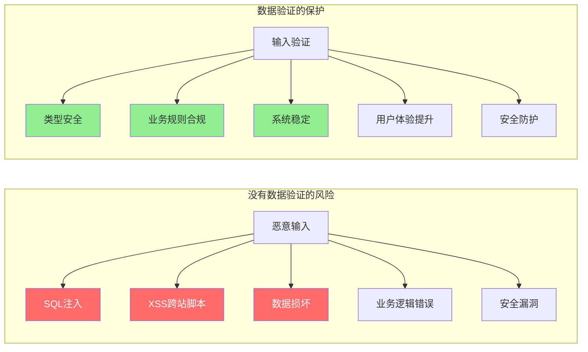
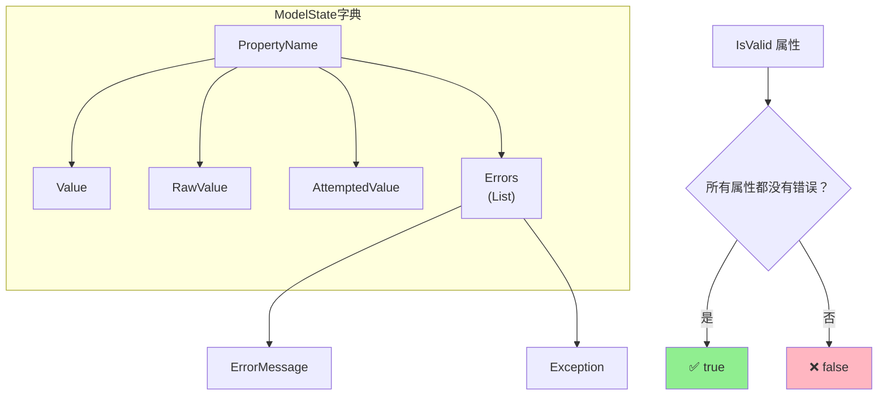
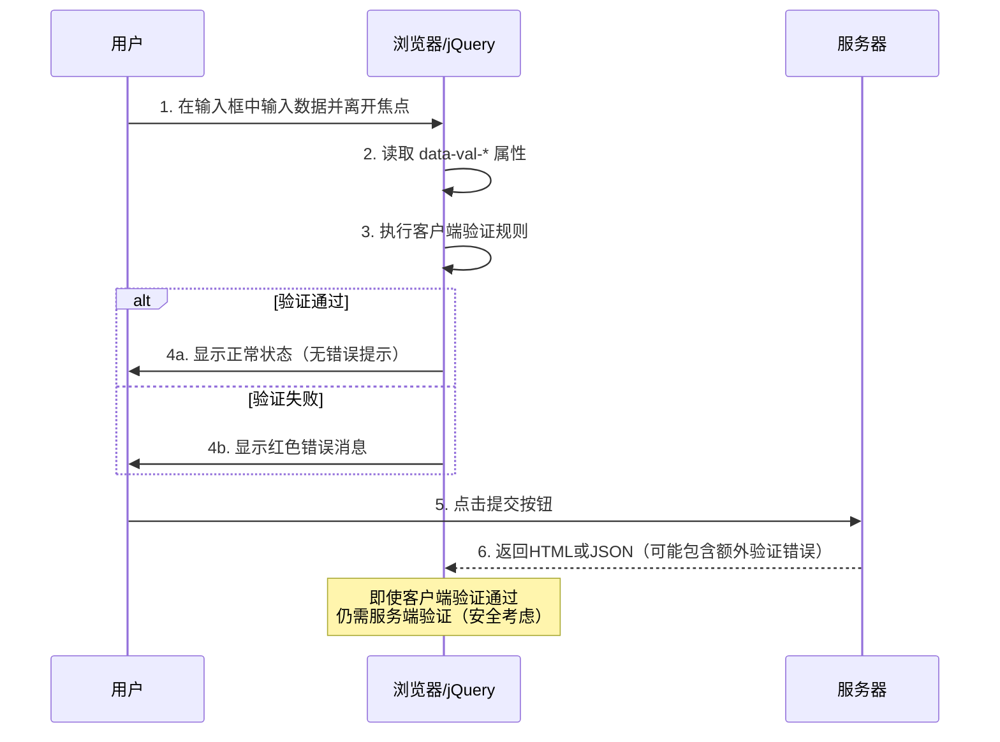
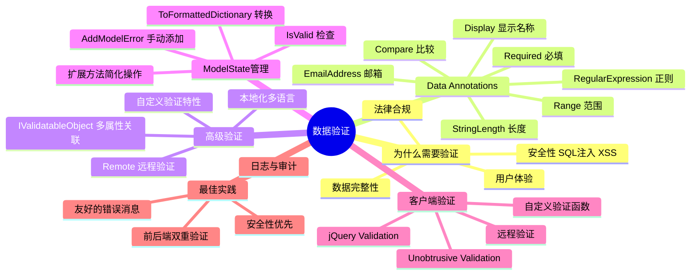

# 数据验证

> **学习目标**：全面掌握ASP.NET Core MVC中的数据验证机制，确保应用程序接收和处理合法、安全的数据
>
> **前置知识**：了解MVC模式基础、模型绑定原理、C#编程基础
>
> **预计时间**：60-75分钟
>
> **难度等级**：⭐⭐⭐ 中级

---

## 一、为什么需要数据验证？

### 1.1 数据验证的重要性

在Web应用中，**永远不要信任来自客户端的数据**。无论前端做了多少验证，后端都必须进行独立的数据验证。



### 1.2 前端验证 vs 后端验证

| 特性 | 前端（JavaScript） | 后端（C# / Data Annotations） |
|------|-------------------|----------------------------|
| **执行位置** | 用户浏览器 | 服务器 |
| **可被绕过** | ✅ 容易被绕过（禁用JS、修改请求） | ❌ 无法被绕过 |
| **响应速度** | 即时反馈（无需网络） | 需要网络往返 |
| **用户体验** | 好（实时提示） | 较慢（需等待服务器响应） |
| **安全性** | 低（仅用于便利性） | 高（最终防线） |
| **复杂逻辑支持** | 有限 | 无限制 |
| **推荐做法** | **必须做**（提升UX） | **必须做**（保障安全） |

**最佳实践**：**前后端双重验证**
- 前端验证：快速反馈，改善用户体验
- 后端验证：安全保障，确保数据完整性

---

## 二、Data Annotations验证特性

### 2.1 内置验证特性一览表

#### 必填验证

```csharp
using System.ComponentModel.DataAnnotations;

public class RequiredValidationExamples
{
    // [Required] - 字段不能为null、空字符串或仅包含空白字符
    [Required(ErrorMessage = "用户名不能为空")]
    public string UserName { get; set; } = string.Empty;

    // [Required] 允许空字符串但拒绝null（AllowEmptyStrings=true，不常用）
    [Required(AllowEmptyStrings = true)]
    public string OptionalButNotNull { get; set; } = string.Empty;

    // [Required] 与可空值类型结合使用
    [Required(ErrorMessage = "年龄必须提供")]
    public int? Age { get; set; }  // 即使是int?，加了Required也必须提供值

    // [BindRequired] - 在模型绑定时强制要求（比Required更严格）
    [BindRequired]
    public string MandatoryField { get; set; } = string.Empty;
}
```

**使用示例**：

```html
<!-- Views/Account/Register.cshtml -->
@model RegisterViewModel
<form asp-action="Register" method="post">
    <!-- 用户名 -->
    <div class="mb-3">
        <label asp-for="UserName" class="form-label"></label>
        <input asp-for="UserName" class="form-control" placeholder="请输入用户名" />
        <!-- 自动显示验证错误消息 -->
        <span asp-validation-for="UserName" class="text-danger"></span>
    </div>

    <!-- 邮箱 -->
    <div class="mb-3">
        <label asp-for="Email" class="form-label"></label>
        <input asp-for="Email" type="email" class="form-control" placeholder="example@email.com" />
        <span asp-validation-for="Email" class="text-danger"></span>
    </div>

    <button type="submit" class="btn btn-primary">注册</button>
</form>
```

#### 字符串长度验证

```csharp
public class StringLengthValidationExamples
{
    // [StringLength] - 限制字符串长度范围
    [StringLength(50, MinimumLength = 3,
        ErrorMessage = "用户名长度必须在{2}到{1}个字符之间")]
    public string UserName { get; set; } = string.Empty;

    // [MinLength] 和 [MaxLength] - 分别限制最小/最大长度
    [MinLength(10, ErrorMessage = "密码至少需要10个字符")]
    [MaxLength(128, ErrorMessage = "密码不能超过128个字符")]
    public string Password { get; set; } = string.Empty;

    // 仅限制最大长度
    [MaxLength(500, ErrorMessage = "个人简介不能超过500字")]
    public string? Bio { get; set; }

    // 多行文本的字符数限制（注意：不是行数）
    [StringLength(2000, ErrorMessage = "详细描述不能超过2000个字符")]
    public string? Description { get; set; }
}
```

#### 数值范围验证

```csharp
public class RangeValidationExamples
{
    // [Range] - 数值必须在指定范围内
    [Range(0, 120, ErrorMessage = "年龄必须在{1}到{2}岁之间")]
    public int Age { get; set; }

    // [Range] 用于decimal（如价格）
    [Range(typeof(decimal), "0.01", "999999.99",
        ErrorMessage = "价格必须在{1}到{2}元之间")]
    public decimal Price { get; set; }

    // [Range] 用于DateTime
    [Range(typeof(DateTime), "2024-01-01", "2099-12-31",
        ErrorMessage = "日期必须在{1}到{2}之间")]
    public DateTime EventDate { get; set; }

    // 组合使用：整数 + 范围
    [Required]
    [Range(1, 5, ErrorMessage = "评分必须是1-5的整数")]
    public int Rating { get; set; }
}
```

#### 类型格式验证

```csharp
public class FormatValidationExamples
{
    // [EmailAddress] - 验证邮箱格式
    [Required(ErrorMessage = "邮箱不能为空")]
    [EmailAddress(ErrorMessage = "请输入有效的邮箱地址")]
    public string Email { get; set; } = string.Empty;

    // [Phone] - 验证电话号码格式
    [Phone(ErrorMessage = "请输入有效的电话号码")]
    public string? PhoneNumber { get; set; }

    // [Url] - 验证URL格式
    [Url(ErrorMessage = "请输入有效的网址")]
    public string? Website { get; set; }

    // [CreditCard] - 验证信用卡号格式（Luhn算法）
    [CreditCard(ErrorMessage = "请输入有效的信用卡号")]
    public string? CardNumber { get; set; }

    // 正则表达式验证 - 最强大灵活的方式
    [RegularExpression(@"^1[3-9]\d{9}$",
        ErrorMessage = "请输入有效的11位手机号码")]
    public string? MobilePhone { get; set; }

    // 密码强度正则
    [RegularExpression(@"^(?=.*[a-z])(?=.*[A-Z])(?=.*\d)(?=.*[@$!%*?&])[A-Za-z\d@$!%*?&]{8,}$",
        ErrorMessage = "密码必须包含大小写字母、数字和特殊字符，至少8位")]
    public string StrongPassword { get; set; } = string.Empty;
}
```

#### 比较验证

```csharp
public class ComparisonValidationExamples
{
    // [Compare] - 确保两个属性的值相同（常用于确认密码）
    [Required(ErrorMessage = "密码不能为空")]
    [DataType(DataType.Password)]
    public string Password { get; set; } = string.Empty;

    [Required(ErrorMessage = "确认密码不能为空")]
    [DataType(DataType.Password)]
    [Compare("Password", ErrorMessage = "两次输入的密码不一致")]
    public string ConfirmPassword { get; set; } = string.Empty;

    // [Compare] 用于其他场景
    [Required]
    public string NewEmail { get; set; } = string.Empty;

    [Required]
    [Compare("NewEmail", ErrorMessage = "两次输入的邮箱不一致")]
    public string ConfirmEmail { get; set; } = string.Empty;

    // 日期比较：结束日期必须晚于开始日期（自定义特性或IValidatableObject）
    public DateTime StartDate { get; set; }
    public DateTime EndDate { get; set; }
}
```

### 2.2 完整的注册表单验证示例

```csharp
// Models/Account/RegisterViewModel.cs
using System.ComponentModel.DataAnnotations;

namespace MyApp.Models.Account
{
    public class RegisterViewModel
    {
        #region 基本信息

        [Display(Name = "用户名")]
        [Required(ErrorMessage = "用户名不能为空")]
        [StringLength(30, MinimumLength = 3,
            ErrorMessage = "用户名长度必须在{2}到{1}个字符之间")]
        [RegularExpression(@"^[a-zA-Z][a-zA-Z0-9_]*$",
            ErrorMessage = "用户名只能包含英文字母、数字和下划线，且必须以字母开头")]
        public required string UserName { get; set; }

        [Display(Name = "电子邮箱")]
        [Required(ErrorMessage = "邮箱不能为空")]
        [EmailAddress(ErrorMessage = "请输入有效的邮箱地址")]
        [MaxLength(100, ErrorMessage = "邮箱地址过长")]
        public required string Email { get; set; }

        [Display(Name = "手机号码")]
        [Phone(ErrorMessage = "请输入有效的手机号码")]
        public string? Phone { get; set; }

        #endregion

        #region 密码相关

        [Display(Name = "密码")]
        [Required(ErrorMessage = "密码不能为空")]
        [DataType(DataType.Password)]
        [MinLength(8, ErrorMessage = "密码至少需要8个字符")]
        [MaxLength(128, ErrorMessage = "密码不能超过128个字符")]
        [RegularExpression(@"^(?=.*[a-z])(?=.*[A-Z])(?=.*\d).+$",
            ErrorMessage = "密码必须同时包含大写字母、小写字母和数字")]
        public required string Password { get; set; }

        [Display(Name = "确认密码")]
        [Required(ErrorMessage = "请再次输入密码")]
        [DataType(DataType.Password)]
        [Compare("Password", ErrorMessage = "两次输入的密码不一致")]
        public required string ConfirmPassword { get; set; }

        #endregion

        #region 个人信息（可选）

        [Display(Name = "真实姓名")]
        [StringLength(50, ErrorMessage = "姓名不能超过50个字符")]
        public string? RealName { get; set; }

        [Display(Name = "出生日期")]
        [DataType(DataType.Date)]
        public DateTime? BirthDate { get; set; }

        [Display(Name = "性别")]
        public Gender? Gender { get; set; }

        #endregion

        #region 协议与选项

        [Display(Name = "我已阅读并同意服务条款和隐私政策")]
        [Range(typeof(bool), "true", "true",
            ErrorMessage = "必须同意条款才能注册")]
        public bool AgreeToTerms { get; set; }

        [Display(Name = "订阅新闻邮件和产品更新通知")]
        public bool SubscribeNewsletter { get; set; } = false;

        #endregion
    }

    public enum Gender
    {
        Male = 1,
        Female = 2,
        Other = 3
    }
}
```

**对应的Controller处理**：

```csharp
// Controllers/AccountController.cs
using Microsoft.AspNetCore.Mvc;
using MyApp.Models.Account;
using MyApp.Services;

namespace MyApp.Controllers
{
    public class AccountController : Controller
    {
        private readonly IAccountService _accountService;
        private readonly ILogger<AccountController> _logger;

        public AccountController(IAccountService accountService, ILogger<AccountController> logger)
        {
            _accountService = accountService;
            _logger = logger;
        }

        /// <summary>
        /// GET: /account/register
        /// 显示注册页面
        /// </summary>
        [HttpGet]
        [AllowAnonymous]
        public IActionResult Register()
        {
            return View();
        }

        /// <summary>
        /// POST: /account/register
        /// 处理注册表单提交
        /// </summary>
        [HttpPost]
        [AllowAnonymous]
        [ValidateAntiForgeryToken]
        public async Task<IActionResult> Register(RegisterViewModel model)
        {
            #region 步骤1: Data Annotations自动验证

            if (!ModelState.IsValid)
            {
                // 记录验证失败的字段（调试用）
                foreach (var state in ModelState.Where(s => s.Value.Errors.Count > 0))
                {
                    _logger.LogInformation("注册验证失败: Field={Field}, Errors={Errors}",
                        state.Key,
                        string.Join("; ", state.Value.Errors.Select(e => e.ErrorMessage)));
                }

                // 返回视图并保留用户已输入的数据（PRG模式的反向操作）
                return View(model);
            }

            #endregion

            #region 步骤2: 业务规则验证（超出Data Annotations范围）

            var businessErrors = new List<string>();

            // 检查用户名是否已被占用
            if (await _accountService.UserNameExistsAsync(model.UserName))
            {
                businessErrors.Add("该用户名已被使用，请选择其他用户名");
                ModelState.AddModelError(nameof(model.UserName), "该用户名已被使用");
            }

            // 检查邮箱是否已被注册
            if (await _accountService.EmailExistsAsync(model.Email))
            {
                businessErrors.Add("该邮箱已被注册，您可以直接登录或找回密码");
                ModelState.AddModelError(nameof(model.Email), "该邮箱已被注册");
            }

            // 检查手机号是否已被绑定（如果提供了的话）
            if (!string.IsNullOrEmpty(model.Phone) && await _accountService.PhoneExistsAsync(model.Phone))
            {
                businessErrors.Add("该手机号已被其他账户绑定");
                ModelState.AddModelError(nameof(model.Phone), "该手机号已被使用");
            }

            // 自定义业务规则：检查密码强度（除了Data Annotations之外的其他要求）
            if (model.Password.Contains(model.UserName))
            {
                businessErrors.Add("密码不能包含用户名");
                ModelState.AddModelError(nameof(model.Password), "密码中不能包含用户名");
            }

            // 如果有业务验证错误，返回表单
            if (businessErrors.Any())
            {
                _logger.LogWarning("注册业务验证失败: {Errors}", string.Join(" | ", businessErrors));
                return View(model);
            }

            #endregion

            #region 步骤3: 创建账户

            try
            {
                var user = await _accountService.CreateUserAsync(new CreateUserCommand
                {
                    UserName = model.UserName.Trim(),
                    Email = model.Email.Trim().ToLowerInvariant(),
                    Phone = model.Phone?.Trim(),
                    Password = model.Password,
                    RealName = model.RealName?.Trim(),
                    BirthDate = model.BirthDate,
                    Gender = model.Gender,
                    AgreeToTerms = model.AgreeToTerms,
                    SubscribeNewsletter = model.SubscribeNewsletter,
                    RegisteredIp = HttpContext.Connection.RemoteIpAddress?.ToString(),
                    UserAgent = HttpContext.Request.Headers.UserAgent.FirstOrDefault()
                });

                _logger.LogInformation("新用户注册成功: UserId={UserId}, UserName={UserName}, Email={Email}",
                    user.Id, user.UserName, user.Email);

                #region 发送欢迎邮件

                try
                {
                    await _emailService.SendWelcomeEmailAsync(user);
                }
                catch (Exception emailEx)
                {
                    // 邮件发送失败不应阻止注册流程
                    _logger.LogWarning(emailEx, "发送欢迎邮件失败: UserId={UserId}", user.Id);
                }

                #endregion

                TempData["SuccessMessage"] = "注册成功！欢迎加入我们。";
                TempData["JustRegistered"] = true;

                // PRG模式：重定向到登录页（防止重复提交）
                return RedirectToAction(nameof(Login));
            }
            catch (Exception ex)
            {
                _logger.LogError(ex, "创建用户账户时发生异常");
                ModelState.AddModelError("", "注册过程中发生错误，请稍后重试。如果问题持续存在，请联系客服。");
                return View(model);
            }

            #endregion
        }
    }
}
```

---

## 三、自定义验证特性

### 3.1 创建自定义验证特性

当内置的特性无法满足需求时，可以继承`ValidationAttribute`创建自己的验证特性：

#### 示例1：中国身份证号验证

```csharp
// Attributes/ChineseIdCardAttribute.cs
using System.ComponentModel.DataAnnotations;

[AttributeUsage(AttributeTargets.Property | AttributeTargets.Field | AttributeTypes.Parameter,
    AllowMultiple = false)]
public class ChineseIdCardAttribute : ValidationAttribute
{
    public override bool IsValid(object? value)
    {
        if (value == null || string.IsNullOrWhiteSpace(value.ToString()))
        {
            // 如果属性不是必填的（没有[Required]），允许为空
            return true;
        }

        var idCard = value.ToString()!.Trim();

        // 基本格式检查：18位，最后一位可能是X
        if (!System.Text.RegularExpressions.Regex.IsMatch(idCard, @"^\d{17}[\dXx]$"))
        {
            ErrorMessage = "身份证号格式不正确";
            return false;
        }

        // 地区码检查（前6位）
        var provinceCode = idCard.Substring(0, 2);
        var validProvinceCodes = new[]
        {
            "11", "12", "13", "14", "15", "21", "22", "23", "31", "32",
            "33", "34", "35", "36", "37", "41", "42", "43", "44", "45",
            "46", "50", "51", "52", "53", "54", "61", "62", "63", "64",
            "65", "71", "81", "82", "91"
        };

        if (!validProvinceCodes.Contains(provinceCode))
        {
            ErrorMessage = "身份证地区码无效";
            return false;
        }

        // 出生日期检查（第7-14位：YYYYMMDD）
        try
        {
            var birthDateStr = idCard.Substring(6, 8);
            var birthDate = DateTime.ParseExact(birthDateStr, "yyyyMMdd", null);

            // 出生日期不能是未来时间
            if (birthDate > DateTime.Today)
            {
                ErrorMessage = "身份证中的出生日期无效（不能是未来日期）";
                return false;
            }

            // 出生日期不能太早（比如1900年之前）
            if (birthDate.Year < 1900)
            {
                ErrorMessage = "身份证中的出生日期无效（年份过早）";
                return false;
            }
        }
        catch
        {
            ErrorMessage = "身份证中的出生日期格式无效";
            return false;
        }

        // 校验码验证（第18位）
        var weights = new[] { 7, 9, 10, 5, 8, 4, 2, 1, 6, 3, 7, 9, 10, 5, 8, 4, 2 };
        var checkCodes = new[] { '1', '0', 'X', '9', '8', '7', '6', '5', '4', '3', '2' };

        int sum = 0;
        for (int i = 0; i < 17; i++)
        {
            sum += (idCard[i] - '0') * weights[i];
        }

        var expectedCheckCode = checkCodes[sum % 11];
        var actualCheckCode = char.ToUpper(idCard[17]);

        if (actualCheckCode != expectedCheckCode)
        {
            ErrorMessage = "身份证校验码无效";
            return false;
        }

        return true;
    }
}
```

**使用自定义特性**：

```csharp
public class UserProfileViewModel
{
    [Required(ErrorMessage = "真实姓名不能为空")]
    [StringLength(20, ErrorMessage = "姓名不能超过20个字符")]
    [Display(Name = "真实姓名")]
    public required string RealName { get; set; }

    [ChineseIdCard(ErrorMessage = "请输入有效的18位中国居民身份证号")]
    [Display(Name = "身份证号")]
    public required string IdCardNumber { get; set; }
}
```

#### 示例2：不允许某些关键字

```csharp
// Attributes/NoForbiddenWordsAttribute.cs
public class NoForbiddenWordsAttribute : ValidationAttribute
{
    private readonly string[] _forbiddenWords;

    public NoForbiddenWordsAttribute(params string[] forbiddenWords)
    {
        _forbiddenWords = forbiddenWords;
    }

    protected override ValidationResult? IsValid(object? value, ValidationContext validationContext)
    {
        if (value == null || string.IsNullOrWhiteSpace(value.ToString()))
            return ValidationResult.Success;

        var input = value.ToString()!.Trim();

        var foundWords = _forbiddenWords
            .Where(word => input.Contains(word, StringComparison.OrdinalIgnoreCase))
            .ToList();

        if (foundWords.Any())
        {
            return new ValidationResult(
                $"内容包含禁止使用的词汇: {string.Join(", ", foundWords)}",
                new[] { validationContext.MemberName! });
        }

        return ValidationResult.Success;
    }
}

// 使用
[NoForbiddenWords("admin", "root", "test", "password", "123456")]
public string Nickname { get; set; } = string.Empty;
```

#### 示例3：唯一性验证（数据库查询）

```csharp
// Attributes/UniqueAttribute.cs
public class UniqueAttribute : ValidationAttribute
{
    private readonly Type _serviceType;
    private readonly string _methodName;

    public UniqueAttribute(Type serviceType, string methodName)
    {
        _serviceType = serviceType;
        _methodName = methodName;
    }

    protected override ValidationResult? IsValid(object? value, ValidationContext validationContext)
    {
        if (value == null || string.IsNullOrWhiteSpace(value.ToString()))
            return ValidationResult.Success;

        // 从DI容器获取服务实例
        var service = validationContext.GetService(_serviceType);

        if (service == null)
        {
            throw new InvalidOperationException($"无法获取类型 {_service.Name} 的服务实例");
        }

        // 使用反射调用方法
        var method = _serviceType.GetMethod(_methodName);
        if (method == null)
        {
            throw new InvalidOperationException($"在 {_service.Name} 中找不到方法 {_methodName}");
        }

        var task = (Task<bool>)method.Invoke(service, new object[] { value })!;
        task.Wait();

        if (task.Result)  // 已存在 → 不唯一
        {
            return new ValidationResult(
                $"{validationContext.DisplayName} \"{value}\" 已被占用，请更换",
                new[] { validationContext.MemberName! });
        }

        return ValidationResult.Success;
    }
}

// 使用（假设有 IUserService.ExistsByUsername(string username) 方法）
[Unique(typeof(IUserService), nameof(IUserService.ExistsByUsername))]
[Display(Name = "用户名")]
public required string Username { get; set; }
```

**注意**：这种通过反射调用服务的做法性能不佳且复杂。**更好的方式是使用IValidatableObject接口或在Action中进行验证**（见下文）。

---

## 四、ModelState验证状态检查

### 4.1 ModelState的结构

`ModelState`是一个字典，包含了模型中每个属性的绑定状态和验证结果：



### 4.2 检查和使用ModelState

```csharp
[HttpPost]
public IActionResult CreateProduct(CreateProductDto dto)
{
    #region 方式1: 整体检查

    if (!ModelState.IsValid)
    {
        // 所有验证都通过才返回true
        return BadRequest(ModelState);  // 直接返回所有错误信息
    }

    #endregion

    #region 方式2: 检查特定字段

    if (!ModelState.TryGetValue("Price", out var priceEntry) ||
        !priceEntry.Errors.Any())
    {
        // Price字段没有错误
    }

    // 或者直接访问
    if (ModelState.ContainsKey("Category") && ModelState["Category"]!.Errors.Count > 0)
    {
        var categoryErrors = ModelState["Category"]!.Errors;
        // 处理特定字段的错误...
    }

    #endregion

    #region 方式3: 手动添加错误（常用于业务规则验证）

    // 添加到特定字段
    ModelState.AddModelError(nameof(dto.Price),
        "价格不能低于成本价");

    // 添加到全局（不属于任何字段）
    ModelState.AddModelError("",
        "当前库存不足，无法创建此商品");

    // 添加多个错误
    ModelState.AddModelError(nameof(dto.Tags),
        "至少需要一个标签");

    #endregion

    #region 方式4: 清除和修改状态

    // 移除某个字段的所有错误（谨慎使用）
    ModelState.RemoveFieldError("Description");  // 自定义扩展方法

    // 清除所有错误状态（极不推荐！会掩盖真正的验证问题）
    // ModelState.Clear();  // ❌ 不要这样做！

    // 标记某个字段为有效（覆盖之前的错误）
    ModelState.SetModelValue("Notes", "默认备注", "默认备注");

    #endregion

    #region 方式5: 将ModelState转换为API响应

    if (!ModelState.IsValid)
    {
        var apiResponse = new ApiValidationError
        {
            Type = "validation_error",
            Title = "一个或多个验证错误发生",
            Status = StatusCodes.Status400BadRequest,
            TraceId = HttpContext.TraceIdentifier,
            Errors = ModelState.ToDictionary(
                kvp => ToCamelCase(kvp.Key),
                kvp => kvp.Value.Errors.Select(e =>
                    new ValidationErrorDetail
                    {
                        Message = e.ErrorMessage,
                        Exception = e.Exception?.Message
                    }).ToArray()),
            InvalidFields = ModelState
                .Where(kvp => kvp.Value.Errors.Count > 0)
                .Select(kvp => kvp.Key)
                .ToArray()
        };

        return BadRequest(apiResponse);
    }

    #endregion

    // 业务逻辑执行...
    return Ok(dto);
}
```

### 4.3 扩展方法简化操作

```csharp
// Extensions/ModelStateExtensions.cs
using Microsoft.AspNetCore.Mvc.ModelBinding;

public static class ModelStateExtensions
{
    /// <summary>
    /// 将ModelState错误转换为格式化的字典
    /// </summary>
    public static Dictionary<string, string[]> ToFormattedDictionary(
        this ModelStateDictionary modelState,
        bool camelCaseKeys = true)
    {
        return modelState
            .Where(kvp => kvp.Value.Errors.Count > 0)
            .ToDictionary(
                kvp => camelCaseKeys ? ToCamelCase(kvp.Key) : kvp.Key,
                kvp => kvp.Value.Errors
                    .Select(e => string.IsNullOrEmpty(e.ErrorMessage)
                        ? e.Exception?.Message ?? "Invalid value"
                        : e.ErrorMessage)
                    .ToArray()
            );
    }

    /// <summary>
    /// 检查特定字段是否有错误
    /// </summary>
    public static bool HasErrorFor<TModel>(
        this ModelStateDictionary modelState,
        Expression<Func<TModel, object>> expression)
    {
        var fieldName = ExpressionHelper.GetExpressionText(expression);
        return modelState.TryGetValue(fieldName, out var entry) && entry.Errors.Count > 0;
    }

    /// <summary>
    /// 获取特定字段的第一个错误消息
    /// </summary>
    public static string? GetFirstErrorFor<TModel>(
        this ModelStateDictionary modelState,
        Expression<Func<TModel, object>> expression)
    {
        var fieldName = ExpressionHelper.GetExpressionText(expression);
        return modelState.TryGetValue(fieldName, out var entry)
            ? entry.Errors.FirstOrDefault()?.ErrorMessage
            : null;
    }

    /// <summary>
    /// 移除指定字段的所有错误
    /// </summary>
    public static void RemoveFieldError(
        this ModelStateDictionary modelState,
        string fieldName)
    {
        if (modelState.TryGetValue(fieldName, out var entry))
        {
            entry.Errors.Clear();
        }
    }

    /// <summary>
    /// 将所有错误合并为一个字符串
    /// </summary>
    public static string GetAllErrorsJoined(
        this ModelStateDictionary modelState,
        string separator = "; ")
    {
        return string.Join(separator,
            modelState.Values
                .SelectMany(v => v.Errors)
                .Select(e => e.ErrorMessage)
                .Where(m => !string.IsNullOrEmpty(m)));
    }

    private static string ToCamelCase(string str)
    {
        if (string.IsNullOrEmpty(str)) return str;
        return char.ToLower(str[0]) + str.Substring(1);
    }
}
```

**使用扩展方法**：

```csharp
[HttpPost]
public IActionResult SubmitForm(MyViewModel model)
{
    if (!ModelState.IsValid)
    {
        // 使用扩展方法
        var errors = ModelState.ToFormattedDictionary();  // camelCase键名

        var firstError = ModelState.GetFirstErrorFor(m => m.Email);  // 获取邮箱的第一个错误

        var allErrorsText = ModelState.GetAllErrorsJoined("<br/>");  // 合并所有错误

        return BadRequest(new { errors, message = allErrorsText });
    }

    // ...
}
```

---

## 五、验证错误消息自定义（本地化支持）

### 5.1 错误消息本地化基础

为了支持多语言，验证错误消息应该从资源文件中读取：

#### Step 1: 创建资源文件

```
Resources/
├── Validations.resx          （默认语言，英文）
├── Validations.zh-CN.resx   （简体中文）
├── Validations.zh-TW.resx   （繁体中文）
└── Validations.ja-JP.resx   （日文）
```

**Validations.zh-CN.resx 内容示例**：

| 名称 | 值 |
|------|-----|
| `Required_Error` | `{0}不能为空` |
| `StringLength_Error` | `{0}长度必须在{2}到{1}个字符之间` |
| `Email_Error` | 请输入有效的{0}地址 |
| `Range_Error` | `{0}必须在{1}到{2}之间` |
| `Compare_Error` | 两次输入的{0}不一致 |

#### Step 2: 配置本地化服务

```csharp
// Program.cs
builder.Services.AddLocalization(options => options.ResourcesPath = "Resources");

builder.Services.AddControllersWithViews()
    .AddDataAnnotationsLocalization()  // 启用Data Annotations本地化
    .AddViewLocalization(LanguageViewLocationInjector.SimilarToFileNames);

// 配置支持的本地化文化
var supportedCultures = new[]
{
    "zh-CN",  // 简体中文（默认）
    "en-US",  // 英文
    "zh-TW",  // 繁体中文
    "ja-JP"   // 日文
};

builder.Services.Configure<RequestLocalizationOptions>(options =>
{
    options.DefaultRequestCulture = new RequestCulture("zh-CN");
    options.SupportedCultures = supportedCultures;
    options.SupportedUICultures = supportedCultures;
});
```

#### Step 3: 在Model中使用本地化消息

```csharp
// 使用 IStringLocalizer 注入到验证特性中
public class LocalizedViewModel
{
    // 方式1：使用ErrorMessageResourceType指定资源类
    [Required(ErrorMessageResourceType = typeof(Validations),
              ErrorMessageResourceName = "Required_Error")]
    [Display(Name = "用户名", ResourceType = typeof(Labels))]
    public required string UserName { get; set; }

    // 方式2：使用占位符（框架自动填充参数）
    [StringLength(30, MinimumLength = 3,
        ErrorMessageResourceType = typeof(Validations),
        ErrorMessageResourceName = "StringLength_Error")]
    public required string UserName { get; set; }

    // 方式3：硬编码多语言消息（简单场景）
    [EmailAddress(ErrorMessage = "{0}格式无效")]
    public required string Email { get; set; }
}
```

### 5.2 更高级的本地化方案

对于大型项目，建议创建自定义验证特性来更好地支持本地化：

```csharp
// Attributes/LocalizedRequiredAttribute.cs
public class LocalizedRequiredAttribute : RequiredAttribute
{
    public LocalizedRequiredAttribute()
    {
        // 默认错误消息将在运行时由本地化服务替换
        ErrorMessage = "{0} is required";  // 占位符
    }
}

// 自定义验证适配器（实现 IValidationAttributeAdapterFactory）
public class LocalizedRequiredAttributeAdapter : AttributeAdapterBase<LocalizedRequiredAttribute>
{
    public LocalizedRequiredAttributeAdapter(LocalizedRequiredAttribute attribute, IStringLocalizer stringLocalizer)
        : base(attribute, stringLocalizer)
    {
    }

    public override void AddValidation(ClientModelValidationContext context)
    {
        if (context == null) throw new ArgumentNullException(nameof(context));

        MergeAttribute(context.Attributes, "data-val", "true");
        MergeAttribute(context.Attributes, "data-val-required",
            GetErrorMessage(context));  // 使用本地化的错误消息
    }

    private string GetErrorMessage(ClientModelValidationContext context)
    {
        var displayName = context.ModelMetadata.DisplayName ?? context.ModelMetadata.PropertyName;
        return string.Format(StringLocalizer[Attribute.ErrorMessage], displayName);
    }
}

// 注册适配器
builder.Services.AddSingleton<IValidationAttributeAdapterProvider, CustomValidationAttributeAdapterProvider>();
```

---

## 六、客户端验证（jQuery Validation集成）

### 6.1 启用客户端验证

ASP.NET Core默认集成了jQuery Validation和jQuery Unobtrusive Validation，可以在不刷新页面的情况下即时验证表单：

```html
<!-- Views/Shared/_ValidationScriptsPartial.cshtml -->
<script src="~/lib/jquery-validation/dist/jquery.validate.min.js"></script>
<script src="~/lib/jquery-validation-unobtrusive/jquery.validate.unobtrusive.min.js"></script>
```

**在Layout中使用**：

```html
<!-- Views/Shared/_Layout.cshtml -->
<!-- ... 其他内容 ... -->

@section Scripts {
    @await RenderSectionAsync("Scripts", required: false)

    <!-- 页面级别的验证脚本（每个需要表单验证的页面都要引用） -->
    @await RenderPartialAsync("_ValidationScriptsPartial")
}
```

### 6.2 客户端验证的工作原理



### 6.3 Data Annotations如何生成客户端验证属性

当你在Model上添加`[Required]`等特性时，Tag Helpers会自动生成对应的`data-val-*`属性：

```csharp
// Model
[Required(ErrorMessage = "邮箱不能为空")]
[EmailAddress(ErrorMessage = "邮箱格式无效")]
public required string Email { get; set; }
```

生成的HTML：
```html
<input type="email"
       data-val="true"
       data-val-required="邮箱不能为空"
       data-val-email="邮箱格式无效"
       data-msg-required="邮箱不能为空"
       id="Email"
       name="Email"
       value="" />
<span class="text-danger field-validation-valid"
      data-valmsg-for="Email"
      data-valmsg-replace="true"></span>
```

### 6.4 自定义客户端验证规则

有时需要编写自定义的JavaScript验证函数：

```javascript
// wwwroot/js/custom-validators.js

// 自定义验证：中国手机号
$.validator.addMethod("chinesemobile", function(value, element) {
    return this.optional(element) || /^1[3-9]\d{9}$/.test(value);
}, "请输入有效的11位中国手机号码");

// 自定义验证：密码强度
$.validator.addMethod("passwordstrength", function(value, element) {
    if (this.optional(element)) return true;

    // 至少包含：大写字母、小写字母、数字、特殊字符
    var hasUpper = /[A-Z]/.test(value);
    var hasLower = /[a-z]/.test(value);
    var hasDigit = /\d/.test(value);
    var hasSpecial = /[!@#$%^&*(),.?":{}|<>]/.test(value);

    return hasUpper && hasLower && hasDigit && hasSpecial;
}, "密码必须包含大写字母、小写字母、数字和特殊字符");

// 自定义验证：日期范围（开始日期 <= 结束日期）
$.validator.addMethod("daterange", function(value, element, params) {
    if (this.optional(element)) return true;

    var startDate = $(params.startDate).val();
    var endDate = value;

    if (!startDate || !endDate) return true;

    return new Date(startDate) <= new Date(endDate);
}, "结束日期不能早于开始日期");

// 应用自定义规则到表单
$(document).ready(function () {
    $("form").validate({
        rules: {
            Mobile: {
                chinesemobile: true
            },
            Password: {
                passwordstrength: true,
                minlength: 8
            },
            EndDate: {
                daterange: {
                    startDate: "#StartDate"
                }
            }
        },
        messages: {
            Mobile: {
                chinesemobile: "请输入有效的11位手机号"
            },
            Password: {
                passwordstrength: "密码强度不够"
            },
            EndDate: {
                daterange: "结束日期必须晚于开始日期"
            }
        }
    });
});
```

### 6.5 远程验证（Remote attribute）

当需要在不提交整个表单的情况下验证某个字段（如检查用户名是否可用）时，可以使用远程验证：

```csharp
// Model
[Required(ErrorMessage = "用户名不能为空")]
[Remote(action: "VerifyUsername", controller: "Account",
    HttpMethod = "POST",
    AdditionalFields = "__RequestVerificationToken",  // CSRF保护
    ErrorMessage = "该用户名已被占用")]
[Display(Name = "用户名")]
public required string UserName { get; set; }
```

**Controller中的验证端点**：

```csharp
/// <summary>
/// POST: /account/verifyusername
/// 远程验证用户名是否可用
/// </summary>
[HttpPost]
[AllowAnonymous]
[ValidateAntiForgeryToken]
public async Task<JsonResult> VerifyUsername(string userName)
{
    if (string.IsNullOrWhiteSpace(userName))
    {
        return Json("用户名不能为空");
    }

    // 格式验证
    if (!System.Text.RegularExpressions.Regex.IsMatch(userName, @"^[a-zA-Z][a-zA-Z0-9_]{2,29}$"))
    {
        return Json("用户名只能包含英文字母、数字和下划线，3-30个字符");
    }

    // 查询数据库
    var exists = await _userService.UserNameExistsAsync(userName.Trim());

    if (exists)
    {
        return Json($"用户名 \"{userName}\" 已被使用");
    }

    return Json(true);  // true表示验证通过
}
```

**注意**：远程验证虽然方便，但要注意：
1. 可能导致大量数据库查询（考虑防抖debounce）
2. 需要CSRF保护
3. 不应依赖它作为唯一的安全措施（仍需后端验证）

---

## 七、IValidatableObject接口

### 7.1 为什么需要IValidatableObject？

Data Annotations适用于**单个属性**的验证。但当验证逻辑涉及**多个属性之间的关系**时（如开始日期必须早于结束日期），就需要使用`IValidatableObject`接口。

### 7.2 实现IValidatableObject

```csharp
// Models/Event/CreateEventViewModel.cs
using System.ComponentModel.DataAnnotations;

namespace MyApp.Models.Event
{
    public class CreateEventViewModel : IValidatableObject
    {
        #region 基本信息

        [Required(ErrorMessage = "活动标题不能为空")]
        [StringLength(200, MinimumLength = 5,
            ErrorMessage = "标题长度应在{2}-{1}个字符之间")]
        [Display(Name = "活动标题")]
        public required string Title { get; set; }

        [Required(ErrorMessage = "活动描述不能为空")]
        [StringLength(5000, MinimumLength = 20,
            ErrorMessage = "描述长度应在{2}-{1}个字符之间")]
        [DataType(DataType.MultilineText)]
        [Display(Name = "活动描述")]
        public required string Description { get; set; }

        #endregion

        #region 时间相关

        [Required(ErrorMessage = "开始时间不能为空")]
        [Display(Name = "开始时间")]
        public DateTime StartTime { get; set; }

        [Required(ErrorMessage = "结束时间不能为空")]
        [Display(Name = "结束时间")]
        public DateTime EndTime { get; set; }

        [Required(ErrorMessage = "报名截止时间不能为空")]
        [Display(Name = "报名截止时间")]
        public DateTime RegistrationDeadline { get; set; }

        #endregion

        #region 容量和费用

        [Required(ErrorMessage = "最大参与人数不能为空")]
        [Range(1, 100000, ErrorMessage = "人数必须在{1}-{2}人之间")]
        [Display(Name = "最大人数")]
        public int MaxParticipants { get; set; }

        [Range(0, double.MaxValue, ErrorMessage = "费用不能为负数")]
        [Display(Name = "活动费用（0表示免费）")]
        public decimal Fee { get; set; }

        #endregion

        #region 联系方式

        [Required(ErrorMessage = "联系人姓名不能为空")]
        [StringLength(50)]
        [Display(Name = "联系人")]
        public required string ContactPerson { get; set; }

        [Required(ErrorMessage = "联系电话不能为空")]
        [Phone]
        [Display(Name = "联系电话")]
        public required string ContactPhone { get; set; }

        [EmailAddress]
        [Display(Name = "联系邮箱")]
        public string? ContactEmail { get; set; }

        #endregion

        #region IValidatableObject 实现

        public IEnumerable<ValidationResult> Validate(ValidationContext validationContext)
        {
            var results = new List<ValidationResult>();

            #region 规则1: 结束时间必须晚于开始时间

            if (EndTime <= StartTime)
            {
                results.Add(new ValidationResult(
                    "结束时间必须晚于开始时间",
                    new[] { nameof(EndTime), nameof(StartTime) }));
            }

            #endregion

            #region 规则2: 报名截止时间必须在开始时间之前

            if (RegistrationDeadline >= StartTime)
            {
                results.Add(new ValidationResult(
                    "报名截止时间必须在活动开始时间之前",
                    new[] { nameof(RegistrationDeadline), nameof(StartTime) }));
            }

            #endregion

            #region 规则3: 报名截止时间不能是过去的时间

            if (RegistrationDeadline < DateTime.Now)
            {
                results.Add(new ValidationResult(
                    "报名截止时间不能是过去的日期",
                    new[] { nameof(RegistrationDeadline) }));
            }

            #endregion

            #region 规则4: 活动时长限制（不超过30天）

            var duration = EndTime - StartTime;
            if (duration.TotalDays > 30)
            {
                results.Add(new ValidationResult(
                    "活动持续时间不能超过30天",
                    new[] { nameof(EndTime), nameof(StartTime) }));
            }

            #endregion

            #region 规则5: 如果收费，必须提供联系邮箱

            if (Fee > 0 && string.IsNullOrWhiteSpace(ContactEmail))
            {
                results.Add(new ValidationResult(
                    "收费活动必须提供联系邮箱以便发送发票",
                    new[] { nameof(ContactEmail), nameof(Fee) }));
            }

            #endregion

            #region 规则6: 人数限制合理性检查

            if (MaxParticipants < 10 && Fee > 1000)
            {
                results.Add(new ValidationResult(
                    "高收费活动（>1000元）的最大人数不应少于10人",
                    new[] { nameof(MaxParticipants), nameof(Fee) }));
            }

            #endregion

            #region 规则7: 描述中不能包含敏感词

            var forbiddenWords = new[] { "免费赠送", "中奖", "红包", "返现" };
            var descriptionLower = Description.ToLowerInvariant();

            foreach (var word in forbiddenWords)
            {
                if (descriptionLower.Contains(word))
                {
                    results.Add(new ValidationResult(
                        $"活动描述中不允许包含\"{word}\"等营销词汇",
                        new[] { nameof(Description) }));
                    break;  // 只报告第一个发现的违规词汇
                }
            }

            #endregion

            return results;
        }

        #endregion
    }
}
```

### 7.3 使用IValidatableObject的Controller

```csharp
/// <summary>
/// POST: /event/create
/// 处理活动创建表单
/// </summary>
[HttpPost]
[Authorize(Roles = "Organizer,Admin")]
[ValidateAntiForgeryToken]
public async Task<IActionResult> Create(CreateEventViewModel model)
{
    #region Data Annotations + IValidatableObject 双重验证

    if (!ModelState.IsValid)
    {
        // 此时ModelState已经包含了Data Annotations的错误
        // 以及Validate()方法返回的多属性关联错误

        // 区分单字段错误和多字段关联错误
        var singleFieldErrors = ModelState
            .Where(kvp => kvp.Value.Errors.Count > 0 &&
                         kvp.Key != "" &&
                         !kvp.Value.Errors.Any(e =>
                             e.ErrorMessage.Contains("必须") &&
                             e.ErrorMessage.Contains("之前")))
            .ToList();

        var crossFieldErrors = ModelState
            .Where(kvp => kvp.Value.Errors.Count > 0 &&
                         kvp.Value.Errors.Any(e =>
                             e.ErrorMessage.Contains("必须") &&
                             e.ErrorMessage.Contains("之前")))
            .ToList();

        _logger.LogWarning("活动创建验证失败: 单字段错误={SingleCount}, 关联错误={CrossCount}",
            singleFieldErrors.Count, crossFieldErrors.Count);

        // 重新加载下拉框等数据
        ViewBag.Categories = await _categoryService.GetAllAsync();
        ViewBag.Venues = await _venueService.GetAvailableVenuesAsync();

        return View(model);
    }

    #endregion

    try
    {
        // 额外的业务验证（如权限检查、配额检查等）
        if (!await CanCreateMoreEvents(User.Identity.Name))
        {
            ModelState.AddModelError("", "您本月的活动创建次数已达上限");
            return View(model);
        }

        var eventObj = _mapper.Map<Event>(model);
        eventObj.OrganizerId = GetCurrentUserId();
        eventObj.Status = EventStatus.Draft;
        eventObj.CreatedAt = DateTime.UtcNow;

        var createdEvent = await _eventService.CreateAsync(eventObj);

        TempData["SuccessMessage"] = $"活动「{createdEvent.Title}」创建成功！";
        return RedirectToAction(nameof(Details), new { id = createdEvent.Id });
    }
    catch (Exception ex)
    {
        _logger.LogError(ex, "创建活动时发生异常");
        ModelState.AddModelError("", "系统繁忙，请稍后重试");
        return View(model);
    }
}
```

---

## 八、实际表单验证完整示例（注册表单）

### 8.1 完整的Register ViewModel

```csharp
// Models/Account/CompleteRegisterViewModel.cs
using System.ComponentModel.DataAnnotations;

namespace MyApp.Models.Account
{
    public class CompleteRegisterViewModel : IValidatableObject
    {
        #region 账户基本信息

        [Display(Name = "用户名", Prompt = "3-30位，字母开头，可含数字下划线")]
        [Required(ErrorMessage = "用户名不能为空")]
        [StringLength(30, MinimumLength = 3,
            ErrorMessage = "用户名长度必须在{2}到{1}个字符之间")]
        [RegularExpression(@"^[a-zA-Z][a-zA-Z0-9_]*$",
            ErrorMessage = "用户名只能包含英文字母、数字和下划线，且必须以字母开头")]
        public required string Username { get; set; }

        [Display(Name = "电子邮箱", Prompt = "example@email.com")]
        [Required(ErrorMessage = "邮箱不能为空")]
        [EmailAddress(ErrorMessage = "请输入有效的邮箱地址")]
        [MaxLength(100)]
        public required string Email { get; set; }

        [Display(Name = "手机号码", Prompt = "选填，11位中国大陆手机号")]
        [Phone(ErrorMessage = "请输入有效的手机号码")]
        public string? Phone { get; set; }

        #endregion

        #region 密码设置

        [Display(Name = "密码", Prompt = "至少8位，含大小写字母和数字")]
        [Required(ErrorMessage = "密码不能为空")]
        [DataType(DataType.Password)]
        [MinLength(8, ErrorMessage = "密码至少需要8个字符")]
        [MaxLength(128)]
        [RegularExpression(@"^(?=.*[a-z])(?=.*[A-Z])(?=.*\d).+$",
            ErrorMessage = "密码必须包含大写字母、小写字母和数字")]
        public required string Password { get; set; }

        [Display(Name = "确认密码")]
        [Required(ErrorMessage = "请再次输入密码")]
        [DataType(DataType.Password)]
        [Compare("Password", ErrorMessage = "两次输入的密码不一致")]
        public required string ConfirmPassword { get; set; }

        #endregion

        #region 个人资料（可选）

        [Display(Name = "真实姓名", Prompt = "您的中文或英文全名")]
        [StringLength(50, ErrorMessage = "姓名不能超过50个字符")]
        public string? RealName { get; set; }

        [Display(Name = "性别")]
        public Gender? Gender { get; set; }

        [Display(Name = "出生日期")]
        [DataType(DataType.Date)]
        public DateOnly? BirthDate { get; set; }

        [Display(Name = "所在城市")]
        [StringLength(50)]
        public string? City { get; set; }

        [Display(Name = "职业")]
        [StringLength(50)]
        public string? Occupation { get; set; }

        #endregion

        #region 安全与协议

        [Display(Name = "我已满18周岁并同意以下协议")]
        [Range(typeof(bool), "true", "true",
            ErrorMessage = "您必须确认已年满18周岁并同意相关协议")]
        public bool IsAdultAndAgree { get; set; }

        [Display(Name = "我同意《用户服务协议》")]
        [Range(typeof(bool), "true", "true",
            ErrorMessage = "必须同意用户服务协议才能注册")]
        public bool AgreeToTermsOfService { get; set; }

        [Display(Name = "我同意《隐私政策》")]
        [Range(typeof(bool), "true", "true",
            ErrorMessage = "必须同意隐私政策才能注册")]
        public bool AgreeToPrivacyPolicy { get; set; }

        [Display(Name = "订阅产品更新和优惠信息（可选）")]
        public bool SubscribeNewsletter { get; set; } = false;

        #endregion

        #region 人机验证

        [Display(Name = "验证码")]
        [Required(ErrorMessage = "请输入图形验证码")]
        [StringLength(6, MinimumLength = 4,
            ErrorMessage = "验证码应为4-6个字符")]
        public required string CaptchaCode { get; set; }

        // 存储正确的验证码（通常存在Session或Cache中）
        [BindNever]
        public string? ExpectedCaptchaCode { get; set; }

        #endregion

        #region IValidatableObject 实现

        public IEnumerable<ValidationResult> Validate(ValidationContext validationContext)
        {
            var results = new List<ValidationResult>();

            // 验证码校验
            if (!string.Equals(CaptchaCode?.Trim()?.ToUpper(),
                              ExpectedCaptchaCode?.ToUpper(),
                              StringComparison.Ordinal))
            {
                results.Add(new ValidationResult(
                    "验证码错误或不匹配",
                    new[] { nameof(CaptchaCode) }));
            }

            // 出生日期合理性检查
            if (BirthDate.HasValue)
            {
                var age = CalculateAge(BirthDate.Value);
                if (age < 18)
                {
                    results.Add(new ValidationResult(
                        "根据您提供的出生日期，您未满18周岁",
                        new[] { nameof(BirthDate), nameof(IsAdultAndAgree) }));
                }

                if (age > 120)
                {
                    results.Add(new ValidationResult(
                        "出生日期似乎不合理（年龄超过120岁）",
                        new[] { nameof(BirthDate) }));
                }
            }

            // 手机号格式增强验证（如果是大陆号码）
            if (!string.IsNullOrEmpty(Phone) && Phone.StartsWith("1") && Phone.Length == 11)
            {
                if (!System.Text.RegularExpressions.Regex.IsMatch(Phone, @"^1[3-9]\d{9}$"))
                {
                    results.Add(new ValidationResult(
                        "请输入有效的11位中国大陆手机号码",
                        new[] { nameof(Phone) }));
                }
            }

            return results;
        }

        private static int CalculateAge(DateOnly birthDate)
        {
            var today = DateOnly.FromDateTime(DateTime.Today);
            var age = today.Year - birthDate.Year;

            // 如果今年生日还没到，减去一岁
            if (today < birthDate.AddYears(age))
                age--;

            return age;
        }

        #endregion
    }

    public enum Gender
    {
        Male = 1,
        Female = 2,
        Other = 3,
        PreferNotToSay = 4
    }
}
```

### 8.2 对应的Razor视图

```html
<!-- Views/Account/Register.cshtml -->
@model CompleteRegisterViewModel
@{
    ViewData["Title"] = "用户注册";
}

<div class="container mt-5">
    <div class="row justify-content-center">
        <div class="col-md-8 col-lg-6">
            <div class="card shadow-lg">
                <div class="card-header bg-primary text-white text-center py-3">
                    <h3 class="mb-0">
                        <i class="bi bi-person-plus me-2"></i>创建新账户
                    </h3>
                    <small class="opacity-75">加入我们，开启精彩旅程</small>
                </div>

                <div class="card-body p-4">
                    <form asp-action="Register" asp-controller="Account" method="post" id="registerForm" novalidate>

                        @Html.AntiForgeryToken()

                        <!-- 全局错误摘要 -->
                        <div asp-validation-summary="ModelOnly" class="alert alert-danger mb-4" role="alert"></div>

                        <!-- ====== 第一步：账户信息 ====== -->
                        <fieldset class="mb-4">
                            <legend class="fs-5 border-bottom pb-2 mb-3">
                                <i class="bi bi-person-badge me-2"></i>账户信息
                            </legend>

                            <div class="mb-3">
                                <label asp-for="Username" class="form-label fw-semibold"></label>
                                <div class="input-group">
                                    <span class="input-group-text"><i class="bi bi-at"></i></span>
                                    <input asp-for="Username" class="form-control"
                                           placeholder="@((typeof(CompleteRegisterViewModel).GetProperty("Username")!.GetCustomAttribute<DisplayAttribute>()?.Prompt)" />
                                </div>
                                <span asp-validation-for="Username" class="text-danger small"></span>

                                <!-- 远程验证：用户名可用性检查 -->
                                <div class="form-text" id="usernameAvailability"></div>
                            </div>

                            <div class="row">
                                <div class="col-md-6 mb-3">
                                    <label asp-for="Email" class="form-label fw-semibold"></label>
                                    <input asp-for="Email" type="email" class="form-control"
                                           placeholder="name@example.com" />
                                    <span asp-validation-for="Email" class="text-danger small"></span>
                                </div>
                                <div class="col-md-6 mb-3">
                                    <label asp-for="Phone" class="form-label fw-semibold"></label>
                                    <input asp-for="Phone" type="tel" class="form-control"
                                           placeholder="13800138000" />
                                    <span asp-validation-for="Phone" class="text-danger small"></span>
                                </div>
                            </div>
                        </fieldset>

                        <!-- ====== 第二步：密码设置 ====== -->
                        <fieldset class="mb-4">
                            <legend class="fs-5 border-bottom pb-2 mb-3">
                                <i class="bi bi-key me-2"></i>设置密码
                            </legend>

                            <div class="mb-3">
                                <label asp-for="Password" class="form-label fw-semibold"></label>
                                <div class="input-group">
                                    <input asp-for="Password" class="form-control"
                                           id="passwordInput"
                                           oninput="checkPasswordStrength(this.value)" />
                                    <button class="btn btn-outline-secondary" type="button"
                                            onclick="togglePasswordVisibility('passwordInput', this)">
                                        <i class="bi bi-eye"></i>
                                    </button>
                                </div>
                                <span asp-validation-for="Password" class="text-danger small"></span>

                                <!-- 密码强度指示器 -->
                                <div class="mt-2" id="passwordStrengthBar">
                                    <div class="progress" style="height: 5px;">
                                        <div class="progress-bar" role="progressbar" style="width: 0%"
                                             id="passwordStrengthProgress"></div>
                                    </div>
                                    <small class="text-muted" id="passwordStrengthText">请输入密码</small>
                                </div>
                            </div>

                            <div class="mb-3">
                                <label asp-for="ConfirmPassword" class="form-label fw-semibold"></label>
                                <div class="input-group">
                                    <input asp-for="ConfirmPassword" class="form-control"
                                           id="confirmPasswordInput" />
                                    <button class="btn btn-outline-secondary" type="button"
                                            onclick="togglePasswordVisibility('confirmPasswordInput', this)">
                                        <i class="bi bi-eye"></i>
                                    </button>
                                </div>
                                <span asp-validation-for="ConfirmPassword" class="text-danger small"></span>
                            </div>
                        </fieldset>

                        <!-- ====== 第三步：个人资料（可选） ====== -->
                        <fieldset class="mb-4">
                            <legend class="fs-5 border-bottom pb-2 mb-3">
                                <i class="bi bi-person-lines-fill me-2"></i>个人资料
                                <small class="text-muted fw-normal ms-2">（选填）</small>
                            </legend>

                            <div class="mb-3">
                                <label asp-for="RealName" class="form-label fw-semibold"></label>
                                <input asp-for="RealName" class="form-control" placeholder="张三" />
                                <span asp-validation-for="RealName" class="text-danger small"></span>
                            </div>

                            <div class="row">
                                <div class="col-md-4 mb-3">
                                    <label asp-for="Gender" class="form-label fw-semibold"></label>
                                    <select asp-for="Gender" class="form-select"
                                            asp-items="Html.GetEnumSelectList<Gender>()">
                                        <option value="">请选择</option>
                                    </select>
                                    <span asp-validation-for="Gender" class="text-danger small"></span>
                                </div>
                                <div class="col-md-4 mb-3">
                                    <label asp-for="BirthDate" class="form-label fw-semibold"></label>
                                    <input asp-for="BirthDate" class="form-control" type="date" />
                                    <span asp-validation-for="BirthDate" class="text-danger small"></span>
                                </div>
                                <div class="col-md-4 mb-3">
                                    <label asp-for="City" class="form-label fw-semibold"></label>
                                    <input asp-for="City" class="form-control" placeholder="北京" />
                                    <span asp-validation-for="City" class="text-danger small"></span>
                                </div>
                            </div>
                        </fieldset>

                        <!-- ====== 第四步：验证码 ====== -->
                        <fieldset class="mb-4">
                            <legend class="fs-5 border-bottom pb-2 mb-3">
                                <i class="bi bi-shield-check me-2"></i>安全验证
                            </legend>

                            <div class="mb-3">
                                <label asp-for="CaptchaCode" class="form-label fw-semibold"></label>
                                <div class="row align-items-center">
                                    <div class="col-md-8">
                                        <input asp-for="CaptchaCode" class="form-control"
                                               placeholder="请输入右侧图片中的字符" maxlength="6" />
                                        <span asp-validation-for="CaptchaCode" class="text-danger small"></span>
                                    </div>
                                    <div class="col-md-4 text-center">
                                        
                                        <small class="d-block mt-1 text-muted">
                                            <a href="#" onclick="refreshCaptcha()">看不清？换一张</a>
                                        </small>
                                    </div>
                                </div>
                            </div>
                        </fieldset>

                        <!-- ====== 第五步：同意条款 ====== -->
                        <fieldset class="mb-4">
                            <legend class="fs-5 border-bottom pb-2 mb-3">
                                <i class="bi bi-file-earmark-text me-2"></i>服务条款
                            </legend>

                            <div class="form-check mb-2">
                                <input class="form-check-input" asp-for="IsAdultAndAgree" />
                                <label class="form-check-label" asp-for="IsAdultAndAgree"></label>
                                <span asp-validation-for="IsAdultAndAgree" class="text-danger small d-block"></span>
                            </div>

                            <div class="form-check mb-2">
                                <input class="form-check-input" asp-for="AgreeToTermsOfService" />
                                <label class="form-check-label" asp-for="AgreeToTermsOfService">
                                    我已仔细阅读并同意
                                    <a href="#" data-bs-toggle="modal" data-bs-target="#termsModal">
                                        《用户服务协议》
                                    </a>
                                </label>
                                <span asp-validation-for="AgreeToTermsOfService" class="text-danger small d-block"></span>
                            </div>

                            <div class="form-check mb-2">
                                <input class="form-check-input" asp-for="AgreeToPrivacyPolicy" />
                                <label class="form-check-label" asp-for="AgreeToPrivacyPolicy">
                                    我已阅读并同意
                                    <a href="#" data-bs-toggle="modal" data-bs-target="#privacyModal">
                                        《隐私政策》
                                    </a>
                                </label>
                                <span asp-validation-for="AgreeToPrivacyPolicy" class="text-danger small d-block"></span>
                            </div>

                            <div class="form-check">
                                <input class="form-check-input" asp-for="SubscribeNewsletter" />
                                <label class="form-check-label text-muted" asp-for="SubscribeNewsletter"></label>
                            </div>
                        </fieldset>

                        <!-- 提交按钮 -->
                        <div class="d-grid gap-2 mt-4">
                            <button type="submit" class="btn btn-primary btn-lg py-2" id="submitBtn">
                                <i class="bi bi-person-plus me-2"></i>立即注册
                            </button>
                        </div>

                        <div class="text-center mt-3">
                            <span class="text-muted">已有账户？</span>
                            <a asp-action="Login" asp-controller="Account" class="fw-bold">立即登录</a>
                        </div>
                    </form>
                </div>

                <div class="card-footer bg-light text-center py-2">
                    <small class="text-muted">
                        注册即表示您同意我们的服务条款和隐私政策。
                        您的信息将被安全加密存储。
                    </small>
                </div>
            </div>
        </div>
    </div>
</div>

<!-- 服务条款模态框 -->
<div class="modal fade" id="termsModal" tabindex="-1">
    <div class="modal-dialog modal-dialog-scrollable modal-lg">
        <div class="modal-content">
            <div class="modal-header">
                <h5 class="modal-title">用户服务协议</h5>
                <button type="button" class="btn-close" data-bs-dismiss="modal"></button>
            </div>
            <div class="modal-body">
                <!-- 协议内容... -->
                <p>这里是用户服务协议的完整文本...</p>
            </div>
            <div class="modal-footer">
                <button type="button" class="btn btn-secondary" data-bs-dismiss="modal">关闭</button>
            </div>
        </div>
    </div>
</div>

<!-- 隐私政策模态框（类似结构） -->
<div class="modal fade" id="privacyModal" tabindex="-1">
    <!-- ... -->
</div>

@section Scripts {
    @{
        await Html.RenderPartialAsync("_ValidationScriptsPartial");
    }

    <script>
        // 切换密码可见性
        function togglePasswordVisibility(inputId, button) {
            const input = document.getElementById(inputId);
            const icon = button.querySelector('i');

            if (input.type === 'password') {
                input.type = 'text';
                icon.classList.remove('bi-eye');
                icon.classList.add('bi-eye-slash');
            } else {
                input.type = 'password';
                icon.classList.remove('bi-eye-slash');
                icon.classList.add('bi-eye');
            }
        }

        // 密码强度检测
        function checkPasswordStrength(password) {
            let strength = 0;
            let feedback = [];

            if (password.length >= 8) strength++;
            else feedback.push('至少8个字符');

            if (/[a-z]/.test(password)) strength++;
            else feedback.push('小写字母');

            if (/[A-Z]/.test(password)) strength++;
            else feedback.push('大写字母');

            if (/\d/.test(password)) strength++;
            else feedback.push('数字');

            if (/[!@#$%^&*(),.?":{}|<>]/.test(password)) strength++;
            else feedback.push('特殊字符');

            const progressBar = document.getElementById('passwordStrengthProgress');
            const progressText = document.getElementById('passwordStrengthText');

            const colors = ['#dc3545', '#ffc107', '#17a2b8', '#28a745', '#198754'];
            const texts = ['非常弱', '弱', '一般', '强', '非常强'];
            const widths = ['20%', '40%', '60%', '80%', '100%'];

            progressBar.style.width = widths[strength - 1] || '0%';
            progressBar.className = 'progress-bar ' + (strength > 0 ? 'bg-' +
                (strength < 3 ? 'danger' : strength < 4 ? 'warning' : 'success') : '');

            progressText.textContent = password.length > 0
                ? `密码强度：${texts[strength - 1] || '非常弱'} ${feedback.length > 0 ? '(缺少：' + feedback.join(', ') + ')' : ''}`
                : '请输入密码';
        }

        // 刷新验证码
        function refreshCaptcha() {
            const img = document.querySelector('img[alt="验证码"]');
            img.src = '/Account/GetCaptchaImage?t=' + new Date().getTime();
        }

        // 表单提交前再次确认
        document.getElementById('registerForm').addEventListener('submit', function () {
            const submitBtn = document.getElementById('submitBtn');
            submitBtn.disabled = true;
            submitBtn.innerHTML = '<span class="spinner-border spinner-border-sm me-2"></span>注册中...';
        });
    </script>
}
```

---

## 九、练习题

### 练习1：设计完整的订单验证模型

**题目**：为一个电商系统的"创建订单"功能设计验证模型，要求包括：
- 收货地址（省市区街道详细地址，邮编）
- 商品列表（至少1项，每项数量1-99，单价>0）
- 支付方式（必选，枚举值）
- 发票信息（可选，但如果填写了税号，公司名称也必填）
- 优惠券代码（可选，如果填写了需要验证格式和有效性）
- 备注（可选，最多500字）

给出完整的ViewModel定义和IValidatableObject实现。

<details>
<summary>点击查看参考答案</summary>

由于篇幅较长，这里只展示关键部分的设计思路和核心代码：

```csharp
public class CreateOrderViewModel : IValidatableObject
{
    // 收货地址（嵌套对象，也有自己的验证特性）
    [Required]
    public ShippingAddressDto ShippingAddress { get; set; } = new();

    // 商品列表
    [Required(ErrorMessage = "订单必须包含至少一件商品")]
    [MinLength(1, ErrorMessage = "订单不能为空")]
    public List<OrderItemDto> Items { get; set; } = new();

    // 支付方式
    [Required(ErrorMessage = "请选择支付方式")]
    public PaymentMethod PaymentMethod { get; set; }

    // 发票信息（可选组）
    public InvoiceInfoDto? Invoice { get; set; }

    // 优惠券
    [StringLength(20, ErrorMessage = "优惠券代码格式不正确")]
    [RegularExpression(@"^[A-Z0-9]{8,20}$", ErrorMessage = "优惠券代码应由8-20位大写字母和数字组成")]
    public string? CouponCode { get; set; }

    // 备注
    [MaxLength(500)]
    public string? Remarks { get; set; }

    // IValidatableObject实现
    public IEnumerable<ValidationResult> Validate(ValidationContext context)
    {
        var results = new List<ValidationResult>();

        // 1. 商品列表验证
        if (Items != null)
        {
            for (int i = 0; i < Items.Count; i++)
            {
                if (Items[i].Quantity < 1 || Items[i].Quantity > 99)
                {
                    results.Add(new ValidationResult(
                        $"第{i + 1}件商品的数量必须在1-99之间",
                        new[] { $"Items[{i}].Quantity" }));
                }

                if (Items[i].UnitPrice <= 0)
                {
                    results.Add(new ValidationResult(
                        $"第{i + 1}件商品的单价必须大于0",
                        new[] { $"Items[{i}].UnitPrice" }));
                }
            }
        }

        // 2. 发票信息关联验证
        if (Invoice != null)
        {
            if (!string.IsNullOrWhiteSpace(Invoice.TaxNumber) &&
                string.IsNullOrWhiteSpace(Invoice.CompanyName))
            {
                results.Add(new ValidationResult(
                    "填写税号时必须同时填写公司名称",
                    new[] { nameof(Invoice.TaxNumber), nameof(Invoice.CompanyName) }));
            }
        }

        // 3. 优惠券格式验证（如果有）
        if (!string.IsNullOrEmpty(CouponCode))
        {
            // 这里可以添加额外的优惠券有效性检查逻辑
            // （实际项目中可能需要异步查询数据库）
        }

        return results;
    }
}
```
</details>

---

### 练习2：分析验证漏洞

**题目**：下面的验证有什么安全隐患？攻击者如何绕过？如何修复？

```csharp
public class UserProfileUpdateModel
{
    public string DisplayName { get; set; }
    public string Email { get; set; }
    public string Role { get; set; }  // Admin, User, Guest
    public decimal AccountBalance { get; set; }
    public bool IsVerified { get; set; }
}

[HttpPost]
public IActionResult UpdateProfile([FromBody] UserProfileUpdateModel model)
{
    if (!ModelState.IsValid)  // 只有DisplayName有[Required]，其他都是可选
    {
        return BadRequest(ModelState);
    }

    // 直接更新所有字段到数据库...
    _dbContext.Update(model);
    _dbContext.SaveChanges();

    return Ok(model);
}
```

<details>
<summary>点击查看答案</summary>

**严重安全隐患**：

1. **越权修改角色（提权漏洞）**
   - 攻击者可以在JSON中设置 `"Role": "Admin"`
   - 因为`Role`属性没有`[BindNever]`保护
   - **修复**：添加 `[BindNever] public string Role { get; set; }`

2. **篡改账户余额（金融风险）**
   - 攻击者可以设置 `"AccountBalance": 999999.99m`
   - **修复**：添加 `[BindNever]` 或根本不在更新DTO中包含此字段

3. **伪造认证状态**
   - 攻击者可以设置 `"IsVerified": true`
   - 绕过邮箱验证流程
   - **修复**：同上

4. **缺少业务层验证**
   - 即使ModelState.IsValid通过，也没有检查：
     - Email格式是否正确
     - Email是否已被其他人使用
     - 当前用户是否有权修改此资料

**修复后的代码**：

```csharp
public class SecureUserProfileUpdateModel
{
    [Required][StringLength(50)] public string DisplayName { get; set; }
    [Required][EmailAddress] public string Email { get; set; }

    [BindNever] public string Role { get; set; }           // ❌ 禁止用户修改
    [BindNever] public decimal AccountBalance { get; set; } // ❌ 禁止用户修改
    [BindNever] public bool IsVerified { get; set; }       // ❌ 禁止用户修改
    [BindNever] public int UserId { get; set; }             // 应从Token获取
}

[HttpPost]
[Authorize]
public async Task<IActionResult> UpdateProfile([FromBody] SecureUserProfileUpdateModel model)
{
    if (!ModelState.IsValid)
        return BadRequest(ModelState);

    // 从JWT Token获取真实的用户ID
    var userId = int.Parse(User.FindFirst(ClaimTypes.NameIdentifier)?.Value ?? "0");

    // 从数据库获取现有记录（而不是信任用户输入的全部字段）
    var existingUser = await _userService.GetByIdAsync(userId);
    if (existingUser == null) return NotFound();

    // 只更新允许修改的字段
    existingUser.DisplayName = model.DisplayName.Trim();
    existingUser.Email = model.Email.Trim().ToLowerInvariant();

    // 业务验证：检查邮箱是否被他人使用
    if (await _userService.EmailExistsExceptAsync(model.Email, userId))
    {
        return Conflict(new { error = "该邮箱已被其他账户使用" });
    }

    await _userService.UpdateAsync(existingUser);
    return Ok(new { message = "更新成功" });
}
```

**教训**：
- **永远不要相信客户端传来的所有字段**
- **使用`[BindNever]`保护敏感字段**
- **从可信来源（如认证Token）获取身份信息**
- **先查询再更新，不要直接将整个传入对象SaveChanges**
</details>

---

### 练习3：实现一个复杂的自定义验证器

**题目**：创建一个`NotContainsHtmlTags`验证特性，用于防止XSS攻击。要求：
1. 检测常见的HTML标签（`<script>`, `<iframe>`, `<object>`, `<embed>`, `<form>`等）
2. 检测JavaScript事件处理器（`onclick=`, `onerror=`, `onload=`等）
3. 检测`javascript:`伪协议
4. 提供清晰的错误消息说明检测到了什么危险内容
5. 同时支持服务端验证和客户端验证（jQuery Validation）

<details>
<summary>点击查看答案</summary>

```csharp
// Attributes/NoHtmlTagsAttribute.cs
using System.ComponentModel.DataAnnotations;
using System.Text.RegularExpressions;

[AttributeUsage(AttributeTargets.Property | AttributeTypes.Parameter,
    AllowMultiple = false)]
public class NoHtmlTagsAttribute : ValidationAttribute
{
    private static readonly string[] DangerousTags =
    {
        "script", "iframe", "object", "embed", "applet", "meta",
        "link", "style", "base", "form", "input", "textarea",
        "select", "button", "img", "svg", "math", "table"
    };

    private static readonly string[] DangerousEventHandlers =
    {
        "onabort", "onafterprint", "onbeforeprint", "onbeforeunload",
        "onblur", "oncanplay", "oncanplaythrough", "onchange",
        "onclick", "oncontextmenu", "oncopy", "oncut",
        "ondblclick", "ondrag", "ondragend", "ondragenter",
        "ondragleave", "ondragover", "ondragstart", "ondrop",
        "ondurationchange", "onemptied", "onended", "onerror",
        "onfocus", "onhashchange", "oninput", "oninvalid",
        "onkeydown", "onkeypress", "onkeyup", "onload",
        "onloadeddata", "onloadedmetadata", "onloadstart",
        "onmessage", "onmousedown", "onmouseenter",
        "onmouseleave", "onmousemove", "onmouseout",
        "onmouseover", "onmouseup", "onmousewheel",
        "onoffline", "ononline", "onpagehide", "onpageshow",
        "onpaste", "onpause", "onplay", "onplaying",
        "onpopstate", "onprogress", "onratechange",
        "onreset", "onresize", "onscroll", "onseeked",
        "onseeking", "onselect", "onshow", "onstalled",
        "onstorage", "onsubmit", "onsuspend",
        "ontimeupdate", "ontoggle", "onunload",
        "onvolumechange", "onwaiting", "onwheel"
    };

    public NoHtmlTagsAttribute() : base("{0} 包含不允许的HTML或JavaScript内容")
    {
    }

    protected override ValidationResult? IsValid(object? value, ValidationContext? validationContext)
    {
        if (value == null || string.IsNullOrWhiteSpace(value.ToString()))
            return ValidationResult.Success;

        var input = value.ToString()!;
        var detectedIssues = new List<string>();

        // 检查HTML标签
        var tagPattern = $"<({string.Join("|", DangerousTags)})\\b[^>]*>",
            RegexOptions.IgnoreCase;

        var tagMatches = Regex.Matches(input, tagPattern);
        foreach (Match match in tagMatches)
        {
            detectedIssues.Add($"检测到危险的HTML标签: {match.Value}");
        }

        // 检查事件处理器
        foreach (var handler in DangerousEventHandlers)
        {
            if (Regex.IsMatch(input, @$"{handler}\s*=", RegexOptions.IgnoreCase))
            {
                detectedIssues.Add($"检测到JavaScript事件处理器: {handler}");
            }
        }

        // 检查javascript:伪协议
        if (Regex.IsMatch(input, @"javascript\s*:", RegexOptions.IgnoreCase))
        {
            detectedIssues.Add("检测到javascript:伪协议");
        }

        // 检查data: URI（可能用于注入）
        if (Regex.IsMatch(input, @"data:\s*(image|text/html)", RegexOptions.IgnoreCase))
        {
            detectedIssues.Add("检测到可疑的data: URI");
        }

        if (detectedIssues.Any())
        {
            var errorMessage = $"{validationContext?.DisplayName ?? "字段"} 包含潜在危险的内容：" +
                            string.Join("; ", detectedIssues.Take(3));

            if (detectedIssues.Count > 3)
            {
                errorMessage += $" 等{detectedIssues.Count}处问题";
            }

            return new ValidationResult(errorMessage,
                validationContext != null ? new[] { validationContext.MemberName! } : null);
        }

        return ValidationResult.Success;
    }
}
```

**使用示例**：

```csharp
public class CommentViewModel
{
    [Required]
    [NoHtmlTags]
    [MaxLength(2000)]
    [Display(Name = "评论内容")]
    public required string Content { get; set; }
}
```
</details>

---

### 练习4：设计一个支持多语言的验证方案

**题目**：设计一个完整的验证错误消息多语言支持方案，要求：
1. 支持中文（简体）、英文、日文三种语言
2. 包括Data Annotations和自定义验证特性的消息
3. 客户端验证也要支持多语言切换
4. 给出具体的配置步骤和代码示例

<details>
<summary>点击查看方案概要**

**核心组件**：

1. **资源文件结构**：
   ```
   Resources/
   ├── SharedResources.resx          （英文默认）
   ├── SharedResources.zh-CN.resx
   ├── SharedResources.ja-JP.resx
   └── ValidationMessages.resx
       ├── ValidationMessages.zh-CN.resx
       └── ValidationMessages.ja-JP.resx
   ```

2. **Program.cs配置**：
   ```csharp
   builder.Services.AddLocalization(opts => opts.ResourcesPath = "Resources");
   builder.Services.Configure<RequestLocalizationOptions>(opts =>
   {
       opts.SupportedUICultures = new[] { "en-US", "zh-CN", "ja-JP" };
       opts.DefaultRequestCulture = new RequestCulture("zh-CN");
   });
   ```

3. **自定义本地化验证特性**：
   ```csharp
   public class LocalizedRequiredAttribute : RequiredAttribute
   {
       public LocalizedRequiredAttribute()
       {
           ErrorMessage = "{0}_Required";  // 资源文件中的key
       }
   }
   ```

4. **客户端支持**：
   通过`data-val-*`属性传递本地化后的消息，或使用AJAX动态加载对应语言的验证规则。

由于篇幅限制，这里只展示了架构思路。完整实现需要约200-300行代码。
</details>

---

### 练习5：综合实战 - 设计一个安全的文件上传验证体系

**题目**：为一个文件上传功能设计全面的验证和安全保护，包括：
1. 文件类型白名单验证（扩展名+MIME类型双验证）
2. 文件大小限制（总大小+单个文件大小）
3. 文件名安全化处理（防止路径遍历攻击）
4. 病毒扫描集成点（接口预留）
5. 内容验证（例如图片文件的像素尺寸、PDF的页数等）
6. 速率限制（防止单用户大量上传消耗存储）
7. 完整的错误处理和日志记录

给出完整的ViewModel、验证特性和Controller实现。

<details>
<summary>点击查看核心设计方案</summary>

**ViewModel设计**：

```csharp
public class SecureFileUploadViewModel
{
    [Required(ErrorMessage = "请选择要上传的文件")]
    [MaxFileSize(10 * 1024 * 1024, ErrorMessage = "单个文件不能超过10MB")]  // 自定义特性
    [AllowedExtensions(new[] { ".jpg", ".jpeg", ".png", ".gif", ".pdf", ".doc", ".docx" })]
    [AllowedContentTypes(new[] { "image/jpeg", "image/png", "image/gif",
                               "application/pdf",
                               "application/msword",
                               "application/vnd.openxmlformats-officedocument.wordprocessingml.document" })]
    public IFormFile File { get; set; } = null!;

    [Required(ErrorMessage = "请选择文件分类")]
    public FileCategory Category { get; set; }

    [MaxLength(200, ErrorMessage = "描述不能超过200字")]
    public string? Description { get; set; }

    [BindNever]
    public string? SafeFileName { get; set; }  // 由服务端生成

    [BindNever]
    public long FileSizeBytes { get; set; }   // 实际文件大小

    [BindNever]
    public string? ContentType { get; set; }   // 实际Content-Type
}

public enum FileCategory
{
    Document,
    Image,
    Archive,
    Other
}
```

**Controller核心逻辑**：

```csharp
[HttpPost]
[RequestSizeLimit(50 * 1024 * 1024)]  // 总请求体上限50MB
[Throttle(MaxRequests = 10, WindowSeconds = 60)]  // 每分钟最多10次上传
[Authorize]
public async Task<IActionResult> Upload(SecureFileUploadViewModel model)
{
    // 1. 基础验证
    if (!ModelState.IsValid) return BadRequest(ModelState);

    // 2. 双重MIME类型检查（防止伪造Content-Type）
    var realContentType = DetectRealContentType(model.File);
    if (realContentType != model.File.ContentType)
    {
        _logger.LogWarning("MIME类型不匹配: Declared={Declared}, Actual={Actual}",
            model.File.ContentType, realContentType);
        return BadRequest(new { error = "文件类型验证失败" });
    }

    // 3. 文件头魔数检查（更可靠地识别文件真实类型）
    if (!IsValidFileHeader(model.File))
    {
        return BadRequest(new { error = "文件内容与声明的类型不符" });
    }

    // 4. 生成安全的文件名（GUID + 原始扩展名）
    var safeFileName = GenerateSafeFileName(model.File.FileName);

    // 5. 病毒扫描（调用外部服务）
    var scanResult = await _antivirusService.ScanAsync(model.File.OpenReadStream());
    if (!scanResult.IsClean)
    {
        return BadRequest(new { error = "文件安全扫描未通过" });
    }

    // 6. 保存文件（使用隔离的存储目录）
    var relativePath = Path.Combine("uploads", DateTime.UtcNow.ToString("yyyy/MM/dd"), safeFileName);
    var absolutePath = Path.Combine(_env.ContentRootPath, "wwwroot", relativePath);

    using (var stream = new FileStream(absolutePath, FileMode.Create))
    {
        await model.File.CopyToAsync(stream);
    }

    // 7. 记录审计日志
    _logger.LogInformation("文件上传成功: Original={Original}, Safe={Safe}, Size={Size}, User={User}",
        model.File.FileName, safeFileName, model.File.Length, User.Identity.Name);

    // 8. 返回结果
    return Ok(new UploadResult
    {
        FileName = safeFileName,
        Url = $"/{relativePath.Replace("\\", "/")}",
        Size = model.File.Length,
        UploadedAt = DateTime.UtcNow
    });
}
```

这个设计涵盖了文件上传的主要安全要点。生产环境中还需要结合CDN存储、文件过期策略、访问权限控制等措施。
</details>

---

## 十、总结

### 核心知识点回顾



### 学习路径建议

```
初级：掌握常用的Data Annotations特性和基本用法
  ↓
中级：熟练运用IValidatableObject、自定义特性、远程验证
  ↓
高级：设计完善的验证体系、本地化支持、安全性加固
  ↓
专家：构建通用的验证框架、自动化测试、性能优化
```

### 下一步学习方向

完成本教程后，建议深入探索：
- **Entity Framework Core**：数据持久化和ORM映射
- **身份认证与授权**：ASP.NET Core Identity、JWT、OAuth2.0
- **依赖注入与IoC容器**：深入理解DI原理和实践
- **单元测试与集成测试**：xUnit、Moq、测试驱动开发(TDD)
- **安全最佳实践**：OWASP Top 10、HTTPS、CORS、CSRF防护

---

**参考资源**：
- [Microsoft官方文档 - Model Validation](https://docs.microsoft.com/asp.net/core/mvc/models/validation)
- [Data Annotations in .NET](https://docs.microsoft.com/dotnet/api/system.componentmodel.dataannotations)
- [FluentValidation - 替代方案](https://docs.fluentvalidation.net)
- [OWASP Input Validation Cheat Sheet](https://cheatsheetseries.owasp.org/cheatships/Input_Validation_Cheat_Sheet.html)

**版本信息**：本文基于ASP.NET Core 8.0编写，适用于.NET 6/7/8+版本
