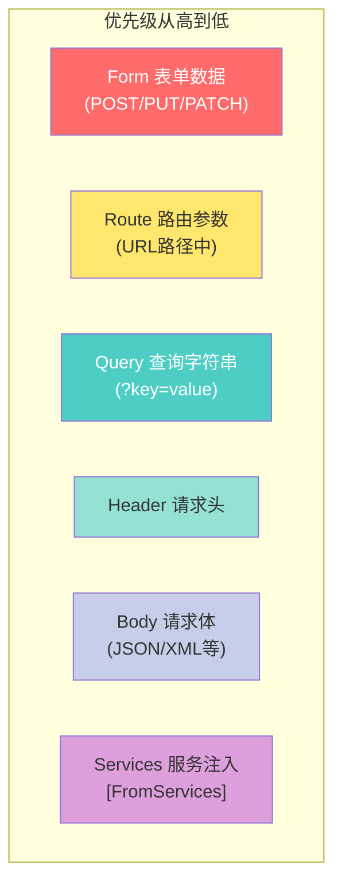
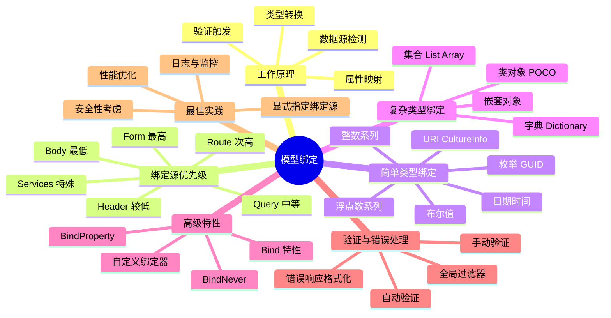

# 模型绑定

> **学习目标**：深入理解ASP.NET Core MVC中请求数据到C#对象的自动映射机制
>
> **前置知识**：了解MVC模式、Controller与Action基础、HTTP协议基础
>
> **预计时间**：55-70分钟
>
> **难度等级**：⭐⭐⭐ 中级

---

## 一、模型绑定的工作原理

### 1.1 什么是模型绑定？

**模型绑定（Model Binding）是ASP.NET Core MVC的核心功能之一，它负责将HTTP请求中的数据（查询字符串、表单数据、路由参数、请求体等）自动映射到Action方法的参数上。**

```mermaid
flowchart LR
    subgraph HTTP请求
        A[URL: /api/users?page=2&size=10]
        B[Headers: Content-Type: application/json]
        C[Body: {name:John, email:john@test.com}]
    end

    subgraph 模型绑定器
        D[数据源检测]
        E[类型转换]
        F[属性映射]
        G[验证触发]
    end

    subgraph Action方法
        H[int page, int size, CreateUserDto user]
        I[强类型C#对象]
    end

    A --> D
    B --> D
    C --> D
    D --> E
    E --> F
    F --> G
    G --> H
    H --> I
```

### 1.2 为什么需要模型绑定？

#### 没有模型绑定的时代（手动解析）

```csharp
// ❌ 旧方式：手动从Request对象中提取数据
public IActionResult Create()
{
    // 手动获取每个字段 - 繁琐且容易出错
    string name = Request.Form["Name"];
    string email = Request.Query["email"];
    int age = 0;
    int.TryParse(Request.Form["Age"], out age);
    bool isActive = Request.Form["IsActive"] == "true";

    // 手动创建对象
    var user = new User
    {
        Name = name,
        Email = email,
        Age = age,
        IsActive = isActive
    };

    // 还需要手动验证每个字段...
    if (string.IsNullOrEmpty(name))
    {
        ModelState.AddModelError("Name", "姓名不能为空");
    }

    // ...
}
```

#### 使用模型绑定的现代方式

```csharp
// ✅ 新方式：框架自动完成所有工作
[HttpPost]
public IActionResult Create([FromBody] CreateUserDto model)
{
    // 框架已经：
    // 1. 从请求体中提取JSON数据
    // 2. 反序列化为CreateUserDto对象
    // 3. 执行基本的数据类型转换
    // 4. 触发Data Annotations验证
    // 5. 将结果填充到ModelState中

    if (!ModelState.IsValid)
    {
        return BadRequest(ModelState);  // 验证失败信息已准备好
    }

    var user = _mapper.Map<User>(model);
    _userService.Create(user);

    return CreatedAtAction(nameof(GetById), new { id = user.Id }, user);
}
```

**模型绑定的优势**：

| 特性 | 说明 |
|------|------|
| **自动化** | 减少样板代码，提高开发效率 |
| **类型安全** | 编译时检查，减少运行时错误 |
| **可测试性** | Action方法接收强类型参数，易于单元测试 |
| **统一验证** | 集成验证框架，自动填充错误信息 |
| **灵活性** | 支持多种数据源和复杂场景 |

---

## 二、绑定源优先级

### 2.1 数据源优先级顺序

当多个来源都包含同名数据时，ASP.NET Core按照以下优先级进行绑定：



**详细说明**：

| 优先级 | 来源 | HTTP方法 | 典型用途 |
|--------|------|----------|----------|
| **1 (最高)** | Form | POST/PUT/PATCH/DELETE | 表单提交的数据 |
| **2** | Route | 所有方法 | URL模板中的参数（如`{id}`） |
| **3** | Query | 所有方法 | GET请求的筛选/分页参数 |
| **4** | Header | 所有方法 | 自定义请求头、认证令牌 |
| **5** | Body | POST/PUT/PATCH | JSON/XML格式的复杂数据 |
| **6 (特殊)** | Services | 所有方法 | 从DI容器获取服务 |

### 2.2 显式指定绑定源

虽然框架有默认的推断逻辑，但**强烈建议显式指定绑定源**以提高代码可读性和可维护性：

```csharp
using Microsoft.AspNetCore.Mvc;

namespace BindingSourceDemo.Controllers
{
    [ApiController]
    [Route("api/[controller]")]
    public class AdvancedBindingController : ControllerBase
    {
        #region FromQuery - 查询字符串绑定

        /// <summary>
        /// GET: api/advancedbinding/search?q=aspnet&page=1&size=20&sort=name&order=asc&tags=web,api
        /// </summary>
        [HttpGet("search")]
        public ActionResult<SearchResultDto> Search(
            [FromQuery] string q,                    // 搜索关键词
            [FromQuery(Name = "page")] int pageNumber,  // 自定义参数名
            [FromQuery] int size = 20,              // 带默认值
            [FromQuery] string sort = "relevance",  // 排序字段
            [FromQuery] string order = "desc",      // 排序方向
            [FromQuery] List<string>? tags = null)  // 数组/列表
        {
            var filter = new SearchFilter
            {
                Keyword = q,
                PageNumber = Math.Max(1, pageNumber),
                PageSize = Math.Clamp(size, 1, 100),
                SortBy = sort?.ToLower(),
                SortOrder = order?.ToLower(),
                Tags = tags ?? new List<string>()
            };

            var results = _searchService.Execute(filter);
            return Ok(results);
        }

        /// <summary>
        /// GET: api/advancedbinding/filter?minPrice=100&maxPrice=500&inStock=true&categories=electronics,clothing
        /// 复杂的查询参数组合
        /// </summary>
        [HttpGet("filter")]
        public ActionResult<PagedResult<ProductDto>> FilterProducts(
            [FromQuery] decimal? minPrice = null,
            [FromQuery] decimal? maxPrice = null,
            [FromQuery] bool? inStock = null,
            [FromQuery] List<string>? categories = null,
            [FromQuery] List<string>? brands = null,
            [FromQuery] decimal? minRating = null,
            [FromQuery] DateTime? createdAfter = null,
            [FromQuery] DateTime? createdBefore = null)
        {
            var query = _productService.Query();

            if (minPrice.HasValue)
                query = query.Where(p => p.Price >= minPrice.Value);

            if (maxPrice.HasValue)
                query = query.Where(p => p.Price <= maxPrice.Value);

            if (inStock == true)
                query = query.Where(p => p.Stock > 0);

            if (categories?.Any() == true)
                query = query.Where(p => categories.Contains(p.Category.Name));

            if (brands?.Any() == true)
                query = query.Where(p => brands.Contains(p.Brand.Name));

            if (minRating.HasValue)
                query = query.Where(p => p.AverageRating >= minRating.Value);

            if (createdAfter.HasValue)
                query = query.Where(p => p.CreatedAt >= createdAfter.Value);

            if (createdBefore.HasValue)
                query = query.Where(p => p.CreatedAt <= createdBefore.Value);

            var result = await query.ToListAsync();
            return Ok(result);
        }

        #endregion

        #region FromRoute - 路由参数绑定

        /// <summary>
        /// GET: api/advancedbinding/users/{userId}/orders/{orderId}
        /// </summary>
        [HttpGet("users/{userId:int}/orders/{orderId:guid}")]
        public ActionResult<OrderDetailDto> GetUserOrder(
            [FromRoute] int userId,
            [FromRoute] Guid orderId)
        {
            var order = _orderService.GetOrder(userId, orderId);
            if (order == null)
                return NotFound(new { message = "订单不存在" });

            return Ok(order);
        }

        /// <summary>
        /// GET: api/advancedbinding/posts/{year}/{month}/{slug}
        /// RESTful风格的URL设计
        /// </summary>
        [HttpGet("posts/{year:int}/{month:int}/{slug}")]
        public ActionResult<PostDto> GetPostByPermalink(
            [FromRoute] int year,
            [FromRoute] int month,
            [FromRoute] string slug)
        {
            var post = _blogService.GetPost(year, month, slug);
            if (post == null)
                return NotFound();

            return Ok(post);
        }

        #endregion

        #region FromBody - 请求体绑定

        /// <summary>
        /// POST: api/advancedbinding/products
        /// Content-Type: application/json
        /// Body: 完整的JSON对象
        /// </summary>
        [HttpPost("products")]
        public async Task<ActionResult<ProductDto>> CreateProduct(
            [FromBody] CreateProductRequest request)
        {
            #region 输入验证增强

            if (!ModelState.IsValid)
                return BadRequest(ModelState);

            // 业务规则验证
            if (request.Price <= 0)
                return UnprocessableEntity(new { error = "价格必须大于0" });

            if (request.DiscountPrice.HasValue && request.DiscountPrice >= request.Price)
                return UnprocessableEntity(new { error = "折扣价必须小于原价" });

            #endregion

            try
            {
                var product = await _productService.CreateAsync(request);
                return CreatedAtAction(
                    nameof(GetProductById),
                    new { id = product.Id },
                    product);
            }
            catch (DuplicateSkuException ex)
            {
                return Conflict(new { error = ex.Message });
            }
        }

        /// <summary>
        /// PUT: api/advancedbinding/products/{id}
        /// 更新产品（完整替换）
        /// </summary>
        [HttpPut("products/{id:int}")]
        public async Task<IActionResult> UpdateProduct(
            [FromRoute] int id,
            [FromBody] UpdateProductRequest request)
        {
            if (id != request.ProductId)
                return BadRequest(new { error = "ID不匹配" });

            await _productService.UpdateAsync(id, request);
            return NoContent();
        }

        /// <summary>
        /// POST: api/advancedbinding/batch
        /// 批量创建（接收数组）
        /// </summary>
        [HttpPost("batch")]
        public async Task<ActionResult<IEnumerable<CreatedItemDto>>> BatchCreate(
            [FromBody] List<CreateItemRequest> items)
        {
            if (items == null || !items.Any())
                return BadRequest(new { error = "请求体不能为空" });

            if (items.Count > 100)
                return BadRequest(new { error = "单次批量操作不能超过100条" });

            var results = await _itemService.BatchCreateAsync(items);
            return StatusCode(StatusCodes.Status201Created, results);
        }

        #endregion

        #region FromForm - 表单数据绑定

        /// <summary>
        /// POST: api/advancedbinding/upload
        /// Content-Type: multipart/form-data
        /// 文件上传 + 表单字段
        /// </summary>
        [HttpPost("upload")]
        public async Task<ActionResult<UploadResultDto>> UploadFile(
            [FromForm] string title,
            [FromForm] string description,
            [FromForm] string category,
            [FromForm] List<IFormFile> files,
            [FromForm] bool isPublic = false)
        {
            if (files == null || !files.Any(f => f.Length > 0))
                return BadRequest(new { error = "请至少选择一个文件上传" });

            var uploadedFiles = new List<UploadedFileInfo>();

            foreach (var file in files.Where(f => f.Length > 0))
            {
                #region 文件验证

                // 文件大小限制（10MB）
                if (file.Length > 10 * 1024 * 1024)
                {
                    return BadRequest(new { error = $"文件 {file.FileName} 超过10MB限制" });
                }

                // 文件类型白名单
                var allowedContentTypes = new[]
                {
                    "image/jpeg",
                    "image/png",
                    "image/gif",
                    "application/pdf",
                    "application/msword",
                    "application/vnd.openxmlformats-officedocument.wordprocessingml.document"
                };

                if (!allowedContentTypes.Contains(file.ContentType.ToLowerInvariant()))
                {
                    return BadRequest(new
                    {
                        error = $"文件 {file.FileName} 的类型不支持。允许的类型：JPG, PNG, GIF, PDF, DOC, DOCX"
                    });
                }

                // 文件扩展名验证
                var allowedExtensions = new[] { ".jpg", ".jpeg", ".png", ".gif", ".pdf", ".doc", ".docx" };
                var extension = Path.GetExtension(file.FileName).ToLowerInvariant();
                if (!allowedExtensions.Contains(extension))
                {
                    return BadRequest(new { error = $"不允许的文件扩展名: {extension}" });
                }

                #endregion

                try
                {
                    // 生成安全的文件名
                    var safeFileName = $"{Guid.NewGuid()}{extension}";
                    var filePath = Path.Combine(_config["UploadPath"], safeFileName);

                    // 保存文件
                    using (var stream = new FileStream(filePath, FileMode.Create))
                    {
                        await file.CopyToAsync(stream);
                    }

                    uploadedFiles.Add(new UploadedFileInfo
                    {
                        OriginalFileName = file.FileName,
                        StoredFileName = safeFileName,
                        Size = file.Length,
                        ContentType = file.ContentType,
                        Url = $"/uploads/{safeFileName}"
                    });
                }
                catch (Exception ex)
                {
                    _logger.LogError(ex, "文件上传失败: {Filename}", file.FileName);
                    return StatusCode(500, new { error = $"文件 {file.FileName} 上传失败" });
                }
            }

            // 保存上传记录到数据库
            var uploadRecord = await _uploadService.SaveUploadRecordAsync(new UploadRecord
            {
                Title = title,
                Description = description,
                Category = category,
                IsPublic = isPublic,
                Files = uploadedFiles,
                UploadedBy = GetCurrentUserId(),
                UploadedAt = DateTime.UtcNow
            });

            return Ok(new UploadResultDto
            {
                UploadId = uploadRecord.Id,
                Message = $"成功上传 {uploadedFiles.Count} 个文件",
                Files = uploadedFiles
            });
        }

        #endregion

        #region FromHeader - 请求头绑定

        /// <summary>
        /// GET: api/advancedbinding/info
        /// 从请求头提取各种信息
        /// </summary>
        [HttpGet("info")]
        public ActionResult<RequestInfoDto> GetRequestInfo(
            [FromHeader] string userAgent,                          // User-Agent
            [FromHeader(Name = "Accept-Language")] string language,   // Accept-Language
            [FromHeader(Name = "X-Request-Id")] string requestId,     // 自定义请求ID
            [FromHeader(Name = "X-Api-Key")] string apiKey,          // API密钥
            [FromHeader(Name = "X-Client-Version")] string clientVersion, // 客户端版本
            [FromHeader(Name = "X-Forwarded-For")] string clientIp,   // 代理转发的真实IP
            [FromHeader(Name = "X-Correlation-Id")] string correlationId) // 关联ID（用于分布式追踪）
        {
            return Ok(new RequestInfoDto
            {
                ClientUserAgent = userAgent,
                PreferredLanguage = language,
                RequestId = requestId,
                AuthenticatedApiKey = apiKey != null ? $"{apiKey.Substring(0, 8)}..." : null,
                ClientVersion = clientVersion,
                ClientIpAddress = clientIp ?? HttpContext.Connection.RemoteIpAddress?.ToString(),
                CorrelationId = correlationId,
                ServerTime = DateTime.UtcNow,
                ServerInstanceId = Environment.MachineName
            });
        }

        /// <summary>
        /// 使用FromHeader进行API版本控制
        /// </summary>
        [HttpGet("versioned-data")]
        public ActionResult<VersionedDataDto> GetVersionedData(
            [FromHeader(Name = "Api-Version")] string apiVersion = "1.0")
        {
            // 根据请求头中的版本号返回不同格式或内容
            return apiVersion switch
            {
                "1.0" => Ok(new VersionedDataDto { Version = "1.0", Data = GetV1Data() }),
                "2.0" => Ok(new VersionedDataDto { Version = "2.0", Data = GetV2Data() }),
                _ => BadRequest(new { error = $"不支持的API版本: {apiVersion}" })
            };
        }

        #endregion

        #region FromServices - 服务注入绑定

        /// <summary>
        /// GET: api/advancedbinding/di-example
        /// 通过参数注入依赖服务
        /// </summary>
        [HttpGet("di-example")]
        public ActionResult<DIExampleDto> DependencyInjectionExample(
            [FromServices] ILogger<AdvancedBindingController> logger,
            [FromServices] IConfiguration configuration,
            [FromServices] IHttpContextAccessor httpContextAccessor,
            [FromServices] ICurrentUserContext currentUserContext)
        {
            var context = httpContextAccessor.HttpContext;
            var user = currentUserContext.GetCurrentUser();

            logger.LogInformation("DI示例调用: User={UserId}", user?.Id);

            return Ok(new DIExampleDto
            {
                ApplicationName = configuration["Application:Name"],
                CurrentEnvironment = configuration["Environment"],
                IsAuthenticated = user?.IsAuthenticated ?? false,
                UserId = user?.Id,
                UserName = user?.UserName,
                Roles = user?.Roles,
                RequestPath = context?.Request.Path.ToString(),
                RequestMethod = context?.Request.Method
            });
        }

        #endregion

        #region 组合使用多种绑定源

        /// <summary>
        /// POST: api/advancedbinding/composite?couponCode=SAVE20
        /// Headers:
        ///   X-Request-ID: uuid-12345
        ///   X-Client-Version: 2.0.0
        /// Body: JSON格式的订单数据
        /// </summary>
        [HttpPost("composite")]
        public async Task<ActionResult<OrderDto>> CreateCompositeOrder(
            [FromRoute] int? tenantId,                              // 可选的路由参数
            [FromQuery] string? couponCode,                         // 查询字符串
            [FromHeader(Name = "X-Request-ID")] string requestId,   // 请求头
            [FromHeader(Name = "X-Client-Version")] string clientVersion, // 请求头
            [FromBody] CreateOrderRequestBody orderBody)            // 请求体
        {
            // 验证必需的请求头
            if (string.IsNullOrEmpty(requestId))
                return BadRequest(new { error = "缺少 X-Request-ID 请求头" });

            try
            {
                var userId = GetCurrentUserId();
                var order = BuildOrderDomainObject(userId, couponCode, clientVersion, orderBody);

                var createdOrder = await _orderService.CreateAsync(order);

                _logger.LogInformation(
                    "订单创建成功: OrderId={OrderId}, Tenant={Tenant}, Coupon={Coupon}",
                    createdOrder.Id, tenantId ?? "default", couponCode ?? "none");

                return CreatedAtAction(
                    nameof(GetOrder),
                    new { id = createdOrder.Id },
                    MapToDto(createdOrder));
            }
            catch (BusinessRuleViolationException ex)
            {
                return UnprocessableEntity(new ApiError
                {
                    Code = "BUSINESS_RULE_VIOLATION",
                    Message = ex.Message,
                    Details = ex.AdditionalData
                });
            }
        }

        #endregion

        #region 私有辅助方法

        private int GetCurrentUserId()
        {
            return int.Parse(User.FindFirst(ClaimTypes.NameIdentifier)?.Value ?? "0");
        }

        private object GetV1Data() { /* 返回V1格式数据 */ }
        private object GetV2Data() { /* 返回V2格式数据 */ }
        private Order BuildOrderDomainObject(int userId, string? couponCode, string version, CreateOrderRequestBody body) { /* 构建领域对象 */ }
        private OrderDto MapToDto(Order order) { /* 映射DTO */ }

        #endregion
    }

    #region DTOs（数据传输对象）

    public record SearchResultDto(
        IEnumerable<ItemDto> Items,
        int TotalCount,
        int PageNumber,
        int PageSize,
        bool HasNextPage,
        long ElapsedMilliseconds
    );

    public record CreateProductRequest(
        [Required][MaxLength(200)] string Name,
        [Required][MaxLength(2000)] string Description,
        [Required][Range(0.01, double.MaxValue)] decimal Price,
        decimal? DiscountPrice,
        [Range(0, int.MaxValue)] int Stock,
        int CategoryId,
        List<string>? Tags,
        bool IsActive = true
    );

    public record UpdateProductRequest(int ProductId, string Name, string Description, decimal Price, int Stock);

    public record UploadResultDto(Guid UploadId, string Message, List<UploadedFileInfo> Files);
    public record UploadedFileInfo(string OriginalFileName, string StoredFileName, long Size, string ContentType, string Url);
    public record RequestInfoDto(string ClientUserAgent, string PreferredLanguage, string RequestId, string AuthenticatedApiKey, string ClientVersion, string ClientIpAddress, string CorrelationId, DateTime ServerTime, string ServerInstanceId);
    public record DIExampleDto(string ApplicationName, string CurrentEnvironment, bool IsAuthenticated, int? UserId, string UserName, IList<string> Roles, string RequestPath, string RequestMethod);
    public record VersionedDataDto(string Version, object Data);

    #endregion
}
```

---

## 三、简单类型绑定

### 3.1 内置支持的基本类型

ASP.NET Core可以自动将字符串转换为以下简单类型：

| 类型 | 示例输入 | 绑定结果 |
|------|---------|---------|
| `int`, `int?` | `"42"` 或 `"abc"` | `42` 或 绑定失败 |
| `long`, `long?` | `"12345678901234"` | `12345678901234L` |
| `short`, `short?` | `"100"` | `(short)100` |
| `decimal`, `decimal?` | `"19.99"` | `19.99m` |
| `float`, `float?` | `"3.14"` | `3.14f` |
| `double`, `double?` | `"2.71828"` | `2.71828d` |
| `bool`, `bool?` | `"true"`, `"false"`, `"True"`, `"False"` | `true/false` |
| `DateTime`, `DateTime?` | `"2024-01-15"`, `"2024/01/15 10:30:00"` | DateTime对象 |
| `DateTimeOffset` | `"2024-01-15T10:30:00+08:00"` | DateTimeOffset对象 |
| `TimeSpan` | `"02:30:00"`, `"1.12:30:45"` | TimeSpan对象 |
| `Guid`, `Guid?` | `"550e8400-e29b-41d4-a716-446655440000"` | Guid对象 |
| `enum` | `"Monday"`, `"1"` | 对应枚举值 |
| `string` | 任意文本 | 字符串本身 |
| `Uri` | `"https://example.com"` | Uri对象 |
| `cultureInfo` | `"zh-CN"`, `"en-US"` | CultureInfo对象 |
| `Nullable<T>` | `""` 或 无值 | `null` |

### 3.2 简单类型绑定示例

```csharp
using Microsoft.AspNetCore.Mvc;

namespace SimpleTypeBindingDemo.Controllers
{
    [ApiController]
    [Route("api/[controller]")]
    public class SimpleTypesController : ControllerBase
    {
        #region 整数类型

        /// <summary>
        /// GET: api/simpletypes/integers?id=42&count=10&max=999
        /// 各种整数类型的绑定演示
        /// </summary>
        [HttpGet("integers")]
        public ActionResult<IntegersDto> BindIntegers(
            [FromQuery] int id,               // 标准整数
            [FromQuery] short count,          // 短整数
            [FromQuery] long max,             // 长整数
            [FromQuery] byte flags,           // 字节 (0-255)
            [FromQuery] uint unsignedId,      // 无符号整数
            [FromQuery] int? optionalPage,    // 可空整数（未提供则为null）
            [FromQuery] sbyte signedByte)     // 有符号字节
        {
            return Ok(new IntegersDto
            {
                Id = id,
                Count = count,
                MaxValue = max,
                Flags = flags,
                UnsignedId = unsignedId,
                OptionalPage = optionalPage,
                SignedByte = signedByte
            });
        }

        #endregion

        #region 浮点数类型

        /// <summary>
        /// GET: api/simpletypes/floats?price=19.99&rate=3.14159&ratio=2.718281828&discount=15.5
        /// 浮点数类型的精度差异
        /// </summary>
        [HttpGet("floats")]
        public ActionResult<FloatsDto> BindFloats(
            [FromQuery] float price,          // 单精度浮点（约6-7位有效数字）
            [FromQuery] double rate,          // 双精度浮点（约15-17位有效数字）
            [FromQuery] decimal ratio,        // 高精度十进制（适合金融计算）
            [FromQuery] float? discount)      // 可空单精度
        {
            return Ok(new FloatsDto
            {
                Price = price,
                InterestRate = rate,
                ExchangeRatio = ratio,
                DiscountPercentage = discount,

                // 展示精度差异
                PrecisionComparison = new
                {
                    FloatPrecision = (price * 3).ToString("F6"),
                    DoublePrecision = (rate * 3).ToString("F15"),
                    DecimalPrecision = (ratio * 3).ToString("F28")
                }
            });
        }

        #endregion

        #region 布尔类型

        /// <summary>
        /// GET: api/simpletypes/booleans?active=true&verified=false&premium=True&featured=
        /// 布尔值的各种表示方式
        /// </summary>
        [HttpGet("booleans")]
        public ActionResult<BooleansDto> BindBooleans(
            [FromQuery] bool active,          // true
            [FromQuery] bool verified,        // false
            [FromQuery] bool premium,         // true
            [FromQuery] bool? featured,       // null（未提供时）
            [FromQuery] bool enabled = true,  // 默认值为true
            [FromQuery] bool deleted = false) // 默认值为false
        {
            return Ok(new BooleansDto
            {
                IsActive = active,
                IsVerified = verified,
                IsPremium = premium,
                IsFeatured = featured,
                IsEnabled = enabled,
                IsDeleted = deleted
            });
        }

        /// <summary>
        /// 布尔值接受的字符串形式
        /// </summary>
        [HttpGet("bool-variations")]
        public ActionResult<List<BoolVariationDto>> TestBoolVariations()
        {
            // 这些都会被正确解析为布尔值
            var variations = new List<BoolVariationDto>
            {
                new BoolVariationDto("true", true),
                new BoolVariationDto("True", true),
                new BoolVariationDto("TRUE", true),
                new BoolVariationDto("false", false),
                new BoolVariationDto("False", false),
                new BoolVariationDto("FALSE", false),
                new BoolVariationDto("1", true),       // 注意：某些情况下可能不被接受
                new BoolVariationDto("0", false),      // 同上
                new BoolVariationDto("", null),        // 空字符串 → 可空bool为null
                new BoolVariationDto(null, null)       // 未提供 → 可空bool为null
            };

            return Ok(variations);
        }

        #endregion

        #region 日期时间类型

        /// <summary>
        /// GET: api/simpletypes/dates?date=2024-01-15&datetime=2024-01-15T10:30:00&datetimeoffset=2024-01-15T10:30:00+08:00
        /// 日期时间类型的绑定
        /// </summary>
        [HttpGet("dates")]
        public ActionResult<DatesDto> BindDates(
            [FromQuery] DateTime dateOnly,                     // 仅日期部分
            [FromQuery] DateTime dateTime,                      // 日期+时间
            [FromQuery] DateTimeOffset dateTimeWithOffset,      // 带时区偏移
            [FromQuery] DateTime? nullableDate,                 // 可空日期
            [FromQuery] DateTime specificFormatDate)            // 特定格式的日期
        {
            return Ok(new DatesDto
            {
                Date = dateOnly.Date,                           // 只保留日期部分
                DateTime = dateTime,
                DateTimeOffset = dateTimeWithOffset,
                NullableDate = nullableDate,
                SpecificFormatDate = specificFormatDate,

                // 提供各种格式化的输出
                FormattedDates = new
                {
                    ShortDate = dateOnly.ToString("d"),        // 2024/1/15
                    LongDate = dateOnly.ToString("D"),         // 2024年1月15日
                    FullDateTime = dateTime.ToString("F"),     // 2024年1月15日 上午10:30:00
                    Iso8601 = dateTime.ToString("o"),          // 2024-01-15T10:30:00.0000000
                    Rfc1123 = dateTime.ToUniversalTime().ToString("R")  // Mon, 15 Jan 2024 02:30:00 GMT
                }
            });
        }

        /// <summary>
        /// GET: api/simpletypes/date-range?from=2024-01-01&to=2024-12-31&timezone=China Standard Time
        /// 日期范围查询
        /// </summary>
        [HttpGet("date-range")]
        public ActionResult<DateRangeResultDto> QueryByDateRange(
            [FromQuery] DateTime from,
            [FromQuery] DateTime to,
            [FromQuery] string timezone = "UTC")
        {
            try
            {
                var tzInfo = TimeZoneInfo.FindSystemTimeZoneById(timezone);
                var fromLocal = TimeZoneInfo.ConvertTime(from, tzInfo);
                var toLocal = TimeZoneInfo.ConvertTime(to, tzInfo);

                var records = _dateService.GetRecordsInRange(fromLocal, toLocal);

                return Ok(new DateRangeResultDto
                {
                    QueryFrom = fromLocal,
                    QueryTo = toLocal,
                    TimezoneUsed = timezone,
                    RecordCount = records.Count(),
                    Records = records.Take(50).ToList()  // 限制返回数量
                });
            }
            catch (TimeZoneNotFoundException)
            {
                return BadRequest(new { error = $"无效的时区: {timezone}" });
            }
        }

        #endregion

        #region 枚举类型

        /// <summary>
        /// GET: api/simpletypes/enums?status=Active&priority=High&color=Red&day=Monday
        /// 枚举类型的绑定（支持名称和数值）
        /// </summary>
        [HttpGet("enums")]
        public ActionResult<EnumsDto> BindEnums(
            [FromQuery] OrderStatus status,        // 名称方式: "Active"
            [FromQuery] Priority priority,          // 名称方式: "High"
            [FromQuery] Color color,                // 名称方式: "Red"
            [FromQuery] DayOfWeek day,              // 名称方式: "Monday"
            [FromQuery] PaymentMethod? method,      // 可空枚举
            [FromQuery] ShippingOption option = ShippingOption.Standard)  // 带默认值
        {
            return Ok(new EnumsDto
            {
                Status = status,
                Priority = priority,
                Color = color,
                DayOfWeek = day,
                PaymentMethod = method,
                ShippingOption = option
            });
        }

        /// <summary>
        /// GET: api/simpletypes/enums-by-value?status=1&priority=2&color=3
        /// 使用整数值绑定枚举
        /// </summary>
        [HttpGet("enums-by-value")]
        public ActionResult<EnumsDto> BindEnumsByValue(
            [FromQuery] OrderStatus status,        // 1 → Active
            [FromQuery] Priority priority,          // 2 → High
            [FromQuery] Color color)                // 3 → Red
        {
            return Ok(new EnumsDto { Status = status, Priority = priority, Color = color });
        }

        #endregion

        #region GUID和其他特殊类型

        /// <summary>
        /// GET: api/simpletypes/guids?id=550e8400-e29b-41d4-a716-446655440000&token=f47ac10b-58cc-4372-a567-0e02b2c3d479
        /// GUID类型的绑定
        /// </summary>
        [HttpGet("guids")]
        public ActionResult<GuidsDto> BindGuids(
            [FromQuery] Guid id,
            [FromQuery] Guid token,
            [FromQuery] Guid? optionalGuid)
        {
            return Ok(new GuidsDto
            {
                Id = id,
                Token = token,
                OptionalGuid = optionalGuid,
                IdShortFormat = id.ToString("N"),  // 无分隔符
                IdStandardFormat = id.ToString("D"), // 标准格式
                IsValid = id != Guid.Empty
            });
        }

        /// <summary>
        /// GET: api/simpletypes/special?url=https://example.com/path?query=value&culture=zh-CN&timespan=02:30:00
        /// URI、CultureInfo、TimeSpan等特殊类型
        /// </summary>
        [HttpGet("special")]
        public ActionResult<SpecialTypesDto> BindSpecialTypes(
            [FromQuery] Uri url,                   // URI类型
            [FromQuery] CultureInfo culture,       // 文化信息
            [FromQuery] TimeSpan duration,         // 时间跨度
            [FromQuery] Version version)           // 版本号 (如 "1.2.3")
        {
            return Ok(new SpecialTypesDto
            {
                ParsedUrl = url,
                AbsoluteUrl = url?.IsAbsoluteUri == true ? url.AbsoluteUri : null,
                Culture = culture,
                CultureDisplayName = culture?.DisplayName,
                NativeCultureName = culture?.NativeName,
                Duration = duration,
                DurationFormatted = duration.ToString(@"hh\:mm\:ss"),
                TotalMinutes = duration.TotalMinutes,
                Version = version,
                MajorVersion = version?.Major,
                MinorVersion = version?.Minor
            });
        }

        #endregion

        #region 字符串处理

        /// <summary>
        /// GET: api/simpletypes/strings?keyword=Hello%20World&tags=web,api,mvc&separator=%7C&encoded=%E4%BD%A0%E5%A5%BD
        /// 字符串的各种处理
        /// </summary>
        [HttpGet("strings")]
        public ActionResult<StringsDto> ProcessStrings(
            [FromQuery] string keyword,
            [FromQuery] List<string> tags,          // 逗号分隔的字符串数组
            [FromQuery] char separator,             // 单字符
            [FromQuery] string encoded,             // URL编码的字符串
            [FromQuery] string emptyOrNull)         // 测试空值
        {
            return Ok(new StringsDto
            {
                Keyword = keyword,
                TrimmedKeyword = keyword?.Trim(),
                UpperCase = keyword?.ToUpper(),
                LowerCase = keyword?.ToLower(),
                Length = keyword?.Length ?? 0,
                Tags = tags,
                TagCount = tags?.Count ?? 0,
                Separator = separator,
                DecodedString = System.Net.WebUtility.UrlDecode(encoded),
                IsNullOrEmpty = string.IsNullOrEmpty(emptyOrNull),
                IsNullOrWhiteSpace = string.IsNullOrWhiteSpace(emptyOrNull)
            });
        }

        #endregion
    }

    #region 枚举定义

    public enum OrderStatus
    {
        Pending = 0,
        Active = 1,
        Completed = 2,
        Cancelled = 3,
        Refunded = 4
    }

    public enum Priority
    {
        Low = 1,
        Medium = 2,
        High = 3,
        Urgent = 4
    }

    public enum Color
    {
        Red = 1,
        Green = 2,
        Blue = 3,
        Yellow = 4,
        Black = 5,
        White = 6
    }

    public enum PaymentMethod
    {
        Cash = 1,
        CreditCard = 2,
        DebitCard = 3,
        PayPal = 4,
        WeChatPay = 5,
        Alipay = 6
    }

    public enum ShippingOption
    {
        Standard = 1,
        Express = 2,
        SameDay = 3
    }

    #endregion

    #region DTOs

    public record IntegersDto(int Id, short Count, long MaxValue, byte Flags, uint UnsignedId, int? OptionalPage, sbyte SignedByte);
    public record FloatsDto(float Price, double InterestRate, decimal ExchangeRatio, float? DiscountPercentage, object PrecisionComparison);
    public record BooleansDto(bool IsActive, bool IsVerified, bool IsPremium, bool? IsFeatured, bool IsEnabled, bool IsDeleted);
    public record BoolVariationDto(string InputValue, bool? Result);
    public record DatesDto(DateTime Date, DateTime DateTime, DateTimeOffset DateTimeOffset, DateTime? NullableDate, DateTime SpecificFormatDate, object FormattedDates);
    public record DateRangeResultDto(DateTime QueryFrom, DateTime QueryTo, string TimezoneUsed, int RecordCount, object Records);
    public record EnumsDto(OrderStatus Status, Priority Priority, Color Color, DayOfWeek DayOfWeek, PaymentMethod? PaymentMethod, ShippingOption ShippingOption);
    public record GuidsDto(Guid Id, Guid Token, Guid? OptionalGuid, string IdShortFormat, string IdStandardFormat, bool IsValid);
    public record SpecialTypesDto(Uri ParsedUrl, string AbsoluteUrl, CultureInfo Culture, string CultureDisplayName, string NativeCultureName, TimeSpan Duration, string DurationFormatted, double TotalMinutes, Version Version, int? MajorVersion, int? MinorVersion);
    public record StringsDto(string Keyword, string TrimmedKeyword, string UpperCase, string LowerCase, int Length, List<string> Tags, int TagCount, char Separator, string DecodedString, bool IsNullOrEmpty, bool IsNullOrWhiteSpace);

    #endregion
}
```

---

## 四、复杂类型绑定

### 4.1 类对象绑定

当Action参数是一个类（POCO）时，模型绑定器会尝试将请求中的数据映射到该类的属性上：

```csharp
// Models/CreateUserDto.cs
public class CreateUserDto
{
    public required string FirstName { get; set; }     // 必填属性
    public required string LastName { get; set; }      // 必填属性
    public string? MiddleName { get; set; }            // 可选属性
    public required string Email { get; set; }
    public string? Phone { get; set; }
    public DateOnly BirthDate { get; set; }
    public AddressDto HomeAddress { get; set; } = new();  // 嵌套对象
    public List<string> Interests { get; set; } = new();  // 列表
}

// Models/AddressDto.cs
public class AddressDto
{
    public required string Street { get; set; }
    public required string City { get; set; }
    public string? State { get; set; }
    public required string ZipCode { get; set; }
    public required string Country { get; set; }
}
```

**对应的Controller使用**：

```csharp
/// <summary>
/// POST: api/users
/// JSON Body示例:
/// {
///   "firstName": "John",
///   "lastName": "Doe",
///   "middleName": "William",
///   "email": "john.doe@example.com",
///   "phone": "+1-555-0123",
///   "birthDate": "1990-05-15",
///   "homeAddress": {
///     "street": "123 Main St",
///     "city": "New York",
///     "state": "NY",
///     "zipCode": "10001",
///     "country": "US"
///   },
///   "interests": ["programming", "reading", "hiking"]
/// }
/// </summary>
[HttpPost]
public async Task<ActionResult<UserDto>> CreateUser([FromBody] CreateUserDto dto)
{
    if (!ModelState.IsValid)
        return BadRequest(ModelState);

    var user = _mapper.Map<User>(dto);
    user.CreatedAt = DateTime.UtcNow;

    var createdUser = await _userService.CreateAsync(user);

    return CreatedAtAction(nameof(GetUser), new { id = createdUser.Id }, _mapper.Map<UserDto>(createdUser));
}
```

### 4.2 集合和数组绑定

```csharp
/// <summary>
/// POST: api/items/batch
/// Body: [{"name":"Item1","price":10},{"name":"Item2","price":20}]
/// 接收对象数组
/// </summary>
[HttpPost("batch")]
public async Task<ActionResult<IEnumerable<CreatedItemDto>>> BatchCreateItems([FromBody] List<CreateItemDto> items)
{
    if (items == null || !items.Any())
        return BadRequest(new { error = "请求体不能为空" });

    if (items.Count > 50)
        return BadRequest(new { error = "单次最多50项" });

    var results = new List<CreatedItemDto>();
    foreach (var item in items)
    {
        var created = await _itemService.CreateAsync(item);
        results.Add(new CreatedItemDto(created.Id, created.Name));
    }

    return StatusCode(StatusCodes.Status201Created, results);
}

/// <summary>
/// DELETE: api/items/batch
/// Body: [1, 2, 3, 4, 5]
/// 接收整数数组（用于批量删除）
/// </summary>
[HttpDelete("batch")]
public async Task<IActionResult> BatchDeleteItems([FromBody] int[] itemIds)
{
    if (itemIds == null || !itemIds.Any())
        return BadRequest(new { error = "请提供要删除的项目ID列表" });

    await _itemService.BatchDeleteAsync(itemIds);
    return NoContent();
}

/// <summary>
/// PUT: api/items/tags
/// Body: ["tag1", "tag2", "tag3"]
/// 接收字符串数组
/// </summary>
[HttpPut("{id:int}/tags")]
public async Task<IActionResult> UpdateItemTags(int id, [FromBody] List<string> tags)
{
    await _itemService.UpdateTagsAsync(id, tags);
    return NoContent();
}
```

### 4.3 字典绑定

```csharp
/// <summary>
/// POST: api/configurations
/// Body: {"theme":"dark","language":"zh-CN","fontSize":14,"notifications":{"email":true,"push":false}}
/// 接收字典类型（用于动态配置）
/// </summary>
[HttpPost("configurations")]
public async Task<ActionResult<ConfigurationDto>> SaveConfiguration(
    [FromRoute] string configType,
    [FromBody] Dictionary<string, object?> configuration)
{
    if (configuration == null || !configuration.Any())
        return BadRequest(new { error = "配置不能为空" });

    // 验证配置键是否合法
    var allowedKeys = _configService.GetAllowedKeys(configType);
    var invalidKeys = configuration.Keys.Except(allowedKeys, StringComparer.OrdinalIgnoreCase);

    if (invalidKeys.Any())
    {
        return BadRequest(new
        {
            error = "包含非法配置键",
            invalidKeys = invalidKeys.ToArray(),
            allowedKeys = allowedKeys.ToArray()
        });
    }

    var savedConfig = await _configService.SaveConfigurationAsync(configType, configuration);

    return Ok(savedConfig);
}
```

### 4.4 完整的复杂表单绑定示例

```csharp
using Microsoft.AspNetCore.Mvc;
using System.ComponentModel.DataAnnotations;

namespace ComplexBindingDemo.Controllers
{
    [Route("[controller]")]
    public class RegistrationController : Controller
    {
        /// <summary>
        /// GET: /registration/event
        /// 显示活动报名表单
        /// </summary>
        [HttpGet("event")]
        public IActionResult EventRegistrationForm()
        {
            ViewBag.EventTitle = "2024年度技术大会";
            ViewBag.EventDate = new DateTime(2024, 6, 15);
            ViewBag.AvailableSessions = _eventService.GetAvailableSessions();
            ViewBag.TicketTypes = _eventService.GetTicketTypes();

            return View();
        }

        /// <summary>
        /// POST: /registration/event
        /// 处理活动报名表单提交
        /// Content-Type: multipart/form-data
        /// </summary>
        [HttpPost("event")]
        [ValidateAntiForgeryToken]
        public async Task<IActionResult> SubmitEventRegistration(EventRegistrationViewModel model)
        {
            #region 模型验证

            if (!ModelState.IsValid)
            {
                // 重新加载数据以保持表单状态
                ViewBag.EventTitle = "2024年度技术大会";
                ViewBag.AvailableSessions = _eventService.GetAvailableSessions();
                ViewBag.TicketTypes = _eventService.GetTicketTypes();
                return View(model);
            }

            #endregion

            try
            {
                #region 处理文件上传

                string? idDocumentUrl = null;
                if (model.IdDocument != null && model.IdDocument.Length > 0)
                {
                    // 文件验证
                    var allowedExtensions = new[] { ".pdf", ".jpg", ".png" };
                    var extension = Path.GetExtension(model.IdDocument.FileName).ToLowerInvariant();

                    if (!allowedExtensions.Contains(extension))
                    {
                        ModelState.AddModelError(nameof(model.IdDocument), "只支持PDF、JPG、PNG格式");
                        return View(model);
                    }

                    if (model.IdDocument.Length > 5 * 1024 * 1024)
                    {
                        ModelState.AddModelError(nameof(model.IdDocument), "文件大小不能超过5MB");
                        return View(model);
                    }

                    // 保存文件
                    var fileName = $"{Guid.NewGuid()}{extension}";
                    var path = Path.Combine(Directory.GetCurrentDirectory(), "wwwroot", "uploads", "documents", fileName);

                    using (var stream = new FileStream(path, FileMode.Create))
                    {
                        await model.IdDocument.CopyToAsync(stream);
                    }

                    idDocumentUrl = $"/uploads/documents/{fileName}";
                }

                #endregion

                #region 构建业务对象并保存

                var registration = new EventRegistration
                {
                    ParticipantInfo = new Participant
                    {
                        FirstName = model.Participant.FirstName.Trim(),
                        LastName = model.Participant.LastName.Trim(),
                        Email = model.Participant.Email.Trim().ToLowerInvariant(),
                        Phone = model.Participant.Phone.Trim(),
                        Organization = model.Participant.Organization?.Trim(),
                        JobTitle = model.Participant.JobTitle?.Trim(),
                        DietaryRequirements = model.Participant.DietaryRequirements?
                            .Where(d => !string.IsNullOrWhiteSpace(d))
                            .ToList()
                    },
                    SelectedSessionIds = model.SelectedSessionIds ?? new List<int>(),
                    TicketTypeId = model.TicketTypeId,
                    EmergencyContacts = model.EmergencyContacts?
                        .Where(c =>
                            !string.IsNullOrWhiteSpace(c.Name) &&
                            !string.IsNullOrWhiteSpace(c.Phone))
                        .Select(c => new EmergencyContact
                        {
                            Name = c.Name.Trim(),
                            Relationship = c.Relationship?.Trim(),
                            Phone = c.Phone.Trim(),
                            IsPrimary = c.IsPrimary
                        })
                        .ToList() ?? new List<EmergencyContact>(),
                    AccommodationCheckIn = model.Accommodation.CheckIn,
                    AccommodationCheckOut = model.Accommodation.CheckOut,
                    RoomPreference = model.RoomPreference,
                    IdDocumentUrl = idDocumentUrl,
                    SpecialRequests = model.SpecialRequests?.Trim(),
                    AgreeToTerms = model.AgreeToTerms,
                    MarketingOptIn = model.MarketingOptIn,
                    RegisteredAt = DateTime.UtcNow,
                    IpAddress = HttpContext.Connection.RemoteIpAddress?.ToString(),
                    UserAgent = HttpContext.Request.Headers.UserAgent.FirstOrDefault()
                };

                var savedRegistration = await _registrationService.CreateAsync(registration);

                #endregion

                #region 发送确认邮件

                try
                {
                    await _emailService.SendRegistrationConfirmationAsync(savedRegistration);
                }
                catch (Exception emailEx)
                {
                    // 邮件发送失败不应阻止注册流程
                    _logger.LogWarning(emailEx, "发送确认邮件失败: RegistrationId={Id}", savedRegistration.Id);
                }

                #endregion

                TempData["SuccessMessage"] = "报名成功！确认邮件已发送至您的邮箱。";
                TempData["RegistrationId"] = savedRegistration.Id;

                return RedirectToAction(nameof(RegistrationConfirmation), new { id = savedRegistration.Id });
            }
            catch (BusinessRuleViolationException ex)
            {
                _logger.LogWarning(ex, "业务规则违反: {Message}", ex.Message);
                ModelState.AddModelError("", ex.Message);
                return View(model);
            }
            catch (Exception ex)
            {
                _logger.LogError(ex, "活动报名处理失败");
                ModelState.AddModelError("", "系统繁忙，请稍后重试。如果问题持续存在，请联系客服。");
                return View(model);
            }
        }

        /// <summary>
        /// GET: /registration/confirmation/{id}
        /// 报名成功确认页
        /// </summary>
        [HttpGet("confirmation/{id:guid}")]
        public async Task<IActionResult> RegistrationConfirmation(Guid id)
        {
            var registration = await _registrationService.GetByIdAsync(id);
            if (registration == null)
                return NotFound();

            return View(registration);
        }
    }

    #region ViewModel（视图模型）

    public class EventRegistrationViewModel
    {
        #region 参与者基本信息

        [Display(Name = "参与者信息")]
        public ParticipantInfoViewModel Participant { get; set; } = new();

        #endregion

        #region 场次选择

        [Required(ErrorMessage = "请至少选择一个场次")]
        [MinLength(1, ErrorMessage = "请至少选择一个场次")]
        [Display(Name = "感兴趣的场次")]
        public List<int>? SelectedSessionIds { get; set; }

        #endregion

        #region 票务信息

        [Required(ErrorMessage = "请选择票种")]
        [Display(Name = "票种")]
        public int TicketTypeId { get; set; }

        #endregion

        #region 住宿信息

        [Display(Name = "住宿需求")]
        public AccommodationViewModel Accommodation { get; set; } = new();

        [Display(Name = "房间偏好")]
        public RoomPreference? RoomPreference { get; set; }

        #endregion

        #region 证件上传

        [Display(Name = "身份证件照")]
        public IFormFile? IdDocument { get; set; }

        #endregion

        #region 紧急联系人

        [Required(ErrorMessage = "请填写紧急联系人")]
        [MinLength(1, ErrorMessage = "至少需要一个紧急联系人")]
        [Display(Name = "紧急联系人")]
        public List<EmergencyContactViewModel> EmergencyContacts { get; set; } = new();

        #endregion

        #region 其他信息

        [MaxLength(1000)]
        [Display(Name = "特殊需求或备注")]
        public string? SpecialRequests { get; set; }

        [Range(typeof(bool), "true", "true", ErrorMessage = "必须同意条款")]
        [Display(Name = "我同意活动条款和隐私政策")]
        public bool AgreeToTerms { get; set; }

        [Display(Name = "愿意接收后续活动的通知邮件")]
        public bool MarketingOptIn { get; set; } = false;

        #endregion
    }

    public class ParticipantInfoViewModel
    {
        [Required(ErrorMessage = "名不能为空")]
        [StringLength(50, ErrorMessage = "名不能超过50个字符")]
        [Display(Name = "名 (First Name)")]
        public string FirstName { get; set; } = string.Empty;

        [Required(ErrorMessage = "姓不能为空")]
        [StringLength(50, ErrorMessage = "姓不能超过50个字符")]
        [Display(Name = "姓 (Last Name)")]
        public string LastName { get; set; } = string.Empty;

        [StringLength(50)]
        [Display(Name = "中间名 (Middle Name)")]
        public string? MiddleName { get; set; }

        [Required(ErrorMessage = "邮箱不能为空")]
        [EmailAddress(ErrorMessage = "请输入有效的邮箱地址")]
        [Display(Name = "电子邮箱")]
        public string Email { get; set; } = string.Empty;

        [Phone(ErrorMessage = "请输入有效的电话号码")]
        [Display(Name = "联系电话")]
        public string? Phone { get; set; }

        [StringLength(100)]
        [Display(Name = "所在单位/公司")]
        public string? Organization { get; set; }

        [StringLength(100)]
        [Display(Name = "职位")]
        public string? JobTitle { get; set; }

        [Display(Name = "饮食要求（可多选）")]
        public List<string>? DietaryRequirements { get; set; }
    }

    public class AccommodationViewModel
    {
        [Required(ErrorMessage = "请选择入住日期")]
        [Display(Name = "入住日期")]
        public DateTime CheckIn { get; set; }

        [Required(ErrorMessage = "请选择退房日期")]
        [Display(Name = "退房日期")]
        public DateTime CheckOut { get; set; }
    }

    public class EmergencyContactViewModel
    {
        [Required(ErrorMessage = "姓名不能为空")]
        [StringLength(50)]
        public string Name { get; set; } = string.Empty;

        [StringLength(20)]
        [Display(Name = "与您的关系")]
        public string? Relationship { get; set; }

        [Required(ErrorMessage = "电话不能为空")]
        [Phone]
        public string Phone { get; set; } = string.Empty;

        [Display(Name = "主要联系人")]
        public bool IsPrimary { get; set; } = false;
    }

    public enum RoomPreference
    {
        None = 0,
        Smoking = 1,
        NonSmoking = 2,
        QuietFloor = 3,
        HighFloor = 4,
        Accessible = 5
    }

    #endregion
}
```

---

## 五、[BindProperty]和[BindNever]特性

### 5.1 控制属性的绑定行为

通过这些特性可以精细控制哪些属性应该参与绑定，哪些应该被忽略：

```csharp
using Microsoft.AspNetCore.Mvc;
using System.ComponentModel.DataAnnotations;

namespace PropertyBindingControlDemo.Models
{
    public class UserProfileUpdateModel
    {
        // ✅ 正常绑定：用户可以通过请求修改此属性
        [Required]
        [StringLength(50)]
        [Display(Name = "显示名称")]
        public string DisplayName { get; set; } = string.Empty;

        // ✅ 正常绑定
        [EmailAddress]
        [Display(Name = "公开邮箱")]
        public string? PublicEmail { get; set; }

        // ❌ [BindNever]：禁止用户通过请求修改此属性（防止篡改）
        [BindNever]
        public int UserId { get; set; }  // 应该从认证上下文获取，而非用户输入

        // ❌ [BindNever]：防止越权修改角色
        [BindNever]
        public string Role { get; set; } = "User";  // 只有管理员才能修改

        // ❌ [BindNever]：防止伪造邮箱验证状态
        [BindNever]
        public bool IsEmailVerified { get; set; }

        // ❌ [BindNever]：防止修改账户创建时间
        [BindNever]
        public DateTime CreatedAt { get; set; }

        // ✅ 使用[BindProperty]显式允许绑定（在PageModel中常用）
        [BindProperty(SupportsGet = true)]  // 也支持GET请求绑定
        public string? SearchKeyword { get; set; }

        // ⚠️ 敏感属性：需要额外权限才能修改
        [BindProperty(Name = "newPassword")]  // 可以重命名绑定源
        [DataType(DataType.Password)]
        [MinLength(8, ErrorMessage = "密码至少8位")]
        public string Password { get; set; } = string.Empty;

        // ⚠️ 只读属性：仅用于显示，不接受输入
        [ReadOnly(true)]
        public string LastLoginIp { get; set; } = string.Empty;
    }
}
```

### 5.2 在Controller中使用

```csharp
/// <summary>
/// PUT: api/profile
/// 更新个人资料（安全地排除敏感字段）
/// </summary>
[HttpPut]
[Authorize]
public async Task<IActionResult> UpdateProfile([FromBody] UserProfileUpdateModel model)
{
    // 从JWT Token或Cookie中获取真实用户ID（而不是信任用户输入）
    var authenticatedUserId = int.Parse(User.FindFirst(ClaimTypes.NameIdentifier)?.Value ?? "0");

    // 获取当前用户的完整资料
    var currentUser = await _userService.GetByIdAsync(authenticatedUserId);
    if (currentUser == null)
        return NotFound();

    // 只更新允许修改的字段
    currentUser.DisplayName = model.DisplayName;
    currentUser.PublicEmail = model.PublicEmail;

    // 密码修改需要单独验证当前密码
    if (!string.IsNullOrEmpty(model.Password))
    {
        // 这里应该有额外的密码修改逻辑...
        currentUser.PasswordHash = _hasher.HashPassword(model.Password);
    }

    // UserId、Role、IsEmailVerified、CreatedAt 等字段被 [BindNever] 保护，
    // 即使恶意用户在JSON中包含这些字段也会被忽略！

    await _userService.UpdateAsync(currentUser);

    _logger.LogInformation("用户更新资料: UserId={UserId}", authenticatedUserId);

    return Ok(new { message = "资料更新成功" });
}
```

### 5.3 [Bind]特性的高级用法

```csharp
/// <summary>
/// POST: api/admin/users
/// 管理员创建用户时，明确指定允许绑定的属性
/// </summary>
[HttpPost]
[Authorize(Roles = "Admin")]
public async Task<IActionResult> AdminCreateUser(
    [Bind(nameof(CreateUserDto.UserName),
          nameof(CreateUserDto.Email),
          nameof(CreateUserDto.Role),
          nameof(CreateUserDto.IsActive))]
    [FromBody] CreateUserDto dto)
{
    // 即使请求体中包含其他字段（如PasswordHash），也只会绑定指定的三个属性
    // 这提供了额外的安全层

    if (!ModelState.IsValid)
        return BadRequest(ModelState);

    var user = new User
    {
        UserName = dto.UserName,
        Email = dto.Email,
        Role = dto.Role,  // 管理员有权设置角色
        IsActive = dto.IsActive,
        PasswordHash = _hasher.GenerateRandomPassword(),  // 由服务器生成初始密码
        CreatedAt = DateTime.UtcNow,
        CreatedBy = User.Identity.Name
    };

    await _userService.CreateAsync(user);

    return CreatedAtAction(nameof(GetUser), new { id = user.Id }, user);
}
```

---

## 六、自定义模型绑定器

### 6.1 何时需要自定义绑定器？

当内置的绑定机制无法满足需求时，例如：
- 需要从非标准的数据源获取数据
- 需要对数据进行复杂的预处理
- 需要将自定义的文本格式转换为特定类型
- 需要与第三方系统集成的特殊数据结构

### 6.2 创建自定义模型绑定器

#### 示例：绑定逗号分隔的日期范围字符串

```csharp
// Binders/DateRangeModelBinder.cs
using Microsoft.AspNetCore.Mvc.ModelBinding;
using System.Globalization;

public class DateRangeModelBinder : IModelBinder
{
    public Task BindModelAsync(ModelBindingContext bindingContext)
    {
        if (bindingContext == null)
            throw new ArgumentNullException(nameof(bindingContext));

        // 尝试从各个来源获取原始值
        var modelName = bindingContext.ModelName;
        var valueProviderResult = bindingContext.ValueProvider.GetValue(modelName);

        if (valueProviderResult == ValueProviderResult.None)
        {
            // 未提供值，对于可选参数返回成功（标记为未设置）
            return Task.CompletedTask;
        }

        bindingContext.ModelState.SetModelValue(modelName,
            valueProviderResult);

        var value = valueProviderResult.FirstValue;

        // 处理空值
        if (string.IsNullOrWhiteSpace(value))
        {
            return Task.CompletedTask;
        }

        // 解析格式："startDate,endDate" 或 "startDate endDate"
        // 例如："2024-01-01,2024-12-31"

        string[] parts = value.Split(new[] { ',', ' ', ';' },
            StringSplitOptions.RemoveEmptyEntries);

        if (parts.Length != 2)
        {
            bindingContext.ModelState.TryAddModelError(modelName,
                $"日期范围格式应为 '开始日期,结束日期'，例如：'2024-01-01,2024-12-31'");
            return Task.CompletedTask;
        }

        if (!DateTime.TryParse(parts[0].Trim(), CultureInfo.InvariantCulture, out var startDate))
        {
            bindingContext.ModelState.TryAddModelError(modelName,
                $"无法解析开始日期: '{parts[0]}'。请使用 yyyy-MM-dd 格式。");
            return Task.CompletedTask;
        }

        if (!DateTime.TryParse(parts[1].Trim(), CultureInfo.InvariantCulture, out var endDate))
        {
            bindingContext.ModelState.TryAddModelError(modelName,
                $"无法解析结束日期: '{parts[1]}'。请使用 yyyy-MM-dd 格式。");
            return Task.CompletedTask;
        }

        if (startDate > endDate)
        {
            bindingContext.ModelState.TryAddModelError(modelName,
                "开始日期不能晚于结束日期。");
            return Task.CompletedTask;
        }

        // 成功解析，设置结果
        bindingContext.Result = ModelBindingResult.Success(new DateRange(startDate, endDate));

        return Task.CompletedTask;
    }
}

// Models/DateRange.cs
public class DateRange
{
    public DateTime Start { get; }
    public DateTime End { get; }
    public int Days => (End - Start).Days;

    public DateRange(DateTime start, DateTime end)
    {
        Start = start;
        End = end;
    }

    public override string ToString() => $"{Start:yyyy-MM-dd} 至 {End:yyyy-MM-dd}";
}
```

#### 注册自定义绑定器

```csharp
// Program.cs
builder.Services.AddControllers(options =>
{
    // 方式1：添加模型绑定器提供程序
    options.ModelBinderProviders.Insert(0, new DateRangeBinderProvider());
});

// 或者使用特性方式注册（更灵活）
[ModelBinder(BinderType = typeof(DateRangeModelBinder))]
public class DateRange { /* ... */ }
```

#### 使用自定义绑定器

```csharp
/// <summary>
/// GET: api/reports/sales?range=2024-01-01,2024-06-30
/// 使用自定义DateRange绑定器
/// </summary>
[HttpGet("sales")]
public async Task<ActionResult<SalesReportDto>> GenerateSalesReport(
    [FromQuery] DateRange range,
    [FromQuery] string? groupBy = "month")
{
    if (range == null)
        return BadRequest(new { error = "请提供有效的日期范围" });

    _logger.LogInformation("生成销售报告: Range={Range}, GroupBy={Group}",
        range, groupBy);

    var report = await _reportService.GenerateSalesReportAsync(range.Start, range.End, groupBy);

    return Ok(new SalesReportDto
    {
        ReportPeriod = range.ToString(),
        GeneratedAt = DateTime.UtcNow,
        TotalRevenue = report.TotalRevenue,
        TotalOrders = report.TotalOrders,
        AverageOrderValue = report.AverageOrderValue,
        GroupedBy = groupBy,
        DataPoints = report.DataPoints
    });
}
```

### 6.3 更多自定义绑定器示例

#### 示例2：GeoPoint地理位置绑定器

```csharp
// Binders/GeoPointModelBinder.cs
public class GeoPointModelBinder : IModelBinder
{
    public Task BindModelAsync(ModelBindingContext bindingContext)
    {
        var modelName = bindingContext.ModelName;
        var valueProviderResult = bindingContext.ValueProvider.GetValue(modelName);

        if (valueProviderResult == ValueProviderResult.None)
            return Task.CompletedTask;

        var value = valueProviderResult.FirstValue;

        if (string.IsNullOrWhiteSpace(value))
            return Task.CompletedTask;

        // 支持多种格式：
        // 1. "latitude,longitude" 如 "39.9042,116.4074"
        // 2. "[latitude,longitude]" 如 "[39.9042,116.4074]"
        // 3. JSON对象格式（从Body）

        value = value.Trim().Trim('[', ']');
        var parts = value.Split(',');

        if (parts.Length != 2 ||
            !double.TryParse(parts[0], NumberStyles.Float, CultureInfo.InvariantCulture, out var lat) ||
            !double.TryParse(parts[1], NumberStyles.Float, CultureInfo.InvariantCulture, out var lng))
        {
            bindingContext.ModelState.TryAddModelError(modelName,
                "坐标格式应为 '纬度,经度'，例如：'39.9042,116.4074'");
            return Task.CompletedTask;
        }

        // 验证坐标范围
        if (lat < -90 || lat > 90 || lng < -180 || lng > 180)
        {
            bindingContext.ModelState.TryAddModelError(modelName,
                "纬度范围应在-90到90之间，经度范围应在-180到180之间");
            return Task.CompletedTask;
        }

        bindingContext.Result = ModelBindingResult.Success(new GeoPoint(lat, lng));
        return Task.CompletedTask;
    }
}

// Models/GeoPoint.cs
[ModelBinder(BinderType = typeof(GeoPointModelBinder))]
public class GeoPoint
{
    public double Latitude { get; }
    public double Longitude { get; }

    public GeoPoint(double latitude, double longitude)
    {
        Latitude = latitude;
        Longitude = longitude;
    }
}
```

---

## 七、模型绑定验证失败的处理

### 7.1 自动验证 vs 手动验证

ASP.NET Core默认会在模型绑定完成后**自动执行验证**（基于Data Annotations）。你可以通过以下方式控制：

```csharp
// Program.cs - 全局配置
builder.Services.AddControllers(options =>
{
    // ✅ 启用自动验证（默认开启）
    options.InvalidModelStateResponseFactory = context =>
    {
        var errors = context.ModelState
            .Where(kvp => kvp.Value.Errors.Count > 0)
            .ToDictionary(
                kvp => ToCamelCase(kvp.Key),
                kvp => kvp.Value.Errors.Select(e =>
                    new ValidationError(e.ErrorMessage)).ToArray());

        return new BadRequestObjectResult(new ApiResponse<object>
        {
            Success = false,
            Message = "输入数据验证失败",
            Errors = errors,
            TraceId = context.HttpContext.TraceIdentifier
        });
    };
});
```

### 7.2 在Action中处理验证失败

```csharp
/// <summary>
/// POST: api/orders
/// 创建订单（展示完整的验证错误处理）
/// </summary>
[HttpPost]
[ProducesResponseType(typeof(OrderDto), StatusCodes.Status201Created)]
[ProducesResponseType(typeof(ApiResponse<object>), StatusCodes.Status400BadRequest)]
public async Task<ActionResult<OrderDto>> CreateOrder([FromBody] CreateOrderDto dto)
{
    #region 验证阶段1：框架自动验证（Data Annotations）

    if (!ModelState.IsValid)
    {
        // 记录验证失败的详细信息（调试用）
        foreach (var state in ModelState)
        {
            foreach (var error in state.Value.Errors)
            {
                _logger.LogWarning("验证失败: Field={Field}, Error={Error}",
                    state.Key, error.ErrorMessage);
            }
        }

        // 返回标准化的错误响应
        return BadRequest(new ApiResponse<object>
        {
            Success = false,
            Message = "请修正以下错误后重新提交：",
            Errors = ModelState.ToDictionary(
                kvp => ToCamelCase(kvp.Key),
                kvp => kvp.Value.Errors.Select(e => e.ErrorMessage).ToArray()),
            TraceId = HttpContext.TraceIdentifier
        });
    }

    #endregion

    #region 验证阶段2：业务规则验证

    // 自定义业务验证
    var businessErrors = new List<string>();

    if (dto.Items == null || !dto.Items.Any())
    {
        businessErrors.Add("订单必须包含至少一个商品");
    }

    if (dto.Items?.Sum(i => i.Quantity) > 100)
    {
        businessErrors.Add("单个订单的商品总数量不能超过100");
    }

    // 检查库存
    foreach (var item in dto.Items ?? Enumerable.Empty<OrderItemDto>())
    {
        var stock = await _inventoryService.GetStockAsync(item.ProductId);
        if (stock < item.Quantity)
        {
            businessErrors.Add($"商品 ID {item.ProductId} 库存不足（剩余{stock}件）");
        }
    }

    if (businessErrors.Any())
    {
        foreach (var error in businessErrors)
        {
            _logger.LogWarning("业务规则验证失败: {Error}", error);
        }

        return UnprocessableEntity(new ApiResponse<object>
        {
            Success = false,
            Message = "业务规则验证失败",
            Errors = new Dictionary<string, string[]>
            {
                { "_general", businessErrors.ToArray() }
            }
        });
    }

    #endregion

    #region 创建订单

    try
    {
        var order = await _orderService.CreateAsync(dto);

        _logger.LogInformation("订单创建成功: OrderId={OrderId}, Items={ItemCount}",
            order.Id, order.Items.Count);

        return CreatedAtAction(nameof(GetOrder), new { id = order.Id }, MapToDto(order));
    }
    catch (InsufficientStockException ex)
    {
        _logger.LogError(ex, "库存不足异常");
        return Conflict(new ApiResponse<object>
        {
            Success = false,
            Message = ex.Message
        });
    }
    catch (Exception ex)
    {
        _logger.LogError(ex, "创建订单时发生意外错误");
        return StatusCode(StatusCodes.Status500InternalServerError,
            new ApiResponse<object>
            {
                Success = false,
                Message = "服务器内部错误，请稍后重试"
            });
    }

    #endregion
}
```

### 7.3 全局验证过滤器（推荐）

为了避免在每个Action中重复编写验证代码，可以使用全局过滤器：

```csharp
// Filters/ValidateModelAttribute.cs
using Microsoft.AspNetCore.Mvc.Filters;

public class ValidateModelAttribute : ActionFilterAttribute
{
    public override void OnActionExecuting(ActionExecutingContext context)
    {
        if (!context.ModelState.IsValid)
        {
            var errors = context.ModelState
                .Where(kvp => kvp.Value.Errors.Count > 0)
                .SelectMany(kvp => kvp.Value.Errors
                    .Select(error => new
                    {
                        Field = ToCamelCase(kvp.Key),
                        Message = error.ErrorMessage
                    }))
                .ToList();

            context.Result = new BadRequestObjectResult(new
            {
                success = false,
                message = "输入数据验证失败",
                errors = errors.GroupBy(e => e.Field)
                    .ToDictionary(g => g.Key, g => g.Select(e => e.Message).ToArray()),
                traceId = context.HttpContext.TraceIdentifier,
                timestamp = DateTime.UtcNow
            });
        }
    }

    private static string ToCamelCase(string str)
    {
        if (string.IsNullOrEmpty(str)) return str;
        return char.ToLower(str[0]) + str.Substring(1);
    }
}

// 注册全局过滤器
builder.Services.AddControllers(options =>
{
    options.Filters.Add<ValidateModelAttribute>();  // 自动应用到所有Controller
});
```

---

## 八、常见问题和解决方案

### 问题1：绑定结果为null或不正确

**症状**：Action参数总是null，或者属性值不符合预期

**排查步骤**：

```mermaid
flowchart TD
    A[绑定结果异常] --> B{检查Content-Type}
    B -->|非application/json| C[设置正确的Content-Type]
    B -->|正确| D{检查属性名称大小写}

    D -->|不一致| E[确保JSON属性名与C#属性名匹配<br>或使用JsonPropertyName]
    D -->|一致| F{检查嵌套对象结构}

    F -->|不匹配| G[验证JSON结构与C#类定义一致]
    F -->|匹配| H{检查集合格式}

    H -->|错误| I[数组应为 [...]<br>不是 {...}]
    H -->|正确| J{启用详细日志}

    J --> K[查看模型绑定器的详细日志]

    style C fill:#90EE90
    style E fill:#FFE66D
    style G fill:#87CEEB
    style I fill:#DDA0DD
```

**解决方案代码**：

```csharp
// 1. 启用详细日志以诊断绑定问题
builder.Services.AddControllers()
    .AddJsonOptions(options =>
    {
        // 允许属性名称不区分大小写（前端通常使用camelCase）
        options.JsonSerializerOptions.PropertyNameCaseInsensitive = true;

        // 处理循环引用
        options.JsonSerializerOptions.ReferenceHandler = ReferenceHandler.IgnoreCycles;

        // 包含默认值（即使JSON中没有的字段也会有默认值）
        options.JsonSerializerOptions.DefaultIgnoreCondition = JsonIgnoreCondition.WhenWritingNull;
    });

// 2. 使用JsonPropertyName特性映射不同的命名风格
public class CreateUserRequest
{
    [JsonPropertyName("first_name")]
    public required string FirstName { get; set; }

    [JsonPropertyName("last_name")]
    public required string LastName { get; set; }

    [JsonPropertyName("email_address")]
    [EmailAddress]
    public required string Email { get; set; }
}
```

### 问题2：大型JSON请求导致413 Payload Too Large

**原因**：默认的请求体大小限制（通常约为28.6MB）

**解决方案**：

```csharp
// Program.cs - 增加请求体大小限制
builder.Services.Configure<FormOptions>(options =>
{
    options.MultipartBodyLengthLimit = 104857600;  // 100MB for file uploads
});

builder.Services.Configure<IISServerOptions>(options =>
{
    options.MaxRequestBodySize = 104857600;  // 100MB
});

app.Use(async (context, next) =>
{
    context.Request.EnableBuffering();  // 允许多次读取请求体
    await next();
});
```

### 问题3：DateTime绑定时区问题

**问题**：客户端发送的时间与服务端收到的不一致

**最佳实践**：

```csharp
// 始终使用ISO 8601格式并在JSON中包含时区信息
// 前端应发送： "2024-01-15T10:30:00+08:00" 或 "2024-01-15T02:30:00Z"

// 后端接收后统一转换为UTC存储
[HttpPost]
public async Task<IActionResult> ScheduleEvent([FromBody] CreateEventDto dto)
{
    // 如果DateTime没有Kind（Unspecified），假设为本地时间
    if (dto.ScheduledAt.Kind == DateTimeKind.Unspecified)
    {
        dto.ScheduledAt = DateTime.SpecifyKind(dto.ScheduledAt, DateTimeKind.Local);
    }

    // 转换为UTC存储
    var utcTime = dto.ScheduledAt.ToUniversalTime();

    // 或者使用DateTimeOffset来保留时区信息
    var offset = DateTimeOffset.Parse(dto.ScheduledAtStr);
    _eventService.Schedule(utcTime, offset.Offset);
}
```

---

## 九、练习题

### 练习1：分析模型绑定过程

**题目**：给定以下HTTP请求和Action签名，描述模型绑定的完整过程：

```
POST /api/products
Content-Type: application/json

{
  "name": "Super Laptop",
  "description": "A powerful laptop for developers",
  "price": 9999.99,
  "category": {
    "id": 5,
    "name": "Electronics"
  },
  "tags": ["computer", "laptop", "new"],
  "specifications": {
    "cpu": "Intel i9",
    "ram": "32GB",
    "storage": "1TB SSD"
  }
}
```

Action签名：
```csharp
[HttpPost]
public IActionResult CreateProduct([FromBody] CreateProductDto product)
```

<details>
<summary>点击查看答案</summary>

**绑定过程详解**：

1. **请求接收**：MVC中间件接收到HTTP POST请求
2. **Content-Type检测**：识别为`application/json`
3. **选择绑定器**：根据`[FromBody]`特性和Content-Type，选择`SystemTextJsonBodyModelBinder`或`NewtonsoftJsonBodyModelBinder`
4. **流读取**：从`Request.Body`读取JSON文本流
5. **反序列化**：使用`System.Text.Json`（或Newtonsoft.Json）将JSON文本转换为`CreateProductDto`对象
   - 顶层属性直接映射：`name`, `description`, `price`
   - 嵌套对象递归映射：`category` → `CategoryDto`对象
   - 数组映射：`tags` → `List<string>`
   - 嵌套字典/对象：`specifications` → `Dictionary<string,string>`或自定义类型
6. **类型转换**：`price`字符串`"9999.99"` → `decimal`类型
7. **验证触发**：自动执行Data Annotations验证（如果有）
8. **结果设置**：将绑定成功的对象设置为Action参数的值
9. **错误收集**：如果有任何绑定或验证错误，记录到`ModelState`中
10. **调用Action**：执行`CreateProduct(product)`方法

**潜在问题及注意事项**：
- JSON属性名必须与C#属性名匹配（除非配置了`PropertyNameCaseInsensitive = true`）
- 如果JSON中包含了C#类中不存在的属性，默认会被忽略（可通过配置控制）
- 如果缺少必需的属性（标记为`required`或`[Required]`），会报错
</details>

---

### 练习2：修复绑定失败的问题

**题目**：下面的Action为什么接收不到正确的数据？如何修复？

**前端发送的请求**：
```javascript
fetch('/api/user/update', {
    method: 'POST',
    headers: {
        'Content-Type': 'application/x-www-form-urlencoded'
    },
    body: 'userName=john_doe&displayName=John Doe&bio=Hello World'
});
```

**后端Action**：
```csharp
[HttpPost("update")]
public IActionResult UpdateProfile([FromBody] UpdateProfileDto model)
{
    // model的所有属性都是null或默认值！
    return Ok(model);
}
```

<details>
<summary>点击查看答案</summary>

**问题原因**：

前端发送的是**form-urlencoded格式**的数据（`application/x-www-www-form-urlencoded`），但后端使用了`[FromBody]`特性。

`[FromBody]`期望接收的是**JSON格式**（`application/json`）的数据。由于Content-Type不匹配，模型绑定器无法正确解析请求体，导致所有属性都是默认值/null。

**解决方案（任选其一）**：

**方案1：修改后端以匹配前端**
```csharp
[HttpPost("update")]
public IActionResult UpdateProfile([FromForm] UpdateProfileDto model)
{
    // 现在可以正确接收到 form-urlencoded 数据
    return Ok(model);
}
```

**方案2：修改前端以匹配后端**
```javascript
fetch('/api/user/update', {
    method: 'POST',
    headers: {
        'Content-Type': 'application/json'  // 改为JSON格式
    },
    body: JSON.stringify({  // 序列化为JSON字符串
        userName: 'john_doe',
        displayName: 'John Doe',
        bio: 'Hello World'
    })
});
```

**方案3：让后端同时支持两种格式**
```csharp
[HttpPost("update")]
public IActionResult UpdateProfile([FromForm] UpdateProfileDto formModel,
                                   [FromBody] UpdateProfileDto bodyModel)
{
    // 根据Content-Type决定使用哪个
    var model = HttpContext.Request.HasFormContentType ? formModel : bodyModel;
    return Ok(model);
}
```

**最佳实践建议**：
- 对于现代Web API，**推荐统一使用JSON格式**（`application/json`）
- 如果必须支持表单提交（如传统HTML表单），使用`[FromForm]`
- 清晰的API文档应该说明期望的Content-Type和数据格式
</details>

---

### 练习3：设计安全的模型绑定策略

**题目**：为一个银行转账接口设计模型绑定方案，要求：
1. 防止用户篡改转账金额
2. 防止越权访问他人账户
3. 防止重放攻击
4. 记录完整的审计日志

给出完整的DTO设计和Action实现。

<details>
<summary>点击查看参考方案</summary>

**DTO设计**：

```csharp
public class TransferRequestDto
{
    /// <summary>
    /// 收款人账户标识（可以是账号、手机号、邮箱等）
    /// </summary>
    [Required(ErrorMessage = "收款人不能为空")]
    [StringLength(50, ErrorMessage = "收款人标识过长")]
    public required string RecipientIdentifier { get; set; }

    /// <summary>
    /// 转账金额
    /// </summary>
    [Required(ErrorMessage = "金额不能为空")]
    [Range(0.01, 50000, ErrorMessage = "单笔转账金额应在0.01-50000元之间")]
    public required decimal Amount { get; set; }

    /// <summary>
    /// 货币类型（默认CNY）
    /// </summary>
    [RegularExpression("^(CNY|USD|EUR)$", ErrorMessage = "不支持的货币类型")]
    public string Currency { get; set; } = "CNY";

    /// <summary>
    /// 转账附言（可选）
    /// </summary>
    [MaxLength(200, ErrorMessage = "附言不能超过200字")]
    public string? Remark { get; set; }

    /// <summary>
    /// 客户端生成的唯一请求ID（防重放）
    /// </summary>
    [Required(ErrorMessage = "缺少请求ID")]
    [StringLength(64, ErrorMessage = "请求ID格式无效")]
    public required string ClientRequestId { get; set; }

    /// <summary>
    /// 请求时间戳（Unix时间戳，秒级，防重放）
    /// </summary>
    [Required(ErrorMessage = "缺少时间戳")]
    public required long Timestamp { get; set; }

    /// <summary>
    /// 数字签名（HMAC-SHA256，防篡改）
    /// </summary>
    [Required(ErrorMessage = "缺少数字签名")]
    [StringLength(128, ErrorMessage = "签名格式无效")]
    public required string Signature { get; set; }

    // ===== 以下属性禁止用户通过请求绑定 =====

    /// <summary>
    /// 付款人账户ID（必须从认证Token中获取，禁止用户传入！）
    /// </summary>
    [BindNever]
    public string? SenderAccountId { get; set; }

    /// <summary>
    /// 付款人可用余额（由服务端查询，禁止用户传入！）
    /// </summary>
    [BindNever]
    public decimal? AvailableBalance { get; set; }

    /// <summary>
    /// 转账手续费率（由服务端确定，禁止用户传入！）
    /// </summary>
    [BindNever]
    public decimal FeeRate { get; set; }
}
```

**Action实现**：

```csharp
/// <summary>
/// POST: api/transfers
/// 安全的银行转账接口
/// </summary>
[HttpPost]
[Authorize]  // 要求身份认证
[Throttle(MaxRequests = 5, WindowSeconds = 60)]  // 频率限制：每分钟最多5次
[ProducesResponseType(typeof(TransferResultDto), StatusCodes.Status200OK)]
[ProducesResponseType(typeof(ApiError), StatusCodes.Status400BadRequest)]
[ProducesResponseType(typeof(ApiError), StatusCodes.Status401Unauthorized)]
[ProducesResponseType(typeof(ApiError), StatusCodes.Status402PaymentRequired)]
[ProducesResponseType(typeof(ApiError), StatusCodes.Status409Conflict)]
public async Task<ActionResult<TransferResultDto>> ExecuteTransfer(
    [FromBody] TransferRequestDto request)
{
    #region 1. 基础验证

    if (!ModelState.IsValid)
        return BadRequest(new ApiError("输入数据验证失败", ModelState));

    #endregion

    #region 2. 身份验证与账户获取

    // 从JWT Token中获取真实的付款人账户ID（绝不信任用户输入）
    var senderAccountId = User.FindFirst("account_id")?.Value;
    if (string.IsNullOrEmpty(senderAccountId))
    {
        _logger.LogWarning("转账请求缺少账户信息: ClientRequestId={Id}", request.ClientRequestId);
        return Unauthorized(new ApiError("未找到关联的银行账户"));
    }

    // 强制覆盖（即使用户试图在JSON中传入senderAccountId也会被忽略）
    request.SenderAccountId = senderAccountId;

    #endregion

    #region 3. 防重放攻击检测

    // 检查时间戳是否在合理范围内（±5分钟）
    var requestTime = DateTimeOffset.FromUnixTimeSeconds(request.Timestamp).UtcDateTime;
    var timeDiff = Math.Abs((DateTime.UtcNow - requestTime).TotalSeconds);

    if (timeDiff > 300)  // 5分钟
    {
        _logger.LogWarning("转账请求时间戳过期: Diff={Seconds}s, ClientRequestId={Id}",
            timeDiff, request.ClientRequestId);
        return Conflict(new ApiError("请求已过期，请重试"));
    }

    // 检查请求ID是否已被使用（Redis缓存，5分钟过期）
    var cacheKey = $"transfer_request:{request.ClientRequestId}";
    if (await _cache.ExistsAsync(cacheKey))
    {
        _logger.LogWarning("重复的转账请求: ClientRequestId={Id}", request.ClientRequestId);
        return Conflict(new ApiError("请勿重复提交"));
    }

    // 标记此请求ID为已使用
    await _cache.SetStringAsync(cacheKey, "processed",
        new DistributedCacheEntryOptions { AbsoluteExpirationRelativeToNow = TimeSpan.FromMinutes(5) });

    #endregion

    #region 4. 签名验证（防篡改）

    // 构造待签名字符串（按字母序排列所有字段）
    var signData = $"{request.RecipientIdentifier}|{request.Amount}|{request.Currency}" +
                  $"|{request.Remark ?? ""}|{request.Timestamp}|{request.ClientRequestId}";

    // 获取用户的API密钥（实际项目中应从安全的密钥管理服务获取）
    var apiSecret = await _userService.GetApiSecretAsync(senderAccountId);

    // 计算预期签名
    var expectedSignature = ComputeHmacSha256(signData, apiSecret);

    // 常量时间比较（防时序攻击）
    if (!CryptographicOperations.FixedTimeEquals(request.Signature, expectedSignature))
    {
        _logger.LogWarning("转账签名验证失败: ClientRequestId={Id}, Account={Account}",
            request.ClientRequestId, senderAccountId);
        return Unauthorized(new ApiError("签名验证失败"));
    }

    #endregion

    #region 5. 业务逻辑执行

    try
    {
        // 查询付款人余额（服务端权威数据）
        var senderAccount = await _bankingService.GetAccountAsync(senderAccountId);
        request.AvailableBalance = senderAccount.AvailableBalance;

        // 金额合法性检查
        if (request.Amount <= 0)
            return BadRequest(new ApiError("转账金额必须大于0"));

        if (request.Amount > senderAccount.AvailableBalance)
            return StatusCode(StatusCodes.Status402PaymentRequired,
                new ApiError("余额不足"));

        // 单日限额检查
        var todayTransferred = await _bankingService.GetTodayTotalTransferredAsync(senderAccountId);
        var dailyLimit = senderAccount.DailyTransferLimit;

        if (todayTransferred + request.Amount > dailyLimit)
        {
            return StatusCode(StatusCodes.Status402PaymentRequired,
                new ApiError($"超出每日转账限额。今日已转{todayTransferred:C2}，限额{dailyLimit:C2}"));
        }

        // 执行转账
        var transferResult = await _bankingService.ExecuteTransferAsync(new TransferCommand
        {
            TransferId = Guid.NewGuid(),
            SenderAccountId = senderAccountId,
            RecipientIdentifier = request.RecipientIdentifier,
            Amount = request.Amount,
            Currency = request.Currency,
            Remark = request.Remark,
            ClientRequestId = request.ClientRequestId,
            IpAddress = HttpContext.Connection.RemoteIpAddress?.ToString(),
            UserAgent = HttpContext.Request.Headers.UserAgent.FirstOrDefault()
        });

        #region 6. 审计日志

        _logger.LogInformation(
            "转账成功: TransferId={TransferId}, Sender={Sender}, Recipient={Recipient}," +
            " Amount={Amount}{Currency}, ClientRequestId={ClientId}",
            transferResult.TransferId,
            MaskAccountNumber(senderAccountId),
            MaskAccountNumber(request.RecipientIdentifier),
            request.Amount,
            request.Currency,
            request.ClientRequestId);

        #endregion

        return Ok(new TransferResultDto
        {
            TransferId = transferResult.TransferId,
            Status = "SUCCESS",
            Amount = transferResult.Amount,
            Fee = transferResult.Fee,
            TotalDebited = transferResult.TotalDebited,
            NewBalance = transferResult.NewSenderBalance,
            ExecutedAt = transferResult.ExecutedAt,
            EstimatedArrival = transferResult.EstimatedArrivalTime
        });
    }
    catch (InsufficientFundsException ex)
    {
        return StatusCode(StatusCodes.Status402PaymentRequired, new ApiError(ex.Message));
    }
    catch (RecipientNotFoundException ex)
    {
        return NotFound(new ApiError(ex.Message));
    }
    catch (TransferLimitExceededException ex)
    {
        return Conflict(new ApiError(ex.Message));
    }
    catch (Exception ex)
    {
        _logger.LogError(ex, "转账处理异常: ClientRequestId={Id}", request.ClientRequestId);
        return StatusCode(500, new ApiError("系统繁忙，请稍后重试。如有疑问请联系客服。"));
    }

    #endregion
}

// 辅助方法：脱敏显示账号
private static string MaskAccountNumber(string account)
{
    if (string.IsNullOrEmpty(account) || account.Length <= 4)
        return "***";

    return account[..2] + new string('*', account.Length - 4) + account[^2..];
}

// 辅助方法：HMAC-SHA256签名
private static string ComputeHmacSha256(string data, string secret)
{
    using var hmac = new HMACSHA256(Encoding.UTF8.GetBytes(secret));
    var hash = hmac.ComputeHash(Encoding.UTF8.GetBytes(data));
    return Convert.ToBase64String(hash);
}
```

**安全措施总结**：
1. **[BindNever]**：保护敏感属性不被用户篡改
2. **身份认证**：从Token获取真实身份，不信任用户输入
3. **防重放**：ClientRequestId + 时间戳 + Redis去重
4. **防篡改**：HMAC-SHA256数字签名
5. **频率限制**：防止暴力攻击
6. **业务校验**：余额、限额等检查
7. **审计日志**：完整记录操作轨迹
</details>

---

### 练习4：性能优化 - 大批量数据的模型绑定

**题目**：一个导入功能需要一次接收10000条产品记录，直接使用List绑定会导致内存占用过高和超时。请提出优化方案。

<details>
<summary>点击查看优化方案</summary>

**方案1：流式处理（推荐）**

```csharp
/// <summary>
/// POST: api/products/stream-import
/// 流式导入大批量数据（低内存占用）
/// </summary>
[HttpPost("stream-import")]
[RequestSizeLimit(104857600)]  // 100MB
[RequestTimeout(300000)]        // 5分钟超时
public async Task<IActionResult> StreamImportProducts()
{
    var importedCount = 0;
    var failedCount = 0;
    var errors = new List<ImportError>();

    // 直接从请求体流中逐条读取，避免一次性加载全部到内存
    using var reader = new StreamReader(Request.Body, Encoding.UTF8);
    using var jsonReader = new JsonTextReader(reader);

    var serializer = new JsonSerializer();

    // 期望JSON数组格式
    if (jsonReader.Read() && jsonReader.TokenType == JsonToken.StartArray)
    {
        while (jsonReader.Read() && jsonReader.TokenType != JsonToken.EndArray)
        {
            try
            {
                // 反序列化单条记录
                var product = serializer.Deserialize<ImportProductDto>(jsonReader);

                if (product == null)
                {
                    failedCount++;
                    continue;
                }

                // 立即处理并释放（不累积在内存中）
                await _productService.ImportSingleAsync(product);
                importedCount++;

                // 每1000条打印进度
                if (importedCount % 1000 == 0)
                {
                    _logger.LogInformation("导入进度: {Count} 条", importedCount);
                }
            }
            catch (JsonException jsonEx)
            {
                failedCount++;
                errors.Add(new ImportError { Row = importedCount + failedCount, Message = jsonEx.Message });
            }
            catch (Exception ex)
            {
                failedCount++;
                errors.Add(new ImportError { Row = importedCount + failedCount, Message = ex.Message });
                _logger.LogWarning(ex, "导入第 {Row} 条记录失败", importedCount + failedCount);
            }
        }
    }

    _logger.LogInformation("导入完成: 成功={Success}, 失败={Failed}", importedCount, failedCount);

    return Ok(new ImportResult
    {
        TotalProcessed = importedCount + failedCount,
        SuccessfulImports = importedCount,
        FailedImports = failedCount,
        Errors = errors.Take(100).ToList()  // 只返回前100条错误
    });
}
```

**方案2：分批处理**

```csharp
/// <summary>
/// POST: api/products/batch-import
/// 分批导入（每次处理500条）
/// </summary>
[HttpPost("batch-import")]
public async Task<IActionResult> BatchImport([FromBody] List<ImportProductDto> products)
{
    if (products == null || !products.Any())
        return BadRequest(new { error = "数据不能为空" });

    const int batchSize = 500;
    var totalBatches = (int)Math.Ceiling((double)products.Count / batchSize);
    var results = new BatchImportResult
    {
        TotalRecords = products.Count,
        BatchResults = new List<BatchResult>()
    };

    for (int i = 0; i < totalBatches; i++)
    {
        var batch = products.Skip(i * batchSize).Take(batchSize).ToList();
        var batchResult = new BatchResult
        {
            BatchNumber = i + 1,
            TotalInBatch = batch.Count
        };

        try
        {
            var importResult = await _productService.ImportBatchAsync(batch);
            batchResult.Successful = importResult.SuccessCount;
            batchResult.Failed = importResult.FailedCount;
        }
        catch (Exception ex)
        {
            _logger.LogError(ex, "批次 {Batch} 导入失败", i + 1);
            batchResult.Failed = batch.Count;
            batchResult.Error = ex.Message;
        }

        results.BatchResults.Add(batchResult);

        // 小延迟避免数据库压力过大
        await Task.Delay(100);
    }

    results.TotalSuccessful = results.BatchResults.Sum(b => b.Successful);
    results.TotalFailed = results.BatchResults.Sum(b => b.Failed);

    return Ok(results);
}
```

**方案3：异步队列处理（最适合超大文件）**

```csharp
/// <summary>
/// POST: api/products/async-import
/// 异步导入（先上传，后台处理）
/// </summary>
[HttpPost("async-import")]
[RequestSizeLimit(524288000)]  // 500MB
public async Task<IActionResult> AsyncImport(IFormFile file)
{
    if (file == null || file.Length == 0)
        return BadRequest(new { error = "请选择要导入的文件" });

    // 保存上传的文件到临时位置
    var tempFilePath = Path.Combine(Path.GetTempPath(), $"{Guid.NewGuid()}.json");
    using (var stream = new FileStream(tempFilePath, FileMode.Create))
    {
        await file.CopyToAsync(stream);
    }

    // 创建导入任务记录
    var importJob = new ImportJob
    {
        JobId = Guid.NewGuid(),
        FileName = file.FileName,
        FileSize = file.Length,
        FilePath = tempFilePath,
        Status = ImportStatus.Pending,
        CreatedBy = GetCurrentUserId(),
        CreatedAt = DateTime.UtcNow
    };

    await _importJobRepository.CreateAsync(importJob);

    // 触发后台任务（使用Hangfire、Quartz或简单的BackgroundService）
    _backgroundJobQueue.Enqueue(() => ProcessImportFileAsync(importJob.JobId));

    // 立即返回任务ID，让客户端轮询状态
    return Accepted(new
    {
        jobId = importJob.JobId,
        message = "文件已接收，正在后台处理中",
        statusEndpoint = $"/api/import-jobs/{importJob.JobId}"
    });
}

/// <summary>
/// GET: api/import-jobs/{jobId}
/// 查询导入任务状态
/// </summary>
[HttpGet("import-jobs/{jobId:guid}")]
public async Task<ActionResult<ImportJobStatusDto>> GetImportJobStatus(Guid jobId)
{
    var job = await _importJobRepository.GetByIdAsync(jobId);
    if (job == null)
        return NotFound();

    return Ok(new ImportJobStatusDto
    {
        JobId = job.JobId,
        FileName = job.FileName,
        Status = job.Status.ToString(),
        Progress = job.ProgressPercent,
        TotalRecords = job.TotalRecords,
        ProcessedRecords = job.ProcessedRecords,
        SuccessfulRecords = job.SuccessfulRecords,
        FailedRecords = job.FailedRecords,
        StartedAt = job.StartedAt,
        CompletedAt = job.CompletedAt,
        ErrorLogFile = job.ErrorLogPath
    });
}
```
</details>

---

### 练习5：综合应用 - 设计一个灵活的搜索API

**题目**：设计一个通用的搜索API，支持：
- 多字段组合搜索（AND/OR逻辑）
- 模糊匹配、精确匹配、范围查询
- 排序（多字段、升序/降序）
- 分页
- 字段投影（只返回需要的字段）

给出完整的模型绑定设计和实现。

<details>
<summary>点击查看参考实现</summary>

由于篇幅较长，这里给出核心设计思路和关键代码：

**请求DTO设计**：

```csharp
public class UniversalSearchRequest
{
    /// <summary>
    /// 过滤条件（支持AND和OR两种模式）
    /// </summary>
    public FilterGroup? Filter { get; set; }

    /// <summary>
    /// 排序条件（支持多字段排序）
    /// </summary>
    public List<SortCriteria> Sort { get; set; } = new();

    /// <summary>
    /// 分页参数
    /// </summary>
    public PaginationParams Pagination { get; set; } = new();

    /// <summary>
    /// 字段投影（只返回指定的字段，null表示返回全部）
    /// </summary>
    public List<string>? Fields { get; set; }
}

public class FilterGroup
{
    /// <summary>
    /// 逻辑运算符：And（所有条件都必须满足）/ Or（满足任一即可）
    /// </summary>
    public LogicOperator Logic { get; set; } = LogicOperator.And;

    /// <summary>
    /// 过滤条件列表
    /// </summary>
    public List<FilterCondition> Conditions { get; set; } = new();

    /// <summary>
    /// 嵌套的过滤组（支持复杂的括号分组逻辑）
    /// </summary>
    public List<FilterGroup>? Groups { get; set; }
}

public class FilterCondition
{
    /// <summary>
    /// 字段名
    /// </summary>
    public required string Field { get; set; }

    /// <summary>
    /// 操作符
    /// </summary>
    public FilterOperator Operator { get; set; } = FilterOperator.Equals;

    /// <summary>
    /// 值（单值或数组，取决于操作符）
    /// </summary>
    public object? Value { get; set; }

    /// <summary>
    /// 第二个值（用于Between等双值操作符）
    /// </summary>
    public object? ValueTo { get; set; }
}

public enum FilterOperator
{
    Equals,          // =
    NotEquals,       // !=
    GreaterThan,     // >
    LessThan,        // <
    GreaterOrEqual,  // >=
    LessOrEqual,     // <=
    Contains,        // LIKE '%value%'
    StartsWith,      // LIKE 'value%'
    EndsWith,        // LIKE '%value'
    In,              // IN (value1, value2, ...)
    NotIn,           // NOT IN (...)
    Between,         // BETWEEN value AND valueTo
    IsNull,          // IS NULL
    IsNotNull        // IS NOT NULL
}

public class SortCriteria
{
    public required string Field { get; set; }
    public SortDirection Direction { get; set; } = SortDirection.Ascending;
}

public enum SortDirection { Ascending, Descending }

public class PaginationParams
{
    public int PageNumber { get; set; } = 1;
    public int PageSize { get; set; } = 20;
}
```

**使用示例**：

```json
// POST /api/universal-search/products
{
  "filter": {
    "logic": "And",
    "conditions": [
      { "field": "price", "operator": "Between", "value": 100, "valueTo": 1000 },
      { "field": "category", "operator": "In", "value": ["Electronics", "Computers"] },
      { "field": "name", "operator": "Contains", "value": "laptop" }
    ],
    "groups": [
      {
        "logic": "Or",
        "conditions": [
          { "field": "brand", "operator": "Equals", "value": "Apple" },
          { "field": "brand", "operator": "Equals", "value": "Dell" }
        ]
      }
    ]
  },
  "sort": [
    { "field": "price", "direction": "Ascending" },
    { "field": "name", "direction": "Ascending" }
  ],
  "pagination": {
    "pageNumber": 1,
    "pageSize": 20
  },
  "fields": ["id", "name", "price", "brand", "imageUrl"]
}
```

这个设计实现了高度灵活的通用搜索能力，但需要注意：
- SQL注入防护（必须使用参数化查询）
- 性能优化（索引利用、查询计划缓存）
- 权限控制（防止用户查询不该看到的数据）
- 复杂度控制（限制嵌套层级和条件数量）
</details>

---

## 十、总结

### 核心知识点回顾



### 学习路径建议

```
初级：掌握基本的FromQuery/FromBody/FromRoute用法
  ↓
中级：熟练运用复杂类型绑定、集合绑定、嵌套对象
  ↓
高级：自定义模型绑定器、安全性加固、性能优化
  ↓
专家：设计通用的查询DSL、大规模数据处理、分布式场景下的绑定策略
```

### 下一步学习方向

完成本教程后，建议深入探索：
- **数据验证**：Data Annotations、Fluent Validation、自定义验证器
- **Entity Framework Core**：ORM映射、LINQ查询、迁移管理
- **身份认证与授权**：JWT、OAuth2.0、Policy-based授权
- **API版本控制**：多版本共存、向后兼容策略
- **OpenAPI/Swagger**：自动生成API文档、客户端SDK

---

**参考资源**：
- [Microsoft官方文档 - Model Binding](https://docs.microsoft.com/aspnet/core/mvc/models/model-binding)
- [Custom Model Binders](https://docs.microsoft.com/aspnet/core/mvc/advanced/custom-model-binding)
- [Model Validation in ASP.NET Core](https://docs.microsoft.com/asp.net/core/mvc/models/validation)

**版本信息**：本文基于ASP.NET Core 8.0编写，适用于.NET 6/7/8+版本
