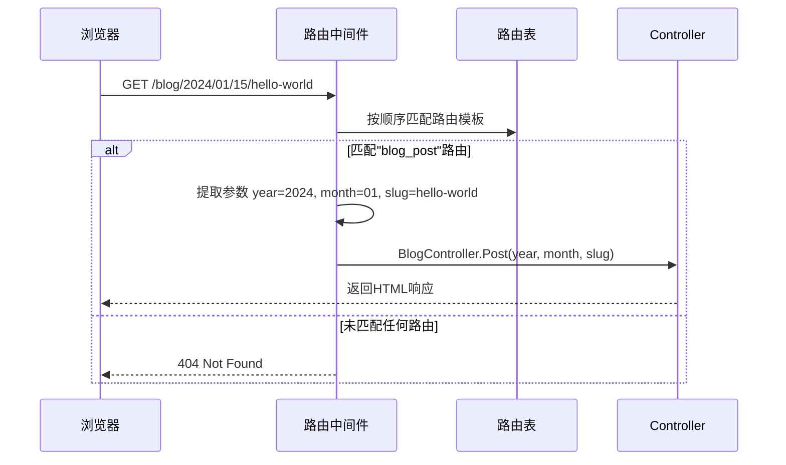
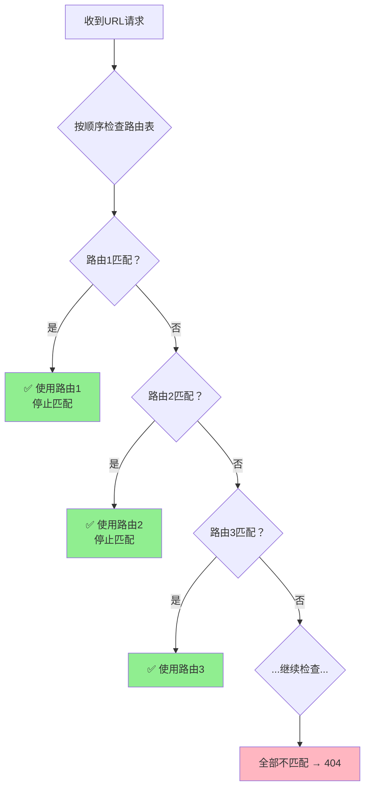
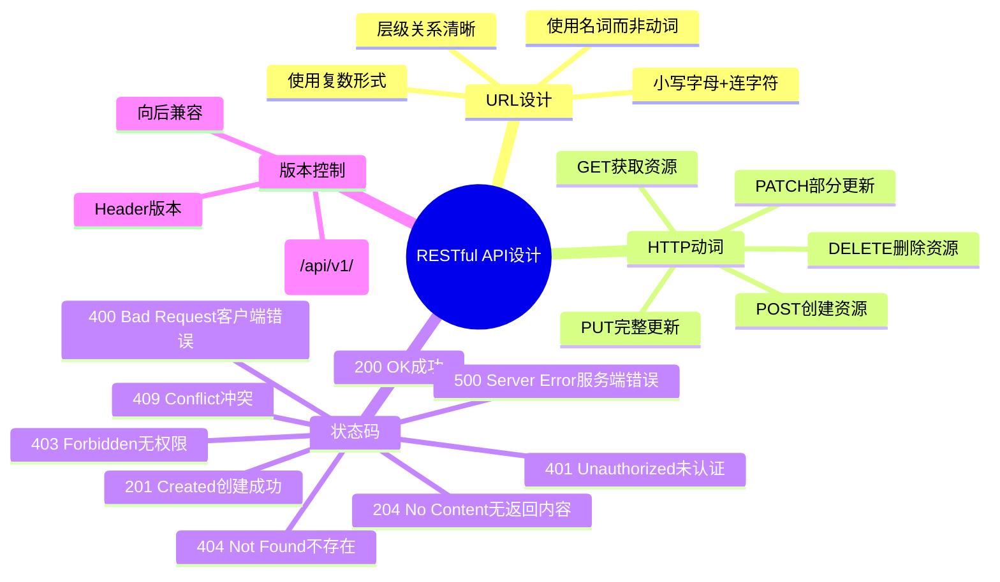
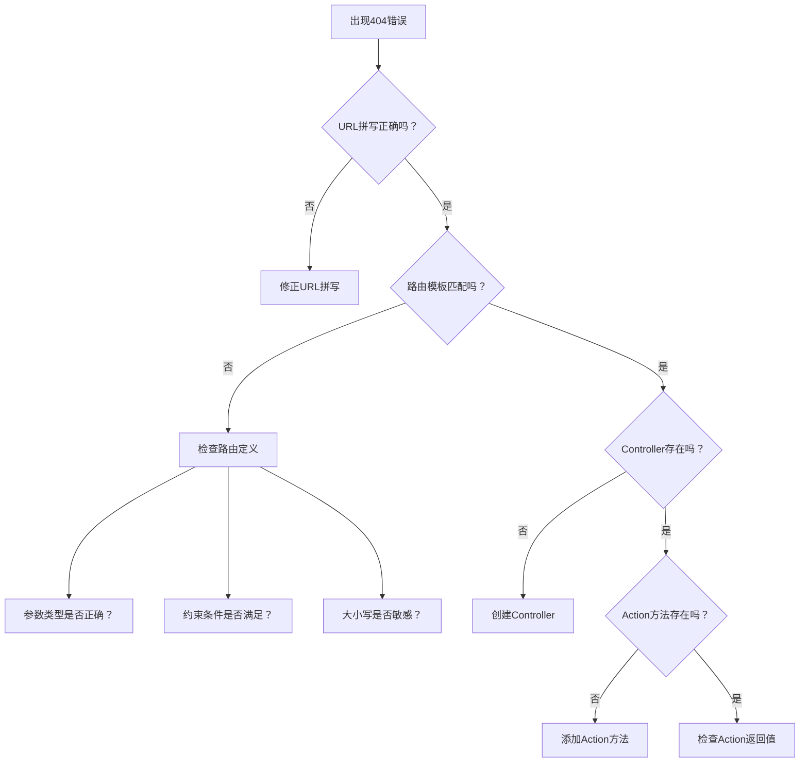
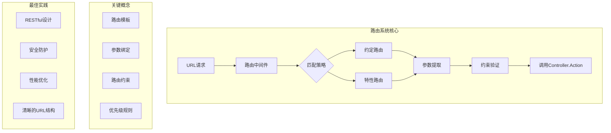

# 路由系统

> **学习目标**：掌握ASP.NET Core MVC中URL到Controller/Action的映射机制
>
> **前置知识**：了解MVC基本概念、HTTP协议基础
>
> **预计时间**：50-65分钟
>
> **难度等级**：⭐⭐⭐ 中级

---

## 一、什么是路由？为什么需要路由？

### 1.1 路由的本质

**路由（Routing）是URL与代码之间的桥梁**。当用户在浏览器输入一个URL时，路由系统负责：
1. 解析URL结构
2. 匹配预定义的路由规则
3. 提取参数值
4. 找到对应的Controller和Action
5. 将请求传递给目标处理方法

```mermaid
flowchart LR
    A[用户请求<br>/Product/Details/42] --> B[路由引擎]
    B --> C{匹配路由模板}
    C -->|匹配成功| D[提取参数<br>controller=Product<br>action=Details<br>id=42]
    D --> E[实例化Controller]
    E --> F[调用Action方法<br>Details(42)]
    C -->|匹配失败| G[返回404 Not Found]
```

### 1.2 为什么需要路由？

#### 没有路由系统的时代（ASP.NET WebForms）

```csharp
// ❌ 旧方式：物理文件路径直接暴露
// URL: http://example.com/ProductDetails.aspx?id=42&category=electronics

// 问题：
// 1. URL丑陋且暴露技术细节（.aspx后缀）
// 2. 难以实现SEO友好的URL
// 3. 文件结构与URL耦合过紧
// 4. 无法灵活改变URL结构而不影响代码
```

#### 有路由系统的现代方式（ASP.NET Core MVC）

```csharp
// ✅ 新方式：语义化的RESTful URL
// URL: http://example.com/product/42

// 优势：
// 1. URL简洁清晰，用户友好
// 2. 有利于SEO优化
// 3. URL结构与代码物理位置解耦
// 4. 可以自由设计URL模式
// 5. 支持版本控制和API演进
```

### 1.3 路由的核心价值

| 特性 | 说明 | 示例 |
|------|------|------|
| **SEO友好** | 搜索引擎更容易理解页面内容 | `/product/laptop` vs `?p=123&cat=5` |
| **用户体验** | 用户可以猜测和记忆URL | `/user/profile` 比 `/pages/u/prof.aspx?id=99` 更直观 |
| **解耦性** | 可以重构代码而不影响现有URL | 改变Controller名称不影响已发布的URL |
| **安全性** | 隐藏内部技术实现 | 不暴露`.aspx`、`.php`等后缀 |
| **灵活性** | 同一个Action可以通过多个URL访问 | 支持别名、重定向等 |

---

## 二、Convention-based路由（约定路由）

### 2.1 基本概念

约定路由基于**模式匹配**，在应用程序启动时定义一组路由模板。这是传统且最常用的路由方式。

### 2.2 配置约定路由

在`Program.cs`或`Startup.cs`中配置：

```csharp
var builder = WebApplication.CreateBuilder(args);

builder.Services.AddControllersWithViews();

var app = builder.Build();

app.UseRouting();  // 启用路由中间件

// 定义约定路由
app.MapControllerRoute(
    name: "default",
    pattern: "{controller=Home}/{action=Index}/{id?}");

app.Run();
```

**路由模板解析**：

```
{controller=Home}/{action=Index}/{id?}
│       │          │         │
│       │          │         └── 参数名：id，?表示可选
│       │          └── 默认值：Index
└── 默认值：Home
```

### 2.3 多个路由规则的配置示例

```csharp
app.UseRouting();

// 路由1：默认路由（通用）
app.MapControllerRoute(
    name: "default",
    pattern: "{controller=Home}/{action=Index}/{id?}");

// 路由2：博客文章专用路由
app.MapControllerRoute(
    name: "blog_post",
    pattern: "blog/{year:int}/{month:int}/{slug}",
    defaults: new { controller = "Blog", action = "Post" });

// 路由3：管理后台路由（带区域前缀）
app.MapControllerRoute(
    name: "admin",
    pattern: "Admin/{controller=Dashboard}/{action=Index}/{id?}");

// 路由4：API风格路由
app.MapControllerRoute(
    name: "api",
    pattern: "api/{controller}/{action}/{id?}");

app.Run();
```

### 2.4 约定路由的工作流程



### 2.5 实际示例：博客系统路由设计

```csharp
// Program.cs - 完整的路由配置
public static void Main(string[] args)
{
    var builder = WebApplication.CreateBuilder(args);
    builder.Services.AddControllersWithViews();
    var app = builder.Build();

    // 使用静态文件
    app.UseStaticFiles();

    // 启用路由
    app.UseRouting();

    // 自定义404处理（可选）
    app.MapFallbackToController("Index", "Error");

    // ===== 路由定义（按优先级从上到下）=====

    // 1. 博客文章详情页（最具体的路由放前面）
    app.MapControllerRoute(
        name: "blog_post_detail",
        pattern: "blog/{year:int:min(2020):max(2099)}/{month:int:range(1,12)}/{day:int:range(1,31)}/{slug}",
        defaults: new { controller = "Blog", action = "Post" });

    // 2. 博客分类列表
    app.MapControllerRoute(
        name: "blog_category",
        pattern: "blog/category/{categoryName}",
        defaults: new { controller = "Blog", action = "Category" });

    // 3. 博客标签搜索
    app.MapControllerRoute(
        name: "blog_tag",
        pattern: "blog/tag/{tagName}",
        defaults: new { controller = "Blog", action = "Tag" });

    // 4. 博客首页和归档
    app.MapControllerRoute(
        name: "blog_default",
        pattern: "blog/{action=Index}/{page:int?}",
        defaults: new { controller = "Blog" });

    // 5. 用户资料页
    app.MapControllerRoute(
        name: "user_profile",
        pattern: "user/{username}",
        defaults: new { controller = "User", action = "Profile" });

    // 6. 默认MVC路由（兜底）
    app.MapControllerRoute(
        name: "default",
        pattern: "{controller=Home}/{action=Index}/{id?}");

    app.Run();
}
```

对应的Controller：

```csharp
// Controllers/BlogController.cs
using Microsoft.AspNetCore.Mvc;

namespace MyBlog.Controllers
{
    public class BlogController : Controller
    {
        private readonly IBlogService _blogService;
        private readonly ILogger<BlogController> _logger;

        public BlogController(IBlogService blogService, ILogger<BlogController> logger)
        {
            _blogService = blogService;
            _logger = logger;
        }

        // GET: /blog → 匹配 blog_default 路由，action=Index
        public async Task<IActionResult> Index(int? page = 1)
        {
            var posts = await _blogService.GetPagedPostsAsync(page.Value, 10);
            return View(posts);
        }

        // GET: /blog/2024/01/15/hello-world → 匹配 blog_post_detail 路由
        public async Task<IActionResult> Post(int year, int month, int day, string slug)
        {
            _logger.LogInformation($"访问文章: {year}-{month:D2}-{day:D2}/{slug}");

            var post = await _blogService.GetPostByDateAndSlugAsync(year, month, day, slug);
            if (post == null)
            {
                return NotFound();  // 返回404页面
            }

            return View(post);
        }

        // GET: /blog/category/technology → 匹配 blog_category 路由
        public async Task<IActionResult> Category(string categoryName)
        {
            var posts = await _blogService.GetPostsByCategoryAsync(categoryName);
            ViewBag.CategoryName = categoryName;
            return View(posts);
        }

        // GET: /blog/tag/aspnet-core → 匹配 blog_tag 路由
        public async Task<IActionResult> Tag(string tagName)
        {
            var posts = await _blogService.GetPostsByTagAsync(tagName);
            ViewBag.TagName = tagName;
            return View(posts);
        }
    }
}
```

---

## 三、Attribute路由（特性路由）

### 3.1 什么是特性路由？

特性路由通过**在Controller类或Action方法上添加属性**来定义路由，提供更精细的控制和更直观的URL设计。

### 3.2 基本用法

```csharp
[Route("api/[controller]")]  // 控制器级别路由
[ApiController]
public class ProductsController : ControllerBase
{
    // GET: api/products
    [HttpGet]
    public async Task<ActionResult<IEnumerable<Product>>> GetAll()
    {
        var products = await _productService.GetAllAsync();
        return Ok(products);
    }

    // GET: api/products/5
    [HttpGet("{id:int}")]
    public async Task<ActionResult<Product>> GetById(int id)
    {
        var product = await _productService.GetByIdAsync(id);
        if (product == null) return NotFound();
        return Ok(product);
    }

    // GET: api/products/search?name=laptop
    [HttpGet("search")]
    public async Task<ActionResult<IEnumerable<Product>>> Search([FromQuery] string name)
    {
        var products = await _productService.SearchByNameAsync(name);
        return Ok(products);
    }
}
```

### 3.3 特性路由 vs 约定路由对比

| 特性 | 约定路由 | 特性路由 |
|------|---------|---------|
| **定义位置** | 集中在Program.cs | 分散在Controller/Action上 |
| **可读性** | 需要全局查看 | 代码即文档，一目了然 |
| **灵活性** | 较低，统一模式 | 高度灵活，每个Action可定制 |
| **维护性** | 大型项目难以维护 | 易于定位和修改 |
| **适用场景** | 传统MVC应用 | RESTful API、复杂路由需求 |
| **路由冲突** | 可能发生隐式冲突 | 显式定义，易于排查 |

### 3.4 复杂的特性路由示例

```csharp
using Microsoft.AspNetCore.Mvc;

namespace ECommerce.Controllers
{
    // 控制器级路由前缀
    [Route("shop")]
    public class ShopController : Controller
    {
        private readonly IProductService _productService;
        private readonly ICartService _cartService;

        public ShopController(IProductService productService, ICartService cartService)
        {
            _productService = productService;
            _cartService = cartService;
        }

        // GET: /shop → 首页
        [HttpGet("")]
        [HttpGet("home")]
        public async Task<IActionResult> Index()
        {
            var featuredProducts = await _productService.GetFeaturedProductsAsync();
            var categories = await _productService.GetAllCategoriesAsync();

            ViewBag.FeaturedProducts = featuredProducts;
            ViewBag.Categories = categories;

            return View();
        }

        // GET: /shop/products → 产品列表
        [HttpGet("products")]
        public async Task<IActionResult> Products(
            [FromQuery] string? category,
            [FromQuery] string? search,
            [FromQuery] int page = 1,
            [FromQuery] int pageSize = 12,
            [FromQuery] string sortBy = "newest")
        {
            var filter = new ProductFilter
            {
                Category = category,
                SearchKeyword = search,
                PageNumber = page,
                PageSize = pageSize,
                SortBy = sortBy
            };

            var result = await _productService.GetFilteredProductsAsync(filter);

            return View(result);
        }

        // GET: /shop/products/{id:int} → 单个产品详情
        [HttpGet("products/{id:int}")]
        public async Task<IActionResult> ProductDetail(int id)
        {
            var product = await _productService.GetByIdAsync(id);
            if (product == null) return NotFound();

            var relatedProducts = await _productService.GetRelatedProductsAsync(id, 4);

            ViewBag.RelatedProducts = relatedProducts;

            return View(product);
        }

        // GET: /shop/products/{slug} → SEO友好的产品URL
        [HttpGet("product/{slug:regex(^[[a-z0-9-]]+$)}")]
        public async Task<IActionResult> ProductBySlug(string slug)
        {
            var product = await _productService.GetBySlugAsync(slug);
            if (product == null) return NotFound();

            return View("ProductDetail", product);
        }

        // GET: /shop/category/{categoryName}/products → 分类产品
        [HttpGet("category/{categoryName}/products")]
        public async Task<IActionResult> CategoryProducts(
            string categoryName,
            [FromQuery] int page = 1)
        {
            var result = await _productService.GetByCategoryAsync(categoryName, page, 12);
            ViewBag.CategoryName = categoryName;
            return View("Products", result);
        }

        // POST: /shop/cart/add → 添加到购物车
        [HttpPost("cart/add")]
        [ValidateAntiForgeryToken]
        public async Task<IActionResult> AddToCart([FromBody] AddToCartRequest request)
        {
            if (!ModelState.IsValid)
                return BadRequest(ModelState);

            await _cartService.AddItemAsync(request.ProductId, request.Quantity);

            return Json(new { success = true, message = "已添加到购物车" });
        }

        // GET: /shop/cart → 查看购物车
        [HttpGet("cart")]
        public async Task<IActionResult> Cart()
        {
            var cartItems = await _cartService.GetCartItemsAsync();
            var summary = await _cartService.GetCartSummaryAsync();

            ViewBag.CartSummary = summary;

            return View(cartItems);
        }

        // PUT: /shop/cart/item/{itemId} → 更新购物车项数量
        [HttpPut("cart/item/{itemId:int}")]
        public async Task<IActionResult> UpdateCartItem(int itemId, [FromBody] UpdateCartItemRequest request)
        {
            await _cartService.UpdateQuantityAsync(itemId, request.Quantity);
            return Ok(new { success = true });
        }

        // DELETE: /shop/cart/item/{itemId} → 删除购物车项
        [HttpDelete("cart/item/{itemId:int}")]
        public async Task<IActionResult> RemoveFromCart(int itemId)
        {
            await _cartService.RemoveItemAsync(itemId);
            return Ok(new { success = true });
        }

        // GET: /shop/checkout → 结账页面
        [HttpGet("checkout")]
        public IActionResult Checkout()
        {
            if (!User.Identity.IsAuthenticated)
            {
                return RedirectToAction("Login", "Account",
                    new { returnUrl = Url.Action("Checkout") });
            }

            return View();
        }

        // POST: /checkout/process → 提交订单
        [HttpPost("checkout/process")]
        [ValidateAntiForgeryToken]
        public async Task<IActionResult> ProcessCheckout(CheckoutViewModel model)
        {
            if (!ModelState.IsValid)
                return View("Checkout", model);

            try
            {
                var orderId = await _orderService.CreateOrderAsync(User.Identity.Name, model);
                return RedirectToAction("OrderConfirmation", new { orderId });
            }
            catch (Exception ex)
            {
                ModelState.AddModelError("", "订单处理失败，请重试");
                _logger.LogError(ex, "结账失败");
                return View("Checkout", model);
            }
        }

        // GET: /shop/order/{orderId:guid} → 订单确认页
        [HttpGet("order/{orderId:guid}")]
        public async Task<IActionResult> OrderConfirmation(Guid orderId)
        {
            var order = await _orderService.GetOrderByIdAsync(orderId);
            if (order == null || order.UserId != User.Identity.Name)
                return NotFound();

            return View(order);
        }
    }

    // 请求模型
    public class AddToCartRequest
    {
        [Required]
        public int ProductId { get; set; }

        [Range(1, 100)]
        public int Quantity { get; set; } = 1;
    }

    public class UpdateCartItemRequest
    {
        [Range(1, 100)]
        public int Quantity { get; set; }
    }
}
```

---

## 四、路由参数和约束

### 4.1 路由参数类型

#### 必需参数 vs 可选参数

```csharp
// 约定路由中的参数定义
pattern: "{controller=Home}/{action=Index}/{id?}"
//                                    ↑
//                              ? 表示可选参数

// Controller中使用
public IActionResult Details(int? id)  // 可空类型对应可选参数
{
    if (id == null) return BadRequest();
    // ...
}
```

#### 多个参数示例

```csharp
// 路由模板
pattern: "{controller}/{action}/{category}/{page?}"

// URL: /Product/List/electronics/2
// 映射为:
//   controller = "Product"
//   action = "List"
//   category = "electronics"
//   page = 2 (int)

// URL: /Product/List/clothing
// 映射为:
//   controller = "Product"
//   action = "List"
//   category = "clothing"
//   page = null (可选参数未提供)
```

### 4.2 内置路由约束

约束用于限制参数的格式和范围，提高路由匹配的精确度。

#### 常用约束一览表

| 约束 | 示例 | 说明 | 匹配示例 |
|------|------|------|----------|
| `int` | `{id:int}` | 整数 | `123`, `-5` |
| `long` | `{id:long}` | 长整数 | `12345678901234` |
| `bool` | `{active:bool}` | 布尔值 | `true`, `false` |
| `datetime` | `{date:datetime}` | DateTime | `2024-01-15`, `2024/01/15` |
| `guid` | `{id:guid}` | GUID | `550e8400-e29b-41d4-a716-446655440000` |
| `float` | `{price:float}` | 浮点数 | `19.99`, `-3.14` |
| `double` | `{ratio:double}` | 双精度浮点数 | `1.618033988749895` |
| `decimal` | `{amount:decimal}` | 十进制数 | `9999.99` |
| `alpha` | `{name:alpha}` | 字母 | `John`, `abc` |
| `regex(...)` | `{slug:regex(...)}` | 正则表达式 | 自定义模式 |
| `length(min,max)` | `{code:length(4,6)}` | 字符串长度 | `abcd`, `abcdef` |
| `min(value)` | `{age:min(18)}` | 最小值 | `18`, `25` |
| `max(value)` | `{age:max(120)}` | 最大值 | `18`, `100` |
| `range(min,max)` | `{id:range(1,1000)}` | 数值范围 | `1`, `500`, `1000` |
| `file` | `{filename:file}` | 文件名 | `photo.jpg`, `doc.pdf` |

### 4.3 约束使用示例

```csharp
using Microsoft.AspNetCore.Mvc;

namespace AdvancedRouting.Controllers
{
    [Route("api/v1")]
    [ApiController]
    public class AdvancedController : ControllerBase
    {
        // 示例1：整数ID约束
        [HttpGet("users/{id:int}")]
        public ActionResult<User> GetUserById(int id)
        {
            // id保证是整数
            var user = _userService.FindById(id);
            return user ?? NotFound();
        }

        // 示例2：GUID约束（用于唯一标识符）
        [HttpGet("orders/{orderId:guid}")]
        public ActionResult<Order> GetOrder(Guid orderId)
        {
            var order = _orderService.FindByGuid(orderId);
            return order ?? NotFound();
        }

        // 示例3：日期范围约束
        [HttpGet("reports/{startDate:datetime}/{endDate:datetime}")]
        public ActionResult<Report> GetReport(DateTime startDate, DateTime endDate)
        {
            if (endDate < startDate)
            {
                BadRequest("结束日期不能早于开始日期");
            }

            var report = _reportService.Generate(startDate, endDate);
            return Ok(report);
        }

        // 示例4：字符串长度约束
        [HttpGet("products/{sku:length(8,12)}")]
        public ActionResult<Product> GetBySku(string sku)
        {
            // SKU必须是8-12个字符
            var product = _productService.FindBySku(sku);
            return product ?? NotFound();
        }

        // 示例5：数值范围约束
        [HttpGet("inventory/page/{page:int:range(1,100)}")]
        public ActionResult<PagedResult> GetInventory(int page)
        {
            // 页码必须在1-100之间
            var results = _inventoryService.GetPage(page, 20);
            return Ok(results);
        }

        // 示例6：正则表达式约束（最强大）
        [HttpGet("posts/{year:int:range(2020,2030)}/{month:int:range(1,12)}/{slug:regex([[a-z0-9]]+(-[[a-z0-9]]+)*)}")]
        public ActionResult<Post> GetPost(int year, int month, string slug)
        {
            // year: 2020-2030之间的整数
            // month: 1-12之间的整数
            // slug: 只包含小写字母、数字和连字符
            var post = _postService.FindByPermalink(year, month, slug);
            return post ?? NotFound();
        }

        // 示例7：组合多个约束
        [HttpGet("files/{filename:file}.{extension:regex(jpg\\|png\\|gif\\|pdf)}")]
        public IActionResult GetFile(string filename, string extension)
        {
            // filename: 合法的文件名
            // extension:只能是jpg/png/gif/pdf
            var path = Path.Combine(_config["FileStorage"], $"{filename}.{extension}");
            return PhysicalFile(path, GetContentType(extension));
        }

        // 示例8：布尔值查询
        [HttpGet("products/filter")]
        public ActionResult<IEnumerable<Product>> FilterProducts(
            [FromQuery] bool? inStockOnly,
            [FromQuery] decimal? minPrice,
            [FromQuery] decimal? maxPrice)
        {
            var query = _productService.Query();

            if (inStockOnly == true)
                query = query.Where(p => p.Stock > 0);

            if (minPrice.HasValue)
                query = query.Where(p => p.Price >= minPrice.Value);

            if (maxPrice.HasValue)
                query = query.Where(p => p.Price <= maxPrice.Value);

            return Ok(query.ToList());
        }
    }
}
```

### 4.4 自定义路由约束

当内置约束无法满足需求时，可以创建自定义约束。

#### Step 1: 实现IRouteConstraint接口

```csharp
// Constraints/SlugConstraint.cs
using System.Globalization;
using System.Text.RegularExpressions;
using Microsoft.AspNetCore.Http;
using Microsoft.AspNetCore.Routing;

namespace MyApp.Constraints
{
    /// <summary>
    /// 自定义Slug约束：只允许小写字母、数字、连字符，不能以连字符开头或结尾
    /// </summary>
    public class SlugConstraint : IRouteConstraint
    {
        private readonly Regex _slugPattern = new Regex(
            @"^[a-z0-9]+(?:-[a-z0-9]+)*$",
            RegexOptions.Compiled | RegexOptions.CultureInvariant
        );

        public bool Match(
            HttpContext httpContext,
            IRoute route,
            string parameterName,
            RouteValueDictionary values,
            RouteDirection routeDirection)
        {
            if (!values.TryGetValue(parameterName, out var value))
                return false;

            var stringValue = Convert.ToString(value, CultureInfo.InvariantCulture);
            return !string.IsNullOrEmpty(stringValue) && _slugPattern.IsMatch(stringValue);
        }
    }

    /// <summary>
    /// 自定义非零正整数约束
    /// </summary>
    public class NonZeroPositiveIntConstraint : IRouteConstraint
    {
        public bool Match(
            HttpContext httpContext,
            IRoute route,
            string parameterName,
            RouteValueDictionary values,
            RouteDirection routeDirection)
        {
            if (!values.TryGetValue(parameterName, out var value))
                return false;

            return int.TryParse(value.ToString(), out var number) && number > 0;
        }
    }

    /// <summary>
    /// 自定义枚举值约束
    /// </summary>
    public class EnumConstraint<TEnum> : IRouteConstraint where TEnum : struct, Enum
    {
        private readonly HashSet<string> _validValues;

        public EnumConstraint()
        {
            _validValues = new HashSet<StringComparer>(
                Enum.GetNames(typeof(TEnum)),
                StringComparer.OrdinalIgnoreCase
            );
        }

        public bool Match(
            HttpContext httpContext,
            IRoute route,
            string parameterName,
            RouteValueDictionary values,
            RouteDirection routeDirection)
        {
            if (!values.TryGetValue(parameterName, out var value))
                return false;

            return _validValues.Contains(value.ToString());
        }
    }
}
```

#### Step 2: 注册自定义约束

```csharp
// Program.cs
var builder = WebApplication.CreateBuilder(args);

// 注册自定义路由约束
builder.Services.Configure<RouteOptions>(options =>
{
    options.ConstraintMap.Add("slug", typeof(SlugConstraint));
    options.ConstraintMap.Add("positive", typeof(NonZeroPositiveIntConstraint));
    options.ConstraintMap.Add("enum", typeof(EnumConstraint<>));  // 泛型约束
});

builder.Services.AddControllersWithViews();
// ...
```

#### Step 3: 使用自定义约束

```csharp
[Route("blog")]
public class BlogController : Controller
{
    // 使用自定义slug约束
    [HttpGet("post/{postSlug:slug}")]
    public IActionResult Post(string postSlug)
    {
        // postSlug 保证符合slug格式
        var post = _blogService.GetBySlug(postSlug);
        return View(post);
    }

    // 使用自定义正整数约束
    [HttpGet("archive/{page:positive}")]
    public IActionResult Archive(int page)
    {
        // page 保证是大于0的正整数
        var posts = _blogService.GetArchivePage(page);
        return View(posts);
    }

    // 使用枚举约束（假设有SortOrder枚举）
    [HttpGet("posts/sort/{order:enum(SortOrder)}")]
    public IActionResult SortedPosts(SortOrder order)
    {
        // order 只能是 SortOrder 枚举中定义的值
        var posts = _blogService.GetSortedBy(order);
        return View(posts);
    }
}

// 枚举定义
public enum SortOrder
{
    Newest,
    Oldest,
    Popular,
    Comments
}
```

---

## 五、路由匹配优先级

### 5.1 优先级规则

当存在多个可能匹配的路由时，ASP.NET Core按照以下规则选择：



**关键原则**：
1. **先定义者优先**：在Program.cs中先注册的路由优先匹配
2. **特性路由优先于约定路由**：如果两者都可能匹配，特性路由胜出
3. **更具体的路由优先**：参数越少、约束越严格的路由越具体
4. **一旦匹配成功就停止**：不会继续查找其他可能的路由

### 5.2 优先级实战演示

```csharp
// Program.cs - 注意路由注册顺序！
app.MapControllerRoute(
    name: "specific_blog_post",      // ⭐ 最具体的路由放在前面
    pattern: "blog/{year:int}/{month:int}/{slug}");

app.MapControllerRoute(
    name: "general_blog",           // ⭐ 一般的路由放在后面
    pattern: "blog/{action=Index}/{id?}");

app.MapControllerRoute(
    name: "default",                 // 兜底路由最后
    pattern: "{controller=Home}/{action=Index}/{id?}");
```

**测试案例**：

| URL | 匹配结果 | 原因 |
|-----|---------|------|
| `/blog/2024/01/my-post` | `specific_blog_post` | 3个参数都匹配且有约束 |
| `/blog/archive` | `general_blog` | 匹配action="archive"，id未提供 |
| `/blog/details/42` | `general_blog` | 匹配action="details"，id=42 |
| `/home/index` | `default` | 前面的都不匹配 |

### 5.3 避免路由冲突的最佳实践

```csharp
// ❌ 错误：可能导致歧义的路由定义
app.MapControllerRoute(
    name: "conflict1",
    pattern: "product/{id}");     // 可能匹配 /product/list

app.MapControllerRoute(
    name: "conflict2",
    pattern: "product/{action}"); // 也可能匹配 /product/list

// ✅ 正确：明确区分不同类型的路由
app.MapControllerRoute(
    name: "product_by_id",
    pattern: "product/detail/{id:int}");  // 明确要求整数ID

app.MapControllerRoute(
    name: "product_actions",
    pattern: "product/{action:list|search|create}");  // 限制action取值
```

---

## 六、RESTful风格路由设计

### 6.1 什么是RESTful路由？

REST（Representational State Transfer）是一种软件架构风格，强调使用标准HTTP动词和资源导向的URL设计。

### 6.2 RESTful路由设计规范

| HTTP动词 | 用途 | URL示例 | 对应Action |
|----------|------|---------|-----------|
| **GET** | 获取资源列表 | `/api/users` | `GetAll()` |
| **GET** | 获取单个资源 | `/api/users/5` | `GetById(5)` |
| **POST** | 创建新资源 | `/api/users` | `Create(user)` |
| **PUT** | 完整更新资源 | `/api/users/5` | `Update(5, user)` |
| **PATCH** | 部分更新资源 | `/api/users/5` | `PartialUpdate(5, user)` |
| **DELETE** | 删除资源 | `/api/users/5` | `Delete(5)` |

### 6.3 完整的RESTful API路由示例

```csharp
using Microsoft.AspNetCore.Mvc;
using Microsoft.EntityFrameworkCore;

namespace RestApiDemo.Controllers
{
    [Route("api/[controller]")]
    [ApiController]
    public class UsersController : ControllerBase
    {
        private readonly ApplicationDbContext _context;
        private readonly ILogger<UsersController> _logger;

        public UsersController(ApplicationDbContext context, ILogger<UsersController> logger)
        {
            _context = context;
            _logger = logger;
        }

        #region CRUD操作

        /// <summary>
        /// GET: api/users
        /// 获取所有用户（支持分页和筛选）
        /// </summary>
        [HttpGet]
        public async Task<ActionResult<PagedResult<User>>> GetUsers(
            [FromQuery] int pageNumber = 1,
            [FromQuery] int pageSize = 20,
            [FromQuery] string? searchTerm = null,
            [FromQuery] string? role = null)
        {
            try
            {
                IQueryable<User> query = _context.Users.Include(u => u.Role);

                // 搜索过滤
                if (!string.IsNullOrWhiteSpace(searchTerm))
                {
                    query = query.Where(u =>
                        u.UserName.Contains(searchTerm) ||
                        u.Email.Contains(searchTerm));
                }

                // 角色过滤
                if (!string.IsNullOrWhiteSpace(role))
                {
                    query = query.Where(u => u.Role.Name == role);
                }

                // 总记录数
                var totalCount = await query.CountAsync();

                // 分页
                var users = await query
                    .OrderBy(u => u.Id)
                    .Skip((pageNumber - 1) * pageSize)
                    .Take(pageSize)
                    .Select(u => new UserDto
                    {
                        Id = u.Id,
                        UserName = u.UserName,
                        Email = u.Email,
                        RoleName = u.Role.Name,
                        CreatedAt = u.CreatedAt,
                        IsActive = u.IsActive
                    })
                    .ToListAsync();

                var pagedResult = new PagedResult<UserDto>
                {
                    Items = users,
                    PageNumber = pageNumber,
                    PageSize = pageSize,
                    TotalCount = totalCount,
                    TotalPages = (int)Math.Ceiling((double)totalCount / pageSize)
                };

                return Ok(pagedResult);
            }
            catch (Exception ex)
            {
                _logger.LogError(ex, "获取用户列表失败");
                return StatusCode(500, "服务器内部错误");
            }
        }

        /// <summary>
        /// GET: api/users/5
        /// 根据ID获取单个用户
        /// </summary>
        [HttpGet("{id:int}")]
        public async Task<ActionResult<UserDto>> GetUser(int id)
        {
            var user = await _context.Users
                .Include(u => u.Role)
                .Where(u => u.Id == id)
                .Select(u => new UserDto
                {
                    Id = u.Id,
                    UserName = u.UserName,
                    Email = u.Email,
                    FullName = u.FullName,
                    RoleName = u.Role.Name,
                    CreatedAt = u.CreatedAt,
                    LastLoginAt = u.LastLoginAt,
                    IsActive = u.IsActive
                })
                .FirstOrDefaultAsync();

            if (user == null)
            {
                return NotFound(new { message = $"ID为 {id} 的用户不存在" });
            }

            return Ok(user);
        }

        /// <summary>
        /// POST: api/users
        /// 创建新用户
        /// </summary>
        [HttpPost]
        public async Task<ActionResult<UserDto>> CreateUser([FromBody] CreateUserDto createUserDto)
        {
            if (!ModelState.IsValid)
            {
                return BadRequest(ModelState);
            }

            try
            {
                // 检查邮箱是否已存在
                if (await _context.Users.AnyAsync(u => u.Email == createUserDto.Email))
                {
                    return Conflict(new { message = "该邮箱已被注册" });
                }

                // 创建用户实体
                var user = new User
                {
                    UserName = createUserDto.UserName,
                    Email = createUserDto.Email,
                    FullName = createUserDto.FullName,
                    PasswordHash = HashPassword(createUserDto.Password),  // 应该使用密码哈希
                    RoleId = createUserDto.RoleId ?? 2,  // 默认普通用户角色
                    CreatedAt = DateTime.UtcNow,
                    IsActive = true
                };

                _context.Users.Add(user);
                await _context.SaveChangesAsync();

                // 返回201 Created和资源URI
                var userDto = MapToDto(user);
                return CreatedAtAction(
                    nameof(GetUser),
                    new { id = user.Id },
                    userDto);
            }
            catch (Exception ex)
            {
                _logger.LogError(ex, "创建用户失败");
                return StatusCode(500, "创建用户时发生错误");
            }
        }

        /// <summary>
        /// PUT: api/users/5
        /// 完整更新用户信息
        /// </summary>
        [HttpPut("{id:int}")]
        public async Task<IActionResult> UpdateUser(int id, [FromBody] UpdateUserDto updateUserDto)
        {
            if (id != updateUserDto.Id)
            {
                return BadRequest("URL中的ID与请求体中的ID不匹配");
            }

            if (!ModelState.IsValid)
            {
                return BadRequest(ModelState);
            }

            var user = await _context.Users.FindAsync(id);
            if (user == null)
            {
                return NotFound();
            }

            try
            {
                // 更新字段
                user.UserName = updateUserDto.UserName;
                user.Email = updateUserDto.Email;
                user.FullName = updateUserDto.FullName;
                user.RoleId = updateUserDto.RoleId;
                user.IsActive = updateUserDto.IsActive;
                user.UpdatedAt = DateTime.UtcNow;

                await _context.SaveChangesAsync();

                return NoContent();  // 204 No Content
            }
            catch (DbUpdateConcurrencyException ex)
            {
                if (!await UserExists(id))
                {
                    return NotFound();
                }
                _logger.LogError(ex, "更新用户时发生并发冲突");
                return Conflict(new { message = "数据已被其他人修改，请刷新后重试" });
            }
        }

        /// <summary>
        /// PATCH: api/users/5
        /// 部分更新用户信息（如仅修改状态）
        /// </summary>
        [HttpPatch("{id:int}")]
        public async Task<IActionResult> PartialUpdateUser(int id, [FromBody] JsonPatchDocument<User> patchDoc)
        {
            var user = await _context.Users.FindAsync(id);
            if (user == null)
            {
                return NotFound();
            }

            patchDoc.ApplyTo(user, ModelState);  // 应用部分更新

            if (!ModelState.IsValid)
            {
                return BadRequest(ModelState);
            }

            user.UpdatedAt = DateTime.UtcNow;
            await _context.SaveChangesAsync();

            return NoContent();
        }

        /// <summary>
        /// DELETE: api/users/5
        /// 删除用户（软删除）
        /// </summary>
        [HttpDelete("{id:int}")]
        public async Task<IActionResult> DeleteUser(int id)
        {
            var user = await _context.Users.FindAsync(id);
            if (user == null)
            {
                return NotFound();
            }

            try
            {
                // 软删除：标记为不活跃而不是真正删除
                user.IsActive = false;
                user.DeletedAt = DateTime.UtcNow;
                user.UpdatedAt = DateTime.UtcNow;

                await _context.SaveChangesAsync();

                return NoContent();
            }
            catch (Exception ex)
            {
                _logger.LogError(ex, "删除用户失败");
                return StatusCode(500, "删除用户时发生错误");
            }
        }

        #endregion

        #region 子资源操作

        /// <summary>
        /// GET: api/users/5/orders
        /// 获取用户的订单列表
        /// </summary>
        [HttpGet("{userId:int}/orders")]
        public async Task<ActionResult<IEnumerable<OrderDto>>> GetUserOrders(int userId)
        {
            if (!await UserExists(userId))
            {
                return NotFound();
            }

            var orders = await _context.Orders
                .Where(o => o.UserId == userId)
                .OrderByDescending(o => o.OrderDate)
                .Take(50)
                .ProjectTo<OrderDto>()
                .ToListAsync();

            return Ok(orders);
        }

        /// <summary>
        /// POST: api/users/5/avatar
        /// 上传用户头像
        /// </summary>
        [HttpPost("{userId:int}/avatar")]
        public async Task<IActionResult> UploadAvatar(int userId, IFormFile file)
        {
            if (!await UserExists(userId))
            {
                return NotFound();
            }

            if (file == null || file.Length == 0)
            {
                return BadRequest("请选择要上传的文件");
            }

            if (file.Length > 5 * 1024 * 1024)  // 5MB限制
            {
                return BadRequest("文件大小不能超过5MB");
            }

            var allowedTypes = new[] { "image/jpeg", "image/png", "image/gif" };
            if (!allowedTypes.Contains(file.ContentType))
            {
                return BadRequest("只支持JPG、PNG、GIF格式的图片");
            }

            // 保存文件逻辑...
            var avatarUrl = await _fileService.SaveAvatarAsync(userId, file);

            return Ok(new { avatarUrl = avatarUrl });
        }

        #endregion

        #region 辅助方法

        private async Task<bool> UserExists(int id)
        {
            return await _context.Users.AnyAsync(u => u.Id == id);
        }

        private UserDto MapToDto(User user)
        {
            return new UserDto
            {
                Id = user.Id,
                UserName = user.UserName,
                Email = user.Email,
                FullName = user.FullName,
                CreatedAt = user.CreatedAt,
                IsActive = user.IsActive
            };
        }

        private string HashPassword(string password)
        {
            // 实际项目中应使用 ASP.NET Core Identity 或 bcrypt
            return BCrypt.Net.BCrypt.HashPassword(password);
        }

        #endregion
    }

    #region DTOs（数据传输对象）

    public class CreateUserDto
    {
        [Required(ErrorMessage = "用户名不能为空")]
        [MinLength(3, ErrorMessage = "用户名至少3个字符")]
        [MaxLength(50, ErrorMessage = "用户名最多50个字符")]
        public string UserName { get; set; } = string.Empty;

        [Required(ErrorMessage = "邮箱不能为空")]
        [EmailAddress(ErrorMessage = "邮箱格式不正确")]
        public string Email { get; set; } = string.Empty;

        public string? FullName { get; set; }

        [Required(ErrorMessage = "密码不能为空")]
        [MinLength(8, ErrorMessage = "密码至少8个字符")]
        public string Password { get; set; } = string.Empty;

        public int? RoleId { get; set; }
    }

    public class UpdateUserDto
    {
        public int Id { get; set; }

        [Required]
        [MinLength(3)]
        [MaxLength(50)]
        public string UserName { get; set; } = string.Empty;

        [Required]
        [EmailAddress]
        public string Email { get; set; } = string.Empty;

        public string? FullName { get; set; }

        public int? RoleId { get; set; }

        public bool IsActive { get; set; } = true;
    }

    public class UserDto
    {
        public int Id { get; set; }
        public string UserName { get; set; } = string.Empty;
        public string Email { get; set; } = string.Empty;
        public string? FullName { get; set; }
        public string? RoleName { get; set; }
        public DateTime CreatedAt { get; set; }
        public DateTime? LastLoginAt { get; set; }
        public bool IsActive { get; set; }
    }

    public class PagedResult<T>
    {
        public IEnumerable<T> Items { get; set; } = Enumerable.Empty<T>();
        public int PageNumber { get; set; }
        public int PageSize { get; set; }
        public int TotalCount { get; set; }
        public int TotalPages { get; set; }
    }

    public class OrderDto
    {
        public int Id { get; set; }
        public DateTime OrderDate { get; set; }
        public decimal TotalAmount { get; set; }
        public string Status { get; set; } = string.Empty;
    }

    #endregion
}
```

### 6.4 RESTful最佳实践清单



---

## 七、常见路由问题排查

### 7.1 问题诊断工具

#### 使用路由调试中间件

```csharp
// 开发环境启用详细路由日志
if (app.Environment.IsDevelopment())
{
    app.Use(async (context, next) =>
    {
        _logger.LogInformation($"请求路径: {context.Request.Path}");
        _logger.LogInformation($"请求方法: {context.Request.Method}");

        await next();

        _logger.LogInformation($"响应状态码: {context.Response.StatusCode}");
    });
}
```

#### 使用路由调试端点

```csharp
// 仅开发环境显示所有注册的路由
if (app.Environment.IsDevelopment())
{
    app.MapGet("/routes-debug", (IEnumerable<EndpointDataSource> endpointSources) =>
    {
        var routes = endpointSources
            .SelectMany(es => es.Endpoints)
            .OfType<RouteEndpoint>()
            .OrderBy(e => e.RoutePattern.RawText)
            .Select(e => new
            {
                Method = e.Metadata.OfType<HttpMethodMetadata>().FirstOrDefault()?.HttpMethods?.FirstOrDefault() ?? "ANY",
                Pattern = e.RoutePattern.RawText,
                Name = e.Metadata.OfType<RouteNameMetadata>().FirstOrDefault()?.RouteName ?? "",
                Action = e.Metadata.OfType<MethodInfo>().FirstOrDefault()?.Name ?? ""
            });

        return Results.Json(routes, new JsonSerializerOptions { WriteIndented = true });
    });
}
```

### 7.2 常见问题及解决方案

#### 问题1：404 Not Found

**症状**：访问某个URL时返回404

**排查步骤**：



**解决方案示例**：

```csharp
// 问题：访问 /Product/List 返回404
// 原因：路由区分大小写（某些环境）或Controller命名空间问题

// ✅ 解决方案1：确保路由模板正确
[Route("product")]  // 使用小写
public class ProductController : Controller
{
    [HttpGet("list")]
    public IActionResult List() { ... }
}

// ✅ 解决方案2：检查Controller是否被扫描到
// 确保 Controller 类是 public 且继承自 Controller/ControllerBase

// ✅ 解决方案3：使用 [Area] 时确保配置了区域路由
[Area("Admin")]
[Route("admin/[controller]")]
public class AdminController : Controller { ... }

// Program.cs中必须配置区域路由
app.MapControllerRoute(
    name: "areas",
    pattern: "{area:exists}/{controller=Home}/{action=Index}/{id?}");
```

#### 问题2：路由参数绑定失败

**症状**：参数值为null或默认值，或类型转换异常

**诊断代码**：

```csharp
[HttpGet("test/{id}")]
public IActionResult TestRoute(int id)
{
    // 添加调试日志
    _logger.LogWarning($"接收到的ID值: {id}, 类型: {id.GetType()}");

    // 检查路由数据
    var routeData = HttpContext.GetRouteData();
    foreach (var item in routeData.Values)
    {
        _logger.LogInformation($"路由参数: {item.Key} = {item.Value}");
    }

    return Ok(new { receivedId = id });
}
```

**常见原因及修复**：

```csharp
// ❌ 问题1：类型不匹配
[HttpGet("user/{name:int}")]  // 约束为整数
public IActionResult GetUser(string name)  // 但参数是字符串
// 修复：移除int约束或改为int参数

// ❌ 问题2：特殊字符未编码
// URL: /api/user/John%20Doe (空格编码为%20)
// 如果未编码会导致路由匹配失败

// ✅ 修复：使用Url.Encode或让框架自动处理
[HttpGet("user/{*name}")]  // *号捕获剩余所有内容（catch-all参数）
public IActionResult GetUser(string name)
{
    name = Uri.UnescapeDataString(name);  // 手动解码
    return Ok(name);
}
```

#### 问题3：多个路由匹配冲突

**症状**：请求总是匹配到错误的路由

**解决方案**：

```csharp
// ❌ 错误：顺序不当导致冲突
app.MapControllerRoute(
    name: "catch_all",
    pattern: "{*path}");  // 这个会匹配所有请求！

app.MapControllerRoute(
    name: "specific",
    pattern: "api/users");  // 永远不会被执行

// ✅ 正确：具体路由在前，通配路由在后
app.MapControllerRoute(
    name: "api_users",
    pattern: "api/users");

app.MapControllerRoute(
    name: "admin_area",
    pattern: "Admin/{controller}/{action}/{id?}");

app.MapControllerRoute(
    name: "default",
    pattern: "{controller=Home}/{action=Index}/{id?}");

// 通配路由作为最后的fallback
app.MapFallbackToController("Index", "NotFound");
```

#### 问题4：POST请求路由不匹配

**症状**：GET正常但POST返回404或405

**原因分析**：

```csharp
// ❌ 原因1：缺少HTTP方法特性
[Route("api/login")]  // 没有指定HTTP方法
public IActionResult Login(LoginModel model)  // 默认只支持GET
{
    // POST请求会返回405 Method Not Allowed
}

// ✅ 修复：显式指定HTTP方法
[HttpPost("api/login")]
[Route("api/login", Name = "login")]
public IActionResult Login([FromBody] LoginModel model)
{
    // ...
}

// ❌ 原因2：CSRF令牌验证失败
[HttpPost]
[ValidateAntiForgeryToken]  // 表单提交需要这个
public IActionResult SubmitForm(FormModel model)
{
    // 如果前端没有发送__RequestVerificationToken，会返回400
}

// ✅ 修复：确保前端表单包含@Html.AntiForgeryToken()

// ❌ 原因3：Content-Type不匹配
[HttpPost("api/data")]
public IActionResult ReceiveData([FromBody] DataModel model)
{
    // 如果请求头 Content-Type 不是 application/json，
    // FromBody 绑定会失败
}

// ✅ 修复：前端设置正确的Content-Type
fetch('/api/data', {
    method: 'POST',
    headers: { 'Content-Type': 'application/json' },
    body: JSON.stringify(data)
});
```

### 7.3 路由性能优化建议

```csharp
// 1. 避免过多的路由规则（建议<100条）
// 2. 将高频访问的路由放在前面
// 3. 使用约束减少不必要的匹配尝试
// 4. 对于API项目，优先使用特性路由
// 5. 定期清理不再使用的路由
// 6. 在生产环境禁用路由调试功能

// 性能监控示例
app.Use(async (context, next) =>
{
    var sw = Stopwatch.StartNew();
    await next();
    sw.Stop();

    if (sw.ElapsedMilliseconds > 1000)  // 超过1秒记录警告
    {
        _logger.LogWarning($"慢路由: {context.Request.Path} 耗时 {sw.ElapsedMilliseconds}ms");
    }
});
```

---

## 八、练习题

### 练习1：路由匹配分析

**题目**：给定以下路由配置，判断以下URL分别匹配哪个路由？

```csharp
app.MapControllerRoute(
    name: "blog_post",
    pattern: "blog/{year:int}/{month:int}/{slug}");

app.MapControllerRoute(
    name: "blog_category",
    pattern: "blog/category/{name}");

app.MapControllerRoute(
    name: "default",
    pattern: "{controller=Home}/{action=Index}/{id?}");
```

待测URL：
1. `/blog/2024/01/hello-world`
2. `/blog/category/technology`
3. `/blog/archive`
4. `/home/about`
5. `/product/details/42`

<details>
<summary>点击查看答案</summary>

**答案**：

1. **`blog_post`** - 三个参数都满足约束（year和month都是int，slug任意）
2. **`blog_category`** - 匹配第二个路由，name="technology"
3. **`default`** - 前两个都不匹配（archive不是int），走默认路由，controller="blog"，action="archive"
4. **`default`** - controller="home"，action="index"...等等，这里应该是controller="home"，action="about"？实际上会匹配到controller="Home"，action="about"
5. **`default`** - controller="product"，action="details"，id=42

**注意**：第3题中，`/blog/archive`不会匹配`blog_post`路由，因为"archive"不是有效的整数。
</details>

---

### 练习2：设计电商网站路由

**题目**：为一个电商平台设计RESTful路由，包括以下功能：
- 商品CRUD
- 分类浏览
- 购物车操作
- 订单管理
- 用户中心

请写出完整的路由设计和对应的Controller骨架。

<details>
<summary>点击查看参考答案</summary>

**推荐的路由设计**：

```csharp
// Program.cs
app.MapControllerRoute(
    name: "product_detail_slug",
    pattern: "product/{slug:regex([[a-z0-9-]]+)}",
    defaults: new { controller = "Product", action = "Detail" });

app.MapControllerRoute(
    name: "category_products",
    pattern: "category/{categorySlug}/page-{page:int?}",
    defaults: new { controller = "Category", action = "Products" });

app.MapControllerRoute(
    name: "cart_operations",
    pattern: "cart/{action=Index}/{id?}",
    defaults: new { controller = "Cart" });

app.MapControllerRoute(
    name: "user_center",
    pattern: "user/{action=Profile}/{id?}",
    defaults: new { controller = "User" });

app.MapControllerRoute(
    name: "default",
    pattern: "{controller=Home}/{action=Index}/{id?}");
```

**Controller示例**：

```csharp
[Route("api/[controller]")]
[ApiController]
public class ProductsController : ControllerBase
{
    // GET: api/products
    [HttpGet]
    public async Task<IActionResult> GetProducts([FromQuery] ProductFilter filter) { ... }

    // GET: api/products/5
    [HttpGet("{id:int}")]
    public async Task<IActionResult> GetProduct(int id) { ... }

    // GET: product/laptop-dell-xps-15 （SEO友好URL）
    [HttpGet("~/product/{slug}")]
    public async Task<IActionResult> GetBySlug(string slug) { ... }

    // POST: api/products
    [HttpPost]
    public async Task<IActionResult> CreateProduct([FromBody] CreateProductDto dto) { ... }

    // PUT: api/products/5
    [HttpPut("{id:int}")]
    public async Task<IActionResult> UpdateProduct(int id, [FromBody] UpdateProductDto dto) { ... }

    // DELETE: api/products/5
    [HttpDelete("{id:int}")]
    public async Task<IActionResult> DeleteProduct(int id) { ... }
}

[Route("api/[controller]")]
[ApiController]
public class OrdersController : ControllerBase
{
    // GET: api/orders (当前用户的订单)
    [HttpGet]
    public async Task<IActionResult> GetMyOrders() { ... }

    // GET: api/orders/5
    [HttpGet("{id:int}")]
    public async Task<IActionResult> GetOrder(int id) { ... }

    // POST: api/orders (创建新订单)
    [HttpPost]
    public async Task<IActionResult> CreateOrder([FromBody] CreateOrderDto dto) { ... }

    // PATCH: api/orders/5/cancel (取消订单)
    [HttpPatch("{id:int}/cancel")]
    public async Task<IActionResult> CancelOrder(int id) { ... }
}
```
</details>

---

### 练习3：自定义路由约束实现

**题目**：实现一个自定义路由约束，确保日期参数格式为`YYYY-MM-DD`，并且日期不能是未来的日期。

<details>
<summary>点击查看答案</summary>

**实现步骤**：

```csharp
// Constraints/PastDateConstraint.cs
using System.Globalization;
using Microsoft.AspNetCore.Http;
using Microsoft.AspNetCore.Routing;

public class PastDateConstraint : IRouteConstraint
{
    public bool Match(
        HttpContext httpContext,
        IRoute route,
        string parameterName,
        RouteValueDictionary values,
        RouteDirection routeDirection)
    {
        if (!values.TryGetValue(parameterName, out var value))
            return false;

        var dateString = value.ToString();

        // 尝试解析为YYYY-MM-DD格式
        if (!DateTime.TryParseExact(dateString, "yyyy-MM-dd",
            CultureInfo.InvariantCulture, DateTimeStyles.None, out var date))
        {
            return false;
        }

        // 检查不是未来日期（允许今天）
        return date.Date <= DateTime.Today;
    }
}

// 注册约束
builder.Services.Configure<RouteOptions>(options =>
{
    options.ConstraintMap.Add("pastdate", typeof(PastDateConstraint));
});

// 使用约束
[HttpGet("reports/{date:pastdate}")]
public IActionResult GetReport(DateTime date)
{
    // date 保证是过去或今天的日期，格式为YYYY-MM-DD
    var report = _reportService.GenerateForDate(date);
    return Ok(report);
}
```
</details>

---

### 练习4：路由安全性检查

**题目**：下面的路由定义有哪些安全隐患？如何改进？

```csharp
[HttpGet("files/{filename}")]
public IActionResult GetFile(string filename)
{
    var path = Path.Combine(Directory.GetCurrentDirectory(), "wwwroot", "uploads", filename);
    return PhysicalFile(path, "application/octet-stream");
}
```

<details>
<summary>点击查看答案</summary>

**安全隐患**：

1. **路径遍历攻击（Path Traversal）**
   - 攻击URL：`/files/../../Windows/System32/config/SAM`
   - 可能读取系统敏感文件

2. **无文件类型限制**
   - 可以下载`.cs`、`.json`、`.config`等敏感文件

3. **无权限控制**
   - 任何人都可以下载上传的文件

**安全改进版**：

```csharp
[HttpGet("files/{filename:file}")]
[ResponseCache(Duration = 3600)]  // 缓存1小时
public IActionResult GetFile(string filename)
{
    try
    {
        // 安全措施1：规范化路径并防止目录遍历
        var safeFileName = Path.GetFileName(filename);  // 移除路径信息
        if (safeFileName != filename || string.IsNullOrEmpty(safeFileName))
        {
            return BadRequest("非法的文件名");
        }

        // 安全措施2：限制允许的文件扩展名
        var allowedExtensions = new[] { ".jpg", ".jpeg", ".png", ".gif", ".pdf", ".docx" };
        var extension = Path.GetExtension(safeFileName).ToLowerInvariant();
        if (!allowedExtensions.Contains(extension))
        {
            return Forbid("不允许的文件类型");
        }

        // 安全措施3：构建安全的物理路径
        var baseDirectory = Path.Combine(Directory.GetCurrentDirectory(), "wwwroot", "uploads");
        var fullPath = Path.Combine(baseDirectory, safeFileName);

        // 安全措施4：确保最终路径仍在预期目录内
        var fullDirInfo = new DirectoryInfo(baseDirectory);
        var fileInfo = new FileInfo(fullPath);

        if (!fileInfo.Exists ||
            !fileInfo.FullName.StartsWith(fullDirInfo.FullName, StringComparison.Ordinal))
        {
            return NotFound();
        }

        // 安全措施5：检查文件权限（可选）
        // 这里可以添加用户登录状态检查等

        // 设置正确的Content-Type
        var contentType = GetContentType(extension);
        return PhysicalFile(fileInfo.FullName, contentType, enableRangeProcessing: true);
    }
    catch (Exception ex)
    {
        _logger.LogError(ex, "文件下载失败: {Filename}", filename);
        return StatusCode(500, "文件下载失败");
    }
}

private string GetContentType(string extension)
{
    return extension switch
    {
        ".jpg" or ".jpeg" => "image/jpeg",
        ".png" => "image/png",
        ".gif" => "image/gif",
        ".pdf" => "application/pdf",
        ".docx" => "application/vnd.openxmlformats-officedocument.wordprocessingml.document",
        _ => "application/octet-stream"
    };
}
```
</details>

---

### 练习5：综合应用 - 设计博客API路由

**题目**：为一个多语言博客系统设计完整的API路由，要求：
- 支持中文（zh）、英文（en）、日文（ja）三种语言
- 文章URL格式：`/{lang}/blog/{year}/{month}/{slug}`
- 评论嵌套在文章下
- 支持分页、搜索、标签筛选
- 符合RESTful规范

请给出路由配置、Controller结构和至少3个具体的Action示例。

<details>
<summary>点击查看参考答案</summary>

**完整设计方案**：

```csharp
// Program.cs - 路由配置
var builder = WebApplication.CreateBuilder(args);
builder.Services.AddControllers();
builder.Services.AddLocalization(options => options.ResourcesPath = "Resources");

var app = builder.Build();

var supportedCultures = new[] { "zh-CN", "en-US", "ja-JP" };
var localizationOptions = new RequestLocalizationOptions
{
    SupportedCultures = supportedCultures.Select(c => new CultureInfo(c)).ToList(),
    SupportedUICultures = supportedCultures.Select(c => new CultureInfo(c)).ToList(),
    DefaultRequestCulture = new RequestCulture("zh-CN")
};

localizationOptions.RequestCultureProviders.Insert(0,
    new RouteDataRequestCultureProvider());

app.UseRequestLocalization(localizationOptions);
app.UseRouting();

// 多语言博客路由
app.MapControllerRoute(
    name: "blog_post_detail",
    pattern: "{lang:regex(zh|en|ja)}/blog/{year:int:range(2020,2030)}/{month:int:range(1,12)}/{slug:slug}",
    defaults: new { controller = "Blog", action = "Post" });

app.MapControllerRoute(
    name: "blog_list",
    pattern: "{lang:regex(zh|en|ja)}/blog/{action=Index}/{page:int?}",
    defaults: new { controller = "Blog" });

app.MapControllerRoute(
    name: "blog_comments",
    pattern: "{lang:regex(zh|en|ja)}/blog/post/{postId:int}/comments/{commentId:int?}",
    defaults: new { controller = "Comment", action = "Index" });

app.MapControllerRoute(
    name: "default_api",
    pattern: "{lang:regex(zh|en|ja)}/api/{controller}/{action}/{id?}");

app.Run();
```

**Controller实现**：

```csharp
[Route("{lang}/blog")]
[ApiController]
public class BlogController : ControllerBase
{
    private readonly IBlogService _blogService;
    private readonly ILogger<BlogController> _logger;

    public BlogController(IBlogService blogService, ILogger<BlogController> logger)
    {
        _blogService = blogService;
        _logger = logger;
    }

    /// <summary>
    /// GET: /zh/blog 或 /en/blog
    /// 获取博客文章列表（支持分页、筛选、搜索）
    /// </summary>
    [HttpGet("")]
    [ProducesResponseType(typeof(PagedResult<PostDto>), StatusCodes.Status200OK)]
    public async Task<ActionResult<PagedResult<PostDto>>> GetPosts(
        [FromRoute] string lang,
        [FromQuery] int page = 1,
        [FromQuery] int pageSize = 10,
        [FromQuery] string? tag = null,
        [FromQuery] string? category = null,
        [FromQuery] string? search = null,
        [FromQuery] string sortBy = "published_at")
    {
        try
        {
            // 验证语言参数
            if (!IsValidLanguage(lang))
                return BadRequest(new { error = "不支持的语言" });

            var filter = new PostFilter
            {
                Language = lang,
                PageNumber = Math.Max(1, page),
                PageSize = Math.Min(Math.Max(1, pageSize), 50),
                Tag = tag,
                Category = category,
                SearchKeyword = search,
                SortBy = sortBy
            };

            var result = await _blogService.GetFilteredPostsAsync(filter);

            // 添加分页元数据到响应头
            Response.Headers["X-Total-Count"] = result.TotalCount.ToString();
            Response.Headers["X-Total-Pages"] = result.TotalPages.ToString();

            return Ok(result);
        }
        catch (Exception ex)
        {
            _logger.LogError(ex, "获取文章列表失败");
            return StatusCode(500, new { error = "服务器内部错误" });
        }
    }

    /// <summary>
    /// GET: /zh/blog/2024/01/hello-world
    /// 获取单篇文章详情（含评论）
    /// </summary>
    [HttpGet("{year:int}/{month:int}/{slug}")]
    [ProducesResponseType(typeof(PostDetailDto), StatusCodes.Status200OK)]
    [ProducesResponseType(StatusCodes.Status404NotFound)]
    public async Task<ActionResult<PostDetailDto>> GetPost(
        [FromRoute] string lang,
        [FromRoute] int year,
        [FromRoute] int month,
        [FromRoute] string slug,
        [FromQuery] bool includeComments = false)
    {
        if (!IsValidLanguage(lang))
            return BadRequest(new { error = "不支持的语言" });

        var post = await _blogService.GetPostByPermalinkAsync(lang, year, month, slug);

        if (post == null)
        {
            _logger.LogWarning("文章未找到: {Lang}/{Year}/{Month}/{Slug}", lang, year, month, slug);
            return NotFound(new { error = "文章不存在或已被删除" });
        }

        var dto = new PostDetailDto
        {
            Id = post.Id,
            Title = post.Title,
            Slug = post.Slug,
            Content = post.Content,
            Excerpt = post.Excerpt,
            FeaturedImage = post.FeaturedImage,
            Author = new AuthorDto
            {
                Id = post.Author.Id,
                Name = post.Author.DisplayName,
                Avatar = post.Author.AvatarUrl
            },
            PublishedAt = post.PublishedAt,
            UpdatedAt = post.UpdatedAt,
            Tags = post.Tags.Select(t => t.Name).ToList(),
            Category = post.Category?.Name,
            ViewCount = post.ViewCount,
            CommentCount = post.Comments.Count
        };

        if (includeComments)
        {
            dto.Comments = post.Comments
                .Where(c => c.IsApproved)
                .OrderByDescending(c => c.CreatedAt)
                .Select(MapCommentToDto)
                .ToList();
        }

        // 增加阅读计数（异步，不阻塞响应）
        _ = _blogService.IncrementViewCountAsync(post.Id);

        return Ok(dto);
    }

    /// <summary>
    /// POST: /zh/blog
    /// 创建新文章（需要认证）
    /// </summary>
    [HttpPost("")]
    [Authorize]
    [ProducesResponseType(typeof(PostDto), StatusCodes.Status201Created)]
    [ProducesResponseType(StatusCodes.Status400BadRequest)]
    [ProducesResponseType(StatusCodes.Status401Unauthorized)]
    public async Task<ActionResult<PostDto>> CreatePost(
        [FromRoute] string lang,
        [FromBody] CreatePostDto createDto)
    {
        if (!ModelState.IsValid)
            return BadRequest(ModelState);

        if (!IsValidLanguage(lang))
            return BadRequest(new { error = "不支持的语言" });

        try
        {
            var currentUserId = int.Parse(User.FindFirstValue(ClaimTypes.NameIdentifier));

            var post = new Post
            {
                Language = lang,
                Title = createDto.Title,
                Slug = GenerateSlug(createDto.Title),  // 自动生成URL友好的slug
                Content = createDto.Content,
                Excerpt = createDto.Excerpt ?? TruncateText(createDto.Content, 200),
                FeaturedImage = createDto.FeaturedImage,
                AuthorId = currentUserId,
                CategoryId = createDto.CategoryId,
                Status = PostStatus.Draft,  // 新建文章默认草稿状态
                PublishedAt = createDto.PublishNow ? DateTime.UtcNow : (DateTime?)null
            };

            // 处理标签
            if (createDto.Tags?.Any() == true)
            {
                post.Tags = await _blogService.GetOrCreateTagsAsync(createDto.Tags);
            }

            var createdPost = await _blogService.CreatePostAsync(post);

            var location = Url.Action(
                nameof(GetPost),
                new { lang, year = createdPost.PublishedAt?.Year ?? DateTime.Now.Year,
                      month = createdPost.PublishedAt?.Month ?? DateTime.Now.Month,
                      slug = createdPost.Slug });

            return Created(location, MapToDto(createdPost));
        }
        catch (Exception ex)
        {
            _logger.LogError(ex, "创建文章失败");
            return StatusCode(500, new { error = "创建文章失败" });
        }
    }

    #region 辅助方法

    private bool IsValidLanguage(string lang)
    {
        return new[] { "zh", "en", "ja" }.Contains(lang.ToLower());
    }

    private string GenerateSlug(string title)
    {
        // 简单的slug生成（实际应使用更完善的库）
        return title.ToLower()
            .Replace(" ", "-")
            .Replace(".", "")
            .Where(char.IsLetterOrDigit)
            .Aggregate("", (current, c) => current + c);
    }

    private PostDto MapToDto(Post post) { /* ... */ }
    private CommentDto MapCommentToDto(Comment comment) { /* ... */ }

    #endregion
}

// DTOs
public record CreatePostDto(
    [Required][MaxLength(200)] string Title,
    [Required] string Content,
    string? Excerpt,
    string? FeaturedImage,
    int? CategoryId,
    IEnumerable<string>? Tags,
    bool PublishNow = false
);
```

这个设计展示了：
1. **多语言路由**：通过`{lang}`参数实现
2. **RESTful规范**：使用正确的HTTP动词和状态码
3. **丰富的查询选项**：分页、筛选、排序
4. **安全性考虑**：输入验证、认证授权
5. **SEO友好**：使用年份/月份/slug的URL结构
6. **性能优化**：异步操作、阅读计数增量
</details>

---

## 九、总结

### 核心要点回顾



### 学习路线图

```
入门：理解基本路由概念和配置
  ↓
进阶：掌握约定路由和特性路由
  ↓
高级：自定义约束、复杂路由场景
  ↓
专家：性能调优、安全加固、微服务路由网关
```

### 下一步学习

完成本教程后，建议继续深入：
- **Controller与Action**：路由的终点，请求的处理者
- **模型绑定**：路由参数如何转换为强类型对象
- **过滤器**：在路由匹配前后执行横切关注点逻辑
- **中间件**：比路由更底层的请求处理管道

---

**参考资源**：
- [Microsoft官方文档 - ASP.NET Core路由](https://docs.microsoft.com/aspnet/core/fundamentals/routing)
- [REST API设计最佳实践](https://restfulapi.net/)
- [Routing in ASP.NET Core - Deep Dive](https://www.stefanovic.dev/routing-in-asp-net-core)

**版本信息**：本文基于ASP.NET Core 8.0编写，适用于.NET 6/7/8+版本
