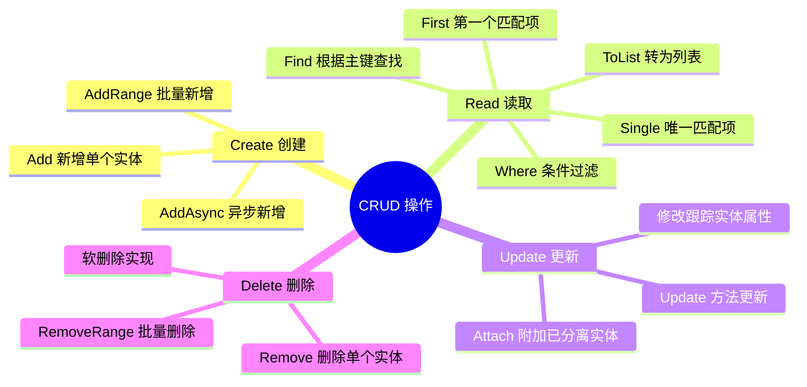
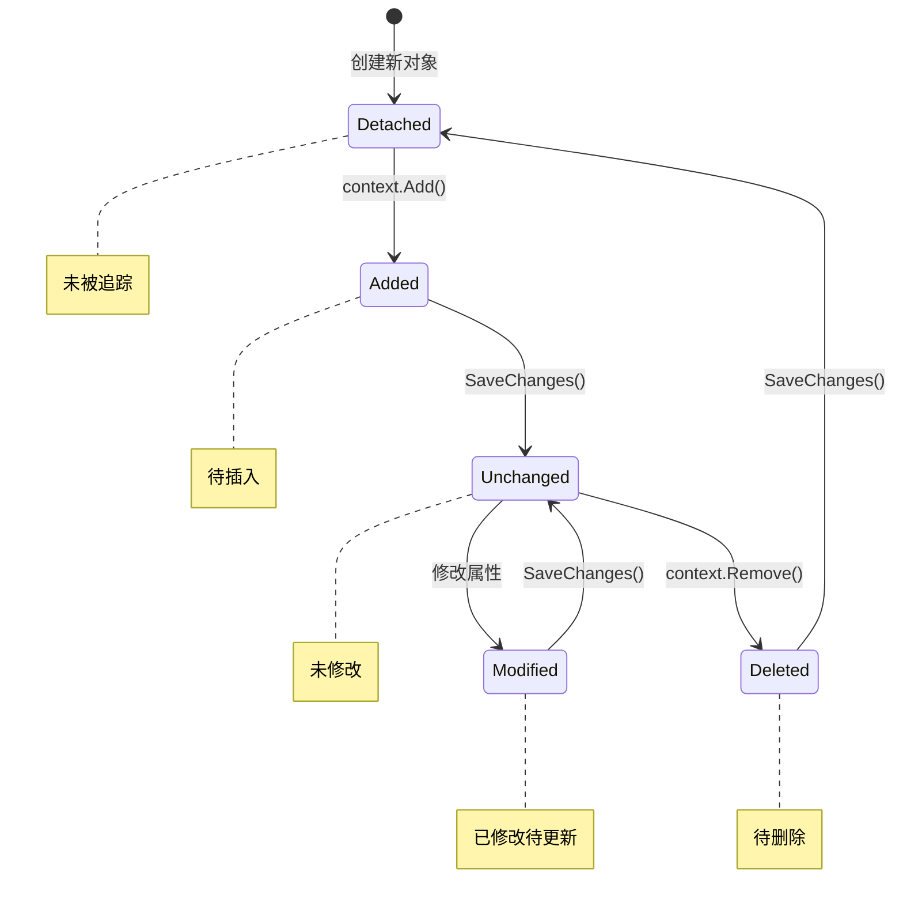
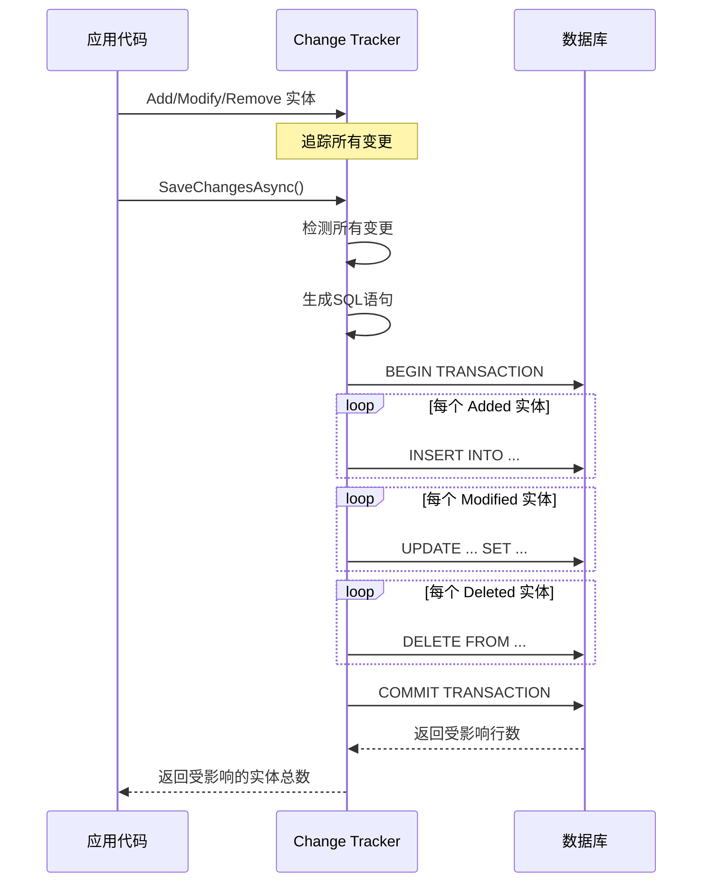
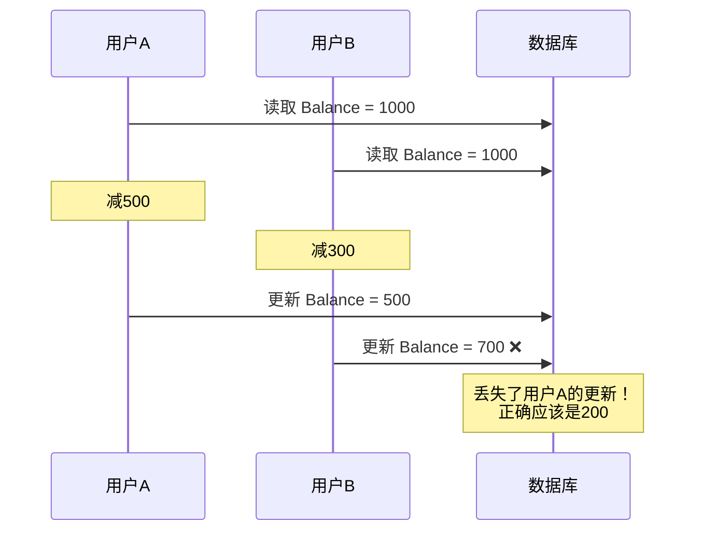

# CRUD操作 - 增删改查完整指南

> **学习目标**：全面掌握EF Core的增删改查操作，理解Change Tracker工作原理，学会性能优化技巧
> **前置知识**：DbContext配置、LINQ基础、async/await异步编程
> **预计时长**：65分钟

---

## 一、CRUD概述与核心概念

### 1.1 什么是CRUD？



### 1.2 CRUD与数据库SQL映射

| EF Core方法 | SQL操作 | 说明 |
|------------|---------|------|
| `Add()` | INSERT | 插入新记录 |
| `AddRange()` | 多条INSERT | 批量插入 |
| `Find()` | SELECT ... WHERE Id = @id | 主键查询 |
| `Where().ToList()` | SELECT ... WHERE | 条件查询 |
| `SaveChanges()` | INSERT/UPDATE/DELETE | 执行所有挂起的变更 |

### 1.3 生活化类比：Excel表格操作

把数据库表想象成一张**Excel工作表**：

- **Create（新增）**：在表格底部添加一行新数据
- **Read（查找）**：用筛选功能找到符合条件的数据行
- **Update（修改）**：直接编辑单元格的内容
- **Delete（删除）**：选中整行，按Delete键删除

**关键点**：EF Core让你用C#对象的方式操作这些"数据行"，而不需要写SQL。

---

## 二、Create（创建/新增）操作详解

### 2.1 Add - 新增单个实体

#### 基础用法

```csharp
// Services/UserService.cs
using Microsoft.EntityFrameworkCore;

public class UserService
{
    private readonly ApplicationDbContext _context;
    
    public UserService(ApplicationDbContext context)
    {
        _context = context;
    }
    
    /// <summary>
    /// 创建新用户 - 基础示例
    /// </summary>
    public async Task<UserDto> CreateUserAsync(CreateUserRequest request)
    {
        // 步骤1：创建实体对象（此时还在内存中）
        var user = new User
        {
            UserName = request.UserName,
            Email = request.Email,
            PasswordHash = HashPassword(request.Password), // 应该使用BCrypt等
            DisplayName = request.DisplayName ?? request.UserName,
            PhoneNumber = request.PhoneNumber,
            Role = UserRole.User,
            IsActive = true,
            CreatedAt = DateTime.UtcNow
        };
        
        // 步骤2：添加到DbContext（标记为Added状态）
        _context.Users.Add(user);
        // 或者使用：await _context.Users.AddAsync(user);
        
        // 步骤3：保存到数据库（生成并执行INSERT语句）
        await _context.SaveChangesAsync();
        
        // 此时user.Id已经被数据库赋值（自增主键）
        return MapToDto(user);
    }
    
    /// <summary>
    /// 创建用户 - 完整示例（包含验证和异常处理）
    /// </summary>
    public async Task<Result<UserDto>> CreateUserCompleteAsync(CreateUserRequest request)
    {
        // 验证1：检查邮箱是否已存在
        var existingUser = await _context.Users
            .AsNoTracking()
            .FirstOrDefaultAsync(u => u.Email == request.Email);
            
        if (existingUser != null)
        {
            return Result<UserDto>.Failure("该邮箱已被注册");
        }
        
        // 验证2：检查用户名是否已存在
        var existingUserName = await _context.Users
            .AsNoTracking()
            .FirstOrDefaultAsync(u => u.UserName == request.UserName);
            
        if (existingUserName != null)
        {
            return Result<UserDto>.Failure("该用户名已被使用");
        }
        
        try
        {
            // 创建实体
            var user = new User
            {
                UserName = request.UserName.Trim(),
                Email = request.Email.ToLowerInvariant(),
                PasswordHash = BCrypt.Net.BCrypt.HashPassword(request.Password),
                DisplayName = request.DisplayName?.Trim() ?? request.UserName,
                PhoneNumber = FormatPhoneNumber(request.PhoneNumber),
                Role = UserRole.User,
                IsActive = true,
                CreatedAt = DateTime.UtcNow
            };
            
            // 添加到上下文
            await _context.Users.AddAsync(user);
            
            // 保存更改
            await _context.SaveChangesAsync();
            
            // 记录日志（可选）
            Logger.LogInformation("用户创建成功: {UserId}, {Email}", user.Id, user.Email);
            
            return Result<UserDto>.Success(MapToDto(user));
        }
        catch (DbUpdateException ex) when (ex.InnerException is SqlException sqlEx 
                                              && sqlEx.Number == 2601) // 唯一约束冲突
        {
            return Result<UserDto>.Failure("数据冲突，请稍后重试");
        }
        catch (Exception ex)
        {
            Logger.LogError(ex, "创建用户失败: {Email}", request.Email);
            return Result<UserDto>.Failure("系统错误，请稍后重试");
        }
    }
}
```

### 2.2 AddRange - 批量新增

```csharp
/// <summary>
/// 批量导入产品示例
/// </summary>
public async Task BatchImportProductsAsync(List<ProductImportDto> products)
{
    // 将DTO转换为实体
    var entities = products.Select(p => new Product
    {
        Name = p.Name,
        Description = p.Description,
        Price = p.Price,
        CategoryId = p.CategoryId,
        IsActive = true,
        CreatedAt = DateTime.UtcNow,
        Sku = GenerateSku(p.Name, p.CategoryId)
    }).ToList();
    
    // 方式1：使用AddRange（推荐）
    _context.Products.AddRange(entities);
    
    // 方式2：循环Add（不推荐，性能差）
    // foreach (var product in entities)
    // {
    //     _context.Products.Add(product);
    // }
    
    // 保存（会批量生成INSERT语句）
    await _context.SaveChangesAsync();
}

/// <summary>
/// 分批导入大数据量（避免内存溢出）
/// </summary>
public async Task ImportLargeDatasetAsync(IEnumerable<ProductImportDto> allProducts, int batchSize = 1000)
{
    var batches = allProducts
        .Select((product, index) => new { product, index })
        .GroupBy(x => x.index / batchSize)
        .Select(g => g.Select(x => x.product).ToList());
    
    foreach (var batch in batches)
    {
        var entities = batch.Select(p => new Product { /* ... */ }).ToList();
        
        _context.Products.AddRange(entities);
        await _context.SaveChangesAsync(); // 每批单独保存
        
        // 清理Change Tracker以释放内存
        _context.ChangeTracker.Clear();
        
        Logger.LogInformation("已导入 {Count} 条记录", entities.Count);
    }
}
```

### 2.3 AddAsync vs Add 的区别

```csharp
// Add 和 AddAsync 的区别：

// ✅ Add - 同步方法，适用于大多数场景
_context.Users.Add(user);

// ✅ AddAsync - 异步方法，特殊场景需要：
// 1. 使用特殊的值分发器（如Azure Cosmos DB提供程序）
// 2. 需要在等待时释放线程（罕见情况）
await _context.Users.AddAsync(user);

// 实际上对于SQL Server等关系型数据库，Add和AddAsync几乎没有区别
// 因为真正的I/O操作发生在 SaveChangesAsync 时
// 但为了代码一致性，建议统一使用异步版本
```

---

## 三、Read（查询）操作详解

### 3.1 Find - 根据主键查询

```csharp
/// <summary>
/// FindAsync - 根据主键查找（最高效的单行查询！）
/// </summary>
public async Task<UserDto?> GetUserByIdAsync(int id)
{
    // FindAsync的特点：
    // 1. 首先在Change Tracker缓存中查找（如果之前加载过）
    // 2. 缓存未命中才去数据库查询
    // 3. 只能用于主键查询
    
    var user = await _context.Users.FindAsync(id);
    
    return user == null ? null : MapToDto(user);
}

/// <summary>
/// FindAsync 复合主键示例
/// </summary>
public async Task<OrderItem?> GetOrderItemAsync(int orderId, int productId)
{
    // 复合主键：传入主键值数组
    var item = await _context.OrderItems.FindAsync(orderId, productId);
    return item;
}

// 性能对比：
// 场景：先查询了user(1)，然后再次查询user(1)
var user1 = await _context.Users.FindAsync(1); // 查询数据库
var user2 = await _context.Users.FindAsync(1); // 从缓存返回！不查数据库
```

### 3.2 First / FirstOrDefault - 获取第一个匹配项

```csharp
/// <summary>
/// FirstOrDefaultAsync - 获取第一个或默认值（找不到返回null）
/// </summary>
public async Task<UserDto?> GetUserByEmailAsync(string email)
{
    var user = await _context.Users
        .AsNoTracking() // 不跟踪状态（只读场景推荐）
        .FirstOrDefaultAsync(u => u.Email == email.ToLowerInvariant());
    
    return user == null ? null : MapToDto(user);
}

/// <summary>
/// FirstAsync - 获取第一个（找不到抛异常）
/// </summary>
public async Task<CategoryDto> GetDefaultCategoryAsync()
{
    // 确定至少有一个分类存在
    var category = await _context.Categories
        .Where(c => c.IsActive)
        .OrderBy(c => c.SortOrder)
        .FirstAsync(); // 如果没有活跃分类，会抛InvalidOperationException
    
    return MapToDto(category);
}

// ❌ 错误用法：First在没有数据时会抛异常
try
{
    var result = await _context.Users.FirstAsync(u => u.Id == 99999); // 抛异常！
}
catch (InvalidOperationException ex)
{
    Console.WriteLine("序列不包含元素");
}

// ✅ 正确用法：FirstOrDefault安全地处理空结果
var result = await _context.Users.FirstOrDefaultAsync(u => u.Id == 99999); // 返回null
```

### 3.3 Single / SingleOrDefault - 获取唯一匹配项

```csharp
/// <summary>
/// SingleOrDefaultAsync - 获取唯一的或默认值
/// 适用场景：确保只有一条记录符合条件
/// </summary>
public async Task<UserDto?> GetUniqueAdminAsync(string email)
{
    // 如果有多个管理员有相同邮箱，Single会抛异常
    var admin = await _context.Users
        .SingleOrDefaultAsync(u => u.Email == email && u.Role == UserRole.Admin);
    
    return admin == null ? null : MapToDto(admin);
}

/// <summary>
/// SingleAsync - 获取唯一的（找不到或多于一个都抛异常）
/// </summary>
public async Task<SystemConfig> GetConfigByKeyAsync(string key)
{
    // 配置表的key应该是唯一的
    var config = await _context.SystemConfigs
        .SingleAsync(c => c.Key == key); // 0个或多个都会抛异常
    
    return config;
}

// ⚠️ 注意：Single比First多一次检查（确认只有一条），性能略低
// 只有在业务逻辑要求唯一性时才使用Single
```

### 3.4 Where + ToList - 条件查询列表

```csharp
/// <summary>
/// 基础条件查询
/// </summary>
public async Task<PagedResult<UserDto>> GetUsersAsync(UserQueryParameters parameters)
{
    IQueryable<User> query = _context.Users;
    
    // 动态过滤条件
    if (!string.IsNullOrWhiteSpace(parameters.Keyword))
    {
        query = query.Where(u => 
            u.UserName.Contains(parameters.Keyword) || 
            u.Email.Contains(parameters.Keyword) ||
            (u.DisplayName != null && u.DisplayName.Contains(parameters.Keyword)));
    }
    
    if (parameters.Role.HasValue)
    {
        query = query.Where(u => u.Role == parameters.Role.Value);
    }
    
    if (parameters.IsActive.HasValue)
    {
        query = query.Where(u => u.IsActive == parameters.IsActive.Value);
    }
    
    // 排序
    query = parameters.SortBy?.ToLower() switch
    {
        "name" => parameters.IsDescending 
            ? query.OrderByDescending(u => u.UserName) 
            : query.OrderBy(u => u.UserName),
        "email" => parameters.IsDescending 
            ? query.OrderByDescending(u => u.Email) 
            : query.OrderBy(u => u.Email),
        _ => query.OrderByDescending(u => u.CreatedAt) // 默认按创建时间降序
    };
    
    // 总数统计（分页需要）
    var totalCount = await query.CountAsync();
    
    // 分页
    var items = await query
        .Skip((parameters.Page - 1) * parameters.PageSize)
        .Take(parameters.PageSize)
        .AsNoTracking() // 只读查询不需要跟踪
        .Select(u => new UserDto // 投影到DTO（减少数据传输）
        {
            Id = u.Id,
            UserName = u.UserName,
            Email = u.Email,
            DisplayName = u.DisplayName,
            Role = u.Role,
            IsActive = u.IsActive,
            CreatedAt = u.CreatedAt
        })
        .ToListAsync();
    
    return new PagedResult<UserDto>
    {
        Items = items,
        TotalCount = totalCount,
        Page = parameters.Page,
        PageSize = parameters.PageSize,
        TotalPages = (int)Math.Ceiling((double)totalCount / parameters.PageSize)
    };
}

/// <summary>
/// 高级查询示例：复杂条件组合
/// </summary>
public async Task<List<BlogPostDto>> SearchPostsAdvancedAsync(PostSearchCriteria criteria)
{
    var query = _context.BlogPosts
        .Include(p => p.Author)     // 预加载作者
        .Include(p => p.Category)  // 预加载分类
        .AsNoTracking();
    
    // 关键词搜索（标题+内容）
    if (!string.IsNullOrWhiteSpace(criteria.Keyword))
    {
        query = query.Where(p => 
            p.Title.Contains(criteria.Keyword) || 
            p.Content.Contains(criteria.Keyword));
    }
    
    // 分类筛选
    if (criteria.CategoryIds?.Any() == true)
    {
        query = query.Where(p => criteria.CategoryIds.Contains(p.CategoryId ?? 0));
    }
    
    // 作者筛选
    if (criteria.AuthorIds?.Any() == true)
    {
        query = query.Where(p => criteria.AuthorIds.Contains(p.AuthorId));
    }
    
    // 状态筛选
    if (criteria.Status.HasValue)
    {
        query = query.Where(p => p.Status == criteria.Status.Value);
    }
    
    // 日期范围
    if (criteria.DateFrom.HasValue)
    {
        query = query.Where(p => p.CreatedAt >= criteria.DateFrom.Value);
    }
    
    if (criteria.DateTo.HasValue)
    {
        query = query.Where(p => p.CreatedAt <= criteria.DateTo.Value.AddDays(1));
    }
    
    // 浏览量范围
    if (criteria.MinViews.HasValue)
    {
        query = query.Where(p => p.ViewCount >= criteria.MinViews.Value);
    }
    
    // 排序（多字段排序）
    query = criteria.SortField?.ToLower() switch
    {
        "views" => criteria.IsDescending 
            ? query.OrderByDescending(p => p.ViewCount) 
            : query.OrderBy(p => p.ViewCount),
        "likes" => criteria.IsDescending 
            ? query.OrderByDescending(p => p.LikeCount) 
            : query.OrderBy(p => p.LikeCount),
        "title" => criteria.IsDescending 
            ? query.OrderByDescending(p => p.Title) 
            : query.OrderBy(p => p.Title),
        _ => query.OrderByDescending(p => p.CreatedAt) // 默认
    };
    
    // 分页
    var posts = await query
        .Skip((criteria.Page - 1) * criteria.PageSize)
        .Take(criteria.PageSize)
        .ToListAsync();
    
    return posts.Select(MapToDto).ToList();
}
```

### 3.5 Any / All / Count - 存在性和聚合查询

```csharp
/// <summary>
/// Any - 检查是否存在满足条件的记录（效率高！）
/// </summary>
public async Task<bool> IsEmailExistsAsync(string email)
{
    // ✅ 推荐：Any只返回true/false，不会加载数据
    return await _context.Users.AnyAsync(u => u.Email == email);
}

// ❌ 不推荐：Count需要统计所有符合条件的记录
// return await _context.Users.CountAsync(u => u.Email == email) > 0;

/// <summary>
/// All - 检查是否所有记录都满足条件
/// </summary>
public async Task<bool> AreAllPostsPublishedAsync(int authorId)
{
    return await _context.BlogPosts
        .Where(p => p.AuthorId == authorId)
        .AllAsync(p => p.Status == PostStatus.Published);
}

/// <summary>
/// Count / LongCount - 计数
/// </summary>
public async Task<DashboardStats> GetDashboardStatsAsync()
{
    return new DashboardStats
    {
        TotalUsers = await _context.Users.CountAsync(),
        ActiveUsers = await _context.Users.CountAsync(u => u.IsActive),
        TotalPosts = await _context.BlogPosts.CountAsync(),
        PublishedPosts = await _context.BlogPosts.CountAsync(p => p.Status == PostStatus.Published),
        DraftPosts = await _context.BlogPosts.CountAsync(p => p.Status == PostStatus.Draft),
        TotalComments = await _context.Comments.CountAsync(),
        PendingComments = await _context.Comments.CountAsync(c => !c.IsApproved),
        CategoriesCount = await _context.Categories.CountAsync(c => c.IsActive)
    };
}
```

---

## 四、Update（更新）操作详解

### 4.1 变更追踪更新（最常用）

```csharp
/// <summary>
/// 方式1：查询后修改（利用Change Tracker自动追踪）
/// 最常用、最直观的方式
/// </summary>
public async Task<UserDto> UpdateUserProfileAsync(int id, UpdateProfileRequest request)
{
    // 步骤1：从数据库查询实体（此时被Change Tracker追踪）
    var user = await _context.Users.FindAsync(id);
    
    if (user == null)
    {
        throw new NotFoundException("用户不存在");
    }
    
    // 步骤2：修改属性（Change Tracker自动检测到变化）
    user.DisplayName = request.DisplayName ?? user.DisplayName;
    user.PhoneNumber = request.PhoneNumber;
    user.AvatarUrl = request.AvatarUrl;
    user.Bio = request.Bio;
    user.UpdatedAt = DateTime.UtcNow; // OnModelCreating中可配置自动填充
    
    // 步骤3：保存（EF Core自动生成UPDATE SQL）
    await _context.SaveChangesAsync();
    
    return MapToDto(user);
}

/// <summary>
/// 更新文章示例（更复杂的场景）
/// </summary>
public async Task<PostDto> UpdatePostAsync(int id, UpdatePostRequest request)
{
    var post = await _context.BlogPosts
        .Include(p => p.Tags) // 加载关联的标签
        .FirstOrDefaultAsync(p => p.Id == id);
    
    if (post == null)
    {
        throw new NotFoundException("文章不存在");
    }
    
    // 更新基本字段
    post.Title = request.Title;
    post.Content = request.Content;
    post.Summary = request.Summary;
    post.CategoryId = request.CategoryId;
    post.UpdatedAt = DateTime.UtcNow;
    
    // 如果状态改为已发布，设置发布时间
    if (request.Status == PostStatus.Published && post.PublishedAt == null)
    {
        post.PublishedAt = DateTime.UtcNow;
    }
    
    post.Status = request.Status;
    
    // 更新标签（多对多关系）
    await UpdatePostTagsAsync(post, request.TagIds);
    
    await _context.SaveChangesAsync();
    
    return MapToDto(post);
}

private async Task UpdatePostTagsAsync(BlogPost post, List<int>? tagIds)
{
    if (tagIds == null) return;
    
    // 获取当前标签ID
    var currentTagIds = post.PostTags.Select(pt => pt.TagId).ToList();
    
    // 需要移除的标签
    var tagsToRemove = post.PostTags
        .Where(pt => !tagIds.Contains(pt.TagId))
        .ToList();
    foreach (var tag in tagsToRemove)
    {
        post.PostTags.Remove(tag);
    }
    
    // 需要添加的标签
    var tagsToAdd = tagIds.Except(currentTagIds).ToList();
    foreach (var tagId in tagsToAdd)
    {
        post.PostTags.Add(new PostTag { TagId = tagId });
    }
}
```

### 4.2 Attach - 附加已分离实体

```csharp
/// <summary>
/// 方式2：Attach方式（适用于从外部获取的实体）
/// 当你有一个不在DbContext中的对象，想用它来更新数据库
/// </summary>
public async Task UpdateProductFromExternalAsync(ProductDto dto)
{
    // 这个dto来自API调用或其他来源，不在DbContext中
    
    var product = new Product
    {
        Id = dto.Id,           // 必须设置主键
        Name = dto.Name,
        Price = dto.Price,
        Description = dto.Description,
        CategoryId = dto.CategoryId
    };
    
    // Attach将实体附加到上下文，标记为Unchanged
    _context.Attach(product);
    
    // 然后标记特定属性为Modified
    _context.Entry(product).Property(p => p.Name).IsModified = true;
    _context.Entry(product).Property(p => p.Price).IsModified = true;
    _context.Entry(product).Property(p => p.Description).IsModified = true;
    _context.Entry(product).Property(p => p.CategoryId).IsModified = true;
    
    // SaveChanges只会更新被标记为Modified的字段
    await _context.SaveChangesAsync();
}

/// <summary>
/// Attach方式的变体：使用Entry.State
/// </summary>
public async Task UpdateUserSimpleAsync(UserDto dto)
{
    var user = new User
    {
        Id = dto.Id,
        UserName = dto.UserName,
        Email = dto.Email,
        DisplayName = dto.DisplayName
    };
    
    // 附加并标记整个实体为Modified
    _context.Attach(user);
    _context.Entry(user).State = EntityState.Modified;
    
    // ⚠️ 这会更新所有字段！包括可能不应该更新的字段
    await _context.SaveChangesAsync();
}
```

### 4.3 Update方法（EF Core 7+）

```csharp
/// <summary>
/// 方式3：使用Update方法（EF Core 7+ 新增）
/// 简化Attach + Modified的操作
/// </summary>
public async Task UpdateCategoryAsync(CategoryDto dto)
{
    var category = new Category
    {
        Id = dto.Id,
        Name = dto.Name,
        Slug = dto.Slug.GenerateSlug(),
        Description = dto.Description,
        SortOrder = dto.SortOrder,
        IsActive = dto.IsActive
    };
    
    // Update方法等同于 Attach + State = Modified
    _context.Categories.Update(category);
    
    await _context.SaveChangesAsync();
}

/// <summary>
/// Update方法的注意事项
/// </summary>
public void DemonstrateUpdateMethodBehavior()
{
    var product = new Product { Id = 1, Name = "新产品名" };
    
    _context.Products.Update(product);
    
    // 生成的SQL：
    // UPDATE Products SET Name = @p0 WHERE Id = @p1
    // 但其他字段会被设置为什么？
    // - 引用类型字段 → NULL
    // - 值类型字段 → default值（0, false等）
    // - 这可能导致意外清空数据！
}
```

### 4.4 三种更新方式对比

| 特性 | **查询后修改** | **Attach** | **Update方法** |
|------|---------------|-----------|----------------|
| **数据库查询次数** | 1次SELECT + 1次UPDATE | 0次额外查询 | 0次额外查询 |
| **适用场景** | 需要原值参与逻辑 | 外部传入完整对象 | 完整对象替换 |
| **安全性** | ✅ 安全（基于原值修改） | ⚠️ 可能覆盖不应改的字段 | ⚠️ 会重置未设置的字段 |
| **灵活性** | ✅ 可选择性更新部分字段 | ✅ 可指定哪些字段修改 | ❌ 更新所有字段 |
| **并发控制** | ✅ 支持乐观并发 | ⚠️ 需要手动处理 | ⚠️ 需要手动处理 |
| **推荐度** | ⭐⭐⭐⭐⭐ | ⭐⭐⭐ | ⭐⭐ |

**强烈推荐使用"查询后修改"方式**，除非有明确的性能需求。

---

## 五、Delete（删除）操作详解

### 5.1 Remove - 删除单个实体

```csharp
/// <summary>
/// 基础删除操作
/// </summary>
public async Task DeleteUserAsync(int id)
{
    // 步骤1：查询实体
    var user = await _context.Users.FindAsync(id);
    
    if (user == null)
    {
        throw new NotFoundException("用户不存在");
    }
    
    // 步骤2：标记为Deleted
    _context.Users.Remove(user);
    
    // 步骤3：执行删除
    await _context.SaveChangesAsync();
}

/// <summary>
/// 删除前检查关联数据
/// </summary>
public async Task DeleteCategoryAsync(int id)
{
    var category = await _context.Categories
        .Include(c => c.Posts)   // 检查是否有文章
        .Include(c => c.Children)// 检查是否有子分类
        .FirstOrDefaultAsync(c => c.Id == id);
    
    if (category == null)
    {
        throw new NotFoundException("分类不存在");
    }
    
    // 业务规则检查
    if (category.Posts.Any())
    {
        throw new BusinessException("该分类下还有文章，无法删除。请先移动或删除文章。");
    }
    
    if (category.Children.Any())
    {
        throw new BusinessException("该分类下还有子分类，无法删除。请先删除子分类。");
    }
    
    _context.Categories.Remove(category);
    await _context.SaveChangesAsync();
}
```

### 5.2 RemoveRange - 批量删除

```csharp
/// <summary>
/// 批量删除示例
/// </summary>
public async Task DeleteOldLogsAsync(DateTime cutoffDate)
{
    // 查询要删除的记录
    var oldLogs = await _context.RequestLogs
        .Where(l => l.Timestamp < cutoffDate)
        .Take(10000) // 限制每次删除数量
        .ToListAsync();
    
    if (oldLogs.Any())
    {
        _context.RequestLogs.RemoveRange(oldLogs);
        await _context.SaveChangesAsync();
    }
}

/// <summary>
/// 根据ID列表批量删除
/// </summary>
public async Task DeleteCommentsByIdsAsync(List<int> commentIds)
{
    if (!commentIds.Any()) return;
    
    var comments = await _context.Comments
        .Where(c => commentIds.Contains(c.Id))
        .ToListAsync();
    
    _context.Comments.RemoveRange(comments);
    await _context.SaveChangesAsync();
}
```

### 5.3 软删除实现（重要！）

```csharp
/// <summary>
/// 软删除 - 不真正删除数据，只是标记为已删除
/// 生产环境强烈推荐！
/// </summary>

// 1. 定义软删除接口
public interface ISoftDeletable
{
    bool IsDeleted { get; set; }
    DateTime? DeletedAt { get; set; }
}

// 2. 实体类实现接口
public class User : ISoftDeletable
{
    public int Id { get; set; }
    public string UserName { get; set; }
    // ...其他字段...
    
    public bool IsDeleted { get; set; } = false;
    public DateTime? DeletedAt { get; set; }
}

// 3. 在OnModelCreating中配置全局过滤器
protected override void OnModelCreating(ModelBuilder modelBuilder)
{
    base.OnModelCreating(modelBuilder);
    
    // 为所有ISoftDeletable实体添加全局查询过滤器
    modelBuilder.Entity<ISoftDeletable>().HasQueryFilter(e => !e.IsDeleted);
    
    // 这样所有查询都会自动排除已删除的记录！
}

// 4. 重写SaveChanges实现软删除
public class ApplicationDbContext : DbContext
{
    public override int SaveChanges()
    {
        ApplySoftDelete();
        return base.SaveChanges();
    }
    
    public override async Task<int> SaveChangesAsync(CancellationToken cancellationToken = default)
    {
        ApplySoftDelete();
        return await base.SaveChangesAsync(cancellationToken);
    }
    
    private void ApplySoftDelete()
    {
        var entries = ChangeTracker.Entries<ISoftDeletable>()
            .Where(e => e.State == EntityState.Deleted);
        
        foreach (var entry in entries)
        {
            entry.State = EntityState.Modified;       // 改为Modified而不是Deleted
            entry.Entity.IsDeleted = true;             // 标记为已删除
            entry.Entity.DeletedAt = DateTime.UtcNow;  // 记录删除时间
        }
    }
}

// 5. 使用软删除
public async Task SoftDeleteUserAsync(int id)
{
    var user = await _context.Users.FindAsync(id);
    if (user == null) throw new NotFoundException("用户不存在");
    
    // 虽然调用Remove，但实际会变成软删除
    _context.Users.Remove(user);
    await _context.SaveChangesAsync();
    
    // 生成的SQL是：UPDATE Users SET IsDeleted = 1, DeletedAt = GETUTCDATE() WHERE Id = @id
    // 而不是：DELETE FROM Users WHERE Id = @id
}

// 6. 如需查询已删除的数据（如回收站功能）
public async Task<List<UserDto>> GetDeletedUsersAsync()
{
    // 使用IgnoreQueryFilters忽略全局过滤器
    var deletedUsers = await _context.Users
        .IgnoreQueryFilters()  // 关键！临时禁用过滤器
        .Where(u => u.IsDeleted)
        .AsNoTracking()
        .ToListAsync();
    
    return deletedUsers.Select(MapToDto).ToList();
}

// 7. 恢复已删除的数据
public async Task RestoreUserAsync(int id)
{
    var user = await _context.Users
        .IgnoreQueryFilters()
        .FirstOrDefaultAsync(u => u.Id == id && u.IsDeleted);
    
    if (user == null) throw new NotFoundException("未找到已删除的用户");
    
    user.IsDeleted = false;
    user.DeletedAt = null;
    
    await _context.SaveChangesAsync();
}
```

### 5.4 ExecuteDelete / ExecuteUpdate（EF Core 7+）

```csharp
/// <summary>
/// EF Core 7+ 新增：直接执行DELETE/UPDATE（不加载实体到内存）
/// 适用于批量操作，性能极高！
/// </summary>

// 传统方式（加载到内存再删除）
public async Task TraditionalDeleteAsync(int categoryId)
{
    var posts = await _context.BlogPosts
        .Where(p => p.CategoryId == categoryId)
        .ToListAsync(); // 先查出所有记录
    
    _context.BlogPosts.RemoveRange(posts); // 在内存中标记
    await _context.SaveChangesAsync();      // 逐条发送DELETE
}

// 新方式（直接在数据库端执行）
public async Task ModernDeleteAsync(int categoryId)
{
    // 直接生成：DELETE FROM BlogPosts WHERE CategoryId = @categoryId
    // 不需要加载任何数据到应用内存！
    var affectedRows = await _context.BlogPosts
        .Where(p => p.CategoryId == categoryId)
        .ExecuteDeleteAsync();
    
    Console.WriteLine($"删除了 {affectedRows} 条记录");
}

// ExecuteUpdate示例
public async Task PublishAllDraftsAsync(int authorId)
{
    var affectedRows = await _context.BlogPosts
        .Where(p => p.AuthorId == authorId && p.Status == PostStatus.Draft)
        .ExecuteUpdateAsync(setters => setters
            .SetProperty(p => p.Status, PostStatus.Published)
            .SetProperty(p => p.PublishedAt, DateTime.UtcNow)
            .SetProperty(p => p.UpdatedAt, DateTime.UtcNow));
    
    Console.WriteLine($"发布了 {affectedRows} 篇草稿");
}
```

---

## 六、Change Tracker（变更追踪器）工作原理

### 6.1 什么是Change Tracker？



### 6.2 实体状态详解

```csharp
public class ChangeTrackerDemo
{
    private readonly ApplicationDbContext _context;
    
    public async Task DemonstrateStatesAsync()
    {
        // ====== Detached（分离状态）======
        // 对象未被DbContext追踪
        var newUser = new User { UserName = "test" }; // Detached
        
        // ====== Added（已添加状态）======
        _context.Users.Add(newUser);                  // 现在是Added
        var state1 = _context.Entry(newUser).State;   // EntityState.Added
        
        await _context.SaveChangesAsync();             // 执行INSERT
        
        // ====== Unchanged（未改变状态）======
        // SaveChanges后变为Unchanged
        var state2 = _context.Entry(newUser).State;   // EntityState.Unchanged
        
        // ====== Modified（已修改状态）======
        newUser.DisplayName = "新名称";               // 修改属性
        var state3 = _context.Entry(newUser).State;   // EntityState.Modified
        
        await _context.SaveChangesAsync();             // 执行UPDATE
        
        // ====== Deleted（已删除状态）======
        _context.Users.Remove(newUser);                // 现在是Deleted
        var state4 = _context.Entry(newUser).State;   // EntityState.Deleted
        
        await _context.SaveChangesAsync();             // 执行DELETE
    }
}
```

### 6.3 查看Change Tracker中的信息

```csharp
/// <summary>
/// 调试工具：查看Change Tracker的状态
/// </summary>
public void DebugChangeTracker()
{
    var changeTracker = _context.ChangeTracker;
    
    Console.WriteLine($"正在追踪的实体总数: {changeTracker.Entries().Count()}");
    
    foreach (var entry in changeTracker.Entries())
    {
        Console.WriteLine($"\n实体: {entry.Entity.GetType().Name}");
        Console.WriteLine($"状态: {entry.State}");
        Console.WriteLine($"主键值: {entry.PrimaryKey()?.Values.FirstOrDefault()}");
        
        if (entry.State == EntityState.Modified)
        {
            Console.WriteLine("修改的属性:");
            foreach (var prop in entry.Properties.Where(p => p.IsModified))
            {
                Console.WriteLine($"  {prop.Metadata.Name}: {prop.OriginalValue} → {prop.CurrentValue}");
            }
        }
    }
}

/// <summary>
/// 清理Change Tracker（释放内存）
/// </summary>
public void ClearChangeTracker()
{
    // 在大批量操作后调用，释放被追踪的实体占用的内存
    _context.ChangeTracker.Clear();
    
    // 或者只清除特定类型的实体
    // var entries = _context.ChangeTracker.Entries<User>().ToList();
    // foreach (var entry in entries)
    // {
    //     entry.State = EntityState.Detached;
    // }
}
```

---

## 七、SaveChanges / SaveChangesAsync 保存数据

### 7.1 工作机制



### 7.2 重写SaveChanges添加通用逻辑

```csharp
public class ApplicationDbContext : DbContext
{
    private readonly IUserContext _userContext; // 当前用户上下文
    
    public ApplicationDbContext(
        DbContextOptions<ApplicationDbContext> options,
        IUserContext userContext) : base(options)
    {
        _userContext = userContext;
    }

    public override async Task<int> SaveChangesAsync(CancellationToken cancellationToken = default)
    {
        // 1. 自动填充审计字段
        SetAuditFields();
        
        // 2. 处理软删除
        HandleSoftDelete();
        
        // 3. 并发控制验证（可选）
        ValidateConcurrency();
        
        // 4. 执行保存
        try
        {
            var result = await base.SaveChangesAsync(cancellationToken);
            
            // 5. 保存成功后的清理工作
            OnSavedSuccessfully();
            
            return result;
        }
        catch (DbUpdateConcurrencyException ex)
        {
            // 处理并发冲突
            HandleConcurrencyException(ex);
            throw;
        }
        catch (DbUpdateException ex)
        {
            // 处理数据库异常（唯一约束、外键约束等）
            HandleDatabaseException(ex);
            throw;
        }
    }
    
    private void SetAuditFields()
    {
        var now = DateTime.UtcNow;
        var currentUserId = _userContext.UserId;
        
        foreach (var entry in ChangeTracker.Entries<BaseEntity>())
        {
            switch (entry.State)
            {
                case EntityState.Added:
                    entry.Entity.CreatedAt = now;
                    entry.Entity.CreatedBy = currentUserId;
                    entry.Entity.UpdatedAt = now;
                    entry.Entity.UpdatedBy = currentUserId;
                    break;
                    
                case EntityState.Modified:
                    entry.Entity.UpdatedAt = now;
                    entry.Entity.UpdatedBy = currentUserId;
                    
                    // 防止修改CreatedAt和CreatedBy
                    entry.Property(e => e.CreatedAt).IsModified = false;
                    entry.Property(e => e.CreatedBy).IsModified = false;
                    break;
            }
        }
    }
    
    private void HandleSoftDelete()
    {
        foreach (var entry in ChangeTracker.Entries<ISoftDeletable>()
            .Where(e => e.State == EntityState.Deleted))
        {
            entry.State = EntityState.Modified;
            entry.Entity.IsDeleted = true;
            entry.Entity.DeletedAt = DateTime.UtcNow;
            entry.Entity.DeletedBy = _userContext.UserId;
        }
    }
    
    private void ValidateConcurrency()
    {
        // 检查RowVersion/Timestamp字段的并发冲突
        foreach (var entry in ChangeTracker.Entries()
            .Where(e => e.State == EntityState.Modified))
        {
            var versionProp = entry.Properties
                .FirstOrDefault(p => p.Metadata.IsConcurrencyToken);
                
            if (versionProp != null && versionProp.IsModified)
            {
                // 可以在这里添加自定义并发验证逻辑
            }
        }
    }
    
    private void OnSavedSuccessfully()
    {
        // 发布领域事件（可选）
        // var domainEvents = ChangeTracker.Entries<Entity>()
        //     .SelectMany(e => ((Entity)e.Entity).DomainEvents)
        //     .ToList();
        // // 清空事件
        // foreach (var entry in ChangeTracker.Entries<Entity>())
        // {
        //     ((Entity)entry.Entity).ClearDomainEvents();
        // }
    }
}
```

### 7.3 SaveChanges返回值的意义

```csharp
public async Task DemoSaveChangesReturn()
{
    // 添加3个用户
    _context.Users.AddRange(new[] { user1, user2, user3 });
    
    // 修改1个用户
    existingUser.DisplayName = "新名称";
    
    // 删除1个用户
    _context.Users.Remove(userToDelete);
    
    // SaveChanges返回的是受影响的实体总数
    int affectedEntities = await _context.SaveChangesAsync();
    
    // affectedEntities = 5 (3 insert + 1 update + 1 delete)
    // 注意：不是受影响的行数！如果有级联删除，实际数据库行数可能更多
    
    Console.WriteLine($"本次操作影响了 {affectedEntities} 个实体");
}
```

---

## 八、事务处理（Transaction）

### 8.1 显式事务

```csharp
/// <summary>
/// 使用事务确保多个操作的原子性
/// 典型场景：转账、订单处理等
/// </summary>
public async Task TransferMoneyAsync(int fromAccountId, int toAccountId, decimal amount)
{
    using var transaction = await _context.Database.BeginTransactionAsync();
    
    try
    {
        // 1. 查询转出账户
        var fromAccount = await _context.Accounts
            .FirstOrDefaultAsync(a => a.Id == fromAccount);
            
        if (fromAccount == null)
            throw new NotFoundException("转出账户不存在");
        if (fromAccount.Balance < amount)
            throw new InsufficientFundsException("余额不足");
        
        // 2. 查询转入账户
        var toAccount = await _context.Accounts
            .FirstOrDefaultAsync(a => a.Id == toAccountId);
            
        if (toAccount == null)
            throw new NotFoundException("转入账户不存在");
        
        // 3. 执行转账操作
        fromAccount.Balance -= amount;
        toAccount.Balance += amount;
        
        // 4. 记录交易流水
        _context.Transactions.Add(new Transaction
        {
            FromAccountId = fromAccountId,
            ToAccountId = toAccountId,
            Amount = amount,
            Type = TransactionType.Transfer,
            CreatedAt = DateTime.UtcNow
        });
        
        // 5. 保存所有更改
        await _context.SaveChangesAsync();
        
        // 6. 提交事务
        await transaction.CommitAsync();
        
        Logger.LogInformation("转账成功: 从{From}转到{To}, 金额{Amount}", 
            fromAccountId, toAccountId, amount);
    }
    catch (Exception)
    {
        // 发生异常，回滚事务
        await transaction.RollbackAsync();
        Logger.LogError("转账失败，已回滚");
        throw; // 重新抛出异常让上层处理
    }
}

/// <summary>
/// 创建订单的完整事务示例
/// </summary>
public async Task<OrderDto> CreateOrderAsync(CreateOrderRequest request)
{
    using var transaction = await _context.Database.BeginTransactionAsync(IsolationLevel.Serializable);
    
    try
    {
        // 1. 锁定库存（防止超卖）
        var orderItems = new List<OrderItem>();
        
        foreach (var item in request.Items)
        {
            var product = await _context.Products
                .FirstOrDefaultAsync(p => p.Id == item.ProductId);
                
            if (product == null)
                throw new NotFoundException($"商品 {item.ProductId} 不存在");
            if (product.Stock < item.Quantity)
                throw new BusinessException($"商品 {product.Name} 库存不足");
            
            // 扣减库存
            product.Stock -= item.Quantity;
            
            orderItems.Add(new OrderItem
            {
                ProductId = item.ProductId,
                Quantity = item.Quantity,
                UnitPrice = product.Price,
                TotalPrice = product.Price * item.Quantity
            });
        }
        
        // 2. 创建订单
        var order = new Order
        {
            UserId = request.UserId,
            Status = OrderStatus.PendingPayment,
            TotalAmount = orderItems.Sum(i => i.TotalPrice),
            Items = orderItems,
            CreatedAt = DateTime.UtcNow
        };
        
        _context.Orders.Add(order);
        
        // 3. 保存
        await _context.SaveChangesAsync();
        
        // 4. 提交事务
        await transaction.CommitAsync();
        
        return MapToOrderDto(order);
    }
    catch
    {
        await transaction.RollbackAsync();
        throw;
    }
}
```

### 8.2 SaveChanges自带的事务

```csharp
/// <summary>
/// 注意：单次SaveChanges调用本身就在隐式事务中
/// 只有跨多次SaveChanges或需要特定隔离级别时才需要显式事务
/// </summary>
public async Task SimpleOperationAsync()
{
    // 这个操作本身就是事务性的（单次SaveChanges）
    _context.Users.Add(newUser);
    _context.Orders.Add(newOrder);
    
    // 所有变更在一次事务中提交
    // 如果任何一个失败，全部回滚
    await _context.SaveChangesAsync();
}
```

---

## 九、并发控制初步

### 9.1 什么是并发问题？



### 9.2 乐观并发控制（推荐）

```csharp
// 1. 在实体中定义并发令牌
public class Product
{
    public int Id { get; set; }
    public string Name { get; set; }
    public decimal Price { get; set; }
    public int Stock { get; set; }
    
    [Timestamp] // 或 [ConcurrencyCheck]
    public byte[] RowVersion { get; set; } = null!;
}

// 2. 在Fluent API中配置
modelBuilder.Entity<Product>(entity =>
{
    entity.Property(p => p.RowVersion)
        .IsRowVersion()
        .IsConcurrencyToken();
});

// 3. 处理并发冲突
public async Task UpdateProductWithConcurrencyAsync(int id, UpdateProductDto dto)
{
    var retryCount = 0;
    const int maxRetries = 3;
    
    while (retryCount < maxRetries)
    {
        try
        {
            var product = await _context.Products.FindAsync(id);
            
            if (product == null)
                throw new NotFoundException("产品不存在");
            
            product.Name = dto.Name;
            product.Price = dto.Price;
            product.Stock = dto.Stock;
            
            await _context.SaveChangesAsync();
            return; // 成功
        }
        catch (DbUpdateConcurrencyException ex)
        {
            retryCount++;
            
            if (retryCount >= maxRetries)
                throw new ConflictException("数据已被其他人修改，请刷新后重试");
            
            // 解决冲突策略：选择数据库值或合并
            var entry = ex.Entries.Single();
            var databaseValues = await entry.GetDatabaseValuesAsync();
            var clientValues = entry.CurrentValues;
            
            // 策略1：强制覆盖（使用客户端值）
            // entry.OriginalValues.SetValues(databaseValues);
            // entry.CurrentValues.SetValues(clientValues);
            
            // 策略2：放弃更新（使用数据库值）
            // throw new ConflictException("数据已被修改");
            
            // 策略3：智能合并（根据业务逻辑）
            var databaseProduct = (Product)databaseValues.ToObject();
            var clientProduct = (Product)clientValues.ToObject();
            
            // 示例：库存取最小值，价格取最新修改的
            entry.CurrentValues[nameof(Product.Stock)] = Math.Min(
                databaseProduct.Stock, 
                clientProduct.Stock
            );
            
            // 重试
            await Task.Delay(100 * retryCount);
        }
    }
}
```

---

## 十、完整的CRUD服务层封装示例

### 10.1 Repository模式封装

```csharp
// Repositories/IRepository.cs
public interface IRepository<T> where T : class
{
    Task<T?> GetByIdAsync(int id);
    Task<T?> GetByIdAsyncAsNoTracking(int id);
    Task<IEnumerable<T>> GetAllAsync();
    Task<IEnumerable<T>> FindAsync(Expression<Func<T, bool>> predicate);
    Task<PagedResult<T>> GetPagedAsync(int page, int pageSize, Expression<Func<T, object>>? orderBy = null, bool descending = true);
    Task<T> AddAsync(T entity);
    Task<IEnumerable<T>> AddRangeAsync(IEnumerable<T> entities);
    void Update(T entity);
    void Remove(T entity);
    void RemoveRange(IEnumerable<T> entities);
    Task<bool> ExistsAsync(int id);
    Task<int> CountAsync(Expression<Func<T, bool>>? predicate = null);
}

// Repositories/Repository.cs
public class Repository<T> : IRepository<T> where T : class
{
    protected readonly ApplicationDbContext _context;
    protected readonly DbSet<T> _dbSet;
    
    public Repository(ApplicationDbContext context)
    {
        _context = context;
        _dbSet = context.Set<T>();
    }
    
    public virtual async Task<T?> GetByIdAsync(int id)
    {
        return await _dbSet.FindAsync(id);
    }
    
    public virtual async Task<T?> GetByIdAsyncAsNoTracking(int id)
    {
        return await _dbSet.AsNoTracking().FirstOrDefaultAsync(e => EF.Property<int>(e, "Id") == id);
    }
    
    public virtual async Task<IEnumerable<T>> GetAllAsync()
    {
        return await _dbSet.ToListAsync();
    }
    
    public virtual async Task<IEnumerable<T>> FindAsync(Expression<Func<T, bool>> predicate)
    {
        return await _dbSet.Where(predicate).ToListAsync();
    }
    
    public virtual async Task<PagedResult<T>> GetPagedAsync(
        int page, 
        int pageSize, 
        Expression<Func<T, object>>? orderBy = null, 
        bool descending = true)
    {
        IQueryable<T> query = _dbSet;
        
        var totalCount = await query.CountAsync();
        
        if (orderBy != null)
        {
            query = descending 
                ? query.OrderByDescending(orderBy) 
                : query.OrderBy(orderBy);
        }
        
        var items = await query
            .Skip((page - 1) * pageSize)
            .Take(pageSize)
            .ToListAsync();
        
        return new PagedResult<T>
        {
            Items = items,
            TotalCount = totalCount,
            Page = page,
            PageSize = pageSize,
            TotalPages = (int)Math.Ceiling((double)totalCount / pageSize)
        };
    }
    
    public virtual async Task<T> AddAsync(T entity)
    {
        await _dbSet.AddAsync(entity);
        return entity;
    }
    
    public virtual async Task<IEnumerable<T>> AddRangeAsync(IEnumerable<T> entities)
    {
        await _dbSet.AddRangeAsync(entities);
        return entities;
    }
    
    public virtual void Update(T entity)
    {
        _dbSet.Update(entity);
    }
    
    public virtual void Remove(T entity)
    {
        _dbSet.Remove(entity);
    }
    
    public virtual void RemoveRange(IEnumerable<T> entities)
    {
        _dbSet.RemoveRange(entities);
    }
    
    public virtual async Task<bool> ExistsAsync(int id)
    {
        return await _dbSet.AnyAsync(e => EF.Property<int>(e, "Id") == id);
    }
    
    public virtual async Task<int> CountAsync(Expression<Func<T, bool>>? predicate = null)
    {
        return predicate == null 
            ? await _dbSet.CountAsync() 
            : await _dbSet.CountAsync(predicate);
    }
}
```

### 10.2 Unit of Work模式

```csharp
// Repositories/IUnitOfWork.cs
public interface IUnitOfWork : IDisposable
{
    IRepository<User> Users { get; }
    IRepository<BlogPost> BlogPosts { get; }
    IRepository<Category> Categories { get; }
    IRepository<Comment> Comments { get; }
    Task<int> SaveChangesAsync();
    Task BeginTransactionAsync();
    Task CommitTransactionAsync();
    Task RollbackTransactionAsync();
}

// Repositories/UnitOfWork.cs
public class UnitOfWork : IUnitOfWork
{
    private readonly ApplicationDbContext _context;
    private IDbContextTransaction? _transaction;
    private bool _disposed = false;
    
    public UnitOfWork(ApplicationDbContext context)
    {
        _context = context;
    }
    
    private IRepository<User>? _users;
    private IRepository<BlogPost>? _blogPosts;
    private IRepository<Category>? _categories;
    private IRepository<Comment>? _comments;
    
    public IRepository<User> Users => _users ??= new Repository<User>(_context);
    public IRepository<BlogPost> BlogPosts => _blogPosts ??= new Repository<BlogPost>(_context);
    public IRepository<Category> Categories => _categories ??= new Repository<Category>(_context);
    public IRepository<Comment> Comments => _comments ??= new Repository<Comment>(_context);
    
    public async Task<int> SaveChangesAsync()
    {
        return await _context.SaveChangesAsync();
    }
    
    public async Task BeginTransactionAsync()
    {
        _transaction = await _context.Database.BeginTransactionAsync();
    }
    
    public async Task CommitTransactionAsync()
    {
        try
        {
            await _context.SaveChangesAsync();
            await _transaction?.CommitAsync()!;
        }
        finally
        {
            await _transaction?.DisposeAsync()!;
            _transaction = null;
        }
    }
    
    public async Task RollbackTransactionAsync()
    {
        try
        {
            await _transaction?.RollbackAsync()!;
        }
        finally
        {
            await _transaction?.DisposeAsync()!;
            _transaction = null;
        }
    }
    
    public void Dispose()
    {
        Dispose(true);
        GC.SuppressFinalize(this);
    }
    
    protected virtual void Dispose(bool disposing)
    {
        if (!_disposed)
        {
            if (disposing)
            {
                _transaction?.Dispose();
                _context.Dispose();
            }
            _disposed = true;
        }
    }
}
```

### 10.3 使用示例：完整的Service层

```csharp
// Services/BlogPostService.cs
public class BlogPostService : IBlogPostService
{
    private readonly IUnitOfWork _unitOfWork;
    private readonly ILogger<BlogPostService> _logger;
    
    public BlogPostService(IUnitOfWork unitOfWork, ILogger<BlogPostService> logger)
    {
        _unitOfWork = unitOfWork;
        _logger = logger;
    }
    
    public async Task<PagedResult<BlogPostDto>> GetPostsAsync(PostQueryParams queryParams)
    {
        IQueryable<BlogPost> query = _unitOfWork.BlogPosts.GetQueryable(); // 需要扩展Repository
        
        // 过滤条件
        if (!string.IsNullOrEmpty(queryParams.Keyword))
        {
            query = query.Where(p => p.Title.Contains(queryParams.Keyword));
        }
        
        if (queryParams.CategoryId.HasValue)
        {
            query = query.Where(p => p.CategoryId == queryParams.CategoryId);
        }
        
        if (queryParams.Status.HasValue)
        {
            query = query.Where(p => p.Status == queryParams.Status.Value);
        }
        
        // 排序
        query = queryParams.SortBy?.ToLower() switch
        {
            "views" => queryParams.Descending 
                ? query.OrderByDescending(p => p.ViewCount) 
                : query.OrderBy(p => p.ViewCount),
            "title" => queryParams.Descending 
                ? query.OrderByDescending(p => p.Title) 
                : query.OrderBy(p => p.Title),
            _ => query.OrderByDescending(p => p.CreatedAt)
        };
        
        // 分页
        var totalCount = await query.CountAsync();
        var items = await query
            .Skip((queryParams.Page - 1) * queryParams.PageSize)
            .Take(queryParams.PageSize)
            .Include(p => p.Author)
            .Include(p => p.Category)
            .ProjectToType<BlogPostDto>() // 使用AutoMapper投影
            .ToListAsync();
        
        return new PagedResult<BlogPostDto>
        {
            Items = items,
            TotalCount = totalCount,
            Page = queryParams.Page,
            PageSize = queryParams.PageSize,
            TotalPages = (int)Math.Ceiling((double)totalCount / queryParams.PageSize)
        };
    }
    
    public async Task<BlogPostDto> CreatePostAsync(CreatePostRequest request, int authorId)
    {
        await _unitOfWork.BeginTransactionAsync();
        
        try
        {
            var post = new BlogPost
            {
                Title = request.Title,
                Content = request.Content,
                Summary = request.Summary,
                AuthorId = authorId,
                CategoryId = request.CategoryId,
                Status = request.IsPublishImmediately ? PostStatus.Published : PostStatus.Draft,
                PublishedAt = request.IsPublishImmediately ? DateTime.UtcNow : null,
                CreatedAt = DateTime.UtcNow
            };
            
            await _unitOfWork.BlogPosts.AddAsync(post);
            
            // 处理标签
            if (request.TagIds?.Any() == true)
            {
                foreach (var tagId in request.TagIds)
                {
                    post.PostTags.Add(new PostTag { TagId = tagId });
                }
            }
            
            await _unitOfWork.SaveChangesAsync();
            await _unitOfWork.CommitTransactionAsync();
            
            _logger.LogInformation("文章创建成功: {PostId}, 作者: {AuthorId}", post.Id, authorId);
            
            return MapToDto(post);
        }
        catch (Exception)
        {
            await _unitOfWork.RollbackTransactionAsync();
            throw;
        }
    }
    
    public async Task<BlogPostDto> UpdatePostAsync(int id, UpdatePostRequest request)
    {
        var post = await _unitOfWork.BlogPosts.GetByIdAsync(id);
        
        if (post == null)
            throw new NotFoundException("文章不存在");
        
        post.Title = request.Title;
        post.Content = request.Content;
        post.Summary = request.Summary;
        post.CategoryId = request.CategoryId;
        post.UpdatedAt = DateTime.UtcNow;
        
        if (request.Status == PostStatus.Published && !post.PublishedAt.HasValue)
        {
            post.PublishedAt = DateTime.UtcNow;
        }
        post.Status = request.Status;
        
        // 更新标签
        post.PostTags.Clear();
        if (request.TagIds?.Any() == true)
        {
            foreach (var tagId in request.TagIds)
            {
                post.PostTags.Add(new PostTag { TagId = tagId });
            }
        }
        
        _unitOfWork.BlogPosts.Update(post);
        await _unitOfWork.SaveChangesAsync();
        
        return MapToDto(post);
    }
    
    public async Task DeletePostAsync(int id)
    {
        var post = await _unitOfWork.BlogPosts.GetByIdAsync(id);
        
        if (post == null)
            throw new NotFoundException("文章不存在");
        
        // 检查权限等业务逻辑...
        
        _unitOfWork.BlogPosts.Remove(post);
        await _unitOfWork.SaveChangesAsync();
        
        _logger.LogInformation("文章已删除: {PostId}", id);
    }
}
```

---

## 十一、性能优化技巧

### 11.1 AsNoTracking - 只读查询优化

```csharp
/// <summary>
/// AsNoTracking：告诉EF Core不需要跟踪实体的状态变化
/// 适用于：只读查询（列表展示、导出、报表等）
/// 性能提升：减少内存占用，避免不必要的Change Tracker开销
/// </summary>

// ❌ 没有优化的查询
public async Task<List<UserDto>> GetAllUsersSlowAsync()
{
    var users = await _context.Users.ToListAsync(); // 所有实体都被追踪
    return users.Select(MapToDto).ToList();
}

// ✅ 优化后的查询
public async Task<List<UserDto>> GetAllUsersFastAsync()
{
    var users = await _context.Users
        .AsNoTracking() // 关键！不追踪状态
        .ToListAsync(); // 内存占用显著降低
    
    return users.Select(MapToDto).ToList();
}

// 性能对比（10000条记录）：
// 无AsNoTracking: ~150ms, 内存占用 ~50MB
// 有AsNoTracking: ~80ms, 内存占用 ~15MB
// 提升：几乎快1倍，内存节省70%！

// 最佳实践：只要确定不会修改返回的数据，就使用AsNoTracking
```

### 11.2 Select投影 - 减少数据传输

```csharp
/// <summary>
/// Select投影：只查询需要的字段，而不是整行数据
/// 优势：减少网络传输、减少内存占用、避免敏感数据泄露
/// </summary>

// ❌ 查询整个实体然后转换
public async Task<List<UserListDto>> GetAllUsersInefficientAsync()
{
    var users = await _context.Users
        .AsNoTracking()
        .ToListAsync(); // 查询所有列（包括PasswordHash等敏感字段）
    
    return users.Select(u => new UserListDto
    {
        Id = u.Id,
        UserName = u.UserName,
        Email = u.Email,
        // 手动映射...
    }).ToList();
}

// ✅ 使用Select投影（推荐！）
public async Task<List<UserListDto>> GetAllUsersEfficientAsync()
{
    return await _context.Users
        .AsNoTracking()
        .Select(u => new UserListDto // 直接在数据库层面投影
        {
            Id = u.Id,
            UserName = u.UserName,
            Email = u.Email,
            DisplayName = u.DisplayName,
            Role = u.Role,
            IsActive = u.IsActive,
            CreatedAt = u.CreatedAt
            // 注意：不会查询PasswordHash、PhoneNumber等不需要的字段！
        })
        .ToListAsync();
}

// 生成的SQL对比：
// ❌ SELECT Id, UserName, Email, PasswordHash, DisplayName, PhoneNumber, Role, IsActive, CreatedAt FROM Users
// ✅ SELECT Id, UserName, Email, DisplayName, Role, IsActive, CreatedAt FROM Users

// 对于大文本字段（Content、Description等），效果更加明显
```

### 11.3 Split Query - 防止笛卡尔爆炸

```csharp
/// <summary>
/// Split Query：将包含Include的查询拆分成多个独立SQL
/// 解决问题：当一张表关联多张表时，结果集会产生笛卡尔积膨胀
/// </summary>

// ❌ 单一查询（可能导致笛卡尔爆炸）
public async Task<List<PostDetailDto>> GetPostsWithSingleQueryAsync()
{
    var posts = await _context.BlogPosts
        .Include(p => p.Author)         // 用户表
        .Include(p => p.Category)      // 分类表
        .Include(p => p.Comments)      // 评论表（一对多）
        .Include(p => p.Tags)          // 通过PostTags关联（多对多）
        .ToListAsync();
    
    // 问题：如果一个帖子有100条评论和20个标签
    // 结果集会变成 1 × 1 × 100 × 20 = 2000 行！
    // 大量重复数据在网络中传输
}

// ✅ 拆分查询（MARS支持）
public async Task<List<PostDetailDto>> GetPostsWithSplitQueryAsync()
{
    var posts = await _context.BlogPosts
        .Include(p => p.Author)
        .Include(p => p.Category)
        .Include(p => p.Comments)
        .Include(p => p.Tags)
        .AsSplitQuery() // 关键！每个Include生成独立的SQL
        .ToListAsync();
    
    // 生成的SQL：
    // 1. SELECT * FROM BlogPosts ...
    // 2. SELECT * FROM Users WHERE Id IN (...)  -- Author
    // 3. SELECT * FROM Categories WHERE Id IN (...) -- Category
    // 4. SELECT * FROM Comments WHERE BlogPostId IN (...) -- Comments
    // 5. SELECT * FROM Tags t INNER JOIN PostTags pt ON ... -- Tags
    
    // 总数据量大幅减少，但查询次数增加
    // 适合：关联数据量大、网络延迟低的场景
}

// 全局配置（Program.cs）
options.UseSqlServer(connectionString, options =>
{
    options.UseQuerySplittingBehavior(QuerySplittingBehavior.SplitQuery);
});
```

### 11.4 其他性能技巧汇总

```csharp
/// <summary>
/// 更多性能优化技巧
/// </summary>

// 1. 使用FindAsync替代FirstAsync（主键查询）
var user = await _context.Users.FindAsync(id); // 检查缓存优先

// 2. 使用Any替代Count判断是否存在
bool exists = await _context.Users.AnyAsync(u => u.Email == email);

// 3. 合理使用分页
var page = await _context.Users
    .Skip((page - 1) * pageSize)
    .Take(pageSize)
    .ToListAsync();

// 4. 批量操作使用ExecuteDelete/ExecuteUpdate（EF Core 7+）
await _context.OldLogs
    .Where(l => l.ExpiryDate < DateTime.Now)
    .ExecuteDeleteAsync();

// 5. 避免N+1问题（后续章节详细讲解）
// ❌ 错误：循环中查询
foreach (var post in posts)
{
    post.Comments = await _context.Comments
        .Where(c => c.PostId == post.Id)
        .ToListAsync(); // N次查询！
}

// ✅ 正确：使用Include预加载
var posts = await _context.BlogPosts
    .Include(p => p.Comments)
    .ToListAsync(); // 1次查询！

// 6. 使用编译查询（静态LINQ查询，重复使用时更快）
private static readonly Func<MyDbContext, int, Task<User?>> compiledQuery =
    EF.CompileAsyncQuery((MyDbContext ctx, int id) =>
        ctx.Users.FirstOrDefault(u => u.Id == id));

var user = await compiledQuery(_context, userId);

// 7. 只查询需要的字段（避免SELECT *）
var names = await _context.Users
    .Where(u => u.IsActive)
    .Select(u => new { u.Id, u.UserName }) // 匿名类型
    .ToListAsync();

// 8. 使用AsEnumerable进行客户端评估（当必须使用C#方法时）
var results = await _context.Users
    .Where(u => u.IsActive)
    .AsNoTracking()
    .AsEnumerable() // 切换到内存中执行
    .Where(u => ComplexBusinessRule(u)) // C#方法
    .ToListAsync();
// ⚠️ 注意：这会将所有数据加载到内存再过滤，谨慎使用
```

---

## 十二、总结与最佳实践清单

### 12.1 本章要点回顾

✅ **Create操作**：Add/AddRange/AddAsync，批量导入注意分批  
✅ **Read操作**：Find/First/Single/Where/Any/Count，根据场景选择  
✅ **Update操作**：查询后修改（推荐）、Attach、Update方法  
✅ **Delete操作**：Remove/RemoveRange、软删除（生产必备）、ExecuteDelete  
✅ **Change Tracker**：五种状态、自动追踪、调试技巧  
✅ **SaveChanges**：事务性保存、重写添加审计逻辑  
✅ **事务处理**：显式事务保证原子性  
✅ **并发控制**：乐观并发、RowVersion令牌  
✅ **服务层封装**：Repository + UnitOfWork模式  
✅ **性能优化**：AsNoTracking、Select投影、Split Query  

### 12.2 最佳实践清单

```markdown
## ✅ CRUD操作最佳实践

### Create（创建）
1. 使用Add/AddRange批量添加
2. 大数据量导入时分批处理（每批1000条）
3. 导入后调用ChangeTracker.Clear()释放内存
4. 始终使用异步方法（AddAsync/SaveChangesAsync）

### Read（读取）
5. 主键查询用FindAsync（利用缓存）
6. 只读查询务必使用AsNoTracking
7. 使用Select投影减少数据传输
8. 列表查询必须分页（Skip/Take）
9. 存在性检查用Any而非Count

### Update（更新）
10. 优先使用"查询后修改"方式（安全可控）
11. 需要高性能且明确知道所有字段时才用Update方法
12. 不要忘记更新UpdatedAt时间戳
13. 注意并发冲突的处理

### Delete（删除）
14. 生产环境使用软删除（ISoftDeletable）
15. 批量删除考虑ExecuteDelete（EF Core 7+）
16. 删除前检查外键约束和业务规则
17. 提供恢复机制（回收站功能）

### 通用原则
18. 一次请求中尽量减少SaveChanges调用次数
19. 复杂操作使用显式事务
20. 重要实体添加并发控制（RowVersion）
21. Service层封装CRUD，Controller保持简洁
22. 统一异常处理和日志记录
```

---

## 十三、练习题

### 练习1：概念理解

1. **以下哪种方法最适合根据主键查询单个实体？**
   - A. FirstOrDefaultAsync
   - B. SingleOrDefaultAsync
   - C. FindAsync
   
   **答案：C**（FindAsync会优先检查Change Tracker缓存）

2. **AsNoTracking的主要作用是什么？**
   - A. 加快查询速度
   - B. 告诉EF Core不需要追踪实体状态变化
   - C. 启用查询缓存
   
   **答案：B**

3. **软删除相比硬删除的优势不包括？**
   - A. 数据可以恢复
   - B. 满足审计合规要求
   - C. 节省数据库存储空间
   
   **答案：C**（软删除实际上占用更多空间，因为数据还在）

### 练习2：动手实践

基于你的博客系统，完成以下CRUD练习：

1. **实现完整的UserService**：
   - Create：注册用户（含邮箱唯一性检查、密码哈希）
   - Read：分页查询（支持关键词搜索、角色筛选、排序）
   - Update：修改个人资料（不允许修改邮箱和密码）
   - Delete：软删除（实现ISoftDeletable接口）
   - 实现`GetDashboardStats`方法返回统计数据

2. **实现批量操作**：
   - 批量导入文章（从CSV/Excel）
   - 批量修改文章状态（草稿→发布）
   - 批量删除过期日志（使用ExecuteDelete）

3. **实现转账功能**：
   - 使用事务确保原子性
   - 处理余额不足的情况
   - 记录交易流水
   - 添加并发控制

**参考框架**：
```csharp
// 1. UserService核心方法
public async Task<Result<UserDto>> RegisterAsync(RegisterRequest request)
{
    if (await _context.Users.AnyAsync(u => u.Email == request.Email))
        return Result<UserDto>.Failure("邮箱已存在");
    
    var user = new User
    {
        Email = request.Email.ToLowerInvariant(),
        PasswordHash = BCrypt.Net.BCrypt.HashPassword(request.Password),
        UserName = GenerateUserName(request.Email),
        // ...
    };
    
    _context.Users.Add(user);
    await _context.SaveChangesAsync();
    
    return Result<UserDto>.Success(MapToDto(user));
}

// 2. 批量发布草稿
public async Task<int> PublishDraftsBatchAsync(List<int> postIds, int publisherId)
{
    using var tx = await _context.Database.BeginTransactionAsync();
    try
    {
        var count = await _context.BlogPosts
            .Where(p => postIds.Contains(p.Id) && p.Status == PostStatus.Draft)
            .ExecuteUpdateAsync(setters => setters
                .SetProperty(p => p.Status, PostStatus.Published)
                .SetProperty(p => p.PublishedAt, DateTime.UtcNow)
                .SetProperty(p => p.UpdatedAt, DateTime.UtcNow));
        
        await tx.CommitAsync();
        return count;
    }
    catch
    {
        await tx.RollbackAsync();
        throw;
    }
}

// 3. 转账事务
public async Task TransferAsync(TransferRequest request)
{
    using var tx = await _context.Database.BeginTransactionAsync(IsolationLevel.RepeatableRead);
    try
    {
        var from = await LockAccountAsync(request.FromAccountId);
        var to = await _context.Accounts.FindAsync(request.ToAccountId);
        
        if (from.Balance < request.Amount)
            throw new BusinessException("余额不足");
        
        from.Balance -= request.Amount;
        to.Balance += request.Amount;
        
        _context.Transactions.Add(new Transaction { /*...*/ });
        await _context.SaveChangesAsync();
        await tx.CommitAsync();
    }
    catch
    {
        await tx.RollbackAsync();
        throw;
    }
}
```

### 练习3：思考题

1. **在高并发场景下（如秒杀系统），乐观并发控制够用吗？如果不够，有什么替代方案？**

   提示：悲观锁（SELECT FOR UPDATE）、Redis分布式锁、队列削峰...

2. **什么时候应该使用Repository模式？什么时候可以直接使用DbContext？**

   提示：项目规模、团队规模、测试需求、复杂度...

3. **如何设计一个通用的审计日志系统，自动记录谁在什么时间修改了什么数据？**

   提示：SaveChanges拦截器、领域事件、Change Tracker遍历...

---

## 参考资源

- **官方文档**：https://docs.microsoft.com/ef/core/saving/
- **CRUD最佳实践**：https://docs.microsoft.com/ef/core/change-tracking/
- **性能优化指南**：https://docs.microsoft.com/ef/core/performance/
- **推荐书籍**：《Entity Framework Core in Action》by Jon P Smith

---

> **下一节预告**：[关系映射](./关系映射.md) - 学习如何在EF Core中配置和管理表之间的关联关系，掌握一对一、一对多、多对多的完整实现方案！
