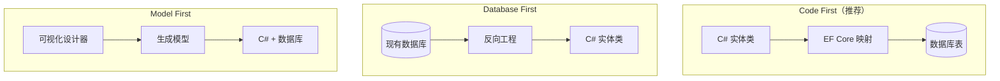
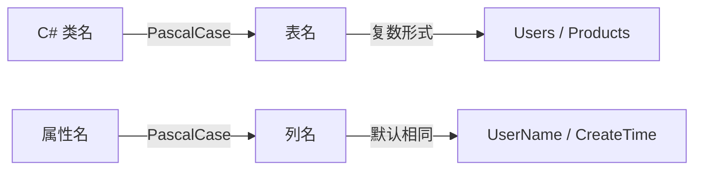
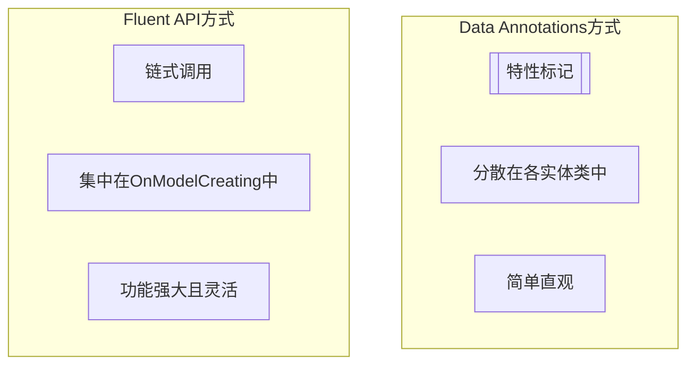
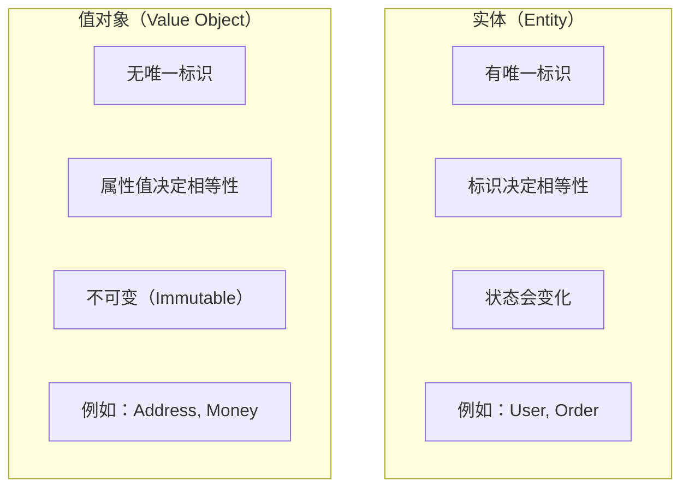
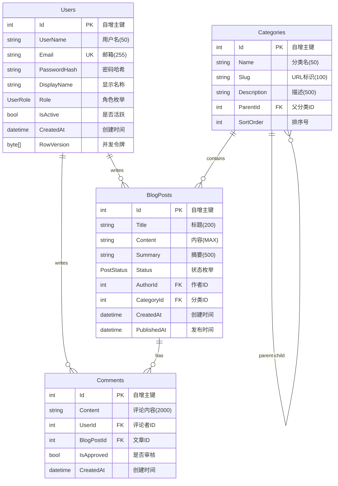

# Code-First开发 - 用C#类定义数据库

> **学习目标**：掌握Code First开发模式，学会用C#实体类优雅地定义数据库结构
> **前置知识**：ORM概念、C#面向对象编程、基础SQL知识
> **预计时长**：60分钟

---

## 一、三种开发模式对比

### 1.1 Code First vs Database First vs Model First

在Entity Framework Core中，主要有三种开发模式：



### 1.2 详细对比表格

| 特性 | **Code First** | **Database First** | **Model First** |
|------|---------------|-------------------|-----------------|
| **开发起点** | C#实体类 | 现有数据库 | 可视化设计器 |
| **适用场景** | 新项目、Greenfield | 遗留系统、集成 | 快速原型 |
| **版本控制** | ✅ 优秀（代码即文档） | ⚠️ 困难（二进制文件） | ⚠️ 中等 |
| **数据库迁移** | ✅ 原生支持 | ❌ 手动同步 | ❌ 复杂 |
| **灵活性** | ⭐⭐⭐⭐⭐ | ⭐⭐⭐ | ⭐⭐ |
| **学习曲线** | 中等 | 低 | 低 |
| **EF Core支持** | ✅ 完整支持 | ⚠️ 有限支持 | ❌ 不推荐 |
| **团队协作** | ✅ Git友好 | ⚠️ 冲突频繁 | ⚠️ 文件合并难 |

### 1.3 为什么Code First是首选？

**Code First的核心思想**：**代码即数据库设计文档**

优势：
✅ **版本控制友好**：所有变更都在Git中可追踪  
✅ **数据库即代码**：C#类就是数据库Schema  
✅ **自动化迁移**：一键生成和执行迁移脚本  
✅ **类型安全**：编译期就能发现错误  
✅ **重构友好**：重命名字段自动同步到数据库  

---

## 二、创建实体类的最佳实践

### 2.1 实体类的基本结构

一个标准的EF Core实体类应该包含：

```csharp
// Models/BlogPost.cs
using System.ComponentModel.DataAnnotations;
using System.ComponentModel.DataAnnotations.Schema;

namespace BlogSystem.Models;

/// <summary>
/// 博客文章实体
/// </summary>
[Table("BlogPosts")] // 指定映射的表名
public class BlogPost
{
    #region 主键配置
    
    /// <summary>
    /// 主键 - 自增ID
    /// </summary>
    [Key]
    [DatabaseGenerated(DatabaseGeneratedOption.Identity)]
    public int Id { get; set; }
    
    #endregion
    
    #region 必填字段
    
    [Required] // 非空约束
    [StringLength(200)] // 最大长度200
    [Column("Title")] // 指定列名
    public string Title { get; set; } = string.Empty;
    
    [Required]
    [Column(TypeName = "nvarchar(max)")]
    public string Content { get; set; } = string.Empty;
    
    #endregion
    
    #region 可选字段
    
    [StringLength(500)]
    public string? Summary { get; set; }
    
    public string? CoverImageUrl { get; set; }
    
    #endregion
    
    #region 枚举字段
    
    public PostStatus Status { get; set; } = PostStatus.Draft;
    
    #endregion
    
    #region 时间戳
    
    [DatabaseGenerated(DatabaseGeneratedOption.Computed)] // 数据库自动计算
    public DateTime CreatedAt { get; set; } = DateTime.Now;
    
    public DateTime? PublishedAt { get; set; }
    
    public DateTime? UpdatedAt { get; set; }
    
    #endregion
    
    #region 外键关系
    
    [ForeignKey("Author")]
    public int AuthorId { get; set; }
    
    // 导航属性
    public virtual User Author { get; set; } = null!;
    
    public int? CategoryId { get; set; }
    
    public virtual Category? Category { get; set; }
    
    // 一对多关系：一篇文章可以有多个评论
    public virtual ICollection<Comment> Comments { get; set; } = new List<Comment>();
    
    #endregion
}

/// <summary>
/// 文章状态枚举
/// </summary>
public enum PostStatus
{
    Draft = 0,      // 草稿
    Published = 1,  // 已发布
    Archived = 2    // 已归档
}
```

### 2.2 实体类命名规范



**推荐的命名约定**：
- **类名**：使用单数名词（User，不是Users）
- **表名**：使用复数名词（Users表）
- **属性名**：PascalCase（FirstName，不是firstName）
- **外键属性**：`{RelatedEntity}Id`（UserId，CategoryId）
- **导航属性**：使用关联实体的名称（User，Category）
- **集合导航属性**：使用复数形式（Posts，Comments）

### 2.3 不同类型的主键配置

#### 方式1：自增整数主键（最常用）

```csharp
public class Product
{
    [Key]
    [DatabaseGenerated(DatabaseGeneratedOption.Identity)]
    public int Id { get; set; } // 自动递增 1, 2, 3...
}
```

**适用场景**：
- 大多数业务表
- 不需要分布式唯一性
- 性能要求高（整数索引效率最高）

#### 方式2：GUID主键（全局唯一）

```csharp
using System.ComponentModel.DataAnnotations;

public class Order
{
    [Key]
    [DatabaseGenerated(DatabaseGeneratedOption.Identity)]
    public Guid Id { get; set; } // 自动生成GUID
    
    // 或者手动指定
    public Guid OrderNumber { get; set; } = Guid.NewGuid();
}
```

**适用场景**：
- 分布式系统（多服务器合并数据）
- 需要在客户端生成ID（离线场景）
- 安全敏感场景（不暴露自增ID规律）

**优缺点**：
- ✅ 全局唯一，适合分布式
- ✅ 可以在应用层生成，无需数据库往返
- ❌ 存储空间大（16字节 vs 4字节）
- ❌ 聚集索引性能较差（随机插入）

#### 方式3：字符串主键（特殊场景）

```csharp
public class DictionaryItem
{
    [Key]
    [StringLength(50)]
    public string Code { get; set; } = string.Empty; // 如 "GENDER_MALE"
    
    public string Name { get; set; } = string.Empty;
}
```

**适用场景**：
- 字典表/配置表
- 业务编码有意义（SKU、订单号）
- 数据量小且固定的参考数据

#### 方式4：复合主键（不推荐）

```csharp
// 联结表通常使用复合主键
[Table("OrderItems")]
public class OrderItem
{
    [Key]
    public int OrderId { get; set; }
    
    [Key]
    public int ProductId { get; set; }
    
    public int Quantity { get; set; }
    public decimal UnitPrice { get; set; }
}
```

**注意**：复合主键会增加复杂度，大多数情况建议使用单独的自增ID作为主键。

---

## 三、Data Annotations（数据注解）详解

### 3.1 常用注解特性一览

| 注解 | 作用 | 示例 |
|------|------|------|
| `[Table("TableName")]` | 指定表名 | `[Table("Users")]` |
| `[Column("ColumnName")]` | 指定列名 | `[Column("UserName")]` |
| `[Key]` | 标记主键 | `[Key]` |
| `[Required]` | 非空约束 | `[Required]` |
| `[StringLength(n)]` | 最大长度 | `[StringLength(100)]` |
| `[MaxLength(n)]` | 最大长度（通用） | `[MaxLength(200)]` |
| `[MinLength(n)]` | 最小长度 | `[MinLength(6)]` |
| `[Range(min, max)]` | 数值范围 | `[Range(0, 100)]` |
| `[RegularExpression(pattern)]` | 正则验证 | `[RegularExpression(@"^\d{11}$")]` |
| `[EmailAddress]` | 邮箱格式 | `[EmailAddress]` |
| `[Phone]` | 电话号码 | `[Phone]` |
| `[Url]` | URL地址 | `[Url]` |
| `[Timestamp]` | 时间戳/并发令牌 | `[Timestamp]` |
| `[ConcurrencyCheck]` | 并发检查 | `[ConcurrencyCheck]` |
| `[NotMapped]` | 不映射到数据库 | `[NotMapped]` |
| `[Computed]` | 数据库计算列 | `[Computed]` |
| `[ForeignKey("PropertyName")]` | 外键指定 | `[ForeignKey("UserId")]` |
| `[InverseProperty("PropertyName")]` | 反向导航属性 | `[InverseProperty("Posts")]` |
| `[Index]` (EF Core 5+) | 创建索引 | `[Index(nameof(Email), IsUnique = true)]` |
| `[Comment("描述")]` | 列注释 | `[Comment("用户邮箱")]` |
| `[Precision(precision, scale)]` | 精度和小数位 | `[Precision(18, 2)]` |
| `[Unicode(false)]` | ASCII字符（节省空间） | `[Unicode(false)]` |

### 3.2 完整示例：用户实体

```csharp
using System.ComponentModel.DataAnnotations;
using System.ComponentModel.DataAnnotations.Schema;

namespace BlogSystem.Models;

[Table("Users")]
[Comment("系统用户表")]
public class User
{
    #region 基本信息
    
    [Key]
    [DatabaseGenerated(DatabaseGeneratedOption.Identity)]
    [Comment("用户ID")]
    public int Id { get; set; }
    
    [Required]
    [StringLength(50)]
    [Comment("用户名")]
    public string UserName { get; set; } = string.Empty;
    
    [Required]
    [EmailAddress]
    [StringLength(255)]
    [Index(IsUnique = true)] // 唯一索引
    [Comment("邮箱地址")]
    public string Email { get; set; } = string.Empty;
    
    [Required]
    [StringLength(100)]
    [Comment("密码哈希值")]
    public string PasswordHash { get; set; } = string.Empty;
    
    [StringLength(20)]
    [Phone]
    [Comment("手机号")]
    public string? PhoneNumber { get; set; }
    
    #endregion
    
    #region 个人信息
    
    [StringLength(50)]
    [Comment("显示名称")]
    public string? DisplayName { get; set; }
    
    [Url]
    [StringLength(500)]
    [Comment("头像URL")]
    public string? AvatarUrl { get; set; }
    
    [StringLength(500)]
    [Comment("个人简介")]
    public string? Bio { get; set; }
    
    #endregion
    
    #region 状态信息
    
    public bool IsActive { get; set; } = true;
    
    public bool IsEmailVerified { get; set; } = false;
    
    [Comment("用户角色")]
    public UserRole Role { get; set; } = UserRole.User;
    
    #endregion
    
    #region 时间戳
    
    [DatabaseGenerated(DatabaseGeneratedOption.Computed)]
    public DateTime CreatedAt { get; set; } = DateTime.Now;
    
    public DateTime? LastLoginAt { get; set; }
    
    [Timestamp] // 用于乐观并发控制
    public byte[] RowVersion { get; set; } = null!;
    
    #endregion
    
    #region 导航属性
    
    // 用户发布的文章
    public virtual ICollection<BlogPost> Posts { get; set; } = new List<BlogPost>();
    
    // 用户发表的评论
    public virtual ICollection<Comment> Comments { get; set; } = new List<Comment>();
    
    #endregion
}

/// <summary>
/// 用户角色枚举
/// </summary>
public enum UserRole
{
    Admin = 0,   // 管理员
    Editor = 1,  // 编辑
    User = 2     // 普通用户
}
```

### 3.3 Data Annotations的限制

虽然Data Annotations很方便，但有以下限制：

❌ **无法配置复杂关系**：如级联删除行为  
❌ **无法配置索引的高级选项**：如包含多列的复合索引  
❌ **配置分散**：每个类都要加很多特性，不够集中  
❌ **难以条件性配置**：无法根据环境动态调整  

**解决方案**：使用Fluent API！

---

## 四、Fluent API - 更灵活的配置方式

### 4.1 什么是Fluent API？

Fluent API是一种**链式调用**的配置方式，在`OnModelCreating`方法中统一配置所有实体。



### 4.2 Fluent API基本语法

```csharp
protected override void OnModelCreating(ModelBuilder modelBuilder)
{
    base.OnModelCreating(modelBuilder);
    
    // 配置单个实体
    modelBuilder.Entity<User>(entity =>
    {
        entity.ToTable("Users", t => t.HasComment("系统用户表"));
        
        // 主键
        entity.HasKey(e => e.Id);
        
        // 属性配置
        entity.Property(e => e.UserName)
            .IsRequired()
            .HasMaxLength(50)
            .HasComment("用户名");
            
        entity.Property(e => e.Email)
            .IsRequired()
            .HasMaxLength(255)
            .IsUnicode(false); // ASCII字符，节省空间
        
        // 索引配置
        entity.HasIndex(e => e.Email)
            .IsUnique()
            .HasDatabaseName("IX_Users_Email");
        
        // 忽略属性
        entity.Ignore(e => e.FullName); // 不映射到数据库
    });
}
```

### 4.3 Fluent API高级配置示例

```csharp
protected override void OnModelCreating(ModelBuilder modelBuilder)
{
    base.OnModelCreating(modelBuilder);
    
    // ====== 配置User实体 ======
    modelBuilder.Entity<User>(entity =>
    {
        entity.ToTable("Users");
        entity.HasKey(e => e.Id);
        
        // 字符串属性优化
        entity.Property(e => e.UserName)
            .IsRequired()
            .HasMaxLength(50)
            .IsUnicode(true);
            
        entity.Property(e => e.Email)
            .IsRequired()
            .HasMaxLength(255)
            .IsUnicode(false) // 邮箱只需要ASCII
            .HasComment("用户邮箱（唯一）");
        
        // 唯一索引
        entity.HasIndex(e => e.Email)
            .IsUnique()
            .HasName("UQ_Users_Email");
        
        // 复合索引
        entity.HasIndex(e => new { e.IsActive, e.Role })
            .HasName("IX_Users_Active_Role");
        
        // 默认值
        entity.Property(e => e.IsActive)
            .HasDefaultValue(true);
            
        entity.Property(e => e.CreatedAt)
            .HasDefaultValueSql("GETDATE()"); // SQL Server函数
        
        // 并发令牌
        entity.Property(e => e.RowVersion)
            .IsRowVersion();
            
        // 排除属性
        entity.Ignore(e => e.ComputedDisplayName);
    });
    
    // ====== 配置BlogPost实体 ======
    modelBuilder.Entity<BlogPost>(entity =>
    {
        entity.ToTable("BlogPosts");
        entity.HasKey(e => e.Id);
        
        // 标题配置
        entity.Property(e => e.Title)
            .IsRequired()
            .HasMaxLength(200)
            .HasComment("文章标题");
        
        // 内容使用nvarchar(max)
        entity.Property(e => e.Content)
            .IsRequired()
            .HasColumnType("nvarchar(max)");
        
        // 枚举存储为string而非int（更易读）
        entity.Property(e => e.Status)
            .HasConversion<string>()
            .HasDefaultValue(PostStatus.Draft);
        
        // 计算列
        entity.Property(e => e.WordCount)
            .HasComputedColumnSql("(LEN([Content]))"); // SQL Server
        
        // 全局查询过滤器（软删除）
        entity.HasQueryFilter(e => e.Status != PostStatus.Archived);
    });
    
    // ====== 配置Category实体 ======
    modelBuilder.Entity<Category>(entity =>
    {
        entity.ToTable("Categories");
        entity.HasKey(e => e.Id);
        
        entity.Property(e => e.Name)
            .IsRequired()
            .HasMaxLength(50);
            
        entity.Property(e => e.Slug)
            .IsRequired()
            .HasMaxLength(100)
            .IsUnicode(false); // URL slug用ASCII
        
        // 唯一slug
        entity.HasIndex(e => e.Slug)
            .IsUnique();
        
        // 自引用：分类层级（父子关系）
        entity.HasOne(e => e.Parent)
            .WithMany(e => e.Children)
            .HasForeignKey(e => e.ParentId)
            .OnDelete(DeleteBehavior.Restrict); // 禁止级联删除父分类
    });
}
```

### 4.4 Data Annotations vs Fluent API 对比

| 场景 | Data Annotations | Fluent API | 推荐 |
|------|-----------------|------------|------|
| 简单属性配置 | ✅ 简洁 | ✅ 可行 | Data Annotations |
| 表名/列名 | ✅ `[Table]` `[Column]` | ✅ `ToTable()` | 都可以 |
| 主键/必填/长度 | ✅ `[Key]` `[Required]` | ✅ `HasKey()` | Data Annotations |
| 索引配置 | ⚠️ 基础功能 | ✅ 完整功能 | **Fluent API** |
| 关系配置 | ⚠️ 有限 | ✅ 完整灵活 | **Fluent API** |
| 级联删除 | ❌ 不支持 | ✅ 支持 | **Fluent API** |
| 全局查询过滤器 | ❌ 不支持 | ✅ 支持 | **Fluent API** |
| 继承映射 | ❌ 不支持 | ✅ 支持 | **Fluent API** |
| 条件性配置 | ❌ 不支持 | ✅ 支持 | **Fluent API** |
| 复合索引 | ❌ 不支持 | ✅ 支持 | **Fluent API** |

---

## 五、两种配置方式的混合使用

### 5.1 推荐的混合策略

**最佳实践**：**Data Annotations处理简单配置 + Fluent API处理复杂逻辑**

```csharp
// ====== 第一步：在实体类上使用Data Annotations处理基础配置 ======

[Table("Products")]
public class Product
{
    [Key]
    [DatabaseGenerated(DatabaseGeneratedOption.Identity)]
    public int Id { get; set; }
    
    [Required]
    [StringLength(200)]
    [Comment("产品名称")]
    public string Name { get; set; } = string.Empty;
    
    [Required]
    [Column(TypeName = "decimal(18,2)")]
    [Range(0.01, 999999.99)]
    public decimal Price { get; set; }
    
    [StringLength(2000)]
    public string? Description { get; set; }
    
    public int CategoryId { get; set; }
    
    public virtual Category Category { get; set; } = null!;
    
    public virtual ICollection<OrderItem> OrderItems { get; set; } = new List<OrderItem>();
}

// ====== 第二步：在OnModelCreating中使用Fluent API处理高级配置 ======

protected override void OnModelCreating(ModelBuilder modelBuilder)
{
    base.OnModelCreating(modelBuilder);
    
    // Product的高级配置（索引、关系等）
    modelBuilder.Entity<Product>(entity =>
    {
        // 复合索引：按分类和价格
        entity.HasIndex(e => new { e.CategoryId, e.Price })
            .HasName("IX_Products_Category_Price");
        
        // 价格检查约束
        entity.CheckConstraint("CK_Price_Positive", "[Price] > 0");
        
        // 关系配置
        entity.HasOne(e => e.Category)
            .WithMany(c => c.Products)
            .HasForeignKey(e => e.CategoryId)
            .OnDelete(DeleteBehavior.Restrict); // 有订单的产品不能删除分类
    });
}
```

### 5.2 IEntityTypeConfiguration<T> - 更好的组织方式

对于大型项目，建议将每个实体的配置提取到独立的配置类中：

```csharp
// Configurations/UserConfiguration.cs
using Microsoft.EntityFrameworkCore;
using Microsoft.EntityFrameworkCore.Metadata.Builders;

namespace BlogSystem.Configurations;

public class UserConfiguration : IEntityTypeConfiguration<User>
{
    public void Configure(EntityTypeBuilder<User> builder)
    {
        builder.ToTable("Users", t => t.HasComment("系统用户表"));
        
        builder.HasKey(u => u.Id);
        
        builder.Property(u => u.UserName)
            .IsRequired()
            .HasMaxLength(50)
            .HasComment("用户名");
            
        builder.Property(u => u.Email)
            .IsRequired()
            .HasMaxLength(255)
            .IsUnicode(false)
            .HasComment("邮箱地址");
        
        // 唯一索引
        builder.HasIndex(u => u.Email)
            .IsUnique()
            .HasDatabaseName("UQ_Users_Email");
        
        builder.Property(u => u.PhoneNumber)
            .HasMaxLength(20)
            .IsUnicode(false);
            
        builder.Property(u => u.PasswordHash)
            .IsRequired()
            .HasMaxLength(100);
        
        builder.Property(u => u.Role)
            .HasConversion<string>()
            .HasDefaultValue(UserRole.User);
        
        builder.Property(u => u.IsActive)
            .HasDefaultValue(true);
            
        builder.Property(u => u.CreatedAt)
            .HasDefaultValueSql("GETUTCDATE()");
        
        // 并发令牌
        builder.Property(u => u.RowVersion)
            .IsRowVersion();
        
        // 全局查询过滤器：只查询活跃用户
        builder.HasQueryFilter(u => u.IsActive);
    }
}

// Configurations/BlogPostConfiguration.cs
public class BlogPostConfiguration : IEntityTypeConfiguration<BlogPost>
{
    public void Configure(EntityTypeBuilder<BlogPost> builder)
    {
        builder.ToTable("BlogPosts");
        
        builder.HasKey(b => b.Id);
        
        builder.Property(b => b.Title)
            .IsRequired()
            .HasMaxLength(200)
            .HasComment("文章标题");
            
        builder.Property(b => b.Content)
            .IsRequired()
            .HasColumnType("nvarchar(max)");
            
        builder.Property(b => b.Summary)
            .HasMaxLength(500);
        
        builder.Property(b => b.Status)
            .HasConversion<string>()
            .HasDefaultValue(PostStatus.Draft);
        
        // 作者关系
        builder.HasOne(b => b.Author)
            .WithMany(u => u.Posts)
            .HasForeignKey(b => b.AuthorId)
            .OnDelete(DeleteBehavior.Cascade); // 删除用户时级联删除文章
        
        // 分类关系（可选）
        builder.HasOne(b => b.Category)
            .WithMany(c => c.Posts)
            .HasForeignKey(b => b.CategoryId)
            .OnDelete(DeleteBehavior.SetNull); // 删除分类时设为NULL
        
        // 标题索引（用于搜索）
        builder.HasIndex(b => b.Title);
        
        // 创建时间降序索引
        builder.HasIndex(b => b.CreatedAt);
        
        // 全文索引提示（实际需要数据库特定实现）
        builder.HasIndex(b => b.Title)
            .HasMethod("HASH"); // 或其他索引类型
    }
}

// Configurations/CategoryConfiguration.cs
public class CategoryConfiguration : IEntityTypeConfiguration<Category>
{
    public void Configure(EntityTypeBuilder<Category> builder)
    {
        builder.ToTable("Categories");
        
        builder.HasKey(c => c.Id);
        
        builder.Property(c => c.Name)
            .IsRequired()
            .HasMaxLength(50)
            .HasComment("分类名称");
            
        builder.Property(c => c.Slug)
            .IsRequired()
            .HasMaxLength(100)
            .IsUnicode(false)
            .HasComment("URL友好的标识符");
        
        // Slug唯一索引
        builder.HasIndex(c => c.Slug)
            .IsUnique()
            .HasDatabaseName("UQ_Categories_Slug");
        
        builder.Property(c => c.Description)
            .HasMaxLength(500);
        
        builder.Property(c => c.SortOrder)
            .HasDefaultValue(0);
        
        // 自引用关系：父子分类
        builder.HasOne(c => c.Parent)
            .WithMany(c => c.Children)
            .HasForeignKey(c => c.ParentId)
            .OnDelete(DeleteBehavior.Restrict);
        
        // 显示顺序索引
        builder.HasIndex(c => c.SortOrder);
    }
}

// Configurations/CommentConfiguration.cs
public class CommentConfiguration : IEntityTypeConfiguration<Comment>
{
    public void Configure(EntityTypeBuilder<Comment> builder)
    {
        builder.ToTable("Comments");
        
        builder.HasKey(c => c.Id);
        
        builder.Property(c => c.Content)
            .IsRequired()
            .HasMaxLength(2000)
            .HasComment("评论内容");
        
        builder.Property(c => c.IsApproved)
            .HasDefaultValue(false);
        
        builder.Property(c => c.CreatedAt)
            .HasDefaultValueSql("GETUTCDATE()");
        
        // 评论者（用户）关系
        builder.HasOne(c => c.User)
            .WithMany(u => u.Comments)
            .HasForeignKey(c => c.UserId)
            .OnDelete(DeleteBehavior.Cascade);
        
        // 被评论的文章
        builder.HasOne(c => c.BlogPost)
            .WithMany(p => p.Comments)
            .HasForeignKey(c => c.BlogPostId)
            .OnDelete(DeleteBehavior.Cascade); // 删除文章时删除评论
        
        // 审批状态索引
        builder.HasIndex(c => new { c.BlogPostId, c.IsApproved });
    }
}
```

然后在DbContext中注册这些配置：

```csharp
// Data/ApplicationDbContext.cs
using BlogSystem.Configurations;
using BlogSystem.Models;
using Microsoft.EntityFrameworkCore;

namespace BlogSystem.Data;

public class ApplicationDbContext : DbContext
{
    public ApplicationDbContext(DbContextOptions<ApplicationDbContext> options)
        : base(options)
    {
    }

    // DbSet属性
    public DbSet<User> Users { get; set; } = null!;
    public DbSet<BlogPost> BlogPosts { get; set; } = null!;
    public DbSet<Category> Categories { get; set; } = null!;
    public DbSet<Comment> Comments { get; set; } = null!;

    protected override void OnModelCreating(ModelBuilder modelBuilder)
    {
        base.OnModelCreating(modelBuilder);
        
        // 应用所有配置类（推荐方式）
        modelBuilder.ApplyConfiguration(new UserConfiguration());
        modelBuilder.ApplyConfiguration(new BlogPostConfiguration());
        modelBuilder.ApplyConfiguration(new CategoryConfiguration());
        modelBuilder.ApplyConfiguration(new CommentConfiguration());
        
        // 或者使用程序集扫描（更自动化）
        // modelBuilder.ApplyConfigurationsFromAssembly(typeof(ApplicationDbContext).Assembly);
    }
}
```

**IEntityTypeConfiguration的优势**：
✅ **单一职责**：每个实体独立配置，职责清晰  
✅ **易于维护**：修改某个实体不影响其他实体  
✅ **可测试**：配置类可以独立测试  
✅ **团队协作**：不同成员负责不同实体的配置，减少冲突  

---

## 六、Value Object（值对象）vs Entity（实体）

### 6.1 核心概念区别

这是DDD（领域驱动设计）中的重要概念：



### 6.2 实体示例

```csharp
// 实体：有唯一标识，标识相同的对象视为同一对象
public class User
{
    public int Id { get; set; } // 标识
    
    public string UserName { get; set; }
    
    // 即使属性相同，不同ID也是不同的用户
    // user1.Id = 1, user2.Id = 2 → 它们是不同的对象
}
```

### 6.3 值对象示例

```csharp
// 值对象：没有标识，通过属性值判断相等性
public class Address
{
    public string Province { get; set; }
    public string City { get; set; }
    public string Street { get; set; }
    public string ZipCode { get; set; }
    
    // 属性完全相同的两个Address被视为相等
    // address1 和 address2 如果所有属性都相同，它们就是"同一个"地址
}

public class Money
{
    public decimal Amount { get; set; }
    public string Currency { get; set; } // "CNY", "USD"
    
    // 100元人民币 == 100元人民币（值相等）
}
```

### 6.4 在EF Core中使用值对象

#### 方式1：作为拥有类型的实体（Owned Entity）

```csharp
// Models/Address.cs - 值对象
public class Address
{
    public string Province { get; set; } = string.Empty;
    public string City { get; set; } = string.Empty;
    public string Street { get; set; } = string.Empty;
    public string ZipCode { get; set; } = string.Empty;
    
    // 重写Equals和GetHashCode（可选，用于领域逻辑）
    public override bool Equals(object? obj)
    {
        if (obj is not Address other) return false;
        return Province == other.Province 
               && City == other.City 
               && Street == other.Street 
               && ZipCode == other.ZipCode;
    }
    
    public override int GetHashCode()
    {
        return HashCode.Combine(Province, City, Street, ZipCode);
    }
}

// 在User实体中使用
public class User
{
    [Key]
    public int Id { get; set; }
    
    public string UserName { get; set; } = string.Empty;
    
    // 值对象作为拥有类型
    public Address HomeAddress { get; set; } = new Address();
    
    public Address WorkAddress { get; set; } = new Address();
}
```

配置：

```csharp
modelBuilder.Entity<User>(entity =>
{
    entity.OwnsOne(u => u.HomeAddress, address =>
    {
        address.Property(a => a.Province).HasColumnName("HomeProvince");
        address.Property(a => a.City).HasColumnName("HomeCity");
        address.Property(a => a.Street).HasColumnName("HomeStreet");
        address.Property(a => a.ZipCode).HasColumnName("HomeZipCode");
    });
    
    entity.OwnsOne(u => u.WorkAddress, address =>
    {
        address.Property(a => a.Province).HasColumnName("WorkProvince");
        address.Property(a => a.City).HasColumnName("WorkCity");
        address.Property(a => a.Street).HasColumnName("WorkStreet");
        address.Property(a => a.ZipCode).HasColumnName("WorkZipCode");
    });
});
```

生成的数据库表结构：

```
Users表:
- Id (int, PK)
- UserName (nvarchar)
- HomeProvince (nvarchar)
- HomeCity (nvarchar)
- HomeStreet (nvarchar)
- HomeZipCode (nvarchar)
- WorkProvince (nvarchar)
- WorkCity (nvarchar)
- WorkStreet (nvarchar)
- WorkZipCode (nvarchar)
```

#### 方式2：JSON列存储（EF Core 7+）

如果使用支持JSON的数据库（SQL Server 2022+, PostgreSQL, SQLite），可以将值对象序列化为JSON存储：

```csharp
modelBuilder.Entity<User>(entity =>
{
    entity.OwnsOne(u => u.HomeAddress, address =>
    {
        address.ToJson(); // 存储为JSON列
    });
});
```

生成的表：

```
Users表:
- Id (int, PK)
- UserName (nvarchar)
- HomeAddress (nvarchar(max)) -- JSON格式: {"Province":"...","City":"..."}
```

---

## 七、完整实战案例：博客系统的实体模型

让我们设计一个完整的博客系统实体模型！

### 7.1 ER图（实体关系图）



### 7.2 所有实体类代码

```csharp
// ==================== Enums ====================

namespace BlogSystem.Enums;

/// <summary>
/// 用户角色
/// </summary>
public enum UserRole
{
    Admin = 0,
    Editor = 1,
    User = 2
}

/// <summary>
/// 文章状态
/// </summary>
public enum PostStatus
{
    Draft = 0,
    Published = 1,
    Archived = 2
}

// ==================== Entities ====================

namespace BlogSystem.Entities;

using BlogSystem.Enums;
using System.ComponentModel.DataAnnotations;
using System.ComponentModel.DataAnnotations.Schema;

[Table("Users")]
public class User
{
    [Key]
    [DatabaseGenerated(DatabaseGeneratedOption.Identity)]
    public int Id { get; set; }
    
    [Required]
    [StringLength(50)]
    public string UserName { get; set; } = string.Empty;
    
    [Required]
    [EmailAddress]
    [StringLength(255)]
    public string Email { get; set; } = string.Empty;
    
    [Required]
    [StringLength(100)]
    public string PasswordHash { get; set; } = string.Empty;
    
    [StringLength(50)]
    public string? DisplayName { get; set; }
    
    public UserRole Role { get; set; } = UserRole.User;
    
    public bool IsActive { get; set; } = true;
    
    public DateTime CreatedAt { get; set; } = DateTime.UtcNow;
    
    public DateTime? LastLoginAt { get; set; }
    
    [Timestamp]
    public byte[] RowVersion { get; set; } = null!;
    
    // 导航属性
    public virtual ICollection<BlogPost> Posts { get; set; } = new List<BlogPost>();
    public virtual ICollection<Comment> Comments { get; set; } = new List<Comment>();
}

[Table("BlogPosts")]
public class BlogPost
{
    [Key]
    [DatabaseGenerated(DatabaseGeneratedOption.Identity)]
    public int Id { get; set; }
    
    [Required]
    [StringLength(200)]
    public string Title { get; set; } = string.Empty;
    
    [Required]
    [Column(TypeName = "nvarchar(max)")]
    public string Content { get; set; } = string.Empty;
    
    [StringLength(500)]
    public string? Summary { get; set; }
    
    public PostStatus Status { get; set; } = PostStatus.Draft;
    
    [Required]
    public int AuthorId { get; set; }
    
    public int? CategoryId { get; set; }
    
    public DateTime CreatedAt { get; set; } = DateTime.UtcNow;
    
    public DateTime? PublishedAt { get; set; }
    
    public int ViewCount { get; set; } = 0;
    
    public int LikeCount { get; set; } = 0;
    
    // 导航属性
    [ForeignKey("AuthorId")]
    public virtual User Author { get; set; } = null!;
    
    [ForeignKey("CategoryId")]
    public virtual Category? Category { get; set; }
    
    public virtual ICollection<Comment> Comments { get; set; } = new List<Comment>();
    
    public virtual ICollection<PostTag> PostTags { get; set; } = new List<PostTag>();
}

[Table("Categories")]
public class Category
{
    [Key]
    [DatabaseGenerated(DatabaseGeneratedOption.Identity)]
    public int Id { get; set; }
    
    [Required]
    [StringLength(50)]
    public string Name { get; set; } = string.Empty;
    
    [Required]
    [StringLength(100)]
    [Unicode(false)]
    public string Slug { get; set; } = string.Empty;
    
    [StringLength(500)]
    public string? Description { get; set; }
    
    public int? ParentId { get; set; }
    
    public int SortOrder { get; set; } = 0;
    
    public bool IsActive { get; set; } = true;
    
    public DateTime CreatedAt { get; set; } = DateTime.UtcNow;
    
    // 导航属性
    public virtual Category? Parent { get; set; }
    
    public virtual ICollection<Category> Children { get; set; } = new List<Category>();
    
    public virtual ICollection<BlogPost> Posts { get; set; } = new List<BlogPost>();
}

[Table("Comments")]
public class Comment
{
    [Key]
    [DatabaseGenerated(DatabaseGeneratedOption.Identity)]
    public int Id { get; set; }
    
    [Required]
    [StringLength(2000)]
    public string Content { get; set; } = string.Empty;
    
    [Required]
    public int UserId { get; set; }
    
    [Required]
    public int BlogPostId { get; set; }
    
    public int? ParentCommentId { get; set; } // 支持回复评论
    
    public bool IsApproved { get; set; } = false;
    
    public DateTime CreatedAt { get; set; } = DateTime.UtcNow;
    
    // 导航属性
    [ForeignKey("UserId")]
    public virtual User User { get; set; } = null!;
    
    [ForeignKey("BlogPostId")]
    public virtual BlogPost BlogPost { get; set; } = null!;
    
    public virtual Comment? ParentComment { get; set; }
    
    public virtual ICollection<Comment> Replies { get; set; } = new List<Comment>();
}

[Table("Tags")]
public class Tag
{
    [Key]
    [DatabaseGenerated(DatabaseGeneratedOption.Identity)]
    public int Id { get; set; }
    
    [Required]
    [StringLength(50)]
    public string Name { get; set; } = string.Empty;
    
    [Required]
    [StringLength(50)]
    [Unicode(false)]
    public string Slug { get; set; } = string.Empty;
    
    public DateTime CreatedAt { get; set; } = DateTime.UtcNow;
    
    public virtual ICollection<PostTag> PostTags { get; set; } = new List<PostTag>();
}

// 多对多联结表
[Table("PostTags")]
public class PostTag
{
    public int PostId { get; set; }
    
    public int TagId { get; set; }
    
    [ForeignKey("PostId")]
    public virtual BlogPost Post { get; set; } = null!;
    
    [ForeignKey("TagId")]
    public virtual Tag Tag { get; set; } = null!;
}
```

### 7.3 DbContext完整实现

```csharp
// Data/BlogDbContext.cs
using BlogSystem.Entities;
using Microsoft.EntityFrameworkCore;

namespace BlogSystem.Data;

public class BlogDbContext : DbContext
{
    public BlogDbContext(DbContextOptions<BlogDbContext> options)
        : base(options)
    {
    }

    // DbSet属性
    public DbSet<User> Users { get; set; } = null!;
    public DbSet<BlogPost> BlogPosts { get; set; } = null!;
    public DbSet<Category> Categories { get; set; } = null!;
    public DbSet<Comment> Comments { get; set; } = null!;
    public DbSet<Tag> Tags { get; set; } = null!;
    public DbSet<PostTag> PostTags { get; set; } = null!;

    protected override void OnModelCreating(ModelBuilder modelBuilder)
    {
        base.OnModelCreating(modelBuilder);

        // ====== User配置 ======
        modelBuilder.Entity<User>(entity =>
        {
            entity.HasIndex(e => e.Email).IsUnique();
            entity.HasIndex(e => new { e.IsActive, e.Role });
            
            entity.Property(e => e.Role).HasConversion<string>();
            entity.Property(e => e.CreatedAt).HasDefaultValueSql("GETUTCDATE()");
            entity.Property(e => e.RowVersion).IsRowVersion();
            
            entity.HasQueryFilter(e => e.IsActive);
        });

        // ====== BlogPost配置 ======
        modelBuilder.Entity<BlogPost>(entity =>
        {
            entity.HasIndex(e => e.Title);
            entity.HasIndex(e => e.CreatedAt);
            entity.HasIndex(e => new { e.AuthorId, e.Status });
            entity.HasIndex(e => e.CategoryId);
            
            entity.Property(e => e.Status).HasConversion<string>();
            entity.Property(e => e.CreatedAt).HasDefaultValueSql("GETUTCDATE()");
            
            // 作者关系
            entity.HasOne(e => e.Author)
                .WithMany(u => u.Posts)
                .HasForeignKey(e => e.AuthorId)
                .OnDelete(DeleteBehavior.Cascade);
            
            // 分类关系
            entity.HasOne(e => e.Category)
                .WithMany(c => c.Posts)
                .HasForeignKey(e => e.CategoryId)
                .OnDelete(DeleteBehavior.SetNull);
            
            // 全局过滤：排除归档文章
            entity.HasQueryFilter(e => e.Status != PostStatus.Archived);
        });

        // ====== Category配置 ======
        modelBuilder.Entity<Category>(entity =>
        {
            entity.HasIndex(e => e.Slug).IsUnique();
            entity.HasIndex(e => e.SortOrder);
            
            // 自引用关系
            entity.HasOne(e => e.Parent)
                .WithMany(e => e.Children)
                .HasForeignKey(e => e.ParentId)
                .OnDelete(DeleteBehavior.Restrict);
            
            entity.HasQueryFilter(e => e.IsActive);
        });

        // ====== Comment配置 ======
        modelBuilder.Entity<Comment>(entity =>
        {
            entity.HasIndex(e => new { e.BlogPostId, e.CreatedAt });
            entity.HasIndex(e => new { e.BlogPostId, e.IsApproved });
            
            entity.Property(e => e.CreatedAt).HasDefaultValueSql("GETUTCDATE()");
            
            // 用户关系
            entity.HasOne(e => e.User)
                .WithMany(u => u.Comments)
                .HasForeignKey(e => e.UserId)
                .OnDelete(DeleteBehavior.Cascade);
            
            // 文章关系
            entity.HasOne(e => e.BlogPost)
                .WithMany(p => p.Comments)
                .HasForeignKey(e => e.BlogPostId)
                .OnDelete(DeleteBehavior.Cascade);
            
            // 自引用回复关系
            entity.HasOne(e => e.ParentComment)
                .WithMany(e => e.Replies)
                .HasForeignKey(e => e.ParentCommentId)
                .OnDelete(DeleteBehavior.Restrict);
        });

        // ====== Tag配置 ======
        modelBuilder.Entity<Tag>(entity =>
        {
            entity.HasIndex(e => e.Slug).IsUnique();
        });

        // ====== PostTag多对多配置 ======
        modelBuilder.Entity<PostTag>(entity =>
        {
            entity.HasKey(e => new { e.PostId, e.TagId });
            
            entity.HasOne(e => e.Post)
                .WithMany(p => p.PostTags)
                .HasForeignKey(e => e.PostId)
                .OnDelete(DeleteBehavior.Cascade);
            
            entity.HasOne(e => e.Tag)
                .WithMany(t => t.PostTags)
                .HasForeignKey(e => e.TagId)
                .OnDelete(DeleteBehavior.Cascade);
        });
    }
}
```

---

## 八、总结与最佳实践清单

### 8.1 本章要点回顾

✅ **Code First优势**：代码即文档、版本控制友好、自动化迁移  
✅ **实体类最佳实践**：规范命名、合理使用Data Annotations  
✅ **主键选择**：自增INT（常规）、GUID（分布式）、String（特殊）  
✅ **Data Annotations**：简单直观，适合基础配置  
✅ **Fluent API**：功能强大，适合复杂场景和关系配置  
✅ **混合策略**：Data Annotations + Fluent API结合使用  
✅ **IEntityTypeConfiguration**：大型项目的推荐组织方式  
✅ **值对象**：Owned Entity或JSON存储，避免过度规范化  

### 8.2 最佳实践清单

```markdown
## ✅ 推荐做法

1. **始终使用Code First**：新项目优先考虑Code First开发模式
2. **使用IEntityTypeConfiguration**：每个实体独立配置类
3. **主键用自增INT**：除非有特殊需求（分布式系统）
4. **枚举转String存储**：提高数据库可读性
5. **添加注释**：使用[Comment]和HasComment说明字段用途
6. **合理设置索引**：为常用查询字段添加索引
7. **使用全局查询过滤器**：软删除、多租户等场景
8. **配置默认值**：使用HasDefaultValue/HasDefaultValueSql
9. **启用并发控制**：重要实体添加RowVersion/Timestamp
10. **值对象用Owned Entity**：避免不必要的表关联

## ❌ 避免陷阱

1. 不要在实体类中包含业务逻辑（保持POCO纯净）
2. 不要过度使用虚拟属性导航（只在需要时加载）
3. 不要忘记配置外键关系的级联删除行为
4. 不要在大文本字段上建索引
5. 不要忽略Unicode(false)优化（ASCII字段）
6. 不要在Fluent API中重复Data Annotations已有的配置
```

---

## 九、练习题

### 练习1：概念理解

1. **以下哪种场景最适合使用Code First？**
   - A. 需要集成现有的遗留数据库
   - B. 从零开始构建新的业务系统
   - C. 需要快速原型验证想法
   
   **答案：B**

2. **值对象和实体的核心区别是什么？**
   - A. 值对象不能有属性
   - B. 值对象没有唯一标识，通过属性值判断相等性
   - C. 值对象必须是不可变的
   
   **答案：B**

3. **什么时候应该使用Fluent API而不是Data Annotations？**
   - A. 从未需要使用
   - B. 需要配置复杂的索引、关系、全局过滤器时
   - C. 只需要简单的表名列名配置时
   
   **答案：B**

### 练习2：动手实践

基于本节的博客系统模型，完成以下扩展任务：

1. **添加Article（文章）实体**：包含阅读时长（EstimatedReadTime）、是否置顶（IsPinned）、SEO关键词（SeoKeywords）
2. **配置复合索引**：为BlogPost创建（Status, CreatedAt）的复合索引用于列表查询
3. **实现值对象**：创建Money值对象，包含Amount和Currency，应用到Order实体
4. **配置继承映射**：创建基类BaseEntity，包含Id、CreatedAt、UpdatedAt，让所有实体继承它

**参考答案框架**：
```csharp
// 1. 扩展BlogPost实体
[Table("BlogPosts")]
public class BlogPost
{
    // ...原有字段...
    
    [Comment("预估阅读时长（分钟）")]
    public int EstimatedReadTime { get; set; } // 可根据内容长度计算
    
    [Comment("是否置顶")]
    public bool IsPinned { get; set; } = false;
    
    [StringLength(255)]
    [Comment("SEO关键词")]
    public string? SeoKeywords { get; set; }
}

// 2. 在Fluent API中配置复合索引
modelBuilder.Entity<BlogPost>(entity =>
{
    entity.HasIndex(e => new { e.Status, e.IsPinned, e.CreatedAt })
        .HasName("IX_BlogPosts_Status_Pinned_Created");
});

// 3. Money值对象
public class Money
{
    public decimal Amount { get; set; }
    public string Currency { get; set; } = "CNY";
}

// 在Order实体中使用
public class Order
{
    public int Id { get; set; }
    public Money TotalAmount { get; set; } = new Money();
}

// 配置
modelBuilder.Entity<Order>(entity =>
{
    entity.OwnsOne(o => o.TotalAmount, money =>
    {
        money.Property(m => m.Amount).HasColumnName("TotalAmount")
              .HasPrecision(18, 2);
        money.Property(m => m.Currency).HasColumnName("Currency")
              .HasMaxLength(10).HasDefaultValue("CNY");
    });
});

// 4. 基类实体
public abstract class BaseEntity
{
    [Key]
    [DatabaseGenerated(DatabaseGeneratedOption.Identity)]
    public int Id { get; set; }
    
    public DateTime CreatedAt { get; set; } = DateTime.UtcNow;
    
    public DateTime? UpdatedAt { get; set; }
}

// 让User继承BaseEntity
public class User : BaseEntity
{
    // 不再需要Id和CreatedAt字段
    public string UserName { get; set; } = string.Empty;
    // ...
}
```

### 练习3：思考题

1. **在一个电商系统中，Product实体应该有哪些字段？如何设计主键？是否需要值对象？**

   提示：考虑产品基本信息、价格（可能需要历史价格）、库存、规格参数...

2. **何时应该将实体拆分为多个值对象？过度拆分的弊端是什么？**

   提示：Address拆分为省市区是合理的，但将用户的每个字段都拆成值对象就过度了...

3. **如果你的项目需要同时支持SQL Server和PostgreSQL，在Code First中需要注意什么？**

   提示：数据库特定的函数、数据类型差异、大小写敏感性...

---

## 参考资源

- **官方文档**：https://docs.microsoft.com/ef/core/modeling/
- **Fluent API完整参考**：https://docs.microsoft.com/ef/core/modeling/entity-properties
- **Owned Types文档**：https://docs.microsoft.com/ef/core/modeling/owned-entities
- **推荐书籍**：《Domain-Driven Design》by Eric Evans（值对象章节）

---

> **下一节预告**：[DbContext配置](./DbContext配置.md) - 学习如何正确配置和使用数据库上下文，掌握连接管理、生命周期控制和性能优化技巧！
