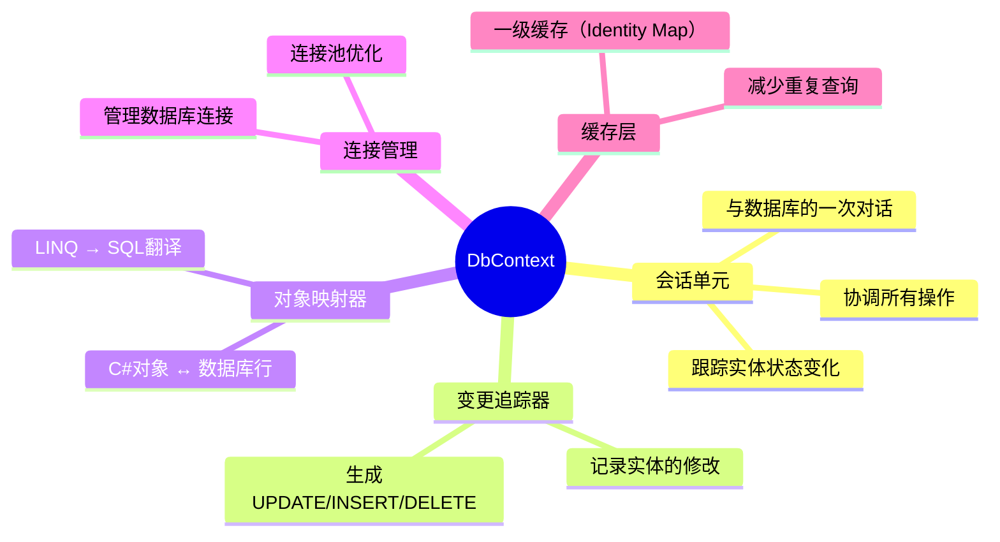
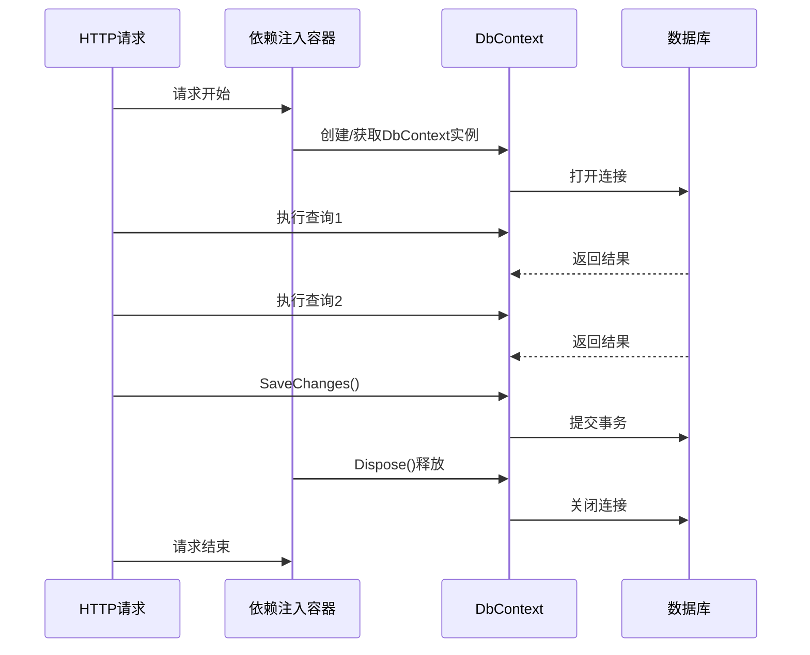
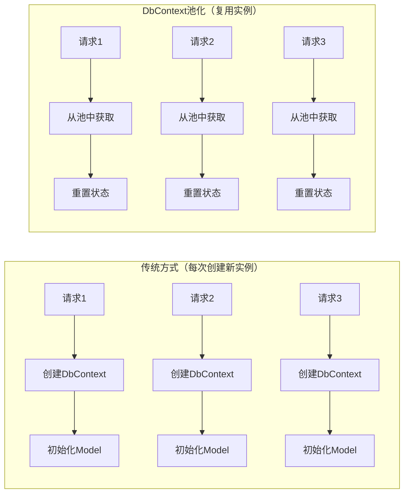
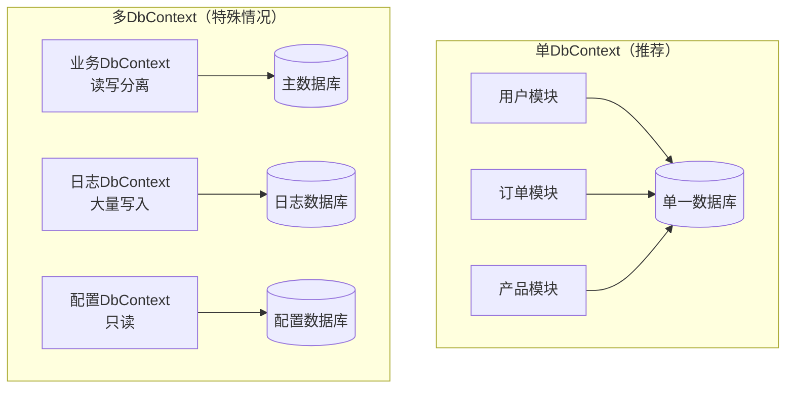

# DbContext配置 - 数据库上下文核心

> **学习目标**：深入理解DbContext的工作原理，掌握连接字符串配置、生命周期管理、性能优化和多数据库支持
> **前置知识**：Code First开发、依赖注入基础、ASP.NET Core配置系统
> **预计时长**：50分钟

---

## 一、DbContext是什么？

### 1.1 核心概念

**DbContext（数据库上下文）** 是EF Core中最核心的类，它代表：



### 1.2 生活化类比：购物车

把DbContext想象成**超市的购物车**：

- **购物车（DbContext）**：你购物的容器
- **商品（Entity）**：你挑选的商品对象
- **放入商品（Add）**：往车里加东西
- **修改数量（Update）**：调整已选商品
- **拿出商品（Remove）**：不想要了拿出来
- **结账（SaveChanges）**：一次性完成所有交易，生成账单（SQL）
- **清空重置（Dispose）**：购物结束，归还购物车

**关键点**：
- 操作都在内存中（购物车里的商品还没付款）
- 只有调用SaveChanges才会真正写入数据库（结账）
- 每次请求应该使用新的DbContext（每次购物用新车）

### 1.3 DbContext的核心职责

```csharp
public class ApplicationDbContext : DbContext
{
    // 职责1：定义实体集（DbSet属性）
    public DbSet<User> Users { get; set; }
    
    // 职责2：配置模型映射（OnModelCreating）
    protected override void OnModelCreating(ModelBuilder modelBuilder)
    {
        // 配置实体关系、索引、约束等
    }
    
    // 职责3：配置数据库提供程序（OnConfiguring）
    protected override void OnConfiguring(DbContextOptionsBuilder optionsBuilder)
    {
        // 配置连接字符串、日志等
    }
}
```

---

## 二、创建和配置DbContext

### 2.1 基础模板

```csharp
// Data/ApplicationDbContext.cs
using Microsoft.EntityFrameworkCore;

namespace MyProject.Data;

/// <summary>
/// 应用程序数据库上下文
/// </summary>
public class ApplicationDbContext : DbContext
{
    #region 构造函数
    
    /// <summary>
    /// 推荐构造函数 - 通过依赖注入接收选项
    /// </summary>
    public ApplicationDbContext(DbContextOptions<ApplicationDbContext> options)
        : base(options)
    {
    }
    
    #endregion
    
    #region DbSet属性 - 定义实体集
    
    /// <summary>
    /// 用户表
    /// </summary>
    public DbSet<User> Users { get; set; } = null!;
    
    /// <summary>
    /// 产品表
    /// </summary>
    public DbSet<Product> Products { get; set; } = null!;
    
    /// <summary>
    /// 订单表
    /// </summary>
    public DbSet<Order> Orders { get; set; } = null!;
    
    #endregion
    
    #region 模型配置
    
    /// <summary>
    /// 配置实体模型映射（核心方法！）
    /// </summary>
    protected override void OnModelCreating(ModelBuilder modelBuilder)
    {
        base.OnModelCreating(modelBuilder);
        
        // 应用所有实体配置（推荐使用IEntityTypeConfiguration）
        modelBuilder.ApplyConfigurationsFromAssembly(typeof(ApplicationDbContext).Assembly);
        
        // 全局配置
        ConfigureGlobalFilters(modelBuilder);
        ConfigureGlobalConventions(modelBuilder);
    }
    
    /// <summary>
    /// 配置全局查询过滤器
    /// </summary>
    private void ConfigureGlobalFilters(ModelBuilder modelBuilder)
    {
        // 示例：软删除过滤器
        modelBuilder.Entity<ISoftDeletable>().HasQueryFilter(e => !e.IsDeleted);
        
        // 示例：多租户过滤器（需要注入当前租户ID）
        // modelBuilder.Entity<IMultiTenant>()
        //     .HasQueryFilter(e => e.TenantId == CurrentTenantId);
    }
    
    /// <summary>
    /// 配置全局约定
    /// </summary>
    private void ConfigureGlobalConventions(ModelBuilder modelBuilder)
    {
        // 所有string类型默认最大长度为256
        foreach (var entity in modelBuilder.Model.GetEntityTypes())
        {
            foreach (var property in entity.GetProperties())
            {
                if (property.ClrType == typeof(string) && 
                    property.GetMaxLength() == null)
                {
                    property.SetMaxLength(256);
                }
            }
        }
    }
    
    #endregion
    
    #region 生命周期钩子方法（可选）
    
    public override async Task<int> SaveChangesAsync(CancellationToken cancellationToken = default)
    {
        // 自动设置时间戳
        SetTimestamps();
        
        // 软删除处理
        HandleSoftDelete();
        
        return await base.SaveChangesAsync(cancellationToken);
    }
    
    public override int SaveChanges()
    {
        SetTimestamps();
        HandleSoftDelete();
        return base.SaveChanges();
    }
    
    private void SetTimestamps()
    {
        var entries = ChangeTracker.Entries<BaseEntity>();
        
        var now = DateTime.UtcNow;
        
        foreach (var entry in entries)
        {
            switch (entry.State)
            {
                case EntityState.Added:
                    entry.Entity.CreatedAt = now;
                    entry.Entity.UpdatedAt = now;
                    break;
                    
                case EntityState.Modified:
                    entry.Entity.UpdatedAt = now;
                    break;
            }
        }
    }
    
    private void HandleSoftDelete()
    {
        var entries = ChangeTracker.Entries<ISoftDeletable>()
            .Where(e => e.State == EntityState.Deleted);
            
        foreach (var entry in entries)
        {
            entry.State = EntityState.Modified;
            entry.Entity.IsDeleted = true;
            entry.Entity.DeletedAt = DateTime.UtcNow;
        }
    }
    
    #endregion
}

// 支持接口
public interface ISoftDeletable
{
    bool IsDeleted { get; set; }
    DateTime? DeletedAt { get; set; }
}

// 基类实体
public abstract class BaseEntity
{
    public int Id { get; set; }
    public DateTime CreatedAt { get; set; }
    public DateTime? UpdatedAt { get; set; }
}
```

---

## 三、连接字符串配置详解

### 3.1 appsettings.json配置方式（推荐）

```json
// appsettings.json
{
  "Logging": {
    "LogLevel": {
      "Default": "Information",
      "Microsoft.AspNetCore": "Warning",
      "Microsoft.EntityFrameworkCore": "Information"
    }
  },
  
  "ConnectionStrings": {
    // SQL Server本地开发
    "DefaultConnection": "Server=(localdb)\\mssqllocaldb;Database=MyAppDb;Trusted_Connection=True;MultipleActiveResultSets=true;TrustServerCertificate=true;",
    
    // SQL Server生产环境
    "ProductionConnection": "Server=sqlserver.example.com,1433;Database=ProductionDb;User Id=myapp;Password=P@ssw0rd!;MultipleActiveResultSets=true;Encrypt=True;TrustServerCertificate=false;",
    
    // SQLite（适合开发和测试）
    "SqliteConnection": "Data Source=myapp.db",
    
    // PostgreSQL
    "PostgresConnection": "Host=localhost;Port=5432;Database=myappdb;Username=postgres;Password=postgres;"
  },
  
  "EFCoreSettings": {
    "EnableSensitiveDataLogging": false,
    "EnableDetailedErrors": false,
    "MaxRetryCount": 3,
    "CommandTimeout": 30,
    "EnablePooling": true,
    "PoolSize": 128
  }
}
```

### 3.2 Program.cs中的注册配置

```csharp
// Program.cs
using Microsoft.EntityFrameworkCore;
using MyProject.Data;

var builder = WebApplication.CreateBuilder(args);

// ====== 方式1：基本配置（最简单）======
builder.Services.AddDbContext<ApplicationDbContext>(options =>
    options.UseSqlServer(
        builder.Configuration.GetConnectionString("DefaultConnection")
    )
);

// ====== 方式2：完整配置（推荐用于生产环境）======
var connectionString = builder.Configuration.GetConnectionString("DefaultConnection");
var efSettings = builder.Configuration.GetSection("EFCoreSettings");

builder.Services.AddDbContext<ApplicationDbContext>(options =>
{
    options.UseSqlServer(connectionString, sqlOptions =>
    {
        // 重试策略（应对临时性故障）
        sqlOptions.EnableRetryOnFailure(
            maxRetryCount: efSettings.GetValue<int>("MaxRetryCount", 3),
            maxRetryDelay: TimeSpan.FromSeconds(30),
            errorNumbersToAdd: null
        );
        
        // 命令超时时间（秒）
        sqlOptions.CommandTimeout(efSettings.GetValue<int>("CommandTimeout", 30));
        
        // 批处理配置
        sqlOptions.MaxBatchSize(1000); // 批量操作的SQL语句数上限
    });
    
    // 敏感数据日志（仅开发环境启用！）
    if (builder.Environment.IsDevelopment())
    {
        options.EnableSensitiveDataLogging();
        options.EnableDetailedErrors();
    }
    
    // 日志输出
    options.LogTo(
        action: Console.WriteLine,
        minimumLevel: LogLevel.Information,
        eventIdFilter: null,
        loggerFactory: null
    );
});

// ====== 方式3：使用DbContext池化（高性能场景）======
// builder.Services.AddDbContextPool<ApplicationDbContext>(options =>
//     options.UseSqlServer(connectionString)
// );

var app = builder.Build();

// 验证数据库连接（可选，启动时检查）
using (var scope = app.Services.CreateScope())
{
    var db = scope.ServiceProvider.GetRequiredService<ApplicationDbContext>();
    try
    {
        // 测试连接是否可用
        db.Database.CanConnect();
        Console.WriteLine("✅ Database connection successful!");
    }
    catch (Exception ex)
    {
        Console.WriteLine($"❌ Database connection failed: {ex.Message}");
        // 生产环境可能需要更严格的处理
    }
}

app.Run();
```

### 3.3 常见数据库连接字符串格式

#### SQL Server

```csharp
// Windows身份验证（开发环境）
"Server=(localdb)\\mssqllocaldb;Database=MyDb;Trusted_Connection=True;"

// SQL Server Express
"Server=.\\SQLEXPRESS;Database=MyDb;Trusted_Connection=True;"

// SQL Server标准版/企业版
"Server=localhost,1433;Database=MyDb;User Id=sa;Password=YourPassword;"

// Azure SQL Database
"Server=tcp:myserver.database.windows.net,1433;Database=MyDb;User Id=myuser@myserver;Password=mypassword;Encrypt=True;"

// 常用参数说明：
// MultipleActiveResultSets=true   启用MARS（多活动结果集）
// Encrypt=True                   加密连接（SQL Server 2022+默认开启）
// TrustServerCertificate=true    开发环境信任证书
// Connect Timeout=30             连接超时（秒）
```

#### SQLite

```csharp
// 文件数据库（相对路径）
"Data Source=myapp.db"

// 文件数据库（绝对路径）
"Data Source=C:\\data\\myapp.db"

// 内存数据库（测试用）
"Data Source=:memory:"

// 共享缓存模式
"Data Source=myapp.db;Cache=Shared"

// WAL模式（更好的并发性能）
"Data Source=myapp.db;Mode=WAL;"
```

#### PostgreSQL

```csharp
// 基本格式
"Host=localhost;Port=5432;Database=mydb;Username=postgres;Password=password;"

// 使用连接池
"Host=localhost;Port=5432;Database=mydb;Username=postgres;Password=password;Pooling=true;Minimum Pool Size=5;Maximum Pool Size=100;"

// SSL连接
"Host=db.example.com;Port=5432;Database=mydb;Username=user;Password=pass;SSL Mode=Require;Trust Server Certificate=true;"
```

#### MySQL / MariaDB

```csharp
// 基本格式
"Server=localhost;Port=3306;Database=mydb;Uid=root;Pwd=password;"

// 字符集配置
"Server=localhost;Port=3306;Database=mydb;Uid=root;Pwd=password;Charset=utf8mb4;SslMode=Preferred;"
```

#### In-Memory（仅测试）

```csharp
// 纯内存数据库（进程结束后数据丢失）
options.UseInMemoryDatabase("TestDatabase");

// 注意：In-Memory数据库不支持事务和外键约束
// 仅适用于单元测试和快速原型验证
```

---

## 四、数据库提供程序安装

### 4.1 安装不同的数据库提供程序

```bash
# ==================== SQL Server（微软官方）====================
dotnet add package Microsoft.EntityFrameworkCore.SqlServer --version 8.0.*

# ==================== SQLite（轻量级，适合开发/移动端）====================
dotnet add package Microsoft.EntityFrameworkCore.Sqlite --version 8.0.*

# ==================== PostgreSQL（开源，功能强大）====================
# 官方推荐：Npgsql
dotnet add package Npgsql.EntityFrameworkCore.PostgreSQL --version 8.0.*

# ==================== MySQL / MariaDB ====================
# Pomelo是EF Core的MySQL提供程序
dotnet add package Pomelo.EntityFrameworkCore.MySql --version 8.0.*

# ==================== Oracle ====================
dotnet add package Devart.Data.Oracle.EFCore --version 10.*  # 商业版
# 或使用Oracle官方（需要Oracle Data Access Components）

# ==================== In-Memory（测试专用）====================
dotnet add package Microsoft.EntityFrameworkCore.InMemory --version 8.0.*
```

### 4.2 多数据库支持策略

```csharp
// Program.cs - 根据环境选择不同的数据库
var builder = WebApplication.CreateBuilder(args);

var dbProvider = builder.Configuration.GetValue<string>("DatabaseProvider") ?? "SqlServer";
var connectionString = builder.Configuration.GetConnectionString("DefaultConnection");

switch (dbProvider.ToLower())
{
    case "sqlserver":
        builder.Services.AddDbContext<AppDbContext>(options =>
            options.UseSqlServer(connectionString));
        break;
        
    case "sqlite":
        builder.Services.AddDbContext<AppDbContext>(options =>
            options.UseSqlite(connectionString));
        break;
        
    case "postgresql":
        builder.Services.AddDbContext<AppDbContext>(options =>
            options.UseNpgsql(connectionString));
        break;
        
    case "inmemory": // 仅测试
        builder.Services.AddDbContext<AppDbContext>(options =>
            options.UseInMemoryDatabase("TestDb"));
        break;
        
    default:
        throw new NotSupportedException($"Database provider '{dbProvider}' is not supported.");
}

// appsettings.Development.json
{
  "DatabaseProvider": "SQLite",
  "ConnectionStrings": {
    "DefaultConnection": "Data Source=dev.db"
  }
}

// appsettings.Production.json
{
  "DatabaseProvider": "SqlServer",
  "ConnectionStrings": {
    "DefaultConnection": "Server=prod.sql.server;Database=ProdDb;..."
  }
}
```

---

## 五、DbContext的生命周期（重要！）

### 5.1 为什么生命周期如此重要？



### 5.2 三种生命周期对比

| 生命周期 | 说明 | 适用场景 | 风险 |
|---------|------|---------|------|
| **Transient** | 每次注入都创建新实例 | ❌ 不推荐 | 连接泄漏、状态混乱 |
| **Scoped**（推荐） | 每个HTTP请求一个实例 | ✅ **Web应用首选** | 安全可靠 |
| **Singleton** | 整个应用只有一个实例 | ❌ **禁止使用** | 并发问题、内存泄漏 |

### 5.3 Scoped的重要性（必须理解！）

**为什么必须是Scoped？**

```csharp
// 错误示例：在Singleton服务中使用DbContext
public class SingletonService : ISingletonService
{
    private readonly ApplicationDbContext _context;
    
    // ❌ 这样会导致严重的并发问题！
    public SingletonService(ApplicationDbContext context)
    {
        _context = context; // DbContext被所有请求共享！
    }
    
    public async Task DoSomething()
    {
        // 问题1：ChangeTracker会无限增长
        // 问题2：并发访问导致数据错乱
        // 问题3：数据库连接无法正确释放
        var users = await _context.Users.ToListAsync();
    }
}

// ✅ 正确做法：使用Scoped或Transient服务
public class ScopedService : IScopedService
{
    private readonly IServiceScopeFactory _scopeFactory;
    
    public ScopedService(IServiceScopeFactory scopeFactory)
    {
        _scopeFactory = scopeFactory;
    }
    
    public async Task DoSomething()
    {
        // 在Singleton服务中手动创建Scope
        using var scope = _scopeFactory.CreateScope();
        var context = scope.ServiceProvider.GetRequiredService<ApplicationDbContext>();
        
        var users = await context.Users.ToListAsync();
    }
}
```

**最佳实践规则**：

```markdown
## ✅ 正确的使用方式

1. Controller中使用：直接通过构造函数注入（Controller本身是Scoped）
2. Service中使用：确保Service也是Scoped注册
3. 后台服务中：使用IServiceScopeFactory手动创建Scope
4. 中间件中使用：使用Invoke方法的参数注入

## ❌ 绝对避免的情况

1. 不要将DbContext注入到Singleton服务
2. 不要在静态字段或属性中保存DbContext
3. 不要在async void方法中使用DbContext（无法等待Dispose）
4. 不要跨线程共享同一个DbContext实例
```

### 5.4 不同场景下的正确用法

#### 场景1：Controller + Service（标准Web应用）

```csharp
// 注册
builder.Services.AddScoped<IUserService, UserService>();

// Service实现
public class UserService : IUserService
{
    private readonly ApplicationDbContext _context;
    
    // ✅ Service是Scoped，可以安全地注入Scoped的DbContext
    public UserService(ApplicationDbContext context)
    {
        _context = context;
    }
    
    public async Task<List<UserDto>> GetActiveUsersAsync()
    {
        return await _context.Users
            .Where(u => u.IsActive)
            .Select(u => new UserDto { /* ... */ })
            .ToListAsync();
    }
}
```

#### 场景2：后台服务（BackgroundService）

```csharp
public class EmailWorker : BackgroundService
{
    private readonly IServiceScopeFactory _scopeFactory;
    
    // BackgroundService是Singleton，不能直接注入DbContext
    public EmailWorker(IServiceScopeFactory scopeFactory)
    {
        _scopeFactory = scopeFactory;
    }
    
    protected override async Task ExecuteAsync(CancellationToken stoppingToken)
    {
        while (!stoppingToken.IsCancellationRequested)
        {
            // ✅ 手动创建Scope，确保DbContext正确释放
            using (var scope = _scopeFactory.CreateScope())
            {
                var context = scope.ServiceProvider.GetRequiredService<ApplicationDbContext>();
                
                // 处理待发送邮件
                var pendingEmails = await context.Emails
                    .Where(e => e.Status == EmailStatus.Pending)
                    .Take(100)
                    .ToListAsync(stoppingToken);
                
                foreach (var email in pendingEmails)
                {
                    // 发送邮件...
                    email.Status = EmailStatus.Sent;
                }
                
                await context.SaveChangesAsync(stoppingToken);
            }
            
            await Task.Delay(TimeSpan.FromMinutes(5), stoppingToken);
        }
    }
}
```

#### 场景3：中间件（Middleware）

```csharp
public class RequestLoggingMiddleware
{
    private readonly RequestDelegate _next;
    
    public RequestLoggingMiddleware(RequestDelegate next)
    {
        _next = next;
    }
    
    public async Task InvokeAsync(HttpContext context, ApplicationDbContext dbContext)
    {
        // ✅ 从Invoke方法参数注入，每个请求自动创建新实例
        var startTime = DateTime.UtcNow;
        
        try
        {
            await _next(context);
            
            // 记录请求日志到数据库
            var log = new RequestLog
            {
                Path = context.Request.Path.ToString(),
                Method = context.Request.Method,
                StatusCode = context.Response.StatusCode,
                DurationMs = (int)(DateTime.UtcNow - startTime).TotalMilliseconds,
                Timestamp = DateTime.UtcNow
            };
            
            dbContext.RequestLogs.Add(log);
            await dbContext.SaveChangesAsync();
        }
        catch (Exception ex)
        {
            // 异常处理
            throw;
        }
    }
}
```

---

## 六、DbContext池化（性能优化）

### 6.1 什么是DbContext池化？



**核心优势**：跳过模型初始化过程（这是最耗时的部分）！

### 6.2 如何启用池化？

```csharp
// Program.cs
// 将 AddDbContext 替换为 AddDbContextPool

// ❌ 传统方式
builder.Services.AddDbContext<ApplicationDbContext>(options =>
    options.UseSqlServer(connectionString));

// ✅ 池化方式（推荐用于高并发API）
builder.Services.AddDbContextPool<ApplicationDbContext>(options =>
    options.UseSqlServer(connectionString));

// 可配置池大小（默认128）
builder.Services.AddDbContextPool<ApplicationDbContext>(options =>
    options.UseSqlServer(connectionString),
    poolSize: 256 // 根据实际并发量调整
);
```

### 6.3 性能对比数据

| 指标 | 传统方式 | 池化方式 | 提升 |
|------|---------|---------|------|
| **首次请求耗时** | ~150ms | ~150ms | 相同 |
| **后续请求耗时** | ~15ms | ~3ms | **5倍提升** |
| **内存占用** | 较高 | 较低 | 节省20-30% |
| **GC压力** | 较大 | 较小 | 明显改善 |

### 6.4 池化的限制和注意事项

⚠️ **以下情况不能使用池化**：

```csharp
// 1. 在DbContext中维护自定义状态或字段
public class ApplicationDbContext : DbContext
{
    private string _currentUser; // ❌ 自定义状态不会被重置！
    
    public void SetCurrentUser(string user)
    {
        _currentUser = user;
    }
}

// 2. 重写OnConfiguring并维护私有字段
protected override void OnConfiguring(DbContextOptionsBuilder optionsBuilder)
{
    // 如果这里使用了外部状态，可能导致问题
}

// 3. 需要在Dispose时执行特殊逻辑
public override void Dispose()
{
    // 自定义清理逻辑可能不会执行
    base.Dispose();
}
```

✅ **大多数情况下都可以安全使用池化**！

---

## 七、多DbContext场景处理

### 7.1 什么时候需要多个DbContext？



**适用场景**：
- **读写分离**：主库读写 + 从库只读
- **微服务架构**：不同服务使用独立数据库
- **日志/审计系统**：日志量巨大，单独存储
- **多租户系统**：每个租户独立的Schema或数据库

### 7.2 多DbContext的实现示例

```csharp
// ==================== 主业务DbContext ====================
// Data/BusinessDbContext.cs
public class BusinessDbContext : DbContext
{
    public BusinessDbContext(DbContextOptions<BusinessDbContext> options)
        : base(options)
    {
    }

    // 业务实体
    public DbSet<User> Users { get; set; }
    public DbSet<Product> Products { get; set; }
    public DbSet<Order> Orders { get; set; }
    
    protected override void OnModelCreating(ModelBuilder modelBuilder)
    {
        base.OnModelCreating(modelBuilder);
        
        // 应用业务实体的配置
        modelBuilder.ApplyConfiguration(new UserConfiguration());
        modelBuilder.ApplyConfiguration(new ProductConfiguration());
        modelBuilder.ApplyConfiguration(new OrderConfiguration());
    }
}

// ==================== 日志DbContext ====================
// Data/LogDbContext.cs
public class LogDbContext : DbContext
{
    public LogDbContext(DbContextOptions<LogDbContext> options)
        : base(options)
    {
    }

    // 日志相关实体
    public DbSet<RequestLog> RequestLogs { get; set; }
    public DbSet<ErrorLog> ErrorLogs { get; set; }
    public DbSet<AuditLog> AuditLogs { get; set; }
    public DbSet<OperationLog> OperationLogs { get; set; }
    
    protected override void OnModelCreating(ModelBuilder modelBuilder)
    {
        base.OnModelCreating(modelBuilder);
        
        // 日志表的特殊配置
        modelBuilder.Entity<RequestLog>(entity =>
        {
            entity.ToTable("RequestLogs");
            entity.HasIndex(e => e.Timestamp);
            entity.HasIndex(e => e.Path);
            entity.HasIndex(e => e.StatusCode);
        });
        
        // 定期分区策略（如果数据库支持）
        // ...
    }
}

// ==================== 只读配置DbContext ====================
// Data/ReadOnlyConfigDbContext.cs
public class ReadOnlyConfigDbContext : DbContext
{
    public ReadOnlyConfigDbContext(DbContextOptions<ReadOnlyConfigDbContext> options)
        : base(options)
    {
    }

    // 系统配置（只读）
    public DbSet<SystemConfig> SystemConfigs { get; set; }
    public DbSet<DictionaryItem> DictionaryItems { get; set; }
    
    protected override void OnModelCreating(ModelBuilder modelBuilder)
    {
        base.OnModelCreating(modelBuilder);
        
        // 全局查询优化：只读上下文不需要变更追踪
        // （但通常在使用时通过AsNoTracking控制）
    }
    
    // 重写SaveChanges防止意外写入
    public override int SaveChanges()
    {
        throw new InvalidOperationException("This context is read-only.");
    }
    
    public override Task<int> SaveChangesAsync(CancellationToken cancellationToken = default)
    {
        throw new InvalidOperationException("This context is read-only.");
    }
}
```

### 7.3 注册多个DbContext

```csharp
// Program.cs
var builder = WebApplication.CreateBuilder(args);

// 注册主业务DbContext（读写）
builder.Services.AddDbContext<BusinessDbContext>(options =>
    options.UseSqlServer(
        builder.Configuration.GetConnectionString("BusinessConnection"),
        sqlOptions => sqlOptions.CommandTimeout(30)
    )
);

// 注册日志DbContext（可指向不同数据库）
builder.Services.AddDbContext<LogDbContext>(options =>
    options.UseSqlServer(
        builder.Configuration.GetConnectionString("LogConnection")
    )
);

// 注册只读配置DbContext（可指向从库）
builder.Services.AddDbContext<ReadOnlyConfigDbContext>(options =>
    options.UseSqlServer(
        builder.Configuration.GetConnectionString("ReadOnlyConnection")
    )
);

// 使用示例
public class OrderService : IOrderService
{
    private readonly BusinessDbContext _businessContext;
    private readonly LogDbContext _logContext;
    
    public OrderService(BusinessDbContext businessContext, LogDbContext logContext)
    {
        _businessContext = businessContext;
        _logContext = logContext;
    }
    
    public async Task CreateOrderAsync(OrderDto dto)
    {
        // 使用业务DbContext执行业务逻辑
        var order = new Order { /* ... */ };
        _businessContext.Orders.Add(order);
        await _businessContext.SaveChangesAsync();
        
        // 使用日志DbContext记录操作日志
        _logContext.OperationLogs.Add(new OperationLog
        {
            Action = "CreateOrder",
            EntityId = order.Id,
            Details = $"Order created for user {dto.UserId}",
            Timestamp = DateTime.UtcNow
        });
        await _logContext.SaveChangesAsync();
    }
}
```

---

## 八、完整的Program.cs最佳实践模板

### 8.1 生产级配置模板

```csharp
// Program.cs
using Microsoft.EntityFrameworkCore;
using MyProject.Data;
using Serilog; // 推荐使用Serilog记录结构化日志

// ====== 1. 配置Serilog（可选但推荐）======
Log.Logger = new LoggerConfiguration()
    .WriteTo.Console()
    .WriteTo.File("logs/myapp-.txt", rollingInterval: RollingInterval.Day)
    .CreateLogger();

try
{
    Log.Information("Starting application...");

    var builder = WebApplication.CreateBuilder(args);

    // 使用Serilog替代默认日志
    builder.Host.UseSerilog();

    // ====== 2. 配置服务 ======

    // 读取配置
    var connectionString = builder.Configuration.GetConnectionString("DefaultConnection");
    var isDevelopment = builder.Environment.IsDevelopment();
    var efSettings = builder.Configuration.GetSection("EFCoreSettings");

    // 注册DbContext（带完整配置）
    builder.Services.AddDbContextPool<ApplicationDbContext>(options =>
    {
        // 数据库提供程序
        options.UseSqlServer(connectionString, sqlOptions =>
        {
            // 弹性重试策略
            sqlOptions.EnableRetryOnFailure(
                maxRetryCount: efSettings.GetValue<int>("MaxRetryCount", 3),
                maxRetryDelay: TimeSpan.FromSeconds(30),
                errorNumbersToAdd: null
            );

            // 命令超时
            sqlOptions.CommandTimeout(
                efSettings.GetValue<int>("CommandTimeout", 60)
            );

            // 批处理配置
            sqlOptions.MaxBatchSize(1000);
            
            // 使用QuerySplittingBehavior.SplitQuery拆分复杂查询
            // 防止Cartesian Explosion（笛卡尔爆炸）问题
            sqlOptions.UseQuerySplittingBehavior(QuerySplittingBehavior.SplitQuery);
        });

        // 开发环境敏感数据日志
        if (isDevelopment)
        {
            options.EnableSensitiveDataLogging();
            options.EnableDetailedErrors();
        }

        // 结构化日志输出
        options.LogTo(
            action: Log.Debug,
            minimumLevel: LogLevel.Information,
            eventIdFilter: id => id == RelationalEventId.ExecutedCommand,
            loggerFactory: null
        );
    }, poolSize: 256);

    // 其他服务注册
    builder.Services.AddControllers();
    builder.Services.AddEndpointsApiExplorer();
    builder.Services.AddSwaggerGen();

    // 注册应用服务
    builder.Services.AddScoped<IUserService, UserService>();
    builder.Services.AddScoped<IOrderService, OrderService>();

    // ====== 3. 构建应用 ======
    var app = builder.Build();

    // ====== 4. 中间件管道 ======

    if (isDevelopment)
    {
        app.UseSwagger();
        app.UseSwaggerUI();
    }

    app.UseHttpsRedirection();
    app.UseAuthorization();
    app.MapControllers();

    // ====== 5. 启动时健康检查 ======
    Log.Information("Performing startup health checks...");

    using (var scope = app.Services.CreateScope())
    {
        var services = scope.ServiceProvider;
        
        try
        {
            var context = services.GetRequiredService<ApplicationDbContext>();
            
            // 检查数据库连接
            var canConnect = await context.Database.CanConnectAsync();
            if (!canConnect)
            {
                throw new Exception("Cannot connect to database!");
            }
            
            // 检查待执行的迁移（可选）
            var pendingMigrations = await context.Database.GetPendingMigrationsAsync();
            if (pendingMigrations.Any())
            {
                Log.Warning("There are pending migrations: {Migrations}", 
                    string.Join(", ", pendingMigrations));
                
                // 开发环境自动迁移（生产环境应该通过CI/CD执行）
                if (isDevelopment)
                {
                    Log.Information("Auto-applying migrations in development...");
                    await context.Database.MigrateAsync();
                }
            }
            
            Log.Information("✅ All health checks passed!");
        }
        catch (Exception ex)
        {
            Log.Fatal(ex, "Application start-up failed!");
            throw;
        }
    }

    // ====== 6. 启动应用 ======
    Log.Information("Application started successfully!");
    app.Run();
}
catch (Exception ex)
{
    Log.Fatal(ex, "Application terminated unexpectedly!");
}
finally
{
    Log.CloseAndFlush();
}
```

### 8.2 appsettings.json完整示例

```json
{
  "$schema": "https://json.schemastore.org/appsettings.json",
  "Logging": {
    "LogLevel": {
      "Default": "Information",
      "Microsoft.AspNetCore": "Warning",
      "Microsoft.EntityFrameworkCore.Database.Command": "Information"
    }
  },
  "AllowedHosts": "*",
  
  "ConnectionStrings": {
    "DefaultConnection": "Server=(localdb)\\mssqllocaldb;Database=MyAppDb;Trusted_Connection=True;MultipleActiveResultSets=true;TrustServerCertificate=true;"
  },
  
  "EFCoreSettings": {
    "EnableSensitiveDataLogging": false,
    "EnableDetailedErrors": false,
    "MaxRetryCount": 3,
    "CommandTimeout": 60,
    "EnablePooling": true,
    "PoolSize": 128,
    "UseQuerySplitting": true
  },
  
  "Serilog": {
    "MinimumLevel": {
      "Default": "Information",
      "Override": {
        "Microsoft": "Warning",
        "System": "Warning"
      }
    },
    "WriteTo": [
      { "Name": "Console" },
      {
        "Name": "File",
        "Args": {
          "path": "logs/log-.txt",
          "rollingInterval": "Day",
          "retentionPeriodDays": 30
        }
      }
    ]
  }
}
```

---

## 九、常见问题和解决方案

### 9.1 FAQ

**Q1：DbContext应该在什么时候Dispose？**

A：当使用依赖注入时，ASP.NET Core框架会**自动管理**DbContext的生命周期。你只需要：
- 通过构造函数注入使用
- 不需要手动调用Dispose()

**Q2：一个请求中可以使用多个DbContext吗？**

A：可以，但不建议跨DbContext操作同一批数据。如果必须使用，注意事务管理。

**Q3：如何查看EF Core生成的SQL？**

A：有三种方式：
1. `EnableSensitiveDataLogging()` + `LogTo()` （开发环境）
2. SQL Server Profiler / Azure Data Studio
3. MiniProfiler等第三方工具

**Q4：DbContext池化和普通方式的区别？**

A：池化会复用DbContext实例，跳过模型初始化。对于无状态的Web API，强烈推荐使用池化。

**Q5：如何在单元测试中使用DbContext？**

A：使用In-Memory数据库或SQLite的In-Memory模式：
```csharp
// 单元测试中的配置
var options = new DbContextOptionsBuilder<TestDbContext>()
    .UseInMemoryDatabase(databaseName: "TestDb_" + Guid.NewGuid().ToString()) // 每个测试唯一名称
    .Options;

var context = new TestDbContext(options);
```

### 9.2 性能监控指标

建议在生产环境中监控以下指标：

```csharp
// 可以添加到健康检查或监控端点
public class DbMetrics
{
    public long ActiveConnections { get; set; }
    public long AvailableConnections { get; set; }
    public double AverageQueryTimeMs { get; set; }
    public long QueriesPerSecond { get; set; }
    public long FailedQueries { get; set; }
    public long PoolSize { get; set; }
}
```

---

## 十、总结与最佳实践清单

### 10.1 本章要点回顾

✅ **DbContext核心概念**：会话单元、变更追踪器、对象映射器  
✅ **连接字符串配置**：appsettings.json + 多种数据库格式  
✅ **数据库提供程序**：SQL Server、SQLite、PostgreSQL等  
✅ **生命周期管理**：**必须使用Scoped**，禁止Singleton  
✅ **DbContext池化**：性能提升5倍，推荐高并发场景使用  
✅ **多DbContext**：特殊场景下的解决方案  
✅ **完整配置模板**：可直接用于生产环境的代码  

### 10.2 最佳实践清单

```markdown
## ✅ 必须遵守

1. **始终使用Scoped生命周期**：Web应用中DbContext必须是Scoped
2. **使用AddDbContextPool**：除非有特殊需求，否则启用池化
3. **配置重试策略**：生产环境必须启用EnableRetryOnFailure
4. **设置合理的超时时间**：根据业务复杂度设置CommandTimeout
5. **开发环境启用日志**：EnableSensitiveDataLogging + EnableDetailedErrors
6. **启动时验证连接**：CanConnect()检查数据库可用性

## 💡 推荐做法

7. **使用IEntityTypeConfiguration**：保持OnModelCreating整洁
8. **封装SaveChanges**：自动填充时间戳、处理软删除
9. **使用Serilog**：结构化日志便于排查问题
10. **环境区分配置**：开发/测试/生产使用不同连接串
11. **监控数据库指标**：连接池、查询耗时、错误率

## ⚠️ 注意事项

12. 不要在静态成员中保存DbContext
13. 不要跨线程共享DbContext
14. 不要在Singleton服务中直接注入DbContext
15. 不要忽略异步方法的CancellationToken
16. 不要在生产环境启用SensitiveDataLogging
```

---

## 十一、练习题

### 练习1：概念理解

1. **为什么Web应用中DbContext必须注册为Scoped？**
   - A. 为了节省内存
   - B. 因为每个HTTP请求需要独立的数据库会话和变更追踪
   - C. 因为Scoped是默认的生命周期
   
   **答案：B**

2. **DbContext池化的主要优势是什么？**
   - A. 减少内存使用
   - B. 跳过模型初始化过程，显著提高性能
   - C. 支持更多并发连接
   
   **答案：B**

3. **以下哪种情况不适合使用DbContext池化？**
   - A. 高并发的只读API
   - B. 在DbContext中维护了自定义的状态字段
   - C. 标准的CRUD Web应用
   
   **答案：B**

### 练习2：动手实践

基于本节的配置模板，完成以下任务：

1. **创建完整的项目配置**：
   - 配置appsettings.json包含开发环境和生产环境的连接字符串
   - 实现带完整错误处理的Program.cs
   - 添加启动时的数据库健康检查

2. **实现多DbContext场景**：
   - 创建BusinessDbContext（主业务）
   - 创建AuditLogDbContext（审计日志，可指向不同数据库）
   - 在Service中演示两个DbContext的协作使用

3. **添加性能监控**：
   - 创建一个健康检查端点返回数据库状态信息
   - 记录每次请求的数据库查询耗时

**参考答案提示**：
```csharp
// 1. 健康检查端点示例
app.MapGet("/health/db", async (ApplicationDbContext context) =>
{
    var health = new
    {
        CanConnect = await context.Database.CanConnectAsync(),
        PendingMigrations = (await context.Database.GetPendingMigrationsAsync()).ToList(),
        ConnectionString = context.Database.GetConnectionString()?.Replace("Password=", "***")
    };
    return Results.Ok(health);
});

// 2. 审计日志记录示例
public class AuditableDbContext : DbContext
{
    // ...其他配置...
    
    public override async Task<int> SaveChangesAsync(CancellationToken cancellationToken = default)
    {
        // 捕获变更
        var changes = ChangeTracker.Entries()
            .Where(e => e.State == EntityState.Added || 
                       e.State == EntityState.Modified || 
                       e.State == EntityState.Deleted)
            .ToList();
        
        var result = await base.SaveChangesAsync(cancellationToken);
        
        // 异步记录审计日志（不阻塞主流程）
        _ = Task.Run(async () =>
        {
            using var scope = _scopeFactory.CreateScope();
            var auditContext = scope.ServiceProvider.GetRequiredService<AuditLogDbContext>();
            
            foreach (var entry in changes)
            {
                auditContext.AuditLogs.Add(new AuditLog
                {
                    TableName = entry.Metadata.GetTableName(),
                    Action = entry.State.ToString(),
                    EntityId = entry.Properties.FirstOrDefault(p => p.IsPrimaryKey())?.CurrentValue?.ToString(),
                    Changes = SerializeChanges(entry),
                    ChangedBy = _currentUserAccessor.UserId,
                    ChangedAt = DateTime.UtcNow
                });
            }
            
            await auditContext.SaveChangesAsync();
        });
        
        return result;
    }
}
```

### 练习3：思考题

1. **在高并发场景下（如每秒1000+请求），如何进一步优化DbContext的性能？**

   提示：考虑连接池大小、AsNoTracking、查询缓存、读写分离...

2. **如果你的应用需要同时连接MySQL和PostgreSQL（例如从MySQL迁移数据到PostgreSQL），应该如何设计DbContext？**

   提示：多DbContext + 数据同步服务 + ETL流程...

3. **在微服务架构中，每个服务都有独立的数据库。那么跨服务的查询（如订单服务需要查询用户信息）该如何处理？**

   提示：API网关、事件驱动、数据冗余、CQRS模式...

---

## 参考资源

- **官方文档**：https://docs.microsoft.com/ef/core/dbcontext-configuration/
- **连接字符串参考**：https://www.connectionstrings.com/
- **DbContext生命周期**：https://docs.microsoft.com/ef/core/dbcontext-configuration/#dbcontext-lifetime
- **性能优化指南**：https://docs.microsoft.com/ef/core/performance/

---

> **下一节预告**：[数据迁移](./数据迁移.md) - 学习如何使用EF Core的迁移功能进行数据库版本控制，像管理代码一样管理数据库结构的变更！
