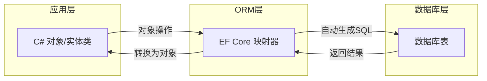
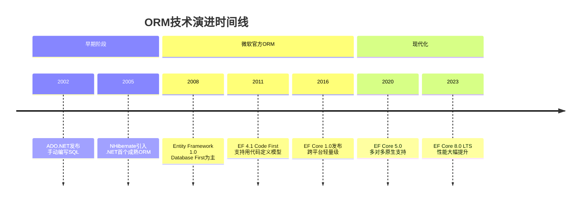
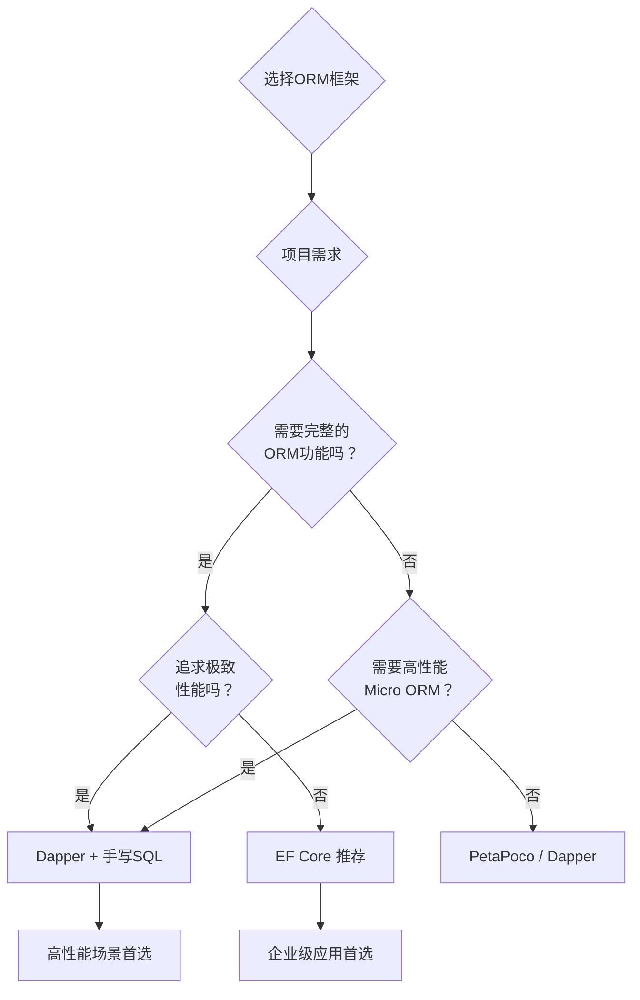
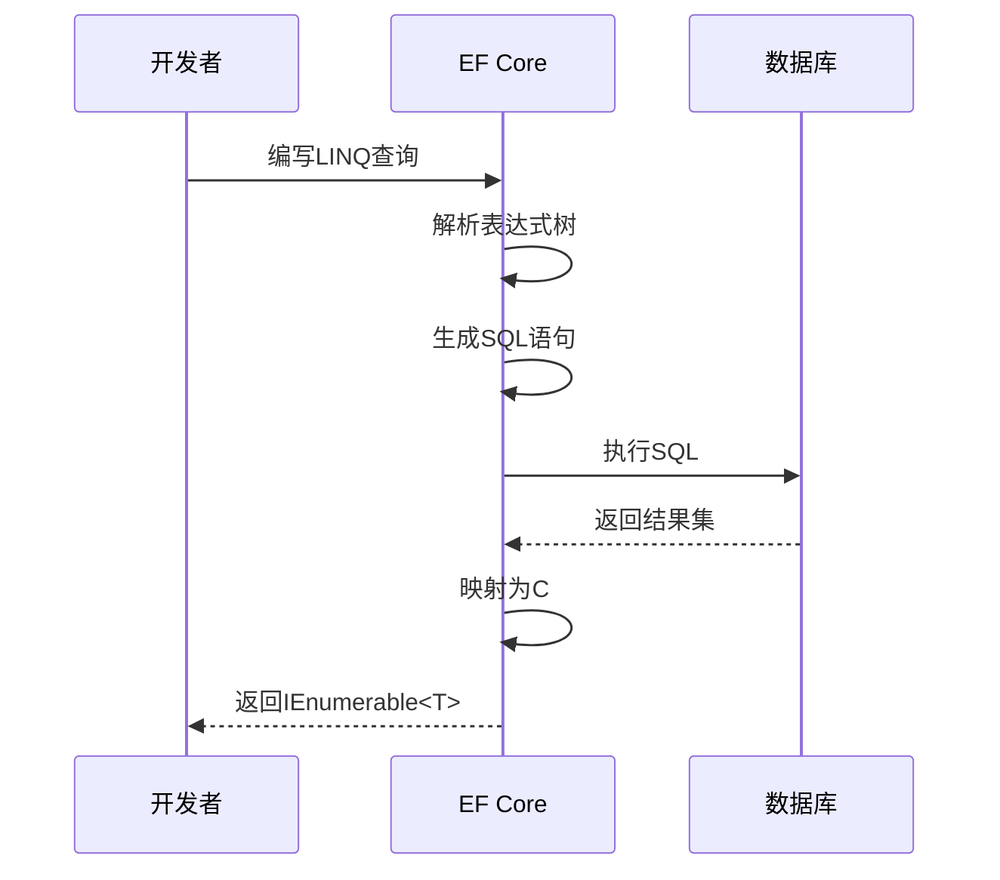
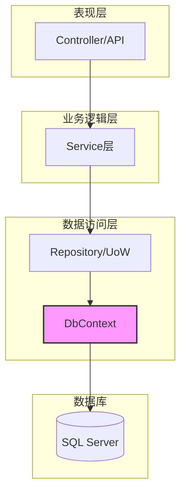
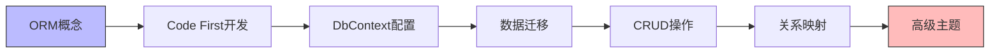

# ORM概念 - 对象关系映射基础

> **学习目标**：理解ORM的核心概念、发展历程、优劣势对比，掌握EF Core的基本使用场景
> **前置知识**：C#基础、面向对象编程、SQL基础、MVC架构基础
> **预计时长**：45分钟

---

## 一、什么是ORM？为什么需要ORM？

### 1.1 核心定义

**ORM（Object-Relational Mapping，对象关系映射）** 是一种程序设计技术，用于实现面向对象编程语言与关系型数据库之间的数据转换。

简单来说，ORM就是让你能够用**操作对象的方式**来操作数据库，而不需要直接编写SQL语句。



### 1.2 生活化类比：翻译官比喻

想象你是一个只会说中文的程序员，而数据库只听得懂SQL语言。这时候你需要一个**翻译官（ORM）**：

- **没有ORM时**：你必须自己学SQL，手写每一句查询语句
- **有了ORM后**：你只需要用熟悉的C#告诉翻译官你要什么，翻译官会自动帮你转换成SQL去和数据库沟通

**实际例子**：
```csharp
// 没有ORM - 手写SQL
string sql = "SELECT * FROM Users WHERE Age > 18 ORDER BY CreateTime DESC";
var users = await connection.QueryAsync<User>(sql);

// 有ORM - 用C#思维
var users = context.Users
    .Where(u => u.Age > 18)
    .OrderByDescending(u => u.CreateTime)
    .ToList();
```

---

## 二、ORM的历史和发展

### 2.1 从ADO.NET到EF Core的演进历程



### 2.2 各版本关键特性对比

| 版本 | 发布年份 | 关键特性 | 状态 |
|------|---------|---------|------|
| EF 6 | 2013 | 稳定成熟，仅Windows | 维护模式 |
| EF Core 2.x | 2017-2018 | 跨平台，基础功能完善 | 已停止支持 |
| EF Core 3.x | 2019-2020 | LINQ改进，查询拆分 | 已停止支持 |
| EF Core 5.x | 2020-2022 | 原生多对多，拆分表 | 已停止支持 |
| EF Core 6.x | 2021-2024 | 性能优化，JSON列 | 已停止支持 |
| **EF Core 8.x** | **2023-2025** | **LTS版本，推荐使用** | ✅ **当前LTS** |

### 2.3 为什么选择EF Core？

**EF Core（Entity Framework Core）** 是微软推出的新一代轻量级、跨平台的ORM框架，相比传统EF具有以下优势：

✅ **跨平台支持**：可在Windows、Linux、macOS上运行  
✅ **性能优秀**：比EF 6快很多，接近手写SQL的性能  
✅ **现代化API**：支持异步操作、依赖注入  
✅ **灵活的配置方式**：Data Annotations + Fluent API  
✅ **活跃的社区**：持续更新，文档完善  

---

## 三、ORM的优势和劣势对比

### 3.1 全面对比表格

| 维度 | ORM优势 | ORM劣势 |
|------|--------|---------|
| **开发效率** | ⭐⭐⭐⭐⭐ 快速开发，减少重复代码 | 需要学习框架API |
| **可维护性** | ⭐⭐⭐⭐⭐ 代码清晰，业务逻辑集中 | 复杂查询可能不够直观 |
| **数据库无关性** | ⭐⭐⭐⭐⭐ 切换数据库只需改提供程序 | 特定数据库特性可能无法使用 |
| **类型安全** | ⭐⭐⭐⭐⭐ 编译期检查，重构友好 | - |
| **性能** | ⭐⭐⭐ 对于大多数场景足够 | ⚠️ 极端性能场景不如手写SQL |
| **学习曲线** | ⭐⭐⭐ 掌握基础即可上手 | 深入掌握需要时间 |
| **调试难度** | ⭐⭐⭐ 生成的SQL可查看 | ⚠️ 复杂LINQ生成的SQL难以预测 |
| **团队协作** | ⭐⭐⭐⭐⭐ 统一规范，代码风格一致 | 团队需要统一培训 |

### 3.2 适用场景分析

#### ✅ 推荐使用ORM的场景：
- **CRUD密集型应用**：增删改查占主导的业务系统
- **快速原型开发**：MVP、内部工具、管理系统
- **团队协作项目**：需要统一编码规范的多人项目
- **数据库结构稳定**：表结构不会频繁变化的项目
- **中小型项目**：数据量在百万级以下

#### ❌ 不建议使用ORM的场景：
- **批量数据处理**：需要处理千万级以上数据的ETL任务
- **复杂报表查询**：涉及多表关联、分组聚合的统计报表
- **对性能要求极高**：高频交易系统、实时竞价系统
- **需要利用特定数据库特性**：存储过程、窗口函数等
- **遗留系统集成**：需要兼容旧有存储过程的系统

---

## 四、主流ORM框架对比

### 4.1 .NET生态四大ORM框架

| 特性 | **EF Core** | **Dapper** | **NHibernate** | **PetaPoco** |
|------|------------|-----------|---------------|--------------|
| **类型** | 完整ORM | Micro ORM | 完整ORM | Micro ORM |
| **性能** | ⭐⭐⭐⭐ | ⭐⭐⭐⭐⭐ | ⭐⭐⭐ | ⭐⭐⭐⭐⭐ |
| **易用性** | ⭐⭐⭐⭐⭐ | ⭐⭐⭐ | ⭐⭐⭐ | ⭐⭐⭐⭐ |
| **功能完整度** | ⭐⭐⭐⭐⭐ | ⭐⭐⭐ | ⭐⭐⭐⭐⭐ | ⭐⭐⭐ |
| **迁移支持** | ✅ 内置 | ❌ 需第三方 | ✅ 内置 | ❌ |
| **LINQ支持** | ✅ 完整 | ❌ 需扩展 | ✅ 完整 | ❌ |
| **学习成本** | 中等 | 低 | 高 | 低 |
| **适用场景** | 企业级应用 | 高性能查询 | 复杂领域模型 | 轻量级项目 |
| **维护状态** | 活跃维护 | 活跃维护 | 维护中 | 低频更新 |

### 4.2 如何选择合适的ORM？



**我的推荐**：
- **90%的项目** → 使用 **EF Core**（功能全面，微软官方支持）
- **需要极致性能** → 使用 **Dapper**（Stack Overflow出品，性能卓越）
- **混合使用** → EF Core负责常规CRUD + Dapper负责复杂查询

---

## 五、EF Core版本选择建议

### 5.1 当前推荐版本（2024年）

**强烈推荐：EF Core 8.0 LTS**

理由：
✅ **长期支持（LTS）**：支持到2026年11月  
✅ **性能提升**：相比7.0提升20%+  
✅ **新特性丰富**：原始集合、JSON列、HIERARCHYID等  
✅ **稳定性好**：经过充分测试，生产环境验证  
✅ **文档完善**：官方文档齐全，社区资源丰富  

### 5.2 安装EF Core 8.0

```bash
# 安装核心包
dotnet add package Microsoft.EntityFrameworkCore --version 8.0.*

# 安装SQL Server提供程序
dotnet add package Microsoft.EntityFrameworkCore.SqlServer --version 8.0.*

# 安装迁移工具（全局）
dotnet tool install --global dotnet-ef --version 8.*
```

---

## 六、第一个EF Core示例：不写SQL就能查询数据库

让我们通过一个完整的示例来体验EF Core的魅力！

### 6.1 项目准备

创建一个新的ASP.NET Core Web API项目：

```bash
dotnet new webapi -n EfCoreDemo
cd EfCoreDemo
```

### 6.2 定义实体类

```csharp
// Models/Product.cs
namespace EfCoreDemo.Models;

public class Product
{
    public int Id { get; set; }
    
    [Required]
    [StringLength(100)]
    public string Name { get; set; } = string.Empty;
    
    [Column(TypeName = "decimal(18,2)")]
    public decimal Price { get; set; }
    
    public string? Description { get; set; }
    
    public bool IsActive { get; set; } = true;
    
    public DateTime CreatedAt { get; set; } = DateTime.Now;
}
```

### 6.3 创建DbContext

```csharp
// Data/ApplicationDbContext.cs
using EfCoreDemo.Models;
using Microsoft.EntityFrameworkCore;

namespace EfCoreDemo.Data;

public class ApplicationDbContext : DbContext
{
    public ApplicationDbContext(DbContextOptions<ApplicationDbContext> options)
        : base(options)
    {
    }

    public DbSet<Product> Products { get; set; } = null!;
    
    protected override void OnModelCreating(ModelBuilder modelBuilder)
    {
        base.OnModelCreating(modelBuilder);
        
        // 配置Product实体
        modelBuilder.Entity<Product>(entity =>
        {
            entity.ToTable("Products");
            entity.HasKey(e => e.Id);
            entity.Property(e => e.Name).IsRequired().HasMaxLength(100);
            entity.HasIndex(e => e.Name); // 为名称创建索引
        });
    }
}
```

### 6.4 配置连接字符串

```json
// appsettings.json
{
  "Logging": {
    "LogLevel": {
      "Default": "Information",
      "Microsoft.AspNetCore": "Warning"
    }
  },
  "AllowedHosts": "*",
  "ConnectionStrings": {
    "DefaultConnection": "Server=(localdb)\\mssqllocaldb;Database=EfCoreDemoDb;Trusted_Connection=True;MultipleActiveResultSets=true"
  }
}
```

### 6.5 注册服务

```csharp
// Program.cs
using EfCoreDemo.Data;
using Microsoft.EntityFrameworkCore;

var builder = WebApplication.CreateBuilder(args);

// 添加DbContext到依赖注入容器
builder.Services.AddDbContext<ApplicationDbContext>(options =>
    options.UseSqlServer(builder.Configuration.GetConnectionString("DefaultConnection")));

// 添加控制器
builder.Services.AddControllers();

var app = builder.Build();

app.MapControllers();
app.Run();
```

### 6.6 创建控制器并实现CRUD

```csharp
// Controllers/ProductsController.cs
using EfCoreDemo.Data;
using EfCoreDemo.Models;
using Microsoft.AspNetCore.Mvc;
using Microsoft.EntityFrameworkCore;

namespace EfCoreDemo.Controllers;

[ApiController]
[Route("api/[controller]")]
public class ProductsController : ControllerBase
{
    private readonly ApplicationDbContext _context;
    
    public ProductsController(ApplicationDbContext context)
    {
        _context = context;
    }
    
    /// <summary>
    /// 获取所有产品（演示Read操作）
    /// </summary>
    [HttpGet]
    public async Task<ActionResult<IEnumerable<Product>>> GetProducts()
    {
        // 看看！完全没有SQL，就像操作List一样简单
        var products = await _context.Products
            .Where(p => p.IsActive) // 过滤条件
            .OrderByDescending(p => p.CreatedAt) // 排序
            .ToListAsync(); // 异步执行
        
        return Ok(products);
    }
    
    /// <summary>
    /// 根据ID获取单个产品
    /// </summary>
    [HttpGet("{id}")]
    public async Task<ActionResult<Product>> GetProduct(int id)
    {
        var product = await _context.Products.FindAsync(id);
        
        if (product == null)
        {
            return NotFound();
        }
        
        return Ok(product);
    }
    
    /// <summary>
    /// 创建新产品（演示Create操作）
    /// </summary>
    [HttpPost]
    public async Task<ActionResult<Product>> CreateProduct(Product product)
    {
        // 将新对象添加到上下文
        _context.Products.Add(product);
        
        // 保存到数据库（EF Core自动生成INSERT SQL）
        await _context.SaveChangesAsync();
        
        return CreatedAtAction(nameof(GetProduct), new { id = product.Id }, product);
    }
    
    /// <summary>
    /// 更新产品（演示Update操作）
    /// </summary>
    [HttpPut("{id}")]
    public async Task<IActionResult> UpdateProduct(int id, Product product)
    {
        if (id != product.Id)
        {
            return BadRequest();
        }
        
        // 标记为已修改，EF Core会自动生成UPDATE SQL
        _context.Entry(product).State = EntityState.Modified;
        
        try
        {
            await _context.SaveChangesAsync();
        }
        catch (DbUpdateConcurrencyException)
        {
            if (!await _context.Products.AnyAsync(p => p.Id == id))
            {
                return NotFound();
            }
            throw;
        }
        
        return NoContent();
    }
    
    /// <summary>
    /// 删除产品（演示Delete操作）
    /// </summary>
    [HttpDelete("{id}")]
    public async Task<IActionResult> DeleteProduct(int id)
    {
        var product = await _context.Products.FindAsync(id);
        
        if (product == null)
        {
            return NotFound();
        }
        
        // 从上下文中移除，EF Core生成DELETE SQL
        _context.Products.Remove(product);
        await _context.SaveChangesAsync();
        
        return NoContent();
    }
}
```

### 6.7 执行迁移创建数据库

```bash
# 创建初始迁移
dotnet ef migrations add InitialCreate

# 应用迁移到数据库
dotnet ef database update
```

### 6.8 测试API

启动项目后，你可以使用Swagger UI或Postman测试：

- `GET /api/products` - 获取所有活跃产品
- `GET /api/products/1` - 获取ID为1的产品
- `POST /api/products` - 创建新产品
- `PUT /api/products/1` - 更新产品
- `DELETE /api/products/1` - 删除产品

**神奇之处**：整个过程中你**一行SQL都没有写**，但数据库操作完全正常！

---

## 七、EF Core工作原理深度解析

### 7.1 EF Core如何将C#代码转换为SQL？



### 7.2 查看EF Core生成的SQL

在实际开发中，查看EF Core生成的SQL非常重要。可以通过日志输出：

```csharp
// Program.cs
builder.Services.AddDbContext<ApplicationDbContext>(options =>
    options.UseSqlServer(connectionString, sqlOptions =>
    {
        // 输出SQL日志到控制台
        sqlOptions.EnableSensitiveDataLogging(); // 显示参数值
        sqlOptions.LogTo(Console.WriteLine, LogLevel.Information); // 日志级别
    }));
```

运行后会看到类似这样的输出：

```
info: Microsoft.EntityFrameworkCore.Database.Command[20101]
      Executed DbCommand (15ms) [Parameters=[@__p_0='?' (DbType = Int32)], CommandType='Text', CommandTimeout='30']
      SELECT [p].[Id], [p].[CreatedAt], [p].[Description], [p].[IsActive], [p].[Name], [p].[Price]
      FROM [Products] AS [p]
      WHERE [p].[IsActive] = CAST(1 AS bit)
      ORDER BY [p].[CreatedAt] DESC
```

**这就是EF Core为你自动生成的SQL！**

---

## 八、最佳实践和常见陷阱

### 8.1 性能最佳实践

#### ✅ 推荐做法

```csharp
// 1. 只查询需要的字段（避免Select *）
var products = await _context.Products
    .Where(p => p.IsActive)
    .Select(p => new { p.Id, p.Name, p.Price }) // 投影，只取需要的字段
    .ToListAsync();

// 2. 使用AsNoTracking提高读性能（不需要跟踪变更）
var products = await _context.Products
    .AsNoTracking() // 不跟踪实体状态
    .ToListAsync();

// 3. 合理使用分页
var products = await _context.Products
    .Skip((page - 1) * pageSize)
    .Take(pageSize)
    .ToListAsync();

// 4. 使用FindAsync根据主键查找（优先检查缓存）
var product = await _context.Products.FindAsync(id);

// 5. 批量操作使用AddRange/RemoveRange
var newProducts = new List<Product> { /* ... */ };
_context.Products.AddRange(newProducts);
await _context.SaveChangesAsync();
```

#### ❌ 常见陷阱

```csharp
// 错误1：N+1查询问题（后续章节详细讲解）
var categories = await _context.Categories.ToListAsync();
foreach (var category in categories)
{
    var products = await _context.Products
        .Where(p => p.CategoryId == category.Id)
        .ToListAsync(); // 每次循环都执行一次查询！
}

// 错误2：在内存中过滤（应该让数据库过滤）
var products = await _context.Products.ToListAsync(); // 先查出所有数据
var activeProducts = products.Where(p => p.IsActive).ToList(); // 在内存中过滤

// 正确做法：让数据库完成过滤
var products = await _context.Products
    .Where(p => p.IsActive) // 这部分会翻译成WHERE子句
    .ToListAsync();

// 错误3：忘记使用Async方法导致死锁
var products = _context.Products.ToList(); // 同步方法阻塞线程

// 正确做法：始终使用Async方法
var products = await _context.Products.ToListAsync();
```

### 8.2 架构最佳实践



**分层原则**：
- Controller只负责接收请求和返回响应
- Service层处理业务逻辑
- Repository封装数据访问（可选，小项目可直接用DbContext）
- DbContext作为数据访问的统一入口

---

## 九、总结与展望

### 9.1 本章要点回顾

✅ **ORM是什么**：对象关系映射，让我们能用面向对象的方式操作数据库  
✅ **为什么需要ORM**：提高开发效率、增强可维护性、保证类型安全  
✅ **EF Core的优势**：跨平台、高性能、现代化API、微软官方支持  
✅ **何时使用ORM**：CRUD密集型、快速开发、团队协作项目  
✅ **第一个示例**：完整的CRUD操作，无需手写SQL  

### 9.2 下一步学习路径



你已经完成了EF Core入门的第一步！接下来我们将深入学习如何用C#类定义数据库结构。

---

## 十、练习题

### 练习1：概念理解（选择题）

1. **ORM的全称是什么？**
   - A. Object Relational Mapping
   - B. Object Reference Management
   - C. Object Runtime Mapping
   
   **答案：A**

2. **以下哪个不是ORM的优势？**
   - A. 提高开发效率
   - B. 类型安全
   - C. 所有场景下性能都最优
   
   **答案：C**（ORM在极端性能场景下不如手写SQL）

3. **当前推荐的EF Core版本是？**
   - A. EF Core 6.0
   - B. EF Core 8.0 LTS
   - C. EF Core 9.0 Preview
   
   **答案：B**

### 练习2：动手实践

基于本节的示例代码，完成以下任务：

1. **扩展Product实体**：添加库存数量（StockQuantity）、分类ID（CategoryId）字段
2. **实现搜索接口**：按名称模糊搜索产品
3. **实现分页接口**：支持页码和每页条数参数
4. **查看生成的SQL**：配置日志输出，观察不同查询生成的SQL差异

**参考答案提示**：
```csharp
// 搜索接口示例
[HttpGet("search")]
public async Task<ActionResult<IEnumerable<Product>>> SearchProducts(string keyword)
{
    var products = await _context.Products
        .Where(p => p.Name.Contains(keyword) && p.IsActive)
        .AsNoTracking()
        .Take(20) // 限制返回数量
        .ToListAsync();
    
    return Ok(products);
}

// 分页接口示例
[HttpGet("paged")]
public async Task<ActionResult<PagedResult<Product>>> GetPagedProducts(
    int page = 1, 
    int pageSize = 10)
{
    var query = _context.Products.Where(p => p.IsActive);
    
    var totalCount = await query.CountAsync();
    var items = await query
        .OrderByDescending(p => p.CreatedAt)
        .Skip((page - 1) * pageSize)
        .Take(pageSize)
        .ToListAsync();
    
    return Ok(new PagedResult<Product>
    {
        Items = items,
        TotalCount = totalCount,
        Page = page,
        PageSize = pageSize
    });
}

// 分页结果包装类
public class PagedResult<T>
{
    public IEnumerable<T> Items { get; set; } = Enumerable.Empty<T>();
    public int TotalCount { get; set; }
    public int Page { get; set; }
    public int PageSize { get; set; }
    public int TotalPages => (int)Math.Ceiling((double)TotalCount / PageSize);
}
```

### 练习3：思考题

1. **什么时候应该放弃ORM，改用手写SQL或Dapper？请举例说明。**
   
   思考方向：批量导入导出、复杂报表统计、高频交易系统...

2. **EF Core生成的SQL一定是最优的吗？如何验证和优化？**
   
   提示：使用EnableSensitiveDataLogging查看SQL，使用SQL Server Profiler分析执行计划...

3. **在一个电商系统中，哪些模块适合用ORM？哪些模块适合用Dapper？**
   
   提示：商品管理、订单管理 vs 销售报表、数据分析...

---

## 参考资源

- **官方文档**：https://docs.microsoft.com/ef/core/
- **GitHub仓库**：https://github.com/dotnet/efcore
- **推荐书籍**：《Entity Framework Core in Action》by Jon P Smith
- **视频教程**：Microsoft Learn上的EF Core免费课程

---

> **下一节预告**：[Code-First开发](./Code-First开发.md) - 学习如何用C#类优雅地定义数据库结构，告别手动建表的烦恼！
