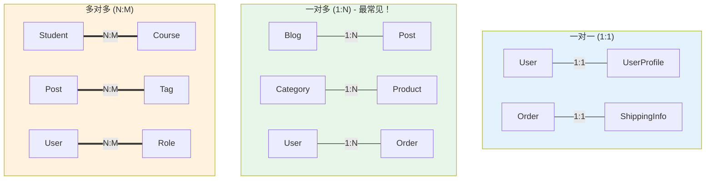
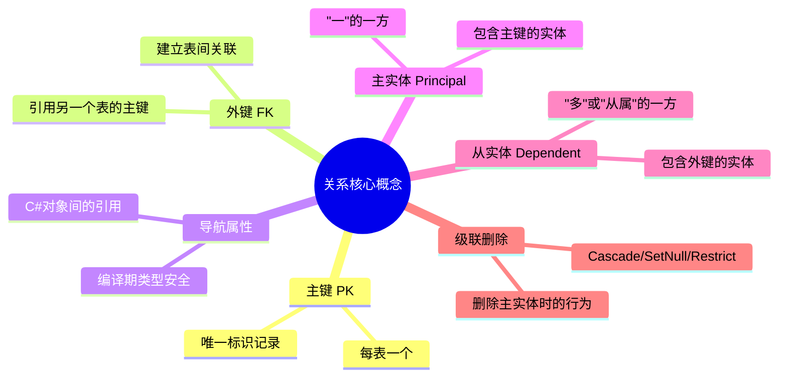
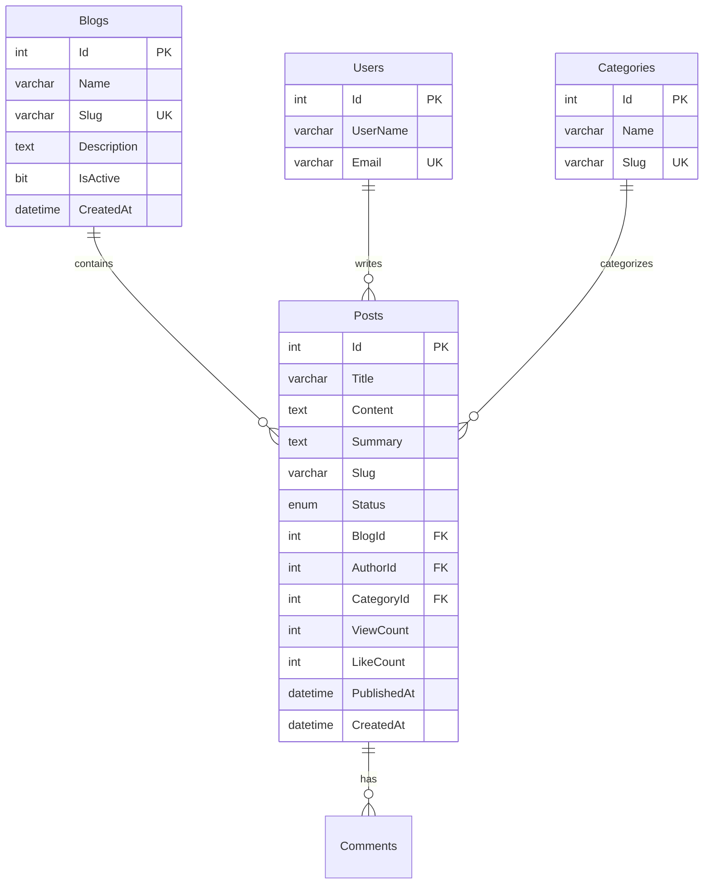
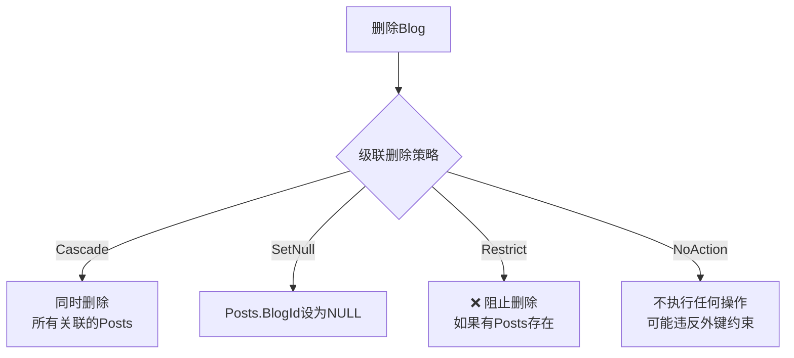
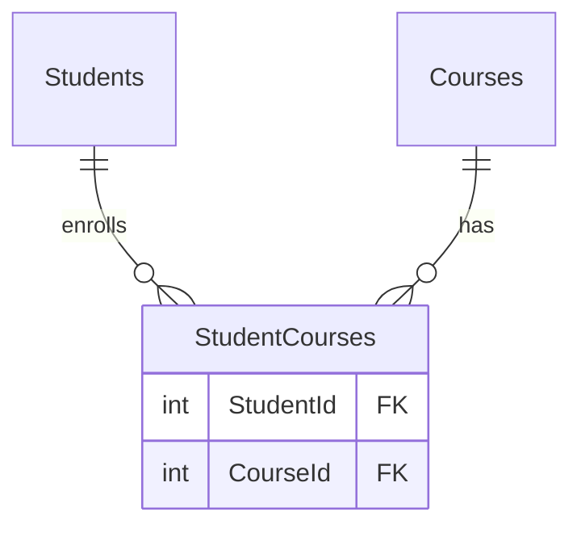
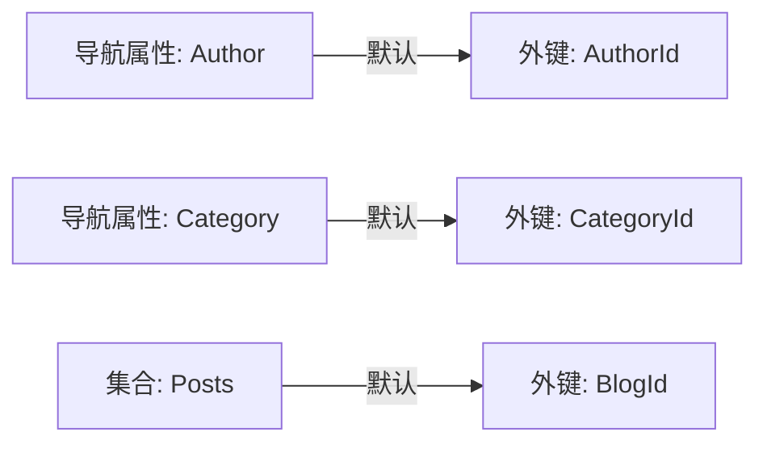
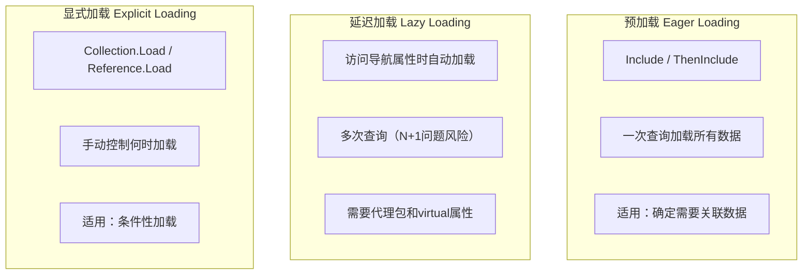
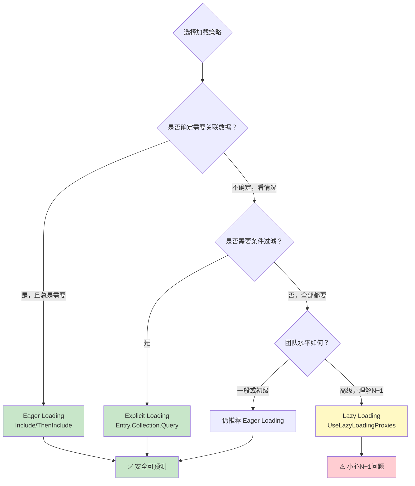
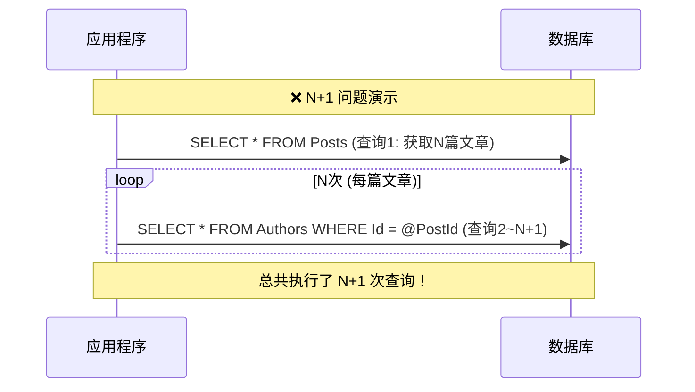

# 关系映射 - 表之间的关联

> **学习目标**：全面掌握EF Core中的关系配置，包括一对一、一对多、多对多的实现，以及数据加载策略和性能优化
> **前置知识**：CRUD操作、Code First开发、LINQ查询基础
> **预计时长**：70分钟

---

## 一、关系类型概览

### 1.1 三种基本关系类型



### 1.2 关系对比表格

| 特性 | **一对一 (1:1)** | **一对多 (1:N)** | **多对多 (N:M)** |
|------|-----------------|------------------|------------------|
| **使用频率** | ⭐⭐ 较少 | ⭐⭐⭐⭐⭐ 最常见 | ⭐⭐⭐ 常见 |
| **外键位置** | 任一表 | 多端表（N端） | 独立联结表 |
| **导航属性** | 双方引用 | 一方有集合，多方有引用 | 双方都有集合 |
| **复杂度** | 低 | 中 | 中高 |
| **典型场景** | 用户-详情、主表-扩展 | 博客-文章、分类-商品 | 学生-课程、文章-标签 |

### 1.3 关系的核心概念

在深入各种关系之前，先理解几个关键概念：



---

## 二、一对一关系（One-to-One）

### 2.1 典型场景

一对一关系适用于将**可选信息**或**大字段**分离到单独的表中：

- User ↔ UserProfile（用户基本信息 vs 详细资料）
- Order ↔ ShippingInfo（订单 vs 收货地址）
- Product ↔ ProductDetail（商品简介 vs 详细规格）

### 2.2 User-Profile 完整示例

#### 实体定义

```csharp
// Entities/User.cs - 主实体（Principal）
public class User
{
    [Key]
    public int Id { get; set; }
    
    [Required]
    [StringLength(50)]
    public string UserName { get; set; } = string.Empty;
    
    [Required]
    [EmailAddress]
    [StringLength(255)]
    public string Email { get; set; } = string.Empty;
    
    // 导航属性：用户有一个配置文件
    // virtual支持延迟加载（如果启用）
    public virtual UserProfile? Profile { get; set; }
}

// Entities/UserProfile.cs - 从实体（Dependent）
public class UserProfile
{
    // 共享主键（与User的Id相同）
    [Key]
    [ForeignKey(nameof(User))]
    public int UserId { get; set; }
    
    // 导航属性：配置文件属于一个用户
    public virtual User User { get; set; } = null!;
    
    // ====== 扩展信息字段 ======
    
    [StringLength(100)]
    public string? DisplayName { get; set; }
    
    [Url]
    [StringLength(500)]
    public string? AvatarUrl { get; set; }
    
    [StringLength(500)]
    public string? Bio { get; set; }
    
    [StringLength(200)]
    public string? Location { get; set; }
    
    public DateTime? Birthday { get; set; }
    
    public Gender Gender { get; set; } = Gender.Unknown;
    
    // 个人网站、社交媒体链接等
    [Url]
    public string? Website { get; set; }
    
    [StringLength(100)]
    public string? Twitter { get; set; }
    
    [StringLength(100)]
    public string? GitHub { get; set; }
    
    // 设置偏好
    public bool EmailNotifications { get; set; } = true;
    public bool PublicProfile { get; set; } = false;
    
    public DateTime CreatedAt { get; set; } = DateTime.UtcNow;
    public DateTime? UpdatedAt { get; set; }
}

public enum Gender
{
    Unknown = 0,
    Male = 1,
    Female = 2,
    Other = 3
}
```

#### Fluent API 配置

```csharp
// Configurations/UserConfiguration.cs
public class UserConfiguration : IEntityTypeConfiguration<User>
{
    public void Configure(EntityTypeBuilder<User> builder)
    {
        builder.ToTable("Users");
        
        builder.HasKey(u => u.Id);
        
        builder.Property(u => u.UserName)
            .IsRequired()
            .HasMaxLength(50);
            
        builder.Property(u => u.Email)
            .IsRequired()
            .HasMaxLength(255)
            .IsUnicode(false); // ASCII字符
        
        // 唯一索引
        builder.HasIndex(u => u.Email).IsUnique();
        
        // 配置一对一关系
        builder.HasOne(u => u.Profile)
            .WithOne(p => p.User)  // UserProfile有一个User导航属性
            .HasForeignKey<UserProfile>(p => p.UserId);  // 外键在UserProfile上
    }
}

// Configurations/UserProfileConfiguration.cs
public class UserProfileConfiguration : IEntityTypeConfiguration<UserProfile>
{
    public void Configure(EntityTypeBuilder<UserProfile> builder)
    {
        builder.ToTable("UserProfiles");
        
        // 主键也是外键（共享主键模式）
        builder.HasKey(p => p.UserId);
        
        // 确保UserId是唯一的外键约束
        builder.HasOne(p => p.User)
            .WithOne(u => u.Profile)
            .HasForeignKey<UserProfile>(p => p.UserId)
            .OnDelete(DeleteBehavior.Cascade); // 删除用户时级联删除Profile
        
        // 字段配置
        builder.Property(p => p.DisplayName).HasMaxLength(100);
        builder.Property(p => p.AvatarUrl).HasMaxLength(500);
        builder.Property(p => p.Bio).HasMaxLength(500);
        builder.Property(p => p.Location).HasMaxLength(200);
        builder.Property(p => p.Website).IsUnicode(false).HasMaxLength(500);
        
        builder.Property(p => p.Gender).HasConversion<string>();
        
        builder.Property(p => p.CreatedAt).HasDefaultValueSql("GETUTCDATE()");
    }
}
```

#### 生成的数据库结构

```sql
-- Users表
CREATE TABLE Users (
    Id int IDENTITY(1,1) NOT NULL PRIMARY KEY,
    UserName nvarchar(50) NOT NULL,
    Email nvarchar(255) NOT NULL UNIQUE,
    -- 其他基础字段...
);

-- UserProfiles表（共享主键）
CREATE TABLE UserProfiles (
    UserId int NOT NULL PRIMARY KEY,  -- 同时是PK和FK
    DisplayName nvarchar(100) NULL,
    AvatarUrl nvarchar(500) NULL,
    Bio nvarchar(500) NULL,
    Location nvarchar(200) NULL,
    Birthday datetime2 NULL,
    Gender nvarchar(20) NOT NULL DEFAULT 'Unknown',
    Website nvarchar(500) NULL,
    Twitter nvarchar(100) NULL,
    GitHub nvarchar(100) NULL,
    EmailNotifications bit NOT NULL DEFAULT 1,
    PublicProfile bit NOT NULL DEFAULT 0,
    CreatedAt datetime2 NOT NULL DEFAULT GETUTCDATE(),
    UpdatedAt datetime2 NULL,
    
    CONSTRAINT FK_UserProfiles_Users_UserId 
        FOREIGN KEY (UserId) REFERENCES Users(Id) ON DELETE CASCADE
);
```

### 2.3 CRUD 操作示例

```csharp
// Services/UserService.cs
public class UserService
{
    private readonly ApplicationDbContext _context;
    
    public UserService(ApplicationDbContext context)
    {
        _context = context;
    }
    
    /// <summary>
    /// 创建用户并初始化Profile
    /// </summary>
    public async Task<UserDto> CreateUserWithProfileAsync(CreateUserRequest request)
    {
        using var transaction = await _context.Database.BeginTransactionAsync();
        
        try
        {
            // 1. 创建User
            var user = new User
            {
                UserName = request.UserName,
                Email = request.Email.ToLowerInvariant()
            };
            
            await _context.Users.AddAsync(user);
            await _context.SaveChangesAsync(); // 获取自增ID
            
            // 2. 创建UserProfile（使用相同的ID）
            var profile = new UserProfile
            {
                UserId = user.Id, // 使用User的ID作为主键
                DisplayName = request.DisplayName ?? request.UserName,
                AvatarUrl = null,
                Bio = null,
                Gender = Gender.Unknown,
                EmailNotifications = true,
                PublicProfile = false,
                CreatedAt = DateTime.UtcNow
            };
            
            await _context.UserProfiles.AddAsync(profile);
            await _context.SaveChangesAsync();
            
            await transaction.CommitAsync();
            
            return MapToDto(user, profile);
        }
        catch
        {
            await transaction.RollbackAsync();
            throw;
        }
    }
    
    /// <summary>
    /// 获取用户及其Profile（使用Include）
    /// </summary>
    public async Task<UserWithProfileDto?> GetUserWithProfileAsync(int userId)
    {
        var user = await _context.Users
            .Include(u => u.Profile) // 预加载Profile
            .AsNoTracking()          // 只读查询
            .FirstOrDefaultAsync(u => u.Id == userId);
        
        if (user == null) return null;
        
        return new UserWithProfileDto
        {
            Id = user.Id,
            UserName = user.UserName,
            Email = user.Email,
            Profile = user.Profile == null ? null : new UserProfileDto
            {
                DisplayName = user.Profile.DisplayName,
                AvatarUrl = user.Profile.AvatarUrl,
                Bio = user.Profile.Bio,
                Location = user.Profile.Location,
                Gender = user.Profile.Gender
            }
        };
    }
    
    /// <summary>
    /// 更新用户的Profile
    /// </summary>
    public async Task UpdateUserProfileAsync(int userId, UpdateProfileRequest request)
    {
        var profile = await _context.UserProfiles
            .FirstOrDefaultAsync(p => p.UserId == userId);
        
        if (profile == null)
        {
            throw new NotFoundException("用户配置文件不存在");
        }
        
        // 更新字段
        profile.DisplayName = request.DisplayName;
        profile.AvatarUrl = request.AvatarUrl;
        profile.Bio = request.Bio;
        profile.Location = request.Location;
        profile.Gender = request.Gender;
        profile.Website = request.Website;
        profile.Twitter = request.Twitter;
        profile.GitHub = request.GitHub;
        profile.EmailNotifications = request.EmailNotifications;
        profile.PublicProfile = request.PublicProfile;
        profile.UpdatedAt = DateTime.UtcNow;
        
        await _context.SaveChangesAsync();
    }
}
```

### 2.4 一对一的变体：独立主键

```csharp
// 如果不想用共享主键，可以使用独立主键 + 唯一外键
public class Order
{
    public int Id { get; set; }
    public string OrderNumber { get; set; }
    
    // 导航属性
    public virtual ShippingInfo? ShippingInfo { get; set; }
}

public class ShippingInfo
{
    [Key]
    public int Id { get; set; }  // 独立的自增主键
    
    [Required]
    public int OrderId { get; set; }  // 外键（唯一）
    
    public string RecipientName { get; set; } = string.Empty;
    public string Phone { get; set; } = string.Empty;
    public string Province { get; set; } = string.Empty;
    public string City { get; set; } = string.Empty;
    public string Address { get; set; } = string.Empty;
    public string PostalCode { get; set; } = string.Empty;
    
    [ForeignKey("OrderId")]
    public virtual Order Order { get; set; } = null!;
}

// 配置
modelBuilder.Entity<ShippingInfo>(entity =>
{
    entity.ToTable("ShippingInfos");
    
    entity.HasKey(e => e.Id);
    
    entity.HasOne(e => e.Order)
        .WithOne(o => o.ShippingInfo)
        .HasForeignKey<ShippingInfo>(e => e.OrderId)
        .OnDelete(DeleteBehavior.Cascade);
    
    // 外键必须是唯一的（确保一对一）
    entity.HasIndex(e => e.OrderId).IsUnique();
});
```

---

## 三、一对多关系（One-to-Many）- 最重要！

### 3.1 典型场景

一对多是**最常见的关系类型**：

- Blog（博客）↔ Posts（文章）：一个博客有多篇文章
- Category（分类）↔ Products（产品）：一个分类包含多个产品
- User（用户）↔ Orders（订单）：一个用户下了多个订单
- Author（作者）↔ Books（书籍）：一位作者写了多本书

### 3.2 Blog-Posts 完整示例

#### 实体定义

```csharp
// Entities/Blog.cs - 主实体（"一"的一方）
public class Blog
{
    [Key]
    public int Id { get; set; }
    
    [Required]
    [StringLength(100)]
    public string Name { get; set; } = string.Empty;
    
    [Required]
    [StringLength(200)]
    public string Slug { get; set; } = string.Empty; // URL友好的标识符
    
    [StringLength(500)]
    public string? Description { get; set; }
    
    public string? CoverImageUrl { get; set; }
    
    public bool IsActive { get; set; } = true;
    
    public DateTime CreatedAt { get; set; } = DateTime.UtcNow;
    
    // 导航属性：一个博客有多篇文章（集合）
    public virtual ICollection<Post> Posts { get; set; } = new List<Post>();
    
    // 导航属性：一个博客有多个作者（所有者/协作者）
    public virtual ICollection<BlogAuthor> Authors { get; set; } = new List<BlogAuthor>();
}

// Entities/Post.cs - 从实体（"多"的一方）
public class Post
{
    [Key]
    public int Id { get; set; }
    
    [Required]
    [StringLength(200)]
    public string Title { get; set; } = string.Empty;
    
    [Required]
    [Column(TypeName = "nvarchar(max)")]
    public string Content { get; set; } = string.Empty;
    
    [StringLength(500)]
    public string? Summary { get; set; }
    
    [StringLength(200)]
    public string? Slug { get; set; }
    
    public PostStatus Status { get; set; } = PostStatus.Draft;
    
    // 外键：所属博客
    [Required]
    public int BlogId { get; set; }
    
    // 作者（另一对多关系）
    [Required]
    public int AuthorId { get; set; }
    
    // 分类（可选的一对多）
    public int? CategoryId { get; set; }
    
    public int ViewCount { get; set; } = 0;
    public int LikeCount { get; set; } = 0;
    public int CommentCount { get; set; } = 0;
    
    public DateTime PublishedAt { get; set; }
    public DateTime CreatedAt { get; set; } = DateTime.UtcNow;
    public DateTime? UpdatedAt { get; set; }
    
    // 导航属性
    [ForeignKey("BlogId")]
    public virtual Blog Blog { get; set; } = null!;
    
    [ForeignKey("AuthorId")]
    public virtual User Author { get; set; } = null!;
    
    [ForeignKey("CategoryId")]
    public virtual Category? Category { get; set; }
    
    // 一个文章有多条评论（又是一个一对多）
    public virtual ICollection<Comment> Comments { get; set; } = new List<Comment>();
    
    // 文章标签（多对多，稍后讲解）
    public virtual ICollection<PostTag> PostTags { get; set; } = new List<PostTag>();
}

public enum PostStatus
{
    Draft = 0,
    Published = 1,
    Archived = 2
}
```

#### Fluent API 配置

```csharp
// Configurations/BlogConfiguration.cs
public class BlogConfiguration : IEntityTypeConfiguration<Blog>
{
    public void Configure(EntityTypeBuilder<Blog> builder)
    {
        builder.ToTable("Blogs");
        
        builder.HasKey(b => b.Id);
        
        builder.Property(b => b.Name)
            .IsRequired()
            .HasMaxLength(100)
            .HasComment("博客名称");
            
        builder.Property(b => b.Slug)
            .IsRequired()
            .HasMaxLength(200)
            .IsUnicode(false) // URL slug用ASCII
            .HasComment("URL标识符");
        
        // Slug唯一索引
        builder.HasIndex(b => b.Slug)
            .IsUnique()
            .HasDatabaseName("IX_Blogs_Slug");
        
        builder.Property(b => b.Description).HasMaxLength(500);
        
        builder.Property(b => b.IsActive)
            .HasDefaultValue(true);
            
        builder.Property(b => b.CreatedAt)
            .HasDefaultValueSql("GETUTCDATE()");
        
        // 配置一对多关系：Blog -> Posts
        builder.HasMany(b => b.Posts)           // Blog有很多Posts
            .WithOne(p => p.Blog)               // 每个Post属于一个Blog
            .HasForeignKey(p => p.BlogId)       // 外键在Post上
            .OnDelete(DeleteBehavior.Cascade);   // 删除Blog时级联删除所有Post
        
        // 全局过滤器：只查询活跃博客
        builder.HasQueryFilter(b => b.IsActive);
    }
}

// Configurations/PostConfiguration.cs
public class PostConfiguration : IEntityTypeConfiguration<Post>
{
    public void Configure(EntityTypeBuilder<Post> builder)
    {
        builder.ToTable("Posts");
        
        builder.HasKey(p => p.Id);
        
        builder.Property(p => p.Title)
            .IsRequired()
            .HasMaxLength(200)
            .HasComment("文章标题");
            
        builder.Property(p => p.Content)
            .IsRequired()
            .HasColumnType("nvarchar(max)")
            .HasComment("文章内容");
            
        builder.Property(p => p.Summary).HasMaxLength(500);
        
        builder.Property(p => p.Slug)
            .HasMaxLength(200)
            .IsUnicode(false);
        
        builder.Property(p => p.Status)
            .HasConversion<string>()
            .HasDefaultValue(PostStatus.Draft);
        
        // 外键关系配置
        // 1. 所属博客（必需）
        builder.HasOne(p => p.Blog)
            .WithMany(b => b.Posts)
            .HasForeignKey(p => p.BlogId)
            .OnDelete(DeleteBehavior.Cascade)
            .IsRequired();
        
        // 2. 作者（必需）
        builder.HasOne(p => p.Author)
            .WithMany(u => u.Posts) // User实体的Posts集合
            .HasForeignKey(p => p.AuthorId)
            .OnDelete(DeleteBehavior.Restrict) // 不能删除还有文章的作者
            .IsRequired();
        
        // 3. 分类（可选）
        builder.HasOne(p => p.Category)
            .WithMany(c => c.Posts)
            .HasForeignKey(p => p.CategoryId)
            .OnDelete(DeleteBehavior.SetNull); // 删除分类时设为NULL
        
        // 索引配置
        builder.HasIndex(p => p.BlogId);  // 用于按博客查询文章
        builder.HasIndex(p => p.AuthorId); // 用于按作者查询
        builder.HasIndex(p => p.CategoryId); // 用于按分类查询
        builder.HasIndex(p => p.Status);  // 用于状态筛选
        builder.HasIndex(p => p.PublishedAt); // 用于时间线排序
        builder.HasIndex(p => new { p.BlogId, p.Status, p.PublishedAt }); // 复合索引
        
        // 全局过滤器：排除归档文章
        builder.HasQueryFilter(p => p.Status != PostStatus.Archived);
    }
}
```

#### ER图



### 3.3 级联删除详解

级联删除定义了当**主实体被删除时**，从实体的行为：



```csharp
// 级联删除行为选择指南：

// 1. Cascade（级联删除）- 强依赖关系
// 适用：子记录没有独立存在的意义
// 示例：删除博客 → 删除所有文章；删除订单 → 删除订单项
.OnDelete(DeleteBehavior.Cascade)

// 2. SetNull（设为空）- 弱依赖关系
// 适用：子记录可以脱离父记录独立存在
// 示例：删除分类 → 文章的分类设为NULL
// 要求：外键必须可空（nullable）
.OnDelete(DeleteBehavior.SetNull)

// 3. Restrict（限制）- 保护性关系
// 适用：不能随意删除父记录
// 示例：不能删除还有文章的用户；不能删除还有员工的部门
// 行为：尝试删除时会抛出异常
.OnDelete(DeleteBehavior.Restrict)

// 4. NoAction（无操作）- 类似Restrict但由数据库处理
// 与Restrict的区别主要在于某些数据库的实现细节
.OnDelete(DeleteBehavior.NoAction)
```

### 3.4 Include预加载一对多数据

```csharp
/// <summary>
/// Include：预加载导航属性（Eager Loading）
/// 在一次查询中加载主实体及其关联数据
/// </summary>

// 基础用法
public async Task<List<BlogWithPostsDto>> GetBlogsWithRecentPostsAsync(int count = 10)
{
    var blogs = await _context.Blogs
        .Include(b => b.Posts) // 加载每个博客的文章集合
        .AsNoTracking()
        .Where(b => b.IsActive && b.Posts.Any(p => p.Status == PostStatus.Published))
        .OrderByDescending(b => b.CreatedAt)
        .Take(count)
        .ToListAsync();
    
    return blogs.Select(MapToDto).ToList();
}

// ThenInclude：链式加载深层嵌套关系
public async Task<PostDetailDto?> GetPostDetailAsync(int postId)
{
    var post = await _context.Posts
        .Include(p => p.Blog)                    // 加载所属博客
            .ThenInclude(b => b.Authors)         // 再加载博客的作者
                .ThenInclude(a => a.User)        // 再加载作者的用户信息
        .Include(p => p.Author)                  // 加载文章作者
        .Include(p => p.Category)                // 加载分类
        .Include(p => p.Comments)                // 加载评论
            .ThenInclude(c => c.User)            // 再加载评论者
        .Include(p => p.PostTags)                // 加载标签关联
            .ThenInclude(pt => pt.Tag)           // 再加载标签实体
        .AsNoTracking()
        .FirstOrDefaultAsync(p => p.Id == postId);
    
    return post == null ? null : MapToDetailDto(post);
}

// 过滤Include的数据（EF Core 5+）
public async Task<BlogDto?> GetBlogWithPublishedPostsOnlyAsync(int blogId)
{
    var blog = await _context.Blogs
        .Include(b => b.Posts
            .Where(p => p.Status == PostStatus.Published)) // 只加载已发布的文章
            .OrderByDescending(p => p.PublishedAt)
            .Take(20)) // 只取最近20篇
        .AsNoTracking()
        .FirstOrDefaultAsync(b => b.Id == blogId);
    
    return blog == null ? null : MapToDto(blog);
}

// 分页Include的数据
public async Task<PagedResult<PostDto>> GetBlogPostsPagedAsync(
    int blogId, 
    int page = 1, 
    int pageSize = 10)
{
    var query = _context.Posts
        .Where(p => p.BlogId == blogId && p.Status == PostStatus.Published);
    
    var totalCount = await query.CountAsync();
    
    var posts = await query
        .Include(p => p.Author)     // 加载作者
        .Include(p => p.Category)   // 加载分类
        .OrderByDescending(p => p.PublishedAt)
        .Skip((page - 1) * pageSize)
        .Take(pageSize)
        .AsNoTracking()
        .Select(p => new PostDto    // 投影到DTO减少数据传输
        {
            Id = p.Id,
            Title = p.Title,
            Summary = p.Summary,
            Slug = p.Slug,
            PublishedAt = p.PublishedAt,
            ViewCount = p.ViewCount,
            CommentCount = p.CommentCount,
            AuthorName = p.Author.UserName,
            CategoryName = p.Category != null ? p.Category.Name : null
        })
        .ToListAsync();
    
    return new PagedResult<PostDto>
    {
        Items = posts,
        TotalCount = totalCount,
        Page = page,
        PageSize = pageSize,
        TotalPages = (int)Math.Ceiling((double)totalCount / pageSize)
    };
}
```

### 3.5 一对多的CRUD操作

```csharp
// Services/BlogService.cs
public class BlogService
{
    private readonly ApplicationDbContext _context;
    
    public BlogService(ApplicationDbContext context)
    {
        _context = context;
    }
    
    /// <summary>
    /// 创建博客并添加第一篇文章
    /// </summary>
    public async Task<BlogDto> CreateBlogWithFirstPostAsync(CreateBlogRequest request)
    {
        using var transaction = await _context.Database.BeginTransactionAsync();
        
        try
        {
            // 1. 创建博客
            var blog = new Blog
            {
                Name = request.Name,
                Slug = GenerateSlug(request.Name),
                Description = request.Description,
                IsActive = true,
                CreatedAt = DateTime.UtcNow
            };
            
            _context.Blogs.Add(blog);
            await _context.SaveChangesAsync();
            
            // 2. 创建第一篇文章
            var post = new Post
            {
                Title = request.FirstPostTitle,
                Content = request.FirstPostContent,
                Summary = request.FirstPostSummary,
                BlogId = blog.Id,
                AuthorId = request.AuthorId,
                Status = PostStatus.Draft,
                PublishedAt = DateTime.UtcNow,
                CreatedAt = DateTime.UtcNow
            };
            
            _context.Posts.Add(post);
            await _context.SaveChangesAsync();
            
            // 3. 将当前用户添加为博客作者
            _context.BlogAuthors.Add(new BlogAuthor
            {
                BlogId = blog.Id,
                UserId = request.AuthorId,
                Role = BlogRole.Owner,
                JoinedAt = DateTime.UtcNow
            });
            
            await _context.SaveChangesAsync();
            await transaction.CommitAsync();
            
            return MapToDto(blog);
        }
        catch
        {
            await transaction.RollbackAsync();
            throw;
        }
    }
    
    /// <summary>
    /// 给博客添加新文章
    /// </summary>
    public async Task<PostDto> AddPostToBlogAsync(int blogId, CreatePostRequest request)
    {
        // 验证博客存在
        var blog = await _context.Blogs.FindAsync(blogId);
        if (blog == null)
            throw new NotFoundException("博客不存在");
        
        // 创建文章（自动设置外键）
        var post = new Post
        {
            Title = request.Title,
            Content = request.Content,
            Summary = request.Summary?.Length > 500 
                ? request.Summary.Substring(0, 500) 
                : request.Summary,
            Slug = GenerateSlug(request.Title),
            BlogId = blogId,  // 设置外键
            AuthorId = request.AuthorId,
            CategoryId = request.CategoryId,
            Status = request.IsPublishImmediately ? PostStatus.Published : PostStatus.Draft,
            PublishedAt = request.IsPublishImmediately ? DateTime.UtcNow : default,
            CreatedAt = DateTime.UtcNow
        };
        
        _context.Posts.Add(post);
        await _context.SaveChangesAsync();
        
        return MapToDto(post);
    }
    
    /// <summary>
    /// 更新文章（自动追踪关联）
    /// </summary>
    public async Task<PostDto> UpdatePostAsync(int postId, UpdatePostRequest request)
    {
        var post = await _context.Posts
            .Include(p => p.Tags) // 如果需要修改标签
            .FirstOrDefaultAsync(p => p.Id == postId);
        
        if (post == null)
            throw new NotFoundException("文章不存在");
        
        // 修改基本属性
        post.Title = request.Title;
        post.Content = request.Content;
        post.Summary = request.Summary;
        post.CategoryId = request.CategoryId;
        post.UpdatedAt = DateTime.UtcNow;
        
        // 处理发布状态变更
        if (request.Status == PostStatus.Published && post.Status != PostStatus.Published)
        {
            post.Status = PostStatus.Published;
            post.PublishedAt = DateTime.UtcNow;
        }
        else if (request.Status != PostStatus.Published)
        {
            post.Status = request.Status;
        }
        
        // 处理标签更新
        if (request.TagIds != null)
        {
            UpdatePostTags(post, request.TagIds);
        }
        
        await _context.SaveChangesAsync();
        
        return MapToDto(post);
    }
    
    /// <summary>
    /// 删除文章
    /// </summary>
    public async Task DeletePostAsync(int postId)
    {
        var post = await _context.Posts.FindAsync(postId);
        if (post == null)
            throw new NotFoundException("文章不存在");
        
        // 检查是否有关联的评论需要处理
        var commentCount = await _context.Comments.CountAsync(c => c.PostId == postId);
        if (commentCount > 0)
        {
            // 选择：级联删除 or 软删除 or 阻止删除
            // 这里我们选择级联删除（因为配置了Cascade）
        }
        
        _context.Posts.Remove(post);
        await _context.SaveChangesAsync();
    }
    
    /// <summary>
    /// 删除博客（会级联删除所有文章！）
    /// </summary>
    public async Task DeleteBlogAsync(int blogId)
    {
        var blog = await _context.Blogs
            .Include(b => b.Posts) // 加载以确认有多少文章会被影响
            .FirstOrDefaultAsync(b => b.Id == blogId);
        
        if (blog == null)
            throw new NotFoundException("博客不存在");
        
        // 警告：这会删除博客及所有文章、评论等！
        Console.WriteLine($"警告：即将删除博客 '{blog.Name}' 及其 {blog.Posts.Count} 篇文章！");
        
        _context.Blogs.Remove(blog);
        await _context.SaveChangesAsync();
    }
    
    private void UpdatePostTags(Post post, List<int> tagIds)
    {
        // 清除现有标签
        post.PostTags.Clear();
        
        // 添加新标签
        foreach (var tagId in tagIds)
        {
            post.PostTags.Add(new PostTag { TagId = tagId });
        }
    }
}
```

---

## 四、多对多关系（Many-to-Many）

### 4.1 EF Core 5+ 的原生多对多支持

从EF Core 5开始，**无需手动创建联结表实体**，框架会自动管理！



### 4.2 Student-Courses 完整示例

#### 实体定义（无需联结表实体！）

```csharp
// Entities/Student.cs
public class Student
{
    [Key]
    public int Id { get; set; }
    
    [Required]
    [StringLength(100)]
    public string Name { get; set; } = string.Empty;
    
    [Required]
    [EmailAddress]
    [StringLength(255)]
    public string Email { get; set; } = string.Empty;
    
    [StringLength(20)]
    public string? StudentNumber { get; set; } // 学号
    
    public DateTime EnrolledDate { get; set; } = DateTime.UtcNow;
    
    public bool IsActive { get; set; } = true;
    
    public DateTime CreatedAt { get; set; } = DateTime.UtcNow;
    
    // 导航属性：学生选修了多门课程
    public virtual ICollection<Course> Courses { get; set; } = new List<Course>();
}

// Entities/Course.cs
public class Course
{
    [Key]
    public int Id { get; set; }
    
    [Required]
    [StringLength(200)]
    public string Title { get; set; } = string.Empty;
    
    [Required]
    [StringLength(20)]
    public string Code { get; set; } = string.Empty; // 课程编号，如 CS101
    
    [StringLength(1000)]
    public string? Description { get; set; }
    
    public int Credits { get; set; } = 3; // 学分
    
    public int MaxStudents { get; set; } = 30; // 最大选课人数
    
    public CourseStatus Status { get; set; } = CourseStatus.Active;
    
    public DateTime CreatedAt { get; set; } = DateTime.UtcNow;
    
    // 导航属性：课程有多个学生选修
    public virtual ICollection<Student> Students { get; set; } = new List<Student>();
}

public enum CourseStatus
{
    Draft = 0,
    Active = 1,
    Full = 2,       // 已满员
    Completed = 3,  // 已结课
    Archived = 4
}
```

#### Fluent API 配置

```csharp
// Configurations/StudentConfiguration.cs
public class StudentConfiguration : IEntityTypeConfiguration<Student>
{
    public void Configure(EntityTypeBuilder<Student> builder)
    {
        builder.ToTable("Students");
        
        builder.HasKey(s => s.Id);
        
        builder.Property(s => s.Name)
            .IsRequired()
            .HasMaxLength(100);
            
        builder.Property(s => s.Email)
            .IsRequired()
            .HasMaxLength(255)
            .IsUnicode(false);
        
        builder.HasIndex(s => s.Email).IsUnique();
        builder.HasIndex(s => s.StudentNumber).IsUnique();
        
        builder.Property(s => s.EnrolledDate)
            .HasDefaultValueSql("GETUTCDATE()");
        
        // 配置多对多关系（只需要在一侧配置即可）
        builder.HasMany(s => s.Courses)          // Student有多个Course
            .WithMany(c => c.Students)           // Course也有多个Student
            .UsingEntity<Dictionary<object, object>>(joinTable =>  // 可选：配置联结表
            {
                joinTable.ToTable("StudentCourses");  // 联结表名
                
                // 自定义列名（可选）
                joinTable.HasIndex("StudentsId").HasDatabaseName("IX_StudentCourses_StudentId");
                joinTable.HasIndex("CoursesId").HasDatabaseName("IX_StudentCourses_CourseId");
                
                // 复合主键
                joinTable.HasKey("StudentsId", "CoursesId");
            });
    }
}

// Configurations/CourseConfiguration.cs
public class CourseConfiguration : IEntityTypeConfiguration<Course>
{
    public void Configure(EntityTypeBuilder<Course> builder)
    {
        builder.ToTable("Courses");
        
        builder.HasKey(c => c.Id);
        
        builder.Property(c => c.Title)
            .IsRequired()
            .HasMaxLength(200);
            
        builder.Property(c => c.Code)
            .IsRequired()
            .HasMaxLength(20)
            .IsUnicode(false);
        
        builder.HasIndex(c => c.Code).IsUnique();
        
        builder.Property(c => Description).HasMaxLength(1000);
        builder.Property(c => c.Credits).HasDefaultValue(3);
        builder.Property(c => c.MaxStudents).HasDefaultValue(30);
        
        builder.Property(c => c.Status).HasConversion<string>();
        
        // 另一侧的多对多关系也可以在这里配置（但通常只配一边即可）
    }
}
```

#### 自动生成的数据库结构

```sql
-- Students表
CREATE TABLE Students (
    Id int IDENTITY(1,1) NOT NULL PRIMARY KEY,
    Name nvarchar(100) NOT NULL,
    Email nvarchar(255) NOT NULL UNIQUE,
    StudentNumber nvarchar(20) NULL UNIQUE,
    EnrolledDate datetime2 NOT NULL DEFAULT GETUTCDATE(),
    IsActive bit NOT NULL DEFAULT 1,
    CreatedAt datetime2 NOT NULL DEFAULT GETUTCDATE()
);

-- Courses表
CREATE TABLE Courses (
    Id int IDENTITY(1,1) NOT NULL PRIMARY KEY,
    Title nvarchar(200) NOT NULL,
    Code nvarchar(20) NOT NULL UNIQUE,
    Description nvarchar(1000) NULL,
    Credits int NOT NULL DEFAULT 3,
    MaxStudents int NOT NULL DEFAULT 30,
    Status nvarchar(20) NOT NULL DEFAULT 'Active',
    CreatedAt datetime2 NOT NULL DEFAULT GETUTCDATE()
);

-- 联结表（EF Core自动创建！）
CREATE TABLE StudentCourses (
    StudentsId int NOT NULL,
    CoursesId int NOT NULL,
    
    CONSTRAINT PK_StudentCourses PRIMARY KEY (StudentsId, CoursesId),
    
    CONSTRAINT FK_StudentCourses_Students_StudentsId 
        FOREIGN KEY (StudentsId) REFERENCES Students(Id) ON DELETE CASCADE,
        
    CONSTRAINT FK_StudentCourses_Courses_CoursesId 
        FOREIGN KEY (CoursesId) REFERENCES Courses(Id) ON DELETE CASCADE
);

-- 性能优化索引
CREATE INDEX IX_StudentCourses_StudentId ON StudentCourses (StudentsId);
CREATE INDEX IX_StudentCourses_CourseId ON StudentCourses (CoursesId);
```

### 4.3 多对多的CRUD操作

```csharp
// Services/EnrollmentService.cs
public class EnrollmentService
{
    private readonly ApplicationDbContext _context;
    
    public EnrollmentService(ApplicationDbContext context)
    {
        _context = context;
    }
    
    /// <summary>
    /// 学生选课（建立多对多关系）
    /// </summary>
    public async Task EnrollStudentAsync(int studentId, int courseId)
    {
        // 1. 查询学生和课程
        var student = await _context.Students
            .Include(s => s.Courses) // 必须加载导航属性
            .FirstOrDefaultAsync(s => s.Id == studentId);
            
        var course = await _context.Courses
            .FindAsync(courseId);
        
        if (student == null)
            throw new NotFoundException("学生不存在");
        if (course == null)
            throw new NotFoundException("课程不存在");
        
        // 2. 检查是否已经选过这门课
        if (student.Courses.Any(c => c.Id == courseId))
        {
            throw new BusinessException("该学生已经选修了这门课程");
        }
        
        // 3. 检查课程是否已满
        var currentEnrollment = await _context.Set<Course>()
            .Where(c => c.Id == courseId)
            .Select(c => c.Students.Count)
            .FirstOrDefaultAsync();
            
        if (currentEnrollment >= course.MaxStudents)
        {
            throw new BusinessException("该课程已满员");
        }
        
        // 4. 建立关系（简单添加到集合即可！）
        student.Courses.Add(course);
        
        // 5. 保存（EF Core自动在联结表中插入记录）
        await _context.SaveChangesAsync();
        
        Logger.LogInformation("学生 {StudentName} 选修了课程 {CourseTitle}", 
            student.Name, course.Title);
    }
    
    /// <summary>
    /// 学生退课（移除多对多关系）
    /// </summary>
    public async Task DropCourseAsync(int studentId, int courseId)
    {
        var student = await _context.Students
            .Include(s => s.Courses)
            .FirstOrDefaultAsync(s => s.Id == studentId);
        
        if (student == null)
            throw new NotFoundException("学生不存在");
        
        var course = student.Courses.FirstOrDefault(c => c.Id == courseId);
        if (course == null)
            throw new BusinessException("该学生未选修此课程");
        
        // 从集合中移除（EF Core自动从联结表删除记录）
        student.Courses.Remove(course);
        
        await _context.SaveChangesAsync();
    }
    
    /// <summary>
    /// 获取学生的所有课程
    /// </summary>
    public async Task<List<CourseDto>> GetStudentCoursesAsync(int studentId)
    {
        var courses = await _context.Students
            .Where(s => s.Id == studentId)
            .SelectMany(s => s.Courses)  // 通过导航属性获取关联的课程
            .AsNoTracking()
            .ToListAsync();
        
        return courses.Select(MapToDto).ToList();
    }
    
    /// <summary>
    /// 获取课程的所有学生
    /// </summary>
    public async Task<PagedResult<StudentDto>> GetCourseStudentsAsync(
        int courseId, 
        int page = 1, 
        int pageSize = 20)
    {
        var query = _context.Courses
            .Where(c => c.Id == courseId)
            .SelectMany(c => c.Students);
        
        var totalCount = await query.CountAsync();
        
        var students = await query
            .Skip((page - 1) * pageSize)
            .Take(pageSize)
            .AsNoTracking()
            .ToListAsync();
        
        return new PagedResult<StudentDto>
        {
            Items = students.Select(MapToDto).ToList(),
            TotalCount = totalCount,
            Page = page,
            PageSize = pageSize,
            TotalPages = (int)Math.Ceiling((double)totalCount / pageSize)
        };
    }
    
    /// <summary>
    /// 批量选课
    /// </summary>
    public async Task BatchEnrollAsync(int studentId, List<int> courseIds)
    {
        var student = await _context.Students
            .Include(s => s.Courses)
            .FirstOrDefaultAsync(s => s.Id == studentId);
        
        if (student == null)
            throw new NotFoundException("学生不存在");
        
        // 获取要添加的课程
        var coursesToAdd = await _context.Courses
            .Where(c => courseIds.Contains(c.Id) &&
                       !student.Courses.Any(sc => sc.Id == c.Id)) // 排除已选的
            .ToListAsync();
        
        foreach (var course in coursesToAdd)
        {
            student.Courses.Add(course);
        }
        
        await _context.SaveChangesAsync();
        
        Logger.LogInformation("学生 {StudentId} 批量选修了 {Count} 门课程", 
            studentId, coursesToAdd.Count);
    }
}
```

### 4.4 带额外字段的联结表（高级场景）

有时候联结表需要存储额外信息（如选课时间、成绩等），这时需要显式定义联结表实体：

```csharp
// Entities/Enrollment.cs - 显式的联结表实体
public class Enrollment
{
    public int StudentId { get; set; }
    public int CourseId { get; set; }
    
    // 额外字段
    public DateTime EnrolledAt { get; set; } = DateTime.UtcNow;
    public decimal? Grade { get; set; }      // 成绩
    public EnrollmentStatus Status { get; set; } = EnrollmentStatus.Active;
    public string? Remarks { get; set; };     // 备注
    
    // 导航属性
    [ForeignKey("StudentId")]
    public virtual Student Student { get; set; } = null!;
    
    [ForeignKey("CourseId")]
    public virtual Course Course { get; set; } = null!;
}

public enum EnrollmentStatus
{
    Active = 0,
    Completed = 1,
    Dropped = 2,
    Failed = 3
}

// 修改Student和Course实体
public class Student
{
    // ...其他字段...
    
    // 改为使用Enrollment集合
    public virtual ICollection<Enrollment> Enrollments { get; set; } = new List<Enrollment>();
    
    // 便捷导航属性（只读，用于查询）
    [NotMapped]
    public IEnumerable<Course> Courses => Enrollments.Select(e => e.Course);
}

public class Course
{
    // ...其他字段...
    
    public virtual ICollection<Enrollment> Enrollments { get; set; } = new List<Enrollment>();
    
    [NotMapped]
    public IEnumerable<Student> Students => Enrollments.Select(e => e.Student);
}

// 配置
modelBuilder.Entity<Enrollment>(entity =>
{
    entity.ToTable("Enrollments");
    entity.HasKey(e => new { e.StudentId, e.CourseId }); // 复合主键
    
    entity.HasOne(e => e.Student)
        .WithMany(s => s.Enrollments)
        .HasForeignKey(e => e.StudentId)
        .OnDelete(DeleteBehavior.Cascade);
    
    entity.HasOne(e => e.Course)
        .WithMany(c => c.Enrollments)
        .HasForeignKey(e => e.CourseId)
        .OnDelete(DeleteBehavior.Cascade);
});

// 使用示例：录入成绩
public async Task RecordGradeAsync(int studentId, int courseId, decimal grade)
{
    var enrollment = await _context.Enrollments
        .FirstOrDefaultAsync(e => e.StudentId == studentId && e.CourseId == courseId);
    
    if (enrollment == null)
        throw new NotFoundException("未找到选课记录");
    
    enrollment.Grade = grade;
    enrollment.Status = grade >= 60 ? EnrollmentStatus.Completed : EnrollmentStatus.Failed;
    
    await _context.SaveChangesAsync();
}
```

---

## 五、自定义外键和导航属性命名

### 5.1 默认命名约定

EF Core遵循以下默认约定：



### 5.2 自定义命名规则

```csharp
// 方式1：使用ForeignKey特性
public class Post
{
    public int Id { get; set; }
    
    // 导航属性
    [ForeignKey("WrittenByUserId")] // 指定外键属性名
    public virtual User Author { get; set; } = null!;
    
    // 外键（自定义命名）
    public int WrittenByUserId { get; set; }  // 不用默认的AuthorId
}

// 方式2：使用Fluent API（更灵活）
modelBuilder.Entity<Post>(entity =>
{
    entity.HasOne(p => p.Author)
        .WithMany(u => u.Posts)
        .HasForeignKey(p => p.WrittenByUserId)  // 自定义外键名
        .HasConstraintName("FK_Posts_Authors_WrittenBy") // 自定义约束名
        .OnDelete(DeleteBehavior.Restrict);
});

// 方式3：InverseProperty（解决歧义）
public class User
{
    public int Id { get; set; }
    
    [InverseProperty("Author")]
    public virtual ICollection<Post> WrittenPosts { get; set; }  // 写的文章
    
    [InverseProperty("Editor")]
    public virtual ICollection<Post> EditedPosts { get; set; }  // 编辑的文章
}

public class Post
{
    public int Id { get; set; }
    
    public int AuthorId { get; set; }
    [ForeignKey("AuthorId")]
    public virtual User Author { get; set; } = null!;
    
    public int EditorId { get; set; }
    [ForeignKey("EditorId")]
    public virtual User Editor { get; set; } = null!;
}
```

### 5.3 企业级命名规范建议

```markdown
## 推荐的外键命名规范

### 格式：{关联表名单数}Id 或 {关联实体名}Id

✅ 推荐：
- BlogId (Post表的Blog外键)
- AuthorId (Post表的外键)
- ParentId (自引用关系)
- CategoryId (Product表的外键)

❌ 避免：
- Blog_ID (下划线风格不一致)
- blogId (驼峰不符合C#规范)
- IdOfBlog (过于冗长)
- fk_Blog (带前缀多余)

### 导航属性命名

单数引用：
- Author (不是 TheAuthor 或 AuthorEntity)
- Category (不是 CategoryRef)

集合导航：
- Posts (不是 PostList 或 PostCollection)
- Comments (不是 CommentArray)

### 外键约束命名（SQL层面）
FK_{当前表}_{关联表}_{外键列}
例如：FK_Posts_Users_AuthorId
```

---

## 六、数据加载策略详解

### 6.1 三种加载策略对比



### 6.2 预加载（Eager Loading）- 推荐！

```csharp
/// <summary>
/// Include / ThenInclude：最常用的加载方式
/// 优点：一次查询（或固定次数）、可预测性能、编译期检查
/// 缺点：可能加载不需要的数据
/// </summary>

// 基础Include
var posts = await _context.Posts
    .Include(p => p.Author)
    .Include(p => p.Category)
    .ToListAsync();

// ThenInclude：链式加载嵌套关系
var postsWithComments = await _context.Posts
    .Include(p => p.Comments)
        .ThenInclude(c => c.User)  // 评论的作者
    .Include(p => p.Author)
    .ToListAsync();

// 过滤Include（EF Core 5+）
var publishedPostsWithComments = await _context.Posts
    .Include(p => p.Comments
        .Where(c => c.IsApproved))  // 只加载审核通过的评论
        .OrderByDescending(c => c.CreatedAt)
        .Take(10))                   // 只要最新10条评论
    .Where(p => p.Status == PostStatus.Published)
    .ToListAsync();

// 多级ThenInclude
var fullPostData = await _context.Posts
    .Include(p => p.Blog)
        .ThenInclude(b => b.Authors)
            .ThenInclude(a => a.User)  // Post → Blog → Authors → User
    .Include(p => p.Author)
        .ThenInclude(u => u.Profile)   // Post → Author → UserProfile
    .Include(p => p.Category)
    .Include(p => p.Comments)
        .ThenInclude(c => c.User)
            .ThenInclude(u => u.Role)  // Post → Comments → User → Role
    .FirstOrDefaultAsync(p => p.Id == postId);
```

### 6.3 延迟加载（Lazy Loading）

```csharp
/// <summary>
/// 延迟加载：访问导航属性时才去数据库查询
/// 需要：1. Microsoft.EntityFrameworkCore.Proxies 包
///       2. 所有导航属性必须是virtual
///       3. 在UseLazyLoadingProxies()
/// 注意：容易导致N+1查询问题，谨慎使用！
/// </summary>

// Program.cs 配置
builder.Services.AddDbContext<ApplicationDbContext>(options =>
{
    options.UseSqlServer(connectionString);
    options.UseLazyLoadingProxies(); // 启用延迟加载代理
});

// 实体类：导航属性必须是virtual
public class Post
{
    public int Id { get; set; }
    public string Title { get; set; }
    
    public int AuthorId { get; set; }
    
    // 必须是virtual才能延迟加载
    public virtual Author Author { get; set; } = null!;
    public virtual ICollection<Comment> Comments { get; set; } = new List<Comment>();
}

// 使用方式
public async Task DemoLazyLoadingAsync(int postId)
{
    // 第一次查询：只查Post（不查Author和Comments）
    var post = await _context.Posts.FindAsync(postId);
    
    // 访问Author时触发第二次查询（自动！）
    var authorName = post.Author.Name;  // 此时才会查询Author表
    
    // 访问Comments时触发第三次查询
    foreach (var comment in post.Comments)  // 查询Comments表
    {
        Console.WriteLine(comment.Content);
    }
    
    // 总共执行了3次查询！
}

// ❌ N+1问题的典型例子
public async Task BadExample_NPlusOneProblemAsync()
{
    // 第1次查询：获取所有文章
    var posts = await _context.Posts.ToListAsync(); // 查询1
    
    foreach (var post in posts)
    {
        // 每次循环都会触发一次查询！
        Console.WriteLine($"{post.Title} by {post.Author.Name}"); // N次查询
        // 如果有100篇文章，总共101次查询！
    }
}

// ✅ 解决方案：使用Include
public async Task GoodExample_FixWithIncludeAsync()
{
    // 只需要2次查询（或者1次如果是Split Query）
    var posts = await _context.Posts
        .Include(p => p.Author) // 预加载Author
        .ToListAsync();         // 查询1（或查询2）
    
    foreach (var post in posts)
    {
        Console.WriteLine($"{post.Title} by {post.Author.Name}"); // 无额外查询
    }
}
```

### 6.4 显式加载（Explicit Loading）

```csharp
/// <summary>
/// 显式加载：手动控制何时加载导航属性
/// 适用场景：条件性加载（根据业务逻辑决定是否加载）
/// </summary>

public async Task DemoExplicitLoadingAsync(int postId, bool needComments)
{
    // 1. 先查询主实体（不加载导航属性）
    var post = await _context.Posts
        .AsNoTracking()
        .FirstOrDefaultAsync(p => p.Id == postId);
    
    if (post == null) return;
    
    // 2. 根据条件决定是否加载关联数据
    if (needComments)
    {
        // 使用Collection.Load加载集合导航属性
        await _context.Entry(post)
            .Collection(p => p.Comments)
            .LoadAsync();
        
        // 可以进一步过滤
        await _context.Entry(post)
            .Collection(p => p.Comments)
            .Query()
            .Where(c => c.IsApproved)
            .LoadAsync();
    }
    
    // 3. 使用Reference.Load加载引用导航属性
    if (post.AuthorId > 0)
    {
        await _context.Entry(post)
            .Reference(p => p.Author)
            .LoadAsync();
    }
    
    // 4. 使用Query()进行更灵活的控制
    var recentComments = await _context.Entry(post)
        .Collection(p => p.Comments)
        .Query()  // 返回IQueryable，可以继续LINQ操作
        .Where(c => c.IsApproved)
        .OrderByDescending(c => c.CreatedAt)
        .Take(5)
        .ToListAsync();
    
    // 检查导航属性是否已加载
    var isAuthorLoaded = _context.Entry(post)
        .Reference(p => p.Author)
        .IsLoaded; // true/false
        
    var isCommentsLoaded = _context.Entry(post)
        .Collection(p => p.Comments)
        .IsLoaded; // true/false
}
```

### 6.5 如何选择加载策略？



**决策指南**：

| 场景 | 推荐策略 | 原因 |
|------|---------|------|
| Web API返回完整对象 | **Eager Loading** | 固定格式，一次性返回 |
| 后台任务批量处理 | **Explicit Loading** | 可能不需要所有关联数据 |
| 快速原型/MVP | **Lazy Loading** | 开发速度快（但要小心） |
| 高性能要求API | **Eager + Select投影** | 减少数据传输 |
| 条件性加载 | **Explicit Loading** | 根据参数动态决定 |

---

## 七、N+1查询问题及解决方案

### 7.1 什么是N+1问题？



### 7.2 问题代码示例

```csharp
// ❌ 错误示范：典型的N+1问题
public async Task<List<PostListDto>> GetAllPostsWithBadPerformanceAsync()
{
    var posts = await _context.Posts.ToListAsync(); // 查询1：获取所有文章
    
    var result = new List<PostListDto>();
    
    foreach (var post in posts)
    {
        result.Add(new PostListDto
        {
            Id = post.Id,
            Title = post.Title,
            // 这里每次循环都触发一次数据库查询！
            AuthorName = post.Author.Name,  // 查询2~N+1
            CategoryName = post.Category?.Name, // 又是N次查询！
            CommentCount = post.Comments.Count  // 还是N次查询！
        });
    }
    
    return result;
    // 如果有100篇文章：1 + 100 + 100 + 100 = 301次查询！！！
}
```

### 7.3 解决方案

#### 方案1：Include预加载（最常用）

```csharp
// ✅ 解决方案1：使用Include
public async Task<List<PostListDto>> GetAllPostsWithIncludeAsync()
{
    var posts = await _context.Posts
        .Include(p => p.Author)      // 1次JOIN查询
        .Include(p => p.Category)    // 1次JOIN查询
        .Include(p => p.Comments)    // 1次JOIN查询
        .ToListAsync();              // 总共最多3-4次查询
    
    return posts.Select(p => new PostListDto
    {
        Id = p.Id,
        Title = p.Title,
        AuthorName = p.Author.Name,
        CategoryName = p.Category?.Name,
        CommentCount = p.Comments.Count
    }).ToList();
}
```

#### 方案2：Select投影（性能最优）

```csharp
// ✅ 解决方案2：使用Select投影（最佳性能！）
public async Task<List<PostListDto>> GetAllPostsWithProjectionAsync()
{
    // 只生成1条SQL语句（虽然复杂，但只有1次数据库往返）
    return await _context.Posts
        .Select(p => new PostListDto  // 直接在数据库层面完成转换
        {
            Id = p.Id,
            Title = p.Title,
            AuthorName = p.Author.Name,      // JOIN
            CategoryName = p.Category.Name,   // LEFT JOIN
            CommentCount = p.Comments.Count   // 子查询或JOIN
        })
        .ToListAsync();
    
    // 生成的SQL类似：
    // SELECT p.Id, p.Title, a.Name AS AuthorName, c.Name AS CategoryName,
    //        (SELECT COUNT(*) FROM Comments WHERE PostId = p.Id) AS CommentCount
    // FROM Posts p
    // LEFT JOIN Authors a ON p.AuthorId = a.Id
    // LEFT JOIN Categories c ON p.CategoryId = c.Id
}
```

#### 方案3：分批加载（特殊场景）

```csharp
// ✅ 解决方案3：分批加载（适合特别大的关联数据集）
public async Task<List<PostListDto>> GetAllPostsWithBatchLoadingAsync()
{
    // 第1步：查询所有文章（轻量）
    var posts = await _context.Posts
        .AsNoTracking()
        .Select(p => new { p.Id, p.Title, p.AuthorId, p.CategoryId })
        .ToListAsync();
    
    // 第2步：批量查询所有需要的Author（1次查询）
    var authorIds = posts.Select(p => p.AuthorId).Distinct().ToList();
    var authors = await _context.Users
        .Where(a => authorIds.Contains(a.Id))
        .ToDictionaryAsync(a => a.Id, a => a.Name);
    
    // 第3步：批量查询所有需要的Category（1次查询）
    var categoryIds = posts.Where(p => p.CategoryId.HasValue)
        .Select(p => p.CategoryId.Value).Distinct().ToList();
    var categories = await _context.Categories
        .Where(c => categoryIds.Contains(c.Id))
        .ToDictionaryAsync(c => c.Id, c => c.Name);
    
    // 第4步：在内存中组装结果
    return posts.Select(p => new PostListDto
    {
        Id = p.Id,
        Title = p.Title,
        AuthorName = authors.GetValueOrDefault(p.AuthorId, "Unknown"),
        CategoryName = p.CategoryId.HasValue 
            ? categories.GetValueOrDefault(p.CategoryId.Value, null) 
            : null
    }).ToList();
    
    // 总共3次查询，无论多少篇文章！
}
```

### 7.4 N+1检测工具

```csharp
// 添加日志以检测N+1问题
options.LogTo(
    action: message =>
    {
        // 统计查询次数
        if (message.Contains("Executed DbCommand"))
        {
            Interlocked.Increment(ref queryCount);
            Console.WriteLine($"Query #{queryCount}: {message}");
        }
    },
    minimumLevel: LogLevel.Information
);

// 或者使用MiniProfiler等第三方工具
// https://miniprofiler.com/
```

---

## 八、完整的关系映射实战案例

### 8.1 电商系统ER图

```mermaid
erDiagram
    Users ||--o{ Orders : places
    Users ||--o{ Reviews : writes
    Users ||--o{ ShoppingCartItems : has
    Categories ||--o{ Products : contains
    Products ||--o{ OrderItems : included_in
    Products ||--o{ Reviews : has
    Products ||--o{ ShoppingCartItems : referenced_by
    Orders ||--o{ OrderItems : contains
    Orders ||--|| ShippingAddress : shipped_to
    Products }o--o{ Tags : categorized
    Tags }o--o{ Products : tags

    Users {
        int Id PK
        string Email UK
        string PasswordHash
        string DisplayName
        enum Role
        datetime CreatedAt
    }

    Categories {
        int Id PK
        string Name
        string Slug UK
        int? ParentId FK
    }

    Products {
        int Id PK
        string Name
        string Sku UK
        decimal Price
        int Stock
        int CategoryId FK
        bool IsActive
    }

    Orders {
        int Id PK
        string OrderNumber UK
        int UserId FK
        enum Status
        decimal TotalAmount
        datetime CreatedAt
    }

    OrderItems {
        int Id PK
        int OrderId FK
        int ProductId FK
        int Quantity
        decimal UnitPrice
        decimal Subtotal
    }

    Tags {
        int Id PK
        string Name UK
    }
```

### 8.2 核心实体代码

```csharp
// 由于篇幅限制，这里展示关键关系的配置
// 完整代码请参考配套源码

// Product实体的关系配置
modelBuilder.Entity<Product>(entity =>
{
    // 一对多：Category → Products
    entity.HasOne(p => p.Category)
        .WithMany(c => c.Products)
        .HasForeignKey(p => p.CategoryId)
        .OnDelete(DeleteBehavior.Restrict); // 有产品的分类不能删除
    
    // 一对多：Product → OrderItems
    entity.HasMany(p => p.OrderItems)
        .WithOne(oi => oi.Product)
        .HasForeignKey(oi => oi.ProductId)
        .OnDelete(DeleteBehavior.Restrict);
    
    // 一对多：Product → Reviews
    entity.HasMany(p => p.Reviews)
        .WithOne(r => r.Product)
        .HasForeignKey(r => r.ProductId)
        .OnDelete(DeleteBehavior.Cascade);
    
    // 多对多：Products ↔ Tags（通过ProductTag联结表）
    entity.HasMany(p => p.Tags)
        .WithMany(t => t.Products)
        .UsingEntity<ProductTag>(joinTable =>
        {
            joinTable.ToTable("ProductTags");
            joinTable.HasKey(pt => new { pt.ProductId, pt.TagId });
        });
});

// Order实体的关系配置
modelBuilder.Entity<Order>(entity =>
{
    // 一对多：User → Orders
    entity.HasOne(o => o.User)
        .WithMany(u => u.Orders)
        .HasForeignKey(o => o.UserId)
        .OnDelete(DeleteBehavior.Restrict); // 不能删除还有订单的用户
    
    // 一对多：Order → OrderItems（级联删除）
    entity.HasMany(o => o.Items)
        .WithOne(oi => oi.Order)
        .HasForeignKey(oi => oi.OrderId)
        .OnDelete(DeleteBehavior.Cascade);
    
    // 一对一：Order → ShippingAddress
    entity.HasOne(o => o.ShippingAddress)
        .WithOne(sa => sa.Order)
        .HasForeignKey<ShippingAddress>(sa => sa.OrderId)
        .OnDelete(DeleteBehavior.Cascade);
});
```

### 8.3 复杂查询实战

```csharp
/// <summary>
/// 电商系统复杂查询示例
/// </summary>
public class ECommerceService
{
    /// <summary>
    /// 获取订单详情（包含多层嵌套关系）
    /// </summary>
    public async Task<OrderDetailDto> GetOrderDetailAsync(int orderId)
    {
        var order = await _context.Orders
            .Include(o => o.User)
                .ThenInclude(u => u.Profile)
            .Include(o => o.Items)
                .ThenInclude(oi => oi.Product)
                    .ThenInclude(p => p.Category)
            .Include(o => o.Items)
                .ThenInclude(oi => oi.Product)
                    .ThenInclude(p => p.Tags)
            .Include(o => o.ShippingAddress)
            .AsNoTracking()
            .AsSplitQuery() // 拆分成多个SQL避免笛卡尔爆炸
            .FirstOrDefaultAsync(o => o.Id == orderId);
        
        if (order == null)
            throw new NotFoundException("订单不存在");
        
        return new OrderDetailDto
        {
            OrderId = order.Id,
            OrderNumber = order.OrderNumber,
            Status = order.Status.ToString(),
            CreatedAt = order.CreatedAt,
            TotalAmount = order.TotalAmount,
            User = new UserInfoDto
            {
                Id = order.User.Id,
                Name = order.User.Profile?.DisplayName ?? order.User.Email,
                Email = order.User.Email
            },
            ShippingAddress = order.ShippingAddress == null ? null : new AddressDto
            {
                RecipientName = order.ShippingAddress.RecipientName,
                Phone = order.ShippingAddress.Phone,
                FullAddress = $"{order.ShippingAddress.Province}{order.ShippingAddress.City}{order.ShippingAddress.Address}"
            },
            Items = order.Items.Select(oi => new OrderItemDto
            {
                ProductId = oi.Product.Id,
                ProductName = oi.Product.Name,
                Sku = oi.Product.Sku,
                Quantity = oi.Quantity,
                UnitPrice = oi.UnitPrice,
                Subtotal = oi.Subtotal,
                ImageUrl = oi.Product.PrimaryImageUrl,
                CategoryName = oi.Product.Category?.Name,
                Tags = oi.Product.Tags.Select(t => t.Name).ToList()
            }).ToList()
        };
    }
    
    /// <summary>
    /// 获取产品列表（带筛选、排序、分页和多表关联）
    /// </summary>
    public async Task<PagedResult<ProductListDto>> SearchProductsAsync(ProductSearchCriteria criteria)
    {
        IQueryable<Product> query = _context.Products
            .Include(p => p.Category)
            .Include(p => p.Reviews)
            .AsNoTracking();
        
        // 关键词搜索（名称+SKU+描述）
        if (!string.IsNullOrWhiteSpace(criteria.Keyword))
        {
            query = query.Where(p => 
                p.Name.Contains(criteria.Keyword) ||
                p.Sku.Contains(criteria.Keyword) ||
                (p.Description != null && p.Description.Contains(criteria.Keyword)));
        }
        
        // 分类筛选（包含子分类）
        if (criteria.CategoryIds?.Any() == true)
        {
            query = query.Where(p => criteria.CategoryIds.Contains(p.CategoryId));
        }
        
        // 价格范围
        if (criteria.MinPrice.HasValue)
            query = query.Where(p => p.Price >= criteria.MinPrice.Value);
        if (criteria.MaxPrice.HasValue)
            query = query.Where(p => p.Price <= criteria.MaxPrice.Value);
        
        // 库存筛选
        if (criteria.InStockOnly)
            query = query.Where(p => p.Stock > 0);
        
        // 标签筛选（通过多对多关系）
        if (criteria.TagIds?.Any() == true)
        {
            query = query.Where(p => p.Tags.Any(t => criteria.TagIds.Contains(t.Id)));
        }
        
        // 评分筛选
        if (criteria.MinRating.HasValue)
        {
            query = query.Where(p => p.Reviews.Any()); // 有评价的产品
            // 更复杂的评分计算需要在数据库函数或内存中完成
        }
        
        // 排序（支持多字段）
        query = criteria.SortField?.ToLower() switch
        {
            "price_asc" => query.OrderBy(p => p.Price),
            "price_desc" => query.OrderByDescending(p => p.Price),
            "newest" => query.OrderByDescending(p => p.CreatedAt),
            "rating" => query.OrderByDescending(p => p.Reviews.Average(r => r.Rating)),
            "sales" => query.OrderByDescending(p => p.SalesCount),
            _ => query.OrderByDescending(p => p.CreatedAt) // 默认
        };
        
        // 总数统计
        var totalCount = await query.CountAsync();
        
        // 分页查询
        var products = await query
            .Skip((criteria.Page - 1) * criteria.PageSize)
            .Take(criteria.PageSize)
            .Select(p => new ProductListDto
            {
                Id = p.Id,
                Name = p.Name,
                Sku = p.Sku,
                Price = p.Price,
                PrimaryImageUrl = p.PrimaryImageUrl,
                InStock = p.Stock > 0,
                CategoryName = p.Category.Name,
                AverageRating = p.Reviews.Any() 
                    ? Math.Round(p.Reviews.Average(r => r.Rating), 1) 
                    : (double?)null,
                ReviewCount = p.Reviews.Count,
                SalesCount = p.SalesCount,
                Tags = p.Tags.Select(t => t.Name).ToList()
            })
            .ToListAsync();
        
        return new PagedResult<ProductListDto>
        {
            Items = products,
            TotalCount = totalCount,
            Page = criteria.Page,
            PageSize = criteria.PageSize,
            TotalPages = (int)Math.Ceiling((double)totalCount / criteria.PageSize)
        };
    }
}
```

---

## 九、总结与最佳实践清单

### 9.1 本章要点回顾

✅ **三种关系类型**：一对一（较少用）、一对多（最常用）、多对多（常见）  
✅ **关系配置**：HasOne/WithOne、HasMany/WithOne、HasMany/WithMany  
✅ **外键和导航属性**：命名规范、ForeignKey特性、InverseProperty  
✅ **级联删除**：Cascade/SetNull/Restrict的选择策略  
✅ **Include预加载**：ThenInclude、过滤Include、分页Include  
✅ **三种加载策略**：Eager（推荐）、Lazy（慎用）、Explicit（灵活）  
✅ **N+1问题**：识别、危害、解决方案（Include/Select/批处理）  
✅ **多对多**：EF Core 5+原生支持、联结表、额外字段  

### 9.2 最佳实践清单

```markdown
## ✅ 关系映射最佳实践

### 设计原则
1. **优先使用一对多**：大多数场景够用，简单高效
2. **谨慎使用多对多**：考虑是否真的需要，有时两个一对多就够了
3. **避免过度规范化**：不要为了范式而牺牲查询性能
4. **保持导航属性简洁**：避免过深的嵌套（超过3层考虑重构）

### 配置规范
5. **统一使用Fluent API配置关系**：比Data Annotations更灵活
6. **明确指定外键名称**：不要完全依赖约定
7. **合理设置级联删除**：Cascade用于强依赖，Restrict用于保护
8. **为常用查询路径添加索引**：外键默认有索引，复合外键注意

### 数据加载
9. **Web API优先使用Eager Loading**：Include + AsNoTracking
10. **避免N+1问题**：始终检查是否有循环中的导航属性访问
11. **使用Select投影优化性能**：只查询需要的字段
12. **大数据集使用Split Query**：防止笛卡尔爆炸
13. **分页查询配合Include**：不要加载全量关联数据

### 性能优化
14. **AsNoTracking用于只读查询**：节省Change Tracker开销
15. **合理控制Include深度**：2-3层为宜
16. **必要时使用显式加载**：条件性加载场景
17. **监控生成的SQL**：确保符合预期

## ⚠️ 常见陷阱

18. 不要在延迟加载开启后忘记virtual关键字
19. 不要在foreach中使用导航属性（N+1）
20. 不要忽略Include后的AsNoTracking（只读场景）
21. 不要在多对多关系中忘记配置联结表
22. 不要让自引用关系产生无限递归（JSON序列化时）
```

---

## 十、练习题

### 练习1：概念理解

1. **以下哪种关系类型在实际项目中使用频率最高？**
   - A. 一对一
   - B. 一对多
   - C. 多对多
   
   **答案：B**

2. **N+1问题的主要危害是什么？**
   - A. 导致数据不准确
   - B. 产生大量不必要的数据库查询，严重影响性能
   - C. 导致内存泄漏
   
   **答案：B**

3. **什么时候应该使用显式加载（Explicit Loading）而不是预加载（Eager Loading）？**
   - A. 总是需要关联数据时
   - B. 根据业务逻辑条件性地决定是否加载关联数据时
   - C. 为了简化代码时
   
   **答案：B**

### 练习2：动手实践

基于你的博客系统，完成以下关系映射练习：

1. **完善博客系统的关系配置**：
   - Blog ↔ Post（一对多）
   - User ↔ Post（一对多：作者）
   - Category ↔ Post（一对多）
   - Post ↔ Comment（一对多）
   - Post ↔ Tag（多对多）
   
2. **实现复杂的查询接口**：
   - 获取文章详情（包含作者、分类、标签、评论及评论作者）
   - 获取博客列表（包含每篇文章数量、最新文章标题）
   - 获取用户的完整资料（User + UserProfile + 最近文章）

3. **解决N+1问题**：
   - 编写一个会产生N+1的错误示例
   - 用三种不同方法修复它（Include、Select、批处理）
   - 对比三种方法的性能差异

**参考框架**：
```csharp
// 1. 关系配置示例
modelBuilder.Entity<Post>(entity =>
{
    entity.HasOne(p => p.Blog).WithMany(b => b.Posts)
        .HasForeignKey(p => p.BlogId).OnDelete(DeleteBehavior.Cascade);
        
    entity.HasOne(p => p.Author).WithMany(u => u.Posts)
        .HasForeignKey(p => p.AuthorId).OnDelete(DeleteBehavior.Restrict);
        
    entity.HasOne(p => p.Category).WithMany(c => c.Posts)
        .HasForeignKey(p => p.CategoryId).OnDelete(DeleteBehavior.SetNull);
        
    entity.HasMany(p => p.Comments).WithOne(c => c.Post)
        .HasForeignKey(c => c.PostId).OnDelete(DeleteBehavior.Cascade);
        
    entity.HasMany(p => p.Tags).WithMany(t => t.Posts)
        .UsingEntity<PostTag>(j => j.ToTable("PostTags"));
});

// 2. 复杂查询示例
public async Task<PostDetailDto> GetFullPostDetailAsync(int postId)
{
    return await _context.Posts
        .Include(p => p.Blog)
        .Include(p => p.Author).ThenInclude(u => u.Profile)
        .Include(p => p.Category)
        .Include(p => p.Tags)
        .Include(p => p.Comments).ThenInclude(c => c.User)
        .AsNoTracking().AsSplitQuery()
        .Where(p => p.Id == postId)
        .Select(p => new PostDetailDto { /*...*/ })
        .FirstOrDefaultAsync();
}

// 3. N+1修复示例
// 错误：
var posts = await _context.Posts.ToListAsync();
foreach(var p in posts) { var name = p.Author.Name; } // N+1!

// 修复1：Include
var posts = await _context.Posts.Include(p => p.Author).ToListAsync();

// 修复2：Select
var dtos = await _context.Posts.Select(p => new { p.Id, AuthorName = p.Author.Name }).ToListAsync();

// 修复3：批处理
var posts = await _context.Posts.Select(p => new { p.Id, p.AuthorId }).ToListAsync();
var authors = await _context.Users.Where(a => posts.Select(p => p.AuthorId).Contains(a.Id)).ToDictionaryAsync(a => a.Id, a => a.Name);
```

### 练习3：思考题

1. **在设计论坛系统时，帖子（Post）、回复（Reply）、楼层（Floor）之间的关系应该如何设计？是一对多还是自引用？**

   提示：考虑无限层级回复 vs 有限层级（楼中楼）...

2. **如果一个电商系统中，Product和Category是多对多关系（一个产品可以属于多个分类），有什么优缺点？什么情况下应该改为一对多？**

   提示：查询复杂度、数据一致性、用户体验...

3. **如何在GraphQL或OData等需要客户端指定返回字段的场景中，优雅地处理动态的Include需求？**

   提示：动态LINQ表达式树构建、 Specification Pattern...

---

## 参考资源

- **官方文档**：https://docs.microsoft.com/ef/core/modeling/relationships/
- **加载相关数据**：https://docs.microsoft.com/ef/core/querying/related-data/
- **复杂查询优化**：https://docs.microsoft.com/ef/core/performance/advanced-query-topics
- **推荐书籍**：《Programming Entity Framework Core》by Julia Lerman & Rowan Miller

---

> **本章完！你已经掌握了EF Core关系映射的所有核心知识。接下来可以进入高级主题学习：性能调优、并发控制、Sharding、读写分离等企业级应用技巧。恭喜你完成了EF Core基础篇的全部学习！**
