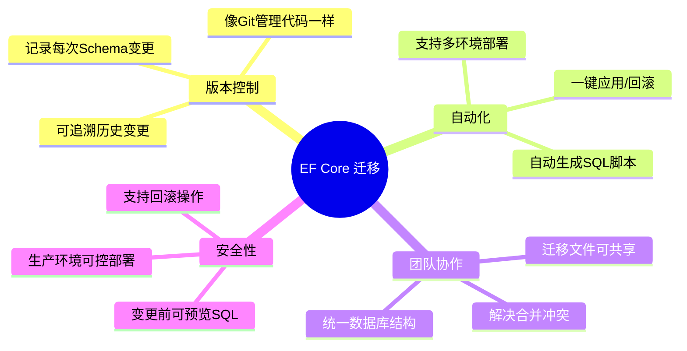
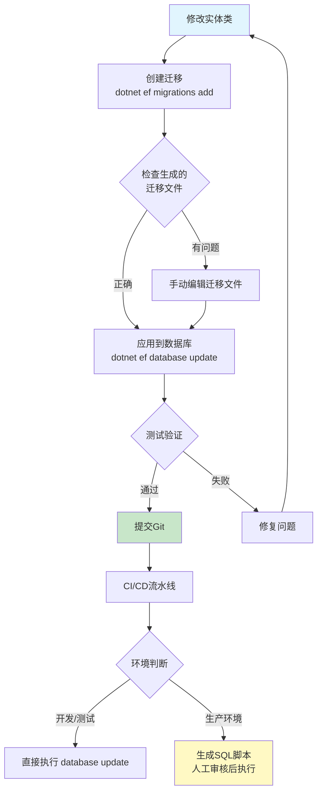
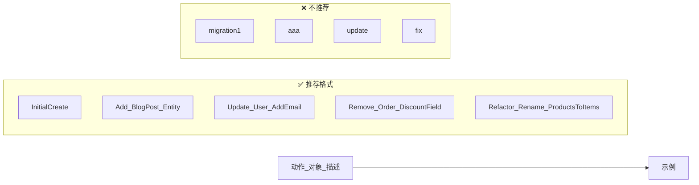
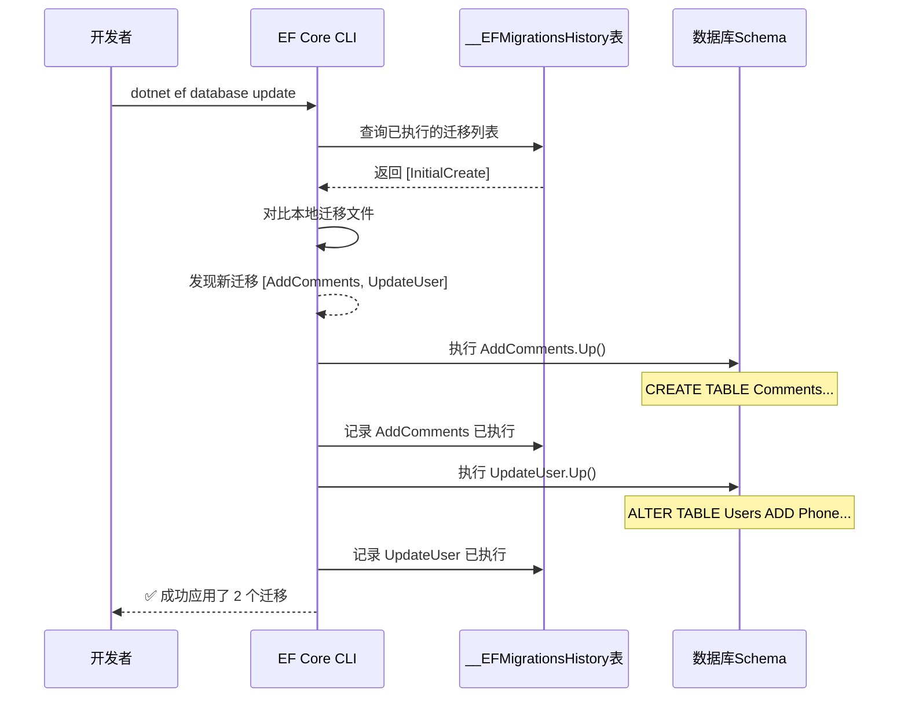
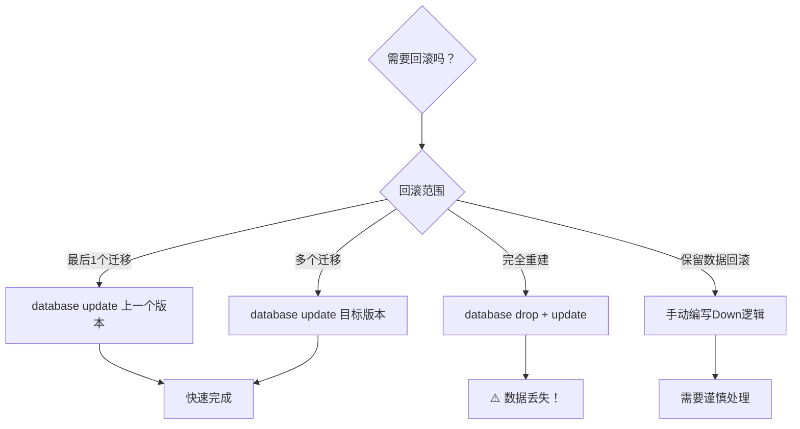
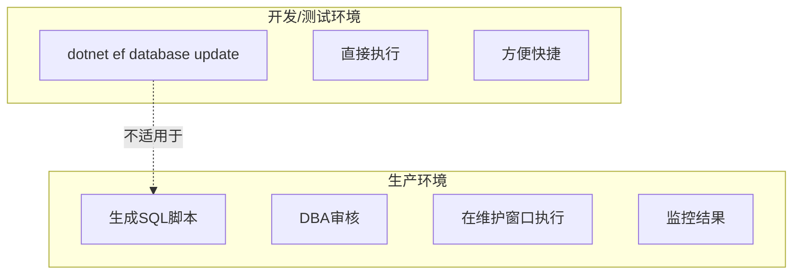
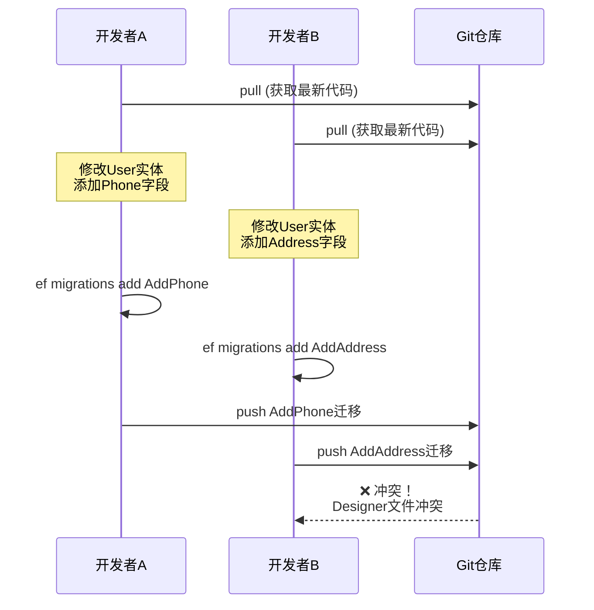

# 数据迁移 - 数据库版本控制

> **学习目标**：掌握EF Core迁移的完整工作流，能够像管理代码一样管理数据库结构的变更
> **前置知识**：Code First开发、DbContext配置、基础SQL知识
> **预计时长**：55分钟

---

## 一、什么是迁移？为什么需要迁移？

### 1.1 核心概念

**数据迁移（Migration）** 是一种数据库版本控制机制，它允许你：



### 1.2 生活化类比：建筑蓝图

把数据库想象成一座**建筑物**：

- **初始设计（InitialCreate）**：地基和框架搭建
- **添加房间（AddBlogPosts）**：新增文章表
- **扩建楼层（AddComments）**：增加评论功能
- **装修改造（UpdateUserTable）**：修改用户表结构
- **拆除重建（回滚）**：撤销不需要的改动

**迁移文件就是建筑图纸**，记录了每一步如何改造建筑物。

### 1.3 为什么必须使用迁移？

#### ❌ 没有迁移的痛点

```bash
# 场景1：手动改数据库
开发A: "我给User表加了个Phone字段"
开发B: "什么？我本地怎么报错了？"
运维: "生产环境的数据库结构是什么？没人知道！"

# 场景2：忘记同步
开发A提交了代码 → CI/CD部署成功 → 应用启动报错 ❌
原因：代码有新字段，但数据库还是旧结构！

# 场景3：无法回滚
"昨晚的更新出了问题，能恢复到昨天的版本吗？"
"不知道昨天改了哪些东西..."
```

#### ✅ 使用迁移的优势

```bash
# 场景1：版本清晰
git log --oneline migrations/
a1b2c3d AddCommentsTable        # 添加评论表
e4f5g6h7 UpdateUserAddPhone     # 用户表添加手机号
i8j9k0l1 InitialCreate          # 初始创建

# 场景2：自动同步
dotnet ef database update       # 一键同步到最新版本

# 场景3：安全回滚
dotnet ef database update AddCommentsTable  # 回滚到指定版本

# 场景4：团队协作
git pull                        # 拉取同事的迁移
dotnet ef database update       # 本地同步
```

---

## 二、迁移工作流完整流程图解

### 2.1 完整工作流程



### 2.2 各阶段详细说明

#### 阶段1：修改模型（起点）

```csharp
// Models/User.cs - 添加新字段
public class User
{
    public int Id { get; set; }
    public string UserName { get; set; }
    
    // 新增字段
    [StringLength(20)]
    [Phone]
    public string? PhoneNumber { get; set; }  // ← 新增
    
    public DateTime? LastLoginAt { get; set; } // ← 新增
}
```

#### 阶段2：创建迁移

```bash
# 在包含.csproj文件的目录下执行
dotnet ef migrations add UpdateUser_AddPhoneAndLastLogin
```

#### 阶段3：检查并调整迁移文件

```csharp
// Migrations/20240115123456_UpdateUser_AddPhoneAndLastLogin.cs
public partial class UpdateUser_AddPhoneAndLastLogin : Migration
{
    protected override void Up(MigrationBuilder migrationBuilder)
    {
        migrationBuilder.AddColumn<string>(
            name: "PhoneNumber",
            table: "Users",
            type: "nvarchar(20)",
            nullable: true);
            
        migrationBuilder.AddColumn<DateTime>(
            name: "LastLoginAt",
            table: "Users",
            type: "datetime2",
            nullable: true);
    }

    protected override void Down(MigrationBuilder migrationBuilder)
    {
        migrationBuilder.DropColumn(
            name: "LastLoginAt",
            table: "Users");
            
        migrationBuilder.DropColumn(
            name: "PhoneNumber",
            table: "Users");
    }
}
```

#### 阶段4：应用迁移

```bash
# 应用所有待执行的迁移
dotnet ef database update

# 或者应用到指定版本
dotnet ef database update UpdateUser_AddPhoneAndLastLogin
```

#### 阶段5：测试和提交

```bash
# 测试应用是否正常运行
dotnet run

# 提交到版本控制
git add Migrations/
git commit -m "add phone and last login fields to user table"
git push origin main
```

---

## 三、dotnet ef migrations add 命令详解

### 3.1 基本语法

```bash
dotnet ef migrations add <迁移名称> [选项]
```

### 3.2 常用选项详解

```bash
# ====== 基本用法 ======

# 创建迁移（名称要有意义！）
dotnet ef migrations add InitialCreate
dotnet ef migrations add AddBlogPostEntity
dotnet ef migrations add UpdateUser_AddEmailField
dotnet ef migrations add Refactor_RenameTablesToPlural

# ====== 指定项目（多项目解决方案）======

# 指定DbContext所在的项目
dotnet ef migrations add MyMigration \
    --project src/Data/MyProject.Data.csproj \
    --startup-project src/Web/MyProject.Web.csproj

# ====== 指定DbContext类（多DbContext场景）======

dotnet ef migrations add LogMigration \
    --context LogDbContext

# ====== 输出目录配置 ======

# 自定义输出目录（默认在Migrations文件夹）
dotnet ef migrations add MyMigration \
    --output-dir Migrations/MyFeature

# ====== 其他选项 ======

# 不生成代码（只查看将要生成的变更，不实际创建文件）
dotnet ef migrations add MyMigration --dry-run

# 使用指定的连接字符串（覆盖appsettings）
dotnet ef migrations add MyMigration \
    --connection "Server=localhost;Database=TestDb;..."

# 强制重新生成快照（解决某些冲突问题）
dotnet ef migrations add MyMigration --force
```

### 3.3 迁移命名规范（重要！）

好的命名能让迁移历史一目了然：



**命名最佳实践**：

| 动作类型 | 前缀 | 示例 |
|---------|------|------|
| 初始创建 | `Initial` + `Create` | `InitialCreate` |
| 新增表/字段 | `Add` + `_[实体名]` | `Add_Comment_Table` |
| 修改表/字段 | `Update` + `_[实体名]` + `_` + `变更` | `Update_User_AddPhone` |
| 删除表/字段 | `Remove` + `_[实体名]` + `_` + `字段` | `Remove_Product_OldPrice` |
| 重命名 | `Rename` + `_[旧名]` + `_To` + `_[新名]` | `Rename_CategoryId_To_SectionId` |
| 索引优化 | `Optimize` + `_[表名]` + `_Indexes` | `Optimize_Orders_Indexes` |
| 重构调整 | `Refactor` + `_[描述]` | `Refactor_Normalize_AddressFields` |

---

## 四、迁移文件的结构和内容解读

### 4.1 迁移文件的组成

每个迁移会生成**两个文件**：

```
Migrations/
├── 20240115120000_InitialCreate.cs           # 迁移主文件（Up/Down方法）
├── 20240115120000_InitialCreate.Designer.cs   # 快照文件（当前模型状态）
└── ApplicationDbContextModelSnapshot.cs       # 全局模型快照（最新状态）
```

### 4.2 迁移主文件详解

```csharp
using Microsoft.EntityFrameworkCore.Migrations;
using Microsoft.EntityFrameworkCore.Metadata;

#nullable disable
namespace MyProject.Data.Migrations
{
    /// <summary>
    /// 初始迁移 - 创建所有表
    /// </summary>
    public partial class InitialCreate : Migration
    {
        /// <summary>
        /// Up方法：执行迁移（升级操作）
        /// 应用这个迁移时会执行这里的代码
        /// </summary>
        protected override void Up(MigrationBuilder migrationBuilder)
        {
            // ========== 创建表 ==========
            
            migrationBuilder.CreateTable(
                name: "Categories",                          // 表名
                columns: table => new                       // 定义列
                {
                    table.Column<int>(name: "Id", type: "int", nullable: false)
                        .Annotation("SqlServer:Identity", "1, 1"),  // 自增主键
                    table.Column<string>(name: "Name", type: "nvarchar(50)", maxLength: 50, nullable: false),
                    table.Column<string>(name: "Slug", type: "nvarchar(100)", maxLength: 100, nullable: false),
                    table.Column<string>(name: "Description", type: "nvarchar(500)", maxLength: 500, nullable: true),
                    table.Column<int?>("ParentId", type: "int", nullable: true),
                    table.Column<int>("SortOrder", type: "int", nullable: false, defaultValue: 0),
                    table.Column<bool>("IsActive", type: "bit", nullable: false, defaultValue: true),
                    table.Column<DateTime>("CreatedAt", type: "datetime2", nullable: false, defaultValueSql: "GETUTCDATE()"),
                },
                constraints: table =>
                {
                    table.PrimaryKey("PK_Categories", x => x.Id);  // 主键约束
                });

            migrationBuilder.CreateTable(
                name: "Users",
                columns: table => new
                {
                    table.Column<int>(name: "Id", type: "int", nullable: false)
                        .Annotation("SqlServer:Identity", "1, 1"),
                    table.Column<string>(name: "UserName", type: "nvarchar(50)", maxLength: 50, nullable: false),
                    table.Column<string>(name: "Email", type: "nvarchar(255)", maxLength: 255, nullable: false),
                    table.Column<string>(name: "PasswordHash", type: "nvarchar(100)", maxLength: 100, nullable: false),
                    table.Column<string>(name: "DisplayName", type: "nvarchar(50)", maxLength: 50, nullable: true),
                    table.Column<string>(name: "PhoneNumber", type: "nvarchar(20)", maxLength: 20, nullable: true),
                    table.Column<int>("Role", type: "int", nullable: false, defaultValue: 2),  // UserRole.User
                    table.Column<bool>("IsActive", type: "bit", nullable: false, defaultValue: true),
                    table.Column<DateTime>("CreatedAt", type: "datetime2", nullable: false, defaultValueSql: "GETUTCDATE()"),
                    table.Column<DateTime?>("LastLoginAt", type: "datetime2", nullable: true),
                    table.Column<byte[]>("RowVersion", type: "rowversion", rowVersion: true, nullable: true),
                },
                constraints: table =>
                {
                    table.PrimaryKey("PK_Users", x => x.Id);
                });

            migrationBuilder.CreateTable(
                name: "BlogPosts",
                columns: table => new
                {
                    table.Column<int>(name: "Id", type: "int", nullable: false)
                        .Annotation("SqlServer:Identity", "1, 1"),
                    table.Column<string>(name: "Title", type: "nvarchar(200)", maxLength: 200, nullable: false),
                    table.Column<string>(name: "Content", type: "nvarchar(max)", nullable: false),
                    table.Column<string>(name: "Summary", type: "nvarchar(500)", maxLength: 500, nullable: true),
                    table.Column<int>("Status", type: "nvarchar(20)", nullable: false),  // 枚举转string
                    table.Column<int>("AuthorId", type: "int", nullable: false),
                    table.Column<int?>("CategoryId", type: "int", nullable: true),
                    table.Column<DateTime>("CreatedAt", type: "datetime2", nullable: false, defaultValueSql: "GETUTCDATE()"),
                    table.Column<DateTime?>("PublishedAt", type: "datetime2", nullable: true),
                    table.Column<int>("ViewCount", type: "int", nullable: false, defaultValue: 0),
                    table.Column<int>("LikeCount", type: "int", nullable: false, defaultValue: 0),
                },
                constraints: table =>
                {
                    table.PrimaryKey("PK_BlogPosts", x => x.Id);
                    
                    // 外键约束
                    table.ForeignKey(
                        name: "FK_BlogPosts_Users_AuthorId",
                        column: x => x.AuthorId,
                        principalTable: "Users",
                        principalColumn: "Id",
                        onDelete: DeleteBehavior.Cascade);  // 级联删除
                    
                    table.ForeignKey(
                        name: "FK_BlogPosts_Categories_CategoryId",
                        column: x => x.CategoryId,
                        principalTable: "Categories",
                        principalColumn: "Id",
                        onDelete: DeleteBehavior.SetNull);  // 删除时设为NULL
                });

            // ========== 创建索引 ==========
            
            migrationBuilder.CreateIndex(
                name: "IX_Users_Email",
                table: "Users",
                column: "Email",
                unique: true);  // 唯一索引
            
            migrationBuilder.CreateIndex(
                name: "IX_BlogPosts_AuthorId",
                table: "BlogPosts",
                column: "AuthorId");
                
            migrationBuilder.CreateIndex(
                name: "IX_BlogPosts_CategoryId",
                table: "BlogPosts",
                column: "CategoryId");
                
            migrationBuilder.CreateIndex(
                name: "IX_BlogPosts_Title",
                table: "BlogPosts",
                column: "Title");
                
            migrationBuilder.CreateIndex(
                name: "IX_BlogPosts_CreatedAt",
                table: "BlogPosts",
                column: "CreatedAt");
        }

        /// <summary>
        /// Down方法：回滚迁移（降级操作）
        /// 回滚这个迁移时会执行这里的代码（与Up相反的操作）
        /// </summary>
        protected override void Down(MigrationBuilder migrationBuilder)
        {
            // 按照依赖关系倒序删除（先删子表，再删父表）
            migrationBuilder.DropTable(name: "BlogPosts");
            migrationBuilder.DropTable(name: "Users");
            migrationBuilder.DropTable(name: "Categories");
        }
    }
}
```

### 4.3 Designer文件（快照）

```csharp
// Designer文件记录了创建迁移时的模型完整状态
// 用于后续比较检测变更
[DbContext(typeof(ApplicationDbContext))]
partial class InitialCreateModelSnapshot : ModelSnapshot
{
    protected override void BuildModel(ModelBuilder modelBuilder)
    {
#pragma warning disable 612, 618
        modelBuilder
            .HasAnnotation("Relational:MaxIdentifierLength", 128)
            .HasAnnotation("ProductVersion", "8.0.0")
            .HasAnnotation("SqlServer:ValueGenerationStrategy", 
                SqlServerValueGenerationStrategy.IdentityColumn);

        modelBuilder.Entity("MyProject.Models.Category", b =>
        {
            b.Property<int>("Id")
                .ValueGeneratedOnAdd()
                .HasColumnType("int");

            // ... 所有属性和关系的详细定义 ...
        });
        
        // ... 其他实体的定义 ...
#pragma warning restore 612, 618
    }
}
```

### 4.4 如何解读迁移内容

**关键信息提取**：

```markdown
## 从迁移文件可以读出的信息：

1. **表结构变化**
   - CreateTable / DropTable：表的创建和删除
   - AddColumn / DropColumn：字段的增减
   - AlterColumn：字段类型或约束的修改

2. **约束变化**
   - AddPrimaryKey / DropPrimaryKey：主键
   - AddForeignKey / DropForeignKey：外键
   - AddUniqueConstraint / DropUniqueConstraint：唯一约束
   - CheckConstraint：检查约束

3. **索引变化**
   - CreateIndex / DropIndex：索引的创建和删除

4. **数据操作**
   - InsertData / DeleteData / UpdateData：种子数据
   - Sql("...")：执行原始SQL

5. **默认值和计算列**
   - defaultValue：固定默认值
   - defaultValueSql：SQL表达式默认值（如 GETDATE()）
```

---

## 五、dotnet ef database update 命令

### 5.1 基本用法

```bash
# ====== 应用迁移 ======

# 应用所有未执行的迁移（最常用）
dotnet ef database update

# 应用到指定迁移（可用于回滚）
dotnet ef database update InitialCreate
dotnet ef database update 20240115120000_InitialCreate

# 回滚到上一个迁移（撤销最后一次更改）
# 先查看迁移历史
dotnet ef migrations list
# 然后指定要回滚到的版本
dotnet ef database update <上一个迁移名称>

# 使用特定连接字符串
dotnet ef database update --connection "Server=...;Database=..."
```

### 5.2 执行过程解析



### 5.3 __EFMigrationsHistory 表

EF Core会在数据库中自动创建这个表来追踪迁移历史：

```sql
-- 查看__EFMigrationsHistory表的内容
SELECT * FROM __EFMigrationsHistory ORDER BY MigrationId;

-- 输出示例：
MigrationId                                  ProductVersion
-------------------------------------------- ----------------
20240115120000_InitialCreate                  8.0.0
20240116103000_AddCommentsTable               8.0.0
20240116143000_UpdateUser_AddPhoneField       8.0.0
```

⚠️ **不要手动修改这个表！** 让EF Core自动管理。

---

## 六、回滚迁移（撤销更改）

### 6.1 回滚方式对比



### 6.2 具体操作示例

```bash
# ====== 方式1：回滚到最后一个迁移 ======
# 假设当前已执行到 Migration3，想回到 Migration2
dotnet ef database update Migration2

# ====== 方式2：回滚到初始状态（空数据库）======
# ⚠️ 警告：这会删除所有表和数据！
dotnet ef database update 0

# 或者
dotnet ef database drop   # 直接删除整个数据库

# ====== 方式3：删除最近一次迁移文件（还没应用到数据库）======
# 如果创建了迁移但还没执行，想删除迁移文件
dotnet ef migrations remove

# 强制删除（即使已经应用到数据库）
dotnet ef migrations remove --force

# ====== 方式4：完全重置（开发环境常用）======
# 删除数据库 + 删除迁移文件 + 重新创建
dotnet ef database drop --force-accept-losses
dotnet ef migrations remove --force
dotnet ef migrations add InitialCreate
dotnet ef database update
```

### 6.3 回滚时的注意事项

⚠️ **数据丢失风险**：

```markdown
## 危险操作（会导致数据丢失）：

1. DROP TABLE 操作不可逆
2. DROP COLUMN 会丢失该列的所有数据
3. database drop 会删除整个数据库

## 安全回滚策略：

1. **先备份**：回滚前备份数据库
2. **先在测试环境验证**：确保Down脚本能正确执行
3. **考虑数据迁移**：如果需要保留数据，在Down中添加数据转移逻辑
4. **生产环境慎重**：最好通过新建迁移来调整，而不是回滚
```

### 6.4 编写安全的Down方法

```csharp
public partial class MergeUsersIntoCustomerTable : Migration
{
    protected override void Up(MigrationBuilder migrationBuilder)
    {
        // 将Users表的数据迁移到Customers表
        migrationBuilder.Sql(@"
            INSERT INTO Customers (Name, Email, CreatedAt)
            SELECT UserName, Email, CreatedAt
            FROM Users;
        ");
        
        // 删除旧的Users表
        migrationBuilder.DropTable("Users");
    }

    protected override void Down(MigrationBuilder migrationBuilder)
    {
        // 重建Users表
        migrationBuilder.CreateTable(
            name: "Users",
            columns: table => new
            {
                table.Column<int>("Id", ...),
                table.Column<string>("UserName", ...),
                table.Column<string>("Email", ...)
            },
            constraints: table =>
            {
                table.PrimaryKey("PK_Users", x => x.Id);
            });
        
        // 尝试从Customers恢复数据（如果可能）
        migrationBuilder.Sql(@"
            INSERT INTO Users (UserName, Email, CreatedAt)
            SELECT Name, Email, CreatedAt
            FROM Customers
            WHERE NOT EXISTS (
                SELECT 1 FROM Users WHERE Users.Email = Customers.Email
            );
        ");
    }
}
```

---

## 七、生成SQL脚本（用于生产环境）

### 7.1 为什么生产环境要用SQL脚本？



**生产环境必须使用SQL脚本的原因**：
✅ **安全性**：DBA可以审核每一行SQL  
✅ **可控性**：可以在低峰期执行  
✅ **可回滚**：提前准备好回滚脚本  
✅ **权限分离**：开发者没有生产数据库权限  
✅ **审计合规**：满足企业安全审计要求  

### 7.2 生成SQL脚本命令

```bash
# ====== 基本用法 ======

# 生成从0到最新版本的增量脚本（完整脚本）
dotnet ef migrations script

# 生成从某个版本到最新版本的增量脚本
dotnet ef migrations script InitialCreate

# 生成两个版本之间的增量脚本
dotnet ef migrations script InitialCreate AddNewFeature

# 生成指定版本的脚本（单个迁移）
dotnet ef migrations script 20240115120000_InitialCreate 20240116103000_AddComments

# ====== 输出到文件 ======

# 输出到文件（推荐）
dotnet ef migrations script -o ./Scripts/Migration_20240116.sql

# 带时间戳的文件名
$timestamp = Get-Date -Format "yyyyMMdd_HHmmss"
dotnet ef migrations script -o "./Scripts/migration_$timestamp.sql"

# ====== 其他选项 ======

# 不幂等（默认，增量式）
dotnet ef migrations script

# 幂等脚本（可重复执行，适合CI/CD）
dotnet ef migrations script --idempotent

# 使用空闲事务（不会锁表，但可能失败）
dotnet ef migrations script --no-transactions
```

### 7.3 SQL脚本示例

```sql
-- 这是EF Core生成的SQL脚本示例
-- 迁移: 20240116143000_UpdateUser_AddPhoneField (2024-01-16 14:30:00)

BEGIN TRANSACTION;

-- 检查迁移是否已执行（防止重复执行）
IF NOT EXISTS (
    SELECT 1 FROM __EFMigrationsHistory WHERE MigrationId = N'20240116143000_UpdateUser_AddPhoneField'
)
BEGIN
    -- ========== Up操作开始 ==========
    
    -- 添加 PhoneNumber 列
    ALTER TABLE [Users] ADD [PhoneNumber] nvarchar(20) NULL;
    
    -- 添加 LastLoginAt 列
    ALTER TABLE [Users] ADD [LastLoginAt] datetime2 NULL;
    
    -- 为 PhoneNumber 创建索引（可选）
    CREATE INDEX [IX_Users_PhoneNumber] ON [Users] ([PhoneNumber]);
    
    -- 记录迁移已执行
    INSERT INTO __EFMigrationsHistory (MigrationId, ProductVersion)
    VALUES (N'20240116143000_UpdateUser_AddPhoneField', N'8.0.0');
END

COMMIT;

GO

-- ========== 回滚脚本（Down操作）==========
-- 如果需要回滚，执行以下SQL：

/*
BEGIN TRANSACTION;

IF EXISTS (
    SELECT 1 FROM __EFMigrationsHistory WHERE MigrationId = N'20240116143000_UpdateUser_AddPhoneField'
)
BEGIN
    -- Down操作：删除添加的列
    DROP INDEX [IX_Users_PhoneNumber] ON [Users];
    ALTER TABLE [Users] DROP COLUMN [LastLoginAt];
    ALTER TABLE [Users] DROP COLUMN [PhoneNumber];
    
    -- 从历史表中移除
    DELETE FROM __EFMigrationsHistory WHERE MigrationId = N'20240116143000_UpdateUser_AddPhoneField';
END

COMMIT;
*/
```

### 7.4 生产环境部署清单

```markdown
## 📋 生产环境迁移部署Checklist

### 部署前准备
- [ ] 备份生产数据库（完整备份）
- [ ] 生成SQL脚本并保存到版本控制
- [ ] DBA审核SQL脚本
- [ ] 准备回滚脚本
- [ ] 通知相关人员维护窗口
- [ ] 准备监控系统（检查错误日志）

### 部署执行
- [ ] 选择低峰期（如凌晨2-4点）
- [ ] 停止应用服务（或启用维护模式）
- [ ] 执行SQL脚本（分步执行，观察结果）
- [ ] 验证表结构和数据完整性
- [ ] 检查应用程序日志无异常
- [ ] 执行冒烟测试（核心功能验证）

### 部署后验证
- [ ] 监控系统性能指标
- [ ] 检查用户反馈
- [ ] 确认备份可用
- [ ] 更新部署文档
```

---

## 八、种子数据（Seed Data）初始化

### 8.1 什么是种子数据？

种子数据是应用程序运行所需的**初始参考数据**：
- 字典数据（性别、省份、订单状态等）
- 默认管理员账号
- 系统配置参数
- 默认分类/标签

### 8.2 EF Core的数据 seeding机制

#### 方式1：在OnModelCreating中配置（推荐）

```csharp
protected override void OnModelCreating(ModelBuilder modelBuilder)
{
    base.OnModelCreating(modelBuilder);

    // ====== 字典数据：用户角色 ======
    modelBuilder.Entity<UserRole>().HasData(
        new UserRole { Id = 1, Name = "超级管理员", Code = "SUPER_ADMIN", SortOrder = 1 },
        new UserRole { Id = 2, Name = "管理员", Code = "ADMIN", SortOrder = 2 },
        new UserRole { Id = 3, Name = "普通用户", Code = "USER", SortOrder = 3 },
        new UserRole { Id = 4, Name = "访客", Code = "GUEST", SortOrder = 4 }
    );

    // ====== 字典数据：文章状态 ======
    modelBuilder.Entity<PostStatus>().HasData(
        new PostStatus { Id = 1, Name = "草稿", Code = "DRAFT", SortOrder = 1 },
        new PostStatus { Id = 2, Name = "已发布", Code = "PUBLISHED", SortOrder = 2 },
        new PostStatus { Id = 3, Name = "已归档", Code = "ARCHIVED", SortOrder = 3 }
    );

    // ====== 字典数据：订单状态 ======
    modelBuilder.Entity<OrderStatus>().HasData(
        new OrderStatus { Id = 1, Name = "待支付", Code = "PENDING_PAYMENT", SortOrder = 1 },
        new OrderStatus { Id = 2, Name = "已支付", Code = "PAID", SortOrder = 2 },
        new OrderStatus { Id = 3, Name = "发货中", Code = "SHIPPING", SortOrder = 3 },
        new OrderStatus { Id = 4, Name = "已完成", Code = "COMPLETED", SortOrder = 4 },
        new OrderStatus { Id = 5, Name = "已取消", Code = "CANCELLED", SortOrder = 5 }
    );

    // ====== 默认管理员账号 ======
    // 注意：密码需要哈希值，这里只是示例
    modelBuilder.Entity<User>().HasData(
        new User
        {
            Id = 1,
            UserName = "admin",
            Email = "admin@example.com",
            PasswordHash = "hashed_password_here", // 实际应该用BCrypt等算法
            DisplayName = "系统管理员",
            Role = UserRoleEnum.Admin,
            IsActive = true,
            CreatedAt = new DateTime(2024, 1, 1, 0, 0, 0, DateTimeKind.Utc)
        }
    );

    // ====== 默认分类 ======
    modelBuilder.Entity<Category>().HasData(
        new Category { Id = 1, Name = "技术", Slug = "tech", Description = "技术相关文章", SortOrder = 1, IsActive = true },
        new Category { Id = 2, Name = "生活", Slug = "life", Description = "生活随笔", SortOrder = 2, IsActive = true },
        new Category { Id = 3, Name = "教程", Slug = "tutorial", Description = "教程文档", SortOrder = 3, IsActive = true }
    );
}
```

#### 方式2：在迁移中插入数据

```csharp
public partial class SeedInitialData : Migration
{
    protected override void Up(MigrationBuilder migrationBuilder)
    {
        // 插入角色数据
        migrationBuilder.InsertData(
            table: "UserRoles",
            columns: new[] { "Id", "Name", "Code", "SortOrder" },
            values: new object[,]
            {
                { 1, "超级管理员", "SUPER_ADMIN", 1 },
                { 2, "管理员", "ADMIN", 2 },
                { 3, "普通用户", "USER", 3 }
            });

        // 插入默认管理员（密码应该是BCrypt哈希）
        var adminPasswordHash = BCrypt.Net.BCrypt.HashPassword("Admin@123456");
        
        migrationBuilder.InsertData(
            table: "Users",
            columns: new[] { "Id", "UserName", "Email", "PasswordHash", "DisplayName", "Role", "IsActive", "CreatedAt" },
            values: new object[,]
            {
                { 1, "admin", "admin@example.com", adminPasswordHash, "系统管理员", 0, true, new DateTime(2024, 1, 1, 0, 0, 0, DateTimeKind.Utc) }
            });
    }

    protected override void Down(MigrationBuilder migrationBuilder)
    {
        // 清理种子数据（按外键顺序）
        migrationBuilder.DeleteData(table: "Users", keyColumn: "Id", keyValue: 1);
        migrationBuilder.DeleteData(table: "UserRoles", keyColumn: "Id", keyValue: 3);
        migrationBuilder.DeleteData(table: "UserRoles", keyColumn: "Id", keyValue: 2);
        migrationBuilder.DeleteData(table: "UserRoles", keyColumn: "Id", keyValue: 1);
    }
}
```

#### 方式3：程序化初始化（灵活但需手动触发）

```csharp
// Extensions/SeedExtensions.cs
using Microsoft.EntityFrameworkCore;
using Microsoft.Extensions.DependencyInjection;
using Microsoft.Extensions.Logging;

public static class SeedExtensions
{
    public static async Task SeedDatabaseAsync(this IServiceProvider services)
    {
        using var scope = services.CreateScope();
        var context = scope.ServiceProvider.GetRequiredService<ApplicationDbContext>();
        var logger = scope.ServiceProvider.GetRequiredService<ILogger<ApplicationDbContext>>();

        try
        {
            logger.LogInformation("Seeding database...");

            // 确保数据库已创建
            await context.Database.EnsureCreatedAsync();

            // 检查是否已有数据（避免重复播种）
            if (!await context.Users.AnyAsync())
            {
                await SeedUsersAsync(context);
                await SeedRolesAsync(context);
                await SeedCategoriesAsync(context);
                
                await context.SaveChangesAsync();
                logger.LogInformation("Database seeded successfully.");
            }
            else
            {
                logger.LogInformation("Database already has data, skipping seed.");
            }
        }
        catch (Exception ex)
        {
            logger.LogError(ex, "An error occurred while seeding the database.");
            throw;
        }
    }

    private static async Task SeedUsersAsync(ApplicationDbContext context)
    {
        var adminPasswordHash = BCrypt.Net.BCrypt.HashPassword("Admin@123456");
        
        context.Users.Add(new User
        {
            UserName = "admin",
            Email = "admin@example.com",
            PasswordHash = adminPasswordHash,
            DisplayName = "系统管理员",
            Role = UserRole.Admin,
            IsActive = true,
            CreatedAt = DateTime.UtcNow
        });
    }

    private static async Task SeedRolesAsync(ApplicationDbContext context)
    {
        var roles = new[]
        {
            new AppRole { Name = "超级管理员", Code = "SUPER_ADMIN" },
            new AppRole { Name = "管理员", Code = "ADMIN" },
            new AppRole { Name = "普通用户", Code = "USER" }
        };
        
        context.Roles.AddRange(roles);
    }

    private static async Task SeedCategoriesAsync(ApplicationDbContext context)
    {
        var categories = new[]
        {
            new Category { Name = "技术", Slug = "tech", SortOrder = 1 },
            new Category { Name = "生活", Slug = "life", SortOrder = 2 },
            new Category { Name = "教程", Slug = "tutorial", SortOrder = 3 }
        };
        
        context.Categories.AddRange(categories);
    }
}

// Program.cs 中调用
var app = builder.Build();

// 在应用启动时执行数据初始化
await app.Services.SeedDatabaseAsync();
```

### 8.3 三种方式的对比

| 特性 | HasData | 迁移InsertData | 程序化初始化 |
|------|---------|----------------|-------------|
| **适用场景** | 静态字典数据 | 与特定迁移绑定 | 动态/复杂初始化 |
| **版本控制** | ✅ 自动追踪 | ✅ 包含在迁移中 | ⚠️ 需自己管理 |
| **灵活性** | ⚠️ 仅简单数据 | ⚠️ 仅简单数据 | ✅ 支持复杂逻辑 |
| **性能** | ✅ 高效 | ✅ 高效 | ⚠️ 取决于实现 |
| **推荐度** | ⭐⭐⭐⭐⭐ | ⭐⭐⭐ | ⭐⭐⭐ |

**建议**：优先使用 **HasData** 方式，简单且自动化。

---

## 九、迁移冲突解决（团队协作场景）

### 9.1 冲突产生的原因



### 9.2 常见冲突类型及解决方案

#### 类型1：Designer文件冲突（最常见）

**症状**：合并时Designer.cs出现冲突标记

**解决方案**：

```bash
# 步骤1：接受对方的Designer文件（因为它是自动生成的）
# 手动合并时选择"theirs"或重新生成

# 步骤2：删除自己的迁移文件（保留对方的）
rm Migrations/20240116*_AddAddress*

# 步骤3：重新生成迁移（基于最新的模型+对方的新迁移）
dotnet ef migrations add AddAddress

# 步骤4：检查新生成的迁移是否正确
cat Migrations/*AddAddress*.cs
```

#### 类型2：同一实体被同时修改

**解决方案**：

```bash
# 方案A：合并后重新生成迁移（推荐）
git pull  # 可能会有冲突
# 解决冲突后
dotnet ef migrations remove --force  # 删除自己的迁移
dotnet ef migrations add CombinedUserUpdates  # 重新生成

# 方案B：保留两个独立的迁移（如果修改不冲突）
# 合并代码后，两个迁移可能都能正常工作
# 但需要测试确保顺序正确
```

#### 类型3：基线迁移问题（新成员加入）

当团队成员首次克隆项目时，数据库可能是空的，但有大量迁移文件：

```bash
# 新成员只需要执行
dotnet ef database update

# 这会依次执行所有迁移，最终得到完整的数据库结构

# 如果迁移太多导致慢，可以创建一个基线迁移
dotnet ef migrations add InitialBaseline \
    --context ApplicationDbContext

# 编辑基线迁移，让它反映当前数据库的状态（空的Up方法）
# 然后在__EFMigrationsHistory中手动插入所有已执行的迁移记录
```

### 9.3 团队协作最佳实践

```markdown
## 🤝 团队协作规范

### 迁移频率
- ✅ 小步快跑：每个功能点单独一个迁移
- ✅ 及时提交：创建迁移后立即commit并push
- ❌ 不要积攒大量变更一次性迁移

### 分支管理
- ✅ 功能分支完成后及时合并到main
- ✅ 合并前pull最新代码并解决冲突
- ✅ 长期分支定期rebase main

### 沟通协调
- ✅ 修改公共实体前在群里告知
- ✅ 大型重构协调好时间，避免并行修改
- ✅ 代码审查时关注迁移文件

### 工作流示例
1. 开始任务前：git pull
2. 修改实体类
3. 创建迁移：ef migrations add xxx
4. 本地测试：ef database update
5. 提交代码：git commit && git push
6. 通知团队成员
```

---

## 十、完整的迁移操作实战演练

### 10.1 场景：博客系统的迭代开发

让我们模拟一个真实项目的迁移历程：

```bash
# ========================================
# 第1天：项目初始化
# ========================================

# 1. 创建实体类（User, BlogPost, Category, Comment）
# （见Code First章节的代码）

# 2. 创建初始迁移
dotnet ef migrations add InitialCreate -o Migrations

# 3. 检查生成的迁移文件
# ✓ 应该包含4个表的CREATE语句

# 4. 应用迁移
dotnet ef database update

# 5. 验证数据库
# 打开SSMS/Azure Data Studio，确认表已创建

# ========================================
# 第2天：添加标签功能（多对多关系）
# ========================================

# 1. 添加Tag实体和PostTag联结表实体
# （见Code First章节）

# 2. 创建迁移
dotnet ef migrations add AddTagsAndPostTags

# 3. 检查迁移内容
# 应该看到：
# - CREATE TABLE Tags
# - CREATE TABLE PostTags
# - 外键约束

# 4. 应用迁移
dotnet ef database update

# ========================================
# 第3天：用户表扩展
# ========================================

# 1. 修改User实体，添加字段
public class User
{
    // ...原有字段...
    
    [StringLength(20)]
    public string? PhoneNumber { get; set; }  // 新增
    
    [Url]
    public string? AvatarUrl { get; set; }    // 新增
    
    public int LoginCount { get; set; } = 0;  // 新增
}

# 2. 创建迁移
dotnet ef migrations add UpdateUser_AddProfileInfo

# 3. 检查迁移
# 应该看到3个ALTER TABLE ADD COLUMN语句

# 4. 应用迁移
dotnet ef database update

# ========================================
# 第4天：性能优化 - 添加索引
# ========================================

# 1. 在Fluent API中添加索引配置
modelBuilder.Entity<BlogPost>(entity =>
{
    entity.HasIndex(e => new { e.Status, e.CreatedAt })
        .HasName("IX_BlogPosts_Status_CreatedAt");
    
    entity.HasIndex(e => e.ViewCount);
});

# 2. 创建迁移
dotnet ef migrations add Optimize_AddPerformanceIndexes

# 3. 检查迁移
# 应该看到多个CREATE INDEX语句

# 4. 应用迁移
dotnet ef database update

# ========================================
# 第5天：发现设计错误 - 需要重构
# ========================================

# 问题：Category的自引用外键应该是Restrict而不是NoAction

# 1. 修改配置
entity.HasOne(c => c.Parent)
    .WithMany(c => c.Children)
    .HasForeignKey(c => c.ParentId)
    .OnDelete(DeleteBehavior.Restrict);  // 改为Restrict

# 2. 创建迁移
dotnet ef migrations add Fix_CategoryCascadeDelete

# 3. 检查迁移
# 应该看到DROP FOREIGN KEY + ADD FOREIGN KEY

# 4. 应用迁移
dotnet ef database update

# ========================================
# 第10天：准备发布v1.0
# ========================================

# 1. 添加种子数据
modelBuilder.Entity<Category>().HasData(
    new Category { Id = 1, Name = "技术", Slug = "tech", ... },
    new Category { Id = 2, Name = "生活", Slug = "life", ... }
);

# 2. 创建种子数据迁移
dotnet ef migrations add SeedInitialCategories

# 3. 生成生产环境SQL脚本
dotnet ef migrations script -o ./Deploy/Scripts/V1.0_FullMigration.sql

# 4. 审核SQL脚本
# 让DBA审核生成的SQL

# 5. 提交所有代码
git add .
git commit -m "prepare for v1.0 release with all migrations"
git tag v1.0.0
git push origin main --tags
```

### 10.2 迁移历史查看和管理

```bash
# 查看所有迁移列表
dotnet ef migrations list

# 输出示例：
# 20240115080000_InitialCreate (applied)
# 20240115100000_AddTagsAndPostTags (applied)
# 20240116090000_UpdateUser_AddProfileInfo (applied)
# 20240116100000_Optimize_AddPerformanceIndexes (applied)
# 20240116110000_Fix_CategoryCascadeDelete (applied)
# 20240116140000_SeedInitialCategories (pending)

# 查看数据库中已执行的迁移
dotnet ef migrations list --context ApplicationDbContext --connection "your_connection_string"

# 查看下一个待执行的迁移会做什么
dotnet ef migrations list --show-pending-only
```

---

## 十一、总结与最佳实践清单

### 11.1 本章要点回顾

✅ **迁移的概念**：数据库版本控制机制，像Git管理代码一样管理数据库  
✅ **完整工作流**：修改模型 → 创建迁移 → 检查 → 应用 → 测试 → 提交  
✅ **命令掌握**：migrations add / database update / migrations script / migrations remove  
✅ **迁移文件结构**：理解Up/Down方法、Designer快照、__EFMigrationsHistory表  
✅ **回滚策略**：安全回滚、数据保护、生产环境注意事项  
✅ **SQL脚本生成**：生产环境必须使用，支持审核和版本控制  
✅ **种子数据**：HasData、迁移InsertData、程序化初始化三种方式  
✅ **团队协作**：冲突解决、分支管理、沟通规范  

### 11.2 最佳实践清单

```markdown
## ✅ 必须遵守的最佳实践

1. **迁移命名有意义**：使用 动作_对象_描述 格式
2. **小步快跑**：每个功能点一个迁移，不要积攒
3. **立即提交**：创建迁移后马上commit并push
4. **检查迁移文件**：每次都审查生成的SQL是否符合预期
5. **测试后再提交**：本地database update成功后再push
6. **生产环境用SQL脚本**：绝不直接在生产环境执行database update
7. **先备份再迁移**：生产环境迁移前必须完整备份
8. **种子数据用HasData**：静态字典数据优先使用模型配置

## 💡 推荐做法

9. **将迁移文件纳入版本控制**：Migrations/目录必须提交到Git
10. **编写清晰的提交信息**：说明这次迁移做了什么
11. **使用--dry-run预览**：不确定时先生成但不实际创建
12. **定期清理旧迁移**：长期项目可以考虑压缩迁移历史
13. **文档化迁移策略**：团队wiki中记录迁移规范

## ⚠️ 常见陷阱

14. 不要修改已执行的迁移文件（除非你清楚后果）
15. 不要忽略合并冲突中的Designer文件
16. 不要在生产环境使用database drop
17. 不要忘记回滚脚本也需要测试
18. 不要在迁移中执行耗时操作（大量数据转换）
```

---

## 十二、练习题

### 练习1：概念理解

1. **以下哪个不是EF Core迁移的优势？**
   - A. 版本控制和可追溯性
   - B. 自动生成SQL脚本
   - C. 能够提高查询性能
   
   **答案：C**（迁移本身不影响查询性能）

2. **生产环境为什么推荐使用SQL脚本而不是直接执行database update？**
   - A. SQL脚本执行更快
   - B. 可以进行DBA审核，更安全可控
   - C. database update不能用于生产环境
   
   **答案：B**

3. **__EFMigrationsHistory表的作用是什么？**
   - A. 存储迁移文件的源代码
   - B. 记录已执行的迁移列表
   - C. 存储数据库的性能统计信息
   
   **答案：B**

### 练习2：动手实践

基于你的博客系统项目，完成以下迁移练习：

1. **创建完整的迁移序列**：
   - InitialCreate（初始表结构）
   - AddTagSupport（添加标签功能）
   - SeedDictionaryData（字典数据初始化）
   
2. **模拟团队协作冲突**：
   - 创建feature-A分支，给User表添加字段X
   - 创建feature-B分支，给User表添加字段Y
   - 合并两个分支，解决迁移冲突
   
3. **生成生产部署包**：
   - 生成完整的SQL脚本
   - 同时生成对应的回滚脚本
   - 编写部署文档说明执行步骤

**参考答案提示**：
```bash
# 1. 迁移序列
dotnet ef migrations add InitialCreate
dotnet ef database update

# 修改实体添加Tag...

dotnet ef migrations add AddTagSupport
dotnet ef database update

# 添加HasData配置...

dotnet ef migrations add SeedDictionaryData
dotnet ef database update

# 2. 冲突解决
git checkout -b feature-A
# 修改User添加字段X
dotnet ef migrations add AddFieldX_ToUser
git commit -am "add field X"

git checkout main
git checkout -b feature-B
# 修改User添加字段Y
dotnet ef migrations add AddFieldY_ToUser
git commit -am "add field Y"

git checkout main
git merge feature-A
git merge feature-B  # 这里可能会有冲突

# 解决冲突：
dotnet ef migrations remove --force  # 删除冲突的迁移
dotnet ef migrations add Combine_XY_Fields  # 重新生成

# 3. 生成部署脚本
dotnet ef migrations script -o Deploy/V1.0_Migration.sql
dotnet ef migrations script 0 InitialCreate -o Deploy/Rollback_Complete.sql
```

### 练习3：思考题

1. **如果一个迁移执行到一半失败了（比如网络中断），数据库会处于什么状态？如何恢复？**

   提示：事务机制、__EFMigrationsHistory表、部分执行的迁移...

2. **在大型项目中，随着时间推移迁移文件越来越多（比如100+），有什么优化策略？**

   提示：基线迁移（Baseline Migration）、迁移压缩、数据库重建...

3. **如何实现多租户系统的迁移？每个租户有独立的Schema或数据库，如何批量执行迁移？**

   提示：动态连接字符串、循环执行、并行化...

---

## 参考资源

- **官方文档**：https://docs.microsoft.com/ef/core/managing-schemas/migrations/
- **迁移命令参考**：https://docs.microsoft.com/ef/core/cli/dotnet#dotnet-ef-migrations
- **生产环境部署指南**：https://docs.microsoft.com/ef/core/managing-schemas/migrations/applying?tabs=dotnet-core-cli
- **团队协作最佳实践**：搜索 "EF Core migration team workflow"

---

> **下一节预告**：[CRUD操作](./CRUD操作.md) - 学习EF Core的核心增删改查操作，掌握Change Tracker工作原理和性能优化技巧！
