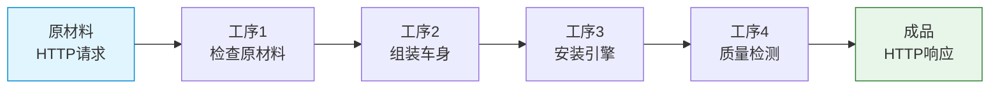
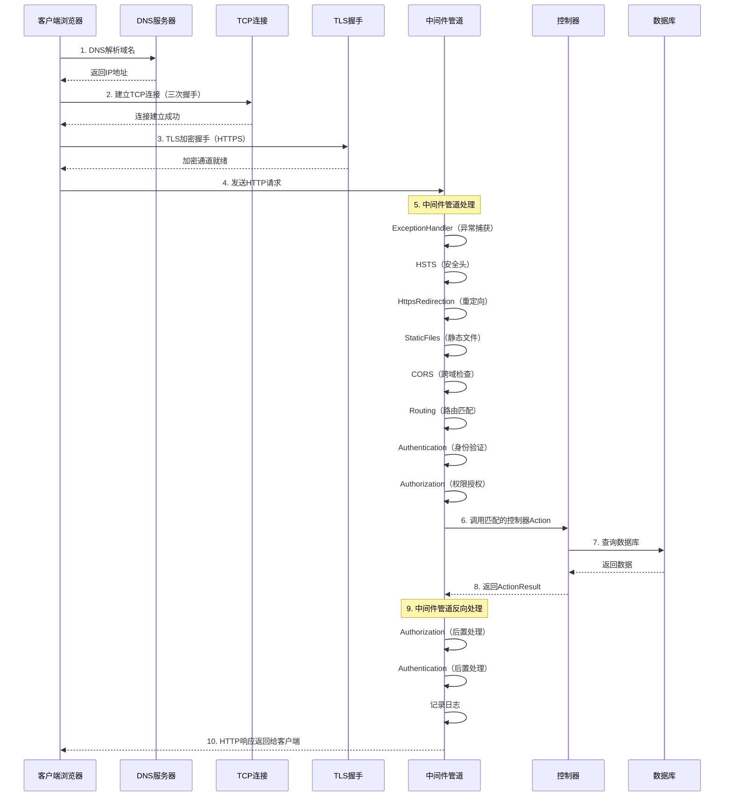
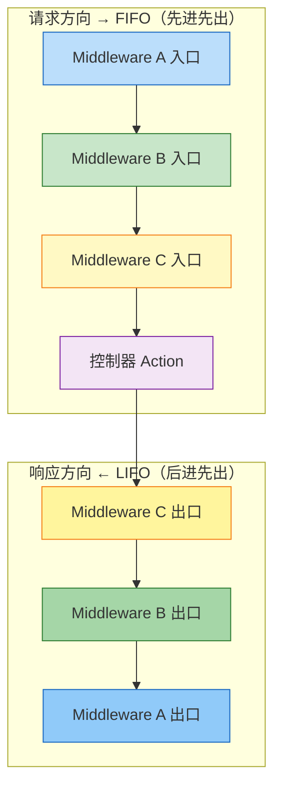
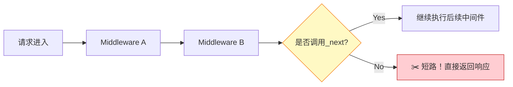

# 中间件管道 (Middleware Pipeline) - HTTP请求的加工流水线

> **学习目标**：深入理解ASP.NET Core中间件的工作原理、执行顺序、自定义方法，以及如何构建高效的请求处理管道
>
> **预计时间**：50分钟 | **难度等级**：⭐⭐⭐⭐ 中高级
>
> **前置知识**：C#异步编程基础、HTTP协议基础、依赖注入概念

---

## 一、什么是中间件？

### 1.1 工厂流水线类比

想象一个现代化的汽车制造工厂：



**每个工序（中间件）可以做什么？**
- ✅ **检查**：查看原材料是否符合规格（验证请求）
- ✅ **修改**：对原材料进行加工处理（修改请求/响应）
- ✅ **拦截**：发现不合格品直接丢弃（返回404/401等错误）
- ✅ **放行**：合格后传递给下一道工序（调用下一个中间件）

### 1.2 为什么需要中间件？

| 传统方式 | 中间件方式 |
|---------|-----------|
| 所有逻辑写在一个巨大的Controller中 | 每个关注点独立成一个中间件 |
| 难以维护和测试 | 单一职责，易于测试和替换 |
| 功能耦合严重 | 松耦合，可灵活组合 |
| 无法复用 | 跨项目复用性强 |

**核心优势**：
- **关注点分离**：日志、认证、缓存各司其职
- **可组合性**：像搭积木一样自由组合功能
- **可测试性**：每个中间件可以独立单元测试
- **性能优化**：可以在管道的任意位置短路（终止请求）

---

## 二、HTTP请求生命周期完整图解

### 2.1 从客户端到服务器的完整旅程



### 2.2 每个阶段的作用

| 阶段 | 对应中间件 | 核心职责 |
|------|----------|---------|
| 网络层 | N/A | DNS解析、TCP连接、TLS加密 |
| 请求入口 | ExceptionHandler | 捕获整个管道中的未处理异常 |
| 安全层 | HSTS / HttpsRedirection | 强制HTTPS、添加安全响应头 |
| 静态资源 | Static Files | 直接返回CSS/JS/图片文件，不经过MVC |
| 跨域控制 | CORS | 处理跨域请求的预检和头部 |
| 路由匹配 | Routing | 解析URL找到对应的Endpoint |
| 身份认证 | Authentication | 验证用户身份（JWT/Cookie） |
| 权限授权 | Authorization | 检查用户是否有权访问资源 |
| 业务逻辑 | Controllers/Endpoints | 执行实际的业务代码 |
| 响应返回 | 各中间件逆序执行 | 日志记录、响应压缩、格式化 |

---

## 三、中间件的执行顺序（核心概念！⭐⭐⭐）

### 3.1 洋葱模型（Onion Model）

这是理解中间件的**最重要概念**：



### 3.2 实际例子：3个中间件的执行流程

假设我们有中间件A、B、C按顺序注册：

```csharp
// Program.cs 中的注册顺序
app.UseMiddleware<A>(); // 第1个注册
app.UseMiddleware<B>(); // 第2个注册
app.UseMiddleware<C>(); // 第3个注册

app.Run(context => context.Response.WriteAsync("Hello from terminal!"));
```

**实际执行顺序**：

```
【请求阶段】（FIFO - 按注册顺序）
┌─────────────────────────────────────┐
│ Middleware A: Before (请求前逻辑)     │ ← 第1个执行
│   ↓                                 │
│ Middleware B: Before (请求前逻辑)     │ ← 第2个执行
│     ↓                               │
│ Middleware C: Before (请求前逻辑)     │ ← 第3个执行
│       ↓                             │
│ Terminal Middleware (Run终端)         │ ← 最后执行
│       ↑                             │
│ Middleware C: After  (响应后逻辑)     │ ← 第1个返回
│     ↑                               │
│ Middleware B: After  (响应后逻辑)     │ ← 第2个返回
│   ↑                                 │
│ Middleware A: After  (响应后逻辑)     │ ← 第3个返回
└─────────────────────────────────────┘
【响应阶段】（LIFO - 反向顺序）
```

**关键理解**：
- `await _next.Invoke()` **之前**的代码 = 请求处理阶段
- `await _next.Invoke()` **之后**的代码 = 响应处理阶段
- 如果不调用 `_next()` = **短路**（后续中间件不会执行）

---

## 四、内置中间件详解（推荐注册顺序）

### 4.1 完整的推荐配置表

| 顺序 | 中间件 | 方法名 | 说明 | 典型配置代码 |
|------|--------|--------|------|-------------|
| **1** | **Exception Handler** | `UseExceptionHandler()` | 全局异常处理，必须放在最前面才能捕获所有异常 | 开发环境显示详情页，生产环境返回友好JSON错误 |
| **2** | **HSTS** | `UseHsts()` | HTTPS严格传输安全，告诉浏览器只使用HTTPS | 生产环境启用，开发环境禁用 |
| **3** | **HTTPS Redirection** | `UseHttpsRedirection()` | 自动将HTTP请求重定向到HTTPS（301或307） | 配置端口号和重定向状态码 |
| **4** | **Static Files** | `UseStaticFiles()` | 提供静态文件服务（wwwroot目录下的文件） | 可配置缓存头、自定义目录 |
| **5** | **CORS** | `UseCors("policy")` | 跨域资源共享控制 | 定义允许的来源、方法、头部 |
| **6** | **Routing** | `UseRouting()` | 路由匹配，解析URL找到对应端点 | 必须在UseAuthentication之前 |
| **7** | **Authentication** | `UseAuthentication()` | 身份验证（识别用户是谁） | JWTBearer、Cookie认证等 |
| **8** | **Authorization** | `UseAuthorization()` | 权限授权（判断用户能做什么） | 基于角色、策略的授权 |
| **9** | **Custom Middleware** | `app.Use(...)` | 自定义业务中间件 | 日志、限流、请求追踪等 |
| **10** | **Map Controllers** | `MapControllers()` | 将路由映射到Controller的Action | MVC模式必需 |

### 4.2 为什么顺序很重要？

```csharp
var app = builder.Build();

// ❌ 错误顺序示例：静态文件放在CORS前面
if (app.Environment.IsDevelopment())
{
    app.UseDeveloperExceptionPage();
}
else
{
    app.UseExceptionHandler("/error"); // 1️⃣ 异常处理必须在最前
}

app.UseHsts();                          // 2️⃣ 安全相关
app.UseHttpsRedirection();              // 3️⃣ HTTPS重定向

app.UseStaticFiles();                   // 4️⃣ 静态文件（性能优化，快速返回）

app.UseCors("AllowSpecificOrigins");    // 5️⃣ CORS跨域控制

app.UseRouting();                       // 6️⃣ 路由匹配

app.UseAuthentication();                // 7️⃣ 先认证（知道你是谁）
app.UseAuthorization();                 // 8️⃣ 后授权（判断你能做什么）

// 9️⃣ 自定义中间件
app.UseMiddleware<RequestLoggingMiddleware>();
app.UseMiddleware<PerformanceMiddleware>();

app.MapControllers();                  // 🔟 映射到Controller

app.Run(); // 终端中间件（如果前面的都没返回响应）
```

**常见顺序错误及后果**：
- ⚠️ UseStaticFiles放在UseCors前面 → 静态文件请求绕过CORS检查
- ⚠️ UseAuthorization放在UseAuthentication前面 → 还没认证就授权，必定失败
- ⚠️ UseExceptionHandler不在最前面 → 无法捕获其他中间件的异常

---

## 五、自定义中间件的三种写法

### 5.1 方式一：Use/Run/Map Lambda表达式（简单场景）

适用于简单的、一次性的中间件逻辑：

```csharp
// ==========================================
// Use: 可以传递给下一个中间件（非终端）
// ==========================================
app.Use(async (context, next) =>
{
    // ✅ 请求处理前的逻辑（洋葱外层进入）
    Console.WriteLine($"[Before] Request: {context.Request.Method} {context.Request.Path}");
    
    // 调用下一个中间件（如果不调用，就是短路！）
    await next.Invoke();
    
    // ✅ 响应处理后的逻辑（洋葱内层出来）
    Console.WriteLine($"[After] Response: {context.Response.StatusCode}");
});

// ==========================================
// Run: 终端中间件（短路管道，不调用next）
// ==========================================
app.Run(async context =>
{
    // 这是一个终端中间件，后面的所有中间件都不会执行
    await context.Response.WriteAsync("Hello from terminal middleware!");
});

// ==========================================
// Map / MapWhen: 条件分支（根据路径或条件分流）
// ==========================================

// Map: 根据路径前缀分支
app.Map("/health", healthApp =>
{
    healthApp.Run(ctx => ctx.Response.WriteAsync("OK"));
});

app.Map("/api/v1", v1App =>
{
    v1App.UseMiddleware<V1VersioningMiddleware>();
    v1App.MapControllers();
});

app.Map("/api/v2", v2App =>
{
    v2App.UseMiddleware<V2VersioningMiddleware>();
    v2App.MapControllers();
});

// MapWhen: 根据条件动态分支
app.MapWhen(context => 
    context.Request.Headers.ContainsKey("X-Custom-Header"), 
    customApp =>
{
    customApp.Run(async ctx =>
    {
        await ctx.Response.WriteAsync("Request with custom header detected!");
    });
});
```

### 5.2 方式二：约定式中间件类（推荐 ⭐⭐⭐）

这是最常用的方式，适合需要复用、有依赖注入需求的场景：

```csharp
/// <summary>
/// 请求日志记录中间件
/// 记录每个请求的方法、路径、耗时、状态码等信息
/// </summary>
public class RequestLoggingMiddleware
{
    private readonly RequestDelegate _next;
    private readonly ILogger<RequestLoggingMiddleware> _logger;

    /// <summary>
    /// 构造函数：接收下一个中间件的委托和Logger
    /// </summary>
    public RequestLoggingMiddleware(
        RequestDelegate next,
        ILogger<RequestLoggingMiddleware> logger)
    {
        _next = next ?? throw new ArgumentNullException(nameof(next));
        _logger = logger ?? throw new ArgumentNullException(nameof(logger));
    }

    /// <summary>
    /// 中间件的核心方法：处理HTTP请求
    /// </summary>
    public async Task InvokeAsync(HttpContext context)
    {
        var stopwatch = Stopwatch.StartNew();
        var requestMethod = context.Request.Method;
        var requestPath = context.Request.Path;
        var requestId = context.TraceIdentifier; // 唯一请求ID
        
        try
        {
            // 📝 请求开始日志
            _logger.LogInformation(
                ">>> [{RequestId}] {Method} {Path} from {RemoteIp}",
                requestId, requestMethod, requestPath, 
                context.Connection.RemoteIpAddress);

            // 调用管道中的下一个中间件
            await _next(context);
        }
        finally
        {
            stopwatch.Stop();
            
            // 📝 请求结束日志（无论成功还是异常都会执行）
            var logLevel = context.Response.StatusCode >= 400 ? LogLevel.Warning : LogLevel.Information;
            
            _logger.Log(logLevel,
                "<<< [{RequestId}] {Method} {Path} => {StatusCode} in {ElapsedMs}ms",
                requestId, requestMethod, requestPath, 
                context.Response.StatusCode, 
                stopwatch.ElapsedMilliseconds);
        }
    }
}

// 注册方式
app.UseMiddleware<RequestLoggingMiddleware>();
```

**约定式中间件的规则**：
1. 类名通常以 `Middleware` 结尾
2. 构造函数接收 `RequestDelegate` 参数（命名为 `_next`）
3. 必须有一个名为 `InvokeAsync` 或 `Invoke` 的公共方法
4. 该方法的第一个参数是 `HttpContext`
5. 可以通过构造函数注入其他服务（Singleton或Transient）

### 5.3 方式三：IMiddleware接口 + IMiddlewareFactory（高级）

支持Scoped依赖注入，适合需要在中间件中使用Scoped服务的场景：

```csharp
/// <summary>
/// 请求计时中间件（使用IMiddleware接口）
/// 支持注入Scoped生命周期的服务
/// </summary>
public class TimingMiddleware : IMiddleware
{
    private readonly ITimingService _timingService; // 可以注入Scoped服务！

    public TimingMiddleware(ITimingService timingService)
    {
        _timingService = timingService ?? throw new ArgumentNullException(nameof(timingService));
    }

    public async Task InvokeAsync(HttpContext context, RequestDelegate next)
    {
        using var activity = _timingService.StartActivity(context.Request.Path);
        
        activity?.SetTag("http.method", context.Request.Method);
        activity?.SetTag("http.url", context.Request.Path.ToString());
        
        try
        {
            await next(context);
            
            activity?.SetTag("http.status_code", context.Response.StatusCode);
        }
        catch (Exception ex)
        {
            activity?.RecordException(ex);
            activity?.SetStatus(ActivityStatusCode.Error);
            throw; // 重新抛出异常，让上层处理
        }
    }
}

// 注册方式（注意：IMiddleware实现类必须使用AddTransient或AddScoped注册）
builder.Services.AddTransient<TimingMiddleware>(); // 或 AddScoped

// 在管道中使用
app.UseMiddleware<TimingMiddleware>();
```

**三种方式的对比**：

| 特征 | Lambda表达式 | 约定式类 | IMiddleware接口 |
|------|------------|---------|----------------|
| **适用场景** | 简单的一次性逻辑 | 大多数场景（推荐） | 需要Scoped DI的场景 |
| **DI支持** | 受限（只能通过闭包） | Singleton/Transient | ✅ 支持Scoped |
| **复用性** | 低（内联代码） | 高（可跨项目复用） | 高 |
| **可测试性** | 困难 | 容易 | 容易 |
| **性能** | 最好（无类开销） | 好 | 稍差（工厂实例化） |
| **推荐度** | ⭐⭐ | ⭐⭐⭐ | ⭐⭐⭐⭐（特定场景） |

---

## 六、最佳实践与常见错误

### 6.1 ✅ DO（推荐做法）

```markdown
## 最佳实践清单

### 设计原则
- [x] **遵循推荐的注册顺序**：ExceptionHandler → Security → Static → CORS → Routing → Auth → Custom → Map
- [x] **使用异步方法**：始终使用 async/await，不要阻塞线程
- [x] **保持单一职责**：一个中间件只做一件事（日志、认证、限流分开）
- [x] **正确处理异常**：使用try-catch-finally确保资源释放
- [x] **通过DI获取依赖**：在构造函数中注入所需的服务
- [x] **使用结构化日志**：记录有意义的上下文信息（请求ID、用户ID、操作类型）

### 性能优化
- [x] **合理使用短路**：对于健康检查、favicon等可以直接返回，不走完整管道
- [x] **避免重复计算**：将不变的计算结果缓存起来
- [x] **使用Span/Memory**：处理大量数据时减少内存分配
```

### 6.2 ❌ DON'T（禁止做法）

```markdown
## 反模式清单

### 致命错误
- [ ] ❌ **阻塞线程**：使用 `.Result` 或 `.Wait()` 等待异步方法
  ```csharp
  // 💀 致命：会导致线程池饥饿和死锁！
  var result = _someService.GetDataAsync().Result;
  
  // ✅ 正确：使用await
  var result = await _someService.GetDataAsync();
  ```

- [ ] ❌ **忽略_next()之后的代码**：以为await _next()后就结束了
  ```csharp
  // ❌ 错误：_next()后的代码不会执行到响应阶段
  await _next(context);
  // 这里的代码永远不会执行到"响应处理"阶段
  
  // ✅ 正确：_next()前后都有逻辑
  // ... 请求前逻辑 ...
  await _next(context);
  // ... 响应后逻辑 ...
  ```

- [ ] ❌ **直接new依赖对象**：
  ```csharp
  // ❌ 错误：无法测试、无法替换实现
  private readonly MyService _service = new MyService();
  
  // ✅ 正确：通过构造函数注入
  public MyMiddleware(IMyService service) { _service = service; }
  ```

- [ ] ❌ **注册顺序错误**：
  ```csharp
  // ❌ 错误：Authorization在Authentication之前
  app.UseAuthorization();
  app.UseAuthentication(); // 此时还没认证，授权肯定失败
  
  // ✅ 正确：先认证后授权
  app.UseAuthentication();
  app.UseAuthorization();
  ```

### 性能杀手
- [ ] ❌ **在中间件中进行大量计算**：如复杂的业务逻辑应该在Controller中
- [ ] ❌ **读取整个RequestBody到内存**：可能导致内存溢出
- [ ] ❌ **同步写入大文件**：会阻塞请求线程
- [ ] ❌ **忽略HttpContext.Response.HasStarted**：响应已经开始就不能再修改Headers了
```

---

## 七、条件分支中间件

### 7.1 MapWhen vs UseWhen 的区别

| 特征 | MapWhen | UseWhen |
|------|---------|---------|
| **是否创建新分支** | ✅ 创建独立的子管道 | ❌ 在当前管道中继续 |
| **是否共享中间件** | ❌ 分支之间完全隔离 | ✅ 共享后续的所有中间件 |
| **适用场景** | API版本隔离、完全不同的处理逻辑 | 有条件的增强功能（如某些路径才记录详细日志） |
| **性能影响** | 较高（需要复制管道） | 较低（只是条件判断） |

### 7.2 完整示例：API版本分支

```csharp
// 场景：根据URL前缀路由到不同版本的API
app.MapWhen(context => context.Request.Path.StartsWithSegments("/api/v1"), v1App =>
{
    // V1版本的专用中间件
    v1App.UseMiddleware<V1CompatibilityMiddleware>();
    v1App.UseRouting();
    v1App.UseAuthentication();
    v1App.UseAuthorization();
    v1App.MapControllers(); // 只映射V1的Controller
});

app.MapWhen(context => context.Request.Path.StartsWithSegments("/api/v2"), v2App =>
{
    // V2版本的专用中间件
    v2App.UseMiddleware<V2ValidationMiddleware>();
    v2App.UseMiddleware<RateLimitingMiddleware>();
    v2App.UseRouting();
    v2App.UseAuthentication();
    v2App.UseAuthorization();
    v2App.MapControllers(); // 只映射V2的Controller
});

// 默认处理其他请求
app.Run(async context =>
{
    context.Response.StatusCode = 404;
    await context.Response.WriteAsync("API version not found");
});
```

### 7.3 根据Header条件分支

```csharp
// 场景：根据请求头决定是否启用详细日志
app.UseWhen(
    context => context.Request.Headers.ContainsKey("X-Debug-Mode"),
    debugApp =>
{
    debugApp.UseMiddleware<DetailedLoggingMiddleware>(); // 只在有X-Debug-Mode头时才启用
});

// 后续中间件对所有请求都生效
app.UseRouting();
app.UseAuthentication();
app.UseAuthorization();
app.MapControllers();
```

---

## 八、终端中间件与短路机制

### 8.1 什么是终端中间件？

终端中间件（Terminal Middleware）是指**不再调用 `_next()`** 的中间件，它会**短路**（Short-circuit）整个管道：



### 8.2 短路的应用场景

#### 示例1：健康检查端点（性能优化）

```csharp
// 健康检查应该尽可能早地返回，不需要经过完整的认证/授权管道
app.Map("/health", healthApp =>
{
    healthApp.Run(async context =>
    {
        // 直接返回，不经过任何其他中间件
        context.Response.ContentType = "application/json";
        await context.Response.WriteAsync(JsonSerializer.Serialize(new
        {
            status = "Healthy",
            timestamp = DateTime.UtcNow.ToString("o"),
            version = "1.0.0"
        }));
    });
});

// 或者更简洁的方式
app.MapGet("/health", () => Results.Json(new { status = "Healthy", timestamp = DateTime.UtcNow }));
```

#### 示例2：静态文件直接返回（性能优化）

```csharp
// 如果请求的是静态文件，直接返回，不走MVC管道
app.UseStaticFiles(new StaticFileOptions
{
    OnPrepareResponse = ctx =>
    {
        // 添加缓存控制头
        ctx.Context.Response.Headers[HeaderNames.CacheControl] = "public,max-age=31536000";
        ctx.Context.Response.Headers[HeaderNames.Expires] = DateTime.UtcNow.AddYears(1).ToString("R");
    }
});
// 如果静态文件存在，这里就会短路，不会到达后面的中间件
```

#### 示例3：基于条件的短路（限流、黑名单）

```csharp
app.Use(async (context, next) =>
{
    var clientIp = context.Connection.RemoteIpAddress?.ToString();
    
    // 检查IP黑名单
    if (IsBlacklisted(clientIp))
    {
        context.Response.StatusCode = StatusCodes.Status403Forbidden;
        await context.Response.WriteAsync("Your IP has been blocked.");
        return; // 不调用next()，短路！
    }
    
    // 检查请求频率限制
    var requestCount = await CheckRateLimitAsync(clientIp);
    if (requestCount > MaxRequestsPerMinute)
    {
        context.Response.StatusCode = StatusCodes.Status429TooManyRequests;
        context.Response.Headers["Retry-After"] = "60";
        await context.Response.WriteAsync("Rate limit exceeded. Please try again later.");
        return; // 不调用next()，短路！
    }
    
    // 通过检查，继续执行后续中间件
    await next();
});
```

### 8.3 Run() vs 不调用_next()

| 方式 | 语法 | 适用场景 |
|------|------|---------|
| `app.Run()` | Lambda表达式 | 简单的终端逻辑，一次性使用 |
| 不调用 `_next()` | 在Use中间件中return | 需要在短路前做一些检查/处理 |

---

## 九、完整的实战示例

### 示例1：请求日志记录中间件

**功能**：记录每个请求的计时、状态码、请求体大小等详细信息。

```csharp
/// <summary>
/// 高级请求日志中间件
/// 功能：计时、状态码记录、请求体大小监控、慢请求告警
/// </summary>
public class AdvancedRequestLoggingMiddleware
{
    private readonly RequestDelegate _next;
    private readonly ILogger<AdvancedRequestLoggingMiddleware> _logger;
    private readonly TimeSpan _slowRequestThreshold;

    public AdvancedRequestLoggingMiddleware(
        RequestDelegate next,
        ILogger<AdvancedRequestLoggingMiddleware> logger,
        IConfiguration configuration)
    {
        _next = next;
        _logger = logger;
        // 从配置读取慢请求阈值（默认500ms）
        _slowRequestThreshold = TimeSpan.FromMilliseconds(
            configuration.GetValue("Logging:SlowRequestThresholdMs", 500));
    }

    public async Task InvokeAsync(HttpContext context)
    {
        var stopwatch = Stopwatch.StartNew();
        var requestId = context.TraceIdentifier;
        var requestInfo = new
        {
            Method = context.Request.Method,
            Path = context.Request.Path.ToString(),
            QueryString = context.Request.QueryString.ToString(),
            ClientIp = context.Connection.RemoteIpAddress?.ToString(),
            UserAgent = context.Request.Headers.UserAgent.ToString(),
            ContentType = context.Request.ContentType
        };

        try
        {
            // 记录请求开始（包含请求体大小）
            long? contentLength = context.Request.ContentLength;
            
            _logger.LogInformation(
                "[{RequestId}] 📥 START {Method} {Path}{Query} | Content-Length: {ContentLength} bytes | IP: {ClientIp}",
                requestId, requestInfo.Method, requestInfo.Path, requestInfo.QueryString,
                contentLength ?? 0, requestInfo.ClientIp);

            // 调用下一个中间件
            await _next(context);

            stopwatch.Stop();

            // 根据状态码选择日志级别
            var statusCode = context.Response.StatusCode;
            var logLevel = statusCode switch
            {
                >= 200 and < 300 => LogLevel.Information, // 成功
                >= 300 and < 400 => LogLevel.Information, // 重定向
                >= 400 and < 500 => LogLevel.Warning,      // 客户端错误
                _ => LogLevel.Error                        // 服务器错误
            };

            var elapsedMs = stopwatch.ElapsedMilliseconds;
            var isSlowRequest = stopwatch.Elapsed > _slowRequestThreshold;

            _logger.Log(logLevel,
                "[{RequestId}] 📤 END {Method} {Path} => {StatusCode} in {ElapsedMs}ms {SlowWarning}",
                requestId, requestInfo.Method, requestInfo.Path, statusCode, elapsedMs,
                isSlowRequest ? "⚠️ SLOW REQUEST!" : "");

            if (isSlowRequest)
            {
                _logger.LogWarning(
                    "[{RequestId}] 🐌 Slow request detected: {Method} {Path} took {ElapsedMs}ms (threshold: {ThresholdMs}ms)",
                    requestId, requestInfo.Method, requestInfo.Path, elapsedMs, 
                    _slowRequestThreshold.TotalMilliseconds);
            }
        }
        catch (Exception ex)
        {
            stopwatch.Stop();
            
            _logger.LogError(ex,
                "[{RequestId}] 💥 UNHANDLED EXCEPTION in {Method} {Path} after {ElapsedMs}ms\n{ErrorMessage}",
                requestId, requestInfo.Method, requestInfo.Path, 
                stopwatch.ElapsedMilliseconds, ex.Message);
            
            // 重新抛出，让上层中间件（如ExceptionHandler）处理
            throw;
        }
    }
}

// 注册
app.UseMiddleware<AdvancedRequestLoggingMiddleware>();
```

### 示例2：全局错误处理中间件

**功能**：统一捕获所有未处理的异常，返回结构化的JSON错误响应。

```csharp
/// <summary>
/// 全局异常处理中间件
/// 将所有未捕获的异常转换为统一的JSON错误响应
/// </summary>
public class GlobalExceptionHandlerMiddleware
{
    private readonly RequestDelegate _next;
    private readonly ILogger<GlobalExceptionHandlerMiddleware> _logger;
    private readonly IHostEnvironment _environment;

    public GlobalExceptionHandlerMiddleware(
        RequestDelegate next,
        ILogger<GlobalExceptionHandlerMiddleware> logger,
        IHostEnvironment environment)
    {
        _next = next;
        _logger = logger;
        _environment = environment;
    }

    public async Task InvokeAsync(HttpContext context)
    {
        try
        {
            await _next(context);
        }
        catch (Exception ex)
        {
            _logger.LogError(ex, "An unhandled exception occurred: {Message}", ex.Message);
            
            await HandleExceptionAsync(context, ex);
        }
    }

    private async Task HandleExceptionAsync(HttpContext context, Exception exception)
    {
        context.Response.ContentType = "application/json";
        
        var response = new ApiResponse<object>
        {
            Success = false,
            Error = CreateErrorResponse(exception),
            TraceId = context.TraceIdentifier
        };

        // 根据异常类型设置不同的HTTP状态码
        context.Response.StatusCode = exception switch
        {
            NotFoundException => StatusCodes.Status404NotFound,
            BusinessException => StatusCodes.StatusBadRequest,
            UnauthorizedAccessException => StatusCodes.Status401Unauthorized,
            ValidationException => StatusCodes.Status422UnprocessableEntity,
            _ => StatusCodes.Status500InternalServerError
        };

        // 开发环境显示详细信息，生产环境隐藏内部细节
        if (_environment.IsDevelopment())
        {
            response.Error.Details = exception.StackTrace;
            response.Error.InnerException = exception.InnerException?.Message;
        }

        var jsonOptions = new JsonSerializerOptions
        {
            PropertyNamingPolicy = JsonNamingPolicy.CamelCase,
            WriteIndented = _environment.IsDevelopment()
        };

        await context.Response.WriteAsync(JsonSerializer.Serialize(response, jsonOptions));
    }

    private ApiError CreateErrorResponse(Exception exception)
    {
        return exception switch
        {
            NotFoundException notFoundEx => new ApiError
            {
                Code = "NOT_FOUND",
                Message = notFoundEx.Message,
                StatusCode = StatusCodes.Status404NotFound
            },
            BusinessException businessEx => new ApiError
            {
                Code = "BUSINESS_ERROR",
                Message = businessEx.Message,
                StatusCode = StatusCodes.Status400BadRequest
            },
            ValidationException validationEx => new ApiError
            {
                Code = "VALIDATION_ERROR",
                Message = "请求数据验证失败",
                Errors = validationEx.Errors,
                StatusCode = StatusCodes.Status422UnprocessableEntity
            },
            _ => new ApiError
            {
                Code = "INTERNAL_ERROR",
                Message = _environment.IsDevelopment() 
                    ? exception.Message 
                    : "服务器内部错误，请稍后重试",
                StatusCode = StatusCodes.Status500InternalServerError
            }
        };
    }
}

// 辅助类定义
public record ApiResponse<T>
{
    public bool Success { get; init; }
    public T? Data { get; init; }
    public ApiError? Error { get; init; }
    public string? TraceId { get; init; }
}

public record ApiError
{
    public string Code { get; init; } = "";
    public string Message { get; init; } = "";
    public int StatusCode { get; init; }
    public Dictionary<string, string[]>? Errors { get; init; }
    public string? Details { get; init; }
    public string? InnerException { get; init; }
}

// 注册（必须放在最前面！）
app.UseMiddleware<GlobalExceptionHandlerMiddleware>();
```

### 示例3：API Key认证中间件

**功能**：简单的API密钥验证，用于保护内部API或第三方集成接口。

```csharp
/// <summary>
/// API Key认证中间件
/// 验证请求头中的X-API-Key是否有效
/// </summary>
public class ApiKeyAuthMiddleware
{
    private readonly RequestDelegate _next;
    private readonly ILogger<ApiKeyAuthMiddleware> _logger;
    private readonly IConfiguration _configuration;

    public ApiKeyAuthMiddleware(
        RequestDelegate next,
        ILogger<ApiKeyAuthMiddleware> logger,
        IConfiguration configuration)
    {
        _next = next;
        _logger = logger;
        _configuration = configuration;
    }

    public async Task InvokeAsync(HttpContext context)
    {
        // 检查是否配置了API Key验证
        var apiKeyConfig = _configuration.GetSection("ApiKeyAuthentication");
        var enabled = apiKeyConfig.GetValue<bool>("Enabled", false);
        
        if (!enabled)
        {
            // 未启用API Key验证，直接放行
            await _next(context);
            return;
        }

        // 从请求头获取API Key
        if (!context.Request.Headers.TryGetValue("X-API-Key", out var extractedApiKey))
        {
            _logger.LogWarning(
                "Missing API Key for request: {Method} {Path} from {ClientIp}",
                context.Request.Method, context.Request.Path,
                context.Connection.RemoteIpAddress);

            await ReturnUnauthorizedResponse(context, "Missing API Key");
            return;
        }

        // 验证API Key
        var validApiKeys = apiKeyConfig.GetSection("ValidKeys").Get<List<string>>() ?? new List<string>();
        
        if (!validApiKeys.Any(key => string.Equals(key, extractedApiKey, StringComparison.Ordinal)))
        {
            _logger.LogWarning(
                "Invalid API Key for request: {Method} {Path} from {ClientIp}",
                context.Request.Method, context.Request.Path,
                context.Connection.RemoteIpAddress);

            await ReturnUnauthorizedResponse(context, "Invalid API Key");
            return;
        }

        // API Key验证通过，将API Key标识添加到Context中（供后续使用）
        context.Items["ApiKeyAuthenticated"] = true;
        context.Items["ApiKey"] = extractedApiKey.ToString();

        _logger.LogDebug(
            "API Key authenticated successfully for request: {Method} {Path}",
            context.Request.Method, context.Request.Path);

        // 继续执行后续中间件
        await _next(context);
    }

    private static async Task ReturnUnauthorizedResponse(HttpContext context, string message)
    {
        context.Response.ContentType = "application/json";
        context.Response.StatusCode = StatusCodes.Status401Unauthorized;

        var response = new
        {
            error = "Unauthorized",
            message = message,
            timestamp = DateTime.UtcNow
        };

        await context.Response.WriteAsync(JsonSerializer.Serialize(response));
    }
}

// appsettings.json 配置
/*
{
  "ApiKeyAuthentication": {
    "Enabled": true,
    "ValidKeys": [
      "your-production-api-key-here",
      "your-staging-api-key-here"
    ]
  }
}
*/

// 注册（放在Routing之后，Authorization之前）
app.UseMiddleware<ApiKeyAuthMiddleware>();
```

---

## 十、练习题与参考答案

### 练习 1：中间件执行顺序判断题

**题目**：以下中间件按A-B-C-D顺序注册，D是终端中间件。请写出完整的执行顺序：

```csharp
app.UseMiddleware<A>(); // 输出："A-In "
app.UseMiddleware<B>(); // 输出："B-In "
app.UseMiddleware<C>(); // 输出："C-In "
app.Run(context => context.Response.WriteAsync("D-Terminal"));
// A/B/C的_after_分别输出："A-Out ", "B-Out ", "C-Out "
```

**答案**：
```
完整输出顺序：A-In → B-In → C-In → D-Terminal → C-Out → B-Out → A-Out
最终结果字符串："A-In B-In C-In D-Terminal C-Out B-Out A-Out"
```

**解析**：请求方向FIFO（A→B→C→D），响应方向LIFO（D→C→B→A）

---

### 练习 2：找出Bug - 异步死锁问题

**题目**：以下中间件代码有什么致命问题？

```csharp
public class BadMiddleware
{
    private readonly RequestDelegate _next;
    private readonly IUserService _userService;

    public BadMiddleware(RequestDelegate next, IUserService userService)
    {
        _next = next;
        _userService = userService;
    }

    public async Task InvokeAsync(HttpContext context)
    {
        // 问题代码在这里
        var user = _userService.GetCurrentUserAsync().Result; // 💀
        context.Items["CurrentUser"] = user;
        
        await _next(context);
    }
}
```

**答案**：
- **问题**：使用了 `.Result` 同步等待异步方法
- **后果**：会导致**死锁**（Deadlock），特别是在ASP.NET Core的同步上下文中
- **原因**：`.Result` 会阻塞当前线程等待任务完成，但异步任务可能需要回到该线程才能完成，形成互相等待
- **修复**：
  ```csharp
  // ✅ 正确做法：使用await
  var user = await _userService.GetCurrentUserAsync();
  ```

---

### 练习 3：设计题 - 限流中间件

**题目**：设计一个基于IP地址的限流中间件，要求：
1. 每个IP每分钟最多100次请求
2. 超过限制返回429状态码和 Retry-After 头部
3. 使用内存缓存存储计数器
4. 考虑线程安全性

**参考答案**：

```csharp
public class RateLimitingMiddleware
{
    private readonly RequestDelegate _next;
    private readonly ILogger<RateLimitingMiddleware> _logger;
    private readonly IMemoryCache _cache;
    private readonly int _maxRequestsPerMinute;
    private static readonly SemaphoreSlim _lock = new(1, 1);

    public RateLimitingMiddleware(
        RequestDelegate next,
        ILogger<RateLimitingMiddleware> logger,
        IMemoryCache cache,
        IConfiguration config)
    {
        _next = next;
        _logger = logger;
        _cache = cache;
        _maxRequestsPerMinute = config.GetValue("RateLimit:MaxPerMinute", 100);
    }

    public async Task InvokeAsync(HttpContext context)
    {
        var clientIp = context.Connection.RemoteIpAddress?.ToString() ?? "unknown";
        var cacheKey $"ratelimit:{clientIp}:{DateTime.UtcNow.Minute}";
        
        int currentCount;
        
        await _lock.WaitAsync();
        try
        {
            currentCount = _cache.GetOrCreate(cacheKey, entry =>
            {
                entry.AbsoluteExpirationRelativeToNow = TimeSpan.FromMinutes(1);
                return 1;
            });

            if (currentCount >= _maxRequestsPerMinute)
            {
                _logger.LogWarning("Rate limit exceeded for IP: {ClientIp}", clientIp);
                
                context.Response.StatusCode = StatusCodes.Status429TooManyRequests;
                context.Response.Headers["Retry-After"] = "60";
                
                await context.Response.WriteAsync(JsonSerializer.Serialize(new
                {
                    error = "Too Many Requests",
                    message = $"Rate limit exceeded. Max {_maxRequestsPerMinute} requests per minute.",
                    retryAfterSeconds = 60
                }));
                
                return; // 短路！
            }
            
            _cache.Set(cacheKey, currentCount + 1);
        }
        finally
        {
            _lock.Release();
        }
        
        await _next(context);
    }
}
```

---

### 练习 4：排查题 - 为什么CORS不起作用？

**题目**：开发者报告前端无法进行跨域请求，以下是Program.cs的中间件配置：

```csharp
var app = builder.Build();

app.UseStaticFiles();           // ①
app.UseCors("AllowAll");        // ②
app.UseRouting();               // ③
app.UseAuthentication();        // ④
app.UseAuthorization();         // ⑤
app.MapControllers();           // ⑥
app.Run();
```

**问题**：为什么CORS配置看起来正确但不生效？

**答案**：
- **根本原因**：`UseStaticFiles()` 在 `UseCors()` **之前**
- **影响**：虽然这不是直接的CORS问题，但如果静态文件的请求先被处理并返回了响应，可能绕过了CORS检查
- **另一个可能的问题**：CORS策略 `"AllowAll"` 可能没有正确定义
- **正确顺序**：
  ```csharp
  app.UseCors("AllowAll");        // 应该在UseStaticFiles之后
  app.UseStaticFiles();           // 或者确保CORS覆盖所有路由
  ```
- **调试建议**：
  1. 检查浏览器DevTools Network面板的响应头是否有 `Access-Control-Allow-*`
  2. 确认CORS策略已正确注册：`builder.Services.AddCors(options => ...)`
  3. 对于OPTIONS预检请求，确认没有被其他中间件拦截

---

### 练习题 5：综合应用

**题目**：为一个电商平台API设计中间件管道，要求包含以下功能：
1. 全局异常处理
2. HTTPS强制跳转
3. 静态文件服务（带缓存）
4. API版本控制（v1和v2）
5. 请求日志记录
6. 身份认证和授权
7. 健康检查端点（不应经过认证）

**参考答案**：

```csharp
var app = builder.Build();

// 1. 全局异常处理（必须最前）
app.UseMiddleware<GlobalExceptionHandlerMiddleware>();

// 2. 安全相关
if (!app.Environment.IsDevelopment())
{
    app.UseHsts();
}
app.UseHttpsRedirection();

// 3. 静态文件（带缓存优化）
app.UseStaticFiles(new StaticFileOptions
{
    OnPrepareResponse = ctx =>
    {
        ctx.Context.Response.Headers[HeaderNames.CacheControl] = "public,max-age=31536000,immutable";
    }
});

// 4. 健康检查（短路，不经过认证）
app.MapGet("/health", () => Results.Ok(new { status = "Healthy", timestamp = DateTime.UtcNow }));

// 5. CORS
app.UseCors("AllowFrontend");

// 6. 请求日志
app.UseMiddleware<AdvancedRequestLoggingMiddleware>();

// 7. API版本分支
app.MapWhen(ctx => ctx.Request.Path.StartsWithSegments("/api/v1"), v1 =>
{
    v1.UseRouting();
    v1.UseAuthentication();
    v1.UseAuthorization();
    v1.MapControllers(); // V1 controllers
});

app.MapWhen(ctx => ctx.Request.Path.StartsWithSegments("/api/v2"), v2 =>
{
    v2.UseRouting();
    v2.UseAuthentication();
    v2.UseAuthorization();
    v2.MapControllers(); // V2 controllers
});

// 8. 默认404处理
app.Run(async context =>
{
    context.Response.StatusCode = 404;
    await context.Response.WriteAsync(JsonSerializer.Serialize(new { error = "Not Found" }));
});
```

---

## 总结

中间件管道是ASP.NET Core的**灵魂架构**，掌握它意味着你真正理解了HTTP请求是如何被处理的。记住以下几个核心要点：

1. **洋葱模型**：请求FIFO进入，响应LIFO返回，这是最重要的概念
2. **顺序至关重要**：ExceptionHandler最前，Map最后，认证在授权之前
3. **短路机制**：合理使用短路可以大幅提升性能（健康检查、静态文件）
4. **约定优于配置**：推荐使用约定式中间件类，便于测试和维护
5. **异步优先**：永远使用async/await，绝对不要阻塞线程
6. **单一职责**：每个中间件只做一件事，保持简洁和可测试性

通过合理设计和组织中间件管道，你可以构建出高性能、易维护、可扩展的Web应用程序！

---

**延伸阅读**：
- [Microsoft官方文档 - ASP.NET Core中间件](https://docs.microsoft.com/aspnet/core/fundamentals/middleware/)
- [Microsoft官方文档 - 编写自定义中间件](https://docs.microsoft.com/aspnet/core/fundamentals/middleware/write)
- [理解中间件管道 - 深入剖析](https://www.stevejgordon.co.uk/asp-net-core-middleware-demystified)

**上一节**：[依赖注入](./依赖注入.md) | **下一节**：[配置系统](./配置系统.md)
