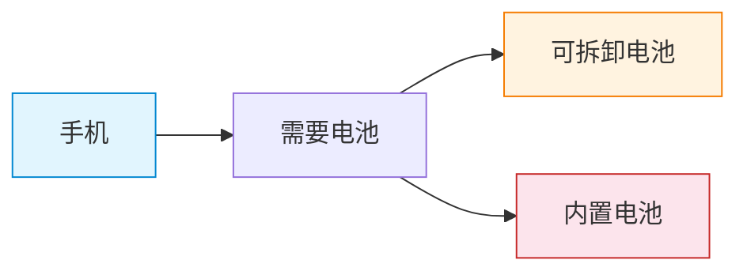
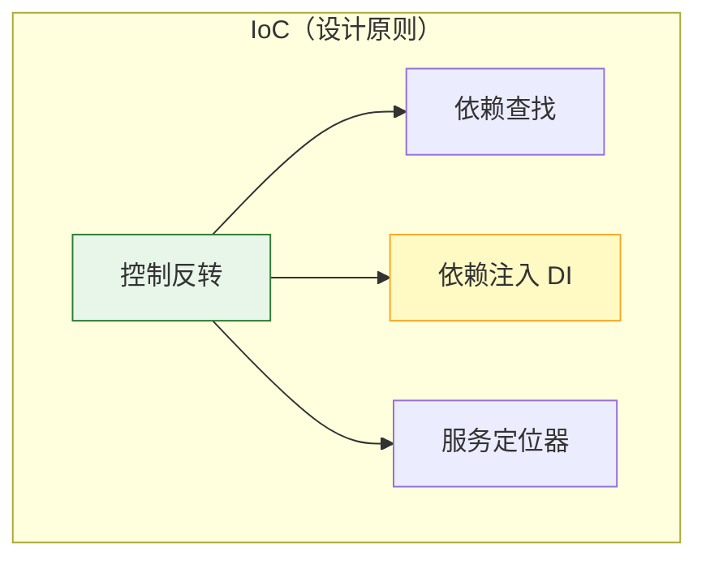
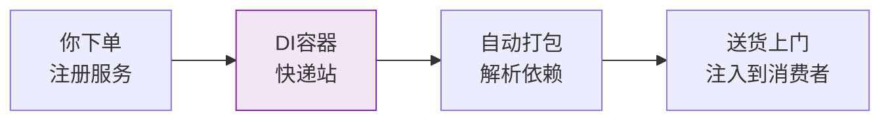
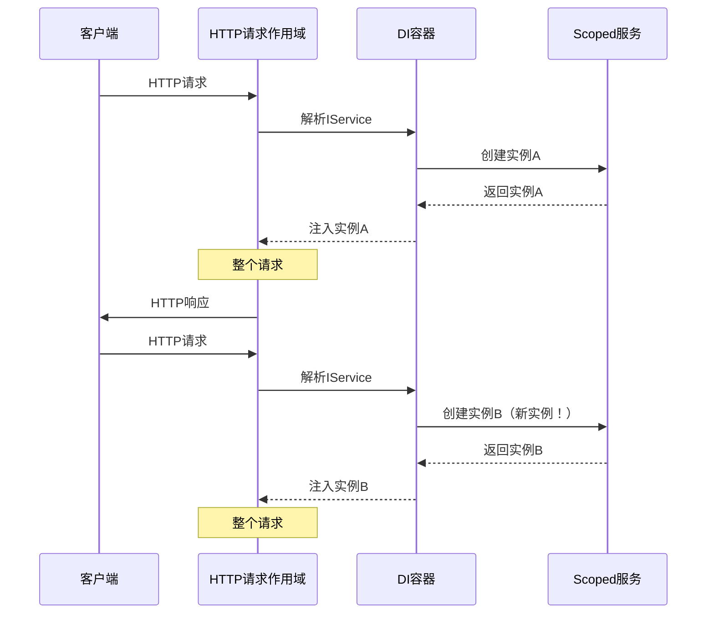
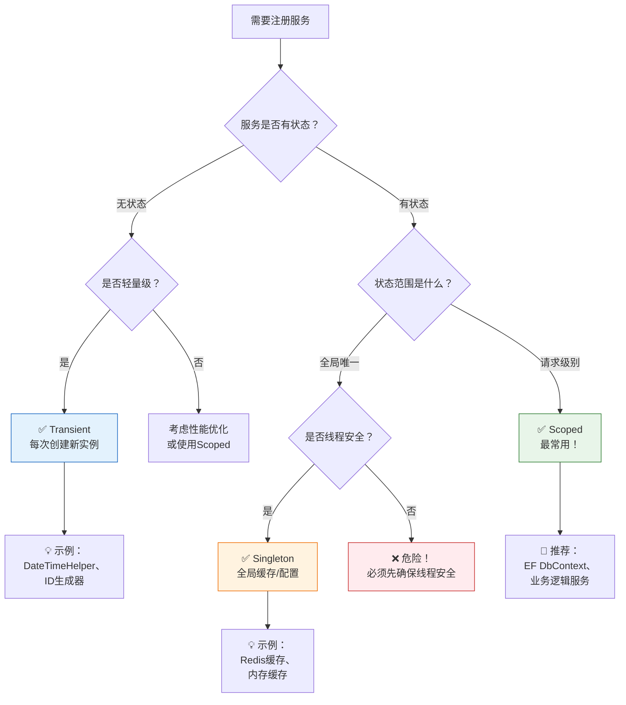
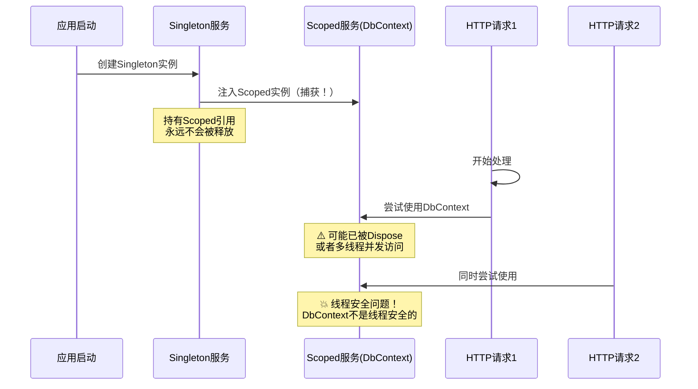

# 依赖注入 (Dependency Injection) - 现代开发的基石

> **学习目标**：掌握依赖注入的核心概念、ASP.NET Core内置DI容器的使用方法，以及如何正确选择服务生命周期
>
> **预计时间**：45分钟 | **难度等级**：⭐⭐⭐ 中级
>
> **前置知识**：C#基础语法、面向对象编程概念

---

## 一、什么是依赖？什么是注入？

### 1.1 生活化类比：手机和电池

想象你有一部智能手机：



**依赖关系**：手机需要电池才能工作 - 这就是"依赖"

**两种"注入"方式**：
- **可拆卸电池（推荐）**：你可以随时更换不同品牌、不同容量的电池 → **松耦合**
- **内置电池（不推荐）**：电池焊死在主板上，坏了就得换整机 → **紧耦合**

### 1.2 另一个例子：电脑和外设

```csharp
// ❌ 紧耦合示例 - 硬编码依赖
public class Computer
{
    private readonly LogitechMouse _mouse = new LogitechMouse(); // 直接new，无法更换
    
    public void Work()
    {
        _mouse.Click();
    }
}

// ✅ 松耦合示例 - 依赖注入
public class Computer
{
    private readonly IMouse _mouse; // 依赖抽象接口
    
    // 通过构造函数"注入"具体的鼠标实现
    public Computer(IMouse mouse)
    {
        _mouse = mouse;
    }
    
    public void Work()
    {
        _mouse.Click(); // 不关心是罗技还是雷蛇的鼠标
    }
}
```

**核心思想**：不要自己创建依赖对象，让别人提供给你！

---

## 二、IoC（控制反转）概念

### 2.1 好莱坞原则

在好莱坞，演员去试镜后得到的回复通常是：

> **"Don't call us, we'll call you."**
> （别打电话给我们，我们会打电话给你）

这就是 **IoC（Inversion of Control，控制反转）** 的精髓：

| 传统方式（正控） | IoC方式（反转） |
|------------------|-----------------|
| 你主动创建依赖对象 | 容器主动给你提供对象 |
| 你控制对象的创建和生命周期 | 框架控制对象的创建和生命周期 |
| 紧耦合，难以测试 | 松耦合，易于测试和维护 |

### 2.2 IoC vs DI 的关系



**关键点**：
- **IoC** 是一种设计原则（思想）
- **DI** 是实现IoC的一种具体技术（手段）
- ASP.NET Core 使用的是 **DI** 方式实现IoC

---

## 三、DI（依赖注入）的三种方式

### 3.1 构造函数注入（强烈推荐 ⭐⭐⭐）

这是最常用、最推荐的注入方式：

```csharp
// 服务接口定义
public interface IEmailService
{
    void SendEmail(string to, string subject, string body);
}

// 服务实现
public class SmtpEmailService : IEmailService
{
    private readonly ILogger<SmtpEmailService> _logger;
    
    // ✅ 构造函数注入 - 在对象创建时就获得所有必需的依赖
    public SmtpEmailService(ILogger<SmtpEmailService> logger)
    {
        _logger = logger ?? throw new ArgumentNullException(nameof(logger));
    }
    
    public void SendEmail(string to, string subject, string body)
    {
        _logger.LogInformation("发送邮件到 {EmailAddress}", to);
        // 发送邮件逻辑...
    }
}

// 控制器中使用
[ApiController]
[Route("api/[controller]")]
public class OrderController : ControllerBase
{
    private readonly IEmailService _emailService;
    private readonly IOrderRepository _orderRepository;
    
    // ✅ 多个依赖通过构造函数一次性注入
    public OrderController(IEmailService emailService, IOrderRepository orderRepository)
    {
        _emailService = emailService;
        _orderRepository = orderRepository;
    }
    
    [HttpPost]
    public IActionResult CreateOrder([FromBody] OrderDto order)
    {
        var result = _orderRepository.Create(order);
        _emailService.SendEmail(order.Email, "订单确认", "您的订单已创建");
        return Ok(result);
    }
}
```

**优点**：
- ✅ 依赖关系清晰明确
- ✅ 保证对象在使用前已经完全初始化
- ✅ 便于单元测试（可以轻松传入Mock对象）
- ✅ 不可变性（可以设为readonly）

### 3.2 属性注入（谨慎使用 ⚠️）

```csharp
public class ReportGenerator
{
    // 必需依赖用构造函数注入
    private readonly IDataService _dataService;
    
    public ReportGenerator(IDataService dataService)
    {
        _dataService = dataService;
    }
    
    // ⚠️ 可选依赖使用属性注入
    [FromServices]
    public ILogger<ReportGenerator>? Logger { get; set; }
    
    public void Generate()
    {
        Logger?.LogInformation("开始生成报告..."); // 需要检查null
        var data = _dataService.GetData();
        // ...
    }
}
```

**适用场景**：
- 可选依赖（没有也能工作，有则更好）
- 需要在运行时动态替换的实现

**缺点**：
- ⚠️ 可能导致对象处于未完全初始化状态
- ⚠️ 依赖关系不明显，难以追踪
- ⚠️ 违反了"显式优于隐式"原则

### 3.3 方法注入（特殊场景使用 🔧）

```csharp
public class ExportService
{
    private readonly IRepository _repository;
    
    public ExportService(IRepository repository)
    {
        _repository = repository;
    }
    
    // 方法参数中注入临时性服务
    public byte[] ExportToPdf(
        int reportId,
        [FromServices] IPdfGenerator pdfGenerator,  // 从DI容器获取
        [FromServices] ICurrentUser currentUser)     // 从DI容器获取
    {
        var data = _repository.GetById(reportId);
        return pdfGenerator.Generate(data, currentUser.Name);
    }
}
```

**适用场景**：
- 只在特定方法中需要的临时服务
- 需要传递额外上下文信息的服务

---

## 四、ASP.NET Core 内置 DI 容器介绍

### 4.1 什么是DI容器？

DI容器就像一个**智能快递站**：



**工作流程**：
1. **注册阶段**：告诉容器"我有哪些服务可用"
2. **解析阶段**：当需要某个服务时，容器自动创建并注入所有依赖
3. **释放阶段**：根据生命周期管理服务实例

### 4.2 Program.cs 中的基本配置

```csharp
var builder = WebApplication.CreateBuilder(args);

// ============================================
// 第一步：注册服务（配置阶段）
// ============================================

// 注册数据访问层
builder.Services.AddScoped<IUserRepository, UserRepository>();
builder.Services.AddScoped<IOrderRepository, OrderRepository>();

// 注册业务逻辑层
builder.Services.AddScoped<IUserService, UserService>();
builder.Services.AddScoped<IOrderService, OrderService>();

// 注册基础设施
builder.Services.AddSingleton<ICacheService, RedisCacheService>();
builder.Services.AddTransient<ILoggerFactory, LoggerFactory>();

var app = builder.Build();

// ============================================
// 第二步：使用服务（运行时自动注入）
// ============================================

app.MapGet("/api/users/{id}", (int id, IUserService userService) =>
{
    var user = userService.GetUserById(id);
    return Results.Ok(user);
});

app.Run();
```

---

## 五、服务注册方法详解

### 5.1 AddTransient - 瞬态服务

**特点**：每次请求都创建全新的实例

```csharp
builder.Services.AddTransient<IGuidService, GuidService>();

// 服务实现
public class GuidService : IGuidService
{
    public Guid InstanceId { get; } = Guid.NewGuid();
    
    public GuidService()
    {
        Console.WriteLine($"创建新的GuidService实例: {InstanceId}");
    }
}
```

**生活类比**：**一次性餐具**
- 每次用餐都给一套新的
- 用完就扔，不会重复使用
- 无状态，不需要保持之前的数据

**适用场景**：
- ✅ 轻量级、无状态的服务
- ✅ 工具类、辅助类
- ✅ 每次调用都需要全新状态的场景

**示例代码**：

```csharp
// 轻量级工具服务
public interface IDateTimeProvider
{
    DateTime Now { get; }
    DateTime UtcNow { get; }
}

public class DateTimeProvider : IDateTimeProvider
{
    public DateTime Now => DateTime.Now;
    public DateTime UtcNow => DateTime.UtcNow;
}

// 注册为Transient（无状态，每次都返回当前时间）
builder.Services.AddTransient<IDateTimeProvider, DateTimeProvider>();
```

### 5.2 AddScoped - 作用域服务（最常用！⭐）

**特点**：在每个作用域（Scope）内共享同一个实例



**生活类比**：**购物车**
- 一个用户的一次购物过程中共享同一个购物车
- 不同用户的购物车互相独立
- 购物结束后，购物车被销毁

**适用场景**（最常用的生命周期）：
- ✅ 数据访问层（Entity Framework DbContext）
- ✅ 业务逻辑层服务
- ✅ 需要在一个HTTP请求内保持状态的服务
- ✅ 工作单元模式（Unit of Work）

**完整示例**：

```csharp
// 数据库上下文 - 典型的Scoped服务
public class ApplicationDbContext : DbContext
{
    public ApplicationDbContext(DbContextOptions<ApplicationDbContext> options)
        : base(options)
    {
    }
    
    public DbSet<User> Users { get; set; }
    public DbSet<Order> Orders { get; set; }
}

// 注册DbContext
builder.Services.AddDbContext<ApplicationDbContext>(options =>
    options.UseSqlServer(builder.Configuration.GetConnectionString("DefaultConnection")));

// 业务服务 - 也是Scoped
public class OrderService : IOrderService
{
    private readonly ApplicationDbContext _dbContext;
    private readonly ILogger<OrderService> _logger;
    
    public OrderService(
        ApplicationDbContext dbContext,
        ILogger<OrderService> logger)
    {
        _dbContext = dbContext;
        _logger = logger;
    }
    
    public async Task<Order> CreateOrderAsync(OrderDto dto)
    {
        // 在整个HTTP请求中，_dbContext都是同一个实例
        // 这样可以实现事务管理
        using var transaction = await _dbContext.Database.BeginTransactionAsync();
        
        try
        {
            var order = new Order { /* ... */ };
            _dbContext.Orders.Add(order);
            await _dbContext.SaveChangesAsync();
            
            await transaction.CommitAsync();
            _logger.LogInformation("订单 {OrderId} 创建成功", order.Id);
            return order;
        }
        catch (Exception ex)
        {
            await transaction.RollbackAsync();
            _logger.LogError(ex, "创建订单失败");
            throw;
        }
    }
}

// 注册服务
builder.Services.AddScoped<IOrderService, OrderService>();
```

### 5.3 AddSingleton - 单例服务

**特点**：整个应用生命周期只创建一次，全局共享

```csharp
builder.Services.AddSingleton<ICacheService, RedisCacheService>();
builder.AddSingleton<IMemoryCache, MemoryCache>();
```

**生活类比**：**公司打印机**
- 整个公司只有一台打印机
- 所有部门共用这一台
- 打印机一直存在直到公司倒闭（应用停止）

**适用场景**：
- ✅ 全局缓存服务
- ✅ 配置管理服务
- ✅ 耗资源的连接池（数据库连接池）
- ✅ 线程安全的单例对象

**示例代码**：

```csharp
// 缓存服务 - 典型的Singleton
public interface ICacheService
{
    T? Get<T>(string key);
    void Set<T>(string key, T value, TimeSpan expiration);
    void Remove(string key);
}

public class RedisCacheService : ICacheService
{
    private readonly ConnectionMultiplexer _redis;
    private readonly IDatabase _database;
    private readonly ILogger<RedisCacheService> _logger;
    
    // 只会在应用启动时调用一次！
    public RedisCacheService(IConfiguration configuration, ILogger<RedisCacheService> logger)
    {
        _logger = logger;
        var connectionString = configuration.GetConnectionString("Redis");
        _redis = ConnectionMultiplexer.Connect(connectionString);
        _database = _redis.GetDatabase();
        
        _logger.LogInformation("Redis连接已建立（单例，只初始化一次）");
    }
    
    public T? Get<T>(string key)
    {
        var value = _database.StringGet(key);
        return value.HasValue ? JsonSerializer.Deserialize<T>(value) : default;
    }
    
    public void Set<T>(string key, T value, TimeSpan expiration)
    {
        var serialized = JsonSerializer.Serialize(value);
        _database.StringSet(key, serialized, expiration);
    }
    
    public void Remove(string key)
    {
        _database.KeyDelete(key);
    }
}

// 注册为Singleton
builder.Services.AddSingleton<ICacheService, RedisCacheService>();
```

---

## 六、三种生命周期的对比表格

### 6.1 详细对比

| 特性 | Transient | Scoped | Singleton |
|------|-----------|--------|-----------|
| **实例数量** | 每次注入都创建新实例 | 每个作用域内一个实例 | 整个应用只有一个实例 |
| **生存周期** | 注入时创建，GC回收 | 作用域开始创建，结束时销毁 | 应用启动创建，停止时销毁 |
| **线程安全** | 天然线程安全 | 同一作用域内线程安全 | 必须保证线程安全！ |
| **内存占用** | 较高（频繁创建销毁） | 中等 | 最低（只创建一次） |
| **状态管理** | 无状态 | 可保存请求级别状态 | 可保存全局状态 |
| **典型场景** | 工具类、辅助类 | EF DbContext、业务服务 | 缓存、配置、连接池 |

### 6.2 使用场景决策流程图



---

## 七、常见错误：Scoped服务注入到Singleton中（致命问题！❌）

### 7.1 问题演示

```csharp
// ❌ 致命错误！将Scoped服务注入到Singleton中
public class BackgroundJobService : IHostedService
{
    private readonly ApplicationDbContext _dbCtx; // Scoped服务！
    
    // 这个构造函数只在应用启动时调用一次
    public BackgroundJobService(ApplicationDbContext dbCtx) // 💀 致命问题！
    {
        _dbCtx = dbCtx; // 捕获了一个Scoped实例，永远不会被释放！
    }
    
    public Task StartAsync(CancellationToken cancellationToken)
    {
        // _dbCtx 在这里可能已经被Dispose了！
        // 或者多个线程同时使用同一个DbContext（线程不安全！）
        _dbCtx.Users.ToList(); // 💥 可能抛出异常
        return Task.CompletedTask;
    }
    
    public Task StopAsync(CancellationToken cancellationToken) 
        => Task.CompletedTask;
}

// 注册
builder.Services.AddSingleton<IHostedService, BackgroundJobService>(); // Singleton！
```

**为什么这是致命问题？**



**后果**：
- 💀 内存泄漏（Scoped实例永远不会被释放）
- 💀 线程安全问题（多个请求共享同一个DbContext）
- 💀 对象已释放异常（DbContext可能在请求结束后被Dispose）
- 💀 数据不一致（多个线程同时操作同一连接）

### 7.2 正确解决方案

#### 方案1：使用IServiceScopeFactory（推荐）

```csharp
// ✅ 正确做法：在Singleton中使用IServiceScopeFactory
public class BackgroundJobService : IHostedService
{
    private readonly IServiceScopeFactory _scopeFactory;
    private readonly ILogger<BackgroundJobService> _logger;
    
    public BackgroundJobService(
        IServiceScopeFactory scopeFactory,
        ILogger<BackgroundJobService> logger)
    {
        _scopeFactory = scopeFactory;
        _logger = logger;
    }
    
    public async Task StartAsync(CancellationToken cancellationToken)
    {
        // 定时任务：每5分钟执行一次
        while (!cancellationToken.IsCancellationRequested)
        {
            try
            {
                await ProcessPendingOrdersAsync(cancellationToken);
            }
            catch (Exception ex)
            {
                _logger.LogError(ex, "后台任务执行失败");
            }
            
            await Task.Delay(TimeSpan.FromMinutes(5), cancellationToken);
        }
    }
    
    private async Task ProcessPendingOrdersAsync(CancellationToken cancellationToken)
    {
        // ✅ 手动创建一个新的作用域
        using var scope = _scopeFactory.CreateScope();
        
        // ✅ 在作用域内解析Scoped服务
        var dbContext = scope.ServiceProvider.GetRequiredService<ApplicationDbContext>();
        var emailService = scope.ServiceProvider.GetRequiredService<IEmailService>();
        
        // 安全地使用Scoped服务
        var pendingOrders = await dbContext.Orders
            .Where(o => o.Status == OrderStatus.Pending)
            .ToListAsync(cancellationToken);
        
        foreach (var order in pendingOrders)
        {
            await ProcessOrderAsync(order, emailService);
        }
        
        // ✅ 作用域结束时，所有Scoped服务会被正确释放
        _logger.LogInformation("处理了 {Count} 个待处理订单", pendingOrders.Count);
    }
    
    // ... 其他方法
}

// 注册
builder.Services.AddSingleton<IHostedService, BackgroundJobService>();
```

#### 方案2：重新设计架构

```csharp
// ✅ 更好的方案：将需要Scoped服务的逻辑提取出来
public interface IOrderProcessor
{
    Task ProcessPendingOrdersAsync(CancellationToken cancellationToken);
}

// 这个服务本身是Scoped的
public class OrderProcessor : IOrderProcessor
{
    private readonly ApplicationDbContext _dbContext;
    private readonly IEmailService _emailService;
    
    public OrderProcessor(
        ApplicationDbContext dbContext,
        IEmailService emailService)
    {
        _dbContext = dbContext;
        _emailService = emailService;
    }
    
    public async Task ProcessPendingOrdersAsync(CancellationToken cancellationToken)
    {
        var orders = await _dbContext.Orders
            .Where(o => o.Status == OrderStatus.Pending)
            .ToListAsync(cancellationToken);
        
        foreach (var order in orders)
        {
            // 处理逻辑...
        }
    }
}

// 注册为Scoped
builder.Services.AddScoped<IOrderProcessor, OrderProcessor>();

// Singleton后台服务只负责调度
public class JobScheduler : IHostedService
{
    private readonly IServiceScopeFactory _scopeFactory;
    
    public JobScheduler(IServiceScopeFactory scopeFactory)
    {
        _scopeFactory = scopeFactory;
    }
    
    public async Task StartAsync(CancellationToken cancellationToken)
    {
        while (!cancellationToken.IsCancellationRequested)
        {
            using var scope = _scopeFactory.CreateScope();
            var processor = scope.ServiceProvider.GetRequiredService<IOrderProcessor>();
            await processor.ProcessPendingOrdersAsync(cancellationToken);
            
            await Task.Delay(TimeSpan.FromMinutes(5), cancellationToken);
        }
    }
    
    public Task StopAsync(CancellationToken cancellationToken) 
        => Task.CompletedTask;
}
```

---

## 八、如何选择正确的生命周期？

### 8.1 决策清单

在注册服务之前，问自己以下问题：

```markdown
## 📋 生命周期选择清单

### Step 1: 判断是否有状态
- [ ] 服务是否需要在多次调用之间保持状态？
  - [ ] 否 → 考虑 **Transient**
  - [ ] 是 → 继续 Step 2

### Step 2: 判断状态的范围
- [ ] 状态是全局共享的？（如缓存、配置）
  - [ ] 是 → 考虑 **Singleton**（必须确保线程安全！）
  - [ ] 否 → 继续 Step 3
  
- [ ] 状态是在单个HTTP请求/事务范围内？
  - [ ] 是 → **Scoped** ✅（最常用）
  - [ ] 否 → 回到 Transient 或重新设计

### Step 3: 性能考虑
- [ ] 创建实例的开销很大吗？（如数据库连接、网络连接）
  - [ ] 是 → 考虑 **Singleton** 或 **Scoped**
  - [ ] 否 → **Transient** 可以接受

### Step 4: 线程安全性检查（如果选择Singleton）
- [ ] 服务是否是无状态的或线程安全的？
  - [ ] 是 → 可以使用 **Singleton**
  - [ ] ❌ 绝对不能使用 Singleton！选择 Scoped 或重构代码
```

### 8.2 快速参考表

| 服务类型 | 推荐生命周期 | 示例 |
|---------|------------|------|
| Repository / DbContext | **Scoped** | `ApplicationDbContext` |
| Business Logic Service | **Scoped** | `OrderService`, `UserService` |
| Controller / PageModel | **Scoped**（框架自动注册） | `HomeController` |
| Utility / Helper Class | **Transient** | `DateTimeHelper`, `IdGenerator` |
| Cache Service | **Singleton** | `RedisCacheService`, `MemoryCache` |
| Configuration Service | **Singleton** | `AppSettings` |
| Connection Pool | **Singleton** | `SqlConnectionPool` |
| HTTP Client | **Scoped**（通过`IHttpClientFactory`） | `HttpClient` |
| ILogger\<T\> | **Scoped**（框架自动注册） | `ILogger<MyService>` |

---

## 九、解析服务的多种方式

### 9.1 构造函数注入（主要方式）

```csharp
public class ProductService : IProductService
{
    private readonly IProductRepository _repo;
    private readonly ICacheService _cache;
    private readonly ILogger<ProductService> _logger;
    
    public ProductService(
        IProductRepository repo,
        ICacheService cache,
        ILogger<ProductService> logger)
    {
        _repo = repo;
        _cache = cache;
        _logger = logger;
    }
}
```

### 9.2 IServiceProvider.GetService\<T\>()

在某些特殊情况下，需要手动从容器获取服务：

```csharp
public class SomeMiddleware
{
    private readonly RequestDelegate _next;
    
    public SomeMiddleware(RequestDelegate next)
    {
        _next = next;
    }
    
    public async Task InvokeAsync(HttpContext context)
    {
        // 从HttpContext的RequestServices获取Scoped容器
        var userService = context.RequestServices.GetRequiredService<IUserService>();
        var user = await userService.GetCurrentUserAsync();
        
        // 将用户信息添加到Context中
        context.Items["CurrentUser"] = user;
        
        await _next(context);
    }
}
```

### 9.3 在Program.cs中解析根服务

```csharp
var app = builder.Build();

// ✅ 在应用启动时执行一些初始化操作
using (var scope = app.Services.CreateScope())
{
    var services = scope.ServiceProvider;
    
    try
    {
        // 获取Scoped服务来初始化数据库
        var dbContext = services.GetRequiredService<ApplicationDbContext>();
        await dbContext.Database.MigrateAsync();
        
        // 初始化种子数据
        var seeder = services.GetRequiredService<DataSeeder>();
        await seeder.SeedAsync();
    }
    catch (Exception ex)
    {
        var logger = services.GetRequiredService<ILogger<Program>>();
        logger.LogError(ex, "应用启动时发生错误");
        throw;
    }
}
```

---

## 十、第三方DI容器简介

### 10.1 为什么需要第三方容器？

ASP.NET Core内置DI容器功能完善，但某些高级场景下可能需要更强大的容器：

| 功能需求 | 内置容器 | Autofac |
|---------|---------|--------|
| 基本DI功能 | ✅ | ✅ |
| 属性注入 | ⚠️ 有限支持 | ✅ 完整支持 |
| 基于名称的注册 | ❌ | ✅ 支持 |
| 程序集扫描 | ❌ | ✅ 自动注册 |
| AOP/拦截器 | ❌ | ✅ 动态代理 |
| 子容器/嵌套容器 | ❌ | ✅ 支持 |
| 条件注册 | ⚠️ 有限 | ✅ 强大 |

### 10.2 Autofac集成示例

```bash
# 安装NuGet包
Install-Package Autofac
Install-Package Autofac.Extensions.DependencyInjection
```

```csharp
// Program.cs
using Autofac;
using Autofac.Extensions.DependencyInjection;

var builder = WebApplication.CreateBuilder(args);

// 配置Autofac作为DI容器
builder.Host.UseServiceProviderFactory(new AutofacServiceProviderFactory());

// 配置Autofac容器
builder.Host.ConfigureContainer<ContainerBuilder>(containerBuilder =>
{
    // 自动程序集扫描注册
    containerBuilder.RegisterAssemblyTypes(typeof(Program).Assembly)
        .Where(t => t.Name.EndsWith("Service"))
        .AsImplementedInterfaces()
        .InstancePerLifetimeScope(); // 映射到Scoped
    
    // 基于名称的注册
    containerBuilder.Register<IPaymentService>(c => 
        new AlipayPaymentService()).Named<IPaymentService>("alipay");
    containerBuilder.Register<IPaymentService>(c => 
        new WechatPayPaymentService()).Named<IPaymentService>("wechat");
    
    // 属性注入
    containerBuilder.RegisterType<OrderService>()
        .PropertiesAutowired();
});

var app = builder.Build();

app.Run();
```

---

## 十一、完整的DI配置实战示例

### 11.1 项目结构

```
src/
├── MyProject.Core/                    # 核心接口和实体
│   ├── Interfaces/
│   │   ├── IUserRepository.cs
│   │   ├── IOrderRepository.cs
│   │   ├── IUserService.cs
│   │   └── IOrderService.cs
│   └── Entities/
│       ├── User.cs
│       └── Order.cs
├── MyProject.Infrastructure/          # 基础设施实现
│   ├── Data/
│   │   └── ApplicationDbContext.cs
│   ├── Repositories/
│   │   ├── UserRepository.cs
│   │   └── OrderRepository.cs
│   └── ExternalServices/
│       ├── SmtpEmailService.cs
│       └── RedisCacheService.cs
├── MyProject.Application/             # 业务逻辑层
│   ├── Services/
│   │   ├── UserService.cs
│   │   └── OrderService.cs
│   └── DTOs/
│       └── OrderDto.cs
└── MyProject.WebAPI/                  # API层
    ├── Program.cs
    ├── Controllers/
    │   └── OrderController.cs
    └── appsettings.json
```

### 11.2 完整的Program.cs配置

```csharp
using Microsoft.EntityFrameworkCore;
using MyProject.Infrastructure.Data;
using MyProject.Infrastructure.Repositories;
using MyProject.Infrastructure.ExternalServices;
using MyProject.Application.Services;

var builder = WebApplication.CreateBuilder(args);

// ==========================================
// 1. 配置系统设置
// ==========================================
builder.Configuration.AddJsonFile("appsettings.json", optional: false, reloadOnChange: true)
                     .AddJsonFile($"appsettings.{builder.Environment.EnvironmentName}.json", 
                                   optional: true, reloadOnChange: true)
                     .AddEnvironmentVariables()
                     .AddUserSecrets<Program>(optional: true, secretReloadOnChange: true);

// ==========================================
// 2. 数据库配置（Scoped）
// ==========================================
builder.Services.AddDbContext<ApplicationDbContext>(options =>
{
    options.UseSqlServer(
        builder.Configuration.GetConnectionString("DefaultConnection"),
        sqlOptions =>
        {
            sqlOptions.MigrationsAssembly(typeof(ApplicationDbContext).Assembly.FullName);
            sqlOptions.EnableRetryOnFailure(maxRetryCount: 3);
        });
    
    // 开发环境启用敏感数据日志
    if (builder.Environment.IsDevelopment())
    {
        options.EnableSensitiveDataLogging();
        options.EnableDetailedErrors();
    }
});

// ==========================================
// 3. 注册基础设施层服务
// ==========================================

// Repositories - Scoped（每个请求一个实例）
builder.Services.AddScoped<IUserRepository, UserRepository>();
builder.Services.AddScoped<IOrderRepository, OrderRepository>();

// 外部服务
builder.Services.AddTransient<IEmailService, SmtpEmailService>(); // 无状态，Transient即可

// 缓存服务 - Singleton（全局共享，线程安全）
builder.Services.AddSingleton<ICacheService>(provider =>
{
    var config = provider.GetRequiredService<IConfiguration>();
    var connectionString = config.GetConnectionString("Redis");
    return new RedisCacheService(connectionString);
});

// HTTP客户端工厂 - Scoped
builder.Services.AddHttpClient<IExternalApiService, ExternalApiService>(client =>
{
    client.BaseAddress = new Uri("https://api.example.com");
    client.Timeout = TimeSpan.FromSeconds(30);
});

// ==========================================
// 4. 注册应用层服务（Scoped）
// ==========================================
builder.Services.AddScoped<IUserService, UserService>();
builder.Services.AddScoped<IOrderService, OrderService>();

// ==========================================
// 5. CORS配置
// ==========================================
builder.Services.AddCors(options =>
{
    options.AddPolicy("AllowSpecificOrigins", policy =>
    {
        policy.WithOrigins("https://frontend.example.com")
              .AllowAnyHeader()
              .AllowAnyMethod()
              .AllowCredentials();
    });
});

// ==========================================
// 6. Controllers
// ==========================================
builder.Services.AddControllers()
        .AddNewtonsoftJson(options =>
        {
            options.SerializerSettings.ReferenceLoopHandling = ReferenceLoopHandle.Ignore;
        });

// ==========================================
// 7. Swagger/OpenAPI（仅开发环境）
// ==========================================
if (builder.Environment.IsDevelopment())
{
    builder.Services.AddEndpointsApiExplorer();
    builder.Services.AddSwaggerGen(c =>
    {
        c.SwaggerDoc("v1", new OpenApiInfo
        {
            Title = "My Project API",
            Version = "v1",
            Description = "完整的DI配置示例"
        });
        
        // 包含XML注释
        var xmlFile = $"{Assembly.GetExecutingAssembly().GetName().Name}.xml";
        var xmlPath = Path.Combine(AppContext.BaseDirectory, xmlFile);
        c.IncludeXmlComments(xmlPath);
    });
}

var app = builder.Build();

// ==========================================
// 8. 应用启动时的初始化操作
// ==========================================
using (var scope = app.Services.CreateScope())
{
    var services = scope.ServiceProvider;
    
    try
    {
        var context = services.GetRequiredService<ApplicationDbContext>();
        
        // 自动迁移数据库
        await context.Database.MigrateAsync();
        
        // 开发环境初始化种子数据
        if (app.Environment.IsDevelopment())
        {
            var seeder = services.GetRequiredService<DataSeeder>();
            await seeder.SeedAsync();
        }
    }
    catch (Exception ex)
    {
        var logger = services.GetRequiredService<ILogger<Program>>();
        logger.LogError(ex, "应用启动时发生错误");
        throw;
    }
}

// ==========================================
// 9. 配置中间件管道
// ==========================================

if (app.Environment.IsDevelopment())
{
    app.UseSwagger();
    app.UseSwaggerUI(c => c.SwaggerEndpoint("/swagger/v1/swagger.json", "My API v1"));
    app.UseDeveloperExceptionPage();
}
else
{
    app.UseExceptionHandler("/error");
    app.UseHsts();
}

app.UseHttpsRedirection();
app.UseStaticFiles();
app.UseCors("AllowSpecificOrigins");

app.UseRouting();

app.UseAuthentication();
app.UseAuthorization();

app.MapControllers();

// ==========================================
// 10. 启动应用
// ==========================================
app.Run();
```

### 11.3 完整的服务实现示例

```csharp
// ==========================================
// Interfaces/IOrderService.cs
// ==========================================
public interface IOrderService
{
    Task<OrderDto> CreateOrderAsync(CreateOrderDto dto, CancellationToken cancellationToken = default);
    Task<OrderDto?> GetByIdAsync(int id, CancellationToken cancellationToken = default);
    Task<PagedResult<OrderDto>> GetPagedAsync(OrderQueryParameters parameters, CancellationToken cancellationToken = default);
    Task CancelOrderAsync(int id, string reason, CancellationToken cancellationToken = default);
}

// ==========================================
// Application/Services/OrderService.cs
// ==========================================
public class OrderService : IOrderService
{
    private readonly IOrderRepository _orderRepository;
    private readonly IUserRepository _userRepository;
    private readonly IEmailService _emailService;
    private readonly ICacheService _cacheService;
    private readonly ILogger<OrderService> _logger;
    private readonly IConfiguration _configuration;
    
    public OrderService(
        IOrderRepository orderRepository,
        IUserRepository userRepository,
        IEmailService emailService,
        ICacheService cacheService,
        ILogger<OrderService> logger,
        IConfiguration configuration)
    {
        _orderRepository = orderRepository ?? throw new ArgumentNullException(nameof(orderRepository));
        _userRepository = userRepository ?? throw new ArgumentNullException(nameof(userRepository));
        _emailService = emailService ?? throw new ArgumentNullException(nameof(emailService));
        _cacheService = cacheService ?? throw new ArgumentNullException(nameof(cacheService));
        _logger = logger ?? throw new ArgumentNullException(nameof(logger));
        _configuration = configuration ?? throw new ArgumentNullException(nameof(configuration));
    }
    
    public async Task<OrderDto> CreateOrderAsync(CreateOrderDto dto, CancellationToken cancellationToken = default)
    {
        _logger.LogInformation("开始创建订单，用户ID: {UserId}, 商品数量: {ItemCount}", 
            dto.UserId, dto.Items.Count);
        
        // 验证用户是否存在
        var user = await _userRepository.GetByIdAsync(dto.UserId, cancellationToken);
        if (user == null)
        {
            throw new NotFoundException($"用户 {dto.UserId} 不存在");
        }
        
        // 检查缓存中的库存
        var cacheKey $"inventory:{string.Join(",", dto.Items.Select(i => i.ProductId))}";
        var cachedInventory = _cacheService.Get<Dictionary<int, int>>(cacheKey);
        
        // 创建订单实体
        var order = new Order
        {
            UserId = dto.UserId,
            Status = OrderStatus.Created,
            TotalAmount = CalculateTotal(dto.Items),
            Items = dto.Items.Select(i => new OrderItem
            {
                ProductId = i.ProductId,
                Quantity = i.Quantity,
                UnitPrice = i.UnitPrice
            }).ToList(),
            CreatedAt = DateTime.UtcNow
        };
        
        // 保存到数据库
        var createdOrder = await _orderRepository.AddAsync(order, cancellationToken);
        await _orderRepository.SaveChangesAsync(cancellationToken);
        
        // 清除相关缓存
        _cacheService.Remove($"user:{dto.UserId}:orders");
        
        // 发送确认邮件（异步，不阻塞）
        _ = Task.Run(() => SendConfirmationEmail(createdOrder, user.Email));
        
        _logger.LogInformation("订单 {OrderId} 创建成功，总金额: {Amount}", 
            createdOrder.Id, createdOrder.TotalAmount);
        
        return MapToDto(createdOrder);
    }
    
    public async Task<OrderDto?> GetByIdAsync(int id, CancellationToken cancellationToken = default)
    {
        // 先尝试从缓存获取
        var cacheKey $"order:{id}";
        var cached = _cacheService.Get<OrderDto>(cacheKey);
        if (cached != null)
        {
            _logger.LogDebug("从缓存获取订单 {OrderId}", id);
            return cached;
        }
        
        // 缓存未命中，查询数据库
        var order = await _orderRepository.GetByIdAsync(id, cancellationToken);
        if (order == null)
        {
            return null;
        }
        
        var dto = MapToDto(order);
        
        // 写入缓存（缓存5分钟）
        _cacheService.Set(cacheKey, dto, TimeSpan.FromMinutes(5));
        
        return dto;
    }
    
    public async Task<PagedResult<OrderDto>> GetPagedAsync(OrderQueryParameters parameters, CancellationToken cancellationToken = default)
    {
        _logger.LogInformation("分页查询订单，页码: {PageNumber}，每页: {PageSize}", 
            parameters.PageNumber, parameters.PageSize);
        
        var pagedResult = await _orderRepository.GetPagedAsync(parameters, cancellationToken);
        
        return new PagedResult<OrderDto>
        {
            Items = pagedResult.Items.Select(MapToDto).ToList(),
            TotalCount = pagedResult.TotalCount,
            PageNumber = parameters.PageNumber,
            PageSize = parameters.PageSize,
            TotalPages = (int)Math.Ceiling((double)pagedResult.TotalCount / parameters.PageSize)
        };
    }
    
    public async Task CancelOrderAsync(int id, string reason, CancellationToken cancellationToken = default)
    {
        var order = await _orderRepository.GetByIdAsync(id, cancellationToken);
        if (order == null)
        {
            throw new NotFoundException($"订单 {id} 不存在");
        }
        
        if (order.Status != OrderStatus.Created && order.Status != OrderStatus.Paid)
        {
            throw new BusinessException("只能取消待支付或已支付的订单");
        }
        
        order.Status = OrderStatus.Cancelled;
        order.CancelReason = reason;
        order.CancelledAt = DateTime.UtcNow;
        
        await _orderRepository.UpdateAsync(order, cancellationToken);
        await _orderRepository.SaveChangesAsync(cancellationToken);
        
        // 清除缓存
        _cacheService.Remove($"order:{id}");
        _cacheService.Remove($"user:{order.UserId}:orders");
        
        _logger.LogWarning("订单 {OrderId} 已取消，原因: {Reason}", id, reason);
    }
    
    private decimal CalculateTotal(List<CreateOrderItemDto> items)
    {
        return items.Sum(item => item.Quantity * item.UnitPrice);
    }
    
    private OrderDto MapToDto(Order order)
    {
        return new OrderDto
        {
            Id = order.Id,
            UserId = order.UserId,
            Status = order.Status.ToString(),
            TotalAmount = order.TotalAmount,
            Items = order.Items.Select(item => new OrderItemDto
            {
                ProductId = item.ProductId,
                ProductName = item.Product?.Name,
                Quantity = item.Quantity,
                UnitPrice = item.UnitPrice,
                Subtotal = item.Quantity * item.UnitPrice
            }).ToList(),
            CreatedAt = order.CreatedAt,
            CancelledAt = order.CancelledAt,
            CancelReason = order.CancelReason
        };
    }
    
    private async Task SendConfirmationEmail(Order order, string userEmail)
    {
        try
        {
            await _emailService.SendEmailAsync(
                to: userEmail,
                subject: $"订单确认 - #{order.Id}",
                body: $@"
                    <h2>订单确认</h2>
                    <p>尊敬的用户，您的订单已成功创建！</p>
                    <p><strong>订单号：</strong>{order.Id}</p>
                    <p><strong>总金额：</strong>¥{order.TotalAmount:F2}</p>
                    <p>感谢您的购买！</p>"
            );
        }
        catch (Exception ex)
        {
            _logger.LogError(ex, "发送订单确认邮件失败，订单ID: {OrderId}", order.Id);
            // 不影响主流程
        }
    }
}
```

---

## 十二、最佳实践总结清单

### ✅ DO（推荐做法）

```markdown
## 最佳实践清单

### 设计原则
- [x] **面向接口编程**：始终依赖抽象（接口），而不是具体实现
- [x] **构造函数注入为主**：90%的情况下使用构造函数注入
- [x] **显式依赖**：所有必需的依赖都应该通过构造函数声明
- [x] **参数验证**：构造函数中对依赖进行null检查
- [x] **单一职责**：每个服务只做一件事，保持简单

### 生命周期选择
- [x] **优先使用Scoped**：大多数业务服务应该是Scoped
- [x] **DbContext必须是Scoped**：永远不要把EF Context注册为Singleton
- [x] **Singleton必须线程安全**：如果服务有状态，必须保证线程安全
- [x] **无状态服务可以用Transient**：简单的工具类适合Transient

### 注册和组织
- [x] **集中注册**：在Program.cs或扩展方法中统一注册
- [x] **按层次分组**：Infrastructure、Application、Presentation分层注册
- [x] **使用扩展方法**：将相关的注册逻辑封装成扩展方法
- [x] **添加XML注释**：说明为什么选择这个生命周期

### 测试友好
- [x] **便于Mock**：依赖接口使得单元测试更容易
- [x] **避免静态依赖**：不要在服务中使用静态类或Singleton反模式
- [x] **避免Service Locator**：尽量不用IServiceProvider.GetService()
```

### ❌ DON'T（禁止做法）

```markdown
## 反模式清单

### 致命错误
- [ ] ❌ **Scoped注入Singleton**：会导致内存泄漏和线程安全问题
- [ ] ❌ **直接new依赖**：在服务内部直接new其他服务
- [ ] ❌ **循环依赖**：A依赖B，B又依赖A
- [ ] ❌ **滥用Singleton**：不是所有服务都应该是Singleton

### 设计缺陷
- [ ] ❌ **上帝对象**：一个服务依赖了几十个其他服务
- [ ] ❌ **Service Locator反模式**：到处使用GetService()手动解析
- [ ] ❌ **多构造函数**：一个类有多个构造函数让DI容器困惑
- [ ] ❌ **属性注入必需依赖**：必需依赖应该用构造函数注入

### 性能问题
- [ ] ❌ **在Singleton中持有Scoped资源**：如DbContext、HttpClient等
- [ ] ❌ **在Scoped服务中持有大量状态**：可能导致内存压力
- [ ] ❌ **过度使用Transient**：频繁创建销毁对象影响性能
- [ ] ❌ **在构造函数中做耗时操作**：应该在单独的Initialize方法中
```

### 📊 代码质量检查清单

```csharp
// ✅ 好的示例：清晰的依赖声明
public class GoodService : IGoodService
{
    private readonly IRepository _repo;
    private readonly ILogger<GoodService> _logger;
    
    public GoodService(IRepository repo, ILogger<GoodService> logger)
    {
        _repo = repo ?? throw new ArgumentNullException(nameof(repo));
        _logger = logger ?? throw new ArgumentNullException(nameof(logger));
    }
}

// ❌ 差的示例：各种问题
public class BadService : IBadService
{
    private readonly IService _service;
    
    // 问题1：缺少null检查
    public BadService(IService service)
    {
        _service = service;
    }
    
    public void DoSomething()
    {
        // 问题2：Service Locator反模式
        var otherService = _serviceProvider.GetService<IOtherService>();
        
        // 问题3：直接new依赖
        var helper = new Helper();
        
        // 问题4：使用静态依赖
        StaticLogger.Log("Doing something");
    }
}
```

---

## 十三、练习题与实际应用场景

### 练习题 1：基础理解

**题目**：以下场景应该选择哪种生命周期？

1. 一个用于生成唯一ID的服务（每次调用都返回新的GUID）
2. Entity Framework的DbContext
3. 一个基于Redis的分布式缓存服务
4. 一个用于发送邮件的服务（使用SMTP客户端）
5. 一个保存应用程序全局配置的服务

**答案**：
1. **Transient** - 无状态，每次都需要新实例
2. **Scoped** - 必须是Scoped，且是最典型的Scoped服务
3. **Singleton** - 全局共享，连接开销大
4. **Transient** - 无状态，或者Scoped（如果想复用SMTP连接）
5. **Singleton** - 全局配置，只读不变

### 练习题 2：发现Bug

**题目**：找出下面代码中的致命问题并提供修复方案：

```csharp
public class ReportBackgroundService : BackgroundService
{
    private readonly ApplicationDbContext _context;
    
    public ReportBackgroundService(ApplicationDbContext context)
    {
        _context = context;
    }
    
    protected override async Task ExecuteAsync(CancellationToken stoppingToken)
    {
        while (!stoppingToken.IsCancellationRequested)
        {
            var reports = await _context.Reports
                .Where(r => !r.IsGenerated)
                .ToListAsync(stoppingToken);
                
            foreach (var report in reports)
            {
                await GenerateReport(report);
            }
            
            await Task.Delay(TimeSpan.FromHours(1), stoppingToken);
        }
    }
}

// 注册代码
builder.Services.AddHostedService<ReportBackgroundService>();
```

**答案**：
- **问题**：`BackgroundService`默认注册为Singleton，但`ApplicationDbContext`是Scoped
- **风险**：内存泄漏、线程安全异常、DbContext已释放异常
- **修复**：使用`IServiceScopeFactory`手动创建作用域

### 练习题 3：架构设计

**题目**：设计一个电商系统的DI配置，包含以下组件：
- 用户管理（UserService、UserRepository）
- 商品管理（ProductService、ProductRepository）
- 订单管理（OrderService、OrderRepository）
- 支付服务（AlipayService、WechatPayService）
- 缓存服务（RedisCache）
- 日志服务
- 邮件服务

要求：
1. 为每个服务选择合适的生命周期
2. 说明选择的理由
3. 提供完整的注册代码

**参考答案**：

```csharp
// 数据访问层 - Scoped（EF DbContext）
builder.Services.AddDbContext<EcommerceDbContext>(options =>
    options.UseSqlServer(connectionString));

// Repositories - Scoped
builder.Services.AddScoped<IUserRepository, UserRepository>();
builder.Services.AddScoped<IProductRepository, ProductRepository>();
builder.Services.AddScoped<IOrderRepository, OrderRepository>();

// 业务逻辑层 - Scoped
builder.Services.AddScoped<IUserService, UserService>();
builder.Services.AddScoped<IProductService, ProductService>();
builder.Services.AddScoped<IOrderService, OrderService>();

// 支付服务 - Scoped（可能有状态，如支付会话）
builder.Services.AddScoped<IPaymentService, AlipayService>(); // 默认支付宝
// 或者使用工厂模式动态选择
builder.Services.AddScoped<IPaymentServiceFactory, PaymentServiceFactory>();

// 缓存服务 - Singleton（全局共享，线程安全）
builder.Services.AddSingleton<ICacheService, RedisCacheService>();

// 邮件服务 - Transient（无状态，轻量级）
builder.Services.AddTransient<IEmailService, SmtpEmailService>();

// ILogger<T> 由框架自动注册为Scoped
```

---

## 总结

依赖注入是现代.NET开发的基石，掌握它对于编写可测试、可维护的应用程序至关重要。记住以下几个核心要点：

1. **面向接口编程**：依赖抽象而非具体实现
2. **构造函数注入为主**：绝大多数情况下的最佳实践
3. **正确选择生命周期**：Scoped最常用，慎用Singleton，合理使用Transient
4. **避免致命陷阱**：绝对不能将Scoped服务注入到Singleton中
5. **保持服务简洁**：单一职责，避免上帝对象

通过合理使用DI，你的代码将会更加灵活、易于测试、便于维护。在实际项目中不断练习这些模式，它们很快就会成为你的第二天性！

---

**延伸阅读**：
- [Microsoft官方文档 - ASP.NET Core中的依赖注入](https://docs.microsoft.com/aspnet/core/fundamentals/dependency-injection)
- [Autofac官方文档](https://autofac.readthedocs.io/)
- [Martin Fowler的文章 - Inversion of Control Containers and the Dependency Injection pattern](https://martinfowler.com/articles/injection.html)

**上一节**：[02-项目结构与模板](../02-项目结构与模板/README.md) | **下一节**：[04-中间件管道](./中间件管道.md)
