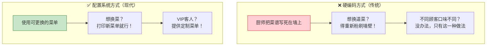
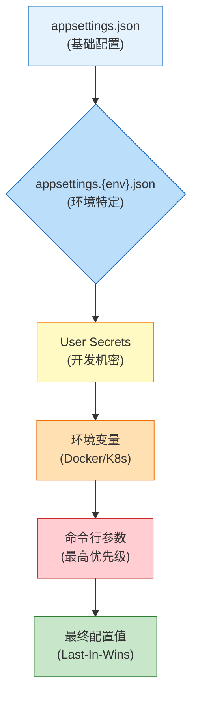
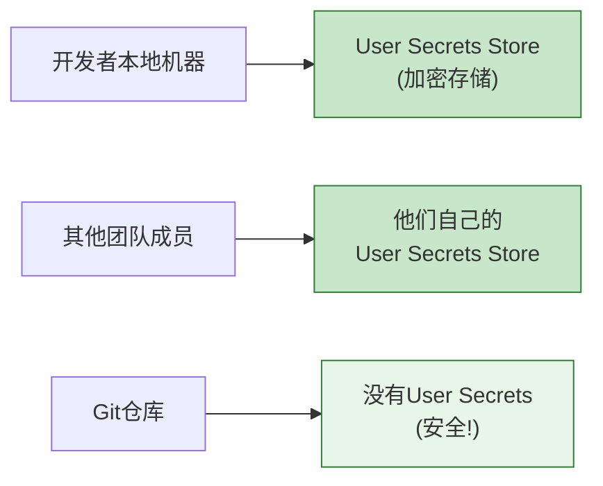

# 配置系统 (Configuration System) - 让应用灵活可配置的魔法

> **学习目标**：掌握ASP.NET Core配置系统的层次结构、Options模式、多环境配置、敏感信息保护等核心技能
>
> **预计时间**：45分钟 | **难度等级**：⭐⭐⭐ 中级
>
> **前置知识**：JSON基础、依赖注入概念、C#面向对象编程

---

## 一、为什么需要配置系统？

### 1.1 生活化类比：餐厅菜单 vs 硬编码菜谱

想象两家餐厅的运营方式：



**硬编码的问题**：
- ❌ 修改配置需要重新编译、重新部署整个应用
- ❌ 不同环境（开发/测试/生产）需要维护多套代码
- ❌ 敏感信息（密码、密钥）直接写在代码里，存在安全风险

**配置系统的优势**：
- ✅ **灵活性**：修改配置不需要重新编译部署
- ✅ **多环境支持**：同一套代码适配多个环境
- ✅ **安全性**：敏感信息可以单独管理，不进入代码仓库
- ✅ **运维友好**：运维人员可以通过环境变量调整参数

### 1.2 真实场景需求

| 场景 | 硬编码 | 配置系统 |
|------|--------|---------|
| 数据库连接字符串 | 写死在代码里，换服务器要改代码重编译 | 配置在不同环境的配置文件中，一键切换 |
| 第三方API密钥 | 提交到Git仓库，所有人可见 | 使用User Secrets或Key Vault保护 |
| 日志级别 | 想调试时改代码开启Debug日志 | 通过配置动态调整，甚至运行时修改 |
| 功能开关 | 需要发布新版本才能启用新功能 | 通过配置控制功能的开启/关闭 |

---

## 二、Configuration Providers 层次体系

### 2.1 优先级金字塔

ASP.NET Core的配置系统采用**多层次覆盖机制**：

```
         ┌─────────────────────┐
         │  命令行参数 (最高)   │ ← 最高优先级，覆盖所有下层配置
         ├─────────────────────┤
         │     环境变量          │ ← Docker/K8s常用
         ├─────────────────────┤
         │   User Secrets      │ ← 仅开发环境，本地机器专用
         ├─────────────────────┤
         │ appsettings.{Env}.json│ ← 环境特定配置（Development/Production）
         ├─────────────────────┤
         │   appsettings.json   │ ← 基础配置（所有环境共享，最低优先级）
         └─────────────────────┘
```

### 2.2 Mermaid图展示覆盖流程



**核心原则：Last-In-Wins（后注册的覆盖先注册的）**

### 2.3 实际演示：同一个Key如何被覆盖

假设我们有一个配置项 `ConnectionStrings:DefaultConnection`：

| 来源 | 值 | 优先级 |
|------|-----|--------|
| appsettings.json | `Server=(localdb)\\mssqllocaldb;Database=MyApp;` | ⭐ 最低 |
| appsettings.Development.json | `Server=localhost;Database=DevDb;` | ⭐⭐ |
| User Secrets (开发环境) | `Server=localhost;Database=SecretDb;Password=123456;` | ⭐⭐⭐ |
| 环境变量 (Docker) | `Server=prod-sql;Database=ProdDb;Trusted_Connection=True;` | ⭐⭐⭐⭐ |
| 命令行参数 | `--ConnectionStrings:DefaultConnection="Server=custom-db;"` | ⭐⭐⭐⭐⭐ 最高 |

**最终结果**：应用会使用命令行参数中的值！

---

## 三、基本用法

### 3.1 IConfiguration 接口

`IConfiguration` 是访问所有配置的统一入口点：

```csharp
var builder = WebApplication.CreateBuilder(args);
var configuration = builder.Configuration;
```

### 3.2 读取单个值

```csharp
// 读取连接字符串
string connectionString = configuration.GetConnectionString("DefaultConnection");

// 读取简单值（带默认值）
int maxRetries = configuration.GetValue<int>("RetrySettings:MaxRetries", 3); // 默认3次
bool enableCache = configuration.GetValue<bool>("Caching:Enabled", true);   // 默认true
double timeoutSeconds = configuration.GetValue<double>("Api:Timeout", 30.0);

// 读取数组
var allowedHosts = configuration.GetSection("AllowedHosts").Get<string[]>();
```

### 3.3 读取Section和Bind到对象

```csharp
// 获取整个Section
var redisConfig = configuration.GetSection("Redis");
string host = redisConfig["Host"];                              // 直接通过key访问
int port = redisConfig.GetValue<int>("Port", 6379);             // 带默认值
bool useSsl = redisConfig.GetValue<bool>("UseSsl");              // bool类型

// Bind到POCO对象（强烈推荐！）
var emailSettings = new EmailSettings();
configuration.GetSection("Email").Bind(emailSettings);

// 或者更简洁的方式（推荐）
var dbSettings = configuration.GetSection("Database").Get<DatabaseSettings>();
```

### 3.4 POCO配置类定义

```csharp
/// <summary>
/// 邮件服务配置
/// </summary>
public class EmailSettings
{
    public string SmtpServer { get; set; } = "smtp.example.com";
    public int Port { get; set; } = 587;
    public string Username { get; set; } = "";
    public string Password { get; set; } = "";
    public bool UseSsl { get; set; } = true;
    public string FromAddress { get; set; } = "noreply@example.com";
    public string FromName { get; set; } = "My Application";
}

/// <summary>
/// Redis缓存配置
/// </summary>
public class RedisSettings
{
    public string Host { get; set; } = "localhost";
    public int Port { get; set; } = 6379;
    public int Database { get; set; } = 0;
    public string Password { get; set; } = "";
    public bool UseSsl { get; set; } = false;
    public TimeSpan? ConnectTimeout { get; set; }
}

// appsettings.json 对应的结构
/*
{
  "Email": {
    "SmtpServer": "smtp.gmail.com",
    "Port": 587,
    "Username": "myapp@gmail.com",
    "Password": "app-specific-password",
    "UseSsl": true,
    "FromAddress": "myapp@gmail.com",
    "FromName": "My Awesome App"
  },
  "Redis": {
    "Host": "redis.example.com",
    "Port": 6379,
    "Database": 0,
    "Password": "",
    "UseSsl": true,
    "ConnectTimeout": "00:00:05"
  }
}
*/
```

---

## 四、Options Pattern（选项模式 ⭐⭐⭐ 强烈推荐）

### 4.1 为什么不直接用IConfiguration？

| 方式 | 问题 |
|------|------|
| 直接注入 `IConfiguration` 到Singleton中 | 违反开放封闭原则，难以测试 |
| 在Controller中到处读配置 | 配置散落在各处，无法集中管理 |
| 字符串key容易出错 | 编译时不检查，运行时才发现拼写错误 |

**解决方案：Options Pattern（选项模式）**

### 4.2 三种接口对比

| 接口 | 何时计算值 | 变更时是否更新 | 适用场景 | 生命周期建议 |
|------|-----------|--------------|---------|------------|
| **IOptions\<T\>** | 应用启动时计算一次 | ❌ 不更新（不可变） | 不变的配置（数据库类型、应用名称） | Singleton |
| **IOptionsMonitor\<T\>** | 启动时 + 支持热更新通知 | ✅ 自动更新（可监听变更事件） | 需要实时响应配置变化的场景 | Singleton |
| **IOptionsSnapshot\<T\>** | 每个请求重新计算 | ✅ 可能不同（每次请求快照） | 每请求可能不同的配置（如租户配置） | Scoped |

### 4.3 完整示例：JWT配置的Options模式实现

#### 步骤1：定义强类型配置类

```csharp
using System.ComponentModel.DataAnnotations;

/// <summary>
/// JWT认证配置
/// </summary>
public class JwtSettings
{
    /// <summary>
    /// 配置节名称（用于从appsettings.json中定位）
    /// </summary>
    public const string SectionName = "Jwt";

    [Required(ErrorMessage = "JWT SecretKey is required")]
    [MinLength(32, ErrorMessage = "JWT SecretKey must be at least 32 characters for security")]
    public string SecretKey { get; set; } = "";

    [Range(1, int.MaxValue, ErrorMessage = "Expiration must be a positive number")]
    public int ExpirationMinutes { get; set; } = 60;

    [Required]
    public string Issuer { get; set; } = "MyApp";

    [Required]
    public string Audience { get; set; } = "MyAppUsers";

    // 可选配置项
    public bool ValidateIssuerSigningKey { get; set; } = true;
    public bool ValidateIssuer { get; set; } = true;
    public bool ValidateAudience { get; set; } = true;
    public int ClockSkewSeconds { get; set; } = 5;
}
```

#### 步骤2：appsettings.json 配置

```json
{
  "Jwt": {
    "SecretKey": "Your-Super-Secret-Key-Minimum-32-Chars-Long!",
    "ExpirationMinutes": 60,
    "Issuer": "MyApp",
    "Audience": "MyAppUsers",
    "ValidateIssuerSigningKey": true,
    "ValidateIssuer": true,
    "ValidateAudience": true,
    "ClockSkewSeconds": 5
  }
}
```

#### 步骤3：Program.cs 注册和验证

```csharp
var builder = WebApplication.CreateBuilder(args);

// ==========================================
// 1. 注册Options并绑定到配置节
// ==========================================
builder.Services.Configure<JwtSettings>(
    builder.Configuration.GetSection(JwtSettings.SectionName));

// ==========================================
// 2. 启动时验证配置（不要等到第一次使用时才报错！）
// ==========================================
builder.Services.PostConfigure<JwtSettings>(jwtSettings =>
{
    if (string.IsNullOrWhiteSpace(jwtSettings.SecretKey))
        throw new InvalidOperationException(
            "JWT SecretKey is not configured. Please add it to appsettings.json or environment variables.");
    
    if (jwtSettings.SecretKey.Length < 32)
        throw new InvalidOperationException(
            $"JWT SecretKey must be at least 32 characters long for security. Current length: {jwtSettings.SecretKey.Length}");
    
    if (jwtSettings.ExpirationMinutes <= 0)
        throw new InvalidOperationException(
            "JWT ExpirationMinutes must be greater than 0.");

    Console.WriteLine($"✓ JWT Settings validated successfully. Token will expire in {jwtSettings.ExpirationMinutes} minutes.");
});
```

#### 步骤4：在Controller中使用

```csharp
[ApiController]
[Route("api/[controller]")]
public class AuthController : ControllerBase
{
    private readonly JwtSettings _jwtSettings;

    // 注意：IOptions<T> 可以注入到任何生命周期的组件中
    public AuthController(IOptions<JwtSettings> jwtOptions)
    {
        _jwtSettings = jwtOptions.Value; // 获取实际的配置对象
    }

    /// <summary>
    /// 生成JWT Token
    /// </summary>
    [HttpPost("token")]
    [ProducesResponseType(typeof(TokenResponse), StatusCodes.Status200OK)]
    public IActionResult GenerateToken([FromBody] LoginRequest request)
    {
        // 验证用户凭据（省略...）
        
        var tokenHandler = new JwtSecurityTokenHandler();
        var key = Encoding.ASCII.GetBytes(_jwtSettings.SecretKey);
        
        var tokenDescriptor = new SecurityTokenDescriptor
        {
            Subject = new ClaimsIdentity(new[]
            {
                new Claim(ClaimTypes.Name, request.Username),
                new Claim(ClaimTypes.NameIdentifier, Guid.NewGuid().ToString()),
                new Claim(JwtRegisteredClaimNames.Jti, Guid.NewGuid().ToString())
            }),
            Expires = DateTime.UtcNow.AddMinutes(_jwtSettings.ExpirationMinutes),
            SigningCredentials = new SigningCredentials(
                new SymmetricSecurityKey(key),
                SecurityAlgorithms.HmacSha256Signature),
            Issuer = _jwtSettings.Issuer,
            Audience = _jwtSettings.Audience
        };

        var token = tokenHandler.CreateToken(tokenDescriptor);
        var tokenString = tokenHandler.WriteToken(token);

        return Ok(new TokenResponse
        {
            AccessToken = tokenString,
            TokenType = "Bearer",
            ExpiresIn = _jwtSettings.ExpirationMinutes * 60, // 秒
            IssuedAt = DateTime.UtcNow
        });
    }
}

// DTO定义
public record LoginRequest(string Username, string Password);
public record TokenResponse(string AccessToken, string TokenType, int ExpiresIn, DateTime IssuedAt);
```

### 4.4 IOptionsMonitor 和 IOptionsSnapshot 的使用场景

```csharp
// IOptionsMonitor<T>: 监听配置变化（适用于需要热更新的场景）
public class ConfigMonitorService : IHostedService
{
    private readonly IOptionsMonitor<JwtSettings> _jwtOptionsMonitor;
    private readonly ILogger<ConfigMonitorService> _logger;
    private IDisposable? _changeListener;

    public ConfigMonitorService(IOptionsMonitor<JwtSettings> jwtOptionsMonitor, ILogger<ConfigMonitorService> logger)
    {
        _jwtOptionsMonitor = jwtOptionsMonitor;
        _logger = logger;
    }

    public Task StartAsync(CancellationToken cancellationToken)
    {
        // 监听配置变化
        _changeListener = _jwtOptionsMonitor.OnChange(jwtSettings =>
        {
            _logger.LogWarning("⚠️ JWT配置已热更新！新的过期时间: {ExpirationMinutes} 分钟",
                jwtSettings.ExpirationMinutes);
            
            // 可以在这里执行一些配置变化后的逻辑
            // 例如：刷新缓存的Token验证参数
        });

        return Task.CompletedTask;
    }

    public Task StopAsync(CancellationToken cancellationToken)
    {
        _changeListener?.Dispose();
        return Task.CompletedTask;
    }
}

// IOptionsSnapshot<T>: 每请求获取最新配置（适用于Scoped场景）
[ApiController]
[Route("api/[controller]")]
public class TenantController : ControllerBase
{
    // IOptionsSnapshot是Scoped的，每个请求都会获取最新的配置
    private readonly IOptionsSnapshot<TenantSettings> _tenantOptionsSnapshot;

    public TenantController(IOptionsSnapshot<TenantSettings> tenantOptionsSnapshot)
    {
        _tenantOptionsSnapshot = tenantOptionsSnapshot;
    }

    [HttpGet("config")]
    public IActionResult GetTenantConfig()
    {
        // 这个值可能是当前请求时刻的最新值
        return Ok(_tenantOptionsSnapshot.Value);
    }
}
```

---

## 五、数据注解验证

### 5.1 使用Data Annotations自动验证

```csharp
// 定义带有验证特性的配置类
public class DatabaseSettings
{
    [Required(ErrorMessage = "ConnectionString is required")]
    public string ConnectionString { get; set; } = "";

    [Range(1, 100, ErrorMessage = "MaxRetryCount must be between 1 and 100")]
    public int MaxRetryCount { get; set; } = 3;

    [Range(1000, 300000, ErrorMessage = "CommandTimeout must be between 1 second and 5 minutes")]
    public int CommandTimeoutMs { get; set; } = 30000;

    [Url(ErrorMessage = "Invalid URL format")]
    public string HealthCheckUrl { get; set; } = "";

    [RegularExpression(@"^[a-zA-Z][a-zA-Z0-9_]*$", 
        ErrorMessage = "TableNamePrefix must start with a letter and contain only alphanumeric characters and underscores")]
    public string TableNamePrefix { get; set; } = "App_";
}

// Program.cs 注册和验证
builder.Services.AddOptions<DatabaseSettings>()
    .Bind(builder.Configuration.GetSection("Database"))
    .ValidateDataAnnotations()                    // ✅ 自动验证Data Annotation特性
    .ValidateOnStart();                           // ✅ 应用启动时就验证，不要等到第一次使用时才报错
```

### 5.2 自定义验证逻辑

```csharp
public class ApiSettings
{
    public List<string> AllowedOrigins { get; set; } = new();
    public int RateLimitPerMinute { get; set; } = 100;
    public int MaxRequestBodySizeKB { get; set; } = 1024; // 1MB
}

// 自定义复杂验证规则
builder.Services.AddOptions<ApiSettings>()
    .Bind(builder.Configuration.GetSection("Api"))
    .Validate(apiSettings =>
    {
        var errors = new List<string>();

        // 验证允许的来源URL格式
        foreach (var origin in apiSettings.AllowedOrigins)
        {
            if (!Uri.TryCreate(origin, UriKind.Absolute, out var uriResult))
                errors.Add($"Invalid origin URL format: {origin}");
            else if (uriResult.Scheme != Uri.UriSchemeHttp && uriResult.Scheme != Uri.UriSchemeHttps)
                errors.Add($"Origin must use HTTP or HTTPS protocol: {origin}");
        }

        // 验证限流设置合理性
        if (apiSettings.RateLimitPerMinute <= 0)
            errors.Add("RateLimitPerMinute must be greater than 0");
        
        if (apiSettings.RateLimitPerMinute > 10000)
            errors.Add("RateLimitPerMinute seems too high (>10000). Please verify this is intentional.");

        // 验证请求体大小限制
        if (apiSettings.MaxRequestBodySizeKB > 10240) // 10MB
            errors.Add("MaxRequestBodySizeKB exceeds maximum allowed value of 10240 KB (10MB)");

        return errors.Count == 0 
            ? ValidationResult.Success! 
            : new ValidationResult($"Validation failed:\n{string.Join("\n", errors)}");
    })
    .ValidateOnStart();
```

---

## 六、多环境最佳实践

### 6.1 推荐的项目配置文件结构

```
项目根目录/
├── appsettings.json                  # 📄 基础配置（所有环境共享）
├── appsettings.Development.json       # 🔧 开发环境（localhost, 详细日志, 显示错误详情）
├── appsettings.Staging.json           # 🧪 预发布环境（staging服务器地址, 中等日志级别）
└── appsettings.Production.json        # 🚀 生产环境（生产服务器地址, 最小日志级别, 安全加固）

# Git忽略策略
.gitignore:
  # 敏感信息不入库
  appsettings.*.json
  !appsettings.json
  !appsettings.Development.json  # 开发环境可以包含非敏感的默认值
  
  # 或者在CI/CD中使用模板 + 环境变量替换
```

### 6.2 各环境的典型配置示例

#### Development（开发环境）

```json
{
  "Logging": {
    "LogLevel": {
      "Default": "Debug",
      "Microsoft": "Information",
      "Microsoft.Hosting.Lifetime": "Information",
      "Microsoft.EntityFrameworkCore.Database.Command": "Information" // 显示SQL语句
    }
  },
  "ConnectionStrings": {
    "DefaultConnection": "Server=(localdb)\\mssqllocaldb;Database=DevDb;Trusted_Connection=True;TrustServerCertificate=True;"
  },
  "DetailedErrors": true,
  "AllowedHosts": "*",
  "Cors": {
    "AllowedOrigins": ["http://localhost:3000", "http://localhost:5000"],
    "AllowAnyMethod": true,
    "AllowAnyHeader": true
  },
  "FeatureFlags": {
    "EnableNewDashboard": true,
    "EnableBetaFeatures": true
  }
}
```

#### Production（生产环境）

```json
{
  "Logging": {
    "LogLevel": {
      "Default": "Warning",
      "Microsoft": "Warning",
      "Microsoft.Hosting.Lifetime": "Warning",
      "System": "Warning"
    }
  },
  "ConnectionStrings": {
    "DefaultConnection": "Server=prod-sql-cluster.example.com,1433;Database=ProdDb;User Id=app_user;Password=${DB_PASSWORD};TrustServerCertificate=False;Encrypt=True;"
  },
  "DetailedErrors": false,
  "AllowedHosts": "api.example.com;*.example.com",
  "Cors": {
    "AllowedOrigins": ["https://www.example.com", "https://admin.example.com"],
    "AllowAnyMethod": false,
    "AllowAnyHeader": false,
    "AllowedHeaders": ["Content-Type", "Authorization"]
  },
  "FeatureFlags": {
    "EnableNewDashboard": false,
    "EnableBetaFeatures": false
  },
  "Security": {
    "HstsEnabled": true,
    "HstsMaxAgeDays": 365,
    "HttpsPort": 443
  }
}
```

### 6.3 Docker/Kubernetes中的环境变量覆盖

```yaml
# docker-compose.yml 示例
version: '3.8'
services:
  webapi:
    image: myapp:latest
    environment:
      - ASPNETCORE_ENVIRONMENT=Production
      # 覆盖连接字符串（优先级高于appsettings.Production.json）
      - ConnectionStrings__DefaultConnection=Server=postgres-db;Database=ProdDb;User Id=admin;Password=securepassword;
      # 覆盖Redis配置
      - Redis__Host=redis-cache
      - Redis__Port=6379
      # JWT密钥（绝对不能写在配置文件里！）
      - Jwt__SecretKey=${JWT_SECRET_KEY}
      - Jwt__ExpirationMinutes=120
    ports:
      - "8080:80"
    depends_on:
      - postgres-db
      - redis-cache
```

**注意**：环境变量中的层级分隔符使用双下划线 `__`（不是冒号）

---

## 七、User Secrets（用户机密）

### 7.1 什么是User Secrets？

User Secrets是一种**仅限开发环境**使用的安全存储机制：



**核心特点**：
- ✅ 只存储在**开发者本地机器**上
- ✅ **不会提交到Git仓库**
- ✅ 每个开发者有自己的独立存储
- ✅ 仅在Development环境自动加载
- ⚠️ 不能用于Production或Staging环境

### 7.2 使用方法

```bash
# ==========================================
# 初始化User Secrets存储
# ==========================================
dotnet user-secrets init

# 输出：已将 UserSecretsId 设置为 'your-project-guid-here'

# ==========================================
# 设置机密（支持嵌套键）
# ==========================================
dotnet user-secrets set "Jwt:SecretKey" "dev-secret-key-for-local-development-only-must-be-32-chars!"
dotnet user-secrets set "Jwt:Issuer" "LocalDev"
dotnet user-secrets set "ConnectionStrings:DefaultConnection" "Server=(localdb)\\mssqllocaldb;Database=DevDb;"
dotnet user-secrets set "ExternalApi:ApiKey" "sk-test-your-api-key-here"

# ==========================================
# 列出所有机密
# ==========================================
dotnet user-secrets list

# 输出：
# Jwt:SecretKey = dev-secret-key-for-local-development...
# Jwt:Issuer = LocalDev
# ConnectionStrings:DefaultConnection = Server=(localdb)...
# ExternalApi:ApiKey = sk-test-your-api-key...

# ==========================================
# 删除单个机密
# ==========================================
dotnet user-secrets remove "ExternalApi:ApiKey"

# ==========================================
# 清除所有机密
# ==========================================
dotnet user-secrets clear
```

### 7.3 在代码中访问User Secrets

```csharp
var builder = WebApplication.CreateBuilder(args);

// ✅ 推荐方式：框架自动处理
// 当 ASPNETCORE_ENVIRONMENT = Development 时，
// WebApplicationCreateBuilder 会自动调用 AddUserSecrets<Program>()
// 所以通常你不需要手动添加这行代码！

// 但如果你需要显式控制（例如某些特殊场景），可以这样：
if (builder.Environment.IsDevelopment())
{
    // 手动添加User Secrets Provider
    builder.Configuration.AddUserSecrets<Program>(optional: true, reloadOnChange: true);
    
    Console.WriteLine("🔐 User Secrets 已加载（仅开发环境）");
}

// 使用方式和普通配置完全一样
var jwtSecret = builder.Configuration["Jwt:SecretKey"];
var apiKey = builder.Configuration["ExternalApi:ApiKey"];
```

### 7.4 重要提醒

```markdown
## ⚠️ User Secrets 安全注意事项

### ✅ 应该做的
- [x] 用于存储开发环境的API密钥、连接字符串密码
- [x] 每个开发者维护自己的User Secrets
- [x] 将敏感信息从appsettings.Development.json移到User Secrets
- [x] 在项目文档中说明需要哪些User Secrets及其用途

### ❌ 绝对禁止的
- [ ] ❌ 认为User Secrets可以用于Production环境（它不会部署到服务器！）
- [ ] ❌ 将真实的Production密钥存入User Secrets（容易误提交或泄露）
- [ ] ❌ 忽略User Secrets的存在，导致团队其他成员不知道需要配置
- [ ] ❌ 将User Secrets的内容复制粘贴到聊天工具或文档中

### 🔒 生产环境的替代方案
对于生产环境，应该使用：
- **Azure Key Vault**（Azure云原生应用）
- **AWS Secrets Manager / Parameter Store**（AWS云原生应用）
- **HashiCorp Vault**（多云/自托管方案）
- **Kubernetes Secrets**（K8s环境）
- **环境变量**（最简单的方案，配合CI/CD注入）
```

---

## 八、常见陷阱与最佳实践

### 8.1 ✅ DO（推荐做法）

```markdown
## 最佳实践清单

### 设计原则
- [x] **使用Options Pattern**：始终使用 IOptions<T> 而不是直接读取 IConfiguration
- [x] **强类型配置类**：定义POCO类来承载配置，享受编译时检查和IntelliSense
- [x] **配置项分组**：使用Section组织相关配置（如 Database:, Jwt:, Cors:）
- [x] **启动时验证**：使用 ValidateOnStart() 确保配置正确后再启动应用
- [x] **合理默认值**：为可选配置提供合理的默认值
- [x] **文档化配置**：在配置类的XML注释中说明每个配置项的作用和推荐值

### 安全性
- [x] **敏感信息隔离**：密码、密钥、证书使用User Secrets或Key Vault
- [x] **最小权限原则**：配置文件权限设置为仅应用账户可读
- [x] **定期轮换密钥**：建立密钥轮换机制
- [x] **Git忽略策略**：确保敏感配置不会被提交到版本控制

### 性能优化
- [x] **避免频繁读取**：在启动时读取一次并缓存，不要在循环中反复读配置
- [x] **使用IOptions<T>**：框架已经帮我们优化了配置读取性能
- [x] **按需加载**：大型配置可以使用 IOptionsSnapshot<T> 按请求加载
```

### 8.2 ❌ DON'T（禁止做法）

```markdown
## 反模式清单

### 架构设计问题
- [ ] ❌ **在Singleton中直接注入IConfiguration**：
  ```csharp
  // ❌ 错误：应该在Singleton中使用IOptions<T>
  public class MySingletonService
  {
      private readonly IConfiguration _config; // 不要这样做！
      
      public MySingletonService(IConfiguration config) { _config = config; }
  }
  
  // ✅ 正确：使用强类型的Options
  public class MySingletonService
  {
      private readonly MySettings _settings;
      
      public MySingletonService(IOptions<MySettings> options) 
      { 
          _settings = options.Value; 
      }
  }
  ```

- [ ] ❌ **将连接字符串等敏感信息提交到代码仓库**：
  ```json
  // ❌ 绝对禁止！即使是在私有仓库也不行
  {
    "ConnectionStrings": {
      "DefaultConnection": "Server=db;Database=mydb;User Id=admin;Password=P@ssw0rd123;"
    }
  }
  ```

- [ ] ❌ **在循环或热路径中频繁读取配置值**：
  ```csharp
  // ❌ 错误：每次请求都读配置，性能浪费
  public async Task<IActionResult> GetData()
  {
      var timeout = _configuration.GetValue<int>("Api:Timeout");
      // ... 使用timeout ...
  }
  
  // ✅ 正确：构造函数中一次性读取
  public class MyService
  {
      private readonly int _timeout;
      
      public MyService(IOptions<ApiSettings> options)
      {
          _timeout = options.Value.Timeout;
      }
  }
  ```

- [ ] ❌ **忽略配置验证**：
  ```csharp
  // ❌ 危险：直到第一次使用时才会发现配置错误
  builder.Services.Configure<MySettings>(config.GetSection("My"));
  
  // ✅ 推荐：应用启动时就验证
  builder.Services.AddOptions<MySettings>()
      .Bind(config.GetSection("My"))
      .ValidateDataAnnotations()
      .ValidateOnStart(); // 这一行很关键！
  ```

- [ ] ❌ **在配置中使用硬编码的魔法数字**：
  ```csharp
  // ❌ 难以理解和维护
  var retryCount = _configuration.GetValue<int>("RetryCount", 3); // 为什么是3？
  
  // ✅ 更好：使用有意义的常量或枚举
  public class RetryPolicySettings
  {
      [Description("最大重试次数，建议3-5次以保证可靠性")]
      public int MaxRetryCount { get; set; } = 3;
      
      [Description("重试间隔基数（毫秒），使用指数退避算法")]
      public int BaseDelayMs { get; set; } = 1000;
  }
  ```

### 团队协作问题
- [ ] ❌ **不记录配置项的用途**：新成员不知道某个配置是做什么的
- [ ] ❌ **随意添加配置而不清理**：配置文件越来越臃肿
- [ ] ❌ **不同环境配置差异过大**：导致开发环境和生产环境行为不一致
```

---

## 九、完整的实战示例

### 9.1 多层appsettings.json设计

```json
// ==========================================
// appsettings.json（基础配置 - 所有环境共享）
// ==========================================
{
  "Application": {
    "Name": "E-Commerce API",
    "Version": "2.0.0",
    "Environment": "${ASPNETCORE_ENVIRONMENT}"
  },
  "Logging": {
    "LogLevel": {
      "Default": "Information",
      "Microsoft": "Warning",
      "Microsoft.Hosting.Lifetime": "Information"
    },
    "Console": {
      "FormatterName": "simple",
      "IncludeScopes": true
    }
  },
  "AllowedHosts": "*",
  "FeatureFlags": {
    "EnableNewSearch": false,
    "EnableRecommendations": false,
    "EnableDarkMode": false
  }
}

// ==========================================
// appsettings.Development.json（开发环境）
// ==========================================
{
  "Logging": {
    "LogLevel": {
      "Default": "Debug",
      "Microsoft.EntityFrameworkCore": "Information",
      "Microsoft.AspNetCore.Routing": "Debug"
    }
  },
  "DetailedErrors": true,
  "FeatureFlags": {
    "EnableNewSearch": true,
    "EnableRecommendations": true,
    "EnableDarkMode": true
  },
  "Cors": {
    "AllowedOrigins": ["http://localhost:3000", "http://localhost:5173"]
  }
}

// ==========================================
// appsettings.Production.json（生产环境）
// ==========================================
{
  "Logging": {
    "LogLevel": {
      "Default": "Warning",
      "Microsoft.AspNetCore": "Warning",
      "System": "Error"
    }
  },
  "DetailedErrors": false,
  "AllowedHosts": "api.myecommerce.com;admin.myecommerce.com",
  "FeatureFlags": {
    "EnableNewSearch": true,
    "EnableRecommendations": false,
    "EnableDarkMode": true
  },
  "Security": {
    "HstsEnabled": true,
    "HstsMaxAgeDays": 365,
    "HstsSubdomains": true,
    "HstsPreload": true
  }
}
```

### 9.2 强类型配置类定义（带完整验证）

```csharp
using System.ComponentModel.DataAnnotations;

namespace MyApp.Configuration;

/// <summary>
/// 应用程序全局配置
/// </summary>
public class AppSettings
{
    [Required]
    [StringLength(100, MinimumLength = 1)]
    public string Name { get; set; } = "";

    [Required]
    [RegularExpression(@"^\d+\.\d+\.\d+$", ErrorMessage = "Version must be in semver format (major.minor.patch)")]
    public string Version { get; set; } = "1.0.0";
}

/// <summary>
/// 数据库配置
/// </summary>
public class DatabaseSettings
{
    [Required(ErrorMessage = "Database connection string is required")]
    public string ConnectionString { get; set; } = "";

    [Range(1, 300)]
    public int CommandTimeoutSeconds { get; set; } = 30;

    [Range(0, 100)]
    public int MaxRetryCount { get; set; } = 3;

    public bool EnableSensitiveDataLogging { get; set; } = false;

    [Range(0, int.MaxValue)]
    public int MaxPoolSize { get; set; } = 100;

    public bool EnableRetryOnFailure { get; set; } = true;
}

/// <summary>
/// Redis缓存配置
/// </summary>
public class RedisCacheSettings
{
    [Required]
    public string Host { get; set; } = "localhost";

    [Range(1, 65535)]
    public int Port { get; set; } = 6379;

    [Range(0, 15)]
    public int Database { get; set; } = 0;

    public string? Password { get; set; }

    public bool UseSsl { get; set; } = false;

    [Range(1000, 60000)]
    public int ConnectTimeoutMs { get; set; } = 5000;

    [Range(1000, 300000)]
    public int SyncTimeoutMs { get; set; } = 10000;
}

/// <summary>
/// JWT认证配置
/// </summary>
public class JwtAuthSettings
{
    [Required]
    [MinLength(32, ErrorMessage = "Secret key must be at least 32 characters for security")]
    public string SecretKey { get; set; } = "";

    [Range(5, 1440)] // 5分钟到24小时
    public int ExpirationMinutes { get; set; } = 60;

    [Required]
    public string Issuer { get; set; } = "";

    [Required]
    public string Audience { get; set; } = "";
}

/// <summary>
/// CORS跨域配置
/// </summary>
public class CorsSettings
{
    [Required]
    [MinLength(1, ErrorMessage = "At least one allowed origin is required")]
    public List<string> AllowedOrigins { get; set; } = new();

    public bool AllowAnyMethod { get; set; } = false;

    public bool AllowAnyHeader { get; set; } = false;

    public List<string>? AllowedHeaders { get; set; }

    public bool AllowCredentials { get; set; } = true;

    [Range(0, 86400)] // 最大预检缓存24小时
    public int PreflightMaxAgeSeconds { get; set; } = 3600;
}

/// <summary>
/// 功能开关配置
/// </summary>
public class FeatureFlagSettings
{
    public bool EnableNewSearch { get; set; } = false;
    public bool EnableRecommendations { get; set; } = false;
    public bool EnableDarkMode { get; set; } = false;
    public bool EnableBetaFeatures { get; set; } = false;
}
```

### 9.3 Options Pattern完整注册和使用

```csharp
// Program.cs
using Microsoft.Extensions.Options;
using MyApp.Configuration;

var builder = WebApplication.CreateBuilder(args);

// ==========================================
// 1. 注册所有配置Options（带验证）
// ==========================================

// 应用基础配置
builder.Services.Configure<AppSettings>(
    builder.Configuration.GetSection("Application"));

// 数据库配置（关键业务配置，必须验证）
builder.Services.AddOptions<DatabaseSettings>()
    .Bind(builder.Configuration.GetSection("Database"))
    .ValidateDataAnnotations()
    .Validate(db =>
    {
        // 自定义验证：如果启用了敏感数据日志，必须是开发环境
        if (db.EnableSensitiveDataLogging && 
            !builder.Environment.IsDevelopment())
        {
            return new ValidationResult(
                "Sensitive data logging should only be enabled in Development environment!");
        }
        return ValidationResult.Success!;
    })
    .ValidateOnStart();

// Redis配置
builder.Services.AddOptions<RedisCacheSettings>()
    .Bind(builder.Configuration.GetSection("Redis"))
    .ValidateDataAnnotations()
    .ValidateOnStart();

// JWT配置（安全关键）
builder.Services.AddOptions<JwtAuthSettings>()
    .Bind(builder.Configuration.GetSection("Jwt"))
    .ValidateDataAnnotations()
    .Validate(jwt =>
    {
        // 额外的安全检查
        if (jwt.SecretKey.Contains(" ") || jwt.SecretKey.Contains("\t"))
        {
            return new ValidationResult("Secret key cannot contain whitespace characters!");
        }
        return ValidationResult.Success!;
    })
    .ValidateOnStart();

// CORS配置
builder.Services.AddOptions<CorsSettings>()
    .Bind(builder.Configuration.GetSection("Cors"))
    .ValidateDataAnnotations()
    .ValidateOnStart();

// 功能开关
builder.Services.Configure<FeatureFlagSettings>(
    builder.Configuration.GetSection("FeatureFlags"));

// ==========================================
// 2. 根据配置初始化服务
// ==========================================

var corsSettings = builder.Configuration.GetSection("Cors").Get<CorsSettings>();
if (corsSettings?.AllowedOrigins != null)
{
    builder.Services.AddCors(options =>
    {
        options.AddPolicy("CorsPolicy", policy =>
        {
            policy.WithOrigins(corsSettings.AllowedOrigins.ToArray());
            
            if (corsSettings.AllowAnyMethod)
                policy.AllowAnyMethod();
                
            if (corsSettings.AllowAnyHeader)
                policy.AllowAnyHeader();
            else if (corsSettings.AllowedHeaders?.Count > 0)
                policy.WithHeaders(corsSettings.AllowedHeaders.ToArray());
                
            if (corsSettings.AllowCredentials)
                policy.AllowCredentials();
                
            policy.SetPreflightMaxAge(TimeSpan.FromSeconds(corsSettings.PreflightMaxAgeSeconds));
        });
    });
}

// ==========================================
// 3. 在服务中使用Options
// ==========================================

// 示例：Redis缓存服务使用IOptions
public class RedisCacheService : ICacheService
{
    private readonly RedisCacheSettings _settings;
    private readonly IDatabase _database;

    public RedisCacheService(IOptions<RedisCacheSettings> options)
    {
        _settings = options.Value;
        
        var config = ConfigurationOptions.Parse($"{_settings.Host}:{_settings.Port}");
        config.Password = _settings.Password;
        config.DefaultDatabase = _settings.Database;
        config.Ssl = _settings.UseSsl;
        config.ConnectTimeout = _settings.ConnectTimeoutMs;
        config.SyncTimeout = _settings.SyncTimeoutMs;
        
        var multiplexer = ConnectionMultiplexer.Connect(config);
        _database = multiplexer.GetDatabase();
    }

    // ... 实现ICacheService接口方法 ...
}

// 示例：功能开关服务使用IOptionsSnapshot（每请求可能不同）
public class FeatureService
{
    private readonly FeatureFlagSettings _flags;

    // 使用IOptionsSnapshot可以在运行时切换功能开关
    public FeatureService(IOptionsSnapshot<FeatureFlagSettings> options)
    {
        _flags = options.Value;
    }

    public bool IsFeatureEnabled(Feature feature) => feature switch
    {
        Feature.NewSearch => _flags.EnableNewSearch,
        Feature.Recommendations => _flags.EnableRecommendations,
        Feature.DarkMode => _flags.EnableDarkMode,
        Feature.Beta => _flags.EnableBetaFeatures,
        _ => false
    };
}

public enum Feature
{
    NewSearch,
    Recommendations,
    DarkMode,
    Beta
}
```

---

## 十、练习题与参考答案

### 练习 1：配置优先级判断题

**题目**：同一个配置项 `Api:BaseUrl` 在以下位置都有定义，最终应用的值是什么？

| 来源 | 值 |
|------|-----|
| appsettings.json | `"https://default.api.com"` |
| appsettings.Production.json | `"https://prod.api.com"` |
| 环境变量 `Api__BaseUrl` | `"https://env-var.api.com"` |
| 命令行参数 `--Api:BaseUrl` | `"https://cmdline.api.com"` |

当前环境为 Production。

**答案**：
- **最终值**：`"https://cmdline.api.com"`
- **原因**：命令行参数具有**最高优先级**，会覆盖所有其他来源的值
- **优先级顺序**（从低到高）：appsettings.json → appsettings.Production.json → 环境变量 → 命令行参数

---

### 练习 2：设计方案题 - 邮件服务配置

**题目**：为一个邮件发送服务设计完整的配置方案。要求考虑以下因素：
1. SMTP服务器配置（主机、端口、认证信息）
2. 发送者信息（发件人地址、显示名称）
3. 重试策略（最大重试次数、重试间隔）
4. 模板路径配置
5. 开发/生产环境的差异化配置
6. 敏感信息保护

**参考答案**：

```csharp
// 1. 定义配置类
public class EmailServiceSettings
{
    // SMTP服务器配置
    [Required]
    public string SmtpHost { get; set; } = "";
    
    [Range(1, 65535)]
    public int SmtpPort { get; set; } = 587;
    
    public string Username { get; set; } = ""; // ⚠️ 敏感信息
    public string Password { get; set; } = ""; // ⚠️ 敏感信息
    
    public bool UseSsl { get; set; } = true;
    
    // 发送者信息
    [Required]
    [EmailAddress]
    public string FromAddress { get; set; } = "";
    
    public string FromDisplayName { get; set; } = "";
    
    // 重试策略
    [Range(0, 10)]
    public int MaxRetryAttempts { get; set; } = 3;
    
    [Range(1000, 60000)]
    public int RetryDelayMs { get; set; } = 2000;
    
    // 是否启用指数退避
    public bool UseExponentialBackoff { get; set; } = true;
    
    // 模板配置
    public string TemplatesBasePath { get; set; } = "EmailTemplates/";
    
    // 开发环境配置（是否真正发送邮件）
    public bool SendRealEmailsInDevelopment { get; set; } = false;
    public string TestRecipientEmail { get; set; } = "test@example.com"; // 开发环境所有邮件都发到这里
}

// 2. 注册（带验证）
builder.Services.AddOptions<EmailServiceSettings>()
    .Bind(configuration.GetSection("Email"))
    .ValidateDataAnnotations()
    .Validate(email =>
    {
        // 自定义验证：如果开启了真实邮件发送，必须配置SMTP
        if (!string.IsNullOrEmpty(email.Username) ^ !string.IsNullOrEmpty(email.Password))
        {
            return new ValidationResult("Both username and password must be provided, or neither.");
        }
        return ValidationResult.Success!;
    })
    .ValidateOnStart();

// 3. 使用
public class EmailService : IEmailService
{
    private readonly EmailServiceSettings _settings;
    
    public EmailService(IOptions<EmailServiceSettings> options)
    {
        _settings = options.Value;
    }
    
    public async Task SendAsync(MailMessage message)
    {
        using var client = new SmtpClient(_settings.SmtpHost, _settings.SmtpPort)
        {
            Credentials = new NetworkCredential(_settings.Username, _settings.Password),
            EnableSsl = _settings.UseSsl
        };
        
        // 设置发件人
        message.From = new MailAddress(_settings.FromAddress, _settings.FromDisplayName);
        
        // 实现带重试的发送逻辑
        await SendWithRetryAsync(client, message, _settings.MaxRetryAttempts);
    }
}

// 4. appsettings.json
/*
{
  "Email": {
    "SmtpHost": "smtp.gmail.com",
    "SmtpPort": 587,
    "FromAddress": "noreply@myapp.com",
    "FromDisplayName": "My Application",
    "MaxRetryAttempts": 3,
    "RetryDelayMs": 2000,
    "UseExponentialBackoff": true,
    "TemplatesBasePath": "EmailTemplates/",
    "SendRealEmailsInDevelopment": false,
    "TestRecipientEmail": "dev-team@mycompany.com"
  }
}
*/

// 5. User Secrets（敏感信息）
/*
dotnet user-secrets set "Email:Username" "myapp@gmail.com"
dotnet user-secrets set "Email:Password" "app-specific-password-here"
*/
```

---

### 练习 3：代码审计题 - 找出配置泄露问题

**题目**：审查以下代码，找出所有与配置相关的安全问题：

```csharp
// Program.cs
var builder = WebApplication.CreateBuilder(args);

// 问题1？
var connectionString = builder.Configuration.GetConnectionString("DefaultConnection");

// 问题2？
builder.Services.AddSingleton<IDbConnectionFactory>(provider =>
{
    return new SqlConnectionFactory(connectionString);
});

// 问题3？
app.Run(async context =>
{
    var apiKey = builder.Configuration["ExternalApi:SecretKey"];
    await context.Response.WriteAsync($"API Key: {apiKey}"); // 💀 致命！
});
```

**答案**：

| 问题编号 | 问题描述 | 严重程度 | 修复方案 |
|---------|---------|---------|---------|
| **1** | 连接字符串可能包含明文密码 | 🔴 高危 | 使用User Secrets或环境变量；生产环境使用Managed Identity |
| **2** | 在Singleton工厂中捕获了connectionString，但未验证其有效性 | 🟡 中危 | 使用Options Pattern + ValidateOnStart() |
| **3** | 💀 **致命错误**：将API密钥输出到HTTP响应中，任何人都可以看到！ | ☠️ **致命** | 立即删除这段代码！绝不在日志或响应中输出敏感信息 |

**修复后的代码**：
```csharp
// ✅ 正确做法
builder.Services.AddOptions<DatabaseSettings>()
    .Bind(builder.Configuration.GetSection("Database"))
    .ValidateDataAnnotations()
    .ValidateOnStart();

builder.Services.AddSingleton<IDbConnectionFactory, SqlConnectionFactory>();

// 绝对不要在响应中输出任何敏感配置！
```

---

### 练习 4：实现动态功能切换

**题目**：实现一个基于配置的功能开关系统，要求：
1. 支持运行时动态切换（不需要重启应用）
2. 可以针对特定用户/角色启用功能
3. 提供API端点查看当前功能状态
4. 记录功能开关变更日志

**参考答案**：

```csharp
// 1. 扩展配置类
public class DynamicFeatureSettings
{
    public Dictionary<string, FeatureConfig> Features { get; set; } = new();
}

public class FeatureConfig
{
    public bool Enabled { get; set; } = false;
    public double RolloutPercentage { get; set; } = 100; // 灰度发布百分比
    public List<string>? AllowedRoles { get; set; } = null; // null表示所有角色
    public List<string>? AllowedUsers { get; set; } = null; // null表示所有用户
    public string? Description { get; set; }
}

// 2. 使用IOptionsMonitor支持热更新
public class FeatureFlagService : IFeatureFlagService
{
    private readonly IOptionsMonitor<DynamicFeatureSettings> _optionsMonitor;
    private readonly ILogger<FeatureFlagService> _logger;

    public FeatureFlagService(
        IOptionsMonitor<DynamicFeatureSettings> optionsMonitor,
        ILogger<FeatureFlagService> logger)
    {
        _optionsMonitor = optionsMonitor;
        _logger = logger;
        
        // 监听配置变化
        _optionsMonitor.OnChange(settings =>
        {
            _logger.LogInformation("🔄 Feature flags reloaded. Total features: {Count}", 
                settings.Features.Count);
        });
    }

    public bool IsEnabled(string featureName, string? userId = null, IEnumerable<string>? roles = null)
    {
        var settings = _optionsMonitor.CurrentValue;
        
        if (!settings.Features.TryGetValue(featureName, out var config))
        {
            _logger.LogDebug("Feature '{Feature}' not found in configuration, defaulting to disabled", featureName);
            return false;
        }

        // 检查是否全局启用
        if (!config.Enabled)
            return false;

        // 检查角色白名单
        if (config.AllowedRoles?.Count > 0 && roles != null)
        {
            if (!roles.Any(r => config.AllowedRoles.Contains(r)))
                return false;
        }

        // 检查用户白名单
        if (config.AllowedUsers?.Count > 0 && !string.IsNullOrEmpty(userId))
        {
            if (!config.AllowedUsers.Contains(userId))
                return false;
        }

        // 灰度发布：根据userId哈希决定
        if (config.RolloutPercentage < 100 && !string.IsNullOrEmpty(userId))
        {
            var hash = Math.Abs(userId.GetHashCode() % 100);
            if (hash >= config.RolloutPercentage)
                return false;
        }

        return true;
    }

    public IReadOnlyDictionary<string, FeatureConfig> GetAllFeatures()
    {
        return _optionsMonitor.CurrentValue.Features;
    }
}

// 3. Controller提供查询接口
[ApiController]
[Route("api/features")]
public class FeatureFlagController : ControllerBase
{
    private readonly IFeatureFlagService _featureService;

    public FeatureFlagController(IFeatureFlagService featureService)
    {
        _featureService = featureService;
    }

    [HttpGet]
    [Authorize(Roles = "Admin")]
    public IActionResult GetAllFeatures()
    {
        return Ok(_featureService.GetAllFeatures());
    }

    [HttpGet("{featureName}")]
    public IActionResult CheckFeature(string featureName)
    {
        var isEnabled = _featureService.IsEnabled(featureName);
        return Ok(new { featureName, isEnabled });
    }
}

// 4. appsettings.json
/*
{
  "DynamicFeatures": {
    "Features": {
      "NewDashboard": {
        "Enabled": true,
        "RolloutPercentage": 50,
        "AllowedRoles": ["Admin", "Manager"],
        "Description": "全新的仪表盘界面"
      },
      "AIRecommendations": {
        "Enabled": true,
        "RolloutPercentage": 20,
        "Description": "AI驱动的商品推荐引擎"
      },
      "DarkMode": {
        "Enabled": true,
        "RolloutPercentage": 100,
        "Description": "深色模式UI主题"
      }
    }
  }
}
*/
```

---

### 练习题 5：综合实战题

**题目**：为一个微服务架构设计完整的配置管理方案，包括：
1. 公共配置（日志、健康检查、CORS）
2. 服务特定配置（数据库、Redis、消息队列）
3. 安全配置（JWT、OAuth、API Keys）
4. 多环境支持（Dev/Staging/Prod）
5. 敏感信息保护策略
6. 配置验证和启动检查

**提示**：考虑使用分层配置文件、Options Pattern、环境变量覆盖、User Secrets/Key Vault等技术的组合。

**核心要点**：
- 使用 `appsettings.json` 作为基础层
- 使用 `appsettings.{env}.json` 处理环境差异
- 使用 `IOptions<T>` + `ValidateOnStart()` 确保配置有效性
- 使用 User Secrets（开发）+ Key Vault/AWS SM（生产）保护敏感信息
- 使用环境变量作为Docker/K8s部署时的覆盖手段
- 使用 `IOptionsMonitor<T>` 支持运行时配置热更新（如需要）

---

## 总结

配置系统是让应用程序变得**灵活、安全、可运维**的关键基础设施。记住以下几个核心要点：

1. **Last-In-Wins原则**：后注册的配置源会覆盖先前的值，命令行参数优先级最高
2. **Options Pattern是最佳实践**：使用强类型配置类而非直接操作IConfiguration
3. **启动时验证至关重要**：使用 `ValidateOnStart()` 确保应用不会带着错误的配置启动
4. **敏感信息必须隔离**：User Secrets用于开发环境，Key Vault用于生产环境
5. **多环境配置要规范**：统一的文件命名约定，清晰的环境差异说明
6. **文档化你的配置**：每个配置项都要有注释说明用途、格式、默认值

良好的配置管理能够让你的应用在任何环境下都能稳定运行，同时保持足够的安全性！

---

**延伸阅读**：
- [Microsoft官方文档 - ASP.NET Core中的配置](https://docs.microsoft.com/aspnet/core/fundamentals/configuration/)
- [Microsoft官方文档 - Options模式](https://docs.microsoft.com/aspnet/core/fundamentals/configuration/options)
- [Azure Key Vault集成指南](https://docs.microsoft.com/azure/key-vault/)
- [12-Factor App方法论 - 配置篇](https://12factor.net/config)

**上一节**：[中间件管道](./中间件管道.md) | **下一节**：[日志系统](./日志系统.md)
