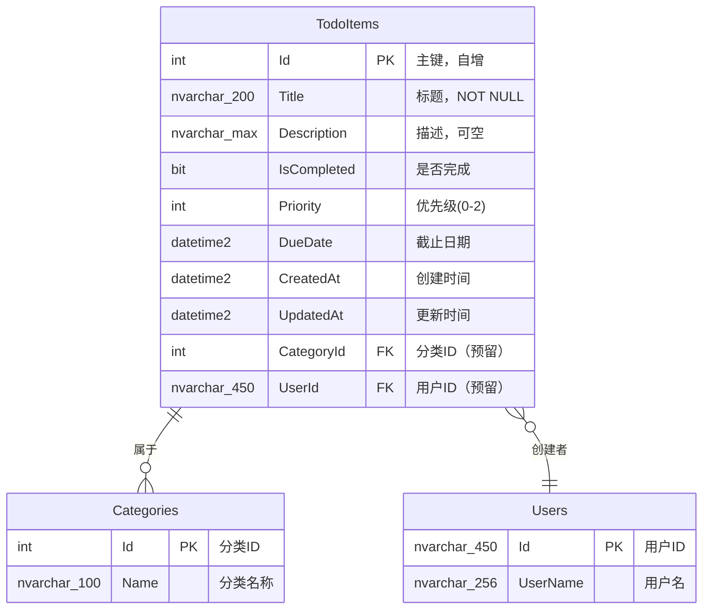

# Todo应用 - 数据库设计文档

## 一、数据库概述

### 1.1 设计原则

本项目的数据库设计遵循以下原则：

- **简洁性**：单表设计，避免过度规范化
- **可扩展性**：预留扩展字段，便于未来功能增强
- **性能优先**：合理设置字段类型和索引
- **数据完整性**：通过约束和验证保证数据质量
- **审计追踪**：记录创建和更新时间

### 1.2 数据库选型

**选择：SQL Server LocalDB (2022)**

**为什么选择LocalDB？**

| 特性 | 说明 |
|------|------|
| ✅ 轻量级 | 无需安装完整SQL Server，只需SDK |
| ✅ 零配置 | 启动即用，无需服务管理 |
| ✅ 开发友好 | Visual Studio完美集成 |
| ✅ 兼容性 | 与完整版SQL Server完全兼容 |
| ✅ 可迁移 | 后期可无缝升级到生产环境 |

**连接字符串格式：**
```
Server=(localdb)\\mssqllocaldb;Database=TodoAppDb;Trusted_Connection=True;TrustServerCertificate=True;
```

---

## 二、实体设计 - TodoItem

### 2.1 实体类定义

**文件位置：** `src/TodoApp.Core/Entities/TodoItem.cs`

```csharp
using System;
using System.ComponentModel.DataAnnotations;
using System.ComponentModel.DataAnnotations.Schema;

namespace TodoApp.Core.Entities
{
    /// <summary>
    /// 待办事项实体
    /// </summary>
    [Table("TodoItems")]  // 指定表名
    public class TodoItem
    {
        /// <summary>
        /// 主键ID（自增）
        /// </summary>
        [Key]
        [DatabaseGenerated(DatabaseGeneratedOption.Identity)]
        public int Id { get; set; }

        /// <summary>
        /// 标题（必填，最大200字符）
        /// </summary>
        [Required]
        [StringLength(200, ErrorMessage = "标题不能超过200个字符")]
        [Column("Title")]
        public string Title { get; set; } = string.Empty;

        /// <summary>
        /// 描述（可选，最大2000字符）
        /// </summary>
        [StringLength(2000, ErrorMessage = "描述不能超过2000个字符")]
        [Column("Description")]
        public string? Description { get; set; }

        /// <summary>
        /// 是否完成（默认false）
        /// </summary>
        [Required]
        [Column("IsCompleted")]
        public bool IsCompleted { get; set; } = false;

        /// <summary>
        /// 优先级（0=普通, 1=重要, 2=紧急）
        /// </summary>
        [Required]
        [Range(0, 2, ErrorMessage = "优先级必须在0-2之间")]
        [Column("Priority")]
        public int Priority { get; set; } = 0;

        /// <summary>
        /// 截止日期（可选）
        /// </summary>
        [Column("DueDate")]
        public DateTime? DueDate { get; set; }

        /// <summary>
        /// 创建时间（自动设置）
        /// </summary>
        [Required]
        [Column("CreatedAt")]
        public DateTime CreatedAt { get; set; } = DateTime.Now;

        /// <summary>
        /// 更新时间（自动更新）
        /// </summary>
        [Required]
        [Column("UpdatedAt")]
        public DateTime UpdatedAt { get; set; } = DateTime.Now;

        #region 导航属性（预留扩展）

        /// <summary>
        /// 分类ID（预留，V2.0使用）
        /// </summary>
        public int? CategoryId { get; set; }

        /// <summary>
        /// 用户ID（预留，V2.0多用户支持）
        /// </summary>
        public string? UserId { get; set; }

        #endregion
    }
}
```

### 2.2 字段详细说明

| 字段名 | 数据类型 | 约束 | 默认值 | 说明 |
|--------|----------|------|--------|------|
| **Id** | `int` | PK, Identity (1,1) | 自增 | 主键，唯一标识 |
| **Title** | `nvarchar(200)` | NOT NULL | '' | 任务标题，必填 |
| **Description** | `nvarchar(max)` | NULLABLE | null | 详细描述，可选 |
| **IsCompleted** | `bit` | NOT NULL | false | 完成状态 |
| **Priority** | `int` | NOT NULL, CHECK (0-2) | 0 | 优先级枚举 |
| **DueDate** | `datetime2` | NULLABLE | null | 截止日期 |
| **CreatedAt** | `datetime2` | NOT NULL | GETDATE() | 创建时间戳 |
| **UpdatedAt** | `datetime2` | NOT NULL | GETDATE() | 最后更新时间戳 |
| **CategoryId** | `int` | NULLABLE, FK | null | 分类外键（预留） |
| **UserId** | `nvarchar(450)` | NULLABLE, FK | null | 用户外键（预留） |

### 2.3 优先级枚举定义

为了代码更清晰，我们定义一个枚举类型：

**文件位置：** `src/TodoApp.Core/Enums/PriorityLevel.cs`

```csharp
namespace TodoApp.Core.Enums
{
    /// <summary>
    /// 优先级枚举
    /// </summary>
    public enum PriorityLevel
    {
        /// <summary>
        /// 普通（默认）
        /// </summary>
        Normal = 0,

        /// <summary>
        /// 重要
        /// </summary>
        Important = 1,

        /// <summary>
        /// 紧急
        /// </summary>
        Urgent = 2
    }
}
```

**使用示例：**
```csharp
var todo = new TodoItem
{
    Title = "完成项目报告",
    Priority = (int)PriorityLevel.Urgent,  // 设置为紧急
    DueDate = DateTime.Now.AddDays(3)
};
```

---

## 三、ER图（实体关系图）

### 3.1 Mermaid ER图



### 3.2 表结构可视化

```
┌─────────────────────────────────────────────────────────────┐
│                        TodoItems 表                         │
├──────────────┬─────────────┬──────────┬────────────────────┤
│   字段名     │    数据类型  │   约束   │       说明         │
├──────────────┼─────────────┼──────────┼────────────────────┤
│ Id           │ int         │ PK, AI   │ 主键               │
│ Title        │ nvarchar(200)│ NOT NULL │ 标题              │
│ Description  │ nvarchar(max)│ NULL    │ 描述              │
│ IsCompleted  │ bit         │ NOT NULL │ 是否完成          │
│ Priority     │ int         │ NOT NULL │ 优先级            │
│ DueDate      │ datetime2   │ NULL     │ 截止日期          │
│ CreatedAt    │ datetime2   │ NOT NULL │ 创建时间          │
│ UpdatedAt    │ datetime2   │ NOT NULL │ 更新时间          │
│ CategoryId   │ int         │ FK, NULL │ 分类ID（预留）    │
│ UserId       │ nvarchar(450)│ FK, NULL│ 用户ID（预留）    │
└──────────────┴─────────────┴──────────┴────────────────────┘
                              │
                              ▼
                    ┌─────────────────┐
                    │   索引设计      │
                    ├─────────────────┤
                    │ PK_TodoItems    │
                    │ (Id) - 聚簇索引 │
                    ├─────────────────┤
                    │ IX_Title        │
                    │ (Title) - 非聚簇│
                    ├─────────────────┤
                    │ IX_IsCompleted  │
                    │ (IsCompleted)   │
                    ├─────────────────┤
                    │ IX_CreatedAt    │
                    │ (CreatedAt DESC)│
                    ├─────────────────┤
                    │ IX_DueDate      │
                    │ (DueDate)       │
                    └─────────────────┘
```

---

## 四、DbContext 配置

### 4.1 ApplicationDbContext 定义

**文件位置：** `src/TodoApp.Infrastructure/Data/ApplicationDbContext.cs`

```csharp
using Microsoft.EntityFrameworkCore;
using TodoApp.Core.Entities;

namespace TodoApp.Infrastructure.Data
{
    /// <summary>
    /// 应用程序数据库上下文
    /// 继承自EF Core的DbContext，负责与数据库交互
    /// </summary>
    public class ApplicationDbContext : DbContext
    {
        /// <summary>
        /// 构造函数：接收DbContextOptions配置
        /// </summary>
        /// <param name="options">数据库配置选项</param>
        public ApplicationDbContext(DbContextOptions<ApplicationDbContext> options)
            : base(options)
        {
        }

        /// <summary>
        /// TodoItems DbSet - 对应数据库中的TodoItems表
        /// </summary>
        public DbSet<TodoItem> TodoItems { get; set; } = null!;

        /// <summary>
        /// 模型创建时的额外配置
        /// 在这里可以添加Fluent API配置
        /// </summary>
        protected override void OnModelCreating(ModelBuilder modelBuilder)
        {
            base.OnModelCreating(modelBuilder);

            // 配置TodoItem实体
            ConfigureTodoItem(modelBuilder);
        }

        /// <summary>
        /// 配置TodoItem实体的Fluent API
        /// </summary>
        private static void ConfigureTodoItem(ModelBuilder modelBuilder)
        {
            var entity = modelBuilder.Entity<TodoItem>(entity =>
            {
                // 表名和Schema
                entity.ToTable("TodoItems", dbo: "dbo");

                // 主键配置
                entity.HasKey(e => e.Id);
                entity.Property(e => e.Id).ValueGeneratedOnAdd();

                // Title配置
                entity.Property(e => e.Title)
                    .IsRequired()                           // 非空
                    .HasMaxLength(200)                      // 最大长度
                    .HasColumnType("nvarchar(200)");       // 数据库类型

                // Description配置
                entity.Property(e => e.Description)
                    .IsRequired(false)                      // 可空
                    .HasMaxLength(2000)                     // 最大长度
                    .HasColumnType("nvarchar(max)");        // 使用max表示大文本

                // IsCompleted配置
                entity.Property(e => e.IsCompleted)
                    .IsRequired()
                    .HasDefaultValue(false);                // 默认值false

                // Priority配置
                entity.Property(e => e.Priority)
                    .IsRequired()
                    .HasDefaultValue(0);                    // 默认普通优先级

                // DueDate配置
                entity.Property(e => e.DueDate)
                    .IsRequired(false);

                // CreatedAt配置
                entity.Property(e => e.CreatedAt)
                    .IsRequired()
                    .HasDefaultValueSql("GETDATE()")        // SQL Server默认值
                    .ValueGeneratedOnAdd();                 // 插入时自动生成

                // UpdatedAt配置
                entity.Property(e => e.UpdatedAt)
                    .IsRequired()
                    .HasDefaultValueSql("GETDATE()")
                    .ValueGeneratedOnAddOrUpdate();         // 插入或更新时自动生成

                // 索引配置
                entity.HasIndex(e => e.Title)               // 标题索引
                    .HasName("IX_TodoItems_Title")
                    .IsUnique(false);                        // 非唯一索引

                entity.HasIndex(e => e.IsCompleted)         // 状态索引
                    .HasName("IX_TodoItems_IsCompleted");

                entity.HasIndex(e => e.CreatedAt)           // 创建时间索引（降序）
                    .HasName("IX_TodoItems_CreatedAt")
                    .IsDescending();

                entity.HasIndex(e => new { e.IsCompleted, e.Priority, e.DueDate })  // 复合索引
                    .HasName("IX_TodoItems_Composite");

                // 全局查询过滤器（软删除预留）
                // entity.HasQueryFilter(e => !e.IsDeleted);
            });
        }

        /// <summary>
        /// 重写SaveChanges方法，自动更新UpdatedAt字段
        /// </summary>
        public override int SaveChanges()
        {
            UpdateTimestamps();
            return base.SaveChanges();
        }

        /// <summary>
        /// 异步版本SaveChangesAsync
        /// </summary>
        public override async Task<int> SaveChangesAsync(CancellationToken cancellationToken = default)
        {
            UpdateTimestamps();
            return await base.SaveChangesAsync(cancellationToken);
        }

        /// <summary>
        /// 自动更新时间戳
        /// </summary>
        private void UpdateTimestamps()
        {
            var entries = ChangeTracker.Entries<TodoItem>();

            foreach (var entry in entries)
            {
                switch (entry.State)
                {
                    case EntityState.Added:
                        entry.Entity.CreatedAt = DateTime.Now;
                        entry.Entity.UpdatedAt = DateTime.Now;
                        break;

                    case EntityState.Modified:
                        entry.Entity.UpdatedAt = DateTime.Now;
                        break;
                }
            }
        }
    }
}
```

### 4.2 DbContext 配置说明

**关键特性解析：**

#### 1️⃣ 泛型DbSet
```csharp
public DbSet<TodoItem> TodoItems { get; set; } = null!;
```
- `DbSet<T>` 表示数据库中的一张表
- EF Core会根据实体类自动映射到数据库表
- `= null!` 告诉编译器这个属性会在运行时被初始化

#### 2️⃣ Fluent API vs Data Annotations

本项目采用**混合方式**：

| 配置方式 | 适用场景 | 示例 |
|---------|---------|------|
| **Data Annotations** | 简单约束 | `[Required]`, `[StringLength]` |
| **Fluent API** | 复杂配置 | 复合索引、默认值、关系 |

**推荐做法：**
- 基础验证使用Data Annotations（在实体类上）
- 数据库特定配置使用Fluent API（在OnModelCreating中）

#### 3️⃣ 自动更新时间戳

```csharp
public override int SaveChanges()
{
    UpdateTimestamps();
    return base.SaveChanges();
}
```

**优点：**
- 不需要在业务逻辑中手动设置时间
- 保证时间一致性
- 减少重复代码

#### 4️⃣ ChangeTracker机制

EF Core的ChangeTracker会跟踪所有实体的状态：
- `Added` - 新增实体
- `Modified` - 已修改实体
- `Deleted` - 已删除实体
- `Unchanged` - 未变化实体
- `Detached` - 未被跟踪

---

## 五、种子数据设计

### 5.1 种子数据策略

**为什么需要种子数据？**

✅ 开发测试时快速验证功能
✅ 演示应用效果
✅ 单元测试使用固定数据
✅ 新开发者快速上手

### 5.2 SeedData 类实现

**文件位置：** `src/TodoApp.Infrastructure/Data/SeedData.cs`

```csharp
using Microsoft.EntityFrameworkCore;
using TodoApp.Core.Entities;
using TodoApp.Core.Enums;

namespace TodoApp.Infrastructure.Data
{
    /// <summary>
    /// 种子数据初始化类
    /// 用于预填充测试数据
    /// </summary>
    public static class SeedData
    {
        /// <summary>
        /// 初始化种子数据
        /// 如果表中没有数据，则插入预设的待办事项
        /// </summary>
        /// <param name="context">数据库上下文</param>
        public static async Task InitializeAsync(ApplicationDbContext context)
        {
            // 确保数据库已创建
            await context.Database.EnsureCreatedAsync();

            // 检查是否已有数据，避免重复插入
            if (await context.TodoItems.AnyAsync())
            {
                return;  // 数据库已有数据，不执行种子初始化
            }

            // 创建示例待办事项
            var todoItems = new[]
            {
                new TodoItem
                {
                    Title = "学习ASP.NET Core MVC基础",
                    Description = "完成官方教程的前5章，掌握Razor视图、控制器、模型绑定等核心概念。包括：路由系统、中间件管道、依赖注入等。",
                    IsCompleted = true,
                    Priority = (int)PriorityLevel.Important,
                    DueDate = DateTime.Now.AddDays(-2),  // 已过期但已完成
                    CreatedAt = DateTime.Now.AddDays(-7),
                    UpdatedAt = DateTime.Now.AddDays(-2)
                },
                new TodoItem
                {
                    Title = "学习Entity Framework Core",
                    Description = "掌握Code First开发流程，理解DbContext、DbSet、迁移机制。重点练习LINQ查询、关联关系、性能优化。",
                    IsCompleted = true,
                    Priority = (int)PriorityLevel.Normal,
                    DueDate = DateTime.Now.AddDays(-1),
                    CreatedAt = DateTime.Now.AddDays(-6),
                    UpdatedAt = DateTime.Now.AddDays(-1)
                },
                new TodoItem
                {
                    Title = "搭建开发环境",
                    Description = "安装.NET 8.0 SDK、Visual Studio 2022、SQL Server LocalDB。配置Git仓库，建立分支管理策略。",
                    IsCompleted = true,
                    Priority = (int)PriorityLevel.Urgent,
                    DueDate = DateTime.Now.AddDays(-10),
                    CreatedAt = DateTime.Now.AddDays(-14),
                    UpdatedAt = DateTime.Now.AddDays(-10)
                },
                new TodoItem
                {
                    Title = "完成Todo应用CRUD功能",
                    Description = "实现待办事项的增删改查功能，包括列表展示、创建表单、编辑页面、删除确认。要求有完整的表单验证。",
                    IsCompleted = false,
                    Priority = (int)PriorityLevel.Urgent,
                    DueDate = DateTime.Now.AddDays(3),  // 3天后到期
                    CreatedAt = DateTime.Now.AddDays(-3),
                    UpdatedAt = DateTime.Now
                },
                new TodoItem
                {
                    Title = "实现表单验证功能",
                    Description = "添加客户端和服务端验证，包括必填检查、长度限制、自定义规则（如截止日期不能是过去的时间）。集成jQuery Validation。",
                    IsCompleted = false,
                    Priority = (int)PriorityLevel.Important,
                    DueDate = DateTime.Now.AddDays(5),
                    CreatedAt = DateTime.Now.AddDays(-2),
                    UpdatedAt = DateTime.Now
                },
                new TodoItem
                {
                    Title = "添加分页和搜索功能",
                    Description = "实现列表页的分页导航（每页10条），支持按标题和描述搜索，关键词高亮显示。添加按状态筛选功能。",
                    IsCompleted = false,
                    Priority = (int)PriorityLevel.Important,
                    DueDate = DateTime.Now.AddDays(7),
                    CreatedAt = DateTime.Now.AddDays(-1),
                    UpdatedAt = DateTime.Now
                },
                new TodoItem
                {
                    Title = "UI美化和响应式布局",
                    Description = "集成Bootstrap 5框架，实现响应式设计。美化表格、表单、按钮样式。添加Toast通知提示组件。",
                    IsCompleted = false,
                    Priority = (int)PriorityLevel.Normal,
                    DueDate = DateTime.Now.AddDays(10),
                    CreatedAt = DateTime.Now,
                    UpdatedAt = DateTime.Now
                },
                new TodoItem
                {
                    Title = "编写单元测试",
                    Description = "使用xUnit + Moq框架编写单元测试，覆盖Service层的核心业务逻辑。目标代码覆盖率80%以上。",
                    IsCompleted = false,
                    Priority = (int)PriorityLevel.Normal,
                    DueDate = DateTime.Now.AddDays(14),
                    CreatedAt = DateTime.Now,
                    UpdatedAt = DateTime.Now
                },
                new TodoItem
                {
                    Title = "部署应用到IIS",
                    Description = "配置发布环境，生成发布包。在IIS上部署应用，配置数据库连接字符串。进行基本的功能测试。",
                    IsCompleted = false,
                    Priority = (int)PriorityLevel.Normal,
                    DueDate = DateTime.Now.AddDays(21),
                    CreatedAt = DateTime.Now,
                    UpdatedAt = DateTime.Now
                },
                new TodoItem
                {
                    Title = "编写项目文档",
                    Description = "整理需求分析、数据库设计、API接口文档。编写用户操作手册和部署指南。录制演示视频。",
                    IsCompleted = false,
                    Priority = (int)PriorityLevel.Normal,
                    DueDate = DateTime.Now.AddDays(30),
                    CreatedAt = DateTime.Now,
                    UpdatedAt = DateTime.Now
                },
                new TodoItem
                {
                    Title = "紧急修复线上Bug",
                    Description = "用户反馈登录页面在某些浏览器下显示异常，需要立即排查并修复。优先级最高！",
                    IsCompleted = false,
                    Priority = (int)PriorityLevel.Urgent,
                    DueDate = DateTime.Now.AddDays(1),  // 明天到期
                    CreatedAt = DateTime.Now.AddHours(-5),
                    UpdatedAt = DateTime.Now
                },
                new TodoItem
                {
                    Title = "准备周会汇报材料",
                    Description = "整理本周工作成果，制作PPT。包括：完成的任务、遇到的问题、下周计划。",
                    IsCompleted = false,
                    Priority = (int)PriorityLevel.Important,
                    DueDate = DateTime.Now.AddDays(2),
                    CreatedAt = DateTime.Now.AddHours(-12),
                    UpdatedAt = DateTime.Now
                }
            };

            // 批量添加到DbContext
            await context.TodoItems.AddRangeAsync(todoItems);

            // 保存到数据库
            await context.SaveChangesAsync();

            Console.WriteLine($"[SeedData] 成功初始化 {todoItems.Length} 条待办事项数据");
        }
    }
}
```

### 5.3 种子数据统计

| 状态 | 数量 | 占比 | 示例任务 |
|------|------|------|---------|
| ✅ 已完成 | 3 | 25% | 学习MVC、学习EF Core、搭建环境 |
| ⏳ 未完成 | 9 | 75% | CRUD功能、表单验证、UI美化等 |
| **总计** | **12** | **100%** | - |

**优先级分布：**

| 优先级 | 数量 | 颜色标识 | 说明 |
|--------|------|---------|------|
| 🟢 普通 | 5 | 绿色 | 低优先级任务 |
| 🟡 重要 | 4 | 黄色 | 中等优先级 |
| 🔴 紧急 | 3 | 红色 | 高优先级任务 |

**时间分布：**
- 已过期（已完成）：2个
- 即将到期（<3天）：3个
- 正常范围：7个

### 5.4 在Program.cs中调用种子数据

```csharp
// 在 app.Run() 之前添加
using (var scope = app.Services.CreateScope())
{
    var services = scope.ServiceProvider;
    var context = services.GetRequiredService<ApplicationDbContext>();
    await SeedData.InitializeAsync(context);
}
```

---

## 六、索引设计建议

### 6.1 索引规划

合理的索引设计对查询性能至关重要。

#### 当前设计的索引

| 索引名称 | 字段 | 类型 | 用途 |
|---------|------|------|------|
| **PK_TodoItems** | Id | 聚簇索引（主键） | 主键查找、JOIN操作 |
| **IX_TodoItems_Title** | Title | 非聚簇索引 | 按标题搜索 |
| **IX_TodoItems_IsCompleted** | IsCompleted | 非聚簇索引 | 按状态筛选 |
| **IX_TodoItems_CreatedAt** | CreatedAt DESC | 非聚簇索引 | 默认排序（最新在前） |
| **IX_TodoItems_DueDate** | DueDate | 非聚簇索引 | 按截止日期筛选/排序 |
| **IX_TodoItems_Composite** | (IsCompleted, Priority, DueDate) | 复合索引 | 组合查询优化 |

### 6.2 索引使用场景分析

#### 场景1：列表页默认查询

```sql
-- 默认查询：未完成任务，按创建时间倒序
SELECT * FROM TodoItems
WHERE IsCompleted = 0
ORDER BY CreatedAt DESC
OFFSET 0 ROWS FETCH NEXT 10 ROWS ONLY;
```

**使用的索引：**
- ✅ `IX_TodoItems_IsCompleted` - 筛选条件
- ✅ `IX_TodoItems_CreatedAt` - 排序

#### 场景2：搜索功能

```sql
-- 按标题搜索
SELECT * FROM TodoItems
WHERE Title LIKE '%ASP.NET%'
ORDER BY CreatedAt DESC;
```

**使用的索引：**
- ⚠️ `IX_TodoItems_Title` - 但LIKE '%xxx%'无法有效使用索引（前缀通配符问题）

**优化建议：**
- 如果搜索频率高，考虑使用全文索引（Full-Text Index）
- 或者使用Elasticsearch等搜索引擎

#### 场景3：组合筛选

```sql
-- 按状态+优先级筛选
SELECT * FROM TodoItems
WHERE IsCompleted = 0
AND Priority = 2
ORDER BY DueDate ASC;
```

**使用的索引：**
- ✅ `IX_TodoItems_Composite` - 复合索引完美匹配

### 6.3 索引最佳实践

**DO（推荐）：**

✅ 为常用的WHERE条件字段创建索引
✅ 为ORDER BY、GROUP BY字段创建索引
✅ 使用复合索引优化多条件查询
✅ 定期监控索引使用情况（SQL Server Profiler）

**DON'T（避免）：**

❌ 为每个字段都创建索引（影响写入性能）
❌ 创建过多重复的复合索引
❌ 忽略索引维护（碎片整理）
❌ 在低选择性字段上建索引（如性别字段）

### 6.4 性能监控SQL

```sql
-- 查看索引使用统计
SELECT
    OBJECT_NAME(ind.OBJECT_ID) AS TableName,
    ind.name AS IndexName,
    ind.type_desc AS IndexType,
    s.user_seeks AS Seeks,
    s.user_scans AS Scans,
    s.user_lookups AS Lookups,
    s.user_updates AS Updates
FROM sys.indexes ind
INNER JOIN sys.dm_db_index_usage_stats s
    ON ind.object_id = s.object_id AND ind.index_id = s.index_id
WHERE OBJECTPROPERTY(ind.OBJECT_ID, 'IsUserTable') = 1
AND s.database_id = DB_ID()
ORDER BY (s.user_seeks + s.user_scans + s.user_lookups) DESC;
```

---

## 七、数据库迁移

### 7.1 Code First迁移流程

EF Core使用**Code First迁移**来管理数据库结构变更：

```
步骤1：定义/修改实体类
    ↓
步骤2：创建迁移文件（dotnet ef migrations add）
    ↓
步骤3：审查生成的迁移代码
    ↓
步骤4：应用迁移到数据库（dotnet ef database update）
```

### 7.2 创建初始迁移

**命令行操作：**

```bash
# 1. 进入Infrastructure项目目录
cd src/TodoApp.Infrastructure

# 2. 添加初始迁移
dotnet ef migrations add InitialCreate \
    --project ../TodoApp.Infrastructure \
    --startup-project ../TodoApp.Api \
    --context ApplicationDbContext \
    --output-dir Data/Migrations

# 3. 应用迁移到数据库
dotnet ef database update \
    --project ../TodoApp.Infrastructure \
    --startup-project ../TodoApp.Api \
    --context ApplicationDbContext
```

**或者使用Package Manager Console（Visual Studio）：**

```powershell
Add-Migration InitialCreate -Context ApplicationDbContext -OutputDir Data/Migrations
Update-Database -Context ApplicationDbContext
```

### 7.3 迁移文件结构

生成的迁移文件位于：`src/TodoApp.Infrastructure/Data/Migrations/`

```
Migrations/
├── 20260416000000_InitialCreate.cs      # 迁移的Up/Down方法
├── 20260416000000_InitialCreate.Designer.cs  # 设计器元数据
└── ApplicationDbContextModelSnapshot.cs      # 当前模型快照
```

**InitialCreate.cs 示例：**

```csharp
using Microsoft.EntityFrameworkCore.Migrations;

namespace TodoApp.Infrastructure.Data.Migrations
{
    public partial class InitialCreate : Migration
    {
        protected override void Up(MigrationBuilder migrationBuilder)
        {
            migrationBuilder.CreateTable(
                name: "TodoItems",
                columns: table => new
                {
                    Id = table.Column<int>(type: "int", nullable: false)
                        .Annotation("SqlServer:Identity", "1, 1"),
                    Title = table.Column<string>(type: "nvarchar(200)", maxLength: 200, nullable: false),
                    Description = table.Column<string>(type: "nvarchar(max)", maxLength: 2000, nullable: true),
                    IsCompleted = table.Column<bool>(type: "bit", nullable: false),
                    Priority = table.Column<int>(type: "int", nullable: false),
                    DueDate = table.Column<DateTime>(type: "datetime2", nullable: true),
                    CreatedAt = table.Column<DateTime>(type: "datetime2", nullable: false),
                    UpdatedAt = table.Column<DateTime>(type: "datetime2", nullable: false)
                },
                constraints: table =>
                {
                    table.PrimaryKey("PK_TodoItems", x => x.Id);
                });

            // 创建索引
            migrationBuilder.CreateIndex(
                name: "IX_TodoItems_Title",
                table: "TodoItems",
                column: "Title");

            migrationBuilder.CreateIndex(
                name: "IX_TodoItems_IsCompleted",
                table: "TodoItems",
                column: "IsCompleted");

            migrationBuilder.CreateIndex(
                name: "IX_TodoItems_CreatedAt",
                table: "TodoItems",
                column: "CreatedAt",
                descending: new[] { true });

            migrationBuilder.CreateIndex(
                name: "IX_TodoItems_Composite",
                table: "TodoItems",
                columns: new[] { "IsCompleted", "Priority", "DueDate" });
        }

        protected override void Down(MigrationBuilder migrationBuilder)
        {
            migrationBuilder.DropTable(name: "TodoItems");
        }
    }
}
```

### 7.4 后续迁移示例

**场景：添加新字段 Tags**

```bash
# 1. 修改TodoItem实体，添加Tags属性
# 2. 创建新的迁移
dotnet ef migrations add AddTagsToTodoItem

# 3. 查看生成的迁移代码（可能需要调整）
# 4. 应用迁移
dotnet ef database update
```

**回滚迁移：**

```bash
# 回滚到上一个版本
dotnet ef database update PreviousMigrationName

# 回滚到初始状态（删除数据库）
dotnet ef database update 0
```

---

## 八、数据库完整性约束

### 8.1 实体级别约束

已在实体类中使用Data Annotations定义：

```csharp
[Required]
[StringLength(200)]
public string Title { get; set; }  // 必填 + 长度限制

[Range(0, 2)]
public int Priority { get; set; }  // 范围约束
```

### 8.2 数据库级别约束

通过Fluent API在DbContext中配置：

```csharp
// CHECK约束示例（如果需要）
entity.HasCheckConstraint("CK_TodoItems_Priority", "[Priority] >= 0 AND [Priority] <= 2");

// 默认值约束
entity.Property(e => e.IsCompleted).HasDefaultValue(false);
```

### 8.3 业务规则验证

除了数据库约束，还需要在应用层验证：

**自定义验证示例（截止日期不能是过去）：**

```csharp
public class FutureDateAttribute : ValidationAttribute
{
    public override bool IsValid(object value)
    {
        if (value is DateTime date)
        {
            return date.Date >= DateTime.Today;
        }
        return true;  // 允许null
    }

    public override string FormatErrorMessage(string name)
    {
        return $"{name} 不能是过去的日期";
    }
}
```

---

## 九、数据库备份和恢复策略

### 9.1 开发环境备份

**LocalDB数据库文件位置：**
```
C:\Users\<YourUsername>\TodoAppDb.mdf
C:\Users\<YourUsername>\TodoAppDb_log.ldf
```

**手动备份方法：**

```sql
-- 备份数据库
BACKUP DATABASE TodoAppDb
TO DISK = 'D:\Backups\TodoAppDb.bak'
WITH FORMAT,
    NAME = 'TodoAppDB-Full Backup',
    COMPRESSION ON;
```

### 9.2 种子数据作为恢复手段

由于是开发环境，最简单的恢复方式：

```csharp
// 删除数据库重新创建
await context.Database.EnsureDeletedAsync();
await context.Database.EnsureCreatedAsync();
await SeedData.InitializeAsync(context);  // 重新填充种子数据
```

---

## 十、验证点清单

完成数据库设计后，请逐项验证：

### 10.1 结构验证

- [ ] TodoItem实体类已创建，包含所有必需字段
- [ ] 字段类型和约束正确（Title必填、Description可空等）
- [ ] PriorityLevel枚举已定义
- [ ] ApplicationDbContext已正确配置
- [ ] OnModelCreating中的Fluent API配置无误

### 10.2 迁移验证

- [ ] 能够成功执行 `dotnet ef migrations add InitialCreate`
- [ ] 生成的迁移代码包含正确的CREATE TABLE语句
- [ ] 所有索引都已正确定义
- [ ] 执行 `dotnet ef database update` 成功创建数据库

### 10.3 种子数据验证

- [ ] SeedData类已实现InitializeAsync方法
- [ ] 包含12条多样化的测试数据
- [ ] Program.cs中已配置调用种子数据初始化
- [ ] 运行应用后数据库中存在预设数据

### 10.4 功能验证

- [ ] 可以使用SSMS或Visual Studio Server Explorer查看数据库
- [ ] TodoItems表结构符合设计文档
- [ ] 索引已正确创建
- [ ] 可以手动插入和查询数据

### 10.5 性能验证（可选）

- [ ] 使用SQL Server Profiler监控查询性能
- [ ] 索引使用统计正常
- [ ] 复杂查询响应时间 < 500ms

---

## 十一、常见问题和解决方案

### 问题1：迁移失败 - 表已存在

**错误信息：**
```
There is already an object named 'TodoItems' in the database.
```

**解决方案：**
```bash
# 删除数据库重新开始
dotnet ef database drop --force
dotnet ef database update
```

### 问题2：LocalDB连接失败

**错误信息：**
```
A network-related or instance-specific error occurred while establishing a connection to SQL Server.
```

**解决方案：**
1. 确认LocalDB已安装：`sqllocaldb info`
2. 启动实例：`sqllocaldb start mssqllocaldb`
3. 检查连接字符串中的实例名称

### 问题3：种子数据重复插入

**问题描述：** 每次启动应用都会重复插入相同的数据

**解决方案：** SeedData中已有检查逻辑：
```csharp
if (await context.TodoItems.AnyAsync())
{
    return;  // 已有数据则跳过
}
```

### 问题4：DateTime精度问题

**现象：** 存入的时间和取出时间不一致（毫秒级差异）

**解决方案：** 使用 `datetime2(7)` 类型提高精度：
```csharp
entity.Property(e => e.CreatedAt)
    .HasColumnType("datetime2(7)");
```

---

## 十二、总结

本文档完成了Todo应用的数据库设计，包括：

✅ **完整的TodoItem实体设计**（10个字段）
✅ **清晰的ER图和表结构说明**
✅ **详细的DbContext配置**（Fluent API + Data Annotations混合模式）
✅ **实用的种子数据**（12条多样化测试数据）
✅ **科学的索引设计方案**（6个索引覆盖主要查询场景）
✅ **完整的迁移流程指南**
✅ **常见问题解决方案**

**关键设计决策：**

1. **单表设计**：简化复杂度，适合MVP阶段
2. **预留扩展字段**：CategoryId、UserId为未来功能做准备
3. **自动时间戳**：重写SaveChanges自动维护时间字段
4. **复合索引优化**：针对常见的组合查询场景
5. **丰富的种子数据**：包含各种状态、优先级、时间的样本

**下一步行动：**

基于此数据库设计文档，接下来将进行：

1. **项目初始化** - 创建解决方案和项目结构
2. **配置依赖注入** - 注册DbContext和相关服务
3. **实现Repository层** - 封装数据访问逻辑
4. **实现Service层** - 编写业务逻辑代码

---

## 附录A：完整DDL脚本（参考）

如果需要手动创建数据库，可以使用以下SQL脚本：

```sql
-- =============================================
-- TodoApp 数据库创建脚本
-- 版本: 1.0
-- 日期: 2026-04-16
-- =============================================

USE [master];
GO

-- 如果数据库已存在则删除（仅用于开发环境）
IF DB_ID('TodoAppDb') IS NOT NULL
BEGIN
    DROP DATABASE TodoAppDb;
END
GO

-- 创建数据库
CREATE DATABASE TodoAppDb;
GO

USE TodoAppDb;
GO

-- =============================================
-- 创建TodoItems表
-- =============================================
CREATE TABLE dbo.TodoItems (
    Id INT IDENTITY(1,1) NOT NULL,
    Title NVARCHAR(200) NOT NULL,
    Description NVARCHAR(MAX) NULL,
    IsCompleted BIT NOT NULL CONSTRAINT DF_TodoItems_IsCompleted DEFAULT ((0)),
    Priority INT NOT NULL CONSTRAINT DF_TodoItems_Priority DEFAULT ((0)),
    DueDate DATETIME2(7) NULL,
    CreatedAt DATETIME2(7) NOT NULL CONSTRAINT DF_TodoItems_CreatedAt DEFAULT (GETDATE()),
    UpdatedAt DATETIME2(7) NOT NULL CONSTRAINT DF_TodoItems_UpdatedAt DEFAULT (GETDATE()),

    CONSTRAINT PK_TodoItems PRIMARY KEY CLUSTERED (Id ASC)
);
GO

-- =============================================
-- 创建索引
-- =============================================

-- 标题索引（用于搜索）
CREATE NONCLUSTERED INDEX IX_TodoItems_Title
ON dbo.TodoItems (Title);
GO

-- 完成状态索引（用于筛选）
CREATE NONCLUSTERED INDEX IX_TodoItems_IsCompleted
ON dbo.TodoItems (IsCompleted);
GO

-- 创建时间索引（用于默认排序）
CREATE NONCLUSTERED INDEX IX_TodoItems_CreatedAt
ON dbo.TodoItems (CreatedAt DESC);
GO

-- 截止日期索引
CREATE NONCLUSTERED INDEX IX_TodoItems_DueDate
ON dbo.TodoItems (DueDate);
GO

-- 复合索引（用于组合查询）
CREATE NONCLUSTERED INDEX IX_TodoItems_Composite
ON dbo.TodoItems (IsCompleted, Priority, DueDate);
GO

-- =============================================
-- 添加CHECK约束
-- =============================================

-- 优先级范围约束（0-2）
ALTER TABLE dbo.TodoItems
ADD CONSTRAINT CK_TodoItems_Priority
CHECK (Priority >= 0 AND Priority <= 2);
GO

-- =============================================
-- 插入种子数据
-- =============================================

INSERT INTO dbo.TodoItems (Title, Description, IsCompleted, Priority, DueDate, CreatedAt, UpdatedAt)
VALUES
    ('学习ASP.NET Core MVC基础', '完成官方教程的前5章...', 1, 1, DATEADD(day, -2, GETDATE()), DATEADD(day, -7, GETDATE()), DATEADD(day, -2, GETDATE())),
    ('学习Entity Framework Core', '掌握Code First开发流程...', 1, 0, DATEADD(day, -1, GETDATE()), DATEADD(day, -6, GETDATE()), DATEADD(day, -1, GETDATE())),
    -- ... 其他数据省略，参见SeedData.cs
    ;
GO

-- 验证数据插入
SELECT COUNT(*) AS TotalCount FROM dbo.TodoItems;
GO

PRINT '数据库创建完成！';
GO
```

---

## 附录B：数据库命名规范

| 对象 | 命名规范 | 示例 |
|------|---------|------|
| 表名 | PascalCase，复数形式 | `TodoItems`, `Users` |
| 列名 | PascalCase | `Title`, `CreatedAt` |
| 主键 | `PK_表名` | `PK_TodoItems` |
| 外键 | `FK_表名_列名` | `FK_TodoItems_CategoryId` |
| 索引 | `IX_表名_列名` | `IX_TodoItems_Title` |
| 默认约束 | `DF_表名_列名` | `DF_TodoItems_IsCompleted` |
| CHECK约束 | `CK_表名_描述` | `CK_TodoItems_Priority` |
| Schema | `dbo`（默认） | `dbo.TodoItems` |

---

**文档版本：** v1.0
**创建日期：** 2026-04-16
**最后更新：** 2026-04-16
**作者：** ASP.NET Web Dev Knowledge Base
**状态：** 已批准，可用于实施
