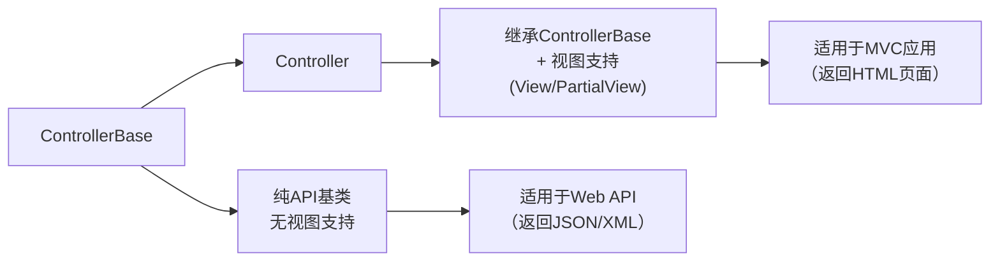
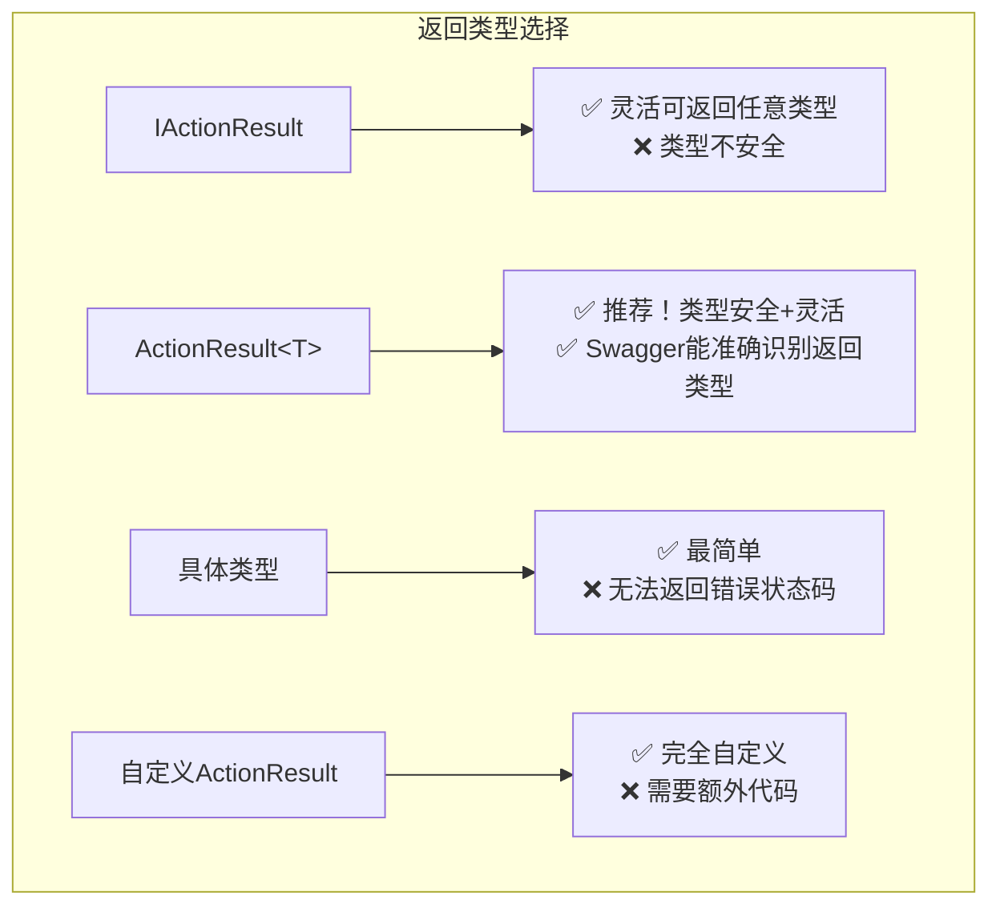
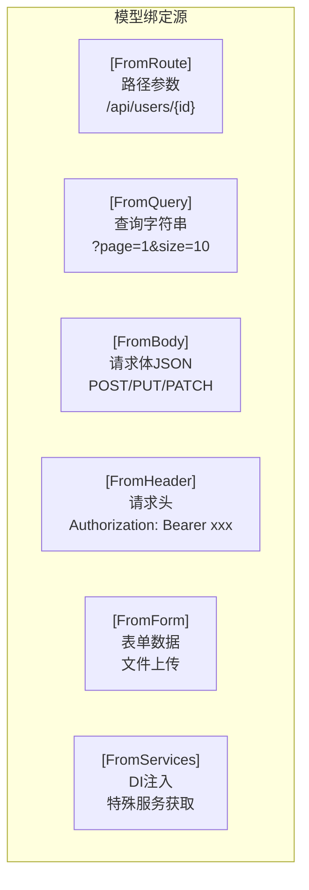

# API控制器开发

> **学习目标**：掌握ASP.NET Core API控制器的开发技巧，理解[ApiController]特性的强大功能，能够编写类型安全、文档完善的API端点
>
> **前置知识**：REST原则、C#基础、依赖注入、MVC控制器基础
>
> **预计时长**：60-90分钟

---

## 一、API控制器基础

### 1.1 ControllerBase vs Controller

在开发Web API时，选择正确的基类是第一步：



```csharp
// ✅ Web API 推荐使用 ControllerBase
[ApiController]
[Route("api/[controller]")]
public class ProductsController : ControllerBase
{
    // 只返回数据，不返回视图
}

// ❌ 不要在API中使用 Controller 基类
public class HomeController : Controller
{
    // 这个用于MVC，可以返回 View()
    public IActionResult Index() => View();
}
```

**关键区别**：

| 特性 | ControllerBase | Controller |
|------|---------------|------------|
| 视图支持 | 无 | 有 (View(), PartialView()) |
| 用途 | 纯API开发 | MVC混合应用 |
| 轻量级 | 是 | 否 |
| 推荐 | Web API项目 | 传统MVC项目 |

### 1.2 [ApiController] 特性的威力

`[ApiController]` 特性是.NET Core 2.1+引入的"游戏规则改变者"，它自动为你的API添加了多项强大的行为：

```csharp
[ApiController]  // 加上这个特性，获得以下所有自动行为！
[Route("api/[controller]")]
public class UsersController : ControllerBase
{
    private readonly IUserService _userService;

    public UsersController(IUserService userService)
    {
        _userService = userService;
    }
}
```

#### 自动行为一：自动HTTP 400响应

当模型验证失败时，**自动返回400 Bad Request**，无需手动编写验证代码：

```csharp
// DTO定义
public class CreateUserDto
{
    [Required(ErrorMessage = "用户名不能为空")]
    [MinLength(3, ErrorMessage = "用户名至少3个字符")]
    [MaxLength(50, ErrorMessage = "用户名最多50个字符")]
    public string UserName { get; set; } = string.Empty;

    [Required]
    [EmailAddress]
    public string Email { get; set; } = string.Empty;

    [Required]
    [StringLength(100, MinimumLength = 6)]
    public string Password { get; set; } = string.Empty;
}

// 控制器 - 无需手动验证！
[HttpPost]
public async Task<ActionResult<UserDto>> Create([FromBody] CreateUserDto dto)
{
    // [ApiController] 会自动：
    // 1. 验证dto的所有DataAnnotation
    // 2. 如果验证失败，自动返回:
    // {
    //   "type": "https://tools.ietf.org/html/rfc7231#section-6.5.1",
    //   "title": "One or more validation errors occurred.",
    //   "status": 400,
    //   "errors": {
    //     "UserName": ["用户名不能为空"],
    //     "Email": ["邮箱格式不正确"]
    //   }
    // }
    var user = await _userService.CreateAsync(dto);
    return CreatedAtAction(nameof(GetById), new { id = user.Id }, user);
}
```

#### 自动行为二：推断参数绑定源

框架会自动推断参数来源，减少特性标注：

```csharp
[HttpGet("{id}")]
// id 自动从 Route 绑定，无需 [FromRoute]
public async Task<ActionResult<UserDto>> GetById(int id)
{
    // ...
}

[HttpGet("search")]
// 复杂类型自动从 Query 绑定，无需 [FromQuery]
public async Task<ActionResult<IEnumerable<UserDto>>> Search(UserSearchQuery query)
{
    // UserSearchQuery 的属性会自动从查询参数绑定
    // ?keyword=test&page=1&size=10
}

[HttpPost]
// 复杂类型自动从 Body 绑定，无需 [FromBody]
public async Task<ActionResult<UserDto>> Create(CreateUserDto dto)
{
    // ...
}

// 绑定源推断规则：
// [FromQuery] - 查询字符串参数 (?name=value)
// [FromBody] - 请求体 (JSON)
// [FromRoute] - 路由数据 ({id})
// [FromHeader] - 请求头
// [FromForm] - 表单数据 (multipart/form-data)
// [FromServices] - 从DI容器获取服务
```

#### 自动行为三：multipart/form-data推断

当操作参数包含 IFormFile 或 IEnumerable<IFormFile> 时，自动推断为表单数据：

```csharp
[HttpPost("upload")]
// 自动识别为 multipart/form-data
public async Task<ActionResult> UploadAvatar(
    int userId,
    IFormFile file)  // 自动绑定文件
{
    // 处理文件上传...
}
```

---

## 二、Action返回类型详解

选择合适的返回类型是API开发的重要决策。ASP.NET Core提供了多种返回类型选项：

### 2.1 返回类型对比总览



### 2.2 IActionResult - 灵活但类型不安全

```csharp
// ✅ 适用场景：需要返回多种不同类型的场景
[HttpGet("{id}")]
public async Task<IActionResult> GetUser(int id)
{
    var user = await _userService.GetByIdAsync(id);

    if (user == null)
        return NotFound();           // 返回404
    if (!user.IsActive)
        return Conflict(new { message = "用户已被禁用" }); // 返回409

    return Ok(user);                // 返回200 + JSON
}

// ❌ 问题：Swagger无法知道成功时返回什么类型
// 文档中只会显示返回 IActionResult，不够明确
```

### 2.3 ActionResult<T> - 推荐方案（最佳实践）

这是目前最推荐的返回类型，兼顾了类型安全和灵活性：

```csharp
/// <summary>
/// 获取用户详情
/// </summary>
/// <param name="id">用户ID</param>
/// <returns>用户信息</returns>
/// <response code="200">获取成功</response>
/// <response code="404">用户不存在</response>
[HttpGet("{id}")]
[ProducesResponseType(typeof(UserDto), StatusCodes.Status200OK)]
[ProducesResponseType(typeof(ProblemDetails), StatusCodes.Status404NotFound)]
public async Task<ActionResult<UserDto>> GetUser(int id)
{
    var user = await _userService.GetByIdAsync(id);

    if (user == null)
        return NotFound(new ProblemDetails
        {
            Title = "未找到用户",
            Detail = $"ID为 {id} 的用户不存在",
            Status = 404
        });

    return Ok(user); // 类型安全：编译器知道返回UserDto
}

// ActionResult<T> 的优势：
// 1. 编译时类型检查
// 2. Swagger/OpenAPI 能准确生成文档
// 3. 仍然可以使用 Ok(), NotFound(), BadRequest() 等辅助方法
// 4. 支持 implicit operator 转换
```

### 2.4 具体类型返回 - 简单直接

```csharp
// ✅ 适用场景：确定只返回一种结果
[HttpGet]
public async Task<List<UserSummaryDto>> GetAllUsers()
{
    // 总是返回列表，不需要考虑404等情况
    return await _userService.GetAllAsync();
}

// ⚠️ 局限性：无法方便地返回错误状态码
// 如果需要返回错误，还是用 ActionResult<T>
```

### 2.5 自定义ActionResult

对于特殊需求，可以创建自定义的ActionResult：

```csharp
/// <summary>
/// 创建的自定义ActionResult，用于返回分页结果
/// </summary>
public class PagedResultActionResult<T> : ActionResult
{
    private readonly PagedResult<T> _result;

    public PagedResultActionResult(PagedResult<T> result)
    {
        _result = result;
    }

    public override async Task ExecuteResultAsync(ActionContext context)
    {
        var response = context.HttpContext.Response;
        response.ContentType = "application/json";
        response.StatusCode = 200;

        // 添加自定义头
        response.Headers["X-Pagination"] = JsonSerializer.Serialize(new
        {
            _result.CurrentPage,
            _result.PageSize,
            _result.TotalCount,
            _result.TotalPages,
            HasNext = _result.CurrentPage < _result.TotalPages,
            HasPrevious = _result.CurrentPage > 1
        });

        await response.WriteAsJsonAsync(_result);
    }
}

// 使用
[HttpGet]
public async Task<PagedResultActionResult<UserDto>> GetUsers(
    [FromQuery] int page = 1, [FromQuery] int size = 10)
{
    var result = await _userService.GetPagedAsync(page, size);
    return new PagedResultActionResult<UserDto>(result);
}
```

---

## 三、模型绑定源详解

理解每个绑定源特性的适用场景，才能写出清晰的API：

### 3.1 绑定源速查表



### 3.2 各绑定源详细示例

```csharp
[ApiController]
[Route("api/[controller]")]
public class DemoController : ControllerBase
{
    // ========== [FromRoute] - 路径参数 ==========
    // URL: /api/demo/users/42/orders/10
    [HttpGet("users/{userId}/orders/{orderId}")]
    public ActionResult GetOrder(
        [FromRoute] int userId,      // 从 {userId} 获取
        [FromRoute] int orderId)     // 从 {orderId} 获取
    {
        return Ok(new { userId, orderId });
    }

    // ========== [FromQuery] - 查询参数 ==========
    // URL: /api/demo/search?keyword=api&page=1&pageSize=20&tags=rest&tags=web
    [HttpGet("search")]
    public ActionResult Search(
        [FromQuery] string keyword,
        [FromQuery] int page = 1,
        [FromQuery] int pageSize = 20,
        [FromQuery] List<string>? tags = null)  // 数组参数
    {
        return Ok(new { keyword, page, pageSize, tags });
    }

    // ========== [FromBody] - 请求体 ==========
    // POST /api/demo/products
    // Content-Type: application/json
    // Body: {"name":"iPhone","price":9999,"category":"electronics"}
    [HttpPost("products")]
    public ActionResult CreateProduct([FromBody] CreateProductDto product)
    {
        return Ok(product);
    }

    // ========== [FromHeader] - 请求头 ==========
    // Header: X-Custom-Id: 12345
    // Header: X-Request-Source: mobile
    [HttpPost("process")]
    public ActionResult Process(
        [FromBody] ProcessDataDto data,
        [FromHeader(Name = "X-Custom-Id")] string customId,
        [FromHeader(Name = "X-Request-Source")] string? source = null)
    {
        return Ok(new { data, customId, source });
    }

    // ========== [FromForm] - 表单数据（文件上传）==========
    // POST /api/demo/upload
    // Content-Type: multipart/form-data
    // Form: file=二进制数据, title=文档标题
    [HttpPost("upload")]
    public async Task<ActionResult> UploadFile(
        [FromForm] IFormFile file,
        [FromForm] string title,
        [FromForm] string? description = null)
    {
        if (file.Length == 0)
            return BadRequest("文件不能为空");

        var filePath = Path.Combine(Directory.GetCurrentDirectory(), "uploads",
            $"{Guid.NewGuid()}_{file.FileName}");

        using var stream = new FileStream(filePath, FileMode.Create);
        await file.CopyToAsync(stream);

        return Ok(new { fileName = file.FileName, filePath, title });
    }

    // ========== [FromServices] - DI注入 ==========
    // 用于在特定action中注入服务，而不是构造函数
    [HttpGet("time")]
    public ActionResult GetCurrentTime(
        [FromServices] IDateTimeService timeService,
        [FromServices] ILogger<DemoController> logger)
    {
        logger.LogInformation("获取当前时间");
        return Ok(timeService.Now);
    }
}
```

### 3.3 复杂查询对象模式

对于复杂的列表查询接口，推荐使用专门的查询DTO：

```csharp
/// <summary>
/// 用户查询参数DTO
/// </summary>
public class UserQueryParameters
{
    /// <summary>
    /// 页码（默认1）
    /// </summary>
    [FromQuery]
    public int PageNumber { get; set; } = 1;

    /// <summary>
    /// 每页数量（默认20，最大100）
    /// </summary>
    [FromQuery]
    [Range(1, 100)]
    public int PageSize { get; set; } = 20;

    /// <summary>
    /// 搜索关键词
    /// </summary>
    [FromQuery]
    public string? Keyword { get; set; }

    /// <summary>
    /// 角色筛选
    /// </summary>
    [FromQuery]
    public string? Role { get; set; }

    /// <summary>
    /// 是否激活
    /// </summary>
    [FromQuery]
    public bool? IsActive { get; set; }

    /// <summary>
    /// 排序字段
    /// </summary>
    [FromQuery]
    public string SortBy { get; set; } = "CreatedAt";

    /// <summary>
    /// 排序方向：asc 或 desc
    /// </summary>
    [FromQuery]
    public string SortOrder { get; set; } = "desc";
}

// 使用
[HttpGet]
public async Task<ActionResult<PagedResult<UserDto>>> GetUsers(
    [FromQuery] UserQueryParameters parameters)
{
    // 参数已经自动绑定了
    var result = await _userService.QueryAsync(parameters);
    return Ok(result);
}

// 调用示例：
// GET /api/users?page=2&size=20&keyword=admin&role=manager&isActive=true&sortBy=name&sortOrder=asc
```

---

## 四、Produces与Consumes特性

显式声明API接受和产生的媒体类型，让API契约更清晰：

```csharp
[ApiController]
[Route("api/v{version:apiVersion}/products")]
// 声明此控制器所有action都产生JSON格式响应
[Produces("application/json")]
// 声明此控制器接受JSON格式的请求
[Consumes("application/json")]
public class ProductsController : ControllerBase
{
    // 单独action也可以覆盖控制器的设置
    /// <summary>
    /// 导出产品数据为CSV
    /// </summary>
    [HttpGet("export")]
    // 此方法覆盖Produces，返回CSV格式
    [Produces("text/csv")]
    public async Task<FileResult> ExportCsv()
    {
        var csv = await _productService.ExportToCsvAsync();
        return File(System.Text.Encoding.UTF8.GetBytes(csv),
            "text/csv", "products.csv");
    }

    /// <summary>
    /// 批量导入产品（支持JSON和XML）
    /// </summary>
    [HttpPost("import")]
    // 此方法接受JSON或XML
    [Consumes("application/json", "application/xml")]
    public async Task<ActionResult> Import([FromBody] List<ImportProductDto> products)
    {
        await _productService.ImportAsync(products);
        return Accepted();
    }

    // 上传文件 - 使用form-data
    [HttpPost("image")]
    [Consumes("multipart/form-data")]
    public async Task<ActionResult> UploadImage([FromForm] IFormFile image)
    {
        // ...
        return Ok();
    }
}
```

---

## 五、完整的API端点示例集

下面展示5种不同类型的典型API端点实现：

### 5.1 CRUD标准端点

```csharp
namespace ApiDemo.Controllers;

[ApiController]
[Route("api/v1/tasks")]
public class TasksController : ControllerBase
{
    private readonly ITaskService _taskService;
    private readonly ILogger<TasksController> _logger;

    public TasksController(ITaskService taskService, ILogger<TasksController> logger)
    {
        _taskService = taskService;
        _logger = logger;
    }

    /// <summary>
    /// 获取任务列表（支持分页、过滤、排序）
    /// </summary>
    [HttpGet]
    [ProducesResponseType(typeof(PagedResult<TaskItemDto>), 200)]
    public async Task<ActionResult<PagedResult<TaskItemDto>>> GetTasks(
        [FromQuery] TaskQueryParams queryParams)
    {
        _logger.LogInformation("查询任务列表: Page={Page}, Size={Size}",
            queryParams.PageNumber, queryParams.PageSize);

        try
        {
            var result = await _taskService.GetPagedAsync(queryParams);
            Response.Headers["X-Total-Count"] = result.TotalCount.ToString();
            return Ok(result);
        }
        catch (Exception ex)
        {
            _logger.LogError(ex, "查询任务列表失败");
            return StatusCode(500, new { error = "内部服务器错误" });
        }
    }

    /// <summary>
    /// 根据ID获取任务详情
    /// </summary>
    [HttpGet("{id:guid}")]
    [ProducesResponseType(typeof(TaskItemDto), 200)]
    [ProducesResponseType(404)]
    [ResponseCache(Duration = 60, VaryByQueryKeys = new[] { "id" })]
    public async Task<ActionResult<TaskItemDto>> GetTask(Guid id)
    {
        var task = await _taskService.GetByIdAsync(id);

        if (task is null)
            return NotFound(new { message = $"任务 {id} 不存在" });

        return Ok(task);
    }

    /// <summary>
    /// 创建新任务
    /// </summary>
    [HttpPost]
    [ProducesResponseType(typeof(TaskItemDto), 201)]
    [ProducesResponseType(typeof(ValidationProblemDetails), 400)]
    public async Task<ActionResult<TaskItemDto>> CreateTask(
        [FromBody] CreateTaskDto dto)
    {
        var userId = HttpContext.User.FindFirstValue(ClaimTypes.NameIdentifier)!;

        var task = await _taskService.CreateAsync(dto, userId);

        return CreatedAtAction(
            nameof(GetTask),
            new { id = task.Id },
            task);
    }

    /// <summary>
    /// 更新任务
    /// </summary>
    [HttpPut("{id:guid}")]
    [ProducesResponseType(typeof(TaskItemDto), 200)]
    [ProducesResponseType(404)]
    public async Task<ActionResult<TaskItemDto>> UpdateTask(
        Guid id, [FromBody] UpdateTaskDto dto)
    {
        var exists = await _taskService.ExistsAsync(id);
        if (!exists)
            return NotFound();

        var task = await _taskService.UpdateAsync(id, dto);
        return Ok(task);
    }

    /// <summary>
    /// 删除任务
    /// </summary>
    [HttpDelete("{id:guid}")]
    [ProducesResponseType(204)]
    [ProducesResponseType(404)]
    public async Task<ActionResult> DeleteTask(Guid id)
    {
        var exists = await _taskService.ExistsAsync(id);
        if (!exists)
            return NotFound();

        await _taskService.DeleteAsync(id);
        return NoContent();
    }
}
```

### 5.2 文件上传下载端点

```csharp
[ApiController]
[Route("api/v1/files")]
public class FilesController : ControllerBase
{
    private readonly string _uploadPath;

    public FilesController(IConfiguration configuration)
    {
        _uploadPath = configuration.GetValue<string>("UploadPath") ?? "uploads";
        Directory.CreateDirectory(_uploadPath);
    }

    /// <summary>
    /// 上传单个文件
    /// </summary>
    /// <param name="file">文件（最大10MB）</param>
    /// <param name="description">文件描述</param>
    [HttpPost("upload")]
    [RequestSizeLimit(10 * 1024 * 1024)] // 10MB限制
    [Consumes("multipart/form-data")]
    public async Task<ActionResult<FileUploadResponse>> UploadFile(
        [FromForm] IFormFile file,
        [FromForm] string? description = null)
    {
        // 验证文件
        if (file == null || file.Length == 0)
            return BadRequest(new { error = "请选择要上传的文件" });

        // 验证文件类型
        var allowedTypes = new[] { "image/jpeg", "image/png", "image/gif", "application/pdf" };
        if (!allowedTypes.Contains(file.ContentType.ToLower()))
        {
            return BadRequest(new { error = "不支持的文件类型" });
        }

        // 生成唯一文件名
        var extension = Path.GetExtension(file.FileName);
        var fileName = $"{Guid.NewGuid()}{extension}";
        var filePath = Path.Combine(_uploadPath, fileName);

        // 保存文件
        using var stream = new FileStream(filePath, FileMode.Create);
        await file.CopyToAsync(stream);

        var response = new FileUploadResponse
        {
            FileName = file.FileName,
            StoredFileName = fileName,
            Size = file.Length,
            ContentType = file.ContentType,
            Url = $"/api/v1/files/download/{fileName}",
            UploadedAt = DateTime.UtcNow,
            Description = description
        };

        return Ok(response);
    }

    /// <summary>
    /// 下载文件
    /// </summary>
    [HttpGet("download/{fileName}")]
    public async Task<IActionResult> DownloadFile(string fileName)
    {
        var filePath = Path.Combine(_uploadPath, fileName);

        if (!System.IO.File.Exists(filePath))
            return NotFound(new { error = "文件不存在" });

        var memory = new MemoryStream();
        await using (var stream = new FileStream(filePath, FileMode.Open))
        {
            await stream.CopyToAsync(memory);
        }
        memory.Position = 0;

        return File(memory, GetContentType(fileName), fileName);
    }

    /// <summary>
    /// 批量上传文件
    /// </summary>
    [HttpPost("upload-batch")]
    [RequestSizeLimit(50 * 1024 * 1024)] // 50MB总量限制
    public async Task<ActionResult<List<FileUploadResponse>>> UploadBatch(
        [FromForm] List<IFormFile> files)
    {
        if (files == null || files.Count == 0)
            return BadRequest(new { error = "请选择要上传的文件" });

        if (files.Count > 5)
            return BadRequest(new { error = "最多同时上传5个文件" });

        var results = new List<FileUploadResponse>();

        foreach (var file in files)
        {
            var extension = Path.GetExtension(file.FileName);
            var storedName = $"{Guid.NewGuid()}{extension}";
            var filePath = Path.Combine(_uploadPath, storedName);

            using var stream = new FileStream(filePath, FileMode.Create);
            await file.CopyToAsync(stream);

            results.Add(new FileUploadResponse
            {
                FileName = file.FileName,
                StoredFileName = storedName,
                Size = file.Length,
                ContentType = file.ContentType,
                UploadedAt = DateTime.UtcNow
            });
        }

        return Ok(results);
    }

    private static string GetContentType(string fileName)
    {
        var provider = new FileExtensionContentTypeProvider();
        return provider.TryGetContentType(fileName, out var contentType)
            ? contentType
            : "application/octet-stream";
    }
}
```

### 5.3 分页与搜索端点

```csharp
/// <summary>
/// 通用分页结果包装器
/// </summary>
public class PagedResult<T>
{
    public List<T> Items { get; set; } = new();
    public int PageNumber { get; set; }
    public int PageSize { get; set; }
    public int TotalCount { get; set; }
    public int TotalPages => (int)Math.Ceiling((double)TotalCount / PageSize);
    public bool HasPrevious => PageNumber > 1;
    public bool HasNext => PageNumber < TotalPages;
}

/// <summary>
/// 通用查询参数基类
/// </summary>
public class BaseQueryParams
{
    [FromQuery] public int Page { get; set; } = 1;
    [FromQuery] public int Size { get; set; } = 20;
    [FromQuery] public string? SortBy { get; set; } = "CreatedAt";
    [FromQuery] public string SortOrder { get; set; } = "desc";
}

// 使用示例
[ApiController]
[Route("api/v1/articles")]
public class ArticlesSearchController : ControllerBase
{
    private readonly AppDbContext _context;

    public ArticlesSearchController(AppDbContext context)
    {
        _context = context;
    }

    /// <summary>
    /// 高级搜索文章
    /// </summary>
    /// <param name="query">搜索参数</param>
    /// <returns>分页的文章列表</returns>
    [HttpGet("search")]
    public async Task<ActionResult<PagedResult<ArticleSearchResult>>> SearchArticles(
        [FromQuery] ArticleSearchParams query)
    {
        IQueryable<Article> queryable = _context.Articles.Include(a => a.Author);

        // 关键词搜索（标题 + 内容）
        if (!string.IsNullOrWhiteSpace(query.Keyword))
        {
            queryable = queryable.Where(a =>
                a.Title.Contains(query.Keyword) ||
                a.Content.Contains(query.Keyword));
        }

        // 分类筛选
        if (query.CategoryId.HasValue)
        {
            queryable = queryable.Where(a => a.CategoryId == query.CategoryId.Value);
        }

        // 作者筛选
        if (query.AuthorId.HasValue)
        {
            queryable = queryable.Where(a => a.AuthorId == query.AuthorId.Value);
        }

        // 状态筛选
        if (query.Status.HasValue)
        {
            queryable = queryable.Where(a => a.Status == query.Status.Value);
        }

        // 日期范围筛选
        if (query.DateFrom.HasValue)
        {
            queryable = queryable.Where(a => a.PublishedAt >= query.DateFrom.Value);
        }
        if (query.DateTo.HasValue)
        {
            queryable = queryable.Where(a => a.PublishedAt <= query.DateTo.Value);
        }

        // 获取总数
        var totalCount = await queryable.CountAsync();

        // 排序
        queryable = query.SortOrder?.ToLower() == "asc"
            ? queryable.OrderBy(GetSortProperty(query.SortBy))
            : queryable.OrderByDescending(GetSortProperty(query.SortBy));

        // 分页
        var items = await queryable
            .Skip((query.Page - 1) * query.Size)
            .Take(query.Size)
            .Select(a => new ArticleSearchResult
            {
                Id = a.Id,
                Title = a.Title,
                Summary = a.Summary,
                AuthorName = a.Author.Name!,
                CategoryName = a.Category!.Name,
                PublishedAt = a.PublishedAt,
                ViewCount = a.ViewCount
            })
            .ToListAsync();

        var result = new PagedResult<ArticleSearchResult>
        {
            Items = items,
            PageNumber = query.Page,
            PageSize = query.Size,
            TotalCount = totalCount
        };

        return Ok(result);
    }

    private static Expression<Func<Article, object>> GetSortProperty(string sortBy)
    {
        return sortBy?.ToLower() switch
        {
            "title" => a => a.Title,
            "views" => a => a.ViewCount,
            "publishedat" or "date" => a => a.PublishedAt ?? a.CreatedAt,
            _ => a => a.CreatedAt
        };
    }
}
```

### 5.4 操作类端点（非CRUD）

```csharp
[ApiController]
[Route("api/v1/orders")]
public class OrderOperationsController : ControllerBase
{
    private readonly IOrderService _orderService;

    public OrderOperationsController(IOrderService orderService)
    {
        _orderService = orderService;
    }

    /// <summary>
    /// 确认订单
    /// </summary>
    /// <remarks>将订单状态从 Pending 变为 Confirmed</remarks>
    [HttpPatch("{orderId}/confirm")]
    [ProducesResponseType(204)]
    [ProducesResponseType(404)]
    [ProducesResponseType(409)] // 状态冲突
    public async Task<ActionResult> ConfirmOrder(Guid orderId)
    {
        var result = await _orderService.ConfirmAsync(orderId);

        return result switch
        {
            OrderOperationResult.Success => NoContent(),
            OrderOperationResult.NotFound => NotFound(),
            OrderOperationResult.InvalidState => Conflict(new
            {
                error = "订单状态不允许确认",
                currentState = await _orderService.GetStatus(orderId)
            }),
            _ => StatusCode(500, new { error = "未知错误" })
        };
    }

    /// <summary>
    /// 取消订单
    /// </summary>
    [HttpPatch("{orderId}/cancel")]
    public async Task<ActionResult> CancelOrder(
        Guid orderId, [FromBody] CancelOrderRequest request)
    {
        var result = await _orderService.CancelAsync(orderId, request.Reason);

        return result switch
        {
            OrderOperationResult.Success => NoContent(),
            OrderOperationResult.NotFound => NotFound(),
            OrderOperationResult.InvalidState => Conflict(new
            {
                error = "当前状态不允许取消",
                hint = "只有待支付和已确认的订单可以取消"
            }),
            _ => StatusCode(500, new { error = "取消失败" })
        };
    }

    /// <summary>
    /// 发货
    /// </summary>
    [HttpPatch("{orderId}/ship")]
    public async Task<ActionResult> ShipOrder(
        Guid orderId, [FromBody] ShipOrderRequest request)
    {
        var result = await _orderService.ShipAsync(orderId, request);

        if (!result.IsSuccess)
            return BadRequest(result.ErrorMessage);

        return NoContent();
    }

    /// <summary>
    /// 计算订单金额预览
    /// </summary>
    /// <remarks>这是一个安全的计算端点，不会创建实际订单</remarks>
    [HttpPost("preview")]
    [ProducesResponseType(typeof(OrderPreviewDto), 200)]
    public async Task<ActionResult<OrderPreviewDto>> PreviewOrder(
        [FromBody] CreateOrderDto orderDto)
    {
        var preview = await _orderService.CalculatePreviewAsync(orderDto);
        return Ok(preview);
    }
}
```

### 5.5 聚合统计端点

```csharp
[ApiController]
[Route("api/v1/dashboard")]
[Authorize(Roles = "Admin,Manager")]
public class DashboardController : ControllerBase
{
    private readonly IDashboardService _dashboardService;

    public DashboardController(IDashboardService dashboardService)
    {
        _dashboardService = dashboardService;
    }

    /// <summary>
    /// 获取仪表盘概览数据
    /// </summary>
    [HttpGet("overview")]
    [ResponseCache(Duration = 300)] // 缓存5分钟
    public async Task<ActionResult<DashboardOverview>> GetOverview()
    {
        var overview = await _dashboardService.GetOverviewAsync();
        return Ok(overview);
    }

    /// <summary>
    /// 获取销售趋势图表数据
    /// </summary>
    /// <param name="days">最近N天</param>
    [HttpGet("sales-trend")]
    public async Task<ActionResult<SalesTrendData>> GetSalesTrend(
        [FromQuery] int days = 30)
    {
        if (days < 1 || days > 365)
            return BadRequest(new { error = "天数范围应在1-365之间" });

        var data = await _dashboardService.GetSalesTrendAsync(days);
        return Ok(data);
    }

    /// <summary>
    /// 获取热门商品排行
    /// </summary>
    /// <param name="top">返回前N名</param>
    [HttpGet("top-products")]
    public async Task<ActionResult<List<ProductRankingDto>>> GetTopProducts(
        [FromQuery] int top = 10)
    {
        var products = await _dashboardService.GetTopProductsAsync(top);
        return Ok(products);
    }
}
```

---

## 六、OpenAPI/Swagger注解

良好的注解能让Swagger文档更加专业和有用：

```csharp
using Microsoft.AspNetCore.Mvc;
using System.ComponentModel.DataAnnotations;

namespace ApiDemo.Controllers.V1;

/// <summary>
/// 用户管理API
/// 提供用户的增删改查功能
/// </summary>
[ApiController]
[ApiVersion("1.0")]
[Route("api/v{version:apiVersion}/users")]
[Produces("application/json")]
// 为整个控制器添加标签分组
[Tags("用户管理")]
public class UsersControllerV1 : ControllerBase
{
    private readonly IUserService _userService;

    public UsersControllerV1(IUserService userService)
    {
        _userService = userService;
    }

    /// <summary>
    /// 获取用户列表
    /// </summary>
    /// <remarks>
    /// 示例请求:
    ///
    ///     GET /api/v1/users?page=1&amp;size=20&amp;keyword=admin
    ///
    /// 支持分页和关键词搜索
    /// </remarks>
    /// <param name="queryParams">查询参数</param>
    /// <returns>用户分页列表</returns>
    /// <response code="200">获取成功</response>
    /// <response code="401">未认证</response>
    [HttpGet]
    [Tags("用户管理", "查询")] // 多标签
    [ProducesResponseType(typeof(PagedResult<UserDto>), StatusCodes.Status200OK)]
    [ProducesResponseType(StatusCodes.Status401Unauthorized)]
    public async Task<ActionResult<PagedResult<UserDto>>> GetUsers(
        [FromQuery] UserQueryParams queryParams)
    {
        var result = await _userService.GetPagedAsync(queryParams);
        return Ok(result);
    }

    /// <summary>
    /// 根据ID获取用户详情
    /// </summary>
    /// <param name="id">用户ID</param>
    /// <returns>用户详细信息</returns>
    /// <response code="200">找到用户</response>
    /// <response code="404">用户不存在</response>
    [HttpGet("{id:int}")]
    [ProducesResponseType(typeof(UserDetailDto), StatusCodes.Status200OK)]
    [ProducesResponseType(typeof(ErrorResponse), StatusCodes.Status404NotFound)]
    public async Task<ActionResult<UserDetailDto>> GetUser(int id)
    {
        var user = await _userService.GetByIdAsync(id);

        if (user is null)
            return NotFound(new ErrorResponse("USER_NOT_FOUND",
                $"用户ID {id} 不存在"));

        return Ok(user);
    }

    /// <summary>
    /// 创建新用户
    /// </summary>
    /// <param name="dto">用户创建数据</param>
    /// <returns>创建成功的用户信息</returns>
    /// <response code="201">创建成功</response>
    /// <response code="400">参数验证失败</response>
    /// <response code="409">邮箱已被注册</response>
    [HttpPost]
    [ProducesResponseType(typeof(UserDto), StatusCodes.Status201Created)]
    [ProducesResponseType(typeof(ValidationProblemDetails), StatusCodes.Status400BadRequest)]
    [ProducesResponseType(typeof(ErrorResponse), StatusCodes.Status409Conflict)]
    public async Task<ActionResult<UserDto>> CreateUser(
        [FromBody] CreateUserDto dto)
    {
        var existing = await _userService.GetByEmailAsync(dto.Email);
        if (existing is not null)
            return Conflict(new ErrorResponse("EMAIL_EXISTS",
                $"邮箱 {dto.Email} 已被注册"));

        var user = await _userService.CreateAsync(dto);

        return CreatedAtAction(
            nameof(GetUser),
            new { id = user.Id },
            user);
    }
}

// ========== DTO定义（带完整注解）==========

/// <summary>
/// 创建用户请求数据传输对象
/// </summary>
public class CreateUserDto
{
    /// <example>张三</example>
    [Required(ErrorMessage = "用户名不能为空")]
    [StringLength(50, MinimumLength = 2,
        ErrorMessage = "用户名长度必须在2-50个字符之间")]
    public string UserName { get; set; } = string.Empty;

    /// <example>zhangsan@example.com</example>
    [Required(ErrorMessage = "邮箱不能为空")]
    [EmailAddress(ErrorMessage = "邮箱格式不正确")]
    public string Email { get; set; } = string.Empty;

    /// <example>13800138000</example>
    [Phone(ErrorMessage = "手机号格式不正确")]
    public string? Phone { get; set; }

    /// <example>
    /// 密码至少包含大小写字母和数字
    /// </example>
    [Required]
    [StringLength(100, MinimumLength = 8,
        ErrorMessage = "密码长度必须在8-100个字符之间")]
    [RegularExpression(@"^(?=.*[a-z])(?=.*[A-Z])(?=.*\d).+$",
        ErrorMessage = "密码必须包含大写字母、小写字母和数字")]
    public string Password { get; set; } = string.Empty;

    /// <example>true</example>
    public bool ReceiveNewsletter { get; set; } = true;
}

/// <summary>
/// 用户查询参数
/// </summary>
public class UserQueryParams
{
    /// <example>1</example>
    [FromQuery]
    [Range(1, int.MaxValue)]
    public int Page { get; set; } = 1;

    /// <example>20</example>
    [FromQuery]
    [Range(1, 100)]
    public int Size { get; set; } = 20;

    /// <example>admin</example>
    [FromQuery]
    [MaxLength(50)]
    public string? Keyword { get; set; }

    /// <example>true</example>
    [FromQuery]
    public bool? IsActive { get; set; }
}
```

---

## 七、DO/DON'T 清单

| 场景 | DO (推荐) | DON'T (避免) |
|------|-----------|-------------|
| 基类选择 | API用 `ControllerBase` | 用 `Controller`（那是给MVC用的） |
| 特性标注 | 始终加上 `[ApiController]` | 忘记加，失去自动验证等能力 |
| 返回类型 | 优先用 `ActionResult<T>` | 用 `IActionResult`（丢失类型信息） |
| 错误处理 | 让 `[ApiController]` 自动处理400 | 手动写大量 `if (!ModelState.IsValid)` |
| 模型绑定 | 显式标注复杂场景的绑定源 | 在简单场景过度标注 |
| 文档注解 | 写完整的XML注释和ProducesResponseType | 让Swagger生成空白文档 |
| Action设计 | 一个Action做一件事 | 一个Action处理多种不相关的逻辑 |
| 依赖注入 | 通过构造函数注入服务 | 在Action中 `new` 服务实例 |

---

## 八、总结

本节我们深入学习了ASP.NET Core API控制器开发的各个方面：

| 知识点 | 要点 |
|--------|------|
| ControllerBase | API专用基类，比Controller更轻量 |
| [ApiController] | 自动400响应、推断绑定源、推断form-data |
| ActionResult<T> | 推荐的返回类型，类型安全+灵活 |
| 模型绑定源 | Route/Query/Body/Header/Form/Services |
| Produces/Consumes | 显式声明媒体类型 |
| Swagger注解 | XML注释+ProducesResponseType+Tags |

掌握这些内容后，你就具备了开发企业级RESTful API的基础能力。下一节我们将学习如何集成Swagger/OpenAPI来完善API文档。

---

## 练习题

### 练习1：返回类型选择
以下场景应该使用哪种返回类型？为什么？
1. 一个总是返回用户列表的GET接口
2. 可能返回用户或404的GET接口
3. 需要返回200/201/400/409等多种状态的POST接口

### 练习2：模型绑定源判断
以下参数应该用什么绑定源？
1. `/api/users/42` 中的 42
2. `?page=1&size=20` 中的 page 和 size
3. POST请求体中的JSON数据
4. `Authorization: Bearer xxx` 中的token
5. 文件上传中的IFormFile

### 练习3：完善一个API端点
给定以下不完整的代码，请补充完整：
```csharp
[_____("{id}")]
public async Task<_____<ProductDto>> GetProduct(int id)
{
    var product = await _repo.GetByIdAsync(id);
    if (product is ____)
        return ____();
    return ____(product);
}
```

### 练习4：设计一个评论API
为一个博客系统设计评论API的控制器，包括：
- 获取某文章下的评论列表（分页）
- 发表评论
- 删除自己的评论
- 点赞/取消点赞评论

要求使用正确的HTTP方法、返回类型、状态码和Swagger注解。

### 练习5：分析问题代码
以下代码有哪些问题？
```csharp
public class ValuesController : Controller
{
    public IActionResult Get()
    {
        return Ok(_service.GetAll());
    }
    public object Post([FromUri] CreateDto dto)
    {
        return _service.Create(dto);
    }
}
```

---

### 参考答案

**练习1答案**：
1. **具体类型** `Task<List<UserDto>>` — 总是返回同一种类型，最简单
2. **ActionResult\<UserDto\>** — 需要返回不同状态码但主要返回类型明确
3. **ActionResult\<UserDto\>** — 多种返回状态，且需要类型信息

**练习2答案**：
1. `[FromRoute]` 或默认推断（路由模板中有{id}）
2. `[FromQuery]` 或默认推断（简单类型的非路由参数）
3. `[FromBody]` 或默认推断（POST的复杂类型）
4. `[FromHeader(Name = "Authorization")]`
5. `[FromForm]`（有IFormFile时自动推断）

**练习3答案**：
```csharp
[HttpGet("{id}")]
public async Task<ActionResult<ProductDto>> GetProduct(int id)
{
    var product = await _repo.GetByIdAsync(id);
    if (product is null)
        return NotFound();
    return Ok(product);
}
```

**练习4答案**：
```csharp
[ApiController]
[Route("api/v1/articles/{articleId}/comments")]
[Produces("application/json")]
public class CommentsController : ControllerBase
{
    [HttpGet]
    public async Task<ActionResult<PagedResult<CommentDto>>> GetComments(
        int articleId, [FromQuery] CommentQueryParams q)
    {
        var result = await _commentService.GetByArticleIdAsync(articleId, q);
        return Ok(result);
    }

    [HttpPost]
    [Authorize]
    [ProducesResponseType(typeof(CommentDto), 201)]
    public async Task<ActionResult<CommentDto>> CreateComment(
        int articleId, [FromBody] CreateCommentDto dto)
    {
        var userId = GetCurrentUserId();
        var comment = await _commentService.CreateAsync(articleId, userId, dto);
        return CreatedAtAction(nameof(GetComments), new { articleId }, comment);
    }

    [HttpDelete("{commentId}")]
    [Authorize]
    [ProducesResponseType(204)]
    [ProducesResponseType(403)]
    [ProducesResponseType(404)]
    public async Task<ActionResult> DeleteComment(int articleId, int commentId)
    {
        var userId = GetCurrentUserId();
        var comment = await _commentService.GetByIdAsync(commentId);

        if (comment is null) return NotFound();
        if (comment.UserId != userId) return Forbid();

        await _commentService.DeleteAsync(commentId);
        return NoContent();
    }

    [HttpPost("{commentId}/like")]
    [Authorize]
    [ProducesResponseType(204)]
    [ProducesResponseType(409)]
    public async Task<ActionResult> ToggleLike(int articleId, int commentId)
    {
        var toggled = await _commentService.ToggleLikeAsync(commentId, GetCurrentUserId());
        return toggled ? NoContent() : Conflict();
    }
}
```

**练习5答案**：
1. 应该继承 `ControllerBase` 而不是 `Controller`（API不需要视图支持）
2. 缺少 `[ApiController]` 特性
3. 缺少 `[HttpGet]` 和 `[HttpPost]` 特性
4. Post方法的返回类型应该是 `ActionResult` 而不是 `object`
5. `[FromUri]` 是旧版写法，应该用 `[FromQuery]` 或 `[FromBody]`
6. 没有路由特性 `[Route]`
7. 缺少依赖注入（_service来源不明）

---

## 延伸阅读

- [微软官方文档：API控制器](https://docs.microsoft.com/zh-cn/aspnet/core/web-api/) - ASP.NET Core Web API官方指南
- [微软官方文档：ApiController特性](https://docs.microsoft.com/zh-cn/asp.net/core/web-api/apicontroller) - 详细了解自动行为
- [ModelState验证](https://docs.microsoft.com/zh-cn/asp.net/core/mvc/models/validation) - 模型验证详细说明
- [模型绑定](https://docs.microsoft.com/zh-cn/asp-net/core/mvc/models/model-binding) - 模型绑定机制详解

---

## 上下节导航

- **上一节**：[REST原则与最佳实践](01-REST原则与最佳实践.md)
- **下一节**：[Swagger/OpenAPI集成](03-Swagger-OpenAPI集成.md) - 学习如何为API生成交互式文档
