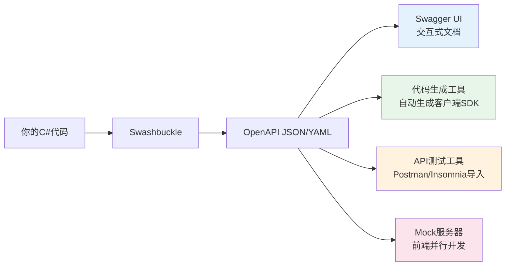
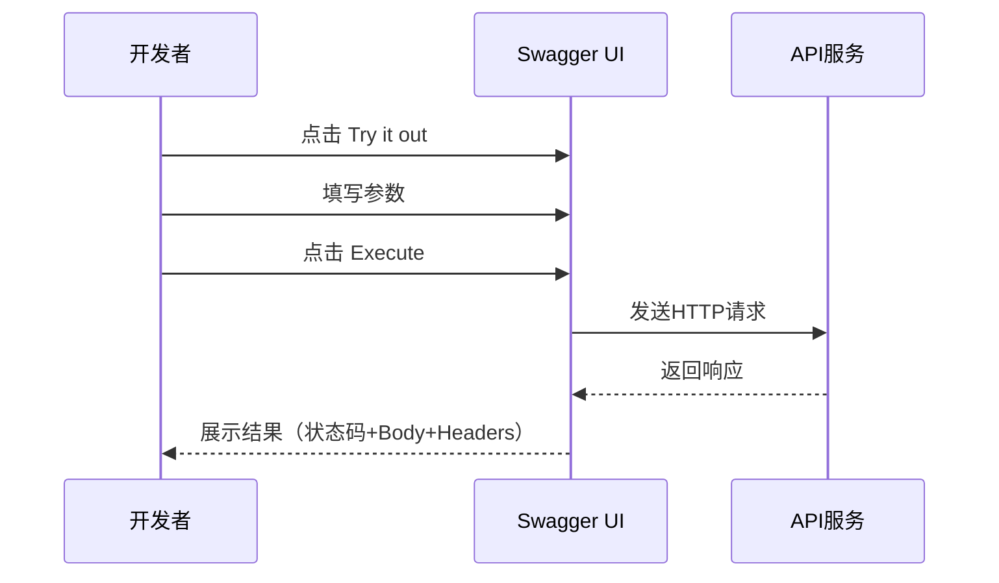

# Swagger/OpenAPI集成

> **学习目标**：掌握Swagger/OpenAPI的配置和使用，能够为API生成交互式文档、支持认证测试、实现多版本分组
>
> **前置知识**：API控制器开发基础、HTTP协议基础
>
> **预计时长**：45-60分钟

---

## 一、OpenAPI规范概述

### 1.1 什么是OpenAPI？

OpenAPI（原称Swagger Specification）是一种用于描述RESTful API的**语言无关的接口描述规范**。它允许你用JSON或YAML格式定义API的：

- 端点路径和HTTP方法
- 请求参数（路径、查询、头、请求体）
- 响应格式和状态码
- 认证方式
- 数据模型定义



### 1.2 为什么需要API文档？

| 场景 | 没有文档 | 有Swagger文档 |
|------|---------|---------------|
| 前端对接 | 口头沟通+反复确认 | 直接查看文档+在线测试 |
| 新人入职 | 阅读源码理解接口 | 浏览文档快速上手 |
| 第三方集成 | 编写Word/Confluence文档 | 自动生成，始终同步 |
| 接口调试 | Postman手动输入 | Swagger UI直接Try it out |
| SDK生成 | 手写客户端代码 | 根据规范自动生成 |

---

## 二、Swashbuckle.AspNetCore 安装与配置

### 2.1 安装NuGet包

```bash
# 安装Swashbuckle.AspNetCore（包含核心功能）
dotnet add package Swashbuckle.AspNetCore

# 如果需要更多功能（如注解增强），可安装：
# dotnet add package Swashbuckle.AspNetCore.Filters
# dotnet add package Swashbuckle.AspNetCore.Newtonsoft
```

### 2.2 基础配置（Program.cs）

```csharp
using Microsoft.OpenApi.Models;

var builder = WebApplication.CreateBuilder(args);

// ========== 1. 注册服务 ==========
builder.Services.AddControllers();

// 配置Swagger
builder.Services.AddEndpointsApiExplorer(); // 生成端点信息

builder.Services.AddSwaggerGen(options =>
{
    // Swagger文档基本信息
    options.SwaggerDoc("v1", new OpenApiInfo
    {
        Title = "我的企业级API",
        Version = "v1",
        Description = "这是一个使用ASP.NET Core构建的企业级RESTful API示例项目",
        Contact = new OpenApiContact
        {
            Name = "技术支持",
            Email = "support@example.com",
            Url = new Uri("https://example.com/support")
        },
        License = new OpenApiLicense
        {
            Name = "MIT License",
            Url = new Uri("https://opensource.org/licenses/MIT")
        }
    });

    // 启用XML注释（为Swagger提供详细文档）
    var xmlFile = $"{Assembly.GetExecutingAssembly().GetName().Name}.xml";
    var xmlPath = Path.Combine(AppContext.BaseDirectory, xmlFile);
    if (File.Exists(xmlPath))
    {
        options.IncludeXmlComments(xmlPath, includeControllerXmlComments: true);
    }

    // 使用JWT Bearer认证
    options.AddSecurityDefinition("Bearer", new OpenApiSecurityScheme
    {
        Name = "Authorization",
        Type = SecuritySchemeType.Http,
        Scheme = "bearer",
        BearerFormat = "JWT",
        In = ParameterLocation.Header,
        Description = "请输入JWT Token（格式: Bearer {token}）"
    });

    options.AddSecurityRequirement(new OpenApiSecurityRequirement
    {
        {
            new OpenApiSecurityScheme
            {
                Reference = new OpenApiReference
                {
                    Type = ReferenceType.SecurityScheme,
                    Id = "Bearer"
                }
            },
            Array.Empty<string>()
        }
    });
});

// JWT认证服务
builder.Services.AddAuthentication(JwtBearerDefaults.AuthenticationScheme)
    .AddJwtBearer(options =>
    {
        options.TokenValidationParameters = new TokenValidationParameters
        {
            ValidateIssuer = true,
            ValidIssuer = builder.Configuration["Jwt:Issuer"],
            ValidateAudience = true,
            ValidAudience = builder.Configuration["Jwt:Audience"],
            ValidateLifetime = true,
            IssuerSigningKey = new SymmetricSecurityKey(
                Encoding.UTF8.GetBytes(builder.Configuration["Jwt:Secret"]!))
        };
    });

var app = builder.Build();

// ========== 2. 配置中间件管道 ==========

if (app.Environment.IsDevelopment())
{
    // 开发环境启用Swagger
    app.UseSwagger();
    app.UseSwaggerUI(options =>
    {
        options.SwaggerEndpoint("/swagger/v1/swagger.json", "我的API V1");
        options.RoutePrefix = "swagger"; // 访问路径 /swagger
        options.DocumentTitle = "API文档 - 我的企业级API";
        // 自定义UI设置
        options.DisplayRequestDuration(); // 显示请求耗时
        options.EnableDeepLinking();      // 支持直接链接到特定操作
        options.DefaultModelsExpandDepth(-1); // 默认折叠模型
        options.DefaultModelRendering(ModelRendering.Model);
    });
}

app.UseHttpsRedirection();
app.UseAuthentication();
app.UseAuthorization();
app.MapControllers();

app.Run();
```

### 2.3 启用XML注释文件

在 `.csproj` 文件中添加以下配置以生成XML文档文件：

```xml
<Project Sdk="Microsoft.NET.Sdk.Web">

  <PropertyGroup>
    <TargetFramework>net8.0</TargetFramework>
    <Nullable>enable</Nullable>
    <ImplicitUsings>enable</ImplicitUsings>

    <!-- 启用XML文档文件生成 -->
    <GenerateDocumentationFile>true</GenerateDocumentationFile>

    <!-- 取消警告1591（缺少公共类型/成员的XML注释） -->
    <NoWarn>$(NoWarn);1591</NoWarn>
  </PropertyGroup>

  <ItemGroup>
    <PackageReference Include="Swashbuckle.AspNetCore" Version="6.5.0" />
  </ItemGroup>

</Project>
```

---

## 三、Swagger UI功能详解

启动项目后访问 `https://localhost:{port}/swagger`，你将看到交互式API文档界面：

### 3.1 UI主要功能区

```
┌─────────────────────────────────────────────────────────────┐
│  我的企业级API v1                              [🔒 Authorize] │
│  这是一个使用ASP.NET Core构建的企业级RESTful API...          │
├─────────────────────────────────────────────────────────────┤
│                                                             │
│  ▼ Users [用户管理]                                         │
│    POST /api/v1/users - 创建用户                    [Try it] │
│      创建新用户，需要提供用户名、邮箱等信息                     │
│                                                             │
│    GET /api/v1/users - 获取用户列表                  [Try it] │
│      获取用户分页列表，支持关键词搜索                           │
│                                                             │
│    GET /api/v1/users/{id} - 获取用户详情             [Try it] │
│                                                             │
│  ▼ Products [商品管理]                                       │
│    ...                                                       │
│                                                             │
└─────────────────────────────────────────────────────────────┘
```

### 3.2 Try it out 功能

点击任意API的 **[Try it out]** 按钮，可以：

1. **填写参数** - 自动显示参数说明和示例值
2. **发送请求** - 直接从浏览器调用API
3. **查看响应** - 显示状态码、响应体、响应头
4. **查看Curl命令** - 可复制curl命令在其他环境使用



---

## 四、多版本API的Swagger分组

当API有多个版本时，可以为每个版本创建独立的Swagger文档：

### 4.1 多版本配置

```csharp
// Program.cs
builder.Services.AddSwaggerGen(options =>
{
    // V1版本文档
    options.SwaggerDoc("v1", new OpenApiInfo
    {
        Title = "我的API - V1版本",
        Version = "v1",
        Description = "V1版本的API（稳定版）"
    });

    // V2版本文档
    options.SwaggerDoc("v2", new OpenApiInfo
    {
        Title = "我的API - V2版本",
        Version = "v2",
        Description = "V2版本的API（最新版，包含新功能）"
    });

    // XML注释
    var xmlFile = $"{Assembly.GetExecutingAssembly().GetName().Name}.xml";
    var xmlPath = Path.Combine(AppContext.BaseDirectory, xmlFile);
    if (File.Exists(xmlPath))
    {
        options.IncludeXmlComments(xmlPath, includeControllerXmlComments: true);
    }

    // JWT认证
    options.AddSecurityDefinition("Bearer", new OpenApiSecurityScheme
    {
        Name = "Authorization",
        Type = SecuritySchemeType.Http,
        Scheme = "bearer",
        BearerFormat = "JWT",
        In = ParameterLocation.Header,
        Description = "JWT Authorization header using the Bearer scheme."
    });
    options.AddSecurityRequirement(new OpenApiSecurityRequirement
    {
        {
            new OpenApiSecurityScheme
            {
                Reference = new OpenApiReference
                {
                    Type = ReferenceType.SecurityScheme,
                    Id = "Bearer"
                }
            },
            Array.Empty<string>()
        }
    });
});

// 中间件配置
if (app.Environment.IsDevelopment())
{
    app.UseSwagger();
    app.UseSwaggerUI(options =>
    {
        options.SwaggerEndpoint("/swagger/v1/swagger.json", "API V1");
        options.SwaggerEndpoint("/swagger/v2/swagger.json", "API V2");

        // 下拉选择器
        options.ConfigObjectUrls = new Dictionary<string, string?>
        {
            { "/swagger/v1/swagger.json", null },
            { "/swagger/v2/swagger.json", null }
        };
    });
}
```

### 4.2 多版本控制器配合

```csharp
namespace ApiDemo.Controllers.V1;

/// <summary>
/// 用户管理API V1版本
/// </summary>
[ApiController]
[ApiVersion("1.0")]
[Route("api/v{version:apiVersion}/users")]
[Produces("application/json")]
public class UsersControllerV1 : ControllerBase
{
    /// <summary>V1: 获取用户（返回基本字段）</summary>
    [HttpGet("{id}")]
    [MapToApiVersion("1.0")]
    public async Task<ActionResult<UserV1Dto>> GetUserV1(int id)
    {
        // V1逻辑：只返回基本字段
        return Ok(new UserV1Dto { Id = id, Name = "张三" });
    }
}

namespace ApiDemo.Controllers.V2;

/// <summary>
/// 用户管理API V2版本
/// </summary>
[ApiController]
[ApiVersion("2.0")]
[Route("api/v{version:apiVersion}/users")]
[Produces("application/json")]
public class UsersControllerV2 : ControllerBase
{
    /// <summary>V2: 获取用户（返回扩展字段）</summary>
    [HttpGet("{id}")]
    [MapToApiVersion("2.0")]
    public async Task<ActionResult<UserV2Dto>> GetUserV2(int id)
    {
        // V2逻辑：返回更多信息
        return Ok(new UserV2Dto
        {
            Id = id,
            Name = "张三",
            AvatarUrl = "/avatars/zhangsan.jpg",
            LastLoginAt = DateTime.UtcNow,
            ProfileCompletion = 85
        });
    }
}
```

---

## 五、JWT Bearer Token认证集成

让Swagger UI支持JWT认证，可以直接在文档界面进行带Token的API测试：

### 5.1 完整的JWT + Swagger配置

```csharp
// ========== JWT认证配置 ==========
var jwtConfig = builder.Configuration.GetSection("Jwt");

builder.Services.AddAuthentication(options =>
{
    options.DefaultAuthenticateScheme = JwtBearerDefaults.AuthenticationScheme;
    options.DefaultChallengeScheme = JwtBearerDefaults.AuthenticationScheme;
})
.AddJwtBearer(options =>
{
    options.TokenValidationParameters = new TokenValidationParameters
    {
        ValidateIssuer = true,
        ValidIssuer = jwtConfig["Issuer"],
        ValidateAudience = true,
        ValidAudience = jwtConfig["Audience"],
        ValidateLifetime = true,
        ClockSkew = TimeSpan.Zero,
        IssuerSigningKey = new SymmetricSecurityKey(
            Encoding.UTF8.GetBytes(jwtConfig["Secret"]!))
    };

    // Swagger UI中的事件处理
    options.Events = new JwtBearerEvents
    {
        OnAuthenticationFailed = context =>
        {
            context.NoResult();
            context.Response.StatusCode = StatusCodes.Status401Unauthorized;
            context.Response.ContentType = "application/json";
            return context.Response.WriteAsync(JsonSerializer.Serialize(new
                { error = "认证失败", message = context.Exception.Message }));
        },
        OnForbidden = context =>
        {
            context.Response.StatusCode = StatusCodes.Status403Forbidden;
            context.Response.ContentType = "application/json";
            return context.Response.WriteAsync(JsonSerializer.Serialize(new
                { error = "无权限访问此资源" }));
        }
    };
});

// ========== Swagger配置（含JWT）==========
builder.Services.AddSwaggerGen(options =>
{
    options.SwaggerDoc("v1", new OpenApiInfo
    {
        Title = "安全API文档",
        Version = "v1",
        Description = "支持JWT Bearer Token认证的API文档"
    });

    // JWT安全定义
    options.AddSecurityDefinition("Bearer", new OpenApiSecurityScheme
    {
        Name = "Authorization",
        Type = SecuritySchemeType.Http,
        Scheme = "bearer",
        BearerFormat = "JWT",
        In = ParameterLocation.Header,
        Description = @"
### JWT Bearer Token 认证

**获取方式**: 调用 `POST /api/v1/auth/login` 获取token

**输入格式**: `eyJhbGciOiJIUzI1NiIs...`

**注意**: 不需要输入 `Bearer` 前缀，系统会自动添加"
    });

    // 全局应用安全要求
    options.AddSecurityRequirement(new OpenApiSecurityRequirement
    {
        {
            new OpenApiSecurityScheme
            {
                Reference = new OpenApiReference
                {
                    Type = ReferenceType.SecurityScheme,
                    Id = "Bearer"
                }
            },
            Array.Empty<string>()
        }
    });

    // XML注释
    var xmlFile = $"{Assembly.GetExecutingAssembly().GetName().Name}.xml";
    var xmlPath = Path.Combine(AppContext.BaseDirectory, xmlFile);
    if (File.Exists(xmlPath))
        options.IncludeXmlComments(xmlPath, includeControllerXmlComments: true);

    // 使用Schema过滤器处理枚举显示为字符串
    options.SchemaFilter<EnumSchemaFilter>();

    // 操作过滤器处理无认证标记的接口
    options.OperationFilter<AuthOperationFilter>();
});
```

### 5.2 自定义操作过滤器

```csharp
/// <summary>
/// 过滤不需要认证的接口，不显示锁图标
/// </summary>
public class AuthOperationFilter : IOperationFilter
{
    public void Apply(OpenApiOperation operation, OperationFilterContext context)
    {
        // 检查action是否带有 [AllowAnonymous] 特性
        var isAnonymous = context.ApiDescription.CustomAttributes()
            .Any(a => a is AllowAnonymousAttribute);

        if (!isAnonymous)
        {
            operation.Responses.TryAdd("401", new OpenApiResponse
            {
                Description = "未认证（需要登录）"
            });
            operation.Responses.TryAdd("403", new OpenApiResponse
            {
                Description = "无权限访问"
            });
        }
    }
}

/// <summary>
/// 枚举Schema过滤器 - 让枚举在Swagger中显示为字符串而非数字
/// </summary>
public class EnumSchemaFilter : ISchemaFilter
{
    public void Apply(OpenSchema schema, SchemaFilterContext context)
    {
        if (context.Type.IsEnum)
        {
            schema.Enum = Enum.GetNames(context.Type);
            schema.Type = "string";
        }
    }
}
```

### 5.3 登录接口示例（获取Token）

```csharp
/// <summary>
/// 认证控制器
/// </summary>
[ApiController]
[Route("api/v{version:apiVersion}/auth")]
[AllowAnonymous] // 允许匿名访问
public class AuthController : ControllerBase
{
    private readonly IConfiguration _config;

    public AuthController(IConfiguration config)
    {
        _config = config;
    }

    /// <summary>
    /// 用户登录获取JWT Token
    /// </summary>
    /// <param name="request">登录凭据</param>
    /// <returns>JWT Token信息</returns>
    /// <response code="200">登录成功</response>
    /// <response code="401">用户名或密码错误</response>
    [HttpPost("login")]
    [ProducesResponseType(typeof(AuthResponseDto), 200)]
    [ProducesResponseType(401)]
    public ActionResult<AuthResponseDto> Login([FromBody] LoginRequest request)
    {
        // TODO: 验证用户凭据（查数据库）
        // 这里仅作演示
        if (request.Username != "admin" || request.Password != "admin123")
        {
            return Unauthorized(new { error = "用户名或密码错误" });
        }

        // 生成JWT Token
        var token = GenerateJwtToken(request.Username);

        return Ok(new AuthResponseDto
        {
            AccessToken = token,
            TokenType = "Bearer",
            ExpiresIn = 3600, // 1小时
            Username = request.Username
        });
    }

    private string GenerateJwtToken(string username)
    {
        var key = new SymmetricSecurityKey(
            Encoding.UTF8.GetBytes(_config["Jwt:Secret"]!));
        var creds = new SigningCredentials(key, SecurityAlgorithms.HmacSha256);

        var claims = new[]
        {
            new Claim(ClaimTypes.NameIdentifier, "1"),
            new Claim(ClaimTypes.Name, username),
            new Claim(ClaimTypes.Role, "Admin")
        };

        var token = new JwtSecurityToken(
            issuer: _config["Jwt:Issuer"],
            audience: _config["Jwt:Audience"],
            claims: claims,
            expires: DateTime.UtcNow.AddHours(1),
            signingCredentials: creds);

        return new JwtSecurityTokenHandler().WriteToken(token);
    }
}

// DTOs
public record LoginRequest(
    [Required] string Username,
    [Required] string Password
);

public record AuthResponseDto(
    string AccessToken,
    string TokenType,
    int ExpiresIn,
    string Username
);
```

---

## 六、生产环境禁用Swagger

**重要**：生产环境绝对不能暴露Swagger文档！这会泄露API结构信息给攻击者。

### 6.1 基于环境的条件启用

```csharp
var app = builder.Build();

// 只在开发和Staging环境启用Swagger
if (app.Environment.IsDevelopment() || app.Environment.EnvironmentName == "Staging")
{
    app.UseSwagger();
    app.UseSwaggerUI(options =>
    {
        options.SwaggerEndpoint("/swagger/v1/swagger.json", "My API V1");
        options.RoutePrefix = "swagger";
    });
}
else
{
    // 生产环境：如果有人访问swagger，返回404
    app.MapGet("/swagger/{*path}", () => Results.NotFound());
    app.MapGet("/swagger", () => Results.NotFound());

    // 或者更严格：记录可疑访问
    app.MapWhen(context => context.Request.Path.StartsWithSegments("/swagger"),
        appBuilder =>
        {
            appBuilder.Run(async context =>
            {
                var logger = context.RequestServices
                    .GetRequiredService<ILogger<Program>>();
                logger.LogWarning("检测到对Swagger的可疑访问: {RemoteIpAddress}",
                    context.Connection.RemoteIpAddress);
                context.Response.StatusCode = 404;
            });
        });
}
```

### 6.2 更灵活的环境控制方案

```csharp
// appsettings.json
{
  "SwaggerSettings": {
    "Enabled": false,
    "RequireAuthorization": true,
    "AllowedIps": []
  }
}

// appsettings.Development.json
{
  "SwaggerSettings": {
    "Enabled": true,
    "RequireAuthorization": false,
    "AllowedIps": ["127.0.0.1", "::1"]
  }
}

// Program.cs 中使用
var swaggerSettings = builder.Configuration
    .GetSection("SwaggerSettings").Get<SwaggerSettings>();

if (swaggerSettings?.Enabled == true)
{
    app.UseSwagger();

    if (swaggerSettings.RequireAuthorization)
    {
        // 添加简单的Basic Auth保护
        app.UseMiddleware<SwaggerAuthMiddleware>();
    }

    app.UseSwaggerUI(/* ... */);
}
```

---

## 七、NSwag替代方案简介

除了Swashbuckle，NSwag是另一个流行的选择：

| 特性 | Swashbuckle | NSwag |
|------|------------|-------|
| 维护活跃度 | 高 | 中等 |
| TypeScript客户端生成 | 需要额外工具 | 内置支持 |
| Angular客户端生成 | 需要额外工具 | 内置支持 |
| C#客户端生成 | 需要NSwag Studio | 内置支持 |
| 配置复杂度 | 较简单 | 较复杂 |
| 社区生态 | 更大 | 较小 |

```bash
# 安装NSwag
dotnet add package NSwag.AspNetCore
```

```csharp
// NSwag基本配置
builder.Services.AddOpenApiDocument(options =>
{
    options.Title = "My API (NSwag)";
    options.Version = "v1";
    options.DocumentProcessors.Add(new SecurityDefinitionProcessor("JWT",
        new OpenApiSecurityScheme
        {
            Type = OpenApiSecuritySchemeType.ApiKey,
            Name = "Authorization",
            In = OpenApiSecurityApiKeyLocation.Header,
            Description = "JWT Token"
        }));

    options.OperationProcessors.Add(new AspNetCoreOperationSecurityScopeProcessor("JWT"));
});

if (app.Environment.IsDevelopment())
{
    app.UseOpenApi();
    app.UseSwaggerUi3();
    // 还可以使用 UseSwaggerUi 或 UseReDoc
}
```

---

## 八、完整的生产级Swagger配置

下面是一个完整的生产级配置模板，可以直接复制使用：

```csharp
// ========== SwaggerServiceExtensions.cs ==========

using System.Reflection;
using Microsoft.OpenApi.Models;

namespace ApiDemo.Extensions;

public static class SwaggerServiceExtensions
{
    public static IServiceCollection AddCustomSwagger(
        this IServiceCollection services,
        IConfiguration configuration)
    {
        var apiInfo = configuration.GetSection("ApiInfo");

        services.AddSwaggerGen(options =>
        {
            // ====== 文档信息 ======
            options.SwaggerDoc("v1", new OpenApiInfo
            {
                Title = apiInfo["Title"] ?? "My API",
                Version = apiInfo["Version"] ?? "v1",
                Description = apiInfo["Description"] ?? "",
                TermsOfService = new Uri(apiInfo["TermsOfService"]!),

                Contact = new OpenApiContact
                {
                    Name = apiInfo["Contact:Name"],
                    Email = apiInfo["Contact:Email"],
                    Url = new Uri(apiInfo["Contact:Url"]!)
                },

                License = new OpenApiLicense
                {
                    Name = apiInfo["License:Name"] ?? "MIT",
                    Url = new Uri(apiInfo["License:Url"]!)
                }
            });

            // ====== XML注释 ======
            var xmlFilename = $"{Assembly.GetExecutingAssembly().GetName().Name}.xml";
            var xmlPath = Path.Combine(AppContext.BaseDirectory, xmlFilename);
            if (File.Exists(xmlPath))
            {
                options.IncludeXmlComments(xmlPath, includeControllerXmlComments: true);
            }

            // ====== JWT认证 ======
            options.AddSecurityDefinition("Bearer", new OpenApiSecurityScheme
            {
                Name = "Authorization",
                Type = SecuritySchemeType.Http,
                Scheme = "bearer",
                BearerFormat = "JWT",
                In = ParameterLocation.Header,
                Description = @"
## JWT Bearer Token 认证

**步骤**:
1. 先调用 `POST /api/v1/auth/login` 获取Token
2. 点击下方 **Authorize** 按钮
3. 输入: `your_token_here`
4. 点击 **Authorize** 确认

**注意**: 无需输入 `Bearer` 前缀"
            });

            options.AddSecurityRequirement(new OpenApiSecurityRequirement
            {
                {
                    new OpenApiSecurityScheme
                    {
                        Reference = new OpenApiReference
                        {
                            Type = ReferenceType.SecurityScheme,
                            Id = "Bearer"
                        }
                    },
                    Array.Empty<string>()
                }
            });

            // ====== 过滤器 ======
            options.SchemaFilter<EnumSchemaFilter>();       // 枚举转字符串
            options.OperationFilter<AuthOperationFilter>();  // 处理认证标注
            options.DocumentFilter<SortEndpointsFilter>();   // 排序端点

            // ====== 顺序配置 ======
            options.OrderActionsBy(apiDesc =>
            {
                var httpMethod = apiDesc.HttpMethod?.ToUpper() ?? "";
                var order = httpMethod switch
                {
                    "GET" => 1,
                    "POST" => 2,
                    "PUT" => 3,
                    "PATCH" => 4,
                    "DELETE" => 5,
                    _ => 6
                };
                return $"{order}-{apiDesc.RelativePath}";
            });
        });

        return services;
    }

    public static WebApplication UseCustomSwagger(this WebApplication app)
    {
        var isDevOrStaging =
            app.Environment.IsDevelopment() ||
            app.Environment.EnvironmentName == "Staging";

        if (isDevOrStaging)
        {
            app.UseSwagger(options =>
            {
                options.PreSerializeFilters.Add((swagger, httpReq) =>
                {
                    // 动态修改服务器地址（解决Docker/K8s部署问题）
                    swagger.Servers = new List<OpenApiServer>
                    {
                        new OpenApiServer { Url = $"{httpReq.Scheme}://{httpReq.Host.Value}" }
                    };
                });
            });

            app.UseSwaggerUI(options =>
            {
                options.SwaggerEndpoint("/swagger/v1/swagger.json", "My API V1");
                options.RoutePrefix = "swagger";
                options.DocumentTitle = "API Documentation";
                options.DisplayRequestDuration();
                options.EnableDeepLinking();
                options.DefaultModelsExpandDepth(1);
                options.DefaultModelExpandDepth(3);
                options.DisplayOperationId(false);

                // 自定义主题颜色
                options.InjectJavascript("/swagger/custom-theme.js");
                options.InjectStylesheet("/swagger/custom-styles.css");
            });
        }

        return app;
    }
}

// ========== 使用方式 ==========

// Program.cs
var builder = WebApplication.CreateBuilder(args);

builder.Services.AddControllers();
builder.Services.AddCustomSwagger(builder.Configuration); // 一行搞定！

var app = builder.Build();

app.UseCustomSwagger(); // 一行搞定！

app.Run();
```

---

## 九、DO/DON'T 清单

| 场景 | DO (推荐) | DON'T (避免) |
|------|-----------|-------------|
| 生产环境 | 禁用Swagger中间件 | 在生产环境暴露 `/swagger` |
| XML注释 | 为公开API编写详细注释 | 让Swagger文档空空如也 |
| 认证 | 集成JWT Bearer支持 | 忽略认证，导致无法测试需授权接口 |
| 版本管理 | 多版本分别配置Swagger文档 | 所有版本混在一起 |
| 敏感信息 | 不要在Swagger中暴露内部字段 | 将内部实体直接暴露给文档 |
| 安全 | 保护Swagger页面（至少在非本地环境） | 允许公网匿名访问Swagger |
| 示例值 | 使用 `[example]` 注解提供示例 | 让参数没有默认示例值 |

---

## 十、总结

| 要点 | 内容 |
|------|------|
| OpenAPI | 语言无关的API描述规范，JSON/YAML格式 |
| Swashbuckle | ASP.NET Core最流行的OpenAPI实现 |
| 配置步骤 | AddSwaggerGen -> AddSwaggerGen配置 -> UseSwagger -> UseSwaggerUI |
| XML注释 | 启用后自动生成详细文档 |
| JWT集成 | AddSecurityDefinition + AddSecurityRequirement |
| 多版本 | 多个SwaggerDoc + 多个SwaggerEndpoint |
| 生产环境 | 条件判断Environment，禁止暴露Swagger |

---

## 练习题

### 练习1：基础配置
在一个新的ASP.NET Core项目中完成Swagger的基础配置：
1. 安装必要的NuGet包
2. 配置Program.cs
3. 启用XML注释
4. 验证能正常访问Swagger UI

### 练习2：JWT认证集成
为一个已有JWT认证的项目添加Swagger认证支持：
1. 配置SecurityDefinition
2. 配置SecurityRequirement
3. 创建一个Login接口获取Token
4. 在Swagger中测试带Token的请求

### 练习3：多版本配置
假设你有V1和V2两个版本的API：
1. 配置两个Swagger文档
2. 配置SwaggerUI下拉切换
3. 为不同版本设置不同的描述信息

### 练习4：自定义过滤器
实现一个操作过滤器，满足以下需求：
- 带 `[HttpGet]` 的接口显示绿色标签
- 带 `[HttpPost]` 的接口显示蓝色标签
- 其他方法显示灰色标签

### 练习5：生产环境配置
设计一个完整的Swagger生产环境策略：
1. 如何根据环境变量控制开关
2. 如何保护非本地的Swagger访问
3. 如何记录异常访问日志

---

### 参考答案要点

**练习1答案要点**：
- `dotnet add package Swashbuckle.AspNetCore`
- `.csproj` 中 `<GenerateDocumentationFile>true</GenerateDocumentationFile>`
- `AddSwaggerGen()` 配置 OpenApiInfo
- `UseSwagger()` + `UseSwaggerUI()`
- 访问 `http://localhost:xxxx/swagger`

**练习2答案要点**：
- `options.AddSecurityDefinition("Bearer", ...)` 定义认证方案
- `options.AddSecurityRequirement(...)` 应用到所有接口
- Login接口加 `[AllowAnonymous]`
- 在Swagger UI中点 Authorize -> 输入 Token -> 测试

**练习3答案要点**：
- `options.SwaggerDoc("v1", ...)` 和 `options.SwaggerDoc("v2", ...)`
- `options.SwaggerEndpoint("/swagger/v1/swagger.json", "V1")`
- `options.SwaggerEndpoint("/swagger/v2/swagger.json", "V2")`
- 控制器中使用 `[ApiVersion("1.0")]` 和 `[MapToApiVersion]`

**练习4答案要点**：
- 实现 `IOperationFilter` 接口
- 在 `Apply` 方法中检查 `context.ApiDescription.HttpMethod`
- 根据 HTTP 方法设置不同的 `operation.Tags` 或 `operation.Summary` 前缀

**练习5答案要点**：
- `app.Environment.IsDevelopment()` 判断
- 中间件检查 RemoteIpAddress 或自定义Header
- ILogger 记录访问日志
- 返回 404 或重定向到首页

---

## 延伸阅读

- [Swashbuckle GitHub](https://github.com/domaindrivendev/Swashbuckle.AspNetCore) - 官方仓库和文档
- [OpenAPI 3.0 规范](https://spec.openapis.org/oas/v3.0.3) - OpenAPI官方规范
- [NSwag 文档](https://github.com/RicoSuter/NSwag) - NSwag替代方案
- [Swagger Editor](https://editor.swagger.io/) - 在线编辑和验证OpenAPI规范

---

## 上下节导航

- **上一节**：[API控制器开发](02-API控制器开发.md)
- **下一节**：[API版本控制](04-API版本控制.md) - 学习如何管理和演进多个版本的API
