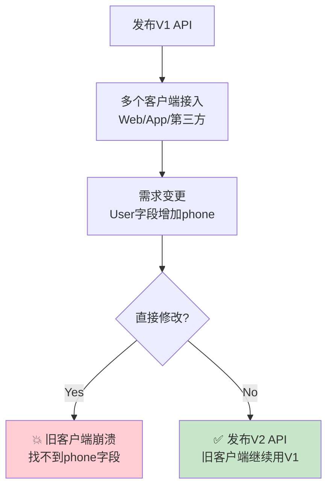
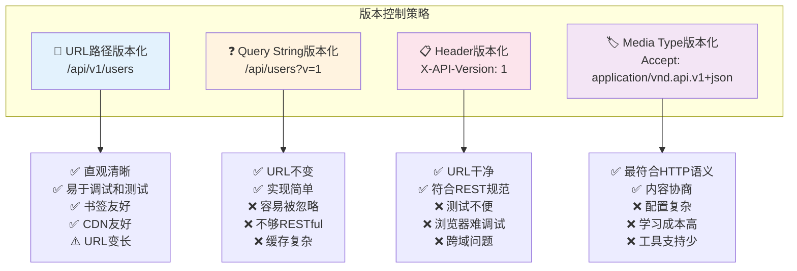
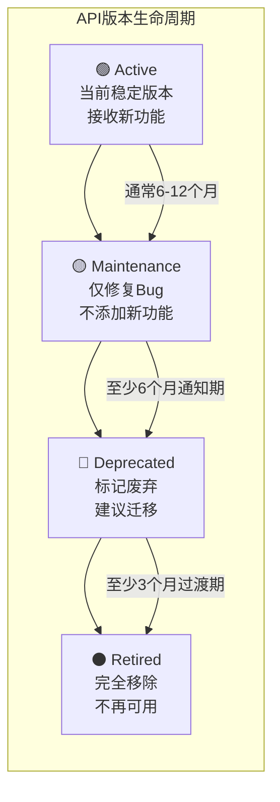
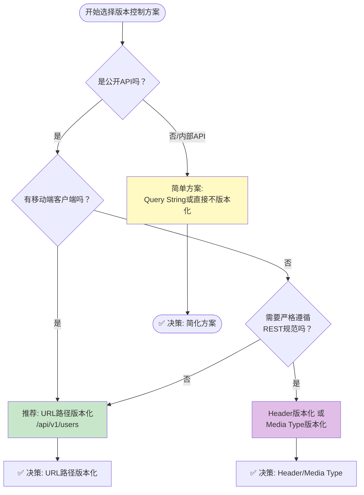

# API版本控制

> **学习目标**：理解API版本控制的必要性，掌握多种版本控制策略的实现方式，能够设计可演进的多版本API架构
>
> **前置知识**：REST原则、API控制器开发、依赖注入
>
> **预计时长**：60-90分钟

---

## 一、为什么需要API版本控制？

### 1.1 现实场景

想象一下这个场景：



**没有版本控制的后果**：
- 修改API可能破坏已有客户端
- 无法同时支持新旧客户端
- 前后端无法独立部署
- 第三方集成方无法平滑升级

### 1.2 版本控制的核心价值

| 价值 | 说明 |
|------|------|
| **向后兼容** | 旧客户端不受新API影响 |
| **渐进式升级** | 客户端按自己的节奏迁移 |
| **独立部署** | 后端可以随时发布新功能 |
| **风险隔离** | 新功能在新版本中验证，不影响稳定版 |
| **生命周期管理** | 可以标记、废弃、移除旧版本 |

---

## 二、四种版本控制策略对比

### 2.1 策略总览



### 2.2 详细对比表

| 特性 | URL路径 | Query String | Header | Media Type |
|------|---------|-------------|--------|------------|
| **实现难度** | 简单 | 最简单 | 中等 | 复杂 |
| **直观性** | 高（URL可见） | 中（参数可见） | 低（不可见） | 低（不可见） |
| **缓存友好** | 是（不同URL） | 否（同URL不同响应） | 需配置Vary头 | 需配置Vary头 |
| **浏览器调试** | 方便 | 方便 | 不方便 | 不方便 |
| **REST纯度** | 一般 | 较低 | 高 | 最高 |
| **业界采用率** | 最高（推荐） | 中等 | 中等 | 较低 |
| **代表案例** | GitHub, Azure, Stripe | 很多内部API | GitHub(部分), AWS | GitHub API v3, PayPal |

### 2.3 推荐策略：URL路径版本化

**对于大多数项目，强烈推荐使用URL路径版本化**。原因：
1. 最直观 - 开发者一眼就能看出调用的是哪个版本
2. 最易调试 - 直接在地址栏就能切换版本
3. 最易文档化 - Swagger天然支持多版本分组
4. 业界最广泛使用 - GitHub、Microsoft Graph、Stripe等都用这种方式

---

## 三、URL路径版本化完整实现

### 3.1 安装NuGet包

```bash
# 核心版本控制包
dotnet add package Asp.Versioning.Mvc

# 如果需要UrlSegment版本化方式
dotnet add package Asp.Versioning.Mvc.ApiExplorer
# (Asp.Versioning.Mvc 已经包含了这个)
```

### 3.2 Program.cs 基础配置

```csharp
using Asp.Versioning;

var builder = WebApplication.CreateBuilder(args);

// ========== 注册服务 ==========

builder.Services.AddControllers();

// 配置API版本控制
builder.Services.AddApiVersioning(options =>
{
    // 默认API版本（当请求未指定版本时使用）
    options.DefaultApiVersion = new ApiVersion(1, 0);

    // 当请求未指定版本时，是否假设使用默认版本
    // true: 未指定版本时使用默认版本，不报错
    // false: 未指定版本时返回400错误
    options.AssumeDefaultVersionWhenUnspecified = true;

    // 在响应头中报告支持的API版本
    // 响应头: api-supported-versions: 1.0, 2.0, 3.0
    // 响应头: api-deprecated-versions: 1.0
    options.ReportApiVersions = true;

    // 读取版本的来源（可以组合使用）
    options.ApiVersionReader = ApiVersionReader.Combine(
        new UrlSegmentApiVersionReader(),      // 从URL路径读取 /api/v1/
        new HeaderApiVersionReader("X-API-Version"), // 从Header读取
        new QueryStringApiVersionReader("api-version") // 从Query读取
    );

    // 未指定版本时的错误响应
    options.UnsupportedApiResponse =
        new UnsupportedApiResponse
        {
            ErrorCode = "UNSUPPORTED_API_VERSION",
            Message = "请求的API版本不支持。请使用以下版本之一："
        };
})
// 添加API Explorer（用于Swagger多版本支持）
.AddApiExplorer(options =>
{
    // 格式化版本字符串（用于Swagger分组名称）
    options.GroupNameFormat = "'v'VVV";

    // 用版本替换URL中的version参数
    options.SubstituteApiVersionInUrl = true;
});

var app = builder.Build();

// 配置中间件
app.UseHttpsRedirection();
app.UseAuthorization();
app.MapControllers();

app.Run();
```

### 3.3 版本化控制器实现

```csharp
using Asp.Versioning;
using Microsoft.AspNetCore.Mvc;
using Microsoft.AspNetCore.Authorization;

namespace ApiDemo.Controllers.V1;

/// <summary>
/// 用户管理API V1版本
/// </summary>
[ApiController]
[ApiVersion("1.0")]                    // 支持的版本
[Route("api/v{version:apiVersion}/users")] // 路由模板包含版本占位符
[Produces("application/json")]
public class UsersControllerV1 : ControllerBase
{
    private readonly IUserService _userService;
    private readonly ILogger<UsersControllerV1> _logger;

    public UsersControllerV1(
        IUserService userService,
        ILogger<UsersControllerV1> logger)
    {
        _userService = userService;
        _logger = logger;
    }

    /// <summary>
    /// 获取用户列表（V1）
    /// </summary>
    /// <remarks>V1版本只返回基本用户信息</remarks>
    [HttpGet]
    [MapToApiVersion("1.0")]  // 将此action映射到V1
    [ProducesResponseType(typeof(PagedResult<UserV1Dto>), 200)]
    public async Task<ActionResult<PagedResult<UserV1Dto>>> GetUsersV1(
        [FromQuery] UserQueryParams queryParams)
    {
        _logger.LogInformation("V1: 获取用户列表");
        var result = await _userService.GetPagedAsyncV1(queryParams);
        return Ok(result);
    }

    /// <summary>
    /// 获取用户详情（V1）
    /// </summary>
    [HttpGet("{id:int}")]
    [MapToApiVersion("1.0")]
    [ProducesResponseType(typeof(UserV1Dto), 200)]
    [ProducesResponseType(404)]
    public async Task<ActionResult<UserV1Dto>> GetUserByIdV1(int id)
    {
        var user = await _userService.GetByIdV1Async(id);
        if (user is null)
            return NotFound(new { message = $"用户 {id} 不存在" });

        return Ok(user); // V1: 只返回基本信息
    }

    /// <summary>
    /// 创建用户（V1）
    /// </summary>
    [HttpPost]
    [MapToApiVersion("1.0")]
    [ProducesResponseType(typeof(UserV1Dto), 201)]
    [ProducesResponseType(typeof(ValidationProblemDetails), 400)]
    public async Task<ActionResult<UserV1Dto>> CreateUserV1(
        [FromBody] CreateUserDto dto)
    {
        var user = await _userService.CreateV1Async(dto);

        return CreatedAtAction(
            nameof(GetUserByIdV1),
            new { id = user.Id, version = "1.0" },
            user);
    }
}

// ========== V2版本控制器 ==========

namespace ApiDemo.Controllers.V2;

/// <summary>
/// 用户管理API V2版本（增强版）
/// </summary>
[ApiController]
[ApiVersion("2.0")]
[Deprecated] // 标记此控制器已弃用（示例用法）
[Route("api/v{version:apiVersion}/users")]
[Produces("application/json")]
public class UsersControllerV2 : ControllerBase
{
    private readonly IUserService _userService;

    public UsersControllerV2(IUserService userService)
    {
        _userService = userService;
    }

    /// <summary>
    /// 获取用户列表（V2 - 增强版）
    /// </summary>
    /// <remarks>
    /// V2新增功能：
    /// - 支持更多筛选条件
    /// - 返回扩展字段
    /// - 包含统计数据
    /// </remarks>
    [HttpGet]
    [MapToApiVersion("2.0")]
    [ProducesResponseType(typeof(PagedResult<UserV2Dto>), 200)]
    public async Task<ActionResult<PagedResult<UserV2Dto>>> GetUsersV2(
        [FromQuery] UserQueryParamsV2 queryParams)
    {
        var result = await _userService.GetPagedAsyncV2(queryParams);
        return Ok(result);
    }

    /// <summary>
    /// 获取用户详情（V2 - 含扩展信息）
    /// </summary>
    [HttpGet("{id:int}")]
    [MapToApiVersion("2.0")]
    [ProducesResponseType(typeof(UserDetailV2Dto), 200)]
    [ProducesResponseType(404)]
    public async Task<ActionResult<UserDetailV2Dto>> GetUserByIdV2(int id)
    {
        var user = await _userService.GetByIdV2Async(id);
        if (user is null)
            return NotFound(new { message = $"用户 {id} 不存在" });

        // V2: 返回更丰富的信息
        return Ok(user);
    }
}
```

### 3.4 DTO版本差异示例

```csharp
// ========== V1 DTOs ==========
namespace ApiDemo.DTOs.V1;

/// <summary>
/// 用户DTO V1版本（基础信息）
/// </summary>
public class UserV1Dto
{
    public int Id { get; set; }
    public string UserName { get; set; } = string.Empty;
    public string Email { get; set; } = string.Empty;
    public DateTime CreatedAt { get; set; }
}

// ========== V2 DTOs ==========
namespace ApiDemo.DTOs.V2;

/// <summary>
/// 用户DTO V2版本（扩展信息）
/// </summary>
public class UserV2Dto
{
    public int Id { get; set; }
    public string UserName { get; set; } = string.Empty;
    public string Email { get; set; } = string.Empty;
    public DateTime CreatedAt { get; set; }

    // V2新增字段
    public string? AvatarUrl { get; set; }          // 头像URL
    public string? Phone { get; set; }              // 手机号
    public int ProfileCompletion { get; set; }       // 资料完成度(0-100)
    public DateTime? LastLoginAt { get; set; }      // 最后登录时间
    public bool IsActive { get; set; }              // 是否激活
    public List<string>? Roles { get; set; }        // 角色列表
    public UserStatisticsDto? Statistics { get; set; } // 统计数据
}

/// <summary>
/// 用户统计信息（V2新增）
/// </summary>
public class UserStatisticsDto
{
    public int ArticleCount { get; set; }
    public int CommentCount { get; set; }
    public int FollowerCount { get; set; }
    public int FollowingCount { get; set; }
}

// ========== V2查询参数（比V1更多选项）==========
public class UserQueryParamsV2 : UserQueryParams
{
    // V2新增筛选条件
    public string? Role { get; set; }           // 按角色筛选
    public DateTime? CreatedFrom { get; set; }  // 注册时间起
    public DateTime? CreatedTo { get; set; }    // 注册时间止
    public bool? HasAvatar { get; set; }        // 是否有头像
    public string SortBy { get; set; } = "CreatedAt";
}
```

---

## 四、版本中性控制器与共享逻辑

### 4.1 版本中性控制器

有些接口在所有版本中都一样，可以用"版本中性"的方式定义：

```csharp
/// <summary>
/// 健康检查 - 所有版本通用
/// </summary>
[ApiController]
[Route("api/[controller]")]
[ApiVersionNeutral] // 关键！标记为版本中性
public class HealthController : ControllerBase
{
    [HttpGet]
    public ActionResult HealthCheck()
    {
        return Ok(new
        {
            status = "healthy",
            timestamp = DateTime.UtcNow,
            version = "1.0.0",
            environment = Environment.GetEnvironmentVariable("ASPNETCORE_ENVIRONMENT")
        });
    }
}

// 访问方式：
// GET /api/health （不需要版本号）
```

### 4.2 共享基类和服务层

```csharp
// ========== 共享基类控制器 ==========
/// <summary>
/// API控制器基类（封装公共逻辑）
/// </summary>
[ApiController]
[Produces("application/json")]
public abstract class ApiControllerBase : ControllerBase
{
    protected readonly ILogger Logger;

    protected ApiControllerBase(ILogger logger)
    {
        Logger = logger;
    }

    /// <summary>
    /// 标准化的分页结果返回
    /// </summary>
    protected ActionResult<PagedResult<T>> PagedOk<T>(PagedResult<T> result)
    {
        Response.Headers["X-Pagination"] = JsonSerializer.Serialize(new
        {
            result.CurrentPage,
            result.PageSize,
            result.TotalCount,
            result.TotalPages,
            result.HasNext,
            result.HasPrevious
        });
        return Ok(result);
    }

    /// <summary>
    /// 标准化的错误响应
    /// </summary>
    protected ActionResult ApiError(int statusCode, string code, string message)
    {
        return StatusCode(statusCode, new ErrorResponse
        {
            Code = code,
            Message = message,
            TraceId = HttpContext.TraceIdentifier
        });
    }
}

// 使用基类
[ApiVersion("1.0")]
[Route("api/v{version:apiVersion}/products")]
public class ProductsControllerV1 : ApiControllerBase
{
    public ProductsControllerV1(ILogger<ProductsControllerV1> logger) : base(logger) { }

    [HttpGet]
    public async Task<ActionResult<PagedResult<ProductDto>>> GetProducts([FromQuery] QueryParams q)
    {
        var result = await _service.GetPagedAsync(q);
        return PagedOk(result); // 使用基类方法
    }
}
```

### 4.3 服务层的版本适配

```csharp
// ========== 服务接口 ==========
public interface IUserService
{
    // V1方法
    Task<PagedResult<UserV1Dto>> GetPagedAsyncV1(UserQueryParams query);
    Task<UserV1Dto?> GetByIdV1Async(int id);
    Task<UserV1Dto> CreateV1Async(CreateUserDto dto);

    // V2方法
    Task<PagedResult<UserV2Dto>> GetPagedAsyncV2(UserQueryParamsV2 query);
    Task<UserDetailV2Dto?> GetByIdV2Async(int id);

    // 共享方法
    Task<bool> ExistsAsync(int id);
    Task DeleteAsync(int id);
}

// ========== 服务实现 ==========
public class UserService : IUserService
{
    private readonly AppDbContext _context;
    private readonly IMapper _mapper;

    public UserService(AppDbContext context, IMapper mapper)
    {
        _context = context;
        _mapper = mapper;
    }

    public async Task<PagedResult<UserV1Dto>> GetPagedAsyncV1(UserQueryParams query)
    {
        var queryable = _context.Users.AsNoTracking();
        // 应用过滤...
        var totalCount = await queryable.CountAsync();
        var items = await queryable
            .Skip((query.Page - 1) * query.Size)
            .Take(query.Size)
            .Select(u => new UserV1Dto
            {
                Id = u.Id,
                UserName = u.UserName,
                Email = u.Email,
                CreatedAt = u.CreatedAt
            })
            .ToListAsync();

        return new PagedResult<UserV1Dto>
        {
            Items = items,
            CurrentPage = query.Page,
            PageSize = query.Size,
            TotalCount = totalCount
        };
    }

    public async Task<PagedResult<UserV2Dto>> GetPagedAsyncV2(UserQueryParamsV2 query)
    {
        var queryable = _context.Users
            .Include(u => u.UserRoles)
                .ThenInclude(ur => ur.Role)
            .AsNoTracking();

        // V2额外过滤
        if (!string.IsNullOrWhiteSpace(query.Role))
            queryable = queryable.Where(u => u.UserRoles.Any(r => r.Role.Name == query.Role));

        // ... 其他过滤和分页逻辑

        var items = await queryable.Select(u => new UserV2Dto
        {
            Id = u.Id,
            UserName = u.UserName,
            Email = u.Email,
            AvatarUrl = u.AvatarUrl,
            Phone = u.Phone,
            LastLoginAt = u.LastLoginAt,
            IsActive = u.IsActive,
            Roles = u.UserRoles.Select(ur => ur.Role.Name!).ToList(),
            Statistics = new UserStatisticsDto
            {
                ArticleCount = u.Articles.Count,
                CommentCount = u.Comments.Count
            }
            // ... 更多字段
        }).ToListAsync();

        return new PagedResult<UserV2Dto> { /* ... */ };
    }
}
```

---

## 五、Deprecated标记与版本退役策略

### 5.1 标记废弃版本

```csharp
/// <summary>
/// 用户管理API V1（已废弃，请迁移到V2）
/// </summary>
[ApiController]
[ApiVersion("1.0")]
[Deprecated] // ⚠️ 标记为废弃
[Route("api/v{version:apiVersion}/users")]
public class UsersControllerV1 : ControllerBase
{
    /// <summary>
    /// 获取用户列表（已废弃）
    /// </summary>
    /// <remarks>⚠️ 此接口已废弃，请使用 V2 版本</remarks>
    [HttpGet]
    [MapToApiVersion("1.0")]
    [Obsolete("请迁移到 V2 API: GET /api/v2/users")]
    public async Task<ActionResult> GetUsers()
    {
        // 响应头会自动包含:
        // api-deprecated-versions: 1.0
        // api-supported-versions: 1.0, 2.0
        // ...
    }
}
```

### 5.2 版本生命周期管理策略



### 5.3 版本退役中间件

```csharp
/// <summary>
/// API版本退役中间件 - 对已退役版本返回警告或错误
/// </summary>
public class ApiVersionRetirementMiddleware
{
    private readonly RequestDelegate _next;
    private readonly ILogger<ApiVersionRetirementMiddleware> _logger;
    private readonly HashSet<string> _retiredVersions;

    public ApiVersionRetirementMiddleware(
        RequestDelegate next,
        ILogger<ApiVersionRetirementMiddleware> logger,
        IConfiguration config)
    {
        _next = next;
        _logger = logger;
        // 从配置中读取已退役版本
        _retiredVersions = config
            .GetSection("RetiredApiVersions")
            .Get<List<string>>()?
            .ToHashSet(StringComparer.OrdinalIgnoreCase)
            ?? new HashSet<string>();
    }

    public async Task InvokeAsync(HttpContext context)
    {
        var path = context.Request.Path.Value;

        // 检查是否访问了已退役的版本
        foreach (var version in _retiredVersions)
        {
            if (path?.Contains($"/v{version}/") == true ||
                path?.Contains($"?v={version}") == true)
            {
                _logger.LogWarning("检测到对已退役API版本 {Version} 的访问: {Path}",
                    version, path);

                // 返回410 Gone 或自定义响应
                context.Response.StatusCode = StatusCodes.Status410Gone;
                context.Response.ContentType = "application/json";
                await context.Response.WriteAsync(JsonSerializer.Serialize(new
                {
                    error = "API_VERSION_RETIRED",
                    message = $"API版本 v{version} 已于2024年12月31日停止服务。",
                    migrationGuide = $"/docs/migration-guide-v{version}-to-v{int.Parse(version)+1}",
                    supportedVersions = new[] { "2.0", "3.0" },
                    timestamp = DateTime.UtcNow
                }));
                return;
            }
        }

        await _next(context);
    }
}

// 注册中间件
// app.UseMiddleware<ApiVersionRetirementMiddleware>();
```

---

## 六、决策流程图：如何选择版本控制方案



### 决策建议总结：

| 项目类型 | 推荐方案 | 理由 |
|---------|---------|------|
| 公开SaaS API | URL路径 | 直观、广泛接受 |
| 内部微服务 | Query String或不版本化 | 简单可控 |
| 企业级开放平台 | URL路径 + Header备选 | 兼顾各种客户端 |
| 追求REST纯粹性 | Media Type | 最符合规范但成本高 |

---

## 七、完整的多版本API项目结构

```
MyApiSolution/
├── MyApi.Core/                          # 核心层（无版本概念）
│   ├── Entities/                        # 数据实体
│   │   ├── User.cs
│   │   └── BaseEntity.cs
│   ├── Interfaces/                      # 接口定义
│   │   ├── IRepository.cs
│   │   └── IUserService.cs
│   ├── Enums/                           # 枚举
│   └── Helpers/                         # 工具类
│
├── MyApi.Infrastructure/                # 基础设施层
│   ├── Data/
│   │   ├── AppDbContext.cs
│   │   └── Repositories/
│   ├── Services/                        # 服务实现
│   │   └── UserService.cs
│   └── Mappings/                        # AutoMapper配置
│
├── MyApi.API/                           # API层（按版本组织）
│   ├── Controllers/
│   │   ├── Common/                      # 版本中性控制器
│   │   │   └── HealthController.cs
│   │   │
│   │   ├── V1/                          # V1版本
│   │   │   ├── UsersControllerV1.cs
│   │   │   ├── ProductsControllerV1.cs
│   │   │   └── OrdersControllerV1.cs
│   │   │
│   │   ├── V2/                          # V2版本
│   │   │   ├── UsersControllerV2.cs
│   │   │   ├── ProductsControllerV2.cs
│   │   │   └── OrdersControllerV2.cs
│   │   │
│   │   └── V3/                          # V3版本（最新）
│   │       └── UsersControllerV3.cs
│   │
│   ├── DTOs/                            # 按版本组织DTO
│   │   ├── V1/
│   │   │   ├── UserV1Dto.cs
│   │   │   └── CreateUserDto.cs
│   │   ├── V2/
│   │   │   ├── UserV2Dto.cs
│   │   │   └── CreateUserV2Dto.cs
│   │   └── Common/                      # 共享DTO
│   │       ├── PagedResult.cs
│   │       └── ErrorResponse.cs
│   │
│   ├── Filters/                         # 过滤器
│   │   ├── AuthOperationFilter.cs
│   │   └── ApiExceptionFilter.cs
│   │
│   ├── Extensions/                      # 扩展方法
│   │   └── ServiceCollectionExtensions.cs
│   │
│   ├── Models/                          # 请求模型
│   └── Program.cs                       # 入口文件
│
├── MyApi.Tests/                         # 测试项目
│   ├── V1/
│   │   └── UsersControllerV1Tests.cs
│   ├── V2/
│   │   └── UsersControllerV2Tests.cs
│   └── Common/
│       └── VersionRoutingTests.cs
│
├── docs/
│   ├── api/                             # API文档
│   │   └── migration-guides/
│   │       ├── v1-to-v2.md
│   │       └── v2-to-v3.md
│   └── swagger/                         # Swagger导出
│
├── appsettings.json
├── appsettings.Development.json
└── README.md
```

---

## 八、DO/DON'T 清单

| 场景 | DO (推荐) | DON'T (避免) |
|------|-----------|-------------|
| 版本策略 | 从第一天就规划版本控制 | 先不做，后面再补（代价很大） |
| URL格式 | `/api/v{version}/resource` | `/api/resource/v1`（不符合约定） |
| 版本号 | 使用语义化版本 `major.minor` | 用日期 `20240101` 作为版本号 |
| 废弃处理 | 提前通知+提供迁移指南 | 直接删除旧版本 |
| 共享代码 | 抽取到基类或服务层 | 在各版本控制器中复制粘贴 |
| 文档维护 | 每个版本都有独立的Swagger文档 | 多个版本混在一起难以区分 |
| 向后兼容 | 新版本保持旧字段不变 | 移除或重命名字段（应该新增字段） |
| 测试 | 每个版本都有对应测试 | 只测试最新版本 |

---

## 九、总结

| 要点 | 内容 |
|------|------|
| 必要性 | 保证向后兼容、支持渐进式升级、风险隔离 |
| 主流策略 | URL路径（推荐）、QueryString、Header、MediaType |
| NuGet包 | `Asp.Versioning.Mvc`（新一代，替代旧的Mvc.Versioning） |
| 核心特性 | `[ApiVersion]`、`[MapToApiVersion]`、`[Deprecated]`、`[ApiVersionNeutral]` |
| 生命周期 | Active -> Maintenance -> Deprecated -> Retired |
| 推荐 | URL路径版本化 + 清晰的项目目录结构 |

---

## 练习题

### 练习1：基础版本配置
为一个现有API项目添加版本控制：
1. 安装正确的NuGet包
2. 配置Program.cs支持V1和V2
3. 将一个现有控制器改为V1版本
4. 验证请求能正确路由到对应版本

### 练习2：多版本共存
创建一个产品API的两个版本：
- V1: 返回 Product(id, name, price)
- V2: 返回 Product(id, name, price, description, category, rating, stock)

要求两个版本能同时工作。

### 练习3：废弃策略
模拟一个版本废弃场景：
1. V1已经运行了一年，现在发布V2
2. 标记V1为Deprecated
3. 编写一个中间件，对V1的每个请求都返回警告头
4. 设计一个从V1到V2的迁移指南

### 练习4：版本选择分析
以下场景适合哪种版本控制策略？
1. 一个面向公众的电商开放平台
2. 公司内部的微服务间通信
3. 一个需要通过RFC标准的政府API
4. 一个主要被前端SPA调用的后端API

### 练习5：综合实战
设计一个博客系统的三版本API演进路线：
- V1（当前）：基础的CRUD
- V2（6个月后）：增加评论系统、点赞功能、搜索优化
- V3（1年后）：增加推荐算法、内容审核、数据分析

要求画出每个版本的接口变化和迁移计划。

---

### 参考答案要点

**练习1答案要点**：
- `dotnet add package Asp.Versioning.Mvc`
- `AddApiVersioning()` 设置 DefaultApiVersion=1.0, ReportApiVersions=true
- 控制器加 `[ApiVersion("1.0")]`, Route改为 `api/v{version:apiVersion}/xxx`
- 访问 `/api/v1/xxx` 和 `/api/v2/xxx` 分别测试

**练习2答案要点**：
- 两个命名空间下的控制器：Controllers.V1 和 Controllers.V2
- 各自的DTO：ProductV1Dto 和 ProductV2Dto
- 服务层分别实现 GetProductsV1() 和 GetProductsV2()
- V2的Select投影更多字段

**练习3答案要点**：
- V1控制器加 `[Deprecated]`
- 自定义ActionFilterAttribute，OnActionExecuted中添加响应头 `X-API-Deprecation-Notice`
- 迁移指南Markdown文档说明字段映射关系

**练习4答案要点**：
1. **URL路径** — 公开API需要直观、易于调试
2. **简单方案/不版本化** — 内部可控，团队沟通成本低
3. **Media Type** — 政府标准要求严格遵循REST/HATEOAS
4. **URL路径** — SPA场景下前端需要方便地切换和调试

**练习5答案要点**：
- V1: Articles CRUD (GET/POST/PUT/DELETE)
- V2: 新增 Comments CRUD, Likes (POST/DELETE), Search 增强, Pagination标准化
- V3: Recommendations (/recommendations), Moderation (PATCH status), Analytics (/analytics/dashboard)
- 迁移计划：每版本至少6个月并行期，提供SDK更新和文档

---

## 延伸阅读

- [Asp.Versioning官方文档](https://github.com/dotnet/aspnet-api-versioning) - 官方GitHub仓库
- [API Versioning最佳实践](https://docs.microsoft.com/zh-cn/azure/architecture/best-practices/api-versioning) - 微软Azure API版本控制指南
- [Semantic Versioning](https://semver.org/lang/zh-CN/) - 语义化版本规范
- [GitHub API Versioning](https://docs.github.com/en/rest/overview/api-versions) - GitHub的API版本控制实践参考

---

## 上下节导航

- **上一节**：[Swagger/OpenAPI集成](03-Swagger-OpenAPI集成.md)
- **下一节**：[HTTP客户端使用](05-HTTP客户端使用.md) - 学习如何在ASP.NET Core中高效调用外部API
