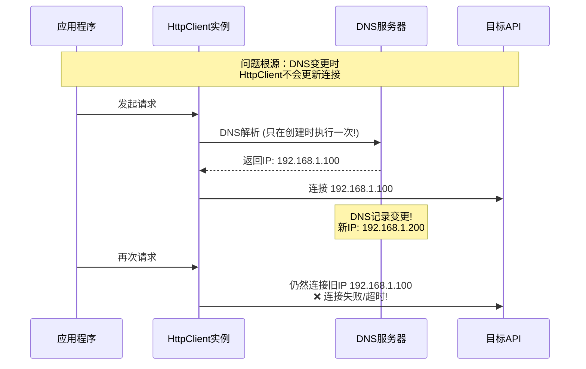
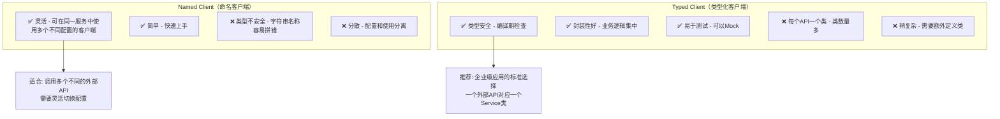
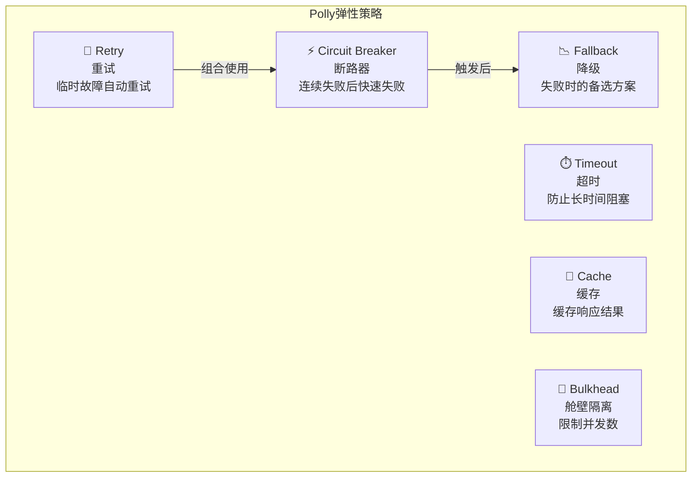
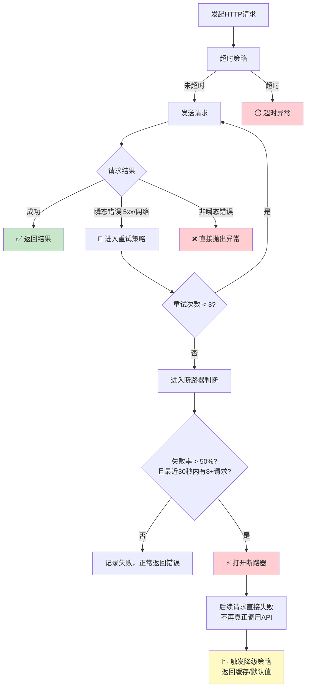

# HTTP客户端使用

> **学习目标**：掌握IHttpClientFactory的正确用法，理解Named Client和Typed Client的区别，能够集成Polly实现弹性HTTP调用
>
> **前置知识**：依赖注入、异步编程、RESTful API基础
>
> **预计时长**：60-90分钟

---

## 一、为什么不用静态HttpClient？

### 1.1 经典问题：Socket耗尽

在.NET Framework早期，很多开发者这样写代码：

```csharp
// ❌ 错误做法 - 不要这样做！
public class OldService
{
    private static readonly HttpClient _httpClient = new HttpClient();

    public async Task<string> GetData()
    {
        return await _httpClient.GetStringAsync("https://api.example.com/data");
    }
}
```

这段代码看起来没问题（用了static保证单例），但实际上会导致严重的**Socket耗尽问题**：



### 1.2 其他错误做法

| 做法 | 问题 | 严重程度 |
|------|------|---------|
| `new HttpClient()` 每次请求创建 | Socket耗尽，端口用完 | 致命 |
| `static readonly` 单例 | DNS不刷新 | 高 |
| 不设置Timeout | 无限等待 | 中 |
| 不处理异常 | 静默失败 | 中 |
| 同步调用 `.Result` | 死锁风险 | 高 |

### 1.3 解决方案：IHttpClientFactory

.NET Core 2.1引入的 `IHttpClientFactory` 完美解决了上述所有问题：

- **管理连接池** - 自动复用HttpClientMessageHandler实例
- **自动DNS刷新** - 定期清理过期连接
- **统一配置** - 集中管理BaseAddress、Headers等
- **集成日志** - 自动记录HTTP请求日志
- **支持Polly** - 内置弹性策略集成

---

## 二、IHttpClientFactory 基础

### 2.1 注册和使用

```csharp
// ========== Program.cs ==========
var builder = WebApplication.CreateBuilder(args);

// 注册HttpClient服务（最基本的方式）
builder.Services.AddHttpClient();

// 或者指定名称注册
builder.Services.AddHttpClient("MyApi", client =>
{
    client.BaseAddress = new Uri("https://api.example.com/");
    client.Timeout = TimeSpan.FromSeconds(30);
    client.DefaultRequestHeaders.Accept.Add(
        new MediaTypeWithQualityHeaderValue("application/json"));
});

var app = builder.Build();
app.Run();
```

```csharp
// ========== 在控制器或服务中使用 ==========
[ApiController]
[Route("api/[controller]")]
public class DataController : ControllerBase
{
    private readonly IHttpClientFactory _httpClientFactory;

    public DataController(IHttpClientFactory httpClientFactory)
    {
        _httpClientFactory = httpClientFactory;
    }

    [HttpGet("basic")]
    public async Task<ActionResult> BasicUsage()
    {
        // 方式一：从工厂创建客户端
        var client = _httpClientFactory.CreateClient();

        var response = await client.GetAsync("https://jsonplaceholder.typicode.com/posts/1");
        var content = await response.Content.ReadAsStringAsync();

        return Ok(content);
    }

    [HttpGet("named")]
    public async Task<ActionResult> NamedClientUsage()
    {
        // 方式二：使用命名客户端（已预配置）
        var client = _httpClientFactory.CreateClient("MyApi");

        // BaseAddress已经预设好了，只需写相对路径
        var response = await client.GetAsync("users/1");

        if (!response.IsSuccessStatusCode)
        {
            return StatusCode((int)response.StatusCode,
                new { error = "外部API调用失败", status = response.StatusCode });
        }

        var data = await response.Content.ReadFromJsonAsync<ExternalUserDto>();
        return Ok(data);
    }
}

// 外部API返回的DTO
public record ExternalUserDto(int id, string name, string username, string email);
```

---

## 三、Named Client vs Typed Client

这是两种主要的HttpClient使用模式，各有适用场景：

### 3.1 对比总览



### 3.2 Named Client完整示例

```csharp
// ========== Program.cs 注册 ==========
builder.Services.AddHttpClient("GitHubApi", client =>
{
    client.BaseAddress = new Uri("https://api.github.com/");
    client.DefaultRequestHeaders.Add("User-Agent", "MyApp/1.0");
    client.DefaultRequestHeaders.Add("Accept", "application/vnd.github.v3+json");
    client.Timeout = TimeSpan.FromSeconds(30);
})
// 集成Polly重试策略
.AddTransientHttpErrorPolicy(policy => policy
    .WaitAndRetryAsync(3, retryAttempt =>
        TimeSpan.FromSeconds(Math.Pow(2, retryAttempt))))
// 集成Polly断路器
.AddTransientHttpErrorPolicy(policy => policy
    .CircuitBreakerAsync(5, TimeSpan.FromSeconds(30)));

// ========== 使用 Named Client ==========
public class GitHubService : IGitHubService
{
    private readonly IHttpClientFactory _httpClientFactory;
    private readonly ILogger<GitHubService> _logger;

    public GitHubService(IHttpClientFactory httpClientFactory,
        ILogger<GitHubService> logger)
    {
        _httpClientFactory = httpClientFactory;
        _logger = logger;
    }

    public async Task<GitHubUser?> GetUserAsync(string username)
    {
        var client = _httpClientFactory.CreateClient("GitHubApi");

        try
        {
            // Polly重试和断路器会自动工作
            var response = await client.GetAsync($"users/{username}");

            response.EnsureSuccessStatusCode();

            return await response.Content.ReadFromJsonAsync<GitHubUser>();
        }
        catch (HttpRequestException ex)
        {
            _logger.LogError(ex, "获取GitHub用户 {Username} 失败", username);
            throw new ExternalApiException("GitHub API调用失败", ex);
        }
        catch (TaskCanceledException ex)
        {
            _logger.LogError(ex, "请求GitHub用户 {Username} 超时", username);
            throw new TimeoutException("GitHub API请求超时", ex);
        }
    }
}
```

### 3.3 Typed Client完整示例（推荐）

Typed Client将HttpClient的使用封装在一个强类型的类中，是企业级应用的首选方案：

```csharp
// ========== 1. 定义Typed Client ==========
/// <summary>
/// 天气API类型化客户端
/// 封装对OpenWeatherMap API的所有调用
/// </summary>
public class WeatherApiClient
{
    private readonly HttpClient _httpClient;
    private readonly ILogger<WeatherApiClient> _logger;
    private readonly JsonSerializerOptions _jsonOptions;

    public WeatherApiClient(HttpClient httpClient,
        ILogger<WeatherApiClient> logger,
        IConfiguration configuration)
    {
        _httpClient = httpClient;
        _logger = logger;
        _jsonOptions = new JsonSerializerOptions
        {
            PropertyNameCaseInsensitive = true
        };

        // 从配置读取BaseAddress
        var baseUrl = configuration["ExternalApis:Weather:BaseUrl"]
            ?? "https://api.openweathermap.org";
        _httpClient.BaseAddress = new Uri($"{baseUrl}/data/2.5/");

        // 设置默认头
        _httpClient.DefaultRequestHeaders.Accept.Add(
            new MediaTypeWithQualityHeaderValue("application/json"));
        _httpClient.Timeout = TimeSpan.FromSeconds(15);

        // 设置API Key
        var apiKey = configuration["ExternalApis:Weather:ApiKey"];
        if (!string.IsNullOrEmpty(apiKey))
        {
            _httpClient.DefaultRequestHeaders.Add("X-API-Key", apiKey);
        }
    }

    /// <summary>
    /// 根据城市名获取当前天气
    /// </summary>
    public async Task<WeatherResponse?> GetCurrentWeatherByCityAsync(string city)
    {
        try
        {
            var url = $"weather?q={Uri.EscapeDataString(city)}&units=metric&lang=zh_cn";

            _logger.LogInformation("请求天气数据: {City}", city);

            var response = await _httpClient.GetAsync(url);

            if (!response.IsSuccessStatusCode)
            {
                var errorContent = await response.Content.ReadAsStringAsync();
                _logger.LogWarning("天气API返回错误: {StatusCode} - {Body}",
                    response.StatusCode, errorContent);

                throw new WeatherApiException(
                    $"天气API错误: {(int)response.StatusCode}",
                    (int)response.StatusCode);
            }

            var weather = await response.Content
                .ReadFromJsonAsync<WeatherResponse>(_jsonOptions);

            _logger.LogInformation("成功获取天气数据: {City}, 温度: {Temp}°C",
                city, weather?.Main?.Temperature);

            return weather;
        }
        catch (HttpRequestException ex)
        {
            _logger.LogError(ex, "天气API网络错误: {City}", city);
            throw new WeatherApiException("无法连接到天气服务", 500, ex);
        }
        catch (TaskCanceledException) when (!ex.CancellationToken.IsCancellationRequested)
        {
            _logger.LogWarning("天气API请求超时: {City}", city);
            throw new TimeoutException($"天气服务响应超时: {city}");
        }
        catch (JsonException ex)
        {
            _logger.LogError(ex, "天气API响应解析失败: {City}", city);
            throw new WeatherApiException("天气数据格式错误", 502, ex);
        }
    }

    /// <summary>
    /// 获取未来5天天气预报
    /// </summary>
    public async Task<WeatherForecastResponse?> GetForecastAsync(
        double lat, double lon)
    {
        var url = $"forecast?lat={lat}&lon={lon}&units=metric&lang=zh_cn";

        var response = await _httpClient.GetAsync(url);

        response.EnsureSuccessStatusCode();

        return await response.Content
            .ReadFromJsonAsync<WeatherForecastResponse>(_jsonOptions);
    }

    /// <summary>
    /// 根据城市ID批量获取天气
    /// </summary>
    public async Task<List<WeatherResponse?>> GetWeatherByCitiesAsync(
        List<int> cityIds)
    {
        var ids = string.Join(",", cityIds.Select(id => id.ToString()));
        var url = $"group?id={ids}&units=metric&lang=zh_cn";

        var response = await _httpClient.GetAsync(url);
        response.EnsureSuccessStatusCode();

        var groupResult = await response.Content
            .ReadFromJsonAsync<WeatherGroupResponse>(_jsonOptions);

        return groupResult?.List ?? new List<WeatherResponse?>();
    }
}

// ========== 2. DTOs ==========
public record WeatherResponse(
    int Id,
    string Name,
    MainInfo? Main,
    List<WeatherCondition>? Weather,
    WindInfo? Wind,
    SysInfo? Sys);

public record MainInfo(
    double Temperature,
    double FeelsLike,
    double TempMin,
    double TempMax,
    int Pressure,
    int Humidity);

public record WeatherCondition(
    int Id,
    string Main,
    string Description,
    string Icon);

public record WindInfo(double Speed, int Deg, double? Gust);

public record SysInfo(string Country, long Sunrise, long Sunset);

public record WeatherForecastResponse(
    CityInfo? City,
    List<ForecastItem>? List);

public record ForecastItem(long Dt, MainInfo? Main, List<WeatherCondition>? Weather);

public record CityInfo(int Id, string Name, CoordInfo? Coord);

public record CoordInfo(double Lat, double Lon);

// 自定义异常
public class WeatherApiException : Exception
{
    public int StatusCode { get; }
    public WeatherApiException(string message, int statusCode,
        Exception? innerException = null)
        : base(message, innerException)
    {
        StatusCode = statusCode;
    }
}

// ========== 3. Program.cs 注册 ==========
builder.Services.AddHttpClient<WeatherApiClient>()
    // 重试策略: 失败后等待 1s -> 2s -> 4s
    .AddPolicyHandler(GetRetryPolicy())
    // 断路器: 连续5次失败则熔断30秒
    .AddPolicyHandler(GetCircuitBreakerPolicy())
    // 超时策略: 总时间不超过10秒
    .AddPolicyHandler(Policy.TimeoutAsync<HttpResponseMessage>(10));

static IAsyncPolicy<HttpResponseMessage> GetRetryPolicy()
{
    return HttpPolicyExtensions
        .HandleTransientHttpError() // 处理 5xx 和 网络错误
        .WaitAndRetryAsync(3, retryAttempt =>
            TimeSpan.FromSeconds(Math.Pow(2, retryAttempt)),
            onRetry: (outcome, timespan, retryCount, context) =>
            {
                Console.WriteLine($"第{retryCount}次重试，" +
                    $"等待{timespan.TotalSeconds}秒。原因: {outcome.Exception?.Message}");
            });
}

static IAsyncPolicy<HttpResponseMessage> GetCircuitBreakerPolicy()
{
    return HttpPolicyExtensions
        .HandleTransientHttpError()
        .CircuitBreakerAsync(
            exceptionsAllowedBeforeBreaking: 5,
            durationOfBreak: TimeSpan.FromSeconds(30),
            onBreak: (ex, duration) =>
            {
                Console.WriteLine($"⚡ 断路器打开！熔断{duration.TotalSeconds}秒。" +
                    $"原因: {ex.Message}");
            },
            onReset: () => Console.WriteLine("🔧 断路器关闭，恢复正常"),
            onHalfOpen: () => Console.WriteLine("🔄 断路器半开状态，尝试探测")
        );
}

// ========== 4. 在控制器中使用 ==========
[ApiController]
[Route("api/v1/weather")]
public class WeatherController : ControllerBase
{
    private readonly WeatherApiClient _weatherClient;

    public WeatherController(WeatherApiClient weatherClient)
    {
        _weatherClient = weatherClient;
    }

    /// <summary>
    /// 获取城市当前天气
    /// </summary>
    /// <param name="city">城市名称</param>
    [HttpGet("current")]
    public async Task<ActionResult<WeatherDto>> GetCurrentWeather(
        [FromQuery] string city)
    {
        if (string.IsNullOrWhiteSpace(city))
            return BadRequest(new { error = "城市名称不能为空" });

        try
        {
            var weather = await _weatherClient.GetCurrentWeatherByCityAsync(city);

            if (weather == null)
                return NotFound(new { error = $"未找到城市: {city}" });

            return Ok(new WeatherDto
            {
                City = weather.Name,
                Country = weather.Sys?.Country,
                Temperature = weather.Main?.Temperature ?? 0,
                FeelsLike = weather.Main?.FeelsLike ?? 0,
                Humidity = weather.Main?.Humidity ?? 0,
                Description = weather.Weather?.FirstOrDefault()?.Description ?? "",
                WindSpeed = weather.Wind?.Speed ?? 0,
                UpdatedAt = DateTime.UtcNow
            });
        }
        catch (TimeoutException)
        {
            return StatusCode(StatusCodes.Status504GatewayTimeout,
                new { error = "天气服务响应超时，请稍后重试" });
        }
        catch (WeatherApiException ex) when (ex.StatusCode == 404)
        {
            return NotFound(new { error = $"未找到城市: {city}" });
        }
        catch (WeatherApiException)
        {
            return StatusCode(StatusCodes.Status502BadGateway,
                new { error = "天气服务暂时不可用" });
        }
    }
}

// 返回给前端的DTO
public record WeatherDto(
    string City,
    string? Country,
    double Temperature,
    double FeelsLike,
    int Humidity,
    string Description,
    double WindSpeed,
    DateTime UpdatedAt
);
```

---

## 四、Polly弹性策略详解

Polly是.NET生态中最流行的弹性库，与IHttpClientFactory深度集成。

### 4.1 Polly策略类型



### 4.2 完整的Polly策略链配置

```csharp
using Polly;
using Polly.Contrib.WaitAndRetry;
using Polly.Registry;

// ========== 在Program.cs中配置完整的策略链 ==========
public static class PollyPolicies
{
    /// <summary>
    /// 基础重试策略 - 指数退避 + 抖动
    /// </summary>
    public static IAsyncPolicy<HttpResponseMessage> GetAdvancedRetryPolicy()
    {
        // 使用抖动的指数退避（避免惊群效应）
        var delay = Backoff.DecorrelatedJitterBackoffV2(
            medianFirstRetryDelay: TimeSpan.FromSeconds(1),
            retryCount: 3);

        return HttpPolicyExtensions
            .HandleTransientHttpError()
            .Or<TimeoutException>() // 也处理超时
            .WaitAndRetryAsync(delay,
                onRetry: (outcome, timespan, retryCount, context) =>
                {
                    Console.WriteLine($"[重试] 第{retryCount}次，" +
                        $"下次等待{timespan.TotalMilliseconds:F0}ms。"+
                        $"异常: {outcome.Exception?.Message}");
                });
    }

    /// <summary>
    /// 断路器策略
    /// </summary>
    public static AsyncCircuitBreakerPolicy<HttpResponseMessage> GetCircuitBreakerPolicy()
    {
        return Policy<HttpResponseMessage>
            .Handle<HttpRequestException>()
            .OrResult(r => (int)r.StatusCode >= 500)
            .AdvancedCircuitBreakerAsync(
                failureThreshold: 0.5,              // 50%的请求失败就打开
                samplingDuration: TimeSpan.FromSeconds(30), // 统计窗口
                minimumThroughput: 8,               // 最少8个请求才统计
                durationOfBreak: TimeSpan.FromSeconds(60), // 熔断时长
                onBreak: (outcome, duration, context) =>
                {
                    Console.ForegroundColor = ConsoleColor.Red;
                    Console.WriteLine($"⚡ 断路器打开！" +
                        $"熔断{duration.TotalSeconds}秒。" +
                        $"原因: {outcome.Exception?.Message ?? outcome.Result?.StatusCode.ToString()}");
                    Console.ResetColor();
                },
                onReset: (context) =>
                {
                    Console.ForegroundColor = ConsoleColor.Green;
                    Console.WriteLine("🔧 断路器已恢复");
                    Console.ResetColor();
                },
                onHalfOpen: () =>
                {
                    Console.ForegroundColor = ConsoleColor.Yellow;
                    Console.WriteLine("🔄 半开状态 - 允许试探性请求");
                    Console.ResetColor();
                }
            );
    }

    /// <summary>
    /// 超时策略
    /// </summary>
    public static IAsyncPolicy<HttpResponseMessage> GetTimeoutPolicy(TimeSpan timeout)
    {
        return Policy.TimeoutAsync<HttpResponseMessage>(timeout,
            onTimeoutAsync: (context, timespan, task) =>
            {
                Console.WriteLine($"⏱️ 请求超时 ({timespan.TotalSeconds}s)");
                return Task.CompletedTask;
            });
    }

    /// <summary>
    /// 降级策略 - 当所有策略都失败时返回兜底数据
    /// </summary>
    public static AsyncFallbackPolicy<HttpResponseMessage> GetFallbackPolicy()
    {
        return Policy<HttpResponseMessage>
            .Handle<BrokenCircuitException>() // 主要处理断路器打开的情况
            .Or<HttpRequestException>()
            .FallbackAsync(
                fallbackValue: new HttpResponseMessage(HttpStatusCode.OK)
                {
                    Content = new StringContent(
                        JsonSerializer.Serialize(new
                        {
                            cached = true,
                            message = "当前服务繁忙，返回缓存数据",
                            data = GetCachedData(),
                            timestamp = DateTime.UtcNow
                        }),
                        Encoding.UTF8,
                        "application/json")
                },
                onFallbackAsync: (outcome, context) =>
                {
                    Console.WriteLine("📉 触发降级策略，返回缓存数据");
                    return Task.CompletedTask;
                });
    }

    private static object GetCachedData()
    {
        // 从Redis/内存缓存中获取缓存数据
        return new { /* 缓存的数据 */ };
    }
}

// ========== 组合使用 ==========
builder.Services.AddHttpClient<MyTypedClient>(client =>
{
    client.BaseAddress = new Uri("https://external-api.example.com/");
    client.Timeout = TimeSpan.FromSeconds(10);
})
.SetHandlerLifetime(TimeSpan.FromMinutes(5)) // Handler生命周期
.AddPolicyHandler(PollyPolicies.GetTimeoutPolicy(TimeSpan.FromSeconds(8))) // 最内层：超时
.AddPolicyHandler(PollyPolicies.GetAdvancedRetryPolicy())          // 第二层：重试
.AddPolicyHandler(PollyPolicies.GetCircuitBreakerPolicy())         // 第三层：断路器
.AddPolicyHandler(PollyPolicies.GetFallbackPolicy());              // 最外层：降级
```

### 4.3 策略执行流程图



---

## 五、DelegatingHandler拦截器

DelegatingHandler允许你在请求发送前后插入自定义逻辑，类似于中间件：

### 5.1 自定义Handler示例

```csharp
/// <summary>
/// 认证Handler - 自动添加Bearer Token
/// </summary>
public class AuthDelegatingHandler : DelegatingHandler
{
    private readonly ITokenProvider _tokenProvider;
    private readonly ILogger<AuthDelegatingHandler> _logger;

    public AuthDelegatingHandler(ITokenProvider tokenProvider,
        ILogger<AuthDelegatingHandler> logger)
    {
        _tokenProvider = tokenProvider;
        _logger = logger;
    }

    protected override async Task<HttpResponseMessage> SendAsync(
        HttpRequestMessage request, CancellationToken cancellationToken)
    {
        // 请求前：添加认证Token
        var token = await _tokenProvider.GetAccessTokenAsync();
        request.Headers.Authorization =
            new AuthenticationHeaderValue("Bearer", token);

        _logger.LogDebug("为请求 {Url} 添加认证信息",
            request.RequestUri);

        // 发送请求
        var response = await base.SendAsync(request, cancellationToken);

        // 请求后：处理401（Token过期自动刷新）
        if (response.StatusCode == HttpStatusCode.Unauthorized)
        {
            _logger.LogWarning("Token可能已过期，尝试刷新...");

            // 刷新Token
            var newToken = await _tokenProvider.RefreshTokenAsync();

            // 克隆原始请求并重新发送
            request.Headers.Authorization =
                new AuthenticationHeaderValue("Bearer", newToken);

            // 释放之前的响应
            response.Dispose();

            // 重新发送
            response = await base.SendAsync(request, cancellationToken);
        }

        return response;
    }
}

/// <summary>
/// 日志Handler - 记录所有请求和响应详情
/// </summary>
public class LoggingDelegatingHandler : DelegatingHandler
{
    private readonly ILogger<LoggingDelegatingHandler> _logger;

    public LoggingDelegatingHandler(ILogger<LoggingDelegatingHandler> logger)
    {
        _logger = logger;
    }

    protected override async Task<HttpResponseMessage> SendAsync(
        HttpRequestMessage request, CancellationToken cancellationToken)
    {
        var requestId = Guid.NewGuid().ToString("N")[..8];
        var stopwatch = Stopwatch.StartNew();

        // 记录请求
        _logger.LogInformation("[{RequestId}] {Method} {Url}",
            requestId, request.Method, request.RequestUri);

        if (request.Content != null)
        {
            var body = await request.Content.ReadAsStringAsync(cancellationToken);
            _logger.LogDebug("[{RequestId}] Request Body: {Body}",
                requestId, Truncate(body, 500));
        }

        try
        {
            var response = await base.SendAsync(request, cancellationToken);
            stopwatch.Stop();

            // 记录响应
            _logger.LogInformation("[{RequestId}] Response: {StatusCode} in {ElapsedMs}ms",
                requestId, (int)response.StatusCode, stopwatch.ElapsedMilliseconds);

            return response;
        }
        catch (Exception ex)
        {
            stopwatch.Stop();
            _logger.LogError(ex, "[{RequestId}] Request failed after {ElapsedMs}ms",
                requestId, stopwatch.ElapsedMilliseconds);
            throw;
        }
    }

    private static string Truncate(string value, int maxLength)
    {
        if (string.IsNullOrEmpty(value)) return value;
        return value.Length <= maxLength ? value : value[..maxLength] + "...";
    }
}

/// <summary>
/// 重试Handler - 自定义重试逻辑（替代Polly的场景）
/// </summary>
public class RetryDelegatingHandler : DelegatingHandler
{
    private readonly int _maxRetries;
    private readonly ILogger<RetryDelegatingHandler> _logger;

    public RetryDelegatingHandler(int maxRetries = 3,
        ILogger<RetryDelegatingHandler>? logger = null)
    {
        _maxRetries = maxRetries;
        _logger = logger!;
    }

    protected override async Task<HttpResponseMessage> SendAsync(
        HttpRequestMessage request, CancellationToken cancellationToken)
    {
        Exception? lastException = null;

        for (var i = 0; i <= _maxRetries; i++)
        {
            try
            {
                var response = await base.SendAsync(request, cancellationToken);

                // 只对5xx和服务不可用进行重试
                if ((int)response.StatusCode >= 500 ||
                    response.StatusCode == HttpStatusCode.ServiceUnavailable ||
                    response.StatusCode == HttpStatusCode.GatewayTimeout)
                {
                    _logger.LogWarning("收到 {StatusCode}，准备第 {Retry} 次重试",
                        response.StatusCode, i + 1);

                    response.Dispose();

                    if (i < _maxRetries)
                    {
                        await Task.Delay(TimeSpan.FromSeconds(i + 1), cancellationToken);
                        continue;
                    }
                }

                return response;
            }
            catch (HttpRequestException ex) when (i < _maxRetries)
            {
                lastException = ex;
                _logger.LogWarning(ex, "网络错误，第 {Retry} 次重试", i + 1);
                await Task.Delay(TimeSpan.FromSeconds(i + 1), cancellationToken);
            }
        }

        throw lastException ?? new HttpRequestException("重试次数已用完");
    }
}
```

### 5.2 注册自定义Handler

```csharp
// Program.cs
builder.Services.AddTransient<AuthDelegatingHandler>();
builder.Services.AddTransient<LoggingDelegatingHandler>();

builder.Services.AddHttpClient<MyTypedClient>(client =>
{
    client.BaseAddress = new Uri("https://api.example.com/");
})
// Handler按添加顺序执行（先加的先执行请求前的逻辑）
.AddHttpMessageHandler<LoggingDelegatingHandler>()   // 最外层：先记录日志
.AddHttpMessageHandler<AuthDelegatingHandler>();      // 内层：再添加认证
// 注意：响应时顺序相反——先处理认证响应，再记录日志
```

---

## 六、测试中的Mock

### 6.1 使用Fake Handler进行单元测试

```csharp
using Moq;
using Xunit;

public class WeatherServiceTests
{
    private readonly WeatherService _service;
    private readonly Mock<ILogger<WeatherService>> _loggerMock;

    public WeatherServiceTests()
    {
        _loggerMock = new Mock<ILogger<WeatherService>>();

        // 创建Fake Handler来模拟HTTP响应
        var handler = new FakeHttpMessageHandler(new HttpResponseMessage
        {
            StatusCode = HttpStatusCode.OK,
            Content = new StringContent(JsonSerializer.Serialize(new
            {
                id = 123,
                name = "Beijing",
                main = new { temp = 25.5, humidity = 60 },
                weather = new[] { new { description = "晴朗" } }
            }), Encoding.UTF8, "application/json")
        });

        var client = new HttpClient(handler)
        {
            BaseAddress = new Uri("https://fake-api.test/")
        };

        // 手动创建服务（不依赖DI容器）
        _service = new WeatherService(client, _loggerMock.Object);
    }

    [Fact]
    public async Task GetWeather_ReturnsCorrectData_WhenApiSucceeds()
    {
        // Arrange & Act
        var result = await _service.GetCurrentWeatherAsync("Beijing");

        // Assert
        Assert.NotNull(result);
        Assert.Equal("Beijing", result.City);
        Assert.Equal(25.5, result.Temperature);
    }

    [Fact]
    public async Task GetWeather_Throws_WhenApiReturnsError()
    {
        // 创建返回错误的Fake Handler
        var errorHandler = new FakeHttpMessageHandler(
            new HttpResponseMessage(HttpStatusCode.InternalServerError));

        var client = new HttpClient(errorHandler)
        {
            BaseAddress = new Uri("https://fake-api.test/")
        };

        var service = new WeatherService(client, _loggerMock.Object);

        // Act & Assert
        await Assert.ThrowsAsync<WeatherApiException>(
            () => service.GetCurrentWeatherAsync("Beijing"));
    }

    [Fact]
    public async Task GetWeather_Retries_OnTransientError()
    {
        var callCount = 0;

        // 第一次返回500，第二次返回200
        var retryHandler = new FakeHttpMessageHandler(() =>
        {
            callCount++;
            if (callCount == 1)
            {
                return new HttpResponseMessage(HttpStatusCode.InternalServerError);
            }
            return new HttpResponseMessage(HttpStatusCode.OK)
            {
                Content = new StringContent(JsonSerializer.Serialize(new
                {
                    id = 456,
                    name = "Shanghai",
                    main = new { temp = 28.0, humidity = 70 }
                }), Encoding.UTF8, "application/json")
            };
        });

        var client = new HttpClient(retryHandler)
        {
            BaseAddress = new Uri("https://fake-api.test/")
        };

        var service = new WeatherService(client, _loggerMock.Object);

        var result = await service.GetCurrentWeatherAsync("Shanghai");

        Assert.NotNull(result);
        Assert.Equal(2, callCount); // 验证确实发生了重试
    }
}

/// <summary>
/// Fake HTTP Message Handler - 用于测试
/// </summary>
public class FakeHttpMessageHandler : HttpMessageHandler
{
    private readonly HttpResponseMessage _fixedResponse;
    private readonly Func<HttpResponseMessage>? _dynamicResponse;

    public FakeHttpMessageHandler(HttpServletResponse fixedResponse)
    {
        _fixedResponse = fixedResponse;
    }

    public FakeHttpMessageHandler(Func<HttpResponseMessage> dynamicResponse)
    {
        _dynamicResponse = dynamicResponse;
    }

    protected override Task<HttpResponseMessage> SendAsync(
        HttpRequestMessage request, CancellationToken cancellationToken)
    {
        var response = _dynamicResponse != null
            ? _dynamicResponse.Invoke()
            : _fixedResponse;

        response.RequestMessage = request;
        return Task.FromResult(response);
    }
}
```

### 6.2 使用WebApplicationFactory进行集成测试

```csharp
public class WeatherApiIntegrationTests : IClassFixture<WebApplicationFactory<Program>>
{
    private readonly WebApplicationFactory<Program> _factory;

    public WeatherApiIntegrationTests(WebApplicationFactory<Program> factory)
    {
        _factory = factory.WithWebHostBuilder(builder =>
        {
            builder.ConfigureTestServices(services =>
            {
                // 替换真实的HttpClient为Fake
                services.RemoveAll<WeatherApiClient>();
                services.AddSingleton<WeatherApiClient>(provider =>
                {
                    var fakeHandler = new FakeHttpMessageHandler(new HttpResponseMessage
                    {
                        StatusCode = HttpStatusCode.OK,
                        Content = new StringContent(/* 测试JSON */)
                    });

                    return new WeatherApiClient(
                        new HttpClient(fakeHandler),
                        provider.GetRequiredService<ILogger<WeatherApiClient>>(),
                        provider.GetRequiredService<IConfiguration>());
                });
            });
        });
    }

    [Fact]
    public async Task GetWeather_ReturnsSuccess_WithValidCity()
    {
        // Arrange
        var client = _factory.CreateClient();

        // Act
        var response = await client.GetAsync("/api/v1/weather/current?city=Beijing");

        // Assert
        response.EnsureSuccessStatusCode();
        var result = await response.Content.ReadFromJsonAsync<WeatherDto>();
        Assert.NotNull(result);
        Assert.Equal("Beijing", result.City);
    }
}
```

---

## 七、DO/DON'T 清单

| 场景 | DO (推荐) | DON'T (避免) |
|------|-----------|-------------|
| HttpClient创建 | 用 `IHttpClientFactory` 或Typed Client | `new HttpClient()` 或 static单例 |
| 选择模式 | 优先用Typed Client | 过度使用Named Client |
| 超时设置 | 始终设置合理的Timeout | 忘记设置，导致无限等待 |
| 异常处理 | 区分不同异常类型 | 所有异常都用catch(Exception) |
| 弹性策略 | 使用Polly（重试+断路器+降级） | 自己手写重试逻辑 |
| 日志记录 | 用DelegatingHandler记录请求/响应 | 不记录任何日志 |
| 测试 | 用FakeHandler/Mock进行隔离测试 | 在单元测试中调用真实API |
| Token管理 | 用Handler自动处理Token刷新 | 在每次请求手动获取Token |

---

## 八、总结

| 要点 | 内容 |
|------|------|
| 为什么不用static HttpClient | DNS不刷新、Socket耗尽 |
| IHttpClientFactory | 连接池管理、自动DNS刷新、统一配置 |
| Named Client | 字符串标识、灵活但不够类型安全 |
| Typed Client | 强类型封装、推荐的企业级做法 |
| Polly | 重Retry、断路CB、超时T、降级FB |
| DelegatingHandler | 请求/响应拦截器，类似中间件 |
| 测试 | FakeHandler替代真实HTTP调用 |

---

## 练习题

### 练习1：基础配置
创建一个简单的Typed Client来调用JSONPlaceholder API：
1. 定义一个PostsApiClient类
2. 实现GetPostById和GetAllPosts方法
3. 在控制器中使用并返回数据

### 练习2：Polly集成
为上面的PostsApiClient添加弹性策略：
1. 添加重试策略（最多3次，指数退避）
2. 添加断路器策略（连续5次失败后熔断30秒）
3. 添加超时策略（5秒超时）
4. 写一个测试验证重试是否生效

### 练习3：自定义Handler
实现以下自定义Handler：
1. AuthHandler：自动添加API Key到请求头
2. CorrelationIdHandler：传递跟踪ID
3. CacheHandler：对GET请求做简单缓存（内存缓存5分钟）

### 练习4：完整实战
设计一个聚合API服务：
- 同时调用用户API和订单API
- 合并数据后返回
- 任一API失败不影响另一个（使用Polly降级）
- 整体超时控制

### 练习5：性能优化分析
假设你的API每秒需要调用外部API 100次：
1. 如何配置HandlerLifetime？
2. 如何调整连接池大小？
3. 是否需要限流？如何实现？

---

### 参考答案要点

**练习1答案要点**：
- PostsApiClient构造函数接收HttpClient
- BaseAddress设为 https://jsonplaceholder.typicode.com/
- GetPostById: `GetAsync($"/posts/{id}")`
- GetAllPosts: `GetAsync("/posts")`
- `services.AddHttpClient<PostsApiClient>()`

**练习2答案要点**：
- `.AddPolicyHandler(HttpPolicyExtensions.HandleTransientHttpError().WaitAndRetryAsync(...))`
- `.AddPolicyHandler(...CircuitBreakerAsync(5, TimeSpan.FromSeconds(30)))`
- `.AddPolicyHandler(Policy.TimeoutAsync<HttpResponseMessage>(5))`
- 测试中用FakeHandler第一次返回500，第二次返回200

**练习3答案要点**：
- AuthHandler: `request.Headers.Add("X-API-Key", "...")`
- CorrelationIdHandler: 从HttpContext取或生成新的CorrelationId
- CacheHandler: 检查GET方法+URL作为Key，IMemoryCache存储

**练习4答案要点**：
- 用Task.WhenAll并行调用两个API
- 各自包装在Policy.WrapAsync中
- 外层再用Timeout策略
- 失败的API返回部分数据+标记

**练习5答案要点**：
- HandlerLifetime设为2-5分钟
- 通过SocketsHttpHandler配置MaxConnectionsPerServer
- 使用Polly Bulkhead或SemaphoreSlim限流

---

## 延伸阅读

- [微软官方文档：IHttpClientFactory](https://docs.microsoft.com/zh-cn/dotnet/core/http/httpclient) - 官方权威指南
- [Polly官方文档](https://github.com/App-vNext/Polly) - Polly项目仓库和文档
- [Polly Wiki](https://github.com/App-vNext/Polly/wiki) - 详细的使用说明和最佳实践
- [Typed Clients vs Named Clients](https://stevejgordon.co.uk/httpclientfactory-using-typed-clients) - Steve Gordon的深入分析

---

## 上下节导航

- **上一节**：[API版本控制](04-API版本控制.md)
- **下一节**：[API最佳实践总结](06-API最佳实践总结.md) - 综合运用所学知识，掌握企业级API设计的完整体系
