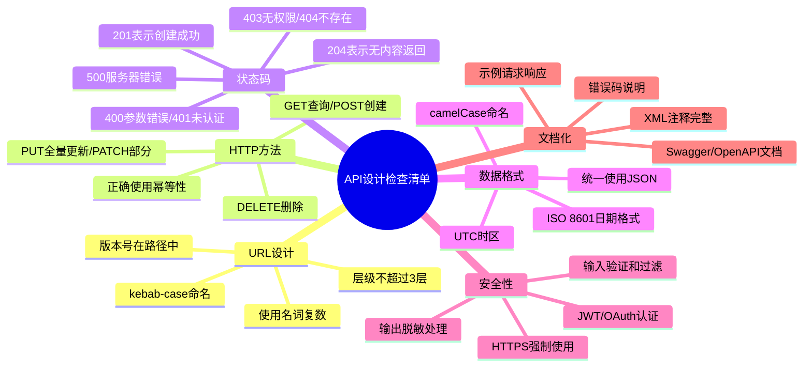
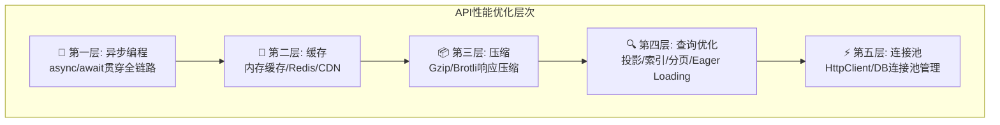
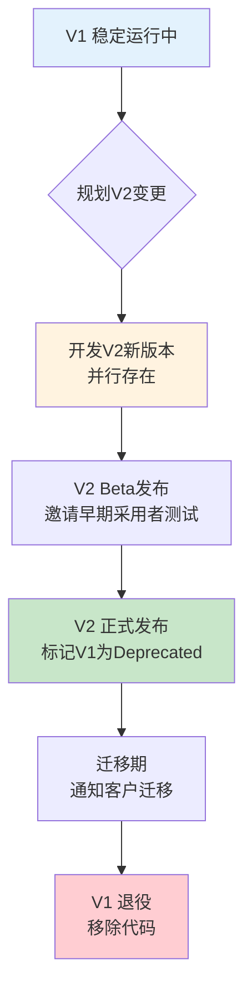
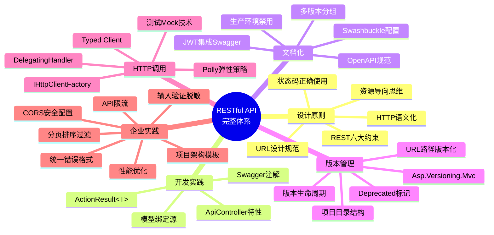

# API最佳实践总结

> **学习目标**：综合运用前5篇文章的所有知识，掌握企业级API设计的完整体系，能够独立设计和实现生产级RESTful API
>
> **前置知识**：本系列前5篇文章全部内容（REST原则、控制器开发、Swagger、版本控制、HTTP客户端）
>
> **预计时长**：90-120分钟

---

## 一、企业级API设计Checklist

在发布任何API之前，请逐项检查以下清单：

### 1.1 设计阶段检查清单



### 1.2 完整Checklist表格

| 编号 | 检查项 | 类别 | 优先级 | 状态 |
|------|--------|------|--------|------|
| **URL设计** |
| D01 | URL使用名词复数形式 (`/api/v1/users`) | 基础 | 必须 | [ ] |
| D02 | URL层级不超过3层 | 基础 | 必须 | [ ] |
| D03 | 使用kebab-case命名 (snake-case也可) | 风格 | 推荐 | [ ] |
| D04 | 包含版本号 (`/api/v1/...`) | 版本控制 | 必须 | [ ] |
| D05 | 查询参数用小写 (`?page=1&size=20`) | 风格 | 推荐 | [ ] |
| **HTTP方法** |
| H01 | GET用于查询，不改变服务器状态 | 基础 | 必须 | [ ] |
| H02 | POST用于创建资源，返回201+Location | 基础 | 必须 | [ ] |
| H03 | PUT用于全量替换，PATCH用于部分更新 | 基础 | 必须 | [ ] |
| H04 | DELETE用于删除，成功返回204 | 基础 | 必须 | [ ] |
| H05 | 不在URL中使用动词 | 基础 | 必须 | [ ] |
| **状态码** |
| S01 | 创建成功返回 `201 Created` | 基础 | 必须 | [ ] |
| S02 | 删除/更新成功无内容返回 `204 No Content` | 基础 | 必须 | [ ] |
| S03 | 参数错误返回 `400 Bad Request` + 详细信息 | 基础 | 必须 | [ ] |
| S04 | 未认证返回 `401 Unauthorized` | 安全 | 必须 | [ ] |
| S05 | 无权限返回 `403 Forbidden` | 安全 | 必须 | [ ] |
| S06 | 资源不存在返回 `404 Not Found` | 基础 | 必须 | [ ] |
| S07 | 服务器内部错误返回 `500` 并记录日志 | 基础 | 必须 | [ ] |
| **数据格式** |
| F01 | 统一使用JSON作为数据交换格式 | 基础 | 必须 | [ ] |
| F02 | 属性名使用camelCase命名 | 风格 | 推荐 | [ ] |
| F03 | 日期时间使用ISO 8601格式 (`2024-01-15T10:30:00Z`) | 风格 | 推荐 | [ ] |
| F04 | 所有时间使用UTC时区 | 基础 | 推荐 | [ ] |
| F05 | 空值统一使用null而非空字符串 | 风格 | 推荐 | [ ] |
| **安全性** |
| SEC01 | 强制HTTPS (TLS 1.2+) | 安全 | 必须 | [ ] |
| SEC02 | 实现认证机制 (JWT/OAuth2) | 安全 | 必须 | [ ] |
| SEC03 | 实现基于角色的授权 (RBAC) | 安全 | 必须 | [ ] |
| SEC04 | 所有输入参数进行验证 | 安全 | 必须 | [ ] |
| SEC05 | 敏感数据脱敏 (密码、Token、手机号等) | 安全 | 必须 | [ ] |
| SEC06 | SQL注入防护 (使用ORM/参数化查询) | 安全 | 必须 | [ ] |
| SEC07 | XSS防护 (输出编码) | 安全 | 必须 | [ ] |
| **性能优化** |
| P01 | 列表接口支持分页 | 性能 | 必须 | [ ] |
| P02 | 合理设置缓存策略 | 性能 | 推荐 | [ ] |
| P03 | 启用响应压缩 (Gzip/Brotli) | 性能 | 推荐 | [ ] |
| P04 | 数据库查询使用异步方法 | 性能 | 必须 | [ ] |
| P05 | 大数据量接口使用投影而非Select * | 性能 | 推荐 | [ ] |
| P06 | 支持字段选择 (fields参数) | 性能 | 可选 | [ ] |
| **可观测性** |
| O01 | 每个API调用记录结构化日志 | 运维 | 必须 | [ ] |
| O02 | 包含TraceId/CorrelationId | 运维 | 推荐 | [ ] |
| O03 | 关键指标暴露 (延迟、错误率、吞吐量) | 运维 | 推荐 | [ ] |
| O04 | 健康检查端点 `/health` | 运维 | 必须 | [ ] |
| **文档化** |
| DOC01 | Swagger/OpenAPI文档完整 | 文档 | 必须 | [ ] |
| DOC02 | XML注释覆盖所有公开API | 文档 | 推荐 | [ ] |
| DOC03 | 提供示例请求和响应 | 文档 | 推荐 | [ ] |
| DOC04 | 错误码有详细说明文档 | 文档 | 推荐 | [ ] |

---

## 二、统一错误响应格式

### 2.1 标准ErrorResponse结构

```csharp
/// <summary>
/// 统一API错误响应格式
/// </summary>
public class ApiResponse<T>
{
    /// <summary>是否成功</summary>
    public bool Success { get; set; }

    /// <summary>业务数据（成功时有值）</summary>
    public T? Data { get; set; }

    /// <summary>错误信息（失败时有值）</summary>
    public ErrorInfo? Error { get; set; }

    /// <summary>追踪ID，用于日志关联</summary>
    public string TraceId { get; set; } = string.Empty;

    /// <summary>响应时间戳(UTC)</summary>
    public DateTime Timestamp { get; set; } = DateTime.UtcNow;
}

/// <summary>
/// 错误详情
/// </summary>
public class ErrorInfo
{
    /// <summary>机器可读的错误代码</summary>
    public string Code { get; set; } = string.Empty;

    /// <summary>人类可读的错误消息</summary>
    public string Message { get; set; } = string.Empty;

    /// <summary>详细错误列表（如字段级验证错误）</summary>
    public List<ErrorDetail>? Details { get; set; }

    /// <summary>帮助文档链接</summary>
    public string? HelpUrl { get; set; }
}

public record ErrorDetail(
    string Field,
    string Code,
    string Message
);

// ========== 工厂方法 ==========
public static class ApiResponse
{
    public static ApiResponse<T> Ok<T>(T data, string traceId = "") =>
        new() { Success = true, Data = data, TraceId = traceId };

    public static ApiResponse<T> Fail<T>(string code, string message,
        string traceId = "", List<ErrorDetail>? details = null) =>
        new()
        {
            Success = false,
            Error = new ErrorInfo
            {
                Code = code,
                Message = message,
                Details = details
            },
            TraceId = traceId
        };

    // 分页结果专用
    public static ApiResponse<PagedResult<T>> PagedOk<T>(
        PagedResult<T> data, string traceId = "") =>
        new() { Success = true, Data = data, TraceId = traceId };
}
```

### 2.2 全局异常处理中间件

```csharp
/// <summary>
/// 全局API异常处理中间件
/// 统一捕获所有异常并返回标准格式的错误响应
/// </summary>
public class GlobalExceptionMiddleware
{
    private readonly RequestDelegate _next;
    private readonly ILogger<GlobalExceptionMiddleware> _logger;
    private readonly IHostEnvironment _environment;

    public GlobalExceptionMiddleware(
        RequestDelegate next,
        ILogger<GlobalExceptionMiddleware> logger,
        IHostEnvironment environment)
    {
        _next = next;
        _logger = logger;
        _environment = environment;
    }

    public async Task InvokeAsync(HttpContext context)
    {
        try
        {
            await _next(context);
        }
        catch (ValidationException ex)
        {
            await HandleValidationExceptionAsync(context, ex);
        }
        catch (NotFoundException ex)
        {
            await HandleNotFoundExceptionAsync(context, ex);
        }
        catch (BusinessRuleViolationException ex)
        {
            await HandleBusinessExceptionAsync(context, ex);
        }
        catch (UnauthorizedAccessException ex)
        {
            await HandleUnauthorizedExceptionAsync(context, ex);
        }
        catch (DbUpdateException ex)
        {
            await HandleDatabaseExceptionAsync(context, ex);
        }
        catch (OperationCanceledException)
        {
            await HandleCancellationAsync(context);
        }
        catch (Exception ex)
        {
            await HandleUnknownExceptionAsync(context, ex);
        }
    }

    private async Task HandleValidationExceptionAsync(HttpContext context, ValidationException ex)
    {
        _logger.LogWarning(ex, "验证失败: {Message}", ex.Message);

        context.Response.StatusCode = StatusCodes.Status400BadRequest;
        await context.Response.WriteAsJsonAsync(ApiResponse.Fail<object>(
            "VALIDATION_ERROR",
            "请求参数验证失败",
            context.TraceIdentifier,
            ex.Errors?.Select(e => new ErrorDetail(e.Field, e.Code, e.Message)).ToList()));
    }

    private async Task HandleNotFoundExceptionAsync(HttpContext context, NotFoundException ex)
    {
        _logger.LogInformation("资源不存在: {Resource} ({Id})", ex.ResourceName, ex.ResourceId);

        context.Response.StatusCode = StatusCodes.Status404NotFound;
        await context.Response.WriteAsJsonAsync(ApiResponse.Fail<object>(
            "NOT_FOUND",
            $"{ex.ResourceName} '{ex.ResourceId}' 不存在",
            context.TraceIdentifier));
    }

    private async Task HandleBusinessExceptionAsync(HttpContext context, BusinessRuleViolationException ex)
    {
        _logger.LogWarning(ex, "业务规则违反: {Code}", ex.ErrorCode);

        context.Response.StatusCode = ex.HttpStatusCode ?? StatusCodes.Status400BadRequest;
        await context.Response.WriteAsJsonAsync(ApiResponse.Fail<object>(
            ex.ErrorCode,
            ex.Message,
            context.TraceIdentifier));
    }

    private async Task HandleUnauthorizedExceptionAsync(HttpContext context, UnauthorizedAccessException ex)
    {
        _logger.LogWarning(ex, "未授权访问: {Path}", context.Request.Path);

        context.Response.StatusCode = StatusCodes.Status401Unauthorized;
        await context.Response.WriteAsJsonAsync(ApiResponse.Fail<object>(
            "UNAUTHORIZED",
            "身份认证已过期或无效，请重新登录",
            context.TraceIdentifier));
    }

    private async Task HandleDatabaseExceptionAsync(HttpContext context, DbUpdateException ex)
    {
        _logger.LogError(ex, "数据库操作失败");

        context.Response.StatusCode = StatusCodes.Status500InternalServerError;

        var errorMessage = _environment.IsDevelopment()
            ? $"数据库操作失败: {ex.InnerException?.Message ?? ex.Message}"
            : "数据处理失败，请稍后重试";

        await context.Response.WriteAsJsonAsync(ApiResponse.Fail<object>(
            "DATABASE_ERROR",
            errorMessage,
            context.TraceIdentifier));
    }

    private async Task HandleCancellationAsync(HttpContext context)
    {
        _logger.LogInformation("请求被取消: {Path}", context.Request.Path);

        context.Response.StatusCode = StatusCodes.Status499ClientClosedRequest;
        await context.Response.WriteAsJsonAsync(ApiResponse.Fail<object>(
            "REQUEST_CANCELLED",
            "请求已被客户端取消",
            context.TraceIdentifier));
    }

    private async Task HandleUnknownExceptionAsync(HttpContext context, Exception ex)
    {
        _logger.LogError(ex, "未处理的异常: {Path}", context.Request.Path);

        context.Response.StatusCode = StatusCodes.Status500InternalServerError;

        var response = _environment.IsDevelopment()
            ? ApiResponse.Fail<object>("INTERNAL_ERROR", ex.Message, context.TraceIdentifier)
            : ApiResponse.Fail<object>("INTERNAL_ERROR",
                "服务器内部错误，请联系管理员", context.TraceIdentifier);

        await context.Response.WriteAsJsonAsync(response);
    }
}

// ========== 自定义异常类型 ==========
public class NotFoundException : Exception
{
    public string ResourceName { get; }
    public object ResourceId { get; }

    public NotFoundException(string resourceName, object resourceId)
        : base($"{resourceName} '{resourceId}' not found")
    {
        ResourceName = resourceName;
        ResourceId = resourceId;
    }
}

public class BusinessRuleViolationException : Exception
{
    public string ErrorCode { get; }
    public int? HttpStatusCode { get; }

    public BusinessRuleViolationException(string errorCode, string message,
        int? httpStatusCode = null) : base(message)
    {
        ErrorCode = errorCode;
        HttpStatusCode = httpStatusCode;
    }
}

public class ValidationException : Exception
{
    public List<ValidationError>? Errors { get; }

    public ValidationException(string message, List<ValidationError>? errors = null)
        : base(message)
    {
        Errors = errors;
    }
}

public record ValidationError(string Field, string Code, string Message);

// ========== 注册中间件 ==========
// Program.cs
app.UseMiddleware<GlobalExceptionMiddleware>();
```

### 2.3 标准错误响应示例

```json
// 成功响应
{
  "success": true,
  "data": {
    "id": 1,
    "name": "张三"
  },
  "traceId": "abc123def456",
  "timestamp": "2024-03-15T10:30:00Z"
}

// 验证错误响应 (400)
{
  "success": false,
  "error": {
    "code": "VALIDATION_ERROR",
    "message": "请求参数验证失败",
    "details": [
      {
        "field": "email",
        "code": "INVALID_FORMAT",
        "message": "邮箱格式不正确"
      },
      {
        "field": "password",
        "code": "TOO_SHORT",
        "message": "密码长度不能少于8个字符"
      }
    ],
    "helpUrl": "/docs/errors/validation"
  },
  "traceId": "xyz789uvw012",
  "timestamp": "2024-03-15T10:30:00Z"
}

// 业务规则错误 (409)
{
  "success": false,
  "error": {
    "code": "EMAIL_ALREADY_EXISTS",
    "message": "该邮箱地址已被注册",
    "helpUrl": "/docs/errors/email-exists"
  },
  "traceId": "mno345pqr678",
  "timestamp": "2024-03-15T10:30:00Z"
}
```

---

## 三、分页、排序、过滤标准模式

### 3.1 通用分页基础设施

```csharp
/// <summary>
/// 通用分页结果包装器
/// </summary>
public class PagedResult<T>
{
    /// <summary>当前页数据</summary>
    public List<T> Items { get; set; } = new();

    /// <summary>分页元信息</summary>
    public PageInfo Pagination { get; set; } = new();
}

public class PageInfo
{
    /// <summary>当前页码（从1开始）</summary>
    public int PageNumber { get; set; }

    /// <summary>每页数量</summary>
    public int PageSize { get; set; }

    /// <summary>总记录数</summary>
    public long TotalCount { get; set; }

    /// <summary>总页数</summary>
    public int TotalPages => PageSize > 0
        ? (int)Math.Ceiling((double)TotalCount / PageSize)
        : 0;

    /// <summary>是否有上一页</summary>
    public bool HasPrevious => PageNumber > 1;

    /// <summary>是否有下一页</summary>
    public bool HasNext => PageNumber < TotalPages;
}

/// <summary>
/// 通用查询基类参数
/// </summary>
public class BaseQueryParams
{
    private const int MaxPageSize = 100;
    private const int DefaultPageSize = 20;

    private int _pageNumber = 1;
    private int _pageSize = DefaultPageSize;

    /// <summary>页码（默认1）</summary>
    [FromQuery]
    public int PageNumber
    {
        get => _pageNumber;
        set => _pageNumber = value < 1 ? 1 : value;
    }

    /// <summary>每页数量（默认20，最大100）</summary>
    [FromQuery]
    public int PageSize
    {
        get => _pageSize;
        set => _pageSize = value < 1 ? 1 : (value > MaxPageSize ? MaxPageSize : value);
    }

    /// <summary>排序字段</summary>
    [FromQuery]
    public string SortBy { get; set; } = "CreatedAt";

    /// <summary>排序方向: asc 或 desc</summary>
    [FromQuery]
    public string SortOrder { get; set; } = "desc";
}

/// <summary>
/// 可扩展的查询参数（支持过滤）
/// </summary>
public class QueryParams : BaseQueryParams
{
    /// <summary>搜索关键词</summary>
    [FromQuery]
    public string? Keyword { get; set; }

    /// <summary>创建时间起</summary>
    [FromQuery]
    public DateTime? CreatedFrom { get; set; }

    /// <summary>创建时间止</summary>
    [FromQuery]
    public DateTime? CreatedTo { get; set; }

    /// <summary>状态筛选</summary>
    [FromQuery]
    public string? Status { get; set; }

    /// <summary>指定返回的字段（逗号分隔）</summary>
    [FromQuery]
    public string? Fields { get; set; }
}
```

### 3.2 EF Core分页扩展方法

```csharp
/// <summary>
/// EF Core 分页查询扩展方法
/// </summary>
public static class QueryableExtensions
{
    /// <summary>
    /// 应用分页到IQueryable
    /// </summary>
    public static async Task<PagedResult<T>> ToPagedResultAsync<T>(
        this IQueryable<T> query,
        BaseQueryParams params_,
        CancellationToken cancellationToken = default)
    {
        var totalCount = await query.CountAsync(cancellationToken);

        var items = await query
            .Skip((params_.PageNumber - 1) * params_.PageSize)
            .Take(params_.PageSize)
            .ToListAsync(cancellationToken);

        return new PagedResult<T>
        {
            Items = items,
            Pagination = new PageInfo
            {
                PageNumber = params_.PageNumber,
                PageSize = params_.PageSize,
                TotalCount = totalCount
            }
        };
    }

    /// <summary>
    /// 应用动态排序
    /// </summary>
    public static IOrderedQueryable<T> ApplyOrdering<T>(
        this IQueryable<T> query,
        string sortBy,
        string sortOrder)
    {
        var param = Expression.Parameter(typeof(T), "x");
        var property = typeof(T).GetProperty(sortBy);

        if (property == null)
        {
            // 默认按CreatedAt排序
            property = typeof(T).GetProperty("CreatedAt")
                ?? typeof(T).GetProperties().First(p => p.Name == "Id");
        }

        var memberAccess = Expression.MakeMemberAccess(param, property);
        var keySelector = Expression.Lambda(memberAccess, param);

        var orderMethod = sortOrder.Equals("asc", StringComparison.OrdinalIgnoreCase)
            ? "OrderBy"
            : "OrderByDescending";

        var method = typeof(Queryable)
            .GetMethods()
            .Where(m => m.Name == orderMethod && m.GetParameters().Length == 2)
            .Single()
            .MakeGenericMethod(typeof(T), property.PropertyType);

        return (IOrderedQueryable<T>)method.Invoke(null, new object[] { query, keySelector })!;
    }

    /// <summary>
    /// 应用关键词搜索（对字符串属性进行模糊匹配）
    /// </summary>
    public static IQueryable<T> ApplyKeywordSearch<T>(
        this IQueryable<T> query,
        string keyword,
        params Expression<Func<T, string>>[] searchableFields)
    {
        if (string.IsNullOrWhiteSpace(keyword))
            return query;

        var predicate = PredicateBuilder.False<T>();
        foreach (var field in searchableFields)
        {
            var body = Expression.Call(
                field.Body,
                typeof(string).GetMethod("Contains", new[] { typeof(string) })!,
                Expression.Constant(keyword));
            predicate = predicate.Or(Expression.Lambda<Func<T, bool>>(body, field.Parameters));
        }

        return query.Where(predicate);
    }
}

/// <summary>
/// 谓词构建器辅助类
/// </summary>
public static class PredicateBuilder
{
    public static Expression<Func<T, bool>> True<T>() => f => true;
    public static Expression<Func<T, bool>> False<T>() => f => false;

    public static Expression<Func<T, bool>> Or<T>(
        this Expression<Func<T, bool>> expr1,
        Expression<Func<T, bool>> expr2)
    {
        var invokedExpr = Expression.Invoke(expr2, expr1.Parameters);
        return Expression.Lambda<Func<T, bool>>(
            Expression.OrElse(expr1.Body, invokedExpr),
            expr1.Parameters);
    }

    public static Expression<Func<T, bool>> And<T>(
        this Expression<Func<T, bool>> expr1,
        Expression<Func<T, bool>> expr2)
    {
        var invokedExpr = Expression.Invoke(expr2, expr1.Parameters);
        return Expression.Lambda<Func<T, bool>>(
            Expression.AndAlso(expr1.Body, invokedExpr),
            expr1.Parameters);
    }
}
```

### 3.3 完整的分页控制器示例

```csharp
[ApiController]
[ApiVersion("1.0")]
[Route("api/v{version:apiVersion}/products")]
[Produces("application/json")]
public class ProductsController : ControllerBase
{
    private readonly AppDbContext _context;
    private readonly ILogger<ProductsController> _logger;

    public ProductsController(AppDbContext context, ILogger<ProductsController> logger)
    {
        _context = context;
        _logger = logger;
    }

    /// <summary>
    /// 获取商品列表（支持分页、搜索、排序、过滤）
    /// </summary>
    /// <param name="query">查询参数</param>
    /// <returns>分页的商品列表</returns>
    [HttpGet]
    [ProducesResponseType(typeof(ApiResponse<PagedResult<ProductDto>>), 200)]
    [ProducesResponseType(typeof(ApiResponse<object>), 400)]
    [ResponseCache(Duration = 30, VaryByQueryKeys = new[] { "*" })]
    public async Task<ActionResult<ApiResponse<PagedResult<ProductDto>>>> GetProducts(
        [FromQuery] ProductQueryParams query)
    {
        IQueryable<Product> queryable = _context.Products
            .Include(p => p.Category)
            .AsNoTracking();

        // 1. 关键词搜索（名称 + 描述 + SKU）
        if (!string.IsNullOrWhiteSpace(query.Keyword))
        {
            queryable = queryable.ApplyKeywordSearch(query.Keyword,
                p => p.Name!,
                p => p.Description!,
                p => p.Sku!);
        }

        // 2. 分类筛选
        if (query.CategoryId.HasValue)
        {
            queryable = queryable.Where(p => p.CategoryId == query.CategoryId.Value);
        }

        // 3. 价格范围筛选
        if (query.PriceMin.HasValue)
        {
            queryable = queryable.Where(p => p.Price >= query.PriceMin.Value);
        }
        if (query.PriceMax.HasValue)
        {
            queryable = queryable.Where(p => p.Price <= query.PriceMax.Value);
        }

        // 4. 状态筛选
        if (!string.IsNullOrWhiteSpace(query.Status))
        {
            queryable = queryable.Where(p => p.Status == query.Status);
        }

        // 5. 排序
        queryable = queryable.ApplyOrdering(query.SortBy, query.SortOrder);

        // 6. 字段选择（可选优化）
        var selectFields = ParseFields(query.Fields);

        // 7. 分页并执行
        var result = await queryable.ToPagedResultAsync(query);

        // 8. 映射DTO
        var dtoItems = result.Items.Select(MapToDto).ToList();

        // 9. 构建HATEOAS链接
        var response = ApiResponse.PagedOk(new PagedResult<ProductDto>
        {
            Items = dtoItems,
            Pagination = resultPaginationWithLinks(result.Pagination, query)
        }, HttpContext.TraceIdentifier);

        return Ok(response);
    }

    private ProductDto MapToDto(Product product) => new()
    {
        Id = product.Id,
        Name = product.Name,
        Description = product.Description,
        Price = product.Price,
        Sku = product.Sku,
        CategoryName = product.Category?.Name,
        Status = product.Status,
        ImageUrl = product.ImageUrl,
        CreatedAt = product.CreatedAt,
        UpdatedAt = product.UpdatedAt
    };

    private PageInfo resultPaginationWithLinks(PageInfo page, ProductQueryParams query)
    {
        // 可以在这里添加HATEOAS链接信息
        return page;
    }
}

// 商品查询参数
public class ProductQueryParams : QueryParams
{
    /// <summary>分类ID</summary>
    [FromQuery] public int? CategoryId { get; set; }

    /// <summary>最低价格</summary>
    [FromQuery] public decimal? PriceMin { get; set; }

    /// <summary>最高价格</summary>
    [FromQuery] public decimal? PriceMax { get; set; }

    /// <summary>状态筛选: active/inactive/draft</summary>
    [FromQuery] public string? Status { get; set; }
}
```

---

## 四、CORS配置最佳实践

### 4.1 生产级CORS配置

```csharp
// Program.cs
builder.Services.AddCors(options =>
{
    // 策略1: 允许特定来源的完整访问（前端应用）
    options.AddPolicy("FrontendPolicy", policy =>
    {
        var allowedOrigins = builder.Configuration
            .GetSection("Cors:AllowedOrigins").Get<List<string>>() ?? new();

        policy.WithOrigins(allowedOrigins.ToArray())
              .AllowAnyHeader()
              .AllowAnyMethod()
              .AllowCredentials() // 允许携带Cookie/Credential
              .SetPreflightMaxAge(TimeSpan.FromHours(1)) // OPTIONS预检缓存1小时
              .SetIsOriginAllowedToAllowWildcardSubdomains(); // 允许子域名
    });

    // 策略2: 公开API（允许所有来源读取，但不允许带凭证）
    options.AddPolicy("PublicApiPolicy", policy =>
    {
        policy.AllowAnyOrigin()
              .AllowAnyHeader()
              .WithMethods("GET", "OPTIONS") // 只允许GET和OPTIONS
              .SetPreflightMaxAge(TimeSpan.FromHours(24));
    });

    // 策略3: 开发环境宽松策略
    options.AddPolicy("DevPolicy", policy =>
    {
        policy.SetIsOriginAllowed(_ => true)
              .AllowAnyHeader()
              .AllowAnyMethod()
              .AllowCredentials();
    });
});

// 中间件配置
if (app.Environment.IsDevelopment())
{
    app.UseCors("DevPolicy");
}
else
{
    app.UseCors("FrontendPolicy");
}

// appsettings.json 配置
/*
{
  "Cors": {
    "AllowedOrigins": [
      "https://myapp.example.com",
      "https://admin.example.com",
      "https://staging.example.com"
    ]
  }
}
*/
```

### 4.2 CORS安全注意事项

| 场景 | DO | DON'T |
|------|-----|------|
| 来源限制 | 明确列出允许的来源 | 使用 AllowAnyOrigin() + AllowCredentials() |
| 方法限制 | 只开放需要的方法 | AllowAnyMethod() |
| 头部限制 | 明确需要的头部 | AllowAnyHeader() |
| 预检缓存 | 设置合理的 PreflightMaxAge | 不设置（每次都发OPTIONS请求） |
| 凭证 | 仅在必要时使用 AllowCredentials | 无条件开启凭证传递 |

---

## 五、API限流（Rate Limiting）

.NET 8 内置了强大的限流功能：

### 5.1 基础限流配置

```csharp
using System.Threading.RateLimiting;

// Program.cs
builder.Services.AddRateLimiter(options =>
{
    // 全局限流策略
    options.GlobalLimiter = PartitionedRateLimiter.Create<HttpContext, string>(context =>
    {
        // 认证用户：按用户ID限流
        var userId = context.User.FindFirstValue(ClaimTypes.NameIdentifier);

        if (!string.IsNullOrEmpty(userId))
        {
            return RateLimitPartition.GetTokenBucketLimiter(userId, partition =>
                new TokenBucketRateLimitOptions
                {
                    TokenLimit = 100,          // 令牌桶容量
                    QueueLimit = 50,           // 排队上限
                    ReplenishmentPeriod = TimeSpan.FromSeconds(1), // 补充周期
                    TokensPerPeriod = 10,      // 每秒补充令牌数
                    AutoReplenish = true
                });
        }

        // 匿名用户：按IP限流
        var remoteIp = context.Connection.RemoteIpAddress?.ToString() ?? "unknown";
        return RateLimitPartition.GetFixedWindowLimiter(remoteIp, partition =>
            new FixedWindowRateLimitOptions
            {
                PermitLimit = 30,             // 窗口内最大请求数
                Window = TimeSpan.FromSeconds(60), // 时间窗口
                QueueProcessingOrder = QueueProcessingOrder.OldestFirst,
                QueueLimit = 10               // 排队上限
            });
    });

    // 当触发限流时的响应
    options.OnRejected = async (context, token) =>
    {
        context.HttpContext.Response.StatusCode = StatusCodes.Status429TooManyRequests;
        context.HttpContext.Response.ContentType = "application/json";

        if (context.Lease.TryGetMetadata(MetadataName.RetryAfter, out var retryAfter))
        {
            context.HttpContext.Response.Headers.RetryAfter =
                retryAfter.TotalSeconds.ToString();
        }

        await context.HttpContext.Response.WriteAsJsonAsync(new
        {
            error = "RATE_LIMIT_EXCEEDED",
            message = "请求过于频繁，请稍后重试",
            retryAfterSeconds = retryAfter?.TotalSeconds
        }, token);
    };

    options.RejectionStatusCode = StatusCodes.Status429TooManyRequests;
});

// 启用限流中间件
app.UseRateLimiter();
```

### 5.2 端点级别限流

```csharp
[HttpGet("sensitive-operation")]
[EnableRateLimiting("SensitiveOperationPolicy")] // 使用特定策略
public async Task<ActionResult> SensitiveOperation()
{
    // 敏感操作，更严格的限流
}

// 在Program.cs中定义特定策略
builder.Services.AddRateLimiter(options =>
{
    options.AddPolicy("SensitiveOperationPolicy", context =>
        RateLimitPartition.GetSlidingWindowLimiter(
            context.Connection.RemoteIpAddress?.ToString() ?? "unknown",
            _ => new SlidingWindowRateLimitOptions
            {
                PermitLimit = 3,                  // 每
                Window = TimeSpan.FromMinutes(5), // 5分钟窗口
                SegmentsPerWindow = 5,            // 分5段滑动
                QueueProcessingOrder = QueueProcessingOrder.OldestFirst,
                QueueLimit = 2
            }));
});
```

---

## 六、API安全最佳实践

### 6.1 输入验证与清理

```csharp
/// <summary>
/// 安全的输入DTO示例
/// </summary>
public class SecureCreateUserDto
{
    [Required(ErrorMessage = "用户名不能为空")]
    [MinLength(3, ErrorMessage = "用户名至少3个字符")]
    [MaxLength(50, ErrorMessage = "用户名最多50个字符")]
    // 防止XSS：只允许字母数字和下划线
    [RegularExpression(@"^[a-zA-Z0-9_]+$", ErrorMessage = "用户名只能包含字母、数字和下划线")]
    public string UserName { get; set; } = string.Empty;

    [Required]
    [EmailAddress]
    [MaxLength(255)]
    public string Email { get; set; } = string.Empty;

    [Required]
    [StringLength(128, MinimumLength = 12)]
    // 密码复杂度要求
    [RegularExpression(@"^(?=.*[a-z])(?=.*[A-Z])(?=.*\d)(?=.*[@$!%*?&])[A-Za-z\d@$!%*?&]{12,}$",
        ErrorMessage = "密码必须包含大小写字母、数字和特殊符号，至少12位")]
    public string Password { get; set; } = string.Empty;

    // 手机号（可选，但需严格校验）
    [Phone]
    [RegularExpression(@"^1[3-9]\d{9}$", ErrorMessage = "请输入有效的中国大陆手机号")]
    public string? Phone { get; set; }

    // 自定义属性：防止HTML注入
    [NoHtml]
    public string? Bio { get; set; }
}

/// <summary>
/// 自定义验证特性：拒绝HTML标签
/// </summary>
[AttributeUsage(AttributeTargets.Property)]
public class NoHtmlAttribute : ValidationAttribute
{
    protected override ValidationResult? IsValid(object? value,
        ValidationContext validationContext)
    {
        if (value is string strValue)
        {
            var htmlPatterns = new[] { "<", ">", "&lt;", "&gt;", "&amp;", "<script", "</script" };
            foreach (var pattern in htmlPatterns)
            {
                if (strValue.Contains(pattern, StringComparison.OrdinalIgnoreCase))
                    return new ValidationResult($"字段不允许包含HTML内容");
            }
        }
        return ValidationResult.Success;
    }
}
```

### 6.2 输出脱敏

```csharp
/// <summary>
/// 用户DTO（敏感字段自动脱敏）
/// </summary>
public class UserSecureDto
{
    public int Id { get; set; }
    public string UserName { get; set; } = string.Empty;

    /// <summary>邮箱（部分隐藏）</summary>
    public string Email { get; set; } = string.Empty;

    /// <summary>手机号（部分隐藏）</summary>
    public string? Phone { get; set; }

    /// <summary>最后登录IP（部分隐藏）</summary>
    public string? LastLoginIp { get; set; }

    /// <summary>创建时间</summary>
    public DateTime CreatedAt { get; set; }

    // 从实体映射时自动脱敏
    public static UserSecureDto FromEntity(User user) => new()
    {
        Id = user.Id,
        UserName = user.UserName,
        Email = MaskEmail(user.Email),
        Phone = MaskPhone(user.Phone),
        LastLoginIp = MaskIp(user.LastLoginIp),
        CreatedAt = user.CreatedAt
    };

    private static string MaskEmail(string email)
    {
        if (string.IsNullOrEmpty(email)) return email;
        var atIndex = email.IndexOf('@');
        if (atIndex <= 2) return "***@***";
        var name = email[..atIndex];
        var domain = email[(atIndex + 1)..];
        var maskedName = name[0] + new string('*', name.Length - 2) + name[^1];
        return $"{maskedName}@{domain}";
        // 例: zhangsan@example.com -> z*****n@example.com
    }

    private static string MaskPhone(string? phone)
    {
        if (string.IsNullOrEmpty(phone) || phone.Length < 7) return "***";
        return phone[..3] + "****" + phone[^4..];
        // 例: 13800138000 -> 138****8000
    }

    private static string MaskIp(string? ip)
    {
        if (string.IsNullOrEmpty(ip)) return "***.***.***.***";
        var parts = ip.Split('.');
        return parts.Length == 4
            ? $"{parts[0]}.{parts[1]}.*.*"
            : "*.*.*.*";
        // 例: 192.168.1.100 -> 192.168.*.*
    }
}
```

### 6.3 安全头配置

```csharp
// Program.cs - 添加安全响应头
app.UseSecurityHeaders(new SecurityHeadersPolicy
{
    // 防止MIME嗅探
    XContentTypeOptions = "nosniff",
    // 防止点击劫持
    XFrameOptions = "DENY",
    // XSS保护
    XXssProtection = "1; mode=block",
    // 引用策略
    ContentSecurityPolicy = "default-src 'self'; script-src 'self' 'unsafe-inline' 'unsafe-eval'; style-src 'self' 'unsafe-inline'",
    // 引用者策略
    ReferrerPolicy = "strict-origin-when-cross-origin",
    // 权限策略
    PermissionsPolicy = "camera=(), microphone=(), geolocation=()",
    // 严格传输安全（仅HTTPS）
    StrictTransportSecurity = "max-age=31536000; includeSubDomains",
});
```

---

## 七、性能优化综合方案



### 7.1 响应压缩配置

```csharp
// Program.cs
builder.Services.AddResponseCompression(options =>
{
    options.EnableForHttps = true; // HTTPS也启用压缩
    options.Providers.Add<BrotliCompressionProvider>(); // 优先Brotli
    options.Providers.Add<GzipCompressionProvider>();   // 备选Gzip
    options.MimeTypes = ResponseCompressionDefaults.MimeTypes.Concat(new[]
    {
        "application/json",
        "application/javascript",
        "text/json"
    });
});

builder.Services.Configure<BrotliCompressionProviderOptions>(options =>
{
    options.Level = CompressionLevel.Optimal; // 平衡压缩率和CPU消耗
});

app.UseResponseCompression(); // 必须在其他中间件之前
```

### 7.2 多级缓存策略

```csharp
/// <summary>
/// 缓存服务 - 实现多级缓存
/// </summary>
public class CacheService : ICacheService
{
    private readonly IMemoryCache _memoryCache;
    private readonly IDistributedCache _distributedCache;
    private readonly ILogger<CacheService> _logger;

    public CacheService(IMemoryCache memoryCache,
        IDistributedCache distributedCache,
        ILogger<CacheService> logger)
    {
        _memoryCache = memoryCache;
        _distributedCache = distributedCache;
        _logger = logger;
    }

    public async Task<T?> GetOrCreateAsync<T>(string key,
        Func<Task<T>> factory,
        TimeSpan? memoryExpiration = null,
        TimeSpan? distributedExpiration = null)
    {
        // L1: 内存缓存（最快，单实例）
        if (_memoryCache.TryGetValue(key, T cachedValue))
        {
            _logger.LogDebug("L1缓存命中: {Key}", key);
            return cachedValue;
        }

        // L2: 分布式缓存（Redis，跨实例共享）
        var distributedValue = await _distributedCache.GetAsync(key);
        if (distributedValue != null)
        {
            var value = JsonSerializer.Deserialize<T>(distributedValue);
            // 回填L1缓存
            _memoryCache.Set(key, value,
                memoryExpiration ?? TimeSpan.FromMinutes(5));
            _logger.LogDebug("L2缓存命中: {Key}", key);
            return value;
        }

        // L3: 数据源获取
        _logger.LogDebug("缓存未命中，从数据源获取: {Key}", key);
        var result = await factory();

        // 写入各级缓存
        var serialized = JsonSerializer.Serialize(result);
        await _distributedCache.SetAsync(key,
            Encoding.UTF8.GetBytes(serialized),
            new DistributedCacheEntryOptions
            {
                AbsoluteExpirationRelativeToNow = distributedExpiration
                    ?? TimeSpan.FromMinutes(30)
            });

        _memoryCache.Set(key, result,
            memoryExpiration ?? TimeSpan.FromMinutes(5));

        return result;
    }
}
```

---

## 八、完整的企业级API项目结构建议

```
EnterpriseApi/
├── EnterpriseApi.sln
│
├── src/
│   ├── EnterpriseApi.Core/                   # 核心层
│   │   ├── Domain/                           # 领域模型（DDD风格）
│   │   │   ├── Entities/                     # 实体
│   │   │   ├── ValueObjects/                 # 值对象
│   │   │   ├── Enums/                        # 枚举
│   │   │   └── Events/                       # 领域事件
│   │   ├── Interfaces/                       # 接口（端口）
│   │   │   ├── Repositories/
│   │   │   ├── Services/
│   │   │   └── ExternalServices/
│   │   ├── Common/                           # 通用工具
│   │   │   ├── Results/                      # 统一响应格式
│   │   │   ├── Exceptions/                   # 自定义异常
│   │   │   ├── Extensions/                   # 扩展方法
│   │   │   └── Constants/                    # 常量定义
│   │   └── EnterpriseApi.Core.csproj
│   │
│   ├── EnterpriseApi.Infrastructure/         # 基础设施层
│   │   ├── Data/
│   │   │   ├── AppDbContext.cs
│   │   │   ├── Entities/                     # EF映射实体
│   │   │   ├── Configurations/               # Fluent API配置
│   │   │   ├── Repositories/                 # Repository实现
│   │   │   └── Migrations/
│   │   ├── External/                         # 外部服务客户端
│   │   │   ├── Clients/                      # Typed HttpClient
│   │   │   └── Handlers/                     # DelegatingHandler
│   │   ├── Caching/                          # 缓存实现
│   │   ├── Messaging/                        # 消息队列集成
│   │   ├── Identity/                         # 认证授权
│   │   ├── Mappings/                         # AutoMapper配置
│   │   └── EnterpriseApi.Infrastructure.csproj
│   │
│   ├── EnterpriseApi.API/                    # API层
│   │   ├── Controllers/                      # 按版本组织
│   │   │   ├── V1/
│   │   │   ├── V2/
│   │   │   └── Common/                       # 版本中性
│   │   ├── DTOs/                             # 按版本组织
│   │   │   ├── V1/
│   │   │   ├── V2/
│   │   │   └── Common/
│   │   ├── Filters/                          # 过滤器和中间件
│   │   │   ├── GlobalExceptionMiddleware.cs
│   │   │   ├── RequestLoggingMiddleware.cs
│   │   │   ├── CorrelationIdMiddleware.cs
│   │   │   └── RateLimitingFilter.cs
│   │   ├── Extensions/                       # DI注册扩展
│   │   ├── Properties/
│   │   │   └── launchSettings.json
│   │   ├── Program.cs
│   │   └── EnterpriseApi.API.csproj
│   │
│   └── EnterpriseApi.BackgroundJobs/         # 后台任务（可选）
│       ├── Jobs/
│       └── EnterpriseApi.BackgroundJobs.csproj
│
├── tests/
│   ├── EnterpriseApi.UnitTests/              # 单元测试
│   │   ├── Core/
│   │   ├── Infrastructure/
│   │   └── API/
│   │
│   ├── EnterpriseApi.IntegrationTests/       # 集成测试
│   │   ├── Fixtures/
│   │   └── Controllers/
│   │
│   └── EnterpriseApi.PerformanceTests/       # 性能测试（可选）
│
├── docs/
│   ├── api/                                  # API文档
│   ├── architecture/                         # 架构文档
│   └── deployment/                           # 部署文档
│
├── docker/
│   ├── Dockerfile
│   └── docker-compose.yml
│
├── .github/
│   └── workflows/                            # CI/CD
│
├── Directory.Build.props                     # 共享NuGet包配置
├── README.md
└── .editorconfig
```

---

## 九、API版本演进策略

### 9.1 渐进式升级流程



### 9.2 变更兼容性矩阵

| 变更类型 | 是否破坏兼容 | 升级方式 |
|---------|------------|---------|
| 新增可选字段 | 否 | 当前版本即可 |
| 新增端点 | 否 | 当前版本即可 |
| 新增枚举值 | 可能 | 新版本（注意客户端switch） |
| 修改字段名称 | 是 | 新版本（保留旧字段别名） |
| 删除字段 | 是 | 新版本（先标记废弃） |
| 修改字段类型 | 是 | 新版本 |
| 修改URL路径 | 是 | 新版本 |
| 修改HTTP方法 | 是 | 新版本 |
| 修改状态码含义 | 是 | 新版本 |
| 修改必填字段 | 是 | 新版本 |

---

## 十、总结与回顾

### 10.1 本系列知识点全景图



### 10.2 学习路线建议

```
入门阶段（已完成本系列）
├── ✅ REST原则与最佳实践
├── ✅ API控制器开发
├── ✅ Swagger/OpenAPI集成
├── ✅ API版本控制
├── ✅ HTTP客户端使用
└── ✅ API最佳实践总结

进阶方向（推荐下一步学习）
├── GraphQL（替代REST的新范式）
├── gRPC（高性能RPC框架）
├── Event-Driven Architecture（事件驱动架构）
├── Microservices Patterns（微服务设计模式）
├── API Gateway Pattern（API网关模式）
└── BFF Pattern（Backend For Frontend）
```

---

## 练习题

### 练习1：综合设计题
为一个在线教育平台设计完整的API体系：
- 用户模块（学生/教师/管理员）
- 课程模块（CRUD + 分类 + 搜索）
- 订单模块（购买/退款）
- 视频播放模块（进度记录）

要求给出：URL设计、DTO结构、关键端点的伪代码。

### 练习题2：安全审计
审查以下API端点存在的安全问题并提出修复方案：
```csharp
[HttpPost("upload")]
public async Task<IActionResult> Upload(IFormFile file)
{
    var path = Path.Combine(Directory.GetCurrentDirectory(), file.FileName);
    using var stream = new FileStream(path, FileMode.Create);
    await file.CopyToAsync(stream);
    return Ok(path);
}
```

### 练习题3：性能优化
一个商品列表API响应时间超过5秒，请分析可能的原因并给出至少5个优化方案。

### 练习题4：版本迁移
假设你的用户API从V1迁移到V2：
- V1: `{ id, username, email }`
- V2: `{ id, username, email, avatar, phone, lastLoginAt, preferences }`

编写一份迁移指南给前端团队。

### 练习题5：架构设计
为以下场景设计技术方案：
- 一个电商平台需要同时支持Web前端、iOS App、Android App、第三方合作伙伴
- 日均API调用量1000万次
- 需要99.95%的可用性SLA
- 要求有完善的监控和告警

---

### 参考答案要点

**练习1答案要点**：
- URL: `/api/v1/users`, `/api/v1/courses`, `/api/v1/orders`, `/api/v1/videos`
- DTO分层: Create/Update/Summary/Detail
- 关键点: RBAC角色区分、视频上传限流、订单状态机

**练习2答案要点**：
1. 路径遍历攻击风险 - 用Guid重命名文件
2. 无文件类型验证 - 检查ContentType和扩展名
3. 无文件大小限制 - 加 `[RequestSizeLimit]`
4. 无认证 - 加 `[Authorize]`
5. 返回物理路径信息泄露 - 返回相对路径或ID
6. 未检查文件名合法性 - 过滤 `../` 等

**练习3答案要点**：
1. N+1查询问题 - 使用 Include / Select
2. 缺少索引 - 添加数据库索引
3. 未使用异步 - 改为 async/await
4. 未分页 - 强制分页
5. 未使用缓存 - 添加 Redis 缓存
6. 未使用投影 - 避免 Select *
7. 数据库连接池耗尽 - 检查连接配置
8. 未启用响应压缩 - AddResponseCompression

**练习4答案要点**：
- 新字段都是可选的，向后兼容
- 前端可以渐进式使用新字段
- 提供字段映射表
- 给出切换V2 baseURL的时间表
- 说明V1的退役计划

**练习5答案要点**：
- 多套API网关（面向不同客户端）
- 微服务架构拆分
- Redis集群缓存
- CDN加速静态资源
- Prometheus + Grafana 监控
- ELK日志聚合
- 多地域部署 + DNS负载均衡
- 熔断降级预案
- 全链路追踪（Jaeger/Zipkin）

---

## 延伸阅读

- [Microsoft API Design Guide](https://github.com/microsoft/api-guidelines) - 微软官方API设计指南
- [Google API Improvement Proposals](https://google.aip.dev/) - Google API设计提案集合
- [OWASP API Security Top 10](https://owasp.org/www-project-api-security/) - OWASP API安全Top 10
- [Zalando RESTful API Guidelines](https://opensource.zalando.com/restful-api-guidelines/) - Zalando的RESTful指南（业界标杆）
- [The Clean Architecture](https://blog.cleancoder.com/uncle-bob/2012/08/13/the-clean-architecture.html) - Robert C. Martin的整洁架构

---

## 上下节导航

- **上一节**：[HTTP客户端使用](05-HTTP客户端使用.md)
- **系列完结**：恭喜你完成了RESTful API的全部学习！接下来可以进入下一个专题：
  - **推荐**：[Entity Framework Core 进阶](../02-EF-Core-进阶/README.md) - 深入学习ORM高级技巧
  - **推荐**：[Docker与容器化](../../04-部署篇/README.md) - 学会打包和部署你的API
  - **推荐**：[微服务架构入门](../../05-架构篇/README.md) - 了解更大规模的系统设计
