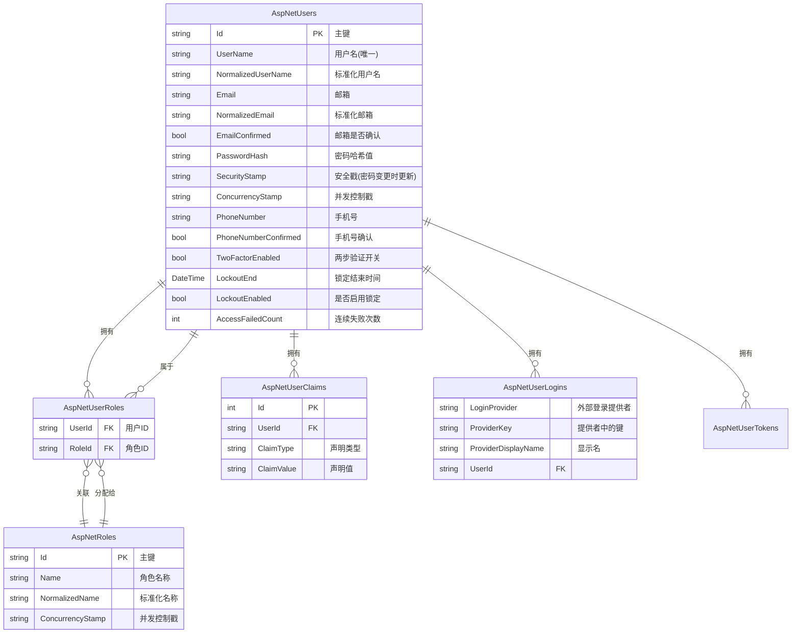
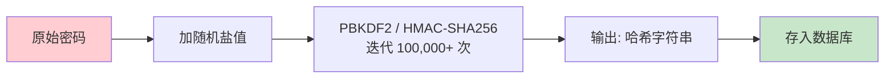

# Identity Framework 基础

> **学习时间**: 约 60 分钟 | **难度**: ⭐⭐⭐ | **前置知识**: Entity Framework Core 基础、认证授权概念、依赖注入

---

## 📌 本节目标

理解 ASP.NET Core Identity 框架的核心价值，掌握其基本架构和核心组件（UserManager、SignInManager、RoleManager），能够搭建完整的用户注册、登录、角色管理系统。

---

## 一、Identity 是什么？

### 1.1 官方定义

**ASP.NET Core Identity** 是微软官方提供的成员身份管理系统，为 ASP.NET Core 应用提供用户管理、认证、授权等功能的完整框架。

生活类比：Identity 就像一座**现成的、设施齐全的会员管理中心**

```
自己建 vs 用 Identity：

┌─────────────────────────────────────────────────────┐
│           自己从零搭建用户系统                          │
│                                                     │
│  需要自己写:                                        │
│  ├── 用户表设计 + CRUD                              │
│  ├── 密码哈希算法实现                                │
│  ├── 登录/登出逻辑                                  │
│  ├── 角色权限管理                                   │
│  ├── Token 管理                                    │
│  ├── 账户锁定机制                                   │
│  ├── 密码策略验证                                   │
│  ├── 两步验证                                       │
│  ├── 外部登录集成                                    │
│  └── ...                                           │
│                                                     │
│  工作量: 约 2-4 周                                   │
│  安全性: 取决于开发者水平                             │
│  维护成本: 高                                       │
└─────────────────────────────────────────────────────┘

┌─────────────────────────────────────────────────────┐
│          使用 Identity 框架                         │
│                                                     │
│  框架已提供:                                        │
│  ✅ 完整的用户/角色数据模型                           │
│  ✅ 安全的密码哈希（PBKDF2/HMACSHA256）               │
│  ✅ 登录/登出/注册 API                               │
│  ✅ 角色和 Claims 管理                              │
│  ✅ 账户锁定 / 密码重置                               │
│  ✅ 可配置的密码策略                                 │
│  ✅ 外部登录支持（Google/GitHub/Microsoft）            │
│  ✅ 两步验证 (2FA)                                   │
│  └── ...                                            │
│                                                     │
│  工作量: 约 1-2 天                                   │
│  安全性: 微软安全团队维护                             │
│  维护成本: 低（跟随框架升级）                         │
└─────────────────────────────────────────────────────┘
```

### 1.2 为什么用 Identity 而不是自己写？

| 维度 | 自己写 | 使用 Identity |
|------|--------|---------------|
| **开发速度** | 慢（需从头实现） | 快（开箱即用） |
| **安全性** | 取决于开发者 | 经过安全审计 |
| **密码存储** | 容易出错（明文？MD5？） | PBKDF2 + 盐值（最佳实践） |
| **功能完整性** | 需逐步添加 | 功能齐全且可扩展 |
| **社区支持** | 无 | 文档丰富、社区活跃 |
| **可定制性** | 完全自由 | 高度可扩展 |
| **维护负担** | 全部自行承担 | 框架团队负责 |

---

## 二、核心实体模型

### 2.1 实体关系图



### 2.2 核心实体详解

#### IdentityUser - 用户实体

```csharp
// 这是默认的 IdentityUser 类（简化版）
// 你可以继承它来扩展自定义字段
public class IdentityUser : IdentityUser<string>
{
    public IdentityUser() : base()
    {
        // 默认使用 string 作为主键类型
    }

    // 内置属性：
    // Id                    → 用户唯一标识（默认 GUID 字符串）
    // UserName              → 用户登录名
    // NormalizedUserName    → 标准化的用户名（大写，用于查询优化）
    // Email                 → 电子邮件地址
    // NormalizedEmail       → 标准化邮箱
    // EmailConfirmed         → 邮箱是否已验证
    // PasswordHash           → 哈希后的密码
    // SecurityStamp          → 安全标记（密码修改时自动更新）
    // ConcurrencyStamp       → 并发控制标记
    // PhoneNumber            → 手机号码
    // PhoneNumberConfirmed   → 手机号是否验证
    // TwoFactorEnabled       → 是否开启两步验证
    // LockoutEnd             → 锁定截止时间
    // LockoutEnabled         → 是否允许锁定
    // AccessFailedCount      → 连续登录失败次数
}
```

#### IdentityRole - 角色实体

```csharp
public class IdentityRole : IdentityRole<string>
{
    // Id                → 角色标识
    // Name              → 角色名称（如 "Admin", "Editor"）
    // NormalizedName    → 标准化名称
    // ConcurrencyStamp  → 并发控制
    // Users             → 导航属性：拥有此角色的用户集合
}
```

#### 其他辅助实体

```csharp
// 用户-角色 关联表（多对多）
public class IdentityUserRole<TKey>
{
    public TKey UserId { get; set; }   // 用户 ID
    public TKey RoleId { get; set; }   // 角色 ID
    // 复合主键: (UserId, RoleId)
}

// 用户声明（存储额外的键值对信息）
public class IdentityUserClaim<TKey>
{
    public int Id { get; set; }
    public TKey UserId { get; set; }
    public string ClaimType { get; set; }   // 如 "Department"
    public string ClaimValue { get; set; }  // 如 "技术部"
}

// 外部登录记录（用于第三方登录）
public class IdentityUserLogin<TKey>
{
    public string LoginProvider { get; set; }     // 如 "Google", "GitHub"
    public string ProviderKey { get; set; }       // 第三方平台上的用户 ID
    public string? ProviderDisplayName { get; set; }
    public TKey UserId { get; set; }
}

// 用户令牌（用于密码重置、邮箱确认等）
public class IdentityUserToken<TKey>
{
    public TKey UserId { get; set; }
    public string LoginProvider { get; set; }
    public string Name { get; set; }        // 如 "PasswordReset", "EmailConfirmation"
    public string Value { get; set; }       // Token 值
}
```

---

## 三、IdentityDbContext 配置

### 3.1 创建自定义 DbContext

```csharp
using Microsoft.AspNetCore.Identity;
using Microsoft.EntityFrameworkCore;

namespace MyApp.Data;

// 继承 IdentityDbContext，获得所有 Identity 表的定义
public class ApplicationDbContext : IdentityDbContext<
    IdentityUser,                    // 用户实体类型
    IdentityRole,                    // 角色实体类型
    string,                          // 主键类型
    IdentityUserClaim,               // 用户声明
    IdentityUserRole,                // 用户角色关联
    IdentityUserLogin,               // 外部登录
    IdentityRoleClaim,               // 角色声明
    IdentityUserToken>               // 用户令牌
{
    public ApplicationDbContext(DbContextOptions<ApplicationDbContext> options)
        : base(options)
    {
    }

    // 在这里可以添加你自己的 DbSet
    // public DbSet<Article> Articles { get; set; }
    // public DbSet<Category> Categories { get; set; }

    protected override void OnModelCreating(ModelBuilder builder)
    {
        base.OnModelCreating(builder);  // ⚠️ 必须调用！

        // 自定义 Identity 表名前缀（可选）
        // builder.Entity<IdentityUser>().ToTable("App_Users");
        // builder.Entity<IdentityRole>().ToTable("App_Roles");

        // 自定义其他业务实体的配置...
    }
}
```

### 3.2 Program.cs 中注册 Identity 服务

```csharp
using Microsoft.AspNetCore.Identity;
using Microsoft.EntityFrameworkCore;
using MyApp.Data;

var builder = WebApplication.CreateBuilder(args);

// ==================== 数据库连接 ====================
var connectionString = builder.Configuration.GetConnectionString("DefaultConnection")
    ?? throw new InvalidOperationException("Connection string 'DefaultConnection' not found.");

builder.Services.AddDbContext<ApplicationDbContext>(options =>
    options.UseSqlServer(connectionString));

// ==================== 核心：注册 Identity 服务 ====================
builder.Services.AddIdentity<IdentityUser, IdentityRole>(options =>
{
    // ====== 密码策略 ======
    options.Password.RequireDigit = true;              // 需要数字
    options.Password.RequiredLength = 8;               // 最少 8 个字符
    options.Password.RequireNonAlphanumeric = true;    // 需要特殊字符
    options.Password.RequireUppercase = true;          // 需要大写字母
    options.Password.RequireLowercase = true;          // 需要小写字母
    options.Password.RequiredUniqueChars = 1;          // 至少 1 个不同字符

    // ====== 锁定策略 ======
    options.Lockout.DefaultLockoutTimeSpan = TimeSpan.FromMinutes(15);  // 锁定 15 分钟
    options.Lockout.MaxFailedAccessAttempts = 5;                        // 5 次失败后锁定
    options.Lockout.AllowedForNewUsers = true;                           // 新用户也启用锁定

    // ====== 用户策略 ======
    options.User.AllowedUserNameCharacters =
        "abcdefghijklmnopqrstuvwxyzABCDEFGHIJKLMNOPQRSTUVWXYZ0123456789-._@+";
    options.User.RequireUniqueEmail = true;                  // 邮箱必须唯一

    // ====== 登录策略 ======
    options.SignIn.RequireConfirmedEmail = false;            // 是否需要验证邮箱才能登录
    options.SignIn.RequireConfirmedPhoneNumber = false;      // 是否需要验证手机号
})
.AddEntityFrameworkStores<ApplicationDbContext>()    // 使用 EF Core 存储数据
.AddDefaultTokenProviders();                         // 注册 Token 提供者（用于密码重置等）

// ==================== 认证 Cookie 配置 ====================
builder.Services.ConfigureApplicationCookie(options =>
{
    options.Cookie.Name = ".AspNetCore.Identity.Cookie";
    options.LoginPath = "/Account/Login";
    options.LogoutPath = "/Account/Logout";
    options.AccessDeniedPath = "/Account/AccessDenied";
    options.ExpireTimeSpan = TimeSpan.FromDays(14);
    options.SlidingExpiration = true;
});

// ==================== MVC / Razor Pages ====================
builder.Services.AddControllersWithViews();
// 或 builder.Services.AddRazorPages();

var app = builder.Build();

app.UseHttpsRedirection();
app.UseStaticFiles();
app.UseRouting();

// ⚠️ 顺序关键！
app.UseAuthentication();    // 认证中间件
app.UseAuthorization();      // 授权中间件

app.MapControllerRoute(
    name: "default",
    pattern: "{controller=Home}/{action=Index}/{id?}");

app.Run();
```

### 3.3 生成的数据库表结构

执行数据库迁移后，Identity 会创建以下表：

| 表名 | 说明 | 对应实体 |
|------|------|----------|
| `AspNetUsers` | 用户信息表 | IdentityUser |
| `AspNetRoles` | 角色信息表 | IdentityRole |
| `AspNetUserRoles` | 用户-角色关联表 | IdentityUserRole |
| `AspNetUserClaims` | 用户声明表 | IdentityUserClaim |
| `AspNetUserLogins` | 外部登录表 | IdentityUserLogin |
| `AspNetUserTokens` | 用户令牌表 | IdentityUserToken |
| `AspNetRoleClaims` | 角色声明表 | IdentityRoleClaim |

---

## 四、三大核心服务详解

### 4.1 UserManager<TUser> - 用户管理服务

这是操作用户的"瑞士军刀"，几乎所有与用户相关的操作都通过它完成。

```csharp
using Microsoft.AspNetCore.Identity;

public class UserService
{
    private readonly UserManager<IdentityUser> _userManager;
    private readonly ILogger<UserService> _logger;

    public UserService(UserManager<IdentityUser> userManager, ILogger<UserService> logger)
    {
        _userManager = userManager;
        _logger = logger;
    }

    // ========== 创建用户 ==========

    /// <summary>
    /// 注册新用户
    /// </summary>
    public async Task<(IdentityResult Result, IdentityUser? User)> CreateUserAsync(
        string email, string password, string userName)
    {
        var user = new IdentityUser
        {
            UserName = userName,
            Email = email,
            EmailConfirmed = false,
            SecurityStamp = Guid.NewGuid().ToString()
        };

        var result = await _userManager.CreateAsync(user, password);

        if (!result.Succeeded)
        {
            _logger.LogWarning("创建用户失败: {Errors}",
                string.Join(", ", result.Errors.Select(e => e.Description)));
        }

        return (result, result.Succeeded ? user : null);
    }

    // ========== 查询用户 ==========

    /// <summary>
    /// 通过 ID 查找用户
    /// </summary>
    public async Task<IdentityUser?> GetUserByIdAsync(string userId)
    {
        return await _userManager.FindByIdAsync(userId);
    }

    /// <summary>
    /// 通过用户名查找
    /// </summary>
    public async Task<IdentityUser?> GetByUserNameAsync(string userName)
    {
        return await _userManager.FindByNameAsync(userName);
    }

    /// <summary>
    /// 通过邮箱查找
    /// </summary>
    public async Task<IdentityUser?> GetByEmailAsync(string email)
    {
        return await _userManager.FindByEmailAsync(email);
    }

    /// <summary>
    /// 分页获取用户列表
    /// </summary>
    public async Task<PagedResult<IdentityUser>> GetPagedUsersAsync(int page, int pageSize)
    {
        var query = _userManager.Users;
        var totalCount = await query.CountAsync();

        var users = await query
            .OrderByDescending(u => u.CreatedAt)  // 注意：需要自定义字段
            .Skip((page - 1) * pageSize)
            .Take(pageSize)
            .ToListAsync();

        return new PagedResult<IdentityUser>(users, totalCount, page, pageSize);
    }

    // ========== 更新用户 ==========

    /// <summary>
    /// 更新用户基本信息
    /// </summary>
    public async Task<IdentityResult> UpdateUserProfileAsync(string userId, string displayName, string phoneNumber)
    {
        var user = await _userManager.FindByIdAsync(userId);
        if (user == null) return IdentityResult.Failed(new IdentityError { Description = "用户不存在" });

        // 如果你的 IdentityUser 有自定义字段，在这里设置
        // user.DisplayName = displayName;
        user.PhoneNumber = phoneNumber;

        return await _userManager.UpdateAsync(user);
    }

    /// <summary>
    /// 修改密码
    /// </summary>
    public async Task<IdentityResult> ChangePasswordAsync(string userId, string currentPassword, string newPassword)
    {
        var user = await _userManager.FindByIdAsync(userId);
        if (user == null) return IdentityResult.Failed(new IdentityError { Description = "用户不存在" });

        return await _userManager.ChangePasswordAsync(user, currentPassword, newPassword);
    }

    /// <summary>
    /// 重置密码（管理员操作或忘记密码流程）
    /// </summary>
    public async Task<IdentityResult> ResetPasswordAsync(string userId, string token, string newPassword)
    {
        var user = await _userManager.FindByIdAsync(userId);
        if (user == null) return IdentityResult.Failed(new IdentityError { Description = "用户不存在" });

        return await _userManager.ResetPasswordAsync(user, token, newPassword);
    }

    // ========== 删除用户 ==========

    /// <summary>
    /// 软删除/硬删除用户
    /// </summary>
    public async Task<IdentityResult> DeleteUserAsync(string userId)
    {
        var user = await _userManager.FindByIdAsync(userId);
        if (user == null) return IdentityResult.Failed(new IdentityError { Description = "用户不存在" });

        return await _userManager.DeleteAsync(user);
    }

    // ========== 角色管理 ==========

    /// <summary>
    /// 将用户添加到角色
    /// </summary>
    public async Task<IdentityResult> AddToRoleAsync(string userId, string roleName)
    {
        var user = await _userManager.FindByIdAsync(userId);
        if (user == null) return IdentityResult.Failed(new IdentityError { Description = "用户不存在" });

        return await _userManager.AddToRoleAsync(user, roleName);
    }

    /// <summary>
    /// 从角色中移除用户
    /// </summary>
    public async Task<IdentityResult> RemoveFromRoleAsync(string userId, string roleName)
    {
        var user = await _userManager.FindByIdAsync(userId);
        if (user == null) return IdentityResult.Failed(new IdentityError { Description = "用户不存在" });

        return await _userManager.RemoveFromRoleAsync(user, roleName);
    }

    /// <summary>
    /// 获取用户的所有角色
    /// </summary>
    public async Task<IList<string>> GetUserRolesAsync(string userId)
    {
        var user = await _userManager.FindByIdAsync(userId);
        if (user == null) return new List<string>();

        return await _userManager.GetRolesAsync(user);
    }

    /// <summary>
    /// 检查用户是否在指定角色中
    /// </summary>
    public async Task<bool> IsInRoleAsync(string userId, string roleName)
    {
        var user = await _userManager.FindByIdAsync(userId);
        if (user == null) return false;

        return await _userManager.IsInRoleAsync(user, roleName);
    }

    // ========== Claims 管理 ==========

    /// <summary>
    /// 为用户添加 Claim
    /// </summary>
    public async Task<IdentityResult> AddClaimAsync(string userId, Claim claim)
    {
        var user = await _userManager.FindByIdAsync(userId);
        if (user == null) return IdentityResult.Failed(new IdentityError { Description = "用户不存在" });

        return await _userManager.AddClaimAsync(user, claim);
    }

    /// <summary>
    /// 获取用户的所有 Claims
    /// </summary>
    public async Task<IList<Claim>> GetUserClaimsAsync(string userId)
    {
        var user = await _userManager.FindByIdAsync(userId);
        if (user == null) return new List<Claim>();

        return await _userManager.GetClaimsAsync(user);
    }

    // ========== Token 生成 ==========

    /// <summary>
    /// 生成密码重置 Token
    /// </summary>
    public async Task<string> GeneratePasswordResetTokenAsync(string userId)
    {
        var user = await _userManager.FindByIdAsync(userId);
        if (user == null) throw new Exception("用户不存在");

        return await _userManager.GeneratePasswordResetTokenAsync(user);
    }

    /// <summary>
    /// 生成邮箱确认 Token
    /// </summary>
    public async Task<string> GenerateEmailConfirmationTokenAsync(string userId)
    {
        var user = await _userManager.FindByIdAsync(userId);
        if (user == null) throw new Exception("用户不存在");

        return await _userManager.GenerateEmailConfirmationTokenAsync(user);
    }

    // ========== 辅助方法 ==========

    /// <summary>
    /// 检查密码是否正确（不登录）
    /// </summary>
    public async Task<bool> CheckPasswordAsync(string userId, string password)
    {
        var user = await _userManager.FindByIdAsync(userId);
        if (user == null) return false;

        return await _userManager.CheckPasswordAsync(user, password);
    }

    /// <summary>
    /// 获取锁定的剩余时间
    /// </summary>
    public async Task<TimeSpan?> GetRemainingLockoutAsync(string userId)
    {
        var user = await _userManager.FindByIdAsync(userId);
        if (user == null || !user.LockoutEnd.HasValue) return null;

        var remaining = user.LockoutEnd.Value.UtcDateTime - DateTime.UtcNow;
        return remaining > TimeSpan.Zero ? remaining : null;
    }
}
```

### 4.2 SignInManager<TUser> - 登录管理服务

专门处理登录、登出、外部登录等认证相关操作。

```csharp
using Microsoft.AspNetCore.Authentication;
using Microsoft.AspNetCore.Identity;

public class AccountService
{
    private readonly SignInManager<IdentityUser> _signInManager;
    private readonly UserManager<IdentityUser> _userManager;
    private readonly ILogger<AccountService> _logger;

    public AccountService(
        SignInManager<IdentityUser> signInManager,
        UserManager<IdentityUser> userManager,
        ILogger<AccountService> logger)
    {
        _signInManager = signInManager;
        _userManager = userManager;
        _logger = logger;
    }

    /// <summary>
    /// 密码登录
    /// </summary>
    public async Task<SignInResult> PasswordSignInAsync(
        string username, string password, bool rememberMe, bool lockoutOnFailure)
    {
        var result = await _signInManager.PasswordSignInAsync(
            username,
            password,
            rememberMe,
            lockoutOnFailure: lockoutOnFailure);

        switch (result)
        {
            case SignInResult.Success:
                _logger.LogInformation("用户 {Username} 登录成功", username);
                break;
            case SignInResult.Failed:
                _logger.LogWarning("用户 {Username} 登录失败", username);
                break;
            case SignInResult.LockedOut:
                _logger.LogWarning("用户 {Username} 账户已锁定", username);
                break;
            case SignInResult.NotAllowed:
                _logger.LogWarning("用户 {Username} 不被允许登录", username);
                break;
            case SignInResult.TwoFactorRequired:
                _logger.LogInformation("用户 {Username} 需要两步验证", username);
                break;
        }

        return result;
    }

    /// <summary>
    /// 登出当前用户
    /// </summary>
    public async Task SignOutAsync()
    {
        await _signInManager.SignOutAsync();
        _logger.LogInformation("用户已登出");
    }

    /// <summary>
    /// 检查是否有用户已登录
    /// </summary>
    public bool IsSignedIn(ClaimsPrincipal principal)
    {
        return _signInManager.IsSignedIn(principal);
    }

    /// <summary>
    /// 获取用于两步验证的用户
    /// </summary>
    public async Task<IdentityUser?> GetTwoFactorAuthenticationUserAsync()
    {
        return await _signInManager.GetTwoFactorAuthenticationUserAsync();
    }

    /// <summary>
    /// 两步验证登录
    /// </summary>
    public async Task<SignInResult> TwoFactorSignInAsync(
        string provider, string code, bool rememberMe, bool rememberClient)
    {
        return await _signInManager.TwoFactorSignInAsync(provider, code, rememberMe, rememberClient);
    }

    /// <summary>
    /// 外部登录回调处理
    /// </summary>
    public ExternalLoginInfo? GetExternalLoginInfo()
    {
        return _signInManager.GetExternalLoginInfo();
    }

    /// <summary>
    /// 外部登录（首次）
    /// </summary>
    public async Task<ExternalLoginResult> ExternalLoginSignInAsync(
        string loginProvider, string providerKey, bool isPersistent)
    {
        var result = await _signInManager.ExternalLoginSignInAsync(
            loginProvider, providerKey, isPersistent);

        return new ExternalLoginResult
        {
            IsSuccess = result.Succeeded,
            IsLockedOut = result.IsLockedOut,
            IsNotAllowed = result.IsNotAllowed,
            RequiresTwoFactor = result.RequiresTwoFactor
        };
    }
}

public class ExternalLoginResult
{
    public bool IsSuccess { get; set; }
    public bool IsLockedOut { get; set; }
    public bool IsNotAllowed { get; set; }
    public bool RequiresTwoFactor { get; set; }
}
```

### 4.3 RoleManager<TRole> - 角色管理服务

```csharp
using Microsoft.AspNetCore.Identity;

public class RoleService
{
    private readonly RoleManager<IdentityRole> _roleManager;
    private readonly ILogger<RoleService> _logger;

    public RoleService(RoleManager<IdentityRole> roleManager, ILogger<RoleService> logger)
    {
        _roleManager = roleManager;
        _logger = logger;
    }

    /// <summary>
    /// 创建新角色
    /// </summary>
    public async Task<IdentityResult> CreateRoleAsync(string roleName)
    {
        if (await _roleManager.RoleExistsAsync(roleName))
        {
            return IdentityResult.Failed(new IdentityError
            {
                Code = "DuplicateRoleName",
                Description = $"角色 '{roleName}' 已存在"
            });
        }

        var role = new IdentityRole(roleName.Trim());
        var result = await _roleManager.CreateAsync(role);

        if (result.Succeeded)
        {
            _logger.LogInformation("创建角色成功: {RoleName}", roleName);
        }

        return result;
    }

    /// <summary>
    /// 批量初始化默认角色（应用启动时调用）
    /// </summary>
    public async Task InitializeDefaultRolesAsync()
    {
        var defaultRoles = new[] { "Admin", "Editor", "User", "Guest" };

        foreach (var role in defaultRoles)
        {
            if (!await _roleManager.RoleExistsAsync(role))
            {
                await _roleManager.CreateAsync(new IdentityRole(role));
                _logger.LogInformation("初始化角色: {Role}", role);
            }
        }
    }

    /// <summary>
    /// 获取所有角色
    /// </summary>
    public async Task<List<IdentityRole>> GetAllRolesAsync()
    {
        return await _roleManager.Roles.OrderBy(r => r.Name).ToListAsync();
    }

    /// <summary>
    /// 根据名称查找角色
    /// </summary>
    public async Task<IdentityRole?> FindByNameAsync(string roleName)
    {
        return await _roleManager.FindByNameAsync(roleName);
    }

    /// <summary>
    /// 更新角色
    /// </summary>
    public async Task<IdentityResult> UpdateRoleAsync(string roleId, string newName)
    {
        var role = await _roleManager.FindByIdAsync(roleId);
        if (role == null) return IdentityResult.Failed(new IdentityError { Description = "角色不存在" });

        role.Name = newName.Trim();
        role.NormalizedName = newName.ToUpperInvariant();

        return await _roleManager.UpdateAsync(role);
    }

    /// <summary>
    /// 删除角色
    /// </summary>
    public async Task<IdentityResult> DeleteRoleAsync(string roleId)
    {
        var role = await _roleManager.FindByIdAsync(roleId);
        if (role == null) return IdentityResult.Failed(new IdentityError { Description = "角色不存在" });

        // 检查是否有用户在使用此角色
        var usersInRole = await _userManager.GetUsersInRoleAsync(role.Name!);
        if (usersInRole.Any())
        {
            return IdentityResult.Failed(new IdentityError
            {
                Description = $"无法删除角色 '{role.Name}'，仍有 {usersInRole.Count} 个用户在使用该角色"
            });
        }

        return await _roleManager.DeleteAsync(role);
    }

    /// <summary>
    /// 获取角色的用户列表
    /// </summary>
    public async Task<IList<IdentityRole>> GetUserRolesAsync(IdentityUser user)
    {
        // 注意：这里需要注入 UserManager
        // var roles = await _userManager.GetRolesAsync(user);
        // 返回 Role 对象列表
        throw new NotImplementedException();
    }
}
```

---

## 五、密码哈希：为什么不能明文存储？

### 5.1 明文存储的危害

```
❌ 明文存储密码的场景：

数据库泄露后：
┌─────────────────────────────────┐
│  Users 表                       │
│  ┌──────┬──────────┬─────────┐ │
│  │ Name │ Email    │ Password │ │
│  ├──────┼──────────┼─────────┤ │
│  │ 张三 │ z@t.com  │ 123456  │ │ ← 直接可用！
│  │ 李四 │ l@t.com  │ password│ │ ← 直接可用！
│  └──────┴──────────┴─────────┘ │
│                                 │
│  攻击者可以直接用这些密码去尝试  │
│  登录用户的银行、邮箱等其他账户  │
│  （因为很多人重复使用密码！）      │
└─────────────────────────────────┘
```

### 5.2 Identity 的密码哈希方案



Identity 默认使用的密码哈希方案：

```csharp
// Identity 的密码哈希格式示例（V3 版本）：
// 01000000...（版本头） + 哈希值 + 盐值 + 迭代次数 + 子密钥

// 具体特点：
// 1. 使用 PBKDF2-HMAC-SHA256 算法
// 2. 每个密码有独立的随机盐值（即使相同密码，哈希也不同）
// 3. 可配置的迭代次数（默认 100,000 次，抵抗暴力破解）
// 4. 包含版本信息，便于未来算法升级
```

### 5.3 哈希验证过程

```csharp
// 当用户输入密码登录时：

// 1. 从数据库取出存储的 HashedPassword
// 2. Identity 的 IPasswordHasher 自动解析出盐值和参数
// 3. 对输入密码用相同的盐值和参数重新计算哈希
// 4. 比较两次哈希结果是否一致
// 5. 一致则密码正确，否则错误

// 开发者不需要手动处理这些！UserManager 和 SignInManager 会自动完成。
```

---

## 六、完整注册/登录页面实现

### 6.1 AccountController

```csharp
using Microsoft.AspNetCore.Authorization;
using Microsoft.AspNetCore.Identity;
using Microsoft.AspNetCore.Mvc;
using System.Security.Claims;

namespace MyApp.Controllers;

public class AccountController : Controller
{
    private readonly UserManager<IdentityUser> _userManager;
    private readonly SignInManager<IdentityUser> _signInManager;
    private readonly ILogger<AccountController> _logger;

    public AccountController(
        UserManager<IdentityUser> userManager,
        SignInManager<IdentityUser> signInManager,
        ILogger<AccountController> logger)
    {
        _userManager = userManager;
        _signInManager = signInManager;
        _logger = logger;
    }

    // ==================== 注册 ====================

    [HttpGet]
    [AllowAnonymous]
    public IActionResult Register()
    {
        return View();
    }

    [HttpPost]
    [AllowAnonymous]
    [ValidateAntiForgeryToken]
    public async Task<IActionResult> Register(RegisterViewModel model)
    {
        if (!ModelState.IsValid)
            return View(model);

        // 检查用户名是否已存在
        var existingUserByName = await _userManager.FindByNameAsync(model.UserName);
        if (existingUserByName != null)
        {
            ModelState.AddModelError("UserName", "此用户名已被使用");
            return View(model);
        }

        // 检查邮箱是否已存在
        var existingUserByEmail = await _userManager.FindByEmailAsync(model.Email);
        if (existingUserByEmail != null)
        {
            ModelState.AddModelError("Email", "此邮箱已被注册");
            return View(model);
        }

        // 创建用户对象
        var user = new IdentityUser
        {
            UserName = model.UserName.Trim(),
            Email = model.Email.Trim().ToLowerInvariant(),
            EmailConfirmed = false,
            SecurityStamp = Guid.NewGuid().ToString(),
            // 如果有自定义字段，在这里设置
        };

        // 创建用户（同时哈希密码）
        var result = await _userManager.CreateAsync(user, model.Password);

        if (!result.Succeeded)
        {
            foreach (var error in result.Errors)
            {
                ModelState.AddModelError("", error.Description);
            }
            return View(model);
        }

        // 将用户加入默认角色（如 "User"）
        await _userManager.AddToRoleAsync(user, "User");

        _logger.LogInformation("新用户注册成功: {UserId}, UserName: {UserName}",
            user.Id, user.UserName);

        // TODO: 发送邮箱确认邮件
        // var token = await _userManager.GenerateEmailConfirmationTokenAsync(user);
        // var confirmationLink = Url.Action(nameof(ConfirmEmail), "Account",
        //     new { userId = user.Id, token = token }, Request.Scheme);
        // await _emailService.SendConfirmationEmailAsync(user.Email, confirmationLink);

        // 自动登录新用户（可选）
        await _signInManager.SignInAsync(user, isPersistent: false);

        return RedirectToAction("Index", "Home");
    }

    // ==================== 登录 ====================

    [HttpGet]
    [AllowAnonymous]
    public IActionResult Login(string? returnUrl = null)
    {
        ViewData["ReturnUrl"] = returnUrl;
        return View();
    }

    [HttpPost]
    [AllowAnonymous]
    [ValidateAntiForgeryToken]
    public async Task<IActionResult> Login(LoginViewModel model, string? returnUrl = null)
    {
        ViewData["ReturnUrl"] = returnUrl;

        if (!ModelState.IsValid)
            return View(model);

        // 查找用户
        var user = await _userManager.FindByNameAsync(model.UserName);
        if (user == null)
        {
            ModelState.AddModelError("", "用户名或密码错误");
            return View(model);
        }

        // 检查是否被禁用
        if (!user.EmailConfirmed && _userManager.Options.SignIn.RequireConfirmedEmail)
        {
            ModelState.AddModelError("", "请先验证您的邮箱后再登录");
            return View(model);
        }

        // 尝试登录
        var result = await _signInManager.PasswordSignInAsync(
            model.UserName,
            model.Password,
            model.RememberMe,
            lockoutOnFailure: true);  // 启用账户锁定

        if (result.Succeeded)
        {
            _logger.LogInformation("用户 {UserName} 登录成功", model.UserName);

            // 清除可能存在的失败计数
            await _userManager.ResetAccessFailedCountAsync(user);

            // 处理返回 URL
            if (!string.IsNullOrEmpty(returnUrl) && Url.IsLocalUrl(returnUrl))
            {
                return LocalRedirect(returnUrl);
            }
            return RedirectToAction("Index", "Home");
        }

        if (result.IsLockedOut)
        {
            var lockoutEnd = user.LockoutEnd;
            var remainingTime = lockoutEnd.HasValue
                ? (lockoutEnd.Value.UtcDateTime - DateTime.UtcNow).TotalMinutes
                : 0;

            _logger.LogWarning("用户 {UserName} 账户已锁定，剩余 {Minutes:F0} 分钟",
                model.UserName, remainingTime);

            ModelState.AddModelError("", $"账户已锁定，请在 {remainingTime:F0} 分钟后重试，或联系管理员解锁。");
            return View(model);
        }

        if (result.RequiresTwoFactor)
        {
            return RedirectToAction(nameof(LoginWith2fa), new { returnUrl, model.RememberMe });
        }

        if (result.IsNotAllowed)
        {
            ModelState.AddModelError("", "此账户不允许登录");
            return View(model);
        }

        // 登录失败
        ModelState.AddModelError("", "用户名或密码错误");
        return View(model);
    }

    // ==================== 登出 ====================

    [HttpPost]
    [ValidateAntiForgeryToken]
    public async Task<IActionResult> Logout()
    {
        await _signInManager.SignOutAsync();
        _logger.LogInformation("用户已登出");
        return RedirectToAction("Index", "Home");
    }

    // ==================== 拒绝访问 ====================

    [HttpGet]
    public IActionResult AccessDenied()
    {
        return View();
    }

    // ==================== 个人资料 ====================

    [HttpGet]
    [Authorize]
    public async Task<IActionResult> Profile()
    {
        var user = await _userManager.GetUserAsync(User);
        if (user == null) return NotFound();

        var model = new ProfileViewModel
        {
            UserName = user.UserName!,
            Email = user.Email!,
            PhoneNumber = user.PhoneNumber,
            Roles = await _userManager.GetRolesAsync(user)
        };

        return View(model);
    }

    [HttpPost]
    [Authorize]
    [ValidateAntiForgeryToken]
    public async Task<IActionResult> Profile(ProfileViewModel model)
    {
        if (!ModelState.IsValid)
            return View(model);

        var user = await _userManager.GetUserAsync(User);
        if (user == null) return NotFound();

        user.PhoneNumber = model.PhoneNumber;
        var result = await _userManager.UpdateAsync(user);

        if (result.Succeeded)
        {
            TempData["SuccessMessage"] = "个人资料更新成功";
            return RedirectToAction(nameof(Profile));
        }

        foreach (var error in result.Errors)
        {
            ModelState.AddModelError("", error.Description);
        }

        return View(model);
    }

    // ==================== 修改密码 ====================

    [HttpGet]
    [Authorize]
    public IActionResult ChangePassword()
    {
        return View();
    }

    [HttpPost]
    [Authorize]
    [ValidateAntiForgeryToken]
    public async Task<IActionResult> ChangePassword(ChangePasswordViewModel model)
    {
        if (!ModelState.IsValid)
            return View(model);

        var user = await _userManager.GetUserAsync(User);
        if (user == null) return NotFound();

        var result = await _userManager.ChangePasswordAsync(user, model.CurrentPassword, model.NewPassword);

        if (result.Succeeded)
        {
            // 密码修改后强制重新登录
            await _signInManager.RefreshSignInAsync(user);
            TempData["SuccessMessage"] = "密码修改成功";
            return RedirectToAction(nameof(Profile));
        }

        foreach (var error in result.Errors)
        {
            ModelState.AddModelError("", error.Description);
        }

        return View(model);
    }
}
```

### 6.2 ViewModel 定义

```csharp
using System.ComponentModel.DataAnnotations;

public class RegisterViewModel
{
    [Required(ErrorMessage = "请输入用户名")]
    [StringLength(30, MinimumLength = 3, ErrorMessage = "用户名长度应在 3-30 个字符之间")]
    [Display(Name = "用户名")]
    public string UserName { get; set; } = string.Empty;

    [Required(ErrorMessage = "请输入邮箱")]
    [EmailAddress(ErrorMessage = "请输入有效的邮箱地址")]
    [Display(Name = "电子邮箱")]
    public string Email { get; set; } = string.Empty;

    [Required(ErrorMessage = "请输入密码")]
    [DataType(DataType.Password)]
    [StringLength(100, ErrorMessage = "{0}长度至少为{2}个字符", MinimumLength = 6)]
    [Display(Name = "密码")]
    public string Password { get; set; } = string.Empty;

    [DataType(DataType.Password)]
    [Display(Name = "确认密码")]
    [Compare("Password", ErrorMessage = "两次输入的密码不一致")]
    public string ConfirmPassword { get; set; } = string.Empty;
}

public class LoginViewModel
{
    [Required(ErrorMessage = "请输入用户名")]
    [Display(Name = "用户名")]
    public string UserName { get; set; } = string.Empty;

    [Required(ErrorMessage = "请输入密码")]
    [DataType(DataType.Password)]
    [Display(Name = "密码")]
    public string Password { get; set; } = string.Empty;

    [Display(Name = "记住我")]
    public bool RememberMe { get; set; }
}

public class ChangePasswordViewModel
{
    [Required(ErrorMessage = "请输入当前密码")]
    [DataType(DataType.Password)]
    [Display(Name = "当前密码")]
    public string CurrentPassword { get; set; } = string.Empty;

    [Required(ErrorMessage = "请输入新密码")]
    [DataType(DataType.Password)]
    [StringLength(100, ErrorMessage = "{0}至少{2}个字符", MinimumLength = 6)]
    [Display(Name = "新密码")]
    public string NewPassword { get; set; } = string.Empty;

    [DataType(DataType.Password)]
    [Display(Name = "确认新密码")]
    [Compare("NewPassword", ErrorMessage = "两次输入的新密码不一致")]
    public string ConfirmNewPassword { get; set; } = string.Empty;
}

public class ProfileViewModel
{
    public string UserName { get; set; } = string.Empty;
    public string Email { get; set; } = string.Empty;
    public string? PhoneNumber { get; set; }
    public IList<string> Roles { get; set; } = new List<string>();
}
```

---

## 七、数据迁移与初始化

### 7.1 创建并执行迁移

```bash
# 1. 创建初始迁移
dotnet ef migrations add InitialIdentityCreate \
    --context ApplicationDbContext

# 2. 应用迁移到数据库
dotnet ef database update \
    --context ApplicationDbContext
```

### 7.2 种子数据初始化（创建管理员账户）

```csharp
public static class DbInitializer
{
    public static async Task Initialize(IServiceProvider serviceProvider)
    {
        using var scope = serviceProvider.CreateScope();
        var services = scope.ServiceProvider;

        try
        {
            var context = services.GetRequiredService<ApplicationDbContext>();
            var userManager = services.GetRequiredService<UserManager<IdentityUser>>();
            var roleManager = services.GetRequiredService<RoleManager<IdentityRole>>();

            // 确保数据库已创建
            context.Database.EnsureCreated();

            // 初始化默认角色
            await InitializeRolesAsync(roleManager);

            // 创建默认管理员账户
            await CreateDefaultAdminAsync(userManager);

            Console.WriteLine("[DbInitializer] 数据库初始化完成");
        }
        catch (Exception ex)
        {
            Console.WriteLine($"[DbInitializer] 初始化失败: {ex.Message}");
        }
    }

    private static async Task InitializeRolesAsync(RoleManager<IdentityRole> roleManager)
    {
        var roles = new[] { "Admin", "Editor", "User" };

        foreach (var roleName in roles)
        {
            if (!await roleManager.RoleExistsAsync(roleName))
            {
                await roleManager.CreateAsync(new IdentityRole(roleName));
                Console.WriteLine($"[DbInitializer] 创建角色: {roleName}");
            }
        }
    }

    private static async Task CreateDefaultAdminAsync(UserManager<IdentityUser> userManager)
    {
        const string adminEmail = "admin@example.com";
        const string adminUserName = "admin";
        const string adminPassword = "Admin@123456";  // 生产环境必须更改！

        var adminUser = await userManager.FindByEmailAsync(adminEmail);
        if (adminUser == null)
        {
            adminUser = new IdentityUser
            {
                UserName = adminUserName,
                Email = adminEmail,
                EmailConfirmed = true,
                SecurityStamp = Guid.NewGuid().ToString()
            };

            var result = await userManager.CreateAsync(adminUser, adminPassword);

            if (result.Succeeded)
            {
                await userManager.AddToRoleAsync(adminUser, "Admin");
                Console.WriteLine($"[DbInitializer] 创建管理员账户: {adminEmail}");
            }
            else
            {
                Console.WriteLine($"[DbInitializer] 创建管理员失败: " +
                    $"{string.Join(", ", result.Errors.Select(e => e.Description))}");
            }
        }
    }
}
```

在 Program.cs 中调用初始化：

```csharp
var app = builder.Build();

// 在应用启动时初始化数据库
await DbInitializer.Initialize(app.Services);

app.Run();
```

---

## 八、安全最佳实践清单

### DO ✅

- **DO** 始终使用 UserManager 来操作用户，不要直接操作数据库
- **DO** 设置强密码策略（长度、复杂度要求）
- **DO** 启用账户锁定功能防止暴力破解
- **DO** 使用 HTTPS 传输所有认证相关信息
- **DO** 定期备份 Identity 相关的数据库表
- **DO** 实现 Email 确认和密码重置功能
- **DO** 使用 `RequireUniqueEmail = true` 防止重复注册
- **DO** 敏感操作（删除用户、修改角色）记录审计日志

### DON'T ❌

- **DON'T** 不要明文存储或比较密码（永远使用 UserManager 的方法）
- **DON'T** 不要在生产环境使用简单密码作为默认管理员密码
- **DON'T** 不要忽略 IdentityResult 中的错误信息
- **DON'T** 不要在前端代码中暴露内部用户 ID 或敏感信息
- **DON'T** 不要禁用账户锁定功能（除非有充分的理由）
- **DON'T** 不要忘记调用 `base.OnModelCreating()` 在自定义 DbContext 中
- **DON'T** 不要直接修改 SecurityStamp（由框架自动管理）
- **DON'T** 不要将 Identity 表与其他业务表混在一起做复杂的 JOIN 操作

---

## 九、练习题

### 练习 1：基础操作
使用 UserManager 完成以下操作序列：
1. 创建一个用户（username: testuser, email: test@test.com, password: Test@123456）
2. 给该用户添加 Editor 角色
3. 查询该用户的所有角色
4. 修改该用户的密码为新密码
5. 删除该用户

### 练习 2：登录流程分析
编写一个完整的登录 Action，包含以下逻辑：
- 参数验证
- 用户查找
- 密码验证（使用 SignInManager）
- 账户状态检查（是否锁定、是否确认邮箱）
- 登录失败次数记录
- 成功/失败的日志记录
- 不同情况的不同错误提示

### 练习 3：角色初始化
编写一个种子数据初始化器，创建以下角色及其层级关系：
- SuperAdmin（超级管理员）
- Admin（管理员）
- Moderator（版主）
- User（普通用户）

并为每种角色说明其大致权限范围。

### 练习 4：自定义字段
如果需要在用户表中增加以下字段：昵称(Nickname)、头像URL(AvatarUrl)、生日(BirthDate)，应该如何实现？（提示：继承 IdentityUser）

### 练习 5：安全审查
以下代码有什么安全问题？
```csharp
[HttpPost("login")]
public async Task<IActionResult> QuickLogin(string username, string password)
{
    var user = await _userManager.FindByNameAsync(username);
    if (_passwordHasher.VerifyHashedPassword(user, user.PasswordHash, password)
        == PasswordVerificationResult.Success)
    {
        await _signInManager.SignInAsync(user, true);
        return Ok();
    }
    return Unauthorized();
}
```

---

## 十、延伸阅读

- [Microsoft Docs: ASP.NET Core Identity 简介](https://docs.microsoft.com/zh-cn/aspnet/core/security/authentication/identity)
- [Microsoft Docs: Identity 的帐户确认和密码恢复](https://docs.microsoft.com/zh-cn/aspnet/core/security/authentication/accconfirm)
- [Microsoft Docs: 在 ASP.NET Core 中设置 ASP.NET Core Identity](https://docs.microsoft.com/zh-cn/aspnet/core/security/authentication/identity-configuration)
- [Identity 源码 (GitHub)](https://github.com/dotnet/aspnetcore/tree/main/src/Identity)
- [OWASP: Authentication Cheat Sheet](https://cheatsheetseries.owasp.org/cheatsheets/Authentication_Cheat_Sheet.html)

---

> **下一节预告**：我们将学习 **Identity Framework 进阶**，包括自定义用户实体、外部登录集成、两步验证、高级查询等更深入的主题。
