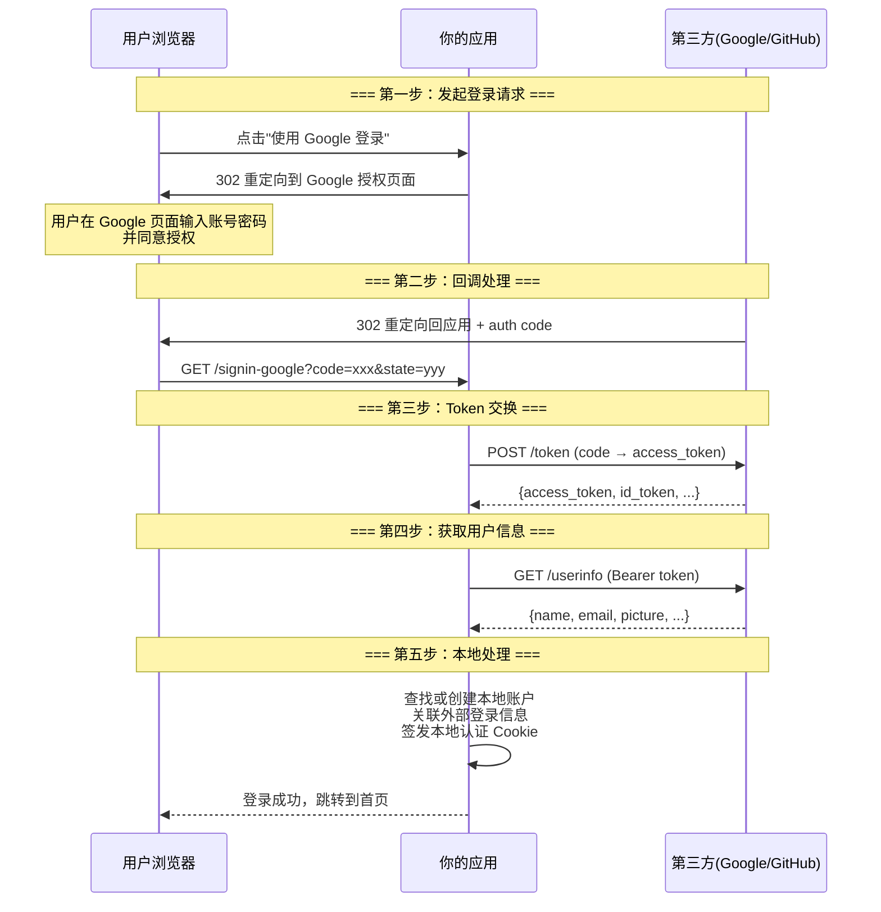

# Identity Framework 进阶

> **学习时间**: 约 65 分钟 | **难度**: ⭐⭐⭐⭐ | **前置知识**: Identity 基础、Entity Framework Core 进阶、依赖注入

---

## 📌 本节目标

掌握 Identity 的高级定制能力，包括自定义用户实体和角色实体、Claims 的灵活使用、外部登录集成、两步验证实现、以及高级查询和管理功能。

---

## 一、自定义 IdentityUser（添加自定义字段）

### 1.1 为什么需要自定义？

默认的 `IdentityUser` 只包含基础字段，但实际业务中通常需要更多信息：

```
默认 IdentityUser 字段:
├── Id, UserName, Email, PasswordHash
├── SecurityStamp, ConcurrencyStamp
├── PhoneNumber, TwoFactorEnabled
└── LockoutEnd, LockoutEnabled, AccessFailedCount

实际业务需要的字段:
├── Nickname (昵称)           ← 缺少！
├── AvatarUrl (头像地址)       ← 缺少！
├── BirthDate (生日)          ← 缺少！
├── Gender (性别)             ← 缺少！
├── Bio (个人简介)            ← 缺少！
├── LastLoginTime (最后登录时间) ← 缺少！
└── CreatedAt (注册时间)      ← 缺少！
```

### 1.2 实现步骤

#### 步骤一：创建自定义用户类

```csharp
using Microsoft.AspNetCore.Identity;

namespace MyApp.Models;

/// <summary>
/// 自定义用户实体，继承自 IdentityUser
/// </summary>
public class ApplicationUser : IdentityUser
{
    // ========== 基本信息 ==========
    public string? Nickname { get; set; }              // 昵称
    public string? AvatarUrl { get; set; }             // 头像 URL
    public DateTime? BirthDate { get; set; }           // 出生日期
    public string? Gender { get; set; }                // 性别: M/F/Other
    public string? Bio { get; set; }                   // 个人简介

    // ========== 地址信息 ==========
    public string? Country { get; set; }               // 国家
    public string? Province { get; set; }              // 省份
    public string? City { get; set; }                  // 城市

    // ========== 时间戳 ==========
    public DateTime CreatedAt { get; set; } = DateTime.UtcNow;   // 注册时间
    public DateTime? LastLoginAt { get; set; }         // 最后登录时间
    public DateTime? LastPasswordChangedAt { get; set; } // 密码最后修改时间

    // ========== 导航属性 ==========
    public virtual ICollection<Article>? Articles { get; set; }      // 用户发布的文章
    public virtual ICollection<Comment>? Comments { get; set; }     // 用户发表的评论
}
```

#### 步骤二：创建自定义角色类（可选）

```csharp
using Microsoft.AspNetCore.Identity;

namespace MyApp.Models;

/// <summary>
/// 自定义角色实体，继承自 IdentityRole
/// </summary>
public class ApplicationRole : IdentityRole
{
    public string? Description { get; set; }           // 角色描述
    public int SortOrder { get; set; }                 // 排序顺序
    public bool IsSystemRole { get; set; }             // 是否系统内置角色（不可删除）
    public DateTime CreatedAt { get; set; } = DateTime.UtcNow;
}
```

#### 步骤三：更新 DbContext

```csharp
using Microsoft.AspNetCore.Identity;
using Microsoft.EntityFrameworkCore;
using MyApp.Models;

namespace MyApp.Data;

// 使用自定义的 User 和 Role 类型
public class ApplicationDbContext : IdentityDbContext<
    ApplicationUser,           // 自定义用户类型
    ApplicationRole,           // 自定义角色类型
    string,                    // 主键类型
    IdentityUserClaim<string>,
    IdentityUserRole<string>,
    IdentityUserLogin<string>,
    IdentityRoleClaim<string>,  // 注意：使用泛型版本的角色 Claim
    IdentityUserToken<string>>
{
    public ApplicationDbContext(DbContextOptions<ApplicationDbContext> options)
        : base(options)
    {
    }

    // 业务 DbSet
    public DbSet<Article> Articles { get; set; }
    public DbSet<Category> Categories { get; set; }

    protected override void OnModelCreating(ModelBuilder builder)
    {
        base.OnModelCreating(builder);  // ⚠️ 必须首先调用！

        // ====== 配置 ApplicationUser ======
        builder.Entity<ApplicationUser>(entity =>
        {
            entity.Property(u => u.Nickname).HasMaxLength(50);
            entity.Property(u => u.AvatarUrl).HasMaxLength(500);
            entity.Property(u => u.Gender).HasMaxLength(10);
            entity.Property(u => u.Bio).HasMaxLength(500);
            entity.Property(u => u.Country).HasMaxLength(50);
            entity.Property(u => u.Province).HasMaxLength(50);
            entity.Property(u => u.City).HasMaxLength(50);

            // 添加索引
            entity.HasIndex(u => u.Nickname).IsUnique();
        });

        // ====== 配置 ApplicationRole ======
        builder.Entity<ApplicationRole>(entity =>
        {
            entity.Property(r => r.Description).HasMaxLength(200);
        });

        // ====== 配置 Article 实体 ======
        builder.Entity<Article>(entity =>
        {
            entity.HasOne(a => a.Author)
                  .WithMany(u => u.Articles)
                  .HasForeignKey(a => a.AuthorId)
                  .OnDelete(DeleteBehavior.Cascade);

            entity.HasIndex(a => a.CreatedAt);
            entity.HasIndex(a => a.AuthorId);
        });
    }
}
```

#### 步骤四：更新 Program.cs 注册服务

```csharp
// 使用自定义的类型注册 Identity
builder.Services.AddIdentity<ApplicationUser, ApplicationRole>(options =>
{
    // 密码策略配置（同基础篇）
    options.Password.RequireDigit = true;
    options.Password.RequiredLength = 8;
    options.Password.RequireNonAlphanumeric = true;
    options.Password.RequireUppercase = true;
    options.Password.RequireLowercase = true;

    // 锁定策略
    options.Lockout.DefaultLockoutTimeSpan = TimeSpan.FromMinutes(15);
    options.Lockout.MaxFailedAccessAttempts = 5;
    options.Lockout.AllowedForNewUsers = true;

    // 用户策略
    options.User.AllowedUserNameCharacters =
        "abcdefghijklmnopqrstuvwxyzABCDEFGHIJKLMNOPQRSTUVWXYZ0123456789-._@+";
    options.User.RequireUniqueEmail = true;
})
.AddEntityFrameworkStores<ApplicationDbContext>()   // 使用自定义 DbContext
.AddDefaultTokenProviders()
.AddDefaultUI();                                    // 可选：添加默认 Razor UI 页面

// 注册时使用正确的泛型类型
builder.Services.AddScoped<IUserService, UserService>();
```

#### 步骤五：创建迁移并更新数据库

```bash
dotnet ef migrations add AddCustomUserFields --context ApplicationDbContext
dotnet ef database update --context ApplicationDbContext
```

### 1.3 使用自定义字段的服务层代码

```csharp
public class UserService : IUserService
{
    private readonly UserManager<ApplicationUser> _userManager;
    private readonly ILogger<UserService> _logger;

    public UserService(UserManager<ApplicationUser> userManager, ILogger<UserService> logger)
    {
        _userManager = userManager;
        _logger = logger;
    }

    /// <summary>
    /// 创建带完整信息的用户
    /// </summary>
    public async Task<(IdentityResult Result, ApplicationUser? User)> CreateUserAsync(
        RegisterFullViewModel model)
    {
        var user = new ApplicationUser
        {
            UserName = model.UserName.Trim(),
            Email = model.Email.Trim().ToLowerInvariant(),
            EmailConfirmed = false,
            SecurityStamp = Guid.NewGuid().ToString(),

            // 自定义字段
            Nickname = model.Nickname?.Trim(),
            AvatarUrl = null,
            BirthDate = model.BirthDate,
            Gender = model.Gender,
            Bio = string.Empty,
            Country = model.Country,
            Province = model.Province,
            City = model.City,
            CreatedAt = DateTime.UtcNow
        };

        var result = await _userManager.CreateAsync(user, model.Password);

        if (result.Succeeded)
        {
            await _userManager.AddToRoleAsync(user, "User");
            _logger.LogInformation("新用户注册: {UserId}, UserName: {UserName}",
                user.Id, user.UserName);
        }

        return (result, result.Succeeded ? user : null);
    }

    /// <summary>
    /// 更新用户资料
    /// </summary>
    public async Task<IdentityResult> UpdateProfileAsync(
        string userId, UpdateProfileViewModel model)
    {
        var user = await _userManager.FindByIdAsync(userId);
        if (user == null)
            return IdentityResult.Failed(new IdentityError { Description = "用户不存在" });

        // 更新允许修改的字段
        user.Nickname = model.Nickname?.Trim();
        user.AvatarUrl = model.AvatarUrl?.Trim();
        user.BirthDate = model.BirthDate;
        user.Gender = model.Gender;
        user.Bio = model.Bio?.Trim();
        user.Country = model.Country?.Trim();
        user.Province = model.Province?.Trim();
        user.City = model.City?.Trim();

        return await _userManager.UpdateAsync(user);
    }

    /// <summary>
    /// 更新最后登录时间
    /// </summary>
    public async Task UpdateLastLoginAsync(string userId)
    {
        var user = await _userManager.FindByIdAsync(userId);
        if (user != null)
        {
            user.LastLoginAt = DateTime.UtcNow;
            await _userManager.UpdateAsync(user);
        }
    }

    /// <summary>
    /// 获取完整的用户信息（含自定义字段）
    /// </summary>
    public async Task<UserProfileDto?> GetUserProfileAsync(string userId)
    {
        var user = await _userManager.FindByIdAsync(userId);
        if (user == null) return null;

        var roles = await _userManager.GetRolesAsync(user);

        return new UserProfileDto
        {
            Id = user.Id,
            UserName = user.UserName!,
            Email = user.Email!,
            Nickname = user.Nickname,
            AvatarUrl = user.AvatarUrl,
            BirthDate = user.BirthDate,
            Gender = user.Gender,
            Bio = user.Bio,
            Country = user.Country,
            Province = user.Province,
            City = user.City,
            EmailConfirmed = user.EmailConfirmed,
            PhoneNumber = user.PhoneNumber,
            Roles = roles.ToList(),
            CreatedAt = user.CreatedAt,
            LastLoginAt = user.LastLoginAt
        };
    }

    /// <summary>
    /// 高级搜索用户
    /// </summary>
    public async Task<PagedResult<ApplicationUser>> SearchUsersAsync(
        UserSearchCriteria criteria, int page, int pageSize)
    {
        var query = _userManager.Users.AsQueryable();

        // 关键词搜索（用户名/昵称/邮箱）
        if (!string.IsNullOrWhiteSpace(criteria.Keyword))
        {
            query = query.Where(u =>
                u.UserName!.Contains(criteria.Keyword) ||
                (u.Nickname != null && u.Nickname.Contains(criteria.Keyword)) ||
                u.Email!.Contains(criteria.Keyword));
        }

        // 角色筛选
        if (!string.IsNullOrWhiteSpace(criteria.Role))
        {
            var usersInRole = await _userManager.GetUsersInRoleAsync(criteria.Role);
            var userIdsInRole = usersInRole.Select(u => u.Id).ToList();
            query = query.Where(u => userIdsInRole.Contains(u.Id));
        }

        // 性别筛选
        if (!string.IsNullOrWhiteSpace(criteria.Gender))
        {
            query = query.Where(u => u.Gender == criteria.Gender);
        }

        // 注册时间范围
        if (criteria.RegisteredFrom.HasValue)
        {
            query = query.Where(u => u.CreatedAt >= criteria.RegisteredFrom.Value);
        }
        if (criteria.RegisteredTo.HasValue)
        {
            query = query.Where(u => u.CreatedAt <= criteria.RegisteredTo.Value);
        }

        // 排序
        query = criteria.SortBy?.ToLower() switch
        {
            "name" => criteria.IsDescending
                ? query.OrderByDescending(u => u.UserName)
                : query.OrderBy(u => u.UserName),
            "email" => criteria.IsDescending
                ? query.OrderByDescending(u => u.Email)
                : query.OrderBy(u => u.Email),
            _ => criteria.IsDescending
                ? query.OrderByDescending(u => u.CreatedAt)
                : query.OrderBy(u => u.CreatedAt)
        };

        var totalCount = await query.CountAsync();
        var items = await query
            .Skip((page - 1) * pageSize)
            .Take(pageSize)
            .ToListAsync();

        return new PagedResult<ApplicationUser>(items, totalCount, page, pageSize);
    }
}

// ====== DTO 和 ViewModel ======

public class RegisterFullViewModel
{
    [Required] public string UserName { get; set; } = string.Empty;
    [Required][EmailAddress] public string Email { get; set; } = string.Empty;
    [Required][MinLength(6)] public string Password { get; set; } = string.Empty;
    [Required][Compare("Password")] public string ConfirmPassword { get; set; } = string.Empty;
    public string? Nickname { get; set; }
    public DateTime? BirthDate { get; set; }
    public string? Gender { get; set; }
    public string? Country { get; set; }
    public string? Province { get; set; }
    public string? City { get; set; }
}

public class UpdateProfileViewModel
{
    [MaxLength(50)] public string? Nickname { get; set; }
    [MaxLength(500)] public string? AvatarUrl { get; set; }
    public DateTime? BirthDate { get; set; }
    [MaxLength(10)] public string? Gender { get; set; }
    [MaxLength(500)] public string? Bio { get; set; }
    public string? Country { get; set; }
    public string? Province { get; set; }
    public string? City { get; set; }
}

public class UserSearchCriteria
{
    public string? Keyword { get; set; }
    public string? Role { get; set; }
    public string? Gender { get; set; }
    public DateTime? RegisteredFrom { get; set; }
    public DateTime? RegisteredTo { get; set; }
    public string? SortBy { get; set; }
    public bool IsDescending { get; set; } = true;
}

public class UserProfileDto
{
    public string Id { get; set; } = string.Empty;
    public string UserName { get; set; } = string.Empty;
    public string Email { get; set; } = string.Empty;
    public string? Nickname { get; set; }
    public string? AvatarUrl { get; set; }
    public DateTime? BirthDate { get; set; }
    public string? Gender { get; set; }
    public string? Bio { get; set; }
    public string? Country { get; set; }
    public string? Province { get; set; }
    public string? City { get; set; }
    public bool EmailConfirmed { get; set; }
    public string? PhoneNumber { get; set; }
    public List<string> Roles { get; set; } = new();
    public DateTime CreatedAt { get; set; }
    public DateTime? LastLoginAt { get; set; }
}
```

---

## 二、用户声明（Claims）的使用

### 2.1 什么是 Claims？为什么需要它？

**Claim（声明）** 是关于用户的键值对信息片段。当你的自定义字段不够用，或者需要在认证 Cookie/JWT 中携带额外信息时，Claims 就是最佳选择。

```
┌──────────────────────────────────────────────────────┐
│              数据存储方式对比                           │
│                                                      │
│  方式一: 数据库字段                                   │
│  ├── 存储在 AspNetUsers 表中                          │
│  ├── 需要修改实体类 + 迁移                             │
│  ├── 适合: 核心用户信息                                │
│  └── 示例: 昵称、生日、头像                            │
│                                                      │
│  方式二: Claims                                      │
│  ├── 存储在 AspNetUserClaims 表中                     │
│  ├── 动态添加，无需迁移                               │
│  ├── 适合: 额外属性、权限标记、第三方数据               │
│  └── 示例: 部门、员工编号、VIP等级、订阅到期时间         │
│                                                      │
│  方式三: 外部表关联                                   │
│  ├── 存储在独立的业务表中                              │
│  ├── 通过外键关联                                     │
│  ├── 适合: 复杂的一对多关系                            │
│  └── 示例: 文章列表、订单历史、收藏夹                   │
└──────────────────────────────────────────────────────┘
```

### 2.2 Claims 操作完整示例

```csharp
public class ClaimService
{
    private readonly UserManager<ApplicationUser> _userManager;

    public ClaimService(UserManager<ApplicationUser> userManager)
    {
        _userManager = userManager;
    }

    /// <summary>
    /// 为用户批量初始化 Claims
    /// </summary>
    public async Task<IdentityResult> InitializeUserClaimsAsync(
        string userId, string department, string employeeId, int vipLevel)
    {
        var user = await _userManager.FindByIdAsync(userId);
        if (user == null)
            return IdentityResult.Failed(new IdentityError { Description = "用户不存在" });

        // 定义要添加的 Claims
        var claims = new List<Claim>
        {
            new("Department", department),
            new("EmployeeId", employeeId),
            new("VipLevel", vipLevel.ToString()),
            new("SubscriptionExpiry",
                DateTime.UtcNow.AddDays(30).ToString("O"))  // ISO 8601 格式
        };

        // 批量添加
        var result = await _userManager.AddClaimsAsync(user, claims);
        return result;
    }

    /// <summary>
    /// 获取用户的所有 Claims
    /// </summary>
    public async Task<Dictionary<string, string>> GetAllClaimsAsync(string userId)
    {
        var user = await _userManager.FindByIdAsync(userId);
        if (user == null) return new();

        var claims = await _userManager.GetClaimsAsync(user);
        return claims.ToDictionary(c => c.Type, c => c.Value);
    }

    /// <summary>
    /// 获取单个 Claim 值
    /// </summary>
    public async Task<string?> GetClaimValueAsync(string userId, string claimType)
    {
        var user = await _userManager.FindByIdAsync(userId);
        if (user == null) return null;

        var claims = await _userManager.GetClaimsAsync(user);
        return claims.FirstOrDefault(c => c.Type == claimType)?.Value;
    }

    /// <summary>
    /// 更新 Claim（先删后加）
    /// </summary>
    public async Task<IdentityResult> UpdateClaimAsync(
        string userId, string claimType, string newValue)
    {
        var user = await _userManager.FindByIdAsync(userId);
        if (user == null)
            return IdentityResult.Failed(new IdentityError { Description = "用户不存在" });

        // 查找现有 Claim
        var existingClaims = await _userManager.GetClaimsAsync(user);
        var claimToUpdate = existingClaims.FirstOrDefault(c => c.Type == claimType);

        if (claimToUpdate != null)
        {
            // 删除旧的
            var removeResult = await _userManager.RemoveClaimAsync(user, claimToUpdate);
            if (!removeResult.Succeeded) return removeResult;
        }

        // 添加新的
        return await _userManager.AddClaimAsync(user, new Claim(claimType, newValue));
    }

    /// <summary>
    /// 删除指定 Claim
    /// </summary>
    public async Task<IdentityResult> RemoveClaimAsync(string userId, string claimType)
    {
        var user = await _userManager.FindByIdAsync(userId);
        if (user == null)
            return IdentityResult.Failed(new IdentityError { Description = "用户不存在" });

        var claims = await _userManager.GetClaimsAsync(user);
        var targetClaim = claims.FirstOrDefault(c => c.Type == claimType);

        if (targetClaim != null)
        {
            return await _userManager.RemoveClaimAsync(user, targetClaim);
        }

        return IdentityResult.Success;
    }

    /// <summary>
    /// 检查用户是否拥有特定 Claim
    /// </summary>
    public async Task<bool> HasClaimAsync(string userId, string claimType, string? value = null)
    {
        var user = await _userManager.FindByIdAsync(userId);
        if (user == null) return false;

        var claims = await _userManager.GetClaimsAsync(user);

        if (value != null)
        {
            return claims.Any(c => c.Type == claimType && c.Value == value);
        }

        return claims.Any(c => c.Type == claimType);
    }

    /// <summary>
    /// 在 Controller 中获取当前用户的 Claim（从 HttpContext）
    /// </summary>
    public static string? GetCurrentClaim(ClaimsPrincipal user, string claimType)
    {
        return user.FindFirst(claimType)?.Value;
    }
}
```

### 2.3 在 Controller 中使用 Claims 进行授权判断

```csharp
[ApiController]
[Route("api/[controller]")]
[Authorize]
public class PremiumController : ControllerBase
{
    private readonly ILogger<PremiumController> _logger;

    public PremiumController(ILogger<PremiumController> logger)
    {
        _logger = logger;
    }

    /// <summary>
    /// VIP 功能 - 需要 VipLevel >= 2
    /// </summary>
    [HttpGet("vip-content")]
    public IActionResult GetVipContent()
    {
        var vipLevelClaim = User.FindFirst("VipLevel");
        if (vipLevelClaim == null || !int.TryParse(vipLevelClaim.Value, out int vipLevel))
        {
            return Forbid(new { message = "此功能仅对 VIP 用户开放" });
        }

        if (vipLevel < 2)
        {
            return Forbid(new { message = "您的 VIP 等级不足，需要 VIP-2 及以上" });
        }

        return Ok(new { content = "这是 VIP 专属内容..." });
    }

    /// <summary>
    /// 仅限特定部门访问
    /// </summary>
    [HttpGet("department-data")]
    public IActionResult GetDepartmentData()
    {
        var department = User.FindFirst("Department")?.Value;
        _logger.LogInformation("部门 {Department} 访问了部门数据", department);

        // 根据不同部门返回不同数据
        return Ok(new
        {
            accessibleDepartments = new[] { "技术部", "产品部", "运营部" },
            yourDepartment = department
        });
    }

    /// <summary>
    /// 检查订阅状态
    /// </summary>
    [HttpGet("subscription-status")]
    public IActionResult CheckSubscription()
    {
        var expiryClaim = User.FindFirst("SubscriptionExpiry");
        if (expiryClaim == null || !DateTime.TryParse(expiryClaim.Value, out var expiryDate))
        {
            return Ok(new { isSubscribed = false, message = "未找到订阅信息" });
        }

        var isSubscribed = expiryDate > DateTime.UtcNow;
        var daysRemaining = (expiryDate - DateTime.UtcNow).Days;

        return Ok(new
        {
            isSubscribed,
            expiryDate = expiryDate.ToString("yyyy-MM-dd"),
            daysRemaining = Math.Max(0, daysRemaining),
            message = isSubscribed
                ? $"您的订阅有效，剩余 {daysRemaining} 天"
                : "您的订阅已过期，请续费"
        });
    }
}
```

---

## 三、外部登录集成（Google / GitHub / Microsoft）

### 3.1 外部登录工作流程



### 3.2 Google 登录集成

#### 配置 Google Cloud Console

1. 访问 [Google Cloud Console](https://console.cloud.google.com/)
2. 创建项目或选择已有项目
3. 启用 **Google+ API** 或 **People API**
4. 进入 **凭据** 页面 → 创建 **OAuth 2.0 客户端 ID**
5. 配置授权重定向 URI：
   - 开发环境: `https://localhost:xxxx/signin-google`
   - 生产环境: `https://yourdomain.com/signin-google`
6. 记录 **客户端 ID** 和 **客户端密钥**

#### Program.cs 配置

```csharp
var builder = WebApplication.CreateBuilder(args);

// ... 其他服务配置 ...

// ==================== Google 登录配置 ====================
builder.Services.AddAuthentication()
    .AddGoogle(options =>
    {
        options.ClientId = builder.Configuration["Authentication:Google:ClientId"];
        options.ClientSecret = builder.Configuration["Authentication:Google:ClientSecret"];

        // 可选：请求额外的用户信息 scope
        options.Scope.Add("profile");
        // options.Scope.Add("email");  // 默认已包含

        // 可选：保存访问令牌以便后续调用 Google API
        options.SaveTokens = true;

        // 回调事件
        options.Events.OnCreatingTicket = context =>
        {
            // 可以在这里获取额外的用户信息
            var picture = context.Identity?.FindFirst("picture")?.Value;
            Console.WriteLine($"Google 用户头像: {picture}");
            return Task.CompletedTask;
        };

        options.Events.OnRemoteFailure = context =>
        {
            // 处理外部登录失败
            _logger.LogError("Google 登录失败: {Error}", context.Failure?.Message);
            context.HandleResponse();
            context.Response.Redirect("/Account/Login?error=external_failed");
            return Task.CompletedTask;
        };
    })
    // ==================== GitHub 登录配置 ====================
    .AddGitHub(options =>
    {
        options.ClientId = builder.Configuration["Authentication:GitHub:ClientId"];
        options.ClientSecret = builder.Configuration["Authentication:GitHub:ClientSecret"];
        options.Scope.Add("user:email");

        options.ClaimActions.MapJsonKey("urn:github:name", "name");
        options.ClaimActions.MapJsonKey("urn:github:url", "blog");
        options.ClaimActions.MapJsonKey("urn:github:avatar_url", "picture");

        options.SaveTokens = true;
    })
    // ==================== Microsoft 登录配置 ====================
    .AddMicrosoftAccount(options =>
    {
        options.ClientId = builder.Configuration["Authentication:Microsoft:ClientId"];
        options.ClientSecret = builder.Configuration["Authentication:Microsoft:ClientSecret"];

        options.SaveTokens = true;
    });
```

#### appsettings.json

```json
{
  "Authentication": {
    "Google": {
      "ClientId": "your-google-client-id.apps.googleusercontent.com",
      "ClientSecret": "your-google-client-secret"
    },
    "GitHub": {
      "ClientId": "your-github-client-id",
      "ClientSecret": "your-github-client-secret"
    },
    "Microsoft": {
      "ClientId": "your-microsoft-client-id",
      "ClientSecret": "your-microsoft-client-secret"
    }
  }
}
```

### 3.3 处理外部登录回调

```csharp
public class AccountController : Controller
{
    private readonly SignInManager<ApplicationUser> _signInManager;
    private readonly UserManager<ApplicationUser> _userManager;
    private readonly IUserService _userService;
    private readonly ILogger<AccountController> _logger;

    // ... 构造函数 ...

    /// <summary>
    /// 发起外部登录（前端调用的入口）
    /// </summary>
    [HttpPost]
    [AllowAnonymous]
    [ValidateAntiForgeryToken]
    public IActionResult ExternalLogin(string provider, string? returnUrl = null)
    {
        // 用于防止 CSRF 攻击
        var redirectUrl = Url.Action(nameof(ExternalLoginCallback), "Account", new { returnUrl });
        // 设置验证外部 Cookie 的属性
        var properties = _signInManager.ConfigureExternalAuthenticationProperties(provider, redirectUrl);
        return new ChallengeResult(provider, properties);
    }

    /// <summary>
    /// 外部登录回调（第三方重定向回来后执行）
    /// </summary>
    [HttpGet]
    [AllowAnonymous]
    public async Task<IActionResult> ExternalLoginCallback(string? returnUrl = null, string? remoteError = null)
    {
        returnUrl ??= Url.Content("~/");

        if (remoteError != null)
        {
            ErrorMessage = $"来自外部登录提供程序的错误: {remoteError}";
            return RedirectToAction(nameof(Login));
        }

        // 获取外部登录信息
        var info = await _signInManager.GetExternalLoginInfoAsync();
        if (info == null)
        {
            ErrorMessage = "加载外部登录信息时出错。";
            return RedirectToAction(nameof(Login));
        }

        // 尝试查找已有账户（通过外部登录信息）
        var result = await _signInManager.ExternalLoginSignInAsync(
            info.LoginProvider,
            info.ProviderKey,
            isPersistent: false,
            bypassTwoFactor: true);

        if (result.Succeeded)
        {
            // 已有账户，直接登录成功
            _logger.LogInformation("{Name} 通过外部登录提供程序 {Provider} 登录",
                info.Principal.Identity?.Name, info.LoginProvider);

            // 更新最后登录时间
            var user = await _userManager.FindByLoginAsync(info.LoginProvider, info.ProviderKey);
            if (user != null)
            {
                user.LastLoginAt = DateTime.UtcNow;
                await _userManager.UpdateAsync(user);
            }

            return LocalRedirect(returnUrl);
        }

        if (result.IsLockedOut)
        {
            return RedirectToAction(nameof(Lockout));
        }

        // 如果用户没有本地账户，进入注册/关联流程
        var email = info.Principal.FindFirstValue(ClaimTypes.Email);
        var name = info.Principal.FindFirstValue(ClaimTypes.Name);

        // 检查是否有相同邮箱的本地账户（可以自动关联）
        if (email != null)
        {
            var existingUser = await _userManager.FindByEmailAsync(email);
            if (existingUser != null)
            {
                // 发现相同邮箱的本地账户，询问是否关联
                return View("ExternalLoginLink", new ExternalLinkViewModel
                {
                    Email = email,
                    ProviderDisplayName = info.ProviderDisplayName,
                    ReturnUrl = returnUrl
                });
            }
        }

        // 新用户，显示注册确认页面
        Input = new ExternalRegisterViewModel
        {
            Email = email ?? string.Empty,
            Name = name ?? string.Empty
        };

        // 存储 external login 信息直到用户确认
        // （通常存储在 TempData 或 Session 中）
        return View("ExternalLoginConfirm", new ExternalRegisterViewModel
        {
            Email = email ?? string.Empty,
            Name = name ?? string.Empty
        });
    }

    /// <summary>
    /// 确认外部登录注册（用户填写补充信息后提交）
    /// </summary>
    [HttpPost]
    [AllowAnonymous]
    [ValidateAntiForgeryToken]
    public async Task<IActionResult> ExternalLoginConfirmation(
        ExternalRegisterViewModel model, string? returnUrl = null)
    {
        returnUrl ??= Url.Content("~/");

        // 重新获取外部登录信息（从之前的 Challenge 流程）
        var info = await _signInManager.GetExternalLoginInfoAsync();
        if (info == null)
        {
            ErrorMessage = "加载外部登录信息时出错。";
            return RedirectToAction(nameof(Login));
        }

        if (ModelState.IsValid)
        {
            // 创建本地用户
            var user = new ApplicationUser
            {
                UserName = model.Email,
                Email = model.Email,
                EmailConfirmed = true,  // 外部登录的邮箱视为已验证
                Nickname = model.Name,
                AvatarUrl = info.Principal.FindFirst("picture")?.Value,
                SecurityStamp = Guid.NewGuid().ToString(),
                CreatedAt = DateTime.UtcNow
            };

            // 生成随机密码（用户可能永远不使用）
            var randomPassword = Guid.NewGuid().ToString("N")[..16];
            var createResult = await _userManager.CreateAsync(user, randomPassword);

            if (createResult.Succeeded)
            {
                // 分配默认角色
                await _userManager.AddToRoleAsync(user, "User");

                // 关联外部登录
                var addLoginResult = await _userManager.AddLoginAsync(user, info);
                if (addLoginResult.Succeeded)
                {
                    // 自动登录
                    await _signInManager.SignInAsync(user, isPersistent: false, info.LoginProvider);

                    // 更新昵称（如果外部提供了名字但没有设置的话）
                    var nameClaim = info.Principal.FindFirst(ClaimTypes.Name);
                    if (nameClaim != null && string.IsNullOrEmpty(user.Nickname))
                    {
                        user.Nickname = nameClaim.Value;
                        await _userManager.UpdateAsync(user);
                    }

                    _logger.LogInformation("用户通过 {Provider} 创建了账户并登录",
                        info.LoginProvider);

                    return LocalRedirect(returnUrl);
                }
            }

            foreach (var error in createResult.Errors)
            {
                ModelState.AddModelError(string.Empty, error.Description);
            }
        }

        Input = model;
        return View(nameof(ExternalLoginConfirm), model);
    }

    /// <summary>
    /// 将外部登录关联到已有账户
    /// </summary>
    [HttpPost]
    [AllowAnonymous]
    [ValidateAntiForgeryToken]
    public async Task<IActionResult> LinkExternalLogin(ExternalLinkViewModel model)
    {
        var info = await _signInManager.GetExternalLoginInfoAsync();
        if (info == null)
        {
            ErrorMessage = "加载外部登录信息时出错。";
            return RedirectToAction(nameof(Login));
        }

        // 查找已有用户
        var user = await _userManager.FindByEmailAsync(model.Email);
        if (user == null)
        {
            ErrorMessage = "未找到该邮箱对应的账户。";
            return View(nameof(ExternalLoginLink), model);
        }

        // 验证密码（确保是账户所有者本人操作）
        var passwordCheck = await _userManager.CheckPasswordAsync(user, model.Password);
        if (!passwordCheck)
        {
            ModelState.AddModelError(nameof(model.Password), "密码错误");
            return View(nameof(ExternalLoginLink), model);
        }

        // 关联外部登录
        var result = await _userManager.AddLoginAsync(user, info);
        if (result.Succeeded)
        {
            // 清除可能的失败计数
            await _userManager.ResetAccessFailedCountAsync(user);

            // 登录
            await _signInManager.SignInAsync(user, isPersistent: false, info.LoginProvider);

            _logger.LogInformation("账户 {Email} 关联了 {Provider} 登录",
                user.Email, info.LoginProvider);

            return LocalRedirect(model.ReturnUrl ?? "~/");
        }

        foreach (var error in result.Errors)
        {
            ModelState.AddModelError(string.Empty, error.Description);
        }

        return View(nameof(ExternalLoginLink), model);
    }
}
```

---

## 四、IdentityOptions 详细配置

### 4.1 完整配置参考

```csharp
builder.Services.AddIdentity<ApplicationUser, ApplicationRole>(options =>
{
    // ========================================
    // 密码策略 (Password Options)
    // ========================================
    options.Password.RequiredLength = 8;                     // 最小长度
    options.Password.RequiredUniqueChars = 1;               // 不同字符数
    options.Password.RequireNonAlphanumeric = true;        // 需要特殊字符
    options.Password.RequireLowercase = true;              // 需要小写字母
    options.Password.RequireUppercase = true;              // 需要大写字母
    options.Password.RequireDigit = true;                  // 需要数字

    // ========================================
    // 锁定策略 (Lockout Options)
    // ========================================
    options.Lockout.DefaultLockoutTimeSpan = TimeSpan.FromMinutes(15);  // 锁定时长
    options.Lockout.MaxFailedAccessAttempts = 5;                       // 最大失败次数
    options.Lockout.AllowedForNewUsers = true;                         // 对新用户启用锁定

    // ========================================
    // 用户策略 (User Options)
    // ========================================
    options.User.AllowedUserNameCharacters =
        "abcdefghijklmnopqrstuvwxyzABCDEFGHIJKLMNOPQRSTUVWXYZ0123456789-._@+";
    options.User.RequireUniqueEmail = true;                  // 邮箱唯一性

    // ========================================
    // 登录策略 (SignIn Options)
    // ========================================
    options.SignIn.RequireConfirmedEmail = true;             // 需要确认邮箱才能登录
    options.SignIn.RequireConfirmedPhoneNumber = false;      // 是否需要确认手机号

    // ========================================
    // Token 选项 (Token Options)
    // ========================================
    options.Tokens.AuthenticatorTokenProvider = TokenOptions.DefaultAuthenticatorProvider;
    // Authenticator App 的 Token 提供者

    // ========================================
    // 声明选项 (Claims Identity Options)
    // ========================================
    options.ClaimsIdentity.UserNameClaimType = ClaimTypes.Name;
    options.ClaimsIdentity.UserIdClaimType = ClaimTypes.NameIdentifier;
    options.ClaimsIdentity.RoleClaimType = ClaimTypes.Role;
    options.ClaimsIdentity.SecurityStampClaimType = "AspNet.Identity.SecurityStamp";

    // ========================================
    // 商店选项 (Store Options)
    // ========================================
    options.Stores.ProtectPersonalData = false;              // 是否加密敏感数据
    // 如果设为 true，需要注入 IDataProtectionProvider
})
.AddEntityFrameworkStores<ApplicationDbContext>()
.AddDefaultTokenProviders();

// 单独配置应用 Cookie（覆盖 Identity 默认值）
builder.Services.ConfigureApplicationCookie(options =>
{
    options.Cookie.Name = ".AspNetCore.Identity.Application";
    options.Cookie.HttpOnly = true;
    options.ExpireTimeSpan = TimeSpan.FromDays(14);
    options.SlidingExpiration = true;
    options.LoginPath = "/Account/Login";
    options.LogoutPath = "/Account/Logout";
    options.AccessDeniedPath = "/Account/AccessDenied";

    // 安全事件
    options.Events.OnValidatePrincipal = async context =>
    {
        var userManager = context.HttpContext.RequestServices
            .GetRequiredService<UserManager<ApplicationUser>>();

        var user = await userManager.GetUserAsync(context.Principal);
        if (user == null)
        {
            context.RejectPrincipal();
            await context.HttpContext.SignOutAsync();
            return;
        }

        // 检查安全戳是否变化（密码被修改等）
        var originalSecurityStamp =
            context.Principal.FindFirstValue(options.ClaimsIdentity.SecurityStampClaimType);

        if (originalSecurityStamp != user.SecurityStamp)
        {
            context.RejectPrincipal();
            await context.HttpContext.SignOutAsync();
        }
    };
});
```

### 4.2 各场景推荐配置

```csharp
// 场景一：内部管理系统（安全性要求高）
options.Password.RequiredLength = 12;
options.Password.RequireNonAlphanumeric = true;
options.Password.RequireUppercase = true;
options.Password.RequireLowercase = true;
options.Password.RequireDigit = true;
options.Lockout.MaxFailedAccessAttempts = 3;
options.Lockout.DefaultLockoutTimeSpan = TimeSpan.FromMinutes(30);
options.SignIn.RequireConfirmedEmail = true;

// 场景二：公开社交网站（用户体验优先）
options.Password.RequiredLength = 6;
options.Password.RequireNonAlphanumeric = false;
options.Password.RequireUppercase = false;
options.Lockout.MaxFailedAccessAttempts = 10;
options.Lockout.DefaultLockoutTimeSpan = TimeSpan.FromMinutes(5);
options.SignIn.RequireConfirmedEmail = false;  // 先让用户进来

// 场景三：儿童应用（严格保护）
options.Password.RequiredLength = 10;
options.Lockout.MaxFailedAccessAttempts = 3;
options.Lockout.DefaultLockoutTimeSpan = TimeSpan.FromHours(1);
options.SignIn.RequireConfirmedEmail = true;
options.SignIn.RequireConfirmedPhoneNumber = true;
```

---

## 五、两步验证（2FA）实现

### 5.1 什么是两步验证？

```
普通登录（单因素）:
你知道什么？→ 密码 → ✅ 登录成功

两步验证（双因素）:
你知道什么？→ 密码 → 第一关通过 ✓
你拥有什么？→ 手机/Authenticator App → 输入验证码 → 第二关通过 ✓
                                                              ↓
                                                          ✅ 登录成功

即使密码泄露，攻击者没有第二因素也无法登录！
```

### 5.2 启用和配置 2FA

```csharp
public class TwoFactorAuthService
{
    private readonly UserManager<ApplicationUser> _userManager;
    private readonly SignInManager<ApplicationUser> _signInManager;
    private readonly ILogger<TwoFactorAuthService> _logger;

    public TwoFactorAuthService(
        UserManager<ApplicationUser> userManager,
        SignInManager<ApplicationUser> signInManager,
        ILogger<TwoFactorAuthService> logger)
    {
        _userManager = userManager;
        _signInManager = signInManager;
        _logger = logger;
    }

    /// <summary>
    /// 为用户启用两步验证
    /// </summary>
    public async Task<TwoFactorSetupDto> EnableTwoFactorAuthAsync(string userId)
    {
        var user = await _userManager.FindByIdAsync(userId);
        if (user == null) throw new Exception("用户不存在");

        // 如果已经启用了，先生成新的密钥（用于重新绑定设备）
        if (user.TwoFactorEnabled)
        {
            await _userManager.ResetAuthenticatorKeyAsync(user);
        }

        // 生成 Authenticator 密钥（Base32 格式）
        var unformattedKey = await _userManager.GetAuthenticatorKeyAsync(user);
        if (string.IsNullOrEmpty(unformattedKey))
        {
            await _userManager.ResetAuthenticatorKeyAsync(user);
            unformattedKey = await _userManager.GetAuthenticatorKeyAsync(user);
        }

        // 格式化密钥（每 4 个字符一组，方便手动输入）
        var formattedKey = FormatKey(unformattedKey!);

        // 生成 QR Code 的 URI（供 Authenticator App 扫描）
        var authenticatorUri = GenerateQrCodeUri(
            email: user.Email!,
            key: unformattedKey!,
            issuer: "My Awesome App");

        return new TwoFactorSetupDto
        {
            SharedKey = formattedKey,
            AuthenticatorUri = authenticatorUri
        };
    }

    /// <summary>
    /// 验证并完成两步验证绑定
    /// </summary>
    public async Task<bool> VerifyAndEnableTwoFactorAsync(
        string userId, string verificationCode)
    {
        var user = await _userManager.FindByIdAsync(userId);
        if (user == null) throw new Exception("用户不存在");

        // 验证用户输入的 6 位验证码
        var isValid = await _userManager.VerifyTwoFactorTokenAsync(
            user,
            _userManager.Options.Tokens.AuthenticatorTokenProvider,
            verificationCode);

        if (isValid)
        {
            // 启用 2FA
            var result = await _userManager.SetTwoFactorEnabledAsync(user, true);
            if (result.Succeeded)
            {
                _logger.LogInformation("用户 {UserId} 启用了两步验证", userId);
                return true;
            }
        }

        _logger.LogWarning("用户 {UserId} 两步验证码验证失败", userId);
        return false;
    }

    /// <summary>
    /// 禁用两步验证
    /// </summary>
    public async Task<bool> DisableTwoFactorAuthAsync(string userId)
    {
        var user = await _userManager.FindByIdAsync(userId);
        if (user == null) throw new Exception("用户不存在");

        var result = await _userManager.SetTwoFactorEnabledAsync(user, false);
        if (result.Succeeded)
        {
            _logger.LogInformation("用户 {UserId} 禁用了两步验证", userId);
            return true;
        }
        return false;
    }

    /// <summary>
    /// 生成恢复码（备用码，当 Authenticator 不可用时使用）
    /// </summary>
    public async Task<IList<string>> GenerateRecoveryCodesAsync(string userId)
    {
        var user = await _userManager.FindByIdAsync(userId);
        if (user == null) throw new Exception("用户不存在");

        // 每次生成都会使旧的恢复码失效
        var codes = await _userManager.GenerateNewTwoFactorRecoveryCodesAsync(user, 10);
        _logger.LogInformation("用户 {UserId} 生成了新的恢复码", userId);

        return codes?.ToList() ?? new List<string>();
    }

    // ========== 辅助方法 ==========

    private static string FormatKey(string unformattedKey)
    {
        var result = new StringBuilder();
        var currentPosition = 0;
        while (currentPosition + 4 < unformattedKey.Length)
        {
            result.Append(unformattedKey.AsSpan(currentPosition, 4)).Append(' ');
            currentPosition += 4;
        }
        if (currentPosition < unformattedKey.Length)
        {
            result.Append(unformattedKey.AsSpan(currentPosition));
        }
        return result.ToString().ToLowerInvariant();
    }

    private static string GenerateQrCodeUri(string email, string unformattedKey, string issuer)
    {
        // otpauth://totp/{issuer}:{email}?secret={key}&issuer={issuer}
        return string.Format(
            "otpauth://totp/{0}:{1}?secret={2}&issuer={0}&digits=6",
            Uri.EscapeDataString(issuer),
            Uri.EscapeDataString(email),
            unformattedKey);
    }
}

public class TwoFactorSetupDto
{
    public string SharedKey { get; set; } = string.Empty;      // 格式化的共享密钥
    public string AuthenticatorUri { get; set; } = string.Empty; // QR Code URI
}
```

### 5.3 2FA Controller 实现

```csharp
public class TwoFactorController : Controller
{
    private readonly TwoFactorAuthService _twoFactorService;
    private readonly UserManager<ApplicationUser> _userManager;
    private readonly SignInManager<ApplicationUser> _signInManager;

    public TwoFactorController(
        TwoFactorAuthService twoFactorService,
        UserManager<ApplicationUser> userManager,
        SignInManager<ApplicationUser> signInManager)
    {
        _twoFactorService = twoFactorService;
        _userManager = userManager;
        _signInManager = signInManager;
    }

    /// <summary>
    /// 显示 2FA 设置页面
    /// </summary>
    [HttpGet]
    [Authorize]
    public async Task<IActionResult> Setup()
    {
        var user = await _userManager.GetUserAsync(User);
        if (user == null) return NotFound();

        var setupInfo = await _twoFactorService.EnableTwoFactorAuthAsync(user.Id);
        return View(setupInfo);
    }

    /// <summary>
    /// 验证 2FA 绑定
    /// </summary>
    [HttpPost]
    [Authorize]
    [ValidateAntiForgeryToken]
    public async Task<IActionResult> Setup(TwoFactorVerifyModel model)
    {
        var user = await _userManager.GetUserAsync(User);
        if (user == null) return NotFound();

        var success = await _twoFactorService.VerifyAndEnableTwoFactorAsync(
            user.Id, model.VerificationCode);

        if (success)
        {
            TempData["SuccessMessage"] = "两步验证已启用！请保存好下面的恢复码。";

            // 生成恢复码
            var recoveryCodes = await _twoFactorService.GenerateRecoveryCodesAsync(user.Id);
            ViewBag.RecoveryCodes = recoveryCodes;

            return View("ShowRecoveryCodes", recoveryCodes);
        }

        ModelState.AddModelError("", "验证码无效，请重试");
        return View(await _twoFactorService.EnableTwoFactorAuthAsync(user.Id));
    }

    /// <summary>
    /// 登录时的 2FA 验证页面
    /// </summary>
    [HttpGet]
    [AllowAnonymous]
    public async Task<IActionResult> LoginWith2fa(bool rememberMe, string? returnUrl = null)
    {
        // 确保用户已经通过了第一阶段的身份验证
        var user = await _signInManager.GetTwoFactorAuthenticationUserAsync();
        if (user == null)
        {
            return RedirectToAction(nameof(AccountController.Login), "Account");
        }

        ViewData["ReturnUrl"] = returnUrl;
        ViewData["RememberMe"] = rememberMe;

        return View();
    }

    /// <summary>
    /// 处理 2FA 验证码
    /// </summary>
    [HttpPost]
    [AllowAnonymous]
    [ValidateAntiForgeryToken]
    public async Task<IActionResult> LoginWith2fa(
        LoginWith2faModel model, bool rememberMe, string? returnUrl = null)
    {
        returnUrl ??= Url.Content("~/");

        var user = await _signInManager.GetTwoFactorAuthenticationUserAsync();
        if (user == null)
        {
            return RedirectToAction(nameof(AccountController.Login), "Account");
        }

        var authenticatorCode = model.TwoFactorCode.Replace(" ", string.Empty).Replace("-", string.Empty);

        var result = await _signInManager.TwoFactorAuthenticatorSignInAsync(
            authenticatorCode, rememberMe, model.RememberMachine);

        if (result.Succeeded)
        {
            return LocalRedirect(returnUrl);
        }

        if (result.IsLockedOut)
        {
            return RedirectToAction(nameof(AccountController.Lockout), "Account");
        }

        ModelState.AddModelError(string.Empty, "验证码无效");
        return View();
    }

    /// <summary>
    /// 使用恢复码登录
    /// </summary>
    [HttpPost]
    [AllowAnonymous]
    [ValidateAntiForgeryToken]
    public async Task<IActionResult> LoginWithRecoveryCode(
        RecoveryCodeModel model, string? returnUrl = null)
    {
        returnUrl ??= Url.Content("~/");

        var user = await _signInManager.GetTwoFactorAuthenticationUserAsync();
        if (user == null)
        {
            return RedirectToAction(nameof(AccountController.Login), "Account");
        }

        var recoveryCode = model.RecoveryCode.Replace(" ", string.Empty);

        var result = await _signInManager.TwoFactorRecoveryCodeSignInAsync(recoveryCode);

        if (result.Succeeded)
        {
            return LocalRedirect(returnUrl);
        }

        if (result.IsLockedOut)
        {
            return RedirectToAction(nameof(AccountController.Lockout), "Account");
        }

        ModelState.AddModelError(string.Empty, "恢复码无效");
        return View(nameof(LoginWith2fa), new LoginWith2faModel());
    }
}
```

---

## 六、高级查询与管理功能

### 6.1 带分页的用户管理 API

```csharp
[ApiController]
[Route("api/admin/users")]
[Authorize(Roles = "Admin")]
public class AdminUserController : ControllerBase
{
    private readonly UserManager<ApplicationUser> _userManager;
    private readonly RoleManager<ApplicationRole> _roleManager;

    public AdminUserController(
        UserManager<ApplicationUser> userManager,
        RoleManager<ApplicationRole> roleManager)
    {
        _userManager = userManager;
        _roleManager = roleManager;
    }

    /// <summary>
    /// 获取用户列表（支持搜索、排序、分页）
    /// </summary>
    [HttpGet]
    public async Task<ActionResult<PagedResult<UserListItemDto>>> GetUsers(
        [FromQuery] string? keyword = null,
        [FromQuery] string? role = null,
        [FromQuery] string? status = null,
        [FromQuery] string sortBy = "createdAt",
        [FromQuery] bool descending = true,
        [FromQuery] int page = 1,
        [FromQuery] int pageSize = 20)
    {
        var query = _userManager.Users.AsQueryable();

        // 搜索过滤
        if (!string.IsNullOrWhiteSpace(keyword))
        {
            query = query.Where(u =>
                u.UserName!.Contains(keyword) ||
                u.Email!.Contains(keyword) ||
                (u.Nickname != null && u.Nickname.Contains(keyword)));
        }

        // 角色过滤
        if (!string.IsNullOrWhiteSpace(role))
        {
            var usersInRole = await _userManager.GetUsersInRoleAsync(role);
            var userIds = usersInRole.Select(u => u.Id).ToList();
            query = query.Where(u => userIds.Contains(u.Id));
        }

        // 状态过滤
        if (!string.IsNullOrWhiteSpace(status))
        {
            query = status.ToLower() switch
            {
                "locked" => query.Where(u => u.LockoutEnd.HasValue && u.LockoutEnd.Value > DateTimeOffset.UtcNow),
                "unconfirmed" => query.Where(u => !u.EmailConfirmed),
                "2fa-enabled" => query.Where(u => u.TwoFactorEnabled),
                _ => query
            };
        }

        // 总数
        var totalCount = await query.CountAsync();

        // 排序
        query = sortBy.ToLower() switch
        {
            "username" => descending ? query.OrderByDescending(u => u.UserName) : query.OrderBy(u => u.UserName),
            "email" => descending ? query.OrderByDescending(u => u.Email) : query.OrderBy(u => u.Email),
            "lastlogin" => descending ? query.OrderByDescending(u => u.LastLoginAt) : query.OrderBy(u => u.LastLoginAt),
            _ => descending ? query.OrderByDescending(u => u.CreatedAt) : query.OrderBy(u => u.CreatedAt)
        };

        // 分页
        var users = await query
            .Skip((page - 1) * pageSize)
            .Take(pageSize)
            .Select(u => new UserListItemDto
            {
                Id = u.Id,
                UserName = u.UserName!,
                Email = u.Email!,
                Nickname = u.Nickname,
                AvatarUrl = u.AvatarUrl,
                EmailConfirmed = u.EmailConfirmed,
                TwoFactorEnabled = u.TwoFactorEnabled,
                IsLockedOut = u.LockoutEnd.HasValue && u.LockoutEnd.Value > DateTimeOffset.UtcNow,
                CreatedAt = u.CreatedAt,
                LastLoginAt = u.LastLoginAt
            })
            .ToListAsync();

        // 批量获取每个用户的角色
        foreach (var user in users)
        {
            var appUser = await _userManager.FindByIdAsync(user.Id);
            if (appUser != null)
            {
                user.Roles = (await _userManager.GetRolesAsync(appUser)).ToList();
            }
        }

        return Ok(new PagedResult<UserListItemDto>(users, totalCount, page, pageSize));
    }

    /// <summary>
    /// 获取用户详情
    /// </summary>
    [HttpGet("{userId}")]
    public async Task<ActionResult<UserDetailDto>> GetUserDetail(string userId)
    {
        var user = await _userManager.FindByIdAsync(userId);
        if (user == null) return NotFound(new { message = "用户不存在" });

        var roles = await _userManager.GetRolesAsync(user);
        var claims = await _userManager.GetClaimsAsync(user);
        var logins = await _userManager.GetLoginsAsync(user);

        return Ok(new UserDetailDto
        {
            Id = user.Id,
            UserName = user.UserName!,
            Email = user.Email!,
            Nickname = user.Nickname,
            AvatarUrl = user.AvatarUrl,
            BirthDate = user.BirthDate,
            Gender = user.Gender,
            Bio = user.Bio,
            EmailConfirmed = user.EmailConfirmed,
            PhoneNumber = user.PhoneNumber,
            TwoFactorEnabled = user.TwoFactorEnabled,
            IsLockedOut = user.LockoutEnd.HasValue && user.LockoutEnd.Value > DateTimeOffset.UtcNow,
            LockoutEnd = user.LockoutEnd,
            AccessFailedCount = user.AccessFailedCount,
            Roles = roles.ToList(),
            Claims = claims.Select(c => new ClaimDto { Type = c.Type, Value = c.Value }).ToList(),
            Logins = logins.Select(l => new LoginDto
            {
                Provider = l.LoginProvider,
                ProviderDisplayName = l.ProviderDisplayName
            }).ToList(),
            CreatedAt = user.CreatedAt,
            LastLoginAt = user.LastLoginAt,
            LastPasswordChangedAt = user.LastPasswordChangedAt
        });
    }

    /// <summary>
    /// 解锁用户
    /// </summary>
    [HttpPost("{userId}/unlock")]
    public async Task<IActionResult> UnlockUser(string userId)
    {
        var user = await _userManager.FindByIdAsync(userId);
        if (user == null) return NotFound();

        var result = await _userManager.SetLockoutEndDateAsync(user, DateTimeOffset.MinValue);
        if (result.Succeeded)
        {
            return Ok(new { message = "用户已解锁" });
        }
        return BadRequest(result.Errors);
    }

    /// <summary>
    /// 禁用/启用用户
    /// </summary>
    [HttpPost("{userId}/toggle-active")]
    public async Task<IActionResult> ToggleActiveStatus(string userId)
    {
        var user = await _userManager.FindByIdAsync(userId);
        if (user == null) return NotFound();

        // 不能禁用自己
        if (user.Id == _userManager.GetUserId(User))
        {
            return BadRequest(new { message = "不能禁用自己的账户" });
        }

        // 通过锁定来实现"禁用"
        if (user.LockoutEnd.HasValue && user.LockoutEnd.Value > DateTimeOffset.UtcNow)
        {
            // 当前是禁用状态 → 启用
            await _userManager.SetLockoutEndDateAsync(user, DateTimeOffset.MinValue);
        }
        else
        {
            // 当前是启用状态 → 禁用（锁定到 100 年后）
            await _userManager.SetLockoutEndDateAsync(user, DateTimeOffset.UtcNow.AddYears(100));
        }

        return Ok(new { message = "操作成功" });
    }
}
```

### 6.2 角色成员管理

```csharp
[ApiController]
[Route("api/admin/roles")]
[Authorize(Roles = "Admin")]
public class AdminRoleController : ControllerBase
{
    private readonly RoleManager<ApplicationRole> _roleManager;
    private readonly UserManager<ApplicationUser> _userManager;

    public AdminRoleController(
        RoleManager<ApplicationRole> roleManager,
        UserManager<ApplicationUser> userManager)
    {
        _roleManager = roleManager;
        _userManager = userManager;
    }

    /// <summary>
    /// 获取所有角色及成员数量
    /// </summary>
    [HttpGet]
    public async Task<ActionResult<List<RoleWithCountDto>>> GetRoles()
    {
        var roles = await _roleManager.Roles
            .OrderBy(r => r.SortOrder)
            .ThenBy(r => r.Name)
            .Select(r => new RoleWithCountDto
            {
                Id = r.Id,
                Name = r.Name!,
                Description = r.Description,
                IsSystemRole = r.IsSystemRole,
                MemberCount = 0  // 下面填充
            })
            .ToListAsync();

        // 填充成员数量
        foreach (var role in roles)
        {
            role.MemberCount = (await _userManager.GetUsersInRoleAsync(role.Name!)).Count;
        }

        return Ok(roles);
    }

    /// <summary>
    /// 获取角色的成员列表
    /// </summary>
    [HttpGet("{roleId}/members")]
    public async Task<ActionResult<List<UserListItemDto>>> GetRoleMembers(
        string roleId, [FromQuery] int page = 1, [FromQuery] int pageSize = 20)
    {
        var role = await _roleManager.FindByIdAsync(roleId);
        if (role == null) return NotFound();

        var users = await _userManager.GetUsersInRoleAsync(role.Name!);
        var pagedUsers = users
            .Skip((page - 1) * pageSize)
            .Take(pageSize)
            .Select(u => new UserListItemDto
            {
                Id = u.Id,
                UserName = u.UserName!,
                Email = u.Email!,
                Nickname = u.Nickname,
                AvatarUrl = u.AvatarUrl
            })
            .ToList();

        return Ok(new PagedResult<UserListItemDto>(
            pagedUsers, users.Count, page, pageSize));
    }

    /// <summary>
    /// 将用户添加到角色
    /// </summary>
    [HttpPost("{roleId}/members")]
    public async Task<IActionResult> AddMember(string roleId, [FromBody] AddMemberRequest request)
    {
        var role = await _roleManager.FindByIdAsync(roleId);
        if (role == null) return NotFound(new { message = "角色不存在" });

        var user = await _userManager.FindByIdAsync(request.UserId);
        if (user == null) return NotFound(new { message = "用户不存在" });

        if (await _userManager.IsInRoleAsync(user, role.Name!))
        {
            return Conflict(new { message = "该用户已是此角色的成员" });
        }

        var result = await _userManager.AddToRoleAsync(user, role.Name!);
        if (result.Succeeded)
        {
            return Ok(new { message = $"已将用户添加到角色 '{role.Name}'" });
        }

        return BadRequest(result.Errors);
    }

    /// <summary>
    /// 从角色中移除用户
    /// </summary>
    [HttpDelete("{roleId}/members/{userId}")]
    public async Task<IActionResult> RemoveMember(string roleId, string userId)
    {
        var role = await _roleManager.FindByIdAsync(roleId);
        if (role == null) return NotFound();

        var user = await _userManager.FindByIdAsync(userId);
        if (user == null) return NotFound();

        // 不允许移除自己最后的 Admin 角色
        if (role.Name == "Admin" && user.Id == _userManager.GetUserId(User))
        {
            var adminUsers = await _userManager.GetUsersInRoleAsync("Admin");
            if (adminUsers.Count <= 1)
            {
                return BadRequest(new { message = "不能移除系统中唯一的管理员" });
            }
        }

        var result = await _userManager.RemoveFromRoleAsync(user, role.Name!);
        if (result.Succeeded)
        {
            return Ok(new { message = $"已将用户从角色 '{role.Name}' 移除" });
        }

        return BadRequest(result.Errors);
    }
}
```

---

## 七、安全最佳实践清单

### DO ✅

- **DO** 自定义用户实体时始终继承 `IdentityUser` 而非完全重写
- **DO** 在 `OnModelCreating` 中必须先调用 `base.OnModelCreating(builder)`
- **DO** 外部登录时强制验证邮箱或密码后再关联已有账户
- **DO** 为 2FA 用户提供恢复码作为备用方案
- **DO** 定期轮换 Authenticator Key（设备更换时）
- **DO** 敏感的管理操作记录审计日志（谁、什么时候、做了什么）
- **DO** 使用 `[Authorize(Roles = "Admin")]` 保护管理接口
- **DO** 在生产环境中为外部登录配置正确的回调 URL

### DON'T ❌

- **DON'T** 不要直接修改 `SecurityStamp`（由框架管理）
- **DON'T** 不要在外部登录回调中信任未经验证的用户输入
- **DON'T** 不要把恢复码以明文形式长期存储在前端
- **DON'T** 不要忽略 `IdentityResult` 中的错误信息
- **DON'T** 不要在查询中使用 `_userManager.Users` 时忘记 `.AsQueryable()` 可能导致的性能问题
- **DON'T** 不要允许用户自行分配管理员角色
- **DON'T** 不要在 Claims 中存储大量数据（会影响 Cookie 大小）
- **DON'T** 不要忘记处理外部登录失败的各种边界情况

---

## 八、练习题

### 练习 1：自定义实体实战
基于基础篇的 Identity 项目，扩展 ApplicationUser，增加以下字段：
- 公司名（CompanyName）
- 职位（Position）
- 个人网站（Website）
然后编写一个完整的"编辑个人资料"功能。

### 练习 2：Claims 应用设计
为一个在线教育平台设计 Claims 结构，需要满足以下需求：
- 区分免费用户、VIP用户、企业用户
- 记录用户的学习进度（已完成课程数）
- 标记哪些课程用户有访问权限
说明你会用数据库字段还是 Claims 来存储每种信息。

### 练习 3：外部登录完整流程
实现一个完整的 GitHub 外部登录流程，包括：
- Program.cs 配置
- 发起登录 Action
- 回调处理（首次登录自动注册、再次登录直接进入、邮箱冲突处理）
- 在用户中心显示绑定的外部登录账号

### 练习 4：2FA 功能完善
基于文中提供的 2FA 服务代码，完成以下增强：
- 显示 QR Code 图片（使用 QRCoder 库生成）
- 记录每次 2FA 验证的 IP 和时间
- 当连续 5 次 2FA 验证失败时临时锁定 2FA 功能

### 练习 5：管理后台设计
设计一个完整的用户管理后台，包括：
- 用户列表（支持多条件搜索、排序、分页）
- 用户详情（基本信息、角色、Claims、登录日志、操作历史）
- 批量操作（批量分配角色、批量导出）
- 角色管理（CRUD、查看成员、权限矩阵展示）

---

## 九、延伸阅读

- [Microsoft Docs: 自定义 Identity](https://docs.microsoft.com/zh-cn/aspnet/core/security/authentication/customize-identity)
- [Microsoft Docs: 帐户确认和 ASP.NET Core 中的密码恢复](https://docs.microsoft.com/zh-cn/aspnet/core/security/authentication/accconfirm)
- [Microsoft Docs: 在 ASP.NET Core 中启用 TOTP 身份验证器应用的 QR 码生成](https://docs.microsoft.com/zh-cn/aspnet/core/security/authentication/enable-qrcode)
- [Google Sign-In for Websites](https://developers.google.com/identity/gsi/web)
- [GitHub Apps: Identifying and authorizing users for GitHub Apps](https://docs.github.com/en/apps/building-github-apps/identifying-and-authorizing-users-for-github-apps)

---

> **下一节预告**：我们将学习 **基于角色的授权 (RBAC)**，深入了解如何在 ASP.NET Core 中实现细粒度的角色权限控制。
