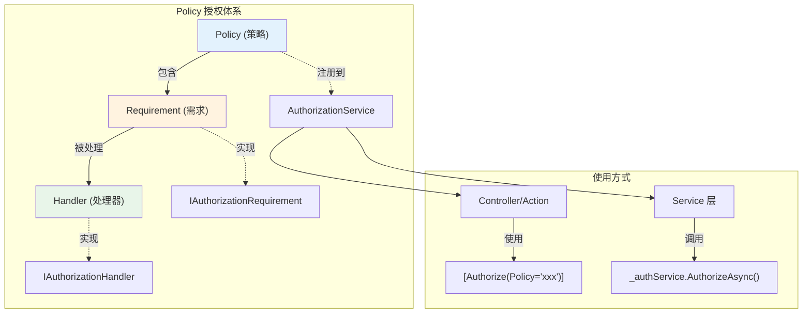
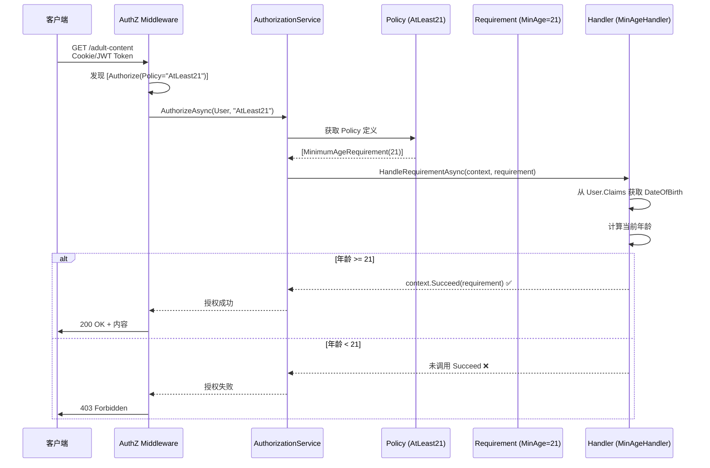

# 基于策略的授权 (Policy)

> **学习时间**: 约 60 分钟 | **难度**: ⭐⭐⭐⭐ | **前置知识**: RBAC 基础、依赖注入、C# 接口与继承

---

## 📌 本节目标

深入理解 ASP.NET Core 策略授权的核心架构（Requirement + Handler + Policy），掌握自定义授权策略的完整实现流程，能够应对复杂的业务授权场景。

---

## 一、为什么需要 Policy？

### 1.1 角色授权的局限性

回顾一下 RBAC（基于角色的授权）：

```csharp
// 简单场景：角色授权够用了 ✅
[Authorize(Roles = "Admin")]
public IActionResult AdminOnly() { /* ... */ }

// 复杂场景：角色授权不够用 ❌
// 需求：只有年满 18 岁的用户才能访问成人内容
[Authorize(???)]  // 角色能表达"年龄 >= 18"吗？不能！

// 需求：只能修改自己创建的文章
[Authorize(???)]  // 角色能表达"文章作者 == 当前用户"吗？不能！

// 需求：工作日 9:00-18:00 才能操作
[Authorize(???)]  // 角色能表达时间条件吗？不能！
```

```
┌──────────────────────────────────────────────────────┐
│              角色授权 vs 策略授权                       │
│                                                      │
│  角色授权:                                            │
│  "你是谁？你是什么角色？→ 允许/拒绝"                    │
│  适用: 固定的、静态的权限判断                          │
│  表达力: ★★☆☆☆                                      │
│                                                      │
│  策略授权:                                            │
│  "满足以下所有/任意条件 → 允许/拒绝"                   │
│  条件可以是: 角色 + 年龄 + 时间 + 资源属性 + ...       │
│  适用: 动态的、复杂的、业务相关的权限判断               │
│  表达力: ★★★★★                                      │
│                                                      │
│  类比:                                                │
│  角色授权 = 检查你的工牌颜色                            │
│  策略授权 = 综合检查工牌+指纹+时间+地点+任务性质          │
└──────────────────────────────────────────────────────┘
```

### 1.2 Policy 的核心优势

| 特性 | Role-based | Policy-based |
|------|-----------|--------------|
| **表达范围** | 仅角色 | 任意条件组合 |
| **灵活性** | 低（编译时确定） | 高（运行时可配置） |
| **复用性** | 差（分散在 Attribute） | 好（集中定义） |
| **可测试性** | 困难 | 容易（Handler 可单元测试） |
| **复杂逻辑** | 不支持 | 完全支持 |
| **资源感知** | 无 | 可基于具体资源实例 |

---

## 二、Policy 三要素详解

### 2.1 架构总览



### 2.2 三要素详解

#### 要素一：Requirement（需求 / 要求）

**Requirement 定义了"什么算通过授权"**。它是一个标记接口，通常携带验证所需的数据。

```csharp
/// <summary>
/// 所有自定义 Requirement 都必须实现此接口
/// </summary>
public interface IAuthorizationRequirement
{
    // 这是一个空接口（标记接口）
    // 它的作用是标识"这是一个授权需求"
}

/// <summary>
/// 示例：最小年龄要求
/// </summary>
public class MinimumAgeRequirement : IAuthorizationRequirement
{
    public int MinimumAge { get; }  // 需要的数据：最小年龄

    public MinimumAgeRequirement(int minimumAge)
    {
        MinimumAge = minimumAge;
    }
}

/// <summary>
/// 示例：声明要求（用户必须拥有特定 Claim）
/// </summary>
public class ClaimRequirement : IAuthorizationRequirement
{
    public string ClaimType { get; }
    public string ClaimValue { get; }

    public ClaimRequirement(string claimType, string claimValue)
    {
        ClaimType = claimType;
        ClaimValue = claimValue;
    }
}
```

**设计原则**：
- Requirement 应该是**不可变的**（Immutable）——只读属性，构造后不改变
- Requirement 应该是**轻量级的**——只包含判断所需的最少数据
- 一个 Requirement 可以被多个 Handler 处理

#### 要素二：Handler（处理器）

**Handler 包含实际的授权判断逻辑**。

```csharp
/// <summary>
/// Handler 必须实现 IAuthorizationHandler 或继承 AuthorizationHandler<T>
/// </summary>
public class MinimumAgeHandler : AuthorizationHandler<MinimumAgeRequirement>
{
    private readonly ILogger<MinimumAgeHandler> _logger;

    public MinimumAgeHandler(ILogger<MinimumAgeHandler> logger)
    {
        _logger = logger;
    }

    /// <summary>
    /// 核心方法：执行授权检查
    /// </summary>
    protected override Task HandleRequirementAsync(
        AuthorizationHandlerContext context,   // 授权上下文（含用户信息等）
        MinimumAgeRequirement requirement)     // 关联的 Requirement
    {
        // 1. 从用户 Claims 中获取出生日期
        var dateOfBirthClaim = context.User.FindFirst(c =>
            c.Type == ClaimTypes.DateOfBirth ||
            c.Type == "birthdate");

        if (dateOfBirthClaim == null)
        {
            // 没有 出生日期信息 → 无法满足要求
            _logger.LogDebug("用户缺少出生日期 Claim");
            return Task.CompletedTask;  // 不调用 Succeed，即视为失败
        }

        // 2. 计算年龄
        var dateOfBirth = Convert.ToDateTime(dateOfBirthClaim.Value, CultureInfo.InvariantCulture);
        var userAge = DateTime.Today.Year - dateOfBirth.Year;

        // 处理生日还没到的情况
        if (dateOfBirth.Date > DateTime.Today.AddYears(-userAge))
        {
            userAge--;
        }

        // 3. 判断是否满足最低年龄要求
        if (userAge >= requirement.MinimumAge)
        {
            // ✅ 满足要求！标记为成功
            context.Succeed(requirement);
            _logger.LogDebug("用户年龄 {UserAge} 满足最低年龄要求 {MinAge}",
                userAge, requirement.MinimumAge);
        }
        else
        {
            _logger.LogWarning("用户年龄 {UserAge} 不满足最低年龄要求 {MinAge}",
                userAge, requirement.MinimumAge);
        }

        return Task.CompletedTask;
    }
}
```

#### 要素三：Policy（策略）

**Policy 是一个或多个 Requirement 的命名集合**，可以在 `[Authorize]` 特性中引用。

```csharp
// Program.cs 中注册
builder.Services.AddAuthorization(options =>
{
    options.AddPolicy("AtLeast21", policy => policy
        .AddRequirements(new MinimumAgeRequirement(21)));
});
```

### 2.3 完整数据流



---

## 三、内置 Policy 构建器方法

ASP.NET Core 提供了多个内置的构建器方法，可以快速创建常见策略：

### 3.1 常用构建器一览

```csharp
builder.Services.AddAuthorization(options =>
{
    // ========== 身份验证相关 ==========

    // 要求已认证（等同于 [Authorize] 但更明确）
    options.AddPolicy("AuthenticatedUsers",
        policy => policy.RequireAuthenticatedUser());

    // ========== 角色相关 ==========

    // 要求特定角色（OR 关系：满足任一即可）
    options.AddPolicy("AdminOrEditor",
        policy => policy.RequireRole("Admin", "Editor"));

    // ========== 声明 (Claim) 相关 ==========

    // 要求拥有特定 Claim（精确匹配值）
    options.AddPolicy("TechDepartmentOnly",
        policy => policy.RequireClaim("Department", "技术部"));

    // 只要求有这个 Claim 类型（不管值是什么）
    options.AddPolicy("HasEmployeeId",
        policy => policy.RequireClaim("EmployeeId"));

    // 多个值满足其一即可
    options.AddPolicy("SpecificDepartments",
        policy => policy.RequireClaim("Department", "技术部", "产品部", "运营部"));

    // ========== 身份名相关 ==========

    // 要求特定用户名
    options.AddPolicy("OnlySuperAdmin",
        policy => policy.RequireUserName("superadmin@example.com"));

    // ========== 组合使用（AND 关系）==========

    // 必须同时满足多个条件（所有 Require 方法之间是 AND 关系）
    options.AddPolicy("SeniorTechManager",
        policy => policy
            .RequireRole("Manager")              // 条件1: 是经理
            .RequireClaim("Department", "技术部")  // 条件2: 技术部
            .RequireClaim("Level", "Senior"));     // 条件3: 高级

    // ========== 自定义 Requirement ==========
    options.AddPolicy("AtLeast21",
        policy => policy.AddRequirements(new MinimumAgeRequirement(21)));
});
```

### 3.2 各构建器详细说明

| 构建器方法 | 说明 | 示例 |
|-----------|------|------|
| `RequireAuthenticatedUser()` | 用户必须已认证 | 登录后才能访问 |
| `RequireRole(roles...)` | 用户必须属于指定角色之一（OR） | `RequireRole("A","B")` |
| `RequireClaim(type, values...)` | 用户必须拥有指定 Claim（可选匹配值） | `RequireClaim("Dept","技术部")` |
| `RequireUserName(name)` | 用户名必须完全匹配 | `RequireUserName("admin")` |
| `RequireEmail(email)` | 邮箱必须匹配 | - |
| `AddRequirements(reqs...)` | 添加自定义 Requirement | 见下方章节 |
| `RequireAssertion(func)` | 使用 Lambda 表达式直接定义判断逻辑 | 见下方章节 |

---

## 四、自定义 Requirement 和 Handler 实战

### 4.1 年龄要求策略（完整实现）

```csharp
// ====== 1. 定义 Requirement ======

public class MinimumAgeRequirement : IAuthorizationRequirement
{
    public int MinimumAge { get; }
    public MinimumAgeRequirement(int minimumAge) => MinimumAge = minimumAge;
}

// ====== 2. 实现 Handler ======

public class MinimumAgeHandler : AuthorizationHandler<MinimumAgeRequirement>
{
    private readonly ILogger<MinimumAgeHandler> _logger;

    public MinimumAgeHandler(ILogger<MinimumAgeHandler> logger)
    {
        _logger = logger;
    }

    protected override Task HandleRequirementAsync(
        AuthorizationHandlerContext context,
        MinimumAgeRequirement requirement)
    {
        // 尝试多种可能的出生日期 Claim 类型
        var dateOfBirthClaim = context.User.FindFirst(c =>
            c.Type == ClaimTypes.DateOfBirth ||
            c.Type == "birthdate" ||
            c.Type == "birth_date");

        if (dateOfBirthClaim == null)
        {
            return Task.CompletedTask;
        }

        if (!DateTime.TryParse(dateOfBirthClaim.Value,
            CultureInfo.InvariantCulture, DateTimeStyles.None, out var dateOfBirth))
        {
            return Task.CompletedTask;
        }

        var today = DateTime.Today;
        var age = today.Year - dateOfBirth.Year;

        // 如果今年生日还没过，减一岁
        if (dateOfBirth.Date > today.AddYears(-age))
        {
            age--;
        }

        if (age >= requirement.MinimumAge)
        {
            context.Succeed(requirement);
        }

        return Task.CompletedTask;
    }
}

// ====== 3. 注册服务和策略 ======

// Program.cs
builder.Services.AddScoped<IAuthorizationHandler, MinimumAgeHandler>();

builder.Services.AddAuthorization(options =>
{
    options.AddPolicy("AtLeast18", policy =>
        policy.AddRequirements(new MinimumAgeRequirement(18)));

    options.AddPolicy("AtLeast21", policy =>
        policy.AddRequirements(new MinimumAgeRequirement(21)));
});

// ====== 4. 使用 ======

[Authorize(Policy = "AtLeast21")]
public IActionResult AdultContent()
{
    return View();
}
```

### 4.2 声明要求策略

```csharp
// ====== Requirement ======

public class HasPermissionRequirement : IAuthorizationRequirement
{
    public string Permission { get; }
    public HasPermissionRequirement(string permission) => Permission = permission;
}

// ====== Handler ======

public class HasPermissionHandler : AuthorizationHandler<HasPermissionRequirement>
{
    private readonly IPermissionCache _permissionCache;
    private readonly ILogger<HasPermissionHandler> _logger;

    public HasPermissionHandler(IPermissionCache permissionCache, ILogger<HasPermissionHandler> logger)
    {
        _permissionCache = permissionCache;
        _logger = logger;
    }

    protected override async Task HandleRequirementAsync(
        AuthorizationHandlerContext context,
        HasPermissionRequirement requirement)
    {
        var userId = context.User.FindFirstValue(ClaimTypes.NameIdentifier);
        if (userId == null) return;

        // 从缓存获取用户的权限列表
        var permissions = await _permissionCache.GetUserPermissionsAsync(userId);

        if (permissions.Contains(requirement.Permission))
        {
            context.Succeed(requirement);
            _logger.LogDebug("用户 {UserId} 拥有权限 {Permission}", userId, requirement.Permission);
        }
        else
        {
            _logger.LogWarning("用户 {UserId} 缺少权限 {Permission}", userId, requirement.Permission);
        }
    }
}

// ====== 注册和使用 ======

builder.Services.AddScoped<IAuthorizationHandler, HasPermissionHandler>();

builder.Services.AddAuthorization(options =>
{
    options.AddPolicy("CanCreateArticle",
        policy => policy.AddRequirements(new HasPermissionRequirement("article.create")));

    options.AddPolicy("CanDeleteArticle",
        policy => policy.AddRequirements(new HasPermissionRequirement("article.delete")));

    options.AddPolicy("CanManageUsers",
        policy => policy.AddRequirements(new HasPermissionRequirement("user.manage")));
});

// 使用
[Authorize(Policy = "CanCreateArticle")]
[HttpPost]
public async Task<IActionResult> Create(ArticleDto dto) { /* ... */ }
```

### 4.3 角色组合要求策略

```csharp
/// <summary>
/// 要求用户同时拥有多个角色（AND 关系）
/// 注意：默认的 RequireRole 是 OR 关系
/// </summary>
public class AllRolesRequirement : IAuthorizationRequirement
{
    public IReadOnlyList<string> RequiredRoles { get; }

    public AllRolesRequirement(params string[] roles)
    {
        RequiredRoles = roles.ToList().AsReadOnly();
    }
}

public class AllRolesHandler : AuthorizationHandler<AllRolesRequirement>
{
    protected override Task HandleRequirementAsync(
        AuthorizationHandlerContext context,
        AllRolesRequirement requirement)
    {
        // 检查用户是否拥有全部所需角色
        var allMatched = requirement.RequiredRoles.All(role =>
            context.User.IsInRole(role));

        if (allMatched)
        {
            context.Succeed(requirement);
        }

        return Task.CompletedTask;
    }
}

// 注册
builder.Services.AddScoped<IAuthorizationHandler, AllRolesHandler>();
builder.Services.AddAuthorization(options =>
{
    // 必须同时是 Admin AND Editor（而非默认的 OR）
    options.AddPolicy("AdminAndEditor",
        policy => policy.AddRequirements(new AllRolesRequirement("Admin", "Editor")));
});
```

### 4.4 使用 RequireAssertion（Lambda 快捷方式）

对于简单的判断逻辑，可以直接用 Lambda 表达式：

```csharp
builder.Services.AddAuthorization(options =>
{
    // 方式一：简单断言
    options.AddPolicy("WorkingHoursOnly", policy =>
        policy.RequireAssertion(context =>
        {
            var now = TimeProvider.System.GetLocalNow().TimeOfDay;
            // 工作时间 9:00-18:00
            return now >= new TimeSpan(9, 0, 0) && now <= new TimeSpan(18, 0, 0);
        }));

    // 方式二：结合多种条件
    options.AddPolicy("VipUserDuringBusinessHours", policy =>
        policy.RequireAssertion(context =>
        {
            var isVip = context.User.HasClaim(c =>
                c.Type == "VipLevel" && int.Parse(c.Value) >= 2);

            var now = TimeProvider.System.GetUtcNow();
            var isBusinessHour = now.Hour >= 9 && now.Hour < 18;

            return isVip && isBusinessHour;
        }));

    // 方式三：从服务获取数据进行判断
    options.AddPolicy("NotSuspendedUser", policy =>
        policy.RequireAssertion(async context =>
        {
            var userId = context.User.FindFirstValue(ClaimTypes.NameIdentifier);
            if (userId == null) return false;

            // 注意：这里需要解析 IServiceProvider
            var serviceProvider = context.Resource as HttpContext;
            // 或者通过构造函数注入的方式更好（见下文）
            return true; // 示例简化
        }));
});
```

> **注意**：`RequireAssertion` 虽然方便但不利于单元测试和复用。对于复杂逻辑，建议仍使用 Requirement + Handler 的完整模式。

---

## 五、资源型授权（Resource-based Authorization）

这是策略授权最强大的功能：**根据具体的资源实例进行授权判断**。

### 5.1 场景示例

```csharp
// 需求：只能修改自己创建的文章
// 这不是简单的"Editor 角色就能修改"，而是要看具体是哪篇文章！

[HttpPut("{id}")]
[Authorize]
public async Task<IActionResult> UpdateArticle(int id, [FromBody] UpdateArticleDto dto)
{
    var article = await _articleRepo.GetByIdAsync(id);
    if (article == null) return NotFound();

    // 🔑 关键：将 article 作为资源传入授权检查
    var result = await _authorizationService.AuthorizeAsync(User, article, "CanEditArticle");

    if (!result.Succeeded)
    {
        return Forbid();  // 403 Forbidden
    }

    // 授权通过，继续更新...
    await _articleRepo.UpdateAsync(id, dto.Title, dto.Content);
    return NoContent();
}
```

### 5.2 完整实现

```csharp
// ====== 1. Requirement ======

public class SameAuthorRequirement : IAuthorizationRequirement
{
    // 这个 Requirement 不需要额外数据
    // 判断逻辑完全依赖传入的资源（文章对象）
}

// ====== 2. Handler ======

public class SameAuthorHandler : AuthorizationHandler<SameAuthorRequirement, Article>
{
    // 注意泛型第二个参数：资源的类型
    protected override Task HandleRequirementAsync(
        AuthorizationHandlerContext context,
        SameAuthorRequirement requirement,
        Article resource)  // ← 这里接收具体的文章实例！
    {
        // 如果没有传入资源，无法判断
        if (resource == null)
        {
            return Task.CompletedTask;
        }

        // 获取当前用户 ID
        var currentUserId = context.User.FindFirstValue(ClaimTypes.NameIdentifier);

        // 判断：当前用户是否是文章的作者？
        if (resource.AuthorId == currentUserId)
        {
            context.Succeed(requirement);
        }

        return Task.CompletedTask;
    }
}

// ====== 3. 更通用的版本：作者或管理员都可以编辑 ======

public class CanEditArticleRequirement : IAuthorizationRequirement { }

public class CanEditArticleHandler : AuthorizationHandler<CanEditArticleRequirement, Article>
{
    protected override Task HandleRequirementAsync(
        AuthorizationHandlerContext context,
        CanEditArticleRequirement requirement,
        Article resource)
    {
        if (resource == null) return Task.CompletedTask;

        var currentUserId = context.User.FindFirstValue(ClaimTypes.NameIdentifier);

        // 作者本人 → 可以编辑
        if (resource.AuthorId == currentUserId)
        {
            context.Succeed(requirement);
            return Task.CompletedTask;
        }

        // 管理员 → 可以编辑任意文章
        if (context.User.IsInRole("Admin"))
        {
            context.Succeed(requirement);
            return Task.CompletedTask;
        }

        return Task.CompletedTask;
    }
}

// ====== 4. 注册 ======

builder.Services.AddScoped<IAuthorizationHandler, SameAuthorHandler>();
builder.Services.AddScoped<IAuthorizationHandler, CanEditArticleHandler>();

builder.Services.AddAuthorization(options =>
{
    options.AddPolicy("CanEditArticle",
        policy => policy.AddRequirements(new CanEditArticleRequirement()));
});

// ====== 5. 在 Controller 中使用 ======

[ApiController]
[Route("api/articles")]
public class ArticlesController : ControllerBase
{
    private readonly IAuthorizationService _authService;
    private readonly IArticleRepository _articleRepo;

    public ArticlesController(IAuthorizationService authService, IArticleRepository articleRepo)
    {
        _authService = authService;
        _articleRepo = articleRepo;
    }

    [HttpPut("{id}")]
    [Authorize]
    public async Task<IActionResult> Update(int id, UpdateArticleDto dto)
    {
        var article = await _articleRepo.GetByIdAsync(id);
        if (article == null) return NotFound();

        // 将 article 作为资源传入
        var authResult = await _authService.AuthorizeAsync(User, article, "CanEditArticle");

        if (!authResult.Succeeded)
        {
            return Forbid(new { message = "您没有权限编辑此文章" });
        }

        await _articleRepo.UpdateAsync(id, dto);
        return NoContent();
    }

    [HttpDelete("{id}")]
    [Authorize]
    public async Task<IActionResult> Delete(int id)
    {
        var article = await _articleRepo.GetByIdAsync(id);
        if (article == null) return NotFound();

        // 只有管理员可以删除（或者文章作者且发布不超过24小时）
        var authResult = await _authService.AuthorizeAsync(User, article, "CanDeleteArticle");

        if (!authResult.Succeeded)
        {
            return Forbid(new { message = "您没有权限删除此文章" });
        }

        await _articleRepo.DeleteAsync(id);
        return NoContent();
    }
}
```

### 5.3 资源授权的工作原理图解

```
普通授权:
[Authorize(Policy="xxx")] → 只看 User 信息 → 通过/拒绝

资源授权:
_authService.AuthorizeAsync(User, Resource, "Policy")
                        ↓           ↓         ↓
                      当前用户    具体资源    策略名称
                        ↓           ↓
                    Handler 同时获得 User 和 Resource
                    可以做: Resource.AuthorId == User.Id?
                           Resource.Status == "Published"?
                           Resource.CreatedBy == User.Department?
                           ...
```

---

## 六、命令式授权（Imperative Authorization）

### 6.1 在 Service 层中使用

```csharp
public class OrderService : IOrderService
{
    private readonly IAuthorizationService _authService;
    private readonly IHttpContextAccessor _httpContextAccessor;
    private readonly IOrderRepository _orderRepo;

    public OrderService(
        IAuthorizationService authService,
        IHttpContextAccessor httpContextAccessor,
        IOrderRepository orderRepo)
    {
        _authService = authService;
        _httpContextAccessor = httpContextAccessor;
        _orderRepo = orderRepo;
    }

    /// <summary>
    /// 根据权限过滤订单列表
    /// </summary>
    public async Task<List<OrderDto>> GetFilteredOrdersAsync(OrderFilter filter)
    {
        var user = _httpContextAccessor.HttpContext!.User;

        // 检查是否有查看所有订单的权限
        var canViewAll = (await _authService.AuthorizeAsync(user, "ViewAllOrders")).Succeeded;

        IQueryable<Order> query;

        if (canViewAll)
        {
            // 管理员可以看到所有订单
            query = _orderRepo.Queryable();
        }
        else
        {
            // 普通用户只能看到自己的订单
            var userId = user.FindFirstValue(ClaimTypes.NameIdentifier);
            query = _orderRepo.Queryable().Where(o => o.UserId == userId);
        }

        // 应用其他过滤条件
        if (filter.Status.HasValue)
            query = query.Where(o => o.Status == filter.Status.Value);

        if (filter.FromDate.HasValue)
            query = query.Where(o => o.CreatedAt >= filter.FromDate.Value);

        return await query
            .OrderByDescending(o => o.CreatedAt)
            .Select(o => new OrderDto { /* 映射 */ })
            .ToListAsync();
    }

    /// <summary>
    /// 根据权限决定返回哪些字段
    /// </summary>
    public async Task<OrderDetailDto> GetOrderDetailAsync(int orderId)
    {
        var order = await _orderRepo.GetByIdAsync(orderId);
        if (order == null) return null!;

        var user = _httpContextAccessor.HttpContext!.User;

        var canViewSensitiveData = (await _authService.AuthorizeAsync(
            user, order, "CanViewSensitiveOrderData")).Succeeded;

        var dto = new OrderDetailDto
        {
            Id = order.Id,
            OrderNumber = order.OrderNumber,
            Status = order.Status,
            TotalAmount = order.TotalAmount,
            CreatedAt = order.CreatedAt,

            // 敏感字段根据权限决定是否返回
            CustomerName = canViewSensitiveData ? order.CustomerName : "***",
            CustomerPhone = canViewSensitiveData ? order.CustomerPhone : "***",
            ShippingAddress = canViewSensitiveData ? order.ShippingAddress : "***"
        };

        return dto;
    }
}
```

### 6.2 在 Razor 视图中使用

```razor
@using Microsoft.AspNetCore.Authorization
@inject IAuthorizationService AuthorizationService

@model ArticleDetailViewModel

<div class="article-detail">
    <h1>@Model.Title</h1>

    <div class="meta">
        作者: @Model.AuthorName | 发布时间: @Model.CreatedAt.ToString("yyyy-MM-dd")
    </div>

    <div class="content">
        @Html.Raw(Model.Content)
    </div>

    @* 根据权限显示不同的操作按钮 *@
    @{
        var canEdit = (await AuthorizationService.AuthorizeAsync(User, Model.Article, "CanEditArticle")).Succeeded;
        var canDelete = (await AuthorizationService.AuthorizeAsync(User, Model.Article, "CanDeleteArticle")).Succeeded;
    }

    @if (canEdit || canDelete)
    {
        <div class="actions">
            @if (canEdit)
            {
                <a asp-action="Edit" asp-route-id="@Model.Id" class="btn btn-primary">编辑</a>
            }
            @if (canDelete)
            {
                <form asp-action="Delete" asp-route-id="@Model.Id" method="post"
                      onsubmit="return confirm('确定要删除这篇文章吗？');">
                    @Html.AntiForgeryToken()
                    <button type="submit" class="btn btn-danger">删除</button>
                </form>
            }
        </div>
    }
</div>
```

---

## 七、策略组合与全局默认策略

### 7.1 全局默认认证策略

```csharp
// 方式一：全局 fallback 策略
// 当 Action 没有任何 [Authorize] 时使用的策略
builder.Services.AddAuthorization(options =>
{
    // 默认策略：要求认证
    options.DefaultPolicy = new AuthorizationPolicyBuilder()
        .RequireAuthenticatedUser()
        .Build();

    // 如果想允许匿名访问作为默认：
    // options.DefaultPolicy = new AuthorizationPolicyBuilder()
    //     .RequireAssertion(_ => true)
    //     .Build();
});

// 方式二：使用 [Authorize] 不带参数时自动应用 DefaultPolicy
[ApiController]
[Route("api/[controller]")]
[Authorize]  // ← 使用 DefaultPolicy（已认证即可）
public class ValuesController : ControllerBase
{
    [HttpGet]
    public ActionResult Get() => Ok(new[] { "value1", "value2" });

    [HttpGet("{id}")]
    [AllowAnonymous]  // ← 覆盖默认策略，允许匿名
    public ActionResult GetById(int id) => Ok($"value{id}");
}
```

### 7.2 Action 级别策略覆盖

```csharp
// 类级别设置基础策略
[Authorize(Policy = "AuthenticatedUser")]
public class DashboardController : Controller
{
    // 继承类级别策略：需要登录即可
    public IActionResult Index() => View();

    // 覆盖为更严格的策略：需要管理员
    [Authorize(Policy = "AdminOnly")]
    public IActionResult AdminPanel() => View();

    // 覆盖为宽松的策略：允许匿名
    [AllowAnonymous]
    public IActionResult PublicInfo() => View();
}
```

### 7.3 多策略组合（OR 语义）

```csharp
// 一个 Action 应用多个策略时，只要满足其中一个即可（OR 关系）
[Authorize(Policy = "AdminOnly")]
[Authorize(Policy = "SuperUser")]
public IActionResult SensitiveAction()
{
    // 满足 AdminOnly OR SuperUser 即可进入
}
```

如果需要 AND 语义（同时满足多个策略），应该在一个 Policy 内部组合：

```csharp
// AND 语义：在一个 Policy 中组合多个 Requirement
options.AddPolicy("StrictAccess", policy => policy
    .RequireRole("Admin")
    .RequireClaim("Department", "安全部")
    .AddRequirements(new MinimumAgeRequirement(25)));
```

---

## 八、完整实战：只能修改自己的文章

### 8.1 项目结构

```
PolicyAuthDemo/
├── Requirements/
│   ├── IsOwnerRequirement.cs
│   └── CanManageResourceRequirement.cs
├── Handlers/
│   ├── IsOwnerHandler.cs
│   └── CanManageResourceHandler.cs
├── Services/
│   └── ArticleService.cs
├── Controllers/
│   └── ArticlesController.cs
└── Program.cs
```

### 8.2 完整代码

```csharp
// ==================== Requirements/IsOwnerRequirement.cs ====================

namespace MyApp.Requirements;

/// <summary>
/// 要求当前用户是指定资源的所有者
/// </summary>
public class IsOwnerRequirement : IAuthorizationRequirement
{
    // 获取资源所有者 ID 的函数（支持不同类型的资源）
    public Func<object, string?> OwnerIdSelector { get; }

    public IsOwnerRequirement(Func<object, string?> ownerIdSelector)
    {
        OwnerIdSelector = ownerIdSelector ?? throw new ArgumentNullException(nameof(ownerIdSelector));
    }
}

// ==================== Handlers/IsOwnerHandler.cs ====================

namespace MyApp.Handlers;

public class IsOwnerHandler : AuthorizationHandler<IsOwnerRequirement, object>
{
    private readonly ILogger<IsOwnerHandler> _logger;

    public IsOwnerHandler(Logger<IsOwnerHandler> logger)
    {
        _logger = logger;
    }

    protected override Task HandleRequirementAsync(
        AuthorizationHandlerContext context,
        IsOwnerRequirement requirement,
        object resource)
    {
        if (resource == null) return Task.CompletedTask;

        var currentUserId = context.User.FindFirstValue(ClaimTypes.NameIdentifier);
        if (currentUserId == null) return Task.CompletedTask;

        var ownerId = requirement.OwnerIdSelector(resource);

        if (ownerId == currentUserId)
        {
            context.Succeed(requirement);
            _logger.LogDebug("资源所有权验证通过");
        }
        else
        {
            _logger.LogWarning("资源所有权验证失败: 当前用户={CurrentUser}, 所有者={Owner}",
                currentUserId, ownerId);
        }

        return Task.CompletedTask;
    }
}

// ==================== Program.cs 配置 ====================

builder.Services.AddScoped<IAuthorizationHandler, IsOwnerHandler>();

builder.Services.AddAuthorization(options =>
{
    // 文章编辑策略：作者本人 或 管理员
    options.AddPolicy("CanEditArticle", policy => policy
        .RequireRole("Admin")  // 管理员总是可以
        .AddRequirements(new IsOwnerRequirement(resource =>
        {
            // 如果资源是 Article 类型，返回其 AuthorId
            if (resource is Article article)
                return article.AuthorId;
            return null;
        })));

    // 文章删除策略：仅管理员（更严格）
    options.AddPolicy("CanDeleteArticle", policy => policy
        .RequireRole("Admin"));
});

// ==================== Controllers/ArticlesController.cs ====================

[ApiController]
[Route("api/[controller]")]
public class ArticlesController : ControllerBase
{
    private readonly IArticleService _articleService;
    private readonly IAuthorizationService _authorizationService;
    private readonly ILogger<ArticlesController> _logger;

    public ArticlesController(
        IArticleService articleService,
        IAuthorizationService authorizationService,
        ILogger<ArticlesController> logger)
    {
        _articleService = articleService;
        _authorizationService = authorizationService;
        _logger = logger;
    }

    /// <summary>
    /// 创建文章（需要 Editor 或 Admin 角色）
    /// </summary>
    [HttpPost]
    [Authorize(Roles = "Editor,Admin")]
    public async Task<ActionResult<ArticleDto>> Create([FromBody] CreateArticleRequest request)
    {
        var authorId = User.FindFirstValue(ClaimTypes.NameIdentifier)!;
        var authorName = User.FindFirstValue(ClaimTypes.Name)!;

        var article = await _articleService.CreateAsync(new ArticleCreateModel
        {
            Title = request.Title,
            Content = request.Content,
            AuthorId = authorId,
            AuthorName = authorName
        });

        return CreatedAtAction(nameof(Get), new { id = article.Id }, article);
    }

    /// <summary>
    /// 获取文章详情（公开，但根据权限返回不同内容）
    /// </summary>
    [HttpGet("{id}")]
    [AllowAnonymous]
    public async Task<ActionResult<ArticleDetailDto>> Get(int id)
    {
        var article = await _articleService.GetByIdAsync(id);
        if (article == null) return NotFound();

        // 检查编辑权限
        var editAuth = await _authorizationService.AuthorizeAsync(User, article, "CanEditArticle");

        return Ok(new ArticleDetailDto
        {
            Id = article.Id,
            Title = article.Title,
            Content = article.Content,
            AuthorName = article.AuthorName,
            CreatedAt = article.CreatedAt,
            CanEdit = editAuth.Succeeded,
            CanDelete = User.IsInRole("Admin")  // 只有管理员可以删除
        });
    }

    /// <summary>
    /// 更新文章（作者本人或管理员）
    /// </summary>
    [HttpPut("{id}")]
    [Authorize]
    public async Task<IActionResult> Update(int id, [FromBody] UpdateArticleRequest request)
    {
        var article = await _articleService.GetByIdAsync(id);
        if (article == null) return NotFound();

        // 🔑 资源型授权：将 article 作为资源传入
        var authResult = await _authorizationService.AuthorizeAsync(
            User, article, "CanEditArticle");

        if (!authResult.Succeeded)
        {
            _logger.LogWarning("用户 {UserId} 尝试无权编辑文章 {ArticleId}",
                User.FindFirstValue(ClaimTypes.NameIdentifier), id);

            return StatusCode(StatusCodes.Status403Forbidden, new
            {
                code = 403,
                message = "您没有权限编辑此文章（仅限作者本人或管理员）",
                hint = "如果您是文章作者，请确认您已正确登录"
            });
        }

        await _articleService.UpdateAsync(id, request.Title, request.Content);

        _logger.LogInformation("用户 {UserId} 编辑了文章 {ArticleId}",
            User.FindFirstValue(ClaimTypes.NameIdentifier), id);

        return NoContent();
    }

    /// <summary>
    /// 删除文章（仅管理员）
    /// </summary>
    [HttpDelete("{id}")]
    [Authorize(Policy = "CanDeleteArticle")]
    public async Task<IActionResult> Delete(int id)
    {
        var article = await _articleService.GetByIdAsync(id);
        if (article == null) return NotFound();

        await _articleService.DeleteAsync(id);

        _logger.LogWarning("管理员 {UserId} 删除了文章 {ArticleId}: {Title}",
            User.FindFirstValue(ClaimTypes.NameIdentifier), id, article.Title);

        return NoContent();
    }
}
```

---

## 九、安全最佳实践清单

### DO ✅

- **DO** 将 Requirement 设计为不可变的（immutable）、线程安全的
- **DO** Handler 中注入依赖（如 Logger、数据库服务）而不是硬编码逻辑
- **DO** 对每个 Handler 编写单元测试（Handler 很容易测试！）
- **DO** 使用资源型授权来保护对具体实例的操作
- **DO** 在 Service 层也进行授权检查（不要只在 Controller 层检查）
- **DO** 为授权失败提供清晰的错误信息（帮助调试和用户体验）
- **DO** 使用 `RequireAuthenticatedUser()` 作为全局默认策略
- **DO** 记录授权失败的日志（但注意不要记录敏感信息）

### DON'T ❌

- **DON'T** 不要在 Handler 中做耗时操作（如数据库查询应使用缓存）
- **DON'T** 不要忘记调用 `context.Succeed(requirement)` 来表示授权通过
- **DON'T** 不要在 Handler 中抛出异常（应静默失败让其他 Handler 继续）
- **DON'T** 不要在前端仅隐藏按钮而不做后端授权验证
- **DON'T** 不要把业务逻辑混入 Handler（保持 Handler 只负责授权判断）
- **DON'T** 不要忽略 `context.Resource` 的类型检查（可能为 null）
- **DON'T** 不要创建过于复杂的单个 Policy（拆分为多个小 Policy 组合使用）
- **DON'T** 不要在生产环境跳过授权检查（即使是在开发阶段）

---

## 十、练习题

### 练习 1：基础 Policy 实现
实现以下三个策略并编写对应的 Handler 和 Requirement：
1. `AtLeast18`：用户年龄必须 >= 18 岁
2. `HasEmailVerified`：用户邮箱必须已验证
3. `IsPremiumUser`：用户必须有 VipLevel Claim 且值 >= 2

然后在 Controller 中使用这些策略。

### 练习 2：资源型授权实战
为一个文档管理系统实现以下策略：
- `CanViewDocument`：文档公开 或 用户是作者 或 用户是管理员
- `CanEditDocument`：用户是作者 或 用户是管理员
- `CanShareDocument`：用户是作者（管理员也不能代替分享）
- `CanDeleteDocument`：仅管理员

请写出完整的 Requirement、Handler、注册代码和 Controller 使用代码。

### 练习 3：多 Handler 协作
实现一个场景：一个 Policy 包含两个 Requirement，分别由两个 Handler 处理。
- Requirement A：用户必须是 VIP
- Requirement B：请求必须在工作时间（9:00-18:00）
- Policy：必须同时满足 A 和 B

观察当 A 通过但 B 不通过时的行为。

### 练习 4：动态权限系统
设计一个从数据库读取权限定义的系统：
- 数据库表 Permissions 存储所有权限定义
- 数据库表 RolePermissions 存储角色-权限映射
- 数据库表 UserPermissions 存储用户级别的特殊权限覆盖
- Handler 从缓存读取权限数据进行判断

画出架构图并给出核心代码框架。

### 练习 5：单元测试
为以下 Handler 编写完整的单元测试（使用 xUnit + Moq）：
```csharp
public class SameAuthorHandler : AuthorizationHandler<SameAuthorRequirement, Article>
{
    protected override Task HandleRequirementAsync(
        AuthorizationHandlerContext context,
        SameAuthorRequirement requirement,
        Article resource)
    {
        var userId = context.User.FindFirstValue(ClaimTypes.NameIdentifier);
        if (resource?.AuthorId == userId)
            context.Succeed(requirement);
        return Task.CompletedTask;
    }
}
```
测试场景包括：作者本人、非作者、管理员、未认证用户、资源为空。

---

## 十一、延伸阅读

- [Microsoft Docs: ASP.NET Core 中的自定义策略授权](https://docs.microsoft.com/zh-cn/aspnet/core/security/authorization/policies)
- [Microsoft Docs: 基于资源的授权](https://docs.microsoft.com/zh-cn/asp.net/core/security/authorization/resourcebased)
- [Steve Smith: Authorization in ASP.NET Core](https://docs.microsoft.com/en-us/aspnet/core/security/authorization/)
- [Microsoft Docs: IAuthorizationService 接口](https://docs.microsoft.com/en-us/dotnet/api/microsoft.aspnetcore.authorization.iauthorizationservice)

---

> **下一节预告**：我们将学习 **OAuth2/OpenID Connect 第三方登录**，了解如何集成 Google、GitHub、Microsoft 等第三方身份提供商，实现社交登录功能。
