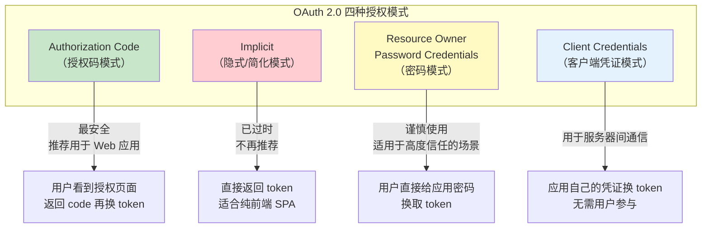
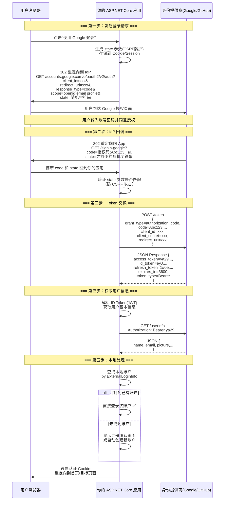

# OAuth2 / OpenID Connect 第三方登录

> **学习时间**: 约 65 分钟 | **难度**: ⭐⭐⭐⭐ | **前置知识**: HTTP 协议基础、Identity Framework 基础、认证授权概念

---

## 📌 本节目标

深入理解 OAuth 2.0 和 OpenID Connect 协议的核心原理，掌握在 ASP.NET Core 中集成 Google、GitHub、Microsoft 等第三方登录的完整实现，能够处理各种边界情况和安全问题。

---

## 一、OAuth 2.0 是什么？

### 1.1 核心概念

**OAuth 2.0（开放授权 2.0）** 是一个授权委托协议。它解决的核心问题是：**如何让第三方应用代表用户访问用户在另一服务上的资源，而无需用户提供密码。**

```
生活类比：酒店门卡系统

传统方式（不安全）：
你(客人) ──► 把房间钥匙给快递员 ──► 快递员进房间放包裹
⚠️ 问题：快递员拿到钥匙后可以去任何时间进入你的房间！

OAuth 方式（安全）：
你(客人) ──► 在前台办理一张"临时通行证"(有限权限) ──► 给快递员
         ──► 快递员拿通行证进房间放包裹（只能在指定时间段使用）
✅ 好处：不需要给钥匙，通行证有时间和权限限制
```

### 1.2 OAuth 2.0 的四种授权模式



#### 模式一：Authorization Code（授权码模式）-- 最重要！

这是 **Web 应用最常用、最安全**的模式。

```
┌──────────────────────────────────────────────────────────────┐
│              授权码模式完整流程                                │
│                                                              │
│  ① 用户点击"使用 Google 登录"                                 │
│     你的应用 → 重定向到 Google 授权页面                        │
│                                                              │
│  ② 用户在 Google 页面输入账号密码并同意授权                    │
│     Google → 重定向回你的应用 + 授权码(code)                   │
│     例: https://yourapp.com/callback?code=abc123&state=xyz   │
│                                                              │
│  ③ 你的后端用 code 向 Google 换取 access_token               │
│     POST https://oauth2.googleapis.com/token                 │
│     body: {code: "abc123", client_id, client_secret}         │
│     Google → 返回 {access_token, refresh_token, ...}          │
│                                                              │
│  ④ 你的后端用 access_token 获取用户信息                        │
│     GET https://www.googleapis.com/oauth2/v2/userinfo         │
│     Header: Authorization: Bearer {access_token}             │
│     Google → 返回 {name, email, picture, ...}                 │
│                                                              │
│  ⑤ 你的应用根据信息创建/关联本地账户 → 登录成功                │
│                                                              │
│  🔑 安全要点:                                               │
│  - code 通过前端传输但只能用一次                              │
│  - client_secret 只在你的后端和 Google 之间交换                │
│  - 前端永远看不到 access_token 或 client_secret               │
└──────────────────────────────────────────────────────────────┘
```

#### 其他模式简要说明

| 模式 | 适用场景 | 安全性 | 是否需要后端 |
|------|----------|--------|-------------|
| **Authorization Code** | 传统 Web 应用、有后端的 SPA | 高 | 需要 |
| **Implicit (已废弃)** | 纯前端 SPA（已被 PKCE 替代） | 低 | 不需要 |
| **Password** | 自家的一方/两方应用 | 中 | 需要 |
| **Client Credentials** | 服务间 API 调用 | 高 | 需要 |

> **重点**：本教程主要关注 **Authorization Code 模式** + **OpenID Connect**，因为这是第三方社交登录的标准方式。

---

## 二、OpenID Connect 是什么？

### 2.1 OAuth 2.0 vs OpenID Connect

```
OAuth 2.0 解决的问题：
"这个应用能访问我的 Google 日历吗？" → 解决的是【授权】问题

OpenID Connect (OIDC) 在 OAuth 2.0 之上添加的功能：
"这个用户到底是谁？" → 解决的是【身份认证】问题

关系图:
┌─────────────────────────────────┐
│      OpenID Connect (OIDC)      │  ← 身份层
│  ┌───────────────────────────┐  │
│  │      OAuth 2.0            │  │  ← 授权层
│  │  ┌─────────────────────┐  │  │
│  │  │    HTTP / HTTPS      │  │  │  ← 传输层
│  │  └─────────────────────┘  │  │
│  └───────────────────────────┘  │
└─────────────────────────────────┘

OIDC = OAuth 2.0 + Identity Layer
```

### 2.2 三种 Token 的区别

这是 OIDC 中最重要的概念：

```
┌──────────────────────────────────────────────────────────────┐
│                    三种 Token 对比                             │
│                                                              │
│  ┌─────────────────┐  ┌─────────────────┐  ┌──────────────┐ │
│  │  ID Token       │  │ Access Token    │  │ Refresh Token │ │
│  ├─────────────────┤  ├─────────────────┤  ├──────────────┤ │
│  │ 用途: 证明你是谁  │  │ 用途: 访问资源   │  │ 用例: 获取新  │ │
│  │ 格式: JWT        │  │ 格式: 不固定     │  │       AT     │ │
│  │ 内容: 用户身份    │  │ 内容: 权限范围   │  │ 内容: 随机串  │ │
│  │ 受众: 你的应用    │  │ 受众: API 服务器 │  │ 有效期: 长   │ │
│  │ 有效期: 短(~分钟)│  │ 有效期: 短(~小时)│  │ 存储: DB     │ │
│  │ 谁验证: 你的应用  │  │ 谁验证: API 服   │  │ 谁持有: 后端  │ │
│  └─────────────────┘  └─────────────────┘  └──────────────┘ │
│                                                              │
│  生活类比:                                                   │
│  ID Token = 身份证（证明你是张三）                             │
│  Access Token = 门禁卡（可以进入哪些区域）                      │
│  Refresh Token = 续期凭证（门禁卡过期后用来换新的）             │
└──────────────────────────────────────────────────────────────┘
```

### 2.3 ID Token 的内容示例

```json
{
  "iss": "https://accounts.google.com",     // 签发者（Google）
  "sub": "123456789012345678901",           // 用户唯一标识（Google 内部）
  "aud": "your-google-client-id.apps.googleusercontent.com", // 接收者（你的应用）
  "exp": 1705319999,                         // 过期时间
  "iat": 1705316399,                         // 签发时间
  "email": "user@gmail.com",                // 邮箱
  "email_verified": true,                    // 邮箱是否已验证
  "name": "张三",                            // 显示名
  "picture": "https://lh3.googleusercontent.com/...",  // 头像 URL
  "locale": "zh-CN",                         // 语言偏好
  "nonce": "random-string-for-replay-protection"  // 随机数（防重放）
}
```

---

## 三、授权流程详解（Mermaid 序列图）

### 3.1 完整的 OIDC 授权码流程



---

## 四、在 ASP.NET Core 中集成 Google 登录

### 4.1 Google Cloud Console 配置步骤

```
配置清单:

1. 访问 https://console.cloud.google.com/
2. 创建项目（或选择已有项目）
3. 启用以下 API:
   ├── Google+ API (或 People API)
   └── OAuth consent screen (配置)
4. 进入「凭据」页面
5. 创建「OAuth 2.0 客户端 ID」:
   ├── 应用类型: Web application
   ├── 名称: My App Login
   ├── 已授权的重定向 URI:
   │   开发: https://localhost:xxxx/signin-google
   │   生产: https://yourdomain.com/signin-google
   └── 已授权的 JavaScript 来源（SPA 时需要）
6. 记录以下信息:
   ├── Client ID (客户端ID)
   └── Client Secret (客户端密钥)
```

### 4.2 Program.cs 配置

```csharp
using Microsoft.AspNetCore.Authentication.Google;

var builder = WebApplication.CreateBuilder(args);

// ==================== 数据库和 Identity 配置 ====================
// （参考 Identity 基础篇的配置）

// ==================== Google 登录核心配置 ====================
var googleAuthSection = builder.Configuration.GetSection("Authentication:Google");

builder.Services.AddAuthentication(options =>
{
    options.DefaultScheme = CookieAuthenticationDefaults.AuthenticationScheme;
    options.DefaultChallengeScheme = GoogleDefaults.AuthenticationScheme;
})
.AddCookie(options =>
{
    options.Cookie.Name = ".AspNetCore.Identity.Application";
    options.LoginPath = "/Account/Login";
    options.ExpireTimeSpan = TimeSpan.FromDays(14);
    options.SlidingExpiration = true;
})
.AddGoogle(GoogleDefaults.AuthenticationScheme, options =>
{
    // ========== 基本信息 ==========
    options.ClientId = googleAuthSection["ClientId"];
    options.ClientSecret = googleAuthSection["ClientSecret"];

    // ========== Scope（请求的用户信息范围）==========
    // openid: 必须的！获取 ID Token
    // email: 获取邮箱地址
    // profile: 获取姓名、头像等基本信息
    options.Scope.Add("openid");
    options.Scope.Add("email");
    options.Scope.Add("profile");

    // 可选：请求额外的 Google API 权限
    // options.Scope.Add("https://www.googleapis.com/auth/calendar.readonly");

    // ========== 保存 Token（可选，如需调用 Google API）==========
    options.SaveTokens = true;

    // ========== 回调事件处理 ==========
    options.Events = new OAuthEvents
    {
        // 创建 Ticket 之前（可以修改 Claims）
        OnCreatingTicket = async context =>
        {
            if (context.Identity == null) return;

            // 从 Google 获取额外的用户信息
            var request = new HttpRequestMessage(HttpMethod.Get,
                "https://www.googleapis.com/oauth2/v2/userinfo");
            request.Headers.Authorization =
                new AuthenticationHeaderValue("Bearer", context.AccessToken);

            var response = await context.Backchannel.SendAsync(request);
            response.EnsureSuccessStatusCode();

            var user = JsonSerializer.Deserialize<JsonElement>(
                await response.Content.ReadAsStringAsync());

            // 添加自定义 Claim
            if (user.TryGetProperty("picture", out var picture))
            {
                context.Identity.AddClaim(new Claim("picture", picture.ToString()));
            }

            if (user.TryGetProperty("locale", out var locale))
            {
                context.Identity.AddClaim(new Claim("locale", locale.ToString()));
            }

            Console.WriteLine($"[Google] 用户 {context.Identity.Name} 登录成功");
        },

        // 远程失败时（如用户取消授权）
        OnRemoteFailure = context =>
        {
            Console.WriteLine($"[Google] 外部登录失败: {context.Failure?.Message}");

            context.HandleResponse();
            context.Response.Redirect($"/Account/Login?error={Uri.EscapeDataString(context.Failure?.Message ?? "unknown")}");

            return Task.CompletedTask;
        },

        // Ticket 创建完成后
        OnTicketReceived = context =>
        {
            Console.WriteLine($"[Google] 收到来自 {context.Principal?.Identity?.AuthenticationType} 的票据");
            return Task.CompletedTask;
        }
    };
});

// ==================== 其他服务和中间件 ====================
builder.Services.AddControllersWithViews();
// ... Identity 配置 ...

var app = builder.Build();

app.UseHttpsRedirection();
app.UseStaticFiles();
app.UseRouting();

app.UseAuthentication();    // 必须在 Authorization 之前
app.UseAuthorization();

app.MapControllerRoute(
    name: "default",
    pattern: "{controller=Home}/{action=Index}/{id?}");

app.Run();
```

### 4.3 appsettings.json

```json
{
  "Logging": {
    "LogLevel": {
      "Default": "Information",
      "Microsoft.AspNetCore": "Warning"
    }
  },
  "Authentication": {
    "Google": {
      "ClientId": "your-google-client-id.apps.googleusercontent.com",
      "ClientSecret": "GOCSPX-xxxxxxxxxxxxxxxxxxxxx"
    },
    "GitHub": {
      "ClientId": "your-github-client-id",
      "ClientSecret": "your-github-client-secret"
    },
    "Microsoft": {
      "ClientId": "your-microsoft-client-id",
      "ClientSecret": "your-microsoft-client-secret"
    }
  },
  "ConnectionStrings": {
    "DefaultConnection": "Server=(localdb)\\mssqllocaldb;Database=SocialLoginDb"
  }
}
```

> **安全提示**：生产环境中 `ClientSecret` 应从环境变量或 Azure Key Vault 读取，不要提交到 Git。

---

## 五、GitHub 登录集成

### 5.1 GitHub OAuth App 配置

```
1. 访问 https://github.com/settings/developers
2. 点击 "New OAuth App":
   ├── Application name: My Awesome App
   ├── Homepage URL: https://yourdomain.com
   ├── Application description: （可选）
   ├── Authorization callback URL:
   │   开发: https://localhost:xxxx/signin-github
   │   生产: https://yourdomain.com/signin-github
   └── 取消勾选 "Enable Device Flow"（除非需要）
3. 创建后记录 Client ID 和 Client Secret
```

### 5.2 Program.cs 中注册 GitHub

```csharp
using Microsoft.AspNetCore.Authentication.GitHub;

// 在 AddAuthentication() 之后链式调用
.AddGitHub(GitHubDefaults.AuthenticationScheme, options =>
{
    var githubSection = builder.Configuration.GetSection("Authentication:GitHub");

    options.ClientId = githubSection["ClientId"];
    options.ClientSecret = githubSection["ClientSecret"];

    // GitHub 需要明确声明需要的 Scope
    options.Scope.Add("user:email");      // 获取邮箱（公开的）
    options.Scope.Add("read:user");       // 获取用户基本信息

    // 保存 Token
    options.SaveTokens = true;

    // 映射 GitHub 返回的字段为标准 Claims
    options.ClaimActions.MapJsonKey(ClaimTypes.Name, "name");
    options.ClaimActions.MapJsonKey(ClaimTypes.Email, "email");
    options.ClaimActions.MapJsonKey("urn:github:login", "login");       // GitHub 用户名
    options.ClaimActions.MapJsonKey("urn:github:url", "html_url");       // GitHub 主页
    options.ClaimActions.MapJsonKey("urn:github:avatar", "avatar_url");  // 头像
    options.ClaimActions.MapJsonKey("urn:github:bio", "bio");           // 简介
    options.ClaimActions.MapJsonKey("urn:github:location", "location");  // 地点
    options.ClaimActions.MapJsonKey("urn:github:company", "company");    // 公司
    options.ClaimActions.MapJsonKey("urn:github:blog", "blog");         // 博客

    // 事件处理
    options.Events = new OAuthEvents
    {
        OnCreatingTicket = async context =>
        {
            if (context.Identity == null) return;

            // GitHub 默认不返回私有邮箱，需要额外 API 调用
            var request = new HttpRequestMessage(HttpMethod.Get,
                "https://api.github.com/user/emails");
            request.Headers.Authorization =
                new AuthenticationHeaderValue("Bearer", context.AccessToken);
            request.Headers.UserAgent.ParseAdd("MyAwesomeApp");

            var response = await context.Backchannel.SendAsync(request);
            if (response.IsSuccessStatusCode)
            {
                var emails = JsonSerializer.Deserialize<List<GitHubEmail>>(
                    await response.Content.ReadAsStringAsync());

                // 找到主邮箱（primary=true 且 verified=true）
                var primaryEmail = emails?
                    .FirstOrDefault(e => e.Primary && e.Verified)?.Email;

                if (!string.IsNullOrEmpty(primaryEmail))
                {
                    // 替换可能为空的 Email Claim
                    var existingClaim = context.Identity.FindFirst(ClaimTypes.Email);
                    if (existingClaim != null)
                    {
                        context.Identity.RemoveClaim(existingClaim);
                    }
                    context.Identity.AddClaim(new Claim(ClaimTypes.Email, primaryEmail));
                    context.Identity.AddClaim(new Claim("email_verified", "true"));
                }
            }
        },
        OnRemoteFailure = context =>
        {
            Console.WriteLine($"[GitHub] 登录失败: {context.Failure?.Message}");
            context.HandleResponse();
            context.Response.Redirect("/Account/Login?error=github_failed");
            return Task.CompletedTask;
        }
    };
});
```

### 5.3 辅助类

```csharp
public class GitHubEmail
{
    [JsonPropertyName("email")]
    public string Email { get; set; } = string.Empty;

    [JsonPropertyName("verified")]
    public bool Verified { get; set; }

    [JsonPropertyName("primary")]
    public bool Primary { get; set; }

    [JsonPropertyName("visibility")]
    public string? Visibility { get; set; }
}
```

---

## 六、Microsoft Account 登录集成

### 6.1 Azure Portal 配置

```
1. 访问 https://portal.azure.com/
2. 搜索 "App registrations" → 新建注册:
   ├── Name: My Social Login App
   ├── Supported account types: Accounts in any organizational directory and personal Microsoft accounts
   └── Redirect URI: Web → https://yourdomain.com/signin-microsoft
3. 注册完成后:
   ├── 记录 Application (client) ID
   ├── 生成 Client secret（Certificates & secrets → New client secret）
   └── 配置 Authentication:
       ✓ Add platform → Web
       ✓ Redirect URIs: 正确填写回调地址
       ✓ 勾选 ID tokens (used for implicit and hybrid flows)
       ✓ 勾选 Access tokens (if needed for MS Graph API)
4. 配置 API permissions:
   ├── Microsoft Graph → User.Read (基本用户信息)
   └── Microsoft Graph → User.Email (邮箱)
```

### 6.2 Program.cs 中注册 Microsoft

```csharp
using Microsoft.AspNetCore.Authentication.MicrosoftAccount;

.AddMicrosoftAccount(MicrosoftAccountDefaults.AuthenticationScheme, options =>
{
    var msSection = builder.Configuration.GetSection("Authentication:Microsoft");

    options.ClientId = msSection["ClientId"];
    options.ClientSecret = msSection["ClientSecret"];

    // 保存 Token
    options.SaveTokens = true;

    // 事件
    options.Events = new MicrosoftAccountEvents
    {
        OnCreatingTicket = context =>
        {
            // Microsoft Account 通常已经包含了完整的用户信息
            // 可以在这里做额外的处理
            var identity = context.Identity;
            Console.WriteLine($"[Microsoft] 用户 {identity?.Name} 登录");
            return Task.CompletedTask;
        },
        OnRemoteFailure = context =>
        {
            Console.WriteLine($"[Microsoft] 登录失败: {context.Failure?.Message}");
            context.HandleResponse();
            context.Response.Redirect("/Account/Login?error=microsoft_failed");
            return Task.CompletedTask;
        }
    };
});
```

---

## 七、完整的外部登录 Controller 实现

### 7.1 核心控制器代码

```csharp
using Microsoft.AspNetCore.Authentication;
using Microsoft.AspNetCore.Authorization;
using Microsoft.AspNetCore.Identity;
using Microsoft.AspNetCore.Mvc;
using System.Security.Claims;

namespace MyApp.Controllers;

public class AccountController : Controller
{
    private readonly SignInManager<ApplicationUser> _signInManager;
    private readonly UserManager<ApplicationUser> _userManager;
    private readonly IUserService _userService;
    private readonly ILogger<AccountController> _logger;

    public AccountController(
        SignInManager<ApplicationUser> signInManager,
        UserManager<ApplicationUser> userManager,
        IUserService userService,
        ILogger<AccountController> logger)
    {
        _signInManager = signInManager;
        _userManager = userManager;
        _userService = userService;
        _logger = logger;
    }

    /// <summary>
    /// 发起外部登录挑战（前端按钮触发）
    /// </summary>
    [HttpPost]
    [AllowAnonymous]
    [ValidateAntiForgeryToken]
    public IActionResult ExternalLogin(string provider, string? returnUrl = null)
    {
        // 用于防 CSRF 的重定向 URL
        var redirectUrl = Url.Action(nameof(ExternalLoginCallback), "Account",
            new { returnUrl });

        // 配置外部认证属性
        var properties = _signInManager.ConfigureExternalAuthenticationProperties(
            provider,
            redirectUrl);

        // 发起 Challenge（重定向到第三方登录页面）
        return new ChallengeResult(provider, properties);
    }

    /// <summary>
    /// 外部登录回调（第三方重定向回来后执行）
    /// 这是整个流程中最关键的方法！
    /// </summary>
    [HttpGet]
    [AllowAnonymous]
    public async Task<IActionResult> ExternalLoginCallback(
        string? returnUrl = null,
        string? remoteError = null)
    {
        // 设置默认返回地址
        returnUrl ??= Url.Content("~/");

        // 处理外部提供商返回的错误
        if (remoteError != null)
        {
            ErrorMessage = $"来自外部登录提供程序的错误: {remoteError}";
            _logger.LogWarning("外部登录错误: {Error}", remoteError);
            return RedirectToAction(nameof(Login));
        }

        // 获取外部登录信息
        var info = await _signInManager.GetExternalLoginInfoAsync();
        if (info == null)
        {
            ErrorMessage = "加载外部登录信息时出错。";
            return RedirectToAction(nameof(Login));
        }

        // ====== 场景一：已有账户且已关联此外部登录 ======
        var result = await _signInManager.ExternalLoginSignInAsync(
            info.LoginProvider,
            info.ProviderKey,
            isPersistent: false,
            bypassTwoFactor: true);  // 外部登录通常跳过 2FA

        if (result.Succeeded)
        {
            _logger.LogInformation("{Name} 通过 {Provider} 登录成功",
                info.Principal.Identity?.Name, info.LoginProvider);

            // 更新最后登录时间
            await UpdateLastLoginTimeAsync(info);

            return LocalRedirect(returnUrl);
        }

        if (result.IsLockedOut)
        {
            return RedirectToAction(nameof(Lockout));
        }

        if (result.IsNotAllowed)
        {
            ErrorMessage = "此账户不允许登录。";
            return RedirectToAction(nameof(Login));
        }

        // ====== 场景二：首次使用此外部登录 ======
        // 提取用户信息
        var email = info.Principal.FindFirstValue(ClaimTypes.Email);
        var name = info.Principal.FindFirstValue(ClaimTypes.Name);
        var providerDisplayName = info.ProviderDisplayName ?? info.LoginProvider;
        var picture = info.Principal.FindFirstValue("picture")
                     ?? info.Principal.FindFirstValue("urn:github:avatar");

        // ====== 子场景 A：发现相同邮箱的已有账户 ======
        if (!string.IsNullOrEmpty(email))
        {
            var existingUser = await _userManager.FindByEmailAsync(email);

            if (existingUser != null)
            {
                // 发现相同邮箱的本地账户，询问是否关联
                ViewData["ReturnUrl"] = returnUrl;
                ViewData["Provider"] = providerDisplayName;
                ViewData["Email"] = email;
                ViewData["Name"] = name;

                // 将外部登录信息临时存储（用于后续关联操作）
                TempData["ExternalLoginInfo"] = SerializeExternalInfo(info);

                return View("LinkExistingAccount", new LinkExistingAccountViewModel
                {
                    Email = email!,
                    ProviderName = providerDisplayName
                });
            }
        }

        // ====== 子场景 B：完全新用户，显示注册确认页面 ======
        Input = new ExternalRegisterViewModel
        {
            Email = email ?? string.Empty,
            DisplayName = name ?? string.Empty,
            AvatarUrl = picture,
            Provider = info.LoginProvider,
            ProviderDisplayName = providerDisplayName
        };

        // 同样将外部信息存入 TempData
        TempData["ExternalLoginInfo"] = SerializeExternalInfo(info);

        return View("ExternalRegisterConfirm", Input);
    }

    /// <summary>
    /// 确认创建新账户（用户在确认页面上提交）
    /// </summary>
    [HttpPost]
    [AllowAnonymous]
    [ValidateAntiForgeryToken]
    public async Task<IActionResult> ExternalRegisterConfirm(
        ExternalRegisterViewModel model, string? returnUrl = null)
    {
        returnUrl ??= Url.Content("~/");

        // 重新获取外部登录信息
        var info = DeserializeExternalInfo(TempData["ExternalLoginInfo"] as string);
        if (info == null)
        {
            ErrorMessage = "会话已过期，请重新登录。";
            return RedirectToAction(nameof(Login));
        }

        if (!ModelState.IsValid)
        {
            Input = model;
            return View(model);
        }

        // 创建新用户
        var user = new ApplicationUser
        {
            UserName = model.Email.Trim().ToLowerInvariant(),
            Email = model.Email.Trim().ToLowerInvariant(),
            EmailConfirmed = true,  // 外部登录视为已验证
            Nickname = model.DisplayName.Trim(),
            AvatarUrl = model.AvatarUrl,
            SecurityStamp = Guid.NewGuid().ToString(),
            CreatedAt = DateTime.UtcNow
        };

        // 生成随机密码（用户可能永远不用）
        var randomPassword = GenerateRandomPassword();

        var createResult = await _userManager.CreateAsync(user, randomPassword);

        if (!createResult.Succeeded)
        {
            foreach (var error in createResult.Errors)
            {
                ModelState.AddModelError("", error.Description);
            }
            Input = model;
            return View(model);
        }

        // 分配默认角色
        await _userManager.AddToRoleAsync(user, "User");

        // 关联外部登录
        var addLoginResult = await _userManager.AddLoginAsync(user, info);
        if (!addLoginResult.Succeeded)
        {
            // 回滚：删除刚创建的用户
            await _userManager.DeleteAsync(user);
            ErrorMessage = "关联外部登录失败，请重试。";
            return RedirectToAction(nameof(Login));
        }

        // 补充用户信息
        user.Nickname = info.Principal.FindFirstValue(ClaimTypes.Name)
                       ?? model.DisplayName;
        user.AvatarUrl = info.Principal.FindFirstValue("picture")
                          ?? info.Principal.FindFirstValue("urn:github:avatar");
        await _userManager.UpdateAsync(user);

        // 自动登录
        await _signInManager.SignInAsync(user, isPersistent: false,
            loginProvider: info.LoginProvider);

        _logger.LogInformation("新用户通过 {Provider} 注册并登录: {Email}",
            info.LoginProvider, user.Email);

        // 清理 TempData
        TempData.Remove("ExternalLoginInfo");

        return LocalRedirect(returnUrl);
    }

    /// <summary>
    /// 关联外部登录到已有账户
    /// </summary>
    [HttpPost]
    [AllowAnonymous]
    [ValidateAntiForgeryToken]
    public async Task<IActionResult> LinkExistingAccount(
        LinkExistingAccountViewModel model, string? returnUrl = null)
    {
        returnUrl ??= Url.Content("~/");

        var info = DeserializeExternalInfo(TempData["ExternalLoginInfo"] as string);
        if (info == null)
        {
            ErrorMessage = "会话已过期，请重新登录。";
            return RedirectToAction(nameof(Login));
        }

        // 查找用户
        var user = await _userManager.FindByEmailAsync(model.Email);
        if (user == null)
        {
            ModelState.AddModelError("", "未找到该邮箱对应的账户。");
            return View(model);
        }

        // 验证密码（确保是账户所有者本人操作）
        var passwordValid = await _userManager.CheckPasswordAsync(user, model.Password);
        if (!passwordValid)
        {
            ModelState.AddModelError(nameof(model.Password), "密码错误");
            // 增加失败计数
            await _userManager.AccessFailedAsync(user);
            return View(model);
        }

        // 检查是否已关联过此外部登录
        var existingLogins = await _userManager.GetLoginsAsync(user);
        if (existingLogins.Any(l => l.LoginProvider == info.LoginProvider &&
                                   l.ProviderKey == info.ProviderKey))
        {
            ErrorMessage = "此外部登录已关联到此账户。";
            return LocalRedirect(returnUrl);
        }

        // 执行关联
        var result = await _userManager.AddLoginAsync(user, info);
        if (result.Succeeded)
        {
            // 清除可能的锁定状态
            await _userManager.ResetAccessFailedCountAsync(user);

            // 更新头像等信息（如果用户还没有的话）
            if (string.IsNullOrEmpty(user.AvatarUrl))
            {
                user.AvatarUrl = info.Principal.FindFirstValue("picture");
                await _userManager.UpdateAsync(user);
            }

            // 登录
            await _signInManager.SignInAsync(user, isPersistent: false,
                loginProvider: info.LoginProvider);

            _logger.LogInformation("用户 {Email} 关联了 {Provider} 登录",
                user.Email, info.LoginProvider);

            TempData.Remove("ExternalLoginInfo");
            return LocalRedirect(returnUrl);
        }

        foreach (var error in result.Errors)
        {
            ModelState.AddModelError("", error.Description);
        }
        return View(model);
    }

    /// <summary>
    /// 解除外部登录绑定
    /// </summary>
    [HttpPost]
    [Authorize]
    [ValidateAntiForgeryToken]
    public async Task<IActionResult> RemoveExternalLogin(string loginProvider, string providerKey)
    {
        var user = await _userManager.GetUserAsync(User);
        if (user == null) return NotFound();

        // 检查是否是用户自己的登录信息
        var result = await _userManager.RemoveLoginAsync(user, loginProvider, providerKey);

        if (result.Succeeded)
        {
            _logger.LogInformation("用户 {Email} 解除了 {Provider} 的绑定",
                user.Email, loginProvider);

            TempData["SuccessMessage"] = $"已解除 {loginProvider} 账号绑定";
        }
        else
        {
            TempData["ErrorMessage"] = "解绑失败：" +
                string.Join(", ", result.Errors.Select(e => e.Description));
        }

        return RedirectToAction(nameof(ManageLogins));
    }

    /// <summary>
    /// 查看和管理已绑定的外部登录
    /// </summary>
    [HttpGet]
    [Authorize]
    public async Task<IActionResult> ManageLogins()
    {
        var user = await _userManager.GetUserAsync(User);
        if (user == null) return NotFound();

        var currentLogins = await _userManager.GetLoginsAsync(user);
        var otherLogins = (await _signInManager.GetExternalAuthenticationSchemesAsync())
            .Where(auth => currentLogins.All(l => l.Name != auth.Name))
            .ToList();

        return View(new ManageLoginsViewModel
        {
            CurrentLogins = currentLogins.Select(l => new ExternalLoginInfoDto
            {
                LoginProvider = l.LoginProvider,
                ProviderDisplayName = l.ProviderDisplayName
            }).ToList(),
            OtherLogins = otherLogins
        });
    }

    #region === 私有辅助方法 ===

    private static string SerializeExternalInfo(ExternalLoginInfo info)
    {
        // 简化序列化 - 实际项目中应使用更安全的方式
        // 注意：ExternalLoginInfo 不能直接序列化，这里仅作示意
        return $"{info.LoginProvider}|{info.ProviderKey}";
    }

    private static ExternalLoginInfo? DeserializeExternalInfo(string? data)
    {
        if (string.IsNullOrEmpty(data)) return null;
        // 实际实现需要更复杂的反序列化
        return null; // 示例简化
    }

    private async Task UpdateLastLoginTimeAsync(ExternalLoginInfo info)
    {
        var user = await _userManager.FindByLoginAsync(info.LoginProvider, info.ProviderKey);
        if (user != null)
        {
            user.LastLoginAt = DateTime.UtcNow;
            await _userManager.UpdateAsync(user);
        }
    }

    private static string GenerateRandomPassword()
    {
        // 生成 32 位随机密码（仅供内部使用，用户不知道也不需要知道）
        using var rng = RandomNumberGenerator.Create();
        var bytes = new byte[24];
        rng.GetBytes(bytes);
        return Convert.ToBase64String(bytes);
    }

    #endregion
}
```

### 7.2 ViewModel 定义

```csharp
public class ExternalRegisterViewModel
{
    [Required(ErrorMessage = "请输入有效的邮箱地址")]
    [EmailAddress]
    [Display(Name = "电子邮箱")]
    public string Email { get; set; } = string.Empty;

    [Required(ErrorMessage = "请输入显示名称")]
    [StringLength(50)]
    [Display(Name = "显示名称")]
    public string DisplayName { get; set; } = string.Empty;

    public string? AvatarUrl { get; set; }
    public string Provider { get; set; } = string.Empty;
    public string ProviderDisplayName { get; set; } = string.Empty;
}

public class LinkExistingAccountViewModel
{
    [Required]
    [EmailAddress]
    [Display(Name = "电子邮箱")]
    public string Email { get; set; } = string.Empty;

    [Required]
    [DataType(DataType.Password)]
    [Display(Name = "密码")]
    public string Password { get; set; } = string.Empty;

    public string ProviderName { get; set; } = string.Empty;
}

public class ManageLoginsViewModel
{
    public List<ExternalLoginInfoDto> CurrentLogins { get; set; } = new();
    public List<AuthenticationScheme> OtherLogins { get; set; } = new();
}

public class ExternalLoginInfoDto
{
    public string LoginProvider { get; set; } = string.Empty;
    public string ProviderDisplayName { get; set; } = string.Empty;
}
```

### 7.3 视图示例：外部登录按钮区域

```razor
@* _LoginPartial.cshtml 或 Login.cshtml 中的部分 *@
@using Microsoft.AspNetCore.Identity

<div class="social-login-section">
    <div class="divider">
        <span>或使用以下方式登录</span>
    </div>

    <div class="social-login-buttons">
        @* Google 登录 *@
        <form asp-action="ExternalLogin" asp-controller="Account" method="post">
            @Html.AntiForgeryToken()
            <input type="hidden" name="provider" value="Google" />
            <input type="hidden" name="returnUrl" value="@ViewData["ReturnUrl"]" />
            <button type="submit" class="btn btn-social btn-google"
                    title="使用 Google 账号登录">
                <svg xmlns="http://www.w3.org/2000/svg" width="18" height="18" viewBox="0 0 24 24">
                    <path fill="#4285F4" d="M22.56 12.25c0-.78-.07-1.53-.2-2.25H12v4.26h5.92a5.06 5.06 0 01-2.2 3.32v2.77h3.57c2.08-1.92 3.28-4.74 3.28-8.1z"/>
                    <path fill="#34A853" d="M12 23c2.97 0 5.46-.98 7.28-2.66l-3.57-2.77c-.98.66-2.23 1.06-3.71 1.06-2.86 0-5.29-1.93-6.16-4.53H2.18v2.84C3.99 20.53 7.7 23 12 23z"/>
                    <path Fill="#FBBC05" d="M5.84 14.09c-.22-.66-.35-1.36-.35-2.09s.13-1.43.35-2.09V7.07H2.18C1.43 8.55 1 10.22 1 12s.43 3.45 1.18 4.93l2.85-2.84z"/>
                    <path Fill="#EA4335" d="M12 5.38c1.62 0 3.06.56 4.21 1.64l3.15-3.15C17.45 2.09 14.97 1 12 1 7.7 1 3.99 3.47 2.18 7.07l3.66 2.84c.87-2.6 3.3-4.53 6.16-4.53z"/>
                </svg>
                使用 Google 登录
            </button>
        </form>

        @* GitHub 登录 *@
        <form asp-action="ExternalLogin" asp-controller="Account" method="post">
            @Html.AntiForgeryToken()
            <input type="hidden" name="provider" value="GitHub" />
            <input type="hidden" name="returnUrl" value="@ViewData["ReturnUrl"]" />
            <button type="submit" class="btn btn-social btn-github"
                    title="使用 GitHub 账号登录">
                <svg xmlns="http://www.w3.org/2000/svg" width="18" height="18" viewBox="0 0 24 24" fill="currentColor">
                    <path d="M12 0c-6.626 0-12 5.373-12 12 0 5.302 3.438 9.8 8.207 11.387.599.111.793-.261.793-.577v-2.234c-3.338.726-4.033-1.416-4.033-1.416-.546-1.387-1.333-1.756-1.333-1.756-1.089-.745.083-.729.083-.729 1.205.084 1.839 1.237 1.839 1.237 1.07 1.834 2.807 1.304 3.492.997.107-.775.418-1.305.762-1.604-2.665-.305-5.467-1.334-5.467-5.931 0-1.311.469-2.381 1.236-3.221-.124-.303-.535-1.524.117-3.176 0 0 1.008-.322 3.301 1.23.957-.266 1.983-.399 3.003-.404 1.02.005 2.047.138 3.006.404 2.291-1.552 3.297-1.23 3.297-1.23.653 1.653.242 2.874.118 3.176.77.84 1.235 1.911 1.235 3.221 0 4.609-2.807 5.624-5.479 5.921.43.372.823 1.102.823 2.222v3.293c0 .319.192.694.801.576 4.765-1.589 8.199-6.086 8.199-11.386 0-6.627-5.373-12-12-12z"/>
                </svg>
                使用 GitHub 登录
            </button>
        </form>

        @* Microsoft 登录 *@
        <form asp-action="ExternalLogin" asp-controller="Account" method="post">
            @Html.AntiForgeryToken()
            <input type="hidden" name="provider" value="Microsoft" />
            <input type="hidden" name="returnUrl" value="@ViewData["ReturnUrl"]" />
            <button type="submit" class="btn btn-social btn-microsoft"
                    title="使用 Microsoft 账号登录">
                <svg xmlns="http://www.w3.org/2000/svg" width="18" height="18" viewBox="0 0 23 23">
                    <rect x="1" y="1" width="10" height="10" fill="#f25022"/>
                    <rect x="12" y="1" width="10" height="10" fill="#7fba00"/>
                    <rect x="1" y="12" width="10" height="10" fill="#00a4ef"/>
                    <rect x="12" y="12" width="10" height="10" fill="#900baa"/>
                </svg>
                使用 Microsoft 登录
            </button>
        </form>
    </div>
</div>
```

---

## 八、处理各种边界情况

### 8.1 决策树：外部登录的处理逻辑

```
用户点击外部登录按钮
        │
        ▼
  重定向到第三方 → 用户授权
        │
        ▼
  回调到 /signin-{provider}?code=xxx&state=yyy
        │
        ▼
  验证 state 参数（CSRF 防护）
        │
        ▼
  用 code 换取 tokens
        │
        ▼
  获取用户信息
        │
        ├─── 查找 AspNetUserLogins 表 ───┐
        │                               │
        ▼                               ▼
   找到匹配记录？                  未找到？
   ┌───────┐                      ┌──────────────┐
   │  直接  │                      │ 检查是否有相同 │
   │ 登录!  │                      │ 邮箱的本地账户  │
   └───────┘                      └──────────────┘
                                           │
                                    ┌──────┴──────┐
                                    ▼             ▼
                                  有相同邮箱    无相同邮箱
                                  ┌─────────┐  ┌──────────┐
                                  │提示用户   │  │显示注册   │
                                  │输入密码   │  │确认页面   │
                                  │关联账户   │  │自动创建   │
                                  └─────────┘  └──────────┘
```

### 8.2 常见问题及解决方案

| 问题 | 原因 | 解决方案 |
|------|------|----------|
| 回调后报 `remote_error` | 用户取消了授权 | 友好地引导回登录页 |
| 邮箱冲突 | 本地已有同邮箱账户 | 提示用户输入密码关联 |
| 无法获取邮箱 | GitHub 默认不返回私有邮箱 | 额外调用 `/user/emails` API |
| `redirect_uri_mismatch` | 回调地址与配置不一致 | 检查开发者控制台中的 URI 配置 |
| `invalid_client` | Client ID 或 Secret 错误 | 检查 appsettings.json |
| Token 过快失效 | 时钟不同步 | 检查服务器时间是否正确 |

---

## 九、安全注意事项

### DO ✅

- **DO** 始终验证 `state` 参数防止 CSRF 攻击（框架已自动处理）
- **DO** 使用 HTTPS 处理所有 OAuth 回调
- **DO** 合理设置 `redirect_uri` 白名单（不要使用通配符）
- **DO** 定期轮换 Client Secret
- **DO** 限制每个用户可绑定的外部登录数量
- **DO** 记录所有外部登录事件（成功/失败/异常）
- **DO** 在关联已有账户时要求输入密码（防止账户劫持）
- **DO** 使用 `SaveTokens = true` 时注意保护 Token 存储位置

### DON'T ❌

- **DON'T** 不要在前端暴露 Client Secret
- **DON'T** 不要忽略 `remoteError` 参数的处理
- **DON'T** 不要信任从第三方返回的所有数据（仍需验证和清理）
- **DON'T** 不要跳过邮箱验证步骤（即使来自 Google/GitHub）
- **DON'T** 不要允许无限次的外部登录尝试（应限流）
- **DON'T** 不要忘记处理用户取消授权的情况
- **DON'T** 不要在生产环境使用宽松的 Cookie 策略
- **DON'T** 不要把外部登录作为唯一的认证方式（保留传统登录选项）

---

## 十、练习题

### 练习 1：协议理解
解释 OAuth 2.0 授权码模式中 `code` 为什么比直接返回 `access_token` 更安全？如果有人截获了 `code`，他能做什么？

### 练习 2：Google 登录集成
完成一个最小化的 Google 登录集成：
1. 在 Google Cloud Console 创建 OAuth 凭据
2. 编写 Program.cs 中的配置代码
3. 实现 ExternalLogin 和 ExternalLoginCallback 方法
4. 处理首次登录自动创建账户的场景

### 练习 3：多平台支持
扩展项目以同时支持 Google、GitHub、Microsoft 三种登录方式：
- 在登录页面展示三个登录按钮
- 在用户中心展示已绑定的外部账号列表
- 支持解绑/重新绑定操作

### 练习 4：邮箱冲突处理
实现一个完善的邮箱冲突处理方案：
- 当外部登录邮箱与现有本地账户冲突时
- 要求用户输入本地密码验证身份
- 验证通过后自动关联
- 如果用户忘记了本地密码怎么办？（给出方案）

### 练习 5：安全审计
审查以下代码的安全隐患：
```csharp
[HttpGet]
[AllowAnonymous]
public async Task<IActionResult> Callback(string code)
{
    var tokens = await ExchangeCodeForTokens(code);
    var userInfo = await GetUserInfo(tokens.AccessToken);
    var user = await FindOrCreateUser(userInfo);
    await SignInAsync(user);
    return Redirect("/");
}
```
至少找出 5 个问题并说明修复方法。

---

## 十一、延伸阅读

- [OAuth 2.0 RFC 6749](https://tools.ietf.org/html/rfc6749) -- OAuth 2.0 官方规范
- [OpenID Connect Core Specification](https://openid.net/specs/openid-connect-core-1_0.html) -- OIDC 规范
- [Google Identity Platform Docs](https://developers.google.com/identity) -- Google 登录文档
- [GitHub Apps: Identifying and authorizing users](https://docs.github.com/en/apps/building-github-apps/identifying-and-authorizing-users-for-github-apps) -- GitHub OAuth 文档
- [Microsoft Identity Platform Documentation](https://docs.microsoft.com/en-us/azure/active-directory/develop/) -- Microsoft 登录文档
- [OWASP: OAuth 2.0 Security Best Current Practice](https://datatracker.ietf.org/doc/html/draft-ietf-oauth-security-topics) -- OAuth 安全最佳实践
- [ASP.NET Core External Provider Documentation](https://docs.microsoft.com/zh-cn/aspnet/core/security/authentication/social)

---

> **至此，安全认证模块的全部 8 个教程已完成！你已经掌握了从基础概念到高级实战的完整知识体系。建议结合实际项目进行练习，加深理解。**
