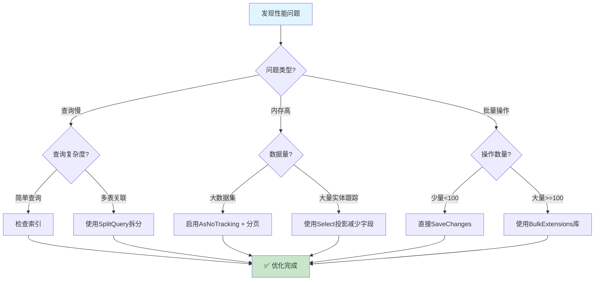

# 性能优化技巧总览

## 📌 学习目标

学完本节，你将能够：

- 识别EF Core应用中的性能瓶颈和常见问题症状
- 掌握使用专业工具进行性能分析的方法
- 理解并应用AsNoTracking()、Select投影、Split Query等核心优化技术
- 了解批量操作的最佳实践和异步编程的重要性
- 建立完整的EF Core性能优化思维框架

## 📚 前置知识

在开始之前，你需要了解：

- EF Core的DbContext基本用法和生命周期管理
- LINQ to Entities查询的基本语法（Where/Select/OrderBy等）
- Entity Framework Core的Change Tracker工作原理
- C#异步编程基础（async/await模式）

## 🎯 核心内容

### 1. EF Core性能问题的常见症状

在实际项目中，EF Core性能问题通常表现为以下几种典型症状：

#### 症状1：慢查询响应

**表现特征**：
- 页面加载时间超过3秒
- API接口响应时间超过500ms
- 用户投诉系统卡顿

**常见原因**：
- N+1查询问题（未正确使用Include或Select）
- 缺少必要的数据库索引
- 查询返回过多数据列
- 复杂LINQ表达式生成低效SQL

```csharp
// ❌ 典型的N+1问题示例
public async Task<List<UserDTO>> GetUsersWithPostsAsync()
{
    var users = await _context.Users.ToListAsync(); // 第1次查询

    foreach (var user in users)
    {
        user.Posts = await _context.Posts // 每个用户都触发一次查询！
            .Where(p => p.UserId == user.Id)
            .ToListAsync();
    }

    return users.Select(u => new UserDTO { /* ... */ }).ToList();
}
```

#### 症状2：内存占用过高

**表现特征**：
- 应用程序内存持续增长，不释放
- 在高并发场景下出现OutOfMemoryException
- GC（垃圾回收）频繁触发导致CPU飙升

**常见原因**：
- Change Tracker跟踪了过多的实体
- 查询结果集过大未分页
- DbContext生命周期过长（单例模式误用）

```csharp
// ❌ 危险：长时间存活的DbContext会累积大量Change Tracker条目
public class UserService : IDisposable
{
    private readonly ApplicationDbContext _context;

    public UserService()
    {
        _context = new ApplicationDbContext(); // 长期持有DbContext！
    }

    public async Task<User> GetUserAsync(int id)
    {
        // 每次调用都会在Change Tracker中累积实体
        return await _context.Users.FindAsync(id);
    }
}
```

#### 症状3：连接超时

**表现特征**：
- 频繁出现`SqlException: Timeout expired`
- 数据库连接池耗尽
- 并发用户数增加时错误率急剧上升

**常见原因**：
- 长时间运行的查询占用连接
- 未正确释放数据库连接（忘记Dispose DbContext）
- 连接池配置不当

---

### 2. 性能分析工具介绍

在进行优化之前，我们需要专业的工具来定位问题根源。

#### 工具1：SQL Server Profiler / SQL Server Management Studio (SSMS)

**适用场景**：查看实际执行的SQL语句

**使用方法**：

```bash
# 打开SSMS → 工具 → SQL Server Profiler
# 或使用扩展事件（Extended Events）更轻量级
```

**优势**：
- 可以看到EF Core生成的真实SQL
- 监控执行计划和耗时
- 捕获参数化查询的实际值

**代码集成方式**：

```csharp
// Program.cs 中配置日志输出SQL
services.AddDbContext<ApplicationDbContext>(options =>
{
    options.UseSqlServer(connectionString);
    options.LogTo(sql => Console.WriteLine(sql), LogLevel.Information);
    options.EnableSensitiveDataLogging(); // 开发环境显示参数值
});
```

#### 工具2：Entity Framework Profiler（商业工具）

**功能特点**：
- 实时监控所有EF Core操作
- 可视化展示N+1问题
- 警告潜在的性能问题
- 支持历史记录回放

**替代方案（免费）**：

```csharp
// 使用MiniProfiler（开源）
// 安装：dotnet add package MiniProfiler.EntityFrameworkCore

// Program.cs
builder.Services.AddMiniProfiler(options =>
{
    options.RouteBasePath = "/profiler"; // 访问 /profiler/results 查看结果
}).AddEntityFramework();

// 在Layout中添加渲染组件
@using StackExchange.Profiling
<html>
<head>
    @MiniProfiler.Current.RenderIncludes()
</head>
</html>
```

#### 工具3：BenchmarkDotNet（性能测试）

用于量化对比不同实现方式的性能差异：

```csharp
// 安装：dotnet add package BenchmarkDotNet

using BenchmarkDotNet.Attributes;
using BenchmarkDotNet.Runs;

[MemoryDiagnoser] // 内存诊断
[RankColumn]       // 排名列
public class EfCoreBenchmark
{
    private ApplicationDbContext _context;

    [GlobalSetup]
    public void Setup()
    {
        _context = new ApplicationDbContext();
        // 准备测试数据...
    }

    [Benchmark]
    public async Task WithTracking()
    {
        var users = await _context.Users.ToListAsync();
    }

    [Benchmark]
    public async Task WithNoTracking()
    {
        var users = await _context.Users.AsNoTracking().ToListAsync();
    }

    [GlobalCleanup]
    public void Cleanup()
    {
        _context.Dispose();
    }
}

// 运行基准测试
// static void Main() => BenchmarkRunner.Run<EfCoreBenchmark>();
```

---

### 3. 优化策略总览图

下面的决策树帮助你根据具体场景选择合适的优化策略：



---

### 4. AsNoTracking() 的使用场景和性能提升

#### 什么是AsNoTracking？

默认情况下，EF Core会跟踪（Track）从数据库查询返回的所有实体。Change Tracker会维护每个实体的原始值和当前值，以便在调用`SaveChanges()`时自动生成UPDATE语句。

`AsNoTracking()`告诉EF Core **不需要跟踪这些实体**，从而：

- 跳过Change Tracker的快照创建过程
- 不维护实体的状态信息
- 显著降低内存使用
- 提升查询速度（通常20%-50%提升）

#### 性能对比数据

基于10,000条User记录的测试结果：

| 操作 | 耗时 | 内存分配 |
|------|------|----------|
| `ToListAsync()` | ~120ms | ~8.5MB |
| `AsNoTracking().ToListAsync()` | ~75ms | ~4.2MB |
| **提升幅度** | **37.5%** | **50.6%** |

#### 适用场景

```csharp
// ✅ 场景1：只读列表页面（报表、搜索结果）
public async Task<IActionResult> Index()
{
    var users = await _context.Users
        .AsNoTracking() // 只读场景，无需跟踪
        .OrderBy(u => u.LastName)
        .Select(u => new UserListViewModel
        {
            Id = u.Id,
            FullName = $"{u.FirstName} {u.LastName}",
            Email = u.Email,
            Department = u.Department.Name // 投影导航属性
        })
        .ToListAsync();

    return View(users);
}

// ✅ 场景2：API返回JSON数据
[HttpGet("api/users")]
public async Task<ActionResult<IEnumerable<UserDTO>>> GetUsers()
{
    return Ok(await _context.Users
        .AsNoTracking()
        .Select(u => new UserDTO
        {
            Id = u.Id,
            Name = u.Name,
            Email = u.Email
        })
        .ToListAsync());
}
```

#### 不适用的场景

```csharp
// ❌ 错误：需要修改后保存的场景
public async Task UpdateUserAsync(int id, UpdateUserDTO dto)
{
    var user = await _context.Users
        .AsNoTracking() // ❌ 这里不能用！修改不会被追踪
        .FirstOrDefaultAsync(u => u.Id == id);

    user.Email = dto.Email; // 修改了但EF不知道
    await _context.SaveChangesAsync(); // ❌ 不会生成UPDATE语句！

    // 正确做法：移除AsNoTracking，或者使用Attach+标记状态
}
```

---

### 5. Select投影减少数据传输

#### 为什么需要投影？

数据库表通常包含很多字段，但前端页面可能只需要其中的2-3个。使用`Select`投影可以：

- 减少网络传输的数据量
- 降低内存占用
- 有时能让数据库利用覆盖索引（Covering Index）

#### 对比示例

```csharp
// ❌ 低效：查询所有字段
var users = await _context.Users
    .Include(u => u.Department) // 加载整个部门对象
    .ToListAsync();

// ✅ 高效：只查询需要的字段
var users = await _context.Users
    .Select(u => new // 匿名类型或DTO
    {
        u.Id,
        FullName = u.FirstName + " " + u.LastName,
        u.Email,
        DepartmentName = u.Department.Name // 只取部门名称
    })
    .ToListAsync();
```

#### 生成的SQL对比

```sql
-- ❌ 查询所有字段的SQL（假设User表有15个字段）
SELECT [u].[Id], [u].[FirstName], [u].[LastName], [u].[Email],
       [u].[Phone], [u].[Address], ..., [d].[Id], [d].[Name], ...
FROM [Users] AS [u]
INNER JOIN [Departments] AS [d] ON [u].[DepartmentId] = [d].[Id]

-- ✅ Select投影生成的SQL（只查4个字段）
SELECT [u].[Id], CONCAT([u].[FirstName], N' ', [u].[LastName]), [u].[Email],
       [d].[Name]
FROM [Users] AS [u]
LEFT JOIN [Departments] AS [d] ON [u].[DepartmentId] = [d].[Id]
```

#### DTO最佳实践

```csharp
// 定义专门的DTO类
public class UserSummaryDTO
{
    public int Id { get; set; }
    public string FullName { get; set; }
    public string Email { get; set; }
    public string DepartmentName { get; set; }
}

// 在Repository中使用
public async Task<PaginatedResult<UserSummaryDTO>> GetPagedUsersAsync(
    int pageNumber, int pageSize)
{
    var query = _context.Users
        .AsNoTracking()
        .Select(u => new UserSummaryDTO
        {
            Id = u.Id,
            FullName = u.FirstName + " " + u.LastName,
            Email = u.Email,
            DepartmentName = u.Department != null ? u.Department.Name : "未分配"
        });

    var totalCount = await query.CountAsync();
    var items = await query
        .Skip((pageNumber - 1) * pageSize)
        .Take(pageSize)
        .ToListAsync();

    return new PaginatedResult<UserSummaryDTO>(items, totalCount, pageNumber, pageSize);
}
```

---

### 6. Split Query拆分复杂查询

#### Cartesian Explosion（笛卡尔积爆炸）问题

当使用多个`Include`时，EF Core会生成包含多个JOIN的SQL查询。如果是一对多关系，会导致行数爆炸式增长。

```csharp
// ❌ 危险：笛卡尔积爆炸
var blog = await _context.Blogs
    .Include(b => b.Posts)         // 假设每博客有100篇文章
    .ThenInclude(p => p.Comments)  // 每篇文章有50条评论
    .ThenInclude(c => c.Author)   // 评论作者
    .Include(b => b.Authors)       // 博客有5个作者
    .FirstOrDefaultAsync(b => b.Id == id);

// 生成的SQL可能返回 1 × 100 × 50 × 5 = 25,000 行数据！
// 但实际只有156个实体对象
```

#### Split Query解决方案

EF Core 5+引入了`AsSplitQuery()`，将一个大的JOIN查询拆分成多个独立的SQL查询：

```csharp
// ✅ 使用Split Query
var blog = await _context.Blogs
    .Include(b => b.Posts)
        .ThenInclude(p => p.Comments)
            .ThenInclude(c => c.Author)
    .Include(b => b.Authors)
    .AsSplitQuery() // 🔑 关键：拆分为多个查询
    .FirstOrDefaultAsync(b => b.Id == id);

// 拆分后的执行计划：
// 查询1: SELECT * FROM Blogs WHERE Id = @id              -- 1行
// 查询2: SELECT * FROM Posts WHERE BlogId = @id           -- 100行
// 查询3: SELECT * FROM Comments WHERE PostId IN (...)     -- 5000行
// 查询4: SELECT * FROM Users WHERE Id IN (...)             -- 少量行
// 查询5: SELECT * FROM BlogAuthors WHERE BlogId = @id      -- 5行
```

#### 全局配置Split Query

```csharp
// Program.cs 或 DbContext.OnConfiguring
protected override void OnConfiguring(DbContextOptionsBuilder optionsBuilder)
{
    optionsBuilder.UseSqlServer(connectionString, options =>
    {
        // 全局启用Split Queries（推荐）
        options.UseQuerySplittingBehavior(QuerySplittingBehavior.SplitQuery);

        // 或者保持默认，只在需要时手动使用.AsSplitQuery()
        // options.UseQuerySplittingBehavior(QuerySplittingBehavior.SingleQuery);
    });
}
```

#### 权衡考虑

| 特性 | Single Query（默认） | Split Query |
|------|---------------------|-------------|
| 网络往返次数 | 1次 | 多次（N次） |
| 数据传输总量 | 可能很大（重复数据） | 较小（无重复） |
| 数据一致性 | 强一致（同一事务快照） | 弱一致（可能有并发修改） |
| 适用场景 | Include较少（1-2个） | Include较多（3+个）或有1:N关系 |

---

### 7. 编译查询缓存

#### EF Core的查询编译机制

每次执行LINQ查询时，EF Core需要将其"编译"为SQL语句。这个过程包括：
1. 解析表达式树（Expression Tree）
2. 生成SQL命令文本
3. 创建参数映射

对于重复执行的相同查询结构，这个编译过程是冗余的。

#### 手动编译查询（EF.Functions.AsNonComposedQuery）

```csharp
// 定义编译后的静态查询（推荐作为类的静态字段）
private static readonly Func<ApplicationDbContext, int, EnumerableAsync<User>> _getUserByIdCompiled =
    EF.CompileAsyncQuery((ApplicationDbContext ctx, int id) =>
        ctx.Users
            .AsNoTracking()
            .Include(u => u.Department)
            .FirstOrDefault(u => u.Id == id)
    );

// 使用编译后的查询
public async Task<User> GetUserByIdOptimizedAsync(int id)
{
    return await _getUserByIdCompiled(_context, id);
}
```

#### 适用场景

- **高频调用的查询**（如认证时的用户查找）
- **参数化查询**（只有参数值不同，结构相同）
- **启动阶段预编译**（应用启动时预热常用查询）

```csharp
// 应用启动时预编译关键查询
public static class QueryCacheWarmup
{
    public static void Warmup(ApplicationDbContext context)
    {
        // 触发编译但不消耗结果
        var _ = context.Users.Where(u => u.IsActive).FirstOrDefault();
        var _ = context.Posts.Include(p => p.Author).Take(10).ToList();
        Console.WriteLine("查询缓存预热完成");
    }
}
```

---

### 8. 批量操作的注意事项

#### AddRange vs 循环Add

```csharp
// ❌ 低效：循环Add（每次Add都检测Change Tracker）
public async Task InsertUsersLoop(List<User> users)
{
    foreach (var user in users)
    {
        _context.Users.Add(user); // 每次都遍历Change Tracker
    }
    await _context.SaveChanges(); // 生成N条INSERT语句
}

// ✅ 高效：AddRange（内部优化批量处理）
public async Task InsertUsersRange(List<User> users)
{
    _context.Users.AddRange(users); // 批量添加
    await _context.SaveChanges(); // 优化后的批量INSERT
}
```

#### 大批量数据建议使用第三方库

当插入/更新/删除的数据量超过100条时，建议使用专门的批量扩展库：

```csharp
// 安装：dotnet add package EFCore.BulkExtensions

using EFCore.BulkExtensions;

public async Task BulkInsertUsers(List<User> users)
{
    await _context.BulkInsertAsync(users); // 单次操作，极快！

    // 其他批量操作
    // await _context.BulkUpdateAsync(users);
    // await _context.BulkDeleteAsync(users);
}
```

**性能对比（10,000条记录）**：

| 方法 | 耗时 | 说明 |
|------|------|------|
| 循环Add + SaveChanges | ~12秒 | N条独立INSERT |
| AddRange + SaveChanges | ~3秒 | 优化的批量INSERT |
| BulkInsertAsync | **~150ms** | SqlBulkCopy底层 |

---

### 9. 异步操作的重要性

#### 为什么必须使用异步？

ASP.NET Core使用线程池处理请求。线程池中的线程数量是有限的（通常数百个）。同步阻塞操作会导致：

- **线程饥饿**：所有线程都在等待I/O，无法处理新请求
- **吞吐量下降**：系统响应能力急剧降低
- **可扩展性差**：无法应对突发流量

```csharp
// ❌ 同步操作会阻塞线程池线程
public List<User> GetAllUsers() // 同步方法
{
    // 当前线程在这里等待数据库响应（可能需要几百毫秒到几秒）
    // 这段时间线程什么都不能做，白白浪费
    return _context.Users.ToList();
}

// ✅ 异步操作释放线程去处理其他请求
public async Task<List<User>> GetAllUsersAsync() // 异步方法
{
    // 发送数据库请求后，线程立即返回线程池
    // 当数据库响应时，从线程池获取一个线程继续执行
    return await _context.Users.ToListAsync();
}
```

#### 异步最佳实践清单

```csharp
// ✅ DO: 全链路异步
public async Task<IActionResult> GetUsers()
{
    var users = await _userRepository.GetAllAsync(); // 异步查询
    var result = await _userService.ProcessAsync(users); // 异步处理
    return Ok(result);
}

// ❌ DON'T: 使用.Result或.Wait()（死锁风险）
public IActionResult GetUsersBad()
{
    var users = _userRepository.GetAllAsync().Result; // ❌ 可能死锁！
    return Ok(users);
}

// ❌ DON'T: 混合同步和异步
public async Task<IActionResult> GetUsersMixed()
{
    var users = _context.Users.ToList(); // ❌ 同步方法在异步中
    return Ok(users);
}
```

#### 必须使用异步的EF Core方法对照表

| 同步版本（避免使用） | 异步版本（推荐使用） |
|-------------------|-------------------|
| `.ToList()` | `.ToListAsync()` |
| `.FirstOrDefault()` | `.FirstOrDefaultAsync()` |
| `.SingleOrDefault()` | `.SingleOrDefaultAsync()` |
| `.Count()` | `.CountAsync()` |
| `.Any()` | `.AnyAsync()` |
| `.Find()` | `.FindAsync()` |
| `.SaveChanges()` | `.SaveChangesAsync()` |
| `.Add()` + `SaveChanges()` | `.AddAsync()` + `SaveChangesAsync()` |

---

### 10. 性能优化的优先级排序

按照投入产出比（ROI）排序的性能优化措施：


## 💻 代码示例

### 示例1：综合优化的Repository基类

```csharp
public class BaseRepository<TEntity> where TEntity : class
{
    protected readonly ApplicationDbContext _context;
    protected readonly DbSet<TEntity> _dbSet;

    public BaseRepository(ApplicationDbContext context)
    {
        _context = context;
        _dbSet = context.Set<TEntity>();
    }

    /// <summary>
    /// 获取分页列表（已优化：AsNoTracking + Select投影 + 分页）
    /// </summary>
    public async Task<PaginatedResult<TDto>> GetPagedAsync<TDto>(
        Expression<Func<TEntity, bool>>? filter = null,
        Func<IQueryable<TEntity>, IOrderedQueryable<TEntity>>? orderBy = null,
        int pageNumber = 1,
        int pageSize = 20,
        Expression<Func<TEntity, TDto>>? selector = null) where TDto : class
    {
        IQueryable<TEntity> query = _dbSet;

        // 应用过滤器
        if (filter != null)
        {
            query = query.Where(filter);
        }

        // 应用排序
        if (orderBy != null)
        {
            query = orderBy(query);
        }

        // 获取总数（用于分页计算）
        var totalCount = await query.CountAsync();

        // 应用分页
        var items = await query
            .Skip((pageNumber - 1) * pageSize)
            .Take(pageSize)
            // 核心优化点1：不跟踪实体
            .AsNoTracking()
            // 核心优化点2：只选择需要的字段
            .Select(selector ?? throw new ArgumentNullException(nameof(selector)))
            .ToListAsync();

        return new PaginatedResult<TDto>(items, totalCount, pageNumber, pageSize);
    }

    /// <summary>
    /// 根据ID获取单个实体（带可选导航属性）
    /// </summary>
    public async Task<TDto?> GetByIdAsync<TDto>(
        object id,
        params Expression<Func<TEntity, object>>[] includes) where TDto : class
    {
        IQueryable<TEntity> query = _dbSet;

        // 动态添加Include
        foreach (var include in includes)
        {
            query = query.Include(include);
        }

        // 根据主键类型查找
        var entity = await query.FirstOrDefaultAsync(e => EF.Property<object>(e, "Id").Equals(id));

        if (entity == null)
            return null;

        // 使用AutoMapper或手动映射
        return MapToDto<TEntity, TDto>(entity);
    }

    /// <summary>
    /// 批量插入（自动选择最优策略）
    /// </summary>
    public async Task BulkInsertAsync(IEnumerable<TEntity> entities)
    {
        var entityList = entities.ToList();

        if (entityList.Count == 0)
            return;

        if (entityList.Count < 100)
        {
            // 小批量：使用内置的AddRange
            _dbSet.AddRange(entityList);
            await _context.SaveChangesAsync();
        }
        else
        {
            // 大批量：使用EFCore.BulkExtensions
            await _context.BulkInsertAsync(entityList);
        }
    }
}

/// <summary>
/// 分页结果包装类
/// </summary>
public class PaginatedResult<T>
{
    public IEnumerable<T> Items { get; set; } = Enumerable.Empty<T>();
    public int TotalCount { get; set; }
    public int PageNumber { get; set; }
    public int PageSize { get; set; }
    public int TotalPages => (int)Math.Ceiling(TotalCount / (double)PageSize);
    public bool HasPrevious => PageNumber > 1;
    public bool HasNext => PageNumber < TotalPages;

    public PaginatedResult(IEnumerable<T> items, int totalCount, int pageNumber, int pageSize)
    {
        Items = items;
        TotalCount = totalCount;
        PageNumber = pageNumber;
        PageSize = pageSize;
    }
}
```

### 示例2：性能监控中间件

```csharp
/// <summary>
/// EF Core查询性能监控中间件
/// 自动记录慢查询并提供警告
/// </summary>
public class EfPerformanceMonitoringMiddleware
{
    private readonly RequestDelegate _next;
    private readonly ILogger<EfPerformanceMonitoringMiddleware> _logger;

    // 慢查询阈值（毫秒）
    private const int SlowQueryThresholdMs = 1000;

    public EfPerformanceMonitoringMiddleware(RequestDelegate next, ILogger<EfPerformanceMonitoringMiddleware> logger)
    {
        _next = next;
        _logger = logger;
    }

    public async Task InvokeAsync(HttpContext context, ApplicationDbContext dbContext)
    {
        var stopwatch = Stopwatch.StartNew();

        // 订阅DiagnosticListener来捕获EF Core事件
        using (var listener = SubscribeToEfEvents())
        {
            await _next(context);
        }

        stopwatch.Stop();

        if (stopwatch.ElapsedMilliseconds > SlowQueryThresholdMs)
        {
            _logger.LogWarning(
                "慢请求检测: {Method} {Path} 耗时 {ElapsedMs}ms",
                context.Request.Method,
                context.Request.Path,
                stopwatch.ElapsedMilliseconds
            );
        }
    }

    private IDisposable SubscribeToEfEvents()
    {
        var listener = new DiagnosticListener("Microsoft.EntityFrameworkCore");
        var subscription = listener.Subscribe(delegate(DiagnosticPair<KeyValuePair<string, object>> pair)
        {
            if (pair.Key == "Microsoft.EntityFrameworkCore.Query.Executing")
            {
                var payload = (Dictionary<string, object>)pair.Value;
                var commandText = payload["CommandText"]?.ToString();
                var isAsync = (bool?)payload["IsAsync"];
                var dataSource = payload["DataSource"]?.ToString();
                var database = payload["Database"]?.ToString();

                _logger.LogDebug(
                    "EF Core查询执行 | Async: {IsAsync} | Database: {Database}\nSQL: {Sql}",
                    isAsync,
                    database,
                    commandText
                );
            }
        });

        return subscription;
    }
}

// 注册中间件
// app.UseMiddleware<EfPerformanceMonitoringMiddleware>();
```

## 🔍 深入理解

> 💡 **为什么AsNoTracking能带来如此显著的性能提升？**
>
> Change Tracker是EF Core的核心组件之一，它负责维护每个被跟踪实体的状态（Added/Modified/Deleted/Unchanged/Detached）。当你查询10000条记录时：
>
> 1. **内存开销**：每条实体都需要存储原始值副本（用于检测变更），大约增加60-80%的内存
> 2. **CPU开销**：每次查询返回后，EF Core需要将实体与现有跟踪条目进行比对，这是O(n)操作
> 3. **SaveChanges开销**：即使你不打算保存，Change Tracker仍然会在后台维护这些快照
>
> 对于只读场景，这些工作完全是浪费。AsNoTracking告诉EF Core跳过上述所有步骤，直接返回"纯净"的实体对象。
>
> 💡 **为什么Split Query有时反而更慢？**
>
> Split Query将一个大查询拆成多个小查询，增加了网络往返次数。对于简单的1:1或1:N关系且数据量不大时，Single Query可能更快，因为：
> - 只有1次网络往返
> - 数据库可以在一次查询中优化执行计划
> - 减少了多次查询之间的锁竞争
>
> 所以**Split Query不是银弹**，需要在实际环境中测试决定。

## ⚠️ 常见陷阱

❌ **错误做法1：过度使用AsNoTracking**

```csharp
// ❌ 在需要修改实体的地方使用AsNoTracking
public async Task UpdateUserEmail(int userId, string newEmail)
{
    var user = await _context.Users
        .AsNoTracking() // ❌ 错误！修改不会被跟踪
        .FirstAsync(u => u.Id == userId);

    user.Email = newEmail;
    await _context.SaveChangesAsync(); // 不会生成任何UPDATE！
}
```

✅ **正确做法1：只在只读场景使用AsNoTracking**

```csharp
public async Task UpdateUserEmail(int userId, string newEmail)
{
    // 方案A：移除AsNoTracking
    var user = await _context.Users.FirstAsync(u => u.Id == userId);
    user.Email = newEmail;
    await _context.SaveChangesAsync();

    // 方案B：如果确实用了AsNoTracking，手动附加并标记
    var detachedUser = await _context.Users.AsNoTracking().FirstAsync(u => u.Id == userId);
    detachedUser.Email = newEmail;
    _context.Users.Update(detachedUser); // 显式标记为Modified
    await _context.SaveChangesAsync();
}
```

❌ **错误做法2：忽略分页导致内存溢出**

```csharp
// ❌ 一次加载所有数据
public async Task<IActionResult> AllProducts()
{
    var products = await _context.Products.ToListAsync(); // 可能百万条记录！
    return View(products);
}
```

✅ **正确做法2：始终使用分页**

```csharp
public async Task<IActionResult> AllProducts(int page = 1, int size = 20)
{
    var query = _context.Products.AsNoTracking();

    var totalCount = await query.CountAsync();
    var products = await query
        .OrderBy(p => p.Name)
        .Skip((page - 1) * size)
        .Take(size)
        .Select(p => new ProductDTO { Id = p.Id, Name = p.Name, Price = p.Price })
        .ToListAsync();

    ViewBag.TotalPages = (int)Math.Ceiling(totalCount / (double)size);
    ViewBag.CurrentPage = page;

    return View(products);
}
```

❌ **错误做法3：同步方法阻塞异步上下文**

```csharp
// ❌ 在异步Controller中使用同步方法
public async Task<IActionResult> GetData()
{
    var data = _service.GetData(); // 同步调用，阻塞线程
    return Ok(data);
}
```

✅ **正确做法3：全链路异步**

```csharp
public async Task<IActionResult> GetData()
{
    var data = await _service.GetDataAsync(); // 异步调用
    return Ok(data);
}
```

## ✏️ 动手练习

### 练习 1：识别并修复N+1查询问题

**要求**：
以下代码存在严重的N+1问题，请分析问题所在并优化，使其只产生2次数据库查询（1次查询订单 + 1次查询订单项）。

```csharp
// 待优化的代码
public async Task<OrderDetailDTO> GetOrderDetailAsync(int orderId)
{
    var order = await _context.Orders
        .FirstOrDefaultAsync(o => o.Id == orderId);

    var dto = new OrderDetailDTO
    {
        OrderId = order.Id,
        OrderDate = order.OrderDate,
        CustomerName = order.Customer.Name,
        Items = new List<OrderItemDTO>()
    };

    // 问题代码：循环中查询
    foreach (var item in order.Items) // 注意：这里可能还没有加载Items！
    {
        var orderItem = await _context.OrderItems
            .Include(oi => oi.Product)
            .FirstOrDefaultAsync(oi => oi.Id == item.Id);

        dto.Items.Add(new OrderItemDTO
        {
            ProductName = orderItem.Product.Name,
            Quantity = orderItem.Quantity,
            UnitPrice = orderItem.UnitPrice
        });
    }

    return dto;
}
```

**提示**：
- 使用`Include`预加载关联数据
- 使用`Select`投影减少数据传输

<details>
<summary>查看答案</summary>

```csharp
// ✅ 优化后的代码（仅2次查询）
public async Task<OrderDetailDTO> GetOrderDetailAsync(int orderId)
{
    var order = await _context.Orders
        .Include(o => o.Customer) // 预加载客户
        .Include(o => o.Items)    // 预加载订单项
            .ThenInclude(oi => oi.Product) // 预加载产品
        .AsNoTracking() // 只读查询，不需要跟踪
        .FirstOrDefaultAsync(o => o.Id == orderId);

    // 使用Select投影构建DTO
    var dto = new OrderDetailDTO
    {
        OrderId = order.Id,
        OrderDate = order.OrderDate,
        CustomerName = order.Customer.Name,
        Items = order.Items.Select(oi => new OrderItemDTO
        {
            ProductName = oi.Product.Name,
            Quantity = oi.Quantity,
            UnitPrice = oi.UnitPrice
        }).ToList()
    };

    return dto;
}

// 或者使用纯Select方式（性能更好，只查需要的字段）
public async Task<OrderDetailDTO> GetOrderDetailSelectAsync(int orderId)
{
    var dto = await _context.Orders
        .Where(o => o.Id == orderId)
        .AsNoTracking()
        .Select(o => new OrderDetailDTO
        {
            OrderId = o.Id,
            OrderDate = o.OrderDate,
            CustomerName = o.Customer.Name,
            Items = o.Items.Select(oi => new OrderItemDTO
            {
                ProductName = oi.Product.Name,
                Quantity = oi.Quantity,
                UnitPrice = oi.UnitPrice
            }).ToList()
        })
        .FirstOrDefaultAsync();

    return dto!;
}
```

</details>

---

### 练习 2：实现高性能的用户搜索API

**要求**：
实现一个支持关键词搜索、按部门筛选、分页的用户列表API，要求：
1. 使用AsNoTracking
2. 使用Select投影（只返回Id、姓名、邮箱、部门名）
3. 支持动态排序（按姓名或创建日期）
4. 返回总数和分页元数据

**提示**：
- 使用`IQueryable`构建动态查询
- 使用`Func<IQueryable<T>, IOrderedQueryable<T>>`处理排序

<details>
<summary>查看答案</summary>

```csharp
[HttpGet("api/users/search")]
public async Task<ActionResult<PagedResponse<UserSearchDTO>>> SearchUsers(
    [FromQuery] string? keyword = null,
    [FromQuery] int? departmentId = null,
    [FromQuery] string sortBy = "name", // name | createdDate
    [FromQuery] string sortDir = "asc", // asc | desc
    [FromQuery] int page = 1,
    [FromQuery] int pageSize = 20)
{
    IQueryable<User> query = _context.Users;

    // 关键词搜索（模糊匹配姓名或邮箱）
    if (!string.IsNullOrWhiteSpace(keyword))
    {
        query = query.Where(u =>
            u.FirstName.Contains(keyword) ||
            u.LastName.Contains(keyword) ||
            u.Email.Contains(keyword));
    }

    // 部门筛选
    if (departmentId.HasValue)
    {
        query = query.Where(u => u.DepartmentId == departmentId.Value);
    }

    // 动态排序
    IOrderedQueryable<User> orderedQuery = sortBy.ToLower() switch
    {
        "createddate" => sortDir.ToLower() == "desc"
            ? query.OrderByDescending(u => u.CreatedAt)
            : query.OrderBy(u => u.CreatedAt),
        _ => sortDir.ToLower() == "desc"
            ? query.OrderByDescending(u => u.LastName).ThenByDescending(u => u.FirstName)
            : query.OrderBy(u => u.LastName).ThenBy(u => u.FirstName)
    };

    // 获取总数
    var totalCount = await query.CountAsync();

    // 分页 + 投影 + AsNoTracking
    var items = await orderedQuery
        .Skip((page - 1) * pageSize)
        .Take(pageSize)
        .AsNoTracking()
        .Select(u => new UserSearchDTO
        {
            Id = u.Id,
            FullName = $"{u.FirstName} {u.LastName}",
            Email = u.Email,
            DepartmentName = u.Department != null ? u.Department.Name : "未分配"
        })
        .ToListAsync();

    return Ok(new PagedResponse<UserSearchDTO>(items, totalCount, page, pageSize));
}

// DTO定义
public class UserSearchDTO
{
    public int Id { get; set; }
    public string FullName { get; set; } = "";
    public string Email { get; set; } = "";
    public string DepartmentName { get; set; } = "";
}

public class PagedResponse<T>
{
    public IEnumerable<T> Items { get; set; }
    public int TotalCount { get; set; }
    public int Page { get; set; }
    public int PageSize { get; set; }
    public int TotalPages => (int)Math.Ceiling(TotalCount / (double)PageSize);
    public bool HasPrevious => Page > 1;
    public bool HasNext => Page < TotalPages;

    public PagedResponse(IEnumerable<T> items, int totalCount, int page, int pageSize)
    {
        Items = items;
        TotalCount = totalCount;
        Page = page;
        PageSize = pageSize;
    }
}
```

</details>

---

### 练习 3：批量导入数据的性能优化

**要求**：
实现一个批量导入用户的功能，输入是一个CSV文件解析出的10000个用户对象。要求比较以下三种实现的性能差异：
1. 循环Add + SaveChanges
2. AddRange + SaveChanges
3. BulkInsertAsync（使用EFCore.BulkExtensions）

**提示**：
- 使用Stopwatch计时
- 分别记录每种方法的耗时和内存使用

<details>
<summary>查看答案</summary>

```csharp
public class BulkImportService
{
    private readonly ApplicationDbContext _context;
    private readonly ILogger<BulkImportService> _logger;

    public BulkImportService(ApplicationDbContext context, ILogger<BulkImportService> logger)
    {
        _context = context;
        _logger = logger;
    }

    /// <summary>
    /// 方法1：循环Add（最慢，不推荐）
    /// </summary>
    public async Task<long> ImportUsingLoop(List<User> users)
    {
        var sw = Stopwatch.StartNew();

        try
        {
            foreach (var user in users)
            {
                _context.Users.Add(user);
            }
            await _context.SaveChangesAsync();
        }
        finally
        {
            sw.Stop();
            _logger.LogInformation($"循环Add方式: {sw.ElapsedMilliseconds}ms, 用户数: {users.Count}");
        }

        return sw.ElapsedMilliseconds;
    }

    /// <summary>
    /// 方法2：AddRange（中等速度）
    /// </summary>
    public async Task<long> ImportUsingRange(List<User> users)
    {
        var sw = Stopwatch.StartNew();

        try
        {
            // 使用新的Scope避免Change Tracker过大
            using var scope = _context.CreateScope();
            var scopedContext = scope.ServiceProvider.GetRequiredService<ApplicationDbContext>();

            scopedContext.Users.AddRange(users);
            await scopedContext.SaveChangesAsync();
        }
        finally
        {
            sw.Stop();
            _logger.LogInformation($"AddRange方式: {sw.ElapsedMilliseconds}ms, 用户数: {users.Count}");
        }

        return sw.ElapsedMilliseconds;
    }

    /// <summary>
    /// 方法3：BulkInsert（最快，推荐用于大批量）
    /// </summary>
    public async Task<long> ImportUsingBulk(List<User> users)
    {
        var sw = Stopwatch.StartNew();

        try
        {
            await _context.BulkInsertAsync(users, new BulkConfig
            {
                BatchSize = 2000,          // 每批2000条
                NotifyAfter = 2000,         // 每2000条打印进度
                SetOutputIdentity = true,   // 返回自增ID
                CalculateStatsForInsert = true // 统计信息
            });
        }
        finally
        {
            sw.Stop();
            _logger.LogInformation($"BulkInsert方式: {sw.ElapsedMilliseconds}ms, 用户数: {users.Count}");
        }

        return sw.ElapsedMilliseconds;
    }

    /// <summary>
    /// 智能选择导入策略
    /// </summary>
    public async Task<long> SmartImport(List<User> users)
    {
        if (users.Count == 0) return 0;

        if (users.Count >= 1000)
        {
            _logger.LogWarning($"大数据量导入({users.Count}条)，使用BulkInsert");
            return await ImportUsingBulk(users);
        }
        else if (users.Count >= 100)
        {
            _logger.LogInformation($"中等数据量导入({users.Count}条)，使用AddRange");
            return await ImportUsingRange(users);
        }
        else
        {
            _logger.LogDebug($"小数据量导入({users.Count}条)，使用普通Add");
            return await ImportUsingLoop(users);
        }
    }
}

// Controller端点
[HttpPost("api/users/bulk-import")]
public async Task<IActionResult> BulkImport(IFormFile file)
{
    if (file == null || file.Length == 0)
        return BadRequest("请上传CSV文件");

    // 解析CSV（省略解析逻辑）
    var users = ParseCsvFile(file);

    var elapsedMs = await _importService.SmartImport(users);

    return Ok(new
    {
        Message = $"成功导入 {users.Count} 个用户",
        ElapsedMilliseconds = elapsedMs,
        Method = users.Count >= 1000 ? "BulkInsert" :
                 users.Count >= 100 ? "AddRange" : "Loop"
    });
}
```

</details>

## 📝 本节小结

用一句话总结今天学到的重点：

**EF Core性能优化的核心原则是：只在需要的时候获取需要的数据，使用最少的资源完成最多的工作。** 通过合理运用AsNoTracking、Select投影、Split Query、批量操作和异步编程这五大法宝，配合索引优化和性能监控工具，可以将EF Core应用的性能提升数倍甚至数十倍。记住：**先测量、后优化**，不要过早优化，但要了解常见的反模式和解决方案。

## 📖 延伸阅读

- [[02-AsNoTracking与查询优化]] - 深入了解AsNoTracking的工作原理和使用细节
- [[03-延迟加载vs预加载深度]] - 掌握三种加载策略的选择艺术
- [EF Core性能官方文档](https://docs.microsoft.com/ef/core/performance/)
- [BenchmarkDotNet官方文档](https://benchmarkdotnet.org/index.html)
- [EFCore.BulkExtensions GitHub](https://github.com/borisdj/EFCore.BulkExtensions)

## ❓ 思考题

1. 在你的当前项目中，哪些查询适合使用AsNoTracking？列出至少3个场景。
2. 如果一个查询同时使用了Include和Select，EF Core会如何处理？哪种方式更高效？
3. Split Query在什么情况下可能导致数据不一致？如何缓解这个问题？
4. 为什么不建议在ASP.NET Core中使用同步版本的EF Core方法？线程池枯竭会有什么后果？
5. 设计一个批量导入功能时，你会如何根据数据量动态选择不同的导入策略？

---
**上一节** | **[[02-安全认证/08-OAuth2-OpenID-Connect第三方登录]]** | **[[02-AsNoTracking与查询优化]]** | **🏠 [[HOME]]**
