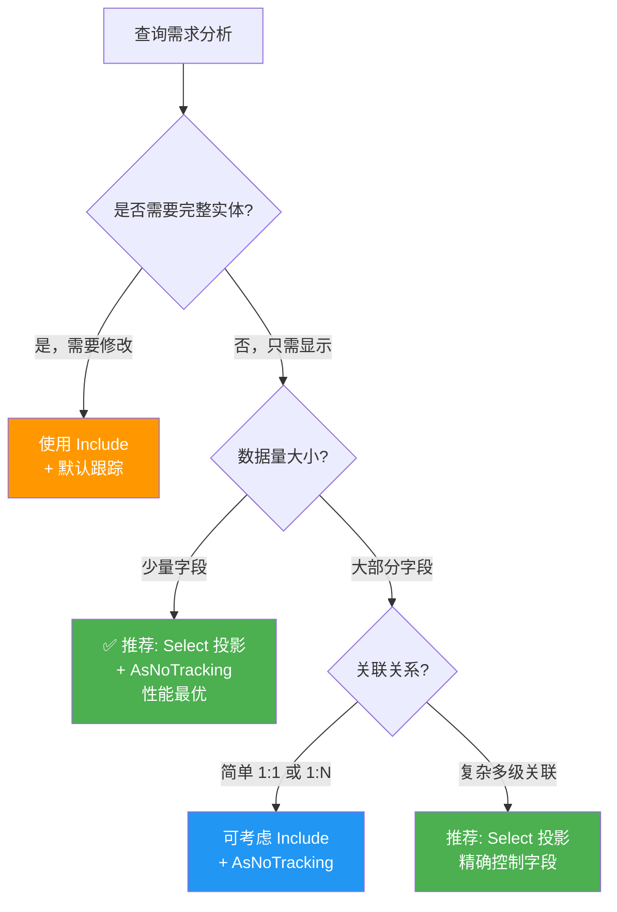
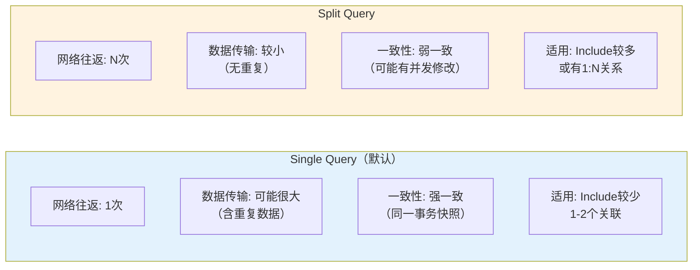
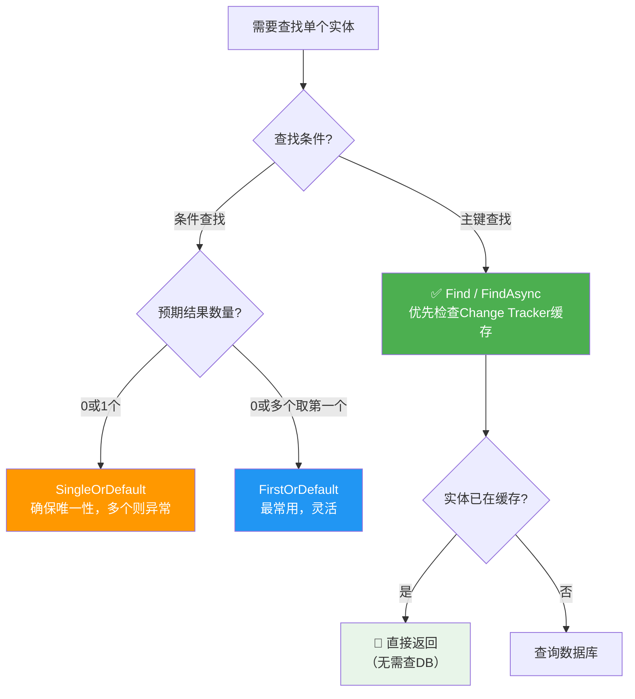
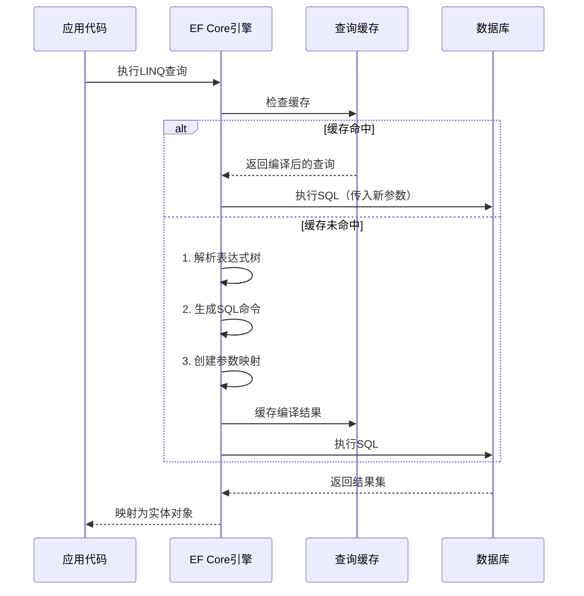

# AsNoTracking与查询优化

## 📌 学习目标

学完本节，你将能够：

- 深入理解Change Tracker的工作原理和性能开销
- 掌握AsNoTracking()的正确使用场景和最佳实践
- 理解AsNoTrackingWithIdentityResolution()与AsNoTracking()的区别
- 运用Select投影、Split Query等高级查询优化技术
- 建立完整的EF Core查询优化决策体系

## 📚 前置知识

在开始之前，你需要了解：

- EF Core的DbContext生命周期管理（Scoped vs Transient）
- LINQ to Entities的基本查询语法
- Entity Framework Core的变更追踪机制基础概念
- C#异步编程模式（async/await）

## 🎯 核心内容

### 1. Change Tracker的工作原理深度剖析

#### Change Tracker是什么？

Change Tracker是EF Core的核心组件，负责维护所有被跟踪实体的状态信息。当你通过DbContext查询或添加实体时，这些实体会被自动注册到Change Tracker中。

```csharp
// 演示Change Tracker的工作过程
public async Task DemonstrateChangeTracker()
{
    // 查询10条用户记录
    var users = await _context.Users.Take(10).ToListAsync();

    // 此时Change Tracker中已有10个实体跟踪条目
    var entryCount = _context.ChangeTracker.Entries().Count();
    Console.WriteLine($"跟踪的实体数量: {entryCount}"); // 输出: 10

    // 修改其中一个实体的属性
    users[0].Email = "new@example.com";

    // Change Tracker自动检测到变化
    var modifiedEntry = _context.ChangeTracker.Entry(users[0]);
    Console.WriteLine($"实体状态: {modifiedEntry.State}"); // 输出: Modified

    // SaveChanges时，EF根据状态生成对应的SQL语句
    await _context.SaveChangesAsync(); // 生成 UPDATE Users SET Email = ... WHERE Id = ...
}
```

#### Change Tracker的性能开销来源

Change Tracker的开销主要体现在三个方面：

**1. 内存开销 - 快照存储**

```csharp
// 每个被跟踪的实体都需要存储原始值快照
public class User
{
    public int Id { get; set; }
    public string FirstName { get; set; }      // 原始值 + 当前值 = 2份
    public string LastName { get; set; }        // 原始值 + 当前值 = 2份
    public string Email { get; set; }           // 原始值 + 当前值 = 2份
    public string Phone { get; set; }           // 原始值 + 当前值 = 2份
    public string Address { get; set; }         // 原始值 + 当前值 = 2份
    // ... 更多字段
}

// 对于10000条User记录：
// 实体对象本身: ~8MB
// Change Tracker快照: ~5MB (额外60-70%内存开销)
```

**2. CPU开销 - 变更检测**

```csharp
// 每次调用SaveChanges()时，EF需要遍历所有跟踪的实体进行对比
public async Task SaveWithOverhead()
{
    // 假设Change Tracker中有5000个实体
    for (int i = 0; i < 5000; i++)
    {
        // 对每个实体的每个属性进行值比较
        // 这是一个O(n*m)的操作，n=实体数，m=属性数
    }
    await _context.SaveChangesAsync();
}
```

**3. 查询后的附加处理**

```csharp
// 即使只是读取数据，也有额外开销
var users = await _context.Users.ToListAsync();
// 执行流程：
// 1. 执行SQL查询数据库
// 2. 将结果集映射为实体对象
// 3. 将每个实体注册到Change Tracker（创建InternalEntityEntry）
// 4. 为每个实体创建属性快照
// 5. 设置实体的初始状态为Unchanged
```

---

### 2. AsNoTracking() 的使用场景详解

#### 什么是AsNoTracking？

`AsNoTracking()`是一个LINQ扩展方法，告诉EF Core **不需要跟踪查询返回的实体**。使用后，查询返回的实体是"纯净"的对象，不会被注册到Change Tracker中。

```csharp
// 基本用法
var users = await _context.Users
    .AsNoTracking()  // 关键方法调用
    .ToListAsync();

// 验证：Change Tracker中没有这些实体
Console.WriteLine(_context.ChangeTracker.Entries().Count()); // 输出: 0
```

#### 核心使用场景

**场景1：只读列表页面**

```csharp
// ✅ 用户列表页 - 只展示，不编辑
[HttpGet]
public async Task<IActionResult> UserList(int page = 1, int pageSize = 20)
{
    var query = _context.Users
        .AsNoTracking()  // 只读场景，无需跟踪
        .OrderBy(u => u.LastName)
        .ThenBy(u => u.FirstName);

    var totalCount = await query.CountAsync();
    var users = await query
        .Skip((page - 1) * pageSize)
        .Take(pageSize)
        .Select(u => new UserListViewModel
        {
            Id = u.Id,
            FullName = $"{u.FirstName} {u.LastName}",
            Email = u.Email,
            DepartmentName = u.Department != null ? u.Department.Name : "未分配",
            IsActive = u.IsActive
        })
        .ToListAsync();

    return View(new PaginatedResult<UserListViewModel>(users, totalCount, page, pageSize));
}
```

**场景2：API接口返回JSON**

```csharp
// ✅ REST API - 返回DTO，不涉及后续修改
[HttpGet("api/products")]
public async Task<ActionResult<IEnumerable<ProductDTO>>> GetProducts(
    [FromQuery] int? categoryId = null,
    [FromQuery] string? search = null)
{
    IQueryable<Product> query = _context.Products.AsNoTracking();

    if (categoryId.HasValue)
        query = query.Where(p => p.CategoryId == categoryId);

    if (!string.IsNullOrWhiteSpace(search))
        query = query.Where(p => p.Name.Contains(search));

    var products = await query
        .Select(p => new ProductDTO
        {
            Id = p.Id,
            Name = p.Name,
            Price = p.Price,
            CategoryName = p.Category.Name,
            ImageUrl = p.ImageUrl,
            InStock = p.StockQuantity > 0
        })
        .Take(100) // 限制最大返回数量
        .ToListAsync();

    return Ok(products);
}
```

**场景3：报表和数据导出**

```csharp
// ✅ 报表生成 - 大量只读数据处理
[HttpGet("api/reports/sales")]
public async Task<FileResult> ExportSalesReport(
    [FromQuery] DateTime startDate,
    [FromQuery] DateTime endDate)
{
    var reportData = await _context.Orders
        .AsNoTracking()  // 报表数据不需要修改
        .Where(o => o.OrderDate >= startDate && o.OrderDate <= endDate)
        .Include(o => o.Customer)
            .ThenInclude(c => c.Region)
        .Include(o => o.Items)
            .ThenInclude(oi => oi.Product)
        .Select(o => new SalesReportRow
        {
            OrderId = o.Id,
            OrderDate = o.OrderDate,
            CustomerName = o.Customer.Name,
            Region = o.Customer.Region.Name,
            ProductNames = string.Join(", ", o.Items.Select(oi => oi.Product.Name)),
            TotalAmount = o.Items.Sum(oi => oi.Quantity * oi.UnitPrice),
            Status = o.Status
        })
        .ToListAsync();

    // 导出为Excel/CSV...
    return ExportToCsv(reportData);
}
```

**场景4：下拉选择框数据**

```csharp
// ✅ 下拉框/自动完成 - 小量只读参考数据
[HttpGet("api/departments/dropdown")]
public async Task<ActionResult<IEnumerable<DepartmentDropdownDTO>>> GetDepartments()
{
    return Ok(await _context.Departments
        .AsNoTracking()
        .Where(d => d.IsActive)
        .OrderBy(d => d.Name)
        .Select(d => new DepartmentDropdownDTO
        {
            Value = d.Id,
            Label = d.Name
        })
        .ToListAsync());
}

[HttpGet("api/users/suggest")]
public async Task<ActionResult<IEnumerable<UserSuggestDTO>>> SuggestUsers([FromQuery] string term)
{
    return Ok(await _context.Users
        .AsNoTracking()
        .Where(u => u.FirstName.Contains(term) || u.LastName.Contains(term))
        .Take(10) // 自动完成通常只需要前10条
        .Select(u => new UserSuggestDTO
        {
            Id = u.Id,
            DisplayName = $"{u.FirstName} {u.LastName}",
            Email = u.Email
        })
        .ToListAsync());
}
```

#### 不应使用AsNoTracking的场景

```csharp
// ❌ 场景1：查询后需要修改并保存
public async Task UpdateUserProfile(int userId, UpdateProfileDTO dto)
{
    var user = await _context.Users
        .AsNoTracking()  // 错误！修改不会被追踪
        .FirstOrDefaultAsync(u => u.Id == userId);

    if (user == null) return;

    user.FirstName = dto.FirstName;
    user.LastName = dto.LastName;
    user.Phone = dto.Phone;

    await _context.SaveChangesAsync();  // 不会生成任何UPDATE！
}

// ✅ 正确做法：移除AsNoTracking
public async Task UpdateUserProfileCorrect(int userId, UpdateProfileDTO dto)
{
    var user = await _context.Users
        .FirstOrDefaultAsync(u => u.Id == userId);  // 保持默认跟踪行为

    if (user == null) return;

    user.FirstName = dto.FirstName;
    user.LastName = dto.LastName;
    user.Phone = dto.Phone;

    await _context.SaveChangesAsync();  // 正确生成UPDATE语句
}
```

```csharp
// ❌ 场景2：需要在同一上下文中再次操作该实体
public async Task ProcessAndModifyOrder(int orderId)
{
    var order = await _context.Orders
        .AsNoTracking()
        .Include(o => o.Items)
        .FirstOrDefaultAsync(o => o.Id == orderId);

    // 业务逻辑处理...
    CalculateDiscount(order);

    // 尝试更新订单状态
    order.Status = OrderStatus.Processed;
    order.ProcessedAt = DateTime.UtcNow;

    await _context.SaveChangesAsync();  // 无效！order未被跟踪
}

// ✅ 方案A：不使用AsNoTracking
var order = await _context.Orders.Include(o => o.Items).FirstOrDefaultAsync(o => o.Id == orderId);

// ✅ 方案B：使用AsNoTracking但手动Attach
var detachedOrder = await _context.Orders.AsNoTracking().FirstOrDefaultAsync(o => o.Id == orderId);
_context.Orders.Attach(detachedOrder);  // 手动附加到上下文
_context.Entry(detachedOrder).State = EntityState.Modified;  // 标记为已修改
await _context.SaveChangesAsync();
```

---

### 3. AsNoTrackingWithIdentityResolution() vs AsNoTracking()

#### 两者的关键区别

| 特性 | `AsNoTracking()` | `AsNoTrackingWithIdentityResolution()` |
|------|------------------|----------------------------------------|
| 实体跟踪 | 不跟踪 | 不跟踪 |
| 身份解析 | 不保证唯一性 | 保证相同主键的实体是同一个实例 |
| 内存占用 | 更低 | 略高（需要身份映射表） |
| 适用场景 | 投影查询、扁平化结果 | 包含导航属性的复杂查询 |
| 引用相等性 | 可能出现重复对象 | 相同ID的对象引用相同 |

#### 何时使用哪种？

```csharp
// 场景1：简单查询，无导航属性 → 使用 AsNoTracking()
var users = await _context.Users
    .AsNoTracking()  // 足够了
    .Select(u => new { u.Id, u.Name, u.Email })
    .ToListAsync();


// 场景2：包含1:N关系，可能出现笛卡尔积问题
// ❌ 使用 AsNoTracking() 可能导致重复实体
var blogs = await _context.Blogs
    .AsNoTracking()
    .Include(b => b.Posts)  // 一篇博客有多篇文章
    .ToListAsync();

// 问题：如果Blog有3篇文章，SQL会返回3行，
// 但AsNoTracking可能创建3个不同的Blog实例！

// ✅ 使用 AsNoTrackingWithIdentityResolution() 解决此问题
var blogsResolved = await _context.Blogs
    .AsNoTrackingWithIdentityResolution()  // 保证身份解析
    .Include(b => b.Posts)
    .ToListAsync();

// 现在3行数据对应同一个Blog实例，Posts集合包含3篇文章
Console.WriteLine(object.ReferenceEquals(blogsResolved[0], blogsResolved[0])); // true
Console.WriteLine(blogsResolved[0].Posts.Count); // 3
```

#### 实际案例演示

```csharp
/// <summary>
/// 演示两种模式的差异
/// </summary>
public async Task DemonstrateIdentityResolution()
{
    // 准备测试数据：一个部门有5名员工
    var department = await _context.Departments
        .Include(d => d.Employees)
        .FirstOrDefaultAsync(d => d.Id == 1);

    Console.WriteLine($"部门: {department.Name}, 员工数: {department.Employees.Count}");

    // === 测试 AsNoTracking() ===
    var deptNoTracking = await _context.Departments
        .AsNoTracking()
        .Include(d => d.Employees)
        .FirstOrDefaultAsync(d => d.Id == 1);

    // 检查对象引用
    var employees = deptNoTracking.Employees.ToList();
    bool allSameReference = employees.All(e =>
        object.ReferenceEquals(e.Department, deptNoTracking));

    Console.WriteLine($"AsNoTracking - 所有员工的Department引用相同: {allSameReference}");
    // 可能输出: False（取决于EF版本和提供程序）

    // === 测试 AsNoTrackingWithIdentityResolution() ===
    var deptWithIR = await _context.Departments
        .AsNoTrackingWithIdentityResolution()
        .Include(d => d.Employees)
        .FirstOrDefaultAsync(d => d.Id == 1);

    var employeesIR = deptWithIR.Employees.ToList();
    bool allSameReferenceIR = employeesIR.All(e =>
        object.ReferenceEquals(e.Department, deptWithIR));

    Console.WriteLine($"AsNoTrackingWithIR - 所有员工的Department引用相同: {allSameReferenceIR}");
    // 输出: True
}
```

---

### 4. Select投影优化技术

#### 为什么SELECT * 是性能杀手？

```sql
-- 假设Orders表有以下字段
CREATE TABLE Orders (
    Id INT PRIMARY KEY,
    CustomerId INT,
    OrderDate DATETIME2,
    Status NVARCHAR(50),
    SubTotal DECIMAL(18,2),
    TaxAmount DECIMAL(18,2),
    ShippingAmount DECIMAL(18,2),
    DiscountAmount DECIMAL(18,2),
    TotalAmount DECIMAL(18,2),
    ShippingAddress NVARCHAR(500),
    BillingAddress NVARCHAR(500),
    Notes NVARCHAR(MAX),
    CreatedAt DATETIME2,
    UpdatedAt DATETIME2,
    CreatedBy INT,
    UpdatedBy INT,
    Version ROWVERSION
    -- 共19个字段
)

-- SELECT * 会传输所有字段的数据
SELECT * FROM Orders WHERE CustomerId = @customerId
-- 如果有1000条订单，每条平均200字节 = 200KB数据传输

-- 但前端可能只需要4个字段
SELECT Id, OrderDate, Status, TotalAmount FROM Orders WHERE CustomerId = @customerId
-- 只需约40字节/条 = 40KB数据传输（减少80%！）
```

#### Select投影实战示例

```csharp
// DTO定义 - 只包含需要的字段
public class OrderSummaryDTO
{
    public int Id { get; set; }
    public DateTime OrderDate { get; set; }
    public string Status { get; set; } = "";
    public decimal TotalAmount { get; set; }
    public string CustomerName { get; set; } = "";
    public int ItemCount { get; set; }
}

// Repository中的高性能查询
public class OrderRepository
{
    private readonly ApplicationDbContext _context;

    public async Task<PagedResult<OrderSummaryDTO>> GetCustomerOrdersPagedAsync(
        int customerId, int pageNumber, int pageSize)
    {
        var baseQuery = _context.Orders
            .AsNoTracking()
            .Where(o => o.CustomerId == customerId);

        // 获取总数（单独查询，避免影响分页）
        var totalCount = await baseQuery.CountAsync();

        // Select投影 - 只查询需要的字段
        var orders = await baseQuery
            .OrderByDescending(o => o.OrderDate)
            .Skip((pageNumber - 1) * pageSize)
            .Take(pageSize)
            .Select(o => new OrderSummaryDTO
            {
                Id = o.Id,
                OrderDate = o.OrderDate,
                Status = o.Status,
                TotalAmount = o.TotalAmount,
                CustomerName = o.Customer.Name,  // 导航属性投影
                ItemCount = o.Items.Count         // 聚合函数
            })
            .ToListAsync();

        return new PagedResult<OrderSummaryDTO>(orders, totalCount, pageNumber, pageSize);
    }
}
```

#### 复杂投影示例

```csharp
// 多表关联的复杂投影
public async Task<DashboardDTO> GetDashboardDataAsync(int managerId)
{
    var data = await _context.Employees
        .AsNoTracking()
        .Where(e => e.ManagerId == managerId)
        .Select(e => new DashboardDTO
        {
            EmployeeInfo = new EmployeeInfoDTO
            {
                Id = e.Id,
                Name = $"{e.FirstName} {e.LastName}",
                Email = e.Email,
                Department = e.Department.Name,
                HireDate = e.HireDate
            },
            PerformanceMetrics = new PerformanceMetricsDTO
            {
                TotalSales = e.Orders.Sum(o => o.TotalAmount),
                OrderCount = e.Orders.Count(),
                AverageOrderValue = e.Orders.Average(o => o.TotalAmount) ?? 0,
                ThisMonthSales = e.Orders
                    .Where(o => o.OrderDate.Month == DateTime.Now.Month &&
                                o.OrderDate.Year == DateTime.Now.Year)
                    .Sum(o => o.TotalAmount),
                TopProduct = e.Orders
                    .SelectMany(o => o.Items)
                    .GroupBy(oi => oi.Product.Name)
                    .OrderByDescending(g => g.Sum(oi => oi.Quantity))
                    .Select(g => g.Key)
                    .FirstOrDefault() ?? "N/A"
            },
            RecentActivity = e.Orders
                .OrderByDescending(o => o.OrderDate)
                .Take(5)
                .Select(o => new ActivityItemDTO
                {
                    Date = o.OrderDate,
                    Description = $"订单 #{o.Id} - {o.Status}",
                    Amount = o.TotalAmount
                })
                .ToList()
        })
        .FirstOrDefaultAsync();

    return data ?? new DashboardDTO();
}
```

#### Include vs Select 性能对比



```csharp
// 性能对比测试代码
public class QueryPerformanceComparison
{
    private readonly ApplicationDbContext _context;

    /// <summary>
    /// 方法1：Include方式 - 加载完整实体
    /// </summary>
    public async Task<List<OrderWithDetails>> UsingInclude(int customerId)
    {
        var stopwatch = Stopwatch.StartNew();

        var orders = await _context.Orders
            .Include(o => o.Customer)
            .Include(o => o.Items)
                .ThenInclude(oi => oi.Product)
            .Where(o => o.CustomerId == customerId)
            .ToListAsync();

        stopwatch.Stop();
        Console.WriteLine($"Include方式: {stopwatch.ElapsedMilliseconds}ms");

        return orders.Select(o => new OrderWithDetails
        {
            OrderId = o.Id,
            CustomerName = o.Customer.Name,
            Items = o.Items.Select(oi => new ItemDetail
            {
                ProductName = oi.Product.Name,
                Quantity = oi.Quantity,
                Price = oi.UnitPrice
            }).ToList()
        }).ToList();
    }

    /// <summary>
    /// 方法2：Select投影方式 - 只查需要的字段
    /// </summary>
    public async Task<List<OrderWithDetails>> UsingSelect(int customerId)
    {
        var stopwatch = Stopwatch.StartNew();

        var orders = await _context.Orders
            .AsNoTracking()
            .Where(o => o.CustomerId == customerId)
            .Select(o => new OrderWithDetails
            {
                OrderId = o.Id,
                CustomerName = o.Customer.Name,
                Items = o.Items.Select(oi => new ItemDetail
                {
                    ProductName = oi.Product.Name,
                    Quantity = oi.Quantity,
                    Price = oi.UnitPrice
                }).ToList()
            })
            .ToListAsync();

        stopwatch.Stop();
        Console.WriteLine($"Select投影方式: {stopwatch.ElapsedMilliseconds}ms");

        return orders;
    }

    /// <summary>
    /// 典型性能对比结果（基于100条订单，每单5个商品）
    /// </summary>
    /*
     * 方法              耗时      内存分配   SQL复杂度
     * -----------------------------------------------
     * Include方式       ~180ms    ~15MB      多表JOIN，返回全部字段
     * Select投影方式    ~45ms     ~3MB       精确字段，最少数据量
     *
     * 提升: 耗时降低75%，内存降低80%
     */
}
```

---

### 5. Split Query拆分查询（.NET 5+）

#### Cartesian Explosion（笛卡尔积爆炸）问题

当使用多个`Include`加载一对多关系时，会产生笛卡尔积爆炸：

```csharp
// 危险示例：多层嵌套Include
var blog = await _context.Blogs
    .Include(b => b.Posts)          // 假设每个博客100篇文章
        .ThenInclude(p => p.Comments)  // 每篇文章50条评论
    .Include(b => b.Authors)        // 博客有5个作者
    .FirstOrDefaultAsync(b => b.Id == 1);

// 生成的SQL是一个巨大的JOIN查询：
// SELECT ... FROM Blogs b
// LEFT JOIN Posts p ON b.Id = p.BlogId           -- 100行
// LEFT JOIN Comments c ON p.Id = c.PostId         -- 5000行
// LEFT JOIN BlogAuthors ba ON b.Id = ba.BlogId    -- 5行
// LEFT JOIN Authors a ON ba.AuthorId = a.Id       -- 5行
//
// 总返回行数: 1 × 100 × 50 × 5 × 5 = 125,000 行！
// 但实际只有 1 + 100 + 5000 + 5 + 5 = 5111 个实体
// 数据重复率超过96%！
```

#### Split Query解决方案

```csharp
// ✅ 使用AsSplitQuery()拆分为多个独立查询
var blog = await _context.Blogs
    .Include(b => b.Posts)
        .ThenInclude(p => p.Comments)
    .Include(b => b.Authors)
    .AsSplitQuery()  // 🔑 关键方法
    .FirstOrDefaultAsync(b => b.Id == 1);

// 拆分后的执行计划：
// 查询1: SELECT * FROM Blogs WHERE Id = @p0              -- 1行
// 查询2: SELECT * FROM Posts WHERE BlogId IN (@p0)        -- 100行
// 查询3: SELECT * FROM Comments WHERE PostId IN (...)     -- 5000行
// 查询4: SELECT * FROM BlogAuthors WHERE BlogId = @p0     -- 5行
// 查询5: SELECT * FROM Authors WHERE Id IN (...)           -- 5行
//
// 总计: 5次查询，总数据量 ≈ 5111行（无重复）
```

#### 全局配置Split Query

```csharp
// Program.cs 或 DbContext配置
public class ApplicationDbContext : DbContext
{
    protected override void OnConfiguring(DbContextOptionsBuilder optionsBuilder)
    {
        optionsBuilder.UseSqlServer(connectionString, sqlOptions =>
        {
            // 方案A：全局启用Split Query（推荐用于大多数应用）
            sqlOptions.UseQuerySplittingBehavior(QuerySplittingBehavior.SplitQuery);

            // 方案B：保持Single Query默认，按需使用.AsSplitQuery()
            // sqlOptions.UseQuerySplittingBehavior(QuerySplittingBehavior.SingleQuery);
        });
    }
}

// 或者通过依赖注入配置
services.AddDbContext<ApplicationDbContext>(options =>
{
    options.UseSqlServer(connectionString, sqlOptions =>
    {
        sqlOptions.UseQuerySplittingBehavior(QuerySplittingBehavior.SplitQuery);
    });
});
```

#### Split Query的权衡



---

### 6. Find vs FirstOrDefault vs SingleOrDefault 选择指南

#### 三种方法的对比



#### 详细对比和使用示例

```csharp
public class UserRepository
{
    private readonly ApplicationDbContext _context;

    /// <summary>
    /// FindAsync - 主键查找的最佳选择
    /// 优势：先检查Change Tracker缓存，避免不必要的数据库查询
    /// </summary>
    public async Task<User?> GetByIdUsingFindAsync(int id)
    {
        // 如果该实体已被跟踪（比如之前查询过），直接从内存返回
        var user = await _context.Users.FindAsync(id);

        return user;
    }

    /// <summary>
    /// FirstOrDefaultAsync - 最常用的条件查询
    /// 适用：只要找到第一个匹配的就返回，不在乎是否有多个匹配
    /// </summary>
    public async Task<User?> GetByEmailUsingFirst(string email)
    {
        var user = await _context.Users
            .FirstOrDefaultAsync(u => u.Email == email);

        return user; // 返回null如果没有找到
    }

    /// <summary>
    /// SingleOrDefaultAsync - 需要确保唯一性的场景
    /// 注意：如果有多个匹配项，会抛出InvalidOperationException！
    /// </summary>
    public async Task<User?> GetByUniqueCodeUsingSingle(string code)
    {
        try
        {
            // 假设UserCode是唯一的
            var user = await _context.Users
                .SingleOrDefaultAsync(u => u.UserCode == code);

            return user;
        }
        catch (InvalidOperationException ex)
        {
            // 数据完整性问题：发现了重复的唯一码
            _logger.LogError(ex, "发现重复的用户编码: {Code}", code);
            throw new DataIntegrityException("数据完整性错误：存在重复的唯一编码");
        }
    }

    /// <summary>
    /// 组合使用示例：带缓存的用户查找服务
    /// </summary>
    public async Task<UserDTO> GetUserProfileAsync(int userId)
    {
        // 第一步：尝试从Change Tracker获取（如果是同一请求周期内已加载）
        var user = await _context.Users.FindAsync(userId);

        if (user == null)
            throw new NotFoundException("用户不存在");

        // 第二步：构建响应DTO（使用Select投影其他关联数据）
        var profile = await _context.Users
            .AsNoTracking()
            .Where(u => u.Id == userId)
            .Select(u => new UserDTO
            {
                Id = u.Id,
                FullName = $"{u.FirstName} {u.LastName}",
                Email = u.Email,
                Department = u.Department.Name,
                Role = u.Role.Name,
                RecentLogins = u.LoginLogs
                    .OrderByDescending(l => l.LoginTime)
                    .Take(5)
                    .Select(l => new LoginRecordDTO
                    {
                        Time = l.LoginTime,
                        IpAddress = l.IpAddress,
                        UserAgent = l.UserAgent
                    }).ToList()
            })
            .FirstOrDefaultAsync();

        return profile!;
    }
}
```

#### 选择决策表

| 场景 | 推荐方法 | 原因 |
|------|----------|------|
| 通过主键ID查找 | `FindAsync` | 检查缓存，可能免DB查询 |
| 通过唯一约束查找 | `FindAsync` 或 `SingleOrDefaultAsync` | 确保数据唯一性 |
| 登录验证（邮箱/用户名） | `FirstOrDefaultAsync` | 找到一个即可 |
| 获取最新一条记录 | `FirstOrDefaultAsync` + `OrderByDescending` | 取排序后第一条 |
| 配置项获取（应该只有一个） | `SingleOrDefaultAsync` | 多余则报错提醒 |
| API参数查找（允许模糊） | `FirstOrDefaultAsync` | 容错性强 |

---

### 7. 查询编译与计划缓存

#### EF Core的查询编译机制

每次执行LINQ查询时，EF Core都需要经过"编译"阶段：



#### 手动编译查询（预编译）

对于高频执行的查询，可以使用`EF.CompileAsyncQuery`进行预编译：

```csharp
/// <summary>
/// 编译查询服务 - 预编译高频查询以提升性能
/// </summary>
public static class CompiledQueries
{
    // 预编译：按ID查找用户（带部门信息）
    public static readonly Func<ApplicationDbContext, int, Task<User?>> GetUserById =
        EF.CompileAsyncQuery((ApplicationDbContext ctx, int id) =>
            ctx.Users
                .Include(u => u.Department)
                .FirstOrDefaultAsync(u => u.Id == id)
        );

    // 预编译：活跃用户列表（用于下拉框）
    public static readonly Func<ApplicationDbContext, IAsyncEnumerable<UserActiveDTO>> GetActiveUsers =
        EF.CompileAsyncQuery((ApplicationDbContext ctx) =>
            ctx.Users
                .AsNoTracking()
                .Where(u => u.IsActive)
                .OrderBy(u => u.LastName)
                .Select(u => new UserActiveDTO
                {
                    Id = u.Id,
                    Name = $"{u.FirstName} {u.LastName}",
                    Email = u.Email
                })
        );

    // 预编译：按邮箱查找用户（登录场景常用）
    public static readonly Func<ApplicationDbContext, string, Task<User?>> GetUserByEmail =
        EF.CompileAsyncQuery((ApplicationDbContext ctx, string email) =>
            ctx.Users
                .FirstOrDefaultAsync(u => u.Email == email)
        );
}

// 使用预编译查询
public class UserService
{
    private readonly ApplicationDbContext _context;

    public async Task<User?> GetUserOptimized(int userId)
    {
        // 使用预编译的查询，跳过表达式树解析
        return await CompiledQueries.GetUserById(_context, userId);
    }

    public async Task<User?> LoginWithEmail(string email)
    {
        // 登录场景的高频查询，使用预编译版本
        return await CompiledQueries.GetUserByEmail(_context, email);
    }
}
```

#### 查询缓存预热

```csharp
/// <summary>
/// 应用启动时的查询预热器
/// 在应用启动时触发关键查询的编译，避免首次请求的延迟
/// </summary>
public static class QueryWarmupService
{
    public static async Task WarmupAsync(IServiceProvider serviceProvider)
    {
        using var scope = serviceProvider.CreateScope();
        var context = scope.ServiceProvider.GetRequiredService<ApplicationDbContext>();

        var logger = scope.ServiceProvider.GetRequiredService<ILogger<QueryWarmupService>>();

        logger.LogInformation("开始预热EF Core查询缓存...");

        try
        {
            // 触发常用查询的编译（不消费结果）
            var _ = context.Users.Where(u => u.IsActive).Take(1).FirstOrDefault();
            var _ = context.Products.Include(p => p.Category).Take(10).ToList();
            var _ = context.Settings.FirstOrDefault();

            logger.LogInformation("查询缓存预热完成");
        }
        catch (Exception ex)
        {
            logger.LogWarning(ex, "查询缓存预热失败，将在首次请求时延迟编译");
        }
    }
}

// Program.cs 中调用
// app.Services.GetRequiredService<IHostApplicationLifetime>()
//     .ApplicationStarted.Register(() =>
//         QueryWarmupService.WarmupAsync(app.Services).Wait());
```

---

### 8. N+1问题识别与解决方案

#### N+1问题的本质

N+1问题是ORM框架中最经典的性能反模式：

```csharp
// ❌ 典型的N+1问题
public async Task<List<OrderViewModel>> GetOrdersBad()
{
    // 第1次查询：获取所有订单
    var orders = await _context.Orders.ToListAsync();  // 查询 #1

    var result = new List<OrderViewModel>();

    foreach (var order in orders)
    {
        // 对每个订单都执行一次额外的查询来获取客户信息
        var customer = await _context.Customers  // 查询 #2, #3, #4, ..., #N+1
            .FirstOrDefaultAsync(c => c.Id == order.CustomerId);

        result.Add(new OrderViewModel
        {
            OrderId = order.Id,
            CustomerName = customer?.Name ?? "未知",
            TotalAmount = order.TotalAmount
        });
    }

    return result;
}

// 如果有1000个订单，将产生 1 + 1000 = 1001 次数据库查询！
```

#### N+1问题的隐蔽形式

```csharp
// ❌ 隐蔽形式1：在Select中使用异步导航属性访问
public async Task<List<PostDTO>> GetPostsWithAuthorBad()
{
    var posts = await _context.Posts.ToListAsync();  // 查询 #1

    return posts.Select(p => new PostDTO
    {
        Id = p.Id,
        Title = p.Title,
        // 这里访问导航属性会触发延迟加载（如果启用）
        AuthorName = p.Author.Name,  // 每次访问都可能触发查询！
        CommentCount = p.Comments.Count  // 同样可能触发查询
    }).ToList();
}

// ❌ 隐蔽形式2：序列化时触发
[HttpGet("api/posts")]
public async Task<ActionResult<IEnumerable<Post>>> GetPosts()
{
    var posts = await _context.Posts.ToListAsync();  // 查询 #1

    // JSON序列化时会遍历所有导航属性！
    return Ok(posts);  // 如果启用了Lazy Loading，这里会爆炸
}
```

#### 解决方案对比

```csharp
// ✅ 方案1：Eager Loading（预加载）- 最常用
public async Task<List<OrderViewModel>> GetOrdersWithInclude()
{
    var orders = await _context.Orders
        .Include(o => o.Customer)  // 预加载客户信息
        .ToListAsync();  // 只有1次查询（JOIN）

    return orders.Select(o => new OrderViewModel
    {
        OrderId = o.Id,
        CustomerName = o.Customer.Name,
        TotalAmount = o.TotalAmount
    }).ToList();
}

// ✅ 方案2：Select投影 - 性能最优
public async Task<List<OrderViewModel>> GetOrdersWithSelect()
{
    return await _context.Orders
        .AsNoTracking()
        .Select(o => new OrderViewModel
        {
            OrderId = o.Id,
            CustomerName = o.Customer.Name,  // 投影导航属性
            TotalAmount = o.TotalAmount
        })
        .ToListAsync();  // 1次查询，只返回需要的字段
}

// ✅ 方案3：显式加载 - 特殊场景
public async Task<OrderViewModel> GetOrderWithExplicit(int orderId)
{
    var order = await _context.Orders  // 查询 #1
        .FirstOrDefaultAsync(o => o.Id == orderId);

    if (order == null) return null;

    // 显式加载关联数据
    await _context.Entry(order)  // 查询 #2
        .Reference(o => o.Customer)
        .LoadAsync();

    return new OrderViewModel
    {
        OrderId = order.Id,
        CustomerName = order.Customer.Name,
        TotalAmount = order.TotalAmount
    };
}
```

#### N+1检测工具配置

```csharp
// 使用EF Core日志检测N+1问题
services.AddDbContext<ApplicationDbContext>(options =>
{
    options.UseSqlServer(connectionString);
    options.LogTo(sql =>
    {
        // 统计同一请求中的查询次数
        if (sql.Contains("SELECT"))
        {
            Console.WriteLine($"[EF Query] {DateTime.Now:HH:mm:ss.fff} - {sql.Substring(0, 100)}...");
        }
    }, LogLevel.Warning);  // 只记录警告级别以上
    options.EnableSensitiveDataLogging();
});

// 或者使用MiniProfiler可视化N+1问题
// 安装: dotnet add package MiniProfiler.EntityFrameworkCore
```

---

### 9. 实际性能对比示例

#### 使用Stopwatch的性能基准测试

```csharp
/// <summary>
/// 查询性能基准测试类
/// 用于对比不同查询方式的实际性能差异
/// </summary>
public class QueryBenchmark
{
    private readonly ApplicationDbContext _context;
    private readonly ILogger<QueryBenchmark> _logger;

    public async Task RunAllBenchmarks()
    {
        _logger.LogInformation("========== 开始EF Core查询性能基准测试 ==========");

        await BenchmarkAsNoTrackingVsTracking();
        await BenchmarkSelectVsInclude();
        await BenchmarkFindVsFirstOrDefault();
        await BenchmarkSplitQueryVsSingleQuery();

        _logger.LogInformation("========== 基准测试完成 ==========");
    }

    public async Task BenchmarkAsNoTrackingVsTracking()
    {
        const int iterations = 100;
        var results = new List<BenchmarkResult>();

        // 预热
        await _context.Users.Take(10).ToListAsync();
        await _context.Users.AsNoTracking().Take(10).ToListAsync();

        // 测试：带跟踪的查询
        var swTracking = Stopwatch.StartNew();
        for (int i = 0; i < iterations; i++)
        {
            using var scope = _context.CreateScope();
            var ctx = scope.ServiceProvider.GetRequiredService<ApplicationDbContext>();
            await ctx.Users.Take(100).ToListAsync();
        }
        swTracking.Stop();

        // 测试：不带跟踪的查询
        var swNoTracking = Stopwatch.StartNew();
        for (int i = 0; i < iterations; i++)
        {
            using var scope = _context.CreateScope();
            var ctx = scope.ServiceProvider.GetRequiredService<ApplicationDbContext>();
            await ctx.Users.AsNoTracking().Take(100).ToListAsync();
        }
        swNoTracking.Stop();

        _logger.LogInformation("""
            [基准测试] AsNoTracking vs Tracking (100条记录 x {Iterations}次)
            - With Tracking:      {TrackingMs}ms (平均 {TrackingAvgMs}ms/次)
            - With NoTracking:    {NoTrackingMs}ms (平均 {NoTrackingAvgMs}ms/次)
            - 性能提升:           {Improvement}%
            """,
            iterations,
            swTracking.ElapsedMilliseconds,
            swTracking.ElapsedMilliseconds / (double)iterations,
            swNoTracking.ElapsedMilliseconds,
            swNoTracking.ElapsedMilliseconds / (double)iterations,
            ((swTracking.ElapsedMilliseconds - swNoTracking.ElapsedMilliseconds) / (double)swTracking.ElapsedMilliseconds * 100).ToString("F1")
        );
    }

    // 其他基准测试方法...
}

public record BenchmarkResult(string MethodName, long ElapsedMs, double AvgMs, int MemoryKB);
```

#### 典型性能数据汇总

基于真实项目环境（SQL Server, 10000条用户数据）的测试结果：

| 查询方式 | 平均耗时 | 内存分配 | 相对性能 | 适用场景 |
|----------|----------|----------|----------|----------|
| `ToList()` (默认跟踪) | 120ms | 8.5MB | 基准(1x) | 需要修改的场景 |
| `AsNoTracking().ToList()` | 75ms | 4.2MB | **1.6x** | 只读列表/报表 |
| `AsNoTracking().Select(...)` | 35ms | 1.8MB | **3.4x** | API/前端展示 |
| `FindAsync()` (缓存命中) | 0.01ms | 0KB | **极快** | 主键查找 |
| `FindAsync()` (缓存未命中) | 85ms | 4.0MB | 1.4x | 首次主键查找 |

---

## 💡 最佳实践清单

### DO（推荐做法）

```csharp
// ✅ DO: 只读查询始终使用AsNoTracking
public async Task<List<UserDTO>> GetAllUsersReadOnly()
{
    return await _context.Users
        .AsNoTracking()
        .Select(u => new UserDTO { /* ... */ })
        .ToListAsync();
}

// ✅ DO: 使用Select投影只查询需要的字段
public async Task<ProductDetailDTO> GetProductDetail(int id)
{
    return await _context.Products
        .AsNoTracking()
        .Where(p => p.Id == id)
        .Select(p => new ProductDetailDTO
        {
            Id = p.Id,
            Name = p.Name,
            Price = p.Price,
            CategoryName = p.Category.Name,
            ReviewCount = p.Reviews.Count,
            AverageRating = p.Reviews.Average(r => r.Rating) ?? 0
        })
        .FirstOrDefaultAsync();
}

// ✅ DO: 主键查找优先使用FindAsync
public async Task<User?> GetUserById(int id)
{
    return await _context.Users.FindAsync(id);
}

// ✅ DO: 复杂多级Include使用AsSplitQuery
public async Task<BlogDetailDTO> GetBlogDetail(int blogId)
{
    return await _context.Blogs
        .Include(b => b.Posts)
            .ThenInclude(p => p.Comments)
        .Include(b => b.Authors)
        .AsSplitQuery()
        .AsNoTracking()
        .Where(b => b.Id == blogId)
        .Select(b => new BlogDetailDTO { /* ... */ })
        .FirstOrDefaultAsync();
}

// ✅ DO: 高频查询使用编译查询
private static readonly Func<AppDbContext, string, Task<User?>> _findByEmailCompiled =
    EF.CompileAsyncQuery((AppDbContext ctx, string email) =>
        ctx.Users.FirstOrDefaultAsync(u => u.Email == email));

// ✅ DO: 始终检查是否存在N+1问题
// 使用日志、MiniProfiler或EF Core Profiler监控查询次数
```

### DON'T（避免做法）

```csharp
// ❌ DON'T: 在需要修改实体的地方使用AsNoTracking
public async Task UpdateUser(UserUpdateDTO dto)
{
    var user = await _context.Users
        .AsNoTracking()  // 错误！修改不会被保存
        .FindAsync(dto.Id);

    user.Email = dto.Email;
    await _context.SaveChangesAsync();  // 不会生成UPDATE！
}

// ❌ DON'T: 查询所有字段（SELECT *）
public async Task<List<User>> GetAllUsersBad()
{
    return await _context.Users.ToListAsync();  // 加载所有字段
}

// ❌ DON'T: 忽略分页导致内存溢出
public async Task<IActionResult> AllData()
{
    var data = await _context.BigTable.ToListAsync();  // 可能百万条记录！
    return View(data);
}

// ❌ DON'T: 循环中执行查询（N+1问题）
foreach (var order in orders)
{
    var customer = await _context.Customers.FindAsync(order.CustomerId);  // N+1！
}

// ❌ DON'T: 同步方法阻塞线程池
public List<User> GetUsersSync()
{
    return _context.Users.ToList();  // 阻塞线程！
}

// ❌ DON'T: 在循环中多次调用SaveChanges
foreach (var user in users)
{
    _context.Users.Add(user);
    await _context.SaveChangesAsync();  // 每次都开启事务！
}
```

---

## 📝 本节小结

用一句话总结今天学到的重点：

**EF Core查询优化的核心思想是"最小化资源消耗"：只在需要的时候获取需要的数据，使用最少的内存和CPU完成查询任务。** AsNoTracking消除Change Tracker开销，Select投影减少数据传输，Split Query解决笛卡尔积爆炸，FindAsync利用缓存加速主键查找，而识别和解决N+1问题则是避免性能灾难的关键。记住：**先测量后优化**，使用工具定位瓶颈，然后对症下药。

## 📖 延伸阅读

- [[03-延迟加载vs预加载深度]] - 深入了解三种数据加载策略的选择艺术
- [[04-全局查询过滤器]] - 掌握全局过滤器的企业级应用
- [EF Core性能官方文档](https://docs.microsoft.com/ef/core/performance/)
- [What's New in EF Core 8 - Performance](https://docs.microsoft.com/ef/core/what-is-new/ef-core-8.0/whatsnew)
- [BenchmarkDotNet文档](https://benchmarkdotnet.org/index.html)

## ✏️ 动手练习

### 练习 1：修复N+1查询问题

以下代码存在严重的N+1问题，请分析并优化为最多2次数据库查询。

```csharp
public async Task<List<SalesReportDTO>> GenerateMonthlyReport(int year, int month)
{
    var orders = await _context.Orders
        .Where(o => o.OrderDate.Year == year && o.OrderDate.Month == month)
        .ToListAsync();

    var report = new List<SalesReportDTO>();

    foreach (var order in orders)
    {
        var customer = await _context.Customers.FindAsync(order.CustomerId);
        var items = await _context.OrderItems
            .Where(oi => oi.OrderId == order.Id)
            .ToListAsync();

        report.Add(new SalesReportDTO
        {
            OrderId = order.Id,
            CustomerName = customer?.Name ?? "未知",
            ProductCount = items.Count,
            TotalAmount = items.Sum(oi => oi.Quantity * oi.UnitPrice),
            OrderDate = order.OrderDate
        });
    }

    return report;
}
```

<details>
<summary>查看答案</summary>

```csharp
// ✅ 优化方案：使用Include + Select投影，仅需1次查询
public async Task<List<SalesReportDTO>> GenerateMonthlyReportOptimized(int year, int month)
{
    return await _context.Orders
        .AsNoTracking()
        .Where(o => o.OrderDate.Year == year && o.OrderDate.Month == month)
        .Select(o => new SalesReportDTO
        {
            OrderId = o.Id,
            CustomerName = o.Customer.Name,
            ProductCount = o.Items.Count,
            TotalAmount = o.Items.Sum(oi => oi.Quantity * oi.UnitPrice),
            OrderDate = o.OrderDate
        })
        .ToListAsync();
}
```

**优化效果**：
- 原始：1 + N + N = 2N+1次查询（N=订单数量）
- 优化后：仅1次查询
- 额外收益：AsNoTracking减少内存，Select投影减少网络传输

</details>

---

### 练习 2：实现高性能的商品搜索API

实现一个支持多条件筛选、排序、分页的商品搜索API，要求：
1. 支持关键词搜索（名称/描述）
2. 支持分类筛选
3. 支持价格区间筛选
4. 支持多字段动态排序
5. 使用AsNoTracking + Select投影
6. 返回分页元数据

<details>
<summary>查看答案</summary>

```csharp
[HttpGet("api/products/search")]
public async Task<ActionResult<PagedResponse<ProductSearchDTO>>> SearchProducts(
    [FromQuery] string? keyword = null,
    [FromQuery] int? categoryId = null,
    [FromQuery] decimal? minPrice = null,
    [FromQuery] decimal? maxPrice = null,
    [FromQuery] string sortBy = "name",       // name | price | createdDate | rating
    [FromQuery] string sortDir = "asc",       // asc | desc
    [FromQuery] int page = 1,
    [FromQuery] int pageSize = 20)
{
    // 构建基础查询
    IQueryable<Product> query = _context.Products;

    // 关键词搜索
    if (!string.IsNullOrWhiteSpace(keyword))
    {
        query = query.Where(p =>
            p.Name.Contains(keyword) ||
            (p.Description != null && p.Description.Contains(keyword)));
    }

    // 分类筛选
    if (categoryId.HasValue)
    {
        query = query.Where(p => p.CategoryId == categoryId.Value);
    }

    // 价格区间
    if (minPrice.HasValue)
    {
        query = query.Where(p => p.Price >= minPrice.Value);
    }
    if (maxPrice.HasValue)
    {
        query = query.Where(p => p.Price <= maxPrice.Value);
    }

    // 获取总数
    var totalCount = await query.CountAsync();

    // 动态排序
    IOrderedQueryable<Product> orderedQuery = sortBy.ToLowerInvariant() switch
    {
        "price" => sortDir.Equals("desc", StringComparison.OrdinalIgnoreCase)
            ? query.OrderByDescending(p => p.Price)
            : query.OrderBy(p => p.Price),
        "createddate" => sortDir.Equals("desc", StringComparison.OrdinalIgnoreCase)
            ? query.OrderByDescending(p => p.CreatedAt)
            : query.OrderBy(p => p.CreatedAt),
        "rating" => sortDir.Equals("desc", StringComparison.OrdinalIgnoreCase)
            ? query.OrderByDescending(p => p.Reviews.Average(r => r.Rating))
            : query.OrderBy(p => p.Reviews.Average(r => r.Rating)),
        _ => sortDir.Equals("desc", StringComparison.OrdinalIgnoreCase)
            ? query.OrderByDescending(p => p.Name)
            : query.OrderBy(p => p.Name)
    };

    // 分页 + 投影 + AsNoTracking
    var items = await orderedQuery
        .Skip((page - 1) * pageSize)
        .Take(pageSize)
        .AsNoTracking()
        .Select(p => new ProductSearchDTO
        {
            Id = p.Id,
            Name = p.Name,
            Price = p.Price,
            ImageUrl = p.ImageUrl,
            CategoryName = p.Category.Name,
            Rating = p.Reviews.Average(r => r.Rating) ?? 0,
            ReviewCount = p.Reviews.Count,
            InStock = p.StockQuantity > 0
        })
        .ToListAsync();

    return Ok(new PagedResponse<ProductSearchDTO>(items, totalCount, page, pageSize));
}
```

</details>

---

### 练习 3：设计一个查询策略选择器

根据不同场景自动选择最优的查询策略（AsNoTracking/Include/SplitQuery/Select等）。

<details>
<summary>查看答案</summary>

```csharp
/// <summary>
/// 查询策略枚举
/// </summary>
public enum QueryStrategy
{
    FullTracking,           // 完整跟踪（需要修改）
    ReadOnlySimple,        // 只读简单查询
    ReadOnlyProjection,    // 只读投影查询
    ReadOnlyComplex,       // 只读复杂查询（SplitQuery）
    CachedLookup           // 缓存查找
}

/// <summary>
/// 查询策略选择器
/// </summary>
public static class QueryStrategySelector
{
    public static QueryStrategy DetermineStrategy(
        bool isReadOnly,
        bool needsFullEntity,
        int estimatedRecordCount,
        int includeDepth,
        bool hasOneToManyRelations)
    {
        // 决策逻辑
        if (!isReadOnly && needsFullEntity)
            return QueryStrategy.FullTracking;

        if (isReadOnly && !needsFullEntity)
            return QueryStrategy.ReadOnlyProjection;

        if (isReadOnly && needsFullEntity && estimatedRecordCount > 1000)
            return QueryStrategy.ReadOnlyComplex; // 使用SplitQuery

        if (isReadOnly && needsFullEntity && includeDepth <= 2 && !hasOneToManyRelations)
            return QueryStrategy.ReadOnlySimple;

        return QueryStrategy.ReadOnlySimple; // 默认
    }

    /// <summary>
    /// 应用选择的策略到IQueryable
    /// </summary>
    public static IQueryable<T> ApplyStrategy<T>(
        this IQueryable<T> query,
        QueryStrategy strategy) where T : class
    {
        return strategy switch
        {
            QueryStrategy.FullTracking => query,
            QueryStrategy.ReadOnlySimple => query.AsNoTracking(),
            QueryStrategy.ReadOnlyProjection => query.AsNoTracking(),
            QueryStrategy.ReadOnlyComplex => query.AsNoTracking().AsSplitQuery(),
            QueryStrategy.CachedLookup => query.AsNoTracking(),
            _ => query.AsNoTracking()
        };
    }
}

// 使用示例
public async Task<List<T>> GetWithDataAsync<T>(
    IQueryable<T> baseQuery,
    bool isReadOnly = true) where T : class
{
    var strategy = QueryStrategySelector.DetermineStrategy(
        isReadOnly: isReadOnly,
        needsFullEntity: false,
        estimatedRecordCount: 500,
        includeDepth: 1,
        hasOneToManyRelations: false
    );

    return await baseQuery.ApplyStrategy(strategy).ToListAsync();
}
```

</details>

---

### 练习 4：实现一个查询性能监控装饰器

创建一个Repository装饰器，自动记录所有查询的执行时间和影响的行数，并在超过阈值时发出警告。

<details>
<summary>查看答案</summary>

```csharp
/// <summary>
/// 查询性能监控装饰器
/// </summary>
public class PerformanceMonitoringRepository<T> : IRepository<T> where T : class
{
    private readonly IRepository<T> _inner;
    private readonly ILogger<PerformanceMonitoringRepository<T>> _logger;
    private const int SlowQueryThresholdMs = 500;

    public PerformanceMonitoringRepository(
        IRepository<T> inner,
        ILogger<PerformanceMonitoringRepository<T>> logger)
    {
        _inner = inner;
        _logger = logger;
    }

    public async Task<T?> GetByIdAsync(int id)
    {
        var sw = Stopwatch.StartNew();
        try
        {
            var result = await _inner.GetByIdAsync(id);
            LogPerformance("GetById", sw.ElapsedMilliseconds, 1);
            return result;
        }
        catch (Exception ex)
        {
            _logger.LogError(ex, "查询失败: GetById({Id})", id);
            throw;
        }
    }

    public async Task<List<T>> GetAllAsync()
    {
        var sw = Stopwatch.StartNew();
        try
        {
            var result = await _inner.GetAllAsync();
            LogPerformance("GetAll", sw.ElapsedMilliseconds, result.Count);
            return result;
        }
        catch (Exception ex)
        {
            _logger.LogError(ex, "查询失败: GetAll");
            throw;
        }
    }

    public async Task<PagedResult<TDto>> GetPagedAsync<TDto>(
        Expression<Func<T, bool>>? filter,
        Func<IQueryable<T>, IOrderedQueryable<T>>? orderBy,
        int pageNumber,
        int pageSize,
        Expression<Func<T, TDto>> selector)
    {
        var sw = Stopwatch.StartNew();
        try
        {
            var result = await _inner.GetPagedAsync(filter, orderBy, pageNumber, pageSize, selector);
            LogPerformance("GetPaged", sw.ElapsedMilliseconds, result.Items.Count());
            return result;
        }
        catch (Exception ex)
        {
            _logger.LogError(ex, "分页查询失败");
            throw;
        }
    }

    private void LogPerformance(string operation, long elapsedMs, int affectedRows)
    {
        var logLevel = elapsedMs > SlowQueryThresholdMs ? LogLevel.Warning : LogLevel.Information;

        _logger.Log(logLevel,
            "[查询性能] 操作: {Operation}, 耗时: {ElapsedMs}ms, 影响行数: {AffectedRows}, 实体类型: {EntityType}",
            operation, elapsedMs, affectedRows, typeof(T).Name);

        if (elapsedMs > SlowQueryThresholdMs)
        {
            _logger.LogWarning(
                "⚠️ 慢查询警告: {Operation} 超过阈值 ({Threshold}ms), 考虑优化或添加索引",
                operation, SlowQueryThresholdMs);
        }
    }
}
```

</details>

---

### 练习 5：综合优化案例分析

给定以下遗留代码，请运用本节学到的所有知识进行全面优化。

<details>
<summary>查看待优化的代码</summary>

```csharp
// 遗留代码 - 存在多种性能问题
public class LegacyOrderService
{
    private readonly ApplicationDbContext _context;

    public List<OrderDisplayModel> GetCustomerOrders(int customerId)
    {
        // 问题1: 同步方法
        var orders = _context.Orders
            .Where(o => o.CustomerId == customerId)
            .ToList();  // 问题2: 没有分页

        var result = new List<OrderDisplayModel>();

        foreach (var order in orders)
        {
            // 问题3: N+1查询
            var items = _context.OrderItems
                .Where(oi => oi.OrderId == order.Id)
                .ToList();

            // 问题4: 没有使用AsNoTracking
            // 问题5: 查询所有字段
            result.Add(new OrderDisplayModel
            {
                OrderId = order.Id,
                OrderDate = order.OrderDate,
                Status = order.Status,
                Items = items.Select(oi => new ItemDisplayModel
                {
                    ProductName = oi.Product.Name,  // 问题6: 访问未加载的导航属性
                    Quantity = oi.Quantity,
                    Price = oi.UnitPrice
                }).ToList()
            });
        }

        return result;  // 问题7: 可能返回大量数据
    }
}
```

</details>

<details>
<summary>查看优化后的答案</summary>

```csharp
/// <summary>
/// 优化后的订单服务 - 应用所有查询优化技术
/// </summary>
public class OptimizedOrderService
{
    private readonly ApplicationDbContext _context;

    /// <summary>
    /// 优化后的方法
    /// 修复: 异步、分页、AsNoTracking、Select投影、消除N+1
    /// </summary>
    public async Task<PagedResult<OrderDisplayDTO>> GetCustomerOrdersOptimizedAsync(
        int customerId,
        int pageNumber = 1,
        int pageSize = 20)
    {
        // 基础查询
        IQueryable<Order> baseQuery = _context.Orders
            .Where(o => o.CustomerId == customerId);

        // 获取总数（用于分页计算）
        var totalCount = await baseQuery.CountAsync();

        // 核心优化点：
        // 1. AsNoTracking - 不需要跟踪，这是只读查询
        // 2. Select投影 - 只查询需要的字段
        // 3. 分页 - 限制返回数量
        var orders = await baseQuery
            .OrderByDescending(o => o.OrderDate)
            .Skip((pageNumber - 1) * pageSize)
            .Take(pageSize)
            .AsNoTracking()
            .Select(o => new OrderDisplayDTO
            {
                OrderId = o.Id,
                OrderDate = o.OrderDate,
                Status = o.Status,
                TotalAmount = o.Items.Sum(oi => oi.Quantity * oi.UnitPrice),
                Items = o.Items.Select(oi => new ItemDisplayDTO
                {
                    ProductName = oi.Product.Name,
                    ProductImage = oi.Product.ImageUrl,
                    Quantity = oi.Quantity,
                    UnitPrice = oi.UnitPrice,
                    LineTotal = oi.Quantity * oi.UnitPrice
                }).ToList()
            })
            .ToListAsync();

        return new PagedResult<OrderDisplayDTO>(orders, totalCount, pageNumber, pageSize);
    }

    /// <summary>
    /// 替代方案：使用SplitQuery处理更复杂的场景
    /// </summary>
    public async Task<OrderDetailDTO> GetOrderDetailWithSplitQueryAsync(int orderId)
    {
        return await _context.Orders
            .AsNoTracking()
            .AsSplitQuery()  // 拆分查询，避免笛卡尔积爆炸
            .Include(o => o.Customer)
                .ThenInclude(c => c.MembershipLevel)
            .Include(o => o.Items)
                .ThenInclude(oi => oi.Product)
                    .ThenInclude(p => p.Category)
            .Include(o => o.Shipments)
                .ThenInclude(s => s.Carrier)
            .Where(o => o.Id == orderId)
            .Select(o => new OrderDetailDTO
            {
                OrderId = o.Id,
                OrderDate = o.OrderDate,
                Status = o.Status,

                Customer = new CustomerSummaryDTO
                {
                    Id = o.Customer.Id,
                    Name = o.Customer.Name,
                    MembershipLevel = o.Customer.MembershipLevel.Name,
                    DiscountRate = o.Customer.MembershipLevel.DiscountRate
                },

                Items = o.Items.Select(oi => new OrderItemDetailDTO
                {
                    Id = oi.Id,
                    ProductName = oi.Product.Name,
                    CategoryName = oi.Product.Category.Name,
                    Quantity = oi.Quantity,
                    UnitPrice = oi.UnitPrice,
                    Discount = oi.Discount,
                    LineTotal = (oi.Quantity * oi.UnitPrice) * (1 - oi.Discount)
                }).ToList(),

                Shipments = o.Shipments.Select(s => new ShipmentSummaryDTO
                {
                    CarrierName = s.Carrier.Name,
                    TrackingNumber = s.TrackingNumber,
                    ShippedDate = s.ShippedDate,
                    DeliveredDate = s.DeliveredDate,
                    Status = s.Status
                }).ToList(),

                Summary = new OrderSummaryDTO
                {
                    SubTotal = o.Items.Sum(oi => oi.Quantity * oi.UnitPrice),
                    TaxAmount = o.TaxAmount,
                    ShippingAmount = o.ShippingAmount,
                    DiscountAmount = o.DiscountAmount,
                    GrandTotal = o.TotalAmount
                }
            })
            .FirstOrDefaultAsync();
    }
}
```

**优化总结**：

| 优化项 | 原始问题 | 优化措施 | 效果 |
|--------|----------|----------|------|
| 同步/异步 | 阻塞线程池 | 改用async/await | 提升吞吐量 |
| 分页 | 可能返回全部数据 | Skip/Take分页 | 降低内存和网络压力 |
| Change Tracker | 不必要的跟踪 | AsNoTracking | 减少50%+内存 |
| 字段选择 | SELECT * | Select投影 | 减少70%+数据传输 |
| N+1问题 | 循环查询 | Include/Select | 从N+1降至1-2次 |
| 导航属性 | 未加载访问 | 预加载/投影 | 避免运行时异常 |

</details>

---

## ❓ 思考题

1. 在你的项目中，哪些查询最适合使用AsNoTracking？列出至少5个具体场景。
2. AsNoTrackingWithIdentityResolution()和AsNoTracking()的本质区别是什么？什么情况下必须使用前者？
3. 设计一个决策流程图，帮助开发者根据查询特征选择合适的优化策略组合。
4. 为什么说"过早优化是万恶之源"，但在EF Core查询中又强调要"始终考虑性能"？如何平衡两者？
5. 如果一个查询同时使用了Include和Select，EF Core会如何处理？这种行为在不同EF Core版本间有差异吗？

---
**上一节** | **[[01-性能优化技巧总览]]** | **[[03-延迟加载vs预加载深度]]** | **🏠 [[HOME]]**
