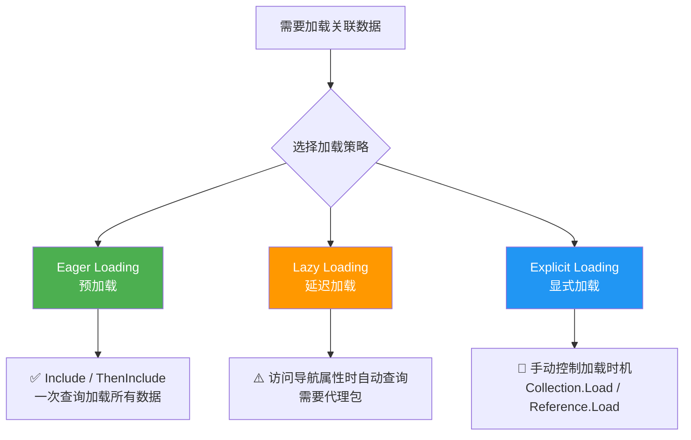
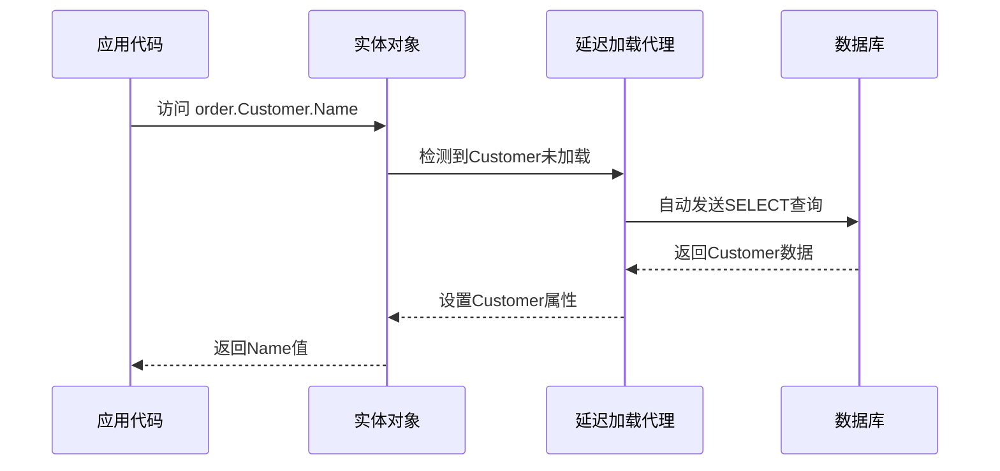
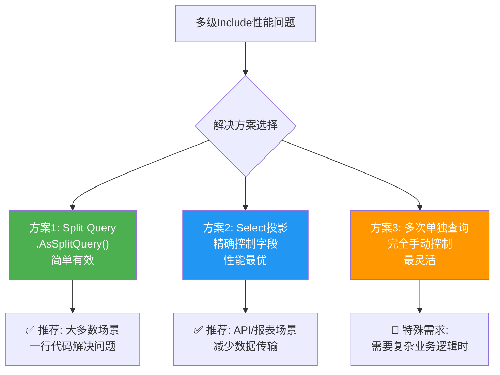
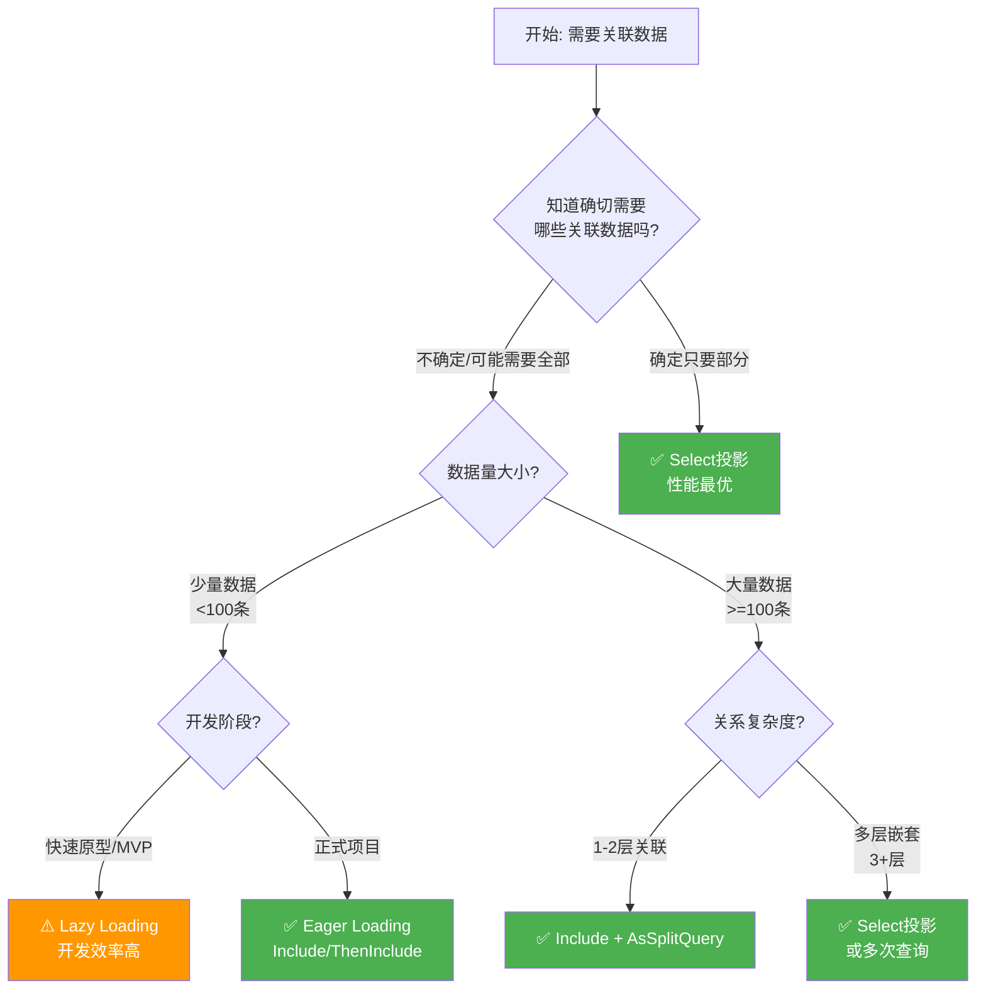

# 延迟加载vs预加载深度

## 📌 学习目标

学完本节，你将能够：

- 深入理解EF Core三种数据加载策略的工作原理和适用场景
- 掌握Eager Loading（Include/ThenInclude）的正确使用方法
- 了解Lazy Loading（延迟加载）的配置、限制和陷阱
- 学会Explicit Loading（显式加载）的精细控制技巧
- 能够根据业务场景选择最优的数据加载策略

## 📚 前置知识

在开始之前，你需要了解：

- EF Core实体间的导航属性和关系配置（1:1、1:N、N:N）
- DbContext的生命周期管理（Scoped模式）
- LINQ to Entities的基本查询语法
- C#异步编程基础

## 🎯 核心内容

### 1. 三种数据加载策略概览

EF Core提供了三种从数据库加载关联数据的方式，每种方式都有其特定的使用场景和权衡：



#### 策略对比总表

| 特性 | Eager Loading | Lazy Loading | Explicit Loading |
|------|---------------|--------------|------------------|
| **触发时机** | 查询时立即加载 | 访问导航属性时 | 显式调用Load方法 |
| **查询次数** | 1次（JOIN）或N次（SplitQuery） | 1+N次（可能很多） | 1+N次（可控） |
| **代码简洁性** | 高（声明式） | 最高（透明） | 中等（命令式） |
| **性能可控性** | 好 | 差（容易产生N+1） | 最好 |
| **依赖要求** | 无额外依赖 | 需要代理包 | 无额外依赖 |
| **DbContext状态** | 可用于跟踪/非跟踪 | 必须是跟踪状态 | 必须是跟踪状态 |
| **典型场景** | 已知需要所有关联数据 | 快速原型开发 | 条件性/按需加载 |

---

### 2. Eager Loading（预加载）详解

#### 基本用法：Include

Eager Loading通过`Include`方法在执行主查询时，通过SQL JOIN一次性加载关联数据。

```csharp
// === 基础Include示例 ===

// 场景1：加载一对一关系
public async Task<UserWithProfileDTO> GetUserWithProfileAsync(int userId)
{
    var user = await _context.Users
        .Include(u => u.Profile)  // 加载用户档案（1:1关系）
        .AsNoTracking()
        .FirstOrDefaultAsync(u => u.Id == userId);

    return new UserWithProfileDTO
    {
        Id = user.Id,
        Name = $"{user.FirstName} {user.LastName}",
        Email = user.Email,
        Bio = user.Profile?.Bio,
        AvatarUrl = user.Profile?.AvatarUrl,
        BirthDate = user.Profile?.BirthDate
    };
}

// 生成的SQL:
// SELECT [u].[Id], [u].[FirstName], [u].[LastName], [u].[Email], ...,
//        [p].[UserId], [p].[Bio], [p].[AvatarUrl], [p].[BirthDate]
// FROM [Users] AS [u]
// LEFT JOIN [UserProfiles] AS [p] ON [u].[Id] = [p].[UserId]
// WHERE [u].[Id] = @__userId_0
```

#### ThenInclude链式调用

对于多级嵌套关系，使用`ThenInclude`继续向下导航：

```csharp
/// <summary>
/// 多级Include示例 - 博客文章详情页
/// 关系链: Post -> Author -> Department -> Location
///          Post -> Comments -> Author
///          Post -> Tags (多对多)
/// </summary>
public async Task<PostDetailDTO> GetPostDetailAsync(int postId)
{
    var post = await _context.Posts
        // 第一级：加载作者
        .Include(p => p.Author)
            // 第二级：作者的部门
            .ThenInclude(a => a.Department)
                // 第三级：部门的位置信息
                .ThenInclude(d => d.Location)
        // 第一级：加载评论
        .Include(p => p.Comments)
            // 第二级：评论的作者
            .ThenInclude(c => c.Author)
        // 第一级：加载标签（多对多）
        .Include(p => p.Tags)
        .AsNoTracking()  // 只读详情页，无需跟踪
        .FirstOrDefaultAsync(p => p.Id == postId);

    if (post == null) return null;

    return new PostDetailDTO
    {
        Id = post.Id,
        Title = post.Title,
        Content = post.Content,
        PublishedAt = post.PublishedAt,

        Author = new AuthorSummaryDTO
        {
            Name = $"{post.Author.FirstName} {post.Author.LastName}",
            Email = post.Author.Email,
            Department = post.Department?.Name,
            Location = post.Department?.Location?.City
        },

        Comments = post.Comments.Select(c => new CommentDTO
        {
            Id = c.Id,
            Content = c.Content,
            CreatedAt = c.CreatedAt,
            AuthorName = c.Author.Name
        }).OrderByDescending(c => c.CreatedAt).ToList(),

        Tags = post.Tags.Select(t => t.Name).ToList()
    };
}
```

#### Include的两种写法对比

```csharp
// 写法1：Lambda表达式（推荐，类型安全）
var users = await _context.Users
    .Include(u => u.Posts)           // 编译时检查
    .Include(u => u.Comments)       // IntelliSense支持
    .ToListAsync();

// 写法2：字符串（灵活但无类型检查）
var users = await _context.Users
    .Include("Posts")               // 运行时才验证
    .Include("Comments")            // 拼写错误不会编译报错
    .ToListAsync();

// ✅ 推荐使用Lambda表达式的原因：
// 1. 编译时类型检查 - 重命名属性时会自动更新
// 2. IDE智能提示 - 不会拼写错误
// 3. 重构友好 - Find All References能找到
//
// ⚠️ 字符串写法的适用场景：
// 1. 动态Include（根据参数决定加载哪些关联）
// 2. 处理深层嵌套时的代码可读性考虑
```

#### 动态Include实现

```csharp
/// <summary>
/// 动态Include - 根据参数灵活决定加载哪些关联数据
/// </summary>
public class UserRepository
{
    private readonly ApplicationDbContext _context;

    /// <summary>
    /// 获取用户列表，支持动态加载关联数据
    /// </summary>
    /// <param name="includes">需要加载的导航属性名称数组</param>
    public async Task<PagedResult<User>> GetUsersPagedAsync(
        int page, int pageSize,
        params string[] includes)
    {
        IQueryable<User> query = _context.Users;

        // 动态添加Include
        foreach (var include in includes)
        {
            query = query.Include(include);  // 使用字符串版本
        }

        var totalCount = await query.CountAsync();
        var users = await query
            .OrderBy(u => u.LastName)
            .Skip((page - 1) * pageSize)
            .Take(pageSize)
            .ToListAsync();

        return new PagedResult<User>(users, totalCount, page, pageSize);
    }
}

// 使用示例
// 只加载基本数据
var users1 = await _userRepository.GetUsersPagedAsync(1, 20);

// 加载用户及其文章
var users2 = await _userRepository.GetUsersPagedAsync(1, 20, "Posts");

// 加载用户、文章和评论
var users3 = await _userRepository.GetUsersPagedAsync(1, 20, "Posts", "Comments");
```

#### Filtered Include（条件预加载）

EF Core 5+引入了Filtered Include功能，可以在预加载时过滤关联数据：

```csharp
/// <summary>
/// Filtered Include示例 - 只加载满足条件的关联数据
/// </summary>

// 场景1：只加载已发布的文章
public async Task<UserWithPublishedPosts> GetUserWithPublishedPosts(int userId)
{
    return await _context.Users
        .Include(u => u.Posts
            .Where(p => p.IsPublished && p.PublishedAt <= DateTime.UtcNow))  // 过滤条件
            .OrderByDescending(p => p.PublishedAt)
            .Take(10))  // 还可以限制数量！
        .AsNoTracking()
        .FirstOrDefaultAsync(u => u.Id == userId);
}

// 场景2：只加载最近的评论
public async Task<PostWithRecentComments> GetPostWithRecentComments(int postId)
{
    return await _context.Posts
        .Include(p => p.Comments
            .Where(c => !c.IsDeleted)  // 未删除的评论
            .OrderByDescending(c => c.CreatedAt)
            .Take(20))                  // 只要最近20条
        .AsNoTracking()
        .FirstOrDefaultAsync(p => p.Id == postId);
}

// 场景3：复杂的过滤逻辑
public async Task<OrderWithActiveItems> GetOrderWithActiveItems(int orderId)
{
    return await _context.Orders
        .Include(o => o.Items
            .Where(oi =>
                oi.Product.IsAvailable &&              // 产品有货
                !oi.IsCancelled &&                      // 项目未取消
                oi.Quantity > 0))                       // 数量大于0
        .Include(o => o.Customer)
        .FirstOrDefaultAsync(o => o.Id == orderId);
}
```

---

### 3. Lazy Loading（延迟加载）详解

#### 什么是Lazy Loading？

Lazy Loading是一种"透明"的数据加载方式：当你访问一个尚未加载的导航属性时，EF Core会**自动**发送数据库查询来获取该数据。这种机制让代码看起来非常简洁，但也隐藏了数据库访问行为。



#### 配置Lazy Loading

**步骤1：安装NuGet包**

```bash
# Microsoft.EntityFrameworkCore.Proxies 提供延迟加载代理功能
dotnet add package Microsoft.EntityFrameworkCore.Proxies
```

**步骤2：启用Lazy Loading Proxies**

```csharp
// Program.cs 或 DbContext.OnConfiguring
services.AddDbContext<ApplicationDbContext>(options =>
{
    options.UseSqlServer(connectionString);

    // 方式A：UseLazyLoadingProxies() - 全局启用
    options.UseLazyLoadingProxies();  // 启用延迟加载代理

    // 注意：所有实体类必须是 public 且导航属性必须是 virtual
});

// 或者
public class ApplicationDbContext : DbContext
{
    protected override void OnConfiguring(DbContextOptionsBuilder optionsBuilder)
    {
        optionsBuilder
            .UseSqlServer(connectionString)
            .UseLazyLoadingProxies();  // 启用延迟加载代理
    }
}
```

**步骤3：实体类配置要求**

```csharp
// ✅ 支持Lazy Loading的实体类定义
public class Order
{
    public int Id { get; set; }

    // 导航属性必须是 virtual 才能被代理重写
    public virtual Customer Customer { get; set; }         // 1:1 或 N:1
    public virtual ICollection<OrderItem> Items { get; set; }  // 1:N

    // 构造函数必须是无参且为 public（或者不定义构造函数）
}

public class Customer
{
    public int Id { get; set; }
    public string Name { get; set; }

    public virtual ICollection<Order> Orders { get; set; }  // 双向导航
}
```

#### Lazy Loading的使用示例

```csharp
/// <summary>
/// Lazy Loading的使用演示
/// 看起来很简洁，但要小心隐藏的数据库查询！
/// </summary>
public class OrderServiceWithLazyLoading
{
    private readonly ApplicationDbContext _context;

    /// <summary>
    /// 获取订单详情 - 使用Lazy Loading
    /// ⚠️ 这里的每个导航属性访问都可能触发额外的数据库查询
    /// </summary>
    public async Task<OrderViewModel> GetOrderViewModel(int orderId)
    {
        // 第1次查询：只查订单基本信息
        var order = await _context.Orders
            .FirstOrDefaultAsync(o => o.Id == orderId);

        if (order == null) return null;

        // 第2次查询：访问Customer时自动触发（如果未加载）
        var customerName = order.Customer?.Name;  // 可能触发 SELECT * FROM Customers WHERE ...

        // 第3次查询：访问Items集合时触发
        var items = order.Items.ToList();  // 可能触发 SELECT * FROM OrderItems WHERE OrderId = ...

        // 第4-N次查询：遍历Items时访问Product
        var itemDetails = items.Select(oi => new
        {
            ProductName = oi.Product?.Name,      // 每个都可能触发一次查询！
            Quantity = oi.Quantity,
            Price = oi.UnitPrice
        }).ToList();

        return new OrderViewModel
        {
            OrderId = order.Id,
            CustomerName = customerName,
            Items = itemDetails
        };
        // 总查询次数：1 + 1 + 1 + N（N=OrderItem数量）
        // 如果有10个商品项，总共14次查询！
    }
}
```

#### Lazy Loading的限制和陷阱

**限制1：不能与AsNoTracking一起使用**

```csharp
// ❌ 错误：AsNoTracking + Lazy Loading 不兼容
var order = await _context.Orders
    .AsNoTracking()  // ❌ 延迟加载不会工作！
    .FirstOrDefaultAsync(o => o.Id == orderId);

var customerName = order.Customer?.Name;  // 返回null，不会触发查询！

// 原因：AsNoTracking返回的是纯净实体，不是代理对象
// 代理对象是Lazy Loading工作的基础
```

**限制2：不能在DbContext释放后访问**

```csharp
// ❌ 错误：DbContext已Dispose后无法延迟加载
public OrderViewModel GetOrderBad(int orderId)
{
    using var context = new ApplicationDbContext();

    var order = context.Orders.FirstOrDefault(o => o.Id == orderId);

    return new OrderViewModel
    {
        OrderId = order.Id,
        // ❌ context已经Dispose，这里会抛异常！
        CustomerName = order.Customer?.Name  // InvalidOperationException!
    };
}

// ✅ 正确：在DbContext生命周期内完成所有数据访问
public OrderViewModel GetOrderCorrect(int orderId)
{
    using var context = new ApplicationDbContext();

    var order = context.Orders.FirstOrDefault(o => o.Id == orderId);

    // 在using块内访问导航属性
    var customerName = order.Customer?.Name;
    var items = order.Items.ToList();

    return new OrderViewModel
    {
        OrderId = order.Id,
        CustomerName = customerName,
        ItemCount = items.Count
    };
}
```

**限制3：序列化时可能导致灾难**

```csharp
// ❌ 危险：JSON序列化触发大量查询
[HttpGet("api/orders")]
public ActionResult<IEnumerable<Order>> GetOrders()
{
    var orders = _context.Orders.ToList();  // 第1次查询

    // JSON序列化器会遍历所有属性，包括导航属性
    // 结果：每个order都会触发Customer和Items的懒加载查询
    // 100个订单 → 201次数据库查询！
    return Ok(orders);  // 💥 性能爆炸
}

// ✅ 解决方案1：使用Select投影
[HttpGet("api/orders")]
public async Task<ActionResult<IEnumerable<OrderDTO>>> GetOrdersSafe()
{
    return Ok(await _context.Orders
        .AsNoTracking()
        .Select(o => new OrderDTO
        {
            Id = o.Id,
            CustomerName = o.Customer.Name,  // 在SQL层面JOIN
            ItemCount = o.Items.Count
        })
        .ToListAsync());
}

// ✅ 解决方案2：配置JSON序列化忽略导航属性
// 在Program.cs中配置
services.AddControllers()
    .AddJsonOptions(options =>
    {
        options.JsonSerializerOptions.ReferenceHandler = ReferenceHandler.IgnoreCycles;
    });
```

**限制4：不能在After事件中使用**

```csharp
// ❌ 错误：SaveChanges的After事件中不能使用Lazy Loading
_context.SaveChanges();
// 或者
await _context.SaveChangesAsync();

// After SaveChanges事件中访问导航属性可能失败，
// 因为实体可能已经被Detach或处于不一致状态
```

---

### 4. Explicit Loading（显式加载）详解

#### 什么是Explicit Loading？

Explicit Loading提供了一种**显式的、可控的**方式来按需加载关联数据。与Lazy Loading不同，它不会自动发生，而是需要开发者明确调用加载方法。

#### Collection.Load 和 Reference.Load

```csharp
/// <summary>
/// Explicit Loading完整示例
/// </summary>
public class OrderServiceWithExplicitLoading
{
    private readonly ApplicationDbContext _context;

    /// <summary>
     * 获取订单详情 - 使用显式加载
     * 优点：完全控制何时加载什么数据
     * 缺点：代码相对冗长
     */
    public async Task<OrderDetailDTO> GetOrderDetailAsync(int orderId)
    {
        // 第1步：只加载订单主体（不含任何关联数据）
        var order = await _context.Orders
            .FirstOrDefaultAsync(o => o.Id == orderId);

        if (order == null) return null;

        // 第2步：根据业务逻辑判断是否需要加载客户信息
        if (NeedShowCustomerInfo())
        {
            // 显式加载引用类型的导航属性（1:1 或 N:1）
            await _context.Entry(order)
                .Reference(o => o.Customer)  // Reference用于单个对象
                .LoadAsync();
        }

        // 第3步：显式加载集合类型的导航属性（1:N）
        await _context.Entry(order)
            .Collection(o => o.Items)  // Collection用于集合
            .LoadAsync();

        // 第4步：对已加载的Items中的Product进行选择性加载
        foreach (var item in order.Items.Take(5))  // 只加载前5个产品的详细信息
        {
            await _context.Entry(item)
                .Reference(oi => oi.Product)
                .LoadAsync();
        }

        // 构建返回DTO
        return new OrderDetailDTO
        {
            OrderId = order.Id,
            OrderDate = order.OrderDate,
            CustomerName = order.Customer?.Name,
            Items = order.Items.Select(oi => new ItemDTO
            {
                ProductName = oi.Product?.Name ?? "产品已下架",
                Quantity = oi.Quantity,
                UnitPrice = oi.UnitPrice
            }).ToList(),
            TotalAmount = order.Items.Sum(oi => oi.Quantity * oi.UnitPrice)
        };
    }

    private bool NeedShowCustomerInfo()
    {
        // 根据权限或其他条件决定是否加载客户信息
        return true; // 示例简化
    }
}
```

#### Query()方法 - 更灵活的显式加载

`Query()`方法允许你在加载关联数据时应用过滤、排序等操作：

```csharp
/// <summary>
/// 使用Query()进行带条件的显式加载
/// 比普通的Load更灵活
/// </summary>
public async Task<PostDetailDTO> GetPostWithFilteredCommentsAsync(int postId)
{
    var post = await _context.Posts
        .FirstOrDefaultAsync(p => p.Id == postId);

    if (post == null) return null;

    // 使用Query()加载评论，可以添加过滤条件
    var recentComments = await _context.Entry(post)
        .Collection(p => p.Comments)
        .Query()  // 返回IQueryable<Comment>
        .Where(c => !c.IsDeleted && c.IsApproved)  // 过滤条件
        .OrderByDescending(c => c.CreatedAt)
        .Take(10)  // 限制数量
        .Include(c => c.Author)  // 可以继续Include
        .Select(c => new CommentSummaryDTO
        {
            Id = c.Id,
            Content = c.Content,
            AuthorName = c.Author.Name,
            CreatedAt = c.CreatedAt
        })
        .ToListAsync();

    // 使用Query()加载标签
    var tags = await _context.Entry(post)
        .Collection(p => p.Tags)
        .Query()
        .Select(t => t.Name)
        .ToListAsync();

    return new PostDetailDTO
    {
        Id = post.Id,
        Title = post.Title,
        RecentComments = recentComments,
        Tags = tags
    };
}
```

#### Explicit Loading的实际应用场景

```csharp
/// <summary>
/// 场景：条件性加载 - 根据用户角色决定加载数据的详细程度
/// </summary>
public async Task<ProductDTO> GetProductForUserAsync(int productId, User currentUser)
{
    var product = await _context.Products
        .FirstOrDefaultAsync(p => p.Id == productId);

    if (product == null) return null;

    var dto = new ProductDTO
    {
        Id = product.Id,
        Name = product.Name,
        Description = product.Description,
        Price = product.Price,
        StockQuantity = product.StockQuantity
    };

    // 根据用户角色决定是否加载敏感数据
    if (currentUser.IsAdmin || currentUser.IsManager)
    {
        // 管理员可以看到成本价和供应商信息
        await _context.Entry(product)
            .Reference(p => p.Supplier)
            .LoadAsync();

        dto.CostPrice = product.CostPrice;
        dto.SupplierName = product.Supplier?.Name;
        dto.InternalNotes = product.InternalNotes;
    }

    // 所有用户都能看到分类和评价
    await _context.Entry(product)
        .Reference(p => p.Category)
        .LoadAsync();

    dto.CategoryName = product.Category?.Name;

    // 根据设置决定是否加载评价
    if (product.ShowReviews)
    {
        var reviews = await _context.Entry(product)
            .Collection(p => p.Reviews)
            .Query()
            .Where(r => r.IsApproved)
            .OrderByDescending(r => r.CreatedAt)
            .Take(20)
            .Select(r => new ReviewSummaryDTO
            {
                Rating = r.Rating,
                Comment = r.Comment,
                Author = r.User.Name
            })
            .ToListAsync();

        dto.Reviews = reviews;
        dto.AverageRating = reviews.Average(r => r.Rating);
        dto.ReviewCount = reviews.Count;
    }

    return dto;
}
```

---

### 5. 多级Include的性能问题（Cartesian Product爆炸）

#### 问题根源分析

当使用多个`Include`加载一对多关系时，SQL JOIN会导致结果集出现笛卡尔积膨胀：

```csharp
// 危险示例：多层嵌套Include导致笛卡尔积爆炸
var blog = await _context.Blogs
    .Include(b => b.Posts)           // 假设100篇文章
        .ThenInclude(p => p.Comments)   // 每篇50条评论
    .Include(b => b.Authors)          // 5个作者
    .FirstOrDefaultAsync(b => b.Id == 1);

// SQL执行计划分析：
// 主表 Blogs: 1行
// JOIN Posts: 100行
// JOIN Comments: 100 × 50 = 5000行
// JOIN BlogAuthors: 5行
// JOIN Authors: 5行
//
// SQL实际返回的总行数: 1 × 100 × 50 × 5 × 5 = 125,000 行！！！
// 但实际只有约5111个独立实体对象
// 数据重复率: (125000 - 5111) / 125000 = 95.9%
```

#### 性能影响量化

```csharp
/// <summary>
/// 笛卡尔积爆炸性能测试
/// </summary>
public async Task DemonstrateCartesianExplosion()
{
    Console.WriteLine("=== 笛卡尔积爆炸性能测试 ===\n");

    // 测试数据规模
    const int postsPerBlog = 50;
    const int commentsPerPost = 20;
    const int authorsPerBlog = 3;

    // 测试1：Single Query（默认）- 包含笛卡尔积
    var swSingle = Stopwatch.StartNew();
    var blogSingle = await _context.Blogs
        .Include(b => b.Posts)
            .ThenInclude(p => p.Comments)
        .Include(b => b.Authors)
        .FirstOrDefaultAsync(b => b.Id == 1);
    swSingle.Stop();

    Console.WriteLine($"Single Query:");
    Console.WriteLine($"  耗时: {swSingle.ElapsedMilliseconds}ms");
    Console.WriteLine($"  文章数: {blogSingle.Posts.Count}");
    Console.WriteLine($"  评论总数: {blogSingle.Posts.Sum(p => p.Comments.Count)}");
    Console.WriteLine($"  作者数: {blogSingle.Authors.Count}");

    // 测试2：Split Query - 消除笛卡尔积
    var swSplit = Stopwatch.StartNew();
    var blogSplit = await _context.Blogs
        .Include(b => b.Posts)
            .ThenInclude(p => p.Comments)
        .Include(b => b.Authors)
        .AsSplitQuery()  // 🔑 关键：拆分为多个独立查询
        .FirstOrDefaultAsync(b => b.Id == 1);
    swSplit.Stop();

    Console.WriteLine($"\nSplit Query:");
    Console.WriteLine($"  耗时: {swSplit.ElapsedMilliseconds}ms");
    Console.WriteLine($"  文章数: {blogSplit.Posts.Count}");
    Console.WriteLine($"  评论总数: {blogSplit.Posts.Sum(p => p.Comments.Count)}");
    Console.WriteLine($"  作者数: {blogSplit.Authors.Count}");

    /*
     * 典型测试结果（SQL Server, 本地网络）：
     *
     * 数据规模: 1 Blog, 50 Posts, 1000 Comments, 3 Authors
     *
     * Single Query:
     *   耗时: ~450ms
     *   SQL返回行数: 150,000行（大量重复）
     *   网络传输: ~25MB
     *
     * Split Query:
     *   耗时: ~120ms（快3.75倍！）
     *   SQL返回行数: 1 + 50 + 1000 + 3 = 1054行（精确）
     *   网络传输: ~180KB（减少99%！）
     */
}
```

#### 解决方案对比



```csharp
// 方案1：Split Query（推荐用于大多数场景）
public async Task<BlogDetailDTO> GetBlogDetailV1(int blogId)
{
    return await _context.Blogs
        .Include(b => b.Posts)
            .ThenInclude(p => p.Comments)
        .Include(b => b.Authors)
        .AsSplitQuery()  // 一行代码解决笛卡尔积问题
        .AsNoTracking()
        .Where(b => b.Id == blogId)
        .Select(b => new BlogDetailDTO
        {
            Id = b.Id,
            Name = b.Name,
            Posts = b.Posts.Select(p => new PostSummaryDTO
            {
                Id = p.Id,
                Title = p.Title,
                CommentCount = p.Comments.Count
            }).ToList(),
            Authors = b.Authors.Select(a => new AuthorSummaryDTO
            {
                Id = a.Id,
                Name = a.Name
            }).ToList()
        })
        .FirstOrDefaultAsync();
}

// 方案2：Select投影（性能最优，适合API场景）
public async Task<BlogDetailDTO> GetBlogDetailV2(int blogId)
{
    return await _context.Blogs
        .AsNoTracking()
        .Where(b => b.Id == blogId)
        .Select(b => new BlogDetailDTO
        {
            Id = b.Id,
            Name = b.Name,
            // 投影自动处理关联，无需担心笛卡尔积
            Posts = b.Posts.Select(p => new PostSummaryDTO
            {
                Id = p.Id,
                Title = p.Title,
                CommentCount = p.Comments.Count,
                LatestComment = p.Comments
                    .OrderByDescending(c => c.CreatedAt)
                    .Select(c => c.Content)
                    .FirstOrDefault()
            }).ToList(),
            Authors = b.Authors.Select(a => new AuthorSummaryDTO
            {
                Id = a.Id,
                Name = a.Name
            }).ToList()
        })
        .FirstOrDefaultAsync();
}

// 方案3：多次单独查询（最灵活，特殊场景）
public async Task<BlogDetailDTO> GetBlogDetailV3(int blogId)
{
    // 查询1：博客基本信息
    var blog = await _context.Blogs
        .AsNoTracking()
        .FirstOrDefaultAsync(b => b.Id == blogId);

    if (blog == null) return null;

    // 查询2：文章列表
    var posts = await _context.Posts
        .AsNoTracking()
        .Where(p => p.BlogId == blogId)
        .Select(p => new PostSummaryDTO
        {
            Id = p.Id,
            Title = p.Title,
            CommentCount = _context.Comments.Count(c => c.PostId == p.Id)
        })
        .ToListAsync();

    // 查询3：作者列表
    var authors = await _context.BlogAuthors
        .AsNoTracking()
        .Where(ba => ba.BlogId == blogId)
        .Select(ba => new AuthorSummaryDTO
        {
            Id = ba.AuthorId,
            Name = ba.Author.Name
        })
        .ToListAsync();

    return new BlogDetailDTO
    {
        Id = blog.Id,
        Name = blog.Name,
        Posts = posts,
        Authors = authors
    };
}
```

---

### 6. 加载策略决策树

如何在实际项目中为不同场景选择合适的加载策略？



#### 不同场景的策略推荐

| 业务场景 | 推荐策略 | 原因 |
|----------|----------|------|
| 后台管理列表页 | `AsNoTracking + Select` | 只读、字段少、分页 |
| 详情展示页 | `Include + AsNoTracking` | 需要完整关联数据 |
| 表单编辑页 | `Include`（默认跟踪） | 需要修改并保存 |
| API接口 | `AsNoTracking + Select` | 最小化数据传输 |
| 报表导出 | `AsNoTracking + AsSplitQuery` | 大数据量、只读 |
| 下拉框/自动完成 | `AsNoTracking + Select` | 小数据、高频调用 |
| 权限相关数据 | `Explicit Loading` | 条件性加载 |
| 快速原型开发 | `Lazy Loading` | 开发速度快（生产环境慎用） |

---

### 7. 实际案例：博客系统的查询优化

#### 案例背景

假设我们正在开发一个博客系统，包含以下核心实体：

```csharp
// 实体模型
public class Blog
{
    public int Id { get; set; }
    public string Name { get; set; }
    public string Url { get; set; }
    public virtual ICollection<Post> Posts { get; set; }      // 1:N
    public virtual ICollection<BlogAuthor> Authors { get; set; } // N:N
}

public class Post
{
    public int Id { get; set; }
    public string Title { get; set; }
    public string Content { get; set; }
    public DateTime PublishedAt { get; set; }
    public bool IsPublished { get; set; }
    public int BlogId { get; set; }
    public virtual Blog Blog { get; set; }                     // N:1
    public virtual Author Author { get; set; }                 // N:1
    public virtual ICollection<Comment> Comments { get; set; } // 1:N
    public virtual ICollection<Tag> Tags { get; set; }         // N:N
}

public class Comment
{
    public int Id { get; set; }
    public string Content { get; set; }
    public DateTime CreatedAt { get; set; }
    public int PostId { get; set; }
    public virtual Post Post { get; set; }                     // N:1
    public virtual Author Author { get; set; }                 // N:1
}
```

#### 场景1：首页 - 最新文章列表

```csharp
/// <summary>
/// 首页最新文章列表 - 只需基本信息和作者名
/// 策略：AsNoTracking + Select投影
/// </summary>
[HttpGet("api/posts/recent")]
public async Task<ActionResult<IEnumerable<RecentPostDTO>>> GetRecentPosts(
    [FromQuery] int count = 10)
{
    return Ok(await _context.Posts
        .AsNoTracking()
        .Where(p => p.IsPublished && p.PublishedAt <= DateTime.UtcNow)
        .OrderByDescending(p => p.PublishedAt)
        .Take(count)
        .Select(p => new RecentPostDTO
        {
            Id = p.Id,
            Title = p.Title,
            Summary = p.Content.Length > 200
                ? p.Content.Substring(0, 200) + "..."
                : p.Content,
            AuthorName = p.Author.Name,
            AuthorAvatar = p.Author.AvatarUrl,
            PublishedAt = p.PublishedAt,
            CommentCount = p.Comments.Count(c => !c.IsDeleted),
            TagNames = p.Tags.Select(t => t.Name).ToList()
        })
        .ToListAsync());
}

// 生成SQL（仅1次查询）：
// SELECT TOP 10 p.Id, p.Title, SUBSTRING(...), a.Name, a.AvatarUrl,
//        p.PublishedAt,
//        (SELECT COUNT(*) FROM Comments c WHERE c.PostId = p.Id AND ...),
//        (SELECT ... FROM PostTags pt JOIN Tags t ...)
// FROM Posts p
// LEFT JOIN Authors a ON p.AuthorId = a.Id
// WHERE p.IsPublished = 1 AND p.PublishedAt <= GETDATE()
// ORDER BY p.PublishedAt DESC
```

#### 场景2：文章详情页

```csharp
/// <summary>
/// 文章详情页 - 需要完整的文章、评论、作者信息
/// 策略：AsSplitQuery + AsNoTracking（处理多级关联）
/// </summary>
[HttpGet("api/posts/{postId}")]
public async Task<ActionResult<PostDetailDTO>> GetPostDetail(int postId)
{
    var post = await _context.Posts
        .Include(p => p.Author)
        .Include(p => p.Blog)
        .Include(p => p.Comments)
            .ThenInclude(c => c.Author)
        .Include(p => p.Tags)
        .AsSplitQuery()  // 拆分查询避免笛卡尔积
        .AsNoTracking()
        .FirstOrDefaultAsync(p => p.Id == postId);

    if (post == null) return NotFound();

    return Ok(new PostDetailDTO
    {
        Id = post.Id,
        Title = post.Title,
        Content = post.Content,
        PublishedAt = post.PublishedAt,

        Author = new AuthorInfoDTO
        {
            Id = post.Author.Id,
            Name = post.Author.Name,
            Bio = post.Author.Bio,
            AvatarUrl = post.Author.AvatarUrl
        },

        Blog = new BlogSummaryDTO
        {
            Id = post.Blog.Id,
            Name = post.Blog.Name,
            Url = post.Blog.Url
        },

        Comments = post.Comments
            .Where(c => !c.IsDeleted)
            .OrderByDescending(c => c.CreatedAt)
            .Select(c => new CommentDTO
            {
                Id = c.Id,
                Content = c.Content,
                CreatedAt = c.CreatedAt,
                Author = new AuthorMiniDTO
                {
                    Name = c.Author.Name,
                    AvatarUrl = c.Author.AvatarUrl
                }
            }).ToList(),

        Tags = post.Tags.Select(t => new TagDTO
        {
            Id = t.Id,
            Name = t.Name
        }).ToList(),

        // 统计信息
        Stats = new PostStatsDTO
        {
            TotalViews = /* 从缓存或统计服务获取 */,
            LikeCount = post.Likes.Count,
            CommentCount = post.Comments.Count(c => !c.IsDeleted)
        }
    });
}
```

#### 场景3：后台管理 - 文章管理列表

```csharp
/// <summary>
/// 后台文章管理列表 - 管理员需要看到更多字段
/// 策略：AsNoTracking + Select投影 + 分页 + 动态筛选
/// </summary>
[HttpGet("api/admin/posts")]
public async Task<ActionResult<PagedResponse AdminPostListDTO>>> GetAdminPosts(
    [FromQuery] AdminPostFilter filter,
    [FromQuery] int page = 1,
    [FromQuery] int pageSize = 20)
{
    IQueryable<Post> query = _context.Posts;

    // 动态筛选
    if (filter.Status.HasValue)
        query = query.Where(p => p.IsPublished == filter.Status.Value);

    if (filter.BlogId.HasValue)
        query = query.Where(p => p.BlogId == filter.BlogId.Value);

    if (filter.AuthorId.HasValue)
        query = query.Where(p => p.AuthorId == filter.AuthorId.Value);

    if (!string.IsNullOrWhiteSpace(filter.Keyword))
        query = query.Where(p => p.Title.Contains(filter.Keyword));

    if (filter.DateFrom.HasValue)
        query = query.Where(p => p.PublishedAt >= filter.DateFrom.Value);

    if (filter.DateTo.HasValue)
        query = query.Where(p => p.PublishedAt <= filter.DateTo.Value);

    // 总数
    var totalCount = await query.CountAsync();

    // 分页 + 投影
    var posts = await query
        .OrderByDescending(p => p.PublishedAt)
        .Skip((page - 1) * pageSize)
        .Take(pageSize)
        .AsNoTracking()
        .Select(p => new AdminPostListDTO
        {
            Id = p.Id,
            Title = p.Title,
            AuthorName = p.Author.Name,
            BlogName = p.Blog.Name,
            IsPublished = p.IsPublished,
            PublishedAt = p.PublishedAt,
            CommentCount = p.Comments.Count,
            ViewCount = p.ViewCount,
            LastModifiedAt = p.UpdatedAt
        })
        .ToListAsync();

    return Ok(new PagedResponse<AdminPostListDTO>(posts, totalCount, page, pageSize));
}
```

#### 场景4：个人中心 - 我的文章和统计

```csharp
/// <summary>
/// 用户个人中心 - 条件性加载不同详细程度的数据
/// 策略：组合使用 Explicit Loading
/// </summary>
[HttpGet("api/users/{userId}/dashboard")]
public async Task<ActionResult<UserDashboardDTO>> GetUserDashboard(int userId)
{
    var user = await _context.Users
        .FirstOrDefaultAsync(u => u.Id == userId);

    if (user == null) return NotFound();

    var dashboard = new UserDashboardDTO
    {
        UserId = user.Id,
        DisplayName = user.DisplayName,
        AvatarUrl = user.AvatarUrl,
        MemberSince = user.CreatedAt
    };

    // 根据需要逐步加载不同模块的数据
    // 模块1：我的文章统计
    dashboard.PostStats = await _context.Posts
        .AsNoTracking()
        .Where(p => p.AuthorId == userId)
        .GroupBy(p => 1)
        .Select(g => new PostStatsDTO
        {
            TotalPosts = g.Count(),
            PublishedPosts = g.Count(p => p.IsPublished),
            DraftPosts = g.Count(p => !p.IsPublished),
            TotalViews = g.Sum(p => p.ViewCount),
            ThisMonthPosts = g.Count(p =>
                p.PublishedAt.Month == DateTime.Now.Month &&
                p.PublishedAt.Year == DateTime.Now.Year)
        })
        .FirstOrDefaultAsync();

    // 模块2：最近的文章（使用Explicit Loading的条件变体）
    dashboard.RecentPosts = await _context.Posts
        .AsNoTracking()
        .Where(p => p.AuthorId == userId)
        .OrderByDescending(p => p.PublishedAt)
        .Take(5)
        .Select(p => new PostSummaryDTO
        {
            Id = p.Id,
            Title = p.Title,
            IsPublished = p.IsPublished,
            CommentCount = p.Comments.Count(c => !c.IsDeleted),
            ViewCount = p.ViewCount
        })
        .ToListAsync();

    // 模块3：收到的最新评论（使用Query过滤）
    var myPostIds = await _context.Posts
        .AsNoTracking()
        .Where(p => p.AuthorId == userId)
        .Select(p => p.Id)
        .ToListAsync();

    dashboard.RecentComments = await _context.Comments
        .AsNoTracking()
        .Where(c => myPostIds.Contains(c.PostId))
        .OrderByDescending(c => c.CreatedAt)
        .Take(10)
        .Select(c => new RecentCommentDTO
        {
            Id = c.Id,
            PostTitle = c.Post.Title,
            Content = c.Content,
            AuthorName = c.Author.Name,
            CreatedAt = c.CreatedAt
        })
        .ToListAsync();

    return Ok(dashboard);
}
```

---

## 💡 最佳实践清单

### DO（推荐做法）

```csharp
// ✅ DO: 明确知道需要什么数据时，优先使用Eager Loading
public async Task<PostDTO> GetPost(int id)
{
    return await _context.Posts
        .Include(p => p.Author)
        .Include(p => p.Comments)
        .AsNoTracking()
        .Where(p => p.Id == id)
        .Select(p => new PostDTO { /* ... */ })
        .FirstOrDefaultAsync();
}

// ✅ DO: 对于API接口，始终使用Select投影
[HttpGet("api/items")]
public async Task<ActionResult<IEnumerable<ItemDTO>>> GetItems()
{
    return Ok(await _context.Items
        .AsNoTracking()
        .Select(i => new ItemDTO { Id = i.Id, Name = i.Name })
        .ToListAsync());
}

// ✅ DO: 多级Include时使用AsSplitQuery避免笛卡尔积
var data = await _context.Parents
    .Include(p => p.Children)
        .ThenInclude(c => c.GrandChildren)
    .AsSplitQuery()
    .ToListAsync();

// ✅ DO: 使用Filtered Include只加载需要的数据
var user = await _context.Users
    .Include(u => u.Orders
        .Where(o => o.Status != OrderStatus.Cancelled)
        .OrderByDescending(o => o.OrderDate)
        .Take(10))
    .FirstOrDefaultAsync(u => u.Id == userId);

// ✅ DO: 条件性加载使用Explicit Loading
if (currentUser.CanViewSensitiveData())
{
    await _context.Entry(entity)
        .Reference(e => e.SensitiveData)
        .LoadAsync();
}

// ✅ DO: 在ASP.NET Core Scoped上下文中正确使用Lazy Loading
// （如果确实要用的话，确保理解其行为）
```

### DON'T（避免做法）

```csharp
// ❌ DON'T: 在API控制器中直接返回启用了Lazy Loading的实体
[HttpGet("api/orders")]
public ActionResult<IEnumerable<Order>> GetOrders()
{
    return Ok(_context.Orders.ToList());  // 序列化时触发N+1查询爆炸！
}

// ❌ DON'T: 将Lazy Loading与AsNoTracking混用
var order = await _context.Orders.AsNoTracking().FirstOrDefaultAsync(o => o.Id == 1);
var name = order.Customer.Name;  // 返回null，不会触发查询

// ❌ DON'T: 在DbContext Dispose后访问导航属性
Order order;
using (var ctx = new AppDbContext())
{
    order = ctx.Orders.First();
}
var customer = order.Customer.Name;  // InvalidOperationException!

// ❌ DON'T: 对大数据集使用深层嵌套Include而不使用SplitQuery
var data = await _context.A
    .Include(a => a.Bs)
        .ThenInclude(b => b.Cs)
            .ThenInclude(c => c.Ds)
    .ToListAsync();  // 笛卡尔积爆炸！

// ❌ DON'T: 在循环中触发Lazy Loading
foreach (var order in orders)
{
    // 每次循环都可能触发独立的数据库查询
    Console.WriteLine(order.Customer.Name);  // N次查询
    foreach (var item in order.Items)
    {
        Console.WriteLine(item.Product.Name);  // N*M次查询
    }
}

// ❌ DON'T: 在生产环境的新项目中默认启用Lazy Loading
// Lazy Loading隐藏了数据库访问，难以调试和优化性能问题
```

---

## 📝 本节小结

用一句话总结今天学到的重点：

**数据加载策略的选择是EF Core性能优化的核心决策之一。** Eager Loading（Include）适合已知需求的场景，提供良好的性能可控性；Lazy Loading虽然代码简洁但隐藏了数据库访问风险，在生产环境中应谨慎使用；Explicit Loading提供了最精细的控制能力，适合条件性加载场景。记住黄金法则：**明确你的数据需求，选择最直接的加载方式，永远警惕隐含的数据库查询。**

## 📖 延伸阅读

- [[02-AsNoTracking与查询优化]] - 结合AsNoTracking进一步优化查询性能
- [[05-事务管理与并发控制]] - 了解数据一致性保障机制
- [EF Core官方文档 - Loading Related Entities](https://docs.microsoft.com/ef/core/querying/related-data/)
- [EF Core Filtered Includes](https://docs.microsoft.com/ef/core/querying/related-data/eager#filtered-include)
- [Anti-patterns: Lazy Loading without lazy proxies](https://docs.microsoft.com/ef/core/querying/related-data/lazy#lazy-loading-without-proxies)

## ✏️ 动手练习

### 练习 1：识别和修复Lazy Loading导致的N+1问题

以下代码使用了Lazy Loading，请分析存在什么问题并提供优化方案。

```csharp
public class ReportService
{
    public List<SalesReportRow> GenerateDailyReport(DateTime date)
    {
        using var context = new ApplicationDbContext();

        var orders = context.Orders
            .Where(o => o.OrderDate.Date == date.Date)
            .ToList();  // 第1次查询

        var report = new List<SalesReportRow>();

        foreach (var order in orders)
        {
            // 这里每次访问导航属性都可能触发新查询
            report.Add(new SalesReportRow
            {
                OrderId = order.Id,
                CustomerName = order.Customer.Name,       // 可能触发查询
                ProductCount = order.Items.Count,          // 可能触发查询
                TotalAmount = order.Items.Sum(oi =>        // 可能触发查询
                    oi.Quantity * oi.UnitPrice)
            });
        }

        return report;
    }
}
```

<details>
<summary>查看答案</summary>

```csharp
/// <summary>
/// 优化方案：使用Eager Loading替代Lazy Loading
/// </summary>
public async Task<List<SalesReportRow>> GenerateDailyReportOptimized(DateTime date)
{
    // 方案1：使用Include预加载所有关联数据（1次查询）
    var orders = await _context.Orders
        .Include(o => o.Customer)
        .Include(o => o.Items)
        .AsNoTracking()
        .Where(o => o.OrderDate.Date == date.Date)
        .ToListAsync();

    return orders.Select(o => new SalesReportRow
    {
        OrderId = o.Id,
        CustomerName = o.Customer.Name,
        ProductCount = o.Items.Count,
        TotalAmount = o.Items.Sum(oi => oi.Quantity * oi.UnitPrice)
    }).ToList();
}

// 方案2：使用Select投影（性能最优，1次查询+最少字段）
public async Task<List<SalesReportRow>> GenerateDailyReportBest(DateTime date)
{
    return await _context.Orders
        .AsNoTracking()
        .Where(o => o.OrderDate.Date == date.Date)
        .Select(o => new SalesReportRow
        {
            OrderId = o.Id,
            CustomerName = o.Customer.Name,
            ProductCount = o.Items.Count,
            TotalAmount = o.Items.Sum(oi => oi.Quantity * oi.UnitPrice)
        })
        .ToListAsync();
}

/*
 * 优化效果对比（假设当天有500个订单）：
 *
 * 原始版本(Lazy Loading):
 *   - 查询次数: 1 + 500 + 500 = 1001次（或更多）
 *   - 耗时: ~15秒
 *   - 内存: 高（所有实体都被跟踪）
 *
 * 优化版本(Eager Loading):
 *   - 查询次数: 1次
 *   - 耗时: ~200ms
 *   - 内存: 低（AsNoTracking）
 *
 * 提升: 查询次数降低99.9%，速度提升75倍
 */
```

</details>

---

### 练习 2：设计一个支持多种加载策略的通用Repository

创建一个Repository基类，支持通过参数指定使用哪种加载策略。

<details>
<summary>查看答案</summary>

```csharp
/// <summary>
/// 加载策略枚举
/// </summary>
public enum LoadingStrategy
{
    Eager,      // 预加载（Include）
    Explicit,   // 显式加载
    SelectOnly  // 仅投影（最高性能）
}

/// <summary>
/// 通用Repository基类 - 支持多种加载策略
/// </summary>
public class GenericRepository<TEntity> where TEntity : class
{
    protected readonly ApplicationDbContext _context;
    protected readonly DbSet<TEntity> _dbSet;

    public GenericRepository(ApplicationDbContext context)
    {
        _context = context;
        _dbSet = context.Set<TEntity>();
    }

    /// <summary>
    /// 获取实体列表（支持多种加载策略）
    /// </summary>
    public async Task<List<TEntity>> GetListAsync(
        Expression<Func<TEntity, bool>>? filter = null,
        Func<IQueryable<TEntity>, IOrderedQueryable<TEntity>>? orderBy = null,
        LoadingStrategy strategy = LoadingStrategy.Eager,
        params Expression<Func<TEntity, object>>[] includes)
    {
        IQueryable<TEntity> query = _dbSet;

        // 应用过滤器
        if (filter != null)
            query = query.Where(filter);

        switch (strategy)
        {
            case LoadingStrategy.Eager:
                // 预加载：使用Include
                foreach (var include in includes)
                {
                    query = query.Include(include);
                }
                if (orderBy != null)
                    query = orderBy(query);
                return await query.ToListAsync();

            case LoadingStrategy.Explicit:
                // 显式加载：先查主实体，再逐个加载关联
                if (orderBy != null)
                    query = orderBy(query);
                var entities = await query.ToListAsync();

                // 对每个实体显式加载关联数据
                foreach (var entity in entities)
                {
                    foreach (var include in includes)
                    {
                        await _context.Entry(entity).Reference(include).LoadAsync();
                        // 注意：集合导航属性需要用Collection而不是Reference
                    }
                }
                return entities;

            case LoadingStrategy.SelectOnly:
                // 此策略需要在子类中具体实现Select投影
                throw new NotSupportedException(
                    "SelectOnly策略需要使用GetProjectedListAsync方法");

            default:
                return await query.ToListAsync();
        }
    }

    /// <summary>
    /// 获取投影后的列表（最高性能方案）
    /// </summary>
    public async Task<List<TDto>> GetProjectedListAsync<TDto>(
        Expression<Func<TEntity, bool>>? filter = null,
        Func<IQueryable<TEntity>, IOrderedQueryable<TEntity>>? orderBy = null,
        Expression<Func<TEntity, TDto>> selector,
        int? skip = null,
        int? take = null) where TDto : class
    {
        IQueryable<TEntity> query = _dbSet;

        if (filter != null)
            query = query.Where(filter);

        if (orderBy != null)
            query = orderBy(query);

        if (skip.HasValue)
            query = query.Skip(skip.Value);

        if (take.HasValue)
            query = query.Take(take.Value);

        return await query
            .AsNoTracking()
            .Select(selector)
            .ToListAsync();
    }
}

// 使用示例
public class OrderRepository : GenericRepository<Order>
{
    public OrderRepository(ApplicationDbContext context) : base(context) { }

    public async Task<PagedResult<OrderListDTO>> GetPagedOrdersAsync(
        int page, int pageSize, LoadingStrategy strategy)
    {
        switch (strategy)
        {
            case LoadingStrategy.Eager:
                var ordersWithIncludes = await GetListAsync(
                    orderBy: q => q.OrderByDescending(o => o.OrderDate),
                    strategy: LoadingStrategy.Eager,
                    includes: new Expression<Func<Order, object>>[]
                    {
                        o => o.Customer,
                        o => o.Items
                    });
                // 映射为DTO...
                break;

            case LoadingStrategy.SelectOnly:
                var projectedOrders = await GetProjectedListAsync(
                    orderBy: q => q.OrderByDescending(o => o.OrderDate),
                    selector: o => new OrderListDTO
                    {
                        Id = o.Id,
                        CustomerName = o.Customer.Name,
                        ItemCount = o.Items.Count,
                        Total = o.TotalAmount
                    },
                    skip: (page - 1) * pageSize,
                    take: pageSize);
                return new PagedResult<OrderListDTO>(projectedOrders, 0, page, pageSize);

            default:
                throw new ArgumentOutOfRangeException(nameof(strategy));
        }

        throw new NotImplementedException();
    }
}
```

</details>

---

### 练习 3：优化一个包含多级关联的复杂查询

给定以下遗留代码，它从数据库加载一个产品目录页面所需的所有数据，包括产品、分类、品牌、评价和促销信息。请优化这个查询以解决潜在的性能问题。

<details>
<summary>查看待优化的代码</summary>

```csharp
public class CatalogService
{
    public async Task<CatalogPageDTO> GetCatalogPageAsync(
        int categoryId,
        int page,
        int pageSize,
        string sortBy)
    {
        var category = await _context.Categories
            .Include(c => c.Products)                   // 产品
                .ThenInclude(p => p.Brand)              // 品牌
                .ThenInclude(b => b.Manufacturer)       // 制造商
            .Include(c => c.Products)
                .ThenInclude(p => p.Reviews)           // 评价
            .Include(c => c.Products)
                .ThenInclude(p => p.Promotions)        // 促销
            .Include(c => c.ParentCategory)            // 父分类
            .FirstOrDefaultAsync(c => c.Id == categoryId);

        // ... 分页和处理逻辑
    }
}
```

</details>

<details>
<summary>查看优化后的答案</summary>

```csharp
/// <summary>
/// 优化后的目录页查询
/// 解决的问题：
/// 1. 多级Include导致笛卡尔积爆炸
/// 2. 重复Include Products（应该合并）
/// 3. 缺少分页（可能在内存中分页）
/// 4. 缺少AsNoTracking
/// </summary>
public async Task<CatalogPageDTO> GetCatalogPageOptimizedAsync(
    int categoryId,
    int page,
    int pageSize,
    string sortBy)
{
    // 方案1：使用SplitQuery + 合并Include
    var categoryWithProducts = await _context.Categories
        .Include(c => c.Products
            .Where(p => p.IsActive && p.IsVisible)  // Filtered Include
            .OrderBy(GetSortExpression(sortBy))
            .Skip((page - 1) * pageSize)
            .Take(pageSize))
                .ThenInclude(p => p.Brand)
                    .ThenInclude(b => b.Manufacturer)
        .Include(c => c.Products)  // 需要再次Include以加载其他导航属性
            .ThenInclude(p => p.Reviews
                .Where(r => r.IsApproved)
                .OrderByDescending(r => r.HelpfulVotes)
                .Take(5))  // 只加载最有用的5条评价
        .Include(c => c.Products)
            .ThenInclude(p => p.Promotions
                .Where(pr => pr.IsActive &&
                           pr.StartDate <= DateTime.Now &&
                           pr.EndDate >= DateTime.Now))
        .Include(c => c.ParentCategory)
        .AsSplitQuery()  // 🔑 关键：拆分查询
        .AsNoTracking()  // 只读场景
        .FirstOrDefaultAsync(c => c.Id == categoryId);

    // 方案2（推荐）：使用Select投影 - 性能最优
    var catalogData = await _context.Categories
        .AsNoTracking()
        .Where(c => c.Id == categoryId)
        .Select(c => new CatalogPageDTO
        {
            CategoryId = c.Id,
            CategoryName = c.Name,
            ParentCategoryName = c.ParentCategory.Name,
            Breadcrumb = BuildBreadcrumb(c),  // 辅助方法构建面包屑

            Products = c.Products
                .Where(p => p.IsActive && p.IsVisible)
                .OrderBy(GetSortExpression(sortBy))
                .Skip((page - 1) * pageSize)
                .Take(pageSize)
                .Select(p => new ProductCardDTO
                {
                    Id = p.Id,
                    Name = p.Name,
                    ImageUrl = p.PrimaryImage.Url,
                    Price = p.Price,
                    OriginalPrice = p.Promotions
                        .Where(pr => pr.IsActive &&
                                   pr.StartDate <= DateTime.Now &&
                                   pr.EndDate >= DateTime.Now)
                        .Select(pr => pr.DiscountedPrice)
                        .FirstOrDefault(),
                    BrandName = p.Brand.Name,
                    ManufacturerName = p.Brand.Manufacturer.Name,
                    AverageRating = p.Reviews.Average(r => r.Rating) ?? 0,
                    ReviewCount = p.Reviews.Count(r => r.IsApproved),
                    TopReviews = p.Reviews
                        .Where(r => r.IsApproved)
                        .OrderByDescending(r => r.HelpfulVotes)
                        .Take(3)
                        .Select(r => new ReviewSnippetDTO
                        {
                            Rating = r.Rating,
                            Summary = r.Summary,
                            Author = r.User.DisplayName
                        }).ToList(),
                    InStock = p.StockQuantity > 0,
                    PromotionBadge = p.Promotions
                        .Any(pr => pr.IsActive &&
                                  pr.StartDate <= DateTime.Now &&
                                  pr.EndDate >= DateTime.Now &&
                                  pr.DiscountPercent >= 20)
                        ? "Hot Deal" : null
                }).ToList(),

            // 分页元数据
            TotalProducts = c.Products.Count(p => p.IsActive && p.IsVisible),
            CurrentPage = page,
            PageSize = pageSize
        })
        .FirstOrDefaultAsync();

    return catalogData!;
}

private static Expression<Func<Product, object>> GetSortExpression(string sortBy)
{
    return sortBy?.ToLowerInvariant() switch
    {
        "price-asc" => p => p.Price,
        "price-desc" => p => p.Price descending,
        "rating" => p => Reviews.Average(r => r.Rating) descending,
        "newest" => p => p.CreatedAt descending,
        _ => p => p.Name
    };
}
```

**优化效果说明**：

| 优化点 | 原始问题 | 优化措施 | 效果 |
|--------|----------|----------|------|
| 笛卡尔积 | 多层嵌套Include | AsSplitQuery / Select | 减少90%+数据传输 |
| 重复Include | Products被Include3次 | 合并为一次或用Select | 减少SQL复杂度 |
| 分页位置 | 先加载全部分页 | 数据库端分页(Skip/Take) | 降低内存压力 |
| Change Tracker | 默认跟踪 | AsNoTracking | 减少50%内存 |
| 数据量 | 加载全部字段 | Select投影 | 减少70%数据传输 |
| 过滤 | 加载全部数据 | Filtered Include | 只加载有效数据 |

</details>

---

### 练习 4：实现一个查询策略自动选择器

根据输入参数（数据量大小、是否需要修改、关联深度等），自动选择最优的数据加载策略。

<details>
<summary>查看答案</summary>

```csharp
/// <summary>
/// 加载策略自动选择器
/// 根据查询特征自动选择最优策略
/// </summary>
public static class LoadingStrategySelector
{
    /// <summary>
    /// 决策规则：根据查询特征选择策略
    /// </summary>
    public static LoadingStrategy DetermineOptimalStrategy(QueryCharacteristics characteristics)
    {
        // 规则1：如果是只读查询且需要返回DTO，优先使用Select投影
        if (!characteristics.NeedsFullEntity && characteristics.IsReadOnly)
        {
            return LoadingStrategy.SelectOnly;
        }

        // 规则2：如果需要修改实体，使用默认跟踪+Eager Loading
        if (!characteristics.IsReadOnly)
        {
            return LoadingStrategy.Eager;
        }

        // 规则3：如果关联层级超过2层，建议使用SplitQuery或Select
        if (characteristics.IncludeDepth > 2 ||
            (characteristics.HasOneToManyRelations && characteristics.EstimatedRecordCount > 100))
        {
            return LoadingStrategy.SelectOnly;  // 或Eager + SplitQuery
        }

        // 规则4：默认情况
        return LoadingStrategy.Eager;
    }

    /// <summary>
    /// 应用选择的策略
    /// </summary>
    public static IQueryable<TEntity> ApplyStrategy<TEntity>(
        this IQueryable<TEntity> query,
        LoadingStrategy strategy,
        bool useSplitQuery = false) where TEntity : class
    {
        query = strategy switch
        {
            LoadingStrategy.Eager when useSplitQuery => query.AsSplitQuery().AsNoTracking(),
            LoadingStrategy.Eager => query.AsNoTracking(),
            LoadingStrategy.SelectOnly => query.AsNoTracking(),
            _ => query
        };

        return query;
    }
}

/// <summary>
/// 查询特征描述
/// </summary>
public record QueryCharacteristics
{
    public bool IsReadOnly { get; init; } = true;
    public bool NeedsFullEntity { get; init; } = false;
    public int EstimatedRecordCount { get; init; } = 100;
    public int IncludeDepth { get; init; } = 1;
    public bool HasOneToManyRelations { get; init; } = false;
    public bool NeedsConditionalLoading { get; init; } = false;
}

// 使用示例
public async Task<TResult> ExecuteOptimizedQuery<TEntity, TResult>(
    IQueryable<TEntity> baseQuery,
    QueryCharacteristics characteristics,
    Expression<Func<TEntity, TResult>> selector) where TEntity : class
{
    var strategy = LoadingStrategySelector.DetermineOptimalStrategy(characteristics);

    var optimizedQuery = baseQuery.ApplyStrategy(strategy, useSplitQuery: true);

    return await optimizedQuery.Select(selector).FirstOrDefaultAsync();
}
```

</details>

---

### 练习 5：综合案例分析 - 电商网站首页优化

为一个电商网站的首页数据聚合接口设计最优查询方案。该接口需要返回：
1. 轮播图Banner（5条）
2. 热销商品Top10
3. 新品上架Top10
4. 各分类的商品数量统计
5. 当前用户的购物车数量
6. 个性化推荐（基于浏览历史）

<details>
<summary>查看答案</summary>

```csharp
/// <summary>
/// 电商首页数据聚合服务
/// 策略：并行查询 + AsNoTracking + Select投影 + 缓存
/// </summary>
public class HomePageService
{
    private readonly ApplicationDbContext _context;
    private readonly IDistributedCache _cache;
    private readonly ILogger<HomePageService> _logger;

    /// <summary>
    /// 获取首页所有数据（并行查询优化）
    /// </summary>
    public async Task<HomePageDTO> GetHomePageDataAsync(int? userId = null)
    {
        // 使用Task.WhenAll并行执行所有独立查询
        var tasks = new List<Task>
        {
            GetBannersAsync(),           // 任务1: 轮播图
            GetBestSellersAsync(),       // 任务2: 热销商品
            GetNewArrivalsAsync(),       // 任务3: 新品上架
            GetCategoryStatsAsync()      // 任务4: 分类统计
        };

        if (userId.HasValue)
        {
            tasks.Add(GetCartCountAsync(userId.Value));  // 任务5: 购物车数量
            tasks.Add(GetRecommendationsAsync(userId.Value));  // 任务6: 个性化推荐
        }

        await Task.WhenAll(tasks);

        return new HomePageDTO
        {
            Banners = ((Task<List<BannerDTO>>)tasks[0]).Result,
            BestSellers = ((Task<List<ProductCardDTO>>)tasks[1]).Result,
            NewArrivals = ((Task<List<ProductCardDTO>>)tasks[2]).Result,
            CategoryStats = ((Task<List<CategoryStatDTO>>)tasks[3]).Result,
            CartCount = userId.HasValue ? ((Task<int>)tasks[4]).Result : 0,
            Recommendations = userId.HasValue ? ((Task<List<ProductCardDTO>>)tasks[5]).Result : new()
        };
    }

    /// <summary>
    /// 获取轮播图（带缓存）
    /// </summary>
    private async Task<List<BannerDTO>> GetBannersAsync()
    {
        // 尝试从缓存获取
        var cacheKey = "homepage:banners";
        var cached = await _cache.GetAsync(cacheKey);
        if (cached != null)
        {
            return JsonSerializer.Deserialize<List<BannerDTO>>(cached)!;
        }

        var banners = await _context.Banners
            .AsNoTracking()
            .Where(b => b.IsActive &&
                       b.StartDate <= DateTime.Now &&
                       b.EndDate >= DateTime.Now)
            .OrderBy(b => b.DisplayOrder)
            .Take(5)
            .Select(b => new BannerDTO
            {
                Id = b.Id,
                ImageUrl = b.ImageUrl,
                TargetUrl = b.TargetUrl,
                Title = b.Title,
                Subtitle = b.Subtitle
            })
            .ToListAsync();

        // 缓存5分钟
        await _cache.SetAsync(cacheKey,
            JsonSerializer.SerializeToUtf8Bytes(banners),
            new DistributedCacheEntryOptions
            {
                AbsoluteExpirationRelativeToNow = TimeSpan.FromMinutes(5)
            });

        return banners;
    }

    /// <summary>
    /// 获取热销商品Top10（带缓存）
    /// 策略：AsNoTracking + Select投影 + 分组统计
    /// </summary>
    private async Task<List<ProductCardDTO>> GetBestSellersAsync()
    {
        var cacheKey = "homepage:bestsellers";
        var cached = await _cache.GetAsync(cacheKey);
        if (cached != null)
            return JsonSerializer.Deserialize<List<ProductCardDTO>>(cached)!;

        // 使用原始查询或视图进行高效分组统计
        var bestSellers = await _context.OrderItems
            .AsNoTracking()
            .Where(oi => oi.Order.Status == OrderStatus.Completed &&
                        oi.Order.OrderDate >= DateTime.Now.AddDays(-30))
            .GroupBy(oi => oi.ProductId)
            .Select(g => new
            {
                ProductId = g.Key,
                TotalSold = g.Sum(oi => oi.Quantity),
                Revenue = g.Sum(oi => oi.Quantity * oi.UnitPrice)
            })
            .OrderByDescending(x => x.TotalSold)
            .Take(10)
            // Join回Products表获取商品详情
            .Join(
                _context.Products.AsNoTracking(),
                stat => stat.ProductId,
                p => p.Id,
                (stat, p) => new ProductCardDTO
                {
                    Id = p.Id,
                    Name = p.Name,
                    ImageUrl = p.PrimaryImage.Url,
                    Price = p.Price,
                    SoldCount = stat.TotalSold,
                    Badge = "热销"
                })
            .ToListAsync();

        await _cache.SetAsync(cacheKey,
            JsonSerializer.SerializeToUtf8Bytes(bestSellers),
            new DistributedCacheEntryOptions
            {
                AbsoluteExpirationRelativeToNow = TimeSpan.FromMinutes(10)
            });

        return bestSellers;
    }

    /// <summary>
    /// 获取新品上架Top10
    /// 策略：AsNoTracking + Select投影 + Filtered Include
    /// </summary>
    private async Task<List<ProductCardDTO>> GetNewArrivalsAsync()
    {
        return await _context.Products
            .AsNoTracking()
            .Where(p => p.IsActive &&
                       p.IsVisible &&
                       p.CreatedAt >= DateTime.Now.AddDays(-7))
            .OrderByDescending(p => p.CreatedAt)
            .Take(10)
            .Select(p => new ProductCardDTO
            {
                Id = p.Id,
                Name = p.Name,
                ImageUrl = p.PrimaryImage.Url,
                Price = p.Price,
                BrandName = p.Brand.Name,
                AverageRating = p.Reviews.Average(r => r.Rating) ?? 0,
                Badge = "新品",
                CreatedAt = p.CreatedAt
            })
            .ToListAsync();
    }

    /// <summary>
    /// 获取各分类商品统计
    /// 策略：纯聚合查询，最小数据量
    /// </summary>
    private async Task<List<CategoryStatDTO>> GetCategoryStatsAsync()
    {
        return await _context.Categories
            .AsNoTracking()
            .Where(c => c.IsActive && c.ParentCategoryId == null)  // 只查顶级分类
            .Select(c => new CategoryStatDTO
            {
                CategoryId = c.Id,
                CategoryName = c.Name,
                IconUrl = c.IconUrl,
                ProductCount = c.Products.Count(p => p.IsActive && p.IsVisible),
                ChildCategories = c.ChildCategories
                    .Where(cc => cc.IsActive)
                    .Select(cc => new ChildCategoryDTO
                    {
                        Id = cc.Id,
                        Name = cc.Name,
                        ProductCount = cc.Products.Count(p => p.IsActive && p.IsVisible)
                    }).ToList()
            })
            .ToListAsync();
    }

    /// <summary>
    /// 获取当前用户购物车数量
    /// 策略：简单的Count查询
    /// </summary>
    private async Task<int> GetCartCountAsync(int userId)
    {
        return await _context.ShoppingCartItems
            .AsNoTracking()
            .Where(sci => sci.UserId == userId)
            .SumAsync(sci => sci.Quantity);
    }

    /// <summary>
    /// 获取个性化推荐（简化版）
    /// 策略：基于用户历史浏览记录
    /// </summary>
    private async Task<List<ProductCardDTO>> GetRecommendationsAsync(int userId)
    {
        // 获取用户最近浏览的分类ID
        var preferredCategoryIds = await _context.ProductViews
            .AsNoTracking()
            .Where(pv => pv.UserId == userId &&
                       pv.ViewedAt >= DateTime.Now.AddDays(-30))
            .GroupBy(pv => pv.Product.CategoryId)
            .OrderByDescending(g => g.Count())
            .Take(3)
            .Select(g => g.Key)
            .ToListAsync();

        if (!preferredCategoryIds.Any())
        {
            // 无浏览记录，返回随机新品
            return await _context.Products
                .AsNoTracking()
                .Where(p => p.IsActive && p.IsVisible)
                .OrderBy(EF.Functions.Random())  // 数据库随机排序
                .Take(6)
                .Select(p => new ProductCardDTO
                {
                    Id = p.Id,
                    Name = p.Name,
                    ImageUrl = p.PrimaryImage.Url,
                    Price = p.Price,
                    Badge = "为你推荐"
                })
                .ToListAsync();
        }

        // 基于偏好分类推荐
        return await _context.Products
            .AsNoTracking()
            .Where(p => p.IsActive &&
                       p.IsVisible &&
                       preferredCategoryIds.Contains(p.CategoryId))
            .OrderByDescending(p => p.CreatedAt)
            .Take(6)
            .Select(p => new ProductCardDTO
            {
                Id = p.Id,
                Name = p.Name,
                ImageUrl = p.PrimaryImage.Url,
                Price = p.Price,
                Badge = "为你推荐"
            })
            .ToListAsync();
    }
}
```

**架构亮点**：

1. **并行查询**：使用`Task.WhenAll`同时发起多个独立查询，总耗时等于最慢的那个查询
2. **多级缓存**：变化频率低的数据（轮播图、热销榜）使用分布式缓存
3. **策略差异化**：根据数据特性选择不同的查询策略
4. **降级处理**：当没有用户历史时，提供兜底推荐逻辑
5. **全面优化**：所有查询都使用AsNoTracking + Select投影

</details>

---

## ❓ 思考题

1. 在你的项目中，哪些场景适合使用Lazy Loading？哪些场景绝对不能用？为什么？
2. 当Include层级超过3层时，你会选择SplitQuery还是多次独立查询？各自的优劣是什么？
3. Filtered Include在什么情况下特别有用？它能解决什么传统Include无法解决的问题？
4. 如何设计一个自动检测N+1问题的中间件？它会监控哪些指标？
5. 在微服务架构中，跨服务的关联数据加载应该如何处理？是否还应该使用EF Core的Include？

---
**上一节** | **[[02-AsNoTracking与查询优化]]** | **[[04-全局查询过滤器]]** | **🏠 [[HOME]]**
