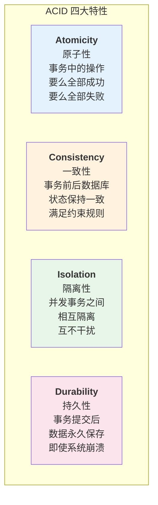
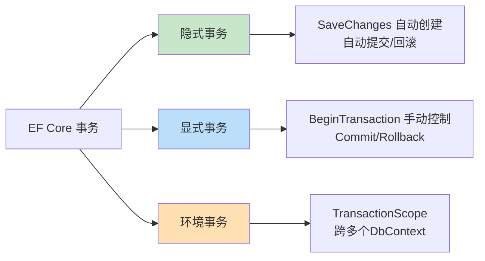
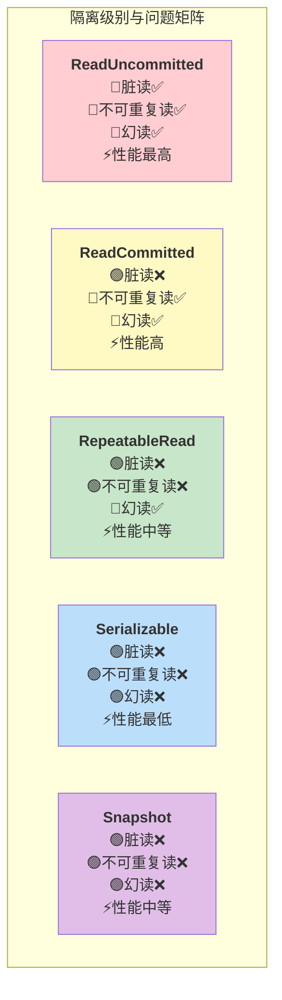
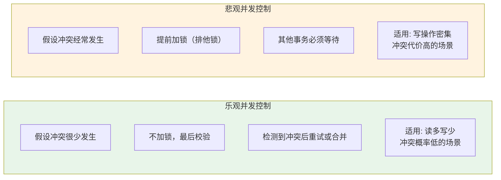
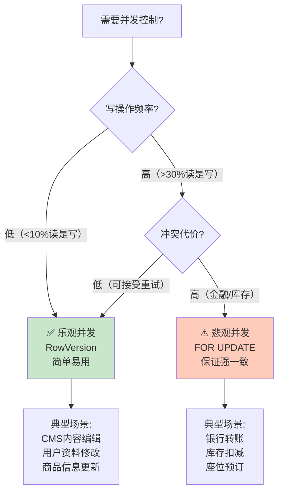
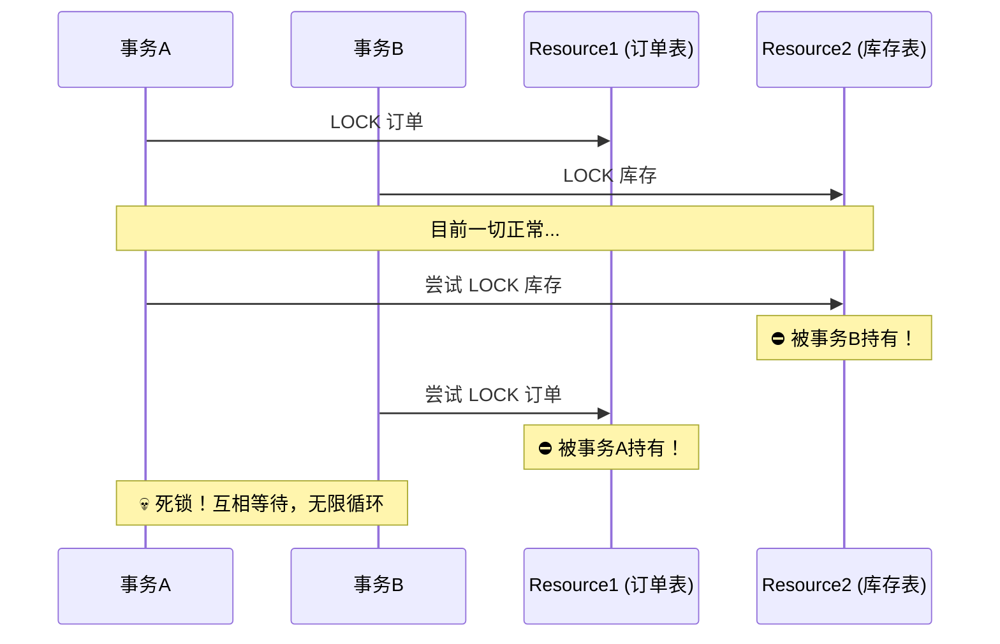
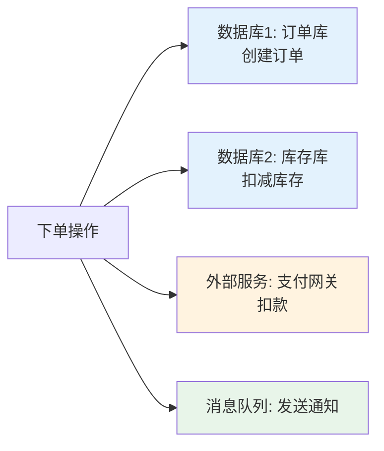

# 事务管理与并发控制

## 📌 学习目标

学完本节，你将能够：

- 理解数据库事务的ACID特性和隔离级别的含义与权衡
- 掌握EF Core中显式事务、隐式事务和环境事务的使用方法
- 实现乐观并发控制（RowVersion/Timestamp）及冲突解决策略
- 了解悲观并发控制的实现方式和适用场景
- 能够设计高并发场景下的数据一致性保障方案

## 📚 前置知识

在开始之前，你需要了解：

- 关系型数据库的基本事务概念（COMMIT/ROLLBACK）
- EF Core的DbContext和Change Tracker工作机制
- C# async/await异步编程模式
- 基本的并发编程概念（竞态条件、死锁）

## 🎯 核心内容

### 1. 数据库事务ACID特性回顾

#### 什么是ACID？

ACID是数据库事务必须满足的四个特性，确保数据操作的可靠性：



**实际案例理解ACID**：

```csharp
/// <summary>
/// 银行转账 - 经典的事务场景
/// 必须保证ACID：扣款和加款要么同时成功，要么同时失败
/// </summary>
public async Task TransferMoneyAsync(
    int fromAccountId,
    int toAccountId,
    decimal amount)
{
    // 这个操作必须在一个事务中完成：
    // 1. 从fromAccount扣除amount（原子性）
    // 2. 向toAccount增加amount（原子性）
    // 3. 两个账户余额总和不变（一致性）
    // 4. 其他并发转账不干扰本次操作（隔离性）
    // 5. 转账完成后数据永久保存（持久性）

    var fromAccount = await _context.Accounts.FindAsync(fromAccountId);
    var toAccount = await _context.Accounts.FindAsync(toAccountId);

    if (fromAccount.Balance < amount)
        throw new InsufficientFundsException("余额不足");

    fromAccount.Balance -= amount;
    toAccount.Balance += amount;

    await _context.SaveChangesAsync();  // 在事务中完成
}
```

---

### 2. EF Core中的事务类型

#### 类型概览



#### 隐式事务（Implicit Transaction）

EF Core默认行为：每次调用`SaveChanges()`或`SaveChangesAsync()`时，如果当前没有活动事务，EF会**自动创建一个事务**包裹所有变更。

```csharp
/// <summary>
 * 隐式事务演示 - SaveChanges自动管理事务
 /// </summary>
public class OrderService
{
    private readonly ApplicationDbContext _context;

    /// <summary>
     * 创建订单 - 使用隐式事务
     * SaveChangesAsync() 会自动在事务中执行所有INSERT语句
     */
    public async Task<Order> CreateOrderAsync(CreateOrderDTO dto)
    {
        // 步骤1：创建订单主体
        var order = new Order
        {
            CustomerId = dto.CustomerId,
            OrderDate = DateTime.UtcNow,
            Status = OrderStatus.Pending,
            TotalAmount = 0,
            ShippingAddress = dto.ShippingAddress
        };
        _context.Orders.Add(order);

        // 步骤2：添加订单项
        foreach (var itemDto in dto.Items)
        {
            var product = await _context.Products.FindAsync(itemDto.ProductId);
            if (product == null || product.StockQuantity < itemDto.Quantity)
                throw new BusinessException($"产品 {itemDto.ProductId} 库存不足");

            var orderItem = new OrderItem
            {
                OrderId = order.Id,  // 此时Id可能还是0（未生成）
                ProductId = product.Id,
                ProductName = product.Name,
                Quantity = itemDto.Quantity,
                UnitPrice = product.Price,
                LineTotal = itemDto.Quantity * product.Price
            };

            order.Items.Add(orderItem);
            order.TotalAmount += orderItem.LineTotal;

            // 扣减库存
            product.StockQuantity -= itemDto.Quantity;
        }

        // 🔑 关键点：这里所有变更会在一个隐式事务中提交
        // 如果任何一条SQL失败，所有变更都会回滚
        await _context.SaveChangesAsync();

        return order;
    }
}

// 生成的SQL（在同一个事务中）：
// BEGIN TRANSACTION
//   INSERT INTO Orders (...) VALUES (...)
//   INSERT INTO OrderItems (...) VALUES (...)
//   INSERT INTO OrderItems (...) VALUES (...)
//   UPDATE Products SET StockQuantity = ... WHERE Id = ...
//   UPDATE Products SET StockQuantity = ... WHERE Id = ...
// COMMIT TRANSACTION
```

#### 显式事务（Explicit Transaction）

当需要更精细的控制时，使用`BeginTransaction()`手动管理事务边界。

```csharp
/// <summary>
 * 显式事务演示 - 手动控制事务的生命周期
 /// </summary>
public class InventoryService
{
    private readonly ApplicationDbContext _context;

    /// <summary>
     * 库存盘点调整 - 需要更新库存并记录日志
     * 要求：库存更新和日志记录必须在同一事务中
     */
    public async Task AdjustInventoryAsync(
        int productId,
        int adjustmentQty,
        string reason,
        int operatorId)
    {
        // 使用using确保事务正确释放
        using var transaction = await _context.Database.BeginTransactionAsync();

        try
        {
            // 操作1：获取当前库存
            var product = await _context.Products
                .FirstOrDefaultAsync(p => p.Id == productId);

            if (product == null)
                throw new NotFoundException($"产品 {productId} 不存在");

            var previousQty = product.StockQuantity;
            var newQty = previousQty + adjustmentQty;

            if (newQty < 0)
                throw new BusinessException("调整后库存不能为负数");

            // 操作2：更新库存数量
            product.StockQuantity = newQty;
            product.LastStockAdjustmentAt = DateTime.UtcNow;

            // 操作3：记录库存变动日志
            var logEntry = new InventoryLog
            {
                ProductId = productId,
                PreviousQuantity = previousQty,
                NewQuantity = newQty,
                Adjustment = adjustmentQty,
                Reason = reason,
                OperatorId = operatorId,
                CreatedAt = DateTime.UtcNow
            };
            _context.InventoryLogs.Add(logEntry);

            // 操作4：如果调整量超过阈值，发送通知
            if (Math.Abs(adjustmentQty) > 100)
            {
                var alert = new SystemAlert
                {
                    Type = AlertType.LargeInventoryChange,
                    Message = $"大额库存调整: 产品{productId}, 数量{adjustmentQty}",
                    Severity = AlertSeverity.Warning,
                    CreatedAt = DateTime.UtcNow
                };
                _context.SystemAlerts.Add(alert);
            }

            // 提交事务（所有操作成功）
            await _context.SaveChangesAsync();
            await transaction.CommitAsync();

            _logger.LogInformation(
                "库存调整成功: 产品={ProductId}, 变更={Adjustment}, 前={Previous}, 后={New}",
                productId, adjustmentQty, previousQty, newQty);
        }
        catch (Exception ex)
        {
            // 发生异常时回滚所有操作
            await transaction.RollbackAsync();

            _logger.LogError(ex, "库存调整失败，已回滚: 产品={ProductId}", productId);

            throw;  // 重新抛出异常让上层处理
        }
    }
}
```

#### 复杂业务流程的事务管理

```csharp
/// <summary>
 * 订单处理完整流程 - 包含多步骤、多服务调用的事务管理
 /// </summary>
public class OrderProcessingService
{
    private readonly ApplicationDbContext _context;
    private readonly IPaymentService _paymentService;
    private readonly INotificationService _notificationService;
    private readonly IAuditLogService _auditService;

    public async Task ProcessOrderPaymentAsync(int orderId, PaymentInfo paymentInfo)
    {
        IDbContextTransaction? transaction = null;

        try
        {
            // 开始事务
            transaction = await _context.Database.BeginTransactionAsync(
                IsolationLevel.Serializable);  // 高级别隔离

            // ====== 步骤1：锁定订单 ======
            var order = await _context.Orders
                .Where(o => o.Id == orderId)
                .FirstOrDefaultAsync();  // Serializable会加范围锁

            if (order == null)
                throw new NotFoundException("订单不存在");

            if (order.Status != OrderStatus.Pending)
                throw new InvalidOperationException("订单状态不允许支付");

            // 标记为处理中（防止重复处理）
            order.Status = OrderStatus.Processing;
            order.UpdatedAt = DateTime.UtcNow;
            await _context.SaveChangesAsync();

            // ====== 步骤2：验证库存 ======
            foreach (var item in order.Items)
            {
                var currentStock = await _context.Products
                    .Where(p => p.Id == item.ProductId)
                    .Select(p => p.StockQuantity)  // 只查需要的字段
                    .FirstOrDefaultAsync();

                if (currentStock < item.Quantity)
                    throw new InsufficientInventoryException(
                        $"产品 {item.ProductName} 库存不足");
            }

            // ====== 步骤3：调用外部支付服务 ======
            var paymentResult = await _paymentService.ProcessPaymentAsync(new PaymentRequest
            {
                OrderId = orderId,
                Amount = order.TotalAmount,
                Currency = "CNY",
                PaymentMethod = paymentInfo.Method,
                CustomerToken = paymentInfo.CustomerToken
            });

            if (!paymentResult.IsSuccess)
                throw new PaymentFailedException(paymentResult.ErrorMessage);

            // ====== 步骤4：扣减库存 ======
            foreach (var item in order.Items)
            {
                await _context.Database.ExecuteSqlInterpolated(
                    $@"UPDATE Products
                       SET StockQuantity = StockQuantity - {item.Quantity},
                           LastStockAdjustmentAt = {DateTime.UtcNow}
                       WHERE Id = {item.ProductId}
                         AND StockQuantity >= {item.Quantity}");  // 乐观检查
            }

            // ====== 步骤5：更新订单状态 ======
            order.Status = OrderStatus.Paid;
            order.PaidAt = DateTime.UtcNow;
            order.PaymentTransactionId = paymentResult.TransactionId;
            await _context.SaveChangesAsync();

            // ====== 步骤6：记录审计日志 ======
            await _auditService.LogAsync(new AuditEntry
            {
                Action = "OrderPaid",
                EntityId = orderId,
                EntityType = "Order",
                Details = JsonSerializer.Serialize(new { paymentInfo.Amount, paymentInfo.Method }),
                Timestamp = DateTime.UtcNow
            });

            // ✅ 全部成功：提交事务
            await transaction.CommitAsync();

            // ====== 步骤7：事务外操作（允许失败不影响主流程）=====
            try
            {
                await _notificationService.SendOrderConfirmationAsync(order);
                await _notificationService.SendPaymentReceiptAsync(order, paymentResult);
            }
            catch (Exception notificationEx)
            {
                _logger.LogWarning(notificationEx, "通知发送失败但不影响订单");
            }
        }
        catch (Exception ex)
        {
            // ❌ 任何步骤失败：回滚所有数据库操作
            if (transaction != null)
            {
                await transaction.RollbackAsync();
            }

            _logger.LogError(ex, "订单支付处理失败: OrderId={OrderId}", orderId);

            throw;  // 抛出给全局异常处理
        }
    }
}
```

---

### 3. 事务隔离级别详解

#### 五种隔离级别对比

| 隔离级别 | 脏读 | 不可重复读 | 幻读 | 性能 | 典型应用 |
|----------|------|------------|------|------|----------|
| ReadUncommitted | 可能 | 可能 | 可能 | 最高 | 极少使用（报表统计） |
| ReadCommitted | 不可能 | 可能 | 可能 | 高 | **默认级别，大多数场景** |
| RepeatableRead | 不可能 | 不可能 | 可能 | 中等 | 银行账户查询 |
| Serializable | 不可能 | 不可能 | 不可能 | 最低 | 金融交易、库存扣减 |
| Snapshot | 不可能 | 不可能 | 不可能 | 中等 | SQL Server推荐的高并发方案 |



#### 各级别详细说明和使用示例

**ReadCommitted（默认）- 最常用的级别**

```csharp
/// <summary>
 * ReadCommitted - 默认隔离级别
 * 特点：只能读取已提交的数据，但同一事务内多次读取可能结果不同
 * 适用：绝大多数业务场景
 /// </summary>
public async Task<decimal> GetAccountBalance(int accountId)
{
    // 使用默认的ReadCommitted级别
    var account = await _context.Accounts
        .AsNoTracking()
        .FirstOrDefaultAsync(a => a.Id == accountId);

    return account?.Balance ?? 0;
}
```

**Serializable - 最严格的级别**

```csharp
/// <summary>
 * Serializable - 用于需要绝对一致性的场景
 * 特点：完全串行化执行，避免所有并发问题
 * 代价：性能最差，容易死锁
 * 适用：金融转账、库存扣减、唯一性约束检查
 /// </summary>
public async Task TransferWithSerializableAsync(
    int fromId, int toId, decimal amount)
{
    using var transaction = await _context.Database.BeginTransactionAsync(
        IsolationLevel.Serializable);

    try
    {
        // Serializable会锁定读取的范围，
        // 防止其他事务插入或修改相关数据
        var fromAcc = await _context.Accounts
            .FirstOrDefaultAsync(a => a.Id == fromId);

        var toAcc = await _context.Accounts
            .FirstOrDefaultAsync(a => a.Id == toId);

        if (fromAcc.Balance < amount)
            throw new InsufficientFundsException();

        fromAcc.Balance -= amount;
        toAcc.Balance += amount;

        await _context.SaveChangesAsync();
        await transaction.CommitAsync();
    }
    catch
    {
        await transaction.RollbackAsync();
        throw;
    }
}
```

**Snapshot - SQL Server推荐的并发方案**

```csharp
/// <summary>
 * Snapshot隔离级别 - 行版本控制
 * 特点：读取时不阻塞写入，写入时不阻塞读取
 * 适用：高并发读写混合场景
 * 注意：需要在数据库层面启用快照隔离
 /// </summary>
public async Task<List<ProductDTO>> GetProductsWithSnapshot()
{
    // Snapshot级别下，读者获取的是事务开始时的数据快照
    // 即使其他事务正在修改这些数据也不会被阻塞
    using var transaction = await _context.Database.BeginTransactionAsync(
        IsolationLevel.Snapshot);

    try
    {
        var products = await _context.Products
            .AsNoTracking()
            .Select(p => new ProductDTO
            {
                Id = p.Id,
                Name = p.Name,
                Price = p.Price,
                StockQuantity = p.StockQuantity  // 读取的是快照值
            })
            .ToListAsync();

        await transaction.CommitAsync();
        return products;
    }
    finally
    {
        // Snapshot不需要显式Rollback，但建议保持良好习惯
    }
}

-- SQL Server启用Snapshot隔离
ALTER DATABASE YourDatabase SET READ_COMMITTED_SNAPSHOT ON;
ALTER DATABASE YourDatabase SET ALLOW_SNAPSHOT_ISOLATION ON;
```

#### 如何设置隔离级别

```csharp
// 方式1：在BeginTransaction时指定
using var transaction = await _context.Database.BeginTransactionAsync(
    IsolationLevel.ReadCommitted);  // 显式指定

// 方式2：通过ExecutionStrategy设置默认策略
services.AddDbContext<ApplicationDbContext>(options =>
{
    options.UseSqlServer(connectionString, sqlOptions =>
    {
        sqlOptions.CommandTimeout(30);
        // 可以在这里配置默认行为
    });

    options.EnableSensitiveDataLogging();
});

// 方式3：使用原始SQL设置（不推荐，仅在特殊情况下）
await _context.Database.ExecuteSqlRawAsync("SET TRANSACTION ISOLATION LEVEL READ COMMITTED");
```

---

### 4. 并发控制策略详解

#### 乐观并发 vs 悲观并发



#### 乐观并发控制实现

**第一步：定义并发令牌**

```csharp
/// <summary>
 * 乐观并发实体 - 使用RowVersion作为并发令牌
 /// </summary>
public class Product : BaseEntity
{
    public int Id { get; set; }
    public string Name { get; set; } = "";
    public decimal Price { get; set; }
    public string Description { get; set; }
    public int StockQuantity { get; set; }

    /// <summary>
     * RowVersion / Timestamp - 数据库自动维护的版本号
     * 每次行更新时自动递增，用于检测并发修改
     /// </summary>
    [Timestamp]  // 或使用Fluent API
    public byte[] RowVersion { get; set; } = Array.Empty<byte>();
}

// Fluent API配置方式（推荐）
public class ProductConfiguration : IEntityTypeConfiguration<Product>
{
    public void Configure(EntityTypeBuilder<Product> builder)
    {
        builder.ToTable("Products");

        // 配置RowVersion为并发令牌
        builder.Property(p => p.RowVersion)
            .IsRowVersion()  // 告诉EF这是数据库生成的rowversion列
            .IsConcurrencyToken();  // 标记为并发令牌

        // 或者对非rowversion字段也可以作为并发令牌
        // builder.Property(p => p.Price).IsConcurrencyToken();
    }
}
```

**第二步：处理并发冲突**

```csharp
/// <summary>
 * 乐观并发冲突处理服务
 /// </summary>
public class ProductServiceWithOptimisticConcurrency
{
    private readonly ApplicationDbContext _context;
    private readonly ILogger<ProductServiceWithOptimisticConcurrency> _logger;

    /// <summary>
     * 更新产品价格 - 带完整的并发冲突处理
     */
    public async Task UpdateProductPriceAsync(
        int productId,
        decimal newPrice,
        byte[] currentRowVersion)
    {
        var retryCount = 0;
        const int maxRetries = 3;

        while (retryCount < maxRetries)
        {
            try
            {
                var product = await _context.Products
                    .FirstOrDefaultAsync(p => p.Id == productId);

                if (product == null)
                    throw new NotFoundException("产品不存在");

                // 设置当前的RowVersion（告诉EF我们期望的版本）
                _context.Entry(product).OriginalValues["RowVersion"] = currentRowVersion;

                product.Price = newPrice;
                product.UpdatedAt = DateTime.UtcNow;

                await _context.SaveChangesAsync();  // 这里可能抛出DbUpdateConcurrencyException

                return;  // 成功，退出循环
            }
            catch (DbUpdateConcurrencyException ex)
            {
                retryCount++;

                _logger.LogWarning(ex,
                    "并发冲突 detected (尝试 {Retry}/{MaxRetries}): ProductId={ProductId}",
                    retryCount, maxRetries, productId);

                if (retryCount >= maxRetries)
                {
                    // 超过最大重试次数，进入冲突解决策略
                    await ResolveConcurrencyConflictAsync(ex.Entries.Single());
                    return;
                }

                // 等待一段时间后重试（指数退避）
                await Task.Delay(TimeSpan.FromMilliseconds(100 * Math.Pow(2, retryCount)));
            }
        }
    }

    /// <summary>
     * 解决并发冲突 - 提供三种策略选择
     /// </summary>
    private async Task ResolveConcurrencyConflictAsync(
        DbEntityEntry entry)
    {
        var databaseValues = await entry.GetDatabaseValuesAsync();
        var currentValues = entry.CurrentValues;

        // 策略1：数据库值胜出（Database Wins）
        // 放弃客户端的修改，使用数据库中的最新值
        // entry.OriginalValues.SetValues(databaseValues);
        // entry.AcceptAllProperties();  // 或 RejectChanges()

        // 策略2：客户端值胜出（Client Wins）
        // 强制覆盖数据库中的值（可能丢失其他人的修改）
        // entry.OriginalValues.SetValues(currentValues);

        // 策略3：智能合并（Merge）- 推荐
        // 对每个字段分别决定采用哪个值
        foreach (var propertyName in databaseValues.Properties.Select(p => p.Name))
        {
            if (propertyName == "RowVersion" || propertyName == "Id")
                continue;  // 跳过系统字段

            var dbValue = databaseValues[propertyName];
            var currentValue = currentValues[propertyName];
            var originalValue = entry.OriginalValues[propertyName];

            if (!object.Equals(dbValue, originalValue))
            {
                // 数据库值已被其他人修改
                if (!object.Equals(currentValue, originalValue))
                {
                    // 客户端也修改了这个字段 → 冲突！
                    _logger.LogWarning(
                        "字段冲突: {Property}, DB值={DB}, Client值={Client}",
                        propertyName, dbValue, currentValue);

                    // 业务规则决定：价格以最后修改为准，描述可以合并
                    switch (propertyName)
                    {
                        case "Price":
                            // 价格：使用最新的（客户端）
                            break;  // 保持currentValue
                        case "Description":
                            // 描述：追加而不是覆盖
                            var dbDesc = dbValue?.ToString() ?? "";
                            var clientDesc = currentValue?.ToString() ?? "";
                            if (!dbDesc.EndsWith(clientDesc))
                            {
                                currentValues[propertyName] =
                                    $"{dbDesc}\n\n--- 追加于 {DateTime.Now} ---\n{clientDesc}";
                            }
                            break;
                        default:
                            // 默认：使用客户端值
                            break;
                    }
                }
                // else: 客户端没改，别人改了 → 使用别人的修改（已经是currentValue了？）
            }
        }

        // 更新OriginalValues为新基准
        entry.OriginalValues.SetValues(databaseValues);

        // 再次尝试保存
        await _context.SaveChangesAsync();
    }
}
```

**第三步：前端传递并发令牌**

```csharp
// DTO设计 - 必须包含RowVersion
public class UpdateProductDTO
{
    public int Id { get; set; }
    public string Name { get; set; } = "";
    public decimal Price { get; set; }
    public string Description { get; set; } = "";

    /// <summary>
     * 客户端必须在更新请求中带回这个值
     /// 通常存储在隐藏字段或URL参数中
     /// </summary>
    public byte[] RowVersion { get; set; } = Array.Empty<byte>();
}

// Controller端点
[HttpPut("api/products/{id}")]
public async Task<IActionResult> UpdateProduct(int id, UpdateProductDTO dto)
{
    if (id != dto.Id)
        return BadRequest("ID不匹配");

    try
    {
        await _productService.UpdateProductPriceAsync(id, dto.Price, dto.RowVersion);
        return NoContent();  // 204 成功无内容
    }
    catch (DbUpdateConcurrencyException)
    {
        // 返回409 Conflict，提示用户刷新数据
        return Conflict(new
        {
            error = "数据已被其他人修改，请刷新页面后重试",
            code = "CONFLICT"
        });
    }
}
```

#### 悲观并发控制实现

当冲突代价很高（如金融操作）时，使用悲观锁：

```csharp
/// <summary>
 * 悲观并发控制示例 - 使用SELECT ... FOR UPDATE
 * 注意：不同数据库语法不同
 * SQL Server: WITH (UPDLOCK, HOLDLOCK)
 * PostgreSQL: FOR UPDATE
 * MySQL: FOR UPDATE
 /// </summary>
public class InventoryPessimisticService
{
    private readonly ApplicationDbContext _context;

    /// <summary>
     * 悲观锁扣减库存 - 适用于高竞争场景
     * </summary>
    public async Task<PurchaseResult> PurchaseWithPessimisticLock(
        int productId,
        int quantity,
        int customerId)
    {
        using var transaction = await _context.Database.BeginTransactionAsync(
            IsolationLevel.Serializable);

        try
        {
            // 使用悲观锁锁定该产品行
            // 其他事务必须等待此锁释放才能读取或修改
            var product = await _context.Products
                .FromSqlInterpolated($@"
                    SELECT *
                    FROM Products WITH (UPDLOCK, HOLDLOCK)
                    WHERE Id = {productId}")
                .FirstOrDefaultAsync();

            if (product == null)
                throw new NotFoundException("产品不存在");

            if (product.StockQuantity < quantity)
                throw new InsufficientStockException("库存不足");

            // 锁定期间，其他事务无法修改此产品的库存
            product.StockQuantity -= quantity;

            // 创建销售记录
            var sale = new SaleRecord
            {
                ProductId = productId,
                CustomerId = customerId,
                Quantity = quantity,
                UnitPrice = product.Price,
                TotalAmount = quantity * product.Price,
                SoldAt = DateTime.UtcNow
            };
            _context.SaleRecords.Add(sale);

            await _context.SaveChangesAsync();
            await transaction.CommitAsync();

            return new PurchaseResult
            {
                Success = true,
                RemainingStock = product.StockQuantity,
                TransactionId = sale.Id
            };
        }
        catch (Exception ex)
        {
            await transaction.RollbackAsync();
            _logger.LogError(ex, "购买失败");
            throw;
        }
    }
}
```

#### 乐观 vs 悲观选择指南



---

### 5. 死锁的概念和预防

#### 什么是死锁？

死锁是指两个或多个事务互相等待对方持有的锁资源，导致所有事务都无法继续执行的状态。



#### 死锁预防最佳实践

```csharp
/// <summary>
 * 死锁预防的服务类示例
 /// </summary>
public class DeadlockFreeService
{
    private readonly ApplicationDbContext _context;

    /// <summary>
     * 规则1：始终按固定顺序访问资源
     * 这是预防死锁的最重要原则！
     */
    public async Task UpdateOrderAndInventory_LockOrderFirst(int orderId, int productId)
    {
        using var tx = await _context.Database.BeginTransactionAsync(IsolationLevel.Serializable);

        try
        {
            // ✅ 固定顺序：先锁订单，再锁库存
            var order = await _context.Orders.FirstOrDefaultAsync(o => o.Id == orderId);
            // 此时订单被锁定

            var product = await _context.Products.FirstOrDefaultAsync(p => p.Id == productId);
            // 再锁库存

            // ... 业务逻辑 ...

            await _context.SaveChangesAsync();
            await tx.CommitAsync();
        }
        catch
        {
            await tx.RollbackAsync();
            throw;
        }
    }

    /// <summary>
     * 规则2：缩短事务时间（减少持锁时长）
     */
    public async Task QuickUpdateAsync(int entityId)
    {
        using var tx = await _context.Database.BeginTransactionAsync();

        try
        {
            // ✅ 只做必要的数据库操作
            var entity = await _context.Entities
                .Where(e => e.Id == entityId)
                .Select(e => new { e.Id, e.Version })  // 只查需要的字段
                .FirstOrDefaultAsync();

            entity.Version++;  // 快速修改

            await _context.SaveChangesAsync();
            await tx.CommitAsync();
        }
        finally
        {
            // 确保快速释放锁
        }
    }

    /// <summary>
     * 规则3：添加超时和重试机制
     */
    public async Task<T> ExecuteWithDeadlockRetry<T>(Func<Task<T>> operation)
    {
        const int maxRetries = 3;
        for (int i = 0; i < maxRetries; i++)
        {
            try
            {
                return await operation();
            }
            catch (DbUpdateException ex) when (
                ex.InnerException is SqlException sqlEx &&
                sqlEx.Number == 1205)  // SQL Server死锁错误码
            {
                _logger.LogWarning(ex, "检测到死锁，第{Attempt}次重试", i + 1);

                if (i == maxRetries - 1)
                    throw new DeadlockException("达到最大重试次数", ex);

                // 随机等待一段时间（抖动避免惊群效应）
                await Task.Delay(Random.Shared.Next(100, 500));
            }
        }

        throw new InvalidOperationException("不应到达此处");
    }
}
```

---

### 6. 分布式事务简介

#### 为什么需要分布式事务？

当单个业务操作涉及多个数据库或外部服务时，传统事务无法满足需求：



#### Saga模式（长活事务）

```csharp
/// <summary>
 * Saga模式 - 分布式事务的最终一致性方案
 * 核心：每个步骤都有对应的补偿操作（Compensating Action）
 /// </summary>
public class OrderSagaOrchestrator
{
    private readonly ApplicationDbContext _orderContext;
    private readonly InventoryDbContext _inventoryContext;
    private readonly IPaymentGateway _paymentGateway;
    private readonly IMessageBus _messageBus;

    public async Task<SagaResult> ExecuteOrderSagaAsync(CreateOrderCommand command)
    {
        var sagaId = Guid.NewGuid();
        var steps = new List<SagaStep>();

        try
        {
            // ====== Step 1: 创建订单 ======
            var order = await CreateOrderStep(command);
            steps.Add(new SagaStep("CreateOrder", order.Id));

            // ====== Step 2: 扣减库存 ======
            await ReserveInventoryStep(order);
            steps.Add(new SagaStep("ReserveInventory"));

            // ====== Step 3: 处理支付 ======
            var paymentResult = await ProcessPaymentStep(order);
            steps.Add(new SagaStep("ProcessPayment", paymentResult.TransactionId));

            // ====== Step 4: 确认订单 ======
            await ConfirmOrderStep(order);
            steps.Add(new SagaStep("ConfirmOrder"));

            // ====== Step 5: 发送事件 ======
            await PublishEventsStep(order);
            steps.Add(new SagaStep("PublishEvents"));

            return new SagaResult(sagaId, SagaStatus.Completed, steps);
        }
        catch (Exception ex)
        {
            _logger.LogError(ex, "Saga失败，开始补偿: SagaId={SagaId}", sagaId);

            // ⚠️ 按相反顺序执行补偿操作
            for (int i = steps.Count - 1; i >= 0; i--)
            {
                try
                {
                    await CompensateStep(steps[i]);
                }
                catch (Exception compEx)
                {
                    _logger.LogError(compEx,
                        "补偿操作失败: Step={Step}, SagaId={SagaId}",
                        steps[i].Name, sagaId);
                    // 继续补偿其他步骤，不要中断
                }
            }

            return new SagaResult(sagaId, SagaStatus.Compensated, steps, ex.Message);
        }
    }

    // 补偿操作定义
    private async Task CompensateStep(SagaStep step)
    {
        switch (step.Name)
        {
            case "PublishEvents":
                // 发布"订单取消"事件
                await _messageBus.PublishAsync(new OrderCancelledEvent(step.EntityId));
                break;

            case "ConfirmOrder":
                // 将订单标记为已取消
                await _orderContext.Database.ExecuteSqlInterpolated(
                    $@"UPDATE Orders SET Status = 'Cancelled', CancelledAt = {DateTime.UtcNow}
                       WHERE Id = {step.EntityId}");
                break;

            case "ProcessPayment":
                // 退款
                if (step.ReferenceId != null)
                    await _paymentGateway.RefundAsync(step.ReferenceId.Value);
                break;

            case "ReserveInventory":
                // 恢复库存
                await _inventoryContext.Database.ExecuteSqlInterpolated(
                    $@"UPDATE Inventory SET Quantity = Quantity + ReservedQuantity,
                          ReservedQuantity = 0
                       WHERE OrderId = {step.EntityId}");
                break;

            case "CreateOrder":
                // 删除订单
                var order = await _orderContext.Orders.FindAsync(step.EntityId);
                if (order != null) _orderContext.Orders.Remove(order);
                await _orderContext.SaveChangesAsync();
                break;
        }
    }
}
```

#### Outbox模式（可靠消息传递）

```csharp
/// <summary>
 * Outbox模式 - 保证数据库操作和消息发布的原子性
 * 核心思想：将消息先保存到本地Outbox表（在同一事务中），
 *          然后由后台任务异步投递
 /// </summary>
public class OutboxService
{
    private readonly ApplicationDbContext _context;

    /// <summary>
     * 在事务中保存业务数据和Outbox消息
     */
    public async Task SaveWithOutboxMessageAsync<T>(T domainEvent, Action businessOperation)
    {
        using var tx = await _context.Database.BeginTransactionAsync();

        try
        {
            // 1. 执行业务操作
            businessOperation();

            // 2. 将事件消息写入Outbox表（同一事务！）
            var outboxMessage = new OutboxMessage
            {
                Id = Guid.NewGuid(),
                Type = typeof(T).FullName!,
                Content = JsonSerializer.Serialize(domainEvent),
                CreatedAt = DateTime.UtcNow,
                Status = OutboxMessageStatus.Pending,
                RetryCount = 0
            };
            _context.OutboxMessages.Add(outboxMessage);

            // 3. 一起提交（原子性保证）
            await _context.SaveChangesAsync();
            await tx.CommitAsync();
        }
        catch
        {
            await tx.RollbackAsync();
            throw;
        }
    }
}

// 后台消息投递服务（HostedService）
public class OutboxMessageProcessor : BackgroundService
{
    private readonly ApplicationDbContext _context;
    private readonly IMessageBus _messageBus;

    protected override async Task ExecuteAsync(CancellationToken stoppingToken)
    {
        while (!stoppingToken.IsCancellationRequested)
        {
            try
            {
                // 获取待发送的消息（批量处理）
                var messages = await _context.OutboxMessages
                    .Where(m => m.Status == OutboxMessageStatus.Pending &&
                               m.NextAttemptAt <= DateTime.UtcNow)
                    .OrderBy(m => m.CreatedAt)
                    .Take(20)
                    .ToListAsync(stoppingToken);

                foreach (var message in messages)
                {
                    try
                    {
                        // 投递消息
                        await _messageBus.PublishAsync(
                            message.Type,
                            message.Content,
                            stoppingToken);

                        // 标记为已发送
                        message.Status = OutboxMessageStatus.Sent;
                        message.SentAt = DateTime.UtcNow;
                    }
                    catch (Exception ex)
                    {
                        // 更新重试信息
                        message.RetryCount++;
                        message.LastError = ex.Message;
                        message.NextAttemptAt = DateTime.UtcNow.AddMinutes(
                            Math.Min(30, Math.Pow(2, message.RetryCount)));  // 指数退避

                        if (message.RetryCount >= 10)
                        {
                            message.Status = OutboxMessageStatus.Failed;
                            _logger.LogError(ex, "Outbox消息最终失败: {MessageId}", message.Id);
                        }
                    }
                }

                await _context.SaveChangesAsync(stoppingToken);
            }
            catch (Exception ex)
            {
                _logger.LogError(ex, "Outbox处理器异常");
            }

            // 等待下一次轮询
            await Task.Delay(TimeSpan.FromSeconds(5), stoppingToken);
        }
    }
}
```

---

### 7. 完整的银行转账事务示例

```csharp
/// <summary>
 * 银行转账服务的完整实现
 * 包含：事务管理、并发控制、审计日志、异常处理
 /// </summary>
public class BankTransferService : IBankTransferService
{
    private readonly BankingDbContext _context;
    private readonly ILogger<BankTransferService> _logger;
    private readonly IAuditService _auditService;

    public async Task<TransferResult> ExecuteTransferAsync(TransferRequest request)
    {
        #region 参数验证
        if (request.Amount <= 0)
            throw new ArgumentException("转账金额必须大于0");

        if (request.FromAccountId == request.ToAccountId)
            throw new ArgumentException("不能向自己转账");
        #endregion

        #region 开始事务
        IDbContextTransaction? transaction = null;
        var transferId = Guid.NewGuid();
        var startTime = DateTime.UtcNow;

        try
        {
            // 使用RepeatableRead防止余额被并发修改
            transaction = await _context.Database.BeginTransactionAsync(
                IsolationLevel.RepeatableRead);
            #endregion

            #region 步骤1：验证账户存在且活跃
            var fromAccount = await _context.Accounts
                .FirstOrDefaultAsync(a => a.Id == request.FromAccountId);

            var toAccount = await _context.Accounts
                .FirstOrDefaultAsync(a => a.Id == request.ToAccountId);

            ValidateAccounts(fromAccount, toAccount);
            #endregion

            #region 步骤2：检查余额充足
            // RepeatableRead级别下，此处的读取会被保护
            if (fromAccount.Balance < request.Amount + request.Fee)
            {
                throw new InsufficientFundsException(
                    $"账户 {request.FromAccountId} 余额不足。" +
                    $"当前余额: {fromAccount.Balance:C}," +
                    $"需要: {(request.Amount + request.Fee):C}");
            }
            #endregion

            #region 步骤3：检查每日限额
            await CheckDailyLimitAsync(fromAccount, request.Amount);
            #endregion

            #region 步骤4：执行转账操作
            var previousFromBalance = fromAccount.Balance;
            var previousToBalance = toAccount.Balance;

            // 扣除转出账户
            fromAccount.Balance -= (request.Amount + request.Fee);
            fromAccount.UpdatedAt = DateTime.UtcNow;
            fromAccount.Version++;  // 乐观并发令牌

            // 增加转入账户
            toAccount.Balance += request.Amount;
            toAccount.UpdatedAt = DateTime.UtcNow;
            toAccount.Version++;
            #endregion

            #region 步骤5：创建转账记录
            var transfer = new TransferRecord
            {
                Id = transferId,
                FromAccountId = request.FromAccountId,
                ToAccountId = request.ToAccountId,
                Amount = request.Amount,
                Fee = request.Fee,
                Currency = request.Currency,
                Status = TransferStatus.Completed,
                ReferenceNumber = GenerateReferenceNumber(),
                CreatedAt = DateTime.UtcNow,
                Description = request.Description,
                Metadata = new
                {
                    FromBalanceBefore = previousFromBalance,
                    ToBalanceBefore = previousToBalance,
                    IpAddress = request.IpAddress,
                    UserAgent = request.UserAgent
                }.ToJson()
            };
            _context.Transfers.Add(transfer);
            #endregion

            #region 步骤6：记录账户流水
            _context.AccountTransactions.AddRange(
                new AccountTransaction
                {
                    AccountId = request.FromAccountId,
                    TransferId = transferId,
                    Type = TransactionType.Debit,
                    Amount = request.Amount,
                    BalanceAfter = fromAccount.Balance,
                    Reference = $"TRF-{transfer.ReferenceNumber}",
                    Description = $"转账至 {toAccount.AccountNumber}",
                    CreatedAt = DateTime.UtcNow
                },
                new AccountTransaction
                {
                    AccountId = request.ToAccountId,
                    TransferId = transferId,
                    Type = TransactionType.Credit,
                    Amount = request.Amount,
                    BalanceAfter = toAccount.Balance,
                    Reference = $"TRF-{transfer.ReferenceNumber}",
                    Description = $"转账自 {fromAccount.AccountNumber}",
                    CreatedAt = DateTime.UtcNow
                });
            #endregion

            #region 步骤7：提交事务
            await _context.SaveChangesAsync();
            await transaction.CommitAsync();
            #endregion

            #region 步骤8：记录审计日志（事务外）
            try
            {
                await _auditService.LogAsync(new AuditEntry
                {
                    Action = "BankTransferCompleted",
                    UserId = request.InitiatorUserId,
                    EntityType = "Transfer",
                    EntityId = transferId,
                    Details = JsonSerializer.Serialize(new
                    {
                        FromAccount = request.FromAccountId,
                        ToAccount = request.ToAccountId,
                        Amount = request.Amount,
                        DurationMs = (DateTime.UtcNow - startTime).TotalMilliseconds
                    }),
                    Timestamp = DateTime.UtcNow
                });
            }
            catch (Exception auditEx)
            {
                _logger.LogWarning(auditEx, "审计日志记录失败，不影响转账结果");
            }
            #endregion

            #region 返回成功结果
            return new TransferResult
            {
                Success = true,
                TransferId = transferId,
                ReferenceNumber = transfer.ReferenceNumber,
                FromAccountNewBalance = fromAccount.Balance,
                ToAccountNewBalance = toAccount.Balance,
                CompletedAt = DateTime.UtcNow,
                FeeCharged = request.Fee
            };
            #endregion
        }
        #region 异常处理
        catch (InsufficientFundsException ex)
        {
            await RollbackAndLog(transaction, ex, transferId, "余额不足");
            throw;
        }
        catch (DailyLimitExceededException ex)
        {
            await RollbackAndLog(transaction, ex, transferId, "超出每日限额");
            throw;
        }
        catch (DbUpdateConcurrencyException ex)
        {
            await RollbackAndLog(transaction, ex, transferId, "并发冲突");
            throw new ConcurrentModificationException("账户数据已被其他操作修改，请重试", ex);
        }
        catch (Exception ex)
        {
            await RollbackAndLog(transaction, ex, transferId, "未知错误");
            throw new TransferException("转账处理失败，请稍后重试", ex);
        }
        #endregion
    }

    private async Task RollbackAndLog(
        IDbContextTransaction? transaction,
        Exception ex,
        Guid transferId,
        string reason)
    {
        if (transaction != null)
        {
            await transaction.RollbackAsync();
        }

        _logger.LogError(ex,
            "转账失败: TransferId={TransferId}, Reason={Reason}, Exception={ExceptionType}",
            transferId, reason, ex.GetType().Name);

        // 记录失败的转账尝试（在新事务中）
        try
        {
            using var auditTx = await _context.Database.BeginTransactionAsync();
            _context.FailedTransfers.Add(new FailedTransferRecord
            {
                Id = transferId,
                Reason = reason,
                ExceptionDetails = ex.ToString(),
                FailedAt = DateTime.UtcNow
            });
            await _context.SaveChangesAsync();
            await auditTx.CommitAsync();
        }
        catch { /* 忽略审计记录失败 */ }
    }

    private void ValidateAccounts(Account? from, Account? to)
    {
        if (from == null)
            throw new NotFoundException("转出账户不存在");

        if (to == null)
            throw new NotFoundException("转入账户不存在");

        if (!from.IsActive)
            throw new AccountFrozenException("转出账户已冻结");

        if (!to.IsActive)
            throw new AccountFrozenException("转入账户已冻结");
    }

    private async Task CheckDailyLimitAsync(Account account, decimal amount)
    {
        var todayStart = DateTime.UtcNow.Date;
        var todayTransferred = await _context.Transfers
            .Where(t => t.FromAccountId == account.Id &&
                        t.CreatedAt >= todayStart &&
                        t.Status == TransferStatus.Completed)
            .SumAsync(t => t.Amount);

        var dailyLimit = account.DailyTransferLimit ?? 50000m;
        if (todayTransferred + amount > dailyLimit)
        {
            throw new DailyLimitExceededException(
                $"今日已转账 {todayTransferred:C}，加上本次 {amount:C}" +
                $"将超出每日限额 {dailyLimit:C}");
        }
    }

    private static string GenerateReferenceNumber()
    {
        return $"TRF{DateTime.UtcNow:yyyyMMddHHmmss}{Random.Shared.Next(1000,9999)}";
    }
}
```

---

## 💡 最佳实践清单

### DO（推荐做法）

```csharp
// ✅ DO: 事务范围尽可能小
public async Task QuickUpdate(int id)
{
    using var tx = await _context.Database.BeginTransactionAsync();
    try
    {
        var entity = await _context.FindAsync(id);
        entity.SomeField = newValue;
        await _context.SaveChangesAsync();
        await tx.CommitAsync();
    }
    catch { await tx.RollbackAsync(); throw; }
}

// ✅ DO: 使用using确保事务释放
// ✅ DO: 所有数据库操作放在try块中
// ✅ DO: 在finally或catch中回滚
// ✅ DO: 选择合适的隔离级别（不要都用Serializable）
// ✅ DO: 实现乐观并发控制（大多数场景足够）
// ✅ DO: 为高冲突场景添加重试机制
// ✅ DO: 记录详细的审计日志
// ✅ DO: 外部调用放在事务之外（如发邮件、通知）
```

### DON'T（避免做法）

```csharp
// ❌ DON'T: 事务中包含HTTP调用或其他耗时操作
using var tx = await _context.Database.BeginTransactionAsync();
var result = await _httpClient.GetAsync("https://api.example.com"); // ❌ 长时间持锁！
await _context.SaveChangesAsync();
await tx.CommitAsync();

// ❌ DON'T: 使用不当的隔离级别导致性能问题
// 不要对所有查询使用Serializable

// ❌ DON'T: 忽略并发异常
try { await _context.SaveChangesAsync(); }
catch (DbUpdateConcurrencyException) { /* 静默忽略 */ }  // ❌ 数据丢失风险！

// ❌ DON'T: 在循环中开启事务
foreach (var item in items)
{
    using var tx = await _context.Database.BeginTransactionAsync();  // N个事务！
    // ...
}

// ❌ DON'T: 事务嵌套过深（除非明确需要Savepoint）
// ❌ DON'T: 在async void中使用事务（无法等待完成）
```

---

## 📝 本节小结

用一句话总结今天学到的重点：

**事务管理和并发控制是企业级数据系统的基石。** 通过合理运用显式事务、合适的隔离级别、乐观/悲观的并发控制策略以及完善的异常处理机制，可以在保证数据一致性的前提下最大化系统吞吐量。记住核心原则：**事务要短、锁要少、冲突要处理、失败要可恢复**。对于跨服务的分布式场景，Saga模式和Outbox模式提供了实用的最终一致性解决方案。

## 📖 延伸阅读

- [[04-全局查询过滤器]] - 结合过滤器进行数据权限控制
- [[06-原生SQL与存储过程]] - 存储过程与事务的结合使用
- [EF Core官方文档 - Transactions](https://docs.microsoft.com/ef/core/saving/transactions)
- [Microsoft Patterns - Saga Pattern](https://learn.microsoft.com/azure/architecture/patterns/saga)
- [SQL Server事务隔离级别详解](https://docs.microsoft.com/sql/t-sql/statements/set-transaction-isolation-level)

## ✏️ 动手练习

### 练习 1：实现带并发控制的商品价格更新

为一个电商后台实现商品价格更新功能，要求：
1. 使用RowVersion实现乐观并发控制
2. 当发生冲突时返回409状态码和最新数据
3. 前端可以据此提示用户刷新

<details>
<summary>查看答案</summary>

```csharp
// === 实体定义 ===
public class Product
{
    public int Id { get; set; }
    public string Name { get; set; }
    public decimal Price { get; set; }
    public string Description { get; set; }
    [Timestamp]
    public byte[] RowVersion { get; set; }
}

// === DTO ===
public class UpdatePriceDTO
{
    public decimal NewPrice { get; set; }
    public byte[] RowVersion { get; set; }  // 必须携带
}

// === Service ===
public class ProductService
{
    public async Task<UpdateResult> UpdatePriceAsync(int id, UpdatePriceDTO dto)
    {
        var product = await _context.Products.FindAsync(id);
        if (product == null) throw new NotFoundException();

        // 设置期望的版本号
        _context.Entry(product).OriginalValues["RowVersion"] = dto.RowVersion;

        product.Price = dto.NewPrice;
        product.UpdatedAt = DateTime.UtcNow;

        try
        {
            await _context.SaveChangesAsync();
            return new UpdateResult { Success = true, NewRowVersion = product.RowVersion };
        }
        catch (DbUpdateConcurrencyException)
        {
            // 获取数据库中的最新数据
            var dbEntry = _context.Entry(product);
            var databaseValues = await dbEntry.GetDatabaseValuesAsync();

            return new UpdateResult
            {
                Success = false,
                Conflict = true,
                CurrentData = new
                {
                    Price = databaseValues["Price"],
                    Description = databaseValues["Description"],
                    RowVersion = databaseValues["RowVersion"]
                },
                Message = "数据已被他人修改，请刷新后重试"
            };
        }
    }
}

// === Controller ===
[HttpPut("{id}/price")]
public async Task<IActionResult> UpdatePrice(int id, UpdatePriceDTO dto)
{
    var result = await _service.UpdatePriceAsync(id, dto);
    if (result.Conflict)
        return Conflict(result);  // 409
    return Ok(result);
}
```

</details>

---

### 练习 2：实现库存预留系统

实现一个支持高并发的库存预留功能：
1. 用户下单时预留库存（不是直接扣减）
2. 预留超时后自动释放（15分钟）
3. 支付成功后确认扣减
4. 取消订单时释放预留

<details>
<summary>查看答案</summary>

```csharp
public class InventoryReservationService
{
    /// <summary>
     * 预留库存 - 使用乐观+重试
     */
    public async Task<ReservationResult> ReserveAsync(
        int productId, int quantity, string reservationCode)
    {
        const int maxRetries = 5;

        for (int attempt = 0; attempt < maxRetries; attempt++)
        {
            using var tx = await _context.Database.BeginTransactionAsync(
                IsolationLevel.RepeatableRead);

            try
            {
                var inventory = await _context.Inventories
                    .FirstOrDefaultAsync(i => i.ProductId == productId);

                var available = inventory.Quantity -
                                inventory.ReservedQuantity;

                if (available < quantity)
                {
                    await tx.RollbackAsync();
                    return ReservationResult.Insufficient(inventory.Quantity, inventory.ReservedQuantity);
                }

                // 预留
                inventory.ReservedQuantity += quantity;

                // 创建预留记录
                _context.Reservations.Add(new Reservation
                {
                    Code = reservationCode,
                    ProductId = productId,
                    Quantity = quantity,
                    ExpiresAt = DateTime.UtcNow.AddMinutes(15),
                    Status = ReservationStatus.Active,
                    CreatedAt = DateTime.UtcNow
                });

                await _context.SaveChangesAsync();
                await tx.CommitAsync();

                return ReservationResult.Success(reservationCode);
            }
            catch (DbUpdateConcurrencyException)
            {
                await tx.RollbackAsync();
                if (attempt < maxRetries - 1)
                    await Task.Delay(50 * (attempt + 1));
            }
            catch (Exception)
            {
                await tx.RollbackAsync();
                throw;
            }
        }

        return ReservationResult.Failed("系统繁忙，请重试");
    }

    /// <summary>
     * 确认预留（支付成功后调用）
     */
    public async Task ConfirmReservationAsync(string reservationCode)
    {
        using var tx = await _context.Database.BeginTransactionAsync();

        try
        {
            var reservation = await _context.Reservations
                .Include(r => r.Inventory)
                .FirstOrDefaultAsync(r => r.Code == reservationCode &&
                                          r.Status == ReservationStatus.Active);

            if (reservation == null) throw new NotFoundException();

            // 实际扣减
            reservation.Inventory.Quantity -= reservation.Quantity;
            reservation.Inventory.ReservedQuantity -= reservation.Quantity;

            // 标记预留已完成
            reservation.Status = ReservationStatus.Confirmed;
            reservation.ConfirmedAt = DateTime.UtcNow;

            await _context.SaveChangesAsync();
            await tx.CommitAsync();
        }
        catch
        {
            await tx.RollbackAsync();
            throw;
        }
    }

    /// <summary>
     * 释放预留（取消订单或超时）
     */
    public async Task ReleaseReservationAsync(string reservationCode)
    {
        using var tx = await _context.Database.BeginTransactionAsync();

        try
        {
            var reservation = await _context.Reservations
                .Include(r => r.Inventory)
                .FirstOrDefaultAsync(r => r.Code == reservationCode &&
                                         r.Status == ReservationStatus.Active);

            if (reservation == null) return;  // 已处理或不存在

            // 释放预留
            reservation.Inventory.ReservedQuantity -= reservation.Quantity;
            reservation.Status = ReservationStatus.Released;
            reservation.ReleasedAt = DateTime.UtcNow;

            await _context.SaveChangesAsync();
            await tx.CommitAsync();
        }
        catch
        {
            await tx.RollbackAsync();
            throw;
        }
    }
}

// 后台定时任务：清理过期预留
public class ExpiredReservationCleanupService : BackgroundService
{
    protected override async Task ExecuteAsync(CancellationToken stoppingToken)
    {
        while (!stoppingToken.IsCancellationRequested)
        {
            var expiredReservations = await _context.Reservations
                .Where(r => r.Status == ReservationStatus.Active &&
                           r.ExpiresAt <= DateTime.UtcNow)
                .Take(100)
                .ToListAsync(stoppingToken);

            foreach (var reservation in expiredReservations)
            {
                await _reservationService.ReleaseReservationAsync(reservation.Code);
            }

            await Task.Delay(TimeSpan.FromMinutes(1), stoppingToken);
        }
    }
}
```

</details>

---

### 练习 3：实现一个通用的事务执行器

封装一个通用的事务执行器，支持：
1. 可配置的隔离级别
2. 自动重试（针对死锁和临时故障）
3. 详细的日志记录
4. 统一的异常处理
5. 执行耗时统计

<details>
<summary>查看答案</summary>

```csharp
/// <summary>
 * 通用事务执行器
 /// </summary>
public interface ITransactionExecutor
{
    Task<T> ExecuteAsync<T>(
        Func<ITransactionScope, Task<T>> operation,
        TransactionOptions? options = null);

    Task ExecuteAsync(
        Func<ITransactionScope, Task> operation,
        TransactionOptions? options = null);
}

public record TransactionOptions
{
    public IsolationLevel IsolationLevel { get; init; } = IsolationLevel.ReadCommitted;
    public int TimeoutSeconds { get; init; } = 30;
    public int MaxRetries { get; init; } = 3;
    public string OperationName { get; init; } = "Unknown";
    public bool EnableDeadlockRetry { get; init; } = true;
}

public interface ITransactionScope
{
    ApplicationDbContext Context { get; }
    CancellationToken CancellationToken { get; }
}

/// <summary>
 * 实现
 /// </summary>
public class TransactionExecutor : ITransactionExecutor
{
    private readonly IServiceScopeFactory _scopeFactory;
    private readonly ILogger<TransactionExecutor> _logger;

    public async Task<T> ExecuteAsync<T>(
        Func<ITransactionScope, Task<T>> operation,
        TransactionOptions? options = null)
    {
        var opts = options ?? new TransactionOptions();
        var stopwatch = Stopwatch.StartNew();
        Exception? lastException = null;

        for (int attempt = 1; attempt <= opts.MaxRetries; attempt++)
        {
            using var scope = _scopeFactory.CreateScope();
            var context = scope.ServiceProvider.GetRequiredService<ApplicationDbContext>();

            IDbContextTransaction? transaction = null;

            try
            {
                _logger.LogDebug(
                    "[Tx] 开始: {Operation}, Attempt={Attempt}/{MaxRetries}, Level={Level}",
                    opts.OperationName, attempt, opts.MaxRetries, opts.IsolationLevel);

                transaction = await context.Database.BeginTransactionAsync(opts.IsolationLevel);

                var txScope = new TransactionScopeImpl(context, default);

                var result = await operation(txScope);

                await context.SaveChangesAsync();
                await transaction.CommitAsync();

                stopwatch.Stop();

                _logger.LogInformation(
                    "[Tx] 完成: {Operation}, 耗时={ElapsedMs}ms, Attempt={Attempt}",
                    opts.OperationName, stopwatch.ElapsedMilliseconds, attempt);

                return result;
            }
            catch (Exception ex) when (ShouldRetry(ex, opts, attempt))
            {
                lastException = ex;

                if (transaction != null)
                    await transaction.RollbackAsync();

                var delay = CalculateBackoff(attempt);

                _logger.LogWarning(ex,
                    "[Tx] 重试: {Operation}, Attempt={Attempt}, Delay={Delay}ms, Error={Error}",
                    opts.OperationName, attempt, delay, ex.Message);

                await Task.Delay(delay);
            }
            catch (Exception ex)
            {
                if (transaction != null)
                    await transaction.RollbackAsync();

                stopwatch.Stop();

                _logger.LogError(ex,
                    "[Tx] 失败: {Operation}, 耗时={ElapsedMs}ms, Error={Error}",
                    opts.OperationName, stopwatch.ElapsedMilliseconds, ex.Message);

                throw;
            }
        }

        throw new TransactionException(
            $"事务执行失败（已达最大重试次数）: {opts.OperationName}",
            lastException!);
    }

    private bool ShouldRetry(Exception ex, TransactionOptions opts, int attempt)
    {
        if (attempt >= opts.MaxRetries) return false;

        return ex switch
        {
            DbUpdateException dbEx when IsTransientDbError(dbEx) => true,
            TimeoutException => opts.EnableDeadlockRetry,
            OperationCanceledException => false,
            _ => false
        };
    }

    private static bool IsTransientDbError(DbUpdateException ex)
    {
        return ex.InnerException is SqlException sqlEx &&
               sqlEx.Number is 1205 or -2 or 2627 or 2601;  // 死锁/超时/键冲突
    }

    private static TimeSpan CalculateBackoff(int attempt)
    {
        // 指数退避 + 随机抖动
        var baseDelay = (int)(100 * Math.Pow(2, attempt));
        var jitter = Random.Shared.Next(0, baseDelay / 2);
        return TimeSpan.FromMilliseconds(baseDelay + jitter);
    }
}

// 使用示例
public class OrderService
{
    private readonly ITransactionExecutor _txExecutor;

    public async Task<Order> CreateOrderAsync(CreateOrderDTO dto)
    {
        return await _txExecutor.ExecuteAsync(async scope =>
        {
            var order = new Order { /* ... */ };
            scope.Context.Orders.Add(order);
            return order;
        }, new TransactionOptions
        {
            OperationName = "CreateOrder",
            IsolationLevel = IsolationLevel.ReadCommitted,
            MaxRetries = 3
        });
    }
}
```

</details>

---

### 练习 4：分析并修复一段有事务问题的代码

以下代码存在多种事务相关问题，请识别并修复。

<details>
<summary>查看待修复的代码</summary>

```csharp
public class ProblematicService
{
    public async Task Process(OrderDTO dto)
    {
        var tx = await _context.Database.BeginTransactionAsync();

        var order = new Order { /* ... */ };
        _context.Orders.Add(order);

        // 问题1：在事务中调用了外部API
        var taxResult = await _taxApi.CalculateTax(dto.Items);  // 可能很慢

        order.Tax = taxResult.Amount;

        // 问题2：在事务中发了邮件
        await _emailService.SendConfirmation(order.CustomerEmail);  // 可能失败

        await _context.SaveChangesAsync();
        await tx.CommitAsync();
    }
}
```

</details>

<details>
<summary>查看修复后的代码</summary>

```csharp
public class FixedService
{
    public async Task<Order> Process(OrderDTO dto)
    {
        // 修复1：将外部API调用移到事务之外
        TaxResult? taxResult = null;
        try
        {
            taxResult = await _taxApi.CalculateTax(dto.Items);
        }
        catch (Exception ex)
        {
            _logger.LogWarning(ex, "税务计算失败，使用默认税率");
            taxResult = new TaxResult { Amount = dto.Total * 0.13m };  // 兜底
        }

        // 修复2：使用using确保事务释放
        using var tx = await _context.Database.BeginTransactionAsync(
            IsolationLevel.ReadCommitted);

        try
        {
            var order = new Order
            {
                CustomerId = dto.CustomerId,
                TotalAmount = dto.Total,
                Tax = taxResult!.Amount,
                Status = OrderStatus.Created,
                CreatedAt = DateTime.UtcNow
            };

            _context.Orders.Add(order);

            foreach (var item in dto.Items)
            {
                order.Items.Add(new OrderItem
                {
                    ProductId = item.ProductId,
                    Quantity = item.Quantity,
                    UnitPrice = item.UnitPrice
                });

                // 扣减库存
                await _context.Database.ExecuteSqlInterpolated(
                    $@"UPDATE Products SET StockQuantity = StockQuantity - {item.Quantity}
                       WHERE Id = {item.ProductId}");
            }

            await _context.SaveChangesAsync();
            await tx.CommitAsync();

            // 修复3：邮件发送移到事务提交之后
            _ = Task.Run(async () =>
            {
                try { await _emailService.SendConfirmation(order.CustomerEmail); }
                catch (Exception emailEx)
                { _logger.LogWarning(emailEx, "确认邮件发送失败"); }
            });

            return order;
        }
        catch (Exception ex)
        {
            // 修复4：确保回滚
            await tx.RollbackAsync();
            _logger.LogError(ex, "订单创建失败");
            throw;
        }
    }
}
```

**问题清单**：

| # | 问题 | 影响 | 修复措施 |
|---|------|------|----------|
| 1 | 事务中调用外部API | 长时间持锁，降低并发度 | 移到事务外 |
| 2 | 事务中发邮件 | 失败导致整个事务回滚 | 移到事务外+防火墙模式 |
| 3 | 缺少using | 异常时事务可能泄漏 | 添加using |
| 4 | 缺少回滚逻辑 | 异常后连接池污染 | 添加catch+Rollback |

</details>

---

## ❓ 思考题

1. 在你的项目中，哪些操作需要使用Serializable隔离级别？哪些用ReadCommitted就足够了？
2. 乐观并发和悲观并发各有什么优缺点？如何根据业务特征选择合适的方式？
3. 如何设计一个既能保证数据一致性又不会严重损害性能的事务策略？
4. 微服务架构中，传统的ACID事务不再适用。你会如何设计跨服务的最终一致性方案？
5. 当数据库出现死锁时，应该如何排查和解决？有哪些工具可以帮助定位死锁原因？

---
**上一节** | **[[04-全局查询过滤器]]** | **[[06-原生SQL与存储过程]]** | **🏠 [[HOME]]**
