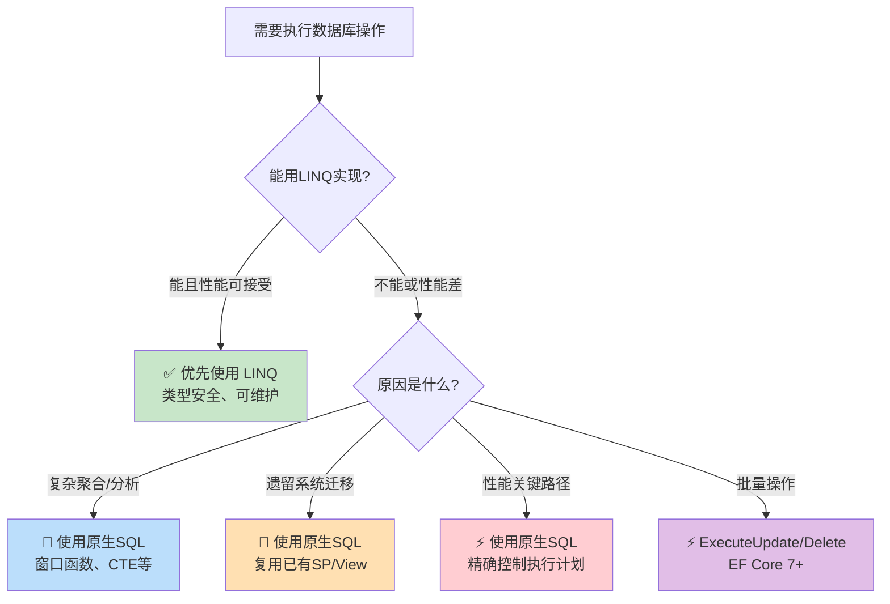
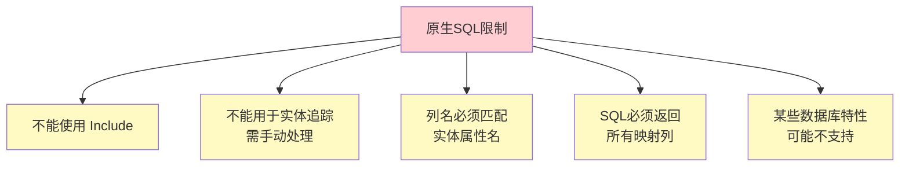
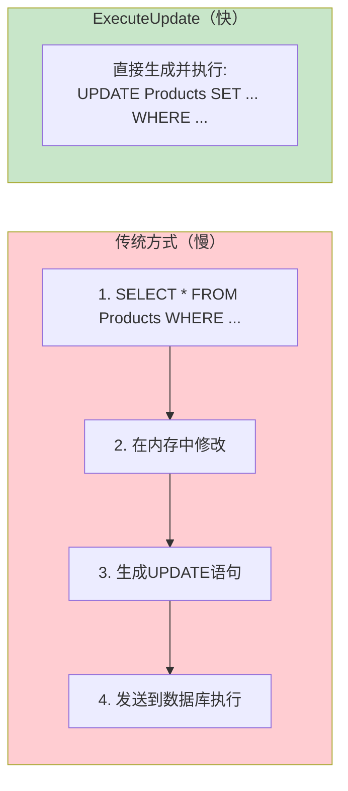

# 原生SQL与存储过程

## 📌 学习目标

学完本节，你将能够：

- 理解何时应该使用原生SQL而非LINQ查询
- 掌握FromSqlRaw/FromSqlInterpolated的安全使用方法
- 学会调用存储过程和标量函数
- 运用ExecuteUpdate/ExecuteDelete进行高效批量操作
- 实现视图映射和无键实体用于只读报表场景
- 建立完整的SQL注入防护意识

## 📚 前置知识

在开始之前，你需要了解：

- EF Core的DbContext和DbSet基本用法
- SQL Server/MySQL/PostgreSQL的基本SQL语法
- 参数化查询的概念和重要性
- C#字符串插值与SQL注入的关系

## 🎯 核心内容

### 1. 什么时候应该用原生SQL？

#### 决策流程图



#### 典型适用场景

```csharp
/// <summary>
 * 场景1：复杂报表查询 - 使用窗口函数、CTE等高级SQL特性
 /// </summary>
public async Task<List<SalesRankingDTO>> GetMonthlySalesRanking(int year, int month)
{
    // 这个查询使用了窗口函数RANK()，LINQ难以表达
    return await _context.Database
        .SqlQuery<SalesRankingDTO>(@$"
            WITH MonthlySales AS (
                SELECT
                    p.CategoryId,
                    c.Name AS CategoryName,
                    SUM(oi.Quantity * oi.UnitPrice) AS TotalSales,
                    COUNT(DISTINCT o.Id) AS OrderCount
                FROM Orders o
                INNER JOIN OrderItems oi ON o.Id = oi.OrderId
                INNER JOIN Products p ON oi.ProductId = p.Id
                INNER JOIN Categories c ON p.CategoryId = c.Id
                WHERE YEAR(o.OrderDate) = {year}
                  AND MONTH(o.OrderDate) = {month}
                  AND o.Status = N'Completed'
                GROUP BY p.CategoryId, c.Name
            )
            SELECT
                CategoryId,
                CategoryName,
                TotalSales,
                OrderCount,
                RANK() OVER (ORDER BY TotalSales DESC) AS SalesRank,
                RANK() OVER (ORDER BY OrderCount DESC) AS VolumeRank,
                ROUND(TotalSales * 100.0 / (SELECT SUM(TotalSales) FROM MonthlySales), 2) AS MarketShare
            FROM MonthlySales
            ORDER BY TotalSales DESC")
        .ToListAsync();
}

/// <summary>
 * 场景2：全文搜索 - 利用数据库特定的搜索功能
 /// </summary>
public async Task<List<SearchResultDTO>> FullTextSearch(string query)
{
    // SQL Server的CONTAINSTABLE函数，LINQ无法直接调用
    return await _context.Database
        .SqlQuery<SearchResultDTO>($@"
            SELECT
                p.Id,
                p.Name,
                p.Description,
                ft.Rank AS RelevanceScore,
                c.Name AS CategoryName
            FROM Products p
            INNER JOIN CONTAINSTABLE(Products, (Name, Description), {query}) ft
                ON p.Id = ft.[KEY]
            LEFT JOIN Categories c ON p.CategoryId = c.Id
            WHERE p.IsActive = 1
            ORDER BY ft.Rank DESC")
        .Take(20)
        .AsNoTracking()
        .ToListAsync();
}

/// <summary>
 * 场景3：遗留存储过程调用 - 复用已有的数据库逻辑
 /// </summary>
public async Task<InventoryReportDTO> GenerateLegacyReport(int warehouseId)
{
    // 调用已存在的存储过程
    var result = await _context.Database
        .SqlQuery<InventoryReportDTO>($@"
            EXEC sp_GenerateInventoryReport
                @WarehouseId = {warehouseId},
                @ReportDate = {DateTime.UtcNow:yyyy-MM-dd},
                @IncludeZeroStock = {true}")
        .FirstOrDefaultAsync();

    return result!;
}
```

---

### 2. FromSqlRaw / FromSqlInterpolated 方法详解

#### 核心区别：安全 vs 危险

```csharp
// ========================================
// ❌ FromSqlRaw - 危险！容易SQL注入
// ========================================

// 拼接用户输入到SQL字符串中 - 绝对禁止！
string keyword = Request.Query["search"];  // 用户输入: "; DROP TABLE Products; --
var products = _context.Products
    .FromSqlRaw($"SELECT * FROM Products WHERE Name LIKE '%{keyword}%'");
// 生成的恶意SQL：
// SELECT * FROM Products WHERE Name LIKE '%'; DROP TABLE Products; --%'

// ========================================
// ✅ FromSqlInterpolated / FromSqlRaw + 参数 - 安全！
// ========================================

// 方式A：FromSqlInterpolated（推荐，自动参数化）
var safeProducts = _context.Products
    .FromSqlInterpolated($"SELECT * FROM Products WHERE Name LIKE {%keyword}%");
// 生成的安全SQL：
// SELECT * FROM Products WHERE Name LIKE @p0 -- 参数化，防止注入

// 方式B：FromSqlRaw + 显式参数
var safeProducts2 = _context.Products
    .FromSqlRaw("SELECT * FROM Products WHERE Name LIKE {0}", $"%{keyword}%");

// 方式C：FromSqlRaw + SqlParameter（最明确）
var param = new SqlParameter("@keyword", $"%{keyword}%");
var safeProducts3 = _context.Products
    .FromSqlRaw("SELECT * FROM Products WHERE Name LIKE @keyword", param);
```

#### 完整使用示例

```csharp
/// <summary>
 * FromSqlInterpolated完整示例 - 带分页和排序的原生SQL查询
 /// </summary>
public class ProductRepository
{
    private readonly ApplicationDbContext _context;

    /// <summary>
     * 高级产品搜索 - 使用原生SQL实现复杂的动态查询
     */
    public async Task<PagedResult<ProductSearchDTO>> SearchProductsAdvanced(
        ProductSearchCriteria criteria)
    {
        // 构建动态WHERE子句
        var conditions = new List<string>();
        var parameters = new List<object>();

        if (!string.IsNullOrWhiteSpace(criteria.Keyword))
        {
            conditions.Add("(p.Name LIKE {0} OR p.Description LIKE {0} OR p.SKU LIKE {0})");
            parameters.Add($"%{criteria.Keyword}%");
        }

        if (criteria.MinPrice.HasValue)
        {
            conditions.Add("p.Price >= {1}");
            parameters.Add(criteria.MinPrice.Value);
        }

        if (criteria.MaxPrice.HasValue)
        {
            conditions.Add("p.Price <= {2}");
            parameters.Add(criteria.MaxPrice.Value);
        }

        if (criteria.CategoryIds?.Any() == true)
        {
            conditions.Add("p.CategoryId IN ({3})");
            parameters.Add(string.Join(",", criteria.CategoryIds));
        }

        if (criteria.InStockOnly)
        {
            conditions.Add("p.StockQuantity > 0");
        }

        var whereClause = conditions.Any()
            ? "WHERE " + string.Join(" AND ", conditions)
            : "";

        // 主查询
        var sql = $@"
            SELECT
                p.Id,
                p.Name,
                p.SKU,
                p.Price,
                p.ImageUrl,
                c.Name AS CategoryName,
                p.StockQuantity,
                p.AverageRating,
                p.ReviewCount,
                p.CreatedAt
            FROM Products p
            LEFT JOIN Categories c ON p.CategoryId = c.Id
            {whereClause}
            ORDER BY {GetOrderByClause(criteria.SortBy, criteria.SortDir)}
            OFFSET {(criteria.Page - 1) * criteria.PageSize} ROWS
            FETCH NEXT {criteria.PageSize} ROWS ONLY";

        // 计数查询
        var countSql = $@"
            SELECT COUNT(*)
            FROM Products p
            {whereClause}";

        // 执行查询
        using var multiQuery = await _context.Database.GetDbConnection()
            .QueryMultipleAsync($"{sql}; {countSql}", parameters.ToArray());

        var items = await multiQuery.ReadAsync<ProductSearchDTO>();
        var totalCount = await multiQuery.ReadSingleAsync<int>();

        return new PagedResult<ProductSearchDTO>(
            items.ToList(), totalCount, criteria.Page, criteria.PageSize);
    }

    private static string GetOrderByClause(string sortBy, string sortDir)
    {
        // 白名单验证，防止SQL注入
        var allowedColumns = new Dictionary<string, string>
        {
            ["name"] = "p.Name",
            ["price"] = "p.Price",
            ["rating"] = "p.AverageRating",
            ["newest"] = "p.CreatedAt",
            ["popular"] = "p.ReviewCount"
        };

        var direction = sortDir.Equals("desc", StringComparison.OrdinalIgnoreCase)
            ? "DESC" : "ASC";

        if (allowedColumns.TryGetValue(sortBy.ToLower(), out var column))
        {
            return $"{column} {direction}";
        }

        return $"p.Name ASC";  // 默认排序
    }
}
```

---

### 3. 执行原始SQL命令

#### ExecuteSqlRaw / ExecuteSqlInterpolated

用于执行不返回实体集的SQL语句（INSERT/UPDATE/DELETE/DDL等）：

```csharp
/// <summary>
 * ExecuteSqlInterpolated使用示例
 /// </summary>
public class MaintenanceService
{
    private readonly ApplicationDbContext _context;

    /// <summary>
     * 场景1：批量更新商品状态
     */
    public async Task<int> UpdateProductStatusBatch(
        IEnumerable<int> productIds,
        ProductStatus newStatus)
    {
        var idList = string.Join(",", productIds);

        return await _context.Database.ExecuteSqlInterpolated($@"
            UPDATE Products
            SET Status = {newStatus},
                UpdatedAt = {DateTime.UtcNow}
            WHERE Id IN ({idList})
              AND Status != {newStatus}");  // 避免无效更新
    }

    /// <summary>
     * 场景2：清理过期数据
     */
    public async Task CleanupExpiredDataAsync()
    {
        var cutoffDate = DateTime.UtcNow.AddDays(-90);

        // 清理过期的购物车项
        var deletedCarts = await _context.Database.ExecuteSqlInterpolated($@"
            DELETE FROM ShoppingCartItems
            WHERE CreatedAt < {cutoffDate}");

        // 清理未支付的过期订单（软删除）
        var cancelledOrders = await _context.Database.ExecuteSqlInterpolated($@"
            UPDATE Orders
            SET Status = 'Cancelled',
                CancelledAt = {DateTime.UtcNow},
                CancelReason = 'Auto-cancelled: expired',
                UpdatedAt = {DateTime.UtcNow}
            WHERE Status = 'Pending'
              AND CreatedAt < {cutoffDate}");

        Console.WriteLine($"清理完成: 删除{deletedCarts}条购物车, 取消{cancelledOrders}个订单");
    }

    /// <summary>
     * 场景3：DDL操作 - 创建索引（运维用途）
     */
    public async Task CreatePerformanceIndexIfNotExists()
    {
        await _context.Database.ExecuteSqlInterpolated($@"
            IF NOT EXISTS (
                SELECT * FROM sys.indexes
                WHERE name = 'IX_Orders_Customer_Status_Date'
                    AND object_id = OBJECT_ID('Orders')
            )
            CREATE NONCLUSTERED INDEX IX_Orders_Customer_Status_Date
            ON Orders (CustomerId, Status, OrderDate)
            INCLUDE (TotalAmount)");
    }
}
```

#### 调用标量函数

```csharp
/// <summary>
 * 调用数据库标量函数
 /// </summary>
public class PricingService
{
    private readonly ApplicationDbContext _context;

    /// <summary>
     * 调用自定义标量函数计算折扣价
     */
    public async Task<decimal> CalculateDiscountedPrice(
        int productId,
        int customerId,
        decimal originalPrice)
    {
        // 调用SQL Server标量函数 dbo.fn_CalculateCustomerDiscount
        var result = await _context.Database
            .SqlQuery<decimal>($@"
                SELECT dbo.fn_CalculateCustomerDiscount(
                    @ProductId = {productId},
                    @CustomerId = {customerId},
                    @OriginalPrice = {originalPrice}
                ) AS DiscountedPrice")
            .FirstOrDefaultAsync();

        return result;
    }

    /// <summary>
     * 调用表值函数
     */
    public async Task<List<CustomerPurchaseHistory>> GetCustomerPurchaseHistory(
        int customerId,
        DateTime startDate,
        DateTime endDate)
    {
        return await _context.Database
            .SqlQuery<CustomerPurchaseHistory>($@"
                SELECT *
                FROM dbo.fn_GetCustomerPurchaseHistory({customerId}, {startDate}, {endDate})")
            .ToListAsync();
    }
}
```

---

### 4. 调用存储过程

#### 基本存储过程调用

```sql
-- 示例存储过程：创建订单（SQL Server）
CREATE PROCEDURE sp_CreateOrder
    @CustomerId INT,
    @ShippingAddress NVARCHAR(500),
    @OrderTotal DECIMAL(18,2),
    @NewOrderId INT OUTPUT,
    @OrderNumber NVARCHAR(50) OUTPUT
AS
BEGIN
    SET NOCOUNT ON;
    BEGIN TRY
        BEGIN TRANSACTION;

        -- 生成订单号
        DECLARE @Prefix NVARCHAR(10) = 'ORD';
        DECLARE @Timestamp VARCHAR(14) = REPLACE(REPLACE(CONVERT(VARCHAR, GETDATE(), 120), '-', ''), ' ', '');
        DECLARE @RandomSuffix VARCHAR(6) = RIGHT('000000' + CAST(CAST(RAND() * 1000000 AS INT) AS VARCHAR), 6);

        SET @OrderNumber = @Prefix + @Timestamp + @RandomSuffix;

        -- 插入订单
        INSERT INTO Orders (CustomerId, OrderNumber, TotalAmount, ShippingAddress, Status, CreatedAt)
        VALUES (@CustomerId, @OrderNumber, @OrderTotal, @ShippingAddress, 'Pending', GETUTCDATE());

        SET @NewOrderId = SCOPE_IDENTITY();

        COMMIT TRANSACTION;
    END TRY
    BEGIN CATCH
        IF @@TRANCOUNT > 0
            ROLLBACK TRANSACTION;
        THROW;
    END CATCH;
END;
```

```csharp
/// <summary>
 * EF Core调用带输出参数的存储过程
 /// </summary>
public class OrderRepositoryWithSp
{
    private readonly ApplicationDbContext _context;

    public async Task<CreateOrderResult> CreateOrderViaStoredProcedure(CreateOrderCommand command)
    {
        // 定义输出参数
        var orderIdParam = new SqlParameter("@NewOrderId", SqlDbType.Int)
        {
            Direction = ParameterDirection.Output
        };

        var orderNumberParam = new SqlParameter("@OrderNumber", SqlDbType.NVarChar, 50)
        {
            Direction = ParameterDirection.Output
        };

        // 执行存储过程
        await _context.Database.ExecuteSqlRawAsync(@"
            EXEC sp_CreateOrder
                @CustomerId = @p0,
                @ShippingAddress = @p1,
                @OrderTotal = @p2,
                @NewOrderId = @p3 OUTPUT,
                @OrderNumber = @p4 OUTPUT",
            command.CustomerId,
            command.ShippingAddress,
            command.TotalAmount,
            orderIdParam,
            orderNumberParam);

        // 读取输出参数
        return new CreateOrderResult
        {
            OrderId = (int)orderIdParam.Value!,
            OrderNumber = (string)orderNumberParam.Value!
        };
    }
}
```

#### 复杂存储过程调用（返回结果集）

```csharp
/// <summary>
 * 调用返回多个结果集的存储过程
 /// </summary>
public class ReportRepository
{
    /// <summary>
     * 调用销售报表存储过程 - 返回多个结果集
     */
    public async Task<DailySalesReport> GetDailySalesReport(DateTime date)
    {
        var report = new DailySalesReport { Date = date };

        using var connection = _context.Database.GetDbConnection();
        await connection.OpenAsync();

        using var command = connection.CreateCommand();
        command.CommandText = "sp_DailySalesReport";
        command.CommandType = CommandType.StoredProcedure;

        command.Parameters.Add(new SqlParameter("@ReportDate", date));

        using var reader = await command.ExecuteReaderAsync();

        // 结果集1：销售汇总
        if (await reader.ReadAsync())
        {
            report.Summary = new SalesSummary
            {
                TotalOrders = reader.GetInt32("TotalOrders"),
                TotalRevenue = reader.GetDecimal("TotalRevenue"),
                AverageOrderValue = reader.GetDecimal("AverageOrderValue"),
                UniqueCustomers = reader.GetInt32("UniqueCustomers"),
                ReturnedOrders = reader.GetInt32("ReturnedOrders")
            };
        }

        // 结果集2：按小时分布
        await reader.NextResultAsync();
        report.HourlyBreakdown = new List<HourlyData>();
        while (await reader.ReadAsync())
        {
            report.HourlyBreakdown.Add(new HourlyData
            {
                Hour = reader.GetInt32("Hour"),
                OrderCount = reader.GetInt32("OrderCount"),
                Revenue = reader.GetDecimal("Revenue")
            });
        }

        // 结果集3：Top 10 商品
        await reader.NextResultAsync();
        report.TopProducts = new List<ProductRanking>();
        while (await reader.ReadAsync())
        {
            report.TopProducts.Add(new ProductRanking
            {
                Rank = reader.GetInt32("Rank"),
                ProductId = reader.GetInt32("ProductId"),
                ProductName = reader.GetString("ProductName"),
                QuantitySold = reader.GetInt32("QuantitySold"),
                Revenue = reader.GetDecimal("Revenue")
            });
        }

        // 结果集4：Top 10 客户
        await reader.NextResultAsync();
        report.TopCustomers = new List<CustomerRanking>();
        while (await reader.ReadAsync())
        {
            report.TopCustomers.Add(new CustomerRanking
            {
                Rank = reader.GetInt32("Rank"),
                CustomerId = reader.GetInt32("CustomerId"),
                CustomerName = reader.GetString("CustomerName"),
                TotalSpent = reader.GetDecimal("TotalSpent"),
                OrderCount = reader.GetInt32("OrderCount")
            });
        }

        return report;
    }
}
```

---

### 5. 原生SQL的限制

#### 重要限制清单



```csharp
// === 限制演示 ===

// ❌ 限制1：不能使用Include
// 以下代码会抛出异常
var bad = _context.Orders
    .FromSqlInterpolated($"SELECT * FROM Orders")  // 原生SQL
    .Include(o => o.Customer);  // ❌ InvalidOperationException!

// ✅ 解决方案：在SQL中使用JOIN
var good = _context.Orders
    .FromSqlInterpolated($@"
        SELECT o.*, c.Name AS CustomerName, c.Email AS CustomerEmail
        FROM Orders o
        LEFT JOIN Customers c ON o.CustomerId = c.Id
        WHERE o.CreatedAt >= {startDate}")
    .ToList();  // 映射为匿名类型或DTO

// ❌ 限制2：返回的列必须包含所有映射属性
// 如果SQL只查了部分列，会报错
var bad2 = _context.Products
    .FromSqlInterpolated($"SELECT Id, Name FROM Products");  // ❌ 缺少其他必需列！

// ✅ 解决方案：使用SqlQuery映射到DTO（不需要全部列）
var good2 = await _context.Database
    .SqlQuery<ProductSummaryDTO>($@"SELECT Id, Name, Price FROM Products")
    .ToListAsync();

// ❌ 限制3：跟踪问题
// FromSql返回的实体默认是追踪状态，但行为可能与预期不同
var tracked = _context.Products
    .FromSqlInterpolated($"SELECT * FROM Products WHERE Id = {id}")
    .FirstOrDefault();

tracked!.Name = "Modified";
await _context.SaveChangesAsync();  // 可能不会按预期工作

// ✅ 推荐做法：只读查询使用AsNoTracking或映射到DTO
var untracked = await _context.Database
    .SqlQuery<ProductDTO>($@"SELECT * FROM Products WHERE Id = {id}")
    .AsNoTracking()
    .FirstOrDefaultAsync();
```

---

### 6. SQL注入防护

#### 为什么SQL注入如此危险？

```csharp
// ============================================
// 🚨 SQL注入攻击演示 - 永远不要这样做！
// ============================================

public ActionResult SearchUnsafe(string keyword)
{
    // 用户输入: '; DROP TABLE Products; --
    var sql = "SELECT * FROM Products WHERE Name LIKE '%" + keyword + "%'";

    // 实际执行的SQL:
    // SELECT * FROM Products WHERE Name LIKE '%'; DROP TABLE Products; --%'
    //
    // 结果：Products表被删除！！！
    var results = _context.Products.FromSqlRaw(sql).ToList();
    return Ok(results);
}
```

#### 完整的防护策略

```csharp
/// <summary>
 * SQL注入防护最佳实践
 /// </summary>
public class SecureQueryBuilder
{
    /// <summary>
     * 规则1：永远使用参数化查询
     */
    public IQueryable<T> SafeParameterizedQuery<T>(
        DbSet<T> dbSet,
        string columnName,
        string value) where T : class
    {
        // ✅ 安全：使用FromSqlInterpolated自动参数化
        return dbSet.FromSqlInterpolated(
            $"SELECT * FROM {typeof(T).Name} WHERE {columnName} LIKE {%value}%");
    }

    /// <summary>
     * 规则2：标识符（表名、列名）使用白名单验证
     */
    public static string ValidateColumnName(string input, IEnumerable<string> allowedColumns)
    {
        if (string.IsNullOrWhiteSpace(input))
            throw new ArgumentException("列名不能为空");

        // 白名单验证
        if (!allowedColumns.Contains(input, StringComparer.OrdinalIgnoreCase))
            throw new SecurityException($"不允许的列名: {input}");

        // 用方括号包裹（SQL Server）
        return $"[{input}]";
    }

    /// <summary>
     * 规则3：动态排序使用白名单
     */
    public static string BuildSafeOrderBy(string sortBy, string sortDir)
    {
        var allowedSortFields = new HashSet<string>(StringComparer.OrdinalIgnoreCase)
        {
            "name", "price", "createdat", "rating"
        };

        var allowedDirections = new[] { "ASC", "DESC" };

        // 验证字段
        if (!allowedSortFields.Contains(sortBy))
            sortBy = "name";  // 默认值

        // 验证方向
        var direction = sortDir.ToUpperInvariant() == "DESC" ? "DESC" : "ASC";

        return $"[{sortBy}] {direction}";
    }

    /// <summary>
     * 规则4：数值参数强制类型转换
     */
    public static SqlParameter CreateSafeIntParameter(string name, string inputValue)
    {
        if (!int.TryParse(inputValue, out var intValue))
            throw new ArgumentException($"参数{name}必须是有效的整数");

        return new SqlParameter(name, intValue);
    }

    /// <summary>
     * 规则5：启用EF Core的敏感数据日志记录时注意生产环境安全
     */
    // 开发环境：
    options.EnableSensitiveDataLogging();  // 显示参数值，方便调试

    // 生产环境：
    options.EnableSensitiveDataLogging(false);  // 关闭，防止日志泄露敏感数据
}
```

#### Dapper作为替代方案

当需要大量原生SQL操作时，Dapper是一个优秀的轻量ORM选择：

```csharp
// 安装: dotnet add package Dapper
using Dapper;

public class DapperRepository
{
    private readonly IDbConnection _connection;

    /// <summary>
     * Dapper原生SQL查询 - 类型安全且高性能
     */
    public async Task<PagedResult<OrderReportDTO>> GetOrderReportsPaged(
        DateTime startDate,
        DateTime endDate,
        int page,
        int pageSize)
    {
        var parameters = new
        {
            StartDate = startDate,
            EndDate = endDate,
            Skip = (page - 1) * pageSize,
            Take = pageSize
        };

        // 并行执行两个查询
        var countTask = _connection.QuerySingleAsync<int>(
            @"SELECT COUNT(*) FROM Orders
              WHERE OrderDate BETWEEN @StartDate AND @EndDate
                AND Status = 'Completed'",
            parameters);

        var dataTask = _connection.QueryAsync<OrderReportDTO>(
            @"SELECT
                o.Id,
                o.OrderNumber,
                o.TotalAmount,
                o.OrderDate,
                c.Name AS CustomerName,
                (SELECT COUNT(*) FROM OrderItems oi WHERE oi.OrderId = o.Id) AS ItemCount,
                (SELECT STRING_AGG(p.Name, ', ')
                  FROM OrderItems oi
                  JOIN Products p ON oi.ProductId = p.Id
                  WHERE oi.OrderId = o.Id) AS ProductNames
            FROM Orders o
            JOIN Customers c ON o.CustomerId = c.Id
            WHERE o.OrderDate BETWEEN @StartDate AND @EndDate
              AND o.Status = 'Completed'
            ORDER BY o.TotalAmount DESC
            OFFSET @Skip ROWS FETCH NEXT @Take ROWS ONLY",
            parameters);

        await Task.WhenAll(countTask, dataTask);

        return new PagedResult<OrderReportDTO>(
            dataTask.Result.ToList(),
            countTask.Result,
            page,
            pageSize);
    }
}
```

---

### 7. EF Core 7+ 的 ExecuteUpdate / ExecuteDelete

#### 为什么需要这个功能？

传统方式修改数据需要两步：先查询再更新。ExecuteUpdate/ExecuteDelete允许**直接在数据库端执行更新/删除**，无需先加载实体。



#### ExecuteUpdate 示例

```csharp
/// <summary>
 * ExecuteUpdate - 直接在数据库执行更新
 * 性能优势：无需先查询再保存，一条SQL搞定
 /// </summary>
public class BulkUpdateService
{
    private readonly ApplicationDbContext _context;

    /// <summary>
     * 场景1：批量上调价格
     */
    public async Task<int> IncreasePricesByCategoryAsync(
        int categoryId,
        decimal percentage)
    {
        // 传统方式需要先查出所有该分类的商品，然后逐个修改
        // ExecuteUpdate只需要一条SQL

        var affectedRows = await _context.Products
            .Where(p => p.CategoryId == categoryId && p.IsActive)
            .ExecuteUpdateAsync(setters => setters
                .SetProperty(p => p.Price, p => p.Price * (1 + percentage / 100))
                .SetProperty(p => p.UpdatedAt, DateTime.UtcNow)
                .SetProperty(p => p.UpdatedBy, "System_BulkUpdate")
            );

        Console.WriteLine($"更新了 {affectedRows} 个产品的价格");
        return affectedRows;

        // 生成的SQL：
        // UPDATE [p]
        // SET [p].[Price] = [p].[Price] * @p0,
        //     [p].[UpdatedAt] = @p1,
        //     [p].[UpdatedBy] = @p2
        // WHERE [p].[CategoryId] = @p3 AND [p].[IsActive] = CAST(1 AS bit)
    }

    /// <summary>
     * 场景2：批量标记商品为促销状态
     */
    public async Task<int> SetPromotionStatusAsync(
        IEnumerable<int> productIds,
        bool isPromoted,
        decimal? discountPercent)
    {
        var idList = productIds.ToList();

        var updateBuilder = _context.Products
            .Where(p => idList.Contains(p.Id))
            .ExecuteUpdateAsync(setters =>
            {
                var s = setters.SetProperty(p => p.IsPromoted, isPromoted)
                             .SetProperty(p => p.UpdatedAt, DateTime.UtcNow);

                if (discountPercent.HasValue)
                {
                    s = s.SetProperty(p => p.PromotionDiscount, discountPercent.Value);
                }

                return s;
            });

        return await updateBuilder;
    }

    /// <summary>
     * 场景3：条件性归档旧订单
     */
    public async Task<int> ArchiveOldOrdersAsync(int olderThanDays)
    {
        var cutoffDate = DateTime.UtcNow.AddDays(-olderThanDays);

        return await _context.Orders
            .Where(o => o.OrderDate < cutoffDate &&
                        o.Status == OrderStatus.Completed &&
                        !o.IsArchived)
            .ExecuteUpdateAsync(setters => setters
                .SetProperty(o => o.IsArchived, true)
                .SetProperty(o => o.ArchivedAt, DateTime.UtcNow)
                .SetProperty(o => o.UpdatedAt, DateTime.UtcNow)
            );
    }

    /// <summary>
     * 场景4：基于子查询的更新（EF Core 8+）
     */
    public async Task<int> UpdateProductRatingsAsync()
    {
        // 更新所有产品的平均评分（基于评论计算）
        return await _context.Products
            .ExecuteUpdateAsync(setters => setters
                .SetProperty(p => p.AverageRating,
                    p => _context.Reviews
                        .Where(r => r.ProductId == p.Id && r.IsApproved)
                        .Average(r => r.Rating))
                .SetProperty(p => p.ReviewCount,
                    p => _context.Reviews
                        .Count(r => r.ProductId == p.Id && r.IsApproved))
            );

        // 注意：这会为每个产品执行一次子查询
        // 对于大数据量，考虑使用原始SQL或存储过程
    }
}
```

#### ExecuteDelete 示例

```csharp
/// <summary>
 * ExecuteDelete - 直接在数据库执行删除
 /// </summary>
public class BulkDeleteService
{
    private readonly ApplicationDbContext _context;

    /// <summary>
     * 场景1：删除过期的临时数据
     */
    public async Task<int> CleanExpiredTempRecordsAsync()
    {
        var cutoffTime = DateTime.UtcNow.AddHours(-24);

        // 删除超过24小时的临时上传记录
        return await _context.TempUploads
            .Where(t => t.CreatedAt < cutoffTime)
            .ExecuteDeleteAsync();
    }

    /// <summary>
     * 场景2：清空用户的购物车（下单后）
     */
    public async Task<int> ClearCartAfterCheckout(int userId)
    {
        return await _context.ShoppingCartItems
            .Where(sci => sci.UserId == userId)
            .ExecuteDeleteAsync();
    }

    /// <summary>
     * 场景3：物理删除已软删除超过30天的记录
     * （配合全局过滤器的IgnoreQueryFilters）
     */
    public async Task<int> PermanentlyDeleteOldSoftDeletedRecords()
    {
        var thirtyDaysAgo = DateTime.UtcNow.AddDays(-30);

        // 需要忽略过滤器才能找到已软删除的记录
        return await _context.Products
            .IgnoreQueryFilters()
            .Where(p => p.DeletedAt != null &&
                       p.DeletedAt < thirtyDaysAgo)
            .ExecuteDeleteAsync();
    }

    /// <summary>
     * 场景4：删除重复数据（保留最新的）
     */
    public async Task<int> RemoveDuplicateEmailSubscriptions()
    {
        // 这是一个复杂场景，可能需要原始SQL
        // 但对于简单的情况可以使用ExecuteDelete

        // 先找出要保留的ID（每个邮箱最新的）
        var idsToKeep = await _context.EmailSubscriptions
            .GroupBy(es => es.Email)
            .Select(g => g.OrderByDescending(es => es.SubscribedAt).First().Id)
            .ToListAsync();

        // 删除不在保留列表中的记录
        return await _context.EmailSubscriptions
            .Where(es => !idsToKeep.Contains(es.Id))
            .ExecuteDeleteAsync();
    }
}
```

#### ExecuteUpdate/Delete 的注意事项

```csharp
// ⚠️ 注意事项

// 1. 不触发Change Tracker
await _context.Products
    .Where(p => p.CategoryId == 1)
    .ExecuteUpdateAsync(s => s.SetProperty(p => p.Price, 100m));
// Change Tracker不知道这些变更发生了

// 2. 不触发SaveChanges拦截器
// 如果你有IAuditable或ISoftDeletable的SaveChanges钩子，
// 它们不会被触发

// 3. 不触发导航属性/外键约束检查（取决于数据库）
// 数据库层面的约束仍然有效

// 4. 不支持Include（因为不需要加载）
// 这是优点也是特点

// 5. 对于复杂逻辑，仍建议使用原始SQL或存储过程
```

---

### 8. 视图（View）映射到实体

#### 创建数据库视图

```sql
-- 产品销售汇总视图
CREATE VIEW v_ProductSalesSummary
AS
SELECT
    p.Id AS ProductId,
    p.Name AS ProductName,
    p.SKU,
    c.Name AS CategoryName,
    ISNULL(SUM(oi.Quantity), 0) AS TotalQuantitySold,
    ISNULL(SUM(oi.Quantity * oi.UnitPrice), 0) AS TotalRevenue,
    COUNT(DISTINCT o.Id) AS OrderCount,
    AVG(oi.UnitPrice) AS AverageSellingPrice,
    MAX(o.OrderDate) AS LastSaleDate
FROM Products p
LEFT JOIN OrderItems oi ON p.Id = oi.ProductId
LEFT JOIN Orders o ON oi.OrderId = o.Id AND o.Status = 'Completed'
LEFT JOIN Categories c ON p.CategoryId = c.Id
GROUP BY p.Id, p.Name, p.SKU, c.Name;
```

#### 映射到EF Core实体

```csharp
/// <summary>
 * 无键实体（Keyless Entity）- 用于视图和只读查询
 * 特点：没有主键，不能被追踪，只能读取
 /// </summary>
[Table("v_ProductSalesSummary")]
public class ProductSalesSummary
{
    public int ProductId { get; set; }
    public string ProductName { get; set; } = "";
    public string SKU { get; set; } = "";
    public string CategoryName { get; set; } = "";
    public int TotalQuantitySold { get; set; }
    public decimal TotalRevenue { get; set; }
    public int OrderCount { get; set; }
    public decimal? AverageSellingPrice { get; set; }
    public DateTime? LastSaleDate { get; set; }
}

/// <summary>
 * DbContext配置
 /// </summary>
public class ApplicationDbContext : DbContext
{
    // 配置无键实体
    protected override void OnModelCreating(ModelBuilder modelBuilder)
    {
        base.OnModelCreating(modelBuilder);

        // 配置无键实体（视图）
        modelBuilder.Entity<ProductSalesSummary>(entity =>
        {
            entity.HasNoKey();  // 关键：告诉EF这是无键实体
            entity.ToView("v_ProductSalesSummary");  // 映射到视图
        });

        // 其他无键实体配置...
        modelBuilder.Entity<DailyRevenueReport>(entity =>
        {
            entity.HasNoKey();
            entity.ToView("v_DailyRevenueReport");
        });
    }

    public DbQuery<ProductSalesSummary> ProductSalesSummaries { get; set; }
    // EF Core 3+: DbSet 但 HasNoKey
    // EF Core 5+: DbQuery 或 DbSet with HasNoKey
}
```

#### 使用视图实体进行查询

```csharp
/// <summary>
 * 使用视图实体的Repository
 /// </summary>
public class ReportRepository
{
    private readonly ApplicationDbContext _context;

    /// <summary>
     * 获取产品销售排行榜
     */
    public async Task<List<ProductSalesRankingDTO>> GetTopSellingProducts(
        int topN = 20,
        DateTime? fromDate = null,
        DateTime? toDate = null)
    {
        var query = _context.ProductSalesSummaries.AsNoTracking();

        // 视图本身已经包含了聚合数据
        // 这里可以添加额外的筛选和排序

        if (fromDate.HasValue)
        {
            // 注意：视图可能不支持动态日期过滤
            // 这种情况下可能需要在SQL层面处理
            query = query.Where(p => p.LastSaleDate >= fromDate);
        }

        return await query
            .OrderByDescending(p => p.TotalRevenue)
            .Take(topN)
            .Select(p => new ProductSalesRankingDTO
            {
                ProductId = p.ProductId,
                ProductName = p.ProductName,
                SKU = p.SKU,
                CategoryName = p.CategoryName,
                TotalQuantitySold = p.TotalQuantitySold,
                TotalRevenue = p.TotalRevenue,
                OrderCount = p.OrderCount,
                AverageSellingPrice = p.AverageSellingPrice ?? 0,
                LastSaleDate = p.LastSaleDate
            })
            .ToListAsync();
    }

    /// <summary>
     * 多维度数据分析
     */
    public async Task<CategoryPerformanceDTO> AnalyzeCategoryPerformance(int categoryId)
    {
        var categoryStats = await _context.ProductSalesSummaries
            .AsNoTracking()
            .Where(p => /* 视图中的CategoryId */ true)
            .GroupBy(p => p.CategoryName)  // 如果视图包含分类信息
            .Select(g => new
            {
                CategoryName = g.Key,
                ProductCount = g.Count(),
                TotalRevenue = g.Sum(p => p.TotalRevenue),
                AvgRevenuePerProduct = g.Average(p => p.TotalRevenue),
                TopProduct = g.OrderByDescending(p => p.TotalRevenue).First().ProductName
            })
            .FirstOrDefaultAsync();

        // ...
    }
}
```

---

### 9. 完整的原生SQL使用示例

#### 复杂报表查询

```csharp
/// <summary>
 * 高级报表服务 - 展示原生SQL在企业级报表中的应用
 /// </summary>
public class AdvancedReportingService
{
    private readonly ApplicationDbContext _context;
    private readonly ILogger<AdvancedReportingService> _logger;

    /// <summary>
     * 同比分析报表 - 今年vs去年对比
     * 使用CTE和窗口函数
     */
    public async Task<YearOverYearReport> GenerateYoYReport(int year)
    {
        var lastYear = year - 1;

        var sql = @$"
            WITH MonthlyData AS (
                SELECT
                    YEAR(o.OrderDate) AS Year,
                    MONTH(o.OrderDate) AS Month,
                    SUM(o.TotalAmount) AS Revenue,
                    COUNT(DISTINCT o.Id) AS OrderCount,
                    COUNT(DISTINCT o.CustomerId) AS CustomerCount,
                    AVG(o.TotalAmount) AS AvgOrderValue
                FROM Orders o
                WHERE o.Status = N'Completed'
                  AND (YEAR(o.OrderDate) = {year} OR YEAR(o.OrderDate) = {lastYear})
                GROUP BY YEAR(o.OrderDate), MONTH(o.OrderDate)
            ),
            CurrentYear AS (
                SELECT * FROM MonthlyData WHERE Year = {year}
            ),
            PreviousYear AS (
                SELECT * FROM MonthlyData WHERE Year = {lastYear}
            )
            SELECT
                COALESCE(c.Month, p.Month) AS Month,
                COALESCE(c.Revenue, 0) AS CurrentRevenue,
                COALESCE(p.Revenue, 0) AS PreviousRevenue,
                CASE
                    WHEN COALESCE(p.Revenue, 0) = 0 THEN NULL
                    ELSE ROUND((COALESCE(c.Revenue, 0) - p.Revenue) * 100.0 / p.Revenue, 2)
                END AS RevenueGrowthPercent,
                COALESCE(c.OrderCount, 0) AS CurrentOrders,
                COALESCE(p.OrderCount, 0) AS PreviousOrders,
                CASE
                    WHEN COALESCE(p.OrderCount, 0) = 0 THEN NULL
                    ELSE ROUND((COALESCE(c.OrderCount, 0) - p.OrderCount) * 100.0 / p.OrderCount, 2)
                END AS OrderGrowthPercent,
                COALESCE(c.CustomerCount, 0) AS CurrentCustomers,
                COALESCE(p.CustomerCount, 0) AS PreviousCustomers
            FROM CurrentYear c
            FULL OUTER JOIN PreviousYear p ON c.Month = p.Month
            ORDER BY COALESCE(c.Month, p.Month)";

        var rawData = await _context.Database
            .SqlQuery<YoYMonthlyData>(sql)
            .ToListAsync();

        return new YearOverYearReport
        {
            Year = year,
            PreviousYear = lastYear,
            MonthlyData = rawData,
            Summary = CalculateSummary(rawData)
        };
    }

    /// <summary>
     * 客户RFM分析（Recency, Frequency, Monetary）
     * 用于客户分层营销
     */
    public async Task<List<RFMAnalysisDTO>> PerformRFMAnalysis(
        DateTime analysisDate,
        int rBuckets = 5,
        int fBuckets = 5,
        int mBuckets = 5)
    {
        var sql = @$"
            WITH CustomerMetrics AS (
                SELECT
                    o.CustomerId,
                    c.Name AS CustomerName,
                    c.Email,
                    DATEDIFF(day, MAX(o.OrderDate), {analysisDate:yyyy-MM-dd}) AS Recency,
                    COUNT(DISTINCT o.Id) AS Frequency,
                    SUM(o.TotalAmount) AS Monetary,
                    MIN(o.OrderDate) AS FirstOrderDate,
                    MAX(o.OrderDate) AS LastOrderDate
                FROM Orders o
                JOIN Customers c ON o.CustomerId = c.Id
                WHERE o.Status = N'Completed'
                GROUP BY o.CustomerId, c.Name, c.Email
                HAVING SUM(o.TotalAmount) > 0
            ),
            RFMScores AS (
                SELECT
                    *,
                    NTILE({rBuckets}) OVER (ORDER BY Recency) AS R_Score,
                    NTILE({fBuckets}) OVER (ORDER BY Frequency DESC) AS F_Score,
                    NTILE({mBuckets}) OVER (ORDER BY Monetary DESC) AS M_Score,
                    CONCAT(
                        NTILE({rBuckets}) OVER (ORDER BY Recency),
                        NTILE({fBuckets}) OVER (ORDER BY Frequency DESC),
                        NTILE({mBuckets}) OVER (ORDER BY Monetary DESC)
                    ) AS RFM_Segment
                FROM CustomerMetrics
            )
            SELECT
                CustomerId,
                CustomerName,
                Email,
                Recency,
                Frequency,
                Monetary,
                R_Score,
                F_Score,
                M_Score,
                RFM_Segment,
                FirstOrderDate,
                LastOrderDate,
                CASE
                    WHEN R_Score <= 2 AND F_Score >= 4 AND M_Score >= 4 THEN 'Champion'
                    WHEN R_Score <= 3 AND F_Score >= 3 AND M_Score >= 3 THEN 'Loyal Customer'
                    WHEN R_Score >= 4 AND F_Score <= 2 THEN 'At Risk'
                    WHEN R_Score >= 4 AND F_Score <= 2 AND M_Score <= 2 THEN 'Lost'
                    ELSE 'Needs Attention'
                END AS CustomerTier
            FROM RFMScores
            ORDER BY Monetary DESC";

        return await _context.Database
            .SqlQuery<RFMAnalysisDTO>(sql)
            .ToListAsync();
    }
}
```

#### 批量导入导出

```csharp
/// <summary>
 * 大数据量导入导出服务
 /// </summary>
public class BulkDataService
{
    private readonly ApplicationDbContext _context;

    /// <summary>
     * 使用SqlBulkCopy高速导入（Dapper + SqlBulkCopy）
     */
    public async Task<BulkImportResult> ImportProductsFromCsv(
        Stream csvStream,
        int batchSize = 10000)
    {
        var stopwatch = Stopwatch.StartNew();
        var importedCount = 0;
        var skippedCount = 0;
        var errors = new List<string>();

        using var reader = new StreamReader(csvStream);
        using var csv = new CsvReader(reader, CultureInfo.InvariantCulture);

        // 读取CSV头
        await csv.ReadAsync();
        csv.ReadHeader();

        var products = new List<ProductImportRow>();
        var batchNum = 0;

        while (await csv.ReadAsync())
        {
            try
            {
                var row = new ProductImportRow
                {
                    Name = csv.GetField<string>("Name") ?? "",
                    SKU = csv.GetField<string>("SKU") ?? "",
                    Price = csv.GetField<decimal>("Price"),
                    CategoryName = csv.GetField<string>("Category") ?? "",
                    Description = csv.GetField<string>("Description") ?? "",
                    StockQuantity = csv.GetField<int>("Stock"),
                    IsActive = csv.GetField<bool>("Active")
                };

                // 数据验证
                if (string.IsNullOrWhiteSpace(row.Name) || row.Price <= 0)
                {
                    skippedCount++;
                    continue;
                }

                products.Add(row);

                // 达到批次大小时批量插入
                if (products.Count >= batchSize)
                {
                    batchNum++;
                    var inserted = await BulkInsertBatch(products, batchNum);
                    importedCount += inserted;
                    products.Clear();
                }
            }
            catch (Exception ex)
            {
                skippedCount++;
                errors.Add($"行{csv.Context.Row}: {ex.Message}");
            }
        }

        // 插入剩余的数据
        if (products.Any())
        {
            batchNum++;
            var inserted = await BulkInsertBatch(products, batchNum);
            importedCount += inserted;
        }

        stopwatch.Stop();

        return new BulkImportResult
        {
            TotalProcessed = importedCount + skippedCount,
            ImportedCount = importedCount,
            SkippedCount = skippedCount,
            Errors = errors,
            ElapsedMs = stopwatch.ElapsedMilliseconds,
            BatchCount = batchNum
        };
    }

    private async Task<int> BulkInsertBatch(List<ProductImportRow> batch, int batchNum)
    {
        using var connection = new SqlConnection(_context.Database.GetConnectionString());
        await connection.OpenAsync();

        using var transaction = await connection.BeginTransactionAsync();
        using var bulkCopy = new SqlBulkCopy(connection, SqlBulkCopyOptions.Default, transaction)
        {
            DestinationTableName = "Products",
            BatchSize = batch.Count,
            BulkCopyTimeout = 300,
            NotifyAfter = 1000
        };

        bulkCopy.SqlRowsCopied += (s, e) =>
            _logger.LogDebug("批量导入进度: 已导入 {Copied} 行 (批次 {Batch})", e.RowsCopied, batchNum);

        // 映射列
        bulkCopy.ColumnMappings.Add("Name", "Name");
        bulkCopy.ColumnMappings.Add("SKU", "SKU");
        bulkCopy.ColumnMappings.Add("Price", "Price");
        bulkCopy.ColumnMappings.Add("Description", "Description");
        bulkCopy.ColumnMappings.Add("StockQuantity", "StockQuantity");
        bulkCopy.ColumnMappings.Add("IsActive", "IsActive");
        bulkCopy.ColumnMappings.Add("CreatedAt", "CreatedAt");

        // 转换为DataTable
        var dataTable = ConvertToDataTable(batch);

        try
        {
            await bulkCopy.WriteToServerAsync(dataTable);
            await transaction.CommitAsync();
            return batch.Count;
        }
        catch (Exception ex)
        {
            await transaction.RollbackAsync();
            _logger.LogError(ex, "批量导入失败: 批次 {BatchNum}", batchNum);
            throw;
        }
    }

    /// <summary>
     * 导出为CSV（流式写入，避免内存溢出）
     */
    public async Task ExportOrdersToCsvAsync(
        Stream outputStream,
        OrderExportFilter filter,
        CancellationToken cancellationToken = default)
    {
        using var writer = new StreamWriter(outputStream, Encoding.UTF8, leaveOpen: true);
        using var csv = new CsvWriter(writer, CultureInfo.InvariantCulture);

        // 写入CSV头
        await csv.WriteRecordAsync(new
        {
            OrderId = "OrderId",
            OrderNumber = "OrderNumber",
            CustomerName = "CustomerName",
            OrderDate = "OrderDate",
            TotalAmount = "TotalAmount",
            Status = "Status",
            ItemCount = "ItemCount"
        });
        await csv.NextRecordAsync();

        // 分批查询并写入（避免一次性加载所有数据）
        const int exportBatchSize = 5000;
        int currentOffset = 0;
        int totalExported = 0;

        while (true)
        {
            cancellationToken.ThrowIfCancellationRequested();

            var batch = await _context.Orders
                .AsNoTracking()
                .Where(BuildFilterExpression(filter))
                .OrderBy(o => o.Id)
                .Skip(currentOffset)
                .Take(exportBatchSize)
                .Select(o => new
                {
                    o.Id,
                    o.OrderNumber,
                    CustomerName = o.Customer.Name,
                    o.OrderDate,
                    o.TotalAmount,
                    Status = o.Status.ToString(),
                    ItemCount = o.Items.Count
                })
                .ToListAsync(cancellationToken);

            if (!batch.Any())
                break;

            foreach (var order in batch)
            {
                await csv.WriteRecordAsync(order);
                await csv.NextRecordAsync();
            }

            totalExported += batch.Count;
            currentOffset += exportBatchSize;

            _logger.LogInformation("导出进度: 已导出 {Count} 条订单", totalExported);
        }

        await writer.FlushAsync();
        _logger.LogInformation("导出完成: 共 {Count} 条订单", totalExported);
    }
}
```

---

## 💡 最佳实践清单

### DO（推荐做法）

```csharp
// ✅ DO: 使用FromSqlInterpolated而不是FromSqlRaw拼接字符串
var safe = _context.Products.FromSqlInterpolated($"SELECT * FROM Products WHERE Id = {id}");

// ✅ DO: 只读查询使用SqlQuery映射到DTO
var dto = await _context.Database.SqlQuery<MyDTO>($@"SELECT ...").ToListAsync();

// ✅ DO: 批量操作优先使用ExecuteUpdate/ExecuteDelete
await _context.Products.Where(p => p.CategoryId == 1)
    .ExecuteUpdateAsync(s => s.SetProperty(p => p.IsActive, false));

// ✅ DO: 存储过程的输出参数使用SqlParameter明确定义
var outputParam = new SqlParameter("@Result", SqlDbType.Int) { Direction = ParameterDirection.Output };

// ✅ DO: 动态SQL的标识符使用白名单验证
var validColumn = ValidateColumnName(sortBy, allowedColumns);

// ✅ DO: 复杂报表使用视图+无键实体
modelBuilder.Entity<ReportView>().HasNoKey().ToView("v_Report");

// ✅ DO: 大数据量导入使用SqlBulkCopy
// ✅ DO: 流式导出避免内存溢出
// ✅ DO: 在开发环境启用EnableSensitiveDataLogging方便调试
```

### DON'T（避免做法）

```csharp
// ❌ DON'T: 拼接用户输入到SQL字符串
var dangerous = _context.Products.FromSqlRaw($"SELECT * FROM Products WHERE Name = '{userInput}'");

// ❌ DON'T: 对FromSql的结果使用Include
var error = _context.Orders.FromSqlRaw("...").Include(o => o.Items);  // 异常！

// ❌ DON'T: 忘记FromSql返回的列必须包含所有映射属性
// ❌ DON'T: 在生产环境日志中打印包含参数值的SQL
// ❌ DON'T: 用ExecuteUpdate替代需要触发业务逻辑的更新
// ❌ DON'T: 在循环中逐条ExecuteUpdate（不如一次性的效率高）
```

---

## 📝 本节小结

用一句话总结今天学到的重点：

**原生SQL是EF Core的重要补充工具，不是替代品。** 当面对复杂报表、遗留系统集成、性能关键路径等场景时，合理运用FromSqlInterpolated、存储过程调用、ExecuteUpdate/ExecuteDelete以及视图映射技术，可以突破LINQ的表达能力边界。但永远记住第一原则：**参数化查询是底线，SQL注入零容忍**。选择原生SQL前先问自己：LINQ真的做不到吗？

## 📖 延伸阅读

- [[02-AsNoTracking与查询优化]] - 结合查询优化技术进一步提升原生SQL性能
- [[05-事务管理与并发控制]] - 原生SQL中的事务管理
- [Dapper官方文档](https://github.com/DapperLib/Dapper)
- [OWASP SQL Injection Prevention Cheat Sheet](https://cheatsheetseries.owasp.org/cheatsheets/SQL_Injection_Prevention_Cheat_Sheet.html)
- [EF Core Raw SQL Queries](https://docs.microsoft.com/ef/core/querying/raw-sql)

## ✏️ 动手练习

### 练习 1：安全的动态搜索API

实现一个支持多条件组合搜索的产品API，要求：
1. 支持关键词、分类、价格区间、库存状态等多条件
2. 所有参数必须参数化，防止SQL注入
3. 排序字段使用白名单验证
4. 支持分页
5. 返回总数和分页元数据

<details>
<summary>查看答案</summary>

```csharp
[HttpGet("api/products/search")]
public async Task<ActionResult<PagedResponse<ProductSearchDTO>>> SearchSecure(
    [FromQuery] string? keyword = null,
    [FromQuery] int? categoryId = null,
    [FromQuery] decimal? minPrice = null,
    [FromQuery] decimal? maxPrice = null,
    [FromQuery] bool? inStock = null,
    [FromQuery] string sortBy = "name",
    [FromQuery] string sortDir = "asc",
    [FromQuery] int page = 1,
    [FromQuery] int pageSize = 20)
{
    // 白名单验证排序字段
    var allowedSortFields = new Dictionary<string, string>(StringComparer.OrdinalIgnoreCase)
    {
        ["name"] = "p.Name",
        ["price"] = "p.Price",
        ["newest"] = "p.CreatedAt",
        ["popular"] = "p.ReviewCount"
    };

    if (!allowedSortFields.ContainsKey(sortBy))
        sortBy = "name";

    var direction = sortDir.Equals("desc", StringComparison.OrdinalIgnoreCase) ? "DESC" : "ASC";
    var orderByClause = $"{allowedSortFields[sortBy]} {direction}";

    // 构建参数列表
    var parameters = new List<object>();
    var conditions = new List<string>();

    int paramIndex = 0;

    if (!string.IsNullOrWhiteSpace(keyword))
    {
        conditions.Add($"(p.Name LIKE {{{paramIndex}}} OR p.Description LIKE {{{paramIndex}}})");
        parameters.Add($"%{keyword}%");
        paramIndex++;
    }

    if (categoryId.HasValue)
    {
        conditions.Add($"p.CategoryId = {{{paramIndex}}}");
        parameters.Add(categoryId.Value);
        paramIndex++;
    }

    if (minPrice.HasValue)
    {
        conditions.Add($"p.Price >= {{{paramIndex}}}");
        parameters.Add(minPrice.Value);
        paramIndex++;
    }

    if (maxPrice.HasValue)
    {
        conditions.Add($"p.Price <= {{{paramIndex}}}");
        parameters.Add(maxPrice.Value);
        paramIndex++;
    }

    if (inStock == true)
    {
        conditions.Add("p.StockQuantity > 0");
    }

    var whereClause = conditions.Any() ? $"WHERE {string.Join(" AND ", conditions)}" : "";

    // 使用FormattableString构建安全SQL
    FormattableString countSql = FormattableString.Create($@"
        SELECT COUNT(*) FROM Products p {whereClause}");

    FormattableString dataSql = FormattableString.Create($@"
        SELECT p.Id, p.Name, p.SKU, p.Price, p.ImageUrl,
               c.Name AS CategoryName, p.StockQuantity, p.AverageRating
        FROM Products p
        LEFT JOIN Categories c ON p.CategoryId = c.Id
        {whereClause}
        ORDER BY {orderByClause}
        OFFSET {(page - 1) * pageSize} ROWS
        FETCH NEXT {pageSize} ROWS ONLY");

    // 执行查询
    var totalCount = await _context.Database
        .SqlQuery<int>(countSql)
        .FirstOrDefaultAsync();

    var items = await _context.Database
        .SqlQuery<ProductSearchDTO>(dataSql)
        .ToListAsync();

    return Ok(new PagedResponse<ProductSearchDTO>(items, totalCount ?? 0, page, pageSize));
}
```

</details>

---

### 练习 2：实现批量价格调整功能

实现一个管理员后台的批量价格调整功能：
1. 支持按分类、品牌、价格范围筛选要调整的产品
2. 支持百分比调整和固定金额调整两种模式
3. 记录每次调整的操作日志
4. 使用ExecuteUpdate实现高性能批量更新

<details>
<summary>查看答案</summary>

```csharp
public class PriceAdjustmentService
{
    private readonly ApplicationDbContext _context;

    public async Task<AdjustmentResult> AdjustPricesAsync(PriceAdjustmentCommand command)
    {
        using var tx = await _context.Database.BeginTransactionAsync();

        try
        {
            // 构建基础查询
            var query = _context.Products.AsQueryable();

            if (command.CategoryIds?.Any() == true)
                query = query.Where(p => command.CategoryIds.Contains(p.CategoryId));

            if (command.BrandIds?.Any() == true)
                query = query.Where(p => command.BrandIds.Contains(p.BrandId));

            if (command.MinPrice.HasValue)
                query = query.Where(p => p.Price >= command.MinPrice);

            if (command.MaxPrice.HasValue)
                query = query.Where(p => p.Price <= command.MaxPrice);

            if (command.InStockOnly)
                query = query.Where(p => p.StockQuantity > 0);

            // 先获取受影响的产品列表（用于日志）
            var affectedProducts = await query
                .Select(p => new { p.Id, p.Name, p.CurrentPrice = p.Price })
                .Take(10000)  // 限制最大数量
                .ToListAsync();

            if (!affectedProducts.Any())
                return AdjustmentResult.NoAffected();

            // 执行批量更新
            int updatedRows;

            if (command.AdjustmentType == AdjustmentType.Percentage)
            {
                var multiplier = 1 + (command.Value / 100m);
                updatedRows = await query
                    .ExecuteUpdateAsync(setters => setters
                        .SetProperty(p => p.Price, p => p.Price * multiplier)
                        .SetProperty(p => p.UpdatedAt, DateTime.UtcNow)
                        .SetProperty(p => p.UpdatedBy, command.OperatorId));
            }
            else
            {
                var adjustment = command.AdjustmentType == AdjustmentType.Increase
                    ? command.Value
                    : -command.Value;

                updatedRows = await query
                    .ExecuteUpdateAsync(setters => setters
                        .SetProperty(p => p.Price, p => p.Price + adjustment)
                        .SetProperty(p => p.Price, p => p.Price > 0 ? p.Price : 0)  // 价格不低于0
                        .SetProperty(p => p.UpdatedAt, DateTime.UtcNow)
                        .SetProperty(p => p.UpdatedBy, command.OperatorId));
            }

            // 记录操作日志
            var logEntry = new PriceAdjustmentLog
            {
                OperatorId = command.OperatorId,
                AdjustmentType = command.AdjustmentType,
                Value = command.Value,
                FilterCriteria = JsonSerializer.Serialize(command.GetFilterSummary()),
                AffectedProductCount = updatedRows,
                SampleChanges = affectedProducts.Take(10).Select(p =>
                    $"[{p.Id}] {p.Name}: {p.CurrentPrice:C} -> ...").JoinToString("; "),
                ExecutedAt = DateTime.UtcNow
            };
            _context.PriceAdjustmentLogs.Add(logEntry);
            await _context.SaveChangesAsync();

            await tx.CommitAsync();

            return AdjustmentResult.Success(updatedRows, logEntry.Id);
        }
        catch (Exception ex)
        {
            await tx.RollbackAsync();
            throw new PriceAdjustmentException("价格调整失败", ex);
        }
    }
}
```

</details>

---

### 练习 3：将现有LINQ查询重构为原生SQL

给定以下LINQ查询，它存在严重的性能问题（N+1、笛卡尔积等）。请将其重构为高效的原生SQL版本。

<details>
<summary>查看待优化的LINQ代码</summary>

```csharp
// 待优化的代码
public async Task<List<OrderDetailDTO>> GetComplexOrders(DateTime from, DateTime to)
{
    var orders = await _context.Orders
        .Include(o => o.Customer)
        .Include(o => o.Items)
            .ThenInclude(oi => oi.Product)
                .ThenInclude(p => p.Category)
        .Include(o => o.Items)
            .ThenInclude(oi => oi.Discounts)
        .Where(o => o.OrderDate >= from && o.OrderDate <= to)
        .ToListAsync();

    return orders.Select(o => new OrderDetailDTO
    {
        OrderId = o.Id,
        OrderNumber = o.OrderNumber,
        CustomerName = o.Customer.Name,
        TotalAmount = o.TotalAmount,
        Items = o.Items.Select(oi => new ItemDetailDTO
        {
            ProductName = oi.Product.Name,
            Category = oi.Product.Category.Name,
            Quantity = oi.Quantity,
            UnitPrice = oi.UnitPrice,
            Discount = oi.Discounts.Sum(d => d.Amount)
        }).ToList()
    }).ToList();
}
```

</details>

<details>
<summary>查看优化后的原生SQL版本</summary>

```csharp
public async Task<List<OrderDetailDTO>> GetComplexOrdersOptimized(DateTime from, DateTime to)
{
    var sql = @$"
        SELECT DISTINCT
            o.Id AS OrderId,
            o.OrderNumber,
            c.Name AS CustomerName,
            o.TotalAmount,
            oi.ItemIndex,
            oi.ProductName,
            oi.CategoryName,
            oi.Quantity,
            oi.UnitPrice,
            oi.DiscountAmount
        FROM Orders o
        INNER JOIN Customers c ON o.CustomerId = c.Id
        CROSS APPLY (
            SELECT
                ROW_NUMBER() OVER (PARTITION BY oi.OrderId ORDER BY oi.Id) - 1 AS ItemIndex,
                p.Name AS ProductName,
                cat.Name AS CategoryName,
                oi.Quantity,
                oi.UnitPrice,
                ISNULL((SELECT SUM(d.Amount) FROM OrderItemDiscounts d WHERE d.OrderItemId = oi.Id), 0) AS DiscountAmount
            FROM OrderItems oi
            INNER JOIN Products p ON oi.ProductId = p.Id
            LEFT JOIN Categories cat ON p.CategoryId = cat.Id
            WHERE oi.OrderId = o.Id
        ) oi
        WHERE o.OrderDate >= {from}
          AND o.OrderDate <= {to}
        ORDER BY o.Id, oi.ItemIndex";

    var rawResults = await _context.Database
        .SqlQuery<OrderDetailRawRow>(sql)
        .ToListAsync();

    // 将扁平结果转换为层级结构
    return rawResults
        .GroupBy(r => new { r.OrderId, r.OrderNumber, r.CustomerName, r.TotalAmount })
        .Select(g => new OrderDetailDTO
        {
            OrderId = g.Key.OrderId,
            OrderNumber = g.Key.OrderNumber,
            CustomerName = g.Key.CustomerName,
            TotalAmount = g.Key.TotalAmount,
            Items = g.OrderBy(r => r.ItemIndex).Select(r => new ItemDetailDTO
            {
                ProductName = r.ProductName,
                Category = r.CategoryName,
                Quantity = r.Quantity,
                UnitPrice = r.UnitPrice,
                Discount = r.DiscountAmount
            }).ToList()
        })
        .ToList();
}

// 辅助类型
public record OrderDetailRawRow(
    int OrderId,
    string OrderNumber,
    string CustomerName,
    decimal TotalAmount,
    int ItemIndex,
    string ProductName,
    string CategoryName,
    int Quantity,
    decimal UnitPrice,
    decimal DiscountAmount
);
```

**优化效果**：
- 原始版本：可能产生数千次查询（N+1 + 笛卡尔积）
- 优化版本：仅1次SQL查询
- 数据传输减少约80%（只传输需要的字段）

</details>

---

### 练习 4：设计一个审计日志查询服务

设计一个高效的审计日志查询服务，满足以下需求：
1. 支持按操作类型、操作人、时间范围、实体类型等多维筛选
2. 支持全文搜索（操作详情内容）
3. 分页返回
4. 日志表数据量大（千万级），需要考虑性能

<details>
<summary>查看答案要点</summary>

核心设计要点：

1. **数据库设计**
   - 审计日志表使用适当的索引（操作时间、操作人、实体类型）
   - 考虑分区表（按月分区）管理大数据量
   - 全文索引支持内容搜索

2. **查询策略**
   - 强制使用分页（不允许不分页的全量查询）
   - 时间范围限制（最多查询90天内的数据）
   - 使用存储过程封装复杂查询

3. **EF Core集成**
   - 使用无键实体映射到审计日志视图
   - FromSqlInterpolated执行参数化查询
   - AsNoTracking避免不必要的内存开销

4. **缓存策略**
   - 热门筛选条件的统计结果缓存
   - 操作类型的枚举值缓存

由于代码较长，此处省略完整实现。关键点是结合原生SQL的性能优势和EF Core的类型安全便利性。

</details>

---

## ❓ 思考题

1. 你的项目中哪些地方适合引入原生SQL？列出至少3个具体场景并说明理由。
2. FromSqlInterpolated是如何防止SQL注入的？它的底层原理是什么？
3. ExecuteUpdate/ExecuteDelete和传统的"先查后改"模式相比，有哪些优缺点？什么情况下不应该使用它们？
4. 如何在设计阶段就规划好哪些查询用LINQ、哪些用原生SQL？有什么判断标准？
5. 当团队中有开发者不熟悉SQL时，如何平衡原生SQL的使用效率和代码可维护性？

---
**上一节** | **[[05-事务管理与并发控制]]** | **🏠 [[HOME]]**
