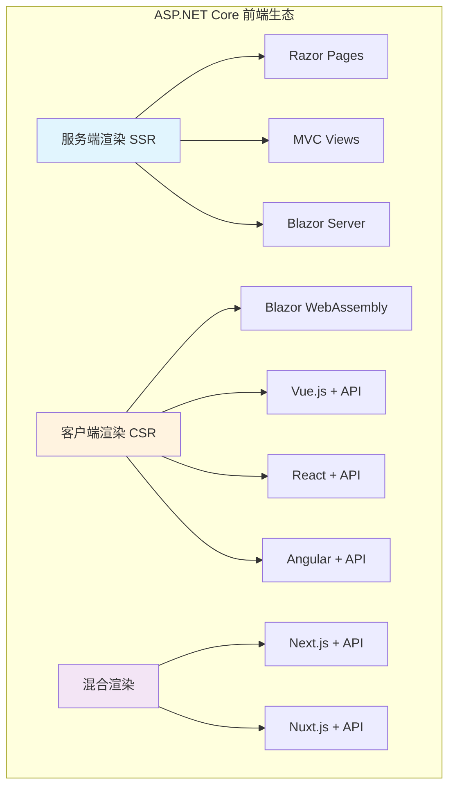
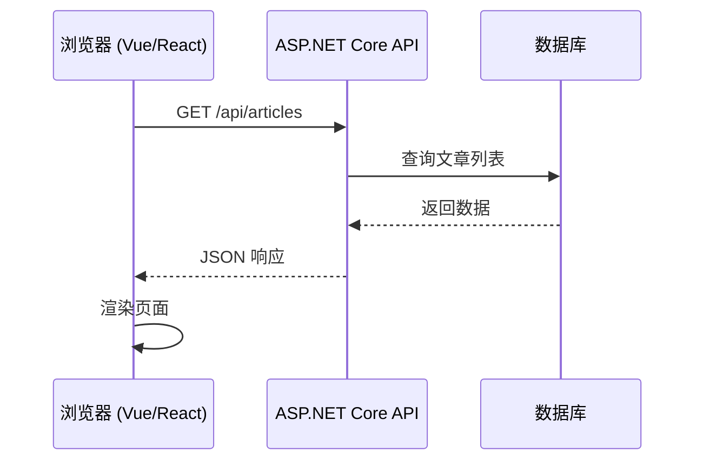
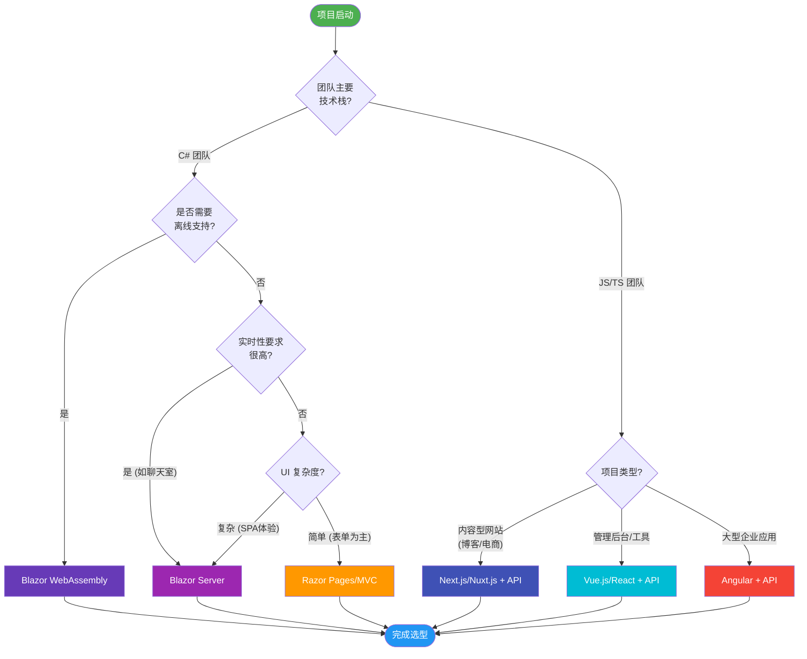
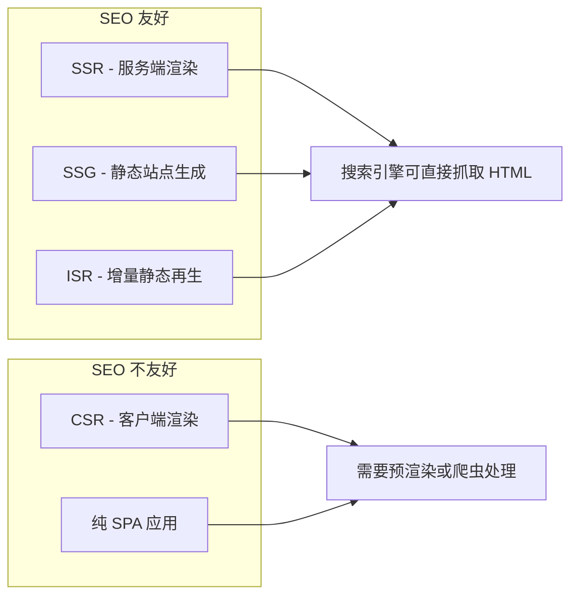
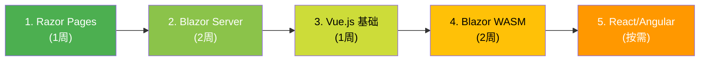

# 前端技术选型指南

> **学习时间**：约 45 分钟 | **难度**：中级 | **前置知识**：了解 ASP.NET Core 基础、HTML/CSS/JavaScript 基础
>
> **本节目标**：全面了解 ASP.NET Core 生态中的前端选项，掌握根据项目需求选择合适技术栈的方法论。

---

## 一、为什么前端选型如此重要？

在 ASP.NET Core 项目开发中，选择正确的前端技术栈是项目成功的关键因素之一。一个错误的选择可能导致：

- **开发效率低下**：团队需要花费大量时间学习不熟悉的技术
- **性能问题**：选择了不适合场景的技术导致用户体验差
- **维护成本高**：技术栈与团队能力不匹配，后期维护困难
- **SEO 问题**：对于内容型网站，错误的渲染策略可能导致搜索引擎无法索引

好消息是，ASP.NET Core 提供了丰富的前端选项，从传统的服务端渲染到现代的客户端框架，总有一款适合你的项目。

---

## 二、ASP.NET Core 前端选项全景图



### 2.1 服务端渲染（Server-Side Rendering）

#### Razor Pages / MVC Views

这是 ASP.NET Core 最传统的前端方案，使用 Razor 模板引擎在服务器端生成 HTML。

**特点**：
- HTML 在服务器端生成，浏览器直接接收完整页面
- 首屏加载快（无需等待 JS 执行）
- SEO 友好（搜索引擎可以直接抓取内容）
- 开发简单，适合 C# 团队快速上手

**适用场景**：
- 企业内部管理系统
- 内容展示型网站（博客、文档站）
- 表单密集的应用（后台管理）
- 对 SEO 有强需求的网站

```csharp
// Pages/Index.cshtml.cs (Razor Pages)
public class IndexModel : PageModel
{
    private readonly ILogger<IndexModel> _logger;

    public IndexModel(ILogger<IndexModel> logger)
    {
        _logger = logger;
    }

    public List<Article> Articles { get; set; }

    public void OnGet()
    {
        // 从数据库获取数据
        Articles = _articleService.GetLatestArticles(10);
    }
}
```

```html
<!-- Pages/Index.cshtml -->
@page
@model IndexModel
@{
    ViewData["Title"] = "首页";
}

<div class="article-list">
    @foreach (var article in Model.Articles)
    {
        <article class="card">
            <h2>@article.Title</h2>
            <p>@article.Summary</p>
            <a asp-page="/Article" asp-route-id="@article.Id">阅读更多</a>
        </article>
    }
</div>
```

#### Blazor Server

Blazor 是微软推出的革命性 Web UI 框架，允许使用 C# 和 .NET 构建交互式 Web UI。Blazor Server 采用服务端渲染模式，通过 SignalR WebSocket 连接实现实时通信。

**核心优势**：
- 使用 C# 编写前端逻辑，无需 JavaScript
- 首次加载快（只下载小的 JS 引导程序）
- 代码共享（前后端可共用 C# 代码）
- 调试方便（可以使用 Visual Studio 完整调试）

**注意事项**：
- 依赖持续的 WebSocket 连接
- 所有 UI 交互都需要网络往返
- 不适合离线应用
- 服务器资源消耗较大

### 2.2 客户端渲染（Client-Side Rendering）

#### Blazor WebAssembly (WASM)

Blazor WebAssembly 将 .NET 运行时和应用程序编译为 WebAssembly，在浏览器中直接运行 C# 代码。

**核心特点**：
- 真正的客户端运行，支持离线使用
- 接近原生应用的性能体验
- 仍然使用 C# 编写所有代码
- 首次加载较慢（需下载 .NET Runtime）

#### Vue.js / React / Angular + ASP.NET API

这是目前最流行的前后端分离架构模式，前端使用现代 JavaScript 框架构建 SPA（单页应用），后端提供 RESTful API 或 GraphQL 接口。

**架构概览**：



### 2.3 混合渲染（Hybrid Rendering）

#### Next.js / Nuxt.js

这些框架结合了 SSR 和 CSR 的优点，可以根据页面需求灵活选择渲染策略。

---

## 三、各方案详细对比

| 特性 | Razor Pages | Blazor Server | Blazor WASM | Vue.js/React + API |
|------|-------------|---------------|-------------|-------------------|
| **编程语言** | C# + Razor | C# | C# | JavaScript/TypeScript |
| **渲染方式** | SSR | SSR (差异更新) | CSR | CSR |
| **首次加载速度** | 快 | 快 | 较慢 | 中等 |
| **交互响应速度** | 需刷新页面 | 中等（依赖网络） | 快 | 快 |
| **SEO 支持** | 优秀 | 优秀 | 差（需额外处理） | 差（需 SSR） |
| **离线支持** | 不支持 | 不支持 | 支持 | 支持 (PWA) |
| **学习曲线** | 低 | 中等 | 中等 | 中等-高 |
| **包大小** | 小 | 小 | 大 (2-5MB) | 中等 |
| **调试体验** | 优秀 | 优秀 | 一般 | 优秀 |
| **社区生态** | 成熟 | 快速增长 | 快速增长 | 非常丰富 |
| **适用规模** | 小-中型 | 中-大型 | 中-大型 | 中-大型 |

---

## 四、选型决策流程图



---

## 五、关键考量维度详解

### 5.1 团队能力匹配

**C# 主导团队的优势选择**：
- **Blazor 系列**：最大程度复用现有技能，降低学习成本
- **Razor Pages**：如果团队熟悉 MVC/Razor，这是最快上手的方式

**JavaScript/TypeScript 主导团队**：
- **Vue.js**：学习曲线最平缓，中文社区活跃，适合中小型项目
- **React**：生态系统最庞大，组件化思维成熟，适合大型项目
- **Angular**：企业级框架，内置解决方案完善，但学习曲线陡峭

### 5.2 项目规模考量

| 项目规模 | 推荐方案 | 理由 |
|---------|---------|------|
| **小型项目** (< 10个页面) | Razor Pages | 开发快，部署简单，维护成本低 |
| **中型项目** (10-50个页面) | Blazor Server / Vue.js | 平衡开发效率和用户体验 |
| **大型项目** (> 50个页面) | 前后端分离架构 | 更好的代码组织和团队协作 |

### 5.3 SEO 需求分析



**SEO 关键点**：
- **必须 SEO 的场景**：电商平台、新闻网站、企业官网、博客系统
- **可选 SEO 的场景**：后台管理系统、内部工具、用户登录后的应用
- **不需要 SEO 的场景**：完全封闭的企业内网应用

### 5.4 移动端适配考虑

| 方案 | 移动端适配方式 | PWA 支持 | 备注 |
|------|--------------|----------|------|
| Razor Pages | 响应式 CSS | 需手动添加 Service Worker | 传统方案 |
| Blazor Server | 响应式 CSS | 不支持离线 | 依赖网络连接 |
| Blazor WASM | 响应式 CSS | 原生 PWA 支持 | 可打包为移动应用 |
| Vue/React + API | 响应式 CSS | 完善 PWA 生态 | 可用 Capacitor 打包 |

---

## 六、推荐学习路径

### 时间有限时的优先级排序



**快速上手建议**：
1. **第一优先级**：掌握 Razor Pages（1 周）- 这是基础，几乎所有 ASP.NET Core 项目都会用到
2. **第二优先级**：学习 Blazor Server（2 周）- 如果想用 C# 写前端
3. **第三优先级**：Vue.js 入门（1 周）- 最容易上手的现代前端框架
4. **进阶选择**：根据项目需求深入学习 Blazor WASM 或 React

---

## 七、技术趋势展望

### 7.1 AI 辅助开发对前端的影响

- **代码生成**：AI 可以快速生成组件代码、页面模板
- **智能补全**：GitHub Copilot 等工具显著提升开发效率
- **设计转代码**：Figma to Code 工具越来越成熟
- **影响**：降低了技术选型的学习成本门槛

### 7.2 边缘计算趋势

- **边缘渲染**：Cloudflare Workers、Vercel Edge Functions
- **全球分布式部署**：更快的首屏加载速度
- **Blazor 的机会**：WebAssembly 天然适合边缘计算环境
- **影响**：混合渲染策略将成为主流

### 7.3 .NET 8+ 的新特性

- **Blazor Hybrid**：桌面和移动端的统一方案 (.NET MAUI)
- **Render Modes**：同一组件可以切换 SSR/CSR/WebSocket 模式
- **增强的 Streaming Rendering**：更快的首字节时间 (TTFB)
- **AOT 编译改进**：WASM 性能大幅提升

---

## 八、DO/DON'T 清单

### DO - 推荐做法

- [x] **根据团队实际能力选型**，不要盲目追求新技术
- [x] **从项目需求出发**，明确 SEO、性能、离线等具体需求
- [x] **先做原型验证**，小范围测试后再做最终决定
- [x] **考虑长期维护成本**，选择社区活跃、文档完善的方案
- [x] **保持技术栈简洁**，避免在一个项目中混用太多前端技术
- [x] **关注 .NET 版本路线图**，新版本可能带来重大改进

### DON'T - 避免做法

- [x] **不要因为"流行"而选择**，适合自己的才是最好的
- [x] **不要忽视学习成本**，团队培训时间也是项目成本
- [x] **不要在小型项目中过度设计**，Razor Pages 往往足够
- [x] **不要忽略部署复杂性**，前后端分离意味着两套部署流程
- [x] **不要忘记性能监控**，上线后持续关注 Core Web Vitals 指标

---

## 九、实战案例：不同场景的选型建议

### 案例 1：企业内部 OA 系统

**需求特征**：
- 用户量固定（公司员工）
- 功能以表单和列表为主
- 无 SEO 需求
- 团队以 C# 开发者为主

**推荐方案**：**Blazor Server**

**理由**：
- C# 全栈开发，团队学习成本最低
- 内网环境，网络延迟可控
- SignalR 实时通知适合审批流程
- 快速迭代，适合敏捷开发

### 案例 2：电商门户网站

**需求特征**：
- 面向公众用户，流量大
- 强 SEO 需求（商品搜索排名）
- 高并发访问
- 需要良好的移动端体验

**推荐方案**：**Next.js + ASP.NET Core API**

**理由**：
- Next.js 提供 SSG/ISR 能力，SEO 最佳
- 前后端分离，独立扩展
- 丰富的电商组件生态
- 可以利用 CDN 加速静态资源

### 案例 3：数据可视化大屏

**需求特征**：
- 实时数据展示
- 复杂的图表交互
- 内部使用，用户量少
- 数据来源多样

**推荐方案**：**Vue.js + ECharts + ASP.NET Core API**

**理由**：
- Vue.js 与 ECharts 结合良好
- 组件化开发，便于维护各种图表
- SignalR 推送实时数据
- 前后端职责清晰

---

## 十、练习题

### 练习 1：基础理解题

**题目**：以下哪种前端方案最适合需要离线工作的内部工具应用？

A. Razor Pages
B. Blazor Server
C. Blazor WebAssembly
D. 以上都可以

**答案及解析**：
**答案：C**

解析：只有 Blazor WebAssembly 支持真正的离线运行，因为它将 .NET 运行时编译为 WebAssembly 并在浏览器中本地执行。Razor Pages 和 Blazor Server 都需要服务器端持续参与，无法离线工作。

---

### 练习 2：场景分析题

**题目**：你的团队要开发一个新闻发布网站，要求搜索引擎能良好收录文章内容，同时编辑人员需要一个功能完善的后台管理系统。你会如何选择技术栈？

**参考答案**：

**推荐方案组合**：
1. **前台（面向读者）**：Next.js + ASP.NET Core API
   - 使用 ISR（增量静态再生）生成文章页面
   - 保证 SEO 友好，搜索引擎可以抓取完整内容
   - 利用 CDN 分发，提升全球访问速度

2. **后台（编辑管理）**：Blazor Server 或 Vue.js
   - 编辑后台不需要 SEO
   - 使用 Blazor Server 可以 C# 全栈开发
   - 或者使用 Vue.js 获得更流畅的单页应用体验

3. **后端统一**：ASP.NET Core Web API
   - 提供统一的 RESTful 接口
   - JWT 认证保护后台接口
   - 前台接口可公开访问

这种"前台 SSR + 后台 SPA"的混合架构在实际项目中非常常见，兼顾了 SEO 需求和用户体验。

---

### 练习 3：对比分析题

**题目**：请从以下维度对比 Blazor Server 和 Vue.js + ASP.NET API 方案：开发效率、首屏性能、交互体验、团队技能要求、部署复杂度。

**参考答案**：

| 维度 | Blazor Server | Vue.js + ASP.NET API |
|------|---------------|---------------------|
| **开发效率** | 高（单一语言） | 中（需要掌握两种技术栈） |
| **首屏性能** | 高（SSR） | 中（需等待 JS 加载执行） |
| **交互体验** | 中（依赖网络延迟） | 高（本地状态管理） |
| **团队技能** | 需要 C# 技能 | 需要 C# + JavaScript 技能 |
| **部署复杂度** | 低（单一部署单元） | 高（前后端分别部署） |
| **适用场景** | 企业内网、实时应用 | 公网应用、复杂 SPA |

**结论**：如果是 C# 主导的团队且以内网应用为主，Blazor Server 是更好的选择；如果是面向公网的复杂应用或团队有前端专才，Vue.js 方案更具优势。

---

### 练习 4：决策题

**题目**：一个初创公司计划开发一款 SaaS 产品，团队目前只有 2 名全栈开发者（都熟悉 C#），产品需要支持多租户、有仪表盘和数据报表功能，未来可能需要移动端访问。请给出你的选型建议并说明理由。

**参考答案**：

**推荐方案：Blazor Server（初期）→ Blazor Hybrid（移动端）**

**理由**：

1. **当前阶段（MVP）**：选择 Blazor Server
   - 2 名开发者都用 C#，无学习成本
   - 快速验证产品想法，缩短上市时间
   - SaaS 初期用户量不大，服务器压力可控
   - 仪表盘和报表功能 Blazor 组件生态完善

2. **发展阶段**：考虑迁移到 Blazor WebAssembly
   - 当用户量增长，减少服务器负载
   - 支持离线查看报表
   - 为移动端做准备

3. **移动端阶段**：采用 Blazor Hybrid (.NET MAUI)
   - 共享大部分业务逻辑代码
   - 一次编写，多平台运行
   - 保持一致的开发体验

**备选方案**：如果产品 UI 要求非常高，可以考虑 Vue.js + ASP.NET API，但需要投入时间学习前端技术。

---

### 练习题 5：开放思考题

**题目**：随着 AI 编程助手（如 GitHub Copilot、Cursor）的普及，你认为这对前端技术选型会产生什么影响？未来的前端开发趋势会如何变化？

**参考思路**（开放性问题，以下为讨论方向）：

1. **学习成本降低**：AI 可以帮助快速生成各框架的样板代码，降低了技术栈的学习门槛
2. **选型更加务实**：不再因为"不会"而排除某个方案，而是真正基于需求选择
3. **代码质量标准化**：AI 生成的代码往往遵循最佳实践，减少了因技术不熟练导致的问题
4. **可能的影响**：
   - 框架之间的差距缩小（AI 都能很好支持）
   - 生态系统和长期维护变得更加重要
   - 团队可能同时掌握多种技术栈
5. **不变的原则**：
   - 业务需求仍然是第一位的
   - 性能和用户体验不能妥协
   - 安全性要求不会降低

---

## 十一、延伸阅读

### 官方文档

- [Blazor 文档](https://docs.microsoft.com/aspnet/core/blazor/) - 微软官方 Blazor 完整指南
- [Razor Pages 文档](https://docs.microsoft.com/aspnet/core/razor-pages/) - Razor Pages 详细教程
- [ASP.NET Core 前端开发选项](https://docs.microsoft.com/aspnet/core/client-side/) - 前端开发综合指南

### 技术博客

- [Blazor 学习之路](https://github.com/dotnetchina/blazor-tutorial) - 中文 Blazor 教程集合
- [Vue.js 官方中文文档](https://cn.vuejs.org/) - Vue.js 中文学习资源
- [现代前端架构比较](https://frontendmasters.com/guides/frontend-architecture/) - 前端架构深度对比

### 视频教程

- [Microsoft Learn - Blazor 视频](https://learn.microsoft.com/training/modules/path-blazor/) - 微软官方 Blazor 视频课程
- [Vue Mastery](https://www.vuemastery.com/) - Vue.js 付费视频课程（质量很高）

### 工具和资源

- [ASP.NET Core 项目模板](https://dotnetnew.azurewebsites.net/) - 查找所有可用的项目模板
- [Blazor Awesome](https://github.com/AdrienTorris/awesome-blazor) - Blazor 组件和资源合集
- [Awesome Vue](https://github.com/vuejs/awesome-vue) - Vue.js 生态资源汇总

---

## 总结

前端技术选型没有银弹，关键是要**基于项目实际情况做出合理决策**。记住以下几点：

1. **团队优先**：选择团队熟悉或有能力快速掌握的技术
2. **需求驱动**：明确 SEO、性能、离线、移动端等具体需求
3. **渐进式演进**：可以从简单的方案开始，逐步升级
4. **长期视角**：考虑技术的生命周期和维护成本
5. **保持学习**：前端技术发展迅速，持续关注新趋势

在下一节中，我们将深入学习 **Blazor Server** 的具体实现，包括项目结构、组件开发、事件处理等实战内容。
