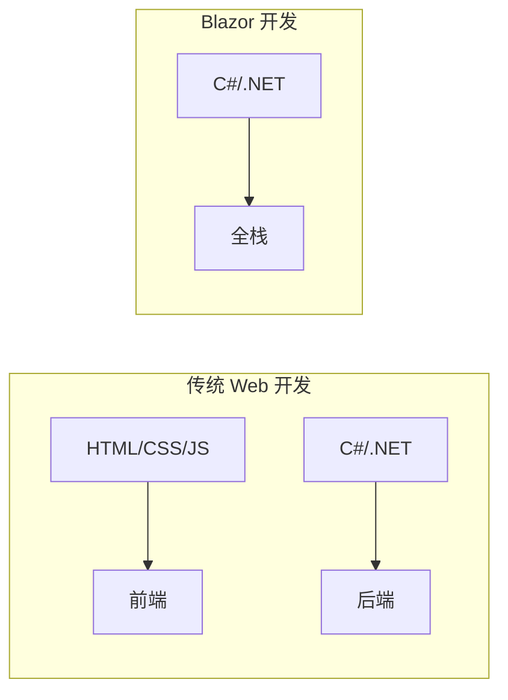
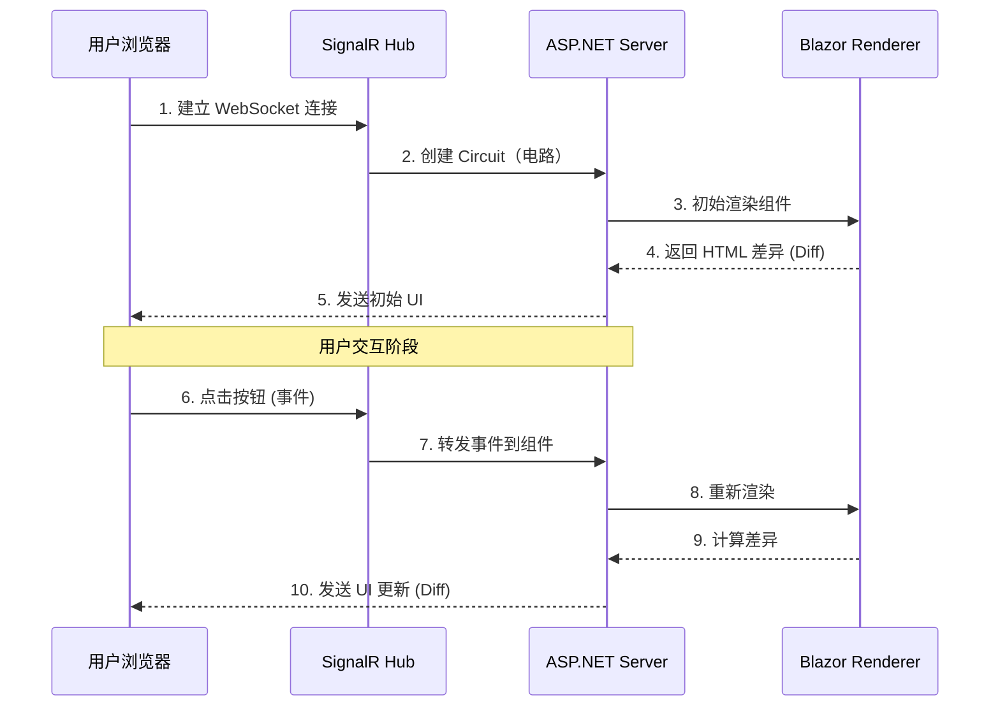
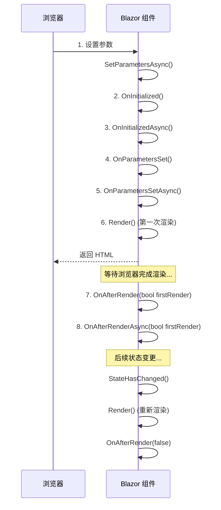

# Blazor Server 入门教程

> **学习时间**：约 60 分钟 | **难度**：中级 | **前置知识**：C# 基础、ASP.NET Core 基础、HTML/CSS 基础
>
> **本节目标**：掌握 Blazor Server 的核心概念，能够独立开发完整的 Blazor Server 应用程序。

---

## 一、Blazor 是什么？

### 1.1 革命性的 Web UI 框架

Blazor 是微软在 .NET Core 3.0 中推出的**革命性 Web UI 框架**，它允许开发者使用 **C# 和 .NET** 来构建交互式的客户端 Web UI。是的，你没听错——**用 C# 写前端！**



### 1.2 Blazor 的三种托管模型

| 托管模型 | 运行位置 | 连接方式 | 首次加载 |
|---------|---------|---------|---------|
| **Blazor Server** | 服务器端 | SignalR WebSocket | 快 (~50KB) |
| **Blazor WebAssembly** | 浏览器内 | 无需连接 | 较慢 (2-5MB) |
| **Blazor Hybrid** | 本地桌面/移动 | 本地进程 | 快 |

**本节重点讲解 Blazor Server**，它是最容易上手的模式。

---

## 二、Blazor Server 工作原理

### 2.1 架构概览



### 2.2 核心概念解释

**Circuit（电路）**：
- 每个 Blazor Server 会话对应一个 Circuit
- Circuit 维护组件的状态和生命周期
- 通过 SignalR 保持持久连接

**Render Tree（渲染树）**：
- Blazor 维持一个虚拟 DOM 的等价物
- 当状态变化时，计算新旧树的差异
- 只将变化部分发送给浏览器

**Diffing 算法**：
- 类似 React 的 Virtual DOM diff
- 高效地最小化网络传输
- 使用户界面更新流畅

### 2.3 Blazor Server vs Blazor WebAssembly

| 特性 | Blazor Server | Blazor WebAssembly |
|------|---------------|-------------------|
| **代码执行位置** | 服务器 | 浏览器 |
| **网络依赖** | 持续连接 | 仅首次加载和 API 调用 |
| **首屏加载** | 快 (< 100ms) | 慢 (2-10s) |
| **离线支持** | 不支持 | 支持 |
| **服务器资源** | 高（每个连接占用内存） | 低 |
| **调试体验** | 优秀（VS 完整调试） | 一般 |
| **UI 延迟** | 取决于网络延迟 | 几乎无延迟 |
| **适用场景** | 内网应用、实时协作 | 公网应用、离线工具 |

---

## 三、创建第一个 Blazor Server 应用

### 3.1 环境准备

确保已安装以下工具：

```bash
# 检查 .NET SDK 版本（需要 .NET 8.0 或更高）
dotnet --version

# 如果未安装，从 https://dotnet.microsoft.com/download 下载
```

### 3.2 创建项目

```bash
# 创建新的 Blazor Server 项目
dotnet new blazorserver -n MyFirstBlazorApp

# 进入项目目录
cd MyFirstBlazorApp

# 运行项目
dotnet run
```

运行成功后，访问 `https://localhost:5001`（或 `http://localhost:5000`）即可看到默认的 Blazor 应用。

### 3.3 项目结构解析

```
MyFirstBlazorApp/
├── Pages/                    # Razor 组件页面
│   ├── _Host.cshtml         # 主机页面（应用的入口点）
│   ├── _Layout.cshtml       # 布局组件
│   ├── Error.cshtml         # 错误处理页面
│   ├── Counter.razor        # 计数器示例
│   └── FetchData.razor      # 数据获取示例
├── Shared/                   # 共享组件
│   ├── MainLayout.razor     # 主布局
│   ├── NavMenu.razor        # 导航菜单
│   └── SurveyPrompt.razor   # 调查提示组件
├── wwwroot/                  # 静态资源文件
│   ├── css/
│   │   └── app.css          # 应用样式
│   └── js/
│       └── app.js           # JavaScript 文件
├── Data/                     # 数据服务
│   └── WeatherForecast.cs   # 天气数据模型
├── _Imports.razor            # 全局 using 导入
├── App.razor                 # 根组件（路由配置）
├── Program.cs                # 应用程序入口点和配置
└── MyFirstBlazorApp.csproj  # 项目文件
```

### 3.4 关键文件详解

#### Program.cs - 应用入口

```csharp
using Microsoft.AspNetCore.Components;
using Microsoft.AspNetCore.Components.Web;
using MyFirstBlazorApp.Data;

var builder = WebApplication.CreateBuilder(args);

// 添加 Razor 组件服务
builder.Services.AddRazorPages();
builder.Services.AddServerSideBlazor();
builder.Services.AddSingleton<WeatherForecastService>();

var app = builder.Build();

// 配置 HTTP 请求管道
if (!app.Environment.IsDevelopment())
{
    app.UseExceptionHandler("/Error");
}

app.UseStaticFiles();                    // 静态文件中间件
app.UseRouting();                        // 路由中间件
app.MapBlazorHub();                      // SignalR Hub 端点
app.MapFallbackToPage("/_Host");         // 回退到主机页面

app.Run();
```

#### App.razor - 根组件和路由

```html
<Router AppAssembly="@typeof(Program).Assembly">
    <Found Context="routeData">
        <RouteView RouteData="@routeData" DefaultLayout="@typeof(MainLayout)" />
        <FocusOnNavigate RouteData="@routeData" Selector="h1" />
    </Found>
    <NotFound>
        <PageTitle>Not found</PageTitle>
        <LayoutView Layout="@typeof(MainLayout)">
            <p role="alert">Sorry, there's nothing at this address.</p>
        </LayoutView>
    </NotFound>
</Router>
```

#### _Host.cshtml - 主机页面

```html
@page "/"
@using Microsoft.AspNetCore.Components.Web
@addTagHelper *, Microsoft.AspNetCore.Components.Server

<!DOCTYPE html>
<html lang="en">
<head>
    <meta charset="utf-8" />
    <meta name="viewport" content="width=device-width, initial-scale=1.0" />
    <base href="~/" />
    <link rel="stylesheet" href="css/bootstrap/bootstrap.min.css" />
    <link rel="stylesheet" href="css/app.css" />
    <component type="typeof(HeadOutlet)" render-mode="ServerPrerendered" />
</head>
<body>
    <!-- 这是 Blazor 应用的挂载点 -->
    <component type="typeof(App)" render-mode="ServerPrerendered" />

    <!-- Blazor Server 脚本（建立 SignalR 连接） -->
    <script src="_framework/blazor.server.js"></script>
</body>
</html>
```

#### _Imports.razor - 全局导入

```csharp
@using System.Net.Http
@using System.Net.Http.Json
@using Microsoft.AspNetCore.Components.Forms
@using Microsoft.AspNetCore.Components.Routing
@using Microsoft.AspNetCore.Components.Web
@using Microsoft.AspNetCore.Components.Web.Virtualization
@using Microsoft.AspNetCore.Components.WebAssembly.Http
@using MyFirstBlazorApp
@using MyFirstBlazorApp.Shared
```

---

## 四、Razor 组件基础

### 4.1 什么是 .razor 文件？

`.razor` 文件是 Blazor 的核心，它结合了 HTML 和 C#，让你可以在标记中直接使用 C# 代码。

#### 基本语法示例

```html
@* 这是一个注释 *@

@page "/hello"

<h3>Hello World 示例</h3>

<p>当前时间: @DateTime.Now.ToString("HH:mm:ss")</p>

@if (showMessage)
{
    <p class="alert alert-info">这是一条动态消息！</p>
}

@code {
    private bool showMessage = true;
}
```

### 4.2 @code 指令块

`@code` 块用于定义组件的 C# 成员（字段、属性、方法等）：

```html
@page "/counter"

<PageTitle>Counter</PageTitle>

<h1>Counter</h1>

<p role="status">Current count: @currentCount</p>

<button class="btn btn-primary" @onclick="IncrementCount">Click me</button>

@code {
    private int currentCount = 0;

    [Parameter]
    public int IncrementAmount { get; set; } = 1;

    private void IncrementCount()
    {
        currentCount += IncrementAmount;
    }
}
```

### 4.3 参数和属性

**组件参数**使用 `[Parameter]` 特性定义：

```html
<!-- ButtonComponent.razor -->
<button class="btn @ButtonClass" @onclick="OnClick">
    @ChildContent
</button>

@code {
    [Parameter]
    public string? ButtonClass { get; set; } = "btn-primary";

    [Parameter]
    public EventCallback OnClick { get; set; }

    [Parameter]
    public RenderFragment? ChildContent { get; set; }
}
```

**使用组件**：

```html
<ButtonComponent ButtonClass="btn-success" OnClick="HandleClick">
    点击我！
</ButtonComponent>
```

---

## 五、数据绑定

### 5.1 单向绑定

使用 `@value` 将数据从组件显示到 UI：

```html
<input value="@username" />

<p>你输入的是: @username</p>

@code {
    private string username = "";
}
```

### 5.2 双向绑定

使用 `@bind` 实现 UI 和数据的双向同步：

```html
@page "/binding"

<div class="mb-3">
    <label>用户名:</label>
    <input @bind="username" @bind:event="oninput" class="form-control" />
</div>

<div class="mb-3">
    <label>选择角色:</label>
    <select @bind="selectedRole" class="form-select">
        <option value="">请选择...</option>
        <option value="admin">管理员</option>
        <option value="user">普通用户</option>
        <option value="guest">访客</option>
    </select>
</div>

<div class="mb-3">
    <div class="form-check">
        <input class="form-check-input" type="checkbox" @bind="isActive" id="activeCheck" />
        <label class="form-check-label" for="activeCheck">
            启用账户
        </label>
    </div>
</div>

<div class="card">
    <div class="card-body">
        <h5>绑定结果:</h5>
        <ul>
            <li>用户名: @username</li>
            <li>角色: @selectedRole</li>
            <li>状态: @(isActive ? "启用" : "禁用")</li>
        </ul>
    </div>
</div>

@code {
    private string username = "";
    private string selectedRole = "";
    private bool isActive = false;
}
```

### 5.3 绑定格式化

```html
<input type="date" @bind="birthDate" @bind:format="yyyy-MM-dd" />

<input type="number" @bind="price" @bind:format="N2" />

<input @bind="searchText" @bind:event="oninput" />
<!-- oninput: 每次输入都更新（默认是 onchange 失去焦点时更新） -->

@code {
    private DateTime birthDate = DateTime.Today;
    private decimal price = 0;
    private string searchText = "";
}
```

---

## 六、事件处理

### 6.1 基础事件处理

```html
<button @onclick="HandleClick">点击事件</button>
<input @onchange="HandleChange" />
<input @oninput="HandleInput" />
<form @onsubmit="handleSubmit">

@code {
    private void HandleClick()
    {
        Console.WriteLine("按钮被点击了！");
    }

    private void HandleChange(ChangeEventArgs e)
    {
        // onchange: 失去焦点时触发
        var value = e.Value?.ToString();
    }

    private void HandleInput(ChangeEventArgs e)
    {
        // oninput: 每次输入都触发
        var value = e.Value?.ToString();
    }

    private async Task handleSubmit()
    {
        // 异步提交表单
        await SaveDataAsync();
    }
}
```

### 6.2 事件参数

```html
<button @onclick="HandleClickWithArgs">带参数的点击</button>
<div @onmouseover="HandleMouseOver" @onmouseout="HandleMouseOut"
     style="padding: 20px; background: #f0f0f0;">
    鼠标悬停区域
</div>

@code {
    private void HandleClickWithArgs(MouseEventArgs e)
    {
        Console.WriteLine($"点击位置: X={e.ClientX}, Y={e.ClientY}");
        Console.WriteLine($"按键: {e.Button}"); // 0=左键, 1=中键, 2=右键
        Console.WriteLine($"是否按住 Ctrl: {e.CtrlKey}");
        Console.WriteLine($"是否按住 Shift: {e.ShiftKey}");
    }

    private void HandleMouseOver()
    {
        Console.WriteLine("鼠标进入区域");
    }

    private void HandleMouseOut()
    {
        Console.WriteLine("鼠标离开区域");
    }
}
```

### 6.3 Lambda 表达式传参

```html
@foreach (var item in items)
{
    <button @onclick="() => DeleteItem(item.Id)">删除 @item.Name</button>
}

@code {
    private List<TodoItem> items = new();

    private void DeleteItem(int id)
    {
        items.RemoveAll(x => x.Id == id);
    }
}
```

---

## 七、条件渲染和循环渲染

### 7.1 条件渲染

```html
@if (isLoading)
{
    <div class="spinner-border text-primary" role="status">
        <span class="visually-hidden">Loading...</span>
    </div>
}
else if (hasError)
{
    <div class="alert alert-danger">
        加载失败: @errorMessage
    </div>
}
else if (items.Count == 0)
{
    <div class="text-center text-muted mt-5">
        <i class="bi bi-inbox fs-1"></i>
        <p>暂无数据</p>
    </div>
}
else
{
    <table class="table">
        <thead>
            <tr>
                <th>ID</th>
                <th>名称</th>
                <th>操作</th>
            </tr>
        </thead>
        <tbody>
            @foreach (var item in items)
            {
                <tr>
                    <td>@item.Id</td>
                    <td>@item.Name</td>
                    <td>
                        <button class="btn btn-sm btn-warning">编辑</button>
                        <button class="btn btn-sm btn-danger">删除</button>
                    </td>
                </tr>
            }
        </tbody>
    </table>
}
```

### 7.2 循环渲染与 key

```html
@foreach (var user in users)
{
    <div key="@user.Id" class="card mb-2">
        <div class="card-body">
            <h5>@user.Name</h5>
            <p>@user.Email</p>
        </div>
    </div>
}

@code {
    private List<User> users = new()
    {
        new() { Id = 1, Name = "张三", Email = "zhangsan@example.com" },
        new() { Id = 2, Name = "李四", Email = "lisi@example.com" },
        new() { Id = 3, Name = "王五", Email = "wangwu@example.com" }
    };

    public class User
    {
        public int Id { get; set; }
        public string Name { get; set; } = "";
        public string Email { get; set; } = "";
    }
}
```

---

## 八、组件生命周期

### 8.1 生命周期方法顺序



### 8.2 生命周期方法详解

```html
@page "/lifecycle-demo"

<h3>组件生命周期演示</h3>

<div class="card">
    <div class="card-body">
        <h6>生命周期日志：</h6>
        <ul>
            @foreach (var log in lifecycleLogs)
            {
                <li>@log</li>
            }
        </ul>
    </div>
</div>

<button class="btn btn-primary mt-3" @onclick="TriggerRerender">
    触发重新渲染
</button>

@code {
    private List<string> lifecycleLogs = new();
    private int renderCount = 0;

    [Parameter]
    public int UserId { get; set; }

    // 同步初始化（适合简单逻辑）
    protected override void OnInitialized()
    {
        AddLog("1. OnInitialized() - 同步初始化");
    }

    // 异步初始化（适合调用 API 获取数据）
    protected override async Task OnInitializedAsync()
    {
        AddLog("2. OnInitializedAsync() - 异步初始化");

        // 模拟异步加载数据
        await Task.Delay(100);
        AddLog("   -> 数据加载完成");
    }

    // 参数设置后调用（当父组件传入的新参数时）
    protected override void OnParametersSet()
    {
        AddLog($"3. OnParametersSet() - UserId = {UserId}");
    }

    protected override async Task OnParametersSetAsync()
    {
        AddLog("4. OnParametersSetAsync() - 可以根据参数重新加载数据");
    }

    // 渲染完成后调用（可以安全地操作 DOM）
    protected override void OnAfterRender(bool firstRender)
    {
        renderCount++;
        AddLog($"5. OnAfterRender(firstRender: {firstRender}) - 第{renderCount}次渲染");
    }

    protected override async Task OnAfterRenderAsync(bool firstRender)
    {
        AddLog($"6. OnAfterRenderAsync(firstRender: {firstRender})");

        if (firstRender)
        {
            // 首次渲染完成后执行的操作
            // 例如：初始化 JavaScript 库
            await JSRuntime.InvokeVoidAsync("console.log", "首次渲染完成！");
        }
    }

    // 注入 JS Runtime（稍后会详细讲解）
    [Inject]
    private IJSRuntime JSRuntime { get; set; } = null!;

    private void AddLog(string message)
    {
        lifecycleLogs.Add($"{DateTime.Now:HH:mm:ss.fff} - {message}");
    }

    private void TriggerRerender()
    {
        lifecycleLogs.Clear();
        AddLog("手动触发 StateHasChanged()");
    }
}
```

### 8.3 生命周期最佳实践

| 方法 | 适用场景 | 注意事项 |
|------|---------|---------|
| `OnInitializedAsync` | 初始化数据加载 | 不要在这里调用 `StateHasChanged()` |
| `OnParametersSetAsync` | 响应参数变化 | 可能被多次调用 |
| `OnAfterRenderAsync` | JS 互操作 | 检查 `firstRender` 避免重复初始化 |

---

## 九、布局组件

### 9.1 创建布局

```html
<!-- Shared/MainLayout.razor -->
@inherits LayoutComponentBase

<div class="sidebar">
    <NavMenu />
</div>

<main>
    @Body
</main>

@code {
    // 布局组件必须继承 LayoutComponentBase
    // @Body 表示子页面内容将被插入的位置
}
```

### 9.2 使用布局

```html
@layout MainLayout
@page "/dashboard"

<h2>仪表盘</h2>
<p>这个页面会自动使用 MainLayout 布局。</p>
```

或者在 `_Imports.razor` 中全局设置默认布局：

```csharp
@layout MainLayout
```

### 9.3 嵌套布局

```html
<!-- Shared/AdminLayout.razor -->
@layout MainLayout  <!-- 继承主布局 -->

<div class="admin-sidebar">
    <AdminMenu />
</div>

<div class="admin-content">
    @Body
</div>
```

---

## 十、依赖注入服务

### 10.1 注册服务

在 `Program.cs` 中注册服务：

```csharp
// 作用域服务（每个用户请求一个实例）
builder.Services.AddScoped<ITodoService, TodoService>();

// 单例服务（整个应用共享一个实例）
builder.Services.AddSingleton<IWeatherService, WeatherService>();

// 临时服务（每次注入都创建新实例）
builder.Services.AddTransient<ILoggerFactory, LoggerFactory>();
```

### 10.2 在组件中注入服务

```html
@page "/services-demo"
@inject ITodoService TodoService
@inject IWeatherService WeatherService
@inject NavigationManager NavManager

<h3>服务注入演示</h3>

<button @onclick="LoadTodos">加载待办事项</button>

@if (todos != null)
{
    <ul>
        @foreach (var todo in todos)
        {
            <li>@todo.Title - @(todo.IsCompleted ? "已完成" : "进行中")</li>
        </ul>
    }
}

@code {
    private List<TodoItem>? todos;

    private async Task LoadTodos()
    {
        todos = await TodoService.GetAllAsync();
    }
}
```

### 10.3 服务接口实现示例

```csharp
// Services/ITodoService.cs
public interface ITodoService
{
    Task<List<TodoItem>> GetAllAsync();
    Task<TodoItem?> GetByIdAsync(int id);
    Task<TodoItem> CreateAsync(TodoItem todo);
    Task UpdateAsync(TodoItem todo);
    Task DeleteAsync(int id);
}

// Services/TodoService.cs
public class TodoService : ITodoService
{
    // 模拟数据库存储
    private static List<TodoItem> _todos = new();
    private static int _nextId = 1;

    public Task<List<TodoItem>> GetAllAsync()
    {
        return Task.FromResult(_todos.ToList());
    }

    public Task<TodoItem?> GetByIdAsync(int id)
    {
        return Task.FromResult(_todos.FirstOrDefault(t => t.Id == id));
    }

    public Task<TodoItem> CreateAsync(TodoItem todo)
    {
        todo.Id = _nextId++;
        todo.CreatedAt = DateTime.Now;
        _todos.Add(todo);
        return Task.FromResult(todo);
    }

    public Task UpdateAsync(TodoItem todo)
    {
        var existing = _todos.FirstOrDefault(t => t.Id == todo.Id);
        if (existing != null)
        {
            existing.Title = todo.Title;
            existing.IsCompleted = todo.IsCompleted;
        }
        return Task.CompletedTask;
    }

    public Task DeleteAsync(int id)
    {
        _todos.RemoveAll(t => t.Id == id);
        return Task.CompletedTask;
    }
}
```

---

## 十一、完整实战：Todo List 应用

### 11.1 功能需求

- 显示待办事项列表
- 添加新的待办事项
- 标记完成/取消完成
- 删除待办事项
- 统计完成进度

### 11.2 数据模型

```csharp
// Models/TodoItem.cs
public class TodoItem
{
    public int Id { get; set; }
    public string Title { get; set; } = "";
    public bool IsCompleted { get; set; }
    public DateTime CreatedAt { get; set; }
    public Priority Level { get; set; } = Priority.Medium;
}

public enum Priority
{
    Low,
    Medium,
    High
}
```

### 11.3 完整组件实现

```html
@page "/todo"
@inject ITodoService TodoService
@inject IJSRuntime JSRuntime

<PageTitle>Todo List - 待办事项管理</PageTitle>

<div class="container mt-4">
    <div class="row">
        <div class="col-md-8 mx-auto">
            <!-- 进度统计卡片 -->
            <div class="card mb-4">
                <div class="card-header bg-primary text-white">
                    <h4 class="mb-0">
                        <i class="bi bi-check2-square"></i> 待办事项管理
                    </h4>
                </div>
                <div class="card-body">
                    <div class="row text-center">
                        <div class="col">
                            <h2 class="text-primary">@totalCount</h2>
                            <small class="text-muted">总计</small>
                        </div>
                        <div class="col">
                            <h2 class="text-success">@completedCount</h2>
                            <small class="text-muted">已完成</small>
                        </div>
                        <div class="col">
                            <h2 class="text-warning">@pendingCount</h2>
                            <small class="text-muted">进行中</small>
                        </div>
                        <div class="col">
                            <h2>@completionRate%</h2>
                            <small class="text-muted">完成率</small>
                        </div>
                    </div>

                    <!-- 进度条 -->
                    <div class="progress mt-3" style="height: 10px;">
                        <div class="progress-bar bg-success"
                             role="progressbar"
                             style="width: @completionRate%">
                        </div>
                    </div>
                </div>
            </div>

            <!-- 添加表单 -->
            <div class="card mb-4">
                <div class="card-body">
                    <form @onsubmit="AddTodo" class="row g-3">
                        <div class="col-md-6">
                            <input type="text"
                                   class="form-control"
                                   placeholder="输入新的待办事项..."
                                   @bind="newTodoTitle"
                                   required />
                        </div>
                        <div class="col-md-3">
                            <select class="form-select" @bind="newTodoPriority">
                                <option value="@((int)Priority.Low)">低优先级</option>
                                <option value="@((int)Priority.Medium)">中优先级</option>
                                <option value="@((int)Priority.High)">高优先级</option>
                            </select>
                        </div>
                        <div class="col-md-3">
                            <button type="submit" class="btn btn-primary w-100">
                                <i class="bi bi-plus-lg"></i> 添加
                            </button>
                        </div>
                    </form>
                </div>
            </div>

            <!-- 过滤器 -->
            <div class="d-flex justify-content-between align-items-center mb-3">
                <div class="btn-group">
                    <button class="btn @(currentFilter == "all" ? "btn-primary" : "btn-outline-primary')"
                            @onclick="() => currentFilter = 'all'">
                        全部 (@totalCount)
                    </button>
                    <button class="btn @(currentFilter == "active" ? "btn-primary" : "btn-outline-primary')"
                            @onclick="() => currentFilter = 'active'">
                        进行中 (@pendingCount)
                    </button>
                    <button class="btn @(currentFilter == "completed" ? "btn-primary" : "btn-outline-primary')"
                            @onclick="() => currentFilter = 'completed'">
                        已完成 (@completedCount)
                    </button>
                </div>

                <button class="btn btn-outline-danger btn-sm"
                        @onclick="ClearCompleted"
                        disabled="@(!hasCompleted)">
                    清除已完成
                </button>
            </div>

            <!-- 待办列表 -->
            @if (filteredTodos.Count == 0)
            {
                <div class="text-center text-muted py-5">
                    <i class="bi bi-clipboard-x fs-1"></i>
                    <p class="mt-2">@emptyMessage</p>
                </div>
            }
            else
            {
                <div class="list-group">
                    @foreach (var todo in filteredTodos)
                    {
                        <div class="list-group-item @(todo.IsCompleted ? "list-group-item-light" : "")">
                            <div class="d-flex align-items-center">
                                <input type="checkbox"
                                       class="form-check-input me-3"
                                       checked="@todo.IsCompleted"
                                       @onchange="() => ToggleComplete(todo)" />

                                <div class="flex-grow-1">
                                    <span class="@(todo.IsCompleted ? "text-decoration-line-through text-muted" : "")">
                                        @todo.Title
                                    </span>
                                    <br />
                                    <small class="text-muted">
                                        <span class="badge @(GetPriorityBadgeClass(todo.Level))">
                                            @todo.Level.ToString()
                                        </span>
                                        @todo.CreatedAt.ToString("MM-dd HH:mm")
                                    </small>
                                </div>

                                <button class="btn btn-sm btn-outline-danger"
                                        @onclick="() => DeleteTodo(todo)"
                                        title="删除">
                                    <i class="bi bi-trash"></i>
                                </button>
                            </div>
                        </div>
                    }
                </div>
            }
        </div>
    </div>
</div>

@code {
    private List<TodoItem> todos = new();
    private string newTodoTitle = "";
    private Priority newTodoPriority = Priority.Medium;
    private string currentFilter = "all";
    private bool isLoading = true;

    // 计算属性
    private int totalCount => todos.Count;
    private int completedCount => todos.Count(t => t.IsCompleted);
    private int pendingCount => totalCount - completedCount;
    private double completionRate => totalCount > 0 ? Math.Round((double)completedCount / totalCount * 100, 1) : 0;
    private bool hasCompleted => completedCount > 0;

    private List<TodoItem> filteredTodos => currentFilter switch
    {
        "active" => todos.Where(t => !t.IsCompleted).ToList(),
        "completed" => todos.Where(t => t.IsCompleted).ToList(),
        _ => todos
    };

    private string emptyMessage => currentFilter switch
    {
        "active" => "没有进行中的任务",
        "completed" => "没有已完成的任务",
        _ => "还没有待办事项，添加一个吧！"
    };

    protected override async Task OnInitializedAsync()
    {
        // 加载数据
        todos = await TodoService.GetAllAsync();
        isLoading = false;
    }

    private async Task AddTodo()
    {
        if (string.IsNullOrWhiteSpace(newTodoTitle))
            return;

        var todo = new TodoItem
        {
            Title = newTodoTitle.Trim(),
            Level = newTodoPriority
        };

        await TodoService.CreateAsync(todo);
        todos.Add(todo);

        // 重置表单
        newTodoTitle = "";
        newTodoPriority = Priority.Medium;

        await ShowToastAsync("添加成功！", "success");
    }

    private async Task ToggleComplete(TodoItem todo)
    {
        todo.IsCompleted = !todo.IsCompleted;
        await TodoService.UpdateAsync(todo);
    }

    private async Task DeleteTodo(TodoItem todo)
    {
        // 确认对话框
        var confirmed = await JSRuntime.InvokeAsync<bool>("confirm",
            $"确定要删除 \"{todo.Title}\" 吗？");

        if (confirmed)
        {
            await TodoService.DeleteAsync(todo.Id);
            todos.Remove(todo);
            await ShowToastAsync("已删除", "warning");
        }
    }

    private async Task ClearCompleted()
    {
        var completedIds = todos.Where(t => t.IsCompleted).Select(t => t.Id).ToList();
        foreach (var id in completedIds)
        {
            await TodoService.DeleteAsync(id);
        }
        todos.RemoveAll(t => t.IsCompleted);
        await ShowToastAsync($"已清除 {completedIds.Count} 个已完成项", "info");
    }

    private string GetPriorityBadgeClass(Priority priority) => priority switch
    {
        Priority.Low => "bg-secondary",
        Priority.Medium => "bg-warning text-dark",
        Priority.High => "bg-danger",
        _ => "bg-secondary"
    };

    private async Task ShowToastAsync(string message, string type)
    {
        await JSRuntime.InvokeVoidAsync("showToast", message, type);
    }
}
```

### 11.4 添加 JavaScript 支持函数

在 `wwwroot/js/app.js` 中添加 Toast 提示函数：

```javascript
// 显示 Toast 提示
window.showToast = function (message, type = 'info') {
    const toastContainer = document.getElementById('toast-container') || createToastContainer();

    const toastEl = document.createElement('div');
    toastEl.className = `toast align-items-center text-white bg-${type} border-0`;
    toastEl.setAttribute('role', 'alert');
    toastEl.innerHTML = `
        <div class="d-flex">
            <div class="toast-body">${message}</div>
            <button type="button" class="btn-close btn-close-white me-2 m-auto"
                    data-bs-dismiss="toast"></button>
        </div>
    `;

    toastContainer.appendChild(toastEl);

    const toast = new bootstrap.Toast(toastEl, { delay: 3000 });
    toast.show();

    toastEl.addEventListener('hidden.bs.toast', () => toastEl.remove());
};

function createToastContainer() {
    const container = document.createElement('div');
    container.id = 'toast-container';
    container.className = 'toast-container position-fixed bottom-0 end-0 p-3';
    container.style.zIndex = '9999';
    document.body.appendChild(container);
    return container;
}
```

---

## 十二、DO/DON'T 清单

### DO - 推荐做法

- [x] **使用 `@inject` 注入服务**，而不是在组件中 `new` 对象
- [x] **善用 `OnInitializedAsync` 加载数据**，避免在构造函数中进行异步操作
- [x] **为列表项添加 `key` 属性**，提升渲染性能
- [x] **使用 `EventCallback` 代替 `Action`** 作为组件事件回调
- [x] **拆分大型组件**为多个小组件，提高可维护性
- [x] **使用 `@bind:event="oninput"`** 实现实时输入响应
- [x] **在 `OnAfterRenderAsync` 中检查 `firstRender`** 避免重复初始化

### DON'T - 避免做法

- [x] **不要在 `OnInitialized`/`OnParametersSet` 中调用 `StateHasChanged()`**
- [x] **不要在渲染方法中修改状态**，这会导致无限循环
- [x] **不要忽略组件销毁时的资源清理**（实现 `IDisposable`）
- [x] **不要在 Blazor Server 中存储敏感信息**在组件字段中（客户端可访问）
- [x] **不要阻塞 UI 线程**，长时间操作使用 `async/await`
- [x] **不要忘记处理空值和异常**，提供友好的错误提示

---

## 十三、练习题

### 练习 1：基础概念题

**题目**：Blazor Server 使用什么技术与浏览器保持通信？

A. HTTP轮询
B. WebSocket (SignalR)
C. Server-Sent Events
D. Long Polling

**答案及解析**：
**答案：B**

解析：Blazor Server 使用 SignalR 库通过 WebSocket 连接与浏览器保持持久连接。SignalR 会自动降级到其他传输方式（如 Long Polling），但首选是 WebSocket。这种连接允许服务器主动向浏览器推送 UI 更新。

---

### 练习 2：生命周期题

**题目**：以下哪个生命周期方法最适合用于调用 API 获取初始数据？

A. `OnInitialized()` (同步版本)
B. `OnInitializedAsync()` (异步版本)
C. `OnAfterRenderAsync(true)`
D. 构造函数

**答案及解析**：
**答案：B**

解析：
- `OnInitializedAsync()` 是专门设计用于异步初始化的方法，适合调用 API 获取数据
- `OnInitialized()` 是同步版本，不支持异步操作
- `OnAfterRenderAsync()` 在渲染之后调用，会导致页面先空白再加载数据
- 构造函数不能是异步的，且此时组件尚未完全初始化

---

### 练习 3：编程实践题

**题目**：请创建一个简单的温度转换器组件，支持摄氏度和华氏度之间的双向转换。要求：
1. 输入摄氏度时自动计算华氏度
2. 输入华氏度时自动计算摄氏度
3. 显示转换公式

**参考答案**：

```html
@page "/temperature-converter"

<div class="card mx-auto" style="max-width: 500px;">
    <div class="card-header">
        <h4>温度转换器</h4>
    </div>
    <div class="card-body">
        <div class="mb-3">
            <label class="form-label">摄氏度 (°C)</label>
            <input type="number" class="form-control"
                   @bind="celsius" @bind:event="oninput" />
        </div>

        <div class="text-center my-3">
            <button class="btn btn-outline-secondary btn-sm" @onclick="SwapValues">
                <i class="bi bi-arrow-left-right"></i> 互换
            </button>
        </div>

        <div class="mb-3">
            <label class="form-label">华氏度 (°F)</label>
            <input type="number" class="form-control"
                   @bind="fahrenheit" @bind:event="oninput" />
        </div>

        <hr />

        <div class="alert alert-info">
            <strong>转换公式：</strong><br />
            °F = °C × 9/5 + 32<br />
            °C = (°F - 32) × 5/9
        </div>
    </div>
</div>

@code {
    private double celsius;
    private double fahrenheit;

    // 当摄氏度变化时，计算华氏度
    private double Celsius
    {
        get => celsius;
        set
        {
            celsius = value;
            fahrenheit = Math.Round(value * 9 / 5 + 32, 2);
        }
    }

    // 当华氏度变化时，计算摄氏度
    private double Fahrenheit
    {
        get => fahrenheit;
        set
        {
            fahrenheit = value;
            celsius = Math.Round((value - 32) * 5 / 9, 2);
        }
    }

    private void SwapValues()
    {
        var temp = celsius;
        Celsius = fahrenheit;
        Fahrenheit = temp;
    }
}
```

---

### 练习 4：组件通信题

**题目**：假设有一个父组件 `TodoList.razor` 和子组件 `TodoItem.razor`，如何实现：当子组件中的待办项被删除时，通知父组件刷新列表？

**参考答案**：

**方案一：使用 EventCallback（推荐）**

```html
<!-- TodoItem.razor (子组件) -->
<div class="todo-item">
    <span>@Title</span>
    <button @onclick="OnDelete">删除</button>
</div>

@code {
    [Parameter]
    public string Title { get; set; } = "";

    [Parameter]
    public EventCallback<int> OnDeleteClicked { get; set; }

    [Parameter]
    public int Id { get; set; }

    private async Task OnDelete()
    {
        await OnDeleteClicked.InvokeAsync(Id);
    }
}
```

```html
<!-- TodoList.razor (父组件) -->
@foreach (var todo in todos)
{
    <TodoItem Id="@todo.Id"
              Title="@todo.Title"
              OnDeleteClicked="HandleDelete" />
}

@code {
    private List<TodoItem> todos = new();

    private async Task HandleDelete(int id)
    {
        todos.RemoveAll(t => t.Id == id);
        // 或者重新从服务加载
        // todos = await TodoService.GetAllAsync();
    }
}
```

**方案二：使用服务共享状态**

```csharp
public class TodoStateService
{
    public event Action? OnChange;

    private List<TodoItem> _todos = new();

    public List<TodoItem> Todos => _todos;

    public void Remove(int id)
    {
        _todos.RemoveAll(t => t.Id == id);
        NotifyStateChanged();
    }

    private void NotifyStateChanged() => OnChange?.Invoke();
}
```

然后在需要更新的组件中订阅 `OnChange` 事件即可。

---

### 练习题 5：综合实战题

**题目**：基于本节的 Todo List 示例，扩展以下功能：
1. 添加编辑功能（双击标题进入编辑模式）
2. 添加搜索过滤功能（按关键词搜索）
3. 添加本地存储支持（使用浏览器 localStorage）

**参考思路**（部分关键代码）：

```html
<!-- 编辑功能的关键代码片段 -->
@{
    var isEditing = editingId == todo.Id;
}

@if (isEditing)
{
    <input type="text"
           class="form-control form-control-sm"
           value="@editTitle"
           @onfocusout="() => SaveEdit(todo)"
           @onkeyup="(KeyboardEventArgs e) => HandleKey(e, todo)" />
}
else
{
    <span @ondblclick="StartEdit(todo)">
        @todo.Title
    </span>
}

@code {
    private int editingId = 0;
    private string editTitle = "";

    private void StartEdit(TodoItem todo)
    {
        editingId = todo.Id;
        editTitle = todo.Title;
    }

    private async Task SaveEdit(TodoItem todo)
    {
        if (!string.IsNullOrWhiteSpace(editTitle))
        {
            todo.Title = editTitle.Trim();
            await TodoService.UpdateAsync(todo);
        }
        editingId = 0;
    }

    private async Task HandleKey(KeyboardEventArgs e, TodoItem todo)
    {
        if (e.Key == "Enter")
        {
            await SaveEdit(todo);
        }
        else if (e.Key == "Escape")
        {
            editingId = 0;
        }
    }
}
```

---

## 十四、延伸阅读

### 官方文档

- [Blazor Server 完整文档](https://learn.microsoft.com/aspnet/core/blazor/) - 微软官方权威指南
- [Blazor 组件](https://learn.microsoft.com/aspnet/core/blazor/components/) - 组件开发详细说明
- [Blazor 事件处理](https://learn.microsoft.com/aspnet/core/blazor/components/event-handling) - 事件系统详解
- [Blazor 数据绑定](https://learn.microsoft.com/aspnet/core/blazor/components/data-binding) - 绑定机制深入

### 学习资源

- [Blazor 教程（中文）](https://blazor.net.cn/) - 中文 Blazor 学习网站
- [Blazor Awesome](https://github.com/AdrienTorris/awesome-blazor) - Blazor 组件和资源合集
- [Blazor University](https://blazor-university.com/) - 免费的英文 Blazor 大学课程

### 视频教程

- [Microsoft Learn - Blazor 基础](https://learn.microsoft.com/training/modules/explore-blazor/) - 免费视频课程
- [B站 Blazor 入门](https://search.bilibili.com/all?keyword=blazor) - 中文视频资源

### 进阶主题

- [Blazor JavaScript 互操作](https://learn.microsoft.com/aspnet/core/blazor/javascript-interoperability/) - JS 调用详解
- [Blazor 状态管理](https://learn.microsoft.com/aspnet/core/blazor/state-management) - 状态管理模式
- [Blazor 性能优化](https://learn.microsoft.com/aspnet/core/blazor/performance) - 最佳性能实践

---

## 总结

Blazor Server 为 .NET 开发者提供了一个强大的全栈 Web 开发解决方案。通过本节学习，你应该掌握了：

1. **核心概念**：理解 Blazor Server 的工作原理（SignalR + Diffing 算法）
2. **组件开发**：掌握 .razor 文件的编写、参数传递、事件处理
3. **数据绑定**：熟练运用单向绑定和双向绑定
4. **生命周期**：理解组件的完整生命周期并正确使用各阶段方法
5. **依赖注入**：在组件中使用 DI 容器管理服务
6. **实战能力**：能够独立开发完整的 CRUD 应用

**下一步建议**：
- 如果你的项目需要离线支持或更好的客户端性能 → 学习 **Blazor WebAssembly**
- 如果你希望了解前后端分离架构 → 学习 **Vue.js + ASP.NET API 集成**
- 如果你在部署时遇到跨域问题 → 学习 **CORS 跨域配置**

继续加油，Blazor 世界还有更多精彩内容等着你去探索！
