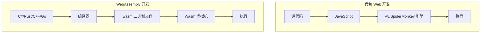
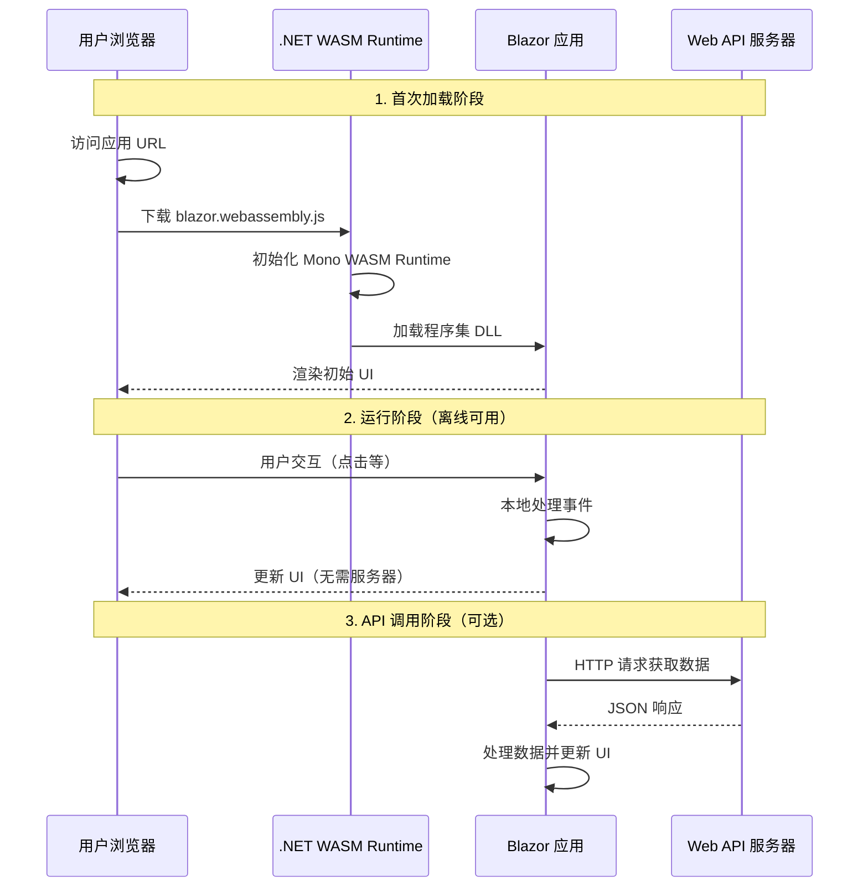
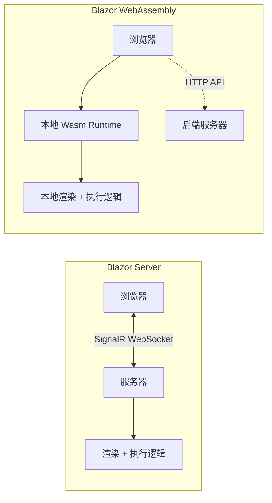
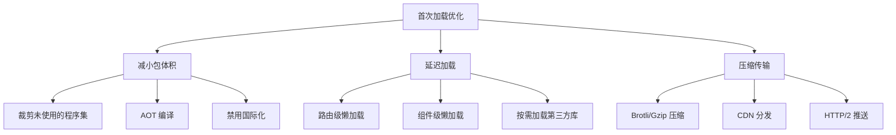
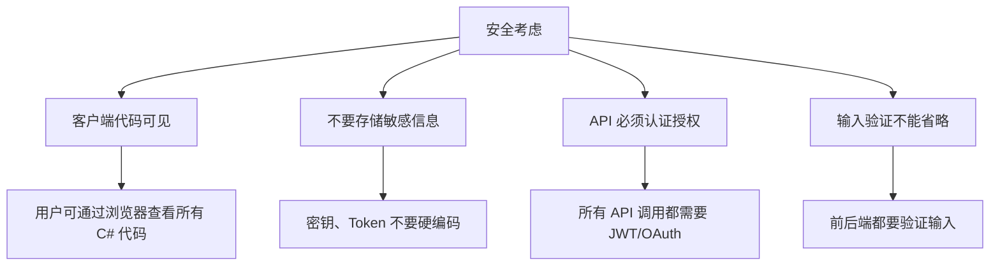

# Blazor WebAssembly 入门教程

> **学习时间**：约 60 分钟 | **难度**：中高级 | **前置知识**：C# 基础、Blazor Server 基础、JavaScript 基础
>
> **本节目标**：深入理解 Blazor WebAssembly 的工作原理，掌握 WASM 应用的开发、优化和部署。

---

## 一、WebAssembly (Wasm) 是什么？

### 1.1 革命性的浏览器技术

WebAssembly（简称 Wasm）是一种**新的二进制指令格式**，可以在现代浏览器中以接近原生性能运行。它不是 JavaScript 的替代品，而是与 JS 并存的伙伴。



### 1.2 WebAssembly 的核心特性

| 特性 | 说明 |
|------|------|
| **高性能** | 接近原生代码的执行速度（比 JS 快 10-20x） |
| **跨平台** | 所有现代浏览器都支持（Chrome、Firefox、Safari、Edge） |
| **安全** | 沙箱环境运行，无法直接访问系统资源 |
| **语言无关** | 可以从多种语言编译（C#、Rust、C++、Go 等） |
| **体积小** | 二进制格式，比等效的 JS 代码更紧凑 |

### 1.3 浏览器支持情况

截至 2024 年，所有主流浏览器的最新版本都支持 WebAssembly：
- Chrome 57+
- Firefox 52+
- Safari 11+
- Edge 16+

可以通过以下代码检测浏览器是否支持 Wasm：

```javascript
if (typeof WebAssembly === 'object' &&
    typeof WebAssembly.instantiate === 'function') {
    console.log('WebAssembly 已支持！');
}
```

---

## 二、Blazor WASM 工作原理

### 2.1 架构概览



### 2.2 关键组件解析

#### Mono WASM Runtime

Blazor WebAssembly 使用经过裁剪的 **Mono .NET 运行时**编译为 WebAssembly：

- 包含：垃圾回收器 (GC)、类型系统、基础类库子集
- 不包含：完整 .NET Framework、System.Drawing 等重量级库
- 大小：约 **2-5 MB**（压缩后），取决于使用的功能

#### 程序集加载流程

```
blazor.webassembly.js (引导程序)
    ↓
dotnet.wasm (Mono Runtime ~2MB)
    ↓
System.dll, System.Core.dll (.NET 基础库)
    ↓
Microsoft.AspNetCore.Components.dll (Blazor 核心)
    ↓
你的应用程序.dll (业务逻辑)
```

### 2.3 与 Blazor Server 的本质区别



| 维度 | Blazor Server | Blazor WebAssembly |
|------|---------------|-------------------|
| **代码执行位置** | 服务器端 | 浏览器内（客户端） |
| **网络依赖** | 持续连接必需 | 仅首次加载和 API 调用时需要 |
| **首屏加载速度** | 极快 (< 100ms) | 较慢 (2-10 秒) |
| **UI 响应延迟** | 取决于网络延迟 | 几乎无延迟（本地执行） |
| **离线能力** | 不支持 | 支持（PWA） |
| **服务器负载** | 高（每个用户占用内存和 CPU） | 低（仅 API 请求） |
| **调试体验** | 完整 VS 调试 | 受限（浏览器 DevTools） |
| **包大小** | ~50 KB (JS 引导) | 2-5 MB (Runtime + 应用) |
| **SEO 友好** | 是（SSR） | 否（需额外处理） |

---

## 三、创建 Blazor WASM 应用

### 3.1 创建项目

```bash
# 方式一：创建独立的 WASM 项目
dotnet new blazorwasm -n MyWasmApp

# 方式二：创建带托管 API 的项目（推荐用于学习）
dotnet new blazorwasm --hosted -n MyWasmAppWithApi

cd MyWasmAppWithApi
```

### 3.2 项目结构详解

对于 `--hosted` 模式创建的项目，结构如下：

```
MyWasmAppWithApi/
├── Client/                          # Blazor WASM 客户端项目
│   ├── Pages/                       # 页面组件
│   │   ├── Home.razor
│   │   ├── Counter.razor
│   │   └── FetchData.razor
│   ├── Shared/                      # 共享组件
│   │   ├── MainLayout.razor
│   │   ├── NavMenu.razor
│   │   └── SurveyPrompt.razor
│   ├── wwwroot/                     # 静态资源
│   │   ├── index.html               # 入口 HTML（不同于 Server 的 _Host.cshtml）
│   │   ├── css/app.css
│   │   └── js/app.js
│   ├── _Imports.razor
│   ├── App.razor                    # 根组件
│   ├── Program.cs                   # 客户端入口点
│   └── MyWasmAppWithApi.Client.csproj
│
├── Server/                          # ASP.NET Core API 服务器
│   ├── Controllers/                 # API 控制器
│   │   └── WeatherForecastController.cs
│   ├── wwwroot/                     # 静态文件服务
│   ├── Program.cs                   # 服务器入口点
│   └── MyWasmAppWithApi.Server.csproj
│
├── Shared/                          # 共享项目（模型、接口）
│   ├── WeatherForecast.cs           # 数据模型
│   └── MyWasmAppWithApi.Shared.csproj
│
└── MyWasmAppWithApi.sln             # 解决方案文件
```

### 3.3 关键差异：Client/Program.cs

```csharp
// Client/Program.cs - WASM 客户端入口
using Microsoft.AspNetCore.Components.Web;
using Microsoft.AspNetCore.Components.WebAssembly.Hosting;
using MyWasmAppWithApi.Client;

var builder = WebAssemblyHostBuilder.CreateDefault(args);

// 注册根组件
builder.RootComponents.Add<App>("#app");
builder.RootComponents<HeadOutlet>("head::after");

// 配置 HttpClient（自动指向宿主服务器）
builder.Services.AddScoped(sp => new HttpClient
{
    BaseAddress = new Uri(builder.HostEnvironment.BaseAddress)
});

// 注册自定义服务
builder.Services.AddSingleton<IWeatherService, WeatherService>();

await builder.Build().RunAsync();
```

**注意**：这里没有 `AddServerSideBlazor()`，而是使用 `WebAssemblyHostBuilder`。

### 3.4 关键差异：wwwroot/index.html

```html
<!-- wwwroot/index.html - WASM 入口页面 -->
<!DOCTYPE html>
<html lang="en">
<head>
    <meta charset="utf-8" />
    <meta name="viewport" content="width=device-width, initial-scale=1.0" />
    <title>MyWasmApp</title>
    <base href="/" />
    <link rel="stylesheet" href="css/bootstrap/bootstrap.min.css" />
    <link rel="stylesheet" href="css/app.css" />
</head>
<body>
    <!-- Blazor WASM 挂载点 -->
    <div id="app">Loading...</div>

    <!-- 启动 WASM 应用 -->
    <script src="_framework/blazor.webassembly.js"></script>
</body>
</html>
```

**关键区别**：
- 没有 `<component>` 标签（不需要服务端渲染）
- 没有 SignalR 脚本（不建立持久连接）
- 使用 `blazor.webassembly.js` 而非 `blazor.server.js`

---

## 四、JavaScript 互操作（JS Interop）

### 4.1 为什么需要 JS Interop？

虽然 Blazor WASM 功能强大，但有些场景仍需调用 JavaScript：
- 操作 DOM（如滚动到特定位置）
- 使用第三方 JS 库（Chart.js、Leaflet 地图等）
- 浏览器 API（LocalStorage、Geolocation）
- 性能敏感的操作（复杂动画）

### 4.2 从 C# 调用 JavaScript

使用注入的 `IJSRuntime` 服务：

```html
@page "/js-interop-demo"
@inject IJSRuntime JSRuntime

<div class="card">
    <div class="card-body">
        <h5>JavaScript 互操作演示</h5>

        <button class="btn btn-primary mb-3" @onclick="ShowAlert">
            显示 Alert
        </button>

        <button class="btn btn-success mb-3" @onclick="GetWindowSize">
            获取窗口大小
        </button>

        <button class="btn btn-info mb-3" @onclick="ScrollToTop">
            滚动到顶部
        </button>

        <button class="btn btn-warning mb-3" @onclick="SaveToLocalStorage">
            保存到 LocalStorage
        </button>

        @if (!string.IsNullOrEmpty(result))
        {
            <div class="alert alert-info mt-3">@result</div>
        }
    </div>
</div>

@code {
    private string result = "";

    // 调用无返回值的 JS 函数
    private async Task ShowAlert()
    {
        await JSRuntime.InvokeVoidAsync("alert", "Hello from Blazor WASM!");
    }

    // 调用有返回值的 JS 函数
    private async Task GetWindowSize()
    {
        var dimensions = await JSRuntime.InvokeAsync<WindowDimensions>(
            "getWindowDimensions");

        result = $"窗口大小: {dimensions.Width} x {dimensions.Height}";
    }

    // 调用带多个参数的函数
    private async Task ScrollToTop()
    {
        await JSRuntime.InvokeVoidAsync(
            "window.scrollTo",
            new { top = 0, behavior = "smooth" });
    }

    // 使用 LocalStorage
    private async Task SaveToLocalStorage()
    {
        var data = new { key = "blazor-wasm", value = "test-data", timestamp = DateTime.Now };
        await JSRuntime.InvokeVoidAsync(
            "localStorage.setItem",
            "myData",
            System.Text.Json.JsonSerializer.Serialize(data));

        // 读取验证
        var saved = await JSRuntime.InvokeAsync<string>(
            "localStorage.getItem", "myData");
        result = $"已保存: {saved}";
    }

    // 用于接收 JS 返回值的类
    public class WindowDimensions
    {
        public int Width { get; set; }
        public int Height { get; set; }
    }
}
```

对应的 JavaScript 函数（放在 `wwwroot/js/app.js` 中）：

```javascript
// 获取窗口尺寸
window.getWindowDimensions = function () {
    return {
        width: window.innerWidth,
        height: window.innerHeight
    };
};

// 自定义 Toast 通知
window.showNotification = function (message, type) {
    const toast = document.createElement('div');
    toast.className = `toast-notification toast-${type}`;
    toast.textContent = message;
    document.body.appendChild(toast);

    setTimeout(() => toast.remove(), 3000);
};
```

### 4.3 从 JavaScript 调用 C#

使用 `[JSInvokable]` 特性标记可从 JS 调用的方法：

```html
@page "/js-to-csharp"
@inject IJSRuntime JSRuntime

<h5>JavaScript 调用 C# 示例</h5>

<button class="btn btn-primary" @onclick="RegisterHandler">
    注册 JS 回调处理器
</button>

<p id="message-container"></p>

@code {
    private DotNetObjectReference<JsToCsharpDemo>? objRef;

    protected override void OnInitialized()
    {
        // 创建 DotNet 对象引用，允许 JS 调用此实例的方法
        objRef = DotNetObjectReference.Create(this);
    }

    private async Task RegisterHandler()
    {
        // 将 C# 对象引用传递给 JavaScript
        await JSRuntime.InvokeVoidAsync(
            "registerDotNetHandler",
            objRef);
    }

    // 这个方法可以从 JavaScript 调用
    [JSInvokable]
    public async Task ReceiveMessageFromJs(string message)
    {
        // 在 C# 中处理来自 JS 的消息
        result = $"收到 JS 消息: {message} ({DateTime.Now:HH:mm:ss})";

        // 触发 UI 更新
        await InvokeAsync(StateHasChanged);
    }

    private string result = "";

    public void Dispose()
    {
        objRef?.Dispose(); // 重要：释放引用防止内存泄漏
    }
}
```

JavaScript 端代码：

```javascript
// 存储 DotNet 对象引用
let dotNetHelper = null;

// 注册处理器
window.registerDotNetHandler = function (dotNetReference) {
    dotNetHelper = dotNetReference;
    console.log('DotNet handler registered');

    // 设置一个定时器模拟外部事件
    setInterval(async () => {
        if (dotNetHelper) {
            const message = `定时消息 ${new Date().toLocaleTimeString()}`;
            // 调用 C# 方法
            await dotNetHelper.invokeMethodAsync('ReceiveMessageFromJs', message);
        }
    }, 5000);
};
```

---

## 五、调用 Web API

### 5.1 HttpClient 配置

在 Blazor WASM 中，HttpClient 的配置与普通 .NET 应用略有不同：

```csharp
// Program.cs
var builder = WebAssemblyHostBuilder.CreateDefault(args);

// 方式一：基本配置（指向当前主机）
builder.Services.AddScoped(sp => new HttpClient
{
    BaseAddress = new Uri(builder.HostEnvironment.BaseAddress)
});

// 方式二：配置命名 HttpClient（推荐）
builder.Services.AddHttpClient("API", client =>
{
    client.BaseAddress = new Uri(builder.HostEnvironment.BaseAddress);
    client.Timeout = TimeSpan.FromSeconds(30);
});

// 方式三：添加自定义请求头
builder.Services.AddTransient<AuthService>();

await builder.Build().RunAsync();
```

### 5.2 封装 API 服务层

```csharp
// Services/IWeatherService.cs
public interface IWeatherService
{
    Task<List<WeatherForecast>> GetForecastsAsync();
    Task<WeatherForecast?> GetByIdAsync(int id);
}

// Services/WeatherService.cs
public class WeatherService : IWeatherService
{
    private readonly HttpClient _http;

    public WeatherService(IHttpClientFactory factory)
    {
        _http = factory.CreateClient("API");
    }

    public async Task<List<WeatherForecast>> GetForecastsAsync()
    {
        try
        {
            var forecasts = await _http.GetFromJsonAsync<List<WeatherForecast>>(
                "api/weatherforecast");

            return forecasts ?? new List<WeatherForecast>();
        }
        catch (Exception ex)
        {
            Console.WriteLine($"API 调用失败: {ex.Message}");
            return new List<WeatherForecast>();
        }
    }

    public async Task<WeatherForecast?> GetByIdAsync(int id)
    {
        try
        {
            return await _http.GetFromJsonAsync<WeatherForecast>(
                $"api/weatherforecast/{id}");
        }
        catch (Exception ex)
        {
            Console.WriteLine($"获取详情失败: {ex.Message}");
            return null;
        }
    }
}
```

### 5.3 组件中使用 API

```html
@page "/weather"
@inject IWeatherService WeatherService

<PageTitle>天气查询</PageTitle>

<div class="container mt-4">
    <div class="row">
        <div class="col-md-8 mx-auto">

            @if (isLoading)
            {
                <div class="text-center py-5">
                    <div class="spinner-border text-primary" role="status">
                        <span class="visually-hidden">Loading...</span>
                    </div>
                    <p class="mt-2">正在加载天气数据...</p>
                </div>
            }
            else if (forecasts.Count == 0)
            {
                <div class="alert alert-warning">
                    暂无天气数据
                </div>
            }
            else
            {
                <table class="table table-striped table-hover">
                    <thead class="table-dark">
                        <tr>
                            <th>日期</th>
                            <th>温度 (°C)</th>
                            <th>温度 (°F)</th>
                            <th>天气状况</th>
                        </tr>
                    </thead>
                    <tbody>
                        @foreach (var forecast in forecasts)
                        {
                            <tr>
                                <td>@forecast.Date.ToString("yyyy-MM-dd")</td>
                                <td>
                                    <span class="@GetTempClass(forecast.TemperatureC)">
                                        @forecast.TemperatureC °C
                                    </span>
                                </td>
                                <td>@forecast.TemperatureF °F</td>
                                <td>@forecast.Summary</td>
                            </tr>
                        }
                    </tbody>
                </table>
            }

            <div class="mt-3">
                <button class="btn btn-primary" @onclick="LoadData" disabled="@isLoading">
                    刷新数据
                </button>
            </div>
        </div>
    </div>
</div>

@code {
    private List<WeatherForecast> forecasts = new();
    private bool isLoading = true;

    protected override async Task OnInitializedAsync()
    {
        await LoadData();
    }

    private async Task LoadData()
    {
        isLoading = true;
        forecasts = await WeatherService.GetForecastsAsync();
        isLoading = false;
    }

    private string GetTempClass(int tempC) => tempC switch
    {
        <= 0 => "badge bg-primary",
        <= 15 => "badge bg-success",
        <= 25 => "badge bg-warning text-dark",
        _ => "badge bg-danger"
    };
}
```

### 5.4 后端 API 控制器示例

```csharp
// Server/Controllers/WeatherForecastController.cs
using Microsoft.AspNetCore.Mvc;
using MyWasmAppWithApi.Shared;

namespace MyWasmAppWithApi.Server.Controllers
{
    [ApiController]
    [Route("api/[controller]")]
    public class WeatherForecastController : ControllerBase
    {
        private static readonly string[] Summaries = new[]
        {
            "Freezing", "Bracing", "Chilly", "Cool", "Mild",
            "Warm", "Balmy", "Hot", "Sweltering", "Scorching"
        };

        [HttpGet]
        public IEnumerable<WeatherForecast> Get()
        {
            return Enumerable.Range(1, 7).Select(index =>
                new WeatherForecast
                {
                    Date = DateOnly.FromDateTime(DateTime.Now.AddDays(index)),
                    TemperatureC = Random.Shared.Next(-20, 55),
                    Summary = Summaries[Random.Shared.Next(Summaries.Length)]
                })
                .ToArray();
        }

        [HttpGet("{id}")]
        public ActionResult<WeatherForecast> Get(int id)
        {
            if (id < 1 || id > 7)
                return NotFound();

            return new WeatherForecast
            {
                Date = DateOnly.FromDateTime(DateTime.Now.AddDays(id)),
                TemperatureC = Random.Shared.Next(-20, 55),
                Summary = Summaries[Random.Shared.Next(Summaries.Length)]
            };
        }
    }
}
```

---

## 六、PWA 支持与离线功能

### 6.1 什么是 PWA？

PWA（Progressive Web App，渐进式 Web 应用）结合了 Web 和原生应用的优点：
- 可安装到设备主屏幕
- 支持离线访问（通过 Service Worker 缓存）
- 推送通知
- 类似原生的用户体验

### 6.2 为 Blazor WASM 启用 PWA

```bash
# 创建项目时启用 PWA
dotnet new blazorwasm -pwa -n MyPwaApp
```

或者手动添加 PWA 支持：

**步骤 1：创建 Service Worker 文件**

```javascript
// wwwroot/service-worker.js
const CACHE_NAME = 'blazor-pwa-v1';
const urlsToCache = [
    '/',
    '/index.html',
    '_framework/blazor.webassembly.js',
    'css/bootstrap/bootstrap.min.css',
    'css/app.css',
    'js/app.js'
];

// 安装事件 - 缓存静态资源
self.addEventListener('install', event => {
    event.waitUntil(
        caches.open(CACHE_NAME)
            .then(cache => cache.addAll(urlsToCache))
    );
    self.skipWaiting();
});

// 激活事件 - 清理旧缓存
self.activate(event => {
    const cacheWhitelist = [CACHE_NAME];
    event.waitUntil(
        caches.keys().then(cacheNames =>
            Promise.all(
                cacheNames.map(cacheName => {
                    if (!cacheWhitelist.includes(cacheName)) {
                        return caches.delete(cacheName);
                    }
                })
            )
        )
    );
    self.clients.claim();
});

// 拦截网络请求
self.fetch(event => {
    event.respondWith(
        caches.match(event.request)
            .then(response => {
                // 如果缓存中有，返回缓存；否则发起网络请求
                if (response) {
                    return response;
                }
                return fetch(event.request);
            })
    );
});
```

**步骤 2：注册 Service Worker**

在 `index.html` 或 `app.js` 中注册：

```javascript
// 检查是否支持 Service Worker
if ('serviceWorker' in navigator) {
    window.addEventListener('load', () => {
        navigator.serviceWorker.register('/service-worker.js')
            .then(registration => {
                console.log('SW registered:', registration.scope);
            })
            .catch(error => {
                console.log('SW registration failed:', error);
            });
    });
}
```

**步骤 3：添加 manifest.json**

```json
{
  "name": "我的 Blazor PWA 应用",
  "short_name": "BlazorPWA",
  "start_url": "/",
  "display": "standalone",
  "background_color": "#ffffff",
  "theme_color": "#512bd4",
  "icons": [
    {
      "src": "icons/icon-192.png",
      "sizes": "192x192",
      "type": "image/png"
    },
    {
      "src": "icons/icon-512.png",
      "sizes": "512x512",
      "type": "image/png"
    }
  ]
}
```

**步骤 4：在 index.html 中引用 manifest**

```html
<link rel="manifest" href="manifest.json" />
<meta name="theme-color" content="#512bd4" />
```

### 6.3 离线状态检测

```html
@page "/offline-demo"

<div class="card">
    <div class="card-header d-flex justify-content-between align-items-center">
        <span>网络状态监测</span>
        <span class="badge @(isOnline ? "bg-success" : "bg-danger")">
            @(isOnline ? "在线" : "离线")
        </span>
    </div>
    <div class="card-body">
        @if (isOnline)
        {
            <p class="text-success">
                <i class="bi bi-wifi"></i> 您已连接到互联网
            </p>
            <button class="btn btn-primary" @onclick="SyncData">
                同步离线数据
            </button>
        }
        else
        {
            <p class="text-warning">
                <i class="bi bi-wifi-off"></i> 您当前处于离线状态
            </p>
            <p class="text-muted small">
                部分功能可能不可用，但您仍可以查看已缓存的内容。
            </p>
        }
    </div>
</div>

@code {
    private bool isOnline = true;

    protected override async Task OnAfterRenderAsync(bool firstRender)
    {
        if (firstRender)
        {
            // 监听在线/离线事件
            await JSRuntime.InvokeVoidAsync("setupNetworkMonitor",
                DotNetObjectReference.Create(this));
        }
    }

    [JSInvokable]
    public void UpdateOnlineStatus(bool online)
    {
        isOnline = online;
        InvokeAsync(StateHasChanged);
    }

    private async Task SyncData()
    {
        // 实现离线数据同步逻辑
        await JSRuntime.InvokeVoidAsync("alert", "数据同步完成！");
    }

    [Inject]
    private IJSRuntime JSRuntime { get; set; } = null!;
}
```

对应 JavaScript：

```javascript
window.setupNetworkMonitor = function (dotNetHelper) {
    const updateStatus = () => {
        const online = navigator.onLine;
        dotNetHelper.invokeMethodAsync('UpdateOnlineStatus', online);
    };

    window.addEventListener('online', updateStatus);
    window.addEventListener('offline', updateStatus);

    // 初始检查
    updateStatus();
};
```

---

## 七、性能优化策略

### 7.1 首次加载优化

Blazor WASM 的首次加载较慢是主要痛点。以下是优化策略：



#### 策略 1：启用 AOT 编译（.NET 8+）

AOT（Ahead-of-Time）预编译可以显著提升运行时性能，但会增加下载量：

```xml
<!-- .csproj 文件 -->
<Project Sdk="Microsoft.NET.Sdk.BlazorWebAssembly">

  <PropertyGroup>
    <TargetFramework>net8.0</TargetFramework>
    <!-- 启用 AOT 编译 -->
    <RunAOTCompilation>true</RunAOTCompilation>
  </PropertyGroup>

</Project>
```

**AOT vs JIT 对比**：

| 特性 | JIT（默认） | AOT |
|------|------------|-----|
| **包大小** | 小 (~2MB Runtime) | 大 (~7MB+) |
| **启动速度** | 较慢（JIT 编译时间） | 快（已编译好） |
| **运行时性能** | 一般 | 优秀（接近原生） |
| **适用场景** | 网络快、交互简单 | 性能敏感、计算密集 |

#### 策略 2：延迟加载程序集

```csharp
// Program.cs
builder.Services.AddRazorPages()
    .AddInteractiveWebAssemblyRenderMode()
    .AddAdditionalAssemblies(typeof(Counter).Assembly); // 延迟加载

// 或者使用懒加载路由
builder.Services.Configure<RouterOptions>(options =>
{
    // 配置需要延迟加载的程序集
});
```

#### 策略 3：压缩配置

确保服务器启用了 Brotli 或 Gzip 压缩：

```csharp
// Server/Program.cs
var app = builder.Build();

app.UseResponseCompression(); // 添加响应压缩中间件

// 在 builder.Services 中配置
builder.Services.AddResponseCompression(options =>
{
    options.EnableForHttps = true;
    options.Providers.Add<BrotliCompressionProvider>();
    options.Providers.Add<GzipCompressionProvider>();
});
```

### 7.2 运行时性能优化

```html
@page "/performance-tips"

<h5>Blazor WASM 性能优化技巧</h5>

<div class="list-group">
    <div class="list-group-item">
        <strong>1. 避免不必要的重新渲染</strong>
        <code class="d-block mt-2">ShouldRender() 方法控制更新</code>
    </div>

    <div class="list-group-item">
        <strong>2. 使用 Virtualize 组件虚拟化长列表</strong>
        <code class="d-block mt-2">&lt;Virtualize Items="@items" /&gt;</code>
    </div>

    <div class="list-group-item">
        <strong>3. 合理使用 @key 提升列表渲染效率</strong>
        <code class="d-block mt-2">&lt;div key="@item.Id"&gt;</code>
    </div>

    <div class="list-group-item">
        <strong>4. 减少组件层级深度</strong>
        <p class="mb-0 text-muted">过深的组件树会影响渲染性能</p>
    </div>
</div>

@code {
    // 重写 ShouldRender 方法控制何时重新渲染
    protected override bool ShouldRender()
    {
        // 只有当特定条件满足时才重新渲染
        return hasChanges;
    }

    private bool hasChanges = true;
}
```

### 7.3 Virtualize 虚拟化组件示例

```html
@page "/virtualize-demo"

<h5>虚拟化大数据列表</h5>

<p>展示 100,000 条记录，但只渲染可见部分：</p>

<div style="height: 500px; overflow-y: auto; border: 1px solid #ddd;">
    <Virtualize Items="@allItems" ItemSize="50">
        <ItemContext context="item">
            <div style="height: 50px; padding: 10px; border-bottom: 1px solid #eee;">
                <strong>@item.Index.</strong> @item.Data.Name
                - @item.Data.Category
                <span class="float-end">@item.Data.Price:C</span>
            </div>
        </ItemContext>
    </Virtualize>
</div>

<p class="mt-2 text-muted">
    总共 @allItems.Count 条记录，但只渲染可视区域内的元素
</p>

@code {
    private List<Product> allItems = new();

    protected override void OnInitialized()
    {
        // 生成大量测试数据
        for (int i = 1; i <= 100000; i++)
        {
            allItems.Add(new Product
            {
                Name = $"产品 {i}",
                Category = i % 3 == 0 ? "电子" : i % 3 == 1 ? "服装" : "食品",
                Price = i * 10.5m
            });
        }
    }

    public class Product
    {
        public string Name { get; set; } = "";
        public string Category { get; set; } = "";
        public decimal Price { get; set; }
    }
}
```

---

## 八、限制和注意事项

### 8.1 技术限制

| 限制项 | 说明 | 解决方案 |
|--------|------|---------|
| **调试困难** | 无法像 Blazor Server 那样在 VS 中断点调试 | 使用 browser DevTools + console.log |
| **首次加载慢** | 需要下载 .NET Runtime | AOT 编译、延迟加载、PWA 缓存 |
| **不支持全部 .NET API** | 部分 API 依赖于操作系统 | 使用兼容的替代方案 |
| **单线程限制** | UI 线程阻塞会导致界面卡顿 | 使用异步操作避免阻塞 |
| **内存限制** | 浏览器标签页内存有限 | 注意内存泄漏，及时释放资源 |

### 8.2 不支持的 .NET API

以下 API 在 Blazor WASM 中**不支持**或**行为不同**：

```csharp
// ❌ 不支持的 API
System.Data.SqlClient          // 数据库直连
System.IO.File                 // 文件系统访问
System.Net.Sockets             // Socket 编程
System.Drawing                 // 图像处理
System.DirectoryServices       // AD 操作

// ✅ 替代方案
// 数据库 → 通过 Web API
// 文件存储 → 浏览器 File API / IndexedDB
// 图像处理 → Canvas API / 第三方 WASM 库
```

### 8.3 安全注意事项



---

## 九、适用场景分析

### 9.1 最佳适用场景

| 场景 | 适用度 | 说明 |
|------|--------|------|
| **企业内部工具** | ★★★★★ | 内网环境，加载一次后快速响应 |
| **低交互后台管理** | ★★★★☆ | 表单为主，交互频率不高 |
| **需要离线的应用** | ★★★★★ | PWA 支持，可完全离线工作 |
| **C# 团队全栈开发** | ★★★★☆ | 复用 .NET 技能和代码库 |
| **数据可视化仪表盘** | ★★★☆☆ | 需要配合 Chart.js 等库 |
| **移动端适配应用** | ★★★★☆ | 可打包为混合应用 |

### 9.2 不太适合的场景

| 场景 | 原因 | 建议方案 |
|------|------|---------|
| **SEO 要求高的网站** | CSR 对 SEO 不友好 | Next.js/Nuxt.js + SSR |
| **公网高流量网站** | 首次加载慢影响转化率 | Blazor Server 或 Vue/React SSR |
| **实时聊天/协作** | 本身不需要 WASM | Blazor Server 更合适 |
| **简单内容展示** | 杀鸡焉用牛刀 | Razor Pages 足够 |

---

## 十、DO/DON'T 清单

### DO - 推荐做法

- [x] **启用 PWA 和 Service Worker**，提升重复访问体验
- [x] **使用 `IHttpClientFactory` 管理 HttpClient**，避免 DNS 问题
- [x] **合理使用延迟加载**，拆分大型程序集
- [x] **为 Virtualize 组件设置正确的 ItemSize**，避免布局抖动
- [x] **实现 IDisposable**，释放 DotNetObjectReference 等资源
- [x] **使用 AOT 编译**（如果追求极致性能且能接受较大包体积）
- [x] **做好离线状态的 UI 反馈**，告知用户当前网络状态
- [x] **压缩静态资源**，启用 Brotli/Gzip 压缩

### DON'T - 避免做法

- [x] **不要在 Blazor WASM 中直接连接数据库**
- [x] **不要将 API 密钥或敏感信息写在客户端代码中**
- [x] **不要忽略 ShouldRender() 的优化机会**，频繁重渲染会影响性能
- [x] **不要忘记处理网络错误和超时**，WASM 环境网络不稳定
- [x] **不要在循环或频繁调用的方法中使用 JSInterop**，性能开销大
- [x] **不要假设所有浏览器都支持 Wasm**，提供降级方案
- [x] **不要忽视包体积监控**，定期审查哪些程序集占用了空间

---

## 十一、练习题

### 练习 1：概念理解题

**题目**：以下关于 Blazor WebAssembly 的描述，哪项是**错误的**？

A. Blazor WASM 将 C# 代码编译为 WebAssembly 在浏览器中运行
B. Blazor WASM 应用首次加载时需要下载 .NET Runtime
C. Blazor WASM 支持完整的 .NET Framework API
D. Blazor WASM 可以在没有网络连接的情况下继续运行部分功能

**答案及解析**：
**答案：C**

解析：Blazor WASM **不支持完整的 .NET Framework API**。它使用的是经过裁剪的 .NET Runtime 子集（基于 Mono），很多依赖操作系统的 API（如文件系统、数据库直连、Socket 等）是不可用的。这些功能需要通过调用 Web API 来间接实现。

---

### 练习 2：架构分析题

**题目**：请对比说明 Blazor Server 和 Blazor WebAssembly 在以下场景下的表现，并给出推荐选择：

1. 企业内部 OA 系统（100 个用户，内网部署）
2. 公开的电商商品详情页（日访问量 10 万+）
3. 需要离线工作的现场巡检工具

**参考答案**：

**场景 1：企业内部 OA 系统**
- **推荐：Blazor Server**
- 理由：用户固定、内网延迟可控、首次加载快、开发效率高（C# 全栈）、团队维护成本低
- 备选：如果对实时性要求极高且有离线需求，可考虑 Blazor WASM

**场景 2：公开电商商品详情页**
- **推荐：Next.js/Nuxt.js + ASP.NET Core API**（或 Razor Pages）
- 理由：SEO 至关重要（搜索引擎必须抓取内容）、公网首次加载速度影响用户体验和 SEO 排名
- Blazor WASM 不适合：CSR 模式对 SEO 不友好，首次加载慢
- Blazor Server 不适合：每个用户占用服务器资源，成本过高

**场景 3：现场巡检工具（离线需求）**
- **推荐：Blazor WebAssembly + PWA**
- 理由：必须支持离线工作、现场可能没有稳定网络、WASM 本地执行速度快
- 实现：使用 Service Worker 缓存资源和数据、IndexedDB 存储离线数据、联网后同步

---

### 练习 3：编程实践题

**题目**：请编写一个 Blazor WASM 组件，实现以下功能：
1. 从 Web API 获取用户列表
2. 显示加载状态（骨架屏或 Spinner）
3. 支持搜索过滤
4. 点击用户显示详情模态框
5. 错误处理和空状态提示

**参考答案**：

```html
@page "/users"
@inject IUserService UserService
@inject IJSRuntime JSRuntime

<div class="container-fluid mt-4">
    <!-- 搜索栏 -->
    <div class="row mb-4">
        <div class="col-md-6">
            <div class="input-group">
                <span class="input-group-text">
                    <i class="bi bi-search"></i>
                </span>
                <input type="text"
                       class="form-control"
                       placeholder="搜索用户名或邮箱..."
                       @bind="searchText"
                       @bind:event="oninput" />
            </div>
        </div>
        <div class="col-md-6 text-end">
            <span class="text-muted">
                共 @filteredUsers.Count 位用户
            </span>
        </div>
    </div>

    @if (isLoading)
    {
        <!-- 加载骨架屏 -->
        <div class="list-group">
            @for (int i = 0; i < 5; i++)
            {
                <div class="list-group-item">
                    <div class="placeholder-glow">
                        <span class="placeholder col-6"></span>
                        <span class="placeholder col-4 ms-2"></span>
                    </div>
                </div>
            }
        </div>
    }
    else if (error != null)
    {
        <!-- 错误状态 -->
        <div class="alert alert-danger d-flex align-items-center">
            <i class="bi bi-exclamation-triangle-fill me-2"></i>
            <div>
                <strong>加载失败！</strong> @error
                <br />
                <button class="btn btn-sm btn-outline-danger mt-2" @onclick="LoadUsers">
                    重试
                </button>
            </div>
        </div>
    }
    else if (filteredUsers.Count == 0)
    {
        <!-- 空状态 -->
        <div class="text-center py-5 text-muted">
            <i class="bi bi-people fs-1"></i>
            <p class="mt-2">
                @(string.IsNullOrEmpty(searchText) ? "暂无用户数据" : "没有找到匹配的用户")
            </p>
        </div>
    }
    else
    {
        <!-- 用户列表 -->
        <div class="row row-cols-1 row-cols-md-3 g-4">
            @foreach (var user in filteredUsers)
            {
                <div class="col">
                    <div class="card h-100 user-card"
                         @onclick="() => ShowDetail(user)">
                        <div class="card-body">
                            <div class="d-flex align-items-center mb-3">
                                <div class="avatar-placeholder me-3"
                                     style="width:48px;height:48px;border-radius:50%;
                                            background:@GetAvatarColor(user.Id);
                                            display:flex;align-items:center;
                                            justify-content:center;color:#fff;">
                                    @user.Name.Substring(0, 1).ToUpper()
                                </div>
                                <div>
                                    <h6 class="card-title mb-0">@user.Name</h6>
                                    <small class="text-muted">@user.Role</small>
                                </div>
                            </div>
                            <p class="card-text text-muted small mb-0">
                                <i class="bi bi-envelope me-1"></i>@user.Email
                            </p>
                        </div>
                    </div>
                </div>
            }
        </div>
    }
</div>

<!-- 详情模态框 -->
@if (selectedUser != null)
{
    <div class="modal fade show d-block" tabindex="-1"
         style="background-color: rgba(0,0,0,0.5);">
        <div class="modal-dialog modal-dialog-centered">
            <div class="modal-content">
                <div class="modal-header">
                    <h5 class="modal-title">用户详情</h5>
                    <button type="button" class="btn-close"
                            @onclick="CloseDetail"></button>
                </div>
                <div class="modal-body">
                    <dl class="row mb-0">
                        <dt class="col-sm-3">姓名：</dt>
                        <dd class="col-sm-9">@selectedUser.Name</dd>

                        <dt class="col-sm-3">邮箱：</dt>
                        <dd class="col-sm-9">@selectedUser.Email</dd>

                        <dt class="col-sm-3">角色：</dt>
                        <dd class="col-sm-9">
                            <span class="badge bg-primary">@selectedUser.Role</span>
                        </dd>

                        <dt class="col-sm-3">部门：</dt>
                        <dd class="col-sm-9">@selectedUser.Department</dd>

                        <dt class="col-sm-3">入职日期：</dt>
                        <dd class="col-sm-9">@selectedUser.JoinDate.ToString("yyyy-MM-dd")</dd>
                    </dl>
                </div>
                <div class="modal-footer">
                    <button type="button" class="btn btn-secondary"
                            @onclick="CloseDetail">关闭</button>
                    <button type="button" class="btn btn-primary">
                        编辑信息
                    </button>
                </div>
            </div>
        </div>
    </div>
}

@code {
    private List<User> users = new();
    private string searchText = "";
    private bool isLoading = true;
    private string? error;
    private User? selectedUser;

    // 过滤后的用户列表
    private List<User> filteredUsers =>
        string.IsNullOrWhiteSpace(searchText)
            ? users
            : users.Where(u =>
                u.Name.Contains(searchText, StringComparison.OrdinalIgnoreCase) ||
                u.Email.Contains(searchText, StringComparison.OrdinalIgnoreCase)).ToList();

    protected override async Task OnInitializedAsync()
    {
        await LoadUsers();
    }

    private async Task LoadUsers()
    {
        isLoading = true;
        error = null;

        try
        {
            users = await UserService.GetAllUsersAsync();
        }
        catch (Exception ex)
        {
            error = ex.Message;
        }
        finally
        {
            isLoading = false;
        }
    }

    private void ShowDetail(User user)
    {
        selectedUser = user;
    }

    private void CloseDetail()
    {
        selectedUser = null;
    }

    private string GetAvatarColor(int id) => id switch
    {
        1 or 5 or 9 => "#4e73df",
        2 or 6 or 10 => "#1cc88a",
        3 or 7 or 11 => "#36b9cc",
        _ => "#f6c23e"
    };

    public class User
    {
        public int Id { get; set; }
        public string Name { get; set; } = "";
        public string Email { get; set; } = "";
        public string Role { get; set; } = "";
        public string Department { get; set; } = "";
        public DateTime JoinDate { get; set; }
    }
}

<style>
    .user-card {
        cursor: pointer;
        transition: transform 0.2s, box-shadow 0.2s;
    }
    .user-card:hover {
        transform: translateY(-3px);
        box-shadow: 0 4px 12px rgba(0,0,0,0.15);
    }
</style>
```

---

### 练习题 4：综合思考题

**题目**：你正在为一个制造企业开发设备巡检应用，需求如下：
- 巡检员需要在车间现场使用（有时无网络）
- 需要扫描设备二维码获取信息
- 需要填写巡检表单并拍照
- 有网络时自动同步数据到服务器
- 预计同时使用人数约 50 人

请问你会选择什么技术栈？为什么？请详细说明你的技术决策过程。

**参考答案**（开放性问题）：

**推荐方案：Blazor WebAssembly + PWA**

**技术决策过程**：

**1. 核心需求分析**

| 需求 | 权重 | 影响因素 |
|------|------|---------|
| 离线工作 | 必须 | 排除 Blazor Server、纯 CSR SPA |
| 设备扫码 | 重要 | 需要 Camera API（JS 互操作） |
| 表单填写 | 基础 | Blazor 表单绑定天然优势 |
| 数据同步 | 重要 | PWA + IndexedDB + API |
| 50 人并发 | 中等 | WASM 无服务器压力问题 |

**2. 为什么选择 Blazor WASM？**

**离线能力（决定性因素）**：
- PWA + Service Worker 可以缓存应用资源
- IndexedDB 存储离线填写的表单数据
- 网络恢复后自动同步到服务器

**技术栈统一**：
- 如果后端已经是 .NET，前端也用 C#，降低团队学习成本
- 共享数据模型（Shared 项目）
- 统一的异常处理和日志体系

**扫码和拍照**：
- 通过 JS Interop 调用浏览器 Camera API
- 或集成第三方扫码库（如 html5-qrcode）

**3. 架构设计概览**

```
┌─────────────────────────────────────┐
│         Blazor WASM PWA 客户端       │
│  ┌─────────┐  ┌──────────┐  ┌────┐ │
│  │ UI 组件  │  │ IndexedDB│  │ SW │ │
│  └────┬────┘  └────┬─────┘  └──┬─┘ │
│       └────────────┼────────────┘   │
│                    │                 │
│         同步管理器 (在线/离线检测)     │
└────────────────────┼────────────────┘
                     │ HTTP API
┌────────────────────┼────────────────┐
│      ASP.NET Core API 服务器         │
│  ┌─────────┐  ┌──────────┐         │
│  │ 数据同步 │  │ 文件上传 │         │
│  └─────────┘  └──────────┘         │
└─────────────────────────────────────┘
```

**4. 关键实现要点**

- **离线队列**：离线时的操作存入 IndexedDB 队列
- **冲突解决**：多人编辑同一设备时的时间戳策略
- **增量同步**：只同步变更的数据，减少流量
- **进度反馈**：向用户展示同步状态和进度

**5. 备选方案对比**

| 方案 | 优点 | 缺点 | 结论 |
|------|------|------|------|
| React Native | 原生体验 | 需要另外学 RN，无法复用 .NET 代码 | 不选 |
| Vue + PWA | 生态丰富 | 团队需学 Vue，前后端分离增加复杂度 | 备选 |
| Flutter | 跨平台 | Dart 语言，与 .NET 生态割裂 | 不选 |
| **Blazor WASM** | C# 全栈、PWA 原生支持 | 首次加载较慢 | **首选** |

---

## 十二、延伸阅读

### 官方文档

- [Blazor WebAssembly 官方文档](https://learn.microsoft.com/aspnet/core/blazor/webassembly/) - 微软权威指南
- [ASP.NET Core Blazor 托管模型](https://learn.microsoft.com/aspnet/core/blazor/hosting-models) - 各模式详细对比
- [Blazor JavaScript 互操作](https://learn.microsoft.com/aspnet/core/blazor/javascript-interoperability/) - JS Interop 完整参考
- [Blazor 渐进式 Web 应用](https://learn.microsoft.com/aspnet/core/blazor/progressive-web-application) - PWA 配置指南

### 进阶主题

- [Blazor WASM 安全最佳实践](https://learn.microsoft.com/aspnet/core/blazor/security/) - 认证授权指南
- [Blazor 性能最佳实践](https://learn.microsoft.com/aspnet/core/blazor/performance) - 性能优化建议
- [AOT 编译文档](https://learn.microsoft.com/aspnet/core/blazor/webassembly-ahead-of-time) - AOT 详细说明

### 学习资源

- [Blazor WASM 示例集合](https://github.com/dotnet/blazor-samples) - 官方 GitHub 示例
- [Awesome Blazor WASM](https://github.com/AdrienTorris/awesome-blazor) - 社区资源汇总
- [WebAssembly 官方网站](https://webassembly.org/) - Wasm 技术规范

### 工具推荐

- [Blazor WebAssembly 性能分析工具](https://learn.microsoft.com/aspnet/core/blazor/troubleshoot) - 调试和诊断
- [Fiddler / Chrome DevTools] - 网络请求分析
- [Lighthouse] - PWA 和性能审计

---

## 总结

Blazor WebAssembly 代表了 Web 开发的一个重要方向——让开发者可以使用熟悉的语言和技术栈构建现代 Web 应用。通过本节的学习，你应该掌握了：

1. **原理理解**：WebAssembly 是什么，Blazor WASM 如何将 C# 运行在浏览器中
2. **项目搭建**：能够独立创建和运行 Blazor WASM 应用
3. **JS 互操作**：掌握 C# 与 JavaScript 双向调用的方法
4. **API 集成**：学会在 WASM 环境中调用后端 Web API
5. **PWA 支持**：理解如何构建离线可用的渐进式 Web 应用
6. **性能优化**：了解 AOT 编译、延迟加载、虚拟化等优化手段
7. **场景判断**：能够根据实际需求评估 Blazor WASM 是否适合

**下一步建议**：
- 如果你想了解前后端分离的主流方案 → 学习 **Vue.js + ASP.NET API 集成**
- 如果你遇到了跨域问题 → 学习 **CORS 跨域配置详解**
- 如果你想深入了解安全认证 → 查看 **02-安全认证** 目录的相关教程

Blazor WebAssembly 正在快速发展，随着 .NET 版本的迭代，它的性能和功能会越来越强大。保持学习和实践，你将能够充分发挥这项技术的潜力！
