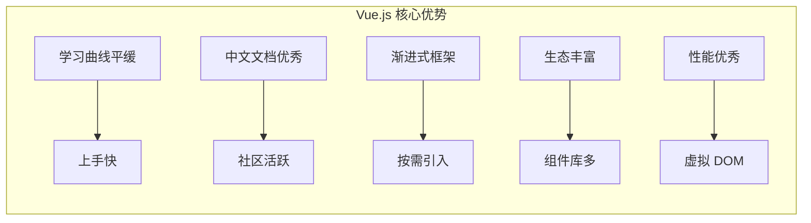
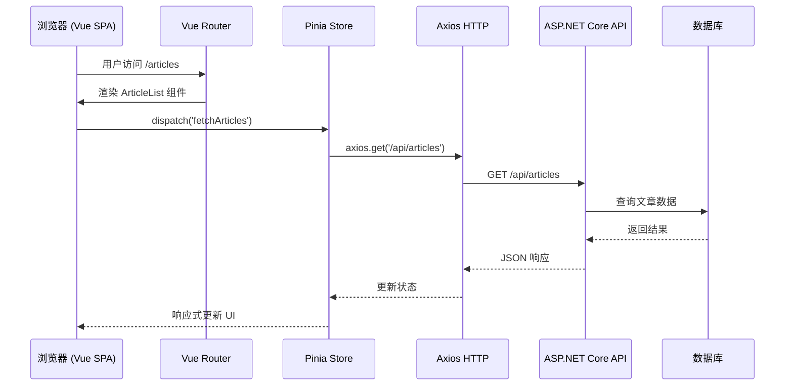
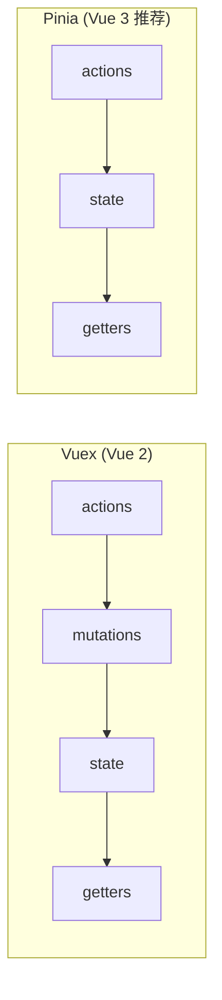

# Vue.js + ASP.NET Core API 集成教程

> **学习时间**：约 70 分钟 | **难度**：中高级 | **前置知识**：C#/ASP.NET Core 基础、JavaScript ES6+ 基础
>
> **本节目标**：掌握前后端分离架构的开发模式，能够使用 Vue 3 构建前端 SPA，并与 ASP.NET Core Web API 完美集成。

---

## 一、为什么选择 Vue.js？

### 1.1 Vue.js 的核心优势

在众多前端框架中，Vue.js 对于 .NET 开发者来说是一个绝佳的选择：



| 特性 | Vue.js | React | Angular |
|------|--------|-------|---------|
| **学习曲线** | 平缓 | 中等 | 陡峭 |
| **中文支持** | 优秀（作者尤雨溪是华人） | 一般 | 良好 |
| **模板语法** | HTML-like (直观) | JSX (类HTML) | HTML + TypeScript |
| **状态管理** | Pinia (简单) | Redux/Zustand (复杂) | NgRx/RxJS (复杂) |
| **包大小** | 小 (~33KB gzipped) | 中 (~42KB) | 大 (~65KB) |
| **适合团队** | 初学者/中小型项目 | 有前端经验的大型项目 | 企业级大型应用 |

### 1.2 前后端分离架构概览



### 1.3 技术栈组合

**推荐的前后端技术栈**：

```
┌─────────────────────────────────────────────┐
│              前端技术栈 (Vue 3)               │
│                                              │
│   Vue 3 + Composition API                   │
│   ├── Vite (构建工具)                        │
│   ├── Vue Router (路由管理)                  │
│   ├── Pinia (状态管理)                       │
│   ├── Axios (HTTP 客户端)                    │
│   ├── Element Plus / Ant Design Vue (UI库)   │
│   └── TypeScript (类型安全) [可选]           │
└─────────────────────────────────────────────┘
                    ↕ RESTful API (JSON)
┌─────────────────────────────────────────────┐
│          后端技术栈 (ASP.NET Core 8)          │
│                                              │
│   ASP.NET Core Web API                      │
│   ├── Entity Framework Core (ORM)            │
│   ├── JWT Bearer Token (认证)                │
│   ├── AutoMapper (对象映射)                  │
│   ├── Fluent Validation (验证)              │
│   └── Serilog (日志)                         │
└─────────────────────────────────────────────┘
```

---

## 二、开发环境搭建

### 2.1 安装 Node.js 和 npm

```bash
# 检查是否已安装
node --version   # 需要 v18+ 或 v20+
npm --version    # 需要 v9+ 或 v10+

# 如果未安装，从 https://nodejs.org 下载 LTS 版本
# 推荐 v20 LTS (长期支持版本)
```

**Windows 用户注意**：
- 安装时勾选 "Add to PATH" 选项
- 安装完成后重启终端
- 推荐使用 nvm-windows 管理多个 Node 版本

### 2.2 使用 Vite 创建 Vue 3 项目

Vite 是新一代前端构建工具，开发体验极佳：

```bash
# 创建 Vue 3 项目（使用 TypeScript）
npm create vite@latest my-vue-app -- --template vue-ts

# 或者创建 JavaScript 版本
npm create vite@latest my-vue-app -- --template vue

# 进入项目目录
cd my-vue-app

# 安装依赖
npm install

# 启动开发服务器
npm run dev
```

启动成功后会显示：

```
VITE v5.x.x  ready in xxx ms

➜  Local:   http://localhost:5173/
➜  Network: use --host to expose
```

浏览器打开 `http://localhost:5173` 即可看到 Vue 默认页面。

### 2.3 安装核心依赖

```bash
# Vue Router - 路由管理
npm install vue-router@4

# Pinia - 状态管理（替代 Vuex）
npm install pinia

# Axios - HTTP 客户端
npm install axios

# UI 组件库（可选，二选一）
# 方案一：Element Plus
npm install element-plus
# 方案二：Ant Design Vue
npm install ant-design-vue@4.x

# 开发依赖
npm install -D @types/node  # TypeScript 类型定义
```

### 2.4 项目结构建议

```
my-vue-app/
├── public/                     # 静态资源（不经过构建）
├── src/
│   ├── api/                    # API 接口封装
│   │   ├── index.ts            # Axios 实例和拦截器
│   │   ├── auth.ts             # 认证相关接口
│   │   └── article.ts          # 文章相关接口
│   ├── assets/                 # 静态资源（图片、样式等）
│   │   └── styles/
│   │       └── main.css        # 全局样式
│   ├── components/             # 可复用组件
│   │   └── common/             # 通用组件
│   ├── composables/            # 组合式函数（复用逻辑）
│   ├── layouts/                # 布局组件
│   │   └── MainLayout.vue
│   ├── router/                 # 路由配置
│   │   └── index.ts
│   ├── stores/                 # Pinia 状态仓库
│   │   ├── index.ts
│   │   ├── user.ts
│   │   └── article.ts
│   ├── types/                  # TypeScript 类型定义
│   │   └── api.d.ts
│   ├── utils/                  # 工具函数
│   │   ├── request.ts
│   │   └── storage.ts
│   ├── views/                  # 页面组件
│   │   ├── home/
│   │   ├── login/
│   │   └── article/
│   ├── App.vue                 # 根组件
│   └── main.ts                 # 应用入口
├── index.html                  # HTML 入口
├── package.json                # 项目配置
├── tsconfig.json              # TypeScript 配置
├── vite.config.ts             # Vite 配置
└── README.md
```

---

## 三、Vue 3 Composition API 基础

### 3.1 从 Options API 到 Composition API

Vue 3 引入了 Composition API，提供了更灵活的代码组织方式：

```vue
<!-- Options API（Vue 2 风格） -->
<script>
export default {
  data() {
    return {
      count: 0,
      name: 'Vue'
    }
  },
  computed: {
    doubleCount() {
      return this.count * 2
    }
  },
  methods: {
    increment() {
      this.count++
    }
  },
  mounted() {
    console.log('组件已挂载')
  }
}
</script>

<!-- Composition API（Vue 3 推荐） -->
<script setup lang="ts">
import { ref, computed, onMounted } from 'vue'

// 响应式状态
const count = ref(0)
const name = ref('Vue')

// 计算属性
const doubleCount = computed(() => count.value * 2)

// 方法
function increment() {
  count.value++
}

// 生命周期钩子
onMounted(() => {
  console.log('组件已挂载')
})
</script>
```

### 3.2 核心函数详解

#### ref() - 基础类型响应式

```vue
<script setup lang="ts">
import { ref } from 'vue'

// 基础类型
const count = ref(0)
const message = ref<string>('Hello')
const isLoading = ref<boolean>(false)

// 在模板中使用时自动解包，不需要 .value
// <p>{{ count }}</p>  ✅ 正确
// <p>{{ count.value }}</p>  ✅ 也正确（但多余）

// 在 JS 中必须使用 .value
function increment() {
  count.value++      // ✅ 正确
  // count++         // ❌ 错误
}

// 对象类型也可以用 ref（但推荐用 reactive）
const user = ref({
  name: '张三',
  age: 25
})
console.log(user.value.name)  // 需要 .value
</script>
```

#### reactive() - 对象类型响应式

```vue
<script setup lang="ts">
import { reactive } from 'vue'

// 用于对象/数组
const state = reactive({
  user: {
    name: '张三',
    email: 'zhangsan@example.com'
  },
  articles: [] as Article[],
  filters: {
    keyword: '',
    category: 'all'
  }
})

// 直接访问属性，不需要 .value
function updateName(newName: string) {
  state.user.name = newName  // ✅ 正确
}
</script>
```

#### computed() - 计算属性

```vue
<script setup lang="ts">
import { ref, computed } from 'vue'

const price = ref<number>(100)
const quantity = ref<number>(2)

// 只读计算属性
const totalPrice = computed(() => price.value * quantity.value)

// 可写计算属性
const discountedPrice = computed({
  get: () => price.value * 0.9,
  set: (newValue: number) => {
    price.value = newValue / 0.9
  }
})

// 带过滤的计算属性
const articles = ref<Article[]>([])
const searchKeyword = ref('')

const filteredArticles = computed(() => {
  if (!searchKeyword.value) return articles.value
  return articles.value.filter(article =>
    article.title.toLowerCase().includes(searchKeyword.value.toLowerCase())
  )
})
</script>

<template>
  <div>
    <input v-model="searchKeyword" placeholder="搜索文章..." />
    <p>总价: {{ totalPrice }}</p>
    <ul>
      <li v-for="article in filteredArticles" :key="article.id">
        {{ article.title }}
      </li>
    </ul>
  </div>
</template>
```

#### watch() 和 watchEffect()

```vue
<script setup lang="ts">
import { ref, watch, watchEffect } from 'vue'

const count = ref(0)
const question = ref('')
const answer = ref('')

// watch - 监听特定源
watch(count, (newValue, oldValue) => {
  console.log(`count 从 ${oldValue} 变为 ${newValue}`)
})

// 监听多个源
watch([count, question], ([newCount, newQuestion], [oldCount, oldQuestion]) => {
  console.log(`count: ${oldCount} -> ${newCount}`)
  console.log(`question: "${oldQuestion}" -> "${newQuestion}"`)
})

// 监听对象的深层变化（需要 deep 选项）
const user = reactive({ name: '', age: 0 })
watch(
  () => ({ ...user }),  // 返回副本以触发检测
  (newUser) => {
    console.log('用户信息变更:', newUser)
  },
  { deep: true }
)

// watchEffect - 自动追踪依赖
watchEffect(async () => {
  if (question.value.includes('?')) {
    // 当 question 变化且包含 ? 时自动执行
    const res = await fetchAnswer(question.value)
    answer.value = res
  }
})
</script>
```

---

## 四、Pinia 状态管理

### 4.1 为什么选择 Pinia？

Pinia 是 Vue 3 官方推荐的状态管理库，取代了 Vuex：



**Pinia 的优势**：
- 更简洁的 API（去掉了 mutations）
- 完美的 TypeScript 支持
- 支持Composition API 风格
- 更好的 DevTools 支持
- 支持多个 Store

### 4.2 定义和使用 Store

```typescript
// stores/user.ts
import { defineStore } from 'pinia'
import { ref, computed } from 'vue'
import type { User, LoginParams } from '@/types/api'
import { authApi } from '@/api/auth'

export const useUserStore = defineStore('user', () => {
  // State - 状态
  const token = ref<string>(localStorage.getItem('token') || '')
  const userInfo = ref<User | null>(null)
  const isLoading = ref(false)

  // Getters - 计算属性
  const isLoggedIn = computed(() => !!token.value)
  const userName = computed(() => userInfo.value?.name ?? '未登录')
  const userRole = computed(() => userInfo.value?.role ?? 'guest')

  // Actions - 方法（可以是异步的）
  async function login(loginParams: LoginParams) {
    isLoading.value = true
    try {
      const response = await authApi.login(loginParams)
      token.value = response.token
      userInfo.value = response.user
      localStorage.setItem('token', response.token)
      return { success: true }
    } catch (error: any) {
      return { success: false, message: error.message || '登录失败' }
    } finally {
      isLoading.value = false
    }
  }

  async function getUserInfo() {
    if (!token.value) return
    try {
      const user = await authApi.getUserInfo()
      userInfo.value = user
    } catch (error) {
      logout()
    }
  }

  function logout() {
    token.value = ''
    userInfo.value = null
    localStorage.removeItem('token')
  }

  // 返回所有需要在组件中使用的状态和方法
  return {
    token,
    userInfo,
    isLoading,
    isLoggedIn,
    userName,
    userRole,
    login,
    getUserInfo,
    logout
  }
})
```

### 4.3 在组件中使用 Store

```vue
<template>
  <div class="user-info" v-if="userStore.isLoggedIn">
    <el-avatar :size="40" :src="userStore.userInfo?.avatar">
      {{ userStore.userName.charAt(0) }}
    </el-avatar>
    <span class="username">{{ userStore.userName }}</span>
    <el-tag :type="getRoleType(userStore.userRole)">
      {{ getRoleName(userStore.userRole) }}
    </el-tag>
    <el-button type="danger" size="small" @click="handleLogout">
      退出登录
    </el-button>
  </div>
  <div v-else>
    <router-link to="/login">请登录</router-link>
  </div>
</template>

<script setup lang="ts">
import { useUserStore } from '@/stores/user'
import { useRouter } from 'vue-router'
import { ElMessage } from 'element-plus'

const userStore = useUserStore()
const router = useRouter()

async function handleLogout() {
  await userStore.logout()
  ElMessage.success('已退出登录')
  router.push('/login')
}

function getRoleType(role: string): 'success' | 'warning' | 'info' {
  const map: Record<string, any> = { admin: 'success', editor: 'warning', guest: 'info' }
  return map[role] || 'info'
}

function getRoleName(role: string): string {
  const map: Record<string, string> = { admin: '管理员', editor: '编辑', guest: '访客' }
  return map[role] || role
}
</script>
```

---

## 五、Vue Router 路由配置

### 5.1 基础路由配置

```typescript
// router/index.ts
import { createRouter, createWebHistory, type RouteRecordRaw } from 'vue-router'
import { useUserStore } from '@/stores/user'

// 路由配置
const routes: RouteRecordRaw[] = [
  {
    path: '/',
    component: () => import('@/layouts/MainLayout.vue'),
    children: [
      {
        path: '',
        name: 'Home',
        component: () => import('@/views/home/HomePage.vue'),
        meta: { title: '首页' }
      },
      {
        path: 'articles',
        name: 'ArticleList',
        component: () => import('@/views/article/ArticleList.vue'),
        meta: { title: '文章列表', requiresAuth: true }
      },
      {
        path: 'articles/:id',
        name: 'ArticleDetail',
        component: () => import('@/views/article/ArticleDetail.vue'),
        meta: { title: '文章详情', requiresAuth: false },
        props: true
      },
      {
        path: 'about',
        name: 'About',
        component: () => import('@/views/about/AboutPage.vue'),
        meta: { title: '关于我们' }
      }
    ]
  },
  {
    path: '/login',
    name: 'Login',
    component: () => import('@/views/login/LoginPage.vue'),
    meta: { title: '登录', hideLayout: true }
  },
  {
    path: '/register',
    name: 'Register',
    component: () => import('@/views/login/RegisterPage.vue'),
    meta: { title: '注册', hideLayout: true }
  },
  {
    // 404 未找到
    path: '/:pathMatch(.*)*',
    name: 'NotFound',
    component: () => import('@/views/error/NotFound.vue'),
    meta: { title: '页面未找到' }
  }
]

const router = createRouter({
  history: createWebHistory(import.meta.env.BASE_URL),
  routes,
  scrollBehavior(to, from, savedPosition) {
    if (savedPosition) {
      return savedPosition
    } else {
      return { top: 0 }
    }
  }
})

// 全局前置守卫 - 路由鉴权
router.beforeEach((to, _from, next) => {
  // 设置页面标题
  document.title = `${to.meta.title || ''} - 我的博客`

  const userStore = useUserStore()

  // 判断是否需要认证
  if (to.meta.requiresAuth && !userStore.isLoggedIn) {
    // 未登录，跳转到登录页，并记录目标路径
    next({ name: 'Login', query: { redirect: to.fullPath } })
  } else {
    next()
  }
})

export default router
```

### 5.2 路由懒加载

上面的示例已经使用了动态导入（`() => import(...)`），这是路由懒加载的标准方式：

```typescript
// ❌ 不推荐：同步导入（会增加首屏 bundle 大小）
import HomePage from '@/views/home/HomePage.vue'

// ✅ 推荐：动态导入（按需加载）
{
  path: '',
  component: () => import('@/views/home/HomePage.vue')
}
```

### 5.3 编程式导航

```vue
<script setup lang="ts">
import { useRouter, useRoute } from 'vue-router'

const router = useRouter()
const route = useRoute()

// 导航到指定路径
function goHome() {
  router.push('/')
}

// 导航到命名路由并传递参数
function viewArticle(id: number) {
  router.push({
    name: 'ArticleDetail',
    params: { id }
  })
}

// 替换当前历史记录（不能后退）
function replaceCurrent() {
  router.replace('/home')
}

// 前进/后退
function goBack() {
  router.back()
}
function goForward() {
  router.forward()
}

// 读取当前路由参数
const articleId = computed(() => Number(route.params.id))
const currentPage = computed(() => Number(route.query.page) || 1)
</script>
```

---

## 六、Axios HTTP 客户端封装

### 6.1 创建 Axios 实例

```typescript
// utils/request.ts
import axios, {
  type AxiosInstance,
  type AxiosRequestConfig,
  type AxiosResponse,
  type InternalAxiosRequestConfig
} from 'axios'
import { useUserStore } from '@/stores/user'
import { ElMessage, ElMessageBox } from 'element-plus'
import router from '@/router'

// 创建 Axios 实例
const service: AxiosInstance = axios.create({
  baseURL: import.meta.env.VITE_API_BASE_URL || '/api',
  timeout: 15000, // 请求超时时间
  headers: {
    'Content-Type': 'application/json;charset=UTF-8'
  }
})

// 请求拦截器
service.interceptors.request.use(
  (config: InternalAxiosRequestConfig) => {
    const userStore = useUserStore()

    // 如果有 token，添加到请求头
    if (userStore.token) {
      config.headers.Authorization = `Bearer ${userStore.token}`
    }

    // 添加时间戳防止缓存（GET 请求）
    if (config.method === 'get') {
      config.params = {
        ...config.params,
        _t: Date.now()
      }
    }

    console.log(`[请求] ${config.method?.toUpperCase()} ${config.url}`)

    return config
  },
  (error) => {
    console.error('[请求错误]', error)
    return Promise.reject(error)
  }
)

// 响应拦截器
service.interceptors.response.use(
  (response: AxiosResponse) => {
    const { data, status } = response

    console.log(`[响应] ${status} ${response.config.url}`)

    // 根据自定义业务码判断请求是否成功
    if (data.code === 200 || data.code === 0) {
      return data.data
    }

    // 业务错误
    ElMessage.error(data.message || '请求失败')
    return Promise.reject(new Error(data.message || '请求失败'))
  },
  (error) => {
    const { response, message } = error

    if (response) {
      switch (response.status) {
        case 400:
          ElMessage.error('请求参数错误')
          break
        case 401:
          // Token 过期或无效
          ElMessageBox.confirm(
            '登录状态已过期，请重新登录',
            '提示',
            { confirmButtonText: '重新登录', cancelButtonText: '取消', type: 'warning' }
          ).then(() => {
            const userStore = useUserStore()
            userStore.logout()
            router.push('/login')
          })
          break
        case 403:
          ElMessage.error('没有操作权限')
          break
        case 404:
          ElMessage.error('请求的资源不存在')
          break
        case 500:
          ElMessage.error('服务器内部错误')
          break
        default:
          ElMessage.error(response.data?.message || `请求失败(${response.status})`)
      }
    } else if (message.includes('timeout')) {
      ElMessage.error('请求超时，请稍后重试')
    } else if (message.includes('Network Error')) {
      ElMessage.error('网络错误，请检查网络连接')
    } else {
      ElMessage.error(message || '未知错误')
    }

    return Promise.reject(error)
  }
)

export default service
```

### 6.2 封装 API 接口模块

```typescript
// api/article.ts
import request from '@/utils/request'
import type { Article, ArticleQuery, PaginatedResult } from '@/types/api'

// 文章相关 API
export const articleApi = {
  // 获取文章列表（分页）
  getArticleList(params?: ArticleQuery): Promise<PaginatedResult<Article>> {
    return request.get('/articles', { params })
  },

  // 获取文章详情
  getArticleById(id: number): Promise<Article> {
    return request.get(`/articles/${id}`)
  },

  // 创建文章
  createArticle(data: Partial<Article>): Promise<Article> {
    return request.post('/articles', data)
  },

  // 更新文章
  updateArticle(id: number, data: Partial<Article>): Promise<Article> {
    return request.put(`/articles/${id}`, data)
  },

  // 删除文章
  deleteArticle(id: number): Promise<void> {
    return request.delete(`/articles/${id}`)
  }
}
```

```typescript
// api/auth.ts
import request from '@/utils/request'
import type { User, LoginParams, RegisterParams } from '@/types/api'

// 认证相关 API
export const authApi = {
  // 登录
  login(params: LoginParams): Promise<{ token: string; user: User }> {
    return request.post('/auth/login', params)
  },

  // 注册
  register(params: RegisterParams): Promise<User> {
    return request.post('/auth/register', params)
  },

  // 获取当前用户信息
  getUserInfo(): Promise<User> {
    return request.get('/auth/me')
  },

  // 修改密码
  changePassword(oldPassword: string, newPassword: string): Promise<void> {
    return request.post('/auth/change-password', { oldPassword, newPassword })
  },

  // 刷新 Token
  refreshToken(refreshToken: string): Promise<{ token: string }> {
    return request.post('/auth/refresh-token', { refreshToken })
  }
}
```

### 6.3 类型定义

```typescript
// types/api.d.ts

// 通用响应结构
interface ApiResponse<T = any> {
  code: number
  message: string
  data: T
}

// 分页结果
interface PaginatedResult<T> {
  items: T[]
  total: number
  page: number
  pageSize: number
  totalPages: number
  hasMore: boolean
}

// 文章相关类型
interface Article {
  id: number
  title: string
  content: string
  summary: string
  coverImage?: string
  categoryId: number
  categoryName: string
  authorId: number
  authorName: string
  status: 'draft' | 'published' | 'archived'
  viewCount: number
  createdAt: string
  updatedAt: string
}

interface ArticleQuery {
  page?: number
  pageSize?: number
  keyword?: string
  categoryId?: number
  status?: string
  sortBy?: 'createdAt' | 'viewCount'
  sortOrder?: 'asc' | 'desc'
}

// 用户相关类型
interface User {
  id: number
  username: string
  name: string
  email: string
  avatar?: string
  role: 'admin' | 'editor' | 'user'
  createdAt: string
}

interface LoginParams {
  username: string
  password: string
}

interface RegisterParams {
  username: string
  email: string
  password: string
  confirmPassword: string
}
```

---

## 七、ASP.NET Core 后端 API 开发

### 7.1 CORS 配置

```csharp
// Program.cs - CORS 配置
var builder = WebApplication.CreateBuilder(args);

// 配置 CORS（允许 Vue 开发服务器跨域访问）
builder.Services.AddCors(options =>
{
    options.AddPolicy("AllowVueDev", policy =>
    {
        policy.WithOrigins("http://localhost:5173")  // Vite 默认端口
              .AllowAnyHeader()
              .AllowAnyMethod()
              .AllowCredentials();
    });
});

var app = builder.Build();

app.UseCors("AllowVueDev");  // 启用 CORS 中间件

app.Run();
```

> **详细 CORS 配置说明请参考下一节：05-CORS跨域配置详解.md**

### 7.2 JWT 认证实现

```csharp
// Services/JwtService.cs
using System.IdentityModel.Tokens.Jwt;
using Microsoft.IdentityModel.Tokens;

public interface IJwtService
{
    string GenerateToken(User user);
    ClaimsPrincipal? ValidateToken(string token);
}

public class JwtService : IJwtService
{
    private readonly IConfiguration _config;

    public JwtService(IConfiguration config)
    {
        _config = config;
    }

    public string GenerateToken(User user)
    {
        var key = new SymmetricSecurityKey(
            Encoding.UTF8.GetBytes(_config["Jwt:Key"]!));
        var creds = new SigningCredentials(key, SecurityAlgorithms.HmacSha256);

        var claims = new[]
        {
            new Claim(JwtRegisteredClaimNames.Sub, user.Id.ToString()),
            new Claim(JwtRegisteredClaimNames.UniqueName, user.Username),
            new Claim(ClaimTypes.Name, user.Name),
            new Claim(ClaimTypes.Role, user.Role),
            new Claim(JwtRegisteredClaimNames.Jti, Guid.NewGuid().ToString())
        };

        var token = new JwtSecurityToken(
            issuer: _config["Jwt:Issuer"],
            audience: _config["Jwt:Audience"],
            claims: claims,
            expires: DateTime.Now.AddHours(24),
            signingCredentials: creds
        );

        return new JwtSecurityTokenHandler().WriteToken(token);
    }
}
```

```csharp
// Controllers/AuthController.cs
using Microsoft.AspNetCore.Mvc;
using Microsoft.AspNetCore.Identity;
using System.Security.Claims;

[ApiController]
[Route("api/[controller]")]
public class AuthController : ControllerBase
{
    private readonly IAuthService _authService;
    private readonly IJwtService _jwtService;
    private readonly ILogger<AuthController> _logger;

    public AuthController(
        IAuthService authService,
        IJwtService jwtService,
        ILogger<AuthController> logger)
    {
        _authService = authService;
        _jwtService = jwtService;
        _logger = logger;
    }

    /// <summary>
    /// 用户登录
    /// </summary>
    [HttpPost("login")]
    public async Task<ActionResult<LoginResponse>> Login([FromBody] LoginRequest request)
    {
        try
        {
            var user = await _authService.ValidateUserAsync(request.Username, request.Password);

            if (user == null)
            {
                return Unauthorized(new ApiResponse(401, "用户名或密码错误"));
            }

            var token = _jwtService.GenerateToken(user);

            return Ok(new ApiResponse<LoginResponse>(200, "登录成功", new LoginResponse
            {
                Token = token,
                User = new UserInfoDto
                {
                    Id = user.Id,
                    Username = user.Username,
                    Name = user.Name,
                    Email = user.Email,
                    Role = user.Role
                }
            }));
        }
        catch (Exception ex)
        {
            _logger.LogError(ex, "登录失败");
            return StatusCode(500, new ApiResponse(500, "服务器内部错误"));
        }
    }

    /// <summary>
    /// 获取当前用户信息
    /// </summary>
    [HttpGet("me")]
    [Authorize]
    public async Task<ActionResult<UserInfoDto>> GetCurrentUser()
    {
        var userIdClaim = User.FindFirst(ClaimTypes.NameIdentifier)?.Value;

        if (userIdClaim == null || !int.TryParse(userIdClaim, out int userId))
        {
            return Unauthorized();
        }

        var user = await _authService.GetUserByIdAsync(userId);

        if (user == null)
        {
            return NotFound(new ApiResponse(404, "用户不存在"));
        }

        return Ok(new UserInfoDto
        {
            Id = user.Id,
            Username = user.Username,
            Name = user.Name,
            Email = user.Email,
            Role = user.Role
        });
    }
}

// DTOs
public record LoginRequest(string Username, string Password);
public record LoginResponse(string Token, UserInfoDto User);
public record UserInfoDto(int Id, string Username, string Name, string Email, string Role);
public record ApiResponse(int Code, string Message, object? Data = null);
public class ApiResponse<T> : ApiResponse
{
    public T? Data { get; set; }
    public ApiResponse(int code, string message, T? data = null) : base(code, message)
    {
        Data = data;
    }
}
```

### 7.3 文章控制器示例

```csharp
// Controllers/ArticlesController.cs
using Microsoft.AspNetCore.Mvc;
using Microsoft.EntityFrameworkCore;

[ApiController]
[Route("api/[controller]")]
public class ArticlesController : ControllerBase
{
    private readonly ApplicationDbContext _context;
    private readonly ILogger<ArticlesController> _logger;

    public ArticlesController(ApplicationDbContext context, ILogger<ArticlesController> logger)
    {
        _context = context;
        _logger = logger;
    }

    /// <summary>
    /// 获取文章列表（分页）
    /// </summary>
    [HttpGet]
    public async Task<ActionResult<PaginatedResult<ArticleDto>>> GetArticles(
        [FromQuery] int page = 1,
        [FromQuery] int pageSize = 10,
        [FromQuery] string? keyword = null,
        [FromQuery] int? categoryId = null)
    {
        var query = _context.Articles.AsQueryable();

        // 关键词搜索
        if (!string.IsNullOrWhiteSpace(keyword))
        {
            query = query.Where(a => a.Title.Contains(keyword) ||
                                      a.Summary.Contains(keyword));
        }

        // 分类过滤
        if (categoryId.HasValue)
        {
            query = query.Where(a => a.CategoryId == categoryId.Value);
        }

        // 只查询已发布的文章
        query = query.Where(a => a.Status == "published");

        var totalCount = await query.CountAsync();

        var items = await query
            .OrderByDescending(a => a.CreatedAt)
            .Skip((page - 1) * pageSize)
            .Take(pageSize)
            .Select(a => new ArticleDto
            {
                Id = a.Id,
                Title = a.Title,
                Summary = a.Summary,
                CoverImage = a.CoverImage,
                CategoryName = a.Category!.Name,
                AuthorName = a.Author!.Name,
                ViewCount = a.ViewCount,
                CreatedAt = a.CreatedAt.ToString("yyyy-MM-dd HH:mm")
            })
            .ToListAsync();

        return Ok(new PaginatedResult<ArticleDto>
        {
            Items = items,
            Total = totalCount,
            Page = page,
            PageSize = pageSize,
            TotalPages = (int)Math.Ceiling((double)totalCount / pageSize),
            HasMore = page * pageSize < totalCount
        });
    }

    /// <summary>
    /// 获取文章详情
    /// </summary>
    [HttpGet("{id}")]
    public async Task<ActionResult<ArticleDetailDto>> GetArticle(int id)
    {
        var article = await _context.Articles
            .Include(a => a.Category)
            .Include(a => a.Author)
            .FirstOrDefaultAsync(a => a.Id == id && a.Status == "published");

        if (article == null)
        {
            return NotFound(new ApiResponse(404, "文章不存在"));
        }

        // 增加阅读量
        article.ViewCount++;
        await _context.SaveChangesAsync();

        return Ok(new ArticleDetailDto
        {
            Id = article.Id,
            Title = article.Title,
            Content = article.Content,
            CoverImage = article.CoverImage,
            CategoryName = article.Category!.Name,
            AuthorName = article.Author!.Name,
            ViewCount = article.ViewCount,
            CreatedAt = article.CreatedAt.ToString("yyyy-MM-dd HH:mm"),
            UpdatedAt = article.UpdatedAt.ToString("yyyy-MM-dd HH:mm")
        });
    }

    /// <summary>
    /// 创建文章（需认证）
    /// </summary>
    [HttpPost]
    [Authorize]
    public async Task<ActionResult<ArticleDto>> CreateArticle(CreateArticleRequest request)
    {
        var userIdClaim = User.FindFirst(ClaimTypes.NameIdentifier)?.Value;
        if (userIdClaim == null || !int.TryParse(userIdClaim, out int userId))
        {
            return Unauthorized();
        }

        var article = new Article
        {
            Title = request.Title,
            Content = request.Content,
            Summary = request.Summary ?? request.Content[..Math.Min(request.Content.Length, 200)],
            CoverImage = request.CoverImage,
            CategoryId = request.CategoryId,
            AuthorId = userId,
            Status = "draft"
        };

        _context.Articles.Add(article);
        await _context.SaveChangesAsync();

        return CreatedAtAction(nameof(GetArticle), new { id = article.Id }, new ArticleDto
        {
            Id = article.Id,
            Title = article.Title,
            Summary = article.Summary,
            CreatedAt = article.CreatedAt.ToString("yyyy-MM-dd HH:mm")
        });
    }
}
```

---

## 八、Vite 代理配置（解决开发环境跨域）

### 8.1 为什么需要代理？

在开发环境中，Vue 应用运行在 `http://localhost:5173`，而 ASP.NET Core API 运行在 `http://localhost:5000`。浏览器的同源策略会阻止跨域请求。

**解决方案**：使用 Vite 的代理功能，将 API 请求转发到后端服务器。

### 8.2 配置 Vite 代理

```typescript
// vite.config.ts
import { defineConfig, loadEnv } from 'vite'
import vue from '@vitejs/plugin-vue'
import { resolve } from 'path'

export default defineConfig(({ mode }) => {
  // 加载环境变量
  const env = loadEnv(mode, process.cwd())

  return {
    plugins: [vue()],
    resolve: {
      alias: {
        '@': resolve(__dirname, 'src')  // 设置 @ 别名指向 src 目录
      }
    },
    server: {
      port: 5173,
      open: true,
      proxy: {
        // 将 /api 开头的请求代理到后端服务器
        '/api': {
          target: env.VITE_API_TARGET || 'http://localhost:5000',
          changeOrigin: true,  // 改变请求头中的 Origin 为目标地址
          rewrite: (path) => path.replace(/^\/api/, '/api'),  // 可选：重写路径
          configure: (proxy, options) => {
            // 代理额外配置
            proxy.on('error', (err, req, res) => {
              console.log('proxy error', err);
            });
            proxy.on('proxyReq', (proxyReq, req, res) => {
              console.log('Proxying:', req.method, req.url);
            });
          }
        },
        // 可以配置多个代理规则
        '/upload': {
          target: env.VITE_API_TARGET || 'http://localhost:5000',
          changeOrigin: true
        }
      }
    }
  }
})
```

### 8.3 环境变量配置

```bash
# .env.development - 开发环境变量
VITE_API_BASE_URL=/api
VITE_API_TARGET=http://localhost:5000
VITE_APP_TITLE=我的博客 (开发版)

# .env.production - 生产环境变量
VITE_API_BASE_URL=https://api.myblog.com/api
VITE_APP_TITLE=我的博客
```

### 8.4 Axios 配合代理使用

```typescript
// utils/request.ts
const service = axios.create({
  // 开发环境使用相对路径（通过代理转发）
  // 生产环境使用完整 URL
  baseURL: import.meta.env.VITE_API_BASE_URL || '/api',
  timeout: 15000
})
```

这样配置后：
- **开发环境**：`axios.get('/api/articles')` → 代理到 `http://localhost:5000/api/articles`
- **生产环境**：`axios.get('/api/articles')` → 直接请求 `https://api.myblog.com/api/articles`

---

## 九、完整实战：博客系统前端

### 9.1 项目需求

实现一个简单的博客系统前端，包含以下功能：
- 首页展示最新文章列表
- 文章详情页面
- 用户登录/注册
- 响应式布局（适配移动端）

### 9.2 主布局组件

```vue
<!-- layouts/MainLayout.vue -->
<template>
  <el-container class="main-layout">
    <!-- 头部导航 -->
    <el-header height="60px">
      <div class="header-content">
        <div class="logo" @click="$router.push('/')">
          <h2>MyBlog</h2>
        </div>
        <el-menu
          mode="horizontal"
          :default-active="$route.path"
          router
          class="nav-menu"
        >
          <el-menu-item index="/">首页</el-menu-item>
          <el-menu-item index="/articles">文章</el-menu-item>
          <el-menu-item index="/about">关于</el-menu-item>
        </el-menu>

        <div class="header-right">
          <template v-if="userStore.isLoggedIn">
            <el-dropdown trigger="click">
              <span class="user-dropdown">
                <el-avatar :size="32">{{ userStore.userName.charAt(0) }}</el-avatar>
                <span class="username">{{ userStore.userName }}</span>
              </span>
              <template #dropdown>
                <el-dropdown-menu>
                  <el-dropdown-item @click="$router.push('/profile')">
                    个人中心
                  </el-dropdown-item>
                  <el-dropdown-item divided @click="handleLogout">
                    退出登录
                  </el-dropdown-item>
                </el-dropdown-menu>
              </template>
            </el-dropdown>
          </template>
          <template v-else>
            <el-button type="primary" @click="$router.push('/login')">登录</el-button>
            <el-button @click="$router.push('/register')">注册</el-button>
          </template>
        </div>
      </div>
    </el-header>

    <!-- 主内容区 -->
    <el-main>
      <router-view />
    </el-main>

    <!-- 页脚 -->
    <el-footer height="80px">
      <p>&copy; 2024 MyBlog. Powered by Vue 3 + ASP.NET Core</p>
    </el-footer>
  </el-container>
</template>

<script setup lang="ts">
import { useUserStore } from '@/stores/user'
import { useRouter } from 'vue-router'
import { ElMessage } from 'element-plus'

const userStore = useUserStore()
const router = useRouter()

async function handleLogout() {
  await userStore.logout()
  ElMessage.success('已退出登录')
  router.push('/login')
}
</script>

<style scoped>
.main-layout {
  min-height: 100vh;
}
.header-content {
  display: flex;
  align-items: center;
  height: 100%;
  padding: 0 20px;
  max-width: 1200px;
  margin: 0 auto;
}
.logo {
  cursor: pointer;
  margin-right: 40px;
}
.logo h2 {
  margin: 0;
  color: #409eff;
}
.nav-menu {
  flex: 1;
  border-bottom: none !important;
}
.header-right {
  display: flex;
  align-items: center;
  gap: 10px;
}
.user-dropdown {
  display: flex;
  align-items: center;
  gap: 8px;
  cursor: pointer;
}
.username {
  font-size: 14px;
}
.el-footer {
  text-align: center;
  color: #909399;
  background-color: #f5f7fa;
}
</style>
```

### 9.3 文章列表页面

```vue
<!-- views/article/ArticleList.vue -->
<template>
  <div class="article-list-page">
    <div class="page-header">
      <h1>文章列表</h1>
      <div class="search-bar">
        <el-input
          v-model="searchKeyword"
          placeholder="搜索文章..."
          clearable
          @clear="handleSearch"
          @keyup.enter="handleSearch"
        >
          <template #prefix>
            <el-icon><Search /></el-icon>
          </template>
        </el-input>
        <el-button type="primary" @click="handleSearch">搜索</el-button>
      </div>
    </div>

    <!-- 加载状态 -->
    <div v-if="isLoading" class="loading-container">
      <el-skeleton :rows="5" animated />
    </div>

    <!-- 文章列表 -->
    <div v-else-if="articleStore.articles.length > 0" class="article-cards">
      <el-card
        v-for="article in articleStore.articles"
        :key="article.id"
        shadow="hover"
        class="article-card"
        @click="$router.push(`/articles/${article.id}`)"
      >
        <template #cover v-if="article.coverImage">
          
        </template>

        <div class="card-content">
          <h3 class="article-title">{{ article.title }}</h3>
          <p class="article-summary">{{ article.summary }}</p>

          <div class="card-meta">
            <el-tag size="small" type="info">{{ article.categoryName }}</el-tag>
            <span class="meta-item">
              <el-icon><User /></el-icon>
              {{ article.authorName }}
            </span>
            <span class="meta-item">
              <el-icon><View /></el-icon>
              {{ article.viewCount }}
            </span>
            <span class="meta-item">
              <el-icon><Clock /></el-icon>
              {{ article.createdAt }}
            </span>
          </div>
        </div>
      </el-card>
    </div>

    <!-- 空状态 -->
    <el-empty v-else description="暂无文章" />

    <!-- 分页 -->
    <div v-if="articleStore.total > articleStore.pageSize" class="pagination-wrapper">
      <el-pagination
        v-model:current-page="articleStore.currentPage"
        :page-size="articleStore.pageSize"
        :total="articleStore.total"
        layout="prev, pager, next, jumper"
        @current-change="handlePageChange"
      />
    </div>
  </div>
</template>

<script setup lang="ts">
import { ref, onMounted } from 'vue'
import { Search, User, View, Clock } from '@element-plus/icons-vue'
import { useArticleStore } from '@/stores/article'

const articleStore = useArticleStore()
const searchKeyword = ref('')
const isLoading = ref(true)

onMounted(async () => {
  await loadArticles()
})

async function loadArticles() {
  isLoading.value = true
  try {
    await articleStore.fetchArticles({
      keyword: searchKeyword.value || undefined,
      page: articleStore.currentPage
    })
  } finally {
    isLoading.value = false
  }
}

function handleSearch() {
  articleStore.currentPage = 1
  loadArticles()
}

function handlePageChange(page: number) {
  articleStore.currentPage = page
  loadArticles()
  window.scrollTo({ top: 0, behavior: 'smooth' })
}
</script>

<style scoped>
.article-list-page {
  max-width: 900px;
  margin: 0 auto;
  padding: 20px;
}
.page-header {
  margin-bottom: 30px;
}
.search-bar {
  display: flex;
  gap: 10px;
  max-width: 400px;
  margin-top: 15px;
}
.article-cards {
  display: flex;
  flex-direction: column;
  gap: 16px;
}
.article-card {
  cursor: pointer;
  transition: transform 0.2s;
}
.article-card:hover {
  transform: translateY(-2px);
}
.card-content {
  padding: 16px 0 0;
}
.article-title {
  font-size: 18px;
  margin: 0 0 10px;
  color: #303133;
}
.article-summary {
  color: #606266;
  font-size: 14px;
  line-height: 1.6;
  margin: 0 0 12px;
  display: -webkit-box;
  -webkit-line-clamp: 2;
  -webkit-box-orient: vertical;
  overflow: hidden;
}
.card-meta {
  display: flex;
  align-items: center;
  gap: 16px;
  font-size: 13px;
  color: #909399;
}
.meta-item {
  display: flex;
  align-items: center;
  gap: 4px;
}
.pagination-wrapper {
  display: flex;
  justify-content: center;
  margin-top: 30px;
}
.loading-container {
  padding: 20px;
}
</style>
```

### 9.4 登录页面

```vue
<!-- views/login/LoginPage.vue -->
<template>
  <div class="login-page">
    <div class="login-container">
      <div class="login-header">
        <h2>欢迎回来</h2>
        <p>登录您的账户以继续</p>
      </div>

      <el-form
        ref="formRef"
        :model="formData"
        :rules="rules"
        label-position="top"
        size="large"
        @submit.prevent="handleLogin"
      >
        <el-form-item label="用户名" prop="username">
          <el-input
            v-model="formData.username"
            placeholder="请输入用户名"
            prefix-icon="User"
          />
        </el-form-item>

        <el-form-item label="密码" prop="password">
          <el-input
            v-model="formData.password"
            type="password"
            placeholder="请输入密码"
            prefix-icon="Lock"
            show-password
            @keyup.enter="handleLogin"
          />
        </el-form-item>

        <el-form-item>
          <el-checkbox v-model="rememberMe">记住我</el-checkbox>
        </el-form-item>

        <el-form-item>
          <el-button
            type="primary"
            :loading="isLoading"
            style="width: 100%"
            @click="handleLogin"
          >
            {{ isLoading ? '登录中...' : '登 录' }}
          </el-button>
        </el-form-item>
      </el-form>

      <div class="login-footer">
        <span>还没有账户？</span>
        <router-link to="/register">立即注册</router-link>
      </div>
    </div>
  </div>
</template>

<script setup lang="ts">
import { ref, reactive } from 'vue'
import { useRouter, useRoute } from 'vue-router'
import { useUserStore } from '@/stores/user'
import { ElMessage } from 'element-plus'
import type { FormInstance, FormRules } from 'element-plus'

const router = useRouter()
const route = useRoute()
const userStore = useUserStore()

const formRef = ref<FormInstance>()
const isLoading = ref(false)
const rememberMe = ref(false)

const formData = reactive({
  username: '',
  password: ''
})

const rules: FormRules = {
  username: [
    { required: true, message: '请输入用户名', trigger: 'blur' },
    { min: 3, max: 20, message: '用户名长度为 3-20 个字符', trigger: 'blur' }
  ],
  password: [
    { required: true, message: '请输入密码', trigger: 'blur' },
    { min: 6, max: 30, message: '密码长度为 6-30 个字符', trigger: 'blur' }
  ]
}

async function handleLogin() {
  if (!formRef.value) return

  const valid = await formRef.value.validate().catch(() => false)
  if (!valid) return

  isLoading.value = true

  try {
    const result = await userStore.login({
      username: formData.username,
      password: formData.password
    })

    if (result.success) {
      ElMessage.success('登录成功！')

      // 跳转到之前想访问的页面或首页
      const redirect = (route.query.redirect as string) || '/'
      router.push(redirect)
    } else {
      ElMessage.error(result.message || '登录失败')
    }
  } catch (error: any) {
    ElMessage.error(error.message || '登录失败，请重试')
  } finally {
    isLoading.value = false
  }
}
</script>

<style scoped>
.login-page {
  min-height: calc(100vh - 140px);
  display: flex;
  align-items: center;
  justify-content: center;
  background: linear-gradient(135deg, #667eea 0%, #764ba2 100%);
  padding: 20px;
}
.login-container {
  width: 420px;
  background: #fff;
  border-radius: 12px;
  padding: 40px;
  box-shadow: 0 20px 60px rgba(0, 0, 0, 0.3);
}
.login-header {
  text-align: center;
  margin-bottom: 30px;
}
.login-header h2 {
  margin: 0 0 8px;
  color: #303133;
}
.login-header p {
  margin: 0;
  color: #909399;
  font-size: 14px;
}
.login-footer {
  text-align: center;
  margin-top: 20px;
  color: #909399;
  font-size: 14px;
}
.login-footer a {
  color: #409eff;
  text-decoration: none;
}
.login-footer a:hover {
  text-decoration: underline;
}
</style>
```

### 9.5 文章 Store 实现

```typescript
// stores/article.ts
import { defineStore } from 'pinia'
import { ref } from 'vue'
import { articleApi } from '@/api/article'
import type { Article, ArticleQuery, PaginatedResult } from '@/types/api'

export const useArticleStore = defineStore('article', () => {
  // State
  const articles = ref<Article[]>([])
  const currentArticle = ref<Article | null>(null)
  const isLoading = ref(false)
  const total = ref(0)
  const currentPage = ref(1)
  const pageSize = ref(10)

  // Actions
  async function fetchArticles(query?: ArticleQuery) {
    isLoading.value = true
    try {
      const result: PaginatedResult<Article> = await articleApi.getArticleList({
        page: currentPage.value,
        pageSize: pageSize.value,
        ...query
      })

      articles.value = result.items
      total.value = result.total
      currentPage.value = result.page
    } catch (error) {
      console.error('获取文章列表失败:', error)
      throw error
    } finally {
      isLoading.value = false
    }
  }

  async function fetchArticleById(id: number) {
    isLoading.value = true
    try {
      currentArticle.value = await articleApi.getArticleById(id)
    } catch (error) {
      console.error('获取文章详情失败:', error)
      throw error
    } finally {
      isLoading.value = false
    }
  }

  function resetState() {
    articles.value = []
    currentArticle.value = null
    total.value = 0
    currentPage.value = 1
  }

  return {
    articles,
    currentArticle,
    isLoading,
    total,
    currentPage,
    pageSize,
    fetchArticles,
    fetchArticleById,
    resetState
  }
})
```

---

## 十、DO/DON'T 清单

### DO - 推荐做法

- [x] **使用 TypeScript**，提升代码质量和开发体验
- [x] **封装统一的 Axios 实例**，统一处理错误和 Token
- [x] **使用 Pinia 管理状态**，避免 prop drilling
- [x] **配置 Vite 代理**解决开发环境跨域问题
- [x] **使用 `<script setup>` 语法糖**，简化组件编写
- [x] **为 API 定义 TypeScript 类型**，获得完整的类型提示
- [x] **实现路由懒加载**，优化首屏加载速度
- [x] **做好加载状态和错误处理**，提升用户体验
- [x] **使用环境变量管理不同环境的配置**

### DON'T - 避免做法

- [x] **不要在组件中直接调用 axios**，应该通过封装的 API 层
- [x] **不要将敏感信息（密钥、密码）提交到 Git**
- [x] **不要忽略 TypeScript 类型检查**，`any` 应该尽量少用
- [x] **不要在前端存储敏感数据**（如 Token 明文），考虑使用 HttpOnly Cookie
- [x] **不要忘记处理 401 状态码**，及时跳转登录页
- [x] **不要在生产环境开启详细错误日志**
- [x] **不要忽略移动端适配**，使用响应式设计

---

## 十一、练习题

### 练习 1：基础概念题

**题目**：在 Vue 3 Composition API 中，`ref()` 和 `reactive()` 的主要区别是什么？应该在什么场景下分别使用它们？

**参考答案**：

**ref()**：
- 用于包装**基本类型**（string、number、boolean）
- 也可以用于对象（但内部会自动转换为 reactive）
- 在脚本中需要 `.value` 访问值，模板中自动解包
- 适合：单个值的响应式状态（计数器、开关等）

**reactive()**：
- 用于**对象和数组**类型
- 不需要 `.value`，直接访问属性
- 解构时会丢失响应性（需要 `toRefs()`）
- 适合：复杂的状态对象（表单数据、用户信息等）

**选择建议**：
- 简单的基本类型 → 用 `ref`
- 对象/数组 → 用 `reactive`
- 需要替换整个对象 → 用 `ref`（reactive 不能替换根级对象）

---

### 练习 2：架构设计题

**题目**：假设你需要为一个电商平台设计前后端分离架构，请描述：
1. 前端应该包含哪些主要模块？
2. 后端 API 应该如何组织？
3. 如何处理用户认证和权限控制？
4. 如何保证 API 安全性？

**参考答案**（要点）：

**1. 前端模块划分**：
- 首页模块：轮播图、商品推荐、活动入口
- 商品模块：列表、搜索、分类筛选、详情
- 购物车模块：添加/删除商品、数量修改、结算
- 订单模块：下单、订单列表、订单详情、支付
- 用户中心：个人信息、收货地址、订单管理
- 认证模块：登录、注册、找回密码

**2. 后端 API 组织**：
```
/api/auth/*        - 认证（登录注册Token刷新）
/api/products/*    - 商品（CRUD、搜索、分类）
/api/cart/*        - 购物车（增删改查）
/api/orders/*      - 订单（创建、查询、支付回调）
/api/users/*       - 用户（信息、地址）
/api/files/*       - 文件上传
/api/payments/*    - 支付（创建支付、回调通知）
```

**3. 认证与权限**：
- 使用 JWT Token 进行身份认证
- 前端将 Token 存储在 localStorage 或 HttpOnly Cookie
- Axios 拦截器自动附加 Authorization 头
- 后端使用 `[Authorize]` 特性保护接口
- 使用基于角色的授权（RBAC）：普通用户、VIP、管理员

**4. API 安全措施**：
- HTTPS 加密传输
- 输入验证和 SQL 注入防护（EF Core 参数化查询）
- 速率限制（Rate Limiting）防止暴力破解
- CORS 严格配置白名单域名
- 敏感操作二次验证（修改密码、支付）
- 日志审计记录关键操作

---

### 练习 3：编程实践题

**题目**：请实现一个带有防抖功能的搜索框组件。要求：
1. 用户输入时延迟 500ms 才发起搜索请求
2. 显示搜索中状态
3. 支持清除搜索关键词
4. 使用 Composition API 和 TypeScript

**参考答案**：

```vue
<!-- components/SearchInput.vue -->
<template>
  <div class="search-input">
    <el-input
      v-model="keyword"
      :placeholder="placeholder"
      clearable
      @clear="handleClear"
      @input="handleInput"
    >
      <template #prefix>
        <el-icon v-if="!isSearching"><Search /></el-icon>
        <el-icon v-else class="is-loading"><Loading /></el-icon>
      </template>
    </el-input>
  </div>
</template>

<script setup lang="ts">
import { ref, watch } from 'vue'
import { Search, Loading } from '@element-plus/icons-vue'

interface Props {
  modelValue?: string
  placeholder?: string
  delay?: number
}

const props = withDefaults(defineProps<Props>(), {
  modelValue: '',
  placeholder: '请输入搜索内容...',
  delay: 500
})

const emit = defineEmits<{
  (e: 'update:modelValue', value: string): void
  (e: 'search', keyword: string): void
}>()

const keyword = ref(props.modelValue)
const isSearching = ref(false)
let timer: ReturnType<typeof setTimeout> | null = null

// 防抖处理
function handleInput(value: string) {
  emit('update:modelValue', value)

  // 清除之前的定时器
  if (timer) {
    clearTimeout(timer)
  }

  if (!value) {
    emit('search', '')
    return
  }

  isSearching.value = true

  // 设置新的定时器
  timer = setTimeout(() => {
    isSearching.value = false
    emit('search', value.trim())
  }, props.delay)
}

function handleClear() {
  keyword.value = ''
  emit('update:modelValue', '')
  emit('search', '')
}

// 清理定时器
import { onUnmounted } from 'vue'
onUnmounted(() => {
  if (timer) clearTimeout(timer)
})
</script>
```

---

### 练习题 4：综合实战题

**题目**：基于本节的博客系统示例，扩展实现以下功能：
1. 文章发布功能（富文本编辑器）
2. 文章评论功能
3. 点赞收藏功能
4. 个人中心页面（修改头像、昵称、密码）

**参考思路**（部分关键代码）：

```typescript
// api/comment.ts - 评论 API
export const commentApi = {
  // 获取评论列表
  getComments(articleId: number, page = 1): Promise<PaginatedResult<Comment>> {
    return request.get(`/articles/${articleId}/comments`, { params: { page } })
  },

  // 发表评论
  createComment(articleId: number, content: string): Promise<Comment> {
    return request.post(`/articles/${articleId}/comments`, { content })
  },

  // 删除评论
  deleteComment(commentId: number): Promise<void> {
    return request.delete(`/comments/${commentId}`)
  }
}
```

```vue
<!-- CommentSection.vue - 评论组件（部分代码） -->
<template>
  <div class="comment-section">
    <!-- 评论输入框 -->
    <div class="comment-input" v-if="isLoggedIn">
      <el-input
        v-model="newComment"
        type="textarea"
        :rows="3"
        placeholder="写下你的评论..."
      />
      <el-button
        type="primary"
        :loading="submitting"
        @click="handleSubmit"
        style="margin-top: 10px;"
      >
        发表评论
      </el-button>
    </div>

    <!-- 评论列表 -->
    <div class="comment-list">
      <div v-for="comment in comments" :key="comment.id" class="comment-item">
        <el-avatar :size="36">{{ comment.userName.charAt(0) }}</el-avatar>
        <div class="comment-content">
          <div class="comment-header">
            <strong>{{ comment.userName }}</strong>
            <span class="time">{{ formatTime(comment.createdAt) }}</span>
          </div>
          <p>{{ comment.content }}</p>
        </div>
      </div>
    </div>

    <!-- 分页 -->
    <el-pagination
      v-if="total > pageSize"
      :current-page="currentPage"
      :page-size="pageSize"
      :total="total"
      layout="prev, pager, next"
      @current-change="loadComments"
    />
  </div>
</template>
```

---

## 十二、延伸阅读

### 官方文档

- [Vue 3 中文官方文档](https://cn.vuejs.org/) - 最权威的学习资源
- [Vue Router 官方文档](https://router.vuejs.org/zh/) - 路由管理指南
- [Pinia 官方文档](https://pinia.vuejs.org/zh/) - 状态管理指南
- [Vite 官方文档](https://cn.vitejs.dev/) - 构建工具指南
- [Element Plus 文档](https://element-plus.org/zh-CN/) - UI 组件库文档

### 学习资源

- [Vue Mastery](https://www.vuemastery.com/) - 高质量付费视频课程
- [Vue School](https://vueschool.io/) - 另一个优质学习平台
- [Vue 3 新特性详解](https://github.com/vuejs/core/blob/main/CHANGELOG.md) - 更新日志了解新特性

### 工具和插件

- [Vue DevTools 浏览器扩展](https://devtools.vuejs.org/) - 必装调试工具
- [unplugin-auto-import](https://github.com/unplugin/unplugin-auto-import) - 自动导入 API
- [unplugin-vue-components](https://github.com/unplugin/unplugin-vue-components) - 自动注册组件

### 进阶主题

- [Nuxt 3 (SSR 框架)](https://nuxt.com/) - 基于 Vue 的全栈框架
- [VueUse](https://vueuse.org/) - 组合式函数工具集
- [Vitest](https://vitest.dev/) - Vue 专用测试框架

---

## 总结

Vue.js + ASP.NET Core API 是目前最流行的前后端分离架构之一。通过本节的学习，你应该掌握了：

1. **架构理解**：前后端分离的设计思想和通信方式
2. **Vue 3 核心**：Composition API、响应式系统、计算属性和侦听器
3. **状态管理**：使用 Pinia 组织和管理全局状态
4. **路由系统**：Vue Router 的配置、守卫和编程式导航
5. **HTTP 通信**：Axios 封装、拦截器、错误处理
6. **后端 API**：ASP.NET Core 的 CORS 配置、JWT 认证、控制器开发
7. **开发效率**：Vite 代理配置、TypeScript 类型安全、热更新
8. **实战能力**：能够独立完成博客系统的前端开发

**下一步建议**：
- 如果你在部署时遇到跨域问题 → 学习 **CORS 跨域配置详解**
- 如果你想深入了解 Blazor 技术 → 回顾 **Blazor Server/WebAssembly 入门**
- 如果你想学习测试 → 查看 **05-测试** 目录的相关教程

前后端分离是现代 Web 开发的主流模式，掌握这套技术栈将大大提升你的开发能力和职业竞争力。继续加油！
