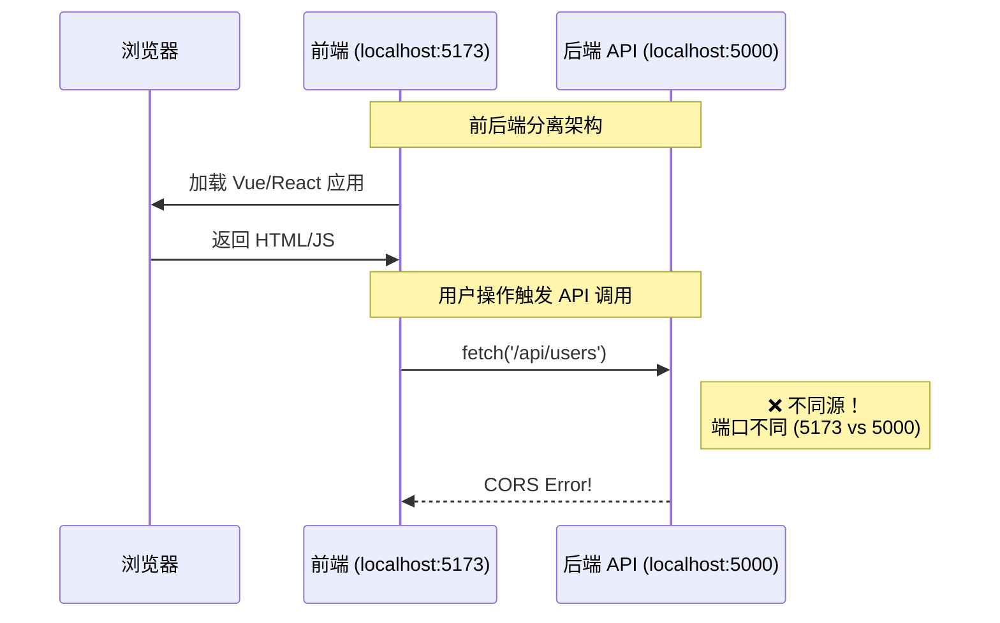
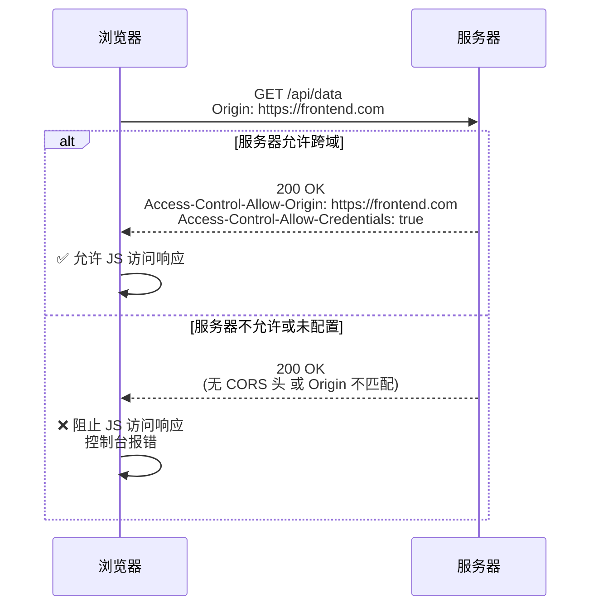
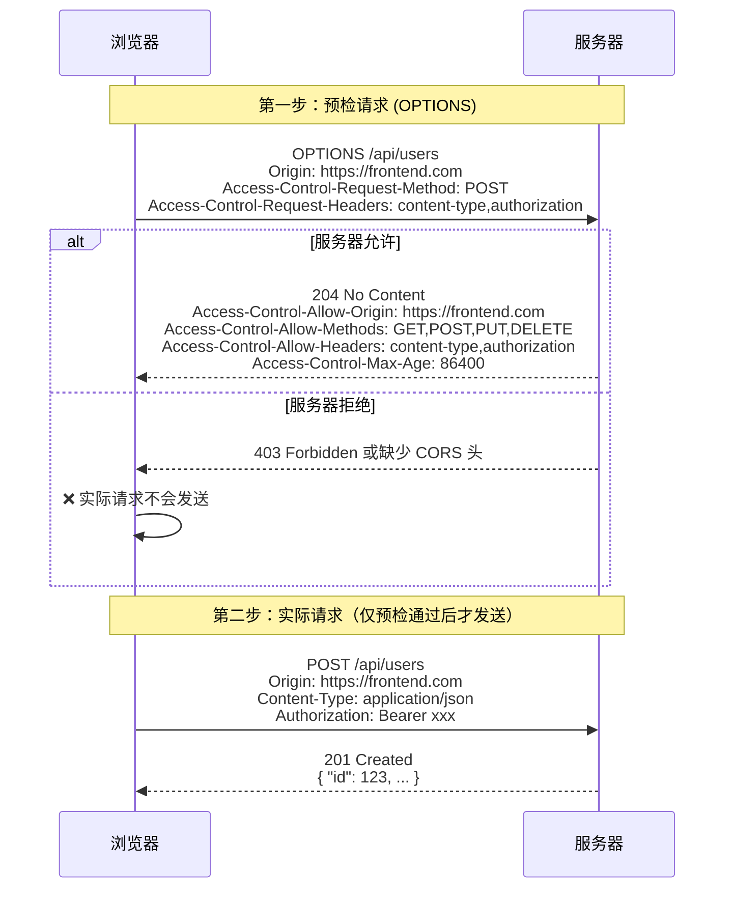
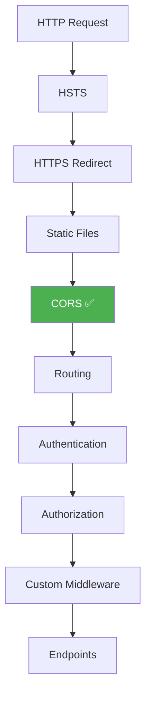

# CORS 跨域资源共享配置详解

> **学习时间**：约 50 分钟 | **难度**：中级 | **前置知识**：HTTP 协议基础、ASP.NET Core 基础
>
> **本节目标**：深入理解 CORS 工作原理，掌握 ASP.NET Core 中 CORS 的各种配置方式，能够正确处理生产环境的跨域问题。

---

## 一、什么是跨域？

### 1.1 同源策略（Same-Origin Policy）

浏览器出于安全考虑，实施了**同源策略**。所谓"同源"是指：

```
URL: https://www.example.com:443/path/page.html
     ━━━━━━━━━━━━  ━━━━━━━━━  ━━━  ━━━━━━━━━━━━━
         │            │        │       │
      协议(https)   域名     端口    路径
```

**只有当协议、域名、端口三者完全相同时，才称为"同源"。**

```mermaid
graph LR
    subgraph "同源（允许访问）"
        A1["https://example.com/page1"]
        A2["https://example.com/page2"]
        A1 --- A2
    end

    subgraph "不同源（被阻止）"
        B1["https://example.com"]
        B2["https://app.example.com"]    %% 子域不同
        B3["http://example.com"]          %% 协议不同
        B4["https://example.com:8080"]    %% 端口不同
        B1 -.- B2
        B1 -.- B3
        B1 -.- B4
    end
```

### 1.2 为什么需要同源策略？

没有同源策略的后果：

| 攻击场景 | 描述 |
|---------|------|
| **CSRF 跨站请求伪造** | 恶意网站冒充用户向目标网站发送请求 |
| **数据窃取** | 恶意页面读取其他网站的敏感信息（Cookie、LocalStorage） |
| **XSS 跨站脚本** | 注入恶意脚本窃取用户会话 |

**示例场景**：
```
用户登录了 bank.com（有登录 Cookie）
用户访问了 evil.com（恶意网站）
evil.com 的 JavaScript 尝试读取 bank.com 的数据 → 同源策略阻止！
```

### 1.3 但为什么又需要 CORS？

随着 Web 应用的发展，前后端分离成为主流架构：



**常见需要跨域的场景**：
- 前后端分离开发（Vue/React + ASP.NET Core API）
- 微服务架构（前端调用多个服务）
- 第三方 API 集成（支付、地图等）
- CDN 静态资源托管
- 多子域名系统（`app.example.com` → `api.example.com`）

---

## 二、CORS 工作原理详解

### 2.1 CORS 是什么？

**CORS (Cross-Origin Resource Sharing)** 即**跨源资源共享**，是 W3C 标准，它允许服务器声明哪些来源可以访问其资源。CORS 通过**额外的 HTTP 头**来实现浏览器和服务器之间的跨域通信协商。

### 2.2 简单请求 vs 预检请求

浏览器将 CORS 请求分为两类：

#### 简单请求（Simple Request）

**同时满足以下所有条件的请求**才是简单请求：

| 条件 | 要求 |
|------|------|
| **方法** | GET、HEAD、POST 之一 |
| **请求头** | 只包含：Accept、Accept-Language、Content-Language、Content-Type |
| **Content-Type** | 仅限：application/x-www-form-urlencoded、multipart/form-data、text/plain |

**简单请求流程**：



#### 预检请求（Preflight Request）

**不满足简单请求条件时**，浏览器会先发送一个 `OPTIONS` 请求来询问服务器是否允许实际请求：

**触发预检的情况**：
- 使用 PUT、DELETE 方法
- Content-Type 为 application/json
- 自定义请求头（如 Authorization、X-Custom-Header）

**预检请求流程**：



### 2.3 关键 HTTP 响应头说明

| 响应头 | 说明 | 示例值 |
|--------|------|--------|
| `Access-Control-Allow-Origin` | 允许的来源 | `*` 或 `https://example.com` |
| `Access-Control-Allow-Methods` | 允许的 HTTP 方法 | `GET,POST,PUT,DELETE` |
| `Access-Control-Allow-Headers` | 允许的请求头 | `Content-Type,Authorization` |
| `Access-Control-Expose-Headers` | 暴露给浏览器的响应头 | `X-Total-Count,X-Request-Id` |
| `Access-Control-Allow-Credentials` | 是否允许携带凭证 | `true` / `false` |
| `Access-Control-Max-Age` | 预检结果缓存时间（秒） | `86400` (24小时) |

---

## 三、ASP.NET Core 中配置 CORS

### 3.1 基础配置方法

ASP.NET Core 提供了完整的 CORS 中间件支持：

```csharp
// Program.cs
using Microsoft.AspNetCore.Cors;

var builder = WebApplication.CreateBuilder(args);

// ========== 方式一：全局默认策略 ==========
builder.Services.AddCors(options =>
{
    options.AddDefaultPolicy(policy =>
    {
        policy.WithOrigins("https://example.com")
              .AllowAnyHeader()
              .AllowAnyMethod();
    });
});

// ========== 方式二：命名策略（推荐）==========
builder.Services.AddCors(options =>
{
    options.AddPolicy("AllowSpecificOrigins", policy =>
    {
        policy.WithOrigins(
                "https://frontend.example.com",
                "https://admin.example.com",
                "http://localhost:5173",           // 开发环境
                "http://localhost:3000"            // 另一个前端框架
              )
              .AllowAnyHeader()
              .AllowAnyMethod()
              .AllowCredentials();                 // 允许携带 Cookie
    });

    // 开发专用策略
    options.AddPolicy("DevPolicy", policy =>
    {
        policy.SetIsOriginAllowed(_ => true)       // 允许所有来源
              .AllowAnyHeader()
              .AllowAnyMethod()
              .AllowCredentials();
    });

    // 公开 API 策略（不需要认证）
    options.AddPolicy("PublicApi", policy =>
    {
        policy.AllowAnyOrigin()                    // 允许所有来源
              .AllowAnyMethod()
              .AllowAnyHeader()
              .WithExposedHeaders("X-Pagination"); // 暴露自定义头
    });
});

var app = builder.Build();

// 启用 CORS 中间件（必须在 UseAuthentication 和 UseAuthorization 之前！）
if (app.Environment.IsDevelopment())
{
    app.UseCors("DevPolicy");                     // 开发环境使用宽松策略
}
else
{
    app.UseCors("AllowSpecificOrigins");           // 生产环境使用严格策略
}

// 其他中间件...
app.UseAuthentication();                          // 认证中间件
app.UseAuthorization();                           // 授权中间件
app.MapControllers();

app.Run();
```

### 3.2 配置选项详解

#### WithOrigins() - 指定允许的来源

```csharp
// 单个来源
policy.WithOrigins("https://myapp.com")

// 多个来源
policy.WithOrigins(
    "https://myapp.com",
    "https://admin.myapp.com",
    "http://localhost:5173"
)

// 从配置读取（推荐用于多环境）
var allowedOrigins = configuration.GetSection("Cors:AllowedOrigins").Get<string[]>();
policy.WithOrigins(allowedOrigins);
```

#### AllowAnyOrigin() - 允许所有来源

```csharp
// ⚠️ 仅用于公开 API 或开发环境！
policy.AllowAnyOrigin()

// 等价于
policy.SetIsOriginAllowed(_ => true);
```

**重要警告**：`AllowAnyOrigin()` 与 `AllowCredentials()` 同时使用是**不被规范允许的组合**！

#### AllowAnyMethod() - 允许所有 HTTP 方法

```csharp
policy.AllowAnyMethod()

// 或者明确指定
policy.WithMethods("GET", "POST", "PUT", "DELETE", "OPTIONS");
```

#### AllowAnyHeader() - 允许所有请求头

```csharp
policy.AllowAnyHeader()

// 或者明确指定（更安全）
policy.WithHeaders(
    "Content-Type",
    "Authorization",
    "X-Requested-With",
    "X-Custom-Token"
);
```

#### AllowCredentials() - 允许携带凭证

```csharp
policy.AllowCredentials()

// 当启用时：
// - 浏览器会在请求中自动携带 Cookie
// - 不能与 AllowAnyOrigin() 同时使用
// - 必须指定具体的 Origin
```

#### ExposeHeaders() - 暴露自定义响应头

```csharp
// 默认情况下，JS 只能访问以下标准响应头：
// Cache-Control, Content-Language, Content-Type,
// Expires, Last-Modified, Pragma

// 如果需要在 JS 中读取自定义头，必须显式暴露：
policy.WithExposedHeaders(
    "X-Total-Count",        // 分页总数
    "X-Request-Id",         // 请求追踪 ID
    "X-RateLimit-Remaining" // 速率限制剩余次数
);
```

#### SetPreflightMaxAge() - 缓存预检结果

```csharp
// 设置预检请求结果的缓存时间（秒）
policy.SetPreflightMaxAge(TimeSpan.FromHours(24));  // 86400 秒

// 效果：24小时内同一来源的同类请求不再发送 OPTIONS 预检
// 可以显著减少网络请求数量，提升性能
```

### 3.3 在控制器或 Action 上应用策略

除了全局配置，还可以在局部应用 CORS 策略：

```csharp
[ApiController]
[Route("api/[controller]")]
[EnableCors("AllowSpecificOrigins")]  // 控制器级别
public class ProductsController : ControllerBase
{
    [HttpGet]
    public IActionResult Get()
    {
        return Ok(products);
    }

    [HttpPost]
    [DisableCors]  // 禁用此 Action 的 CORS（极少使用）
    public IActionResult Create([FromBody] Product product)
    {
        // ...
    }
}

// 另一个控制器使用不同的策略
[ApiController]
[Route("api/[controller]")]
[EnableCors("PublicApi")]
public class PublicDataController : ControllerBase
{
    // 这个控制器的接口可以被任何前端访问
}
```

---

## 四、中间件顺序的重要性

### 4.1 正确的中间件顺序



**CORS 中间件的位置非常关键**：

```csharp
var app = builder.Build();

// ✅ 正确顺序
app.UseHttpsRedirection();
app.UseStaticFiles();
app.UseCors("MyPolicy");           // ← 必须在这里
app.UseAuthentication();           // ← CORS 之后
app.UseAuthorization();
app.MapControllers();

// ❌ 错误顺序（CORS 在认证之后）
// app.UseAuthentication();
// app.UseCors("MyPolicy");         // ← 可能导致认证失败但 CORS 未生效
// app.UseAuthorization();
```

**原因分析**：
- CORS 中间件需要在认证之前运行
- 因为 OPTIONS 预检请求通常不携带认证头（如 Token）
- 如果先执行认证逻辑，OPTIONS 请求可能被 401 拒绝
- 导致浏览器无法完成预检流程，真正的请求也不会发出

---

## 五、生产环境安全配置

### 5.1 绝对禁止的危险组合

```csharp
// 🚨🚨🚨 危险！绝对不要在生产环境中这样配置！！！🚨🚨🚨
builder.Services.AddCors(options =>
{
    options.AddPolicy("DangerousPolicy", policy =>
    {
        policy.AllowAnyOrigin()        // 允许任何来源
              .AllowCredentials();      // 并且允许携带 Cookie
    });
});
```

**为什么危险？**
- `AllowAnyOrigin` 表示任何网站都可以发起跨域请求
- `AllowCredentials` 表示浏览器会带上 Cookie 和认证信息
- 组合起来意味着：任何恶意网站都能以已登录用户的身份向你的 API 发起请求
- 这等同于完全绕过了同源策略的保护！

### 5.2 生产级 CORS 配置模板

```csharp
// CorsConfiguration.cs - CORS 配置类
public static class CorsConfiguration
{
    /// <summary>
    /// 根据环境配置 CORS 服务
    /// </summary>
    public static void AddConfiguredCors(this IServiceCollection services,
                                          IConfiguration config,
                                          IHostEnvironment environment)
    {
        services.AddCors(options =>
        {
            if (environment.IsDevelopment())
            {
                // 开发环境：宽松配置
                options.AddPolicy("DevPolicy", policy =>
                {
                    policy.SetIsOriginAllowed(origin => IsValidDevOrigin(origin))
                          .AllowAnyHeader()
                          .AllowAnyMethod()
                          .AllowCredentials()
                          .SetPreflightMaxAge(TimeSpan.FromHours(1));
                });
            }
            else
            {
                // 生产环境：严格配置
                var origins = config.GetSection("Cors:AllowedOrigins").Get<string[]>()
                             ?? Array.Empty<string>();

                options.AddPolicy("ProductionPolicy", policy =>
                {
                    policy.WithOrigins(origins)
                          .WithMethods("GET", "POST", "PUT", "PATCH", "DELETE", "OPTIONS")
                          .WithHeaders(
                              "Content-Type",
                              "Authorization",
                              "X-Requested-With",
                              "X-CSRF-Token"
                          )
                          .AllowCredentials()
                          .SetPreflightMaxAge(TimeSpan.FromHours(12))
                          .WithExposedHeaders(
                              "X-Pagination",
                              "X-Request-Id",
                              "X-RateLimit-Remaining"
                          );
                });
            }
        });
    }

    /// <summary>
    /// 验证开发环境的来源是否合法
    /// </summary>
    private static bool IsValidDevOrigin(string? origin)
    {
        if (string.IsNullOrEmpty(origin)) return false;

        // 只允许 localhost 和内网地址
        var uri = new Uri(origin);

        return uri.Host == "localhost" ||
               uri.Host == "127.0.0.1" ||
               uri.Host == "::1" ||                  // IPv6 localhost
               uri.Host.EndsWith(".local") ||        // 本地域名
               uri.Host.StartsWith("192.168.") ||    // 内网 IP
               uri.Host.StartsWith("10.") ||         // 内网 IP
               uri.Host.StartsWith("172.");          // 内网 IP
    }
}
```

```json
// appsettings.json - 生产环境配置
{
  "Cors": {
    "AllowedOrigins": [
      "https://www.myapp.com",
      "https://admin.myapp.com",
      "https://app.myapp.com"
    ]
  }
}
```

```csharp
// Program.cs - 使用配置
var builder = WebApplication.CreateBuilder(args);

// 添加 CORS 配置
services.AddConfiguredCors(builder.Configuration, builder.Environment);

var app = builder.Build();

// 根据环境选择策略
var policyName = app.Environment.IsDevelopment() ? "DevPolicy" : "ProductionPolicy";
app.UseCors(policyName);

app.Run();
```

### 5.3 多环境配置方案

```csharp
/// <summary>
/// 更灵活的多环境配置
/// </summary>
public class CorsOptions
{
    public string[] AllowedOrigins { get; set; } = Array.Empty<string>();
    public string[] AllowedMethods { get; set; } =
        new[] { "GET", "POST", "PUT", "DELETE", "OPTIONS" };
    public string[] AllowedHeaders { get; set; } =
        new[] { "Content-Type", "Authorization", "X-Requested-With" };
    public string[] ExposedHeaders { get; set; } =
        new[] { "X-Pagination", "X-Request-Id" };
    public bool AllowCredentials { get; set; } = true;
    public int PreflightMaxAgeSeconds { get; set; } = 86400;
    public bool IsDevelopmentMode { get; set; }
}

public static void AddCorsWithOptions(this IServiceCollection services,
                                       IConfiguration config)
{
    var options = new CorsOptions();
    config.GetSection("Cors").Bind(options);

    services.AddCors(corsOptions =>
    {
        corsOptions.AddPolicy("ConfiguredPolicy", policy =>
        {
            if (options.IsDevelopmentMode || options.AllowedOrigins.Length == 0)
            {
                // 开发模式或无配置时
                policy.SetIsOriginAllowed(origin => ValidateDevOrigin(origin))
                      .AllowAnyHeader()
                      .AllowAnyMethod()
                      .AllowCredentials();
            }
            else
            {
                // 生产模式
                policy.WithOrigins(options.AllowedOrigins)
                      .WithMethods(options.AllowedMethods)
                      .WithHeaders(options.AllowedHeaders)
                      .WithExposedHeaders(options.ExposedHeaders);

                if (options.AllowCredentials)
                {
                    policy.AllowCredentials();
                }

                policy.SetPreflightMaxAge(
                    TimeSpan.FromSeconds(options.PreflightMaxAgeSeconds));
            }
        });
    });
}
```

```json
// appsettings.Development.json
{
  "Logging": { "LogLevel": { "Default": "Debug" } },
  "Cors": {
    "IsDevelopmentMode": true
  }
}

// appsettings.Production.json
{
  "Logging": { "LogLevel": { "Default": "Warning" } },
  "Cors": {
    "AllowedOrigins": [
      "https://myapp.com",
      "https://admin.myapp.com"
    ],
    "AllowedMethods": ["GET", "POST", "PUT", "DELETE"],
    "AllowCredentials": true,
    "PreflightMaxAgeSeconds": 3600
  }
}
```

---

## 六、常见 CORS 错误排查

### 6.1 错误类型及解决方案

#### 错误 1：No 'Access-Control-Allow-Origin' header

```
Access to XMLHttpRequest at 'http://localhost:5000/api/data'
from origin 'http://localhost:5173' has been blocked by CORS policy:
No 'Access-Control-Allow-Origin' header is present on the requested resource.
```

**原因**：服务器没有返回 `Access-Control-Allow-Origin` 响应头

**排查步骤**：

```bash
# 1. 用 curl 测试（绕过浏览器 CORS 限制）
curl -v -X OPTIONS http://localhost:5000/api/data \
  -H "Origin: http://localhost:5173" \
  -H "Access-Control-Request-Method: GET"

# 2. 检查响应头中是否有 Access-Control-Allow-Origin
# 如果没有，说明 CORS 中间件未正确配置或未命中该路由
```

**解决方案**：

```csharp
// 确保已添加 CORS 服务
builder.Services.AddCors(/*...*/);

// 确保已启用 CORS 中间件
app.UseCors("YourPolicyName");

// 确保中间件位置正确（在 UseAuthentication 之前）
```

#### 错误 2：Multiple values for 'Access-Control-Allow-Origin'

```
The 'Access-Control-Allow-Origin' header contains multiple values
'http://localhost:5173, *', but only one is allowed.
```

**原因**：CORS 头被重复设置，可能是：
- 同时使用了 CORS 中间件和自定义中间件添加了相同的头
- IIS/Nginx 反代层也添加了 CORS 头

**解决方案**：

```csharp
// 检查是否有重复配置
// ❌ 不要这样做
app.UseCors("Policy1");
app.UseMiddleware<CustomCorsMiddleware>();  // 又添加了一次 CORS 头

// ✅ 只使用一种方式
app.UseCors("Policy1");
```

如果使用了 Nginx 反代，检查 Nginx 配置：

```nginx
# Nginx 配置 - 选择一种方式
# 方式一：只让 Nginx 处理 CORS
location /api/ {
    add_header Access-Control-Allow-Origin $http_origin always;
    add_header Access-Control-Allow-Methods "GET, POST, PUT, DELETE, OPTIONS" always;
    add_header Access-Control-Allow-Headers "Content-Type, Authorization" always;

    # ASP.NET Core 不再配置 CORS（或使用 DisableCors）
}

# 方式二：只让 ASP.NET Core 处理 CORS（推荐）
location /api/ {
    proxy_pass http://backend:5000;
    # Nginx 不添加 CORS 相关头
}
```

#### 错误 3：Credentials mode is 'include' but origin is '*'

```
The value of the 'Access-Control-Allow-Origin' header in the response
must not be the wildcard '*' when the request's credentials mode is 'include'.
```

**原因**：前端请求设置了 `credentials: 'include'`（携带 Cookie），但后端返回了 `Access-Control-Allow-Origin: *`

**解决方案**：

```javascript
// 前端 Axios 配置
axios.defaults.withCredentials = true;  // 携带 Cookie

// 后端必须指定具体 Origin，不能用 *
policy.WithOrigins("https://your-frontend.com")
      .AllowCredentials();  // 现在可以安全地启用了
```

#### 错误 4：Method PUT/PATCH is not allowed by Access-Control-Allow-Methods

```
Request header field X-Custom-Header is not allowed
by Access-Control-Allow-Headers in preflight response.
```

**原因**：预检请求中声明的头或方法不在白名单中

**解决方案**：

```csharp
policy.WithMethods("GET", "POST", "PUT", "PATCH", "DELETE", "OPTIONS")
      .WithHeaders(
          "Content-Type",
          "Authorization",
          "X-Custom-Header"  // ← 添加缺失的头
      );
```

### 6.2 调试工具和方法

#### 使用浏览器开发者工具

1. 打开 DevTools → Network 面板
2. 触发失败的请求
3. 查看 Request Headers 中的 `Origin` 字段
4. 查看 Response Headers 中的 `Access-Control-*` 字段
5. 对比两者找出不匹配的地方

#### 使用 curl 进行详细测试

```bash
# 测试简单 GET 请求
curl -v http://localhost:5000/api/data \
  -H "Origin: http://localhost:5173"

# 测试带自定义头的请求（会触发预检）
curl -v -X OPTIONS http://localhost:5000/api/data \
  -H "Origin: http://localhost:5173" \
  -H "Access-Control-Request-Method: POST" \
  -H "Access-Control-Request-Headers: Content-Type, Authorization"

# 测试带凭证的请求
curl -v http://localhost:5000/api/user \
  -H "Origin: http://localhost:5173" \
  -H "Cookie: session=abc123"
```

#### 创建 CORS 测试端点

```csharp
// Controllers/DebugController.cs - 仅开发环境可用
[ApiController]
[Route("api/[controller]")]
[Produces("application/json")]
#if DEBUG
public class DebugController : ControllerBase
#else
// 生产环境中隐藏此控制器
public class DebugController : ControllerBase
#endif
{
    private readonly ILogger<DebugController> _logger;

    public DebugController(ILogger<DebugController> logger)
    {
        _logger = logger;
    }

    /// <summary>
    /// CORS 调试端点 - 显示所有请求头信息
    /// </summary>
    [HttpGet("cors-test")]
    [EnableCors("DevPolicy")]
    public IActionResult CorsTest()
    {
        var headers = Request.Headers.ToDictionary(h => h.Key, h => h.Value.ToString());

        return Ok(new
        {
            timestamp = DateTime.UtcNow,
            requestInfo = new
            {
                method = Request.Method,
                path = Request.Path.Value,
                scheme = Request.Scheme,
                host = Request.Host.Value,
                protocol = Request.Protocol
            },
            corsRelatedHeaders = new
            {
                origin = headers.GetValueOrDefault("Origin"),
                hostHeader = headers.GetValueOrDefault("Host"),
                referer = headers.GetValueOrDefault("Referer"),
                authorization = headers.GetValueOrDefault("Authorization") ? "[PRESENT]" : null
            },
            message = "If you can see this response, CORS is working!"
        });
    }
}
```

---

## 七、Nginx/Azure CDN 层面的 CORS 配置

### 7.1 Nginx 反向代理 CORS 配置

当你的 ASP.NET Core 应用部署在 Nginx 之后时，可以选择在 Nginx 层处理 CORS：

```nginx
# nginx.conf - CORS 配置片段

# 全局变量定义
map $http_origin $cors_origin {
    default "";
    "~^https?://(localhost|127\.0\.0\.1)(:\d+)?$" "$http_origin";           # 本地开发
    "~^https://(www\.)?myapp\.com$" "$http_origin";                         # 生产域名
    "~^https://admin\.myapp\.com$" "$http_origin";                           # 管理后台
}

server {
    listen 80;
    server_name api.myapp.com;

    # API 代理
    location /api/ {
        # CORS 预检请求
        if ($request_method = 'OPTIONS') {
            add_header 'Access-Control-Allow-Origin' $cors_origin always;
            add_header 'Access-Control-Allow-Methods' 'GET, POST, PUT, PATCH, DELETE, OPTIONS' always;
            add_header 'Access-Control-Allow-Headers' 'DNT,User-Agent,X-Requested-With,If-Modified-Since,Cache-Control,Content-Type,Range,Authorization,X-CSRF-Token' always;
            add_header 'Access-Control-Max-Age' 1728000 always;
            add_header 'Content-Type' 'text/plain; charset=utf-8';
            add_header 'Content-Length' 0 always;
            return 204;
        }

        # 正常请求
        proxy_pass http://127.0.0.1:5000;
        proxy_set_header Host $host;
        proxy_set_header X-Real-IP $remote_addr;
        proxy_set_header X-Forwarded-For $proxy_add_x_forwarded_for;
        proxy_set_header X-Forwarded-Proto $scheme;

        # 添加 CORS 响应头
        add_header 'Access-Control-Allow-Origin' $cors_origin always;
        add_header 'Access-Control-Allow-Credentials' 'true' always;
        add_header 'Access-Control-Expose-Headers' 'X-Pagination,X-Request-Id' always;
    }

    # 静态资源（不需要 CORS）
    location /static/ {
        root /var/www/html;
        expires 30d;
        add_header Cache-Control "public, immutable";
    }
}
```

### 7.2 Azure CDN / Azure Front Door 配置

如果你使用 Azure CDN 作为边缘节点：

```json
// Azure CDN Rules Engine 配置示例
{
  "rules": [
    {
      "name": "CORS Rule for API",
      "properties": {
        "matchConditions": [
          {
            "matchVariable": "RequestMethod",
            "operator": "Equal",
            "selector": "OPTIONS",
            "negateCondition": false,
            "transforms": []
          }
        ],
        "actions": [
          {
            "name": "ModifyResponseHeader",
            "parameters": {
              "headerAction": "Overwrite",
              "headerName": "Access-Control-Allow-Origin",
              "value": "https://myapp.com"
            }
          },
          {
            "name": "ModifyResponseHeader",
            "parameters": {
              "headerAction": "AppendIfMissing",
              "headerName": "Access-Control-Allow-Methods",
              "value": "GET, POST, PUT, DELETE, OPTIONS"
            }
          },
          {
            "name": "ModifyResponseHeader",
            "parameters": {
              "headerAction": "AppendIfMissing",
              "headerName": "Access-Control-Allow-Headers",
              "value": "Content-Type, Authorization"
            }
          },
          {
            "name": "ModifyResponseHeader",
            "parameters": {
              "headerAction": "AppendIfMissing",
              "headerName": "Access-Control-Max-Age",
              "value": "86400"
            }
          },
          {
            "name": "OverrideOrigin",
            "parameters": {
              "origin": "https://myapp.com",
              "action": "Set"
            }
          }
        ]
      }
    }
  ]
}
```

### 7.3 云服务商 CORS 配置对比

| 平台 | 配置位置 | 特点 |
|------|---------|------|
| **Azure App Service** | Web.config 或 Azure Portal | 可视化界面，支持 CORS 白名单 |
| **AWS API Gateway** | Gateway 设置 | 支持 Lambda 授权集成 |
| **Cloudflare Workers** | Worker 代码 | 高度可编程 |
| **Vercel/Netlify** | vercel.json / netlify.toml | 针对前端部署优化 |
| **Nginx** | nginx.conf | 最灵活，需手动维护 |

---

## 八、完整的生产级配置示例

### 8.1 项目结构

```
Project/
├── Configuration/
│   ├── CorsSettings.cs          # CORS 配置模型
│   └── CorsExtensions.cs        # 扩展方法
├── Properties/
│   ├── launchSettings.json      # 开发环境启动配置
│   └── ...
├── wwwroot/
│   └── ...
├── appsettings.json             # 基础配置
├── appsettings.Development.json # 开发环境
├── appsettings.Staging.json     # 预发布环境
├── appsettings.Production.json  # 生产环境
└── Program.cs                   # 入口文件
```

### 8.2 完整代码实现

```csharp
// Configuration/CorsSettings.cs
namespace MyApi.Configuration;

/// <summary>
/// CORS 配置设置模型
/// </summary>
public class CorsSettings
{
    /// <summary>
    /// 策略名称
    /// </summary>
    public const string PolicyName = "MyCorsPolicy";

    /// <summary>
    /// 是否为开发模式
    /// </summary>
    public bool IsDevelopmentMode { get; set; }

    /// <summary>
    /// 允许的来源列表
    /// </summary>
    public List<string> AllowedOrigins { get; set; } = new();

    /// <summary>
    /// 允许的 HTTP 方法列表
    /// </summary>
    public List<string> AllowedMethods { get; set; } = new()
    {
        "GET", "POST", "PUT", "PATCH", "DELETE", "OPTIONS"
    };

    /// <summary>
    /// 允许的请求头列表
    /// </summary>
    public List<string> AllowedHeaders { get; set; } = new()
    {
        "Content-Type",
        "Authorization",
        "X-Requested-With",
        "X-CSRF-Token",
        "Accept-Language"
    };

    /// <summary>
    /// 暴露给客户端的自定义响应头
    /// </summary>
    public List<string> ExposedHeaders { get; set; } = new()
    {
        "X-Pagination",
        "X-Request-Id",
        "X-RateLimit-Limit",
        "X-RateLimit-Remaining",
        "X-RateLimit-Reset"
    };

    /// <summary>
    /// 是否允许携带凭证（Cookie）
    /// </summary>
    public bool AllowCredentials { get; set; } = true;

    /// <summary>
    /// 预检请求缓存时间（秒），默认 1 小时
    /// </summary>
    public int PreflightMaxAgeSeconds { get; set; } = 3600;
}
```

```csharp
// Configuration/CorsExtensions.cs
using System.Net;
using Microsoft.AspNetCore.Cors.Infrastructure;

namespace MyApi.Configuration;

/// <summary>
/// CORS 配置扩展方法
/// </summary>
public static class CorsExtensions
{
    /// <summary>
    /// 添加配置化的 CORS 服务
    /// </summary>
    public static IServiceCollection AddConfiguredCors(
        this IServiceCollection services,
        IConfiguration configuration,
        IHostEnvironment environment)
    {
        var settings = new CorsSettings();
        configuration.GetSection(nameof(CorsSettings)).Bind(settings);

        // 注册设置到 DI 容器（供其他地方使用）
        services.AddSingleton(settings);

        services.AddCors(options =>
        {
            options.AddPolicy(CorsSettings.PolicyName, ConfigurePolicy(settings));
        });

        return services;
    }

    /// <summary>
    /// 构建 CORS 策略
    /// </summary>
    private static Action<CorsPolicyBuilder> ConfigurePolicy(CorsSettings settings)
    {
        return policy =>
        {
            if (settings.IsDevelopmentMode || settings.AllowedOrigins.Count == 0)
            {
                ConfigureDevelopmentPolicy(policy, settings);
            }
            else
            {
                ConfigureProductionPolicy(policy, settings);
            }
        };
    }

    /// <summary>
    /// 开发环境策略：宽松但有基本验证
    /// </summary>
    private static void ConfigureDevelopmentPolicy(CorsPolicyBuilder policy, CorsSettings settings)
    {
        policy.SetIsOriginAllowed(origin =>
               {
                   if (string.IsNullOrEmpty(origin)) return false;

                   try
                   {
                       var uri = new Uri(origin);

                       // 允许本地开发地址
                       if (uri.Host.Equals("localhost", StringComparison.OrdinalIgnoreCase) ||
                           uri.Host.Equals("127.0.0.1") ||
                           uri.Host.Equals("::1") ||
                           uri.Host.Equals("[::1]") ||
                           uri.Host.EndsWith(".ngrok-free.app")) // 允许 ngrok 隧道
                       {
                           return true;
                       }

                       // 允许内网地址
                       var ip = IPAddress.Parse(uri.Host);
                       return ip.IsPrivateAddressSpace() ||
                              ip.IsLoopback;
                   }
                   catch
                   {
                       // 无法解析的地址，默认拒绝
                       return false;
                   }
               })
               .WithHeaders(settings.AllowedHeaders.ToArray())
               .WithMethods(settings.AllowedMethods.ToArray())
               .AllowCredentials()
               .SetPreflightMaxAge(TimeSpan.FromSeconds(Math.Min(settings.PreflightMaxAgeSeconds, 300)));
    }

    /// <summary>
    /// 生产环境策略：严格且安全
    /// </summary>
    private static void ConfigureProductionPolicy(CorsPolicyBuilder policy, CorsSettings settings)
    {
        policy.WithOrigins(settings.AllowedOrigins.ToArray())
               .WithMethods(settings.AllowedMethods.ToArray())
               .WithHeaders(settings.AllowedHeaders.ToArray());

        if (settings.AllowCredentials)
        {
            policy.AllowCredentials();
        }

        if (settings.ExposedHeaders.Count > 0)
        {
            policy.WithExposedHeaders(settings.ExposedHeaders.ToArray());
        }

        policy.SetPreflightMaxAge(TimeSpan.FromSeconds(settings.PreflightMaxAgeSeconds));
    }
}

/// <summary>
/// IPAddress 扩展方法
/// </summary>
internal static class IpAddressExtensions
{
    internal static bool IsPrivateAddressSpace(this IPAddress ip)
    {
        byte[] bytes = ip.GetAddressBytes();

        // 10.0.0.0/8
        if (bytes[0] == 10) return true;

        // 172.16.0.0/12
        if (bytes[0] == 172 && bytes[1] >= 16 && bytes[1] <= 31) return true;

        // 192.168.0.0/16
        if (bytes[0] == 192 && bytes[1] == 168) return true;

        // 169.254.0.0/16 (link-local)
        if (bytes[0] == 169 && bytes[1] == 254) return true;

        return false;
    }
}
```

```csharp
// Program.cs - 入口文件
using MyApi.Configuration;

var builder = WebApplication.CreateBuilder(args);

// ============================================
// 服务注册
// ============================================

// 数据库
builder.Services.AddDbContext<ApplicationDbContext>(options =>
    options.UseSqlServer(builder.Configuration.GetConnectionString("DefaultConnection")));

// 身份认证
builder.Services.AddAuthentication(JwtBearerDefaults.AuthenticationScheme)
    .AddJwtBearer(options =>
    {
        // JWT 配置...
    });

// CORS（核心配置）
builder.Services.AddConfiguredCors(builder.Configuration, builder.Environment);

// 控制器
builder.Services.AddControllers()
    .AddJsonOptions(options =>
    {
        options.JsonSerializerOptions.PropertyNamingPolicy = JsonNamingPolicy.CamelCase;
    });

// Swagger（仅开发环境）
if (builder.Environment.IsDevelopment())
{
    builder.Services.AddSwaggerGen();
    builder.Services.AddCors(options =>
    {
        options.AddPolicy("SwaggerUI", policy =>
        {
            policy.WithOrigins("https://localhost:5001") // Swagger UI 地址
                  .AllowAnyHeader()
                  .AllowAnyMethod();
        });
    });
}

var app = builder.Build();

// ============================================
// 中间件管道
// ============================================

if (app.Environment.IsDevelopment())
{
    app.UseDeveloperExceptionPage();
    app.UseSwagger();
    app.UseSwaggerUI(c =>
    {
        c.SwaggerEndpoint("/swagger/v1/swagger.json", "My API V1");
    });
}

app.UseHttpsRedirection();

// 静态文件
app.UseStaticFiles(new StaticFileOptions
{
    OnPrepareResponse = ctx =>
    {
        // 缓存静态资源
        if (ctx.File.Name.EndsWith(".css") || ctx.File.Name.EndsWith(".js"))
        {
            ctx.Context.Response.Headers.Append("Cache-Control", "public,max-age=31536000");
        }
    }
});

// ====== 核心：CORS 中间件 ======
app.UseCors(CorsSettings.PolicyName);

// 认证和授权（必须在 CORS 之后）
app.UseAuthentication();
app.UseAuthorization();

// 自定义中间件（如日志、异常处理）
app.UseMiddleware<ExceptionHandlingMiddleware>();
app.UseMiddleware<RequestLoggingMiddleware>();

// 端点路由
app.MapControllers();

// 健康检查
app.MapHealthChecks("/health");

// 启动应用
app.Run();
```

```json
// appsettings.Production.json
{
  "Logging": {
    "LogLevel": {
      "Default": "Warning",
      "Microsoft.AspNetCore": "Error"
    }
  },

  "Cors": {
    "IsDevelopmentMode": false,

    "AllowedOrigins": [
      "https://www.mycompany.com",
      "https://portal.mycompany.com",
      "https://admin.mycompany.com",
      "https://partner.company.com"
    ],

    "AllowedMethods": [
      "GET",
      "POST",
      "PUT",
      "PATCH",
      "DELETE",
      "OPTIONS"
    ],

    "AllowedHeaders": [
      "Content-Type",
      "Authorization",
      "X-Requested-With",
      "X-CSRF-Token"
    ],

    "ExposedHeaders": [
      "X-Pagination",
      "X-Request-Id",
      "X-RateLimit-Remaining"
    ],

    "AllowCredentials": true,
    "PreflightMaxAgeSeconds": 7200
  }
}
```

---

## 九、DO/DON'T 清单

### DO - 推荐做法

- [x] **始终明确指定允许的来源列表**，避免使用通配符 `*`
- [x] **将 CORS 配置放在配置文件中**，方便多环境管理
- [x] **正确放置 CORS 中间件位置**（在 Authentication 之前）
- [x] **设置合理的 `PreflightMaxAge`** 减少不必要的 OPTIONS 请求
- [x] **暴露必要的自定义响应头**（分页信息、追踪 ID 等）
- [x] **区分开发和生产环境的 CORS 策略**
- [x] **使用 `curl` 或 Postman 测试 CORS 配置**，排除浏览器干扰
- [x] **记录 CORS 相关的调试日志**，便于问题排查
- [x] **定期审查允许的来源列表**，移除不再需要的域名

### DON'T - 避免做法

- [x] **绝对不要同时使用 `AllowAnyOrigin()` 和 `AllowCredentials()`**
- [x] **不要在生产环境使用 `SetIsOriginAllowed(_ => true)`**
- [x] **不要忽略 OPTIONS 请求的处理**（虽然框架通常会自动处理）
- [x] **不要在前端尝试绕过 CORS**（这是不可能的，应该修复后端配置）
- [x] **不要在多个层同时配置 CORS**（Nginx + ASP.NET Core 会产生冲突）
- [x] **不要忘记 HTTPS 的影响**（http:// 和 https:// 被视为不同源）
- [x] **不要将敏感 API 对外开放跨域**（内部 API 不需要 CORS）
- [x] **不要忽视子域名差异**（example.com ≠ app.example.com）

---

## 十、练习题

### 练习 1：基础概念题

**题目**：以下哪种情况会触发浏览器发送 CORS 预检请求（OPTIONS）？

A. `GET /api/users` （Content-Type: text/plain）
B. `POST /api/login` （Content-Type: application/x-www-form-urlencoded）
C. `POST /api/users` （Content-Type: application/json）
D. `GET /api/data?token=abc123`

**答案及解析**：
**答案：C**

解析：
- **A**：GET 方法 + 标准 Content-Type → 简单请求，无预检
- **B**：POST 方法 + form 类型 → 简单请求，无预检
- **C**：POST 方法 + JSON 类型 → **非简单请求**，触发预检！因为 `application/json` 不在简单请求允许的 Content-Type 列表中
- **D**：GET 方法 + URL 参数 → 简单请求，无预检

**关键记忆点**：只要 Content-Type 是 `application/json`，或者方法是 PUT/DELETE/PATCH，就会触发预检请求。

---

### 练习 2：配置实践题

**题目**：请为一个电商平台的 ASP.NET Core API 编写 CORS 配置，要求如下：
1. 前端站点：`https://shop.example.com`
2. 管理后台：`https://admin.example.com`
3. 合作伙伴 API：`https://partner.example.com`
4. 需要支持 Cookie 认证
5. 需要暴露 `X-Total-Count` 响应头
6. 预检结果缓存 6 小时

**参考答案**：

```csharp
// Program.cs
builder.Services.AddCors(options =>
{
    options.AddPolicy("EcommercePolicy", policy =>
    {
        policy.WithOrigins(
                "https://shop.example.com",
                "https://admin.example.com",
                "https://partner.example.com"
              )
              .WithMethods("GET", "POST", "PUT", "PATCH", "DELETE", "OPTIONS")
              .WithHeaders(
                  "Content-Type",
                  "Authorization",
                  "X-Requested-With"
              )
              .AllowCredentials()
              .WithExposedHeaders("X-Total-Count")
              .SetPreflightMaxAge(TimeSpan.FromHours(6));  // 21600 秒
    });
});

var app = builder.Build();
app.UseCors("EcommercePolicy");
```

**配置要点说明**：
1. 使用 `WithOrigins` 明确列出三个允许的域名（不能使用 `*`）
2. 因为要支持 Cookie，所以使用 `AllowCredentials()`
3. 使用 `WithExposedHeaders` 让前端能读取分页总数
4. `SetPreflightMaxAge` 设置为 6 小时减少预检请求频率

---

### 练习 3：错误排查题

**题目**：前端团队报告说调用 `/api/orders` 接口出现 CORS 错误，错误信息如下：

```
Access to XMLHttpRequest at 'https://api.example.com/api/orders'
from origin 'https://shop.example.com' has been blocked by CORS policy:
Response to preflight request doesn't pass access control check:
Method PUT is not allowed by Access-Control-Allow-Methods.
```

请问这个问题的原因是什么？如何解决？

**参考答案**：

**问题原因**：
前端的某个请求使用了 `PUT` 方法（可能是更新订单状态），但是后端的 CORS 配置中没有将 `PUT` 加入 `Access-Control-Allow-Methods` 白名单。导致浏览器的预检请求失败。

**解决步骤**：

1. **确认前端调用的方法**：
```javascript
// 前端代码可能是这样的
await axios.put(`/api/orders/${orderId}/status`, { status: 'shipped' })
```

2. **修改后端 CORS 配置**：
```csharp
// 当前配置（缺少 PUT）
policy.WithMethods("GET", "POST", "DELETE", "OPTIONS")

// 修改后（添加 PUT 和 PATCH）
policy.WithMethods("GET", "POST", "PUT", "PATCH", "DELETE", "OPTIONS")
```

3. **验证修复**：
```bash
# 使用 curl 测试预检请求
curl -v -X OPTIONS https://api.example.com/api/orders \
  -H "Origin: https://shop.example.com" \
  -H "Access-Control-Request-Method: PUT"

# 检查响应头中是否包含：
# Access-Control-Allow-Methods: GET, POST, PUT, PATCH, DELETE, OPTIONS
```

**预防措施**：
- 在设计 API 时就确定好所需的 HTTP 方法
- 将所有可能的 CRUD 方法都加入白名单
- 定期进行 CORS 配置审计

---

### 练习题 4：安全分析题

**题目**：以下是某项目的 CORS 配置代码，请指出其中的安全问题并给出改进建议：

```csharp
// 当前配置（有问题）
builder.Services.AddCors(options =>
{
    options.AddPolicy("OpenPolicy", policy =>
    {
        policy.AllowAnyOrigin()
              .AllowAnyMethod()
              .AllowAnyHeader()
              .AllowCredentials()
              .SetPreflightMaxAge(TimeSpan.FromDays(30));
    });
});
```

**参考答案**：

**发现的安全问题**：

| 问题 | 严重程度 | 说明 |
|------|---------|------|
| `AllowAnyOrigin()` + `AllowCredentials()` | **致命** | 违反 CORS 规范，部分浏览器会拒绝此组合 |
| `AllowAnyMethod()` | **高** | 允许包括 TRACE 等不安全的 HTTP 方法 |
| `AllowAnyHeader()` | **中** | 允许任意请求头，增加攻击面 |
| `PreflightMaxAge` 30 天 | **低** | 过长导致策略变更后延迟生效 |

**改进后的安全配置**：

```csharp
builder.Services.AddCors(options =>
{
    options.AddPolicy("SecurePolicy", policy =>
    {
        // 问题 1 修复：从配置文件读取具体来源
        var origins = configuration.GetSection("Cors:Origins").Get<string[]>();
        policy.WithOrigins(origins ?? Array.Empty<string>());

        // 问题 2 修复：明确指定允许的方法
        policy.WithMethods("GET", "POST", "PUT", "PATCH", "DELETE", "OPTIONS");

        // 问题 3 修复：明确指定允许的头
        policy.WithHeaders(
            "Content-Type",
            "Authorization",
            "X-Requested-With",
            "X-CSRF-Token"
        );

        // 保留功能需求
        policy.AllowCredentials();

        // 问题 4 修复：缩短缓存时间
        policy.SetPreflightMaxAge(TimeSpan.FromHours(12));

        // 新增：暴露必要的自定义头
        policy.WithExposedHeaders("X-Request-Id");
    });
});
```

**额外建议**：
- 添加环境检测，开发环境和生产环境使用不同策略
- 添加日志记录，记录每个 CORS 请求的来源
- 定期审计允许的来源列表

---

### 练习题 5：综合实战题

**题目**：假设你正在为一个 SaaS 产品部署 CORS 配置，产品有以下特点：
- 主站：`https://app.saasproduct.com`
- 文档站：`https://docs.saasproduct.com`
- API 网关：`https://api.saasproduct.com`
- 客户可以使用自定义域名（CNAME 到 app.saasproduct.com）
- 部署在 Azure App Service 上，前面有 Cloudflare CDN
- 需要 JWT Token 认证（存储在 localStorage，不是 Cookie）

请给出完整的 CORS 配置方案，并解释你的决策理由。

**参考答案**（综合分析型题目）：

**决策分析**：

**1. 认证方式对 CORS 的影响**

由于 JWT 存储在 localStorage 并通过 Authorization 头传递，**不需要** `AllowCredentials()`。这简化了配置，也提高了安全性。

**2. 自定义域名问题**

客户使用 CNAME 自定义域名是一个挑战。有两种方案：

**方案 A：动态验证（推荐）**
```csharp
policy.SetIsOriginAllowed(origin =>
{
    if (string.IsNullOrEmpty(origin)) return false;

    // 固定域名白名单
    var fixedDomains = new[]
    {
        "app.saasproduct.com",
        "docs.saasproduct.com",
        "localhost"  // 开发环境
    };

    if (fixedDomains.Any(d => origin.EndsWith(d))) return true;

    // 动态查询客户的自定义域名
    return _customerDomainService.IsValidCustomerDomainAsync(origin).Result;
})
.WithMethods("GET", "POST", "PUT", "PATCH", "DELETE", "OPTIONS")
.WithHeaders("Content-Type", "Authorization", "X-API-Key")
.WithExposedHeaders("X-Request-Id", "X-RateLimit-Remaining")
.SetPreflightMaxAge(TimeSpan.FromHours(2));
// 注意：这里没有 AllowCredentials()
```

**方案 B：使用通配符子域名（如果客户域名都是 *.customer.com 格式）**
```csharp
policy.SetIsOriginAllowed(origin =>
{
    if (string.IsNullOrEmpty(origin)) return false;
    try
    {
        var uri = new Uri(origin);
        // 允许主域名及其所有子域名
        return uri.Host.EndsWith(".saasproduct.com") ||
               uri.Host == "saasproduct.com";
    }
    catch
    {
        return false;
    }
})
```

**3. Cloudflare CDN 层配置**

由于 Cloudflare 在最外层，建议在 Cloudflare 处理简单的 CORS 头，减轻源服务器负担：

```javascript
// Cloudflare Worker 或 Rules Engine
addEventListener('fetch', event => {
  const request = event.request;

  if (request.method === 'OPTIONS') {
    // 处理预检请求
    const origin = request.headers.get('Origin');
    if (isValidOrigin(origin)) {
      return new Response(null, {
        status: 204,
        headers: {
          'Access-Control-Allow-Origin': origin,
          'Access-Control-Allow-Methods': 'GET, POST, PUT, DELETE',
          'Access-Control-Allow-Headers': 'Content-Type, Authorization',
          'Access-Control-Max-Age': '7200'
        }
      });
    }
  }

  // 正常请求转发到源服务器
  event.respondWith(fetch(request));
});
```

**4. Azure App Service 配置**

在 Azure Portal 中：
- CORS 配置设置为**禁用**（让 Cloudflare 处理）
- 或者只添加 Cloudflare 的回源 IP 作为受信任代理

**5. 完整配置清单**

| 层级 | 配置内容 | 备注 |
|------|---------|------|
| **Cloudflare** | CORS 基础规则（Origin、Methods、Headers） | 边缘处理，性能最优 |
| **Azure App Service** | 禁用内置 CORS | 避免冲突 |
| **ASP.NET Core** | 精简 CORS 或 DisableCors | 作为备用层 |
| **监控** | 日志记录异常 Origin | 安全审计 |

**6. 监控和告警**

```csharp
// 添加 CORS 请求日志中间件
public class CorsLoggingMiddleware
{
    private readonly RequestDelegate _next;
    private readonly ILogger _logger;

    public async Task InvokeAsync(HttpContext context)
    {
        var origin = context.Request.Headers["Origin"].FirstOrDefault();

        if (!string.IsNullOrEmpty(origin))
        {
            _logger.LogInformation(
                "CORS Request: {Method} {Path} from {Origin}",
                context.Request.Method,
                context.Request.Path,
                origin
            );

            // 检测可疑来源
            if (IsSuspiciousOrigin(origin))
            {
                _logger.LogWarning(
                    "Suspicious CORS origin detected: {Origin} at {Time}",
                    origin,
                    DateTime.UtcNow
                );
            }
        }

        await _next(context);
    }
}
```

---

## 十一、延伸阅读

### 官方文档

- [MDN - CORS (Cross-Origin Resource Sharing)](https://developer.mozilla.org/en-US/docs/Web/HTTP/CORS) - 最权威的 CORS 技术规范说明
- [Fetch Standard - CORS Protocol](https://fetch.spec.whatwg.org/#http-cors-protocol) - W3C 规范原文
- [微软官方 - 在 ASP.NET Core 中启用 CORS](https://learn.microsoft.com/aspnet/core/security/cors/) - ASP.NET Core CORS 官方指南

### 深入理解

- [CORS 详解（阮一峰）](https://www.ruanyifeng.com/blog/2016/04/cors.html) - 中文 CORS 经典教程
- [Understanding CORS](https://medium.com/@daphnesmit/cors-explained-668bfe021c7e) - 英文深度解析文章
- [CORS Security FAQ](https://w3c.github.io/webappsec-cors-for-developers/) - W3C 安全最佳实践

### 工具和测试

- [CORS Tester](https://www.test-cors.org/) - 在线 CORS 测试工具
- [Postman](https://www.postman.com/) - 手动测试 API 和 CORS
- [curl](https://curl.se/) - 命令行 HTTP 客户端，适合调试

### 安全相关

- [OWASP Cross-Site Request Forgery (CSRF)](https://owasp.org/www-community/attacks/csrf) - CSRF 防护
- [SameSite Cookie 属性](https://developer.mozilla.org/en-US/docs/Web/HTTP/Cookies/SameSite_attributes) - Cookie 安全配置
- [Content Security Policy (CSP)](https://developer.mozilla.org/en-US/docs/Web/HTTP/CSP) - 内容安全策略

---

## 总结

CORS 是现代 Web 开发中不可避免的重要话题。通过本节的深入学习，你应该掌握了：

1. **核心概念**：同源策略的定义、为什么需要 CORS、简单请求与预检请求的区别
2. **工作原理**：浏览器如何判断和处理跨域请求、关键的 HTTP 头含义
3. **配置技能**：ASP.NET Core 中 CORS 中间件的完整配置方法
4. **安全意识**：什么配置是危险的、生产环境应该如何做
5. **排错能力**：能够快速定位和解决常见的 CORS 错误
6. **架构思维**：理解多层部署（CDN、反代、应用）时的 CORS 策略

**记住几个关键原则**：
- **安全性第一**：宁可配置严格一些，也不要留下安全隐患
- **环境分离**：开发和生产的 CORS 策略应该不同
- **配置驱动**：将 CORS 策略放入配置文件，便于管理和审计
- **充分测试**：上线前务必在各种环境下测试 CORS 配置

掌握 CORS 配置是每一个全栈开发者必备的技能。希望本节能帮助你在实际项目中游刃有余地处理跨域问题！

继续加油，你已经完成了 **04-前端集成** 这一章的全部学习内容！
