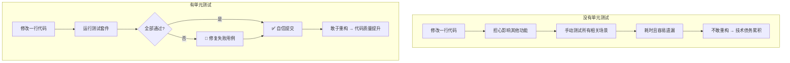
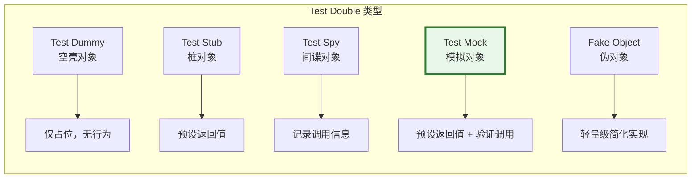
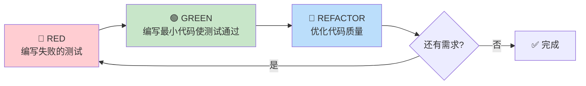
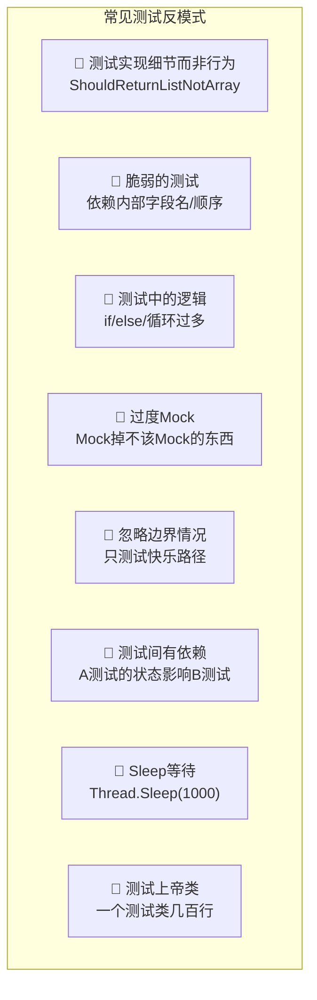

# 单元测试 (xUnit + Moq) 完全指南

> **学习目标**：掌握 ASP.NET Core 项目中使用 xUnit 和 Moq 进行单元测试的完整流程，包括测试框架基础、Mock 模拟框架、Controller/Service 层测试、异步代码测试和 TDD 开发模式
>
> **难度等级**：⭐⭐⭐⭐ 中高级
>
> **前置知识**：C# 编程基础、依赖注入、async/await 异步编程、ASP.NET Core MVC 基础
>
> **预计时间**：75分钟

---

## 1. 为什么需要单元测试？

### 1.1 单元测试的价值



**核心价值**：

| 价值维度 | 说明 | 实际收益 |
|----------|------|---------|
| **质量保证** | 捕捉回归 Bug，防止已知问题复发 | 减少80%的生产环境缺陷 |
| **重构信心** | 有测试覆盖的代码可以安全修改 | 避免技术债务积累 |
| **活文档** | 测试代码描述了代码的预期行为 | 新人快速理解业务逻辑 |
| **设计驱动** | 可测试的代码通常设计更好 | 低耦合、高内聚 |
| **调试加速** | 失败的测试能精确定位问题来源 | 调试时间减少60%+ |

### 1.2 生活类比

```
单元测试 = 自动化体检报告

没有体检：
  你不知道身体哪里有问题，等生病了才发现（生产环境Bug）

有定期体检：
  每次改代码后跑一遍测试 = 做一次全面体检
  血压高了？血脂异常？→ 立刻知道并修复
```

---

## 2. 核心概念与术语

### 2.1 AAA 模式（Arrange-Act-Assert）

这是编写单元测试的黄金法则，每个测试方法都应该遵循这个结构：

```csharp
[Fact]
public void Add_TwoNumbers_ReturnsCorrectSum()
{
    // ====== Arrange（准备）======
    // 准备测试所需的数据、对象、依赖
    var calculator = new Calculator();
    int a = 10;
    int b = 20;

    // ====== Act（执行）======
    // 调用被测方法，获取实际结果
    var result = calculator.Add(a, b);

    // ====== Assert（断言）======
    // 验证结果是否符合预期
    Assert.Equal(30, result);
}
```

| 阶段 | 英文 | 做什么 | 类比 |
|------|------|--------|------|
| Arrange | 准备 | 创建实例、设置参数、配置 Mock | 准备实验器材 |
| Act | 执行 | 调用被测方法 | 进行实验 |
| Assert | 断言 | 验证结果是否符合预期 | 检查实验结果 |

### 2.2 SUT - System Under Test（被测系统）

SUT 是你正在测试的那个类或方法。在单元测试中，我们只关注 SUT 的行为：

```csharp
// SUT: ArticleService 是被测系统
// 它的依赖（IArticleRepository, ILogger）应该被 Mock 掉
public class ArticleServiceTests
{
    private readonly ArticleService _sut;  // System Under Test
    private readonly Mock<IArticleRepository> _mockRepo;
    private readonly Mock<ILogger<ArticleService>> _mockLogger;

    public ArticleServiceTests()
    {
        _mockRepo = new Mock<IArticleRepository>();
        _mockLogger = new Mock<ILogger<ArticleService>>();
        _sut = new ArticleService(_mockRepo.Object, _mockLogger.Object);
    }
}
```

### 2.3 Test Double（测试替身）

当 SUT 依赖外部组件时，我们不使用真实实现，而是使用"替身"：



**Moq 库主要提供的是 Mock（模拟对象），它同时具备 Stub 和 Spy 的能力。**

---

## 3. xUnit 测试框架基础

### 3.1 项目搭建

```bash
# 创建解决方案和项目
dotnet new sln -n BlogApi.Tests
dotnet new xunit -n BlogApi.UnitTests
dotnet sln add BlogApi.UnitTests/BlogApi.UnitTests.csproj

# 添加被测项目的引用
dotnet add BlogApi.UnitTests/BlogApi.UnitTests.csproj reference ../BlogApi/BlogApi.csproj

# 安装必要的 NuGet 包
dotnet add BlogApi.UnitTests/BlogApi.UnitTests.csproj package Moq
dotnet add BlogApi.UnitTests/BlogApi.UnitTests.csproj package FluentAssertions   # 可选：更优雅的断言库
dotnet add BlogApi.UnitTests/BlogApi.UnitTests.csproj package Microsoft.NET.Test.Sdk
```

生成的测试项目结构：
```
BlogApi.UnitTests/
├── BlogApi.UnitTests.csproj
├── Services/
│   ├── ArticleServiceTests.cs       # 文章服务测试
│   └── UserServiceTests.cs         # 用户服务测试
├── Controllers/
│   └── ArticlesControllerTests.cs  # 控制器测试
└── Helpers/
    └── TestData.cs                 # 测试数据辅助类
```

### 3.2 [Fact] vs [Theory]

xUnit 提供两种主要的测试标记方式：

#### [Fact] - 单一事实测试

每个 `[Fact]` 方法是一个独立的测试用例，验证一个特定的行为：

```csharp
public class CalculatorTests
{
    [Fact]
    public void Add_PositiveNumbers_ReturnsCorrectSum()
    {
        // Arrange
        var calc = new Calculator();

        // Act
        var result = calc.Add(3, 5);

        // Assert
        Assert.Equal(8, result);
    }

    [Fact]
    public void Add_NegativeNumbers_ReturnsCorrectSum()
    {
        var calc = new Calculator();
        var result = calc.Add(-3, -5);
        Assert.Equal(-8, result);
    }

    [Fact]
    public void Divide_ByZero_ThrowsDivideByZeroException()
    {
        var calc = new Calculator();

        // Assert: 验证抛出特定异常
        Assert.Throws<DivideByZeroException>(() => calc.Divide(10, 0));
    }
}
```

#### [Theory] - 参数化测试

`[Theory]` 允许一个测试方法接收多组输入数据，避免重复编写相似的测试：

```csharp
public class StringValidatorTests
{
    [Theory]
    [InlineData("user@example.com", true)]
    [InlineData("test.domain@co.uk", true)]
    [InlineData("invalid-email", false)]
    [InlineData("@no-user.com", false)]
    [InlineData("missing@tld.", false)]
    public void IsValidEmail_VariousInputs_ReturnsExpectedResult(
        string email, bool expectedIsValid)
    {
        // Arrange
        var validator = new EmailValidator();

        // Act
        var result = validator.IsValid(email);

        // Assert
        Assert.Equal(expectedIsValid, result);
    }

    [Theory]
    [MemberData(nameof(GetPasswordTestData))]
    public void IsStrongPassword_TestData_ReturnsExpectedResult(
        string password, bool expected)
    {
        var validator = new PasswordValidator();
        Assert.Equal(expected, validator.IsStrong(password));
    }

    // 提供测试数据的静态方法
    public static TheoryData<string, bool> GetPasswordTestData()
    {
        return new TheoryData<string, bool>
        {
            { "Abc123!@#", true },      // 强密码
            { "password", false },       // 太简单
            { "ABCDEF12", false },       // 缺少特殊字符
            { "Ab!2", false },           // 太短
            { "MyP@ssw0rd_2024", true } // 强密码
        };
    }
}
```

**[Theory] 数据源对比**：

| 特性 | InlineData | MemberData | ClassData |
|------|-----------|------------|-----------|
| 适用场景 | 简单字面量 | 需要计算的复杂数据 | 需要共享上下文 |
| 数据类型 | 基本类型/常量 | 任意类型 | 通过类传递复杂对象 |
| 可读性 | 高（直接看到参数） | 中 | 低 |

### 3.3 Assert 类完整指南

xUnit 的 `Assert` 类提供了丰富的断言方法：

```csharp
using Xunit;

public class AssertExamples
{
    #region 相等性断言
    [Fact]
    public void Equal_Demonstrations()
    {
        // 基本相等
        Assert.Equal(42, 42);
        Assert.NotEqual(41, 42);

        // 字符串比较（区分大小写）
        Assert.Equal("Hello", "Hello");
        Assert.NotEqual("hello", "Hello");  // 大小写不同

        // 忽略大小写的字符串比较
        Assert.Equal("hello", "Hello", ignoreCase: true);

        // 集合相等（元素相同即可）
        Assert.Equal(new[] { 1, 2, 3 }, new[] { 3, 2, 1 });

        // 对象深度比较（需要重写Equals或使用FluentAssertions）
        var expected = new UserDto { Id = 1, Name = "张三" };
        var actual = new UserDto { Id = 1, Name = "张三" };
        Assert.Equivalent(expected, actual);  // xUnit 2.4.2+
    }
    #endregion

    #region 包含性断言
    [Fact]
    public void Contains_Demonstrations()
    {
        // 字符串包含
        Assert.Contains("world", "hello world");
        Assert.DoesNotContain("xyz", "hello world");

        // 集合包含
        var numbers = new[] { 1, 3, 5, 7, 9 };
        Assert.Contains(5, numbers);
        Assert.DoesNotContain(2, numbers);

        // 谓词匹配
        Assert.Contains(numbers, n => n > 8);  // 9 > 8
    }
    #endregion

    #region 条件断言
    [Fact]
    public void Condition_Demonstrations()
    {
        Assert.True(5 > 3);
        Assert.False(5 < 3);
        Assert.NotNull("not null");
        Assert.Null(null);

        // 范围判断
        Assert.InRange(50, 0, 100);     // 0 <= 50 <= 100
        Assert.NotInRange(-1, 0, 100);   // -1 不在 [0,100]

        // 类型检查
        Assert.IsType<string>("hello");          // 精确匹配
        Assert.IsAssignableFrom<object>("hello"); // 允许子类型
    }
    #endregion

    #region 异常断言
    [Fact]
    public void Exception_Demonstrations()
    {
        // 验证抛出指定类型的异常
        var ex = Record.Exception(() => throw new NotFoundException("找不到"));
        Assert.NotNull(ex);
        Assert.IsType<NotFoundException>(ex);
        Assert.Equal("找不到", ex.Message);

        // 更简洁的方式
        Assert.Throws<NotFoundException>(() =>
            throw new NotFoundException("找不到"));

        // 同时捕获异常以进行额外验证
        var thrownEx = Assert.Throws<InvalidOperationException>(() =>
        {
            if (true) throw new InvalidOperationException("操作无效");
        });
        Assert.Contains("操作无效", thrownEx.Message);
    }
    #endregion

    #region 异步断言
    [Fact]
    public async Task Async_Demonstrations()
    {
        // 异步方法的返回值断言
        async Task<int> GetValueAsync() => await Task.FromResult(42);

        var result = await GetValueAsync();
        Assert.Equal(42, result);

        // 异步方法抛出异常
        async Task ThrowAsync() =>
            await Task.FromException(new TaskCanceledException());

        await Assert.ThrowsAsync<TaskCanceledException>(ThrowAsync);
    }
    #endregion
}
```

### 3.4 IClassFixture 共享上下文

当多个测试需要共享同一个初始化资源时，使用 `IClassFixture<T>`：

```csharp
/// <summary>
/// Fixture: 在同一个测试类的所有测试之间共享的实例
/// </summary>
public class DatabaseTestFixture : IDisposable
{
    public ApplicationDbContext DbContext { get; }
    public List<User> SeedUsers { get; } = new();

    public DatabaseTestFixture()
    {
        // 使用内存数据库创建测试专用的DbContext
        var options = new DbContextOptionsBuilder<ApplicationDbContext>()
            .UseInMemoryDatabase(databaseName: Guid.NewGuid().ToString())
            .Options;

        DbContext = new ApplicationDbContext(options);

        // 种子数据
        SeedUsers.AddRange(new[]
        {
            new User { Id = 1, Email = "admin@test.com", Nickname = "管理员" },
            new User { Id = 2, Email = "user@test.com", Nickname = "普通用户" },
            new User { Id = 3, Email = "author@test.com", Nickname = "作者" },
        });
        DbContext.Users.AddRange(SeedUsers);
        DbContext.SaveChanges();
    }

    public void Dispose()
    {
        DbContext.Dispose();  // 测试结束后清理资源
    }
}

/// <summary>
/// 使用Fixture的测试类
/// </summary>
public class UserServiceWithFixtureTests : IClassFixture<DatabaseTestFixture>
{
    private readonly DatabaseTestFixture _fixture;
    private readonly UserService _sut;

    public UserServiceWithFixtureTests(DatabaseTestFixture fixture)
    {
        _fixture = fixture;
        _sut = new UserService(fixture.DbContext,
            Mock.Of<ILogger<UserService>>());
    }

    [Fact]
    public void GetAllUsers_ReturnsAllSeededUsers()
    {
        // Act
        var users = _sut.GetAllUsers();

        // Assert
        Assert.Equal(3, users.Count);
        Assert.Contains(users, u => u.Nickname == "管理员");
    }

    [Fact]
    public void GetUserById_ExistingId_ReturnsCorrectUser()
    {
        // Act
        var user = _sut.GetUserById(1);

        // Assert
        Assert.NotNull(user);
        Assert.Equal("admin@test.com", user.Email);
    }
}
```

### 3.5 Collection Fixtures

当多个不同的测试类需要共享同一个 Fixture 时：

```csharp
// 定义集合Fixture
public class SharedRedisFixture : IDisposable
{
    public IConnectionMultiplexer Redis { get; }

    public SharedRedisFixture()
    {
        // 连接测试用的Redis实例（或使用内存模拟）
        Redis = ConnectionMultiplexer.Connect("localhost:6379");
    }

    public void Dispose()
    {
        Redis.Dispose();
    }
}

// 定义集合
[CollectionDefinition("RedisCollection")]
public class RedisCollection : ICollectionFixture<SharedRedisFixture> { }

// 多个测试类可以使用同一集合
[Collection("RedisCollection")]
public class CacheServiceTests
{
    private readonly SharedRedisFixture _redis;
    public CacheServiceTests(SharedRedisFixture redis) => _redis = redis;

    [Fact]
    public void Set_GetValue_ReturnsCachedValue() { /* ... */ }
}

[Collection("RedisCollection")]
public class SessionServiceTests
{
    private readonly SharedRedisFixture _redis;
    public SessionServiceTests(SharedRedisFixture redis) => _redis = redis;

    [Fact]
    public void CreateSession_ValidUser_ReturnsSessionId() { /* ... */ }
}
```

---

## 4. Moq 模拟框架完全指南

Moq 是 .NET 生态中最流行的 Mock 框架，它让你能够轻松创建和管理测试替身。

### 4.1 基础用法：创建和配置 Mock

```csharp
using Moq;

public class MoqBasics
{
    [Fact]
    public void Basic_Mock_Setup_And_Verify()
    {
        // ====== 创建 Mock 对象 ======
        var mockRepo = new Mock<IArticleRepository>();

        // ====== Setup: 配置 Mock 行为 ======
        // 当调用 GetByIdAsync(1) 时返回一个预定义的Article对象
        mockRepo.Setup(r => r.GetByIdAsync(1))
            .ReturnsAsync(new Article
            {
                Id = 1,
                Title = "ASP.NET Core 入门",
                Content = "...",
                Status = PostStatus.Published
            });

        // 当调用 GetByIdAsync(999) 时返回 null（默认行为）
        // mockRepo.Setup(r => r.GetByIdAsync(999))
        //     .ReturnsAsync((Article?)null);

        // ====== 使用 Mock（注入到SUT）======
        var service = new ArticleService(mockRepo.Object,
            Mock.Of<ILogger<ArticleService>>());

        // ====== 执行测试 ======
        var article = await service.GetArticleByIdAsync(1);

        // ====== 断言结果 ======
        Assert.NotNull(article);
        Assert.Equal("ASP.NET Core 入门", article.Title);

        // ====== Verify: 验证方法是否被正确调用 ======
        mockRepo.Verify(r => r.GetByIdAsync(1), Times.Once());
        // Times.Once()  - 恰好调用1次
        // Times.Never() - 从未调用
        // Times.AtLeast(2) - 至少调用2次
        // Times.AtMost(3) - 最多调用3次
        // Times.Exactly(n) - 恰好n次
        // Times.Between(1,3) - 1到3次之间
    }
}
```

### 4.2 Returns / Callback 配置返回值

```csharp
public class MoqReturnsAndCallback
{
    [Fact]
    public async Task Returns_StaticValue_ReturnsConfiguredValue()
    {
        var mockRepo = new Mock<IArticleRepository>();

        // 方式1：直接返回固定值
        mockRepo.Setup(r => r.GetAllAsync())
            .ReturnsAsync(new List<Article>
            {
                new() { Id = 1, Title = "文章1" },
                new() { Id = 2, Title = "文章2" },
            });

        var results = await mockRepo.Object.GetAllAsync();
        Assert.Equal(2, results.Count);
    }

    [Fact]
    public async Task Returns_DynamicValue_ComputesBasedOnInput()
    {
        var mockRepo = new Mock<IArticleRepository>();

        // 方式2：根据输入参数动态计算返回值
        mockRepo.Setup(r => r.GetByIdAsync(It.IsAny<int>()))
            .ReturnsAsync((int id) => new Article
            {
                Id = id,
                Title = $"文章 #{id}",
                Content = $"这是第{id}篇文章的内容..."
            });

        var article1 = await mockRepo.Object.GetByIdAsync(1);
        var article99 = await mockRepo.Object.GetByIdAsync(99);

        Assert.Equal("文章 #1", article1.Title);
        Assert.Equal("文章 #99", article99.Title);
    }

    [Fact]
    public async Task Callback_ExecutesSideEffectLogic()
    {
        var callLog = new List<int>();
        var mockRepo = new Mock<IArticleRepository>();

        // Callback: 在方法被调用时执行额外的逻辑（用于调试或追踪）
        mockRepo.Setup(r => r.DeleteAsync(It.IsAny<int>()))
            .Returns(Task.CompletedTask)
            .Callback<int>(id =>
            {
                Console.WriteLine($"[Mock] DeleteAsync 被调用，ID={id}");
                callLog.Add(id);  // 记录调用历史
            });

        // 执行删除操作
        await mockRepo.Object.DeleteAsync(1);
        await mockRepo.Object.DeleteAsync(5);
        await mockRepo.Object.DeleteAsync(10);

        // 验证Callback确实被执行了
        Assert.Equal(3, callLog.Count);
        Assert.Equal(new[] { 1, 5, 10 }, callLog);
    }

    [Fact]
    public void Returns_SequenceOfValues_ReturnsDifferentValuesEachCall()
    {
        var mockCounter = new Mock<ICounter>();

        // 每次调用返回序列中的下一个值
        mockCounter.Setup(c => c.GetNext())
            .Returns(10)    // 第1次调用返回10
            .Returns(20)    // 第2次调用返回20
            .Returns(30);   // 第3次及以后都返回30

        Assert.Equal(10, mockCounter.Object.GetNext());
        Assert.Equal(20, mockCounter.Object.GetNext());
        Assert.Equal(30, mockCounter.Object.GetNext());
        Assert.Equal(30, mockCounter.Object.GetNext());  // 最后一个值会重复
    }

    [Fact]
    public async Task Throws_SimulatesException()
    {
        var mockRepo = new Mock<IArticleRepository>();

        // 模拟抛出异常
        mockRepo.Setup(r => r.GetByIdAsync(-1))
            .ThrowsAsync(new ArgumentException("无效的文章ID"));

        // 验证异常被正确抛出
        var ex = await Assert.ThrowsAsync<ArgumentException>(
            () => mockRepo.Object.GetByIdAsync(-1));
        Assert.Equal("无效的文章ID", ex.Message);
    }
}
```

### 4.3 It 匹配器详解

`It` 类提供了灵活的参数匹配能力，让 Setup 和 Verify 更加通用：

```csharp
public class ItMatcherExamples
{
    [Fact]
    public void It_IsAny_MatchesAnyValue()
    {
        var mockRepo = new Mock<IArticleRepository>();

        // It.IsAny<T>() - 匹配任何T类型的值
        mockRepo.Setup(r => r.GetByIdAsync(It.IsAny<int>()))
            .ReturnsAsync((int id) => new Article { Id = id });

        // 无论传入什么ID都能匹配
        var a1 = mockRepo.Object.GetByIdAsync(1).Result;
        var a2 = mockRepo.Object.GetByIdAsync(999).Result;

        Assert.Equal(1, a1.Id);
        Assert.Equal(999, a2.Id);
    }

    [Fact]
    public void It_Is_Predicates_MatchesCondition()
    {
        var mockRepo = new Mock<IArticleRepository>();

        // It.Is<T>(predicate) - 匹配满足条件的值
        mockRepo.Setup(r => r.FindByStatus(It.Is<PostStatus>(
            s => s == PostStatus.Published)))
            .ReturnsAsync(new[] { new Article { Id = 1 } });

        mockRepo.Setup(r => r.FindByStatus(It.Is<PostStatus>(
            s => s == PostStatus.Draft)))
            .ReturnsAsync(new[] { new Article { Id = 2 } });

        // 已发布状态
        var published = mockRepo.Object.FindByStatus(PostStatus.Published).Result;
        Assert.Single(published);
        Assert.Equal(1, published[0].Id);

        // 草稿状态
        var drafts = mockRepo.Object.FindByStatus(PostStatus.Draft).Result;
        Assert.Single(drafts);
        Assert.Equal(2, drafts[0].Id);
    }

    [Fact]
    public void It_IsInRange_MatchesRange()
    {
        var mockService = new Mock<IDiscountService>();

        // It.IsInRange - 匹配范围内的值
        mockService.Setup(s => s.GetDiscount(It.IsInRange(0, 100, Range.Inclusive)))
            .Returns(0.1m);  // 0-100元的商品打9折

        mockService.Setup(s => s.GetDiscount(It.IsInRange(101, 500, Range.Inclusive)))
            .Returns(0.15m); // 101-500元打85折

        mockService.Setup(s => s.GetDiscount(It.IsInRange(501, int.MaxValue, Range.Inclusive)))
            .Returns(0.2m);  // 500元以上打8折

        Assert.Equal(0.1m, mockService.Object.GetDiscount(50));
        Assert.Equal(0.15m, mockService.Object.GetDiscount(300));
        Assert.Equal(0.2m, mockService.Object.GetDiscount(1000));
    }

    [Fact]
    public void It_IsNotNull_NotEmpty_Etc()
    {
        var mockValidator = new Mock<IInputValidator>();

        // It.IsNotNull<T>() - 匹配非null值
        mockValidator.Setup(v => v.ValidateEmail(It.IsNotNull<string>()))
            .Returns(true);

        // It.NotEmpty() - 匹配非空集合/字符串
        mockValidator.Setup(v => v.ValidateList(It.NotEmpty<List<string>>()))
            .Returns(true);

        Assert.True(mockValidator.Object.ValidateEmail("test@test.com"));
        Assert.True(mockValidator.Object.ValidateList(new List<string> { "a" }));
    }
}
```

### 4.4 Strict vs Loose Mock 行为

```csharp
public class StrictVsLooseTests
{
    /// <summary>
    /// Loose模式（默认）：未Setup的方法返回默认值，不会报错
    /// </summary>
    [Fact]
    public void LooseMode_DefaultBehavior_UnsetupCallsReturnDefaults()
    {
        // 默认就是Loose模式
        var mockRepo = new Mock<IArticleRepository>(MockBehavior.Loose);

        // 未Setup的方法返回默认值（引用类型返回null）
        var result = mockRepo.Object.GetByIdAsync(42).Result;
        Assert.Null(result);

        // 不会报错，即使我们没有显式Setup
    }

    /// <summary>
    /// Strict模式：未Setup的方法调用会抛出异常
    /// 适用于确保所有交互都被明确声明
    /// </summary>
    [Fact]
    public void StrictMode_UnsetupCall_ThrowsException()
    {
        var mockRepo = new Mock<IArticleRepository>(MockBehavior.Strict);

        // 必须先Setup所有会被调用的方法！
        mockRepo.Setup(r => r.CountAsync()).ReturnsAsync(42);

        // 这个可以正常工作（已Setup）
        var count = mockRepo.Object.CountAsync().Result;
        Assert.Equal(42, count);

        // 如果调用了未Setup的方法，Strict模式下会抛出MockException
        // var article = mockRepo.Object.GetByIdAsync(1).Result; // ❌ 会抛异常！
    }

    /// <summary>
    /// 推荐：大多数情况下使用Loose模式（默认），
    /// 只在需要严格契约校验时使用Strict模式
    /// </summary>
    [Fact]
    public void RecommendedApproach_LooseWithVerify()
    {
        var mockRepo = new Mock<IArticleRepository>();  // Loose（默认）

        // 只Setup我们需要的方法
        mockRepo.Setup(r => r.GetByIdAsync(1))
            .ReturnsAsync(new Article { Id = 1, Title = "Test" });

        var service = new ArticleService(mockRepo.Object,
            Mock.Of<ILogger<ArticleService>>());

        var article = service.GetArticleByIdAsync(1).Result;

        // 用Verify来确认预期的交互发生了
        mockRepo.Verify(r => r.GetByIdAsync(1), Times.Once);

        // 未被调用的方法不需要Setup（Loose的优势）
    }
}
```

---

## 5. Controller 层测试完整示例

Controller 测试的核心在于：隔离 Controller 本身的逻辑，Mock 掉 Service 层依赖。

### 5.1 被测 Controller

```csharp
namespace BlogApi.Controllers;

[ApiController]
[Route("api/[controller]")]
public class ArticlesController : ControllerBase
{
    private readonly IArticleService _articleService;
    private readonly ILogger<ArticlesController> _logger;

    public ArticlesController(
        IArticleService articleService,
        ILogger<ArticlesController> logger)
    {
        _articleService = articleService;
        _logger = logger;
    }

    [HttpGet("{id:int}")]
    public async Task<ActionResult<ArticleDto>> GetArticle(int id)
    {
        var article = await _articleService.GetByIdAsync(id);

        if (article is null)
            return NotFound(new { message = $"文章 {id} 不存在" });

        return Ok(article);
    }

    [HttpGet]
    public async Task<ActionResult<PagedResult<ArticleDto>>> GetArticles(
        [FromQuery] int page = 1,
        [FromQuery] int pageSize = 10)
    {
        if (page < 1 || pageSize < 1 || pageSize > 100)
            return BadRequest(new { message = "参数不合法" });

        var result = await _articleService.GetPagedAsync(page, pageSize);
        return Ok(result);
    }

    [HttpPost]
    [Authorize]
    public async Task<ActionResult<ArticleDto>> CreateArticle([FromBody] CreateArticleDto dto)
    {
        var userId = GetCurrentUserId();
        var article = await _articleService.CreateAsync(dto, userId);
        return CreatedAtAction(nameof(GetArticle), new { id = article.Id }, article);
    }

    [HttpDelete("{id:int}")]
    [Authorize(Roles = "Admin")]
    public async Task<ActionResult> DeleteArticle(int id)
    {
        var exists = await _articleService.ExistsAsync(id);
        if (!exists)
            return NotFound();

        await _articleService.DeleteAsync(id);
        return NoContent();
    }

    private string GetCurrentUserId()
    {
        return User?.FindFirstValue(ClaimTypes.NameIdentifier)
            ?? throw new UnauthorizedAccessException();
    }
}
```

### 5.2 完整的 Controller 测试

```csharp
using Microsoft.AspNetCore.Mvc;
using Microsoft.AspNetCore.Http;
using System.Security.Claims;
using Xunit;
using Moq;
using BlogApi.Controllers;
using BlogApi.Services;
using BlogApi.Models.Dtos;

namespace BlogApi.Tests.Controllers;

public class ArticlesControllerTests
{
    private readonly Mock<IArticleService> _mockService;
    private readonly Mock<ILogger<ArticlesController>> _mockLogger;
    private readonly ArticlesController _controller;

    public ArticlesControllerTests()
    {
        _mockService = new Mock<IArticleService>();
        _mockLogger = new Mock<ILogger<ArticlesController>>();
        _controller = new ArticlesController(_mockService.Object, _mockLogger.Object);
    }

    #region 辅助方法

    /// <summary>
    /// 模拟已认证的用户上下文
    /// </summary>
    private void SetupAuthenticatedUser(string userId = "user-123",
        string role = "User")
    {
        var claims = new List<Claim>
        {
            new(ClaimTypes.NameIdentifier, userId),
            new(ClaimTypes.Name, "TestUser"),
            new(ClaimTypes.Role, role)
        };
        var identity = new ClaimsIdentity(claims, "TestAuthType");
        var principal = new ClaimsPrincipal(identity);

        _controller.ControllerContext = new ControllerContext
        {
            HttpContext = new DefaultHttpContext { User = principal }
        };
    }

    /// <summary>
    /// 创建测试用的ArticleDto
    /// </summary>
    private static ArticleDto CreateTestArticle(int id = 1,
        string title = "测试文章") => new()
    {
        Id = id,
        Title = title,
        Summary = "这是一篇测试文章",
        AuthorName = "TestAuthor",
        CategoryName = "技术",
        ViewCount = 100,
        CreatedAt = DateTime.UtcNow
    };

    #endregion

    // ========== GET /api/articles/{id} 测试 ==========

    [Fact]
    public async Task GetArticle_ExistingId_ReturnsOkWithArticle()
    {
        // Arrange
        var expectedArticle = CreateTestArticle(1, "ASP.NET Core教程");
        _mockService.Setup(s => s.GetByIdAsync(1))
            .ReturnsAsync(expectedArticle);

        // Act
        var result = await _controller.GetArticle(1);

        // Assert
        var okResult = Assert.IsType<OkObjectResult>(result.Result);
        var returnedArticle = Assert.IsType<ArticleDto>(okResult.Value);
        Assert.Equal("ASP.NET Core教程", returnedArticle.Title);
        Assert.Equal(1, returnedArticle.Id);

        _mockService.Verify(s => s.GetByIdAsync(1), Times.Once);
    }

    [Fact]
    public async Task GetArticle_NonExistentId_Returns404()
    {
        // Arrange
        _mockService.Setup(s => s.GetByIdAsync(99))
            .ReturnsAsync((ArticleDto?)null);

        // Act
        var result = await _controller.GetArticle(99);

        // Assert
        var notFoundResult = Assert.IsType<NotFoundObjectResult>(result.Result);
        Assert.Equal(404, notFoundResult.StatusCode);
    }

    // ========== GET /api/articles 测试 ==========

    [Fact]
    public async Task GetArticles_ValidParams_ReturnsPagedResult()
    {
        // Arrange
        var pagedResult = new PagedResult<ArticleDto>
        {
            Items = new List<ArticleDto> { CreateTestArticle(), CreateTestArticle(2) },
            TotalCount = 25,
            Page = 1,
            PageSize = 10
        };
        _mockService.Setup(s => s.GetPagedAsync(1, 10))
            .ReturnsAsync(pagedResult);

        // Act
        var result = await _controller.GetArticles(page: 1, pageSize: 10);

        // Assert
        var okResult = Assert.IsType<OkObjectResult>(result.Result);
        var data = Assert.IsType<PagedResult<ArticleDto>>(okResult.Value);
        Assert.Equal(25, data.TotalCount);
        Assert.Equal(2, data.Items.Count);
    }

    [Theory]
    [InlineData(0, 10)]     // page=0 无效
    [InlineData(-1, 10)]    // page=-1 无效
    [InlineData(1, 0)]      // pageSize=0 无效
    [InlineData(1, 101)]    // pageSize=101 超过上限
    [InlineData(1, -5)]     // pageSize=-5 无效
    public async Task GetArticles_InvalidParams_Returns400(int page, int pageSize)
    {
        // Act
        var result = await _controller.GetArticles(page, pageSize);

        // Assert
        var badRequestResult = Assert.IsType<BadRequestObjectResult>(result.Result);
        Assert.Equal(400, badRequestResult.StatusCode);
    }

    // ========== POST /api/articles 测试 ==========

    [Fact]
    public async Task CreateArticle_AuthenticatedUser_Returns201Created()
    {
        // Arrange
        SetupAuthenticatedUser("user-456");

        var createDto = new CreateArticleDto
        {
            Title = "新文章",
            Content = "文章内容...",
            CategoryId = 1
        };

        var createdArticle = CreateTestArticle(5, "新文章");
        _mockService.Setup(s => s.CreateAsync(createDto, "user-456"))
            .ReturnsAsync(createdArticle);

        // Act
        var result = await _controller.CreateArticle(createDto);

        // Assert
        var createdAtResult = Assert.IsType<CreatedAtActionResult>(result.Result);
        Assert.Equal(201, createdAtResult.StatusCode);
        Assert.Equal(nameof(ArticlesController.GetArticle), createdAtResult.ActionName);

        var returnedArticle = Assert.IsType<ArticleDto>(createdAtResult.Value);
        Assert.Equal("新文章", returnedArticle.Title);
    }

    [Fact]
    public async Task CreateArticle_UnauthenticatedUser_Returns401()
    {
        // Arrange: 不设置认证信息（默认未认证）
        var dto = new CreateArticleDto { Title = "Test" };

        // Act & Assert
        await Assert.ThrowsAsync<UnauthorizedAccessException>(
            () => _controller.CreateArticle(dto));
    }

    // ========== DELETE /api/articles/{id} 测试 ==========

    [Fact]
    public async Task DeleteArticle_AdminUser_ExistingArticle_Returns204NoContent()
    {
        // Arrange
        SetupAuthenticatedUser("admin-1", role: "Admin");

        _mockService.Setup(s => s.ExistsAsync(1)).ReturnsAsync(true);
        _mockService.Setup(s => s.DeleteAsync(1)).Returns(Task.CompletedTask);

        // Act
        var result = await _controller.DeleteArticle(1);

        // Assert
        Assert.IsType<NoContentResult>(result);
        _mockService.Verify(s => s.DeleteAsync(1), Times.Once);
    }

    [Fact]
    public async Task DeleteArticle_NonExistentArticle_Returns404()
    {
        // Arrange
        SetupAuthenticatedUser("admin-1", role: "Admin");
        _mockService.Setup(s => s.ExistsAsync(999)).ReturnsAsync(false);

        // Act
        var result = await _controller.DeleteArticle(999);

        // Assert
        Assert.IsType<NotFoundResult>(result);
        _mockService.Verify(s => s.DeleteAsync(It.IsAny<int>()), Times.Never);
    }
}
```

---

## 6. Service 层测试（模拟 Repository）

### 6.1 被测 Service

```csharp
namespace BlogApi.Services;

public class ArticleService : IArticleService
{
    private readonly IArticleRepository _repo;
    private readonly ILogger<ArticleService> _logger;

    public ArticleService(IArticleRepository repo, ILogger<ArticleService> logger)
    {
        _repo = repo;
        _logger = logger;
    }

    public async Task<ArticleDto?> GetByIdAsync(int id)
    {
        var article = await _repo.GetByIdAsync(id);
        if (article == null) return null;

        return new ArticleDto
        {
            Id = article.Id,
            Title = article.Title,
            Summary = article.Summary,
            ViewCount = article.ViewCount,
            CreatedAt = article.CreatedAt
        };
    }

    public async Task<PagedResult<ArticleDto>> GetPagedAsync(int page, int pageSize)
    {
        var query = _repo.Queryable();  // 假设Repository支持IQueryable

        var totalCount = await query.CountAsync();
        var items = await query
            .OrderByDescending(a => a.CreatedAt)
            .Skip((page - 1) * pageSize)
            .Take(pageSize)
            .Select(a => new ArticleDto
            {
                Id = a.Id,
                Title = a.Title,
                Summary = a.Summary,
                ViewCount = a.ViewCount
            })
            .ToListAsync();

        return new PagedResult<ArticleDto>
        {
            Items = items,
            TotalCount = totalCount,
            Page = page,
            PageSize = pageSize
        };
    }

    public async Task<ArticleDto> CreateAsync(CreateArticleDto dto, string userId)
    {
        // 业务规则：标题不能重复
        var existing = await _repo.FindByTitleAsync(dto.Title);
        if (existing != null)
            throw new InvalidOperationException($"标题 '{dto.Title}' 已存在");

        var article = new Article
        {
            Title = dto.Title,
            Content = dto.Content,
            Summary = dto.Summary ?? dto.Content[..Math.Min(200, dto.Content.Length)],
            AuthorId = userId,
            Status = PostStatus.Draft,
            CreatedAt = DateTime.UtcNow
        };

        article = await _repo.AddAsync(article);
        await _repo.SaveChangesAsync();

        _logger.LogInformation("文章已创建: {ArticleId}, 作者: {UserId}", article.Id, userId);

        return MapToDto(article);
    }

    public async Task<bool> ExistsAsync(int id)
    {
        return await _repo.ExistsAsync(id);
    }

    public async Task DeleteAsync(int id)
    {
        var article = await _repo.GetByIdAsync(id)
            ?? throw new NotFoundException($"文章 {id} 不存在");

        article.Status = PostStatus.Deleted;  // 软删除
        await _repo.SaveChangesAsync();
    }

    private ArticleDto MapToDto(Article article) => new()
    {
        Id = article.Id,
        Title = article.Title,
        Summary = article.Summary,
        ViewCount = article.ViewCount,
        CreatedAt = article.CreatedAt
    };
}
```

### 6.2 完整的 Service 测试

```csharp
using Xunit;
using Moq;
using BlogApi.Services;
using BlogApi.Models.Dtos;
using BlogApi.Models.Entities;

namespace BlogApi.Tests.Services;

public class ArticleServiceTests
{
    private readonly Mock<IArticleRepository> _mockRepo;
    private readonly Mock<ILogger<ArticleService>> _mockLogger;
    private readonly ArticleService _sut;

    public ArticleServiceTests()
    {
        _mockRepo = new Mock<IArticleRepository>();
        _mockLogger = new Mock<ILogger<ArticleService>>();
        _sut = new ArticleService(_mockRepo.Object, _mockLogger.Object);
    }

    #region 辅助方法

    private static Article CreateDbArticle(int id = 1, string title = "测试文章") => new()
    {
        Id = id,
        Title = title,
        Content = "内容...",
        Summary = "摘要...",
        Status = PostStatus.Published,
        ViewCount = 100,
        CreatedAt = DateTime.UtcNow.AddDays(-7),
        AuthorId = "user-1"
    };

    #endregion

    // ========== GetByIdAsync 测试 ==========

    [Fact]
    public async Task GetByIdAsync_ExistingArticle_ReturnsMappedDto()
    {
        // Arrange
        var dbArticle = CreateDbArticle(1, "深入理解依赖注入");
        _mockRepo.Setup(r => r.GetByIdAsync(1))
            .ReturnsAsync(dbArticle);

        // Act
        var result = await _sut.GetByIdAsync(1);

        // Assert
        Assert.NotNull(result);
        Assert.Equal(1, result!.Id);
        Assert.Equal("深入理解依赖注入", result.Title);
        Assert.Equal(100, result.ViewCount);
        _mockRepo.Verify(r => r.GetByIdAsync(1), Times.Once);
    }

    [Fact]
    public async Task GetByIdAsync_NonExistentArticle_ReturnsNull()
    {
        // Arrange
        _mockRepo.Setup(r => r.GetByIdAsync(999))
            .ReturnsAsync((Article?)null);

        // Act
        var result = await _sut.GetByIdAsync(999);

        // Assert
        Assert.Null(result);
    }

    // ========== CreateAsync 测试 ==========

    [Fact]
    public async Task CreateAsync_ValidData_ReturnsNewArticle()
    {
        // Arrange
        var dto = new CreateArticleDto
        {
            Title = "全新文章",
            Content = "这是全新的文章内容，足够长来生成摘要...",
            CategoryId = 1
        };

        _mockRepo.Setup(r => r.FindByTitleAsync("全新文章"))
            .ReturnsAsync((Article?)null);

        _mockRepo.Setup(r => r.AddAsync(It.IsAny<Article>()))
            .ReturnsAsync((Article article) =>
            {
                article.Id = 42;  // 模拟数据库分配ID
                return article;
            });

        // Act
        var result = await _sut.CreateAsync(dto, "user-123");

        // Assert
        Assert.Equal(42, result.Id);
        Assert.Equal("全新文章", result.Title);
        Assert.StartsWith("这是全新的文章内容", result.Summary);

        // 验证Repository被正确调用
        _mockRepo.Verify(r => r.FindByTitleAsync("全新文章"), Times.Once);
        _mockRepo.Verify(r => r.AddAsync(It.Is<Article>(a =>
            a.Title == "全新文章" && a.AuthorId == "user-123")), Times.Once);
        _mockRepo.Verify(r => r.SaveChangesAsync(), Times.Once);
    }

    [Fact]
    public async Task CreateAsync_DuplicateTitle_ThrowsInvalidOperationException()
    {
        // Arrange
        var dto = new CreateArticleDto
        {
            Title = "重复标题",
            Content = "内容..."
        };

        // 模拟已存在同名文章
        _mockRepo.Setup(r => r.FindByTitleAsync("重复标题"))
            .ReturnsAsync(CreateDbArticle(1, "重复标题"));

        // Act & Assert
        var ex = await Assert.ThrowsAsync<InvalidOperationException>(
            () => _sut.CreateAsync(dto, "user-123"));
        Assert.Contains("重复标题", ex.Message);

        // 验证不应该执行添加操作
        _mockRepo.Verify(r => r.AddAsync(It.IsAny<Article>()), Times.Never);
        _mockRepo.Verify(r => r.SaveChangesAsync(), Times.Never);
    }

    // ========== DeleteAsync 测试 ==========

    [Fact]
    public async Task DeleteAsync_ExistingArticle_PerformsSoftDelete()
    {
        // Arrange
        var article = CreateDbArticle(5);
        _mockRepo.Setup(r => r.GetByIdAsync(5)).ReturnsAsync(article);

        // Act
        await _sut.DeleteAsync(5);

        // Assert: 验证软删除（状态变为Deleted而非物理删除）
        Assert.Equal(PostStatus.Deleted, article.Status);
        _mockRepo.Verify(r => r.SaveChangesAsync(), Times.Once);
        // 注意：不应调用物理删除方法
        _mockRepo.Verify(r => r.Remove(It.IsAny<Article>()), Times.Never);
    }

    [Fact]
    public async Task DeleteAsync_NonExistentArticle_ThrowsNotFoundException()
    {
        // Arrange
        _mockRepo.Setup(r => r.GetByIdAsync(999))
            .ReturnsAsync((Article?)null);

        // Act & Assert
        await Assert.ThrowsAsync<NotFoundException>(
            () => _sut.DeleteAsync(999));
    }
}
```

---

## 7. 异步代码测试

### 7.1 async Task 测试的正确姿势

```csharp
public class AsyncCodeTests
{
    [Fact]
    public async Task AsyncMethod_ReturnsValue_Correctly()
    {
        // ✅ 正确：测试方法是 async Task
        var service = new AsyncService();
        var result = await service.GetDataAsync();
        Assert.NotNull(result);
    }

    [Fact]  // ⚠️ 可以但不是最佳实践
    public void AsyncMethod_SyncWaiting_WorksButBlocksThread()
    {
        var service = new AsyncService();
        // 这种方式会阻塞线程，可能导致死锁（尤其在旧版ASP.NET中）
        var result = service.GetDataAsync().GetAwaiter().GetResult();
        Assert.NotNull(result);
    }

    // ✅ 最佳实践：始终使用 async Task
}
```

### 7.2 异步异常测试

```csharp
public class AsyncExceptionTests
{
    [Fact]
    public async Task AsyncMethod_ThrowsException_CanBeAsserted()
    {
        var mockRepo = new Mock<IArticleRepository>();
        mockRepo.Setup(r => r.GetAllAsync())
            .ThrowsAsync(new TimeoutException("数据库连接超时"));

        var service = new ArticleService(mockRepo.Object,
            Mock.Of<ILogger<ArticleService>>());

        // 异步异常的正确断言方式
        var ex = await Assert.ThrowsAsync<TimeoutException>(
            () => service.GetAllArticlesAsync());

        Assert.Equal("数据库连接超时", ex.Message);
    }

    [Fact]
    public async Task AsyncMethod_WithCancellation_CancelsProperly()
    {
        var cts = new CancellationTokenSource();
        cts.CancelAfter(100);  // 100ms后取消

        var mockRepo = new Mock<IArticleRepository>();
        mockRepo.Setup(r => r.GetAllAsync(It.IsAny<CancellationToken>()))
            .Returns(async (CancellationToken ct) =>
            {
                await Task.Delay(TimeSpan.FromSeconds(10), ct);  // 模拟长时间操作
                return new List<Article>();
            });

        var service = new ArticleService(mockRepo.Object,
            Mock.Of<ILogger<ArticleService>>());

        // 应该因为取消而抛出OperationCanceledException
        await Assert.ThrowsAnyAsync<OperationCanceledException>(
            () => service.GetAllArticlesAsync(cts.Token));
    }
}
```

### 7.3 并发测试

```csharp
public class ConcurrencyTests
{
    [Fact]
    public async Task ConcurrentAccess_ThreadSafety_Guaranteed()
    {
        var service = new ThreadSafeCacheService();
        var tasks = new List<Task>();

        // 模拟100个并发请求
        for (int i = 0; i < 100; i++)
        {
            int localI = i;
            tasks.Add(Task.Run(async () =>
            {
                await service.SetAsync($"key-{localI}", $"value-{localI}");
                var value = await service.GetAsync($"key-{localI}");
                Assert.Equal($"value-{localI}", value);
            }));
        }

        // 等待所有任务完成
        await Task.WhenAll(tasks);

        // 所有任务都成功完成说明线程安全
        Assert.Equal(100, tasks.Count(t => t.IsCompletedSuccessfully));
    }
}
```

---

## 8. 测试命名规范

好的命名让测试成为自文档化的代码。

### 8.1 推荐命名格式

```
MethodName_ExpectedBehavior_ExpectedResult
```

**具体示例**：

```csharp
public class ArticleServiceTests
{
    // 格式: 被测方法_条件/输入_期望结果

    [Fact]
    public void GetByIdAsync_ExistingId_ReturnsArticleDto() { }

    [Fact]
    public void GetByIdAsync_NonExistentId_ReturnsNull() { }

    [Fact]
    public void CreateAsync_ValidData_CreatesAndReturnsNewArticle() { }

    [Fact]
    public void CreateAsync_DuplicateTitle_ThrowsInvalidOperationException() { }

    [Fact]
    public void DeleteAsync_ExistingArticle_ChangesStatusToDeleted() { }

    [Fact]
    public void DeleteAsync_NonExistentArticle_ThrowsNotFoundException() { }

    [Fact]
    public void GetPagedAsync_PageSizeExceedsMaximum_ClampsToMaxSize() { }

    [Fact]
    public void GetPagedAsync_EmptyDatabase_ReturnsEmptyList() { }
}
```

### 8.2 命名反模式

```csharp
// ❌ 反模式1：名字太模糊
[Fact]
public void Test1() { ... }
[Fact]
public void TestCreate() { ... }

// ❌ 反模式2：名字描述实现细节而非行为
[Fact]
public void CreateAsync_CallsRepoAddAndSaveChanges() { ... }
// 应该关注"做什么"而不是"怎么做"

// ❌ 反模式3：名字太长难以阅读
[Fact]
public void CreateAsync_WhenCalledWithValidCreateArticleDtoAndValidUserId_ShouldReturnNewArticleDtoWithCorrectPropertiesSet() { ... }

// ✅ 正确：简洁明了地描述行为
[Fact]
public void CreateAsync_ValidInput_ReturnsCreatedArticle() { ... }
```

---

## 9. 测试覆盖率工具

### 9.1 使用 dotnet test 收集覆盖率

```bash
# 安装覆盖率工具
dotnet tool install --global dotnet-reportgenerator-globaltool

# 运行测试并收集覆盖率数据（跨平台格式）
dotnet test \
    --collect:"XPlat Code Coverage" \
    --results-directory ./TestResults \
    --verbosity normal

# 生成可读的HTML报告
reportgenerator \
    -reports:**/coverage.cobertura.xml \
    -targetdir:./CoverageReport \
    -reporttypes:HtmlInline_AzurePipelines
```

### 9.2 在 csproj 中配置覆盖率

```xml
<Project Sdk="Microsoft.NET.Sdk">
  <PropertyGroup>
    <TargetFramework>net8.0</TargetFramework>
    <IsPackable>false</IsPackable>
    <IsTestProject>true</IsTestProject>
  </PropertyGroup>

  <ItemGroup>
    <PackageReference Include="Microsoft.NET.Test.Sdk" Version="17.*" />
    <PackageReference Include="xunit" Version="2.*" />
    <PackageReference Include="xunit.runner.visualstudio" Version="2.*" />
    <PackageReference Include="coverlet.collector" Version="6.*" />
    <PackageReference Include="Moq" Version="4.20.*" />
  </ItemGroup>
</Project>
```

### 9.3 覆盖率目标建议

| 代码区域 | 推荐覆盖率 | 说明 |
|----------|-----------|------|
| 核心业务逻辑 | 80-90% | 支付、认证、数据处理 |
| Service 层 | 70-85% | 业务规则的正确性 |
| Controller 层 | 60-75% | 主要测试HTTP响应 |
| 工具/辅助类 | 85-95% | 独立函数，容易全覆盖 |
| DTO / Model | 0-30% | 纯数据类，价值低 |
| 全局覆盖率目标 | 70-80% | 平衡投入产出比 |

**重要提醒**：覆盖率是指标而非目标！90%覆盖率的烂测试不如50%覆盖率的好测试。

---

## 10. TDD（测试驱动开发）红-绿-重构循环

### 10.1 TDD 流程概览



### 10.2 TDD 实战演示

让我们用 TDD 的方式开发一个 `SlugGenerator` 服务（将文章标题转换为 URL 友好的 slug）。

#### 步骤 1：RED - 先写失败的测试

```csharp
public class SlugGeneratorTests
{
    [Fact]
    public void Generate_SimpleText_ReturnsLowercaseHyphenated()
    {
        // Arrange
        var generator = new SlugGenerator();

        // Act
        var result = generator.Generate("Hello World");

        // Assert
        Assert.Equal("hello-world", result);
    }

    [Fact]
    public void Generate_TextWithSpecialChars_RemovesSpecialChars()
    {
        var generator = new SlugGenerator();
        var result = generator.Generate("Hello, World! @#$%");
        Assert.Equal("hello-world", result);
    }

    [Fact]
    public void Generate_ChineseText_ConvertsToPinyinOrKeepsOriginal()
    {
        var generator = new SlugGenerator();
        var result = generator.Generate("ASP.NET Core 入门教程");
        Assert.NotEmpty(result);
        Assert.DoesNotContain(" ", result);
    }

    [Fact]
    public void Generate_EmptyString_ReturnsEmptyString()
    {
        var generator = new SlugGenerator();
        var result = generator.Generate("");
        Assert.Equal("", result);
    }

    [Fact]
    public void Generate_LongText_TruncatesToMaxLength()
    {
        var generator = new SlugGenerator();
        var longText = new string('a', 200);
        var result = generator.Generate(longText);
        Assert.True(result.Length <= 100);  // 默认最大长度100
    }
}
```

此时运行测试，全部**红色（失败）**——因为 `SlugGenerator` 还不存在！

#### 步骤 2：GREEN - 写最小代码使测试通过

```csharp
/// <summary>
/// 最小实现 - 目标是让所有测试变绿
/// </summary>
public class SlugGenerator
{
    private const int MaxLength = 100;

    public string Generate(string text)
    {
        if (string.IsNullOrWhiteSpace(text))
            return string.Empty;

        // 转小写
        var slug = text.ToLowerInvariant();

        // 移除特殊字符（保留字母数字、中文、连字符、空格）
        slug = System.Text.RegularExpressions.Regex.Replace(
            slug, @"[^a-z0-9\u4e00-\u9fff\s\-]", "");

        // 将空格替换为连字符
        slug = slug.Replace(' ', '-');

        // 合并多个连续连字符为单个
        slug = System.Text.RegularExpressions.Regex.Replace(slug, @"-+", "-");

        // 去除首尾连字符
        slug = slug.Trim('-');

        // 截断到最大长度
        if (slug.Length > MaxLength)
            slug = slug.Substring(0, MaxLength).TrimEnd('-');

        return slug;
    }
}
```

运行测试，全部**绿色（通过）**！

#### 步骤 3：REFACTOR - 优化代码质量

```csharp
/// <summary>
/// 重构后的版本 - 更清晰、更易维护
/// </summary>
public class SlugGenerator
{
    private const int DefaultMaxLength = 100;

    private static readonly System.Text.RegularExpressions.Regex InvalidCharsRegex =
        new(@"[^a-z0-9\u4e00-\u9fff\s\-]", System.Text.RegularExpressions.RegexOptions.Compiled);

    private static readonly System.Text.RegularExpressions.Regex MultipleHyphensRegex =
        new(@"-+", System.Text.RegularExpressions.RegexOptions.Compiled);

    public string Generate(string text, int? maxLength = null)
    {
        if (string.IsNullOrWhiteSpace(text))
            return string.Empty;

        var limit = maxLength ?? DefaultMaxLength;

        return text
            .ToLowerInvariant()
            .RemoveInvalidCharacters()
            .ReplaceSpacesWithHyphens()
            .CollapseMultipleHyphens()
            .TrimHyphens()
            .Truncate(limit);
    }
}

/// <summary>
/// String扩展方法 - 让主逻辑更流畅
/// </summary>
internal static class SlugExtensions
{
    internal static string RemoveInvalidCharacters(this string input) =>
        InvalidCharsRegex.Replace(input, "");

    internal static string ReplaceSpacesWithHyphens(this string input) =>
        input.Replace(' ', '-');

    internal static string CollapseMultipleHyphens(this string input) =>
        MultipleHyphensRegex.Replace(input, "-");

    internal static string TrimHyphens(this string input) =>
        input.Trim('-');

    internal static string Truncate(this string input, int maxLength) =>
        input.Length > maxLength
            ? input.Substring(0, maxLength).TrimEnd('-')
            : input;
}
```

再次运行测试，仍然**绿色**！重构没有改变行为。

### 10.3 TDD 的好处与代价

| 维度 | 好处 | 代价 |
|------|------|------|
| **代码质量** | 高度解耦、职责单一 | 初期速度较慢 |
| **信心** | 重构有安全保障 | 需要团队纪律 |
| **文档** | 测试即文档 | 测试代码也需要维护 |
| **设计** | 自然驱动出良好API | 学习曲线 |
| **Bug率** | 显著降低 | 过度设计风险 |

---

## 11. 常见反模式

### 11.1 反模式清单



### 11.2 反模式代码示例与修正

```csharp
// ==================== 反模式与修正 ====================

// ❌ 反模式1：测试实现细节
[Fact]
public void GetArticles_ReturnsListInCorrectOrder()
{
    // 错误：关心内部排序算法的具体实现
    var result = _service.GetArticles();
    Assert.Equal("CreatedAt DESC", result.SortDescription);  // 实现细节！
}

// ✅ 修正：测试行为
[Fact]
public void GetArticles_ReturnsArticlesSortedByDateDescending()
{
    SeedArticles(
        new Article { Title = "旧文章", CreatedAt = DateTime.UtcNow.AddDays(-10) },
        new Article { Title = "新文章", CreatedAt = DateTime.UtcNow.AddDays(-1) }
    );
    var result = _service.GetArticles();
    Assert.Equal("新文章", result.First().Title);  // 行为：最新的在前
}

// ❌ 反模式2：脆弱的测试（依赖内部表示）
[Fact]
public void GetUserProfile_ReturnsCorrectJsonStructure()
{
    var json = JsonConvert.SerializeObject(_service.GetProfile(1));
    // 脆弱：字段顺序变化就会失败
    Assert.StartsWith("{\"id\":1,\"name\":", json);
}

// ✅ 修正：测试DTO属性
[Fact]
public void GetUserProfile_ReturnsProfileWithCorrectFields()
{
    var profile = _service.GetProfile(1);
    Assert.Equal(1, profile.Id);
    Assert.NotNull(profile.Name);
}

// ❌ 反模式3：测试中有大量逻辑
[Fact]
public void ComplexCalculation_HandlesAllCases()
{
    var result = _service.Calculate(input);
    // 测试本身太复杂，可能有bug
    if (result.Type == "A")
    {
        if (result.SubType == 1) { /* ... */ }
        else if (result.SubType == 2) { /* ... */ }
        else { /* ... */ }
    }
    else { /* ... */ }
}

// ✅ 修正：拆分为多个独立测试
[Fact]
public void Calculate_TypeA_SubType1_ReturnsCorrectResult() { /* 简单断言 */ }
[Fact]
public void Calculate_TypeA_SubType2_ReturnsCorrectResult() { /* 简单断言 */ }
[Fact]
public void Calculate_TypeB_DefaultSubType_ReturnsCorrectResult() { /* 简单断言 */ }

// ❌ 反模式4：过度Mock（连值对象也Mock）
var mockDto = new Mock<ArticleDto>();
mockDto.Setup(d => d.Id).Returns(1);
mockDto.Setup(d => d.Title).Returns("Test");

// ✅ 修正：值对象直接new
var dto = new ArticleDto { Id = 1, Title = "Test" };

// ❌ 反模式5：测试间有状态污染
public class BadTests
{
    private List<int> _sharedList = new();  // 共享状态！

    [Fact]
    public void TestA_AddsItem() { _sharedList.Add(1); }
    [Fact]
    public void TestB_ChecksCount() { Assert.Single(_sharedList); }  // 取决于执行顺序！
}

// ✅ 修正：每个测试独立准备数据
public class GoodTests
{
    [Fact]
    public void TestA_AddsItem()
    {
        var list = new List<int>();  // 每个测试自己的数据
        list.Add(1);
        Assert.Single(list);
    }

    [Fact]
    public void TestB_StartsWithEmpty()
    {
        var list = new List<int>();
        Assert.Empty(list);
    }
}
```

---

## 12. 总结

| 知识点 | 核心要点 |
|--------|---------|
| **AAA模式** | Arrange准备 -> Act执行 -> Assert断言 |
| **xUnit** | [Fact]单一测试, [Theory]参数化, Assert丰富断言 |
| **IClassFixture** | 同类测试共享上下文，节省初始化开销 |
| **Moq基础** | Mock\<T\>, Setup, Returns, Verify |
| **It匹配器** | IsAny, Is, IsInRange, IsNotNull |
| **Strict/Loose** | Loose默认宽松, Strict严格校验所有调用 |
| **Controller测试** | Mock Service层, 验证ActionResult类型和值 |
| **Service测试** | Mock Repository层, 验证业务规则和副作用 |
| **异步测试** | 始终用async Task, ThrowsAsync处理异步异常 |
| **命名规范** | MethodName_ExpectedBehavior_ExpectedResult |
| **TDD** | 红-绿-重构循环，先写测试再写代码 |
| **反模式** | 不测实现细节、避免脆弱测试、保持独立性 |

**下一步学习**：
- 学习【集成测试 (WebApplicationFactory + TDD流程)】测试完整的HTTP请求周期
- 进入【实战项目-博客系统】，在实践中运用TDD开发模式

---

**参考资源**：
- [xUnit 官方文档](https://xunit.net/)
- [Moq 官方文档](https://github.com/moq/moq4/wiki/Quickstart)
- [单元测试艺术](https://artofunittesting.com/) - Roy Osherove 经典著作

**练习题**：
1. 为你的项目中一个 Service 类编写完整的单元测试套件（至少覆盖5个公共方法）
2. 使用 TDD 方式实现一个 `PasswordStrengthValidator` 服务（先写测试再写实现）
3. 尝试 FluentAssertions 替代原生 Assert，体验更流畅的断言语法
4. 配置 Coverlet 收集你项目的测试覆盖率，生成HTML报告并分析覆盖盲区
