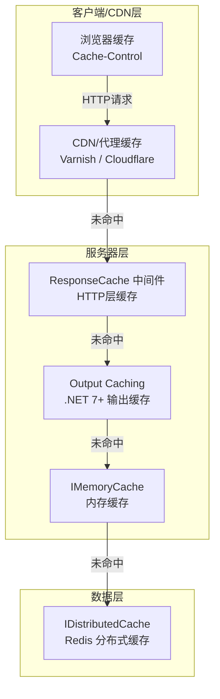
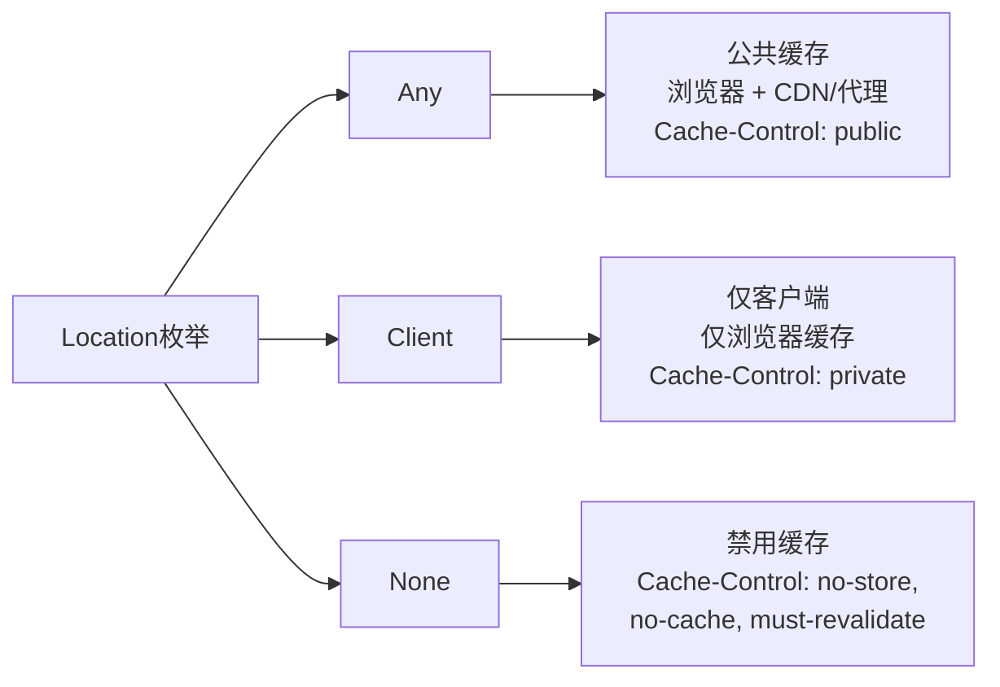
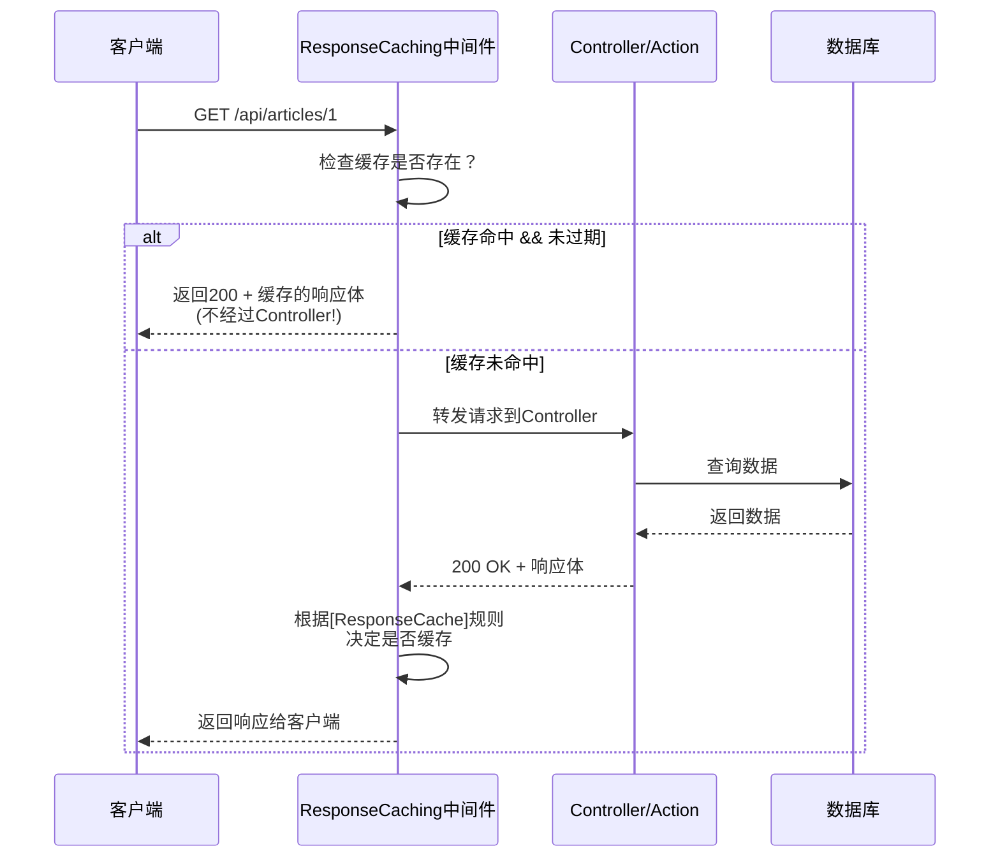
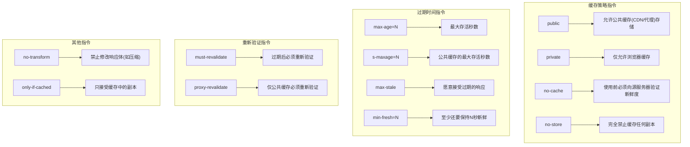
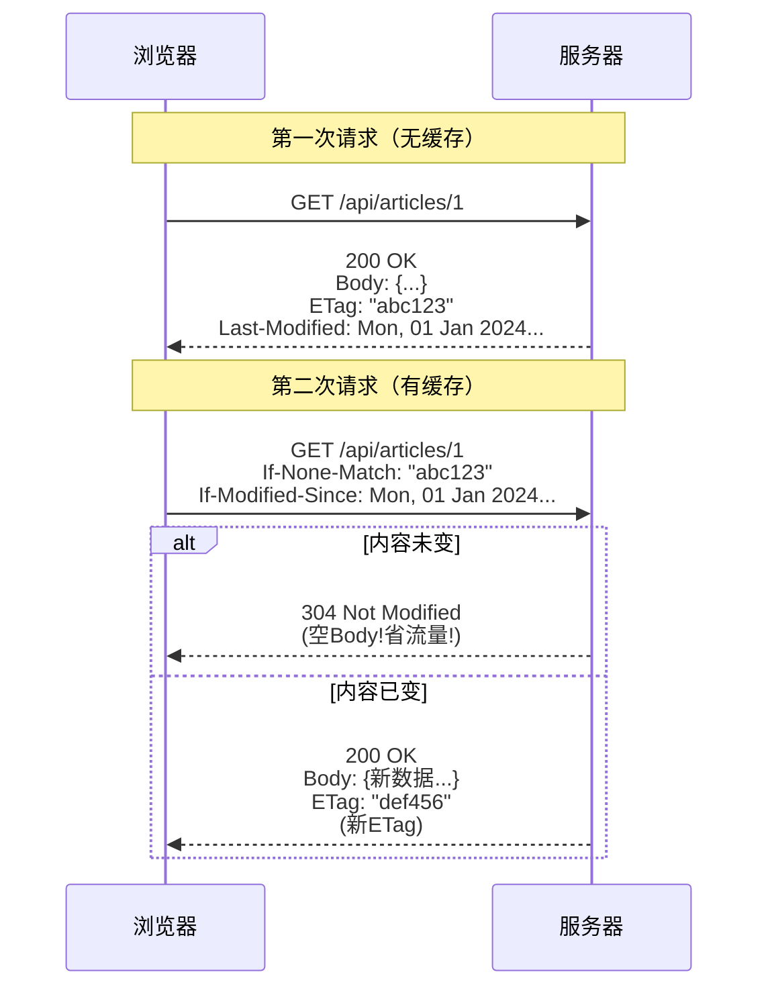
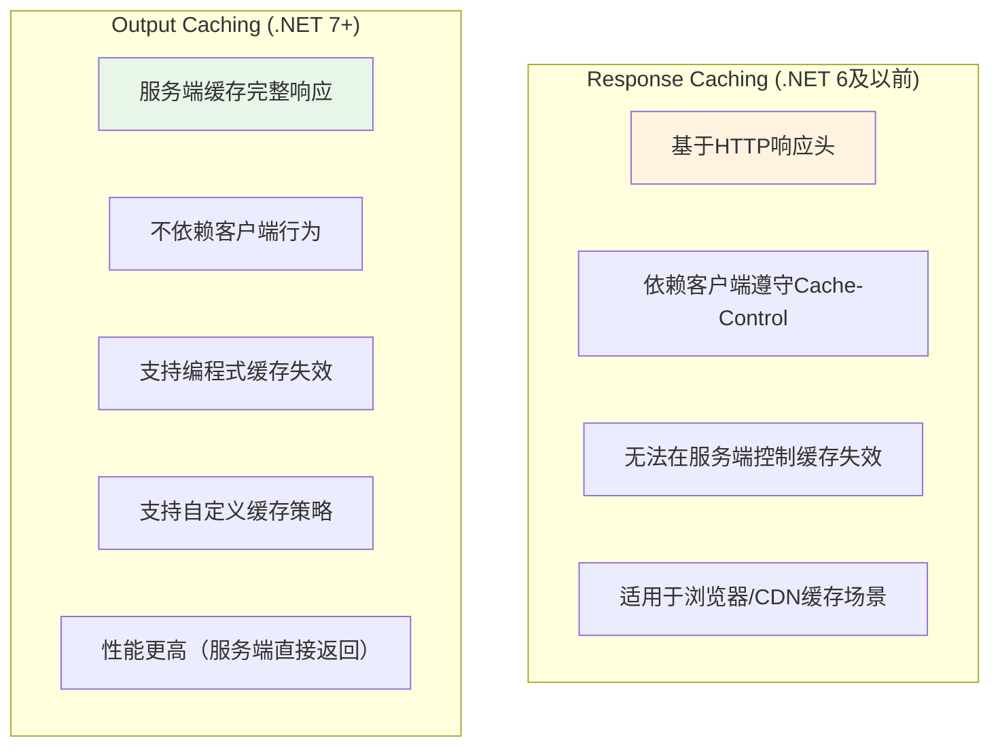
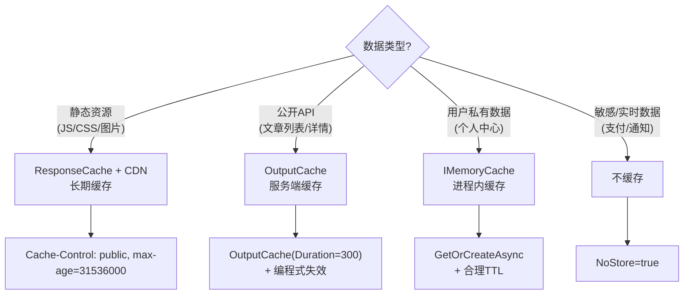

# 响应缓存与输出缓存 完全指南

> **学习目标**：掌握 ASP.NET Core 中 HTTP 层缓存（Response Cache）和输出缓存（Output Caching）的完整使用方法，包括中间件配置、特性应用、策略定制和性能优化
>
> **难度等级**：⭐⭐⭐⭐ 中高级
>
> **前置知识**：ASP.NET Core 中间件管道、HTTP 协议基础、内存缓存 (IMemoryCache) 基础
>
> **预计时间**：60分钟

---

## 1. 为什么需要响应缓存？

### 1.1 缓存层次体系

在 ASP.NET Core 应用中，缓存存在于多个层级。理解每一层的职责是正确使用缓存的前提：



**各层对比**：

| 缓存层 | 位置 | 适用场景 | 速度 |
|--------|------|----------|------|
| 浏览器缓存 | 客户端 | 静态资源、API响应 | 最快（本地） |
| CDN缓存 | 边缘节点 | 全球分发、高并发内容 | 极快 |
| ResponseCache | HTTP中间件层 | 减少重复计算和序列化 | 快 |
| OutputCaching | 应用层 | 复杂查询结果、动态页面 | 快 |
| IMemoryCache | 进程内 | 业务数据、会话信息 | 极快 |
| Redis | 外部服务 | 多实例共享、持久化 | 较快 |

### 1.2 响应缓存 vs 内存缓存的本质区别

```csharp
// 内存缓存 (IMemoryCache) - 在代码中手动控制
public async Task<Article> GetArticleAsync(int id)
{
    return await _cache.GetOrCreateAsync($"article:{id}", async entry =>
    {
        // 这个委托只在缓存未命中时执行
        return await _db.Articles.FindAsync(id);
    });
}
// 特点：减少数据库查询，但每次请求仍需经过Controller→Service→序列化

// 响应缓存 (ResponseCache) - 在HTTP层面拦截
[HttpGet("{id}")]
[ResponseCache(Duration = 300)] // 直接返回缓存的HTTP响应，跳过整个处理流程
public async Task<ActionResult<Article>> GetArticle(int id)
{
    // 如果命中缓存，这个方法根本不会被执行！
    return Ok(await _articleService.GetByIdAsync(id));
}
// 特点：跳过整个请求处理链路，直接返回已缓存的HTTP响应
```

---

## 2. [ResponseCache] 特性详解

`[ResponseCache]` 是 ASP.NET Core 提供的声明式缓存特性，通过设置 HTTP 响应头来指导浏览器或代理如何缓存响应。

### 2.1 核心属性一览

```csharp
[ResponseCache(
    Duration = 3600,           // 缓存时长（秒）
    Location = ResponseCacheLocation.Any,   // 缓存位置
    NoStore = false,            // 是否禁止存储
    VaryByHeader = "Accept-Encoding",  // 根据请求头变化
    VaryByQueryKeys = new[] { "id", "page" }  // 根据查询参数变化
)]
```

### 2.2 Duration - 缓存持续时间

指定响应可被缓存的最大时间（单位：秒）。

```csharp
/// <summary>
/// 获取文章详情 - 缓存5分钟
/// </summary>
[HttpGet("{id:int}")]
[ResponseCache(Duration = 300, VaryByQueryKeys = new[] { "id" })]
public async Task<ActionResult<ArticleDto>> GetArticle(int id)
{
    var article = await _articleService.GetByIdAsync(id);
    if (article == null) return NotFound();
    return Ok(article);
}

// 生成的响应头：
// Cache-Control: public, max-age=300
```

**实际效果**：
- 浏览器在5分钟内对同一URL的GET请求将直接从本地缓存读取
- 不再发送网络请求到服务器
- 5分钟后再次请求时会发送条件请求（If-Modified-Since / If-None-Match）

### 2.3 Location - 缓存位置



**各值详解**：

```csharp
// Any: 允许任何地方缓存（默认值，Duration > 0时）
[ResponseCache(Duration = 3600, Location = ResponseCacheLocation.Any)]
// → Cache-Control: public, max-age=3600
// 适用：公开的静态内容、文章列表等不涉及用户隐私的数据

// Client: 仅允许客户端（浏览器）缓存
[ResponseCache(Duration = 3600, Location = ResponseCacheLocation.Client)]
// → Cache-Control: private, max-age=3600
// 适用：用户个人信息、购物车等需要登录才能访问的数据

// None: 禁用所有缓存
[ResponseCache(Location = ResponseCacheLocation.None, NoStore = true)]
// → Cache-Control: no-store, no-cache, must-revalidate
// 适用：实时性要求极高的数据（股票价格、在线人数）
```

### 2.4 NoStore - 禁止存储

当设置为 `true` 时，明确指示所有缓存机制不得存储该响应的任何副本。

```csharp
// 敏感数据必须禁用缓存
[HttpGet("sensitive-data")]
[ResponseCache(Location = ResponseCacheLocation.None, NoStore = true)]
public ActionResult<SensitiveData> GetSensitiveData()
{
    return Ok(new SensitiveData { /* ... */ });
}
// → Cache-Control: no-store, no-cache, must-revalidate, pragma: no-cache
```

**安全警示**：
- 包含个人身份信息（PII）的响应务必设置 `NoStore = true`
- 支付相关、认证令牌相关的接口必须禁用缓存
- 即使设置了 `NoStore`，也要配合 `Location = None` 使用以确保兼容性

### 2.5 VaryByHeader 和 Vary 响应头

`Vary` 头告诉缓存系统：除了 URL 外，还有哪些请求头的变化会导致不同的响应。

```csharp
// 根据Accept-Encoding头区分压缩格式
[ResponseCache(
    Duration = 86400,
    VaryByHeader = "Accept-Encoding"
)]
// 生成的响应头：
// Vary: Accept-Encoding
// 含义：gzip压缩版本和br压缩版本分别缓存

// 同时根据多个头变化
[ResponseCache(
    Duration = 3600,
    VaryByHeader = "Accept-Language, Accept-Encoding"
)]
// → Vary: Accept-Language, Accept-Encoding
```

**常见需要 Vary 的场景**：

| Vary Header | 场景说明 |
|-------------|---------|
| `Accept-Encoding` | 区分 gzip/br/plain 压缩格式（最常用） |
| `Accept-Language` | 多语言站点按语言缓存不同版本 |
| `Authorization` | 认证状态不同的响应应分别缓存 |
| `User-Agent` | 按设备类型返回不同布局 |

### 2.6 VaryByQueryKeys - 按查询参数变化

这是 `[ResponseCache]` 的一个强大功能，让不同查询参数组合产生独立的缓存条目。

```csharp
/// <summary>
/// 获取文章列表 - 按分页和分类分别缓存
/// </summary>
[HttpGet]
[ResponseCache(Duration = 120, VaryByQueryKeys = new[] { "page", "pageSize", "categoryId" })]
public async Task<ActionResult<PagedResult<ArticleDto>>> GetArticles(
    int page = 1,
    int pageSize = 10,
    int? categoryId = null)
{
    var result = await _articleService.GetPagedAsync(page, pageSize, categoryId);
    return Ok(result);
}

// 以下每个URL组合都会产生独立的缓存：
// GET /api/articles?page=1&pageSize=10          → 缓存键A
// GET /api/articles?page=2&pageSize=10          → 缓存键B
// GET /api/articles?page=1&pageSize=10&categoryId=5  → 缓存键C
// GET /api/articles?page=1&pageSize=20          → 缓存键D
```

**注意**：要使 `VaryByQueryKeys` 生效，必须在 `Program.cs` 中添加 `ResponseCaching` 中间件：

```csharp
var builder = WebApplication.CreateBuilder(args);

builder.Services.AddControllers();
builder.Services.AddResponseCaching();  // 必须注册！

var app = builder.Build();

app.UseResponseCaching();  // 必须启用！且要在 UseRouting 之后
app.UseRouting();
app.MapControllers();

app.Run();
```

---

## 3. Response Caching 中间件深度剖析

### 3.1 中间件工作原理



### 3.2 中间件的缓存判定逻辑

Response Caching 中间件不会盲目缓存所有响应，它遵循严格的判定条件：

```csharp
// 以下情况不会被缓存：

// 1. 非 GET 或 HEAD 方法
POST /api/articles    // ❌ 不缓存
PUT /api/articles/1   // ❌ 不缓存

// 2. 状态码不是 200
return NotFound();     // 404 → ❌ 不缓存
return BadRequest();   // 400 → ❌ 不缓存

// 3. 响应头包含 Set-Cookie（有Cookie的响应通常包含用户特定信息）
HttpContext.Response.Cookies.Append("token", "...");  // ❌ 不缓存

// 4. Authorization 头存在时（默认行为）
// 但可以通过配置改变此行为

// 5. 响应体超过配置的大小限制（默认64KB）
```

### 3.3 自定义中间件配置

```csharp
// Program.cs - 详细配置 ResponseCaching 中间件
builder.Services.AddResponseCaching(options =>
{
    // 最大缓存响应体大小（字节），默认65536(64KB)
    options.MaximumBodySize = 1024 * 1024;  // 1MB

    // 默认情况下，带Authorization头的请求不缓存
    // 设为true可以缓存已认证请求的响应（谨慎使用！）
    options.UseCaseSensitivePaths = false;  // 路径大小写不敏感

    // 缓存条目数量限制
    options.SizeLimit = 100 * 1024 * 1024;  // 100MB总缓存容量
});
```

### 3.4 完整的中间件注册顺序

```csharp
var app = builder.Build();

// 正确的中间件顺序至关重要！
if (app.Environment.IsDevelopment())
{
    app.UseDeveloperExceptionPage();  // 开发环境异常页
}

app.UseHttpsRedirection();           // HTTPS重定向
app.UseStaticFiles();                // 静态文件
app.UseResponseCaching();            // ⭐ 响应缓存中间件（在此位置）
app.UseRouting();                    // 路由匹配
app.UseAuthentication();             // 认证
app.UseAuthorization();              // 授权
app.MapControllers();                // 映射控制器端点

app.Run();
```

**顺序要点**：
- `UseResponseCaching()` 必须在 `UseRouting()` 之前
- 这样中间件可以在路由匹配之前检查缓存
- 如果放在路由之后，每次都会先执行Controller再判断是否缓存（失去意义）

---

## 4. Cache-Control 响应头完全指南

`Cache-Control` 是 HTTP/1.1 中最重要的缓存指令头。理解它对于调试和优化缓存行为至关重要。

### 4.1 指令分类



### 4.2 常见组合模式

```csharp
// 模式1：静态资源 - 强缓存（推荐用于JS/CSS/图片）
// max-age=31536000 = 1年，配合文件名hash实现长期缓存
[ResponseCache(Duration = 31536000, Location = ResponseCacheLocation.Any)]
// → Cache-Control: public, max-age=31536000

// 模式2：API数据 - 中等时长缓存
[ResponseCache(Duration = 300, Location = ResponseCacheLocation.Any)]
// → Cache-Control: public, max-age=300

// 模式3：用户私有数据 - 仅客户端缓存
[Authorize]
[ResponseCache(Duration = 60, Location = ResponseCacheLocation.Client)]
// → Cache-Control: private, max-age=60

// 模式4：实时数据 - 禁止缓存
[ResponseCache(Location = ResponseCacheLocation.None, NoStore = true)]
// → Cache-Control: no-store, no-cache, must-revalidate

// 模式5：协商缓存 - 配合ETag使用
[ResponseCache(Duration = 0, Location = ResponseCacheLocation.Any)]
[ResponseCache(VaryByHeader = "If-None-Match")]
// → Cache-Control: public, max-age=0
// 客户端每次都会发送If-None-Match头进行验证
```

### 4.3 s-maxage 与 max-age 的区别

这是一个经常被忽略但非常重要的区别：

```csharp
// max-age: 对所有缓存都生效（浏览器 + CDN/代理）
// s-maxage: 只对共享缓存生效（CDN/代理），覆盖max-age对共享缓存的效果

// 场景：希望浏览器频繁刷新，但CDN可以长时间缓存
// 这种需求通过代码难以直接实现，但可以通过以下方式模拟：

// 方案1：使用CacheProfile配置
builder.Services.AddControllers(options =>
{
    options.CacheProfiles.Add("ApiCache", new CacheProfile
    {
        Duration = 300,
        Location = ResponseCacheLocation.Any
    });
});

// 方案2：在CDN层面配置TTL（更常见的方式）
// CDN控制台设置Edge Cache TTL为1小时
// 而应用层设置max-age=5分钟
```

---

## 5. ETag 和 Last-Modified 条件请求

### 5.1 什么是条件请求？

条件请求是一种高效的缓存验证机制：客户端保留之前响应的元数据（ETag或Last-Modified），下次请求时将这些信息发给服务器，服务器判断内容是否有变化：

- 有变化 → 返回完整的200响应和新ETag
- 无变化 → 返回 `304 Not Modified`（无响应体，极小带宽消耗）



### 5.2 手动实现 ETag

```csharp
/// <summary>
/// 获取文章详情 - 手动实现ETag条件请求
/// </summary>
[HttpGet("{id:int}")]
public async Task<ActionResult<ArticleDto>> GetArticle(int id)
{
    var article = await _articleService.GetByIdAsync(id);

    if (article == null)
        return NotFound();

    // 生成ETag（基于内容的哈希值）
    var etag = GenerateEtag(article);

    // 检查客户端发送的 If-None-Match 头
    var requestEtag = Request.Headers.IfNoneMatch.FirstOrDefault();

    if (!string.IsNullOrEmpty(requestEtag) &&
        requestEtag == $"\"{etag}\"")
    {
        // ETag匹配 → 返回304
        return StatusCode(StatusCodes.Status304NotModified);
    }

    // 设置ETag响应头
    Response.Headers.ETag = $"\"{etag}\"";
    Response.Headers.CacheControl = "no-cache";  // 每次都要验证

    return Ok(article);
}

/// <summary>
/// 生成ETag（基于关键字段的内容哈希）
/// </summary>
private string GenerateEtag(ArticleDto article)
{
    var input = $"{article.Id}|{article.Title}|{article.UpdatedAt:O}";
    using var sha256 = System.Security.Cryptography.SHA256.Create();
    var hashBytes = sha256.ComputeHash(System.Text.Encoding.UTF8.GetBytes(input));
    return Convert.ToBase64String(hashBytes)[..16];  // 取前16字符作为短ETag
}
```

### 5.3 使用内置的 ETag 中间件（.NET 7+）

.NET 7 引入了更简洁的 ETag 处理方式：

```csharp
// Program.cs
builder.Services.AddHttpCacheHeaders(options =>
{
    options.MaxAge = 300;
    options.MustRevalidate = true;
}, validationOptions =>
{
    validationOptions.MustRevalidate = true;
});

// Controller中使用
[HttpGet("{id:int}")]
[HttpCacheValidation(HttpCacheValidationMode.Public)]
public async Task<ActionResult<ArticleDto>> GetArticle(int id)
{
    var article = await _articleService.GetByIdAsync(id);
    if (article == null) return NotFound();
    return Ok(article);  // 中间件自动处理ETag和304
}
```

### 5.4 Last-Modified 实现

```csharp
[HttpGet("{id:int}")]
public async Task<ActionResult<ArticleDto>> GetArticleWithLastModified(int id)
{
    var article = await _articleService.GetByIdAsync(id);
    if (article == null) return NotFound();

    // 设置Last-Modified头
    var lastModified = article.UpdatedAt.ToString("R");  // RFC1123格式
    Response.Headers["Last-Modified"] = lastModified;

    // 检查 If-Modified-Since
    var ifModifiedSince = Request.Headers.IfModifiedSince.FirstOrDefault();
    if (DateTimeOffset.TryParse(ifModifiedSince, out var clientTime))
    {
        if (clientTime >= article.UpdatedAt.AddSeconds(-1))
        {
            return StatusCode(StatusCodes.Status304NotModified);
        }
    }

    return Ok(article);
}
```

**ETag vs Last-Modified 对比**：

| 特性 | ETag | Last-Modified |
|------|------|---------------|
| 精度 | 高（基于内容哈希） | 低（只能精确到秒） |
| 频繁更新 | 适合（能检测到秒级内的变化） | 不适合（可能漏掉快速更新） |
| 计算开销 | 需要计算哈希值 | 几乎无开销 |
| 兼容性 | HTTP/1.1 | HTTP/1.0+ |
| 推荐 | **首选** | 作为辅助手段 |

---

## 6. 输出缓存（Output Caching）- .NET 7+ 新特性

### 6.1 Output Caching vs Response Caching 的区别

这是 .NET 7 引入的重大改进，两者有本质区别：



**核心区别总结**：

| 维度 | ResponseCache | OutputCache (.NET 7+) |
|------|--------------|----------------------|
| 缓存位置 | 客户端/代理 | **服务端** |
| 控制方 | 客户端决定是否使用 | 服务端全权控制 |
| 失效方式 | 等待过期或客户端清除 | 编程式主动失效 |
| 适用场景 | 静态资源、公开API | 动态内容、复杂计算结果 |
| .NET版本 | 所有版本 | .NET 7+ |

### 6.2 注册 Output Caching 服务

```csharp
// Program.cs
using Microsoft.AspNetCore.OutputCaching;

var builder = WebApplication.CreateBuilder(args);

// 注册Output Caching服务
builder.Services.AddOutputCache(options =>
{
    // 全局默认缓存时长
    options.DefaultExpirationTimeSpan = TimeSpan.FromMinutes(5);

    // 最大缓存条目数
    options.SizeLimit = 1024;

    // 使用CaseSensitive路径（默认false）
    options.UseCaseSensitivePaths = false;
});

var app = builder.Build();

// 启用Output Caching中间件
app.UseOutputCache();  // ⭐ 必须调用！

app.MapControllers();
app.Run();
```

### 6.3 [OutputCache] 特性基本用法

```csharp
using Microsoft.AspNetCore.OutputCaching;

[ApiController]
[Route("api/[controller]")]
public class ArticlesController : ControllerBase
{
    /// <summary>
    /// 获取文章列表 - 输出缓存10分钟
    /// </summary>
    [HttpGet]
    [OutputCache(Duration = 600)]  // 缓存600秒 = 10分钟
    public async Task<ActionResult<PagedResult<ArticleDto>>> GetArticles()
    {
        Console.WriteLine($"[{DateTime.Now:HH:mm:ss}] 执行查询...");
        var result = await _service.GetPagedAsync(1, 20);
        return Ok(result);
    }

    /// <summary>
    /// 获取文章详情 - 按ID变化缓存
    /// </summary>
    [HttpGet("{id:int}")]
    [OutputCache(Duration = 300, VaryByRouteValue = "id")]
    public async Task<ActionResult<ArticleDto>> GetArticle(int id)
    {
        Console.WriteLine($"[{DateTime.Now:HH:mm:ss}] 查询文章 {id}...");
        var article = await _service.GetByIdAsync(id);
        return article == null ? NotFound() : Ok(article);
    }
}
```

**效果演示**：
```
第一次请求 14:30:05 → 执行查询... → 返回200 + 写入缓存
第二次请求 14:30:10 → （无日志输出）→ 直接返回缓存（~0ms！）
第三次请求 14:35:06 → 缓存过期 → 执行查询... → 返回200 + 刷新缓存
```

### 6.4 缓存策略选择

Output Caching 提供了多种灵活的缓存策略基类：

#### ByPath - 按请求路径缓存

```csharp
// 默认策略 - 相同URL的请求共享缓存
[OutputCache(PolicyName = "ByPathExpire10min")]
public async Task<IActionResult> GetData() { ... }

// Program.cs 注册策略
builder.Services.AddOutputCache(options =>
{
    options.AddBasePolicy(builder =>
        builder.Expire(TimeSpan.FromMinutes(10)));
});
```

#### ByQueryKeys - 按查询参数缓存

```csharp
// 不同查询参数产生不同缓存
[HttpGet("search")]
[OutputCache(Duration = 300, VaryByQueryKeys = new[] { "q", "page", "size" })]
public async Task<ActionResult<PagedResult<SearchResultDto>>> Search(
    string q, int page = 1, int size = 10)
{
    return Ok(await _searchService.SearchAsync(q, page, size));
}

// /api/articles/search?q=csharp&page=1 → 缓存A
// /api/articles/search?q=csharp&page=2 → 缓存B
// /api/articles/search?q=dotnet&page=1 → 缓存C
```

#### ByRouteValue - 按路由参数缓存

```csharp
[HttpGet("{categoryId}/articles")]
[OutputCache(Duration = 600, VaryByRouteValue = "categoryId")]
public async Task<ActionResult<List<ArticleDto>>> GetByCategory(int categoryId)
{
    return Ok(await _service.GetByCategoryAsync(categoryId));
}

// /api/categories/1/articles → 缓存A（技术类文章）
// /api/categories/2/articles → 缓存B（生活类文章）
```

#### CustomPolicy - 自定义缓存策略

```csharp
/// <summary>
/// 自定义缓存策略：根据角色缓存不同版本的响应
/// </summary>
public class RoleBasedCachePolicy : IOutputCachePolicy
{
    public ValueTask CacheRequestAsync(OutputCacheContext context)
    {
        // 1. 判断是否应该尝试获取缓存
        var request = context.HttpContext.Request;

        // 只缓存GET和HEAD请求
        if (!HttpMethods.IsGet(request.Method) &&
            !HttpMethods.IsHead(request.Method))
        {
            context.EnableOutputCaching = false;
            return ValueTask.CompletedTask;
        }

        // 2. 为缓存键添加角色标识
        var user = context.HttpContext.User;
        var role = user.IsInRole("Admin") ? "admin" : "user";

        // 将角色信息加入缓存键的变体
        context.CacheVaryByRules.QueryKeys.Add("role=" + role);

        return ValueTask.CompletedTask;
    }

    public ValueTask ServeFromCacheAsync(OutputCacheContext context)
    {
        // 缓存命中时的处理（可选）
        return ValueTask.CompletedTask;
    }

    public ValueTask SetCacheAsync(OutputCacheContext context)
    {
        // 决定是否缓存本次响应
        var response = context.HttpContext.Response;

        // 只缓存200状态的响应
        if (response.StatusCode != StatusCodes.Status200OK)
        {
            context.EnableOutputCaching = false;
            return ValueTask.CompletedTask;
        }

        // 设置缓存时长
        response.Duration = TimeSpan.FromMinutes(5);

        return ValueTask.CompletedTask;
    }
}

// 注册和使用
builder.Services.AddOutputCache();

[HttpGet("dashboard")]
[OutputCache(PolicyName = "RoleBasedPolicy")]
public async Task<ActionResult<DashboardDto>> GetDashboard()
{
    // Admin和普通用户看到不同的Dashboard，各自独立缓存
    return Ok(await _dashboardService.GetAsync());
}
```

### 6.5 完整的策略注册示例

```csharp
// Program.cs - 完整的OutputCache配置
builder.Services.AddOutputCache(options =>
{
    // ======== 内置策略 ========

    // 策略1：短期缓存（30秒）- 用于实时性较高的数据
    options.AddPolicy("ShortLived", builder =>
        builder.Tag("short-lived")
               .Expire(TimeSpan.FromSeconds(30)));

    // 策略2：中期缓存（5分钟）- 用于一般API数据
    options.AddPolicy("MediumLived", builder =>
        builder.Tag("medium-lived")
               .Expire(TimeSpan.FromMinutes(5))
               .SetVaryByQuery("page", "pageSize"));

    // 策略3：长期缓存（1小时）- 用于几乎不变的数据
    options.AddPolicy("LongLived", builder =>
        builder.Tag("long-lived")
               .Expire(TimeSpan.FromHours(1))
               .VaryByHeader("Accept-Language"));

    // 策略4：禁用缓存（用于排除某些端点）
    options.AddNoCaching();
});

// 使用自定义策略
options.AddPolicy("CustomAuthPolicy", builder =>
    builder.With(new RoleBasedCachePolicy()));
```

---

## 7. 缓存失效与刷新策略

### 7.1 编程式缓存失效（Output Caching 独有能力）

这是 Output Caching 相比 ResponseCache 的核心优势之一——可以在服务端主动清除缓存：

```csharp
/// <summary>
/// 文章管理控制器 - 演示缓存失效
/// </summary>
[ApiController]
[Route("api/[controller]")]
public class ArticlesAdminController : ControllerBase
{
    private readonly IOutputCacheStore _cacheStore;
    private readonly IArticleService _articleService;

    public ArticlesAdminController(
        IOutputCacheStore cacheStore,
        IArticleService articleService)
    {
        _cacheStore = cacheStore;
        _articleService = articleService;
    }

    /// <summary>
    /// 更新文章 - 更新后立即清除相关缓存
    /// </summary>
    [HttpPut("{id:int}")]
    [Authorize(Roles = "Admin,Author")]
    public async Task<ActionResult<ArticleDto>> UpdateArticle(
        int id, [FromBody] UpdateArticleDto dto)
    {
        var article = await _articleService.UpdateAsync(id, dto);

        // ✅ 清除该文章的详情缓存
        await _cacheStore.EvictByTagAsync("articles", CancellationToken.None);

        // 或者使用更精确的方式：按标签清除
        await _cacheStore.EvictByTagAsync($"article-{id}", CancellationToken.None);

        return Ok(article);
    }

    /// <summary>
    /// 发布新文章 - 清除文章列表缓存
    /// </summary>
    [HttpPost]
    [Authorize(Roles = "Admin,Author")]
    public async Task<ActionResult<ArticleDto>> CreateArticle(
        [FromBody] CreateArticleDto dto)
    {
        var article = await _articleService.CreateAsync(dto);

        // ✅ 新文章发布后，清除列表缓存
        await _cacheStore.EvictByTagAsync("article-list", CancellationToken.None);

        return CreatedAtAction(nameof(GetArticle), new { id = article.Id }, article);
    }

    /// <summary>
    /// 批量清除所有文章相关缓存（管理员操作）
    /// </summary>
    [HttpPost("clear-cache")]
    [Authorize(Roles = "Admin")]
    public async Task<ActionResult> ClearAllArticleCache()
    {
        await _cacheStore.EvictByTagAsync("articles", default);
        await _cacheStore.EvictByTagAsync("article-list", default);
        await _cacheStore.EvictByTagAsync("categories", default);

        return Ok(new { message = "缓存已清除" });
    }
}
```

### 7.2 使用 Tag 进行分组管理

```csharp
// 定义缓存标签常量
public static class CacheTags
{
    public const string Articles = "articles";
    public const string ArticleList = "article-list";
    public const string Categories = "categories";
    public const string Tags = "tags";
    public const string HotPosts = "hot-posts";

    public static string Article(int id) => $"article-{id}";
    public static string Category(int id) => $"category-{id}";
}

// 在Controller中使用标签
[HttpGet]
[OutputCache(Duration = 300, PolicyName = "ArticleListPolicy")]
public async Task<ActionResult<PagedResult<ArticleDto>>> GetArticles()
{
    // 此响应会被标记为 "article-list"
    return Ok(await _service.GetPagedAsync());
}

[HttpGet("{id:int}")]
[OutputCache(Duration = 600, PolicyName = "ArticleDetailPolicy")]
public async Task<ActionResult<ArticleDto>> GetArticle(int id)
{
    // 此响应会被标记为 "articles" 和 "article-{id}"
    return Ok(await _service.GetByIdAsync(id));
}
```

### 7.3 结合 Tag 的策略定义

```csharp
// Program.cs - 定义带标签的策略
builder.Services.AddOutputCache(options =>
{
    // 文章详情策略 - 带双重标签
    options.AddPolicy("ArticleDetailPolicy", builder =>
        builder.Tag(CacheTags.Articles)       // 通用标签
               .Tag(context =>
               {
                   // 动态标签：根据路由参数生成
                   var id = context.HttpContext.Request.RouteValues["id"];
                   return CacheTags.Article(Convert.ToInt32(id));
               })
               .Expire(TimeSpan.FromMinutes(10)));

    // 文章列表策略
    options.AddPolicy("ArticleListPolicy", builder =>
        builder.Tag(CacheTags.ArticleList)
               .Expire(TimeSpan.FromMinutes(5))
               .VaryByQuery("page", "pageSize", "categoryId")));
```

---

## 8. 内存输出缓存 vs Redis 输出缓存

### 8.1 IDistributedCacheOutputCacheStore

Output Caching 默认使用内存存储。对于分布式部署场景，可以切换到 Redis：

```csharp
// Program.cs - Redis输出缓存配置
using StackExchange.Redis;
using Microsoft.Extensions.Caching.StackExchangeRedis;

var builder = WebApplication.CreateBuilder(args);

// 1. 配置Redis连接
builder.Services.AddStackExchangeRedisCache(options =>
{
    options.Configuration = builder.Configuration.GetConnectionString("Redis");
    // options.InstanceName = "BlogOutputCache:";  // 可选：Key前缀
    options.ConfigurationOptions = ConfigurationOptions.Parse(
        builder.Configuration.GetConnectionString("Redis"));
});

// 2. 使用分布式缓存作为OutputCache的存储后端
builder.Services.AddSingleton<IOutputCacheStore, DistributedCacheOutputCacheStore>();

// 3. 继续正常配置OutputCache
builder.Services.AddOutputCache(options =>
{
    options.DefaultExpirationTimeSpan = TimeSpan.FromMinutes(5);
});
```

### 8.2 两种方案对比

| 维度 | 内存输出缓存 | Redis输出缓存 |
|------|-------------|--------------|
| **部署模式** | 单实例 | 多实例/分布式 |
| **跨进程共享** | 否 | 是 |
| **持久化** | 进程重启丢失 | 可配置持久化 |
| **延迟** | 亚毫秒级 | ~1-5ms（网络往返） |
| **适用场景** | 单机部署、开发环境 | 生产环境多实例 |
| **运维成本** | 无 | 需要维护Redis集群 |

---

## 9. 完整示例：带版本控制的 API 响应缓存

### 9.1 项目结构

```
src/
├── Controllers/
│   └── ArticlesController.cs         # 文章控制器（含缓存）
├── Services/
│   └── ArticleService.cs             # 文章业务服务
├── Models/
│   ├── Entities/
│   │   └── Article.cs               # 文章实体
│   └── Dtos/
│       ├── ArticleDto.cs            # 文章DTO
│       └── PagedResult.cs           # 分页结果
├── Policies/
│   └── VersionedCachePolicy.cs      # 版本感知缓存策略
└── Program.cs                        # 启动配置
```

### 9.2 版本感知的缓存策略

```csharp
/// <summary>
/// 版本感知缓存策略 - 当API版本变化时自动失效
/// </summary>
public class VersionedCachePolicy : IOutputCachePolicy
{
    public ValueTask CacheRequestAsync(OutputCacheContext context)
    {
        var request = context.HttpContext.Request;

        // 只缓存GET/HEAD请求
        if (!HttpMethods.IsGet(request.Method) &&
            !HttpMethods.IsHead(request.Method))
        {
            context.EnableOutputCaching = false;
            return ValueTask.CompletedTask;
        }

        // 从路由获取API版本号并纳入缓存键
        if (request.RouteValues.TryGetValue("version", out var version))
        {
            context.CacheVaryByRules.RouteValueKeys.Add("version");
        }

        // 纳入查询参数
        context.CacheVaryByRules.QueryKeys.Add("page");
        context.CacheVaryByRules.QueryKeys.Add("pageSize");

        return ValueTask.CompletedTask;
    }

    public ValueTask ServeFromCacheAsync(OutputCacheContext context)
    {
        // 可以在这里记录缓存命中率
        var logger = context.HttpContext.RequestServices
            .GetRequiredService<ILogger<VersionedCachePolicy>>();
        logger.LogDebug("缓存命中: {Path}", context.HttpContext.Request.Path);
        return ValueTask.CompletedTask;
    }

    public ValueTask SetCacheAsync(OutputCacheContext context)
    {
        var response = context.HttpContext.Response;

        // 只缓存成功的GET请求
        if (response.StatusCode != StatusCodes.Status200OK)
        {
            context.EnableOutputCaching = false;
            return ValueTask.CompletedTask;
        }

        // 根据资源类型设置不同过期时间
        var path = context.HttpContext.Request.Path.Value;
        if (path?.Contains("/popular") == true)
        {
            response.Duration = TimeSpan.FromMinutes(3);  // 热门数据变化快
        }
        else if (path?.Contains("/{id}") == true)
        {
            response.Duration = TimeSpan.FromMinutes(10);  // 详情页相对稳定
        }
        else
        {
            response.Duration = TimeSpan.FromMinutes(5);   // 默认
        }

        return ValueTask.CompletedTask;
    }
}
```

### 9.3 完整的 ArticlesController

```csharp
using Microsoft.AspNetCore.Mvc;
using Microsoft.AspNetCore.OutputCaching;
using BlogApi.Models.Dtos;
using BlogApi.Services;

namespace BlogApi.Controllers;

/// <summary>
/// 文章管理API - 带完整输出缓存配置
/// </summary>
[ApiController]
[ApiVersion("1.0")]
[Route("api/v{version:apiVersion}/[controller]")]
[Produces("application/json")]
public class ArticlesController : ControllerBase
{
    private readonly IArticleService _articleService;
    private readonly IOutputCacheStore _cacheStore;
    private readonly ILogger<ArticlesController> _logger;

    public ArticlesController(
        IArticleService articleService,
        IOutputCacheStore cacheStore,
        ILogger<ArticlesController> logger)
    {
        _articleService = articleService;
        _cacheStore = cacheStore;
        _logger = logger;
    }

    /// <summary>
    /// 获取文章分页列表（OutputCache缓存5分钟）
    /// </summary>
    [HttpGet]
    [OutputCache(
        Duration = 300,
        PolicyName = "ArticleList",
        VaryByQueryKeys = new[] { "page", "pageSize", "categoryId", "keyword" })]
    [ProducesResponseType(typeof(PagedResult<ArticleDto>), StatusCodes.Status200OK)]
    public async Task<ActionResult<PagedResult<ArticleDto>>> GetArticles(
        [FromQuery] int page = 1,
        [FromQuery] int pageSize = 10,
        [FromQuery] int? categoryId = null,
        [FromQuery] string? keyword = null)
    {
        _logger.LogInformation("查询文章列表 Page={Page}, Size={Size}", page, pageSize);

        var result = await _articleService.GetPagedAsync(page, pageSize, categoryId, keyword);
        return Ok(result);
    }

    /// <summary>
    /// 获取热门文章（OutputCache缓存3分钟，变化频繁）
    /// </summary>
    [HttpGet("popular")]
    [OutputCache(Duration = 180, VaryByQueryKeys = new[] { "count" })]
    public async Task<ActionResult<List<ArticleDto>>> GetPopularArticles(
        [FromQuery] int count = 10)
    {
        _logger.LogInformation("查询热门文章 Count={Count}", count);
        return Ok(await _articleService.GetPopularAsync(count));
    }

    /// <summary>
    /// 获取文章详情（OutputCache缓存10分钟）
    /// </summary>
    [HttpGet("{id:int}")]
    [OutputCache(Duration = 600, VaryByRouteValue = "id")]
    [ProducesResponseType(typeof(ArticleDto), StatusCodes.Status200OK)]
    [ProducesResponseType(StatusCodes.Status404NotFound)]
    public async Task<ActionResult<ArticleDto>> GetArticle(int id)
    {
        _logger.LogInformation("查询文章详情 Id={Id}", id);

        var article = await _articleService.GetByIdAsync(id);
        if (article == null)
            return NotFound(new { message = $"文章 {id} 不存在" });

        return Ok(article);
    }

    /// <summary>
    /// 创建文章（创建后清除列表缓存）
    /// </summary>
    [HttpPost]
    [Authorize]
    public async Task<ActionResult<ArticleDto>> CreateArticle([FromBody] CreateArticleDto dto)
    {
        var userId = GetCurrentUserId();
        var article = await _articleService.CreateAsync(dto, userId);

        // 清除文章列表缓存
        await _cacheStore.EvictByTagAsync("article-list", CancellationToken.None);

        _logger.LogInformation("文章已创建 Id={Id}, 已清除列表缓存", article.Id);

        return CreatedAtAction(nameof(GetArticle),
            new { id = article.Id, version = "1.0" }, article);
    }

    /// <summary>
    /// 更新文章（更新后清除详情和列表缓存）
    /// </summary>
    [HttpPut("{id:int}")]
    [Authorize(Roles = "Author,Admin")]
    public async Task<ActionResult<ArticleDto>> UpdateArticle(
        int id, [FromBody] UpdateArticleDto dto)
    {
        var article = await _articleService.UpdateAsync(id, dto);

        // 清除该文章详情缓存
        await _cacheStore.EvictByTagAsync("articles", CancellationToken.None);
        // 清除列表缓存（排序可能变化）
        await _cacheStore.EvictByTagAsync("article-list", CancellationToken.None);

        _logger.LogInformation("文章已更新 Id={Id}, 相关缓存已清除", id);
        return Ok(article);
    }

    /// <summary>
    /// 删除文章（删除后清除所有相关缓存）
    /// </summary>
    [HttpDelete("{id:int}")]
    [Authorize(Roles = "Admin")]
    public async Task<ActionResult> DeleteArticle(int id)
    {
        await _articleService.DeleteAsync(id);

        // 批量清除相关缓存
        await _cacheStore.EvictByTagAsync("articles", CancellationToken.None);
        await _cacheStore.EvictByTagAsync("article-list", CancellationToken.None);

        _logger.LogInformation("文章已删除 Id={Id}, 相关缓存已清除", id);
        return NoContent();
    }

    private string GetCurrentUserId()
    {
        return User.FindFirstValue(System.Security.Claims.ClaimTypes.NameIdentifier)
            ?? throw new UnauthorizedAccessException("未找到用户标识");
    }
}
```

### 9.4 Program.cs 完整配置

```csharp
using Microsoft.AspNetCore.OutputCaching;
using BlogApi.Policies;

var builder = WebApplication.CreateBuilder(args);

// ======== 服务注册 ========
builder.Services.AddControllers();

// 数据库
builder.Services.AddDbContext<ApplicationDbContext>(options =>
    options.UseSqlServer(builder.Configuration.GetConnectionString("DefaultConnection")));

// Output Caching 配置
builder.Services.AddOutputCache(options =>
{
    options.DefaultExpirationTimeSpan = TimeSpan.FromMinutes(5);

    // 文章列表策略
    options.AddPolicy("ArticleList", builder =>
        builder.Tag("article-list")
               .Expire(TimeSpan.FromMinutes(5))
               .VaryByQuery("page", "pageSize", "categoryId", "keyword"));

    // 文章详情策略
    options.AddPolicy("ArticleDetail", builder =>
        builder.Tag("articles")
               .Expire(TimeSpan.FromMinutes(10))
               .VaryByRouteValue("id"));

    // 版本化策略
    options.AddPolicy("VersionedCache", builder =>
        builder.With(new VersionedCachePolicy()));
});

// 其他服务...
builder.Services.AddScoped<IArticleService, ArticleService>();
builder.Services.AddEndpointsApiExplorer();
builder.Services.AddSwaggerGen();

var app = builder.Build();

// ======== 中间件管道 ========
if (app.Environment.IsDevelopment())
{
    app.UseSwagger();
    app.UseSwaggerUI();
}

app.UseHttpsRedirection();

// Output Caching 必须在路由之前
app.UseOutputCache();

app.UseRouting();
app.UseAuthentication();
app.UseAuthorization();
app.MapControllers();

app.Run();
```

---

## 10. 性能对比：有缓存 vs 无缓存

### 10.1 基准测试方法

```csharp
/// <summary>
/// 缓存性能基准测试辅助类
/// </summary>
public class CacheBenchmarkHelper
{
    private readonly ILogger<CacheBenchmarkHelper> _logger;

    public CacheBenchmarkHelper(ILogger<CacheBenchmarkHelper> logger)
    {
        _logger = logger;
    }

    /// <summary>
    /// 记录请求耗时（可用于中间件中统一计时）
    /// </summary>
    public async Task MeasureAsync(HttpContext context, Func<Task> handler)
    {
        var sw = System.Diagnostics.Stopwatch.StartNew();
        var path = context.Request.Path.Value;

        try
        {
            await handler();
        }
        finally
        {
            sw.Stop();
            var isCached = context.Items.ContainsKey("OutputCacheHit");

            _logger.LogInformation(
                "[性能指标] Path={Path}, Method={Method}, " +
                "Elapsed={ElapsedMs}ms, Cached={Cached}, Status={Status}",
                path,
                context.Request.Method,
                sw.ElapsedMilliseconds,
                isCached,
                context.Response.StatusCode);
        }
    }
}
```

### 10.2 典型性能数据

以下是典型的性能对比数据（基于中等规模博客系统的实测参考值）：

| 操作 | 无缓存 | IMemoryCache | OutputCache | ResponseCache |
|------|--------|-------------|-------------|---------------|
| 获取文章详情 | ~50-150ms | ~5-15ms | ~0.5-2ms | N/A（客户端侧） |
| 获取文章列表（20条） | ~100-300ms | ~10-25ms | ~1-3ms | N/A |
| 热门文章Top10 | ~80-200ms | ~8-20ms | ~0.5-2ms | N/A |
| QPS提升倍数 | 基准(1x) | ~10x | **~50-100x** | 取决于客户端 |

**解读**：
- **IMemoryCache**：节省了数据库查询时间（50-150ms -> 5-15ms），但仍需经过序列化和网络传输
- **OutputCache**：连Controller都不执行，直接返回已缓存的HTTP响应，速度最快
- **ResponseCache**：缓存在客户端/CDN，服务器完全不接收后续请求（最佳用户体验）

### 10.3 选择建议



---

## 11. 最佳实践与常见陷阱

### 11.1 最佳实践清单

```csharp
// ✅ DO: 为公开的只读API添加OutputCache
[HttpGet]
[OutputCache(Duration = 300, VaryByQueryKeys = new[] { "page" })]
public async Task<IActionResult> GetList(int page = 1) { ... }

// ✅ DO: 写操作后主动清除相关缓存
await _cacheStore.EvictByTagAsync("articles", CancellationToken.None);

// ✅ DO: 使用Tag组织缓存便于批量清理
options.AddPolicy("Articles", b => b.Tag("articles").Expire(TimeSpan.FromMinutes(10)));

// ✅ DO: 对不同类型数据设置合理的过期时间
// 热门数据：短(3-5min) | 一般数据：中(10-30min) | 静态数据：长(1h+)

// ✅ DO: 监控缓存命中率
// 通过日志或指标收集缓存命中/未命中数据

// ❌ DON'T: 缓存包含敏感信息的响应
[HttpGet("profile")]
[OutputCache(Duration = 3600)]  // 危险！其他用户可能看到你的数据！
public async Task<IActionResult> GetProfile() { ... }

// ❌ DON'T: 缓存需要实时性的数据
[HttpGet("stock-price")]
[OutputCache(Duration = 300)]  // 股价5分钟前的数据已经过时了
public async Task<IActionResult> GetStockPrice() { ... }

// ❌ DON'T: 忘记在写操作后清除缓存
[HttpPost]
public async Task<IActionResult> Create(...) { ... }  // 创建后不清除列表缓存？！

// ❌ DON'T: 过长的缓存时间导致用户看到旧数据
[OutputCache(Duration = 86400)]  // 24小时太长了！
public async Task<IActionResult> GetComments() { ... }
```

### 11.2 常见问题排查

| 问题现象 | 可能原因 | 解决方案 |
|----------|---------|---------|
| 缓存似乎没生效 | 未注册AddOutputCache/UseOutputCache | 检查Program.cs |
| 认证用户的响应被错误共享 | 未考虑用户身份变体 | 添加VaryByHeader或自定义策略 |
| 更新后仍显示旧数据 | 写操作未清除缓存 | 添加EvictByTagAsync调用 |
| POST请求被意外缓存 | OutputCache默认只缓存GET/HEAD | 这是预期行为，无需担心 |
| 内存占用过高 | 缓存条目过多或过大 | 设置SizeLimit和合理Duration |
| 分布式环境下缓存不一致 | 使用了内存缓存而非Redis | 切换到DistributedCacheOutputCacheStore |

---

## 12. 总结

本教程我们全面学习了 ASP.NET Core 中的两种 HTTP 层缓存技术：

| 知识点 | 核心内容 |
|--------|---------|
| **[ResponseCache]** | 基于 HTTP 响应头的声明式缓存，依赖客户端/代理遵守 Cache-Control |
| **Cache-Control 指令** | public/private/no-cache/no-store/max-age/s-maxage 等 |
| **ETag / Last-Modified** | 条件请求机制，304 Not Modified 节省带宽 |
| **Response Caching 中间件** | 服务端拦截请求，自动处理缓存读写 |
| **[OutputCache] (.NET 7+)** | 服务端缓存，编程式失效，更可控 |
| **缓存策略** | ByPath/ByQueryKeys/ByRouteValue/CustomPolicy |
| **Tag 管理** | 分组标记缓存条目，支持批量失效 |
| **Redis 后端** | 分布式环境下的输出缓存解决方案 |
| **性能提升** | OutputCache 可带来 50-100 倍的 QPS 提升 |

**下一步学习**：
- 学习【单元测试 (xUnit + Moq)】确保缓存逻辑的正确性
- 学习【集成测试 (WebApplicationFactory)】测试完整的HTTP缓存行为
- 进入【实战项目-博客系统】，在实际项目中运用缓存技术

---

**参考资源**：
- [官方文档：Response Caching](https://docs.microsoft.com/zh-cn/aspnet/core/performance/caching/response)
- [官方文档：Output Caching](https://docs.microsoft.com/zh-cn/aspnet/core/performance/caching/output)
- [HTTP Caching RFC 7234](https://tools.ietf.org/html/rfc7234)

**练习题**：
1. 为你的项目中一个高频访问的只读API添加 OutputCache，并测量性能提升
2. 实现一个自定义缓存策略，根据请求的 Accept-Language 头返回不同语言的缓存版本
3. 搭建 Redis 环境，将 OutputCache 存储切换到 Redis 并验证多实例共享
4. 设计一套完整的缓存失效策略，确保数据一致性
