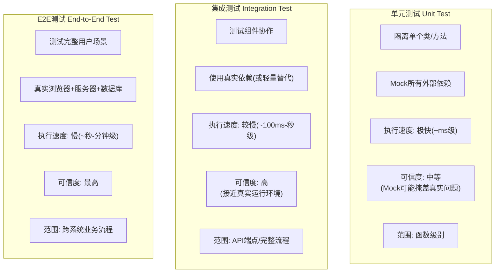
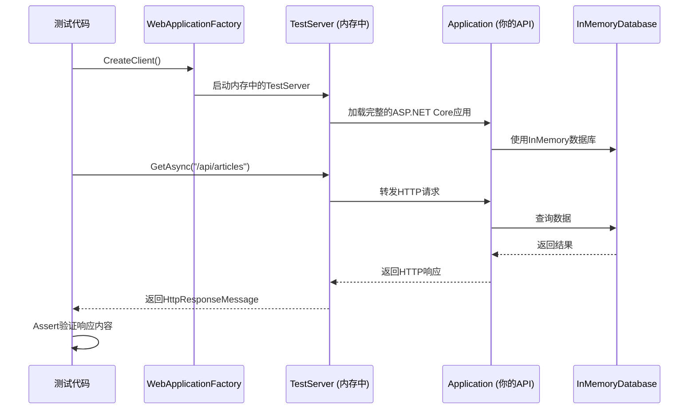
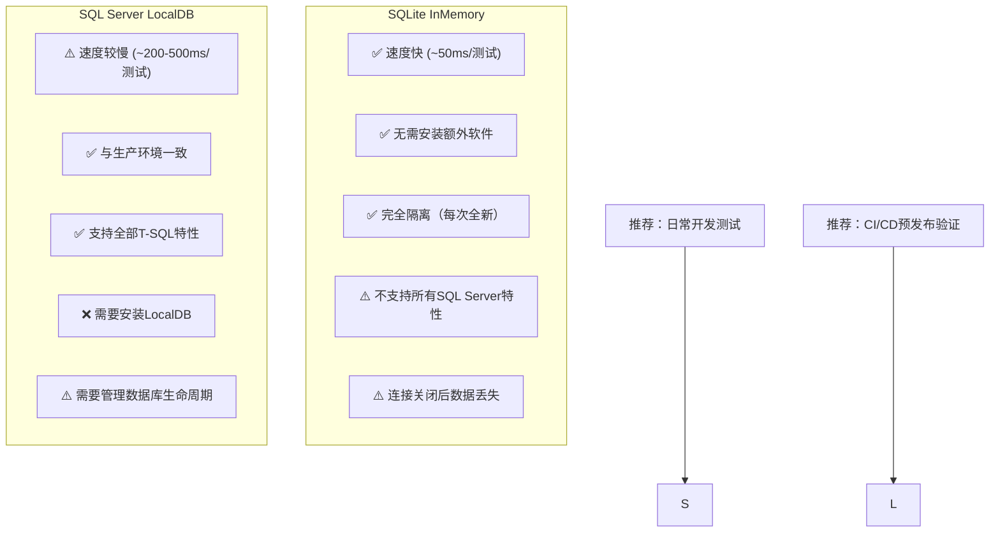
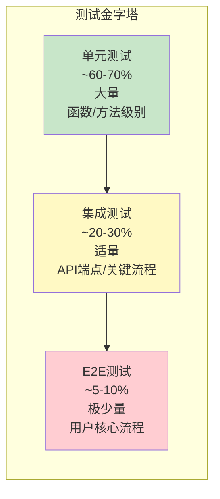
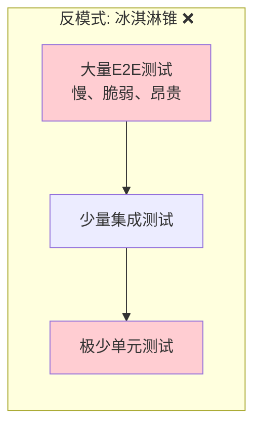

# 集成测试 (WebApplicationFactory) + TDD 流程 完全指南

> **学习目标**：掌握 ASP.NET Core 集成测试的完整方法论，包括 WebApplicationFactory 的使用、内存数据库配置、HTTP 请求-响应周期测试、认证模拟和 TDD 全流程实战
>
> **难度等级**：⭐⭐⭐⭐⭐ 高级
>
> **前置知识**：单元测试 (xUnit + Moq)、ASP.NET Core 中间件管道、依赖注入、EF Core 基础
>
> **预计时间**：90分钟

---

## 1. 单元测试 vs 集成测试

### 1.1 核心区别



### 2.2 详细对比表

| 维度 | 单元测试 | 集成测试 | E2E 测试 |
|------|---------|---------|----------|
| **被测对象** | 单个方法/类 | 多个组件协作 | 完整用户旅程 |
| **依赖处理** | Mock 所有外部依赖 | 真实或轻量替代 | 全部真实 |
| **执行速度** | < 10ms | 100ms - 2s | 5s - 数分钟 |
| **环境要求** | 无（纯内存） | 进程内 HTTP 服务器 | 完整部署环境 |
| **稳定性** | 高（无外部因素） | 中等（依赖DB/文件等） | 较低 |
| **维护成本** | 低 | 中 | 高 |
| **发现Bug类型** | 逻辑错误、边界条件 | 组件集成问题、数据流错误 | 跨系统集成问题 |

---

## 2. WebApplicationFactory\<TEntryPoint\> 入门

### 2.1 什么是 WebApplicationFactory？

`WebApplicationFactory<TEntryPoint>` 是 ASP.NET Core 提供的集成测试神器，它能够在**测试进程中启动一个完整的 ASP.NET Core 应用宿主**，让你用真实的 HttpClient 发送请求并验证完整的 HTTP 响应。



### 2.2 项目搭建

```bash
# 创建集成测试项目
dotnet new xunit -n BlogApi.IntegrationTests
dotnet sln add BlogApi.IntegrationTests/BlogApi.IntegrationTests.csproj

# 引用被测项目
dotnet add BlogApi.IntegrationTests/BlogApi.IntegrationTests.csproj reference ../BlogApi/BlogApi.csproj

# 安装必要NuGet包
dotnet add BlogApi.IntegrationTests/BlogApi.IntegrationTests.csproj package Microsoft.AspNetCore.Mvc.Testing
```

csproj 配置：

```xml
<Project Sdk="Microsoft.NET.Sdk">
  <PropertyGroup>
    <TargetFramework>net8.0</TargetFramework>
    <IsPackable>false</IsPackable>
    <IsTestProject>true</IsTestProject>
  </PropertyGroup>

  <ItemGroup>
    <PackageReference Include="Microsoft.AspNetCore.Mvc.Testing" Version="8.*" />
    <PackageReference Include="Microsoft.NET.Test.Sdk" Version="17.*" />
    <PackageReference Include="xunit" Version="2.*" />
    <PackageReference Include="xunit.runner.visualstudio" Version="2.*" />
    <PackageReference Include="Moq" Version="4.20.*" />
  </ItemGroup>

  <!-- 重要：让测试项目能找到被测项目的appsettings.json -->
  <ItemGroup>
    <Content Include="..\BlogApi\appsettings.json"
             Link="appsettings.json"
             CopyToOutputDirectory="PreserveNewest" />
  </ItemGroup>
</Project>
```

### 2.3 最简单的集成测试

```csharp
using Microsoft.AspNetCore.Mvc.Testing;
using Xunit;
using System.Net.Http.Json;

namespace BlogApi.IntegrationTests;

public class BasicIntegrationTests : IClassFixture<WebApplicationFactory<Program>>
{
    private readonly WebApplicationFactory<Program> _factory;
    private readonly HttpClient _client;

    public BasicIntegrationTests(WebApplicationFactory<Program> factory)
    {
        _factory = factory;
        _client = factory.CreateClient();
    }

    [Fact]
    public async Task Get_HealthEndpoint_ReturnsOk()
    {
        // Arrange & Act
        var response = await _client.GetAsync("/api/health");

        // Assert
        response.EnsureSuccessStatusCode();  // 断言状态码2xx
        var content = await response.Content.ReadFromJsonAsync<object>();
        Assert.NotNull(content);
    }

    [Fact]
    public async Task Get_NonExistentEndpoint_Returns404()
    {
        // Act
        var response = await _client.GetAsync("/api/nonexistent");

        // Assert
        Assert.Equal(HttpStatusCode.NotFound, response.StatusCode);
    }
}
```

---

## 3. 自定义测试环境配置

### 3.1 ConfigureWebHost - 替换服务注册

这是最常用的自定义方式，用于将生产环境的数据库替换为内存数据库：

```csharp
/// <summary>
/// 自定义WebApplicationFactory - 使用InMemoryDatabase进行集成测试
/// </summary>
public class CustomWebApplicationFactory : WebApplicationFactory<Program>
{
    protected override void ConfigureWebHost(IWebHostBuilder builder)
    {
        builder.ConfigureServices(services =>
        {
            // ====== 移除原有的DbContext注册 ======
            var descriptor = services.SingleOrDefault(
                d => d.ServiceType == typeof(DbContextOptions<ApplicationDbContext>));

            if (descriptor != null)
            {
                services.Remove(descriptor);
            }

            // ====== 注册InMemoryDatabase ======
            services.AddDbContext<ApplicationDbContext>(options =>
            {
                options.UseInMemoryDatabase("BlogIntegrationTestDb");
                // 使用InMemoryDatabase时建议开启敏感数据日志
                // 方便调试SQL查询
                options.EnableSensitiveDataLogging();
                options.EnableDetailedErrors();
            });

            // ====== 确保数据库已创建 ======
            var sp = services.BuildServiceProvider();
            using var scope = sp.CreateScope();
            var scopedServices = scope.ServiceProvider;
            var db = scopedServices.GetRequiredService<ApplicationDbContext>();

            // 确保数据库存在并应用迁移（InMemory不需要真正的迁移）
            db.Database.EnsureCreated();

            // ====== 种子数据 ======
            SeedTestData(db);
        });
    }

    /// <summary>
    /// 种子测试数据
    /// </summary>
    private static void SeedTestData(ApplicationDbContext dbContext)
    {
        // 先检查是否已有数据（避免重复播种）
        if (dbContext.Users.Any()) return;

        // 创建测试用户
        var users = new List<User>
        {
            new() { Id = Guid.NewGuid(), Email = "admin@blog.com", Nickname = "管理员",
                   Role = UserRole.Admin, PasswordHash = "hashed_password_1",
                   CreatedAt = DateTime.UtcNow.AddDays(-30) },
            new() { Id = Guid.NewGuid(), Email = "author@blog.com", Nickname = "技术作者",
                   Role = UserRole.Author, PasswordHash = "hashed_password_2",
                   CreatedAt = DateTime.UtcNow.AddDays(-15) },
            new() { Id = Guid.NewGuid(), Email = "reader@blog.com", Nickname = "普通读者",
                   Role = UserRole.Reader, PasswordHash = "hashed_password_3",
                   CreatedAt = DateTime.UtcNow.AddDays(-7) },
        };

        // 创建测试分类
        var categories = new List<Category>
        {
            new() { Id = 1, Name = "后端开发", Description = "服务端技术", SortOrder = 1 },
            new() { Id = 2, Name = "前端技术", Description = "客户端技术", SortOrder = 2 },
            new() { Id = 3, Name = "DevOps", Description = "运维与部署", SortOrder = 3 },
        };

        // 创建测试文章
        var articles = new List<Article>
        {
            new() { Id = 1, Title = "ASP.NET Core入门指南", Content = "详细内容...",
                    Summary = "从零开始学习ASP.NET Core", CategoryId = 1,
                    AuthorId = users[1].Id, Status = PostStatus.Published,
                    ViewCount = 1520, CreatedAt = DateTime.UtcNow.AddDays(-10),
                    PublishedAt = DateTime.UtcNow.AddDays(-9) },
            new() { Id = 2, Title = "Entity Framework Core性能优化", Content = "EF Core...",
                    Summary = "提升EF Core查询性能的10个技巧", CategoryId = 1,
                    AuthorId = users[1].Id, Status = PostStatus.Published,
                    ViewCount = 2340, CreatedAt = DateTime.UtcNow.AddDays(-5),
                    PublishedAt = DateTime.UtcNow.AddDays(-4) },
            new() { Id = 3, Title = "Vue.js 3组合式API详解", Content = "Vue3...",
                    Summary = "深入理解Vue3 Composition API", CategoryId = 2,
                    AuthorId = users[1].Id, Status = PostStatus.Draft,
                    ViewCount = 0, CreatedAt = DateTime.UtcNow.AddDays(-1) },
        };

        // 创建测试标签
        var tags = new List<Tag>
        {
            new() { Id = 1, Name = "C#", UsageCount = 15 },
            new() { Id = 2, Name = ".NET", UsageCount = 20 },
            new() { Id = 3, Name = "ASP.NET Core", UsageCount = 12 },
            new() { Id = 4, Name = "Vue.js", UsageCount = 8 },
        };

        // 文章-标签关联
        var articleTags = new List<ArticleTag>
        {
            new() { ArticleId = 1, TagId = 1 },
            new() { ArticleId = 1, TagId = 3 },
            new() { ArticleId = 2, TagId = 1 },
            new() { ArticleId = 2, TagId = 2 },
            new() { ArticleId = 3, TagId = 4 },
        };

        // 批量添加
        dbContext.Users.AddRange(users);
        dbContext.Categories.AddRange(categories);
        dbContext.Articles.AddRange(articles);
        dbContext.Tags.AddRange(tags);
        dbContext.ArticleTags.AddRange(articleTags);

        dbContext.SaveChanges();
    }
}
```

### 3.2 ConfigureAppConfiguration - 替换配置源

当需要修改 `appsettings.json` 的值用于测试时：

```csharp
public class ConfigurableWebApplicationFactory : WebApplicationFactory<Program>
{
    protected override void ConfigureAppConfiguration(
        IConfigurationBuilder config)
    {
        // 使用内存中的配置覆盖默认配置
        config.AddInMemoryCollection(new Dictionary<string, string?>
        {
            ["ConnectionStrings:DefaultConnection"] = "DataSource=test.db",  // 不重要，会被替换
            ["JwtSettings:SecretKey"] = "test-secret-key-for-integration-testing-only",
            ["JwtSettings:Issuer"] = "test-issuer",
            ["JwtSettings:Audience"] = "test-audience",
            ["JwtSettings:ExpirationMinutes"] = "60",
            ["Logging:LogLevel:Default"] = "Debug",  // 开启详细日志便于调试
        });
    }
}
```

### 3.3 使用自定义 Factory

```csharp
public class ArticlesIntegrationTests : IClassFixture<CustomWebApplicationFactory>
{
    private readonly CustomWebApplicationFactory _factory;
    private readonly HttpClient _client;

    public ArticlesIntegrationTests(CustomWebApplicationFactory factory)
    {
        _factory = factory;
        _client = factory.CreateClient();  // 默认不自动跟随重定向
    }

    [Fact]
    public async Task GetArticles_ReturnsSeededArticles()
    {
        // Act
        var response = await _client.GetAsync("/api/articles?page=1&pageSize=10");

        // Assert: HTTP层面
        response.EnsureSuccessStatusCode();
        Assert.Equal("application/json; charset=utf-8",
            response.Content.Headers.ContentType?.MediaType);

        // Assert: 业务数据层
        var result = await response.Content.ReadFromJsonAsync<PagedResult<ArticleDto>>();
        Assert.NotNull(result);
        Assert.Equal(2, result.TotalCount);  // 只有2篇Published文章（第3篇是Draft）
        Assert.Equal("ASP.NET Core入门指南", result.Items[0].Title);
    }
}
```

---

## 4. 完整的 HTTP 请求-响应周期测试

### 4.1 CRUD 操作完整测试套件

```csharp
using Microsoft.AspNetCore.Mvc.Testing;
using Microsoft.VisualStudio.TestTools.UnitTesting;
using System.Net;
using System.Net.Http.Headers;
using System.Net.Http.Json;
using Xunit;
using BlogApi.Models.Dtos;

namespace BlogApi.IntegrationTests.Controllers;

public class ArticlesControllerIntegrationTests : IClassFixture<CustomWebApplicationFactory>
{
    private readonly CustomWebApplicationFactory _factory;
    private readonly HttpClient _authenticatedClient;
    private readonly HttpClient _anonymousClient;

    public ArticlesControllerIntegrationTests(CustomWebApplicationFactory factory)
    {
        _factory = factory;

        // 匿名客户端（未认证）
        _anonymousClient = factory.CreateClient();

        // 认证客户端（携带JWT Token）
        _authenticatedClient = factory.CreateClient();
        var token = GenerateTestToken("author@blog.com", new[] { "Author" });
        _authenticatedClient.DefaultRequestHeaders.Authorization =
            new AuthenticationHeaderValue("Bearer", token);
    }

    #region GET /api/articles - 获取列表

    [Fact]
    public async Task GetArticles_DefaultParams_ReturnsPagedPublishedArticles()
    {
        // Act
        var response = await _anonymousClient.GetAsync("/api/articles");

        // Assert
        Assert.Equal(HttpStatusCode.OK, response.StatusCode);

        var pagedResult = await response.Content.ReadFromJsonAsync<PagedResult<ArticleDto>>();
        Assert.NotNull(pagedResult);
        Assert.Equal(2, pagedResult.TotalCount);       // 2篇已发布
        Assert.Equal(1, pagedResult.Page);              // 第1页
        Assert.True(pagedResult.Items.Count <= 10);     // 不超过每页上限
    }

    [Theory]
    [InlineData("?page=1&pageSize=2", 2)]
    [InlineData("?page=1&pageSize=1", 1)]
    [InlineData("?page=2&pageSize=1", 1)]   // 第2页应有1条
    [InlineData("?page=999&pageSize=10", 0)] // 超出范围的页返回空
    public async Task GetArticles_Pagination_WorksCorrectly(string queryString, int expectedCount)
    {
        var response = await _anonymousClient.GetAsync($"/api/articles{queryString}");
        response.EnsureSuccessStatusCode();

        var result = await response.Content.ReadFromJsonAsync<PagedResult<ArticleDto>>();
        Assert.NotNull(result);
        Assert.Equal(expectedCount, result.Items.Count);
    }

    [Fact]
    public async Task GetArticles_FilterByCategory_ReturnsFilteredResults()
    {
        // 分类1是"后端开发"，有2篇文章
        var response = await _anonymousClient.GetAsync("/api/articles?categoryId=1");
        response.EnsureSuccessStatusCode();

        var result = await response.Content.ReadFromJsonAsync<PagedResult<ArticleDto>>();
        Assert.NotNull(result);
        Assert.All(result.Items, a => Assert.Equal(1, a.CategoryId));
    }

    #endregion

    #region GET /api/articles/{id} - 获取详情

    [Fact]
    public async Task GetArticleById_ValidId_ReturnsArticleWithDetails()
    {
        // Act
        var response = await _anonymousClient.GetAsync("/api/articles/1");

        // Assert
        Assert.Equal(HttpStatusCode.OK, response.StatusCode);

        var article = await response.Content.ReadFromJsonAsync<ArticleDto>();
        Assert.NotNull(article);
        Assert.Equal(1, article.Id);
        Assert.Equal("ASP.NET Core入门指南", article.Title);
        Assert.Equal("后端开发", article.CategoryName);  // 关联数据正确加载
        Assert.Equal("技术作者", article.AuthorName);     // 作者信息正确
        Assert.True(article.ViewCount > 0);
    }

    [Fact]
    public async Task GetArticleById_InvalidId_Returns404()
    {
        var response = await _anonymousClient.GetAsync("/api/articles/99999");

        Assert.Equal(HttpStatusCode.NotFound, response.StatusCode);
    }

    [Fact]
    public async Task GetArticleById_DraftArticle_AnonymousUserReturns404()
    {
        // ID=3 是草稿状态的文章
        var response = await _anonymousClient.GetAsync("/api/articles/3");

        // 未登录用户不应看到草稿
        Assert.Equal(HttpStatusCode.NotFound, response.StatusCode);
    }

    #endregion

    #region POST /api/articles - 创建文章

    [Fact]
    public async Task CreateArticle_AuthenticatedUser_Returns201WithLocation()
    {
        // Arrange
        var createDto = new CreateArticleDto
        {
            Title = "集成测试创建的新文章",
            Content = "这是一篇通过集成测试创建的文章。包含足够的内容来生成摘要。",
            Summary = "集成测试摘要",
            CategoryId = 1,
            Tags = new List<string> { "C#", "测试" }
        };

        // Act
        var response = await _authenticatedClient.PostAsJsonAsync(
            "/api/articles", createDto);

        // Assert: HTTP状态码
        Assert.Equal(HttpStatusCode.Created, response.StatusCode);

        // Assert: Location头指向新资源
        Assert.NotNull(response.Headers.Location);
        Assert.Contains("/api/articles/", response.Headers.Location.ToString());

        // Assert: 响应体包含新创建的文章
        var createdArticle = await response.Content.ReadFromJsonAsync<ArticleDto>();
        Assert.NotNull(createdArticle);
        Assert.Equal("集成测试创建的新文章", createdArticle.Title);
        Assert.True(createdArticle.Id > 0);

        // Assert: 验证数据库确实保存了（通过GET再次获取）
        var getResponse = await _anonymousClient.GetAsync($"/api/articles/{createdArticle.Id}");
        getResponse.EnsureSuccessStatusCode();
        var fetchedArticle = await getResponse.Content.ReadFromJsonAsync<ArticleDto>();
        Assert.NotNull(fetchedArticle);
        Assert.Equal(createDto.Title, fetchedArticle.Title);
    }

    [Fact]
    public async Task CreateArticle_UnauthenticatedUser_Returns401()
    {
        var dto = new CreateArticleDto { Title = "Test", Content = "Content" };
        var response = await _anonymousClient.PostAsJsonAsync("/api/articles", dto);

        Assert.Equal(HttpStatusCode.Unauthorized, response.StatusCode);
    }

    [Theory]
    [InlineData("", "标题不能为空")]
    [InlineData(null, "标题不能为空")]
    public async Task CreateArticle_InvalidTitle_Returns400(string? title, string expectedError)
    {
        var dto = new CreateArticleDto { Title = title ?? "", Content = "Content" };
        var response = await _authenticatedClient.PostAsJsonAsync("/api/articles", dto);

        Assert.Equal(HttpStatusCode.BadRequest, response.StatusCode);
    }

    #endregion

    #region PUT /api/articles/{id} - 更新文章

    [Fact]
    public async Task UpdateArticle_OwnerUser_ReturnsOkWithUpdatedData()
    {
        // Arrange: 先获取现有文章
        var getResponse = await _authenticatedClient.GetAsync("/api/articles/1");
        getResponse.EnsureSuccessStatusCode();
        var existing = await getResponse.Content.ReadFromJsonAsync<ArticleDto>();

        var updateDto = new UpdateArticleDto
        {
            Title = "更新后的标题（集成测试）",
            Content = "更新后的内容...",
            Summary = "更新后的摘要",
            CategoryId = 2
        };

        // Act
        var response = await _authenticatedClient.PutAsJsonAsync(
            "/api/articles/1", updateDto);

        // Assert
        Assert.Equal(HttpStatusCode.OK, response.StatusCode);

        var updated = await response.Content.ReadFromJsonAsync<ArticleDto>();
        Assert.NotNull(updated);
        Assert.Equal("更新后的标题（集成测试）", updated.Title);
        Assert.Equal(2, updated.CategoryId);  // 分类已更改
    }

    #endregion

    #region DELETE /api/articles/{id} - 删除文章

    [Fact]
    public async Task DeleteArticle_AdminUser_ReturnsNoContent()
    {
        // 使用Admin权限的客户端
        var adminClient = _factory.CreateClient();
        adminClient.DefaultRequestHeaders.Authorization =
            new AuthenticationHeaderValue("Bearer", GenerateTestToken("admin@blog.com", new[] { "Admin" }));

        // Act
        var response = await adminClient.DeleteAsync("/api/articles/2");

        // Assert
        Assert.Equal(HttpStatusCode.NoContent, response.StatusCode);

        // 验证已被删除（GET应返回404）
        var getResponse = await _anonymousClient.GetAsync("/api/articles/2");
        Assert.Equal(HttpStatusCode.NotFound, getResponse.StatusCode);
    }

    #endregion

    #region 辅助方法

    /// <summary>
    /// 生成测试用的JWT Token（简化版，实际项目中应复用应用的Token生成逻辑）
    /// </summary>
    private static string GenerateTestToken(string email, string[] roles)
    {
        // 注意：这里使用简化的Token生成方式
        // 生产级测试应该引用应用项目的Token生成服务
        var key = new SymmetricSecurityKey(
            System.Text.Encoding.UTF8.GetBytes(
                "test-secret-key-for-integration-testing-only-must-be-long-enough"));

        var creds = new SigningCredentials(key, SecurityAlgorithms.HmacSha256);

        var claims = new List<Claim>
        {
            new(ClaimTypes.Email, email),
            new(ClaimTypes.NameIdentifier, Guid.NewGuid().ToString()),
            new(JwtRegisteredClaimNames.Jti, Guid.NewGuid().ToString()),
            new(JwtRegisteredClaimNames.Iss, "test-issuer"),
            new(JwtRegisteredClaimNames.Aud, "test-audience"),
        };

        foreach (var role in roles)
        {
            claims.Add(new Claim(ClaimTypes.Role, role));
        }

        var token = new JwtSecurityToken(
            issuer: "test-issuer",
            audience: "test-audience",
            claims: claims,
            expires: DateTime.UtcNow.AddHours(1),
            signingCredentials: creds);

        return new JwtSecurityTokenHandler().WriteToken(token);
    }

    #endregion
}
```

### 4.2 验证 JSON 响应结构

```csharp
[Fact]
public async Task GetArticle_ResponseStructure_MatchesContract()
{
    var response = await _client.GetAsync("/api/articles/1");
    response.EnsureSuccessStatusCode();

    using var jsonDoc = await JsonDocument.ParseAsync(await response.Content.ReadAsStreamAsync());
    var root = jsonDoc.RootElement;

    // 验证JSON结构和字段类型
    Assert.True(root.TryGetProperty("id", out var idProp) && idProp.ValueKind == JsonValueKind.Number);
    Assert.True(root.TryGetProperty("title", out var titleProp) && titleProp.ValueKind == JsonValueKind.String);
    Assert.True(root.TryGetProperty("viewCount", out var vcProp) && vcProp.ValueKind == JsonValueKind.Number);
    Assert.True(root.TryGetProperty("createdAt", out var caProp) && caProp.ValueKind == JsonValueKind.String);
    Assert.True(root.TryGetProperty("categoryName", out var cnProp));  // 可能为null
    Assert.True(root.TryGetProperty("authorName", out var anProp));

    // 验证日期格式符合ISO 8601标准
    var createdAtStr = caProp.GetString();
    Assert.True(DateTime.TryParse(createdAtStr, null, DateTimeStyles.RoundtripKind, out _),
        $"createdAt 格式无效: {createdAtStr}");

    // 验证数值范围合理
    Assert.True(idProp.GetInt32() > 0);
    Assert.True(vcProp.GetInt64() >= 0);
}
```

---

## 5. 认证集成测试

### 5.1 伪造 JWT Token

在集成测试中，我们需要让测试请求携带有效的 JWT Token。有两种策略：

**策略一：在测试中直接生成 Token**

如上文的 `GenerateTestToken` 方法所示。

**策略二：使用自定义 Handler 绕过认证**

```csharp
/// <summary>
/// 测试用认证Handler - 自动为所有请求附加测试身份
/// </summary>
public class TestAuthHandler : AuthenticationHandler<AuthenticationSchemeOptions>
{
    public const string SchemeName = "TestAuthScheme";
    private readonly string _userId;
    private readonly string _email;
    private readonly string[] _roles;

    public TestAuthHandler(
        IOptionsMonitor<AuthenticationSchemeOptions> options,
        ILoggerFactory logger,
        UrlEncoder encoder,
        ISystemClock clock,
        string userId = "test-user-id",
        string email = "test@test.com",
        string[]? roles = null)
        : base(options, logger, encoder, clock)
    {
        _userId = userId;
        _email = email;
        _roles = roles ?? Array.Empty<string>();
    }

    protected override Task<AuthenticateResult> HandleAuthenticateAsync()
    {
        var claims = new List<Claim>
        {
            new(ClaimTypes.NameIdentifier, _userId),
            new(ClaimTypes.Name, "Test User"),
            new(ClaimTypes.Email, _email),
            new(JwtRegisteredClaimNames.Jti, Guid.NewGuid().ToString()),
        };

        foreach (var role in _roles)
        {
            claims.Add(new Claim(ClaimTypes.Role, role));
        }

        var identity = new ClaimsIdentity(claims, SchemeName);
        var principal = new ClaimsPrincipal(identity);
        var ticket = new AuthenticationTicket(principal, SchemeName);

        return Task.FromResult(AuthenticateResult.Success(ticket));
    }
}

/// <summary>
/// 带认证支持的WebApplicationFactory
/// </summary>
public class AuthenticatedWebApplicationFactory : CustomWebApplicationFactory
{
    protected override void ConfigureWebHost(IWebHostBuilder builder)
    {
        base.ConfigureWebHost(builder);

        builder.ConfigureServices(services =>
        {
            // 移除原有的JWT认证
            var jwtAuthDescriptor = services.SingleOrDefault(
                d => d.ServiceType == typeof(IAuthenticationHandlerProvider));
            // 注意：不要移除认证服务本身，而是添加测试认证方案

            // 添加测试认证方案
            services.AddAuthentication(TestAuthHandler.SchemeName)
                .AddScheme<AuthenticationSchemeOptions, TestAuthHandler>(
                    TestAuthHandler.SchemeName, options => { });
        });
    }
}

// 使用示例
public class AuthenticatedTests : IClassFixture<AuthenticatedWebApplicationFactory>
{
    private readonly HttpClient _adminClient;
    private readonly HttpClient _authorClient;

    public AuthenticatedTests(AuthenticatedWebApplicationFactory factory)
    {
        // Admin客户端
        _adminClient = factory.WithWebHostBuilder(builder =>
        {
            builder.ConfigureServices(services =>
            {
                services.AddSingleton<TestAuthHandler>(new TestAuthHandler(
                    options: null!, logger: null!, encoder: null!, clock: null!,
                    userId: "admin-id", email: "admin@test.com",
                    roles: new[] { "Admin" }));
            });
        }).CreateClient();

        // Author客户端
        _authorClient = factory.WithWebHostBuilder(builder =>
        {
            builder.ConfigureServices(services =>
            {
                services.AddSingleton<TestAuthHandler>(new TestAuthHandler(
                    userId: "author-id", email: "author@test.com",
                    roles: new[] { "Author" }));
            });
        }).CreateClient();
    }

    [Fact]
    public async Task AdminCanAccessAdminEndpoint()
    {
        var response = await _adminClient.GetAsync("/api/admin/dashboard");
        response.EnsureSuccessStatusCode();
    }

    [Fact]
    public async Task AuthorCannotAccessAdminEndpoint_Returns403()
    {
        var response = await _authorClient.GetAsync("/api/admin/dashboard");
        Assert.Equal(HttpStatusCode.Forbidden, response.StatusCode);
    }
}
```

### 5.2 Cookie 认证模拟

```csharp
public class CookieAuthenticatedFactory : WebApplicationFactory<Program>
{
    protected override void ConfigureWebHost(IWebHostBuilder builder)
    {
        builder.ConfigureServices(services =>
        {
            services.AddAuthentication(CookieAuthenticationDefaults.AuthenticationScheme)
                .AddCookie(options =>
                {
                    // 测试环境下禁用cookie保护措施
                    options.Cookie.SameSite = SameSiteMode.Lax;
                    options.Cookie.SecurePolicy = CookieSecurePolicy.None;
                });

            services.AddScoped<IUserService, TestUserService>();  // Mock用户服务
        });
    }

    protected override void ConfigureClient(HttpClient client)
    {
        // 自动设置测试Cookie
        client.DefaultRequestHeaders.Add("Cookie",
            $".AspNetCore.Cookies={GenerateFakeCookieValue()}");
    }
}
```

---

## 6. 数据库操作的真实性验证

### 6.1 SQLite InMemory vs SQL Server LocalDB



### 6.2 SQLite InMemory 配置

```csharp
// 在CustomWebApplicationFactory中使用SQLite InMemory
protected override void ConfigureWebHost(IWebHostBuilder builder)
{
    builder.ConfigureServices(services =>
    {
        // 移除原有DbContext
        var descriptor = services.SingleOrDefault(
            d => d.ServiceType == typeof(DbContextOptions<ApplicationDbContext>));
        if (descriptor != null) services.Remove(descriptor);

        // 使用SQLite InMemory（比纯InMemory更接近真实SQL行为）
        services.AddDbContext<ApplicationDbContext>(options =>
        {
            options.UseSqlite("DataSource=:memory:");
            options.EnableSensitiveDataLogging();
        });

        // 确保数据库打开且可用
        var sp = services.BuildServiceProvider();
        using var scope = sp.CreateScope();
        var db = scope.ServiceProvider.GetRequiredService<ApplicationDbContext>();
        db.Database.OpenConnection();           // SQLite InMemory需要显式打开连接
        db.Database.EnsureCreated();            // 创建表结构
        SeedTestData(db);                       // 种子数据
    });
}
```

### 6.3 数据库操作验证测试

```csharp
public class DatabaseOperationTests : IClassFixture<CustomWebApplicationFactory>
{
    private readonly CustomWebApplicationFactory _factory;

    public DatabaseOperationTests(CustomWebApplicationFactory factory)
    {
        _factory = factory;
    }

    [Fact]
    public async Task CreateArticle_PersistsToDatabase_CanBeRetrievedLater()
    {
        // Arrange: 用认证客户端创建文章
        var client = CreateAuthenticatedClient(_factory, "author@blog.com", "Author");

        var createDto = new CreateArticleDto
        {
            Title = "持久化验证测试文章",
            Content = "这篇文章应该被持久化到数据库中",
            CategoryId = 1
        };

        // Act: 创建文章
        var createResponse = await client.PostAsJsonAsync("/api/articles", createDto);
        createResponse.EnsureSuccessStatusCode();
        var created = await createResponse.Content.ReadFromJsonAsync<ArticleDto>();
        Assert.NotNull(created);

        // Assert: 使用全新的客户端（无认证缓存）获取文章
        // 这证明数据确实写入了数据库，而非仅存在于内存缓存中
        var freshClient = _factory.CreateClient();
        var getResponse = await freshClient.GetAsync($"/api/articles/{created.Id}");
        getResponse.EnsureSuccessStatusCode();

        var retrieved = await getResponse.Content.ReadFromJsonAsync<ArticleDto>();
        Assert.NotNull(retrieved);
        Assert.Equal("持久化验证测试文章", retrieved.Title);
        Assert.Equal(createDto.CategoryId, retrieved.CategoryId);
    }

    [Fact]
    public async Task DeleteArticle_RemovesFromDatabase_CannotBeRetrieved()
    {
        // Arrange
        var adminClient = CreateAuthenticatedClient(_factory, "admin@blog.com", "Admin");

        // Act: 删除文章
        var deleteResponse = await adminClient.DeleteAsync("/api/articles/1");
        Assert.Equal(HttpStatusCode.NoContent, deleteResponse.StatusCode);

        // Assert: 再次获取应返回404
        var client = _factory.CreateClient();
        var getResponse = await client.GetAsync("/api/articles/1");
        Assert.Equal(HttpStatusCode.NotFound, getResponse.StatusCode);

        // Assert: 列表中也不应出现该文章
        var listResponse = await client.GetAsync("/api/articles");
        listResponse.EnsureSuccessStatusCode();
        var list = await listResponse.Content.ReadFromJsonAsync<PagedResult<ArticleDto>>();
        Assert.NotNull(list);
        Assert.DoesNotContain(list.Items, a => a.Id == 1);
    }

    [Fact]
    public async Task UpdateArticle_ModifiesDatabase_ChangesArePersistent()
    {
        var client = CreateAuthenticatedClient(_factory, "author@blog.com", "Author");

        var updateDto = new UpdateArticleDto
        {
            Title = "修改后的标题-数据库验证",
            Content = "修改后的内容"
        };

        // 更新
        var updateResponse = await client.PutAsJsonAsync("/api/articles/1", updateDto);
        updateResponse.EnsureSuccessStatusCode();

        // 用新客户端验证
        var freshClient = _factory.CreateClient();
        var getResponse = await freshClient.GetAsync("/api/articles/1");
        getResponse.EnsureSuccessStatusCode();

        var article = await getResponse.Content.ReadFromJsonAsync<ArticleDto>();
        Assert.NotNull(article);
        Assert.Equal("修改后的标题-数据库验证", article.Title);
        Assert.NotEqual(DateTime.MinValue, article.UpdatedAt);  // 更新时间已刷新
    }

    private static HttpClient CreateAuthenticatedClient(
        CustomWebApplicationFactory factory, string email, string role)
    {
        var client = factory.CreateClient();
        var token = GenerateTestToken(email, new[] { role });
        client.DefaultRequestHeaders.Authorization =
            new AuthenticationHeaderValue("Bearer", token);
        return client;
    }
}
```

---

## 7. 测试中间件管道

### 7.1 验证中间件顺序和行为

```csharp
public class MiddlewarePipelineTests : IClassFixture<CustomWebApplicationFactory>
{
    private readonly CustomWebApplicationFactory _factory;

    public MiddlewarePipelineTests(CustomWebApplicationFactory factory)
    {
        _factory = factory;
    }

    [Fact]
    public async Task Request_PassesThroughAllMiddleware_AddsExpectedHeaders()
    {
        var client = _factory.CreateClient();
        var response = await client.GetAsync("/api/health");

        // 验证自定义中间件添加的响应头
        Assert.True(response.Headers.Contains("X-Request-Id"), "缺少X-Request-Id头");
        Assert.True(response.Headers.Contains("X-Response-Time"), "缺少X-Response-Time头");
    }

    [Fact]
    public async Task Request_ToNonApiPath_NotHandledByApiMiddleware()
    {
        var client = _factory.CreateClient();

        // 请求一个不存在的路径，验证全局异常中间件的处理
        var response = await client.GetAsync("/nonexistent-page");

        // 应该返回404而非500（异常中间件正常工作）
        Assert.Equal(HttpStatusCode.NotFound, response.StatusCode);
    }

    [Fact]
    public async Task CorsMiddleware_AllowsConfiguredOrigins()
    {
        var client = _factory.CreateClient();

        // 模拟跨域预检请求
        var request = new HttpRequestMessage(HttpMethod.Options, "/api/articles");
        request.Headers.Add("Origin", "https://example.com");
        request.Headers.Add("Access-Control-Request-Method", "GET");

        var response = await client.SendAsync(request);

        // CORS中间件应允许此来源
        Assert.True(response.Headers.Contains("Access-Control-Allow-Origin"));
    }
}
```

---

## 8. 端到端(E2E)测试简介

### 8.1 E2E vs 集成测试的区别

| 特性 | 集成测试 | E2E 测试 |
|------|---------|---------|
| **工具** | WebApplicationFactory + HttpClient | Playwright/Selenium/WATIR |
| **浏览器** | 无（HTTP客户端模拟） | 真实浏览器（Chromium/Firefox） |
| **JavaScript** | 不执行 | 完整执行 |
| **CSS渲染** | 不涉及 | 验证UI呈现 |
| **适用场景** | API契约测试 | 用户交互流程测试 |

### 8.2 使用 Playwright 进行 .NET E2E 测试

```bash
# 安装Playwright
dotnet tool install --global Microsoft.Playwright.CLI
playwright install chromium
```

```csharp
using Microsoft.Playwright;
using Xunit;

namespace BlogApi.E2ETests;

public class BlogE2ETests : IAsyncLifetime
{
    private IPlaywright? _playwright;
    private IBrowser? _browser;
    private IBrowserContext? _context;
    private IPage? _page;

    public async Task InitializeAsync()
    {
        _playwright = await Playwright.CreateAsync();
        _browser = await _playwright.Chromium.LaunchAsync(new BrowserTypeLaunchOptions
        {
            Headless = true  // CI环境中无头模式
        });
        _context = await _browser.NewContextAsync(new BrowserNewContextOptions
        {
            BaseURL = "http://localhost:5000"  // 应用需要先启动！
        });
        _page = await _context.NewPageAsync();
    }

    public async Task DisposeAsync()
    {
        await _browser?.CloseAsync();
        _playwright?.Dispose();
    }

    [Fact]
    public async Task HomePage_DisplaysCorrectly()
    {
        await _page!.GotoAsync("/");
        await Expect(_page.Locator("h1")).ToHaveTextAsync("我的技术博客");
        await Expect(_page.Locator(".article-card")).toHaveCountAsync(10);
    }

    [Fact]
    public async Task ArticleDetailPage_ShowsFullContent()
    {
        await _page!.GotoAsync("/articles/1");
        await Expect(_page.Locator("h1.article-title"))
            .ToHaveTextAsync("ASP.NET Core入门指南");
        await Expect(_page.Locator(".article-content")).ToBeVisibleAsync();
    }

    [Fact]
    public async Task LoginFlow_CompletesSuccessfully()
    {
        await _page!.GotoAsync("/login");
        await _page.FillAsync("#email", "admin@blog.com");
        await _page.FillAsync("#password", "password123");
        await _page.ClickAsync("button[type='submit']");

        // 验证跳转到首页且显示用户名
        await _page.WaitForURLAsync("**/");
        await Expect(_page.Locator(".user-menu")).ToContainTextAsync("管理员");
    }
}
```

---

## 9. TDD 完整流程演示

### 9.1 从零开始：用 TDD 开发搜索功能

让我们以 TDD 方式从头实现一个完整的搜索 API。

#### Phase 1: RED - 编写失败的测试

```csharp
/// <summary>
/// SearchController 集成测试 - TDD第一阶段：RED
/// 这些测试目前都会失败，因为SearchController还不存在！
/// </summary>
public class SearchControllerTddTests : IClassFixture<CustomWebApplicationFactory>
{
    private readonly CustomWebApplicationFactory _factory;
    private readonly HttpClient _client;

    public SearchControllerTddTests(CustomWebApplicationFactory factory)
    {
        _factory = factory;
        _client = factory.CreateClient();
    }

    // ========== 测试1: 基本关键词搜索 ==========

    [Fact]
    public async Task Search_ByKeyword_ReturnsMatchingArticles()
    {
        // Act
        var response = await _client.GetAsync("/api/search?q=ASP.NET");

        // Assert
        response.EnsureSuccessStatusCode();

        var results = await response.Content.ReadFromJsonAsync<List<SearchResultDto>>();
        Assert.NotNull(results);
        Assert.NotEmpty(results);
        Assert.All(results, r =>
        {
            Assert.True(r.Title.Contains("ASP.NET", StringComparison.OrdinalIgnoreCase) ||
                      r.Summary!.Contains("ASP.NET", StringComparison.OrdinalIgnoreCase),
                $"结果 '{r.Title}' 不包含关键词 'ASP.NET'");
        });
    }

    // ========== 测试2: 无结果情况 ==========

    [Fact]
    public async Task Search_NoMatches_ReturnsEmptyList()
    {
        var response = await _client.GetAsync("/api/search?q=zzz_nonexistent_keyword_zzz");

        response.EnsureSuccessStatusCode();

        var results = await response.Content.ReadFromJsonAsync<List<SearchResultDto>>();
        Assert.NotNull(results);
        Assert.Empty(results);
    }

    // ========== 测试3: 空关键词参数校验 ==========

    [Theory]
    [InlineData("")]
    [InlineData("%20")]  // 仅空格
    public async Task Search_EmptyOrWhitespaceKeyword_Returns400(string keyword)
    {
        var response = await _client.GetAsync($"/api/search?q={Uri.EscapeDataString(keyword)}");

        Assert.Equal(HttpStatusCode.BadRequest, response.StatusCode);
    }

    // ========== 测试4: 分页功能 ==========

    [Fact]
    public async Task Search_WithPagination_ReturnsCorrectPage()
    {
        var response = await _client.GetAsync("/api/search?q=.NET&page=1&size=2");

        response.EnsureSuccessStatusCode();

        var pagedResult = await response.Content.ReadFromJsonAsync<PagedResult<SearchResultDto>>();
        Assert.NotNull(pagedResult);
        Assert.True(pagedResult.Items.Count <= 2);
        Assert.Equal(1, pagedResult.Page);
    }

    // ========== 测试5: 搜索高亮 ==========

    [Fact]
    public async Task Search_ResultsIncludeHighlightedKeyword()
    {
        var response = await _client.GetAsync("/api/search?q=Core");

        response.EnsureSuccessStatusCode();

        var results = await response.Content.ReadFromJsonAsync<List<SearchResultDto>>();
        Assert.NotNull(results);
        if (results.Count > 0)
        {
            // 结果中应包含带标记的高亮文本
            Assert.Contains("<mark>", results[0].HighlightedTitle!);
        }
    }

    // ========== 测试6: 按标签筛选 ==========

    [Fact]
    public async Task Search_FilterByTag_ReturnsOnlyTaggedArticles()
    {
        var response = await _client.GetAsync("/api/search?q=.NET&tag=C%23");  // C# URL编码

        response.EnsureSuccessStatusCode();

        var results = await response.Content.ReadFromJsonAsync<List<SearchResultDto>>();
        Assert.NotNull(results);
        Assert.All(results, r => Assert.Contains("C#", r.Tags!));
    }
}
```

此时运行测试 -> **全部红色（失败）**！

#### Phase 2: GREEN - 编写最小实现

```csharp
namespace BlogApi.Controllers;

[ApiController]
[Route("api/[controller]")]
public class SearchController : ControllerBase
{
    private readonly ApplicationDbContext _db;
    private readonly ILogger<SearchController> _logger;

    public SearchController(ApplicationDbContext db, ILogger<SearchController> logger)
    {
        _db = db;
        _logger = logger;
    }

    /// <summary>
    /// 搜索文章
    /// </summary>
    [HttpGet]
    public async Task<ActionResult<PagedResult<SearchResultDto>>> Search(
        [FromQuery] string q,
        [FromQuery] int page = 1,
        [FromQuery] int size = 10,
        [FromQuery] string? tag = null)
    {
        // 参数验证
        if (string.IsNullOrWhiteSpace(q))
            return BadRequest(new { message = "搜索关键词不能为空" });

        page = Math.Max(1, page);
        size = Math.Clamp(size, 1, 50);

        // 构建查询
        IQueryable<Article> query = _db.Articles
            .Include(a => a.Tags)
            .Where(a => a.Status == PostStatus.Published);

        // 关键词过滤
        query = query.Where(a =>
            a.Title.Contains(q) || a.Content!.Contains(q) || a.Summary!.Contains(q));

        // 标签筛选
        if (!string.IsNullOrWhiteSpace(tag))
        {
            query = query.Where(a => a.Tags.Any(t => t.Name == tag));
        }

        // 总数
        var totalCount = await query.CountAsync();

        // 分页
        var items = await query
            .OrderByDescending(a => a.ViewCount)
            .ThenByDescending(a => a.PublishedAt)
            .Skip((page - 1) * size)
            .Take(size)
            .Select(a => new SearchResultDto
            {
                Id = a.Id,
                Title = a.Title,
                Summary = a.Summary,
                HighlightedTitle = HighlightKeyword(a.Title, q),
                HighlightedSummary = HighlightKeyword(a.Summary!, q),
                ViewCount = a.ViewCount,
                PublishedAt = a.PublishedAt,
                Tags = a.Tags.Select(t => t.Name).ToList(),
                CategoryName = a.Category!.Name
            })
            .ToListAsync();

        return Ok(new PagedResult<SearchResultDto>
        {
            Items = items,
            TotalCount = totalCount,
            Page = page,
            PageSize = size
        });
    }

    /// <summary>
    /// 高亮匹配的关键词
    /// </summary>
    private static string HighlightKeyword(string text, string keyword)
    {
        if (string.IsNullOrEmpty(text)) return text;
        var escaped = System.Text.RegularExpressions.Regex.Escape(keyword);
        return System.Text.RegularExpressions.Regex.Replace(
            text, escaped, match => $"<mark>{match.Value}</mark>",
            System.Text.RegularExpressions.RegexOptions.IgnoreCase);
    }
}

// DTO定义
public record SearchResultDto(
    int Id,
    string Title,
    string? Summary,
    string HighlightedTitle,
    string? HighlightedSummary,
    long ViewCount,
    DateTime? PublishedAt,
    List<string>? Tags,
    string? CategoryName
);
```

运行测试 -> **全部绿色（通过）**！

#### Phase 3: REFACTOR - 优化代码质量

```csharp
// 重构点：
// 1. 将搜索逻辑提取到 Service 层（单一职责原则）
// 2. 添加搜索历史记录功能
// 3. 优化查询性能（只选择需要的列）

// 重构后的 Controller（精简版）
[HttpGet]
public async Task<ActionResult<PagedResult<SearchResultDto>>> Search(
    [FromQuery] string q,
    [FromQuery] int page = 1,
    [FromQuery] int size = 10,
    [FromQuery] string? tag = null)
{
    var request = new SearchRequest { Keyword = q, Page = page, PageSize = size, Tag = tag };
    var result = await _searchService.SearchAsync(request);

    // 记录搜索历史（异步非阻塞）
    _ = _searchHistoryService.RecordAsync(q);

    return Ok(result);
}
```

再次运行测试 -> **仍然绿色**！

---

## 10. 测试金字塔概念

### 10.1 金字塔结构



### 10.2 各层测试的职责分配

| 层级 | 数量占比 | 典型覆盖目标 | 示例 |
|------|---------|-------------|------|
| **单元测试** | 60-70% | 纯逻辑、算法、规则验证 | 密码强度检查、Slug生成、金额计算 |
| **集成测试** | 20-30% | API契约、数据流、组件协作 | CRUD端点、认证流程、缓存一致性 |
| **E2E测试** | 5-10% | 核心业务流程 | 注册→登录→发布文章→评论→删除 |

### 10.3 反金字塔（常见反模式）



**冰淇淋锥的问题**：
- E2E 测试太慢（每个可能需要数十秒到数分钟）
- E2E 测试太脆弱（UI变化就会失败）
- 缺少单元测试导致底层 Bug 不能快速被发现
- 反馈循环太长，降低开发效率

---

## 11. 测试最佳实践

### 11.1 FAST 原则

好的测试应该遵循 **FAST** 原则：

| 字母 | 含义 | 说明 |
|------|------|------|
| **F**ast | 快速 | 单元测试 < 100ms，集成测试 < 2s |
| **A**utonomous | 独立 | 测试之间互不影响，可任意顺序执行 |
| **S**elf-contained | 自包含 | 不依赖外部状态（文件、网络、时间） |
| **R**epeatable | 可重复 | 无论运行多少次结果都一样（确定性） |

### 11.2 最佳实践清单

```csharp
// ✅ DO: 每个测试有清晰的Arrange/Act/Assert分区
[Fact]
public async Task GetUserById_ExistingId_Returns200()
{
    // Arrange
    var client = _factory.CreateClient();

    // Act
    var response = await client.GetAsync("/api/users/1");

    // Assert
    response.EnsureSuccessStatusCode();
}

// ✅ DO: 使用有意义的断言消息
Assert.NotNull(user, "用户不应为null");
Assert.Equal(expected, actual, $"ID={id}的用户名称不匹配");

// ✅ DO: 测试关注行为而非实现
// 行为："获取已发布的文章" vs 实现："调用GetPublishedArticles方法"

// ✅ DO: 每个测试只验证一件事
// 一个测试方法 = 一个概念上的断言

// ✅ DO: 使用工厂方法减少重复
private static CreateArticleDto ValidArticleDto() => new()
{
    Title = "有效标题",
    Content = "有效内容（至少20个字符）",
    CategoryId = 1
};

// ❌ DON'T: 测试间共享可变状态
private static int _counter = 0;  // 危险！

// ❌ DON'T: 在测试中使用Thread.Sleep等待
await Task.Delay(5000);  // 脆弱且慢

// ❌ DON'T: 忽略失败的测试
// [Fact(Skip = "暂时跳过")]  // 不要这样做，修复它！

// ❌ DON'T: 写过于复杂的测试
// 如果测试本身超过50行，考虑拆分或提取辅助方法
```

### 11.3 测试项目目录结构推荐

```
BlogApi.Tests/
├── UnitTests/
│   ├── Services/
│   │   ├── ArticleServiceTests.cs
│   │   ├── UserServiceTests.cs
│   │   └── SearchServiceTests.cs
│   ├── Controllers/
│   │   └── ArticlesControllerTests.cs
│   └── Helpers/
│       ├── TestDataGenerator.cs
│       └── AssertionHelpers.cs
├── IntegrationTests/
│   ├── Fixtures/
│   │   ├── CustomWebApplicationFactory.cs
│   │   └── AuthenticatedWebApplicationFactory.cs
│   ├── Controllers/
│   │   ├── ArticlesControllerIntegrationTests.cs
│   │   └── UsersControllerIntegrationTests.cs
│   ├── Middlewares/
│   │   └── ExceptionHandlingTests.cs
│   └── Scenarios/
│       └── PublishArticleWorkflowTests.cs  // 多步骤工作流
├── E2ETests/
│   ├── HomePageTests.cs
│   └── UserJourneyTests.cs
└── Common/
    ├── TestConstants.cs
    └── TestHelpers.cs
```

---

## 12. 总结

| 知识点 | 核心要点 |
|--------|---------|
| **单元 vs 集成 vs E2E** | 三者互补，构成完整测试体系 |
| **WebApplicationFactory** | 内存中启动完整ASP.NET Core应用进行集成测试 |
| **ConfigureWebHost** | 替换服务注册（如InMemoryDatabase）、添加测试服务 |
| **ConfigureAppConfiguration** | 覆盖配置值（连接字符串、JWT密钥等） |
| **CreateClient** | 创建HttpClient发送真实HTTP请求 |
| **IClassFixture** | 共享Factory实例，避免重复初始化 |
| **认证测试** | 生成JWT Token或自定义Auth Handler |
| **数据库验证** | SQLite InMemory/LocalDB，验证CRUD持久化 |
| **TDD 流程** | RED(写失败测试) → GREEN(最小实现) → REFACTOR(优化) |
| **测试金字塔** | 大量单元 + 少量集成 + 极少量E2E |
| **FAST 原则** | Fast/Autonomous/Self-contained/Repeatable |

**下一步学习**：
- 进入【实战项目-博客系统】，将所学的测试技术应用到真实项目中
- 学习【部署上线(IIS/Docker/Azure)】了解如何将经过充分测试的应用部署到生产环境

---

**参考资源**：
- [官方文档：集成测试](https://docs.microsoft.com/zh-cn/aspnet/core/test/integration-tests)
- [WebApplicationFactory 源码](https://github.com/dotnet/aspnetcore/blob/main/src/Mvc/Mvc.Testing/src/WebApplicationFactory.cs)
- [Testing ASP.NET Core Applications (Steve Smith)](https://www.pluralsight.com/courses/testing-aspdotnet-core)

**练习题**：
1. 为你当前项目搭建完整的集成测试框架（CustomWebApplicationFactory + 种子数据）
2. 选择一个 CRUD 控制器编写完整的集成测试套件（至少覆盖 Happy Path 和 Error Path）
3. 用 TDD 方式实现一个新的 API 功能（如导出、统计、通知等）
4. 配置 CI/CD 流水线，确保每次提交自动运行所有测试
