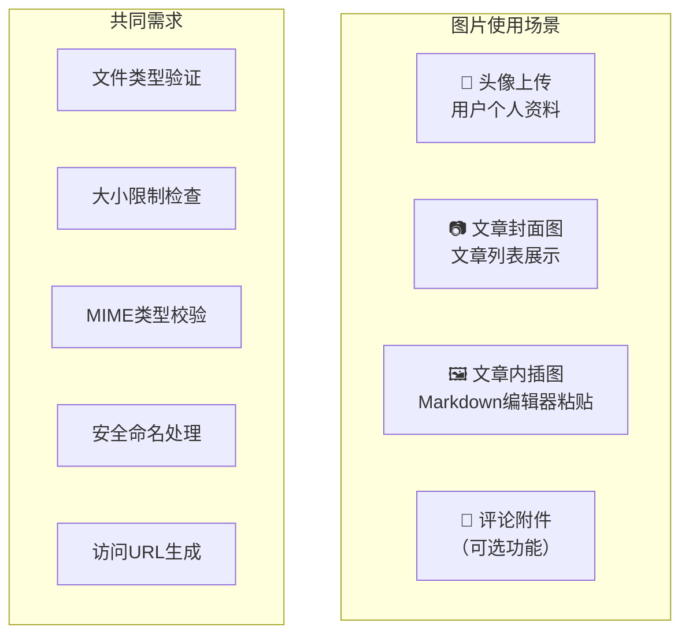
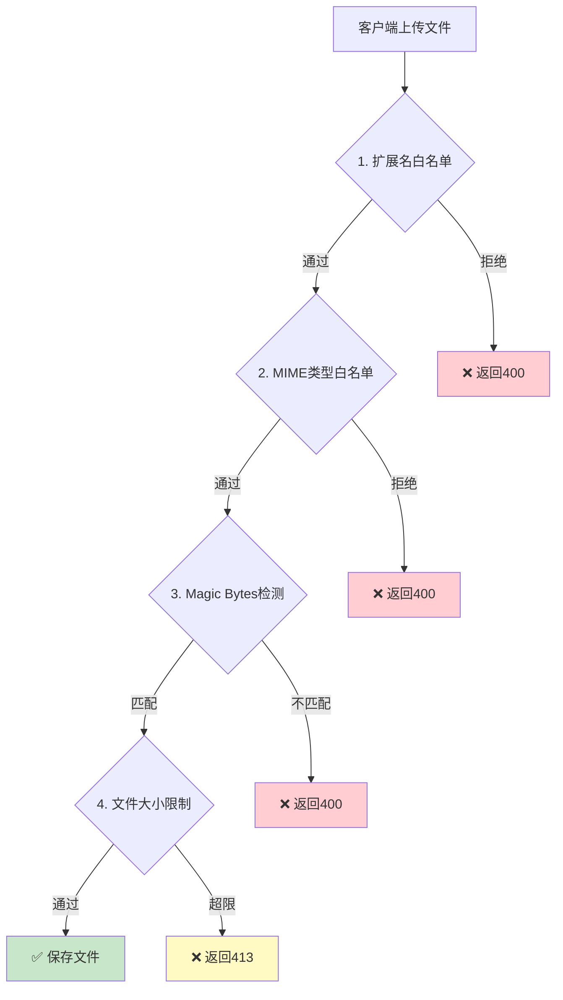

# 博客系统实战 - 图片上传与存储

> **项目阶段**：Phase 6 - 基础设施
>
> **核心目标**：实现完整的图片上传功能，包括文件验证（类型/大小/MIME）、本地文件系统存储、图片处理（缩放/裁剪/水印/格式转换）、URL 生成和批量上传
>
> **前置知识**：[系统设计与技术选型](系统设计与技术选型.md)、ASP.NET Core 文件上传基础、IFormFile 接口
>
> **预计时间**：50分钟

---

## 1. 需求分析

### 1.1 图片使用场景



### 1.2 存储方案对比

| 方案 | 适用场景 | 优点 | 缺点 |
|------|---------|------|------|
| **本地文件系统** | 开发/小规模 | 简单、零成本 | 不支持多实例部署 |
| **Azure Blob Storage** | Azure 部署 | 高可用、CDN集成 | 有云服务费用 |
| **AWS S3 / 阿里云OSS** | 大规模生产 | 弹性扩展、全球分发 | 配置复杂 |
| **MinIO** | 自建对象存储 | 兼容S3 API、可私有部署 | 需要额外运维 |

**本教程以本地文件系统为主方案，同时提供 Azure Blob Storage 的实现参考。**

---

## 2. 本地存储实现

### 2.1 UploadService 核心代码

```csharp
using System.Security.Cryptography;
using BlogApi.Models.Dtos.Upload;
using Microsoft.Extensions.Options;
using SixLabors.ImageSharp;
using SixLabors.ImageSharp.Formats.Jpeg;
using SixLabors.ImageSharp.Processing;

namespace BlogApi.Services.Implementations;

public class UploadService : IUploadService
{
    private readonly UploadSettings _settings;
    private readonly ILogger<UploadService> _logger;
    private readonly IWebHostEnvironment _env;

    public UploadService(
        IOptionsMonitor<UploadSettings> options,
        ILogger<UploadService> logger,
        IWebHostEnvironment env)
    {
        _settings = options.CurrentValue;
        _logger = logger;
        _env = env;
    }

    #region 单文件上传

    /// <summary>
    /// 上传单个图片文件
    /// </summary>
    public async Task<UploadResultDto> UploadImageAsync(IFormFile file, string? category = null)
    {
        // 1. 文件存在性检查
        if (file == null || file.Length == 0)
            throw new ArgumentException("未选择任何文件");

        // 2. 文件名提取与验证
        var originalFileName = Path.GetFileName(file.FileName);
        if (string.IsNullOrWhiteSpace(originalFileName))
            throw new ArgumentException("文件名无效");

        // 3. MIME 类型白名单验证
        var contentType = file.ContentType.ToLowerInvariant();
        if (!_settings.AllowedContentTypes.Contains(contentType))
            throw new InvalidOperationException(
                $"不支持的文件类型: {contentType}。允许的类型: {string.Join(", ", _settings.AllowedContentTypes)}");

        // 4. 文件扩展名验证
        var extension = Path.GetExtension(originalFileName).ToLowerInvariant();
        if (!_settings.AllowedExtensions.Contains(extension))
            throw new InvalidOperationException(
                $"不允许的文件扩展名: {extension}");

        // 5. 双重MIME检测（防止伪造）
        var detectedContentType = await DetectContentTypeAsync(file);
        if (!IsContentTypeMatch(contentType, detectedContentType))
        {
            _logger.LogWarning("MIME类型不匹配: Header={Header}, Actual={Actual}",
                contentType, detectedContentType);
            throw new InvalidOperationException("文件内容与声明的类型不一致");
        }

        // 6. 文件大小限制检查
        if (file.Length > _settings.MaxFileSizeBytes)
        {
            var sizeMB = Math.Round((double)file.Length / (1024 * 1024), 2);
            var maxMB = Math.Round((double)_settings.MaxFileSizeBytes / (1024 * 1024), 2);
            throw new InvalidOperationException(
                $"文件过大 ({sizeMB}MB)，最大允许 {maxMB}MB");
        }

        // 最小文件大小检查（防止空文件或损坏文件）
        if (file.Length < _settings.MinFileSizeBytes)
            throw new InvalidOperationException("文件过小，可能是损坏的文件");

        // 7. 生成安全的文件名（GUID + 原始扩展名）
        var safeFileName = $"{Guid.NewGuid():N}{extension}";

        // 8. 构建目录结构（按日期和类别分类）
        var uploadCategory = string.IsNullOrWhiteSpace(category)
            ? "general"
            : category.Trim().ToLowerInvariant();

        var datePath = DateTime.Now.ToString("yyyy/MM/dd");
        var relativePath = $"uploads/{uploadCategory}/{datePath}";
        var fullPath = Path.Combine(_env.ContentRootPath, "wwwroot", relativePath);

        Directory.CreateDirectory(fullPath);

        var filePath = Path.Combine(fullPath, safeFileName);

        // 9. 保存原始文件
        using (var stream = new FileStream(filePath, FileMode.Create))
        {
            await file.CopyToAsync(stream);
        }

        _logger.LogInformation("文件已保存: {Path}, Size={Size}KB",
            relativePath + "/" + safeFileName, file.Length / 1024);

        // 10. 图片处理（可选：生成缩略图、添加水印等）
        var thumbnailUrl = string.Empty;
        if (_settings.GenerateThumbnail && IsImageFile(extension))
        {
            thumbnailUrl = await GenerateThumbnailAsync(
                filePath, relativePath, safeFileName, extension);
        }

        // 11. 返回结果
        var url = $"/{relativePath}/{safeFileName}";
        return new UploadResultDto
        {
            FileName = safeFileName,
            OriginalFileName = originalFileName,
            Url = url,
            FullUrl = GetFullUrl(url),
            ThumbnailUrl = string.IsNullOrEmpty(thumbnailUrl) ? null : $"/{thumbnailUrl}",
            FileSizeBytes = file.Length,
            ContentType = contentType,
            UploadedAt = DateTime.UtcNow
        };
    }

    #endregion

    #region 批量上传

    /// <summary>
    /// 批量上传多个文件
    /// </summary>
    public async Task<List<UploadResultDto>> UploadImagesAsync(
        List<IFormFile> files, string? category = null)
    {
        if (files == null || files.Count == 0)
            throw new ArgumentException("没有选择任何文件");

        if (files.Count > _settings.MaxBatchSize)
            throw new InvalidOperationException(
                $"单次最多上传 {_settings.MaxBatchSize} 个文件");

        var results = new List<UploadResultDto>();
        var errors = new List<string>();

        foreach (var file in files)
        {
            try
            {
                var result = await UploadImageAsync(file, category);
                results.Add(result);
            }
            catch (Exception ex)
            {
                errors.Add($"{file.FileName}: {ex.Message}");
                _logger.LogWarning(ex, "批量上传中单个文件失败: {File}", file.FileName);
            }
        }

        // 如果全部失败则抛出异常
        if (results.Count == 0 && errors.Count > 0)
        {
            throw new AggregateException($"所有文件上传失败: {string.Join("; ", errors)}");
        }

        return results;
    }

    #endregion

    #region 删除文件

    /// <summary>
    /// 删除已上传的文件及其缩略图
    /// </summary>
    public async Task DeleteAsync(string filePath)
    {
        if (string.IsNullOrWhiteSpace(filePath))
            return;

        // 安全路径校验（防止目录遍历攻击）
        if (filePath.Contains("..") || filePath.StartsWith("/") || filePath.StartsWith("\\"))
            throw new ArgumentException("非法的文件路径");

        var fullPath = Path.Combine(_env.ContentRootPath, "wwwroot", filePath.TrimStart('/'));

        if (System.IO.File.Exists(fullPath))
        {
            System.IO.File.Delete(fullPath);
            _logger.LogInformation("文件已删除: {Path}", filePath);

            // 尝试删除对应的缩略图
            var dir = Path.GetDirectoryName(fullPath)!;
            var fileNameWithoutExt = Path.GetFileNameWithoutExtension(fullPath);
            var ext = Path.GetExtension(fullPath);
            var thumbPath = Path.Combine(dir, $"thumb_{fileNameWithoutExt}{ext}");
            if (System.IO.File.Exists(thumbPath))
                System.IO.File.Delete(thumbPath);
        }
    }

    /// <summary>
    /// 清理孤儿文件（数据库中不存在引用的文件）- 定时任务用
    /// </summary>
    public async Task CleanupOrphanFilesAsync(int olderThanDays = 30)
    {
        var cutoffDate = DateTime.UtcNow.AddDays(-olderThanDays);
        var uploadDir = Path.Combine(_env.ContentRootPath, "wwwroot", "uploads");
        int cleanedCount = 0;

        if (!Directory.Exists(uploadDir)) return cleanedCount;

        foreach (var file in Directory.GetFiles(uploadDir, "*.*",
            SearchOption.AllDirectories).Where(f => IsOlderThan(f, cutoffDate)))
        {
            try
            {
                System.IO.File.Delete(file);
                cleanedCount++;
            }
            catch (Exception ex)
            {
                _logger.LogWarning(ex, "清理孤儿文件失败: {Path}", file);
            }
        }

        _logger.LogInformation("清理完成: 删除了 {Count} 个过期文件", cleanedCount);
        return cleanedCount;
    }

    #endregion

    #region 图片处理

    /// <summary>
    /// 生成缩略图
    /// </summary>
    private async Task<string> GenerateThumbnailAsync(
        string originalFilePath, string relativeDir,
        string fileName, string extension)
    {
        var thumbFileName = $"thumb_{fileName}";
        var thumbPath = Path.Combine(
            Path.GetDirectoryName(originalFilePath)!, thumbFileName);

        try
        {
            using var image = await Image.LoadAsync(originalFilePath);

            // 计算缩放尺寸（保持宽高比）
            var (newWidth, newHeight) = CalculateThumbnailSize(
                image.Width, image.Height,
                _settings.ThumbnailMaxWidth, _settings.ThumbnailMaxHeight);

            image.Mutate(x => x.Resize(newWidth, newHeight));

            // 保存为 JPEG（质量80%）
            var jpegEncoder = new JpegEncoder { Quality = 80 };
            await image.SaveAsJpegAsync(thumbPath, jpegEncoder);
        }
        catch (Exception ex)
        {
            _logger.LogWarning(ex, "生成缩略图失败: {Path}", originalFilePath);
            return string.Empty;  // 缩略图生成失败不影响主流程
        }

        return $"{relativeDir}/{thumbFileName}";
    }

    /// <summary>
    /// 添加水印
    /// </summary>
    public async Task AddWatermarkAsync(string imagePath, string watermarkText)
    {
        using var image = await Image.LoadAsync(imagePath);

        // 创建文字水印选项
        var textOptions = new TextOptions(image)
        {
            HorizontalAlignment = HorizontalAlignment.Right,
            VerticalAlignment = VerticalAlignment.Bottom
        };

        // 绘制半透明水印
        textOptions.DrawText(watermarkText,
            Color.FromArgb(128, 255, 255, 255),  // 白色半透明
            new Font(SystemFonts.GenericFontFamilies.Serif, 24));

        await image.SaveAsync(imagePath);
    }

    /// <summary>
    /// 转换为 WebP 格式（减小文件体积约30-50%）
    /// </summary>
    public async Task ConvertToWebpAsync(string inputPath, string? outputPath = null)
    {
        outputPath ??= Path.ChangeExtension(inputPath, ".webp");

        using var image = await Image.LoadAsync(inputPath);
        await image.SaveAsWebpAsync(outputPath);

        // 如果转换成功且原文件不是WebP，删除原文件
        if (inputPath != outputPath && System.IO.File.Exists(outputPath))
        {
            var newSize = new FileInfo(outputPath).Length;
            var oldSize = new FileInfo(inputPath).Length;
            _logger.LogInformation("WebP转换完成: {Input} ({OldSize}KB) → {Output} ({NewSize}KB), 节省 {Saved}%",
                inputPath, oldSize / 1024, outputPath, newSize / 1024,
                (1 - (double)newSize / oldSize) * 100);
        }
    }

    #endregion

    #region 辅助方法

    /// <summary>
    /// 检测文件的真实 MIME 类型（通过读取文件头 Magic Bytes）
    /// </summary>
    private static async Task<string> DetectContentTypeAsync(IFormFile file)
    {
        using var stream = new MemoryStream();
        await file.CopyToAsync(stream);
        stream.Position = 0;

        // 读取前几个字节进行检测
        var header = new byte[512];
        var bytesRead = await stream.ReadAsync(header, 0, Math.Min(512, (int)file.Length));

        // JPEG: FF D8 FF
        if (header[0] == 0xFF && header[1] == 0xD8 && header[2] == 0xFF)
            return "image/jpeg";

        // PNG: 89 50 4E 47
        if (header[0] == 0x89 && header[1] == 0x50 && header[2] == 0x4E &&
            header[3] == 0x47)
            return "image/png";

        // GIF: 47 49 46 38
        if (header[0] == 0x47 && header[1] == 0x49 && header[2] == 0x46 &&
            header[3] == 0x38)
            return "image/gif";

        // WebP: 52 49 46 46 ('RIFF')
        if (header[0] == 0x52 && header[1] == 0x49 && header[2] == 0x46 &&
            header[3] == 0x46)
            return "image/webp";

        return "application/octet-stream";  // 未知类型
    }

    private static bool IsContentTypeMatch(string declared, string actual)
    {
        // 宽松匹配：某些浏览器对同一格式可能声明不同的 Content-Type
        var declaredBase = declared.Split('/')[0];
        var actualBase = actual.Split('/')[0];

        if (declaredBase != actualBase) return false;

        // image/* 类型的子类型差异可以容忍
        return true;
    }

    private static bool IsImageFile(string extension) =>
        new[] { ".jpg", ".jpeg", ".png", ".gif", ".bmp", ".webp" }.Contains(extension);

    private static (int Width, int Height) CalculateThumbnailSize(
        int origWidth, int origHeight, int maxWidth, int maxHeight)
    {
        if (origWidth <= maxWidth && origHeight <= maxHeight)
            return (origWidth, origHeight);  // 已经足够小

        var widthRatio = (double)maxWidth / origWidth;
        var heightRatio = (double)maxHeight / origHeight;
        var ratio = Math.Min(widthRatio, heightRatio);

        return ((int)(origWidth * ratio), (int)(origHeight * ratio));
    }

    private static bool IsOlderThan(string filePath, DateTime cutoffDate)
    {
        return System.IO.File.GetLastWriteTimeUtc(filePath) < cutoffDate;
    }

    private static string GetFullUrl(string relativeUrl)
    {
        // 生产环境应从配置读取域名
        return relativeUrl;  // 相对路径，前端拼接域名
    }

    #endregion
}
```

### 2.2 配置模型

```csharp
namespace BlogApi.Models.Dtos.Upload;

/// <summary>
/// 上传设置（从 appsettings.json 注入）
/// </summary>
public class UploadSettings
{
    /// <summary>允许的 Content-Type 列表</summary>
    public List<string> AllowedContentTypes { get; set; } = new()
    {
        "image/jpeg", "image/png", "image/gif", "image/webp"
    };

    /// <summary>允许的文件扩展名列表</summary>
    public List<string> AllowedExtensions { get; set; } = new()
    {
        ".jpg", ".jpeg", ".png", ".gif", ".webp"
    };

    /// <summary>最大文件大小（字节），默认5MB</summary>
    public long MaxFileSizeBytes { get; set; } = 5 * 1024 * 1024;

    /// <summary>最小文件大小（字节），默认100B</summary>
    public long MinFileSizeBytes { get; set; } = 100;

    /// <summary>批量上传最大数量</summary>
    public int MaxBatchSize { get; set; } = 10;

    /// <summary>是否自动生成缩略图</summary>
    public bool GenerateThumbnail { get; set; } = true;

    /// <summary>缩略图最大宽度</summary>
    public int ThumbnailMaxWidth { get; set; } = 300;

    /// <summary>缩略图最大高度</summary>
    public int ThumbnailMaxHeight { get; set; } = 300;

    /// <summary>水印文本</summary>
    public string? WatermarkText { get; set; }

    /// <summary>是否启用 WebP 自动转换</summary>
    public bool AutoConvertWebp { get; set; } = false;
}

/// <summary>
/// 上传结果 DTO
/// </summary>
public record UploadResultDto(
    string FileName,
    string OriginalFileName,
    string Url,
    string FullUrl,
    string? ThumbnailUrl,
    long FileSizeBytes,
    string ContentType,
    DateTime UploadedAt
);
```

### 2.3 Program.cs 注册

```csharp
// 注册上传配置
builder.Services.Configure<UploadSettings>(
    builder.Configuration.GetSection("UploadSettings"));

// 注册上传服务
builder.Services.AddScoped<IUploadService, UploadService>();

// 静态文件中间件必须包含 uploads 目录
app.UseStaticFiles(new StaticFileOptions
{
    FileProvider = new PhysicalFileProvider(
        Path.Combine(Directory.GetCurrentDirectory(), "wwwroot")),
    RequestPath = "",
    OnPrepareResponse = ctx =>
    {
        // 设置缓存头（静态资源长期缓存）
        var headers = ctx.Context.Response.Headers;
        var path = ctx.File.Name;

        if (path.EndsWith(".jpg") || path.EndsWith(".png") ||
            path.EndsWith(".gif") || path.EndsWith(".webp"))
        {
            headers.CacheControl = "public, max-age=31536000, immutable";
            headers["CDN-Cache-Control"] = "public, max-age=31536000";
        }
    }
});
```

---

## 3. UploadController

```csharp
using BlogApi.Models.Dtos.Upload;
using BlogApi.Services.Interfaces;
using Microsoft.AspNetCore.Authorization;
using Microsoft.AspNetCore.Mvc;

namespace BlogApi.Controllers;

[ApiController]
[Route("api/[controller]")]
[Produces("application/json")]
public class UploadController : ControllerBase
{
    private readonly IUploadService _uploadService;

    public UploadController(IUploadService uploadService)
    {
        _uploadService = uploadService;
    }

    /// <summary>
    /// 上传单个图片
    /// </summary>
    [HttpPost("image")]
    [Authorize]
    [RequestSizeLimit(6 * 1024 * 1024)]  // 请求体上限6MB（略大于5MB文件限制）
    [ProducesResponseType(typeof(ApiResponse<UploadResultDto>), 200)]
    [ProducesResponseType(typeof(ErrorResponse), 400)]
    [ProducesResponseType(typeof(ErrorResponse), 413)]
    public async Task<IActionResult> UploadImage(
        IFormFile file, [FromQuery] string? category = null)
    {
        try
        {
            var result = await _uploadService.UploadImageAsync(file, category);
            return Ok(new ApiResponse<UploadResultDto>
            {
                Data = result,
                Message = "上传成功"
            });
        }
        catch (ArgumentException ex)
        {
            return BadRequest(new ErrorResponse
            {
                Code = "INVALID_FILE", Message = ex.Message,
                TraceId = HttpContext.TraceIdentifier
            });
        }
        catch (InvalidOperationException ex)
        {
            return BadRequest(new ErrorResponse
            {
                Code = "UPLOAD_FAILED", Message = ex.Message,
                TraceId = HttpContext.TraceIdentifier
            });
        }
    }

    /// <summary>
    /// 批量上传图片
    /// </summary>
    [HttpPost("images/batch")]
    [Authorize]
    [RequestSizeLimit(60 * 1024 * 1024)]  // 批量上传放宽到60MB
    public async Task<IActionResult> UploadImages(
        List<IFormFile> files, [FromQuery] string? category = null)
    {
        try
        {
            var results = await _uploadService.UploadImagesAsync(files, category);
            return Ok(new ApiResponse<List<UploadResultDto>>
            {
                Data = results,
                Message = $"成功上传 {results.Count}/{files.Count} 个文件"
            });
        }
        catch (AggregateException ex)
        {
            return BadRequest(new ErrorResponse
            {
                Code = "BATCH_UPLOAD_FAILED",
                Message = ex.InnerExceptions.First().Message,
                TraceId = HttpContext.TraceIdentifier
            });
        }
    }

    /// <summary>
    /// 删除已上传的文件
    /// </summary>
    [HttpDelete("{*filePath}")]
    [Authorize(Roles = "Admin,Author,SuperAdmin")]
    public async Task<IActionResult> DeleteFile(string filePath)
    {
        try
        {
            await _uploadService.DeleteAsync(filePath);
            return Ok(new ApiResponse<object> { Message = "文件已删除" });
        }
        catch (Exception ex)
        {
            return BadRequest(new ErrorResponse
            {
                Code = "DELETE_FAILED", Message = ex.Message,
                TraceId = HttpContext.TraceIdentifier
            });
        }
    }
}
```

---

## 4. 安全措施详解

### 4.1 目录遍历攻击防护

```csharp
// 危险的用户输入
var maliciousPath = "../../../etc/passwd"   // 尝试访问系统文件
var anotherAttack = "/../../Windows/System32/config/SAM"

// 安全检查
private void ValidatePath(string filePath)
{
    // 规范化路径（解析 .. 和 .
    var fullUri = new Uri(Path.GetFullPath(filePath)).LocalPath;
    var rootUri = new Uri(Path.GetFullPath(_env.ContentRootPath)).LocalPath;

    // 确保最终路径在 wwwroot/uploads 目录下
    if (!fullUri.StartsWith(rootUri))
        throw new SecurityException("非法的文件路径: 可能是目录遍历攻击");
}
```

### 4.2 文件上传攻击防护



### 4.3 完整的安全检查清单

| 安全威胁 | 防御措施 | 实现方式 |
|----------|---------|---------|
| **恶意脚本上传** | 扩展名白名单 | `.jpg/.png/.gif/.webp` |
| **MIME欺骗** | Magic Bytes 检测 | 读取文件头验证真实类型 |
| **超大文件 DoS** | 大小限制 | `MaxFileSizeBytes` + `RequestSizeLimit` |
| **目录遍历** | 路径规范化 | `GetFullPath` + 前缀校验 |
| **文件名注入** | GUID 重命名 | 不使用用户提供的原始文件名 |
| **XSS 通过文件名** | HTML 编码响应 | 文件名在 JSON 中序列化 |
| **覆盖重要文件** | wwwroot 隔离 | 所有上传存于 uploads 子目录 |

---

## 5. 总结

### 交付物清单

| 组件 | 说明 |
|------|------|
| `Dtos/Upload/UploadSettings.cs` | 配置模型（类型/大小/缩略图参数） |
| `Dtos/Upload/UploadResultDto.cs` | 上传结果 DTO |
| `Services/UploadService.cs` | 核心服务（~300行） |
| `Controllers/UploadController.cs` | 3个端点（单文件/批量/删除） |

### API 接口速查

| 方法 | 路径 | 认证 | 描述 |
|------|------|------|------|
| POST | /api/upload/image | 是 | 上传单张图片 |
| POST | /api/upload/images/batch | 是 | 批量上传图片 |
| DELETE | /api/upload/{filePath} | Admin+ | 删除文件 |

**下一篇**：【搜索功能实现】—— 实现全文搜索、关键词高亮、搜索建议和结果缓存。

---

**参考资源**：
- [SixLabors/ImageSharp](https://github.com/SixLabors/ImageSharp) - .NET 跨平台图像库
- [OWASP File Upload Cheat Sheet](https://cheatsheetseries.owasp.org/cheatsheets/File_Upload_Cheat_Sheet.html)
- [Microsoft 文件上传文档](https://docs.microsoft.com/zh-cn/aspnet/core/mvc/models/file-uploads)
