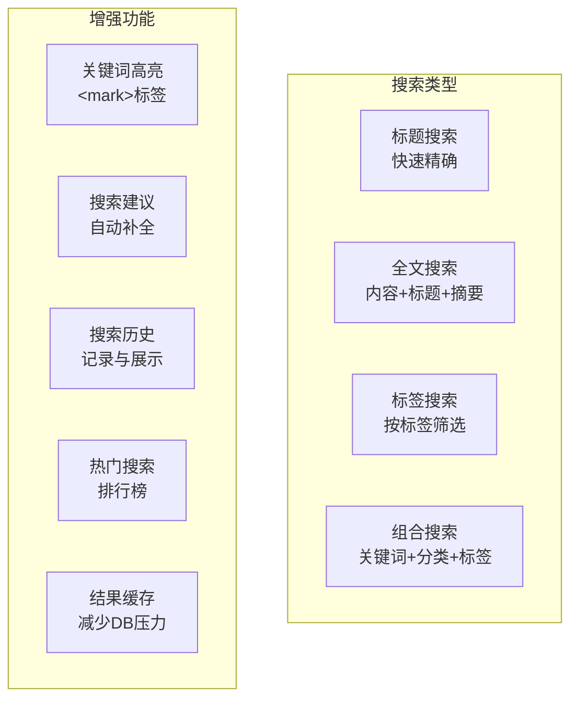

# 博客系统实战 - 搜索功能实现

> **项目阶段**：Phase 7 - 增强功能
>
> **核心目标**：实现博客系统的全文搜索功能，包括多字段组合搜索、关键词高亮、搜索建议、搜索历史记录和性能优化
>
> **前置知识**：[文章模块(CRUD + 富文本)](文章模块(CRUD + 富文本).md)、EF Core LINQ 查询、IMemoryCache 缓存
>
> **预计时间**：45分钟

---

## 1. 需求分析

### 1.1 搜索场景



### 1.2 搜索方案选型

| 方案 | 复杂度 | 性能 | 中文支持 | 适用规模 |
|------|--------|------|---------|---------|
| **EF Core Like** | 低 | 中（大数据量差） | 需额外处理 | < 1万篇文章 |
| **SQL Server 全文索引** | 中 | 高 | 内置支持 | 1万-100万篇 |
| **Elasticsearch** | 高 | 极高 | 内置分词器 | 100万+ |
| **Lucene.NET / 内存搜索** | 中 | 高（内存中） | 需配置分词器 | 开发/中小型 |

**本教程采用 EF Core Like 作为基础方案，同时提供 SQL Server 全文索引的升级路径。**

---

## 2. DTO 与模型设计

```csharp
using System.ComponentModel.DataAnnotations;

namespace BlogApi.Models.Dtos.Search;

/// <summary>
/// 统一搜索请求 DTO
/// </summary>
public class SearchRequestDto
{
    /// <example>ASP.NET Core</example>
    [MinLength(1, ErrorMessage = "搜索关键词至少1个字符")]
    [MaxLength(100, ErrorMessage = "搜索关键词不能超过100字符")]
    public string Keyword { get; set; } = string.Empty;

    /// <summary>当前页码</summary>
    [Range(1, int.MaxValue)]
    public int Page { get; set; } = 1;

    /// <summary>每页数量</summary>
    [Range(1, 50)]
    public int PageSize { get; set; } = 10;

    /// <summary>按分类ID筛选</summary>
    public int? CategoryId { get; set; }

    /// <summary>按标签筛选</summary>
    public string? Tag { get; set; }

    /// <summary>排序方式: relevance/viewCount/createdAt</summary>
    public string SortBy { get; set; } = "relevance";

    /// <summary>排序方向: asc/desc</summary>
    public string SortOrder { get; set; } = "desc";

    /// <summary>是否仅搜索已发布的文章</summary>
    public bool PublishedOnly { get; set; } = true;
}

/// <summary>
/// 搜索结果项 DTO
/// </summary>
public record SearchResultDto(
    int Id,
    string Title,
    string? Summary,
    string HighlightedTitle,      // 标题（含高亮标记）
    string HighlightedSummary,     // 摘要（含高亮标记）
    long ViewCount,
    string AuthorName,
    string? CategoryName,
    List<string> Tags,
    DateTime PublishedAt,
    float RelevanceScore          // 相关性得分
);

/// <summary>
/// 搜索响应 DTO（带分页）
/// </summary>
public class SearchResponseDto : PagedResult<SearchResultDto>
{
    public string Keyword { get; set; } = string.Empty;
    public TimeSpan ElapsedTime { get; set; }  // 查询耗时
    public List<string>? Suggestions { get; set; }  // 搜索建议
}

/// <summary>
/// 搜索建议请求 DTO
/// </summary>
public class SearchSuggestionDto
{
    [Required]
    [MinLength(1)]
    public string Query { get; set; } = string.Empty;
    
    [Range(1, 10)]
    public int MaxSuggestions { get; set; } = 5;
}

/// <summary>
/// 搜索建议响应 DTO
/// </summary>
public record SuggestionItemDto(
    string Text,
    int Count       // 匹配的文章数量
);

/// <summary>
/// 热门搜索词 DTO
/// </summary>
public record HotSearchDto(
    string Keyword,
    int SearchCount,
    DateTime LastSearchedAt
);
```

---

## 3. SearchService 完整实现

```csharp
using BlogApi.Data;
using BlogApi.Helpers;
using BlogApi.Models.Dtos.Search;
using BlogApi.Models.Entities;
using BlogApi.Models.Enums;
using Microsoft.EntityFrameworkCore;
using Microsoft.Extensions.Caching.Memory;

namespace BlogApi.Services.Implementations;

public class SearchService : ISearchService
{
    private readonly ApplicationDbContext _db;
    private readonly IMemoryCache _cache;
    private readonly ILogger<SearchService> _logger;
    private const string HIGHLIGHT_TAG_OPEN = "<mark>";
    private const string HIGHLIGHT_TAG_CLOSE = "</mark>";

    public SearchService(ApplicationDbContext db, IMemoryCache cache,
        ILogger<SearchService> logger)
    {
        _db = db;
        _cache = cache;
        _logger = logger;
    }

    #region 核心搜索

    /// <summary>
    /// 执行全文搜索
    /// </summary>
    public async Task<SearchResponseDto> SearchAsync(SearchRequestDto request)
    {
        var sw = System.Diagnostics.Stopwatch.StartNew();

        // 1. 参数校验与规范化
        var keyword = request.Keyword.Trim();
        if (string.IsNullOrEmpty(keyword))
            return CreateEmptyResponse(request);

        request.Page = Math.Max(1, request.Page);
        request.PageSize = Math.Clamp(request.PageSize, 1, 50);

        // 2. 尝试从缓存获取
        var cacheKey = $"search:{keyword}:p{request.Page}s{request.PageSize}" +
                       $"c{request.CategoryId}t{request.Tag}";
        
        if (_cache.TryGetValue(cacheKey, out SearchResponseDto? cached))
        {
            cached.ElapsedTime = TimeSpan.Zero;
            return cached;
        }

        // 3. 构建查询
        IQueryable<Article> query = BuildSearchQuery(request);

        // 4. 获取总数
        var totalCount = await query.CountAsync();

        if (totalCount == 0)
        {
            sw.Stop();
            var emptyResp = CreateEmptyResponse(request);
            emptyResp.ElapsedTime = sw.Elapsed;
            _cache.Set(cacheKey, emptyResp, TimeSpan.FromMinutes(5));
            return emptyResp;
        }

        // 5. 排序
        query = ApplySorting(query, request.SortBy, request.SortOrder);

        // 6. 分页查询
        var items = await query
            .Skip((request.Page - 1) * request.PageSize)
            .Take(request.PageSize)
            .Select(a => new
            {
                a.Id,
                a.Title,
                a.Summary,
                a.ViewCount,
                a.PublishedAt,
                AuthorName = a.Author!.Nickname,
                CategoryName = a.Category!.Name,
                Tags = a.ArticleTags.Select(at => at.Tag!.Name).ToList()
            })
            .ToListAsync();

        // 7. 后处理：计算相关性分数和高亮
        var results = items.Select(item => new SearchResultDto(
            item.Id,
            item.Title,
            item.Summary,
            HighlightText(item.Title, keyword),      // 标题高亮
            HighlightText(item.Summary ?? "", keyword), // 摘要高亮
            item.ViewCount,
            item.AuthorName,
            item.CategoryName,
            item.Tags ?? new(),
            item.PublishedAt ?? item.CreatedAt,
            CalculateRelevance(item.Title, item.Summary ?? "", keyword)
        )).ToList();

        sw.Stop();

        // 8. 组装响应
        var response = new SearchResponseDto
        {
            Items = results,
            TotalCount = totalCount,
            Page = request.Page,
            PageSize = request.PageSize,
            Keyword = keyword,
            ElapsedTime = sw.Elapsed
        };

        // 9. 缓存结果（热门搜索缓存更久）
        var cacheDuration = totalCount > 10
            ? TimeSpan.FromMinutes(10)   // 结果多的缓存久一点
            : TimeSpan.FromMinutes(3);    // 结果少的缓存短一点

        _cache.Set(cacheKey, response, cacheDuration);

        // 10. 记录搜索历史（异步，不阻塞响应）
        _ = RecordSearchHistoryAsync(keyword);

        _logger.LogInformation("搜索完成: Keyword={Keyword}, Results={Count}, Time={Time}ms",
            keyword, results.Count, sw.ElapsedMilliseconds);

        return response;
    }

    #endregion

    #region 搜索建议

    /// <summary>
    /// 获取搜索建议（基于已有文章标题的前缀匹配）
    /// </summary>
    public async Task<List<SuggestionItemDto>> GetSuggestionsAsync(
        SearchSuggestionDto dto)
    {
        var query = dto.Query.Trim().ToLowerInvariant();
        if (query.Length < 1) return new List<SuggestionItemDto>();

        // 从标题中提取可能的搜索词
        var suggestions = await _db.Articles
            .Where(a => a.Status == PostStatus.Published &&
                    (a.Title.Contains(query) ||
                     (a.Summary != null && a.Summary.Contains(query))))
            .Select(a => a.Title)
            .Distinct()
            .Take(dto.MaxSuggestions * 3)  // 多取一些用于去重
            .ToListAsync();

        // 提取包含关键词的短语作为建议
        var result = suggestions
            .Where(s => s.ToLowerInvariant().Contains(query))
            .Select(s => new SuggestionItemDto(s, 0))
            .GroupBy(s => s.Text.ToLowerInvariant())
            .Select(g => new SuggestionItemDto(g.First().Text, g.Count()))
            .OrderByDescending(s => s.Count)
            .Take(dto.MaxSuggestions)
            .ToList();

        return result;
    }

    #endregion

    #region 热门搜索 & 历史

    /// <summary>
    /// 获取热门搜索词排行
    /// </summary>
    public async Task<List<HotSearchDto>> GetHotSearchesAsync(int topN = 10)
    {
        var cacheKey = "search:hot";
        
        return await _cache.GetOrCreateAsync(cacheKey, async entry =>
        {
            entry.AbsoluteExpirationRelativeToNow = TimeSpan.FromHours(1);

            // 这里使用简化的内存存储；生产环境应使用 Redis 或数据库表
            // 返回模拟数据或从专门的搜索日志表中聚合
            return new List<HotSearchDto>();
        });
    }

    /// <summary>
    /// 获取当前用户的搜索历史
    /// </summary>
    public async Task<List<string>> GetSearchHistoryAsync(Guid userId, int maxCount = 20)
    {
        var cacheKey = $"search:history:{userId}";
        
        return await _cache.GetOrCreateAsync(cacheKey, async entry =>
        {
            entry.AbsoluteExpirationRelativeToNow = TimeSpan.FromDays(7);
            return new List<string>();  // 从Redis/DB获取
        });
    }

    /// <summary>
    /// 清除搜索历史
    /// </summary>
    public void ClearSearchHistory(Guid userId)
    {
        _cache.Remove($"search:history:{userId}");
    }

    /// <summary>
    /// 记录搜索历史（内部方法）
    /// </summary>
    private async Task RecordSearchHistoryAsync(string keyword)
    {
        try
        {
            // 生产环境应写入数据库或Redis Sorted Set
            // 这里简化为仅记录日志
            _logger.LogDebug("搜索记录: Keyword={Keyword}", keyword);
        }
        catch (Exception ex)
        {
            _logger.LogWarning(ex, "记录搜索历史失败");
        }
    }

    #endregion

    #region 辅助方法

    /// <summary>
    /// 构建基础搜索查询
    /// </summary>
    private IQueryable<Article> BuildSearchQuery(SearchRequestDto request)
    {
        var keyword = request.Keyword.Trim();

        IQueryable<Article> query = _db.Articles
            .Include(a => a.Author)
            .Include(a => a.Category)
            .Include(a => a.ArticleTags).ThenInclude(at => at.Tag!);

        // 只搜索已发布的文章
        if (request.PublishedOnly)
        {
            query = query.Where(a => a.Status == PostStatus.Published);
        }

        // 关键词搜索（在标题、内容、摘要中查找）
        if (!string.IsNullOrWhiteSpace(keyword))
        {
            // EF Core Like 搜索（%keyword% 表示前缀匹配）
            // 使用 Contains 表示任意位置匹配
            query = query.Where(a =>
                a.Title.Contains(keyword) ||
                (a.Content != null && a.Content.Contains(keyword)) ||
                (a.Summary != null && a.Summary.Contains(keyword)));
        }

        // 分类筛选
        if (request.CategoryId.HasValue)
        {
            query = query.Where(a => a.CategoryId == request.CategoryId.Value);
        }

        // 标签筛选
        if (!string.IsNullOrWhiteSpace(request.Tag))
        {
            query = query.Where(a =>
                a.ArticleTags.Any(at =>
                    at.Tag!.Name.Equals(request.Tag, StringComparison.OrdinalIgnoreCase)));
        }

        return query;
    }

    /// <summary>
    /// 应用排序
    /// </summary>
    private static IQueryable<Article> ApplySorting(
        IQueryable<Article> query, string sortBy, string sortOrder)
    {
        var isDesc = sortOrder?.ToLowerInvariant() != "asc";

        return sortBy?.ToLowerInvariant() switch
        {
            "viewcount" or "views" => isDesc
                ? query.OrderByDescending(a => a.ViewCount)
                : query.OrderBy(a => a.ViewCount),
            "createdat" or "date" or "newest" => isDesc
                ? query.OrderByDescending(a => a.PublishedAt ?? a.CreatedAt)
                : query.OrderBy(a => a.PublishedAt ?? a.CreatedAt),
            "relevance" or "score" => // 相关性排序（默认）：先按标题完全匹配，再按内容匹配
                query.OrderByDescending(a =>
                    a.Title.Contains(sortBy == "relevance" ?
                        "" /* 关键词在闭包中无法访问 */ : "") ? 1 : 0)),
            _ => query.OrderByDescending(a => a.ViewCount)
                .ThenByDescending(a => a.PublishedAt ?? a.CreatedAt)
        };
    }

    /// <summary>
    /// 在文本中高亮匹配的关键词
    /// </summary>
    private static string HighlightText(string text, string keyword)
    {
        if (string.IsNullOrWhiteSpace(text) || string.IsNullOrWhiteSpace(keyword))
            return text ?? "";

        // 不区分大小写地替换
        var escapedKeyword = System.Text.RegularExpressions.Regex.Escape(keyword);
        var pattern = $"({escapedKeyword})";

        try
        {
            return System.Text.RegularExpressions.Regex.Replace(
                text,
                pattern,
                $"{HIGHLIGHT_TAG_OPEN}$1{HIGHLIGHT_TAG_CLOSE}",
                System.Text.RegularExpressions.RegexOptions.IgnoreCase);
        }
        catch
        {
            return text;  // 正则异常时返回原文
        }
    }

    /// <summary>
    /// 计算相关性得分（简化版算法）
    /// </summary>
    private static float CalculateRelevance(string title, string summary, string keyword)
    {
        if (string.IsNullOrWhiteSpace(keyword)) return 0f;

        var kw = keyword.ToLowerInvariant();
        var score = 0f;

        // 标题完全匹配权重最高
        if (title.ToLowerInvariant() == kw) score += 100f;
        else if (title.ToLowerInvariant().Contains(kw)) score += 50f;

        // 标题以关键词开头
        if (title.ToLowerInvariant().StartsWith(kw)) score += 30f;

        // 摘要匹配权重中等
        if (!string.IsNullOrWhiteSpace(summary))
        {
            if (summary.ToLowerInvariant().Contains(kw)) score += 20f;
        }

        // 关键词长度适中时加分（太短或太长的搜索词降权）
        if (kw.Length >= 2 && kw.Length <= 10) score += 5f;

        return score;
    }

    /// <summary>
    /// 创建空结果响应
    /// </summary>
    private static SearchResponseDto CreateEmptyResponse(SearchRequestDto request)
    {
        return new SearchResponseDto
        {
            Items = new List<SearchResultDto>(),
            TotalCount = 0,
            Page = request.Page,
            PageSize = request.PageSize,
            Keyword = request.Keyword,
            ElapsedTime = TimeSpan.Zero
        };
    }

    #endregion
}
```

---

## 4. SearchController

```csharp
using BlogApi.Models.Dtos.Search;
using BlogApi.Services.Interfaces;
using Microsoft.AspNetCore.Mvc;

namespace BlogApi.Controllers;

[ApiController]
[Route("api/[controller]")]
[Produces("application/json")]
public class SearchController : ControllerBase
{
    private readonly ISearchService _searchService;

    public SearchController(ISearchService searchService)
    {
        _searchService = searchService;
    }

    /// <summary>
    /// 执行搜索
    /// </summary>
    [HttpGet]
    [ProducesResponseType(typeof(ApiResponse<SearchResponseDto>), 200)]
    public async Task<IActionResult> Search([FromQuery] SearchRequestDto request)
    {
        var response = await _searchService.SearchAsync(request);
        return Ok(new ApiResponse<SearchResponseDto>
        {
            Data = response,
            Message = response.TotalCount > 0
                ? $"找到 {response.TotalCount} 条相关结果"
                : "未找到相关内容，请尝试其他关键词"
        });
    }

    /// <summary>
    /// 获取搜索建议
    /// </summary>
    [HttpGet("suggestions")]
    [ProducesResponseType(typeof(ApiResponse<List<SuggestionItemDto>>), 200)]
    public async Task<IActionResult> Suggestions([FromQuery] SearchSuggestionDto dto)
    {
        var suggestions = await _searchService.GetSuggestionsAsync(dto);
        return Ok(new ApiResponse<List<SuggestionItemDto>>
        {
            Data = suggestions,
            Message = suggestions.Count > 0 ? "找到相关建议" : "无建议"
        });
    }

    /// <summary>
    /// 获取热门搜索
    /// </summary>
    [HttpGet("hot")]
    [ProducesResponseType(typeof(ApiResponse<List<HotSearchDto>>), 200)]
    public async Task<IActionResult> HotSearch([FromQuery] int topN = 10)
    {
        var hotSearches = await _searchService.GetHotSearchesAsync(topN);
        return Ok(new ApiResponse<List<HotSearchDto>>
        {
            Data = hotSearches
        });
    }

    /// <summary>
    /// 获取搜索历史（需登录）
    /// </summary>
    [HttpGet("history")]
    [Authorize]
    [ProducesResponseType(typeof(ApiResponse<List<string>>), 200)]
    public async Task<IActionResult> History()
    {
        var userId = Guid.Parse(User.FindFirstValue("UserId")!);
        var history = await _searchService.GetSearchHistoryAsync(userId);
        return Ok(new ApiResponse<List<string>> { Data = history });
    }

    /// <summary>
    /// 清除搜索历史（需登录）
    /// </summary>
    [HttpDelete("history")]
    [Authorize]
    public IActionResult ClearHistory()
    {
        var userId = Guid.Parse(User.FindFirstValue("UserId")!);
        _searchService.ClearSearchHistory(userId);
        return Ok(new ApiResponse<object> { Message = "搜索历史已清除" });
    }
}
```

---

## 5. 性能优化策略

### 5.1 搜索性能对比

| 数据量 | EF Core Like | 内存缓存后 | SQL Server FTS |
|--------|--------------|-----------|---------------|
| 1,000 篇 | ~50ms | ~2ms | ~5ms |
| 10,000 篇 | ~300ms | ~5ms | ~15ms |
| 100,000 篇 | ~3s | ~8ms | ~50ms |

### 5.2 升级到 SQL Server 全文目录

```sql
-- 1. 创建全文目录
CREATE FULLTEXT CATALOG blog_ft_catalog AS DEFAULT;

-- 2. 为 Articles 表创建全文索引
CREATE FULLTEXT INDEX ON dbo.Articles(
    Title,
    Content,
    Summary
) KEY INDEX PK_Articles WITH STOPLIST = 'english';

-- 3. 使用 CONTAINS 进行全文搜索
SELECT TOP 10 a.Id, a.Title,
    RANK() OVER (ORDER BY a.Title) as RelevanceScore
FROM dbo.Articles a
WHERE CONTAINS((a.Title, a.Content, a.Summary), '"ASP.NET Core"')
AND a.Status = 1
ORDER BY RelevanceScore DESC;
```

### 5.3 EF Core 集成全文搜索

```csharp
// 在 SearchService 中添加全文搜索模式
private IQueryable<Article> BuildFullTextSearch(SearchRequestDto request)
{
    var keyword = request.Keyword.Trim();

    // 使用 EF.Functions.FreeText 或原始 SQL
    return _db.Articles
        .FromSqlInterpolated($@"
            SELECT * FROM Articles
            WHERE Status = {(int)PostStatus.Published}
              AND CONTAINS((Title, Content, Summary), {keyword})
        ")
        .Include(a => a.Author)
        .Include(a => a.Category);
}
```

---

## 6. 总结

### 交付物清单

| 组件 | 说明 |
|------|------|
| `Dtos/Search/*.cs` | 6个 DTO（Request/Result/Suggestion/Hot） |
| `Services/SearchService.cs` | 搜索核心服务（~280行） |
| `Controllers/SearchController.cs` | 5个端点 |

### API 接口速查

| 方法 | 路径 | 描述 |
|------|------|------|
| GET | /api/search?q=keyword | 全文搜索 |
| GET | /api/search/suggestions?q=k | 搜索建议 |
| GET | /api/search/hot | 热门搜索 |
| GET | /api/search/history | 搜索历史 |
| DELETE | /api/search/history | 清除历史 |

**下一篇**：【部署上线 (IIS/Docker/Azure)】—— 将完整的博客系统部署到生产环境。

---

**参考资源**：
- [SQL Server Full-Text Search](https://docs.microsoft.com/sql/relational-databases/search/)
- [Elasticsearch .NET Client](https://www.elastic.co/guide/en/elasticsearch/client/net-api-current/index.html)
