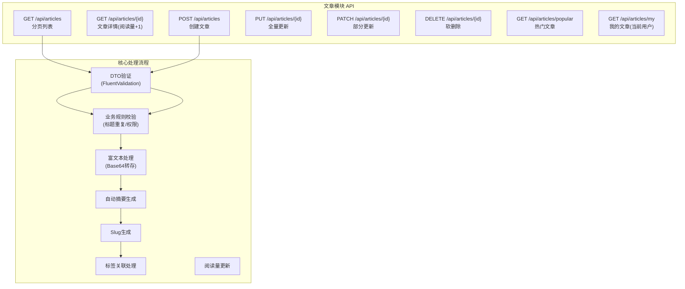
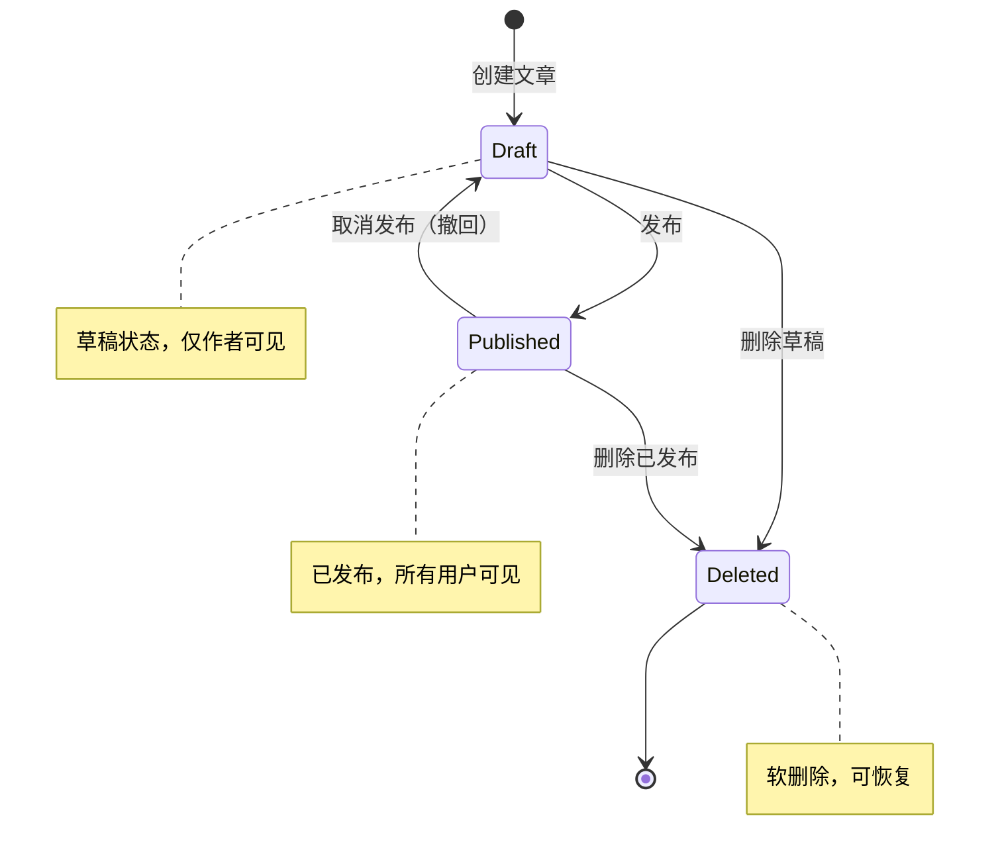

# 博客系统实战 - 文章模块 (CRUD + 富文本)

> **项目阶段**：Phase 3 - 核心业务功能
>
> **核心目标**：实现文章的完整生命周期管理，包括创建、编辑、删除、列表查询、详情展示、Markdown 渲染、富文本图片处理和草稿箱功能
>
> **前置知识**：[系统设计与技术选型](系统设计与技术选型.md)、[用户模块(JWT注册登录)](用户模块(JWT注册登录).md)、EF Core CRUD 操作
>
> **预计时间**：60分钟

---

## 1. 模块概览

### 1.1 功能架构



### 1.2 文章状态机



---

## 2. Article 实体与 DTO 设计

### 2.1 Article 完整实体

```csharp
using System.ComponentModel.DataAnnotations;
using System.ComponentModel.DataAnnotations.Schema;

namespace BlogApi.Models.Entities;

[Table("Articles")]
public class Article : BaseEntity
{
    [Key]
    [DatabaseGenerated(DatabaseGeneratedOption.Identity)]
    public int Id { get; set; }

    /// <summary>
    /// 文章标题
    /// </summary>
    [Required]
    [MaxLength(200)]
    public string Title { get; set; } = string.Empty;

    /// <summary>
    /// 文章内容（支持 Markdown 或 HTML）
    /// </summary>
    [Required]
    public string Content { get; set; } = string.Empty;

    /// <summary>
    /// 文章摘要（自动从内容前200字生成或手动指定）
    /// </summary>
    [MaxLength(500)]
    public string? Summary { get; set; }

    /// <summary>
    /// 封面图URL
    /// </summary>
    [MaxLength(500)]
    public string? CoverImage { get; set; }

    /// <summary>
    /// URL 友好的 Slug（用于 SEO）
    /// </summary>
    [MaxLength(250)]
    public string? Slug { get; set; }

    /// <summary>
    /// 文章状态
    /// </summary>
    [Required]
    public PostStatus Status { get; set; } = PostStatus.Draft;

    /// <summary>
    /// 阅读量
    /// </summary>
    public long ViewCount { get; set; } = 0;

    /// <summary>
    /// 点赞数
    /// </summary>
    public int LikeCount { get; set; } = 0;

    /// <summary>
    /// 评论数（冗余字段，便于快速查询）
    /// </summary>
    public int CommentCount { get; set; } = 0;

    // ====== 外键 ======

    /// <summary>
    /// 作者ID
    /// </summary>
    [Required]
    public Guid AuthorId { get; set; }

    /// <summary>
    /// 分类ID（可为空，表示未分类）
    /// </summary>
    public int? CategoryId { get; set; }

    // ====== 时间字段 ======

    /// <summary>
    /// 发布时间（Status变为Published时设置）
    /// </summary>
    public DateTime? PublishedAt { get; set; }

    // ====== 导航属性 ======

    [ForeignKey(nameof(AuthorId))]
    public User? Author { get; set; }

    [ForeignKey(nameof(CategoryId))]
    public Category? Category { get; set; }

    /// <summary>
    /// 文章-标签多对多关系
    /// </summary>
    public ICollection<ArticleTag> ArticleTags { get; set; } = new List<ArticleTag>();

    /// <summary>
    /// 文章的评论
    /// </summary>
    public ICollection<Comment> Comments { get; set; } = new List<Comment>();
}

/// <summary>
/// 文章-标签联结表实体
/// </summary>
[Table("ArticleTags")]
public class ArticleTag
{
    public int ArticleId { get; set; }
    public int TagId { get; set; }

    [ForeignKey(nameof(ArticleId))]
    public Article? Article { get; set; }

    [ForeignKey(nameof(TagId))]
    public Tag? Tag { get; set; }
}
```

### 2.2 DTO 定义集

```csharp
using System.ComponentModel.DataAnnotations;
using BlogApi.Models.Enums;

namespace BlogApi.Models.Dtos.Articles;

/// <summary>
/// 创建文章请求 DTO
/// </summary>
public class CreateArticleDto
{
    /// <example>ASP.NET Core 入门完全指南</example>
    [Required(ErrorMessage = "标题不能为空")]
    [MinLength(2, ErrorMessage = "标题至少需要2个字符")]
    [MaxLength(200, ErrorMessage = "标题不能超过200字符")]
    public string Title { get; set; } = string.Empty;

    /// <example># Hello World\n\n这是文章内容...</example>
    [Required(ErrorMessage = "内容不能为空")]
    [MinLength(10, ErrorMessage = "内容至少需要10个字符")]
    public string Content { get; set; } = string.Empty;

    /// <example>可选的手动摘要</example>
    [MaxLength(500, ErrorMessage = "摘要不能超过500字符")]
    public string? Summary { get; set; }

    /// <example>/uploads/covers/2024/01/cover.jpg</example>
    [MaxLength(500)]
    public string? CoverImage { get; set; }

    /// <example>1</example>
    public int? CategoryId { get; set; }

    /// <example>[&quot;C#&quot;, &quot;ASP.NET Core&quot;]</example>
    public List<string>? Tags { get; set; }

    /// <example>true</example>
    public bool IsPublished { get; set; } = false;
}

/// <summary>
/// 更新文章请求 DTO（全量更新 PUT）
/// </summary>
public class UpdateArticleDto
{
    [Required(ErrorMessage = "标题不能为空")]
    [MinLength(2)]
    [MaxLength(200)]
    public string Title { get; set; } = string.Empty;

    [Required(ErrorMessage = "内容不能为空")]
    [MinLength(10)]
    public string Content { get; set; } = string.Empty;

    [MaxLength(500)]
    public string? Summary { get; set; }

    [MaxLength(500)]
    public string? CoverImage { get; set; }

    public int? CategoryId { get; set; }

    public List<string>? Tags { get; set; }

    public bool IsPublished { get; set; }
}

/// <summary>
/// 部分更新 DTO（PATCH）- 仅更新提供的字段
/// </summary>
public class PatchArticleDto
{
    public string? Title { get; set; }
    public string? Content { get; set; }
    public string? Summary { get; set; }
    public string? CoverImage { get; set; }
    public int? CategoryId { get; set; }
    public List<string>? Tags { get; set; }
    public bool? IsPublished { get; set; }
}

/// <summary>
/// 文章列表项 DTO（用于列表接口，精简字段）
/// </summary>
public record ArticleListItemDto(
    int Id,
    string Title,
    string? Summary,
    string? CoverImage,
    PostStatus Status,
    long ViewCount,
    int CommentCount,
    string AuthorName,
    string? CategoryName,
    List<string> Tags,
    DateTime CreatedAt,
    DateTime? PublishedAt
);

/// <summary>
/// 文章详情 DTO（用于详情接口，完整字段 + 渲染后HTML）
/// </summary>
public record ArticleDetailDto(
    int Id,
    string Title,
    string RawContent,           // 原始 Markdown 内容
    string RenderedContent,     // 渲染后的 HTML 内容
    string? Summary,
    string? CoverImage,
    string? Slug,
    PostStatus Status,
    long ViewCount,
    int LikeCount,
    int CommentCount,
    UserSummaryDto Author,
    CategoryDto? Category,
    List<TagDto> Tags,
    DateTime CreatedAt,
    DateTime UpdatedAt,
    DateTime? PublishedAt,
    List<ArticleListItemDto>? RelatedArticles  // 相关推荐
);

/// <summary>
/// 文章中嵌套的用户简要信息
/// </summary>
public record UserSummaryDto(Guid Id, string Nickname, string? AvatarUrl);

/// <summary>
/// 分类简要信息
/// </summary>
public record CategoryDto(int Id, string Name);

/// <summary>
/// 标签简要信息
/// </summary>
public record TagDto(int Id, string Name);
```

---

## 3. ArticleService 完整实现

```csharp
using System.Security.Claims;
using BlogApi.Data;
using BlogApi.Helpers;
using BlogApi.Models.Dtos.Articles;
using BlogApi.Models.Entities;
using BlogApi.Models.Enums;
using Markdig;
using Microsoft.EntityFrameworkCore;
using Microsoft.Extensions.Logging;

namespace BlogApi.Services.Implementations;

public class ArticleService : IArticleService
{
    private readonly ApplicationDbContext _db;
    private readonly ILogger<ArticleService> _logger;
    private readonly SlugGenerator _slugGenerator;

    public ArticleService(
        ApplicationDbContext db,
        ILogger<ArticleService> logger,
        SlugGenerator slugGenerator)
    {
        _db = db;
        _logger = logger;
        _slugGenerator = slugGenerator;
    }

    #region 创建文章

    /// <summary>
    /// 创建新文章
    /// </summary>
    public async Task<ArticleDetailDto> CreateAsync(CreateArticleDto dto, Guid authorId)
    {
        // 1. 业务规则验证：标题不能与已有文章重复（同一作者下）
        var duplicateTitle = await _db.Articles.AnyAsync(a =>
            a.AuthorId == authorId &&
            a.Title.Trim().ToLowerInvariant() == dto.Title.Trim().ToLowerInvariant() &&
            a.Status != PostStatus.Deleted);

        if (duplicateTitle)
        {
            throw new InvalidOperationException("您已经有一篇同名的文章了");
        }

        // 2. 处理富文本中的 Base64 图片
        var processedContent = await ProcessBase64Images(dto.Content);

        // 3. 自动生成摘要（如果未提供）
        var summary = dto.Summary ?? GenerateSummary(processedContent);

        // 4. 生成 Slug
        var slug = _slugGenerator.Generate(dto.Title);

        // 5. 构建文章实体
        var article = new Article
        {
            Title = dto.Title.Trim(),
            Content = processedContent,
            Summary = summary,
            CoverImage = dto.CoverImage,
            Slug = slug,
            Status = dto.IsPublished ? PostStatus.Published : PostStatus.Draft,
            ViewCount = 0,
            AuthorId = authorId,
            CategoryId = dto.CategoryId,
            CreatedAt = DateTime.UtcNow,
            UpdatedAt = DateTime.UtcNow,
            PublishedAt = dto.IsPublished ? DateTime.UtcNow : null
        };

        // 6. 处理标签关联
        await ProcessTags(article, dto.Tags);

        // 7. 保存到数据库
        await _db.Articles.AddAsync(article);
        await _db.SaveChangesAsync();

        _logger.LogInformation("文章创建成功: Id={Id}, Title={Title}, Author={AuthorId}, Status={Status}",
            article.Id, article.Title, authorId, article.Status);

        return await GetDetailByIdAsync(article.Id);
    }

    #endregion

    #region 获取文章列表

    /// <summary>
    /// 获取分页文章列表（公开可见的已发布文章）
    /// </summary>
    public async Task<PagedResult<ArticleListItemDto>> GetPagedAsync(
        int page = 1,
        int pageSize = 10,
        int? categoryId = null,
        string? keyword = null,
        string sortBy = "createdAt",
        string sortOrder = "desc")
    {
        page = Math.Max(1, page);
        pageSize = Math.Clamp(pageSize, 1, 50);

        IQueryable<Article> query = _db.Articles
            .Include(a => a.Author)
            .Include(a => a.Category)
            .Include(a => a.ArticleTags)
                .ThenInclude(at => at.Tag!)
            .Where(a => a.Status == PostStatus.Published && a.Status != PostStatus.Deleted);

        // 按分类筛选
        if (categoryId.HasValue)
        {
            query = query.Where(a => a.CategoryId == categoryId.Value);
        }

        // 关键词搜索（标题+摘要）
        if (!string.IsNullOrWhiteSpace(keyword))
        {
            query = query.Where(a =>
                a.Title.Contains(keyword) ||
                (a.Summary != null && a.Summary.Contains(keyword)));
        }

        // 排序
        query = sortBy.ToLower() switch
        {
            "viewcount" => sortOrder == "asc"
                ? query.OrderBy(a => a.ViewCount)
                : query.OrderByDescending(a => a.ViewCount),
            "publishedat" => sortOrder == "asc"
                ? query.OrderBy(a => a.PublishedAt ?? a.CreatedAt)
                : query.OrderByDescending(a => a.PublishedAt ?? a.CreatedAt),
            _ => sortOrder == "asc"
                ? query.OrderBy(a => a.CreatedAt)
                : query.OrderByDescending(a => a.CreatedAt)
        };

        // 总数
        var totalCount = await query.CountAsync();

        // 分页查询
        var items = await query
            .Skip((page - 1) * pageSize)
            .Take(pageSize)
            .Select(a => new ArticleListItemDto(
                a.Id,
                a.Title,
                a.Summary,
                a.CoverImage,
                a.Status,
                a.ViewCount,
                a.CommentCount,
                a.Author!.Nickname,
                a.Category?.Name,
                a.ArticleTags.Select(at => at.Tag!.Name).ToList(),
                a.CreatedAt,
                a.PublishedAt
            ))
            .ToListAsync();

        return new PagedResult<ArticleListItemDto>
        {
            Items = items,
            TotalCount = totalCount,
            Page = page,
            PageSize = pageSize
        };
    }

    /// <summary>
    /// 获取热门文章（按阅读量排序）
    /// </summary>
    public async Task<List<ArticleListItemDto>> GetPopularAsync(int count = 10)
    {
        count = Math.Clamp(count, 1, 30);

        return await _db.Articles
            .Include(a => a.Author)
            .Include(a => a.Category)
            .Include(a => a.ArticleTags).ThenInclude(at => at.Tag!)
            .Where(a => a.Status == PostStatus.Published && a.Status != PostStatus.Deleted)
            .OrderByDescending(a => a.ViewCount)
            .ThenByDescending(a => a.PublishedAt ?? a.CreatedAt)
            .Take(count)
            .Select(a => new ArticleListItemDto(
                a.Id, a.Title, a.Summary, a.CoverImage, a.Status,
                a.ViewCount, a.CommentCount, a.Author!.Nickname,
                a.Category?.Name, a.ArticleTags.Select(at => at.Tag!.Name).ToList(),
                a.CreatedAt, a.PublishedAt
            ))
            .ToListAsync();
    }

    /// <summary>
    /// 获取当前用户的文章（含草稿）
    /// </summary>
    public async Task<PagedResult<ArticleListItemDto>> GetUserArticlesAsync(
        Guid userId, int page = 1, int pageSize = 10, PostStatus? statusFilter = null)
    {
        page = Math.Max(1, page);
        pageSize = Math.Clamp(pageSize, 1, 50);

        var query = _db.Articles
            .Include(a => a.Category)
            .Include(a => a.ArticleTags).ThenInclude(at => at.Tag!)
            .Where(a => a.AuthorId == userId && a.Status != PostStatus.Deleted);

        if (statusFilter.HasValue)
        {
            query = query.Where(a => a.Status == statusFilter.Value);
        }

        var totalCount = await query.CountAsync();

        var items = await query
            .OrderByDescending(a => a.UpdatedAt)
            .Skip((page - 1) * pageSize)
            .Take(pageSize)
            .Select(a => new ArticleListItemDto(
                a.Id, a.Title, a.Summary, a.CoverImage, a.Status,
                a.ViewCount, a.CommentCount, "",  // 自己的文章不需要显示昵称
                a.Category?.Name,
                a.ArticleTags.Select(at => at.Tag!.Name).ToList(),
                a.CreatedAt, a.PublishedAt
            ))
            .ToListAsync();

        return new PagedResult<ArticleListItemDto>
        {
            Items = items,
            TotalCount = totalCount,
            Page = page,
            PageSize = pageSize
        };
    }

    #endregion

    #region 获取文章详情

    /// <summary>
    /// 获取文章详情（含阅读量+1 和相关文章推荐）
    /// </summary>
    public async Task<ArticleDetailDto?> GetDetailByIdAsync(int id, bool incrementView = true)
    {
        var article = await _db.Articles
            .Include(a => a.Author)
            .Include(a => a.Category)
            .Include(a => a.ArticleTags).ThenInclude(at => at.Tag!)
            .FirstOrDefaultAsync(a =>
                a.Id == id && a.Status != PostStatus.Deleted);

        if (article == null) return null;

        // 阅读量+1（使用原子操作避免并发问题）
        if (incrementView)
        {
            await IncrementViewCountAsync(id);
        }

        // Markdown 渲染为 HTML
        var renderedHtml = RenderMarkdownToHtml(article.Content);

        // 相关文章推荐（同分类的其他文章）
        var relatedArticles = await GetRelatedArticlesAsync(article);

        return new ArticleDetailDto(
            article.Id,
            article.Title,
            article.Content,
            renderedHtml,
            article.Summary,
            article.CoverImage,
            article.Slug,
            article.Status,
            article.ViewCount + (incrementView ? 1 : 0),
            article.LikeCount,
            article.CommentCount,
            new UserSummaryDto(article.Author!.Id, article.Author.Nickname, article.Author.AvatarUrl),
            article.Category != null ? new CategoryDto(article.Category.Id, article.Category.Name) : null,
            article.ArticleTags.Select(at => new TagDto(at.Tag!.Id, at.Tag.Name)).ToList(),
            article.CreatedAt,
            article.UpdatedAt,
            article.PublishedAt,
            relatedArticles
        );
    }

    #endregion

    #region 更新文章

    /// <summary>
    /// 全量更新文章（PUT）
    /// </summary>
    public async Task<ArticleDetailDto> UpdateAsync(int id, UpdateArticleDto dto, Guid userId)
    {
        var article = await _db.Articles
            .Include(a => a.ArticleTags)
            .FirstOrDefaultAsync(a => a.Id == id && a.AuthorId == userId)
            ?? throw new NotFoundException($"文章 {id} 不存在或无权修改");

        // 检查是否与其他文章重名（排除自身）
        var duplicateTitle = await _db.Articles.AnyAsync(a =>
            a.AuthorId == userId && a.Id != id &&
            a.Title.Trim().ToLowerInvariant() == dto.Title.Trim().ToLowerInvariant());
        if (duplicateTitle)
            throw new InvalidOperationException("您已经有一篇同名的文章了");

        // 更新字段
        article.Title = dto.Title.Trim();
        article.Content = await ProcessBase64Images(dto.Content);
        article.Summary = dto.Summary ?? GenerateSummary(article.Content);
        article.CoverImage = dto.CoverImage;
        article.CategoryId = dto.CategoryId;
        article.Slug = _slugGenerator.Generate(dto.Title);  // 重新生成Slug
        article.UpdatedAt = DateTime.UtcNow;

        // 状态变更处理
        var wasDraft = article.Status == PostStatus.Draft;
        var isNowPublished = dto.IsPublished;

        if (isNowPublished && wasDraft)
        {
            article.Status = PostStatus.Published;
            article.PublishedAt = DateTime.UtcNow;
            _logger.LogInformation("文章首次发布: Id={Id}", id);
        }
        else if (!isNowPublished && !wasDraft)
        {
            article.Status = PostStatus.Draft;
            article.PublishedAt = null;
            _logger.LogInformation("文章撤回为草稿: Id={Id}", id);
        }

        // 更新标签关联
        await ProcessTags(article, dto.Tags);

        _db.Articles.Update(article);
        await _db.SaveChangesAsync();

        return await GetDetailByIdAsync(id, incrementView: false);
    }

    /// <summary>
    /// 部分更新文章（PATCH）- 只更新非null字段
    /// </summary>
    public async Task<ArticleDetailDto> PatchAsync(int id, PatchArticleDto dto, Guid userId)
    {
        var article = await _db.Articles.FindAsync(id)
            ?? throw new NotFoundException($"文章 {id} 不存在");

        if (article.AuthorId != userId)
            throw new UnauthorizedAccessException("无权修改此文章");

        var hasChanges = false;

        if (dto.Title != null) { article.Title = dto.Title.Trim(); hasChanges = true; }
        if (dto.Content != null) { article.Content = await ProcessBase64Images(dto.Content); hasChanges = true; }
        if (dto.Summary != null) { article.Summary = dto.Summary; hasChanges = true; }
        if (dto.CoverImage != null) { article.CoverImage = dto.CoverImage; hasChanges = true; }
        if (dto.CategoryId.HasValue) { article.CategoryId = dto.CategoryId.Value; hasChanges = true; }
        if (dto.Tags != null) { await ProcessTags(article, dto.Tags); hasChanges = true; }
        if (dto.IsPublished.HasValue)
        {
            var wasDraft = article.Status == PostStatus.Draft;
            article.Status = dto.IsPublished.Value ? PostStatus.Published : PostStatus.Draft;
            article.PublishedAt = dto.IsPublished.Value
                ? (article.PublishedAt ?? DateTime.UtcNow) : null;
            hasChanges = true;
        }

        if (hasChanges)
        {
            article.UpdatedAt = DateTime.UtcNow;
            if (dto.Title != null) article.Slug = _slugGenerator.Generate(dto.Title);
            _db.Articles.Update(article);
            await _db.SaveChangesAsync();
        }

        return await GetDetailByIdAsync(id, incrementView: false);
    }

    #endregion

    #region 删除文章

    /// <summary>
    /// 软删除文章
    /// </summary>
    public async Task SoftDeleteAsync(int id, Guid userId)
    {
        var article = await _db.Articles.FirstOrDefaultAsync(a =>
            a.Id == id && a.AuthorId == userId)
            ?? throw new NotFoundException($"文章 {id} 不存在或无权删除");

        article.Status = PostStatus.Deleted;
        article.UpdatedAt = DateTime.UtcNow;
        // 可选：记录删除时间
        // article.DeletedAt = DateTime.UtcNow;

        _db.Articles.Update(article);
        await _db.SaveChangesAsync();

        _logger.LogInformation("文章已软删除: Id={Id}, Title={Title}", id, article.Title);
    }

    /// <summary>
    /// 物理删除文章（仅管理员可用）
    /// </summary>
    public async Task HardDeleteAsync(int id)
    {
        var article = await _db.Articles.FindAsync(id)
            ?? throw new NotFoundException($"文章 {id} 不存在");

        // 先清除关联数据
        var tagsToRemove = await _db.ArticleTags
            .Where(at => at.ArticleId == id).ToListAsync();
        _db.ArticleTags.RemoveRange(tagsToRemove);

        _db.Articles.Remove(article);
        await _db.SaveChangesAsync();

        _logger.LogWarning("文章已被物理删除: Id={Id}, Title={Title}", id, article.Title);
    }

    #endregion

    #region 辅助方法

    /// <summary>
    /// 原子操作增加阅读量
    /// </summary>
    private async Task IncrementViewCountAsync(int articleId)
    {
        await _db.Articles
            .Where(a => a.Id == articleId)
            .ExecuteUpdateAsync(setters =>
                setters.SetProperty(a => a.ViewCount, a => a.ViewCount + 1));
    }

    /// <summary>
    /// 使用 Markdig 将 Markdown 渲染为 HTML
    /// </summary>
    private static string RenderMarkdownToHtml(string markdown)
    {
        var pipeline = new MarkdownPipelineBuilder()
            .UseAdvancedExtensions()
            .UseAutoLinks()
            .UseTaskLists()
            .Build();

        return Markdown.ToHtml(markdown, pipeline);
    }

    /// <summary>
    /// 从内容中自动生成摘要（取前200个字符，去除Markdown标记）
    /// </summary>
    private static string GenerateSummary(string content)
    {
        // 移除 Markdown 标记
        var plainText = System.Text.RegularExpressions.Regex.Replace(
            content, @"[#*`\-\[\]()!>]", "");

        // 截断并添加省略号
        if (plainText.Length <= 200) return plainText.Trim();

        return plainText[..197].TrimEnd() + "...";
    }

    /// <summary>
    /// 处理 Base64 编码的内联图片，转换为文件存储并替换 URL
    /// </summary>
    private async Task<string> ProcessBase64Images(string content)
    {
        // 匹配 data:image/...;base64,... 格式的图片
        var base64Pattern = @"data:image\/([^;]+);base64,([A-Za-z0-9+/=]+)";
        var matches = System.Text.RegularExpressions.Regex.Matches(content, base64Pattern);

        if (matches.Count == 0) return content;

        var result = content;
        var uploadDir = Path.Combine(Directory.GetCurrentDirectory(), "wwwroot", "uploads", "images");

        foreach (System.Text.RegularExpressions.Match match in matches)
        {
            try
            {
                var imageFormat = match.Groups[1].Value;   // jpeg, png, gif, webp
                var base64Data = match.Groups[2].Value;
                var imageBytes = Convert.FromBase64String(base64Data);

                // 验证大小（限制5MB）
                if (imageBytes.Length > 5 * 1024 * 1024) continue;

                // 验证格式白名单
                var allowedFormats = new[] { "jpeg", "jpg", "png", "gif", "webp" };
                if (!allowedFormats.Contains(imageFormat.ToLower())) continue;

                // 生成文件路径
                var fileName = $"{Guid.NewGuid():N}.{imageFormat}";
                var datePath = DateTime.Now.ToString("yyyy/MM/dd");
                var relativeDir = $"uploads/images/{datePath}";
                var fullPath = Path.Combine(Directory.GetCurrentDirectory(), "wwwroot", relativeDir);

                Directory.CreateDirectory(fullPath);
                var filePath = Path.Combine(fullPath, fileName);
                await File.WriteAllBytesAsync(filePath, imageBytes);

                // 替换原文中的 Base64 为相对 URL
                var originalBase64 = match.Value;
                var imageUrl = $"/{relativeDir}/{fileName}";
                result = result.Replace(originalBase64, imageUrl);

                _logger.LogDebug("保存内联图片: {Path}", imageUrl);
            }
            catch (Exception ex)
            {
                _logger.LogWarning(ex, "处理内联图片失败");
            }
        }

        return result;
    }

    /// <summary>
    /// 处理标签关联（创建不存在的标签，建立关联关系）
    /// </summary>
    private async Task ProcessTags(Article article, List<string>? tagNames)
    {
        // 清除现有标签关联
        var existingTags = await _db.ArticleTags
            .Where(at => at.ArticleId == article.Id).ToListAsync();
        _db.ArticleTags.RemoveRange(existingTags);

        if (tagNames == null || tagNames.Count == 0) return;

        foreach (var tagName in tagNames.Distinct(StringComparer.OrdinalIgnoreCase))
        {
            var trimmedName = tagName.Trim();
            if (string.IsNullOrEmpty(trimmedName)) continue;

            // 查找或创建标签
            var tag = await _db.Tags
                .FirstOrDefaultAsync(t => t.Name == trimmedName);

            if (tag == null)
            {
                tag = new Tag { Name = trimmedName, UsageCount = 0 };
                await _db.Tags.AddAsync(tag);
            }

            // 创建关联
            await _db.ArticleTags.AddAsync(new ArticleTag
            {
                ArticleId = article.Id,
                TagId = tag.Id
            });

            tag.UsageCount++;
        }
    }

    /// <summary>
    /// 获取相关文章（同分类、排除当前文章）
    /// </summary>
    private async Task<List<ArticleListItemDto>> GetRelatedArticlesAsync(Article article)
    {
        var query = _db.Articles
            .Include(a => a.Author)
            .Include(a => a.Category)
            .Where(a => a.Status == PostStatus.Published && a.Id != article.Id);

        // 优先同分类文章
        if (article.CategoryId.HasValue)
        {
            query = query.Where(a => a.CategoryId == article.CategoryId);
        }
        else
        {
            // 无分类时按作者推荐
            query = query.Where(a => a.AuthorId == article.AuthorId);
        }

        return await query
            .OrderByDescending(a => a.ViewCount)
            .Take(5)
            .Select(a => new ArticleListItemDto(
                a.Id, a.Title, a.Summary, a.CoverImage, a.Status,
                a.ViewCount, a.CommentCount, a.Author!.Nickname,
                a.Category?.Name,
                a.ArticleTags.Select(at => at.Tag!.Name).ToList(),
                a.CreatedAt, a.PublishedAt
            ))
            .ToListAsync();
    }

    public async Task<bool> ExistsAsync(int id)
    {
        return await _db.Articles.AnyAsync(a => a.Id == id && a.Status != PostStatus.Deleted);
    }

    #endregion
}
```

---

## 4. PostsController 完整代码

```csharp
using System.Security.Claims;
using BlogApi.Models.Dtos.Articles;
using BlogApi.Models.Enums;
using BlogApi.Services.Interfaces;
using Microsoft.AspNetCore.Authorization;
using Microsoft.AspNetCore.Mvc;

namespace BlogApi.Controllers;

/// <summary>
/// 文章管理控制器
/// </summary>
[ApiController]
[Route("api/[controller]")]
[Produces("application/json")]
public class ArticlesController : ControllerBase
{
    private readonly IArticleService _articleService;
    private readonly ILogger<ArticlesController> _logger;

    public ArticlesController(IArticleService articleService,
        ILogger<ArticlesController> logger)
    {
        _articleService = articleService;
        _logger = logger;
    }

    /// <summary>
    /// 获取文章分页列表
    /// </summary>
    [HttpGet]
    [ProducesResponseType(typeof(ApiResponse<PagedResult<ArticleListItemDto>>), 200)]
    public async Task<IActionResult> GetArticles(
        [FromQuery] int page = 1,
        [FromQuery] int pageSize = 10,
        [FromQuery] int? categoryId = null,
        [FromQuery] string? keyword = null,
        [FromQuery] string sortBy = "createdAt",
        [FromQuery] string sortOrder = "desc")
    {
        var result = await _articleService.GetPagedAsync(
            page, pageSize, categoryId, keyword, sortBy, sortOrder);

        return Ok(new ApiResponse<PagedResult<ArticleListItemDto>>
        {
            Data = result,
            Message = "获取成功"
        });
    }

    /// <summary>
    /// 获取热门文章
    /// </summary>
    [HttpGet("popular")]
    [ProducesResponseType(typeof(ApiResponse<List<ArticleListItemDto>>), 200)]
    public async Task<IActionResult> GetPopular([FromQuery] int count = 10)
    {
        var articles = await _articleService.GetPopularAsync(count);
        return Ok(new ApiResponse<List<ArticleListItemDto>>
        {
            Data = articles,
            Message = "获取成功"
        });
    }

    /// <summary>
    /// 获取我的文章（需登录）
    /// </summary>
    [HttpGet("my")]
    [Authorize]
    [ProducesResponseType(typeof(ApiResponse<PagedResult<ArticleListItemDto>>), 200)]
    public async Task<IActionResult> GetMyArticles(
        [FromQuery] int page = 1,
        [FromQuery] int pageSize = 10,
        [FromQuery] PostStatus? status = null)
    {
        var userId = GetCurrentUserId();
        var result = await _articleService.GetUserArticlesAsync(userId, page, pageSize, status);
        return Ok(new ApiResponse<PagedResult<ArticleListItemDto>>
        {
            Data = result,
            Message = "获取成功"
        });
    }

    /// <summary>
    /// 获取文章详情
    /// </summary>
    [HttpGet("{id:int}")]
    [ProducesResponseType(typeof(ApiResponse<ArticleDetailDto>), 200)]
    [ProducesResponseType(typeof(ErrorResponse), 404)]
    public async Task<IActionResult> GetArticle(int id)
    {
        // 公开接口：只返回已发布的文章
        var article = await _articleService.GetDetailByIdAsync(id);

        if (article == null)
            return NotFound(new ErrorResponse
            {
                Code = "ARTICLE_NOT_FOUND",
                Message = $"文章 {id} 不存在",
                TraceId = HttpContext.TraceIdentifier
            });

        // 如果是草稿，只有作者可以查看
        if (article.Status == PostStatus.Draft)
        {
            var currentUserIdStr = User.FindFirstValue(ClaimTypes.NameIdentifier);
            if (currentUserIdStr == null || Guid.Parse(currentUserIdStr) != article.Author.Id)
                return NotFound(new ErrorResponse
                {
                    Code = "ARTICLE_NOT_FOUND",
                    Message = "文章不存在",
                    TraceId = HttpContext.TraceIdentifier
                });
        }

        return Ok(new ApiResponse<ArticleDetailDto>
        {
            Data = article,
            Message = "获取成功"
        });
    }

    /// <summary>
    /// 创建文章
    /// </summary>
    [HttpPost]
    [Authorize(Roles = "Author,Admin,SuperAdmin")]
    [ProducesResponseType(typeof(ApiResponse<ArticleDetailDto>), 201)]
    [ProducesResponseType(typeof(ErrorResponse), 400)]
    public async Task<IActionResult> CreateArticle([FromBody] CreateArticleDto dto)
    {
        var userId = GetCurrentUserId();

        try
        {
            var article = await _articleService.CreateAsync(dto, userId);

            return CreatedAtAction(
                nameof(GetArticle),
                new { id = article.Id },
                new ApiResponse<ArticleDetailDto>
                {
                    Data = article,
                    Message = "文章创建成功"
                });
        }
        catch (InvalidOperationException ex)
        {
            return BadRequest(new ErrorResponse
            {
                Code = "VALIDATION_ERROR",
                Message = ex.Message,
                TraceId = HttpContext.TraceIdentifier
            });
        }
    }

    /// <summary>
    /// 全量更新文章
    /// </summary>
    [HttpPut("{id:int}")]
    [Authorize(Roles = "Author,Admin,SuperAdmin")]
    [ProducesResponseType(typeof(ApiResponse<ArticleDetailDto>), 200)]
    [ProducesResponseType(typeof(ErrorResponse), 404)]
    public async Task<IActionResult> UpdateArticle(int id, [FromBody] UpdateArticleDto dto)
    {
        var userId = GetCurrentUserId();

        try
        {
            var article = await _articleService.UpdateAsync(id, dto, userId);
            return Ok(new ApiResponse<ArticleDetailDto>
            {
                Data = article,
                Message = "文章更新成功"
            });
        }
        catch (NotFoundException ex)
        {
            return NotFound(new ErrorResponse
            {
                Code = "NOT_FOUND",
                Message = ex.Message,
                TraceId = HttpContext.TraceIdentifier
            });
        }
        catch (InvalidOperationException ex)
        {
            return BadRequest(new ErrorResponse
            {
                Code = "VALIDATION_ERROR",
                Message = ex.Message,
                TraceId = HttpContext.TraceIdentifier
            });
        }
    }

    /// <summary>
    /// 部分更新文章
    /// </summary>
    [HttpPatch("{id:int}")]
    [Authorize(Roles = "Author,Admin,SuperAdmin")]
    [ProducesResponseType(typeof(ApiResponse<ArticleDetailDto>), 200)]
    [ProducesResponseType(typeof(ErrorResponse), 404)]
    public async Task<IActionResult> PatchArticle(int id, [FromBody] PatchArticleDto dto)
    {
        var userId = GetCurrentUserId();

        try
        {
            var article = await _articleService.PatchAsync(id, dto, userId);
            return Ok(new ApiResponse<ArticleDetailDto>
            {
                Data = article,
                Message = "文章部分更新成功"
            });
        }
        catch (NotFoundException ex)
        {
            return NotFound(new ErrorResponse
            {
                Code = "NOT_FOUND",
                Message = ex.Message,
                TraceId = HttpContext.TraceIdentifier
            });
        }
    }

    /// <summary>
    /// 删除文章（软删除）
    /// </summary>
    [HttpDelete("{id:int}")]
    [Authorize]
    [ProducesResponseType(typeof(ApiResponse<object>), 200)]
    [ProducesResponseType(typeof(ErrorResponse), 404)]
    public async Task<IActionResult> DeleteArticle(int id)
    {
        var userId = GetCurrentUserId();

        try
        {
            await _articleService.SoftDeleteAsync(id, userId);
            return Ok(new ApiResponse<object> { Message = "文章已删除" });
        }
        catch (NotFoundException ex)
        {
            return NotFound(new ErrorResponse
            {
                Code = "NOT_FOUND",
                Message = ex.Message,
                TraceId = HttpContext.TraceIdentifier
            });
        }
    }

    /// <summary>
    /// 从 Claims 中提取当前用户ID
    /// </summary>
    private Guid GetCurrentUserId()
    {
        var userIdStr = User.FindFirstValue(ClaimTypes.NameIdentifier)
            ?? throw new UnauthorizedAccessException("无法识别用户身份");
        return Guid.Parse(userIdStr);
    }
}
```

---

## 5. Markdown 渲染配置详解

### 5.1 Markdig 高级管道配置

```csharp
using Markdig;

public static class MarkdownPipelineFactory
{
    /// <summary>
    /// 创建用于博客文章的 Markdown 渲染管道
    /// 支持表格、代码高亮、任务列表、数学公式等扩展语法
    /// </summary>
    public static MarkdownPipeline CreateBlogPipeline()
    {
        var builder = new MarkdownPipelineBuilder();

        // 基础扩展
        builder.UseAutoLinks();                    // 自动链接 URL 和 Email
        builder.UseTaskLists();                    // 任务列表 - [ ] 和 [x]

        // 高级扩展
        builder.UseEmphasisExtras(EmphasisExtraOptions.Default);  // ~~删除线~~ 等

        // 表格支持
        builder.UseTables();

        // 代码块增强
        builder.UseCodeBlocks();                   // 围栏代码块 ```

        // 引用块增强
        builder.UseGenericAttributes();             // 属性支持 {.class #id}

        // 安全性：禁用危险 HTML
        builder.UseHtmlSanitizer();               // 清理不安全的 HTML 标签

        // 自定义扩展
        builder.Use(new ImageLinkExtension());     // 自定义图片链接处理

        return builder.Build();
    }
}
```

### 5.2 自定义图片链接扩展

```csharp
using Markdig.Syntax.Inlines;
using Markdig.Renderers;
using Markdig.Renderers.Html.Inlines;

/// <summary>
/// 自定义 Markdown 扩展：为外部图片添加 lazy loading 和 CDN 前缀
/// </summary>
public class ImageLinkExtension : IMarkdownExtension
{
    public void Setup(MarkdownPipelineBuilder pipeline) { }

    public void Setup(MarkdownPipeline pipeline, IMarkdownRenderer renderer)
    {
        if (renderer is HtmlRenderer htmlRenderer)
        {
            // 自定义图片渲染器
            var imageRenderer = htmlRenderer.ObjectRenderers.Find<ImageInlineRenderer>();
            if (imageRenderer != null)
            {
                htmlRenderer.ObjectRenderers.Remove(imageRenderer);
                htmlRenderer.ObjectRenderers.Add(new LazyLoadingImageRenderer());
            }
        }
    }
}

/// <summary>
/// 带 loading="lazy" 的图片渲染器
/// </summary>
public class LazyLoadingImageRenderer : HtmlObjectRenderer<ImageInline>
{
    protected override void Write(HtmlRenderer renderer, ImageInline image)
    {
        renderer.Write("");
    }
}
```

### 5.3 XSS 防护策略

```csharp
// 在渲染 Markdown 时清理危险的 HTML 标签
public class SafeMarkdownRenderer
{
    private static readonly HashSet<string> AllowedTags = new()
    {
        "p", "br", "strong", "b", "em", "i", "u", "s", "del",
        "h1", "h2", "h3", "h4", "h5", "h6",
        "ul", "ol", "li", "blockquote", "pre", "code",
        "a", "img", "table", "thead", "tbody", "tr", "th", "td",
        "hr", "div", "span", "figure", "figcaption"
    };

    private static readonly HashSet<string> DangerousPatterns = new()
    {
        "javascript:", "vbscript:", "data:text/html", "onerror=", "onload=",
        "onclick=", "onmouseover=", "<script", "</script>", "eval(", "expression("
    };

    public static string Sanitize(string html)
    {
        // 使用简单的正则过滤（生产环境建议使用 HtmlSanitizer 库）
        foreach (var pattern in DangerousPatterns)
        {
            html = html.Replace(pattern, "", StringComparison.OrdinalIgnoreCase);
        }
        return html;
    }
}
```

---

## 6. 数据库迁移脚本

```bash
# 创建初始迁移
dotnet ef migrations add InitialCreate \
    --context ApplicationDbContext \
    --output-dir Data/Migrations

# 创建文章相关的独立迁移（如果增量开发）
dotnet ef migrations add AddArticleEntity \
    --context ApplicationDbContext

# 应用迁移到数据库
dotnet ef database update

# 生成 SQL 脚本（用于生产环境部署）
dotnet ef migrations script \
    --context ApplicationDbContext \
    --output migration.sql \
    --idempotent
```

---

## 7. 总结

### 7.1 本模块交付物

| 组件 | 说明 | 代码量 |
|------|------|--------|
| `Entities/Article.cs` | 文章实体 + 导航属性 | ~80行 |
| `Entities/ArticleTag.cs` | 多对多联结表 | ~15行 |
| `Dtos/Articles/*.cs` | 6个 DTO（Create/Update/Patch/List/Detail/辅助） | ~120行 |
| `Services/ArticleService.cs` | 完整业务逻辑 | ~400行 |
| `Controllers/ArticlesController.cs` | 8个API端点 | ~230行 |
| `Helpers/SlugGenerator.cs` | URL Slug 生成器 | ~50行 |
| Markdown 配置 | Markdig 管道 + 自定义扩展 | ~80行 |

### 7.2 API 接口速查

| 方法 | 路径 | 认证 | 描述 |
|------|------|------|------|
| GET | /api/articles | 否 | 分页文章列表 |
| GET | /api/articles/popular | 否 | 热门文章 Top N |
| GET | /api/articles/my | 是 | 我的文章（含草稿） |
| GET | /api/articles/{id} | 否(草稿需认证) | 文章详情 |
| POST | /api/articles | Author+ | 创建文章 |
| PUT | /api/articles/{id} | Author+ | 全量更新 |
| PATCH | /api/articles/{id} | Author+ | 部分更新 |
| DELETE | /api/articles/{id} | 是(本人) | 软删除 |

**下一篇**：【评论模块 (嵌套评论)】—— 实现无限层级的嵌套评论系统，包括递归查询、树形构建算法和审核机制。

---

**参考资源**：
- [Markdig GitHub](https://github.com/lunet-io/markdig) - .NET 最佳 Markdown 解析库
- [CommonMark Spec](https://spec.commonmark.org/) - Markdown 规范
- [XSS Prevention Cheat Sheet](https://cheatsheetseries.owasp.org/cheatsheets/Cross_Site_Scripting_Prevention_Cheat_Sheet.html)
