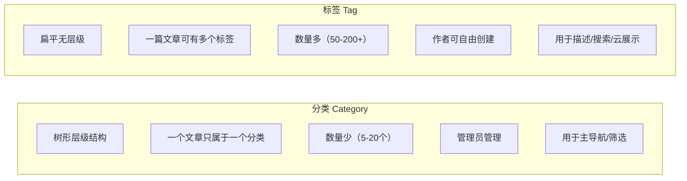
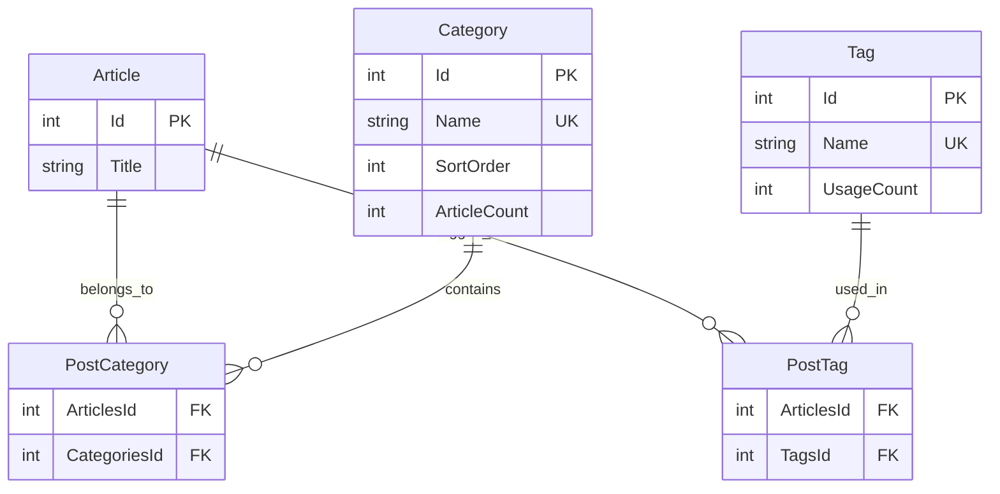

# 博客系统实战 - 标签与分类模块

> **项目阶段**：Phase 5 - 内容组织
>
> **核心目标**：实现博客系统的分类和标签管理功能，包括 CRUD 操作、多对多关系维护、文章关联、侧边栏数据接口和合并拆分功能
>
> **前置知识**：[文章模块(CRUD + 富文本)](文章模块(CRUD + 富文本).md)、EF Core 多对多关系配置
>
> **预计时间**：45分钟

---

## 1. 模块概览

### 1.1 分类 vs 标签的区别



| 维度 | 分类 (Category) | 标签 (Tag) |
|------|-----------------|-----------|
| 结构 | 有序（SortOrder） | 无序 |
| 数量限制 | 少而精（~10-20） | 多而广（~100+） |
| 归属关系 | 一对多（文章→分类） | 多对多（文章↔标签） |
| 管理权限 | 仅管理员 | 管理员 + 作者自动创建 |
| 展示位置 | 导航栏、面包屑 | 标签云、文章底部 |

### 1.2 数据模型关系图



---

## 2. 实体定义

### 2.1 Category 实体

```csharp
using System.ComponentModel.DataAnnotations;
using System.ComponentModel.DataAnnotations.Schema;

namespace BlogApi.Models.Entities;

[Table("Categories")]
public class Category : BaseEntity
{
    [Key]
    [DatabaseGenerated(DatabaseGeneratedOption.Identity)]
    public int Id { get; set; }

    /// <summary>
    /// 分类名称
    /// </summary>
    [Required]
    [MaxLength(50, ErrorMessage = "分类名称不能超过50字符")]
    public string Name { get; set; } = string.Empty;

    /// <summary>
    /// 分类描述
    /// </summary>
    [MaxLength(500)]
    public string? Description { get; set; }

    /// <summary>
    /// 排序值（数值越小越靠前）
    /// </summary>
    public int SortOrder { get; set; } = 0;

    /// <summary>
    /// 该分类下的文章数（冗余字段，便于快速查询）
    /// </summary>
    public int ArticleCount { get; set; } = 0;

    // ====== 导航属性 ======

    /// <summary>
    /// 该分类下的所有文章（通过联结表）
    /// </summary>
    public ICollection<Article> Articles { get; set; } = new List<Article>();
}
```

### 2.2 Tag 实体

```csharp
[Table("Tags")]
public class Tag : BaseEntity
{
    [Key]
    [DatabaseGenerated(DatabaseGeneratedOption.Identity)]
    public int Id { get; set; }

    /// <summary>
    /// 标签名称
    /// </summary>
    [Required]
    [MaxLength(30, ErrorMessage = "标签名称不能超过30字符")]
    public string Name { get; set; } = string.Empty;

    /// <summary>
    /// 使用次数（用于热门排序和标签云大小计算）
    /// </summary>
    public int UsageCount { get; set; } = 0;

    // ====== 导航属性 ======
    public ICollection<Article> Articles { get; set; } = new List<Article>();
}
```

### 2.3 EF Core 多对多配置

```csharp
// ApplicationDbContext.cs 中配置多对多关系
protected override void OnModelCreating(ModelBuilder modelBuilder)
{
    base.OnModelCreating(modelBuilder);

    // ====== 文章-分类 多对多 ======
    modelBuilder.Entity<Article>()
        .HasMany(a => a.Category)  // 注意：这里用单数因为Article只有一个Category
        .WithMany(c => c.Articles)
        .HasForeignKey(a => a.CategoryId);

    // 如果需要真正的多对多（一篇文章多个分类），使用联结表：
    /*
    modelBuilder.Entity<PostCategory>()
        .HasKey(pc => new { pc.ArticlesId, pc.CategoriesId });

    modelBuilder.Entity<PostCategory>()
        .HasOne(pc => pc.Article)
        .WithMany(a => a.PostCategories)
        .HasForeignKey(pc => pc.ArticlesId)
        .OnDelete(DeleteBehavior.Cascade);

    modelBuilder.Entity<PostCategory>()
        .HasOne(pc => pc.Category)
        .WithMany(c => c.PostCategories)
        .HasForeignKey(pc => pc.CategoriesId)
        .OnDelete(DeleteBehavior.Cascade);
    */

    // ====== 文章-标签 多对多（使用EF Core原生支持）======
    modelBuilder.Entity<Article>()
        .HasMany(a => a.ArticleTags)
        .WithOne(at => at.Article!)
        .HasForeignKey(at => at.ArticleId);

    modelBuilder.Entity<Tag>()
        .HasMany(t => t.ArticleTags)
        .WithOne(at => at.Tag!)
        .HasForeignKey(at => at.TagId);

    // 联合唯一索引（防止重复关联）
    modelBuilder.Entity<ArticleTag>()
        .HasKey(at => new { at.ArticleId, at.TagId });
}
```

---

## 3. DTO 定义

```csharp
using System.ComponentModel.DataAnnotations;

namespace BlogApi.Models.Dtos.Categories;

/// <summary>
/// 创建分类请求 DTO
/// </summary>
public class CreateCategoryDto
{
    [Required(ErrorMessage = "分类名称不能为空")]
    [MinLength(1)]
    [MaxLength(50, ErrorMessage = "分类名称不能超过50字符")]
    [RegularExpression(@"^[\u4e00-\u9fa5a-zA-Z0-9_\-\s]+$",
        ErrorMessage = "分类名称包含非法字符")]
    public string Name { get; set; } = string.Empty;

    [MaxLength(500)]
    public string? Description { get; set; }

    public int SortOrder { get; set; } = 0;
}

/// <summary>
/// 更新分类请求 DTO
/// </summary>
public class UpdateCategoryDto
{
    [Required]
    [MinLength(1)]
    [MaxLength(50)]
    public string Name { get; set; } = string.Empty;

    [MaxLength(500)]
    public string? Description { get; set; }

    public int? SortOrder { get; set; }
}

/// <summary>
/// 分类响应 DTO（含文章数）
/// </summary>
public record CategoryDto(
    int Id,
    string Name,
    string? Description,
    int SortOrder,
    int ArticleCount
);

/// <summary>
/// 创建标签请求 DTO
/// </summary>
public class CreateTagDto
{
    [Required(ErrorMessage = "标签名称不能为空")]
    [MinLength(1)]
    [MaxLength(30, ErrorMessage = "标签名称不能超过30字符")]
    [RegularExpression(@"^[\u4e00-\u9fa5a-zA-Z0-9#\.]+$",
        ErrorMessage = "标签名称格式不正确")]
    public string Name { get; set; } = string.Empty;
}

/// <summary>
/// 标签响应 DTO
/// </summary>
public record TagDto(
    int Id,
    string Name,
    int UsageCount
);

/// <summary>
/// 标签云数据 DTO（含权重信息，前端用于控制字体大小）
/// </summary>
public record TagCloudItemDto(
    int Id,
    string Name,
    int UsageCount,
    int Weight   // 1-10 的权重值，用于标签云字体大小
);

/// <summary>
/// 合并分类/标签请求 DTO
/// </summary>
public class MergeRequestDto
{
    [Required]
    public List<int> SourceIds { get; set; } = new();  // 要被合并的ID列表

    [Required]
    public int TargetId { get; set; }  // 合并到的目标ID
}

/// <summary>
/// 拆分请求 DTO
/// </summary>
public class SplitRequestDto
{
    [Required]
    public int SourceId { get; set; }  // 要拆分的ID

    [Required]
    public string NewName { get; set; } = string.Empty;  // 新名称
}
```

---

## 4. CategoryService 实现

```csharp
using BlogApi.Data;
using BlogApi.Models.Dtos.Categories;
using BlogApi.Models.Entities;
using Microsoft.EntityFrameworkCore;

namespace BlogApi.Services.Implementations;

public class CategoryService : ICategoryService
{
    private readonly ApplicationDbContext _db;

    public CategoryService(ApplicationDbContext db)
    {
        _db = db;
    }

    #region 分类 CRUD

    /// <summary>
    /// 获取所有分类（按 SortOrder 排列，含文章数）
    /// </summary>
    public async Task<List<CategoryDto>> GetAllAsync()
    {
        return await _db.Categories
            .OrderBy(c => c.SortOrder)
            .ThenBy(c => c.Name)
            .Select(c => new CategoryDto(
                c.Id, c.Name, c.Description, c.SortOrder, c.ArticleCount))
            .ToListAsync();
    }

    /// <summary>
    /// 获取单个分类详情
    /// </summary>
    public async Task<CategoryDto?> GetByIdAsync(int id)
    {
        return await _db.Categories
            .Where(c => c.Id == id)
            .Select(c => new CategoryDto(
                c.Id, c.Name, c.Description, c.SortOrder, c.ArticleCount))
            .FirstOrDefaultAsync();
    }

    /// <summary>
    /// 创建分类（仅管理员）
    /// </summary>
    public async Task<CategoryDto> CreateAsync(CreateCategoryDto dto)
    {
        // 检查重名
        var exists = await _db.Categories.AnyAsync(c =>
            c.Name.Trim().ToLowerInvariant() == dto.Name.Trim().ToLowerInvariant());
        if (exists)
            throw new InvalidOperationException($"分类 '{dto.Name}' 已存在");

        var category = new Category
        {
            Name = dto.Name.Trim(),
            Description = dto.Description?.Trim(),
            SortOrder = dto.SortOrder,
            ArticleCount = 0
        };

        await _db.Categories.AddAsync(category);
        await _db.SaveChangesAsync();

        return MapToDto(category);
    }

    /// <summary>
    /// 更新分类
    /// </summary>
    public async Task<CategoryDto> UpdateAsync(int id, UpdateCategoryDto dto)
    {
        var category = await _db.Categories.FindAsync(id)
            ?? throw new NotFoundException($"分类 {id} 不存在");

        // 检查新名称是否与其他分类冲突
        if (await _db.Categories.AnyAsync(c =>
            c.Id != id && c.Name.Trim().ToLowerInvariant() == dto.Name.Trim().ToLowerInvariant()))
        {
            throw new InvalidOperationException($"分类名 '{dto.Name}' 已被其他分类使用");
        }

        category.Name = dto.Name.Trim();
        category.Description = dto.Description?.Trim();
        if (dto.SortOrder.HasValue) category.SortOrder = dto.SortOrder.Value;
        category.UpdatedAt = DateTime.UtcNow;

        _db.Categories.Update(category);
        await _db.SaveChangesAsync();

        return MapToDto(category);
    }

    /// <summary>
    /// 删除分类（需先处理关联的文章）
    /// </summary>
    public async Task DeleteAsync(int id)
    {
        var category = await _db.Categories.FindAsync(id)
            ?? throw new NotFoundException($"分类 {id} 不存在");

        // 检查是否有关联文章
        var articleCount = await _db.Articles.CountAsync(a =>
            a.CategoryId == id && a.Status != PostStatus.Deleted);

        if (articleCount > 0)
        {
            throw new InvalidOperationException(
                $"该分类下还有 {articleCount} 篇文章，请先将文章移至其他分类或删除");
        }

        _db.Categories.Remove(category);
        await _db.SaveChangesAsync();
    }

    #endregion

    #region 分类高级操作

    /// <summary>
    /// 合并分类：将多个分类的内容合并到一个分类中
    /// </summary>
    public async Task<CategoryDto> MergeAsync(MergeRequestDto dto)
    {
        var target = await _db.Categories.FindAsync(dto.TargetId)
            ?? throw new NotFoundException("目标分类不存在");

        // 获取源分类
        var sourceCategories = await _db.Categories
            .Where(c => dto.SourceIds.Contains(c.Id) && c.Id != dto.TargetId)
            .ToListAsync();

        if (sourceCategories.Count == 0)
            throw new ArgumentException("没有找到有效的源分类");

        foreach (var source in sourceCategories)
        {
            // 将源分类下的文章转移到目标分类
            await _db.Articles
                .Where(a => a.CategoryId == source.Id)
                .ExecuteUpdateAsync(setters =>
                    setters.SetProperty(a => a.CategoryId, dto.TargetId));

            // 删除源分类
            _db.Categories.Remove(source);
        }

        // 更新目标分类的文章计数
        target.ArticleCount = await _db.Articles
            .CountAsync(a => a.CategoryId == dto.TargetId && a.Status != PostStatus.Deleted);

        await _db.SaveChangesAsync();
        return MapToDto(target);
    }

    #endregion

    #region 辅助方法

    /// <summary>
    /// 同步更新分类的文章计数字段（在文章增删改时调用）
    /// </summary>
    public async Task RecalculateArticleCountsAsync()
    {
        var categories = await _db.Categories.ToListAsync();
        foreach (var category in categories)
        {
            category.ArticleCount = await _db.Articles
                .CountAsync(a => a.CategoryId == category.Id &&
                    a.Status == PostStatus.Published);
        }
        await _db.SaveChangesAsync();
    }

    private static CategoryDto MapToDto(Category c) => new(
        c.Id, c.Name, c.Description, c.SortOrder, c.ArticleCount);

    #endregion
}
```

---

## 5. TagService 实现

```csharp
using BlogApi.Data;
using BlogApi.Models.Dtos.Categories;
using BlogApi.Models.Entities;
using Microsoft.EntityFrameworkCore;

namespace BlogApi.Services.Implementations;

public class TagService : ITagService
{
    private readonly ApplicationDbContext _db;

    public TagService(ApplicationDbContext db)
    {
        _db = db;
    }

    #region 标签 CRUD

    /// <summary>
    /// 获取所有标签（按使用次数降序）
    /// </summary>
    public async Task<List<TagDto>> GetAllAsync()
    {
        return await _db.Tags
            .OrderByDescending(t => t.UsageCount)
            .ThenBy(t => t.Name)
            .Select(t => new TagDto(t.Id, t.Name, t.UsageCount))
            .ToListAsync();
    }

    /// <summary>
    /// 获取标签云数据（含权重计算）
    /// </summary>
    public async Task<List<TagCloudItemDto>> GetCloudDataAsync(int maxItems = 50)
    {
        var tags = await _db.Tags
            .Where(t => t.UsageCount > 0)
            .OrderByDescending(t => t.UsageCount)
            .Take(maxItems)
            .ToListAsync();

        if (tags.Count == 0) return new List<TagCloudItemDto>();

        // 计算权重分布（1-10级）
        var maxUsage = tags.Max(t => t.UsageCount);
        var minUsage = tags.Min(t => t.UsageCount);
        var range = Math.Max(maxUsage - minUsage, 1);  // 避免除零

        return tags.Select(t =>
        {
            // 使用对数缩放使分布更均匀
            var normalized = maxUsage == minUsage ? 1 :
                (int)Math.Ceiling((double)(t.UsageCount - minUsage) / range * 9) + 1;
            return new TagCloudItemDto(t.Id, t.Name, t.UsageCount,
                Math.Clamp(normalized, 1, 10));
        }).ToList();
    }

    /// <summary>
    /// 创建标签（如果已存在则返回已有标签）
    /// </summary>
    public async Task<TagDto> CreateOrGetAsync(string tagName)
    {
        var normalizedName = tagName.Trim();

        // 先查找是否存在
        var existing = await _db.Tags.FirstOrDefaultAsync(t =>
            t.Name.Equals(normalizedName, StringComparison.OrdinalIgnoreCase));

        if (existing != null)
            return new TagDto(existing.Id, existing.Name, existing.UsageCount);

        // 不存在则创建
        var tag = new Tag
        {
            Name = normalizedName,
            UsageCount = 0
        };

        await _db.Tags.AddAsync(tag);
        await _db.SaveChangesAsync();

        return new TagDto(tag.Id, tag.Name, tag.UsageCount);
    }

    /// <summary>
    /// 手动创建标签（管理员功能）
    /// </summary>
    public async Task<TagDto> CreateAsync(CreateTagDto dto)
    {
        var exists = await _db.Tags.AnyAsync(t =>
            t.Name.Trim().ToLowerInvariant() == dto.Name.Trim().ToLowerInvariant());

        if (exists)
            throw new InvalidOperationException($"标签 '{dto.Name}' 已存在");

        var tag = new Tag { Name = dto.Name.Trim(), UsageCount = 0 };
        await _db.Tags.AddAsync(tag);
        await _db.SaveChangesAsync();

        return new TagDto(tag.Id, tag.Name, tag.UsageCount);
    }

    /// <summary>
    /// 更新标签名称
    /// </summary>
    public async Task<TagDto> UpdateAsync(int id, string newName)
    {
        var tag = await _db.Tags.FindAsync(id)
            ?? throw new NotFoundException($"标签 {id} 不存在");

        var trimmedName = newName.Trim();

        if (await _db.Tags.AnyAsync(t =>
            t.Id != id && t.Name.Equals(trimmedName, StringComparison.OrdinalIgnoreCase)))
            throw new InvalidOperationException($"标签名 '{trimmedName}' 已存在");

        tag.Name = trimmedName;
        tag.UpdatedAt = DateTime.UtcNow;
        _db.Tags.Update(tag);
        await _db.SaveChangesAsync();

        return new TagDto(tag.Id, tag.Name, tag.UsageCount);
    }

    /// <summary>
    /// 删除标签（同时清除关联关系）
    /// </summary>
    public async Task DeleteAsync(int id)
    {
        var tag = await _db.Tags.FindAsync(id)
            ?? throw new NotFoundException($"标签 {id} 不存在");

        // 清除文章-标签关联
        var articleTags = await _db.ArticleTags
            .Where(at => at.TagId == id).ToListAsync();
        _db.ArticleTags.RemoveRange(articleTags);

        _db.Tags.Remove(tag);
        await _db.SaveChangesAsync();
    }

    #endregion

    #region 高级操作

    /// <summary>
    /// 合并标签：将多个标签的使用记录合并到一个标签
    /// </summary>
    public async Task<TagDto> MergeTagsAsync(MergeRequestDto dto)
    {
        var target = await _db.Tags.FindAsync(dto.TargetId)
            ?? throw new NotFoundException("目标标签不存在");

        var sources = await _db.Tags
            .Where(t => dto.SourceIds.Contains(t.Id) && t.Id != dto.TargetId)
            .ToListAsync();

        foreach (var source in sources)
        {
            // 将源标签的关联转移到目标标签
            var associations = await _db.ArticleTags
                .Where(at => at.TagId == source.Id).ToListAsync();

            foreach (var assoc in associations)
            {
                // 检查是否已存在相同关联
                var exists = await _db.ArticleTags.AnyAsync(at =>
                    at.ArticleId == assoc.ArticleId && at.TagId == dto.TargetId);
                if (!exists)
                {
                    assoc.TagId = dto.TargetId;
                    target.UsageCount++;
                }
                else
                {
                    _db.ArticleTags.Remove(assoc);
                }
            }

            // 删除源标签
            _db.Tags.Remove(source);
        }

        await _db.SaveChangesAsync();
        return new TagDto(target.Id, target.Name, target.UsageCount);
    }

    /// <summary>
    /// 重命名标签（等同于拆分 + 重命名原标签）
    /// </summary>
    public async Task<List<TagDto>> SplitTagAsync(SplitRequestDto dto)
    {
        var source = await _db.Tags.FindAsync(dto.SourceId)
            ?? throw new NotFoundException("源标签不存在");

        var trimmedName = dto.NewName.Trim();

        // 检查新名称是否已存在
        var existing = await _db.Tags.FirstOrDefaultAsync(t =>
            t.Name.Equals(trimmedName, StringComparison.OrdinalIgnoreCase));

        if (existing != null && existing.Id != dto.SourceId)
        {
            // 目标名称已存在 → 执行合并逻辑
            return new[] { await MergeTagsAsync(new MergeRequestDto
            {
                SourceIds = new[] { dto.SourceId },
                TargetId = existing.Id
            }) }.ToList();
        }

        // 直接重命名
        source.Name = trimmedName;
        _db.Tags.Update(source);
        await _db.SaveChangesAsync();

        return new[] { new TagDto(source.Id, source.Name, source.UsageCount) }.ToList();
    }

    /// <summary>
    /// 增加标签使用次数
    /// </summary>
    public async Task IncrementUsageAsync(int tagId)
    {
        await _db.Tags.Where(t => t.Id == tagId)
            .ExecuteUpdateAsync(s => s.SetProperty(t => t.UsageCount, t => t.UsageCount + 1));
    }

    /// <summary>
    /// 减少标签使用次数
    /// </summary>
    public async Task DecrementUsageAsync(int tagId)
    {
        await _db.Tags.Where(t => t.Id == tagId && t.UsageCount > 0)
            .ExecuteUpdateAsync(s => s.SetProperty(t => t.UsageCount, t => t.UsageCount - 1));
    }

    #endregion
}
```

---

## 6. Controllers

### 6.1 CategoriesController

```csharp
using BlogApi.Models.Dtos.Categories;
using BlogApi.Services.Interfaces;
using Microsoft.AspNetCore.Authorization;
using Microsoft.AspNetCore.Mvc;

namespace BlogApi.Controllers;

[ApiController]
[Route("api/[controller]")]
[Produces("application/json")]
public class CategoriesController : ControllerBase
{
    private readonly ICategoryService _categoryService;

    public CategoriesController(ICategoryService categoryService)
    {
        _categoryService = categoryService;
    }

    /// <summary>获取所有分类</summary>
    [HttpGet]
    [ProducesResponseType(typeof(ApiResponse<List<CategoryDto>>), 200)]
    public async Task<IActionResult> GetAll()
    {
        var categories = await _categoryService.GetAllAsync();
        return Ok(new ApiResponse<List<CategoryDto>>
        {
            Data = categories,
            Message = "获取成功"
        });
    }

    /// <summary>获取单个分类</summary>
    [HttpGet("{id:int}")]
    [ProducesResponseType(typeof(ApiResponse<CategoryDto>), 200)]
    [ProducesResponseType(typeof(ErrorResponse), 404)]
    public async Task<IActionResult> GetById(int id)
    {
        var category = await _categoryService.GetByIdAsync(id);
        if (category == null)
            return NotFound(new ErrorResponse { Code = "NOT_FOUND", Message = $"分类 {id} 不存在" });

        return Ok(new ApiResponse<CategoryDto> { Data = category });
    }

    /// <summary>创建分类（管理员）</summary>
    [HttpPost]
    [Authorize(Roles = "Admin,SuperAdmin")]
    [ProducesResponseType(typeof(ApiResponse<CategoryDto>), 201)]
    public async Task<IActionResult> Create([FromBody] CreateCategoryDto dto)
    {
        try
        {
            var category = await _categoryService.CreateAsync(dto);
            return CreatedAtAction(nameof(GetById), new { id = category.Id },
                new ApiResponse<CategoryDto> { Data = category, Message = "创建成功" });
        }
        catch (InvalidOperationException ex)
        {
            return BadRequest(new ErrorResponse
            {
                Code = "DUPLICATE_NAME", Message = ex.Message,
                TraceId = HttpContext.TraceIdentifier
            });
        }
    }

    /// <summary>更新分类（管理员）</summary>
    [HttpPut("{id:int}")]
    [Authorize(Roles = "Admin,SuperAdmin")]
    public async Task<IActionResult> Update(int id, [FromBody] UpdateCategoryDto dto)
    {
        try
        {
            var category = await _categoryService.UpdateAsync(id, dto);
            return Ok(new ApiResponse<CategoryDto> { Data = category, Message = "更新成功" });
        }
        catch (NotFoundException ex)
        {
            return NotFound(new ErrorResponse { Code = "NOT_FOUND", Message = ex.Message });
        }
        catch (InvalidOperationException ex)
        {
            return BadRequest(new ErrorResponse { Code = "DUPLICATE", Message = ex.Message });
        }
    }

    /// <summary>删除分类（管理员）</summary>
    [HttpDelete("{id:int}")]
    [Authorize(Roles = "Admin,SuperAdmin")]
    public async Task<IActionResult> Delete(int id)
    {
        try
        {
            await _categoryService.DeleteAsync(id);
            return Ok(new ApiResponse<object> { Message = "删除成功" });
        }
        catch (NotFoundException ex)
        {
            return NotFound(new ErrorResponse { Code = "NOT_FOUND", Message = ex.Message });
        }
        catch (InvalidOperationException ex)
        {
            return Conflict(new ErrorResponse
            {
                Code = "HAS_ARTICLES", Message = ex.Message,
                TraceId = HttpContext.TraceIdentifier
            });
        }
    }

    /// <summary>合并分类（管理员）</summary>
    [HttpPost("merge")]
    [Authorize(Roles = "Admin,SuperAdmin")]
    public async Task<IActionResult> Merge([FromBody] MergeRequestDto dto)
    {
        try
        {
            var result = await _categoryService.MergeAsync(dto);
            return Ok(new ApiResponse<CategoryDto> { Data = result, Message = "合并成功" });
        }
        catch (Exception ex)
        {
            return BadRequest(new ErrorResponse { Code = "MERGE_FAILED", Message = ex.Message });
        }
    }
}
```

### 6.2 TagsController

```csharp
using BlogApi.Models.Dtos.Categories;
using BlogApi.Services.Interfaces;
using Microsoft.AspNetCore.Authorization;
using Microsoft.AspNetCore.Mvc;

namespace BlogApi.Controllers;

[ApiController]
[Route("api/[controller]")]
[Produces("application/json")]
public class TagsController : ControllerBase
{
    private readonly ITagService _tagService;

    public TagsController(ITagService tagService) => _tagService = tagService;

    /// <summary>获取所有标签</summary>
    [HttpGet]
    [ProducesResponseType(typeof(ApiResponse<List<TagDto>>), 200)]
    public async Task<IActionResult> GetAll()
    {
        var tags = await _tagService.GetAllAsync();
        return Ok(new ApiResponse<List<TagDto>> { Data = tags });
    }

    /// <summary>获取标签云数据</summary>
    [HttpGet("cloud")]
    [ProducesResponseType(typeof(ApiResponse<List<TagCloudItemDto>>), 200)]
    public async Task<IActionResult> GetCloud([FromQuery] int maxItems = 50)
    {
        var cloud = await _tagService.GetCloudDataAsync(maxItems);
        return Ok(new ApiResponse<List<TagCloudItemDto>> { Data = cloud });
    }

    /// <summary>创建标签（管理员）</summary>
    [HttpPost]
    [Authorize(Roles = "Admin,SuperAdmin")]
    [ProducesResponseType(typeof(ApiResponse<TagDto>), 201)]
    public async Task<IActionResult> Create([FromBody] CreateTagDto dto)
    {
        try
        {
            var tag = await _tagService.CreateAsync(dto);
            return CreatedAtAction(nameof(GetAll), new { },
                new ApiResponse<TagDto> { Data = tag, Message = "创建成功" });
        }
        catch (InvalidOperationException ex)
        {
            return BadRequest(new ErrorResponse { Code = "DUPLICATE", Message = ex.Message });
        }
    }

    /// <summary>更新标签（管理员）</summary>
    [HttpPut("{id:int}")]
    [Authorize(Roles = "Admin,SuperAdmin")]
    public async Task<IActionResult> Update(int id, [FromBody] UpdateTagDto dto)
    {
        try
        {
            var tag = await _tagService.UpdateAsync(id, dto.Name);
            return Ok(new ApiResponse<TagDto> { Data = tag, Message = "更新成功" });
        }
        catch (NotFoundException ex)
        {
            return NotFound(new ErrorResponse { Code = "NOT_FOUND", Message = ex.Message });
        }
    }

    /// <summary>删除标签（管理员）</summary>
    [HttpDelete("{id:int}")]
    [Authorize(Roles = "Admin,SuperAdmin")]
    public async Task<IActionResult> Delete(int id)
    {
        try
        {
            await _tagService.DeleteAsync(id);
            return Ok(new ApiResponse<object> { Message = "删除成功" });
        }
        catch (NotFoundException ex)
        {
            return NotFound(new ErrorResponse { Code = "NOT_FOUND", Message = ex.Message });
        }
    }

    /// <summary>合并标签（管理员）</summary>
    [HttpPost("merge")]
    [Authorize(Roles = "Admin,SuperAdmin")]
    public async Task<IActionResult> Merge([FromBody] MergeRequestDto dto)
    {
        try
        {
            var result = await _tagService.MergeTagsAsync(dto);
            return Ok(new ApiResponse<TagDto> { Data = result, Message = "合并成功" });
        }
        catch (Exception ex)
        {
            return BadRequest(new ErrorResponse { Code = "MERGE_FAILED", Message = ex.Message });
        }
    }
}
```

---

## 7. 按分类/标签筛选文章

这些端点已在 `ArticlesController.GetPagedAsync` 中实现：

```csharp
// GET /api/articles?categoryId=1     → 按分类筛选
// GET /api/articles?tag=C%23         → 按标签筛选（需要在Service中添加Tag参数支持）

// 在 ArticleService.GetPagedAsync 中扩展：
if (!string.IsNullOrWhiteSpace(tagName))
{
    query = query.Where(a => a.ArticleTags
        .Any(at => at.Tag!.Name == tagName));
}
```

---

## 8. 总结

### 交付物清单

| 组件 | 说明 |
|------|------|
| `Entities/Category.cs` | 分类实体（Name/Description/SortOrder/ArticleCount） |
| `Entities/Tag.cs` | 标签实体（Name/UsageCount） |
| `Dtos/Categories/*.cs` | 8个 DTO |
| `Services/CategoryService.cs` | 分类CRUD + 合并 + 计数同步 |
| `Services/TagService.cs` | 标签CRUD + 云数据 + 合并拆分 + 用量统计 |
| `Controllers/CategoriesController.cs` | 6个端点 |
| `Controllers/TagsController.cs` | 6个端点 |

**下一篇**：【图片上传与存储】—— 实现图片上传 API，包括文件验证、本地存储、图片处理和 CDN URL 生成。

---

**参考资源**：
- [EF Core Many-to-Many Relationships](https://docs.microsoft.com/en-us/core/modeling/relationships/many-to-many)
- [Tag Cloud Algorithm](https://en.wikipedia.org/wiki/Tag_cloud)
