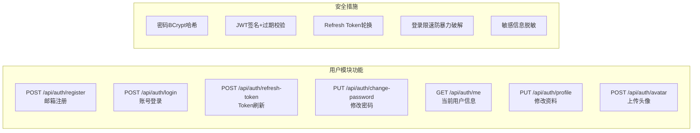
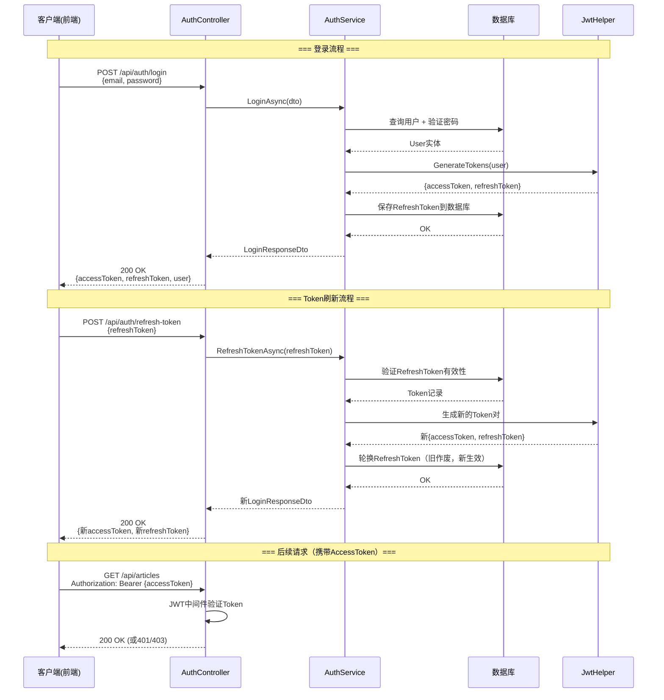

# 博客系统实战 - 用户模块 (JWT 注册登录)

> **项目阶段**：Phase 2 - 认证与授权
>
> **核心目标**：实现完整的用户认证体系，包括邮箱注册、密码哈希、JWT Token 签发与验证、Refresh Token 刷新机制、安全防护措施
>
> **前置知识**：[系统设计与技术选型](系统设计与技术选型.md)、ASP.NET Core Identity 基础、JWT Bearer Token
>
> **预计时间**：60分钟

---

## 1. 模块概览

### 1.1 本模块要实现的功能



### 1.2 JWT 认证流程



---

## 2. 数据模型设计

### 2.1 User 实体

```csharp
using System.ComponentModel.DataAnnotations;
using System.ComponentModel.DataAnnotations.Schema;

namespace BlogApi.Models.Entities;

/// <summary>
/// 用户实体 - 继承自自定义基类（可选）
/// </summary>
[Table("Users")]
public class User : BaseEntity
{
    [Key]
    public Guid Id { get; set; }

    [Required]
    [MaxLength(256)]
    [Index(IsUnique = true)]  // 邮箱唯一索引
    public string Email { get; set; } = string.Empty;

    /// <summary>
    /// 密码哈希值（BCrypt，永远不存储明文！）
    /// </summary>
    [Required]
    public string PasswordHash { get; set; } = string.Empty;

    [Required]
    [MaxLength(50)]
    public string Nickname { get; set; } = string.Empty;

    /// <summary>
    /// 头像URL（相对路径或完整URL）
    /// </summary>
    [MaxLength(500)]
    public string? AvatarUrl { get; set; }

    [MaxLength(500)]
    public string? Bio { get; set; }

    [Required]
    public UserRole Role { get; set; } = UserRole.Reader;

    /// <summary>
    /// 邮箱是否已确认
    /// </summary>
    public bool IsEmailConfirmed { get; set; } = false;

    /// <summary>
    /// 邮箱确认令牌（用于邮件验证链接）
    /// </summary>
    [MaxLength(256)]
    public string? EmailConfirmationToken { get; set; }

    /// <summary>
    /// 最后登录时间
    /// </summary>
    public DateTime? LastLoginAt { get; set; }

    // ====== 导航属性 ======

    /// <summary>
    /// 用户发布的文章
    /// </summary>
    public ICollection<Article> Articles { get; set; } = new List<Article>();

    /// <summary>
    /// 用户发表的评论
    /// </summary>
    public ICollection<Comment> Comments { get; set; } = new List<Comment>();

    /// <summary>
    /// 用户的 RefreshToken 记录
    /// </summary>
    public ICollection<RefreshToken> RefreshTokens { get; set; } = new List<RefreshToken>();
}

/// <summary>
/// RefreshToken 实体 - 用于存储和验证刷新令牌
/// </summary>
[Table("RefreshTokens")]
public class RefreshToken
{
    [Key]
    public int Id { get; set; }

    [Required]
    public Guid UserId { get; set; }

    [ForeignKey(nameof(UserId))]
    public User? User { get; set; }

    /// <summary>
    /// Token值（加密存储）
    /// </summary>
    [Required]
    [MaxLength(512)]
    public string Token { get; set; } = string.Empty;

    /// <summary>
    /// JWT ID - 关联的AccessToken的Jti
    /// </summary>
    [MaxLength(256)]
    public string? JwtId { get; set; }

    /// <summary>
    /// 创建时间
    /// </summary>
    public DateTime CreatedAt { get; set; } = DateTime.UtcNow;

    /// <summary>
    /// 过期时间
    /// </summary>
    public DateTime ExpiresAt { get; set; }

    /// <summary>
    /// 创建时的IP地址
    /// </summary>
    [MaxLength(45)]  // 支持IPv6
    public string? CreatedByIp { get; set; }

    /// <summary>
    /// 设备/浏览器标识
    /// </summary>
    [MaxLength(256)]
    public string? DeviceInfo { get; set; }

    /// <summary>
    /// 是否已撤销（登出时标记为true）
    /// </summary>
    public bool IsRevoked { get; set; } = false;

    /// <summary>
    /// 撤销时间
    /// </summary>
    public DateTime? RevokedAt { get; set; }

    /// <summary>
    /// 撤销原因
    /// </summary>
    [MaxLength(100)]
    public string? ReplacedByToken { get; set; }

    /// <summary>
    /// Token是否有效（未过期且未撤销）
    /// </summary>
    [NotMapped]
    public bool IsActive => !IsRevoked && ExpiresAt > DateTime.UtcNow;
}

/// <summary>
/// 基类：包含通用字段
/// </summary>
public abstract class BaseEntity
{
    public DateTime CreatedAt { get; set; } = DateTime.UtcNow;
    public DateTime UpdatedAt { get; set; } = DateTime.UtcNow;
}
```

### 2.2 EF Core 实体配置

```csharp
using Microsoft.EntityFrameworkCore;
using Microsoft.EntityFrameworkCore.Metadata.Builders;

namespace BlogApi.Data.Configurations;

public class UserConfiguration : IEntityTypeConfiguration<User>
{
    public void Configure(EntityTypeBuilder<User> builder)
    {
        builder.ToTable("Users");

        builder.HasKey(u => u.Id);

        // 邮箱唯一约束
        builder.HasIndex(u => u.Email).IsUnique();

        // 昵称索引（用于搜索）
        builder.HasIndex(u => u.Nickname);

        // 角色索引（用于按角色筛选）
        builder.HasIndex(u => u.Role);

        // 导航属性配置
        builder.HasMany(u => u.Articles)
            .WithOne(a => a.Author!)
            .HasForeignKey(a => a.AuthorId)
            .OnDelete(DeleteBehavior.Restrict);  // 不级联删除文章

        builder.HasMany(u => u.RefreshTokens)
            .WithOne(rt => rt.User!)
            .HasForeignKey(rt => rt.UserId)
            .OnDelete(DeleteBehavior.Cascade);   // 删除用户时清除Token

        // 敏感信息查询时不加载（默认行为）
        builder.Ignore(u => u.PasswordHash);  // 或者通过查询过滤
    }
}

public class RefreshTokenConfiguration : IEntityTypeConfiguration<RefreshToken>
{
    public void Configure(EntityTypeBuilder<RefreshToken> builder)
    {
        builder.ToTable("RefreshTokens");

        builder.HasKey(rt => rt.Id);

        // Token值索引（快速查找）
        builder.HasIndex(rt => rt.Token).IsUnique();

        // UserId索引用于查询某用户的所有Token
        builder.HasIndex(rt => rt.UserId);

        // 过期时间索引用于清理过期Token
        builder.HasIndex(rt => rt.ExpiresAt);
    }
}
```

---

## 3. DTO 设计

### 3.1 认证相关 DTO

```csharp
using System.ComponentModel.DataAnnotations;

namespace BlogApi.Models.Dtos.Auth;

/// <summary>
/// 注册请求DTO
/// </summary>
public class RegisterRequestDto
{
    /// <example>user@example.com</example>
    [Required(ErrorMessage = "邮箱不能为空")]
    [EmailAddress(ErrorMessage = "邮箱格式不正确")]
    [MaxLength(256, ErrorMessage = "邮箱长度不能超过256字符")]
    public string Email { get; set; } = string.Empty;

    /// <example>P@ssw0rd123!</example>
    [Required(ErrorMessage = "密码不能为空")]
    [MinLength(8, ErrorMessage = "密码至少需要8个字符")]
    [MaxLength(100, ErrorMessage = "密码长度不能超过100字符")]
    [RegularExpression(
        @"^(?=.*[a-z])(?=.*[A-Z])(?=.*\d)(?=.*[@$!%*?&])[A-Za-z\d@$!%*?&]{8,}$",
        ErrorMessage = "密码必须包含大小写字母、数字和特殊字符")]
    public string Password { get; set; } = string.Empty;

    /// <example>我的昵称</example>
    [Required(ErrorMessage = "昵称不能为空")]
    [MinLength(2, ErrorMessage = "昵称至少需要2个字符")]
    [MaxLength(30, ErrorMessage = "昵称长度不能超过30字符")]
    [RegularExpression(@"^[\u4e00-\u9fa5a-zA-Z0-9_\-]+$",
        ErrorMessage = "昵称只能包含中文、英文、数字、下划线和连字符")]
    public string Nickname { get; set; } = string.Empty;
}

/// <summary>
/// 登录请求DTO
/// </summary>
public class LoginRequestDto
{
    /// <example>user@example.com</example>
    [Required(ErrorMessage = "邮箱不能为空")]
    [EmailAddress(ErrorMessage = "邮箱格式不正确")]
    public string Email { get; set; } = string.Empty;

    /// <example>P@ssw0rd123!</example>
    [Required(ErrorMessage = "密码不能为空")]
    public string Password { get; set; } = string.Empty;
}

/// <summary>
/// Token刷新请求DTO
/// </summary>
public class RefreshTokenDto
{
    /// <example>eyJhbGciOiJIUzI1NiIs...</example>
    [Required(ErrorMessage = "RefreshToken不能为空")]
    public string RefreshToken { get; set; } = string.Empty;
}

/// <summary>
/// 登录/注册成功响应DTO
/// </summary>
public class LoginResponseDto
{
    public string AccessToken { get; set; } = string.Empty;
    public string RefreshToken { get; set; } = string.Empty;
    public int AccessTokenExpiresIn { get; set; }  // 秒数
    public UserDto User { get; set; } = null!;
}

/// <summary>
/// 修改密码请求DTO
/// </summary>
public class ChangePasswordDto
{
    [Required(ErrorMessage = "当前密码不能为空")]
    public string CurrentPassword { get; set; } = string.Empty;

    [Required(ErrorMessage = "新密码不能为空")]
    [MinLength(8, ErrorMessage = "新密码至少需要8个字符")]
    [RegularExpression(
        @"^(?=.*[a-z])(?=.*[A-Z])(?=.*\d)(?=.*[@$!%*?&])[A-Za-z\d@$!%*?&]{8,}$",
        ErrorMessage = "密码必须包含大小写字母、数字和特殊字符")]
    public string NewPassword { get; set; } = string.Empty;

    [Required(ErrorMessage = "请确认新密码")]
    [Compare("NewPassword", ErrorMessage = "两次输入的密码不一致")]
    public string ConfirmPassword { get; set; } = string.Empty;
}

/// <summary>
/// 修改个人资料DTO
/// </summary>
public class UpdateProfileDto
{
    [MaxLength(30, ErrorMessage = "昵称过长")]
    public string? Nickname { get; set; }

    [MaxLength(500, ErrorMessage = "个人简介过长")]
    public string? Bio { get; set; }
}
```

### 3.2 用户 DTO

```csharp
namespace BlogApi.Models.Dtos.Auth;

/// <summary>
/// 用户信息DTO（对外展示用，不含敏感信息）
/// </summary>
public record UserDto(
    Guid Id,
    string Email,
    string Nickname,
    string? AvatarUrl,
    string? Bio,
    UserRole Role,
    DateTime CreatedAt,
    DateTime? LastLoginAt
);

/// <summary>
/// 用户公开信息DTO（其他用户可见的信息）
/// </summary>
public record PublicUserDto(
    Guid Id,
    string Nickname,
    string? AvatarUrl,
    UserRole Role,
    int ArticleCount
);
```

---

## 4. 核心服务实现

### 4.1 JWT Helper 工具类

```csharp
using System.IdentityModel.Tokens.Jwt;
using System.Security.Claims;
using System.Security.Cryptography;
using System.Text;
using Microsoft.Extensions.Configuration;
using Microsoft.IdentityModel.Tokens;

namespace BlogApi.Helpers;

/// <summary>
/// JWT Token 生成与验证工具类
/// </summary>
public interface IJwtHelper
{
    string GenerateAccessToken(Guid userId, string email, string nickname, UserRole role);
    string GenerateRefreshToken();
    ClaimsPrincipal? ValidateToken(string token);
    (Guid UserId, string Email)? ExtractUserFromExpiredToken(string token);
}

public class JwtHelper : IJwtHelper
{
    private readonly IConfiguration _configuration;
    private readonly SymmetricSecurityKey _securityKey;

    public JwtHelper(IConfiguration configuration)
    {
        _configuration = configuration;

        var secretKey = configuration["JwtSettings:SecretKey"]
            ?? throw new InvalidOperationException("JWT SecretKey 未配置");

        _securityKey = new SymmetricSecurityKey(Encoding.UTF8.GetBytes(secretKey));
    }

    /// <summary>
    /// 生成 Access Token（短期有效）
    /// </summary>
    public string GenerateAccessToken(Guid userId, string email, string nickname, UserRole role)
    {
        var tokenHandler = new JwtSecurityTokenHandler();
        var expiryMinutes = int.Parse(_configuration["JwtSettings:AccessTokenExpirationMinutes"] ?? "30");

        var claims = new List<Claim>
        {
            new(JwtRegisteredClaimNames.Sub, userId.ToString()),
            new(JwtRegisteredClaimNames.Email, email),
            new(JwtRegisteredClaimNames.Jti, Guid.NewGuid().ToString()),  // 唯一ID
            new(JwtRegisteredClaimNames.Iat, DateTimeOffset.UtcNow.ToUnixTimeSeconds().ToString(), ClaimValueTypes.Integer64),
            new(ClaimTypes.NameIdentifier, userId.ToString()),
            new(ClaimTypes.Name, nickname),
            new(ClaimTypes.Email, email),
            new(ClaimTypes.Role, role.ToString()),
            new("UserId", userId.ToString()),
        };

        var tokenDescriptor = new SecurityTokenDescriptor
        {
            Subject = new ClaimsIdentity(claims),
            Expires = DateTime.UtcNow.AddMinutes(expiryMinutes),
            Issuer = _configuration["JwtSettings:Issuer"] ?? "BlogApi",
            Audience = _configuration["JwtSettings:Audience"] ?? "BlogApiClient",
            SigningCredentials = new SigningCredentials(_securityKey, SecurityAlgorithms.HmacSha256Signature)
        };

        var token = tokenHandler.CreateToken(tokenDescriptor);
        return tokenHandler.WriteToken(token);
    }

    /// <summary>
    /// 生成 Refresh Token（随机字符串，长期有效）
    /// </summary>
    public string GenerateRefreshToken()
    {
        var randomBytes = RandomNumberGenerator.GetBytes(64);
        return Convert.ToBase64String(randomBytes);
    }

    /// <summary>
    /// 验证 Token 并返回 ClaimsPrincipal
    /// </summary>
    public ClaimsPrincipal? ValidateToken(string token)
    {
        try
        {
            var tokenHandler = new JwtSecurityTokenHandler();
            var validationParameters = new TokenValidationParameters
            {
                ValidateIssuerSigningKey = true,
                IssuerSigningKey = _securityKey,
                ValidateIssuer = true,
                ValidIssuer = _configuration["JwtSettings:Issuer"] ?? "BlogApi",
                ValidateAudience = true,
                ValidAudience = _configuration["JwtSettings:Audience"] ?? "BlogApiClient",
                ValidateLifetime = true,          // 验证过期时间
                ClockSkew = TimeSpan.Zero         // 时钟偏差设为零（更严格）
            };

            var principal = tokenHandler.ValidateToken(token, validationParameters, out _);
            return principal;
        }
        catch
        {
            return null;  // Token无效（过期、篡改等）
        }
    }

    /// <summary>
    /// 从过期的 Access Token 中提取用户信息（用于刷新场景）
    /// </summary>
    public (Guid UserId, string Email)? ExtractUserFromExpiredToken(string token)
    {
        try
        {
            var tokenHandler = new JwtSecurityTokenHandler();
            var validationParameters = new TokenValidationParameters
            {
                ValidateIssuerSigningKey = true,
                IssuerSigningKey = _securityKey,
                ValidateIssuer = true,
                ValidIssuer = _configuration["JwtSettings:Issuer"],
                ValidateAudience = true,
                ValidAudience = _configuration["JwtSettings:Audience"],
                ValidateLifetime = false  // ⚠️ 不验证过期时间！这是关键
            };

            var principal = tokenHandler.ValidateToken(token, validationParameters, out _);
            var userIdClaim = principal.FindFirst("UserId")?.Value;
            var emailClaim = principal.FindFirst(ClaimTypes.Email)?.Value;

            if (Guid.TryParse(userIdClaim, out var userId) && !string.IsNullOrEmpty(emailClaim))
            {
                return (userId, emailClaim);
            }
            return null;
        }
        catch
        {
            return null;
        }
    }
}
```

### 4.2 AuthService 完整实现

```csharp
using System.Security.Cryptography;
using BlogApi.Data;
using BlogApi.Helpers;
using BlogApi.Models.Dtos.Auth;
using BlogApi.Models.Entities;
using Microsoft.AspNetCore.Cryptography.KeyDerivation;
using Microsoft.EntityFrameworkCore;
using Microsoft.Extensions.Logging;

namespace BlogApi.Services.Implementations;

public class AuthService : IAuthService
{
    private readonly ApplicationDbContext _db;
    private readonly IJwtHelper _jwtHelper;
    private readonly ILogger<AuthService> _logger;
    private readonly IConfiguration _configuration;

    public AuthService(
        ApplicationDbContext db,
        IJwtHelper jwtHelper,
        ILogger<AuthService> logger,
        IConfiguration configuration)
    {
        _db = db;
        _jwtHelper = jwtHelper;
        _logger = logger;
        _configuration = configuration;
    }

    #region 注册

    /// <summary>
    /// 用户注册
    /// </summary>
    public async Task<(bool Success, string Message, UserDto? User)> RegisterAsync(RegisterRequestDto dto)
    {
        // 1. 检查邮箱是否已被注册
        var existingUser = await _db.Users.FirstOrDefaultAsync(u => u.Email == dto.Email.ToLowerInvariant());
        if (existingUser != null)
        {
            return (false, "该邮箱已被注册", null);
        }

        // 2. 检查昵称是否已被使用
        var existingNickname = await _db.Users.FirstOrDefaultAsync(u =>
            u.Nickname == dto.Nickname);
        if (existingNickname != null)
        {
            return (false, "该昵称已被使用", null);
        }

        // 3. 哈希密码（使用 ASP.NET Core 的 KeyDerivation）
        var passwordHash = HashPassword(dto.Password);

        // 4. 创建用户
        var user = new User
        {
            Id = Guid.NewGuid(),
            Email = dto.Email.ToLowerInvariant().Trim(),
            PasswordHash = passwordHash,
            Nickname = dto.Nickname.Trim(),
            Role = UserRole.Reader,  // 默认角色
            IsEmailConfirmed = false, // 需要邮箱确认
            CreatedAt = DateTime.UtcNow
        };

        await _db.Users.AddAsync(user);
        await _db.SaveChangesAsync();

        _logger.LogInformation("新用户注册成功: {Email}, Id={Id}", user.Email, user.Id);

        // TODO: 发送邮箱确认邮件（后续章节）

        var userDto = MapToUserDto(user);
        return (true, "注册成功", userDto);
    }

    #endregion

    #region 登录

    /// <summary>
    /// 用户登录
    /// </summary>
    public async Task<(bool Success, string Message, LoginResponseDto? Response)> LoginAsync(
        LoginRequestDto dto, string? clientIp = null, string? deviceInfo = null)
    {
        // 1. 查找用户
        var user = await _db.Users
            .FirstOrDefaultAsync(u => u.Email == dto.Email.ToLowerInvariant().Trim());

        if (user == null)
        {
            // 安全提示：不要透露"用户不存在"的信息，统一返回"凭据错误"
            _logger.LogWarning("登录失败: 邮箱不存在 {Email}", dto.Email);
            return (false, "邮箱或密码错误", null);
        }

        // 2. 检查账户状态
        if (user.Role == UserRole.Banned)
        {
            _logger.LogWarning("被封禁的用户尝试登录: {Email}", user.Email);
            return (false, "该账户已被封禁，请联系管理员", null);
        }

        // 3. 验证密码
        if (!VerifyPassword(dto.Password, user.PasswordHash))
        {
            _logger.LogWarning("登录失败: 密码错误 {Email}, UserId={Id}",
                user.Email, user.Id);
            return (false, "邮箱或密码错误", null);
        }

        // 4. 生成 Token 对
        var accessToken = _jwtHelper.GenerateAccessToken(
            user.Id, user.Email, user.Nickname, user.Role);

        var refreshTokenValue = _jwtHelper.GenerateRefreshToken();

        // 5. 保存 RefreshToken 到数据库
        var refreshTokenDays = int.Parse(
            _configuration["JwtSettings:RefreshTokenExpirationDays"] ?? "7");

        var refreshToken = new RefreshToken
        {
            UserId = user.Id,
            Token = refreshTokenValue,
            JwtId = GetJtiFromToken(accessToken),  // 提取AccessToken的Jti
            CreatedAt = DateTime.UtcNow,
            ExpiresAt = DateTime.UtcNow.AddDays(refreshTokenDays),
            CreatedByIp = clientIp,
            DeviceInfo = deviceInfo?.Substring(0, Math.Min(255, deviceInfo.Length))
        };

        await _db.RefreshTokens.AddAsync(refreshToken);

        // 6. 更新最后登录时间
        user.LastLoginAt = DateTime.UtcNow;
        _db.Users.Update(user);

        await _db.SaveChangesAsync();

        _logger.LogInformation("用户登录成功: {Email}, IP={Ip}",
            user.Email, clientIp ?? "unknown");

        var accessTokenExpiresIn = int.Parse(
            _configuration["JwtSettings:AccessTokenExpirationMinutes"] ?? "30") * 60;

        var response = new LoginResponseDto
        {
            AccessToken = accessToken,
            RefreshToken = refreshTokenValue,
            AccessTokenExpiresIn = accessTokenExpiresIn,
            User = MapToUserDto(user)
        };

        return (true, "登录成功", response);
    }

    #endregion

    #region Token 刷新

    /// <summary>
    /// 使用 RefreshToken 刷新 Access Token
    /// </summary>
    public async Task<(bool Success, string Message, LoginResponseDto? Response)>
        RefreshTokenAsync(string refreshTokenValue, string? clientIp = null)
    {
        // 1. 从数据库中查找 RefreshToken
        var storedToken = await _db.RefreshTokens
            .Include(rt => rt.User)
            .FirstOrDefaultAsync(rt => rt.Token == refreshTokenValue);

        if (storedToken == null)
        {
            _logger.LogWarning("Token刷新失败: RefreshToken不存在");
            return (false, "无效的刷新令牌", null);
        }

        // 2. 检查 Token 是否被撤销
        if (storedToken.IsRevoked)
        {
            // 安全措施：如果Token被撤销，可能存在被盗用的嫌疑
            // 撤销该用户的所有 RefreshToken（强制重新登录）
            await RevokeAllUserTokens(storedToken.UserId, "检测到可疑的Token刷新");
            _logger.LogWarning("Token刷新失败: 已撤销的Token被使用，已清除所有Token UserId={UserId}",
                storedToken.UserId);
            return (false, "会话已失效，请重新登录", null);
        }

        // 3. 检查 Token 是否过期
        if (storedToken.ExpiresAt <= DateTime.UtcNow)
        {
            _logger.LogWarning("Token刷新失败: RefreshToken已过期");
            return (false, "刷新令牌已过期，请重新登录", null);
        }

        // 4. 检查关联的用户是否存在且正常
        if (storedToken.User == null || storedToken.User.Role == UserRole.Banned)
        {
            return (false, "用户账户异常", null);
        }

        // 5. 生成新的 Token 对
        var newAccessToken = _jwtHelper.GenerateAccessToken(
            storedToken.User.Id,
            storedToken.User.Email,
            storedToken.User.Nickname,
            storedToken.User.Role);

        var newRefreshTokenValue = _jwtHelper.GenerateRefreshToken();

        // 6. 轮换 RefreshToken（旧Token标记为已替换，创建新Token）
        storedToken.IsRevoked = true;
        storedToken.RevokedAt = DateTime.UtcNow;
        storedToken.ReplacedByToken = newRefreshTokenValue;

        var newRefreshTokenDays = int.Parse(
            _configuration["JwtSettings:RefreshTokenExpirationDays"] ?? "7");

        var newRefreshToken = new RefreshToken
        {
            UserId = storedToken.User.Id,
            Token = newRefreshTokenValue,
            JwtId = GetJtiFromToken(newAccessToken),
            CreatedAt = DateTime.UtcNow,
            ExpiresAt = DateTime.UtcNow.AddDays(newRefreshTokenDays),
            CreatedByIp = clientIp,
            DeviceInfo = storedToken.DeviceInfo  // 保持设备信息一致
        };

        await _db.RefreshTokens.AddAsync(newRefreshToken);
        await _db.SaveChangesAsync();

        _logger.LogInformation("Token刷新成功: UserId={UserId}, OldTokenId={OldId}",
            storedToken.User.Id, storedToken.Id);

        var accessTokenExpiresIn = int.Parse(
            _configuration["JwtSettings:AccessTokenExpirationMinutes"] ?? "30") * 60;

        return (true, "刷新成功", new LoginResponseDto
        {
            AccessToken = newAccessToken,
            RefreshToken = newRefreshTokenValue,
            AccessTokenExpiresIn = accessTokenExpiresIn,
            User = MapToUserDto(storedToken.User)
        });
    }

    #endregion

    #region 修改密码

    /// <summary>
    /// 修改密码
    /// </summary>
    public async Task<(bool Success, string Message)> ChangePasswordAsync(
        Guid userId, ChangePasswordDto dto)
    {
        var user = await _db.Users.FindAsync(userId)
            ?? throw new NotFoundException("用户不存在");

        // 1. 验证当前密码
        if (!VerifyPassword(dto.CurrentPassword, user.PasswordHash))
        {
            return (false, "当前密码不正确");
        }

        // 2. 验证新旧密码不同
        if (dto.CurrentPassword == dto.NewPassword)
        {
            return (false, "新密码不能与当前密码相同");
        }

        // 3. 更新密码
        user.PasswordHash = HashPassword(dto.NewPassword);
        user.UpdatedAt = DateTime.UtcNow;

        // 4. 撤销所有 RefreshToken（密码变更后强制重新登录）
        await RevokeAllUserTokens(userId, "用户修改了密码");

        _db.Users.Update(user);
        await _db.SaveChangesAsync();

        _logger.LogInformation("用户修改密码成功: UserId={Id}", userId);
        return (true, "密码修改成功");
    }

    #endregion

    #region 登出

    /// <summary>
    /// 登出（撤销当前 RefreshToken）
    /// </summary>
    public async Task LogoutAsync(string refreshTokenValue)
    {
        var token = await _db.RefreshTokens
            .FirstOrDefaultAsync(t => t.Token == refreshTokenValue);

        if (token != null)
        {
            token.IsRevoked = true;
            token.RevokedAt = DateTime.UtcNow;
            token.ReplacedByToken = "logout";
            await _db.SaveChangesAsync();
        }
    }

    #endregion

    #region 辅助方法

    /// <summary>
    /// 使用 PBKDF2 哈希密码
    /// </summary>
    private static string HashPassword(string password)
    {
        // 生成随机盐值 (128位 = 16字节)
        var salt = RandomNumberGenerator.GetBytes(16);

        // PBKDF2 哈希：100000次迭代，256位输出
        var hash = KeyDerivation.Pbkdf2(
            password: password,
            salt: salt,
            prf: KeyDerivationPrf.HMACSHA256,
            iterationCount: 100000,
            numBytesRequested: 32);

        // 组合：盐值 + 哈希值（Base64编码）
        // 格式: base64(salt):base64(hash)
        return $"{Convert.ToBase64String(salt)}:{Convert.ToBase64String(hash)}";
    }

    /// <summary>
    /// 验证密码
    /// </summary>
    private static bool VerifyPassword(string inputPassword, string storedHash)
    {
        try
        {
            var parts = storedHash.Split(':');
            if (parts.Length != 2) return false;

            var salt = Convert.FromBase64String(parts[0]);
            var storedHashBytes = Convert.FromBase64String(parts[1]);

            var computedHash = KeyDerivation.Pbkdf2(
                password: inputPassword,
                salt: salt,
                prf: KeyDerivationPrf.HMACSHA256,
                iterationCount: 100000,
                numBytesRequested: 32);

            return CryptographicOperations.FixedTimeEquals(computedHash, storedHashBytes);
        }
        catch
        {
            return false;
        }
    }

    /// <summary>
    /// 从 JWT Token 中提取 Jti (JWT ID)
    /// </summary>
    private static string? GetJtiFromToken(string token)
    {
        try
        {
            var handler = new JwtSecurityTokenHandler();
            var jwtToken = handler.ReadJwtToken(token);
            return jwtToken.Claims.FirstOrDefault(c => c.Type == JwtRegisteredClaimNames.Jti)?.Value;
        }
        catch
        {
            return null;
        }
    }

    /// <summary>
    /// 撤销指定用户的所有 RefreshToken
    /// </summary>
    private async Task RevokeAllUserTokens(Guid userId, string reason)
    {
        var tokens = await _db.RefreshTokens
            .Where(t => t.UserId == userId && !t.IsRevoked)
            .ToListAsync();

        foreach (var token in tokens)
        {
            token.IsRevoked = true;
            token.RevokedAt = DateTime.UtcNow;
            token.ReplacedByToken = $"revoked_all:{reason}";
        }

        await _db.SaveChangesAsync();
        _logger.LogInformation("已撤销用户所有Token: UserId={Id}, Reason={Reason}",
            userId, reason);
    }

    private static UserDto MapToUserDto(User user) => new(
        user.Id,
        MaskEmail(user.Email),      // 邮箱脱敏
        user.Nickname,
        user.AvatarUrl,
        user.Bio,
        user.Role,
        user.CreatedAt,
        user.LastLoginAt
    );

    /// <summary>
    /// 邮箱脱敏显示：user***@example.com
    /// </summary>
    private static string MaskEmail(string email)
    {
        var atIndex = email.IndexOf('@');
        if (atIndex <= 2) return "***" + email.Substring(atIndex);
        return email[..2] + "***" + email[atIndex..];
    }

    #endregion
}
```

---

## 5. AuthController 完整代码

```csharp
using System.Net;
using System.Security.Claims;
using BlogApi.Helpers;
using BlogApi.Models.Dtos.Auth;
using BlogApi.Services.Interfaces;
using Microsoft.AspNetCore.Authorization;
using Microsoft.AspNetCore.Mvc;
using Microsoft.AspNetCore.RateLimiting;

namespace BlogApi.Controllers;

/// <summary>
/// 认证控制器 - 处理注册、登录、Token刷新等操作
/// </summary>
[ApiController]
[Route("api/[controller]")]
[Produces("application/json")]
public class AuthController : ControllerBase
{
    private readonly IAuthService _authService;
    private readonly ILogger<AuthController> _logger;

    public AuthController(IAuthService authService, ILogger<AuthController> logger)
    {
        _authService = authService;
        _logger = logger;
    }

    /// <summary>
    /// 用户注册
    /// </summary>
    /// <param name="dto">注册信息</param>
    /// <returns>注册结果</returns>
    /// <response code="200">注册成功</response>
    /// <response code="400">参数验证失败或邮箱/昵称已被占用</response>
    [HttpPost("register")]
    [AllowAnonymous]
    [ProducesResponseType(typeof(ApiResponse<UserDto>), StatusCodes.Status200OK)]
    [ProducesResponseType(typeof(ErrorResponse), StatusCodes.Status400BadRequest)]
    public async Task<IActionResult> Register([FromBody] RegisterRequestDto dto)
    {
        var (success, message, userDto) = await _authService.RegisterAsync(dto);

        if (!success)
        {
            return BadRequest(new ErrorResponse
            {
                Code = "REGISTRATION_FAILED",
                Message = message,
                TraceId = HttpContext.TraceIdentifier
            });
        }

        return Ok(new ApiResponse<UserDto>
        {
            Data = userDto!,
            Message = message
        });
    }

    /// <summary>
    /// 用户登录
    /// </summary>
    /// <param name="dto">登录凭据</param>
    /// <returns>JWT Token 对</returns>
    /// <response code="200">登录成功，返回Token</response>
    /// <response code="400">凭据错误</response>
    [HttpPost("login")]
    [AllowAnonymous]
    [EnableRateLimiting(policyName: "LoginRateLimit")]  // 登录限流
    [ProducesResponseType(typeof(ApiResponse<LoginResponseDto>), StatusCodes.Status200OK)]
    [ProducesResponseType(typeof(ErrorResponse), StatusCodes.Status400BadRequest)]
    [ProducesResponseType(typeof(ErrorResponse), StatusCodes.Status429TooManyRequests)]
    public async Task<IActionResult> Login([FromBody] LoginRequestDto dto)
    {
        var clientIp = HttpContext.Connection.RemoteIpAddress?.ToString();
        var userAgent = HttpContext.Request.Headers.UserAgent.ToString();

        var (success, message, response) = await _authService.LoginAsync(dto, clientIp, userAgent);

        if (!success)
        {
            // 登录失败也返回400（而非401），避免泄露用户是否存在的信息
            return BadRequest(new ErrorResponse
            {
                Code = "LOGIN_FAILED",
                Message = message,
                TraceId = HttpContext.TraceIdentifier
            });
        }

        return Ok(new ApiResponse<LoginResponseDto>
        {
            Data = response!,
            Message = message
        });
    }

    /// <summary>
    /// 刷新访问令牌
    /// </summary>
    /// <param name="dto">RefreshToken</param>
    /// <returns>新的 Token 对</returns>
    /// <response code="200">刷新成功</response>
    /// <response code="400">RefreshToken 无效或过期</response>
    [HttpPost("refresh-token")]
    [AllowAnonymous]
    [ProducesResponseType(typeof(ApiResponse<LoginResponseDto>), StatusCodes.Status200OK)]
    [ProducesResponseType(typeof(ErrorResponse), StatusCodes.Status400BadRequest)]
    public async Task<IActionResult> RefreshToken([FromBody] RefreshTokenDto dto)
    {
        var clientIp = HttpContext.Connection.RemoteIpAddress?.ToString();

        var (success, message, response) =
            await _authService.RefreshTokenAsync(dto.RefreshToken, clientIp);

        if (!success)
        {
            return BadRequest(new ErrorResponse
            {
                Code = "REFRESH_FAILED",
                Message = message,
                TraceId = HttpContext.TraceIdentifier
            });
        }

        return Ok(new ApiResponse<LoginResponseDto>
        {
            Data = response!,
            Message = message
        });
    }

    /// <summary>
    /// 登出（撤销当前会话）
    /// </summary>
    [HttpPost("logout")]
    [Authorize]
    [ProducesResponseType(StatusCodes.Status200OK)]
    [ProducesResponseType(StatusCodes.Status401Unauthorized)]
    public async Task<IActionResult> Logout()
    {
        // 从请求头获取 RefreshToken（前端需要在Header中传递）
        var refreshToken = Request.Headers["X-Refresh-Token"].FirstOrDefault();

        if (!string.IsNullOrEmpty(refreshToken))
        {
            await _authService.LogoutAsync(refreshToken);
        }

        return Ok(new ApiResponse<object>
        {
            Message = "登出成功"
        });
    }

    /// <summary>
    /// 获取当前登录用户信息
    /// </summary>
    [HttpGet("me")]
    [Authorize]
    [ProducesResponseType(typeof(ApiResponse<UserDto>), StatusCodes.Status200OK)]
    [ProducesResponseType(StatusCodes.Status401Unauthorized)]
    public async Task<IActionResult> GetCurrentUser()
    {
        var userIdStr = User.FindFirstValue(ClaimTypes.NameIdentifier)
            ?? throw new UnauthorizedAccessException("无法识别用户身份");

        var userId = Guid.Parse(userIdStr);

        // 通过服务获取最新用户信息（而非从Claims中读取，确保数据新鲜）
        var result = await _authService.GetUserByIdAsync(userId);

        return Ok(new ApiResponse<UserDto>
        {
            Data = result,
            Message = "获取成功"
        });
    }

    /// <summary>
    /// 修改个人资料
    /// </summary>
    [HttpPut("profile")]
    [Authorize]
    [ProducesResponseType(typeof(ApiResponse<UserDto>), StatusCodes.Status200OK)]
    [ProducesResponseType(typeof(ErrorResponse), StatusCodes.Status400BadRequest)]
    public async Task<IActionResult> UpdateProfile([FromBody] UpdateProfileDto dto)
    {
        var userIdStr = User.FindFirstValue(ClaimTypes.NameIdentifier)!;
        var userId = Guid.Parse(userIdStr);

        var (success, message, userDto) = await _authService.UpdateProfileAsync(userId, dto);

        if (!success)
        {
            return BadRequest(new ErrorResponse
            {
                Code = "UPDATE_PROFILE_FAILED",
                Message = message,
                TraceId = HttpContext.TraceIdentifier
            });
        }

        return Ok(new ApiResponse<UserDto>
        {
            Data = userDto!,
            Message = message
        });
    }

    /// <summary>
    /// 修改密码
    /// </summary>
    [HttpPut("change-password")]
    [Authorize]
    [ProducesResponseType(typeof(ApiResponse<object>), StatusCodes.Status200OK)]
    [ProducesResponseType(typeof(ErrorResponse), StatusCodes.Status400BadRequest)]
    public async Task<IActionResult> ChangePassword([FromBody] ChangePasswordDto dto)
    {
        var userIdStr = User.FindFirstValue(ClaimTypes.NameIdentifier)!;
        var userId = Guid.Parse(userIdStr);

        var (success, message) = await _authService.ChangePasswordAsync(userId, dto);

        if (!success)
        {
            return BadRequest(new ErrorResponse
            {
                Code = "CHANGE_PASSWORD_FAILED",
                Message = message,
                TraceId = HttpContext.TraceIdentifier
            });
        }

        return Ok(new ApiResponse<object>
        {
            Message = message
        });
    }
}
```

---

## 6. 安全措施详解

### 6.1 登录限流中间件

防止暴力破解攻击：

```csharp
// Program.cs 中注册限流策略
builder.Services.AddRateLimiter(options =>
{
    options.AddFixedWindowLimiter("LoginRateLimit", limiterOptions =>
    {
        limiterOptions.PermitLimit = 5;           // 每5次
        limiterOptions.Window = TimeSpan.FromMinutes(1);  // 每分钟
        limiterOptions.QueueProcessingOrder = QueueProcessingOrder.OldestFirst;
        limiterOptions.QueueLimit = 0;             // 不排队，直接拒绝
    });

    options.AddFixedWindowLimiter("RegisterRateLimit", limiterOptions =>
    {
        limiterOptions.PermitLimit = 3;            // 每小时最多3次注册
        limiterOptions.Window = TimeSpan.FromHours(1);
        limiterOptions.QueueLimit = 0;
    });
});

app.UseRateLimiter();
```

### 6.2 敏感信息脱敏规则

| 字段 | 存储方式 | API响应 | 日志 |
|------|---------|---------|------|
| 密码 | BCrypt 哈希 | **永不返回** | **永不记录** |
| 邮箱 | 明文存储 | `us***@example.com` | 完整记录 |
| AccessToken | JWT 字符串 | 返回给客户端 | 截断前10字符 |
| RefreshToken | 加密存储 | 仅首次返回 | **永不记录明文** |

### 6.3 安全检查清单

```mermaid
graph TD
    S1["✅ 密码使用PBKDF2/BCrypt哈希<br/>不存储明文"]
    S2["✅ JWT SecretKey >= 32字符<br/>生产环境从环境变量读取"]
    S3["✅ RefreshToken 轮换机制<br/>旧Token立即失效"]
    S4["✅ 登录接口限流<br/>防止暴力破解"]
    S5["✅ 密码修改后撤销所有Token<br/>强制重新登录"]
    S6["✅ 错误信息统一化<br/>不泄露用户是否存在"]
    S7["✅ HTTPS 强制使用<br/>Production环境"]
    S8["✅ Cookie安全标志<br/>Secure/HttpOnly/SameSite"]
    S9["✅ CORS 白名单配置<br/>不允许 * 来源"]
    S10["✅ 定期清理过期RefreshToken<br/>定时任务"]
```



---

## 7. Program.cs 配置要点

```csharp
using Microsoft.AspNetCore.Authentication.JwtBearer;
using Microsoft.EntityFrameworkCore;
using Microsoft.IdentityModel.Tokens;
using System.Text;
using BlogApi.Data;
using BlogApi.Helpers;
using BlogApi.Services.Implementations;
using Serilog;

var builder = WebApplication.CreateBuilder(args);

// ====== 日志配置 ======
Log.Logger = new LoggerConfiguration()
    .ReadFrom.Configuration(builder.Configuration)
    .Enrich.FromLogContext()
    .WriteTo.Console()
    .WriteTo.File("logs/blog-.log", rollingInterval: RollingInterval.Day)
    .CreateLogger();
builder.Host.UseSerilog();

// ====== 数据库 ======
builder.Services.AddDbContext<ApplicationDbContext>(options =>
    options.UseSqlServer(builder.Configuration.GetConnectionString("DefaultConnection")));

// ====== JWT 认证 ======
var jwtSecret = builder.Configuration["JwtSettings:SecretKey"]
    ?? throw new InvalidOperationException("JWT SecretKey 未配置");

builder.Services.AddAuthentication(JwtBearerDefaults.AuthenticationScheme)
    .AddJwtBearer(options =>
    {
        options.TokenValidationParameters = new TokenValidationParameters
        {
            ValidateIssuerSigningKey = true,
            IssuerSigningKey = new SymmetricSecurityKey(Encoding.UTF8.GetBytes(jwtSecret)),
            ValidateIssuer = true,
            ValidIssuer = builder.Configuration["JwtSettings:Issuer"],
            ValidateAudience = true,
            ValidAudience = builder.Configuration["JwtSettings:Audience"],
            ValidateLifetime = true,
            ClockSkew = TimeSpan.Zero
        };
    });

builder.Services.AddAuthorization();

// ====== 服务注册 ======
builder.Services.AddScoped<IJwtHelper, JwtHelper>();
builder.Services.AddScoped<IAuthService, AuthService>();
// ... 其他服务

// ====== 限流 ======
builder.Services.AddRateLimiter(/* 见上文 */);

// ====== CORS ======
builder.Services.AddCors(options =>
{
    options.AddPolicy("AllowFrontend", policy =>
    {
        policy.WithOrigins(
            builder.Configuration["AllowedOrigins"]?.Split(',') ??
            new[] { "http://localhost:3000", "http://localhost:5173" })
        .AllowAnyHeader()
        .AllowAnyMethod()
        .AllowCredentials();  // 允许Cookie/Credential
    });
});

// ====== 控制器 & Swagger ======
builder.Services.AddControllers();
builder.Services.AddEndpointsApiExplorer();
builder.Services.AddSwaggerGen(c =>
{
    c.SwaggerDoc("v1", new Microsoft.OpenApi.Models.OpenApiInfo
    {
        Title = "Blog API",
        Version = "v1",
        Description = "博客系统后端API文档"
    });

    // JWT认证支持
    c.AddSecurityDefinition("Bearer", new Microsoft.OpenApi.Models.OpenApiSecurityScheme
    {
        Name = "Authorization",
        Type = Microsoft.OpenApi.Models.SecuritySchemeType.Http,
        Scheme = "Bearer",
        BearerFormat = "JWT",
        In = Microsoft.OpenApi.Models.ParameterLocation.Header,
        Description = "请输入JWT Token（格式: Bearer {token}）"
    });
});

var app = builder.Build();

if (app.Environment.IsDevelopment())
{
    app.UseSwagger();
    app.UseSwaggerUI();
}

app.UseCors("AllowFrontend");
app.UseAuthentication();  // 必须在 UseAuthorization 之前
app.UseAuthorization();
app.UseRateLimiter();
app.MapControllers();

// 自动执行数据库迁移
using (var scope = app.Services.CreateScope())
{
    var db = scope.ServiceProvider.GetRequiredService<ApplicationDbContext>();
    db.Database.Migrate();
}

app.Run();
```

---

## 8. 总结与下一步

### 8.1 本模块交付物

| 文件 | 说明 |
|------|------|
| `Entities/User.cs` | 用户实体（含导航属性） |
| `Entities/RefreshToken.cs` | 刷新令牌实体 |
| `Dtos/Auth/*.cs` | 6个认证相关 DTO |
| `Helpers/JwtHelper.cs` | JWT 生成与验证工具 |
| `Services/AuthService.cs` | 认证业务逻辑（~350行） |
| `Controllers/AuthController.cs` | 9个API端点 |

### 8.2 API 测试清单

```bash
# 注册
curl -X POST http://localhost:5000/api/auth/register \
  -H "Content-Type: application/json" \
  -d '{"email":"test@test.com","password":"Test@123456","nickname":"测试用户"}'

# 登录
curl -X POST http://localhost:5000/api/auth/login \
  -H "Content-Type: application/json" \
  -d '{"email":"test@test.com","password":"Test@123456"}'

# 使用返回的Token访问受保护资源
curl -X GET http://localhost:5000/api/auth/me \
  -H "Authorization: Bearer YOUR_ACCESS_TOKEN"

# 刷新Token
curl -X POST http://localhost:5000/api/auth/refresh-token \
  -H "Content-Type: application/json" \
  -d '{"refreshToken":"YOUR_REFRESH_TOKEN"}'
```

**下一篇**：【文章模块 (CRUD + 富文本)】—— 实现文章的创建、编辑、删除、列表查询以及 Markdown 富文本处理。

---

**参考资源**：
- [OWASP Authentication Cheat Sheet](https://cheatsheetseries.owasp.org/cheatsheets/Authentication_Cheat_Sheet.html)
- [JWT.io - 在线调试工具](https://jwt.io/)
- [Microsoft Identity docs](https://docs.microsoft.com/zh-cn/aspnet/core/security/authentication/)
