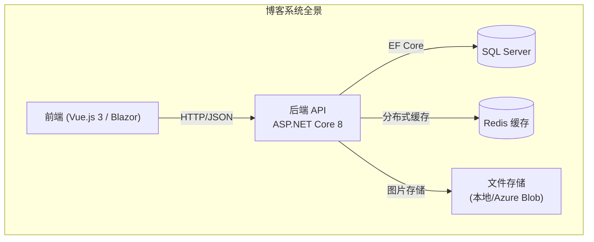
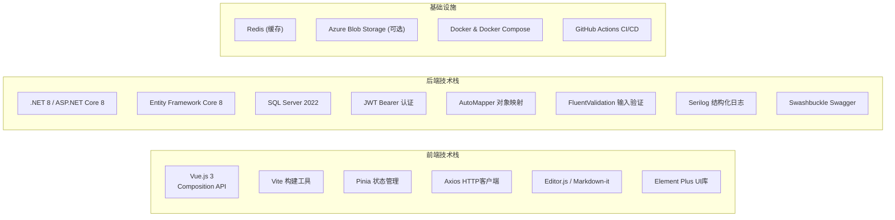
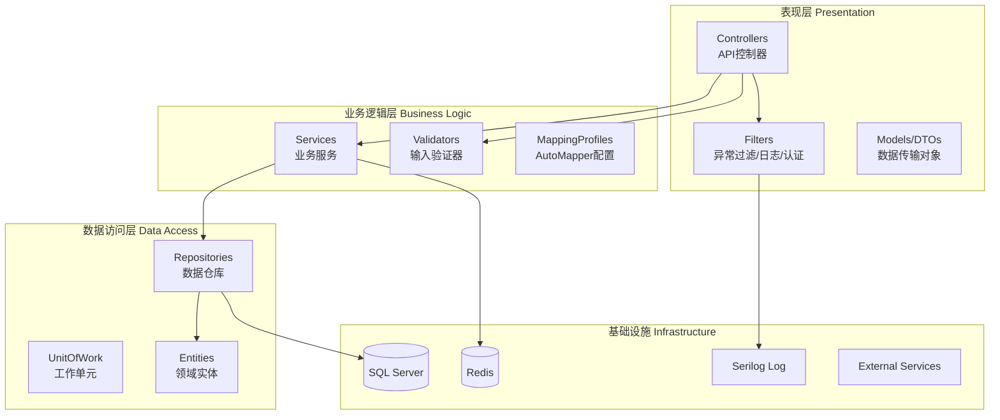
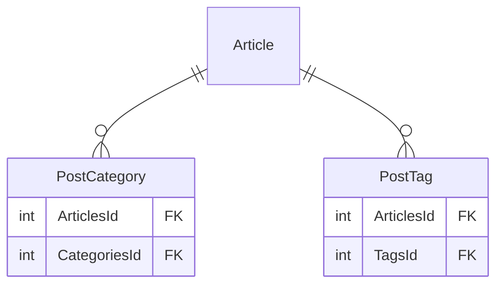
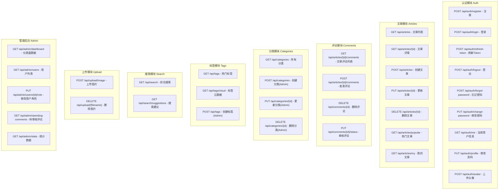
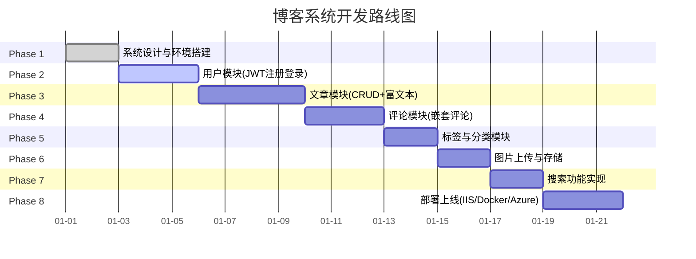

# 博客系统实战 - 系统设计与技术选型

> **项目概述**：从零构建一个功能完整的个人技术博客系统，涵盖用户认证、文章管理、评论系统、标签分类、搜索功能、图片存储和部署上线等完整企业级开发流程
>
> **项目阶段**：Phase 1 - 系统架构设计
>
> **前置知识**：ASP.NET Core Web API、Entity Framework Core、RESTful API 设计、JWT 认证
>
> **预计时间**：本篇 45 分钟 | 全部 8 篇约 20 小时

---

## 1. 项目概述

### 1.1 项目愿景

构建一个**生产级别**的个人技术博客系统，不仅具备完整的博客功能，更作为学习 ASP.NET Core 企业级开发的综合实践项目。本项目将涵盖：

- 完整的前后端分离架构（Web API + 前端）
- 企业级的认证授权体系（JWT + Refresh Token）
- 复杂的数据建模（嵌套评论、多对多关系）
- 全文搜索功能实现
- 多种部署方案实践



### 1.2 功能需求清单

#### 用户模块

| 功能 | 描述 | 优先级 |
|------|------|--------|
| 注册 | 邮箱注册、密码哈希、邮箱唯一性检查 | P0 |
| 登录 | JWT Token 登录、Refresh Token 刷新机制 | P0 |
| 修改资料 | 昵称、个人简介、头像上传 | P1 |
| 头像上传 | 图片验证、大小限制、格式校验 | P1 |

#### 文章模块

| 功能 | 描述 | 优先级 |
|------|------|--------|
| 创建文章 | Markdown/富文本编辑器支持 | P0 |
| 编辑文章 | 支持草稿箱和已发布状态 | P0 |
| 删除文章 | 软删除 + 物理删除选项 | P0 |
| 文章列表 | 分页、排序、按分类/标签筛选 | P0 |
| 文章详情 | 阅读量统计、相关文章推荐 | P0 |
| 富文本处理 | Base64 转存、Markdown 渲染 | P1 |

#### 分类与标签

| 功能 | 描述 | 优先级 |
|------|------|--------|
| 分类管理 | CRUD 操作、排序、文章数量统计 | P0 |
| 标签云 | 自动创建、使用次数统计 | P0 |
| 文章关联 | 文章与分类/标签的多对多关系 | P0 |

#### 评论模块

| 功能 | 描述 | 优先级 |
|------|------|--------|
| 发表评论 | 嵌套评论（无限层级）、内容长度限制 | P0 |
| 评论展示 | 树形结构渲染 | P0 |
| 评论审核 | Pending / Approved / Rejected 状态机 | P1 |
| 评论删除 | 级联删除或子评论提升 | P1 |
| 防刷屏限流 | IP/用户频率限制 | P1 |

#### 搜索与附加功能

| 功能 | 描述 | 优先级 |
|------|------|--------|
| 全文搜索 | 标题+内容搜索、关键词高亮 | P1 |
| RSS 订阅 | 自动生成 RSS Feed | P2 |
| 管理后台 | 仪表盘、用户管理、文章审核 | P1 |

---

## 2. 技术选型说明

### 2.1 技术栈总览



### 2.2 后端技术选型详解

| 技术选型 | 版本 | 选择理由 |
|----------|------|----------|
| **框架** | ASP.NET Core 8 Web API | 高性能、跨平台、生态完善、长期支持(LTS) |
| **ORM** | Entity Framework Core 8 | LINQ 查询、迁移工具、变更追踪成熟稳定 |
| **数据库** | SQL Server 2022 | 与 EF Core 最佳配合、全文搜索支持、JSON 支持 |
| **认证** | JWT Bearer Token | 无状态、适合前后端分离、移动端友好 |
| **对象映射** | AutoMapper 12+ | DTO 与 Entity 之间的自动映射，减少样板代码 |
| **输入验证** | FluentValidation 11+ | 声明式验证规则、复杂业务验证支持 |
| **日志** | Serilog | 结构化日志、多种 Sink（文件/Elasticsearch/Seq） |
| **API文档** | Swashbuckle/Swagger | 自动生成 OpenAPI 文档、内置测试UI |
| **缓存** | Redis (StackExchange.Redis) | 分布式缓存、Session共享、发布订阅 |
| **图片处理** | SixLabors.ImageSharp | 纯托管图像处理、跨平台、无原生依赖 |

### 2.3 前端技术选型（二选一）

#### 方案 A: Vue.js 3（推荐）

| 技术 | 用途 |
|------|------|
| Vue.js 3 | 核心框架，Composition API |
| Vite | 开发服务器和构建工具 |
| Vue Router 4 | 路由管理 |
| Pinia | 状态管理 |
| Axios | HTTP 请求 |
| Editor.js | 富文本编辑器（块编辑器） |
| markdown-it | Markdown 渲染 |
| Element Plus | UI 组件库 |
| highlight.js | 代码高亮 |

#### 方案 B: Blazor（全栈 C#）

| 技术 | 用途 |
|------|------|
| Blazor Server/WASM | 核心框架 |
| MudBlazor | UI 组件库 |
| Markdig | Markdown 解析和渲染 |
| Blazored.LocalStorage | 本地存储 |

> **本教程以后端 API 为核心**，前端部分提供接口规范和数据格式说明，可自由选择 Vue.js 或 Blazor 实现。

---

## 3. 系统架构设计

### 3.1 分层架构图



### 3.2 依赖方向原则

```
Controllers → Services → Repositories → DbContext → Database
     ↓            ↓           ↓
   DTOs      Validators    Entities
                    ↓
               AutoMapper
```

**核心原则**：
- 上层依赖下层接口（依赖倒置）
- 层间通过接口通信（依赖注入）
- Entity 不泄露到 Controller 层（DTO 隔离）

---

## 4. 数据库 ER 图设计

### 4.1 五大核心实体

```mermaid
erDiagram
    User ||--o{ Article : "writes"
    User ||--o{ Comment : "writes"
    Category ||--o{ Article : "contains"
    Tag }o--o{ Article : "tagged_with"
    Article ||--o{ Comment : "has"
    Comment ||--o{ Comment : "replies_to"

    User {
        Guid Id PK "主键GUID"
        string Email UK "唯一邮箱"
        string Nickname "昵称"
        string PasswordHash "密码哈希"
        string AvatarUrl "头像URL"
        string Bio "个人简介"
        UserRole Role "角色枚举"
        bool IsEmailConfirmed "邮箱已确认"
        DateTime CreatedAt "创建时间"
        DateTime UpdatedAt "更新时间"
        DateTime? LastLoginAt "最后登录时间"
    }

    Article {
        int Id PK "自增主键"
        string Title "标题(最大200字符)"
        string Content "内容(Markdown/HTML)"
        string Summary "摘要(自动生成)"
        string CoverImage "封面图URL"
        PostStatus Status "状态枚举"
        long ViewCount "阅读量"
        Guid AuthorId FK "作者ID"
        int? CategoryId FK "分类ID(可空)"
        DateTime PublishedAt "发布时间"
        DateTime CreatedAt "创建时间"
        DateTime UpdatedAt "更新时间"
        DateTime? DeletedAt "软删除时间"
    }

    Category {
        int Id PK "自增主键"
        string Name UK "分类名(唯一)"
        string Description "描述"
        int SortOrder "排序值"
        int ArticleCount "文章数(冗余)"
    }

    Tag {
        int Id PK "自增主键"
        string Name UK "标签名(唯一)"
        int UsageCount "使用次数"
    }

    Comment {
        int Id PK "自增主键"
        string Content "评论内容(最大2000字符)"
        Guid AuthorId FK "评论者ID"
        int ArticleId FK "所属文章ID"
        int? ParentId FK "父评论ID(自引用)"
        CommentStatus Status "审核状态"
        string IpAddress "IP地址"
        string UserAgent "浏览器UA"
        DateTime CreatedAt "创建时间"
    }
```

### 4.2 多对多关系表



### 4.3 枚举类型定义

```csharp
/// <summary>
/// 用户角色
/// </summary>
public enum UserRole
{
    SuperAdmin = 0,   // 超级管理员
    Admin = 1,         // 管理员
    Author = 2,        // 作者（可发文章）
    Reader = 3,        // 普通读者
    Banned = 99        // 封禁用户
}

/// <summary>
/// 文章状态
/// </summary>
public enum PostStatus
{
    Draft = 0,         // 草稿
    Published = 1,     // 已发布
    Archived = 2,      // 归档
    Deleted = 99       // 已删除（软删除）
}

/// <summary>
/// 评论审核状态
/// </summary>
public enum CommentStatus
{
    Pending = 0,       // 待审核
    Approved = 1,      // 已通过
    Rejected = 2,      // 已拒绝
    Spam = 99          // 垃圾信息
}
```

---

## 5. API 接口规划

### 5.1 接口清单（RESTful 设计）



### 5.2 统一响应格式

```csharp
/// <summary>
/// 统一成功响应
/// </summary>
public class ApiResponse<T>
{
    public bool Success { get; set; } = true;
    public T? Data { get; set; }
    public string Message { get; set; } = "操作成功";
    public PaginationMeta? Pagination { get; set; }  // 分页元数据
}

/// <summary>
/// 分页元数据
/// </summary>
public class PaginationMeta
{
    public int CurrentPage { get; set; }
    public int PageSize { get; set; }
    public int TotalCount { get; set; }
    public int TotalPages => (int)Math.Ceiling(TotalCount / (double)PageSize);
    public bool HasPrevious => CurrentPage > 1;
    public bool HasNext => CurrentPage < TotalPages;
}

/// <summary>
/// 统一错误响应
/// </summary>
public class ErrorResponse
{
    public bool Success { get; set; } = false;
    public string Code { get; set; } = string.Empty;
    public string Message { get; set; } = string.Empty;
    public List<ValidationError>? Errors { get; set; }  // 字段级错误详情
    public string TraceId { get; set; } = string.Empty; // 追踪ID
}

public record ValidationError(string Field, string Message);
```

### 5.3 响应示例

```json
// 成功响应 - 单个资源
{
  "success": true,
  "data": {
    "id": 1,
    "title": "ASP.NET Core 入门指南",
    "authorName": "技术作者",
    "viewCount": 1520
  },
  "message": "获取成功"
}

// 成功响应 - 分页列表
{
  "success": true,
  "data": [
    { "id": 1, "title": "..." },
    { "id": 2, "title": "..." }
  ],
  "pagination": {
    "currentPage": 1,
    "pageSize": 10,
    "totalCount": 25,
    "totalPages": 3,
    "hasPrevious": false,
    "hasNext": true
  }
}

// 错误响应
{
  "success": false,
  "code": "VALIDATION_ERROR",
  "message": "请求参数验证失败",
  "errors": [
    { "field": "Title", "message": "标题不能为空" },
    { "field": "Content", "message": "内容至少需要10个字符" }
  ],
  "traceId": "00-abc123-def456-01"
}
```

---

## 6. 目录结构设计

### 6.1 后端项目结构

```
BlogApi/
├── BlogApi.sln                          # 解决方案文件
├── src/
│   ├── BlogApi/                         # 主项目（Web API）
│   │   ├── BlogApi.csproj
│   │   ├── Program.cs                   # 入口点和DI配置
│   │   ├── appsettings.json             # 配置文件
│   │   ├── appsettings.Development.json
│   │   │
│   │   ├── Controllers/                 # API控制器
│   │   │   ├── AuthController.cs        # 认证（注册/登录/Token刷新）
│   │   │   ├── ArticlesController.cs    # 文章CRUD
│   │   │   ├── CommentsController.cs    # 评论管理
│   │   │   ├── CategoriesController.cs  # 分类管理
│   │   │   ├── TagsController.cs        # 标签管理
│   │   │   ├── SearchController.cs      # 搜索功能
│   │   │   ├── UploadController.cs      # 文件上传
│   │   │   └── AdminController.cs       # 管理后台
│   │   │
│   │   ├── Models/
│   │   │   ├── Entities/                # 数据库实体
│   │   │   │   ├── User.cs
│   │   │   │   ├── Article.cs
│   │   │   │   ├── Category.cs
│   │   │   │   ├── Tag.cs
│   │   │   │   └── Comment.cs
│   │   │   ├── Enums/                   # 枚举定义
│   │   │   │   ├── UserRole.cs
│   │   │   │   ├── PostStatus.cs
│   │   │   │   └── CommentStatus.cs
│   │   │   ├── Dtos/                    # 数据传输对象
│   │   │   │   ├── Auth/
│   │   │   │   │   ├── RegisterRequestDto.cs
│   │   │   │   │   ├── LoginRequestDto.cs
│   │   │   │   │   ├── LoginResponseDto.cs
│   │   │   │   │   └── RefreshTokenDto.cs
│   │   │   │   ├── Articles/
│   │   │   │   │   ├── CreateArticleDto.cs
│   │   │   │   │   ├── UpdateArticleDto.cs
│   │   │   │   │   ├── ArticleDto.cs
│   │   │   │   │   └── ArticleListItemDto.cs
│   │   │   │   ├── Comments/
│   │   │   │   └── Common/
│   │   │   │       ├── ApiResponse.cs
│   │   │   │       ├── ErrorResponse.cs
│   │   │   │       ├── PagedResult.cs
│   │   │   │       └── PaginationMeta.cs
│   │   │   └── ViewModels/              # 视图模型（可选）
│   │   │
│   │   ├── Services/                    # 业务服务层
│   │   │   ├── Interfaces/              # 服务接口
│   │   │   │   ├── IAuthService.cs
│   │   │   │   ├── IArticleService.cs
│   │   │   │   ├── ICommentService.cs
│   │   │   │   ├── ICategoryService.cs
│   │   │   │   ├── ITagService.cs
│   │   │   │   ├── ISearchService.cs
│   │   │   │   ├── IUploadService.cs
│   │   │   │   └── IAdminService.cs
│   │   │   └── Implementations/         # 服务实现
│   │   │       ├── AuthService.cs
│   │   │       ├── ArticleService.cs
│   │   │       ├── CommentService.cs
│   │   │       ├── CategoryService.cs
│   │   │       ├── TagService.cs
│   │   │       ├── SearchService.cs
│   │   │       ├── UploadService.cs
│   │   │       └── AdminService.cs
│   │   │
│   │   ├── Data/                        # 数据访问层
│   │   │   ├── ApplicationDbContext.cs  # EF Core DbContext
│   │   │   ├── Interfaces/
│   │   │   │   ├── IArticleRepository.cs
│   │   │   │   ├── IUserRepository.cs
│   │   │   │   └── IRepository.cs        # 泛型仓库接口
│   │   │   ├── Repositories/
│   │   │   │   ├── ArticleRepository.cs
│   │   │   │   ├── UserRepository.cs
│   │   │   │   └── Repository.cs         # 泛型仓库实现
│   │   │   ├── Configurations/           # EF Core实体配置
│   │   │   │   ├── UserConfiguration.cs
│   │   │   │   ├── ArticleConfiguration.cs
│   │   │   │   └── CommentConfiguration.cs
│   │   │   └── Migrations/              # 数据库迁移
│   │   │       ├── 20240101_InitialCreate.cs
│   │   │       └── ...
│   │   │
│   │   ├── Helpers/                     # 辅助类
│   │   │   ├── JwtHelper.cs             # JWT工具类
│   │   │   ├── SlugGenerator.cs         # URL Slug生成
│   │   │   ├── ImageProcessor.cs        # 图片处理
│   │   │   └── IpRateLimitMiddleware.cs # IP限流中间件
│   │   │
│   │   ├── Middleware/                  # 自定义中间件
│   │   │   ├── ExceptionHandlingMiddleware.cs
│   │   │   ├── RequestLoggingMiddleware.cs
│   │   │   └── RateLimitingMiddleware.cs
│   │   │
│   │   ├── Filters/                     # Action过滤器
│   │   │   ├── ValidateModelAttribute.cs
│   │   │   └── ApiKeyAuthAttribute.cs
│   │   │
│   │   ├── Extensions/                  # 扩展方法
│   │   │   ├── ServiceCollectionExtensions.cs
│   │   │   ├── ApplicationBuilderExtensions.cs
│   │   │   └── HttpContextExtensions.cs
│   │   │
│   │   └── wwwroot/
│   │       └── uploads/                 # 上传文件目录
│   │
│   ├── BlogApi.Core/                    # 核心域层（可选，用于复杂项目）
│   │   ├── Entities/
│   │   ├── ValueObjects/
│   │   ├── Interfaces/
│   │   └── Exceptions/
│   │
│   └── BlogApi.Infrastructure/          # 基础设施层（可选）
│       ├── ExternalServices/
│       ├── Persistence/
│       └── Messaging/
│
├── tests/
│   ├── BlogApi.UnitTests/               # 单元测试
│   │   ├── Services/
│   │   └── Controllers/
│   │
│   └── BlogApi.IntegrationTests/        # 集成测试
│       ├── Fixtures/
│       └── Controllers/
│
├── docker-compose.yml                   # Docker编排
├── Dockerfile                          # 应用镜像
├── .github/workflows/                  # GitHub Actions
│   └── ci-cd.yml
├── .env.example                        # 环境变量模板
└── README.md                           # 项目说明
```

### 6.2 配置文件结构

```json
// appsettings.json
{
  "ConnectionStrings": {
    "DefaultConnection": "Server=(localdb)\\mssqllocaldb;Database=BlogDb;Trusted_Connection=True;"
  },
  "Redis": {
    "ConnectionString": "localhost:6379"
  },
  "JwtSettings": {
    "SecretKey": "your-256-bit-secret-key-at-least-32-chars!!",
    "Issuer": "BlogApi",
    "Audience": "BlogApiClient",
    "AccessTokenExpirationMinutes": 30,
    "RefreshTokenExpirationDays": 7
  },
  "UploadSettings": {
    "MaxFileSizeMB": 5,
    "AllowedExtensions": [ ".jpg", ".jpeg", ".png", ".gif", ".webp" ],
    "UploadPath": "wwwroot/uploads"
  },
  "CommentSettings": {
    "MaxContentLength": 2000,
    "MaxNestingLevel": 5,
    "RateLimitPerMinute": 3,
    "AutoApproveForAuthor": true
  },
  "SearchSettings": {
    "MaxResults": 50,
    "HighlightTag": "<mark>",
    "CacheResultsSeconds": 300
  },
  "Logging": {
    "LogLevel": {
      "Default": "Information",
      "Microsoft.AspNetCore": "Warning"
    }
  },
  "AllowedHosts": "*"
}
```

---

## 7. 开发里程碑规划

### 7.1 八大阶段路线图



### 7.2 各阶段交付物

| 阶段 | 教程名称 | 交付物 | 代码量估算 |
|------|---------|--------|-----------|
| Phase 1 | **系统设计与技术选型** | ER图、目录结构、API规划、配置模板 | ~500行 |
| Phase 2 | **用户模块** | AuthController、AuthService、JWT Helper、完整认证流程 | ~800行 |
| Phase 3 | **文章模块** | PostsController、ArticleService、DTO集、Markdown处理 | ~1000行 |
| Phase 4 | **评论模块** | CommentsController、递归查询、树形构建算法 | ~700行 |
| Phase 5 | **标签与分类** | CategoriesController、TagsController、多对多关系 | ~500行 |
| Phase 6 | **图片上传** | UploadController、ImageSharp处理、文件管理 | ~600行 |
| Phase 7 | **搜索功能** | SearchController、关键词高亮、结果缓存 | ~500行 |
| Phase 8 | **部署上线** | Dockerfile、docker-compose、IIS配置、CI/CD流水线 | ~400行 |

**总计预估代码量**: ~5000 行高质量生产级代码

---

## 8. 下一步指引

完成本阶段的系统设计后，你将拥有：

- [x] 清晰的功能需求清单和优先级
- [x] 完整的数据库 ER 图（5大实体 + 关联表）
- [x] 约 30 个 RESTful API 端点规划
- [x] 统一的请求/响应格式定义
- [x] 规范的项目目录结构
- [x] 合理的技术选型和版本锁定
- [x] 明确的开发里程碑计划

**下一篇**：【用户模块 (JWT 注册登录)】—— 从认证模块开始编码，实现注册、登录、Token 刷新的完整流程。

---

**参考资源**：
- [微软官方分层架构指南](https://docs.microsoft.com/zh-cn/dotnet/architecture/modern-web-apps-azure/common-web-application-architectures)
- [Clean Architecture .NET](https://docs.microsoft.com/zh-cn/dotnet/architecture/clean-architecture/)
- [RESTful API 设计最佳实践](../01-RESTful-API/01-REST原则与最佳实践.md)

**思考题**：
1. 为什么选择 JWT 而非 Session/Cookie 作为认证方案？在什么场景下 Cookie 更合适？
2. 评论的自引用关系（ParentId）在实际查询中可能遇到什么性能问题？如何优化？
3. 如果博客系统未来要支持多租户（多个独立博客），当前的设计需要做哪些调整？
