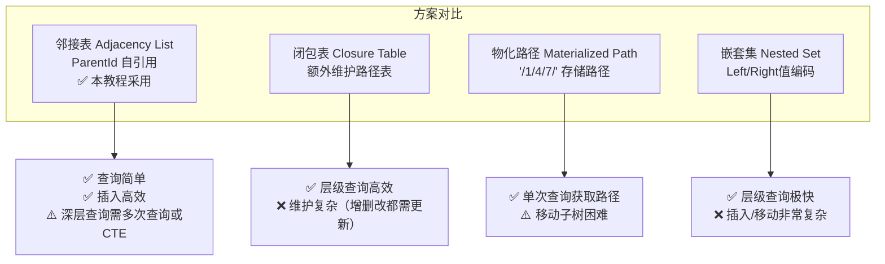
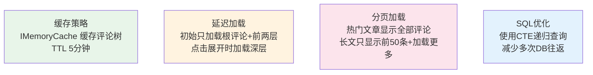

# 博客系统实战 - 评论模块 (嵌套评论)

> **项目阶段**：Phase 4 - 交互功能
>
> **核心目标**：实现支持无限层级的嵌套评论系统，包括邻接表数据模型、递归查询构建树形结构、评论审核机制、防刷屏限流和前端树形展示算法
>
> **前置知识**：[文章模块(CRUD + 富文本)](文章模块(CRUD + 富文本).md)、EF Core 导航属性、递归算法基础
>
> **预计时间**：55分钟

---

## 1. 模块概览

### 1.1 嵌套评论的需求场景

```
文章: "ASP.NET Core 入门完全指南"

├── [用户A] 写得很好！感谢分享 👍 (Level 0 - 根评论)
│   ├── [用户B] 同意！特别是DI那部分讲得很清楚 (Level 1)
│   │   └── [用户C] DI容器我推荐用Scrutor，更方便 (Level 2)
│   │       └── [用户B] 谢谢推荐，我去看看 (Level 3)
│   └── [用户D] 有没有视频教程版本？ (Level 1)
│       └── [用户A] B站上有完整系列 (Level 2)
├── [用户E] 第5节的代码有个小bug... (Level 0 - 根评论)
│   └── [用户F] 确实，应该是 await 而不是直接调用 (Level 1)
└── [用户G] 收藏了，慢慢看 📚 (Level 0 - 根评论)
```

### 1.2 数据结构选择



**本博客系统选择邻接表模式**，原因：
- 实现简单直观
- 评论层级通常不超过 5-6 层（性能可接受）
- 配合内存中的树构建算法足够高效

---

## 2. Comment 实体与配置

### 2.1 Comment 实体（自引用）

```csharp
using System.ComponentModel.DataAnnotations;
using System.ComponentModel.DataAnnotations.Schema;

namespace BlogApi.Models.Entities;

[Table("Comments")]
public class Comment : BaseEntity
{
    [Key]
    [DatabaseGenerated(DatabaseGeneratedOption.Identity)]
    public int Id { get; set; }

    /// <summary>
    /// 评论内容（纯文本，不支持富文本以防止XSS）
    /// </summary>
    [Required]
    [MinLength(1)]
    [MaxLength(2000, ErrorMessage = "评论内容不能超过2000字符")]
    public string Content { get; set; } = string.Empty;

    /// <summary>
    /// 评论者ID
    /// </summary>
    [Required]
    public Guid AuthorId { get; set; }

    /// <summary>
    /// 所属文章ID
    /// </summary>
    [Required]
    public int ArticleId { get; set; }

    /// <summary>
    /// 父评论ID（null表示根评论）
    /// </summary>
    public int? ParentId { get; set; }

    /// <summary>
    /// 审核状态
    /// </summary>
    [Required]
    public CommentStatus Status { get; set; } = CommentStatus.Pending;

    /// <summary>
    /// 发表时的IP地址（用于限流和反垃圾）
    /// </summary>
    [MaxLength(45)]  // IPv6最长45字符
    public string? IpAddress { get; set; }

    /// <summary>
    /// 浏览器User-Agent
    /// </summary>
    [MaxLength(500)]
    public string? UserAgent { get; set; }

    // ====== 冗余字段（优化查询性能）======

    /// <summary>
    /// 当前层级深度（根评论为0，其子评论为1...）
    /// </summary>
    public int Depth { get; set; } = 0;

    /// <summary>
    /// 根评论ID（用于快速查找某条评论所属的整个评论树）
    /// </summary>
    public int? RootCommentId { get; set; }

    /// <summary>
    /// 该评论的直接回复数（不含更深层的子回复）
    /// </summary>
    public int DirectReplyCount { get; set; } = 0;

    // ====== 导航属性 ======

    [ForeignKey(nameof(AuthorId))]
    public User? Author { get; set; }

    [ForeignKey(nameof(ArticleId))]
    public Article? Article { get; set; }

    /// <summary>
    /// 父评论引用
    /// </summary>
    [ForeignKey(nameof(ParentId))]
    public Comment? Parent { get; set; }

    /// <summary>
    /// 子评论集合
    /// </summary>
    public ICollection<Comment> Children { get; set; } = new List<Comment>();

    /// <summary>
    /// 根评论引用
    /// </summary>
    [ForeignKey(nameof(RootCommentId))]
    public Comment? RootComment { get; set; }
}
```

### 2.2 EF Core 实体配置

```csharp
using Microsoft.EntityFrameworkCore;
using Microsoft.EntityFrameworkCore.Metadata.Builders;

namespace BlogApi.Data.Configurations;

public class CommentConfiguration : IEntityTypeConfiguration<Comment>
{
    public void Configure(EntityTypeBuilder<Comment> builder)
    {
        builder.ToTable("Comments");

        builder.HasKey(c => c.Id);

        // 文章外键索引（快速查询某文章的所有评论）
        builder.HasIndex(c => c.ArticleId);

        // 作者索引
        builder.HasIndex(c => c.AuthorId);

        // 父评论索引（快速查找子评论）
        builder.HasIndex(c => c.ParentId);

        // 根评论索引
        builder.HasIndex(c => c.RootCommentId);

        // 状态索引（快速筛选已通过的评论）
        builder.HasIndex(c => c.Status);

        // 创建时间索引（按时间排序）
        builder.HasIndex(c => c.CreatedAt);

        // IP地址索引用于限流
        builder.HasIndex(c => c.IpAddress);

        // ====== 自引用关系配置 ======

        // 父->子关系
        builder.HasOne(c => c.Parent)
            .WithMany(c => c.Children)
            .HasForeignKey(c => c.ParentId)
            .OnDelete(DeleteBehavior.Restrict);  // 不级联删除父评论

        // 评论->根评论关系
        builder.HasOne(c => c.RootComment)
            .WithMany()
            .HasForeignKey(c => c.RootCommentId)
            .OnDelete(DeleteBehavior.Restrict);
    }
}
```

---

## 3. DTO 设计

```csharp
using System.ComponentModel.DataAnnotations;

namespace BlogApi.Models.Dtos.Comments;

/// <summary>
/// 创建评论请求 DTO
/// </summary>
public class CreateCommentDto
{
    /// <example>这篇文章写得非常好！</example>
    [Required(ErrorMessage = "评论内容不能为空")]
    [MinLength(1, ErrorMessage = "评论内容不能为空")]
    [MaxLength(2000, ErrorMessage = "评论内容不能超过2000字符")]
    public string Content { get; set; } = string.Empty;

    /// <summary>
    /// 父评论ID（不填则为根评论）
    /// </summary>
    /// <example>42</example>
    public int? ParentId { get; set; }
}

/// <summary>
/// 更新评论状态请求 DTO（管理员用）
/// </summary>
public class UpdateCommentStatusDto
{
    [Required]
    public CommentStatus Status { get; set; }
    public string? Reason { get; set; }
}

/// <summary>
/// 评论树节点 DTO（用于API响应）
/// </summary>
public record CommentTreeNodeDto(
    int Id,
    string Content,
    int Depth,
    DateTime CreatedAt,
    CommentAuthorDto Author,
    int? ParentId,
    List<CommentTreeNodeDto> Children           // 子评论列表（树形结构）
);

/// <summary>
/// 评论作者简要信息
/// </summary>
public record CommentAuthorDto(Guid Id, string Nickname, string? AvatarUrl);

/// <summary>
/// 评论扁平列表项 DTO（用于管理后台）
/// </summary>
public record CommentListItemDto(
    int Id,
    string Content,
    CommentStatus Status,
    CommentAuthorDto Author,
    string? ArticleTitle,
    int? ParentId,
    int Depth,
    int DirectReplyCount,
    string? IpAddress,
    DateTime CreatedAt
);

/// <summary>
/// 评论统计 DTO
/// </summary>
public record CommentStatsDto(int TotalCount, int PendingCount, int ApprovedCount);
```

---

## 4. CommentService 完整实现

```csharp
using System.Security.Cryptography;
using BlogApi.Data;
using BlogApi.Models.Dtos.Comments;
using BlogApi.Models.Entities;
using Microsoft.EntityFrameworkCore;
using Microsoft.Extensions.Caching.Memory;
using Microsoft.Extensions.Logging;

namespace BlogApi.Services.Implementations;

public class CommentService : ICommentService
{
    private readonly ApplicationDbContext _db;
    private readonly ILogger<CommentService> _logger;
    private readonly IMemoryCache _cache;
    private const int MaxNestingLevel = 5;     // 最大嵌套层级
    private const int MaxContentLength = 2000;  // 最大内容长度
    private const int RateLimitPerMinute = 3;   // 每分钟最多评论数

    public CommentService(ApplicationDbContext db,
        ILogger<CommentService> logger, IMemoryCache cache)
    {
        _db = db;
        _logger = logger;
        _cache = cache;
    }

    #region 发表评论

    /// <summary>
    /// 发表评论（含限流、敏感词过滤、层级校验）
    /// </summary>
    public async Task<CommentTreeNodeDto> CreateAsync(CreateCommentDto dto,
        int articleId, Guid authorId, string? ipAddress = null,
        string? userAgent = null)
    {
        // 1. 验证文章存在且已发布
        var article = await _db.Articles.FindAsync(articleId)
            ?? throw new NotFoundException($"文章 {articleId} 不存在");

        if (article.Status != PostStatus.Published)
            throw new InvalidOperationException("只能对已发布的文章发表评论");

        // 2. 内容校验与清理
        var content = CleanContent(dto.Content);
        if (string.IsNullOrWhiteSpace(content))
            throw new ArgumentException("评论内容不能仅包含空白字符或特殊符号");

        // 3. 敏感词过滤
        if (ContainsSensitiveWord(content))
        {
            throw new InvalidOperationException("评论内容包含不当词汇");
        }

        // 4. 限流检查
        await CheckRateLimitAsync(authorId, ipAddress);

        // 5. 处理父评论逻辑
        int depth = 0;
        int? rootCommentId = null;

        if (dto.ParentId.HasValue)
        {
            var parentComment = await _db.Comments
                .FirstOrDefaultAsync(c => c.Id == dto.ParentId.Value &&
                    c.ArticleId == articleId && c.Status == CommentStatus.Approved)
                ?? throw new NotFoundException("父评论不存在或未通过审核");

            // 层级限制校验
            if (parentComment.Depth >= MaxNestingLevel - 1)
            {
                throw new InvalidOperationException(
                    $"评论嵌套层级已达上限({MaxNestingLevel}层)，请直接回复文章或较上层的评论");
            }

            depth = parentComment.Depth + 1;
            rootCommentId = parentComment.RootCommentId ?? parentComment.Id;

            // 更新父评论的直接回复计数
            parentComment.DirectReplyCount++;
            _db.Comments.Update(parentComment);
        }

        // 6. 创建评论实体
        var comment = new Comment
        {
            Content = content,
            AuthorId = authorId,
            ArticleId = articleId,
            ParentId = dto.ParentId,
            Status = CommentStatus.Pending,  // 默认待审核
            IpAddress = ipAddress,
            UserAgent = userAgent?.Substring(0, Math.Min(255, userAgent.Length)),
            Depth = depth,
            RootCommentId = rootCommentId,
            CreatedAt = DateTime.UtcNow
        };

        await _db.Comments.AddAsync(comment);
        await _db.SaveChangesAsync();

        // 7. 自动审核：信任的用户自动通过
        var author = await _db.Users.FindAsync(authorId);
        if (author != null && IsTrustedUser(author))
        {
            comment.Status = CommentStatus.Approved;
            _db.Comments.Update(comment);
            await _db.SaveChangesAsync();

            // 更新文章评论计数缓存
            await InvalidateArticleCommentCacheAsync(articleId);
        }

        _logger.LogInformation("新评论创建: Id={Id}, Article={Article}, Author={Author}, Parent={Parent}",
            comment.Id, articleId, authorId, dto.ParentId);

        return MapToTreeNodeDto(comment);
    }

    #endregion

    #region 获取评论树

    /// <summary>
    /// 获取某篇文章下的所有评论（构建为树形结构返回）
    /// </summary>
    public async Task<List<CommentTreeNodeDto>> GetCommentTreeAsync(int articleId)
    {
        // 尝试从缓存获取
        var cacheKey = $"comments:tree:{articleId}";
        if (_cache.TryGetValue(cacheKey, out List<CommentTreeNodeDto>? cached))
            return cached!;

        // 1. 查询该文章所有已通过的评论（按时间正序排列）
        var comments = await _db.Comments
            .Include(c => c.Author)
            .Where(c => c.ArticleId == articleId &&
                    c.Status == CommentStatus.Approved)
            .OrderBy(c => c.CreatedAt)
            .ToListAsync();

        // 2. 构建树形结构
        var tree = BuildCommentTree(comments);

        // 缓存5分钟
        _cache.Set(cacheKey, tree, TimeSpan.FromMinutes(5));

        return tree;
    }

    /// <summary>
    /// 将扁平评论列表构建为树形结构
    /// 核心算法：使用字典建立父子映射，O(n)时间复杂度
    /// </summary>
    private static List<CommentTreeNodeDto> BuildCommentTree(List<Comment> flatComments)
    {
        if (flatComments.Count == 0) return new();

        // 1. 所有评论转为DTO并存入字典
        var dict = flatComments.ToDictionary(
            c => c.Id,
            c => new CommentTreeNodeDto(
                c.Id,
                c.Content,
                c.Depth,
                c.CreatedAt,
                new CommentAuthorDto(c.Author!.Id, c.Author.Nickname, c.Author.AvatarUrl),
                c.ParentId,
                new List<CommentTreeNodeDto>()  // 初始子列表为空
            ));

        // 2. 根评论列表
        var roots = new List<CommentTreeNodeDto>();

        foreach (var kvp in dict)
        {
            var node = kvp.Value;
            if (node.ParentId.HasValue && dict.TryGetValue(node.ParentId.Value, out var parentNode))
            {
                // 有父节点 -> 加入父节点的Children列表
                parentNode.Children.Add(node);
            }
            else
            {
                // 无父节点 -> 是根评论
                roots.Add(node);
            }
        }

        return roots;
    }

    #endregion

    #region 删除评论

    /// <summary>
    /// 删除评论（策略：软删除 + 子评论提升）
    /// </summary>
    public async Task DeleteAsync(int commentId, Guid userId, bool isAdmin = false)
    {
        var comment = await _db.Comments
            .Include(c => c.Children)  // 加载子评论
            .FirstOrDefaultAsync(c => c.Id == commentId)
            ?? throw new NotFoundException($"评论 {commentId} 不存在");

        // 权限校验
        if (!isAdmin && comment.AuthorId != userId)
            throw new UnauthorizedAccessException("无权删除此评论");

        // 获取所有后代评论ID
        var allDescendantIds = GetAllDescendantIds(comment);

        // 策略选择：
        // 方案A（推荐）：将内容替换为"已删除"，保留结构
        comment.Content = "[该评论已被删除]";
        comment.Status = CommentStatus.Rejected;
        comment.UserAgent = null;
        comment.IpAddress = null;

        // 更新数据库
        _db.Comments.Update(comment);
        await _db.SaveChangesAsync();

        // 清除相关缓存
        await InvalidateArticleCommentCacheAsync(comment.ArticleId);

        _logger.LogInformation("评论已删除: Id={Id}, Descendants={DescendantCount}",
            commentId, allDescendantIds.Count);
    }

    /// <summary>
    /// 递归获取所有后代评论ID
    /// </summary>
    private static List<int> GetAllDescendantIds(Comment comment)
    {
        var ids = new List<int>();
        CollectDescendantIds(comment, ids);
        return ids;
    }

    private static void CollectDescendantIds(Comment comment, List<int> ids)
    {
        foreach (var child in comment.Children)
        {
            ids.Add(child.Id);
            CollectDescendantIds(child, ids);  // 递归
        }
    }

    #endregion

    #region 评论审核

    /// <summary>
    /// 更新评论审核状态（管理员功能）
    /// </summary>
    public async Task ApproveOrRejectAsync(int commentId, UpdateCommentStatusDto dto)
    {
        var comment = await _db.Comments.FindAsync(commentId)
            ?? throw new NotFoundException($"评论 {commentId} 不存在");

        comment.Status = dto.Status;
        comment.UpdatedAt = DateTime.UtcNow;

        _db.Comments.Update(comment);
        await _db.SaveChangesAsync();

        // 如果是通过审核，更新文章评论数
        if (dto.Status == CommentStatus.Approved)
        {
            await InvalidateArticleCommentCacheAsync(comment.ArticleId);
        }

        _logger.LogInformation("评论审核: Id={Id}, NewStatus={Status}, Reason={Reason}",
            commentId, dto.Status, dto.Reason);
    }

    /// <summary>
    /// 批量审核（管理员批量操作）
    /// </summary>
    public async Task BatchApproveAsync(List<int> commentIds)
    {
        var comments = await _db.Comments
            .Where(c => commentIds.Contains(c.Id))
            .ToListAsync();

        foreach (var comment in comments)
        {
            comment.Status = CommentStatus.Approved;
        }

        await _db.SaveChangesAsync();

        // 清除所有涉及文章的缓存
        var affectedArticleIds = comments.Select(c => c.ArticleId).Distinct().ToList();
        foreach (var articleId in affectedArticleIds)
        {
            await InvalidateArticleCommentCacheAsync(articleId);
        }

        _logger.LogInformation("批量审核通过: Count={Count}", comments.Count);
    }

    /// <summary>
    /// 获取待审核评论列表
    /// </summary>
    public async Task<PagedResult<CommentListItemDto>> GetPendingCommentsAsync(
        int page = 1, int pageSize = 20)
    {
        page = Math.Max(1, page);
        pageSize = Math.Clamp(pageSize, 1, 100);

        var query = _db.Comments
            .Include(c => c.Author)
            .Include(c => c.Article)
            .Where(c => c.Status == CommentStatus.Pending)
            .OrderByDescending(c => c.CreatedAt);

        var totalCount = await query.CountAsync();

        var items = await query
            .Skip((page - 1) * pageSize)
            .Take(pageSize)
            .Select(c => new CommentListItemDto(
                c.Id, c.Content, c.Status,
                new CommentAuthorDto(c.Author!.Id, c.Author.Nickname, c.Author.AvatarUrl),
                c.Article!.Title,
                c.ParentId, c.Depth, c.DirectReplyCount,
                c.IpAddress, c.CreatedAt
            ))
            .ToListAsync();

        return new PagedResult<CommentListItemDto>
        {
            Items = items,
            TotalCount = totalCount,
            Page = page,
            PageSize = pageSize
        };
    }

    #endregion

    #region 统计

    /// <summary>
    /// 获取文章评论统计
    /// </summary>
    public async Task<CommentStatsDto> GetStatsByArticleAsync(int articleId)
    {
        var total = await _db.Comments
            .CountAsync(c => c.ArticleId == articleId && c.Status != PostStatus.Deleted);

        var pending = await _db.Comments
            .CountAsync(c => c.ArticleId == articleId && c.Status == CommentStatus.Pending);

        var approved = await _db.Comments
            .CountAsync(c => c.ArticleId == articleId && c.Status == CommentStatus.Approved);

        return new CommentStatsDto(total, pending, approved);
    }

    /// <summary>
    /// 更新文章的评论计数（在评论状态变更时调用）
    /// </summary>
    public async Task UpdateArticleCommentCountAsync(int articleId)
    {
        var count = await _db.Comments
            .CountAsync(c => c.ArticleId == articleId && c.Status == CommentStatus.Approved);

        await _db.Articles
            .Where(a => a.Id == articleId)
            .ExecuteUpdateAsync(setters =>
                setters.SetProperty(a => a.CommentCount, count));
    }

    #endregion

    #region 辅助方法

    /// <summary>
    /// 清理评论内容（去除多余空白、HTML标签等）
    /// </summary>
    private static string CleanContent(string content)
    {
        // 去除首尾空白
        content = content.Trim();

        // 合并多个连续空白为一个空格
        while (content.Contains("  "))
            content = content.Replace("  ", " ");

        // 移除 HTML 标签（防止XSS攻击）
        content = System.Text.RegularExpressions.Regex.Replace(
            content, "<[^>]*>", "");

        // 移除控制字符
        content = new string(content.Where(c =>
            !char.IsControl(c) || c == '\n' || c == '\r' || c == '\t').ToArray());

        return content;
    }

    /// <summary>
    /// 简单的敏感词检测（生产环境应使用专业的DFA算法库）
    /// </summary>
    private static bool ContainsSensitiveWord(string content)
    {
        // 示例敏感词列表（实际应用中应从配置文件或数据库加载）
        var sensitiveWords = new[]
        {
            "广告", "推广", "加微信", "QQ群", "刷单",
            "代写", "代做", "作弊", "破解", "盗版"
        };

        var lowerContent = content.ToLowerInvariant();
        return sensitiveWords.Any(word => lowerContent.Contains(word.ToLowerInvariant()));
    }

    /// <summary>
    /// 限流检查（同一用户/IP每分钟不超过 N 条评论）
    /// </summary>
    private async Task CheckRateLimitAsync(Guid userId, string? ipAddress)
    {
        var oneMinuteAgo = DateTime.UtcNow.AddMinutes(-1);

        // 按用户限流
        var userRecentCount = await _db.Comments
            .CountAsync(c => c.AuthorId == userId && c.CreatedAt > oneMinuteAgo);

        if (userRecentCount >= RateLimitPerMinute)
        {
            throw new InvalidOperationException(
                $"操作过于频繁，请{60 - (int)(DateTime.UtcNow -
                    (await _db.Comments
                        .Where(c => c.AuthorId == userId)
                        .OrderByDescending(c => c.CreatedAt)
                        .FirstAsync()).CreatedAt
                    ).TotalSeconds}秒后再试");
        }

        // 按IP限流（防多账号刷屏）
        if (!string.IsNullOrEmpty(ipAddress))
        {
            var ipRecentCount = await _db.Comments
                .CountAsync(c => c.IpAddress == ipAddress && c.CreatedAt > oneMinuteAgo);

            if (ipRecentCount >= RateLimitPerMinute * 2)  // IP限制稍宽松
            {
                throw new InvalidOperationException("当前IP操作频率过高，请稍后重试");
            }
        }
    }

    /// <summary>
    /// 判断是否为可信用户（自动通过审核）
    /// </summary>
    private static bool IsTrustedUser(User user)
    {
        // 规则：注册超过7天 且 发表过至少3篇已审核通过的文章
        // 或者是 Admin/Author 角色
        return user.Role is UserRole.Admin or UserRole.SuperAdmin or UserRole.Author ||
               (user.IsEmailConfirmed &&
                user.CreatedAt < DateTime.UtcNow.AddDays(-7));
    }

    /// <summary>
    /// 使文章评论缓存失效
    /// </summary>
    private async Task InvalidateArticleCommentCacheAsync(int articleId)
    {
        _cache.Remove($"comments:tree:{articleId}");
        await UpdateArticleCommentCountAsync(articleId);
    }

    private static CommentTreeNodeDto MapToTreeNodeDto(Comment c) => new(
        c.Id, c.Content, c.Depth, c.CreatedAt,
        new CommentAuthorDto(c.Author?.Id ?? Guid.Empty,
            c.Author?.Nickname ?? "未知用户", c.Author?.AvatarUrl),
        c.ParentId, new List<CommentTreeNodeDto>()
    );

    #endregion
}
```

---

## 5. CommentsController 完整代码

```csharp
using System.Security.Claims;
using BlogApi.Models.Dtos.Comments;
using BlogApi.Services.Interfaces;
using Microsoft.AspNetCore.Authorization;
using Microsoft.AspNetCore.Mvc;

namespace BlogApi.Controllers;

[ApiController]
[Route("api/articles/{articleId:int}/comments")]
[Produces("application/json")]
public class CommentsController : ControllerBase
{
    private readonly ICommentService _commentService;
    private readonly ILogger<CommentsController> _logger;

    public CommentsController(ICommentService commentService,
        ILogger<CommentsController> logger)
    {
        _commentService = commentService;
        _logger = logger;
    }

    /// <summary>
    /// 获取文章下的评论树
    /// </summary>
    [HttpGet]
    [ProducesResponseType(typeof(ApiResponse<List<CommentTreeNodeDto>>), 200)]
    public async Task<IActionResult> GetComments(int articleId)
    {
        try
        {
            var tree = await _commentService.GetCommentTreeAsync(articleId);
            return Ok(new ApiResponse<List<CommentTreeNodeDto>>
            {
                Data = tree,
                Message = "获取成功"
            });
        }
        catch (Exception ex)
        {
            _logger.LogError(ex, "获取评论失败: ArticleId={ArticleId}", articleId);
            return Ok(new ApiResponse<List<CommentTreeNodeDto>>
            {
                Data = new(),
                Message = "获取成功"  // 即使出错也返回空列表而非错误
            });
        }
    }

    /// <summary>
    /// 发表评论
    /// </summary>
    [HttpPost]
    [Authorize]
    [EnableRateLimiting(policyName: "CommentRateLimit")]
    [ProducesResponseType(typeof(ApiResponse<CommentTreeNodeDto>), 201)]
    [ProducesResponseType(typeof(ErrorResponse), 400)]
    [ProducesResponseType(typeof(ErrorResponse), 429)]
    public async Task<IActionResult> CreateComment(
        int articleId, [FromBody] CreateCommentDto dto)
    {
        var userId = GetCurrentUserId();
        var ipAddress = HttpContext.Connection.RemoteIpAddress?.ToString();
        var userAgent = HttpContext.Request.Headers.UserAgent.ToString();

        try
        {
            var comment = await _commentService.CreateAsync(dto, articleId, userId,
                ipAddress, userAgent);

            return StatusCode(StatusCodes.Status201Created,
                new ApiResponse<CommentTreeNodeDto>
                {
                    Data = comment,
                    Message = dto.ParentId.HasValue ? "回复成功" : "评论成功"
                });
        }
        catch (NotFoundException ex)
        {
            return NotFound(new ErrorResponse
            {
                Code = "NOT_FOUND",
                Message = ex.Message,
                TraceId = HttpContext.TraceIdentifier
            });
        }
        catch (InvalidOperationException ex)
        {
            return BadRequest(new ErrorResponse
            {
                Code = "COMMENT_REJECTED",
                Message = ex.Message,
                TraceId = HttpContext.TraceIdentifier
            });
        }
    }

    /// <summary>
    /// 删除自己的评论
    /// </summary>
    [HttpDelete("{commentId:int}")]
    [Authorize]
    [ProducesResponseType(typeof(ApiResponse<object>), 200)]
    [ProducesResponseType(typeof(ErrorResponse), 404)]
    public async Task<IActionResult> DeleteComment(int articleId, int commentId)
    {
        var userId = GetCurrentUserId();

        try
        {
            await _commentService.DeleteAsync(commentId, userId);
            return Ok(new ApiResponse<object> { Message = "评论已删除" });
        }
        catch (NotFoundException ex)
        {
            return NotFound(new ErrorResponse
            {
                Code = "NOT_FOUND",
                Message = ex.Message,
                TraceId = HttpContext.TraceIdentifier
            });
        }
        catch (UnauthorizedAccessException ex)
        {
            return Forbid();
        }
    }

    /// <summary>
    /// 管理员：审核评论
    /// </summary>
    [HttpPut("{commentId:int}/status")]
    [Authorize(Roles = "Admin,SuperAdmin")]
    [ProducesResponseType(typeof(ApiResponse<object>), 200)]
    public async Task<IActionResult> UpdateCommentStatus(
        int articleId, int commentId, [FromBody] UpdateCommentStatusDto dto)
    {
        try
        {
            await _commentService.ApproveOrRejectAsync(commentId, dto);
            return Ok(new ApiResponse<object>
            {
                Message = $"评论已{(dto.Status == CommentStatus.Approved ? "通过" : "拒绝")}"
            });
        }
        catch (NotFoundException ex)
        {
            return NotFound(new ErrorResponse
            {
                Code = "NOT_FOUND",
                Message = ex.Message,
                TraceId = HttpContext.TraceIdentifier
            });
        }
    }

    private Guid GetCurrentUserId()
    {
        var id = User.FindFirstValue(ClaimTypes.NameIdentifier)
            ?? throw new UnauthorizedAccessException();
        return Guid.Parse(id);
    }
}
```

---

## 6. 前端树形展示算法

### 6.1 递归组件方案（Vue.js 3）

```vue
<!-- CommentTree.vue - 递归评论树组件 -->
<template>
  <div class="comment-tree">
    <CommentItem
      v-for="comment in comments"
      :key="comment.id"
      :comment="comment"
      :article-id="articleId"
      @reply="handleReply"
    />
  </div>
</template>

<script setup lang="ts">
import CommentItem from './CommentItem.vue'

defineProps<{
  comments: CommentTreeNodeDto[]
  articleId: number
}>()

const emit = defineEmits(['reply'])

const handleReply = (parentId: number) => {
  emit('reply', parentId)
}
</script>

<!-- CommentItem.vue - 单条评论组件 -->
<template>
  <div class="comment-item" :style="{ paddingLeft: depth * 24 + 'px' }">
    <!-- 头像 -->
    

    <!-- 内容区 -->
    <div class="comment-body">
      <div class="meta">
        <span class="nickname">{{ comment.author.nickname }}</span>
        <span class="time">{{ formatTime(comment.createdAt) }}</span>
      </div>

      <div class="content">{{ comment.content }}</div>

      <div class="actions">
        <button @click="toggleReply">回复</button>
      </div>

      <!-- 回复输入框（展开时显示） -->
      <div v-if="showReplyBox" class="reply-box">
        <textarea v-model="replyContent" placeholder="写下你的回复..." />
        <button @click="submitReply">提交</button>
        <button @click="showReplyBox = false">取消</button>
      </div>

      <!-- 递归渲染子评论 -->
      <CommentItem
        v-for="child in comment.children"
        :key="child.id"
        :comment="child"
        :article-id="articleId"
        :depth="depth + 1"
        @reply="$emit('reply', $event)"
      />
    </div>
  </div>
</template>

<script setup lang="ts">
import { ref, computed } from 'vue'

const props = defineProps<{
  comment: CommentTreeNodeDto
  articleId: number
  depth?: number
}>()

const showReplyBox = ref(false)
const replyContent = ref('')

const depth = computed(() => props.depth ?? 0)

function toggleReply() {
  showReplyBox.value = !showReplyBox.value
}

async function submitReply() {
  // 调用 API 提交评论...
  showReplyBox.value = false
  replyContent.value = ''
}

function formatTime(dateStr: string): string {
  const date = new Date(dateStr)
  const now = new Date()
  const diff = now.getTime() - date.getTime()

  if (diff < 60000) return '刚刚'
  if (diff < 3600000) return `${Math.floor(diff / 60000)}分钟前`
  if (diff < 86400000) return `${Math.floor(diff / 3600000)}小时前`
  return date.toLocaleDateString()
}
</script>

<style scoped>
.comment-item {
  display: flex;
  gap: 12px;
  padding: 12px 0;
  border-bottom: 1px solid #f0f0f0;
}
.avatar {
  width: 36px;
  height: 36px;
  border-radius: 50%;
  flex-shrink: 0;
}
.comment-body {
  flex: 1;
  min-width: 0;
}
.meta {
  display: flex;
  gap: 8px;
  font-size: 13px;
  color: #666;
  margin-bottom: 4px;
}
.nickname {
  font-weight: 600;
  color: #333;
}
.content {
  line-height: 1.6;
  margin: 8px 0;
  word-break: break-word;
}
.actions button {
  background: none;
  border: none;
  color: #999;
  cursor: pointer;
  font-size: 13px;
  padding: 2px 8px;
}
.actions button:hover {
  color: #1890ff;
}
.reply-box {
  margin-top: 8px;
}
.reply-box textarea {
  width: 100%;
  min-height: 60px;
  padding: 8px;
  border: 1px solid #d9d9d9;
  border-radius: 4px;
  resize: vertical;
}
</style>
```

### 6.2 扁平数组转树形（JavaScript 版）

```javascript
/**
 * 将后端返回的扁平评论数组转换为树形结构
 * 与后端 BuildCommentTree 算法对应
 * @param {Array} comments - 扁平评论列表
 * @returns {Array} 树形结构的评论
 */
function buildCommentTree(comments) {
  const map = new Map()
  const roots = []

  // 第一遍：创建所有节点并放入map
  for (const comment of comments) {
    map.set(comment.id, {
      ...comment,
      children: []
    })
  }

  // 第二遍：建立父子关系
  for (const comment of comments) {
    const node = map.get(comment.id)
    if (comment.parentId && map.has(comment.parentId)) {
      map.get(comment.parentId).children.push(node)
    } else {
      roots.push(node)
    }
  }

  return roots
}
```

---

## 7. 性能优化策略



### 7.1 使用 CTE 递归查询（SQL Server）

```sql
-- 使用 Common Table Expression 一次性获取整棵评论树
WITH CommentTree AS (
    -- 锚点成员：根评论
    SELECT Id, Content, AuthorId, ParentId, Depth, RootCommentId,
           CreatedAt, 0 AS Level
    FROM Comments
    WHERE ArticleId = @ArticleId
      AND Status = 1 -- Approved
      AND ParentId IS NULL

    UNION ALL

    -- 递归成员：子评论
    SELECT c.Id, c.Content, c.AuthorId, c.ParentId, c.Depth,
           c.RootCommentId, c.CreatedAt, ct.Level + 1
    FROM Comments c
    INNER JOIN CommentTree ct ON c.ParentId = ct.Id
    WHERE c.Status = 1
      AND ct.Level < 5 -- 限制最大深度
)
SELECT * FROM CommentTree
ORDER BY RootCommentId, CreatedAt;
```

---

## 8. 总结

### 8.1 本模块交付物

| 组件 | 说明 | 关键特性 |
|------|------|---------|
| `Entities/Comment.cs` | 评论实体（自引用） | ParentId、Depth、RootCommentId |
| `Dtos/Comments/*.cs` | 4个 DTO | TreeNode / ListItem / Stats |
| `Services/CommentService.cs` | 评论业务服务 | ~350行，含树构建、限流、审核 |
| `Controllers/CommentsController.cs` | 评论控制器 | 5个端点 |

### 8.2 API 接口速查

| 方法 | 路径 | 认证 | 描述 |
|------|------|------|------|
| GET | /api/articles/{id}/comments | 否 | 获取评论树 |
| POST | /api/articles/{id}/comments | 是 | 发表评论 |
| DELETE | /api/articles/{id}/comments/{cid} | 是(本人) | 删除评论 |
| PUT | /api/articles/{id}/comments/{cid}/status | Admin | 审核评论 |

**下一篇**：【标签与分类模块】—— 实现分类和标签的 CRUD 管理，以及它们与文章的多对多关联。

---

**参考资源**：
- [SQL Server 递归 CTE](https://docs.microsoft.com/sql/t-sql/statements/with-common-table-expression-transact-sql)
- [Managing Hierarchical Data in MySQL](https://www.mysql.com/why-mysql/hierarchical-data/)
- [评论系统设计最佳实践](https://stackoverflow.com/questions/4048300/hierarchical-sql-query)
